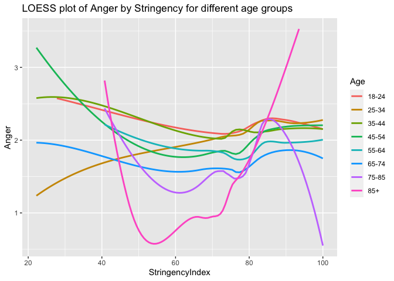
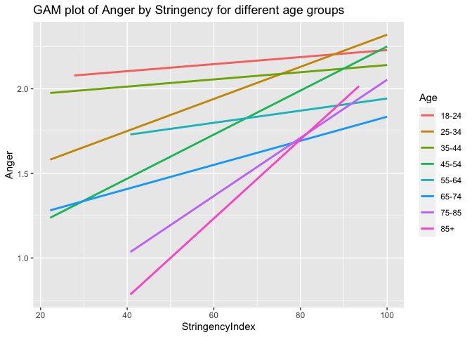
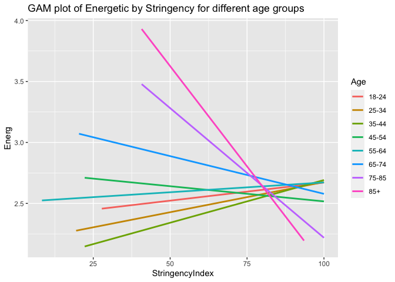
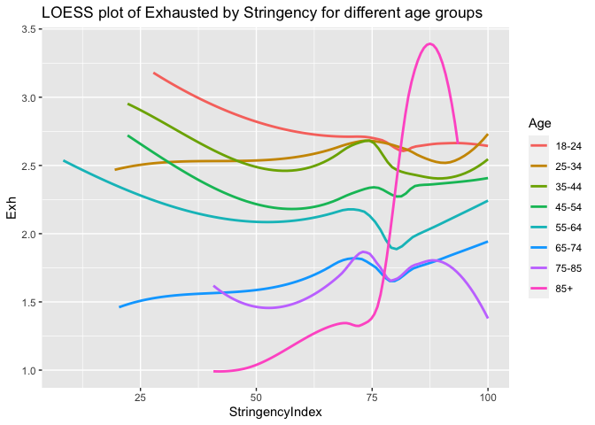
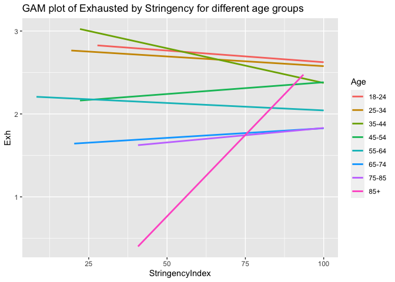
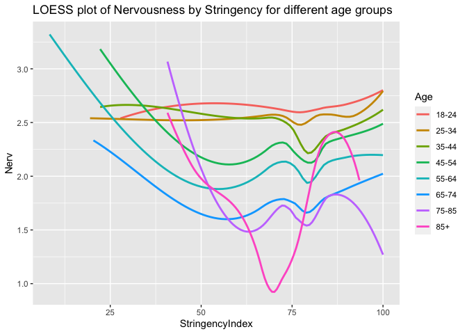
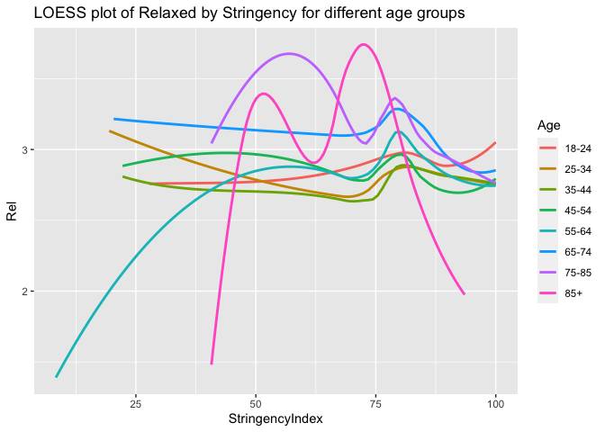
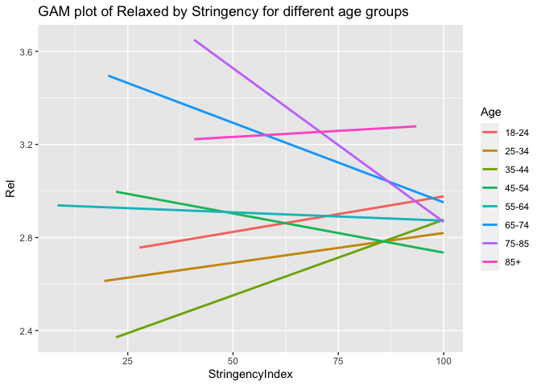

200617 Multilevel models emotions
================
Anne Margit
6/17/2020

    ## 
    ## Attaching package: 'dplyr'

    ## The following objects are masked from 'package:stats':
    ## 
    ##     filter, lag

    ## The following objects are masked from 'package:base':
    ## 
    ##     intersect, setdiff, setequal, union

    ## Loading required package: Matrix

    ## 
    ## Attaching package: 'lmerTest'

    ## The following object is masked from 'package:lme4':
    ## 
    ##     lmer

    ## The following object is masked from 'package:stats':
    ## 
    ##     step

    ## ── Attaching packages ──────────────────────────────────────────────────────────────────────────────────────────────────────────────────────────────────── tidyverse 1.3.0 ──

    ## ✓ tibble  3.0.1     ✓ purrr   0.3.4
    ## ✓ tidyr   1.1.0     ✓ stringr 1.4.0
    ## ✓ readr   1.3.1     ✓ forcats 0.5.0

    ## ── Conflicts ─────────────────────────────────────────────────────────────────────────────────────────────────────────────────────────────────────── tidyverse_conflicts() ──
    ## x tidyr::expand() masks Matrix::expand()
    ## x dplyr::filter() masks stats::filter()
    ## x dplyr::lag()    masks stats::lag()
    ## x tidyr::pack()   masks Matrix::pack()
    ## x tidyr::unpack() masks Matrix::unpack()

    ## 
    ## Attaching package: 'rockchalk'

    ## The following object is masked from 'package:dplyr':
    ## 
    ##     summarize

``` r
load("data_long_min3_strc2.Rdata")
```

# Anxiety

Multilevel anxiety random
intercept

``` r
model.anx0 <- lmer(Anxiety ~ 1 + (1 | Country/ID), data=data_long_min3_strc2, na.action=na.exclude)
summary(model.anx0)
```

    ## Linear mixed model fit by REML. t-tests use Satterthwaite's method [
    ## lmerModLmerTest]
    ## Formula: Anxiety ~ 1 + (1 | Country/ID)
    ##    Data: data_long_min3_strc2
    ## 
    ## REML criterion at convergence: 109721.6
    ## 
    ## Scaled residuals: 
    ##     Min      1Q  Median      3Q     Max 
    ## -3.8632 -0.5593 -0.1260  0.5538  4.1464 
    ## 
    ## Random effects:
    ##  Groups     Name        Variance Std.Dev.
    ##  ID:Country (Intercept) 0.76759  0.8761  
    ##  Country    (Intercept) 0.07799  0.2793  
    ##  Residual               0.58982  0.7680  
    ## Number of obs: 40040, groups:  ID:Country, 9202; Country, 78
    ## 
    ## Fixed effects:
    ##             Estimate Std. Error       df t value Pr(>|t|)    
    ## (Intercept)  2.51703    0.04453 62.80993   56.53   <2e-16 ***
    ## ---
    ## Signif. codes:  0 '***' 0.001 '**' 0.01 '*' 0.05 '.' 0.1 ' ' 1

Calculate variance accounted for by country

total variance 0.76735 + 0.07755 + 0.58988 = 1.43478 variance accounted
for by country: 0.07755 / 1.43478 = 0.0540501 between persons: 0.76735 /
1.43478 = 0.5348207 within persons: 0.58988 / 1.43478 = 0.4111292

Variance in anxiety explained by country is pretty low, equal variance
explained between and within persons

Two level models using uncentered
Stringency:

``` r
model.anx1 <- lmer(Anxiety ~ StringencyIndex + (1 | ID), data=data_long_min3_strc2, na.action=na.exclude)
summary(model.anx1)
```

    ## Linear mixed model fit by REML. t-tests use Satterthwaite's method [
    ## lmerModLmerTest]
    ## Formula: Anxiety ~ StringencyIndex + (1 | ID)
    ##    Data: data_long_min3_strc2
    ## 
    ## REML criterion at convergence: 110389.8
    ## 
    ## Scaled residuals: 
    ##     Min      1Q  Median      3Q     Max 
    ## -3.8966 -0.5582 -0.1130  0.5715  4.0604 
    ## 
    ## Random effects:
    ##  Groups   Name        Variance Std.Dev.
    ##  ID       (Intercept) 0.8555   0.9249  
    ##  Residual             0.5899   0.7681  
    ## Number of obs: 40005, groups:  ID, 9194
    ## 
    ## Fixed effects:
    ##                   Estimate Std. Error         df t value Pr(>|t|)    
    ## (Intercept)      2.480e+00  5.068e-02  3.849e+04  48.931   <2e-16 ***
    ## StringencyIndex -2.148e-04  6.284e-04  3.939e+04  -0.342    0.732    
    ## ---
    ## Signif. codes:  0 '***' 0.001 '**' 0.01 '*' 0.05 '.' 0.1 ' ' 1
    ## 
    ## Correlation of Fixed Effects:
    ##             (Intr)
    ## StrngncyInd -0.979

``` r
model.anx2 <- lmer(Anxiety ~ StringencyIndex + age + (1 | ID), data=data_long_min3_strc2, na.action=na.exclude)
summary(model.anx2)
```

    ## Linear mixed model fit by REML. t-tests use Satterthwaite's method [
    ## lmerModLmerTest]
    ## Formula: Anxiety ~ StringencyIndex + age + (1 | ID)
    ##    Data: data_long_min3_strc2
    ## 
    ## REML criterion at convergence: 109802.9
    ## 
    ## Scaled residuals: 
    ##     Min      1Q  Median      3Q     Max 
    ## -3.8956 -0.5688 -0.1367  0.5580  4.0398 
    ## 
    ## Random effects:
    ##  Groups   Name        Variance Std.Dev.
    ##  ID       (Intercept) 0.7913   0.8895  
    ##  Residual             0.5899   0.7680  
    ## Number of obs: 40005, groups:  ID, 9194
    ## 
    ## Fixed effects:
    ##                   Estimate Std. Error         df t value Pr(>|t|)    
    ## (Intercept)      2.810e+00  5.784e-02  3.111e+04  48.584  < 2e-16 ***
    ## StringencyIndex -9.492e-04  6.239e-04  3.912e+04  -1.521  0.12815    
    ## age2            -3.834e-02  3.581e-02  9.167e+03  -1.071  0.28436    
    ## age3            -1.546e-01  3.638e-02  9.185e+03  -4.249 2.17e-05 ***
    ## age4            -2.788e-01  3.665e-02  9.181e+03  -7.608 3.06e-14 ***
    ## age5            -4.675e-01  3.717e-02  9.160e+03 -12.575  < 2e-16 ***
    ## age6            -7.504e-01  3.994e-02  9.197e+03 -18.788  < 2e-16 ***
    ## age7            -8.940e-01  8.011e-02  9.051e+03 -11.159  < 2e-16 ***
    ## age8            -8.627e-01  3.071e-01  9.105e+03  -2.809  0.00498 ** 
    ## ---
    ## Signif. codes:  0 '***' 0.001 '**' 0.01 '*' 0.05 '.' 0.1 ' ' 1
    ## 
    ## Correlation of Fixed Effects:
    ##             (Intr) StrngI age2   age3   age4   age5   age6   age7  
    ## StrngncyInd -0.879                                                 
    ## age2        -0.404  0.040                                          
    ## age3        -0.408  0.052  0.588                                   
    ## age4        -0.405  0.051  0.584  0.575                            
    ## age5        -0.395  0.046  0.575  0.567  0.563                     
    ## age6        -0.379  0.055  0.536  0.528  0.525  0.517              
    ## age7        -0.198  0.038  0.268  0.264  0.262  0.258  0.241       
    ## age8        -0.058  0.017  0.070  0.069  0.069  0.068  0.063  0.032

``` r
model.anx3 <- lmer(Anxiety ~ StringencyIndex + age + StringencyIndex*age + (1 | ID), data=data_long_min3_strc2, na.action=na.exclude)
summary(model.anx3)
```

    ## Linear mixed model fit by REML. t-tests use Satterthwaite's method [
    ## lmerModLmerTest]
    ## Formula: Anxiety ~ StringencyIndex + age + StringencyIndex * age + (1 |  
    ##     ID)
    ##    Data: data_long_min3_strc2
    ## 
    ## REML criterion at convergence: 109844.6
    ## 
    ## Scaled residuals: 
    ##     Min      1Q  Median      3Q     Max 
    ## -3.8910 -0.5669 -0.1318  0.5590  4.0446 
    ## 
    ## Random effects:
    ##  Groups   Name        Variance Std.Dev.
    ##  ID       (Intercept) 0.7914   0.8896  
    ##  Residual             0.5895   0.7678  
    ## Number of obs: 40005, groups:  ID, 9194
    ## 
    ## Fixed effects:
    ##                        Estimate Std. Error         df t value Pr(>|t|)    
    ## (Intercept)           2.977e+00  1.276e-01  3.804e+04  23.322  < 2e-16 ***
    ## StringencyIndex      -2.992e-03  1.530e-03  3.914e+04  -1.956  0.05050 .  
    ## age2                  3.283e-02  1.686e-01  3.749e+04   0.195  0.84564    
    ## age3                 -7.611e-02  1.781e-01  3.787e+04  -0.427  0.66904    
    ## age4                 -5.222e-01  1.751e-01  3.878e+04  -2.982  0.00287 ** 
    ## age5                 -9.881e-01  1.805e-01  3.830e+04  -5.474 4.44e-08 ***
    ## age6                 -1.269e+00  1.907e-01  3.835e+04  -6.655 2.87e-11 ***
    ## age7                 -1.457e+00  4.559e-01  3.724e+04  -3.196  0.00140 ** 
    ## age8                 -4.581e-01  1.464e+00  3.018e+04  -0.313  0.75426    
    ## StringencyIndex:age2 -9.583e-04  2.048e-03  3.866e+04  -0.468  0.63987    
    ## StringencyIndex:age3 -1.080e-03  2.181e-03  3.890e+04  -0.495  0.62054    
    ## StringencyIndex:age4  3.024e-03  2.141e-03  3.960e+04   1.413  0.15779    
    ## StringencyIndex:age5  6.543e-03  2.207e-03  3.925e+04   2.965  0.00303 ** 
    ## StringencyIndex:age6  6.570e-03  2.348e-03  3.932e+04   2.798  0.00515 ** 
    ## StringencyIndex:age7  7.217e-03  5.831e-03  3.812e+04   1.238  0.21585    
    ## StringencyIndex:age8 -5.754e-03  1.953e-02  3.190e+04  -0.295  0.76825    
    ## ---
    ## Signif. codes:  0 '***' 0.001 '**' 0.01 '*' 0.05 '.' 0.1 ' ' 1

    ## 
    ## Correlation matrix not shown by default, as p = 16 > 12.
    ## Use print(x, correlation=TRUE)  or
    ##     vcov(x)        if you need it

plot anxiety and stringency for different age groups / LOESS plot
(doesn’t work well for large datasets? check
this)

``` r
plot_anx <- ggplot(data = data_long_min3_strc2, aes(x = StringencyIndex, y = Anxiety, group = ID, color = age))

plot_anx + stat_smooth(aes(group=age), se = FALSE, method = "loess", formula = y ~ x, size = 1, na.rm=TRUE) + scale_colour_discrete(name = "Age", 
labels = c("18-24", "25-34", "35-44", "45-54", "55-64", "65-74", "75-85", "85+")) + labs(title="LOESS plot of Anxiety by Stringency for different age groups")
```

<!-- -->
GAM
plot

``` r
plot_anx + stat_smooth(aes(group=age), se = FALSE, method = "gam", formula = y ~ x, size = 1, na.rm=TRUE) + scale_colour_discrete(name = "Age", 
labels = c("18-24", "25-34", "35-44", "45-54", "55-64", "65-74", "75-85", "85+")) + labs(title="GAM plot of Anxiety by Stringency for different age groups")
```

<!-- -->

# Anger

Multilevel anger random
intercept

``` r
model.ang0 <- lmer(Ang ~ 1 + (1 | Country/ID), data=data_long_min3_strc2, na.action=na.exclude)
summary(model.ang0)
```

    ## Linear mixed model fit by REML. t-tests use Satterthwaite's method [
    ## lmerModLmerTest]
    ## Formula: Ang ~ 1 + (1 | Country/ID)
    ##    Data: data_long_min3_strc2
    ## 
    ## REML criterion at convergence: 83475.6
    ## 
    ## Scaled residuals: 
    ##     Min      1Q  Median      3Q     Max 
    ## -3.9714 -0.4576 -0.1679  0.4939  4.2707 
    ## 
    ## Random effects:
    ##  Groups     Name        Variance Std.Dev.
    ##  ID:Country (Intercept) 0.68842  0.8297  
    ##  Country    (Intercept) 0.04261  0.2064  
    ##  Residual               0.54052  0.7352  
    ## Number of obs: 30859, groups:  ID:Country, 9200; Country, 78
    ## 
    ## Fixed effects:
    ##             Estimate Std. Error       df t value Pr(>|t|)    
    ## (Intercept)  2.09244    0.03542 47.84874   59.08   <2e-16 ***
    ## ---
    ## Signif. codes:  0 '***' 0.001 '**' 0.01 '*' 0.05 '.' 0.1 ' ' 1

Calculate variance accounted for by country

total variance 0.68842 + 0.04261 + 0.54052 = 1.27155 variance accounted
for by country: 0.04261 / 1.27155 = 0.03351028 between persons: 0.68842
/ 1.27155 = 0.5414022 within persons: 0.54052 / 1.27155 = 0.4250875

Variance in anger explained by country is pretty low, equal variance
explained between and within persons

Using two level models Predicted by
stringency

``` r
model.ang1 <- lmer(Ang ~ StringencyIndex + (1 | ID), data=data_long_min3_strc2, na.action=na.exclude)
summary(model.ang1)
```

    ## Linear mixed model fit by REML. t-tests use Satterthwaite's method [
    ## lmerModLmerTest]
    ## Formula: Ang ~ StringencyIndex + (1 | ID)
    ##    Data: data_long_min3_strc2
    ## 
    ## REML criterion at convergence: 83691.1
    ## 
    ## Scaled residuals: 
    ##     Min      1Q  Median      3Q     Max 
    ## -3.9771 -0.4627 -0.1845  0.4979  4.3777 
    ## 
    ## Random effects:
    ##  Groups   Name        Variance Std.Dev.
    ##  ID       (Intercept) 0.7221   0.8497  
    ##  Residual             0.5406   0.7353  
    ## Number of obs: 30832, groups:  ID, 9192
    ## 
    ## Fixed effects:
    ##                  Estimate Std. Error        df t value Pr(>|t|)    
    ## (Intercept)     1.649e+00  5.603e-02 2.943e+04  29.434  < 2e-16 ***
    ## StringencyIndex 4.447e-03  6.995e-04 2.992e+04   6.358 2.08e-10 ***
    ## ---
    ## Signif. codes:  0 '***' 0.001 '**' 0.01 '*' 0.05 '.' 0.1 ' ' 1
    ## 
    ## Correlation of Fixed Effects:
    ##             (Intr)
    ## StrngncyInd -0.984

``` r
model.ang2 <- lmer(Ang ~ StringencyIndex + age + (1 | ID), data=data_long_min3_strc2, na.action=na.exclude)
summary(model.ang2)
```

    ## Linear mixed model fit by REML. t-tests use Satterthwaite's method [
    ## lmerModLmerTest]
    ## Formula: Ang ~ StringencyIndex + age + (1 | ID)
    ##    Data: data_long_min3_strc2
    ## 
    ## REML criterion at convergence: 83431.1
    ## 
    ## Scaled residuals: 
    ##     Min      1Q  Median      3Q     Max 
    ## -3.9592 -0.4585 -0.1697  0.4807  4.3437 
    ## 
    ## Random effects:
    ##  Groups   Name        Variance Std.Dev.
    ##  ID       (Intercept) 0.6953   0.8339  
    ##  Residual             0.5405   0.7352  
    ## Number of obs: 30832, groups:  ID, 9192
    ## 
    ## Fixed effects:
    ##                   Estimate Std. Error         df t value Pr(>|t|)    
    ## (Intercept)      1.893e+00  6.293e-02  2.608e+04  30.089  < 2e-16 ***
    ## StringencyIndex  3.650e-03  6.983e-04  2.987e+04   5.227 1.74e-07 ***
    ## age2            -4.434e-02  3.468e-02  9.062e+03  -1.279   0.2010    
    ## age3            -7.552e-02  3.524e-02  9.087e+03  -2.143   0.0321 *  
    ## age4            -1.981e-01  3.550e-02  9.084e+03  -5.581 2.45e-08 ***
    ## age5            -3.083e-01  3.600e-02  9.057e+03  -8.563  < 2e-16 ***
    ## age6            -5.047e-01  3.871e-02  9.108e+03 -13.037  < 2e-16 ***
    ## age7            -5.360e-01  7.746e-02  8.886e+03  -6.920 4.85e-12 ***
    ## age8            -6.210e-01  2.968e-01  8.954e+03  -2.093   0.0364 *  
    ## ---
    ## Signif. codes:  0 '***' 0.001 '**' 0.01 '*' 0.05 '.' 0.1 ' ' 1
    ## 
    ## Correlation of Fixed Effects:
    ##             (Intr) StrngI age2   age3   age4   age5   age6   age7  
    ## StrngncyInd -0.905                                                 
    ## age2        -0.367  0.044                                          
    ## age3        -0.378  0.061  0.588                                   
    ## age4        -0.377  0.063  0.584  0.576                            
    ## age5        -0.373  0.063  0.576  0.568  0.564                     
    ## age6        -0.364  0.078  0.536  0.529  0.526  0.518              
    ## age7        -0.191  0.049  0.269  0.265  0.263  0.260  0.242       
    ## age8        -0.057  0.020  0.070  0.070  0.069  0.068  0.064  0.032

``` r
model.ang3 <- lmer(Ang ~ StringencyIndex + age + StringencyIndex*age + (1 | ID), data=data_long_min3_strc2, na.action=na.exclude)
summary(model.ang3)
```

    ## Linear mixed model fit by REML. t-tests use Satterthwaite's method [
    ## lmerModLmerTest]
    ## Formula: Ang ~ StringencyIndex + age + StringencyIndex * age + (1 | ID)
    ##    Data: data_long_min3_strc2
    ## 
    ## REML criterion at convergence: 83473.4
    ## 
    ## Scaled residuals: 
    ##     Min      1Q  Median      3Q     Max 
    ## -3.9735 -0.4589 -0.1715  0.4814  4.2376 
    ## 
    ## Random effects:
    ##  Groups   Name        Variance Std.Dev.
    ##  ID       (Intercept) 0.6947   0.8335  
    ##  Residual             0.5402   0.7350  
    ## Number of obs: 30832, groups:  ID, 9192
    ## 
    ## Fixed effects:
    ##                        Estimate Std. Error         df t value Pr(>|t|)    
    ## (Intercept)           2.061e+00  1.450e-01  2.893e+04  14.217  < 2e-16 ***
    ## StringencyIndex       1.591e-03  1.747e-03  2.951e+04   0.911 0.362461    
    ## age2                 -4.485e-01  1.917e-01  2.838e+04  -2.340 0.019306 *  
    ## age3                  1.472e-01  2.010e-01  2.887e+04   0.732 0.463880    
    ## age4                 -6.712e-01  1.989e-01  2.962e+04  -3.374 0.000742 ***
    ## age5                 -3.328e-01  1.995e-01  2.957e+04  -1.668 0.095275 .  
    ## age6                 -7.581e-01  2.088e-01  2.971e+04  -3.631 0.000283 ***
    ## age7                 -5.450e-01  4.739e-01  2.979e+04  -1.150 0.250148    
    ## age8                 -3.861e+00  1.420e+00  2.666e+04  -2.719 0.006546 ** 
    ## StringencyIndex:age2  5.034e-03  2.339e-03  2.897e+04   2.152 0.031370 *  
    ## StringencyIndex:age3 -2.919e-03  2.473e-03  2.940e+04  -1.180 0.237818    
    ## StringencyIndex:age4  5.952e-03  2.446e-03  3.009e+04   2.433 0.014980 *  
    ## StringencyIndex:age5  2.281e-04  2.454e-03  3.007e+04   0.093 0.925938    
    ## StringencyIndex:age6  3.165e-03  2.589e-03  3.022e+04   1.222 0.221555    
    ## StringencyIndex:age7 -2.942e-05  6.107e-03  3.018e+04  -0.005 0.996157    
    ## StringencyIndex:age8  4.421e-02  1.903e-02  2.783e+04   2.323 0.020189 *  
    ## ---
    ## Signif. codes:  0 '***' 0.001 '**' 0.01 '*' 0.05 '.' 0.1 ' ' 1

    ## 
    ## Correlation matrix not shown by default, as p = 16 > 12.
    ## Use print(x, correlation=TRUE)  or
    ##     vcov(x)        if you need it

LOESS plot anger and stringency for different age
groups

``` r
plot_ang <- ggplot(data = data_long_min3_strc2, aes(x = StringencyIndex, y = Ang, group = ID, color = age))

plot_ang + stat_smooth(aes(group=age), se = FALSE, method = "loess", formula = y ~ x, size = 1, na.rm=TRUE) + scale_colour_discrete(name = "Age", 
labels = c("18-24", "25-34", "35-44", "45-54", "55-64", "65-74", "75-85", "85+")) + labs(title="LOESS plot of Anger by Stringency for different age groups", y ="Anger")
```

<!-- -->
GAM
plot

``` r
plot_ang + stat_smooth(aes(group=age), se = FALSE, method = "gam", formula = y ~ x, size = 1, na.rm=TRUE) + scale_colour_discrete(name = "Age", 
labels = c("18-24", "25-34", "35-44", "45-54", "55-64", "65-74", "75-85", "85+")) + labs(title="GAM plot of Anger by Stringency for different age groups", y ="Anger")
```

<!-- -->

# Bored

Multilevel random
intercept

``` r
model.bor0 <- lmer(Bored ~ 1 + (1 | Country/ID), data=data_long_min3_strc2, na.action=na.exclude)
summary(model.bor0)
```

    ## Linear mixed model fit by REML. t-tests use Satterthwaite's method [
    ## lmerModLmerTest]
    ## Formula: Bored ~ 1 + (1 | Country/ID)
    ##    Data: data_long_min3_strc2
    ## 
    ## REML criterion at convergence: 71390.4
    ## 
    ## Scaled residuals: 
    ##     Min      1Q  Median      3Q     Max 
    ## -3.4207 -0.5316 -0.1869  0.5393  3.7506 
    ## 
    ## Random effects:
    ##  Groups     Name        Variance Std.Dev.
    ##  ID:Country (Intercept) 0.7841   0.8855  
    ##  Country    (Intercept) 0.1123   0.3351  
    ##  Residual               0.6517   0.8073  
    ## Number of obs: 24338, groups:  ID:Country, 9196; Country, 78
    ## 
    ## Fixed effects:
    ##             Estimate Std. Error       df t value Pr(>|t|)    
    ## (Intercept)  2.35694    0.05215 55.41077    45.2   <2e-16 ***
    ## ---
    ## Signif. codes:  0 '***' 0.001 '**' 0.01 '*' 0.05 '.' 0.1 ' ' 1

Calculate variance accounted for by country

total variance 0.7841 + 0.1123 + 0.6517 = 1.5481 variance accounted for
by country: 0.1123 / 1.5481 = 0.07254053 between persons: 0.7841 /
1.5481 = 0.5064918 within persons: 0.6517 / 1.5481 = 0.4209676

Variance in bored explained by country is pretty low, equal variance
explained between and within persons

Using two level models Predicted by
stringency

``` r
model.bor1 <- lmer(Bored ~ StringencyIndex + (1 | ID), data=data_long_min3_strc2, na.action=na.exclude)
summary(model.bor1)
```

    ## Linear mixed model fit by REML. t-tests use Satterthwaite's method [
    ## lmerModLmerTest]
    ## Formula: Bored ~ StringencyIndex + (1 | ID)
    ##    Data: data_long_min3_strc2
    ## 
    ## REML criterion at convergence: 71777.8
    ## 
    ## Scaled residuals: 
    ##     Min      1Q  Median      3Q     Max 
    ## -3.4353 -0.5238 -0.1757  0.5347  3.7166 
    ## 
    ## Random effects:
    ##  Groups   Name        Variance Std.Dev.
    ##  ID       (Intercept) 0.868    0.9317  
    ##  Residual             0.646    0.8037  
    ## Number of obs: 24319, groups:  ID, 9188
    ## 
    ## Fixed effects:
    ##                  Estimate Std. Error        df t value Pr(>|t|)    
    ## (Intercept)     1.687e+00  5.884e-02 2.430e+04   28.68   <2e-16 ***
    ## StringencyIndex 7.386e-03  7.424e-04 2.431e+04    9.95   <2e-16 ***
    ## ---
    ## Signif. codes:  0 '***' 0.001 '**' 0.01 '*' 0.05 '.' 0.1 ' ' 1
    ## 
    ## Correlation of Fixed Effects:
    ##             (Intr)
    ## StrngncyInd -0.982

``` r
model.bor2 <- lmer(Bored ~ StringencyIndex + age + (1 | ID), data=data_long_min3_strc2, na.action=na.exclude)
summary(model.bor2)
```

    ## Linear mixed model fit by REML. t-tests use Satterthwaite's method [
    ## lmerModLmerTest]
    ## Formula: Bored ~ StringencyIndex + age + (1 | ID)
    ##    Data: data_long_min3_strc2
    ## 
    ## REML criterion at convergence: 71334.4
    ## 
    ## Scaled residuals: 
    ##     Min      1Q  Median      3Q     Max 
    ## -3.4246 -0.5198 -0.1883  0.5335  3.7519 
    ## 
    ## Random effects:
    ##  Groups   Name        Variance Std.Dev.
    ##  ID       (Intercept) 0.8138   0.9021  
    ##  Residual             0.6451   0.8032  
    ## Number of obs: 24319, groups:  ID, 9188
    ## 
    ## Fixed effects:
    ##                   Estimate Std. Error         df t value Pr(>|t|)    
    ## (Intercept)      2.241e+00  6.624e-02  2.266e+04  33.835  < 2e-16 ***
    ## StringencyIndex  6.540e-03  7.366e-04  2.431e+04   8.879  < 2e-16 ***
    ## age2            -3.166e-01  3.953e-02  9.554e+03  -8.009 1.29e-15 ***
    ## age3            -4.739e-01  4.001e-02  9.437e+03 -11.845  < 2e-16 ***
    ## age4            -6.180e-01  4.007e-02  9.239e+03 -15.425  < 2e-16 ***
    ## age5            -6.805e-01  4.046e-02  9.096e+03 -16.821  < 2e-16 ***
    ## age6            -7.738e-01  4.307e-02  8.861e+03 -17.968  < 2e-16 ***
    ## age7            -7.874e-01  8.502e-02  8.263e+03  -9.261  < 2e-16 ***
    ## age8            -3.056e-01  3.226e-01  8.082e+03  -0.947    0.343    
    ## ---
    ## Signif. codes:  0 '***' 0.001 '**' 0.01 '*' 0.05 '.' 0.1 ' ' 1
    ## 
    ## Correlation of Fixed Effects:
    ##             (Intr) StrngI age2   age3   age4   age5   age6   age7  
    ## StrngncyInd -0.887                                                 
    ## age2        -0.389  0.038                                          
    ## age3        -0.392  0.045  0.591                                   
    ## age4        -0.392  0.046  0.590  0.583                            
    ## age5        -0.378  0.034  0.584  0.577  0.576                     
    ## age6        -0.366  0.044  0.549  0.543  0.542  0.536              
    ## age7        -0.195  0.033  0.279  0.275  0.275  0.272  0.256       
    ## age8        -0.058  0.016  0.074  0.073  0.073  0.072  0.068  0.035

``` r
model.bor3 <- lmer(Bored ~ StringencyIndex + age + StringencyIndex*age + (1 | ID), data=data_long_min3_strc2, na.action=na.exclude)
print(summary(model.bor3), digits=2)
```

    ## Linear mixed model fit by REML. t-tests use Satterthwaite's method [
    ## lmerModLmerTest]
    ## Formula: Bored ~ StringencyIndex + age + StringencyIndex * age + (1 |      ID)
    ##    Data: data_long_min3_strc2
    ## 
    ## REML criterion at convergence: 71379.9
    ## 
    ## Scaled residuals: 
    ##    Min     1Q Median     3Q    Max 
    ##  -3.42  -0.52  -0.18   0.54   3.75 
    ## 
    ## Random effects:
    ##  Groups   Name        Variance Std.Dev.
    ##  ID       (Intercept) 0.81     0.9     
    ##  Residual             0.65     0.8     
    ## Number of obs: 24319, groups:  ID, 9188
    ## 
    ## Fixed effects:
    ##                      Estimate Std. Error       df t value Pr(>|t|)    
    ## (Intercept)           2.4e+00    1.5e-01  2.4e+04    15.7   <2e-16 ***
    ## StringencyIndex       5.2e-03    1.8e-03  2.4e+04     2.8    0.005 ** 
    ## age2                 -1.8e-01    2.0e-01  2.4e+04    -0.9    0.361    
    ## age3                 -4.3e-01    2.1e-01  2.4e+04    -2.0    0.041 *  
    ## age4                 -9.3e-01    2.1e-01  2.4e+04    -4.5    6e-06 ***
    ## age5                 -7.0e-01    2.1e-01  2.4e+04    -3.4    7e-04 ***
    ## age6                 -1.4e+00    2.2e-01  2.4e+04    -6.3    2e-10 ***
    ## age7                 -9.8e-01    5.1e-01  2.4e+04    -1.9    0.055 .  
    ## age8                 -2.8e+00    1.6e+00  2.2e+04    -1.8    0.077 .  
    ## StringencyIndex:age2 -1.8e-03    2.5e-03  2.4e+04    -0.7    0.471    
    ## StringencyIndex:age3 -6.5e-04    2.6e-03  2.4e+04    -0.2    0.804    
    ## StringencyIndex:age4  4.0e-03    2.6e-03  2.4e+04     1.6    0.121    
    ## StringencyIndex:age5  2.6e-04    2.6e-03  2.4e+04     0.1    0.919    
    ## StringencyIndex:age6  7.9e-03    2.7e-03  2.4e+04     2.9    0.004 ** 
    ## StringencyIndex:age7  2.5e-03    6.6e-03  2.4e+04     0.4    0.709    
    ## StringencyIndex:age8  3.4e-02    2.1e-02  2.2e+04     1.6    0.109    
    ## ---
    ## Signif. codes:  0 '***' 0.001 '**' 0.01 '*' 0.05 '.' 0.1 ' ' 1

    ## 
    ## Correlation matrix not shown by default, as p = 16 > 12.
    ## Use print(summary(model.bor3), correlation=TRUE)  or
    ##     vcov(summary(model.bor3))        if you need it

LOESS plot boredom and stringency for different age groups / lot of
missing data in
Boredom

``` r
plot_bor <- ggplot(data = data_long_min3_strc2, aes(x = StringencyIndex, y = Bored, group = ID, color = age))

plot_bor + stat_smooth(aes(group=age), se = FALSE, method = "loess", formula = y ~ x, size = 1, na.rm=TRUE) + scale_colour_discrete(name = "Age", 
labels = c("18-24", "25-34", "35-44", "45-54", "55-64", "65-74", "75-85", "85+")) + labs(title="LOESS plot of Boredom by Stringency for different age groups", y ="Boredom")
```

<!-- -->
GAM
plot

``` r
plot_bor + stat_smooth(aes(group=age), se = FALSE, method = "gam", formula = y ~ x, size = 1, na.rm=TRUE) + scale_colour_discrete(name = "Age", 
labels = c("18-24", "25-34", "35-44", "45-54", "55-64", "65-74", "75-85", "85+")) + labs(title="GAM plot of Boredom by Stringency for different age groups", y ="Boredom")
```

<!-- -->

# Calm

Multilevel random
intercept

``` r
model.calm0 <- lmer(Calm ~ 1 + (1 | Country/ID), data=data_long_min3_strc2, na.action=na.exclude)
summary(model.calm0)
```

    ## Linear mixed model fit by REML. t-tests use Satterthwaite's method [
    ## lmerModLmerTest]
    ## Formula: Calm ~ 1 + (1 | Country/ID)
    ##    Data: data_long_min3_strc2
    ## 
    ## REML criterion at convergence: 102918.4
    ## 
    ## Scaled residuals: 
    ##     Min      1Q  Median      3Q     Max 
    ## -4.2465 -0.5749  0.0549  0.5869  3.6866 
    ## 
    ## Random effects:
    ##  Groups     Name        Variance Std.Dev.
    ##  ID:Country (Intercept) 0.56615  0.7524  
    ##  Country    (Intercept) 0.03436  0.1854  
    ##  Residual               0.51382  0.7168  
    ## Number of obs: 40042, groups:  ID:Country, 9205; Country, 78
    ## 
    ## Fixed effects:
    ##             Estimate Std. Error       df t value Pr(>|t|)    
    ## (Intercept)  3.06605    0.03174 47.73390   96.61   <2e-16 ***
    ## ---
    ## Signif. codes:  0 '***' 0.001 '**' 0.01 '*' 0.05 '.' 0.1 ' ' 1

Using two level models Predicted by
stringency

``` r
model.calm1 <- lmer(Calm ~ StringencyIndex + (1 | ID), data=data_long_min3_strc2, na.action=na.exclude)
summary(model.calm1)
```

    ## Linear mixed model fit by REML. t-tests use Satterthwaite's method [
    ## lmerModLmerTest]
    ## Formula: Calm ~ StringencyIndex + (1 | ID)
    ##    Data: data_long_min3_strc2
    ## 
    ## REML criterion at convergence: 103307.8
    ## 
    ## Scaled residuals: 
    ##     Min      1Q  Median      3Q     Max 
    ## -4.2319 -0.5828  0.0259  0.5940  3.6485 
    ## 
    ## Random effects:
    ##  Groups   Name        Variance Std.Dev.
    ##  ID       (Intercept) 0.6085   0.7800  
    ##  Residual             0.5138   0.7168  
    ## Number of obs: 40008, groups:  ID, 9197
    ## 
    ## Fixed effects:
    ##                  Estimate Std. Error        df t value Pr(>|t|)    
    ## (Intercept)     2.906e+00  4.600e-02 3.726e+04  63.183  < 2e-16 ***
    ## StringencyIndex 1.612e-03  5.717e-04 3.833e+04   2.819  0.00481 ** 
    ## ---
    ## Signif. codes:  0 '***' 0.001 '**' 0.01 '*' 0.05 '.' 0.1 ' ' 1
    ## 
    ## Correlation of Fixed Effects:
    ##             (Intr)
    ## StrngncyInd -0.981

``` r
model.calm2 <- lmer(Calm ~ StringencyIndex + age + (1 | ID), data=data_long_min3_strc2, na.action=na.exclude)
summary(model.calm2)
```

    ## Linear mixed model fit by REML. t-tests use Satterthwaite's method [
    ## lmerModLmerTest]
    ## Formula: Calm ~ StringencyIndex + age + (1 | ID)
    ##    Data: data_long_min3_strc2
    ## 
    ## REML criterion at convergence: 103125.3
    ## 
    ## Scaled residuals: 
    ##     Min      1Q  Median      3Q     Max 
    ## -4.2191 -0.5759  0.0299  0.5890  3.6736 
    ## 
    ## Random effects:
    ##  Groups   Name        Variance Std.Dev.
    ##  ID       (Intercept) 0.5920   0.7694  
    ##  Residual             0.5138   0.7168  
    ## Number of obs: 40008, groups:  ID, 9197
    ## 
    ## Fixed effects:
    ##                   Estimate Std. Error         df t value Pr(>|t|)    
    ## (Intercept)      2.831e+00  5.244e-02  3.048e+04  53.997  < 2e-16 ***
    ## StringencyIndex  1.871e-03  5.710e-04  3.827e+04   3.276 0.001055 ** 
    ## age2            -3.987e-02  3.137e-02  9.162e+03  -1.271 0.203846    
    ## age3            -6.221e-02  3.187e-02  9.182e+03  -1.952 0.051004 .  
    ## age4             4.011e-02  3.210e-02  9.180e+03   1.249 0.211621    
    ## age5             1.106e-01  3.255e-02  9.157e+03   3.397 0.000685 ***
    ## age6             3.222e-01  3.497e-02  9.186e+03   9.215  < 2e-16 ***
    ## age7             4.427e-01  7.017e-02  9.040e+03   6.308 2.95e-10 ***
    ## age8             4.415e-01  2.690e-01  9.098e+03   1.641 0.100742    
    ## ---
    ## Signif. codes:  0 '***' 0.001 '**' 0.01 '*' 0.05 '.' 0.1 ' ' 1
    ## 
    ## Correlation of Fixed Effects:
    ##             (Intr) StrngI age2   age3   age4   age5   age6   age7  
    ## StrngncyInd -0.887                                                 
    ## age2        -0.393  0.042                                          
    ## age3        -0.399  0.054  0.588                                   
    ## age4        -0.396  0.054  0.584  0.575                            
    ## age5        -0.386  0.048  0.576  0.567  0.563                     
    ## age6        -0.371  0.058  0.536  0.529  0.525  0.517              
    ## age7        -0.194  0.040  0.268  0.264  0.262  0.258  0.241       
    ## age8        -0.057  0.018  0.070  0.069  0.069  0.068  0.063  0.032

``` r
model.calm3 <- lmer(Calm ~ StringencyIndex + age + StringencyIndex*age + (1 | ID), data=data_long_min3_strc2, na.action=na.exclude)
print(summary(model.calm3), digits=2)
```

    ## Linear mixed model fit by REML. t-tests use Satterthwaite's method [
    ## lmerModLmerTest]
    ## Formula: Calm ~ StringencyIndex + age + StringencyIndex * age + (1 | ID)
    ##    Data: data_long_min3_strc2
    ## 
    ## REML criterion at convergence: 103173
    ## 
    ## Scaled residuals: 
    ##    Min     1Q Median     3Q    Max 
    ##  -4.22  -0.58   0.03   0.59   3.68 
    ## 
    ## Random effects:
    ##  Groups   Name        Variance Std.Dev.
    ##  ID       (Intercept) 0.59     0.77    
    ##  Residual             0.51     0.72    
    ## Number of obs: 40008, groups:  ID, 9197
    ## 
    ## Fixed effects:
    ##                      Estimate Std. Error       df t value Pr(>|t|)    
    ## (Intercept)           2.9e+00    1.2e-01  3.7e+04    25.3   <2e-16 ***
    ## StringencyIndex       4.2e-04    1.4e-03  3.8e+04     0.3    0.764    
    ## age2                 -2.7e-01    1.5e-01  3.6e+04    -1.7    0.084 .  
    ## age3                 -5.4e-01    1.6e-01  3.7e+04    -3.3    8e-04 ***
    ## age4                  1.4e-02    1.6e-01  3.8e+04     0.1    0.929    
    ## age5                  7.7e-03    1.6e-01  3.7e+04     0.0    0.963    
    ## age6                  4.8e-01    1.7e-01  3.7e+04     2.8    0.005 ** 
    ## age7                  1.0e+00    4.1e-01  3.6e+04     2.5    0.012 *  
    ## age8                  3.0e-01    1.3e+00  2.8e+04     0.2    0.818    
    ## StringencyIndex:age2  2.8e-03    1.9e-03  3.8e+04     1.5    0.134    
    ## StringencyIndex:age3  6.1e-03    2.0e-03  3.8e+04     3.0    0.002 ** 
    ## StringencyIndex:age4  2.7e-04    2.0e-03  3.9e+04     0.1    0.890    
    ## StringencyIndex:age5  1.3e-03    2.0e-03  3.8e+04     0.6    0.534    
    ## StringencyIndex:age6 -2.2e-03    2.2e-03  3.9e+04    -1.0    0.317    
    ## StringencyIndex:age7 -8.0e-03    5.3e-03  3.7e+04    -1.5    0.134    
    ## StringencyIndex:age8  1.7e-03    1.8e-02  3.0e+04     0.1    0.923    
    ## ---
    ## Signif. codes:  0 '***' 0.001 '**' 0.01 '*' 0.05 '.' 0.1 ' ' 1

    ## 
    ## Correlation matrix not shown by default, as p = 16 > 12.
    ## Use print(summary(model.calm3), correlation=TRUE)  or
    ##     vcov(summary(model.calm3))        if you need it

LOESS plot calm and stringency for different age groups / lot of missing
data in
Boredom

``` r
plot_calm <- ggplot(data = data_long_min3_strc2, aes(x = StringencyIndex, y = Calm, group = ID, color = age))

plot_calm + stat_smooth(aes(group=age), se = FALSE, method = "loess", formula = y ~ x, size = 1, na.rm=TRUE) + scale_colour_discrete(name = "Age", 
labels = c("18-24", "25-34", "35-44", "45-54", "55-64", "65-74", "75-85", "85+")) + labs(title="LOESS plot of Calm by Stringency for different age groups", y ="Calm")
```

<!-- -->

GAM
plot

``` r
plot_calm + stat_smooth(aes(group=age), se = FALSE, method = "gam", formula = y ~ x, size = 1) + scale_colour_discrete(name = "Age", 
labels = c("18-24", "25-34", "35-44", "45-54", "55-64", "65-74", "75-85", "85+")) + labs(title="GAM plot of Calm by Stringency for different age groups", y ="Calm")
```

    ## Warning: Removed 33632 rows containing non-finite values (stat_smooth).

<!-- -->

# Depressed

Multilevel depressed random
intercept

``` r
model.depr0 <- lmer(Depr ~ 1 + (1 | Country/ID), data=data_long_min3_strc2, na.action=na.exclude)
summary(model.depr0)
```

    ## Linear mixed model fit by REML. t-tests use Satterthwaite's method [
    ## lmerModLmerTest]
    ## Formula: Depr ~ 1 + (1 | Country/ID)
    ##    Data: data_long_min3_strc2
    ## 
    ## REML criterion at convergence: 104632.7
    ## 
    ## Scaled residuals: 
    ##     Min      1Q  Median      3Q     Max 
    ## -3.8734 -0.5138 -0.1597  0.5188  4.7407 
    ## 
    ## Random effects:
    ##  Groups     Name        Variance Std.Dev.
    ##  ID:Country (Intercept) 0.73550  0.8576  
    ##  Country    (Intercept) 0.04277  0.2068  
    ##  Residual               0.51030  0.7144  
    ## Number of obs: 40013, groups:  ID:Country, 9202; Country, 78
    ## 
    ## Fixed effects:
    ##             Estimate Std. Error      df t value Pr(>|t|)    
    ## (Intercept)   2.1002     0.0354 37.7164   59.33   <2e-16 ***
    ## ---
    ## Signif. codes:  0 '***' 0.001 '**' 0.01 '*' 0.05 '.' 0.1 ' ' 1

Using two level models Predicted by
stringency

``` r
model.depr1 <- lmer(Depr ~ StringencyIndex + (1 | ID), data=data_long_min3_strc2, na.action=na.exclude)
summary(model.depr1)
```

    ## Linear mixed model fit by REML. t-tests use Satterthwaite's method [
    ## lmerModLmerTest]
    ## Formula: Depr ~ StringencyIndex + (1 | ID)
    ##    Data: data_long_min3_strc2
    ## 
    ## REML criterion at convergence: 104762.1
    ## 
    ## Scaled residuals: 
    ##     Min      1Q  Median      3Q     Max 
    ## -3.8814 -0.5128 -0.1728  0.4976  4.7284 
    ## 
    ## Random effects:
    ##  Groups   Name        Variance Std.Dev.
    ##  ID       (Intercept) 0.7640   0.8741  
    ##  Residual             0.5101   0.7142  
    ## Number of obs: 39979, groups:  ID, 9194
    ## 
    ## Fixed effects:
    ##                  Estimate Std. Error        df t value Pr(>|t|)    
    ## (Intercept)     1.891e+00  4.735e-02 3.862e+04  39.928  < 2e-16 ***
    ## StringencyIndex 2.157e-03  5.869e-04 3.948e+04   3.676 0.000237 ***
    ## ---
    ## Signif. codes:  0 '***' 0.001 '**' 0.01 '*' 0.05 '.' 0.1 ' ' 1
    ## 
    ## Correlation of Fixed Effects:
    ##             (Intr)
    ## StrngncyInd -0.978

``` r
model.depr2 <- lmer(Depr ~ StringencyIndex + age + (1 | ID), data=data_long_min3_strc2, na.action=na.exclude)
summary(model.depr2)
```

    ## Linear mixed model fit by REML. t-tests use Satterthwaite's method [
    ## lmerModLmerTest]
    ## Formula: Depr ~ StringencyIndex + age + (1 | ID)
    ##    Data: data_long_min3_strc2
    ## 
    ## REML criterion at convergence: 104272.8
    ## 
    ## Scaled residuals: 
    ##     Min      1Q  Median      3Q     Max 
    ## -3.8850 -0.5187 -0.1487  0.5166  4.7077 
    ## 
    ## Random effects:
    ##  Groups   Name        Variance Std.Dev.
    ##  ID       (Intercept) 0.7152   0.8457  
    ##  Residual             0.5101   0.7142  
    ## Number of obs: 39979, groups:  ID, 9194
    ## 
    ## Fixed effects:
    ##                   Estimate Std. Error         df t value Pr(>|t|)    
    ## (Intercept)      2.291e+00  5.427e-02  3.123e+04  42.216  < 2e-16 ***
    ## StringencyIndex  1.361e-03  5.836e-04  3.929e+04   2.333  0.01967 *  
    ## age2            -1.739e-01  3.393e-02  9.145e+03  -5.124 3.06e-07 ***
    ## age3            -2.865e-01  3.447e-02  9.164e+03  -8.312  < 2e-16 ***
    ## age4            -3.544e-01  3.472e-02  9.159e+03 -10.208  < 2e-16 ***
    ## age5            -4.891e-01  3.522e-02  9.140e+03 -13.884  < 2e-16 ***
    ## age6            -7.429e-01  3.785e-02  9.177e+03 -19.628  < 2e-16 ***
    ## age7            -7.895e-01  7.597e-02  9.054e+03 -10.393  < 2e-16 ***
    ## age8            -8.724e-01  2.910e-01  9.085e+03  -2.998  0.00273 ** 
    ## ---
    ## Signif. codes:  0 '***' 0.001 '**' 0.01 '*' 0.05 '.' 0.1 ' ' 1
    ## 
    ## Correlation of Fixed Effects:
    ##             (Intr) StrngI age2   age3   age4   age5   age6   age7  
    ## StrngncyInd -0.876                                                 
    ## age2        -0.407  0.039                                          
    ## age3        -0.411  0.051  0.588                                   
    ## age4        -0.408  0.051  0.584  0.575                            
    ## age5        -0.398  0.045  0.575  0.567  0.563                     
    ## age6        -0.382  0.055  0.536  0.528  0.524  0.517              
    ## age7        -0.199  0.037  0.267  0.264  0.262  0.258  0.240       
    ## age8        -0.058  0.016  0.070  0.069  0.069  0.068  0.063  0.032

``` r
model.depr3 <- lmer(Depr ~ StringencyIndex + age + StringencyIndex*age + (1 | ID), data=data_long_min3_strc2, na.action=na.exclude)
print(summary(model.depr3), digits=2)
```

    ## Linear mixed model fit by REML. t-tests use Satterthwaite's method [
    ## lmerModLmerTest]
    ## Formula: Depr ~ StringencyIndex + age + StringencyIndex * age + (1 | ID)
    ##    Data: data_long_min3_strc2
    ## 
    ## REML criterion at convergence: 104332.7
    ## 
    ## Scaled residuals: 
    ##    Min     1Q Median     3Q    Max 
    ##  -3.89  -0.52  -0.15   0.52   4.72 
    ## 
    ## Random effects:
    ##  Groups   Name        Variance Std.Dev.
    ##  ID       (Intercept) 0.71     0.85    
    ##  Residual             0.51     0.71    
    ## Number of obs: 39979, groups:  ID, 9194
    ## 
    ## Fixed effects:
    ##                      Estimate Std. Error       df t value Pr(>|t|)    
    ## (Intercept)           2.2e+00    1.2e-01  3.8e+04    18.3   <2e-16 ***
    ## StringencyIndex       2.7e-03    1.4e-03  3.9e+04     1.9     0.06 .  
    ## age2                  6.8e-02    1.6e-01  3.8e+04     0.4     0.67    
    ## age3                 -1.9e-02    1.7e-01  3.8e+04    -0.1     0.91    
    ## age4                 -2.7e-01    1.6e-01  3.9e+04    -1.7     0.09 .  
    ## age5                 -4.0e-01    1.7e-01  3.8e+04    -2.4     0.02 *  
    ## age6                 -8.5e-01    1.8e-01  3.9e+04    -4.8    2e-06 ***
    ## age7                 -6.6e-01    4.3e-01  3.7e+04    -1.5     0.12    
    ## age8                 -2.6e+00    1.4e+00  3.1e+04    -1.9     0.06 .  
    ## StringencyIndex:age2 -3.0e-03    1.9e-03  3.9e+04    -1.6     0.12    
    ## StringencyIndex:age3 -3.4e-03    2.0e-03  3.9e+04    -1.6     0.10 .  
    ## StringencyIndex:age4 -9.8e-04    2.0e-03  4.0e+04    -0.5     0.62    
    ## StringencyIndex:age5 -1.1e-03    2.1e-03  3.9e+04    -0.5     0.59    
    ## StringencyIndex:age6  1.5e-03    2.2e-03  3.9e+04     0.7     0.51    
    ## StringencyIndex:age7 -1.6e-03    5.5e-03  3.8e+04    -0.3     0.77    
    ## StringencyIndex:age8  2.3e-02    1.8e-02  3.2e+04     1.3     0.21    
    ## ---
    ## Signif. codes:  0 '***' 0.001 '**' 0.01 '*' 0.05 '.' 0.1 ' ' 1

    ## 
    ## Correlation matrix not shown by default, as p = 16 > 12.
    ## Use print(summary(model.depr3), correlation=TRUE)  or
    ##     vcov(summary(model.depr3))        if you need it

LOESS plot depressed and stringency for different age
groups

``` r
plot_depr <- ggplot(data = data_long_min3_strc2, aes(x = StringencyIndex, y = Depr, group = ID, color = age))

plot_depr + stat_smooth(aes(group=age), se = FALSE, method = "loess", formula = y ~ x, size = 1, na.rm=TRUE) + scale_colour_discrete(name = "Age", 
labels = c("18-24", "25-34", "35-44", "45-54", "55-64", "65-74", "75-85", "85+")) + labs(title="LOESS plot of Depressed by Stringency for different age groups", y ="Depr")
```

<!-- -->
GAM
plot

``` r
plot_depr + stat_smooth(aes(group=age), se = FALSE, method = "gam", formula = y ~ x, size = 1, na.rm=TRUE) + scale_colour_discrete(name = "Age", 
labels = c("18-24", "25-34", "35-44", "45-54", "55-64", "65-74", "75-85", "85+")) + labs(title="GAM plot of Depressed by Stringency for different age groups", y ="Depr")
```

<!-- -->

# Energetic

Multilevel random
intercept

``` r
model.energ0 <- lmer(Energ ~ 1 + (1 | Country/ID), data=data_long_min3_strc2, na.action=na.exclude)
summary(model.energ0)
```

    ## Linear mixed model fit by REML. t-tests use Satterthwaite's method [
    ## lmerModLmerTest]
    ## Formula: Energ ~ 1 + (1 | Country/ID)
    ##    Data: data_long_min3_strc2
    ## 
    ## REML criterion at convergence: 102782.7
    ## 
    ## Scaled residuals: 
    ##     Min      1Q  Median      3Q     Max 
    ## -4.1920 -0.5799  0.0155  0.5798  4.1266 
    ## 
    ## Random effects:
    ##  Groups     Name        Variance Std.Dev.
    ##  ID:Country (Intercept) 0.53329  0.7303  
    ##  Country    (Intercept) 0.05774  0.2403  
    ##  Residual               0.52037  0.7214  
    ## Number of obs: 39992, groups:  ID:Country, 9204; Country, 78
    ## 
    ## Fixed effects:
    ##             Estimate Std. Error       df t value Pr(>|t|)    
    ## (Intercept)  2.66032    0.03824 59.13647   69.58   <2e-16 ***
    ## ---
    ## Signif. codes:  0 '***' 0.001 '**' 0.01 '*' 0.05 '.' 0.1 ' ' 1

Using two level models Predicted by
stringency

``` r
model.energ1 <- lmer(Energ ~ StringencyIndex + (1 | ID), data=data_long_min3_strc2, na.action=na.exclude)
summary(model.energ1)
```

    ## Linear mixed model fit by REML. t-tests use Satterthwaite's method [
    ## lmerModLmerTest]
    ## Formula: Energ ~ StringencyIndex + (1 | ID)
    ##    Data: data_long_min3_strc2
    ## 
    ## REML criterion at convergence: 103762.1
    ## 
    ## Scaled residuals: 
    ##     Min      1Q  Median      3Q     Max 
    ## -4.1187 -0.5569  0.0681  0.5755  4.0150 
    ## 
    ## Random effects:
    ##  Groups   Name        Variance Std.Dev.
    ##  ID       (Intercept) 0.6213   0.7882  
    ##  Residual             0.5205   0.7214  
    ## Number of obs: 39958, groups:  ID, 9196
    ## 
    ## Fixed effects:
    ##                  Estimate Std. Error        df t value Pr(>|t|)    
    ## (Intercept)     2.583e+00  4.639e-02 3.727e+04  55.676   <2e-16 ***
    ## StringencyIndex 2.269e-04  5.765e-04 3.833e+04   0.394    0.694    
    ## ---
    ## Signif. codes:  0 '***' 0.001 '**' 0.01 '*' 0.05 '.' 0.1 ' ' 1
    ## 
    ## Correlation of Fixed Effects:
    ##             (Intr)
    ## StrngncyInd -0.981

``` r
model.energ2 <- lmer(Energ ~ StringencyIndex + age + (1 | ID), data=data_long_min3_strc2, na.action=na.exclude)
summary(model.energ2)
```

    ## Linear mixed model fit by REML. t-tests use Satterthwaite's method [
    ## lmerModLmerTest]
    ## Formula: Energ ~ StringencyIndex + age + (1 | ID)
    ##    Data: data_long_min3_strc2
    ## 
    ## REML criterion at convergence: 103758.6
    ## 
    ## Scaled residuals: 
    ##     Min      1Q  Median      3Q     Max 
    ## -4.1376 -0.5754  0.0641  0.5718  4.0227 
    ## 
    ## Random effects:
    ##  Groups   Name        Variance Std.Dev.
    ##  ID       (Intercept) 0.6189   0.7867  
    ##  Residual             0.5205   0.7214  
    ## Number of obs: 39958, groups:  ID, 9196
    ## 
    ## Fixed effects:
    ##                   Estimate Std. Error         df t value Pr(>|t|)    
    ## (Intercept)      2.594e+00  5.313e-02  3.061e+04  48.821   <2e-16 ***
    ## StringencyIndex  2.676e-04  5.777e-04  3.842e+04   0.463   0.6432    
    ## age2            -4.805e-02  3.199e-02  9.177e+03  -1.502   0.1331    
    ## age3            -7.460e-02  3.250e-02  9.198e+03  -2.295   0.0217 *  
    ## age4            -4.061e-02  3.274e-02  9.196e+03  -1.240   0.2149    
    ## age5             1.604e-02  3.320e-02  9.174e+03   0.483   0.6290    
    ## age6             8.933e-02  3.568e-02  9.211e+03   2.504   0.0123 *  
    ## age7             1.063e-01  7.162e-02  9.083e+03   1.485   0.1377    
    ## age8             2.031e-01  2.743e-01  9.113e+03   0.740   0.4590    
    ## ---
    ## Signif. codes:  0 '***' 0.001 '**' 0.01 '*' 0.05 '.' 0.1 ' ' 1
    ## 
    ## Correlation of Fixed Effects:
    ##             (Intr) StrngI age2   age3   age4   age5   age6   age7  
    ## StrngncyInd -0.886                                                 
    ## age2        -0.395  0.041                                          
    ## age3        -0.400  0.054  0.588                                   
    ## age4        -0.397  0.053  0.584  0.575                            
    ## age5        -0.387  0.047  0.575  0.567  0.563                     
    ## age6        -0.372  0.057  0.536  0.528  0.525  0.517              
    ## age7        -0.195  0.040  0.267  0.264  0.262  0.258  0.241       
    ## age8        -0.057  0.017  0.070  0.069  0.069  0.068  0.063  0.032

``` r
model.energ3 <- lmer(Energ ~ StringencyIndex + age + StringencyIndex*age + (1 | ID), data=data_long_min3_strc2, na.action=na.exclude)
print(summary(model.energ3), digits=2)
```

    ## Linear mixed model fit by REML. t-tests use Satterthwaite's method [
    ## lmerModLmerTest]
    ## Formula: Energ ~ StringencyIndex + age + StringencyIndex * age + (1 |      ID)
    ##    Data: data_long_min3_strc2
    ## 
    ## REML criterion at convergence: 103798.6
    ## 
    ## Scaled residuals: 
    ##    Min     1Q Median     3Q    Max 
    ##  -4.14  -0.57   0.06   0.58   4.03 
    ## 
    ## Random effects:
    ##  Groups   Name        Variance Std.Dev.
    ##  ID       (Intercept) 0.62     0.79    
    ##  Residual             0.52     0.72    
    ## Number of obs: 39958, groups:  ID, 9196
    ## 
    ## Fixed effects:
    ##                      Estimate Std. Error       df t value Pr(>|t|)    
    ## (Intercept)           2.5e+00    1.2e-01  3.7e+04    21.5   <2e-16 ***
    ## StringencyIndex       1.0e-03    1.4e-03  3.8e+04     0.7    0.465    
    ## age2                 -2.1e-01    1.6e-01  3.7e+04    -1.3    0.181    
    ## age3                 -2.4e-01    1.6e-01  3.7e+04    -1.5    0.141    
    ## age4                  7.0e-02    1.6e-01  3.8e+04     0.4    0.666    
    ## age5                  2.4e-01    1.7e-01  3.8e+04     1.4    0.150    
    ## age6                  5.1e-01    1.8e-01  3.8e+04     2.9    0.004 ** 
    ## age7                  1.4e+00    4.2e-01  3.6e+04     3.4    7e-04 ***
    ## age8                  8.2e-01    1.3e+00  2.9e+04     0.6    0.541    
    ## StringencyIndex:age2  2.0e-03    1.9e-03  3.8e+04     1.1    0.280    
    ## StringencyIndex:age3  2.2e-03    2.0e-03  3.8e+04     1.1    0.283    
    ## StringencyIndex:age4 -1.4e-03    2.0e-03  3.9e+04    -0.7    0.487    
    ## StringencyIndex:age5 -2.8e-03    2.0e-03  3.9e+04    -1.4    0.168    
    ## StringencyIndex:age6 -5.3e-03    2.2e-03  3.9e+04    -2.5    0.014 *  
    ## StringencyIndex:age7 -1.7e-02    5.4e-03  3.7e+04    -3.2    0.001 ** 
    ## StringencyIndex:age8 -8.3e-03    1.8e-02  3.0e+04    -0.5    0.642    
    ## ---
    ## Signif. codes:  0 '***' 0.001 '**' 0.01 '*' 0.05 '.' 0.1 ' ' 1

    ## 
    ## Correlation matrix not shown by default, as p = 16 > 12.
    ## Use print(summary(model.energ3), correlation=TRUE)  or
    ##     vcov(summary(model.energ3))        if you need it

LOESS plot energetic and stringency for different age
groups

``` r
plot_energ <- ggplot(data = data_long_min3_strc2, aes(x = StringencyIndex, y = Energ, group = ID, color = age))

plot_energ + stat_smooth(aes(group=age), se = FALSE, method = "loess", formula = y ~ x, size = 1, na.rm=TRUE) + scale_colour_discrete(name = "Age", 
labels = c("18-24", "25-34", "35-44", "45-54", "55-64", "65-74", "75-85", "85+")) + labs(title="LOESS plot of Energetic by Stringency for different age groups", y ="Energ")
```

<!-- -->
GAM
plot

``` r
plot_energ + stat_smooth(aes(group=age), se = FALSE, method = "gam", formula = y ~ x, size = 1, na.rm=TRUE) + scale_colour_discrete(name = "Age", 
labels = c("18-24", "25-34", "35-44", "45-54", "55-64", "65-74", "75-85", "85+")) + labs(title="GAM plot of Energetic by Stringency for different age groups", y ="Energ")
```

<!-- -->

# Exhausted

Multilevel random
intercept

``` r
model.exh0 <- lmer(Exh ~ 1 + (1 | Country/ID), data=data_long_min3_strc2, na.action=na.exclude)
summary(model.exh0)
```

    ## Linear mixed model fit by REML. t-tests use Satterthwaite's method [
    ## lmerModLmerTest]
    ## Formula: Exh ~ 1 + (1 | Country/ID)
    ##    Data: data_long_min3_strc2
    ## 
    ## REML criterion at convergence: 112513.3
    ## 
    ## Scaled residuals: 
    ##     Min      1Q  Median      3Q     Max 
    ## -3.9943 -0.5706 -0.1529  0.5807  3.8388 
    ## 
    ## Random effects:
    ##  Groups     Name        Variance Std.Dev.
    ##  ID:Country (Intercept) 0.75385  0.8682  
    ##  Country    (Intercept) 0.05456  0.2336  
    ##  Residual               0.64826  0.8051  
    ## Number of obs: 39996, groups:  ID:Country, 9201; Country, 78
    ## 
    ## Fixed effects:
    ##             Estimate Std. Error       df t value Pr(>|t|)    
    ## (Intercept)  2.43769    0.03904 47.16887   62.45   <2e-16 ***
    ## ---
    ## Signif. codes:  0 '***' 0.001 '**' 0.01 '*' 0.05 '.' 0.1 ' ' 1

Using two level models Predicted by
stringency

``` r
model.exh1 <- lmer(Exh ~ StringencyIndex + (1 | ID), data=data_long_min3_strc2, na.action=na.exclude)
summary(model.exh1)
```

    ## Linear mixed model fit by REML. t-tests use Satterthwaite's method [
    ## lmerModLmerTest]
    ## Formula: Exh ~ StringencyIndex + (1 | ID)
    ##    Data: data_long_min3_strc2
    ## 
    ## REML criterion at convergence: 112716
    ## 
    ## Scaled residuals: 
    ##     Min      1Q  Median      3Q     Max 
    ## -3.9883 -0.5673 -0.1544  0.5759  3.8747 
    ## 
    ## Random effects:
    ##  Groups   Name        Variance Std.Dev.
    ##  ID       (Intercept) 0.7906   0.8891  
    ##  Residual             0.6484   0.8053  
    ## Number of obs: 39962, groups:  ID, 9193
    ## 
    ## Fixed effects:
    ##                  Estimate Std. Error        df t value Pr(>|t|)    
    ## (Intercept)     2.350e+00  5.192e-02 3.742e+04  45.266   <2e-16 ***
    ## StringencyIndex 1.331e-04  6.451e-04 3.846e+04   0.206    0.837    
    ## ---
    ## Signif. codes:  0 '***' 0.001 '**' 0.01 '*' 0.05 '.' 0.1 ' ' 1
    ## 
    ## Correlation of Fixed Effects:
    ##             (Intr)
    ## StrngncyInd -0.981

``` r
model.exh2 <- lmer(Exh ~ StringencyIndex + age + (1 | ID), data=data_long_min3_strc2, na.action=na.exclude)
summary(model.exh2)
```

    ## Linear mixed model fit by REML. t-tests use Satterthwaite's method [
    ## lmerModLmerTest]
    ## Formula: Exh ~ StringencyIndex + age + (1 | ID)
    ##    Data: data_long_min3_strc2
    ## 
    ## REML criterion at convergence: 111761.4
    ## 
    ## Scaled residuals: 
    ##     Min      1Q  Median      3Q     Max 
    ## -3.9510 -0.5642 -0.1501  0.5854  3.8776 
    ## 
    ## Random effects:
    ##  Groups   Name        Variance Std.Dev.
    ##  ID       (Intercept) 0.6943   0.8332  
    ##  Residual             0.6485   0.8053  
    ## Number of obs: 39962, groups:  ID, 9193
    ## 
    ## Fixed effects:
    ##                   Estimate Std. Error         df t value Pr(>|t|)    
    ## (Intercept)      2.746e+00  5.812e-02  3.010e+04  47.243  < 2e-16 ***
    ## StringencyIndex -7.989e-04  6.358e-04  3.771e+04  -1.257 0.208903    
    ## age2            -5.221e-02  3.420e-02  9.159e+03  -1.527 0.126898    
    ## age3            -1.184e-01  3.475e-02  9.180e+03  -3.407 0.000659 ***
    ## age4            -3.565e-01  3.500e-02  9.178e+03 -10.186  < 2e-16 ***
    ## age5            -5.872e-01  3.550e-02  9.153e+03 -16.542  < 2e-16 ***
    ## age6            -9.020e-01  3.816e-02  9.198e+03 -23.640  < 2e-16 ***
    ## age7            -9.550e-01  7.654e-02  9.058e+03 -12.477  < 2e-16 ***
    ## age8            -9.842e-01  2.932e-01  9.095e+03  -3.357 0.000792 ***
    ## ---
    ## Signif. codes:  0 '***' 0.001 '**' 0.01 '*' 0.05 '.' 0.1 ' ' 1
    ## 
    ## Correlation of Fixed Effects:
    ##             (Intr) StrngI age2   age3   age4   age5   age6   age7  
    ## StrngncyInd -0.891                                                 
    ## age2        -0.388  0.043                                          
    ## age3        -0.394  0.055  0.588                                   
    ## age4        -0.391  0.055  0.584  0.575                            
    ## age5        -0.381  0.049  0.575  0.567  0.563                     
    ## age6        -0.367  0.059  0.536  0.528  0.524  0.517              
    ## age7        -0.193  0.041  0.268  0.264  0.262  0.258  0.241       
    ## age8        -0.057  0.018  0.070  0.069  0.069  0.068  0.063  0.032

``` r
model.exh3 <- lmer(Exh ~ StringencyIndex + age + StringencyIndex*age + (1 | ID), data=data_long_min3_strc2, na.action=na.exclude)
print(summary(model.exh3), digits=2)
```

    ## Linear mixed model fit by REML. t-tests use Satterthwaite's method [
    ## lmerModLmerTest]
    ## Formula: Exh ~ StringencyIndex + age + StringencyIndex * age + (1 | ID)
    ##    Data: data_long_min3_strc2
    ## 
    ## REML criterion at convergence: 111818.7
    ## 
    ## Scaled residuals: 
    ##    Min     1Q Median     3Q    Max 
    ##  -3.95  -0.57  -0.15   0.58   3.86 
    ## 
    ## Random effects:
    ##  Groups   Name        Variance Std.Dev.
    ##  ID       (Intercept) 0.69     0.83    
    ##  Residual             0.65     0.81    
    ## Number of obs: 39962, groups:  ID, 9193
    ## 
    ## Fixed effects:
    ##                      Estimate Std. Error       df t value Pr(>|t|)    
    ## (Intercept)           2.7e+00    1.3e-01  3.6e+04    21.0   <2e-16 ***
    ## StringencyIndex      -5.4e-04    1.6e-03  3.8e+04    -0.3    0.730    
    ## age2                 -1.4e-02    1.7e-01  3.6e+04    -0.1    0.934    
    ## age3                  1.3e-01    1.8e-01  3.6e+04     0.7    0.465    
    ## age4                 -5.0e-01    1.8e-01  3.8e+04    -2.8    0.005 ** 
    ## age5                 -5.0e-01    1.8e-01  3.7e+04    -2.7    0.006 ** 
    ## age6                 -9.9e-01    1.9e-01  3.7e+04    -5.1    3e-07 ***
    ## age7                 -1.1e+00    4.6e-01  3.5e+04    -2.4    0.019 *  
    ## age8                 -4.0e+00    1.5e+00  2.7e+04    -2.7    0.006 ** 
    ## StringencyIndex:age2 -4.7e-04    2.1e-03  3.7e+04    -0.2    0.820    
    ## StringencyIndex:age3 -3.2e-03    2.2e-03  3.7e+04    -1.4    0.152    
    ## StringencyIndex:age4  1.8e-03    2.2e-03  3.9e+04     0.8    0.403    
    ## StringencyIndex:age5 -1.1e-03    2.2e-03  3.8e+04    -0.5    0.635    
    ## StringencyIndex:age6  1.1e-03    2.4e-03  3.8e+04     0.5    0.638    
    ## StringencyIndex:age7  1.8e-03    6.0e-03  3.6e+04     0.3    0.763    
    ## StringencyIndex:age8  4.1e-02    2.0e-02  2.9e+04     2.1    0.035 *  
    ## ---
    ## Signif. codes:  0 '***' 0.001 '**' 0.01 '*' 0.05 '.' 0.1 ' ' 1

    ## 
    ## Correlation matrix not shown by default, as p = 16 > 12.
    ## Use print(summary(model.exh3), correlation=TRUE)  or
    ##     vcov(summary(model.exh3))        if you need it

LOESS plot exhausted and stringency for different age
groups

``` r
plot_exh <- ggplot(data = data_long_min3_strc2, aes(x = StringencyIndex, y = Exh, group = ID, color = age))

plot_exh + stat_smooth(aes(group=age), se = FALSE, method = "loess", formula = y ~ x, size = 1, na.rm=TRUE) + scale_colour_discrete(name = "Age", 
labels = c("18-24", "25-34", "35-44", "45-54", "55-64", "65-74", "75-85", "85+")) + labs(title="LOESS plot of Exhausted by Stringency for different age groups", y ="Exh")
```

<!-- -->
GAM
plot

``` r
plot_exh + stat_smooth(aes(group=age), se = FALSE, method = "gam", formula = y ~ x, size = 1, na.rm=TRUE) + scale_colour_discrete(name = "Age", 
labels = c("18-24", "25-34", "35-44", "45-54", "55-64", "65-74", "75-85", "85+")) + labs(title="GAM plot of Exhausted by Stringency for different age groups", y ="Exh")
```

<!-- -->

# Inspired

Multilevel random
intercept

``` r
model.insp0 <- lmer(Insp ~ 1 + (1 | Country/ID), data=data_long_min3_strc2, na.action=na.exclude)
summary(model.insp0)
```

    ## Linear mixed model fit by REML. t-tests use Satterthwaite's method [
    ## lmerModLmerTest]
    ## Formula: Insp ~ 1 + (1 | Country/ID)
    ##    Data: data_long_min3_strc2
    ## 
    ## REML criterion at convergence: 106864.6
    ## 
    ## Scaled residuals: 
    ##     Min      1Q  Median      3Q     Max 
    ## -3.7157 -0.5822 -0.0525  0.5903  3.8583 
    ## 
    ## Random effects:
    ##  Groups     Name        Variance Std.Dev.
    ##  ID:Country (Intercept) 0.60480  0.7777  
    ##  Country    (Intercept) 0.04819  0.2195  
    ##  Residual               0.57394  0.7576  
    ## Number of obs: 39979, groups:  ID:Country, 9204; Country, 78
    ## 
    ## Fixed effects:
    ##             Estimate Std. Error       df t value Pr(>|t|)    
    ## (Intercept)  2.52669    0.03631 55.19096   69.58   <2e-16 ***
    ## ---
    ## Signif. codes:  0 '***' 0.001 '**' 0.01 '*' 0.05 '.' 0.1 ' ' 1

Using two level models Predicted by
stringency

``` r
model.insp1 <- lmer(Insp ~ StringencyIndex + (1 | ID), data=data_long_min3_strc2, na.action=na.exclude)
summary(model.insp1)
```

    ## Linear mixed model fit by REML. t-tests use Satterthwaite's method [
    ## lmerModLmerTest]
    ## Formula: Insp ~ StringencyIndex + (1 | ID)
    ##    Data: data_long_min3_strc2
    ## 
    ## REML criterion at convergence: 107379.5
    ## 
    ## Scaled residuals: 
    ##     Min      1Q  Median      3Q     Max 
    ## -3.6988 -0.5682 -0.0857  0.5690  3.9043 
    ## 
    ## Random effects:
    ##  Groups   Name        Variance Std.Dev.
    ##  ID       (Intercept) 0.6598   0.8123  
    ##  Residual             0.5744   0.7579  
    ## Number of obs: 39945, groups:  ID, 9196
    ## 
    ## Fixed effects:
    ##                  Estimate Std. Error        df t value Pr(>|t|)    
    ## (Intercept)     2.382e+00  4.849e-02 3.697e+04  49.130   <2e-16 ***
    ## StringencyIndex 7.093e-04  6.028e-04 3.804e+04   1.177    0.239    
    ## ---
    ## Signif. codes:  0 '***' 0.001 '**' 0.01 '*' 0.05 '.' 0.1 ' ' 1
    ## 
    ## Correlation of Fixed Effects:
    ##             (Intr)
    ## StrngncyInd -0.981

``` r
model.insp2 <- lmer(Insp ~ StringencyIndex + age + (1 | ID), data=data_long_min3_strc2, na.action=na.exclude)
summary(model.insp2)
```

    ## Linear mixed model fit by REML. t-tests use Satterthwaite's method [
    ## lmerModLmerTest]
    ## Formula: Insp ~ StringencyIndex + age + (1 | ID)
    ##    Data: data_long_min3_strc2
    ## 
    ## REML criterion at convergence: 107402.4
    ## 
    ## Scaled residuals: 
    ##     Min      1Q  Median      3Q     Max 
    ## -3.7028 -0.5706 -0.0863  0.5697  3.9010 
    ## 
    ## Random effects:
    ##  Groups   Name        Variance Std.Dev.
    ##  ID       (Intercept) 0.6598   0.8123  
    ##  Residual             0.5744   0.7579  
    ## Number of obs: 39945, groups:  ID, 9196
    ## 
    ## Fixed effects:
    ##                   Estimate Std. Error         df t value Pr(>|t|)    
    ## (Intercept)      2.404e+00  5.547e-02  3.042e+04  43.337   <2e-16 ***
    ## StringencyIndex  6.657e-04  6.044e-04  3.817e+04   1.101    0.271    
    ## age2            -1.118e-02  3.313e-02  9.150e+03  -0.337    0.736    
    ## age3            -5.206e-02  3.366e-02  9.169e+03  -1.547    0.122    
    ## age4            -4.207e-02  3.390e-02  9.169e+03  -1.241    0.215    
    ## age5             5.670e-03  3.438e-02  9.148e+03   0.165    0.869    
    ## age6             8.662e-03  3.696e-02  9.190e+03   0.234    0.815    
    ## age7            -4.001e-02  7.421e-02  9.071e+03  -0.539    0.590    
    ## age8            -3.571e-01  2.840e-01  9.085e+03  -1.257    0.209    
    ## ---
    ## Signif. codes:  0 '***' 0.001 '**' 0.01 '*' 0.05 '.' 0.1 ' ' 1
    ## 
    ## Correlation of Fixed Effects:
    ##             (Intr) StrngI age2   age3   age4   age5   age6   age7  
    ## StrngncyInd -0.888                                                 
    ## age2        -0.393  0.042                                          
    ## age3        -0.398  0.054  0.588                                   
    ## age4        -0.395  0.054  0.584  0.575                            
    ## age5        -0.385  0.048  0.576  0.567  0.563                     
    ## age6        -0.370  0.058  0.536  0.528  0.524  0.517              
    ## age7        -0.194  0.040  0.267  0.264  0.262  0.258  0.241       
    ## age8        -0.057  0.018  0.070  0.069  0.069  0.068  0.063  0.032

``` r
model.insp3 <- lmer(Insp ~ StringencyIndex + age + StringencyIndex*age + (1 | ID), data=data_long_min3_strc2, na.action=na.exclude)
print(summary(model.insp3), digits=2)
```

    ## Linear mixed model fit by REML. t-tests use Satterthwaite's method [
    ## lmerModLmerTest]
    ## Formula: Insp ~ StringencyIndex + age + StringencyIndex * age + (1 | ID)
    ##    Data: data_long_min3_strc2
    ## 
    ## REML criterion at convergence: 107463.3
    ## 
    ## Scaled residuals: 
    ##    Min     1Q Median     3Q    Max 
    ##  -3.70  -0.57  -0.09   0.57   3.92 
    ## 
    ## Random effects:
    ##  Groups   Name        Variance Std.Dev.
    ##  ID       (Intercept) 0.66     0.81    
    ##  Residual             0.57     0.76    
    ## Number of obs: 39945, groups:  ID, 9196
    ## 
    ## Fixed effects:
    ##                      Estimate Std. Error       df t value Pr(>|t|)    
    ## (Intercept)           2.3e+00    1.2e-01  3.7e+04    18.8   <2e-16 ***
    ## StringencyIndex       1.7e-03    1.5e-03  3.8e+04     1.2     0.24    
    ## age2                 -5.7e-02    1.6e-01  3.6e+04    -0.4     0.72    
    ## age3                 -6.2e-02    1.7e-01  3.7e+04    -0.4     0.72    
    ## age4                  1.8e-01    1.7e-01  3.8e+04     1.1     0.29    
    ## age5                  1.1e-01    1.7e-01  3.7e+04     0.6     0.54    
    ## age6                  3.2e-01    1.8e-01  3.7e+04     1.7     0.09 .  
    ## age7                  4.0e-01    4.4e-01  3.6e+04     0.9     0.37    
    ## age8                  3.2e-01    1.4e+00  2.8e+04     0.2     0.82    
    ## StringencyIndex:age2  6.1e-04    2.0e-03  3.8e+04     0.3     0.76    
    ## StringencyIndex:age3  1.6e-04    2.1e-03  3.8e+04     0.1     0.94    
    ## StringencyIndex:age4 -2.8e-03    2.1e-03  3.9e+04    -1.3     0.18    
    ## StringencyIndex:age5 -1.3e-03    2.1e-03  3.8e+04    -0.6     0.56    
    ## StringencyIndex:age6 -3.9e-03    2.3e-03  3.8e+04    -1.7     0.09 .  
    ## StringencyIndex:age7 -5.6e-03    5.7e-03  3.7e+04    -1.0     0.32    
    ## StringencyIndex:age8 -9.2e-03    1.9e-02  3.0e+04    -0.5     0.62    
    ## ---
    ## Signif. codes:  0 '***' 0.001 '**' 0.01 '*' 0.05 '.' 0.1 ' ' 1

    ## 
    ## Correlation matrix not shown by default, as p = 16 > 12.
    ## Use print(summary(model.insp3), correlation=TRUE)  or
    ##     vcov(summary(model.insp3))        if you need it

LOESS plot inspired and stringency for different age
groups

``` r
plot_insp <- ggplot(data = data_long_min3_strc2, aes(x = StringencyIndex, y = Insp, group = ID, color = age))

plot_insp + stat_smooth(aes(group=age), se = FALSE, method = "loess", formula = y ~ x, size = 1, na.rm=TRUE) + scale_colour_discrete(name = "Age", 
labels = c("18-24", "25-34", "35-44", "45-54", "55-64", "65-74", "75-85", "85+")) + labs(title="LOESS plot of Inspired by Stringency for different age groups", y ="Insp")
```

<!-- -->
GAM
plot

``` r
plot_insp + stat_smooth(aes(group=age), se = FALSE, method = "gam", formula = y ~ x, size = 1, na.rm=TRUE) + scale_colour_discrete(name = "Age", 
labels = c("18-24", "25-34", "35-44", "45-54", "55-64", "65-74", "75-85", "85+")) + labs(title="GAM plot of Inspired by Stringency for different age groups", y ="Insp")
```

<!-- -->

# Loved

Multilevel random
intercept

``` r
model.lov0 <- lmer(Lov ~ 1 + (1 | Country/ID), data=data_long_min3_strc2, na.action=na.exclude)
summary(model.lov0)
```

    ## Linear mixed model fit by REML. t-tests use Satterthwaite's method [
    ## lmerModLmerTest]
    ## Formula: Lov ~ 1 + (1 | Country/ID)
    ##    Data: data_long_min3_strc2
    ## 
    ## REML criterion at convergence: 75460.8
    ## 
    ## Scaled residuals: 
    ##     Min      1Q  Median      3Q     Max 
    ## -5.5499 -0.4656  0.0696  0.4632  4.5259 
    ## 
    ## Random effects:
    ##  Groups     Name        Variance Std.Dev.
    ##  ID:Country (Intercept) 0.89658  0.9469  
    ##  Country    (Intercept) 0.05715  0.2391  
    ##  Residual               0.34954  0.5912  
    ## Number of obs: 30870, groups:  ID:Country, 9202; Country, 78
    ## 
    ## Fixed effects:
    ##             Estimate Std. Error       df t value Pr(>|t|)    
    ## (Intercept)  3.34271    0.04026 48.51913   83.03   <2e-16 ***
    ## ---
    ## Signif. codes:  0 '***' 0.001 '**' 0.01 '*' 0.05 '.' 0.1 ' ' 1

Using two level models Predicted by
stringency

``` r
model.lov1 <- lmer(Lov ~ StringencyIndex + (1 | ID), data=data_long_min3_strc2, na.action=na.exclude)
summary(model.lov1)
```

    ## Linear mixed model fit by REML. t-tests use Satterthwaite's method [
    ## lmerModLmerTest]
    ## Formula: Lov ~ StringencyIndex + (1 | ID)
    ##    Data: data_long_min3_strc2
    ## 
    ## REML criterion at convergence: 75707.3
    ## 
    ## Scaled residuals: 
    ##     Min      1Q  Median      3Q     Max 
    ## -5.5511 -0.4522  0.0846  0.4336  4.4985 
    ## 
    ## Random effects:
    ##  Groups   Name        Variance Std.Dev.
    ##  ID       (Intercept) 0.9432   0.9712  
    ##  Residual             0.3491   0.5908  
    ## Number of obs: 30843, groups:  ID, 9194
    ## 
    ## Fixed effects:
    ##                   Estimate Std. Error         df t value Pr(>|t|)    
    ## (Intercept)      3.477e+00  4.978e-02  3.082e+04  69.855   <2e-16 ***
    ## StringencyIndex -9.267e-04  6.165e-04  3.051e+04  -1.503    0.133    
    ## ---
    ## Signif. codes:  0 '***' 0.001 '**' 0.01 '*' 0.05 '.' 0.1 ' ' 1
    ## 
    ## Correlation of Fixed Effects:
    ##             (Intr)
    ## StrngncyInd -0.976

``` r
model.lov2 <- lmer(Lov ~ StringencyIndex + age + (1 | ID), data=data_long_min3_strc2, na.action=na.exclude)
summary(model.lov2)
```

    ## Linear mixed model fit by REML. t-tests use Satterthwaite's method [
    ## lmerModLmerTest]
    ## Formula: Lov ~ StringencyIndex + age + (1 | ID)
    ##    Data: data_long_min3_strc2
    ## 
    ## REML criterion at convergence: 75720.7
    ## 
    ## Scaled residuals: 
    ##     Min      1Q  Median      3Q     Max 
    ## -5.5541 -0.4525  0.0811  0.4398  4.4947 
    ## 
    ## Random effects:
    ##  Groups   Name        Variance Std.Dev.
    ##  ID       (Intercept) 0.9422   0.9707  
    ##  Residual             0.3491   0.5908  
    ## Number of obs: 30843, groups:  ID, 9194
    ## 
    ## Fixed effects:
    ##                   Estimate Std. Error         df t value Pr(>|t|)    
    ## (Intercept)      3.458e+00  5.837e-02  2.817e+04  59.244   <2e-16 ***
    ## StringencyIndex -8.920e-04  6.181e-04  3.045e+04  -1.443   0.1490    
    ## age2             2.379e-02  3.811e-02  9.158e+03   0.624   0.5324    
    ## age3             5.097e-02  3.872e-02  9.178e+03   1.316   0.1881    
    ## age4             3.882e-02  3.900e-02  9.176e+03   0.995   0.3195    
    ## age5            -4.104e-02  3.956e-02  9.158e+03  -1.037   0.2996    
    ## age6            -1.305e-02  4.250e-02  9.181e+03  -0.307   0.7589    
    ## age7             2.154e-01  8.524e-02  9.035e+03   2.527   0.0115 *  
    ## age8             2.265e-01  3.267e-01  9.075e+03   0.693   0.4881    
    ## ---
    ## Signif. codes:  0 '***' 0.001 '**' 0.01 '*' 0.05 '.' 0.1 ' ' 1
    ## 
    ## Correlation of Fixed Effects:
    ##             (Intr) StrngI age2   age3   age4   age5   age6   age7  
    ## StrngncyInd -0.864                                                 
    ## age2        -0.419  0.035                                          
    ## age3        -0.425  0.049  0.588                                   
    ## age4        -0.424  0.051  0.584  0.575                            
    ## age5        -0.418  0.051  0.575  0.567  0.563                     
    ## age6        -0.402  0.062  0.536  0.529  0.525  0.518              
    ## age7        -0.208  0.040  0.268  0.264  0.262  0.259  0.241       
    ## age8        -0.059  0.016  0.070  0.069  0.069  0.068  0.063  0.032

``` r
model.lov3 <- lmer(Lov ~ StringencyIndex + age + StringencyIndex*age + (1 | ID), data=data_long_min3_strc2, na.action=na.exclude)
print(summary(model.lov3), digits=2)
```

    ## Linear mixed model fit by REML. t-tests use Satterthwaite's method [
    ## lmerModLmerTest]
    ## Formula: Lov ~ StringencyIndex + age + StringencyIndex * age + (1 | ID)
    ##    Data: data_long_min3_strc2
    ## 
    ## REML criterion at convergence: 75779.6
    ## 
    ## Scaled residuals: 
    ##    Min     1Q Median     3Q    Max 
    ##  -5.55  -0.45   0.08   0.44   4.48 
    ## 
    ## Random effects:
    ##  Groups   Name        Variance Std.Dev.
    ##  ID       (Intercept) 0.94     0.97    
    ##  Residual             0.35     0.59    
    ## Number of obs: 30843, groups:  ID, 9194
    ## 
    ## Fixed effects:
    ##                      Estimate Std. Error       df t value Pr(>|t|)    
    ## (Intercept)           3.7e+00    1.3e-01  3.1e+04    28.7   <2e-16 ***
    ## StringencyIndex      -4.3e-03    1.5e-03  3.1e+04    -2.7    0.006 ** 
    ## age2                 -3.1e-01    1.7e-01  3.1e+04    -1.8    0.074 .  
    ## age3                 -3.5e-01    1.8e-01  3.1e+04    -1.9    0.051 .  
    ## age4                 -3.3e-01    1.8e-01  3.1e+04    -1.9    0.059 .  
    ## age5                 -4.4e-01    1.8e-01  3.1e+04    -2.5    0.013 *  
    ## age6                 -1.1e-01    1.9e-01  3.1e+04    -0.6    0.555    
    ## age7                  4.0e-02    4.2e-01  3.1e+04     0.1    0.924    
    ## age8                  1.8e-01    1.3e+00  3.1e+04     0.1    0.888    
    ## StringencyIndex:age2  4.1e-03    2.1e-03  3.1e+04     2.0    0.050 .  
    ## StringencyIndex:age3  5.0e-03    2.2e-03  3.1e+04     2.3    0.023 *  
    ## StringencyIndex:age4  4.6e-03    2.2e-03  3.0e+04     2.1    0.032 *  
    ## StringencyIndex:age5  5.0e-03    2.2e-03  3.0e+04     2.3    0.021 *  
    ## StringencyIndex:age6  1.1e-03    2.3e-03  3.0e+04     0.5    0.642    
    ## StringencyIndex:age7  2.1e-03    5.4e-03  3.0e+04     0.4    0.702    
    ## StringencyIndex:age8  2.0e-04    1.7e-02  3.1e+04     0.0    0.991    
    ## ---
    ## Signif. codes:  0 '***' 0.001 '**' 0.01 '*' 0.05 '.' 0.1 ' ' 1

    ## 
    ## Correlation matrix not shown by default, as p = 16 > 12.
    ## Use print(summary(model.lov3), correlation=TRUE)  or
    ##     vcov(summary(model.lov3))        if you need it

LOESS plot loved and stringency for different age
groups

``` r
plot_lov <- ggplot(data = data_long_min3_strc2, aes(x = StringencyIndex, y = Lov, group = ID, color = age))

plot_lov + stat_smooth(aes(group=age), se = FALSE, method = "loess", formula = y ~ x, size = 1, na.rm=TRUE) + scale_colour_discrete(name = "Age", 
labels = c("18-24", "25-34", "35-44", "45-54", "55-64", "65-74", "75-85", "85+")) + labs(title="LOESS plot of Loved by Stringency for different age groups", y ="Lov")
```

<!-- -->
GAM
plot

``` r
plot_lov + stat_smooth(aes(group=age), se = FALSE, method = "gam", formula = y ~ x, size = 1, na.rm=TRUE) + scale_colour_discrete(name = "Age", 
labels = c("18-24", "25-34", "35-44", "45-54", "55-64", "65-74", "75-85", "85+")) + labs(title="GAM plot of Inspired by Stringency for different age groups", y ="Lov")
```

<!-- -->

# Nervous

Multilevel random
intercept

``` r
model.nerv0 <- lmer(Nerv ~ 1 + (1 | Country/ID), data=data_long_min3_strc2, na.action=na.exclude)
summary(model.nerv0)
```

    ## Linear mixed model fit by REML. t-tests use Satterthwaite's method [
    ## lmerModLmerTest]
    ## Formula: Nerv ~ 1 + (1 | Country/ID)
    ##    Data: data_long_min3_strc2
    ## 
    ## REML criterion at convergence: 109250.7
    ## 
    ## Scaled residuals: 
    ##     Min      1Q  Median      3Q     Max 
    ## -3.5939 -0.5594 -0.1467  0.5668  4.2540 
    ## 
    ## Random effects:
    ##  Groups     Name        Variance Std.Dev.
    ##  ID:Country (Intercept) 0.71984  0.8484  
    ##  Country    (Intercept) 0.04625  0.2151  
    ##  Residual               0.59190  0.7693  
    ## Number of obs: 40011, groups:  ID:Country, 9202; Country, 78
    ## 
    ## Fixed effects:
    ##             Estimate Std. Error       df t value Pr(>|t|)    
    ## (Intercept)  2.37226    0.03648 53.74844   65.04   <2e-16 ***
    ## ---
    ## Signif. codes:  0 '***' 0.001 '**' 0.01 '*' 0.05 '.' 0.1 ' ' 1

Using two level models Predicted by
stringency

``` r
model.nerv1 <- lmer(Nerv ~ StringencyIndex + (1 | ID), data=data_long_min3_strc2, na.action=na.exclude)
summary(model.nerv1)
```

    ## Linear mixed model fit by REML. t-tests use Satterthwaite's method [
    ## lmerModLmerTest]
    ## Formula: Nerv ~ StringencyIndex + (1 | ID)
    ##    Data: data_long_min3_strc2
    ## 
    ## REML criterion at convergence: 109560.7
    ## 
    ## Scaled residuals: 
    ##     Min      1Q  Median      3Q     Max 
    ## -3.6092 -0.5533 -0.1535  0.5658  4.1904 
    ## 
    ## Random effects:
    ##  Groups   Name        Variance Std.Dev.
    ##  ID       (Intercept) 0.7661   0.8753  
    ##  Residual             0.5918   0.7693  
    ## Number of obs: 39977, groups:  ID, 9194
    ## 
    ## Fixed effects:
    ##                  Estimate Std. Error        df t value Pr(>|t|)    
    ## (Intercept)     2.285e+00  5.003e-02 3.780e+04  45.681   <2e-16 ***
    ## StringencyIndex 5.828e-04  6.212e-04 3.881e+04   0.938    0.348    
    ## ---
    ## Signif. codes:  0 '***' 0.001 '**' 0.01 '*' 0.05 '.' 0.1 ' ' 1
    ## 
    ## Correlation of Fixed Effects:
    ##             (Intr)
    ## StrngncyInd -0.980

``` r
model.nerv2 <- lmer(Nerv ~ StringencyIndex + age + (1 | ID), data=data_long_min3_strc2, na.action=na.exclude)
summary(model.nerv2)
```

    ## Linear mixed model fit by REML. t-tests use Satterthwaite's method [
    ## lmerModLmerTest]
    ## Formula: Nerv ~ StringencyIndex + age + (1 | ID)
    ##    Data: data_long_min3_strc2
    ## 
    ## REML criterion at convergence: 108692
    ## 
    ## Scaled residuals: 
    ##     Min      1Q  Median      3Q     Max 
    ## -3.5484 -0.5626 -0.1484  0.5739  4.2161 
    ## 
    ## Random effects:
    ##  Groups   Name        Variance Std.Dev.
    ##  ID       (Intercept) 0.6824   0.8261  
    ##  Residual             0.5916   0.7692  
    ## Number of obs: 39977, groups:  ID, 9194
    ## 
    ## Fixed effects:
    ##                   Estimate Std. Error         df t value Pr(>|t|)    
    ## (Intercept)      2.691e+00  5.632e-02  3.045e+04  47.783  < 2e-16 ***
    ## StringencyIndex -2.080e-04  6.134e-04  3.823e+04  -0.339 0.734570    
    ## age2            -9.092e-02  3.368e-02  9.149e+03  -2.700 0.006953 ** 
    ## age3            -1.993e-01  3.422e-02  9.169e+03  -5.825 5.92e-09 ***
    ## age4            -3.745e-01  3.446e-02  9.167e+03 -10.867  < 2e-16 ***
    ## age5            -5.684e-01  3.495e-02  9.144e+03 -16.263  < 2e-16 ***
    ## age6            -8.834e-01  3.757e-02  9.184e+03 -23.511  < 2e-16 ***
    ## age7            -1.009e+00  7.539e-02  9.047e+03 -13.384  < 2e-16 ***
    ## age8            -1.109e+00  2.888e-01  9.085e+03  -3.841 0.000123 ***
    ## ---
    ## Signif. codes:  0 '***' 0.001 '**' 0.01 '*' 0.05 '.' 0.1 ' ' 1
    ## 
    ## Correlation of Fixed Effects:
    ##             (Intr) StrngI age2   age3   age4   age5   age6   age7  
    ## StrngncyInd -0.887                                                 
    ## age2        -0.393  0.042                                          
    ## age3        -0.399  0.054  0.588                                   
    ## age4        -0.396  0.054  0.584  0.575                            
    ## age5        -0.385  0.048  0.575  0.567  0.563                     
    ## age6        -0.371  0.058  0.536  0.528  0.524  0.517              
    ## age7        -0.194  0.040  0.268  0.264  0.262  0.258  0.241       
    ## age8        -0.057  0.018  0.070  0.069  0.069  0.068  0.063  0.032

``` r
model.nerv3 <- lmer(Nerv ~ StringencyIndex + age + StringencyIndex*age + (1 | ID), data=data_long_min3_strc2, na.action=na.exclude)
print(summary(model.nerv3), digits=2)
```

    ## Linear mixed model fit by REML. t-tests use Satterthwaite's method [
    ## lmerModLmerTest]
    ## Formula: Nerv ~ StringencyIndex + age + StringencyIndex * age + (1 | ID)
    ##    Data: data_long_min3_strc2
    ## 
    ## REML criterion at convergence: 108743.2
    ## 
    ## Scaled residuals: 
    ##    Min     1Q Median     3Q    Max 
    ##  -3.57  -0.56  -0.14   0.57   4.21 
    ## 
    ## Random effects:
    ##  Groups   Name        Variance Std.Dev.
    ##  ID       (Intercept) 0.68     0.83    
    ##  Residual             0.59     0.77    
    ## Number of obs: 39977, groups:  ID, 9194
    ## 
    ## Fixed effects:
    ##                      Estimate Std. Error       df t value Pr(>|t|)    
    ## (Intercept)           2.6e+00    1.3e-01  3.7e+04    20.8   <2e-16 ***
    ## StringencyIndex       8.4e-04    1.5e-03  3.8e+04     0.6     0.57    
    ## age2                  1.2e-01    1.7e-01  3.6e+04     0.7     0.46    
    ## age3                  2.1e-01    1.7e-01  3.7e+04     1.2     0.22    
    ## age4                 -3.1e-01    1.7e-01  3.8e+04    -1.8     0.07 .  
    ## age5                 -6.8e-01    1.8e-01  3.7e+04    -3.8    1e-04 ***
    ## age6                 -1.1e+00    1.9e-01  3.7e+04    -5.8    6e-09 ***
    ## age7                 -5.4e-01    4.5e-01  3.6e+04    -1.2     0.23    
    ## age8                 -9.8e-01    1.4e+00  2.8e+04    -0.7     0.49    
    ## StringencyIndex:age2 -2.7e-03    2.0e-03  3.8e+04    -1.3     0.19    
    ## StringencyIndex:age3 -5.2e-03    2.1e-03  3.8e+04    -2.4     0.02 *  
    ## StringencyIndex:age4 -7.5e-04    2.1e-03  3.9e+04    -0.4     0.72    
    ## StringencyIndex:age5  1.4e-03    2.2e-03  3.8e+04     0.7     0.51    
    ## StringencyIndex:age6  2.7e-03    2.3e-03  3.9e+04     1.2     0.24    
    ## StringencyIndex:age7 -6.0e-03    5.7e-03  3.7e+04    -1.1     0.29    
    ## StringencyIndex:age8 -1.6e-03    1.9e-02  3.0e+04    -0.1     0.93    
    ## ---
    ## Signif. codes:  0 '***' 0.001 '**' 0.01 '*' 0.05 '.' 0.1 ' ' 1

    ## 
    ## Correlation matrix not shown by default, as p = 16 > 12.
    ## Use print(summary(model.nerv3), correlation=TRUE)  or
    ##     vcov(summary(model.nerv3))        if you need it

LOESS plot nervous and stringency for different age
groups

``` r
plot_nerv <- ggplot(data = data_long_min3_strc2, aes(x = StringencyIndex, y = Nerv, group = ID, color = age))

plot_nerv + stat_smooth(aes(group=age), se = FALSE, method = "loess", formula = y ~ x, size = 1, na.rm=TRUE) + scale_colour_discrete(name = "Age", 
labels = c("18-24", "25-34", "35-44", "45-54", "55-64", "65-74", "75-85", "85+")) + labs(title="LOESS plot of Nervousness by Stringency for different age groups", y ="Nerv")
```

<!-- -->
GAM
plot

``` r
plot_nerv + stat_smooth(aes(group=age), se = FALSE, method = "gam", formula = y ~ x, size = 1, na.rm=TRUE) + scale_colour_discrete(name = "Age", 
labels = c("18-24", "25-34", "35-44", "45-54", "55-64", "65-74", "75-85", "85+")) + labs(title="GAM plot of Nervousness by Stringency for different age groups", y ="Nerv")
```

<!-- -->

# Relaxed

Multilevel random
intercept

``` r
model.rel0 <- lmer(Rel ~ 1 + (1 | Country/ID), data=data_long_min3_strc2, na.action=na.exclude)
summary(model.rel0)
```

    ## Linear mixed model fit by REML. t-tests use Satterthwaite's method [
    ## lmerModLmerTest]
    ## Formula: Rel ~ 1 + (1 | Country/ID)
    ##    Data: data_long_min3_strc2
    ## 
    ## REML criterion at convergence: 105169
    ## 
    ## Scaled residuals: 
    ##     Min      1Q  Median      3Q     Max 
    ## -4.4234 -0.5748  0.0586  0.6023  4.0430 
    ## 
    ## Random effects:
    ##  Groups     Name        Variance Std.Dev.
    ##  ID:Country (Intercept) 0.58443  0.7645  
    ##  Country    (Intercept) 0.04816  0.2195  
    ##  Residual               0.54772  0.7401  
    ## Number of obs: 40011, groups:  ID:Country, 9204; Country, 78
    ## 
    ## Fixed effects:
    ##             Estimate Std. Error       df t value Pr(>|t|)    
    ## (Intercept)  2.85348    0.03613 53.67449   78.98   <2e-16 ***
    ## ---
    ## Signif. codes:  0 '***' 0.001 '**' 0.01 '*' 0.05 '.' 0.1 ' ' 1

Using two level models Predicted by
stringency

``` r
model.rel1 <- lmer(Rel ~ StringencyIndex + (1 | ID), data=data_long_min3_strc2, na.action=na.exclude)
summary(model.rel1)
```

    ## Linear mixed model fit by REML. t-tests use Satterthwaite's method [
    ## lmerModLmerTest]
    ## Formula: Rel ~ StringencyIndex + (1 | ID)
    ##    Data: data_long_min3_strc2
    ## 
    ## REML criterion at convergence: 105566.5
    ## 
    ## Scaled residuals: 
    ##     Min      1Q  Median      3Q     Max 
    ## -4.4038 -0.5978  0.0433  0.5921  4.1141 
    ## 
    ## Random effects:
    ##  Groups   Name        Variance Std.Dev.
    ##  ID       (Intercept) 0.6318   0.7948  
    ##  Residual             0.5473   0.7398  
    ## Number of obs: 39977, groups:  ID, 9196
    ## 
    ## Fixed effects:
    ##                  Estimate Std. Error        df t value Pr(>|t|)    
    ## (Intercept)     2.758e+00  4.734e-02 3.704e+04  58.261   <2e-16 ***
    ## StringencyIndex 1.138e-03  5.885e-04 3.812e+04   1.934   0.0531 .  
    ## ---
    ## Signif. codes:  0 '***' 0.001 '**' 0.01 '*' 0.05 '.' 0.1 ' ' 1
    ## 
    ## Correlation of Fixed Effects:
    ##             (Intr)
    ## StrngncyInd -0.981

``` r
model.rel2 <- lmer(Rel ~ StringencyIndex + age + (1 | ID), data=data_long_min3_strc2, na.action=na.exclude)
summary(model.rel2)
```

    ## Linear mixed model fit by REML. t-tests use Satterthwaite's method [
    ## lmerModLmerTest]
    ## Formula: Rel ~ StringencyIndex + age + (1 | ID)
    ##    Data: data_long_min3_strc2
    ## 
    ## REML criterion at convergence: 105417.6
    ## 
    ## Scaled residuals: 
    ##     Min      1Q  Median      3Q     Max 
    ## -4.4096 -0.5828  0.0504  0.5982  4.1282 
    ## 
    ## Random effects:
    ##  Groups   Name        Variance Std.Dev.
    ##  ID       (Intercept) 0.6174   0.7858  
    ##  Residual             0.5473   0.7398  
    ## Number of obs: 39977, groups:  ID, 9196
    ## 
    ## Fixed effects:
    ##                   Estimate Std. Error         df t value Pr(>|t|)    
    ## (Intercept)      2.831e+00  5.393e-02  3.037e+04  52.491  < 2e-16 ***
    ## StringencyIndex  1.172e-03  5.882e-04  3.808e+04   1.992 0.046369 *  
    ## age2            -1.656e-01  3.210e-02  9.168e+03  -5.158 2.55e-07 ***
    ## age3            -1.994e-01  3.261e-02  9.188e+03  -6.115 1.00e-09 ***
    ## age4            -1.289e-01  3.285e-02  9.186e+03  -3.924 8.76e-05 ***
    ## age5            -5.349e-02  3.331e-02  9.163e+03  -1.606 0.108340    
    ## age6             1.658e-01  3.580e-02  9.201e+03   4.633 3.66e-06 ***
    ## age7             2.407e-01  7.183e-02  9.057e+03   3.351 0.000808 ***
    ## age8             2.823e-01  2.752e-01  9.103e+03   1.026 0.305087    
    ## ---
    ## Signif. codes:  0 '***' 0.001 '**' 0.01 '*' 0.05 '.' 0.1 ' ' 1
    ## 
    ## Correlation of Fixed Effects:
    ##             (Intr) StrngI age2   age3   age4   age5   age6   age7  
    ## StrngncyInd -0.888                                                 
    ## age2        -0.392  0.042                                          
    ## age3        -0.397  0.055  0.588                                   
    ## age4        -0.394  0.054  0.584  0.575                            
    ## age5        -0.384  0.048  0.576  0.567  0.563                     
    ## age6        -0.369  0.058  0.536  0.528  0.525  0.517              
    ## age7        -0.194  0.040  0.268  0.264  0.262  0.258  0.241       
    ## age8        -0.057  0.018  0.070  0.069  0.069  0.068  0.063  0.032

``` r
model.rel3 <- lmer(Rel ~ StringencyIndex + age + StringencyIndex*age + (1 | ID), data=data_long_min3_strc2, na.action=na.exclude)
print(summary(model.rel3), digits=2)
```

    ## Linear mixed model fit by REML. t-tests use Satterthwaite's method [
    ## lmerModLmerTest]
    ## Formula: Rel ~ StringencyIndex + age + StringencyIndex * age + (1 | ID)
    ##    Data: data_long_min3_strc2
    ## 
    ## REML criterion at convergence: 105464.3
    ## 
    ## Scaled residuals: 
    ##    Min     1Q Median     3Q    Max 
    ##  -4.42  -0.58   0.05   0.60   4.13 
    ## 
    ## Random effects:
    ##  Groups   Name        Variance Std.Dev.
    ##  ID       (Intercept) 0.62     0.78    
    ##  Residual             0.55     0.74    
    ## Number of obs: 39977, groups:  ID, 9196
    ## 
    ## Fixed effects:
    ##                      Estimate Std. Error       df t value Pr(>|t|)    
    ## (Intercept)           2.6e+00    1.2e-01  3.7e+04    21.9   <2e-16 ***
    ## StringencyIndex       3.6e-03    1.4e-03  3.8e+04     2.5    0.012 *  
    ## age2                 -2.8e-02    1.6e-01  3.6e+04    -0.2    0.862    
    ## age3                 -3.0e-01    1.7e-01  3.7e+04    -1.8    0.073 .  
    ## age4                  2.1e-01    1.7e-01  3.8e+04     1.3    0.196    
    ## age5                  2.6e-01    1.7e-01  3.7e+04     1.5    0.125    
    ## age6                  7.3e-01    1.8e-01  3.7e+04     4.1    5e-05 ***
    ## age7                  1.0e+00    4.3e-01  3.6e+04     2.3    0.020 *  
    ## age8                  2.1e-01    1.4e+00  2.8e+04     0.2    0.875    
    ## StringencyIndex:age2 -1.7e-03    1.9e-03  3.7e+04    -0.9    0.386    
    ## StringencyIndex:age3  1.4e-03    2.1e-03  3.8e+04     0.7    0.502    
    ## StringencyIndex:age4 -4.3e-03    2.0e-03  3.9e+04    -2.1    0.035 *  
    ## StringencyIndex:age5 -3.9e-03    2.1e-03  3.8e+04    -1.9    0.061 .  
    ## StringencyIndex:age6 -7.1e-03    2.2e-03  3.8e+04    -3.2    0.001 ** 
    ## StringencyIndex:age7 -9.8e-03    5.5e-03  3.7e+04    -1.8    0.076 .  
    ## StringencyIndex:age8  1.2e-03    1.8e-02  3.0e+04     0.1    0.947    
    ## ---
    ## Signif. codes:  0 '***' 0.001 '**' 0.01 '*' 0.05 '.' 0.1 ' ' 1

    ## 
    ## Correlation matrix not shown by default, as p = 16 > 12.
    ## Use print(summary(model.rel3), correlation=TRUE)  or
    ##     vcov(summary(model.rel3))        if you need it

LOESS plot relaxed and stringency for different age
groups

``` r
plot_rel <- ggplot(data = data_long_min3_strc2, aes(x = StringencyIndex, y = Rel, group = ID, color = age))

plot_rel + stat_smooth(aes(group=age), se = FALSE, method = "loess", formula = y ~ x, size = 1, na.rm=TRUE) + scale_colour_discrete(name = "Age", 
labels = c("18-24", "25-34", "35-44", "45-54", "55-64", "65-74", "75-85", "85+")) + labs(title="LOESS plot of Relaxed by Stringency for different age groups", y ="Rel")
```

<!-- -->
GAM
plot

``` r
plot_rel + stat_smooth(aes(group=age), se = FALSE, method = "gam", formula = y ~ x, size = 1, na.rm=TRUE) + scale_colour_discrete(name = "Age", 
labels = c("18-24", "25-34", "35-44", "45-54", "55-64", "65-74", "75-85", "85+")) + labs(title="GAM plot of Relaxed by Stringency for different age groups", y ="Rel")
```

<!-- -->
