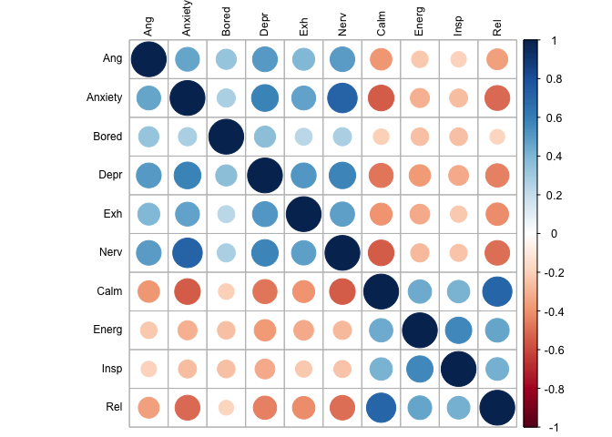

200629 Within person CFA 2
================
Anne Margit
6/29/2020

``` r
load(file = "data_long_min3_20.Rdata")
```

Without Content, Excited, Loved

``` r
data_long_min3_20 <- as_tibble(data_long_min3_20)
data_cfa_red <- data_long_min3_20 %>% select(ID, Wave, Country, Ang, Anxiety, Bored, Calm, Depr, Energ, Exh, Insp, Nerv, Rel)
```

``` r
data_country_means <- data_cfa_red %>%
    dplyr::group_by(Country) %>%
    dplyr::summarise_each(funs(mean(., na.rm=TRUE)), 
                          Ang, Anxiety, Bored, Calm, Depr, Energ, Exh, Insp, Nerv, Rel)
```

    ## Warning: `summarise_each_()` is deprecated as of dplyr 0.7.0.
    ## Please use `across()` instead.
    ## This warning is displayed once every 8 hours.
    ## Call `lifecycle::last_warnings()` to see where this warning was generated.

    ## Warning: `funs()` is deprecated as of dplyr 0.8.0.
    ## Please use a list of either functions or lambdas: 
    ## 
    ##   # Simple named list: 
    ##   list(mean = mean, median = median)
    ## 
    ##   # Auto named with `tibble::lst()`: 
    ##   tibble::lst(mean, median)
    ## 
    ##   # Using lambdas
    ##   list(~ mean(., trim = .2), ~ median(., na.rm = TRUE))
    ## This warning is displayed once every 8 hours.
    ## Call `lifecycle::last_warnings()` to see where this warning was generated.

``` r
apa_table(data_country_means)
```

<caption>

(\#tab:unnamed-chunk-4)

</caption>

<div data-custom-style="Table Caption">

\*\*

</div>

| Country        | Ang  | Anxiety | Bored | Calm | Depr | Energ | Exh  | Insp | Nerv | Rel  |
| :------------- | :--- | :------ | :---- | :--- | :--- | :---- | :--- | :--- | :--- | :--- |
| Argentina      | 1.97 | 2.61    | 2.29  | 2.99 | 1.89 | 2.32  | 2.27 | 2.42 | 2.30 | 2.67 |
| Australia      | 1.70 | 2.18    | 2.13  | 3.15 | 1.89 | 2.56  | 2.12 | 2.33 | 1.93 | 3.01 |
| Brazil         | 2.10 | 2.96    | 2.44  | 2.75 | 2.18 | 2.35  | 2.44 | 2.36 | 2.47 | 2.40 |
| Canada         | 1.90 | 2.52    | 2.32  | 2.84 | 2.08 | 2.35  | 2.45 | 2.13 | 2.27 | 2.70 |
| Chile          | 2.01 | 2.89    | 1.96  | 2.86 | 2.08 | 2.27  | 2.83 | 2.33 | 2.62 | 2.43 |
| Croatia        | 2.06 | 2.38    | 1.99  | 3.21 | 1.96 | 2.81  | 2.56 | 2.66 | 2.58 | 3.15 |
| France         | 2.01 | 2.25    | 2.06  | 3.18 | 1.92 | 2.69  | 2.13 | 2.52 | 2.08 | 2.89 |
| Germany        | 1.72 | 1.88    | 1.85  | 3.20 | 1.91 | 2.95  | 2.16 | 2.56 | 1.91 | 3.02 |
| Greece         | 2.17 | 2.72    | 2.58  | 3.32 | 2.33 | 3.15  | 2.21 | 2.82 | 2.46 | 3.14 |
| Hungary        | 2.04 | 2.53    | 2.07  | 3.08 | 2.53 | 2.80  | 2.57 | 2.66 | 2.58 | 3.05 |
| Indonesia      | 2.25 | 2.71    | 3.07  | 3.28 | 2.10 | 3.04  | 2.72 | 2.98 | 2.23 | 3.16 |
| Italy          | 2.08 | 2.35    | 2.28  | 2.82 | 1.93 | 2.49  | 2.24 | 2.25 | 2.35 | 2.55 |
| Japan          | 2.17 | 3.08    | 2.71  | 3.14 | 2.06 | 2.77  | 2.30 | 2.10 | 2.44 | 2.93 |
| Kazakhstan     | 1.94 | 2.28    | 2.16  | 3.14 | 2.07 | 2.72  | 2.14 | 2.39 | 2.33 | 2.72 |
| Malaysia       | 2.20 | 2.54    | 2.70  | 3.09 | 2.10 | 2.69  | 2.64 | 2.63 | 2.28 | 3.02 |
| Netherlands    | 1.56 | 1.70    | 1.81  | 3.49 | 1.87 | 3.11  | 1.97 | 2.83 | 1.82 | 3.29 |
| Philippines    | 2.34 | 3.00    | 2.71  | 2.93 | 2.23 | 2.65  | 2.70 | 2.67 | 2.69 | 2.81 |
| Poland         | 2.33 | 2.59    | 2.38  | 2.86 | 2.38 | 2.52  | 2.78 | 2.43 | 2.67 | 2.63 |
| Serbia         | 2.13 | 2.60    | 2.10  | 2.83 | 2.02 | 2.79  | 2.53 | 2.58 | 2.55 | 2.98 |
| Romania        | 2.10 | 2.27    | 2.47  | 3.31 | 1.92 | 2.98  | 2.42 | 2.92 | 2.37 | 3.09 |
| Russia         | 2.00 | 2.45    | 2.09  | 3.01 | 2.04 | 2.70  | 2.09 | 2.49 | 2.46 | 2.53 |
| Saudi Arabia   | 2.43 | 2.78    | 2.88  | 3.21 | 2.35 | 2.89  | 2.66 | 2.80 | 2.77 | 2.92 |
| Singapore      | 2.20 | 2.77    | 2.67  | 2.78 | 2.28 | 2.44  | 2.89 | 2.40 | 2.51 | 2.70 |
| South Africa   | 2.39 | 2.56    | 2.34  | 3.06 | 2.19 | 2.67  | 2.35 | 2.41 | 2.34 | 2.85 |
| Spain          | 2.13 | 2.34    | 2.03  | 3.02 | 1.90 | 2.13  | 2.38 | 2.35 | 2.33 | 2.80 |
| Turkey         | 2.40 | 2.82    | 3.14  | 3.00 | 2.45 | 2.51  | 2.57 | 2.35 | 2.64 | 2.73 |
| Ukraine        | 2.05 | 2.26    | 2.13  | 3.17 | 2.01 | 2.73  | 2.19 | 2.49 | 2.26 | 2.61 |
| United Kingdom | 1.74 | 2.27    | 2.06  | 3.21 | 1.81 | 2.51  | 2.11 | 2.17 | 2.00 | 3.07 |
| United States  | 1.90 | 2.65    | 2.27  | 2.85 | 2.12 | 2.44  | 2.48 | 2.22 | 2.42 | 2.69 |

``` r
data_cfa_comb <- left_join(data_cfa_red, data_country_means, by="Country")
```

This dataframe data\_within contains the raw scores - country means

``` r
data_cfa_new <- data_cfa_comb %>%
group_by(ID) %>%
  transmute(Wave = Wave,
            Country = Country,
    Ang = Ang.x - Ang.y,
         Bored = Bored.x - Bored.y,
         Anxiety = Anxiety.x - Anxiety.y,
         Calm = Calm.x - Calm.y,
         Depr = Depr.x - Depr.y,
         Energ = Energ.x - Energ.y,
         Exh = Exh.x - Exh.y,
         Insp = Insp.x - Insp.y,
         Nerv = Nerv.x - Nerv.y,
         Rel = Rel.x - Rel.y)
```

``` r
save(data_cfa_new,file ="data_cfa_new.Rdata")
```

``` r
round(cor(data_cfa_new[,c("Ang", "Anxiety", "Bored", "Depr","Exh","Nerv","Calm","Energ", "Insp","Rel")],use= "pairwise.complete.obs"),2)
```

    ##           Ang Anxiety Bored  Depr   Exh  Nerv  Calm Energ  Insp   Rel
    ## Ang      1.00    0.47  0.34  0.51  0.40  0.50 -0.38 -0.23 -0.20 -0.36
    ## Anxiety  0.47    1.00  0.28  0.59  0.47  0.72 -0.54 -0.30 -0.27 -0.51
    ## Bored    0.34    0.28  1.00  0.37  0.24  0.27 -0.20 -0.26 -0.26 -0.18
    ## Depr     0.51    0.59  0.37  1.00  0.51  0.58 -0.48 -0.38 -0.32 -0.45
    ## Exh      0.40    0.47  0.24  0.51  1.00  0.49 -0.40 -0.32 -0.22 -0.42
    ## Nerv     0.50    0.72  0.27  0.58  0.49  1.00 -0.54 -0.27 -0.24 -0.50
    ## Calm    -0.38   -0.54 -0.20 -0.48 -0.40 -0.54  1.00  0.45  0.41  0.71
    ## Energ   -0.23   -0.30 -0.26 -0.38 -0.32 -0.27  0.45  1.00  0.57  0.46
    ## Insp    -0.20   -0.27 -0.26 -0.32 -0.22 -0.24  0.41  0.57  1.00  0.43
    ## Rel     -0.36   -0.51 -0.18 -0.45 -0.42 -0.50  0.71  0.46  0.43  1.00

``` r
corrplot(cor(data_cfa_new[,c("Ang", "Anxiety", "Bored", "Depr","Exh","Nerv","Calm","Energ", "Insp","Rel")], use="pairwise.complete.obs"), order = "original", tl.col='black', tl.cex=.75)
```

<!-- -->

Two-factor CFA without loved centered around country means

``` r
model2 <- '
level: 1
f1 =~ Ang + Anxiety + Bored + Depr + Exh + Nerv 
f2 =~ Calm + Energ + Insp + Rel 

level: 2
f1 =~ Ang + Anxiety + Bored + Depr + Exh + Nerv 
f2 =~ Calm + Energ + Insp + Rel 
'
```

``` r
fit2 <- cfa(model2, data = data_cfa_new, std.lv=TRUE, missing="fiml", cluster = "ID")
```

``` r
summary(fit2, standardized=TRUE, fit.measures=TRUE)
```

    ## lavaan 0.6-6 ended normally after 31 iterations
    ## 
    ##   Estimator                                         ML
    ##   Optimization method                           NLMINB
    ##   Number of free parameters                         52
    ##                                                       
    ##                                                   Used       Total
    ##   Number of observations                         14760       71672
    ##   Number of clusters [ID]                         7147            
    ##                                                                   
    ## Model Test User Model:
    ##                                                       
    ##   Test statistic                              4700.498
    ##   Degrees of freedom                                68
    ##   P-value (Chi-square)                           0.000
    ## 
    ## Model Test Baseline Model:
    ## 
    ##   Test statistic                             50505.760
    ##   Degrees of freedom                                90
    ##   P-value                                        0.000
    ## 
    ## User Model versus Baseline Model:
    ## 
    ##   Comparative Fit Index (CFI)                    0.908
    ##   Tucker-Lewis Index (TLI)                       0.878
    ## 
    ## Loglikelihood and Information Criteria:
    ## 
    ##   Loglikelihood user model (H0)            -181010.645
    ##   Loglikelihood unrestricted model (H1)    -178660.396
    ##                                                       
    ##   Akaike (AIC)                              362125.289
    ##   Bayesian (BIC)                            362520.473
    ##   Sample-size adjusted Bayesian (BIC)       362355.221
    ## 
    ## Root Mean Square Error of Approximation:
    ## 
    ##   RMSEA                                          0.068
    ##   90 Percent confidence interval - lower         0.066
    ##   90 Percent confidence interval - upper         0.070
    ##   P-value RMSEA <= 0.05                          0.000
    ## 
    ## Standardized Root Mean Square Residual (corr metric):
    ## 
    ##   SRMR (within covariance matrix)                0.035
    ##   SRMR (between covariance matrix)               0.069
    ## 
    ## Parameter Estimates:
    ## 
    ##   Standard errors                             Standard
    ##   Information                                 Observed
    ##   Observed information based on                Hessian
    ## 
    ## 
    ## Level 1 [within]:
    ## 
    ## Latent Variables:
    ##                    Estimate  Std.Err  z-value  P(>|z|)   Std.lv  Std.all
    ##   f1 =~                                                                 
    ##     Ang               0.331    0.010   34.669    0.000    0.331    0.476
    ##     Anxiety           0.384    0.010   37.171    0.000    0.384    0.565
    ##     Bored             0.195    0.011   17.687    0.000    0.195    0.276
    ##     Depr              0.370    0.010   37.462    0.000    0.370    0.568
    ##     Exh               0.290    0.010   27.982    0.000    0.290    0.392
    ##     Nerv              0.378    0.011   34.697    0.000    0.378    0.554
    ##   f2 =~                                                                 
    ##     Calm              0.381    0.011   34.330    0.000    0.381    0.576
    ##     Energ             0.328    0.014   23.018    0.000    0.328    0.487
    ##     Insp              0.325    0.015   22.248    0.000    0.325    0.463
    ##     Rel               0.410    0.011   38.640    0.000    0.410    0.600
    ## 
    ## Covariances:
    ##                    Estimate  Std.Err  z-value  P(>|z|)   Std.lv  Std.all
    ##   f1 ~~                                                                 
    ##     f2               -0.515    0.016  -33.116    0.000   -0.515   -0.515
    ## 
    ## Intercepts:
    ##                    Estimate  Std.Err  z-value  P(>|z|)   Std.lv  Std.all
    ##    .Ang               0.000                               0.000    0.000
    ##    .Anxiety           0.000                               0.000    0.000
    ##    .Bored             0.000                               0.000    0.000
    ##    .Depr              0.000                               0.000    0.000
    ##    .Exh               0.000                               0.000    0.000
    ##    .Nerv              0.000                               0.000    0.000
    ##    .Calm              0.000                               0.000    0.000
    ##    .Energ             0.000                               0.000    0.000
    ##    .Insp              0.000                               0.000    0.000
    ##    .Rel               0.000                               0.000    0.000
    ##     f1                0.000                               0.000    0.000
    ##     f2                0.000                               0.000    0.000
    ## 
    ## Variances:
    ##                    Estimate  Std.Err  z-value  P(>|z|)   Std.lv  Std.all
    ##    .Ang               0.374    0.007   53.058    0.000    0.374    0.773
    ##    .Anxiety           0.313    0.007   45.279    0.000    0.313    0.680
    ##    .Bored             0.463    0.008   59.131    0.000    0.463    0.924
    ##    .Depr              0.286    0.006   45.437    0.000    0.286    0.677
    ##    .Exh               0.464    0.008   56.796    0.000    0.464    0.846
    ##    .Nerv              0.323    0.007   45.668    0.000    0.323    0.693
    ##    .Calm              0.292    0.008   38.930    0.000    0.292    0.668
    ##    .Energ             0.348    0.008   44.244    0.000    0.348    0.763
    ##    .Insp              0.389    0.008   46.415    0.000    0.389    0.786
    ##    .Rel               0.300    0.008   38.285    0.000    0.300    0.640
    ##     f1                1.000                               1.000    1.000
    ##     f2                1.000                               1.000    1.000
    ## 
    ## 
    ## Level 2 [ID]:
    ## 
    ## Latent Variables:
    ##                    Estimate  Std.Err  z-value  P(>|z|)   Std.lv  Std.all
    ##   f1 =~                                                                 
    ##     Ang               0.630    0.012   52.931    0.000    0.630    0.723
    ##     Anxiety           0.850    0.011   75.504    0.000    0.850    0.924
    ##     Bored             0.436    0.014   31.163    0.000    0.436    0.472
    ##     Depr              0.767    0.011   68.227    0.000    0.767    0.864
    ##     Exh               0.703    0.012   56.742    0.000    0.703    0.769
    ##     Nerv              0.830    0.011   75.448    0.000    0.830    0.941
    ##   f2 =~                                                                 
    ##     Calm              0.785    0.010   78.873    0.000    0.785    0.980
    ##     Energ             0.559    0.013   44.274    0.000    0.559    0.715
    ##     Insp              0.534    0.014   39.180    0.000    0.534    0.645
    ##     Rel               0.785    0.010   78.020    0.000    0.785    0.968
    ## 
    ## Covariances:
    ##                    Estimate  Std.Err  z-value  P(>|z|)   Std.lv  Std.all
    ##   f1 ~~                                                                 
    ##     f2               -0.788    0.007 -105.626    0.000   -0.788   -0.788
    ## 
    ## Intercepts:
    ##                    Estimate  Std.Err  z-value  P(>|z|)   Std.lv  Std.all
    ##    .Ang               0.002    0.012    0.153    0.878    0.002    0.002
    ##    .Anxiety          -0.113    0.012   -9.097    0.000   -0.113   -0.123
    ##    .Bored            -0.064    0.013   -5.092    0.000   -0.064   -0.069
    ##    .Depr             -0.044    0.012   -3.663    0.000   -0.044   -0.049
    ##    .Exh               0.002    0.013    0.130    0.897    0.002    0.002
    ##    .Nerv             -0.109    0.012   -9.086    0.000   -0.109   -0.124
    ##    .Calm              0.046    0.011    4.153    0.000    0.046    0.057
    ##    .Energ             0.071    0.011    6.463    0.000    0.071    0.091
    ##    .Insp              0.075    0.012    6.462    0.000    0.075    0.090
    ##    .Rel               0.053    0.011    4.728    0.000    0.053    0.066
    ##     f1                0.000                               0.000    0.000
    ##     f2                0.000                               0.000    0.000
    ## 
    ## Variances:
    ##                    Estimate  Std.Err  z-value  P(>|z|)   Std.lv  Std.all
    ##    .Ang               0.363    0.011   33.727    0.000    0.363    0.478
    ##    .Anxiety           0.123    0.007   16.536    0.000    0.123    0.146
    ##    .Bored             0.661    0.016   40.857    0.000    0.661    0.777
    ##    .Depr              0.199    0.008   25.237    0.000    0.199    0.253
    ##    .Exh               0.340    0.012   29.408    0.000    0.340    0.408
    ##    .Nerv              0.089    0.007   12.744    0.000    0.089    0.115
    ##    .Calm              0.026    0.006    4.148    0.000    0.026    0.040
    ##    .Energ             0.299    0.009   32.030    0.000    0.299    0.489
    ##    .Insp              0.401    0.011   35.234    0.000    0.401    0.584
    ##    .Rel               0.041    0.006    6.711    0.000    0.041    0.062
    ##     f1                1.000                               1.000    1.000
    ##     f2                1.000                               1.000    1.000

``` r
parameterEstimates(fit2, standardized=TRUE) %>% 
  filter(op == "=~") %>% 
  select('Latent Factor'=lhs, Indicator=rhs, B=est, SE=se, Z=z, 'p-value'=pvalue, Beta=std.all) %>% 
  kable(digits = 3, format="pandoc", caption="Factor Loadings")
```

| Latent Factor | Indicator |     B |    SE |      Z | p-value |  Beta |
| :------------ | :-------- | ----: | ----: | -----: | ------: | ----: |
| f1            | Ang       | 0.331 | 0.010 | 34.669 |       0 | 0.476 |
| f1            | Anxiety   | 0.384 | 0.010 | 37.171 |       0 | 0.565 |
| f1            | Bored     | 0.195 | 0.011 | 17.687 |       0 | 0.276 |
| f1            | Depr      | 0.370 | 0.010 | 37.462 |       0 | 0.568 |
| f1            | Exh       | 0.290 | 0.010 | 27.982 |       0 | 0.392 |
| f1            | Nerv      | 0.378 | 0.011 | 34.697 |       0 | 0.554 |
| f2            | Calm      | 0.381 | 0.011 | 34.330 |       0 | 0.576 |
| f2            | Energ     | 0.328 | 0.014 | 23.018 |       0 | 0.487 |
| f2            | Insp      | 0.325 | 0.015 | 22.248 |       0 | 0.463 |
| f2            | Rel       | 0.410 | 0.011 | 38.640 |       0 | 0.600 |
| f1            | Ang       | 0.630 | 0.012 | 52.931 |       0 | 0.723 |
| f1            | Anxiety   | 0.850 | 0.011 | 75.504 |       0 | 0.924 |
| f1            | Bored     | 0.436 | 0.014 | 31.163 |       0 | 0.472 |
| f1            | Depr      | 0.767 | 0.011 | 68.227 |       0 | 0.864 |
| f1            | Exh       | 0.703 | 0.012 | 56.742 |       0 | 0.769 |
| f1            | Nerv      | 0.830 | 0.011 | 75.448 |       0 | 0.941 |
| f2            | Calm      | 0.785 | 0.010 | 78.873 |       0 | 0.980 |
| f2            | Energ     | 0.559 | 0.013 | 44.274 |       0 | 0.715 |
| f2            | Insp      | 0.534 | 0.014 | 39.180 |       0 | 0.645 |
| f2            | Rel       | 0.785 | 0.010 | 78.020 |       0 | 0.968 |

Factor Loadings

Three-factor CFA without loved centered around country means. According
to the PCA parallel analysis 3 dimensions were the best fit.

``` r
model3 <- '
level: 1
f1 =~ Ang + Anxiety + Nerv + Bored + Depr + Exh
f2 =~ Energ + Insp
f3 =~ Calm + Rel

level: 2
f1 =~ Ang + Anxiety + Nerv + Bored + Depr + Exh
f2 =~ Energ + Insp
f2 =~ Calm + Rel
'
```

``` r
fit3 <- cfa(model3, data = data_cfa_new, std.lv=TRUE, missing="fiml", cluster = "ID")
```

``` r
summary(fit3, standardized=TRUE, fit.measures=TRUE)
```

    ## lavaan 0.6-6 ended normally after 32 iterations
    ## 
    ##   Estimator                                         ML
    ##   Optimization method                           NLMINB
    ##   Number of free parameters                         54
    ##                                                       
    ##                                                   Used       Total
    ##   Number of observations                         14760       71672
    ##   Number of clusters [ID]                         7147            
    ##                                                                   
    ## Model Test User Model:
    ##                                                       
    ##   Test statistic                              3612.732
    ##   Degrees of freedom                                66
    ##   P-value (Chi-square)                           0.000
    ## 
    ## Model Test Baseline Model:
    ## 
    ##   Test statistic                             50505.760
    ##   Degrees of freedom                                90
    ##   P-value                                        0.000
    ## 
    ## User Model versus Baseline Model:
    ## 
    ##   Comparative Fit Index (CFI)                    0.930
    ##   Tucker-Lewis Index (TLI)                       0.904
    ## 
    ## Loglikelihood and Information Criteria:
    ## 
    ##   Loglikelihood user model (H0)            -180466.762
    ##   Loglikelihood unrestricted model (H1)    -178660.396
    ##                                                       
    ##   Akaike (AIC)                              361041.524
    ##   Bayesian (BIC)                            361451.906
    ##   Sample-size adjusted Bayesian (BIC)       361280.299
    ## 
    ## Root Mean Square Error of Approximation:
    ## 
    ##   RMSEA                                          0.060
    ##   90 Percent confidence interval - lower         0.059
    ##   90 Percent confidence interval - upper         0.062
    ##   P-value RMSEA <= 0.05                          0.000
    ## 
    ## Standardized Root Mean Square Residual (corr metric):
    ## 
    ##   SRMR (within covariance matrix)                0.049
    ##   SRMR (between covariance matrix)               0.074
    ## 
    ## Parameter Estimates:
    ## 
    ##   Standard errors                             Standard
    ##   Information                                 Observed
    ##   Observed information based on                Hessian
    ## 
    ## 
    ## Level 1 [within]:
    ## 
    ## Latent Variables:
    ##                    Estimate  Std.Err  z-value  P(>|z|)   Std.lv  Std.all
    ##   f1 =~                                                                 
    ##     Ang               0.321    0.009   34.035    0.000    0.321    0.460
    ##     Anxiety           0.436    0.010   43.020    0.000    0.436    0.627
    ##     Nerv              0.446    0.011   41.350    0.000    0.446    0.632
    ##     Bored             0.144    0.011   13.565    0.000    0.144    0.204
    ##     Depr              0.326    0.009   35.758    0.000    0.326    0.506
    ##     Exh               0.269    0.010   26.842    0.000    0.269    0.365
    ##   f2 =~                                                                 
    ##     Energ             0.467    0.016   29.368    0.000    0.467    0.676
    ##     Insp              0.446    0.016   28.450    0.000    0.446    0.616
    ##   f3 =~                                                                 
    ##     Calm              0.453    0.011   42.958    0.000    0.453    0.670
    ##     Rel               0.449    0.010   43.880    0.000    0.449    0.648
    ## 
    ## Covariances:
    ##                    Estimate  Std.Err  z-value  P(>|z|)   Std.lv  Std.all
    ##   f1 ~~                                                                 
    ##     f2               -0.163    0.021   -7.693    0.000   -0.163   -0.163
    ##     f3               -0.558    0.015  -36.141    0.000   -0.558   -0.558
    ##   f2 ~~                                                                 
    ##     f3                0.384    0.020   19.345    0.000    0.384    0.384
    ## 
    ## Intercepts:
    ##                    Estimate  Std.Err  z-value  P(>|z|)   Std.lv  Std.all
    ##    .Ang               0.000                               0.000    0.000
    ##    .Anxiety           0.000                               0.000    0.000
    ##    .Nerv              0.000                               0.000    0.000
    ##    .Bored             0.000                               0.000    0.000
    ##    .Depr              0.000                               0.000    0.000
    ##    .Exh               0.000                               0.000    0.000
    ##    .Energ             0.000                               0.000    0.000
    ##    .Insp              0.000                               0.000    0.000
    ##    .Calm              0.000                               0.000    0.000
    ##    .Rel               0.000                               0.000    0.000
    ##     f1                0.000                               0.000    0.000
    ##     f2                0.000                               0.000    0.000
    ##     f3                0.000                               0.000    0.000
    ## 
    ## Variances:
    ##                    Estimate  Std.Err  z-value  P(>|z|)   Std.lv  Std.all
    ##    .Ang               0.383    0.007   54.120    0.000    0.383    0.788
    ##    .Anxiety           0.294    0.007   44.828    0.000    0.294    0.607
    ##    .Nerv              0.298    0.007   44.120    0.000    0.298    0.600
    ##    .Bored             0.473    0.008   60.159    0.000    0.473    0.958
    ##    .Depr              0.308    0.006   50.018    0.000    0.308    0.744
    ##    .Exh               0.473    0.008   57.776    0.000    0.473    0.867
    ##    .Energ             0.260    0.014   18.271    0.000    0.260    0.543
    ##    .Insp              0.325    0.014   23.982    0.000    0.325    0.620
    ##    .Calm              0.251    0.008   32.623    0.000    0.251    0.551
    ##    .Rel               0.278    0.008   35.075    0.000    0.278    0.580
    ##     f1                1.000                               1.000    1.000
    ##     f2                1.000                               1.000    1.000
    ##     f3                1.000                               1.000    1.000
    ## 
    ## 
    ## Level 2 [ID]:
    ## 
    ## Latent Variables:
    ##                    Estimate  Std.Err  z-value  P(>|z|)   Std.lv  Std.all
    ##   f1 =~                                                                 
    ##     Ang               0.632    0.012   53.019    0.000    0.632    0.726
    ##     Anxiety           0.820    0.011   71.766    0.000    0.820    0.912
    ##     Nerv              0.794    0.011   71.259    0.000    0.794    0.928
    ##     Bored             0.476    0.014   34.314    0.000    0.476    0.511
    ##     Depr              0.789    0.011   71.223    0.000    0.789    0.881
    ##     Exh               0.714    0.012   58.019    0.000    0.714    0.780
    ##   f2 =~                                                                 
    ##     Energ             0.627    0.011   55.143    0.000    0.627    0.824
    ##     Insp              0.604    0.012   49.342    0.000    0.604    0.755
    ##     Calm              0.760    0.010   76.434    0.000    0.760    0.963
    ##     Rel               0.772    0.010   76.665    0.000    0.772    0.960
    ## 
    ## Covariances:
    ##                    Estimate  Std.Err  z-value  P(>|z|)   Std.lv  Std.all
    ##   f1 ~~                                                                 
    ##     f2               -0.778    0.008 -100.543    0.000   -0.778   -0.778
    ## 
    ## Intercepts:
    ##                    Estimate  Std.Err  z-value  P(>|z|)   Std.lv  Std.all
    ##    .Ang               0.002    0.012    0.129    0.897    0.002    0.002
    ##    .Anxiety          -0.114    0.012   -9.284    0.000   -0.114   -0.126
    ##    .Nerv             -0.110    0.012   -9.300    0.000   -0.110   -0.129
    ##    .Bored            -0.064    0.013   -5.050    0.000   -0.064   -0.069
    ##    .Depr             -0.044    0.012   -3.659    0.000   -0.044   -0.049
    ##    .Exh               0.001    0.013    0.098    0.922    0.001    0.001
    ##    .Energ             0.070    0.011    6.429    0.000    0.070    0.091
    ##    .Insp              0.073    0.011    6.405    0.000    0.073    0.091
    ##    .Calm              0.047    0.011    4.281    0.000    0.047    0.060
    ##    .Rel               0.054    0.011    4.841    0.000    0.054    0.068
    ##     f1                0.000                               0.000    0.000
    ##     f2                0.000                               0.000    0.000
    ## 
    ## Variances:
    ##                    Estimate  Std.Err  z-value  P(>|z|)   Std.lv  Std.all
    ##    .Ang               0.358    0.011   33.208    0.000    0.358    0.473
    ##    .Anxiety           0.136    0.007   18.959    0.000    0.136    0.168
    ##    .Nerv              0.102    0.007   15.453    0.000    0.102    0.139
    ##    .Bored             0.643    0.016   39.300    0.000    0.643    0.739
    ##    .Depr              0.179    0.008   21.740    0.000    0.179    0.223
    ##    .Exh               0.328    0.012   28.281    0.000    0.328    0.392
    ##    .Energ             0.186    0.009   20.458    0.000    0.186    0.321
    ##    .Insp              0.275    0.011   25.624    0.000    0.275    0.430
    ##    .Calm              0.045    0.005    8.174    0.000    0.045    0.072
    ##    .Rel               0.050    0.006    8.623    0.000    0.050    0.077
    ##     f1                1.000                               1.000    1.000
    ##     f2                1.000                               1.000    1.000

``` r
parameterEstimates(fit3, standardized=TRUE) %>% 
  filter(op == "=~") %>% 
  select('Latent Factor'=lhs, Indicator=rhs, B=est, SE=se, Z=z, 'p-value'=pvalue, Beta=std.all) %>% 
  kable(digits = 3, format="pandoc", caption="Factor Loadings")
```

| Latent Factor | Indicator |     B |    SE |      Z | p-value |  Beta |
| :------------ | :-------- | ----: | ----: | -----: | ------: | ----: |
| f1            | Ang       | 0.321 | 0.009 | 34.035 |       0 | 0.460 |
| f1            | Anxiety   | 0.436 | 0.010 | 43.020 |       0 | 0.627 |
| f1            | Nerv      | 0.446 | 0.011 | 41.350 |       0 | 0.632 |
| f1            | Bored     | 0.144 | 0.011 | 13.565 |       0 | 0.204 |
| f1            | Depr      | 0.326 | 0.009 | 35.758 |       0 | 0.506 |
| f1            | Exh       | 0.269 | 0.010 | 26.842 |       0 | 0.365 |
| f2            | Energ     | 0.467 | 0.016 | 29.368 |       0 | 0.676 |
| f2            | Insp      | 0.446 | 0.016 | 28.450 |       0 | 0.616 |
| f3            | Calm      | 0.453 | 0.011 | 42.958 |       0 | 0.670 |
| f3            | Rel       | 0.449 | 0.010 | 43.880 |       0 | 0.648 |
| f1            | Ang       | 0.632 | 0.012 | 53.019 |       0 | 0.726 |
| f1            | Anxiety   | 0.820 | 0.011 | 71.766 |       0 | 0.912 |
| f1            | Nerv      | 0.794 | 0.011 | 71.259 |       0 | 0.928 |
| f1            | Bored     | 0.476 | 0.014 | 34.314 |       0 | 0.511 |
| f1            | Depr      | 0.789 | 0.011 | 71.223 |       0 | 0.881 |
| f1            | Exh       | 0.714 | 0.012 | 58.019 |       0 | 0.780 |
| f2            | Energ     | 0.627 | 0.011 | 55.143 |       0 | 0.824 |
| f2            | Insp      | 0.604 | 0.012 | 49.342 |       0 | 0.755 |
| f2            | Calm      | 0.760 | 0.010 | 76.434 |       0 | 0.963 |
| f2            | Rel       | 0.772 | 0.010 | 76.665 |       0 | 0.960 |

Factor Loadings

Four-factor CFA without loved centered around country means

``` r
model4 <- '
level: 1
f1 =~ Ang + Anxiety + Nerv 
f2 =~ Bored + Depr + Exh
f3 =~ Energ + Insp
f4 =~ Calm + Rel

level: 2
f1 =~ Ang + Anxiety + Nerv 
f2 =~ Bored + Depr + Exh
f3 =~ Energ + Insp
f4 =~ Calm + Rel
'
```

``` r
fit4 <- cfa(model4, data = data_cfa_new, std.lv=TRUE, missing="fiml", cluster = "ID")
```

``` r
summary(fit4, standardized=TRUE, fit.measures=TRUE)
```

    ## lavaan 0.6-6 ended normally after 38 iterations
    ## 
    ##   Estimator                                         ML
    ##   Optimization method                           NLMINB
    ##   Number of free parameters                         62
    ##                                                       
    ##                                                   Used       Total
    ##   Number of observations                         14760       71672
    ##   Number of clusters [ID]                         7147            
    ##                                                                   
    ## Model Test User Model:
    ##                                                       
    ##   Test statistic                              1321.407
    ##   Degrees of freedom                                58
    ##   P-value (Chi-square)                           0.000
    ## 
    ## Model Test Baseline Model:
    ## 
    ##   Test statistic                             50505.760
    ##   Degrees of freedom                                90
    ##   P-value                                        0.000
    ## 
    ## User Model versus Baseline Model:
    ## 
    ##   Comparative Fit Index (CFI)                    0.975
    ##   Tucker-Lewis Index (TLI)                       0.961
    ## 
    ## Loglikelihood and Information Criteria:
    ## 
    ##   Loglikelihood user model (H0)            -179321.099
    ##   Loglikelihood unrestricted model (H1)    -178660.396
    ##                                                       
    ##   Akaike (AIC)                              358766.198
    ##   Bayesian (BIC)                            359237.378
    ##   Sample-size adjusted Bayesian (BIC)       359040.347
    ## 
    ## Root Mean Square Error of Approximation:
    ## 
    ##   RMSEA                                          0.038
    ##   90 Percent confidence interval - lower         0.037
    ##   90 Percent confidence interval - upper         0.040
    ##   P-value RMSEA <= 0.05                          1.000
    ## 
    ## Standardized Root Mean Square Residual (corr metric):
    ## 
    ##   SRMR (within covariance matrix)                0.023
    ##   SRMR (between covariance matrix)               0.034
    ## 
    ## Parameter Estimates:
    ## 
    ##   Standard errors                             Standard
    ##   Information                                 Observed
    ##   Observed information based on                Hessian
    ## 
    ## 
    ## Level 1 [within]:
    ## 
    ## Latent Variables:
    ##                    Estimate  Std.Err  z-value  P(>|z|)   Std.lv  Std.all
    ##   f1 =~                                                                 
    ##     Ang               0.325    0.010   33.526    0.000    0.325    0.468
    ##     Anxiety           0.401    0.009   42.677    0.000    0.401    0.590
    ##     Nerv              0.399    0.009   42.009    0.000    0.399    0.583
    ##   f2 =~                                                                 
    ##     Bored             0.213    0.010   20.658    0.000    0.213    0.300
    ##     Depr              0.396    0.010   38.907    0.000    0.396    0.609
    ##     Exh               0.296    0.010   28.527    0.000    0.296    0.400
    ##   f3 =~                                                                 
    ##     Energ             0.388    0.011   35.264    0.000    0.388    0.580
    ##     Insp              0.380    0.011   34.126    0.000    0.380    0.545
    ##   f4 =~                                                                 
    ##     Calm              0.423    0.010   43.589    0.000    0.423    0.634
    ##     Rel               0.442    0.010   43.844    0.000    0.442    0.644
    ## 
    ## Covariances:
    ##                    Estimate  Std.Err  z-value  P(>|z|)   Std.lv  Std.all
    ##   f1 ~~                                                                 
    ##     f2                0.871    0.020   43.431    0.000    0.871    0.871
    ##     f3               -0.300    0.021  -14.089    0.000   -0.300   -0.300
    ##     f4               -0.528    0.018  -29.771    0.000   -0.528   -0.528
    ##   f2 ~~                                                                 
    ##     f3               -0.493    0.023  -20.991    0.000   -0.493   -0.493
    ##     f4               -0.407    0.021  -19.103    0.000   -0.407   -0.407
    ##   f3 ~~                                                                 
    ##     f4                0.642    0.019   33.399    0.000    0.642    0.642
    ## 
    ## Intercepts:
    ##                    Estimate  Std.Err  z-value  P(>|z|)   Std.lv  Std.all
    ##    .Ang               0.000                               0.000    0.000
    ##    .Anxiety           0.000                               0.000    0.000
    ##    .Nerv              0.000                               0.000    0.000
    ##    .Bored             0.000                               0.000    0.000
    ##    .Depr              0.000                               0.000    0.000
    ##    .Exh               0.000                               0.000    0.000
    ##    .Energ             0.000                               0.000    0.000
    ##    .Insp              0.000                               0.000    0.000
    ##    .Calm              0.000                               0.000    0.000
    ##    .Rel               0.000                               0.000    0.000
    ##     f1                0.000                               0.000    0.000
    ##     f2                0.000                               0.000    0.000
    ##     f3                0.000                               0.000    0.000
    ##     f4                0.000                               0.000    0.000
    ## 
    ## Variances:
    ##                    Estimate  Std.Err  z-value  P(>|z|)   Std.lv  Std.all
    ##    .Ang               0.377    0.007   52.985    0.000    0.377    0.781
    ##    .Anxiety           0.301    0.007   44.654    0.000    0.301    0.652
    ##    .Nerv              0.309    0.007   45.334    0.000    0.309    0.660
    ##    .Bored             0.456    0.008   58.524    0.000    0.456    0.910
    ##    .Depr              0.266    0.007   36.328    0.000    0.266    0.629
    ##    .Exh               0.458    0.008   55.504    0.000    0.458    0.840
    ##    .Energ             0.297    0.008   36.694    0.000    0.297    0.663
    ##    .Insp              0.343    0.008   41.072    0.000    0.343    0.703
    ##    .Calm              0.265    0.007   37.011    0.000    0.265    0.598
    ##    .Rel               0.275    0.008   35.631    0.000    0.275    0.585
    ##     f1                1.000                               1.000    1.000
    ##     f2                1.000                               1.000    1.000
    ##     f3                1.000                               1.000    1.000
    ##     f4                1.000                               1.000    1.000
    ## 
    ## 
    ## Level 2 [ID]:
    ## 
    ## Latent Variables:
    ##                    Estimate  Std.Err  z-value  P(>|z|)   Std.lv  Std.all
    ##   f1 =~                                                                 
    ##     Ang               0.625    0.012   51.976    0.000    0.625    0.717
    ##     Anxiety           0.857    0.011   78.219    0.000    0.857    0.933
    ##     Nerv              0.845    0.011   80.172    0.000    0.845    0.961
    ##   f2 =~                                                                 
    ##     Bored             0.472    0.014   34.446    0.000    0.472    0.512
    ##     Depr              0.806    0.011   72.076    0.000    0.806    0.910
    ##     Exh               0.728    0.012   58.830    0.000    0.728    0.795
    ##   f3 =~                                                                 
    ##     Energ             0.769    0.011   70.081    0.000    0.769    0.972
    ##     Insp              0.710    0.012   59.874    0.000    0.710    0.848
    ##   f4 =~                                                                 
    ##     Calm              0.784    0.010   80.283    0.000    0.784    0.983
    ##     Rel               0.774    0.010   76.524    0.000    0.774    0.956
    ## 
    ## Covariances:
    ##                    Estimate  Std.Err  z-value  P(>|z|)   Std.lv  Std.all
    ##   f1 ~~                                                                 
    ##     f2                0.913    0.007  139.887    0.000    0.913    0.913
    ##     f3               -0.469    0.013  -35.135    0.000   -0.469   -0.469
    ##     f4               -0.786    0.008  -97.501    0.000   -0.786   -0.786
    ##   f2 ~~                                                                 
    ##     f3               -0.620    0.012  -50.818    0.000   -0.620   -0.620
    ##     f4               -0.774    0.010  -80.144    0.000   -0.774   -0.774
    ##   f3 ~~                                                                 
    ##     f4                0.731    0.010   74.894    0.000    0.731    0.731
    ## 
    ## Intercepts:
    ##                    Estimate  Std.Err  z-value  P(>|z|)   Std.lv  Std.all
    ##    .Ang               0.002    0.012    0.145    0.885    0.002    0.002
    ##    .Anxiety          -0.113    0.012   -9.111    0.000   -0.113   -0.123
    ##    .Nerv             -0.109    0.012   -9.105    0.000   -0.109   -0.124
    ##    .Bored            -0.064    0.013   -5.086    0.000   -0.064   -0.069
    ##    .Depr             -0.043    0.012   -3.643    0.000   -0.043   -0.049
    ##    .Exh               0.002    0.013    0.125    0.901    0.002    0.002
    ##    .Energ             0.073    0.011    6.602    0.000    0.073    0.092
    ##    .Insp              0.074    0.012    6.378    0.000    0.074    0.089
    ##    .Calm              0.046    0.011    4.145    0.000    0.046    0.057
    ##    .Rel               0.053    0.011    4.720    0.000    0.053    0.066
    ##     f1                0.000                               0.000    0.000
    ##     f2                0.000                               0.000    0.000
    ##     f3                0.000                               0.000    0.000
    ##     f4                0.000                               0.000    0.000
    ## 
    ## Variances:
    ##                    Estimate  Std.Err  z-value  P(>|z|)   Std.lv  Std.all
    ##    .Ang               0.370    0.011   33.818    0.000    0.370    0.486
    ##    .Anxiety           0.109    0.007   15.301    0.000    0.109    0.129
    ##    .Nerv              0.060    0.007    9.112    0.000    0.060    0.077
    ##    .Bored             0.627    0.016   39.696    0.000    0.627    0.738
    ##    .Depr              0.136    0.009   15.530    0.000    0.136    0.173
    ##    .Exh               0.307    0.012   26.628    0.000    0.307    0.367
    ##    .Energ             0.034    0.009    3.602    0.000    0.034    0.055
    ##    .Insp              0.198    0.010   19.534    0.000    0.198    0.281
    ##    .Calm              0.021    0.006    3.655    0.000    0.021    0.033
    ##    .Rel               0.056    0.006    9.135    0.000    0.056    0.086
    ##     f1                1.000                               1.000    1.000
    ##     f2                1.000                               1.000    1.000
    ##     f3                1.000                               1.000    1.000
    ##     f4                1.000                               1.000    1.000

``` r
parameterEstimates(fit4, standardized=TRUE) %>% 
  filter(op == "=~") %>% 
  select('Latent Factor'=lhs, Indicator=rhs, B=est, SE=se, Z=z, 'p-value'=pvalue, Beta=std.all) %>% 
  kable(digits = 3, format="pandoc", caption="Factor Loadings")
```

| Latent Factor | Indicator |     B |    SE |      Z | p-value |  Beta |
| :------------ | :-------- | ----: | ----: | -----: | ------: | ----: |
| f1            | Ang       | 0.325 | 0.010 | 33.526 |       0 | 0.468 |
| f1            | Anxiety   | 0.401 | 0.009 | 42.677 |       0 | 0.590 |
| f1            | Nerv      | 0.399 | 0.009 | 42.009 |       0 | 0.583 |
| f2            | Bored     | 0.213 | 0.010 | 20.658 |       0 | 0.300 |
| f2            | Depr      | 0.396 | 0.010 | 38.907 |       0 | 0.609 |
| f2            | Exh       | 0.296 | 0.010 | 28.527 |       0 | 0.400 |
| f3            | Energ     | 0.388 | 0.011 | 35.264 |       0 | 0.580 |
| f3            | Insp      | 0.380 | 0.011 | 34.126 |       0 | 0.545 |
| f4            | Calm      | 0.423 | 0.010 | 43.589 |       0 | 0.634 |
| f4            | Rel       | 0.442 | 0.010 | 43.844 |       0 | 0.644 |
| f1            | Ang       | 0.625 | 0.012 | 51.976 |       0 | 0.717 |
| f1            | Anxiety   | 0.857 | 0.011 | 78.219 |       0 | 0.933 |
| f1            | Nerv      | 0.845 | 0.011 | 80.172 |       0 | 0.961 |
| f2            | Bored     | 0.472 | 0.014 | 34.446 |       0 | 0.512 |
| f2            | Depr      | 0.806 | 0.011 | 72.076 |       0 | 0.910 |
| f2            | Exh       | 0.728 | 0.012 | 58.830 |       0 | 0.795 |
| f3            | Energ     | 0.769 | 0.011 | 70.081 |       0 | 0.972 |
| f3            | Insp      | 0.710 | 0.012 | 59.874 |       0 | 0.848 |
| f4            | Calm      | 0.784 | 0.010 | 80.283 |       0 | 0.983 |
| f4            | Rel       | 0.774 | 0.010 | 76.524 |       0 | 0.956 |

Factor Loadings
