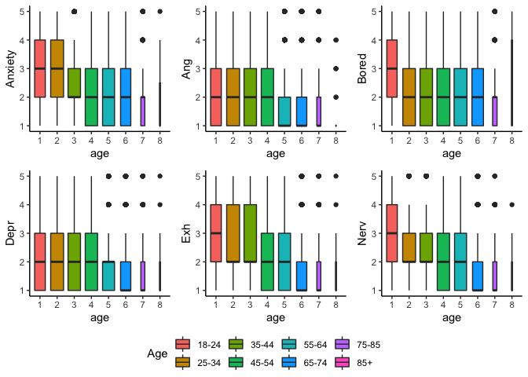
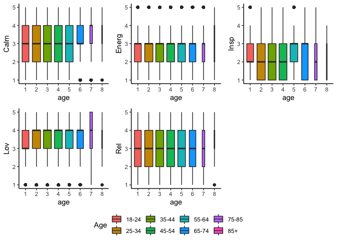
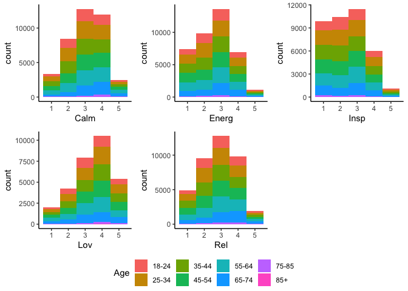
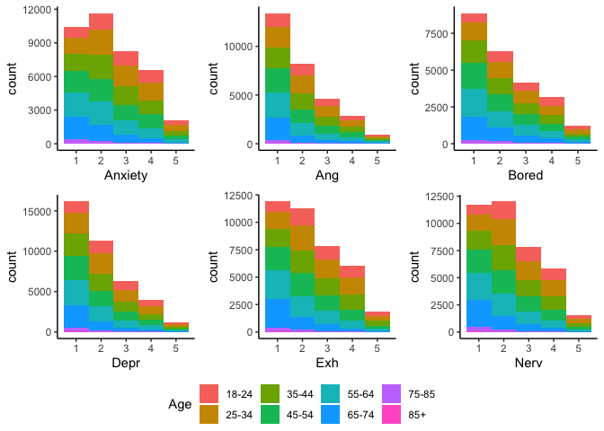
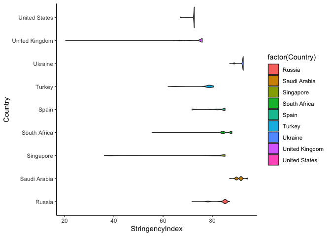

200630 Descriptives
================
Anne Margit
6/30/2020

install.packages(“ggpubr”) install.packages(“stringr”)

``` r
library(dplyr)
```

    ## 
    ## Attaching package: 'dplyr'

    ## The following objects are masked from 'package:stats':
    ## 
    ##     filter, lag

    ## The following objects are masked from 'package:base':
    ## 
    ##     intersect, setdiff, setequal, union

``` r
library(tidyverse)
```

    ## ── Attaching packages ──────────────────────────────────────────────────────────────────────────────────────────────────────────────────────────────────── tidyverse 1.3.0 ──

    ## ✓ ggplot2 3.3.1     ✓ purrr   0.3.4
    ## ✓ tibble  3.0.1     ✓ stringr 1.4.0
    ## ✓ tidyr   1.1.0     ✓ forcats 0.5.0
    ## ✓ readr   1.3.1

    ## ── Conflicts ─────────────────────────────────────────────────────────────────────────────────────────────────────────────────────────────────────── tidyverse_conflicts() ──
    ## x dplyr::filter() masks stats::filter()
    ## x dplyr::lag()    masks stats::lag()

``` r
library(stringr)
library(papaja)
library(ggpubr)
library(ggplot2)
```

Descriptive statistics This dataset includes measurements from
participants that (1) provided at least 3 measurements, (2) that are
residents of the country they currently live in, (3) from countries with
at least 20 participants, (4) provided data on age, combined with
imputed Stringency Index

``` r
load("data_long_min3_str.Rdata")
load("data_means.Rdata")
```

How much missing data is left?

``` r
#Missing data
missing.values <- data_long_min3_str %>%
  gather(key = "key", value = "val") %>%
  dplyr::mutate(is.missing = is.na(val)) %>%
  dplyr::group_by(key, is.missing) %>%
  dplyr::summarise(num.missing = n()) %>%
  dplyr::filter(is.missing==T) %>%
  dplyr::select(-is.missing) %>%
  dplyr::arrange(desc(num.missing))
```

    ## Warning: attributes are not identical across measure variables;
    ## they will be dropped

    ## `summarise()` regrouping output by 'key' (override with `.groups` argument)

``` r
apa_table(missing.values)
```

<caption>

(\#tab:unnamed-chunk-4)

</caption>

<div data-custom-style="Table Caption">

\*\*

</div>

| key                  | num.missing |
| :------------------- | :---------- |
| Exc                  | 62786       |
| Content              | 62773       |
| Bored                | 47960       |
| Ang                  | 41602       |
| Lov                  | 41591       |
| Insp                 | 32724       |
| Energ                | 32712       |
| Exh                  | 32707       |
| Rel                  | 32696       |
| Depr                 | 32693       |
| Nerv                 | 32692       |
| Anxiety              | 32667       |
| Calm                 | 32666       |
| ConfirmedCases       | 32533       |
| ConfirmedDeaths      | 32533       |
| Date                 | 32533       |
| StringencyIndex      | 32533       |
| StringencyIndex\_imp | 32533       |
| gender               | 8           |

Number of participants per country

``` r
data_long_min3_str <- as_tibble(data_long_min3_str)

Country_N <- data_long_min3_str %>%
  filter(Wave == "w0") %>%
  group_by(Country) %>%
  summarise(NCountry = n())
```

    ## `summarise()` ungrouping output (override with `.groups` argument)

``` r
apa_table(Country_N)
```

<caption>

(\#tab:unnamed-chunk-6)

</caption>

<div data-custom-style="Table Caption">

\*\*

</div>

| Country        | NCountry |
| :------------- | :------- |
| Argentina      | 178      |
| Australia      | 160      |
| Brazil         | 162      |
| Canada         | 269      |
| Chile          | 53       |
| Croatia        | 133      |
| France         | 323      |
| Germany        | 343      |
| Greece         | 586      |
| Hungary        | 192      |
| Indonesia      | 149      |
| Italy          | 438      |
| Japan          | 64       |
| Kazakhstan     | 71       |
| Malaysia       | 76       |
| Netherlands    | 584      |
| Philippines    | 102      |
| Poland         | 84       |
| Serbia         | 458      |
| Romania        | 246      |
| Russia         | 163      |
| Saudi Arabia   | 57       |
| Singapore      | 41       |
| South Africa   | 178      |
| Spain          | 963      |
| Turkey         | 160      |
| Ukraine        | 202      |
| United Kingdom | 421      |
| United States  | 2103     |

Number of participants per age group

``` r
Age_N <- data_long_min3_str %>%
  filter(Wave=="w0") %>%
  group_by(age) %>%
  summarise(NAge = n())
```

    ## `summarise()` ungrouping output (override with `.groups` argument)

``` r
apa_table(Age_N)
```

<caption>

(\#tab:unnamed-chunk-8)

</caption>

<div data-custom-style="Table Caption">

\*\*

</div>

| age | NAge |
| :-- | :--- |
| 1   | 1180 |
| 2   | 1739 |
| 3   | 1636 |
| 4   | 1593 |
| 5   | 1510 |
| 6   | 1128 |
| 7   | 163  |
| 8   | 10   |

Number of males and females per age group

``` r
Age_Gender <- data_long_min3_str %>%
  filter(Wave == "w0") %>%
  select(age, gender) %>%
  count(age, gender)
```

Note: Age 1 = 18-24, 2 = 25-34, 3 = 35-44, 4 = 45-54, 5 = 55-64, 6 =
65-74, 7 = 75-85, 8 = 85+  
Gender: 1 = Female, 2 = Male, 3 = Other

``` r
apa_table(Age_Gender)
```

<caption>

(\#tab:unnamed-chunk-10)

</caption>

<div data-custom-style="Table Caption">

\*\*

</div>

| age | gender | n    |
| :-- | :----- | :--- |
| 1   | 1      | 952  |
| 1   | 2      | 212  |
| 1   | 3      | 16   |
| 2   | 1      | 1296 |
| 2   | 2      | 425  |
| 2   | 3      | 18   |
| 3   | 1      | 1116 |
| 3   | 2      | 510  |
| 3   | 3      | 10   |
| 4   | 1      | 1089 |
| 4   | 2      | 500  |
| 4   | 3      | 3    |
| 4   | NA     | 1    |
| 5   | 1      | 889  |
| 5   | 2      | 621  |
| 6   | 1      | 541  |
| 6   | 2      | 586  |
| 6   | 3      | 1    |
| 7   | 1      | 75   |
| 7   | 2      | 88   |
| 8   | 1      | 5    |
| 8   | 2      | 5    |

Mean and SD, minimum and maximum of Stringency Index per country

``` r
StringencySummary <- data_long_min3_str %>%
  group_by(Country)%>%
  summarize(mean = mean(StringencyIndex, na.rm=TRUE), sd = sd(StringencyIndex, na.rm=TRUE), 
            max = max(StringencyIndex, na.rm=TRUE), min = min(StringencyIndex, na.rm=TRUE))
```

    ## `summarise()` ungrouping output (override with `.groups` argument)

``` r
apa_table(StringencySummary)
```

<caption>

(\#tab:unnamed-chunk-12)

</caption>

<div data-custom-style="Table Caption">

\*\*

</div>

| Country        | mean  | sd    | max    | min   |
| :------------- | :---- | :---- | :----- | :---- |
| Argentina      | 93.29 | 6.75  | 100.00 | 85.19 |
| Australia      | 68.61 | 2.08  | 73.15  | 64.35 |
| Brazil         | 77.63 | 2.64  | 81.02  | 74.54 |
| Canada         | 72.40 | 0.70  | 74.54  | 70.83 |
| Chile          | 72.87 | 6.19  | 78.24  | 51.85 |
| Croatia        | 91.49 | 8.43  | 96.30  | 70.37 |
| France         | 88.64 | 4.98  | 90.74  | 76.85 |
| Germany        | 69.56 | 5.10  | 73.15  | 52.78 |
| Greece         | 79.95 | 6.41  | 84.26  | 68.52 |
| Hungary        | 73.72 | 5.80  | 76.85  | 62.96 |
| Indonesia      | 70.52 | 10.02 | 80.09  | 43.52 |
| Italy          | 83.35 | 13.37 | 93.52  | 62.96 |
| Japan          | 45.64 | 2.43  | 47.22  | 40.74 |
| Kazakhstan     | 88.51 | 2.24  | 89.35  | 81.94 |
| Malaysia       | 71.71 | 1.82  | 75.00  | 69.44 |
| Netherlands    | 77.11 | 4.41  | 79.63  | 68.52 |
| Philippines    | 98.76 | 1.75  | 100.00 | 96.30 |
| Poland         | 83.24 | 1.48  | 83.33  | 57.41 |
| Serbia         | 95.26 | 9.27  | 100.00 | 49.07 |
| Romania        | 84.72 | 5.27  | 87.04  | 72.22 |
| Russia         | 84.09 | 2.50  | 87.04  | 71.76 |
| Saudi Arabia   | 91.21 | 1.52  | 94.44  | 87.04 |
| Singapore      | 76.90 | 16.42 | 85.19  | 36.11 |
| South Africa   | 85.51 | 4.74  | 87.96  | 55.56 |
| Spain          | 81.42 | 5.24  | 85.19  | 71.76 |
| Turkey         | 77.57 | 4.29  | 80.56  | 62.04 |
| Ukraine        | 92.31 | 0.99  | 92.59  | 87.04 |
| United Kingdom | 74.34 | 4.07  | 75.93  | 20.37 |
| United States  | 72.46 | 1.12  | 72.69  | 67.13 |

``` r
data_means2 <- data_means %>%
rename(Ang_mean = Ang,
Axiety_mean = Anxiety,
Bored_mean = Bored,
Calm_mean = Calm,
Depr_mean = Depr,
Energ_mean = Energ,
Exh_mean = Exh,
Insp_mean = Insp,
Lov_mean = Lov,
Nerv_mean = Nerv,
Rel_mean = Rel)

data_graphs<- left_join(data_long_min3_str, data_means2, by="ID")
```

Boxplots

``` r
theme_set(theme_classic())

gb_anx <- ggplot(data_graphs, aes(age, Anxiety)) + geom_boxplot(varwidth=T, aes(fill= age)) + scale_fill_discrete(name="Age", labels = c("18-24", "25-34", "35-44", "45-54", "55-64", "65-74", "75-85", "85+"))

gb_ang <- ggplot(data_graphs, aes(age, Ang)) + geom_boxplot(varwidth=T, aes(fill= age)) + scale_fill_discrete(name="Age", labels = c("18-24", "25-34", "35-44", "45-54", "55-64", "65-74", "75-85", "85+"))

gb_bor <- ggplot(data_graphs, aes(age, Bored)) + geom_boxplot(varwidth=T, aes(fill= age)) + scale_fill_discrete(name="Age", labels = c("18-24", "25-34", "35-44", "45-54", "55-64", "65-74", "75-85", "85+"))

gb_depr <- ggplot(data_graphs, aes(age, Depr)) + geom_boxplot(varwidth=T, aes(fill= age)) + scale_fill_discrete(name="Age", labels = c("18-24", "25-34", "35-44", "45-54", "55-64", "65-74", "75-85", "85+"))

gb_exh <- ggplot(data_graphs, aes(age, Exh)) + geom_boxplot(varwidth=T, aes(fill= age)) + scale_fill_discrete(name="Age", labels = c("18-24", "25-34", "35-44", "45-54", "55-64", "65-74", "75-85", "85+"))

gb_nerv <- ggplot(data_graphs, aes(age, Nerv)) + geom_boxplot(varwidth=T, aes(fill= age)) + scale_fill_discrete(name="Age", labels = c("18-24", "25-34", "35-44", "45-54", "55-64", "65-74", "75-85", "85+"))

gb_calm <- ggplot(data_graphs, aes(age, Calm)) + geom_boxplot(varwidth=T, aes(fill= age)) + scale_fill_discrete(name="Age", labels = c("18-24", "25-34", "35-44", "45-54", "55-64", "65-74", "75-85", "85+"))

gb_energ <- ggplot(data_graphs, aes(age, Energ)) + geom_boxplot(varwidth=T, aes(fill= age)) + scale_fill_discrete(name="Age", labels = c("18-24", "25-34", "35-44", "45-54", "55-64", "65-74", "75-85", "85+"))

gb_insp <- ggplot(data_graphs, aes(age, Insp)) + geom_boxplot(varwidth=T, aes(fill= age)) + scale_fill_discrete(name="Age", labels = c("18-24", "25-34", "35-44", "45-54", "55-64", "65-74", "75-85", "85+"))

gb_lov <- ggplot(data_graphs, aes(age, Lov)) + geom_boxplot(varwidth=T, aes(fill= age)) + scale_fill_discrete(name="Age", labels = c("18-24", "25-34", "35-44", "45-54", "55-64", "65-74", "75-85", "85+"))

gb_rel <- ggplot(data_graphs, aes(age, Rel)) + geom_boxplot(varwidth=T, aes(fill= age)) + scale_fill_discrete(name="Age", labels = c("18-24", "25-34", "35-44", "45-54", "55-64", "65-74", "75-85", "85+"))

gb_NA <- ggarrange(gb_anx, gb_ang, gb_bor, gb_depr, gb_exh, gb_nerv, ncol = 3, nrow = 2, common.legend= TRUE, legend = "bottom")
```

    ## Warning: Removed 32667 rows containing non-finite values (stat_boxplot).
    
    ## Warning: Removed 32667 rows containing non-finite values (stat_boxplot).

    ## Warning: Removed 41602 rows containing non-finite values (stat_boxplot).

    ## Warning: Removed 47960 rows containing non-finite values (stat_boxplot).

    ## Warning: Removed 32693 rows containing non-finite values (stat_boxplot).

    ## Warning: Removed 32707 rows containing non-finite values (stat_boxplot).

    ## Warning: Removed 32692 rows containing non-finite values (stat_boxplot).

``` r
gb_PA <- ggarrange(gb_calm, gb_energ, gb_insp, gb_lov, gb_rel, ncol = 3, nrow = 2, common.legend= TRUE, legend = "bottom")
```

    ## Warning: Removed 32666 rows containing non-finite values (stat_boxplot).

    ## Warning: Removed 32666 rows containing non-finite values (stat_boxplot).

    ## Warning: Removed 32712 rows containing non-finite values (stat_boxplot).

    ## Warning: Removed 32724 rows containing non-finite values (stat_boxplot).

    ## Warning: Removed 41591 rows containing non-finite values (stat_boxplot).

    ## Warning: Removed 32696 rows containing non-finite values (stat_boxplot).

``` r
gb_NA
```

<!-- -->

``` r
gb_PA
```

<!-- -->

Histograms
NA

``` r
g_anx <- ggplot(data_graphs, aes(x=Anxiety, fill=age)) + geom_histogram(binwidth=1) + scale_fill_discrete(name="Age", labels = c("18-24", "25-34", "35-44", "45-54", "55-64", "65-74", "75-85", "85+"))

g_ang <- ggplot(data_graphs, aes(x=Ang, fill=age)) + geom_histogram(binwidth=1) + scale_fill_discrete(name="Age", labels = c("18-24", "25-34", "35-44", "45-54", "55-64", "65-74", "75-85", "85+"))

g_bor <- ggplot(data_graphs, aes(x=Bored, fill=age)) + geom_histogram(binwidth=1) + scale_fill_discrete(name="Age", labels = c("18-24", "25-34", "35-44", "45-54", "55-64", "65-74", "75-85", "85+"))

g_dep <- ggplot(data_graphs, aes(x=Depr, fill=age)) + geom_histogram(binwidth=1) + scale_fill_discrete(name="Age", labels = c("18-24", "25-34", "35-44", "45-54", "55-64", "65-74", "75-85", "85+"))

g_exh <- ggplot(data_graphs, aes(x=Exh, fill=age)) + geom_histogram(binwidth=1) + scale_fill_discrete(name="Age", labels = c("18-24", "25-34", "35-44", "45-54", "55-64", "65-74", "75-85", "85+"))

g_nerv <- ggplot(data_graphs, aes(x=Nerv, fill=age)) + geom_histogram(binwidth=1) + scale_fill_discrete(name="Age", labels = c("18-24", "25-34", "35-44", "45-54", "55-64", "65-74", "75-85", "85+"))

g_calm <- ggplot(data_graphs, aes(x=Calm, fill=age)) + geom_histogram(binwidth=1) + scale_fill_discrete(name="Age", labels = c("18-24", "25-34", "35-44", "45-54", "55-64", "65-74", "75-85", "85+"))

g_energ <- ggplot(data_graphs, aes(x=Energ, fill=age))  + geom_histogram(binwidth=1) + scale_fill_discrete(name="Age", labels = c("18-24", "25-34", "35-44", "45-54", "55-64", "65-74", "75-85", "85+"))

g_insp <- ggplot(data_graphs, aes(x=Insp, fill=age))  + geom_histogram(binwidth=1) + scale_fill_discrete(name="Age", labels = c("18-24", "25-34", "35-44", "45-54", "55-64", "65-74", "75-85", "85+"))

g_lov <- ggplot(data_graphs, aes(x=Lov, fill=age))  + geom_histogram(binwidth=1) + scale_fill_discrete(name="Age", labels = c("18-24", "25-34", "35-44", "45-54", "55-64", "65-74", "75-85", "85+"))

g_rel <- ggplot(data_graphs, aes(x=Rel, fill=age))  + geom_histogram(binwidth=1) + scale_fill_discrete(name="Age", labels = c("18-24", "25-34", "35-44", "45-54", "55-64", "65-74", "75-85", "85+"))

g_NA <- ggarrange(g_anx, g_ang, g_bor, g_dep, g_exh, g_nerv, ncol = 3, nrow = 2, common.legend= TRUE, legend = "bottom")
```

    ## Warning: Removed 32667 rows containing non-finite values (stat_bin).
    
    ## Warning: Removed 32667 rows containing non-finite values (stat_bin).

    ## Warning: Removed 41602 rows containing non-finite values (stat_bin).

    ## Warning: Removed 47960 rows containing non-finite values (stat_bin).

    ## Warning: Removed 32693 rows containing non-finite values (stat_bin).

    ## Warning: Removed 32707 rows containing non-finite values (stat_bin).

    ## Warning: Removed 32692 rows containing non-finite values (stat_bin).

``` r
g_PA <- ggarrange(g_calm, g_energ, g_insp, g_lov, g_rel, ncol = 3, nrow = 2, common.legend= TRUE, legend = "bottom")
```

    ## Warning: Removed 32666 rows containing non-finite values (stat_bin).

    ## Warning: Removed 32666 rows containing non-finite values (stat_bin).

    ## Warning: Removed 32712 rows containing non-finite values (stat_bin).

    ## Warning: Removed 32724 rows containing non-finite values (stat_bin).

    ## Warning: Removed 41591 rows containing non-finite values (stat_bin).

    ## Warning: Removed 32696 rows containing non-finite values (stat_bin).

``` r
g_NA
```

<!-- -->

``` r
g_PA
```

<!-- -->

Stringency plots

``` r
data_graphs$Country <- as.character(data_graphs$Country)

data_graphs1 <- data_graphs %>%
filter(Country == "Argentina" |  Country == "Australia" | Country == "Brazil" | Country == "Canada" | Country == "Chile" 
       | Country == "Croatia" | Country == "France" | Country == "Germany" | Country == "Greece" | Country == "Hungary")

data_graphs2 <- data_graphs %>%
filter(Country == "Indonesia" | Country == "Italy" | Country == "Japan" | Country == "Kazakhstan" | Country == "Malaysia" 
       | Country == "Netherlands" | Country == "Philippines" | Country == "Poland" | Country == "Serbia" | Country == "Romania")

data_graphs3 <- data_graphs %>%
filter(Country == "Russia" | Country == "Saudi Arabia" | Country == "Singapore" | Country == "South Africa" | Country == "Spain" 
       | Country == "Turkey" | Country == "Ukraine" | Country == "United Kingdom" | Country == "United States")

g_s1 <- ggplot(data_graphs1, aes(StringencyIndex, Country)) + geom_violin(aes(fill=factor(Country)))

g_s2 <- ggplot(data_graphs2, aes(StringencyIndex, Country)) + geom_violin(aes(fill=factor(Country)))

g_s3 <- ggplot(data_graphs3, aes(StringencyIndex, Country)) + geom_violin(aes(fill=factor(Country)))
```

``` r
g_s1
```

    ## Warning: Removed 8938 rows containing non-finite values (stat_ydensity).

<!-- -->

``` r
g_s2
```

    ## Warning: Removed 8530 rows containing non-finite values (stat_ydensity).

<!-- -->

``` r
g_s3
```

    ## Warning: Removed 15065 rows containing non-finite values (stat_ydensity).

<!-- -->
