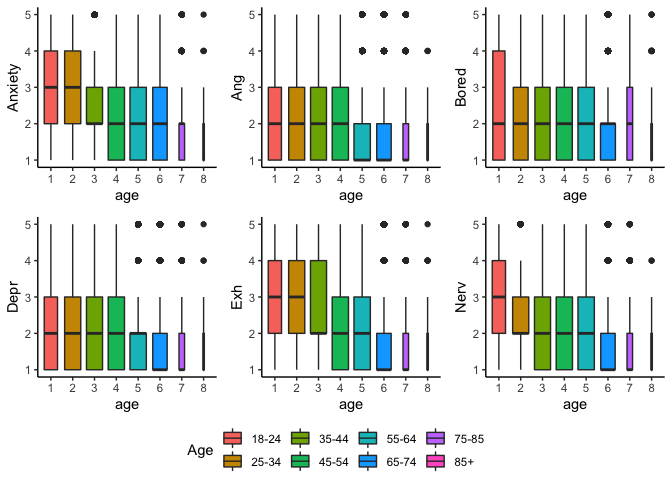
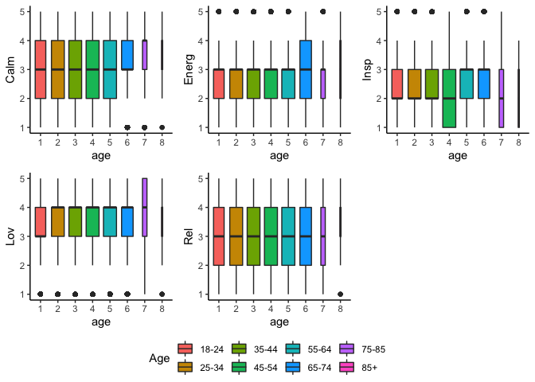
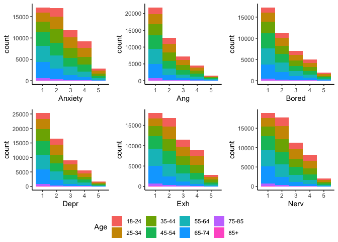
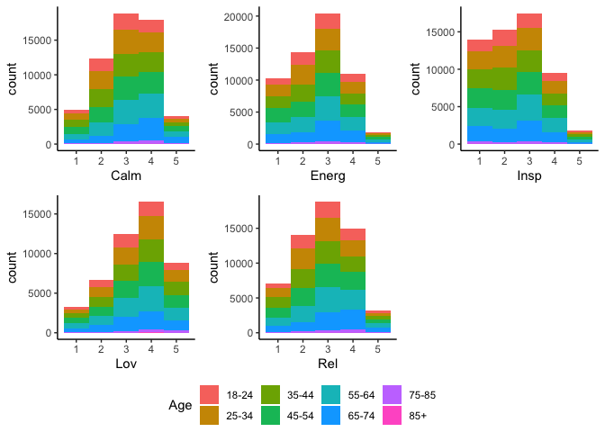
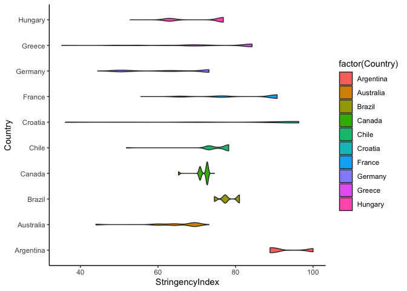
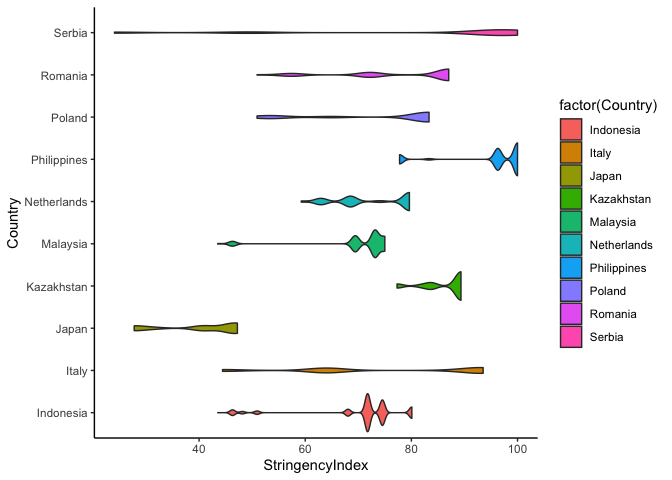
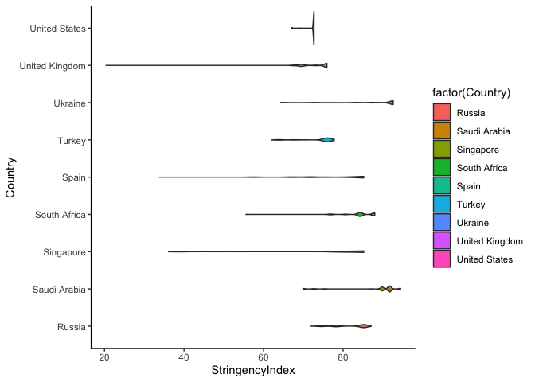

200707 Descriptives
================
Anne Margit
07/07/2020

``` r
library(dplyr)
```

    ## 
    ## Attaching package: 'dplyr'

    ## The following objects are masked from 'package:stats':
    ## 
    ##     filter, lag

    ## The following objects are masked from 'package:base':
    ## 
    ##     intersect, setdiff, setequal, union

``` r
library(tidyverse)
```

    ## ── Attaching packages ─────────────────────────────────────────────────────────────────────────────────────── tidyverse 1.3.0 ──

    ## ✓ ggplot2 3.3.1     ✓ purrr   0.3.4
    ## ✓ tibble  3.0.1     ✓ stringr 1.4.0
    ## ✓ tidyr   1.1.0     ✓ forcats 0.5.0
    ## ✓ readr   1.3.1

    ## ── Conflicts ────────────────────────────────────────────────────────────────────────────────────────── tidyverse_conflicts() ──
    ## x dplyr::filter() masks stats::filter()
    ## x dplyr::lag()    masks stats::lag()

``` r
library(stringr)
library(papaja)
library(ggpubr)
library(ggplot2)
```

Descriptive statistics This dataset includes measurements from
participants that (1) provided at least 3 measurements, (2) that are
residents of the country they currently live in, (3) from countries with
at least 20 participants, (4) provided data on age, combined with
imputed Stringency Index

``` r
load("data_long_min3_str.Rdata")
load("data_means.Rdata")
```

How much missing data is left?

``` r
#Missing data
missing.values <- data_long_min3_str %>%
  gather(key = "key", value = "val") %>%
  dplyr::mutate(is.missing = is.na(val)) %>%
  dplyr::group_by(key, is.missing) %>%
  dplyr::summarise(num.missing = n()) %>%
  dplyr::filter(is.missing==T) %>%
  dplyr::select(-is.missing) %>%
  dplyr::arrange(desc(num.missing))
```

    ## Warning: attributes are not identical across measure variables;
    ## they will be dropped

    ## `summarise()` regrouping output by 'key' (override with `.groups` argument)

``` r
apa_table(missing.values)
```

<caption>

(\#tab:unnamed-chunk-4)

</caption>

<div data-custom-style="Table Caption">

\*\*

</div>

| key             | num.missing |
| :-------------- | :---------- |
| Exc             | 113857      |
| Content         | 113845      |
| Bored           | 81635       |
| Ang             | 76349       |
| Lov             | 76336       |
| Insp            | 66123       |
| Energ           | 66098       |
| Exh             | 66097       |
| Rel             | 66078       |
| Nerv            | 66073       |
| Depr            | 66072       |
| Anxiety         | 66045       |
| Calm            | 66033       |
| StringencyIndex | 65844       |
| ConfirmedCases  | 65836       |
| ConfirmedDeaths | 65836       |
| Date            | 65836       |

Number of participants per country

``` r
data_long_min3_str$Country <- as.factor(data_long_min3_str$Country)

Country_N <- data_long_min3_str %>%
  filter(Wave == "w0") %>%
  group_by(Country) %>%
  summarise(NCountry = n())
```

    ## `summarise()` ungrouping output (override with `.groups` argument)

``` r
apa_table(Country_N)
```

<caption>

(\#tab:unnamed-chunk-6)

</caption>

<div data-custom-style="Table Caption">

\*\*

</div>

| Country        | NCountry |
| :------------- | :------- |
| Argentina      | 209      |
| Australia      | 203      |
| Brazil         | 217      |
| Canada         | 304      |
| Chile          | 84       |
| Croatia        | 141      |
| France         | 357      |
| Germany        | 397      |
| Greece         | 674      |
| Hungary        | 195      |
| Indonesia      | 185      |
| Italy          | 476      |
| Japan          | 76       |
| Kazakhstan     | 82       |
| Kosovo         | 29       |
| Malaysia       | 103      |
| Netherlands    | 674      |
| Peru           | 35       |
| Philippines    | 125      |
| Poland         | 126      |
| Serbia         | 506      |
| Romania        | 307      |
| Russia         | 201      |
| Saudi Arabia   | 71       |
| Singapore      | 42       |
| South Africa   | 218      |
| South Korea    | 21       |
| Spain          | 1021     |
| Turkey         | 179      |
| Ukraine        | 251      |
| United Kingdom | 466      |
| United States  | 2340     |
| Vietnam        | 28       |

Number of measurements per wave, emotion measurements per wave, and
Stringency Index measurements per wave

``` r
data_long_min3_str$Wave <- as.factor(data_long_min3_str$Wave)

Wave_N <- data_long_min3_str %>% 
group_by(Wave)%>%
summarise(NWave = sum (!is.na(Date)), NAng= sum(!is.na(Ang)), NAnx= sum(!is.na(Anxiety)), NBored= sum(!is.na(Bored)), NCalm= sum(!is.na(Calm)),
NDepr= sum(!is.na(Depr)), NEnerg= sum(!is.na(Energ)), NExh= sum(!is.na(Exh)), NInsp= sum(!is.na(Insp)), NLov= sum(!is.na(Lov)), NNerv= sum(!is.na(Nerv)), NRel= sum(!is.na(Rel)), NStr = sum(!is.na(StringencyIndex)))
```

    ## `summarise()` ungrouping output (override with `.groups` argument)

``` r
apa_table(Wave_N)
```

<caption>

(\#tab:unnamed-chunk-8)

</caption>

<div data-custom-style="Table Caption">

\*\*

</div>

| Wave | NWave | NAng | NAnx  | NBored | NCalm | NDepr | NEnerg | NExh  | NInsp | NLov | NNerv | NRel  | NStr  |
| :--- | :---- | :--- | :---- | :----- | :---- | :---- | :----- | :---- | :---- | :--- | :---- | :---- | :---- |
| w0   | 10343 | 0    | 10290 | 10271  | 10277 | 10277 | 10258  | 10260 | 10257 | 0    | 10271 | 10261 | 10343 |
| w1   | 1082  | 1081 | 1081  | 0      | 1081  | 1082  | 1081   | 1081  | 1080  | 1080 | 1081  | 1081  | 1082  |
| w2   | 4109  | 4101 | 4102  | 0      | 4103  | 4100  | 4100   | 4098  | 4098  | 4100 | 4102  | 4101  | 4109  |
| w3   | 4378  | 4364 | 4364  | 0      | 4363  | 4362  | 4363   | 4363  | 4360  | 4361 | 4365  | 4363  | 4378  |
| w4   | 6058  | 6027 | 6033  | 0      | 6037  | 6030  | 6030   | 6028  | 6028  | 6030 | 6033  | 6030  | 6058  |
| w5   | 5758  | 5739 | 5743  | 5746   | 5748  | 5740  | 5741   | 5745  | 5741  | 5745 | 5740  | 5746  | 5758  |
| w6   | 5143  | 5118 | 5126  | 5124   | 5128  | 5120  | 5117   | 5121  | 5116  | 5127 | 5119  | 5123  | 5143  |
| w7   | 4631  | 4607 | 4610  | 4614   | 4615  | 4607  | 4606   | 4605  | 4603  | 4608 | 4608  | 4606  | 4631  |
| w8   | 4705  | 4686 | 4683  | 4686   | 4689  | 4688  | 4690   | 4684  | 4684  | 4692 | 4687  | 4690  | 4705  |
| w9   | 4244  | 4229 | 4229  | 4235   | 4235  | 4230  | 4230   | 4229  | 4227  | 4232 | 4231  | 4233  | 4244  |
| w10  | 3566  | 3563 | 3561  | 3559   | 3558  | 3560  | 3557   | 3560  | 3557  | 3558 | 3561  | 3558  | 3566  |
| w11  | 4263  | 4252 | 4249  | 4246   | 4249  | 4248  | 4245   | 4245  | 4242  | 4247 | 4245  | 4246  | 4255  |

Number of participants per age group

``` r
data_long_min3_str$age <- as.factor(data_long_min3_str$age)

Age_N <- data_long_min3_str %>%
  filter(Wave=="w0") %>%
  group_by(age) %>%
  summarise(NAge = n())
```

    ## `summarise()` ungrouping output (override with `.groups` argument)

``` r
apa_table(Age_N)
```

<caption>

(\#tab:unnamed-chunk-10)

</caption>

<div data-custom-style="Table Caption">

\*\*

</div>

| age | NAge |
| :-- | :--- |
| 1   | 1331 |
| 2   | 1934 |
| 3   | 1876 |
| 4   | 1840 |
| 5   | 1790 |
| 6   | 1376 |
| 7   | 184  |
| 8   | 12   |

Number of males and females per age group

``` r
Age_Gender <- data_long_min3_str %>%
  filter(Wave == "w0") %>%
  select(age, gender) %>%
  group_by(age, gender) %>%
  count(gender)
```

    ## Adding missing grouping variables: `Country`

Note: Age 1 = 18-24, 2 = 25-34, 3 = 35-44, 4 = 45-54, 5 = 55-64, 6 =
65-74, 7 = 75-85, 8 = 85+  
Gender: 1 = Female, 2 = Male, 3 = Other

``` r
apa_table(Age_Gender)
```

<caption>

(\#tab:unnamed-chunk-12)

</caption>

<div data-custom-style="Table Caption">

\*\*

</div>

| age | gender | n    |
| :-- | :----- | :--- |
| 1   | 1      | 1086 |
| 1   | 2      | 245  |
| 2   | 1      | 1456 |
| 2   | 2      | 478  |
| 3   | 1      | 1300 |
| 3   | 2      | 576  |
| 4   | 1      | 1253 |
| 4   | 2      | 587  |
| 5   | 1      | 1082 |
| 5   | 2      | 708  |
| 6   | 1      | 648  |
| 6   | 2      | 728  |
| 7   | 1      | 86   |
| 7   | 2      | 98   |
| 8   | 1      | 7    |
| 8   | 2      | 5    |

Mean and SD, minimum and maximum of Stringency Index per country

``` r
StringencySummary <- data_long_min3_str %>%
  group_by(Country)%>%
  summarize(mean = mean(StringencyIndex, na.rm=TRUE), sd = sd(StringencyIndex, na.rm=TRUE), 
            max = max(StringencyIndex, na.rm=TRUE), min = min(StringencyIndex, na.rm=TRUE))
```

    ## `summarise()` ungrouping output (override with `.groups` argument)

``` r
apa_table(StringencySummary)
```

<caption>

(\#tab:unnamed-chunk-14)

</caption>

<div data-custom-style="Table Caption">

\*\*

</div>

| Country        | mean  | sd    | max    | min   |
| :------------- | :---- | :---- | :----- | :---- |
| Argentina      | 93.10 | 4.82  | 100.00 | 88.89 |
| Australia      | 64.31 | 7.39  | 73.15  | 43.98 |
| Brazil         | 78.09 | 2.52  | 81.02  | 74.54 |
| Canada         | 71.48 | 2.00  | 74.54  | 65.28 |
| Chile          | 75.28 | 5.13  | 78.24  | 51.85 |
| Croatia        | 81.73 | 20.63 | 96.30  | 36.11 |
| France         | 83.19 | 9.68  | 90.74  | 55.56 |
| Germany        | 62.90 | 10.07 | 73.15  | 44.44 |
| Greece         | 73.52 | 12.66 | 84.26  | 35.19 |
| Hungary        | 71.54 | 6.77  | 76.85  | 52.78 |
| Indonesia      | 70.30 | 8.96  | 80.09  | 43.52 |
| Italy          | 74.76 | 17.99 | 93.52  | 44.44 |
| Japan          | 40.45 | 7.65  | 47.22  | 27.78 |
| Kazakhstan     | 86.87 | 4.03  | 89.35  | 77.31 |
| Kosovo         | 79.46 | 14.94 | 92.59  | 42.59 |
| Malaysia       | 70.27 | 7.70  | 75.00  | 43.52 |
| Netherlands    | 72.83 | 6.99  | 79.63  | 59.26 |
| Peru           | 91.12 | 1.96  | 96.30  | 89.81 |
| Philippines    | 95.28 | 7.60  | 100.00 | 77.78 |
| Poland         | 74.71 | 12.76 | 83.33  | 50.93 |
| Serbia         | 81.09 | 26.86 | 100.00 | 24.07 |
| Romania        | 78.39 | 11.33 | 87.04  | 50.93 |
| Russia         | 81.74 | 4.33  | 87.04  | 71.76 |
| Saudi Arabia   | 88.44 | 7.05  | 94.44  | 69.91 |
| Singapore      | 77.25 | 14.61 | 85.19  | 36.11 |
| South Africa   | 84.26 | 4.65  | 87.96  | 55.56 |
| South Korea    | 47.80 | 9.73  | 82.41  | 39.81 |
| Spain          | 77.24 | 8.95  | 85.19  | 33.80 |
| Turkey         | 74.34 | 4.14  | 77.78  | 62.04 |
| Ukraine        | 87.67 | 8.63  | 92.59  | 64.35 |
| United Kingdom | 73.04 | 3.74  | 75.93  | 20.37 |
| United States  | 72.45 | 1.08  | 72.69  | 67.13 |
| Vietnam        | 68.97 | 7.17  | 96.30  | 54.63 |

``` r
data_means2 <- data_means %>%
dplyr::rename(Ang_mean = Ang,
Axiety_mean = Anxiety,
Bored_mean = Bored,
Calm_mean = Calm,
Depr_mean = Depr,
Energ_mean = Energ,
Exh_mean = Exh,
Insp_mean = Insp,
Lov_mean = Lov,
Nerv_mean = Nerv,
Rel_mean = Rel)

data_graphs<- left_join(data_long_min3_str, data_means2, by="ID")
```

The dataframe data\_graphs contains both raw scores and participant mean
scores, mean scores have the addition "\_mean"

Boxplots

``` r
theme_set(theme_classic())

gb_anx <- ggplot(data_graphs, aes(age, Anxiety)) + geom_boxplot(varwidth=T, aes(fill= age)) + scale_fill_discrete(name="Age", labels = c("18-24", "25-34", "35-44", "45-54", "55-64", "65-74", "75-85", "85+"))

gb_ang <- ggplot(data_graphs, aes(age, Ang)) + geom_boxplot(varwidth=T, aes(fill= age)) + scale_fill_discrete(name="Age", labels = c("18-24", "25-34", "35-44", "45-54", "55-64", "65-74", "75-85", "85+"))

gb_bor <- ggplot(data_graphs, aes(age, Bored)) + geom_boxplot(varwidth=T, aes(fill= age)) + scale_fill_discrete(name="Age", labels = c("18-24", "25-34", "35-44", "45-54", "55-64", "65-74", "75-85", "85+"))

gb_depr <- ggplot(data_graphs, aes(age, Depr)) + geom_boxplot(varwidth=T, aes(fill= age)) + scale_fill_discrete(name="Age", labels = c("18-24", "25-34", "35-44", "45-54", "55-64", "65-74", "75-85", "85+"))

gb_exh <- ggplot(data_graphs, aes(age, Exh)) + geom_boxplot(varwidth=T, aes(fill= age)) + scale_fill_discrete(name="Age", labels = c("18-24", "25-34", "35-44", "45-54", "55-64", "65-74", "75-85", "85+"))

gb_nerv <- ggplot(data_graphs, aes(age, Nerv)) + geom_boxplot(varwidth=T, aes(fill= age)) + scale_fill_discrete(name="Age", labels = c("18-24", "25-34", "35-44", "45-54", "55-64", "65-74", "75-85", "85+"))

gb_calm <- ggplot(data_graphs, aes(age, Calm)) + geom_boxplot(varwidth=T, aes(fill= age)) + scale_fill_discrete(name="Age", labels = c("18-24", "25-34", "35-44", "45-54", "55-64", "65-74", "75-85", "85+"))

gb_energ <- ggplot(data_graphs, aes(age, Energ)) + geom_boxplot(varwidth=T, aes(fill= age)) + scale_fill_discrete(name="Age", labels = c("18-24", "25-34", "35-44", "45-54", "55-64", "65-74", "75-85", "85+"))

gb_insp <- ggplot(data_graphs, aes(age, Insp)) + geom_boxplot(varwidth=T, aes(fill= age)) + scale_fill_discrete(name="Age", labels = c("18-24", "25-34", "35-44", "45-54", "55-64", "65-74", "75-85", "85+"))

gb_lov <- ggplot(data_graphs, aes(age, Lov)) + geom_boxplot(varwidth=T, aes(fill= age)) + scale_fill_discrete(name="Age", labels = c("18-24", "25-34", "35-44", "45-54", "55-64", "65-74", "75-85", "85+"))

gb_rel <- ggplot(data_graphs, aes(age, Rel)) + geom_boxplot(varwidth=T, aes(fill= age)) + scale_fill_discrete(name="Age", labels = c("18-24", "25-34", "35-44", "45-54", "55-64", "65-74", "75-85", "85+"))

gb_NA <- ggarrange(gb_anx, gb_ang, gb_bor, gb_depr, gb_exh, gb_nerv, ncol = 3, nrow = 2, common.legend= TRUE, legend = "bottom")
```

    ## Warning: Removed 66045 rows containing non-finite values (stat_boxplot).
    
    ## Warning: Removed 66045 rows containing non-finite values (stat_boxplot).

    ## Warning: Removed 76349 rows containing non-finite values (stat_boxplot).

    ## Warning: Removed 81635 rows containing non-finite values (stat_boxplot).

    ## Warning: Removed 66072 rows containing non-finite values (stat_boxplot).

    ## Warning: Removed 66097 rows containing non-finite values (stat_boxplot).

    ## Warning: Removed 66073 rows containing non-finite values (stat_boxplot).

``` r
gb_PA <- ggarrange(gb_calm, gb_energ, gb_insp, gb_lov, gb_rel, ncol = 3, nrow = 2, common.legend= TRUE, legend = "bottom")
```

    ## Warning: Removed 66033 rows containing non-finite values (stat_boxplot).

    ## Warning: Removed 66033 rows containing non-finite values (stat_boxplot).

    ## Warning: Removed 66098 rows containing non-finite values (stat_boxplot).

    ## Warning: Removed 66123 rows containing non-finite values (stat_boxplot).

    ## Warning: Removed 76336 rows containing non-finite values (stat_boxplot).

    ## Warning: Removed 66078 rows containing non-finite values (stat_boxplot).

``` r
gb_NA
```

<!-- -->

``` r
gb_PA
```

<!-- -->

Histograms
NA

``` r
g_anx <- ggplot(data_graphs, aes(x=Anxiety, fill=age)) + geom_histogram(binwidth=1) + scale_fill_discrete(name="Age", labels = c("18-24", "25-34", "35-44", "45-54", "55-64", "65-74", "75-85", "85+"))

g_ang <- ggplot(data_graphs, aes(x=Ang, fill=age)) + geom_histogram(binwidth=1) + scale_fill_discrete(name="Age", labels = c("18-24", "25-34", "35-44", "45-54", "55-64", "65-74", "75-85", "85+"))

g_bor <- ggplot(data_graphs, aes(x=Bored, fill=age)) + geom_histogram(binwidth=1) + scale_fill_discrete(name="Age", labels = c("18-24", "25-34", "35-44", "45-54", "55-64", "65-74", "75-85", "85+"))

g_dep <- ggplot(data_graphs, aes(x=Depr, fill=age)) + geom_histogram(binwidth=1) + scale_fill_discrete(name="Age", labels = c("18-24", "25-34", "35-44", "45-54", "55-64", "65-74", "75-85", "85+"))

g_exh <- ggplot(data_graphs, aes(x=Exh, fill=age)) + geom_histogram(binwidth=1) + scale_fill_discrete(name="Age", labels = c("18-24", "25-34", "35-44", "45-54", "55-64", "65-74", "75-85", "85+"))

g_nerv <- ggplot(data_graphs, aes(x=Nerv, fill=age)) + geom_histogram(binwidth=1) + scale_fill_discrete(name="Age", labels = c("18-24", "25-34", "35-44", "45-54", "55-64", "65-74", "75-85", "85+"))

g_calm <- ggplot(data_graphs, aes(x=Calm, fill=age)) + geom_histogram(binwidth=1) + scale_fill_discrete(name="Age", labels = c("18-24", "25-34", "35-44", "45-54", "55-64", "65-74", "75-85", "85+"))

g_energ <- ggplot(data_graphs, aes(x=Energ, fill=age))  + geom_histogram(binwidth=1) + scale_fill_discrete(name="Age", labels = c("18-24", "25-34", "35-44", "45-54", "55-64", "65-74", "75-85", "85+"))

g_insp <- ggplot(data_graphs, aes(x=Insp, fill=age))  + geom_histogram(binwidth=1) + scale_fill_discrete(name="Age", labels = c("18-24", "25-34", "35-44", "45-54", "55-64", "65-74", "75-85", "85+"))

g_lov <- ggplot(data_graphs, aes(x=Lov, fill=age))  + geom_histogram(binwidth=1) + scale_fill_discrete(name="Age", labels = c("18-24", "25-34", "35-44", "45-54", "55-64", "65-74", "75-85", "85+"))

g_rel <- ggplot(data_graphs, aes(x=Rel, fill=age))  + geom_histogram(binwidth=1) + scale_fill_discrete(name="Age", labels = c("18-24", "25-34", "35-44", "45-54", "55-64", "65-74", "75-85", "85+"))

g_NA <- ggarrange(g_anx, g_ang, g_bor, g_dep, g_exh, g_nerv, ncol = 3, nrow = 2, common.legend= TRUE, legend = "bottom")
```

    ## Warning: Removed 66045 rows containing non-finite values (stat_bin).
    
    ## Warning: Removed 66045 rows containing non-finite values (stat_bin).

    ## Warning: Removed 76349 rows containing non-finite values (stat_bin).

    ## Warning: Removed 81635 rows containing non-finite values (stat_bin).

    ## Warning: Removed 66072 rows containing non-finite values (stat_bin).

    ## Warning: Removed 66097 rows containing non-finite values (stat_bin).

    ## Warning: Removed 66073 rows containing non-finite values (stat_bin).

``` r
g_PA <- ggarrange(g_calm, g_energ, g_insp, g_lov, g_rel, ncol = 3, nrow = 2, common.legend= TRUE, legend = "bottom")
```

    ## Warning: Removed 66033 rows containing non-finite values (stat_bin).

    ## Warning: Removed 66033 rows containing non-finite values (stat_bin).

    ## Warning: Removed 66098 rows containing non-finite values (stat_bin).

    ## Warning: Removed 66123 rows containing non-finite values (stat_bin).

    ## Warning: Removed 76336 rows containing non-finite values (stat_bin).

    ## Warning: Removed 66078 rows containing non-finite values (stat_bin).

``` r
g_NA
```

<!-- -->

``` r
g_PA
```

<!-- -->

Stringency plots

``` r
data_graphs$Country <- as.character(data_graphs$Country)

data_graphs1 <- data_graphs %>%
filter(Country == "Argentina" |  Country == "Australia" | Country == "Brazil" | Country == "Canada" | Country == "Chile" 
       | Country == "Croatia" | Country == "France" | Country == "Germany" | Country == "Greece" | Country == "Hungary")

data_graphs2 <- data_graphs %>%
filter(Country == "Indonesia" | Country == "Italy" | Country == "Japan" | Country == "Kazakhstan" | Country == "Malaysia" 
       | Country == "Netherlands" | Country == "Philippines" | Country == "Poland" | Country == "Serbia" | Country == "Romania")

data_graphs3 <- data_graphs %>%
filter(Country == "Russia" | Country == "Saudi Arabia" | Country == "Singapore" | Country == "South Africa" | Country == "Spain" 
       | Country == "Turkey" | Country == "Ukraine" | Country == "United Kingdom" | Country == "United States")

g_s1 <- ggplot(data_graphs1, aes(StringencyIndex, Country)) + geom_violin(aes(fill=factor(Country)))

g_s2 <- ggplot(data_graphs2, aes(StringencyIndex, Country)) + geom_violin(aes(fill=factor(Country)))

g_s3 <- ggplot(data_graphs3, aes(StringencyIndex, Country)) + geom_violin(aes(fill=factor(Country)))
```

``` r
g_s1
```

    ## Warning: Removed 17586 rows containing non-finite values (stat_ydensity).

<!-- -->

``` r
g_s2
```

    ## Warning: Removed 16967 rows containing non-finite values (stat_ydensity).

<!-- -->

``` r
g_s3
```

    ## Warning: Removed 30393 rows containing non-finite values (stat_ydensity).

<!-- -->
