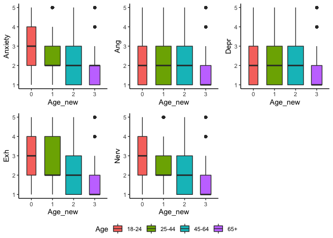
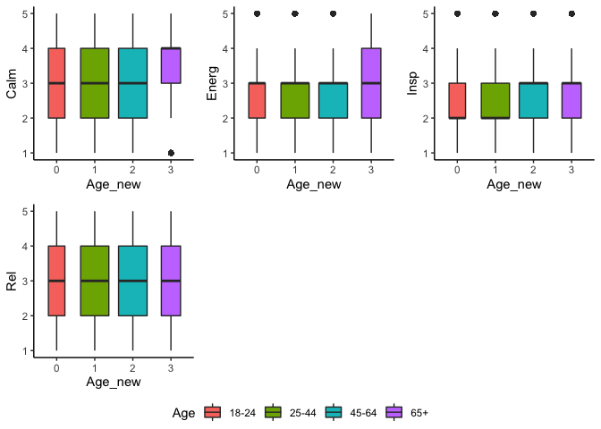
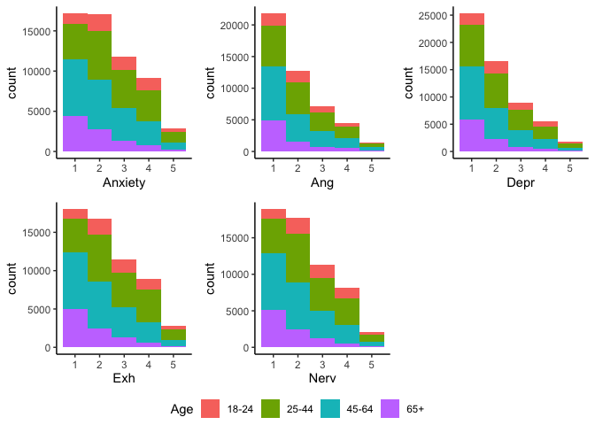
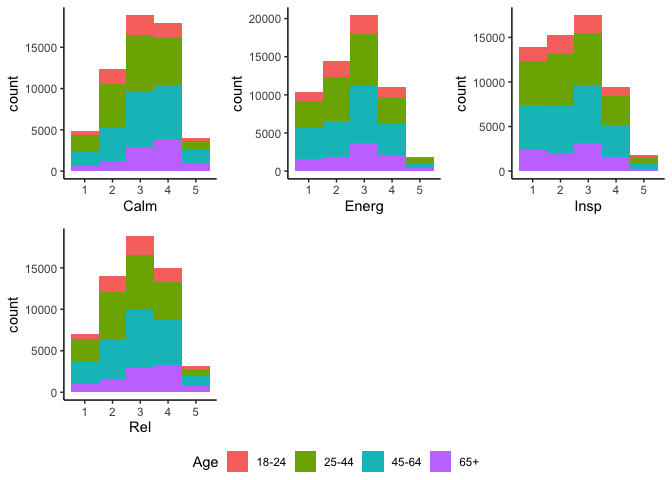
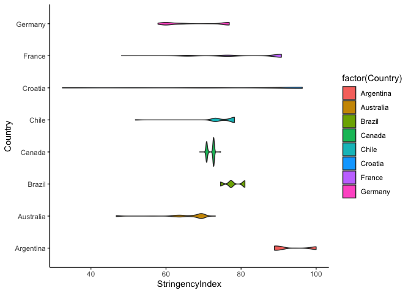
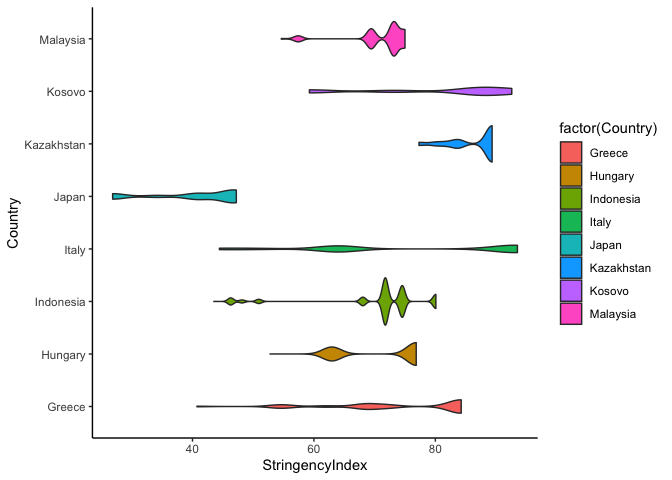
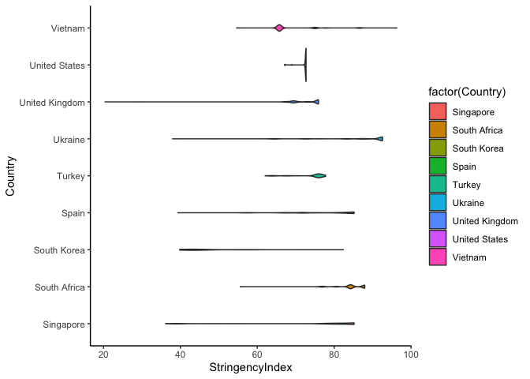

200822 Descriptives pooled age groups
================
Anne Margit
08/22/2020

``` r
library(dplyr)
library(tidyverse)
library(stringr)
library(papaja)
library(ggpubr)
library(ggplot2)
```

Descriptive statistics This dataset includes measurements from
participants that (1) provided at least 3 measurements, (2) that are
residents of the country they currently live in, (3) from countries with
at least 20 participants, (4) provided data on age, combined with
imputed Stringency Index (5) pooled age groups

``` r
load("data_long_min3_str_age.Rdata")
```

How much missing data is left?

``` r
#Missing data
missing.values <- data_long_min3_str_age %>%
  gather(key = "key", value = "val") %>%
  dplyr::mutate(is.missing = is.na(val)) %>%
  dplyr::group_by(key, is.missing) %>%
  dplyr::summarise(num.missing = n()) %>%
  dplyr::filter(is.missing==T) %>%
  dplyr::select(-is.missing) %>%
  dplyr::arrange(desc(num.missing))
```

    ## Warning: attributes are not identical across measure variables;
    ## they will be dropped

``` r
apa_table(missing.values, caption="Missing data")
```

<caption>

(\#tab:unnamed-chunk-4)

</caption>

<div data-custom-style="Table Caption">

*Missing data*

</div>

| key             | num.missing |
| :-------------- | :---------- |
| Ang             | 76349       |
| Insp            | 66123       |
| Energ           | 66098       |
| Exh             | 66097       |
| Rel             | 66078       |
| Nerv            | 66073       |
| Depr            | 66072       |
| Anxiety         | 66045       |
| Calm            | 66033       |
| ConfirmedCases  | 65836       |
| ConfirmedDeaths | 65836       |
| Date            | 65836       |
| StringencyIndex | 65836       |

Number of participants per country on
baseline

``` r
data_long_min3_str_age$Country <- as.factor(data_long_min3_str_age$Country)

Country_N <- data_long_min3_str_age %>%
  filter(Time == "1") %>%
  group_by(Country) %>%
  summarise(NCountry = n())
```

``` r
apa_table(Country_N, caption = "Number of participants per country on baseline")
```

<caption>

(\#tab:unnamed-chunk-6)

</caption>

<div data-custom-style="Table Caption">

*Number of participants per country on baseline*

</div>

| Country        | NCountry |
| :------------- | :------- |
| Argentina      | 209      |
| Australia      | 203      |
| Brazil         | 217      |
| Canada         | 304      |
| Chile          | 84       |
| Croatia        | 141      |
| France         | 357      |
| Germany        | 397      |
| Greece         | 674      |
| Hungary        | 195      |
| Indonesia      | 185      |
| Italy          | 476      |
| Japan          | 76       |
| Kazakhstan     | 82       |
| Kosovo         | 29       |
| Malaysia       | 103      |
| Netherlands    | 674      |
| Peru           | 35       |
| Philippines    | 125      |
| Poland         | 126      |
| Serbia         | 506      |
| Romania        | 307      |
| Russia         | 201      |
| Saudi Arabia   | 71       |
| Singapore      | 42       |
| South Africa   | 218      |
| South Korea    | 21       |
| Spain          | 1021     |
| Turkey         | 179      |
| Ukraine        | 251      |
| United Kingdom | 466      |
| United States  | 2340     |
| Vietnam        | 28       |

Number of measurements per wave, emotion measurements per wave, and
Stringency Index measurements per wave

``` r
data_long_min3_str_age$Time <- as.factor(data_long_min3_str_age$Time)

Wave_N <- data_long_min3_str_age %>% 
group_by(Time)%>%
summarise(NWave = sum (!is.na(Date)), NAng= sum(!is.na(Ang)), NAnx= sum(!is.na(Anxiety)), NNerv= sum(!is.na(Nerv)), NDepr= sum(!is.na(Depr)), NExh= sum(!is.na(Exh)), NEnerg= sum(!is.na(Energ)),  NInsp= sum(!is.na(Insp)), NCalm= sum(!is.na(Calm)), NRel= sum(!is.na(Rel)), NStr = sum(!is.na(StringencyIndex)))
```

``` r
apa_table(Wave_N, caption="Number of measurements per wave")
```

<caption>

(\#tab:unnamed-chunk-8)

</caption>

<div data-custom-style="Table Caption">

*Number of measurements per
wave*

</div>

| Time | NWave | NAng | NAnx  | NNerv | NDepr | NExh  | NEnerg | NInsp | NCalm | NRel  | NStr  |
| :--- | :---- | :--- | :---- | :---- | :---- | :---- | :----- | :---- | :---- | :---- | :---- |
| 1    | 10343 | 0    | 10290 | 10271 | 10277 | 10260 | 10258  | 10257 | 10277 | 10261 | 10343 |
| 2    | 1082  | 1081 | 1081  | 1081  | 1082  | 1081  | 1081   | 1080  | 1081  | 1081  | 1082  |
| 3    | 4109  | 4101 | 4102  | 4102  | 4100  | 4098  | 4100   | 4098  | 4103  | 4101  | 4109  |
| 4    | 4378  | 4364 | 4364  | 4365  | 4362  | 4363  | 4363   | 4360  | 4363  | 4363  | 4378  |
| 5    | 6058  | 6027 | 6033  | 6033  | 6030  | 6028  | 6030   | 6028  | 6037  | 6030  | 6058  |
| 6    | 5758  | 5739 | 5743  | 5740  | 5740  | 5745  | 5741   | 5741  | 5748  | 5746  | 5758  |
| 7    | 5143  | 5118 | 5126  | 5119  | 5120  | 5121  | 5117   | 5116  | 5128  | 5123  | 5143  |
| 8    | 4631  | 4607 | 4610  | 4608  | 4607  | 4605  | 4606   | 4603  | 4615  | 4606  | 4631  |
| 9    | 4705  | 4686 | 4683  | 4687  | 4688  | 4684  | 4690   | 4684  | 4689  | 4690  | 4705  |
| 10   | 4244  | 4229 | 4229  | 4231  | 4230  | 4229  | 4230   | 4227  | 4235  | 4233  | 4244  |
| 11   | 3566  | 3563 | 3561  | 3561  | 3560  | 3560  | 3557   | 3557  | 3558  | 3558  | 3566  |
| 12   | 4263  | 4252 | 4249  | 4245  | 4248  | 4245  | 4245   | 4242  | 4249  | 4246  | 4263  |

Number of participants per age group on baseline

``` r
data_long_min3_str_age$Age <- as.factor(data_long_min3_str_age$Age)

Age_N <- data_long_min3_str_age %>%
  filter(Time=="1") %>%
  group_by(Age) %>%
  summarise(NAge = n())
```

``` r
apa_table(Age_N, caption="Number of participants per age group on baseline")
```

<caption>

(\#tab:unnamed-chunk-10)

</caption>

<div data-custom-style="Table Caption">

*Number of participants per age group on baseline*

</div>

| Age | NAge |
| :-- | :--- |
| 1   | 1331 |
| 2   | 1934 |
| 3   | 1876 |
| 4   | 1840 |
| 5   | 1790 |
| 6   | 1376 |
| 7   | 184  |
| 8   | 12   |

Number of participants per pooled age
group

``` r
data_long_min3_str_age$Age_new <- as.factor(data_long_min3_str_age$Age_new)

Age_New <- data_long_min3_str_age %>%
  filter(Time=="1") %>%
  group_by(Age_new) %>%
  summarise(NAge = n())
```

``` r
apa_table(Age_New, caption="Number of participants per pooled age group on baseline")
```

<caption>

(\#tab:unnamed-chunk-12)

</caption>

<div data-custom-style="Table Caption">

*Number of participants per pooled age group on baseline*

</div>

| Age\_new | NAge |
| :------- | :--- |
| 0        | 1331 |
| 1        | 3810 |
| 2        | 3630 |
| 3        | 1572 |

Number of males and females per age group on baseline

``` r
Age_Gender <- data_long_min3_str_age %>%
  filter(Time == "1") %>%
  select(Age, Gender) %>%
  group_by(Age, Gender) %>%
  count(Gender)
```

``` r
apa_table(Age_Gender, caption="Number of males and females per age group on baseline", note="Age 1= 18-24; 2= 25-34; 3= 35-44; 4= 45-54; 5= 55-64; 6= 65-74; 7= 75-84; 8=85+; Gender 0= male; 1= female")
```

<caption>

(\#tab:unnamed-chunk-14)

</caption>

<div data-custom-style="Table Caption">

*Number of males and females per age group on baseline*

</div>

| Age | Gender | n    |
| :-- | :----- | :--- |
| 1   | 0.00   | 245  |
| 1   | 1.00   | 1086 |
| 2   | 0.00   | 478  |
| 2   | 1.00   | 1456 |
| 3   | 0.00   | 576  |
| 3   | 1.00   | 1300 |
| 4   | 0.00   | 587  |
| 4   | 1.00   | 1253 |
| 5   | 0.00   | 708  |
| 5   | 1.00   | 1082 |
| 6   | 0.00   | 728  |
| 6   | 1.00   | 648  |
| 7   | 0.00   | 98   |
| 7   | 1.00   | 86   |
| 8   | 0.00   | 5    |
| 8   | 1.00   | 7    |

<div data-custom-style="Compact">

*Note.* Age 1= 18-24; 2= 25-34; 3= 35-44; 4= 45-54; 5= 55-64; 6= 65-74;
7= 75-84; 8=85+; Gender 0= male; 1= female

</div>

 

Number of males and females per pooled age group on baseline

``` r
Age_New_Gender <- data_long_min3_str_age %>%
  filter(Time == "1") %>%
  select(Age_new, Gender) %>%
  group_by(Age_new, Gender) %>%
  count(Gender)
```

``` r
apa_table(Age_New_Gender, caption = "Number of males and females per pooled age group on baseline",
          note= "Age 0= 18-24; 1= 25-44; 2= 45-64; 3= 65+, Gender 0= male; 1= female")
```

<caption>

(\#tab:unnamed-chunk-16)

</caption>

<div data-custom-style="Table Caption">

*Number of males and females per pooled age group on baseline*

</div>

| Age\_new | Gender | n    |
| :------- | :----- | :--- |
| 0        | 0.00   | 245  |
| 0        | 1.00   | 1086 |
| 1        | 0.00   | 1054 |
| 1        | 1.00   | 2756 |
| 2        | 0.00   | 1295 |
| 2        | 1.00   | 2335 |
| 3        | 0.00   | 831  |
| 3        | 1.00   | 741  |

<div data-custom-style="Compact">

*Note.* Age 0= 18-24; 1= 25-44; 2= 45-64; 3= 65+, Gender 0= male; 1=
female

</div>

 

Mean and SD, minimum and maximum of Stringency Index per country

``` r
StringencySummary <- data_long_min3_str_age %>%
  group_by(Country)%>%
  summarize(mean = mean(StringencyIndex, na.rm=TRUE), sd = sd(StringencyIndex, na.rm=TRUE), 
            max = max(StringencyIndex, na.rm=TRUE), min = min(StringencyIndex, na.rm=TRUE))
```

``` r
apa_table(StringencySummary, caption="Stringency Index per country")
```

<caption>

(\#tab:unnamed-chunk-18)

</caption>

<div data-custom-style="Table Caption">

*Stringency Index per country*

</div>

| Country        | mean  | sd    | max    | min   |
| :------------- | :---- | :---- | :----- | :---- |
| Argentina      | 93.10 | 4.82  | 100.00 | 88.89 |
| Australia      | 65.47 | 6.46  | 73.15  | 46.76 |
| Brazil         | 78.09 | 2.52  | 81.02  | 74.54 |
| Canada         | 71.91 | 0.93  | 74.54  | 68.98 |
| Chile          | 75.28 | 5.13  | 78.24  | 51.85 |
| Croatia        | 81.51 | 21.15 | 96.30  | 32.41 |
| France         | 83.17 | 9.75  | 90.74  | 48.15 |
| Germany        | 67.75 | 7.80  | 76.85  | 57.87 |
| Greece         | 73.98 | 11.71 | 84.26  | 40.74 |
| Hungary        | 71.54 | 6.77  | 76.85  | 52.78 |
| Indonesia      | 70.30 | 8.96  | 80.09  | 43.52 |
| Italy          | 75.19 | 17.36 | 93.52  | 44.44 |
| Japan          | 40.49 | 7.74  | 47.22  | 26.85 |
| Kazakhstan     | 86.86 | 3.86  | 89.35  | 77.31 |
| Kosovo         | 81.13 | 12.30 | 92.59  | 59.26 |
| Malaysia       | 71.22 | 4.76  | 75.00  | 54.63 |
| Netherlands    | 72.83 | 6.99  | 79.63  | 59.26 |
| Peru           | 91.12 | 1.96  | 96.30  | 89.81 |
| Philippines    | 95.28 | 7.60  | 100.00 | 77.78 |
| Poland         | 74.71 | 12.76 | 83.33  | 50.93 |
| Serbia         | 81.09 | 26.86 | 100.00 | 24.07 |
| Romania        | 78.31 | 11.55 | 87.04  | 41.67 |
| Russia         | 81.74 | 4.33  | 87.04  | 71.76 |
| Saudi Arabia   | 88.44 | 7.05  | 94.44  | 69.91 |
| Singapore      | 77.25 | 14.61 | 85.19  | 36.11 |
| South Africa   | 84.26 | 4.65  | 87.96  | 55.56 |
| South Korea    | 47.80 | 9.73  | 82.41  | 39.81 |
| Spain          | 77.25 | 8.90  | 85.19  | 39.35 |
| Turkey         | 74.34 | 4.14  | 77.78  | 62.04 |
| Ukraine        | 87.61 | 8.89  | 92.59  | 37.96 |
| United Kingdom | 73.04 | 3.74  | 75.93  | 20.37 |
| United States  | 72.45 | 1.08  | 72.69  | 67.13 |
| Vietnam        | 68.97 | 7.17  | 96.30  | 54.63 |

Boxplots

``` r
theme_set(theme_classic())

gb_anx <- ggplot(data_long_min3_str_age, aes(Age_new, Anxiety)) + geom_boxplot(varwidth=T, aes(fill= Age_new)) + scale_fill_discrete(name="Age", labels = c("18-24", "25-44", "45-64", "65+"))

gb_ang <- ggplot(data_long_min3_str_age, aes(Age_new, Ang)) + geom_boxplot(varwidth=T, aes(fill= Age_new)) + scale_fill_discrete(name="Age", labels = c("18-24", "25-44", "45-64", "65+"))

gb_nerv <- ggplot(data_long_min3_str_age, aes(Age_new, Nerv)) + geom_boxplot(varwidth=T, aes(fill= Age_new)) + scale_fill_discrete(name="Age", labels = c("18-24", "25-44", "45-64", "65+"))

gb_depr <- ggplot(data_long_min3_str_age, aes(Age_new, Depr)) + geom_boxplot(varwidth=T, aes(fill= Age_new)) + scale_fill_discrete(name="Age", labels = c("18-24", "25-44", "45-64", "65+"))

gb_exh <- ggplot(data_long_min3_str_age, aes(Age_new, Exh)) + geom_boxplot(varwidth=T, aes(fill= Age_new)) + scale_fill_discrete(name="Age", labels = c("18-24", "25-44", "45-64", "65+"))

gb_energ <- ggplot(data_long_min3_str_age, aes(Age_new, Energ)) + geom_boxplot(varwidth=T, aes(fill= Age_new)) + scale_fill_discrete(name="Age", labels = c("18-24", "25-44", "45-64", "65+"))

gb_insp <- ggplot(data_long_min3_str_age, aes(Age_new, Insp)) + geom_boxplot(varwidth=T, aes(fill= Age_new)) + scale_fill_discrete(name="Age", labels = c("18-24", "25-44", "45-64", "65+"))

gb_calm <- ggplot(data_long_min3_str_age, aes(Age_new, Calm)) + geom_boxplot(varwidth=T, aes(fill= Age_new)) + scale_fill_discrete(name="Age", labels = c("18-24", "25-44", "45-64", "65+"))

gb_rel <- ggplot(data_long_min3_str_age, aes(Age_new, Rel)) + geom_boxplot(varwidth=T, aes(fill= Age_new)) + scale_fill_discrete(name="Age", labels = c("18-24", "25-44", "45-64", "65+"))

gb_NA <- ggarrange(gb_anx, gb_ang, gb_depr, gb_exh, gb_nerv, ncol = 3, nrow = 2, common.legend= TRUE, legend = "bottom")

gb_PA <- ggarrange(gb_calm, gb_energ, gb_insp, gb_rel, ncol = 3, nrow = 2, common.legend= TRUE, legend = "bottom")
```

``` r
gb_NA
```

<!-- -->

``` r
gb_PA
```

<!-- -->

Histograms
NA

``` r
g_anx <- ggplot(data_long_min3_str_age, aes(x=Anxiety, fill=Age_new)) + geom_histogram(binwidth=1) + scale_fill_discrete(name="Age", labels = c("18-24", "25-44", "45-64", "65+"))

g_ang <- ggplot(data_long_min3_str_age, aes(x=Ang, fill=Age_new)) + geom_histogram(binwidth=1) + scale_fill_discrete(name="Age", labels = c("18-24", "25-44", "45-64", "65+"))

g_nerv <- ggplot(data_long_min3_str_age, aes(x=Nerv, fill=Age_new)) + geom_histogram(binwidth=1) + scale_fill_discrete(name="Age", labels = c("18-24", "25-44", "45-64", "65+"))

g_dep <- ggplot(data_long_min3_str_age, aes(x=Depr, fill=Age_new)) + geom_histogram(binwidth=1) + scale_fill_discrete(name="Age", labels = c("18-24", "25-44", "45-64", "65+"))

g_exh <- ggplot(data_long_min3_str_age, aes(x=Exh, fill=Age_new)) + geom_histogram(binwidth=1) + scale_fill_discrete(name="Age", labels = c("18-24", "25-44", "45-64", "65+"))

g_energ <- ggplot(data_long_min3_str_age, aes(x=Energ, fill=Age_new))  + geom_histogram(binwidth=1) + scale_fill_discrete(name="Age", labels = c("18-24", "25-44", "45-64", "65+"))

g_insp <- ggplot(data_long_min3_str_age, aes(x=Insp, fill=Age_new))  + geom_histogram(binwidth=1) + scale_fill_discrete(name="Age", labels = c("18-24", "25-44", "45-64", "65+"))

g_calm <- ggplot(data_long_min3_str_age, aes(x=Calm, fill=Age_new)) + geom_histogram(binwidth=1) + scale_fill_discrete(name="Age", labels = c("18-24", "25-44", "45-64", "65+"))

g_rel <- ggplot(data_long_min3_str_age, aes(x=Rel, fill=Age_new))  + geom_histogram(binwidth=1) + scale_fill_discrete(name="Age", labels = c("18-24", "25-44", "45-64", "65+"))

gh_NA <- ggarrange(g_anx, g_ang, g_dep, g_exh, g_nerv, ncol = 3, nrow = 2, common.legend= TRUE, legend = "bottom")

gh_PA <- ggarrange(g_calm, g_energ, g_insp, g_rel, ncol = 3, nrow = 2, common.legend= TRUE, legend = "bottom")
```

``` r
gh_NA
```

<!-- -->

``` r
gh_PA
```

<!-- -->

Stringency
plots

``` r
data_long_min3_str_age$Country <- as.character(data_long_min3_str_age$Country)

data_graphs1 <- data_long_min3_str_age %>%
filter(Country == "Argentina" |  Country == "Australia" | Country == "Brazil" | Country == "Canada" | Country == "Chile" 
       | Country == "Croatia" | Country == "France" | Country == "Germany" )

data_graphs2 <- data_long_min3_str_age %>%
filter(Country == "Greece" | Country == "Hungary" | Country == "Indonesia" | Country == "Italy" | Country == "Japan" | Country == "Kazakhstan" | Country == "Kosovo" | Country == "Malaysia" )

data_graphs3 <- data_long_min3_str_age %>%
filter(Country == "Netherlands" | Country == "Peru" | Country == "Philippines" | Country == "Poland" | Country == "Serbia" | Country == "Romania" |
         Country == "Russia" | Country == "Saudi Arabia")

data_graphs4 <- data_long_min3_str_age %>%
filter(Country == "Singapore" | Country == "South Africa" | Country == "South Korea" | Country == "Spain" 
       | Country == "Turkey" | Country == "Ukraine" | Country == "United Kingdom" | Country == "United States" | Country == "Vietnam")

g_s1 <- ggplot(data_graphs1, aes(StringencyIndex, Country)) + geom_violin(aes(fill=factor(Country)))

g_s2 <- ggplot(data_graphs2, aes(StringencyIndex, Country)) + geom_violin(aes(fill=factor(Country)))

g_s3 <- ggplot(data_graphs3, aes(StringencyIndex, Country)) + geom_violin(aes(fill=factor(Country)))

g_s4 <- ggplot(data_graphs4, aes(StringencyIndex, Country)) + geom_violin(aes(fill=factor(Country)))
```

``` r
g_s1
```

<!-- -->

``` r
g_s2
```

<!-- -->

``` r
g_s3
```

<!-- -->

``` r
g_s4
```

<!-- -->
