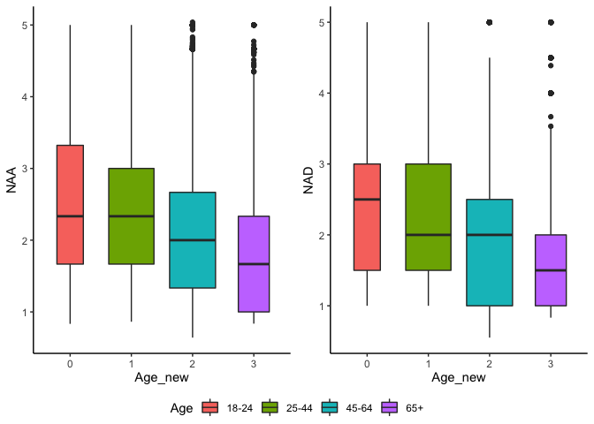
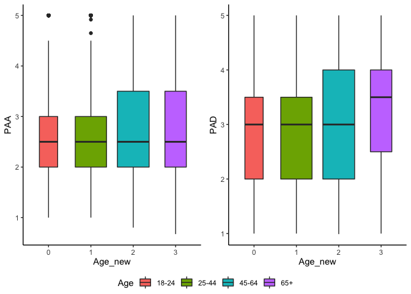
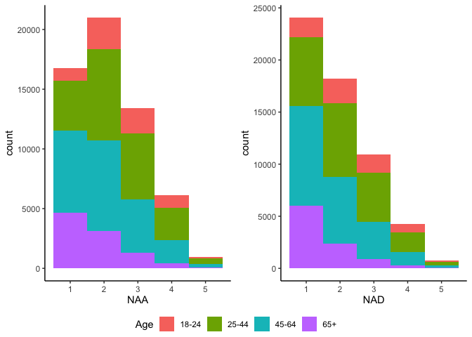
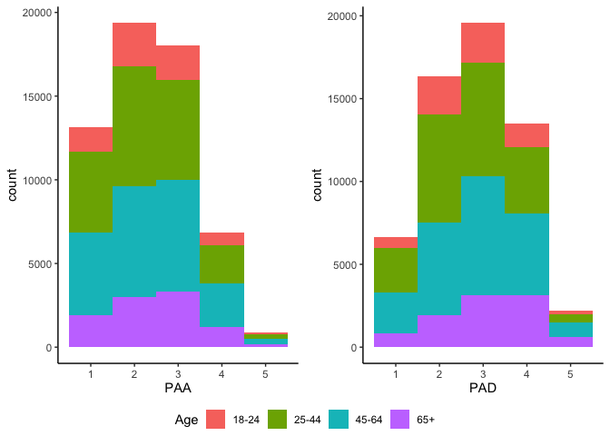
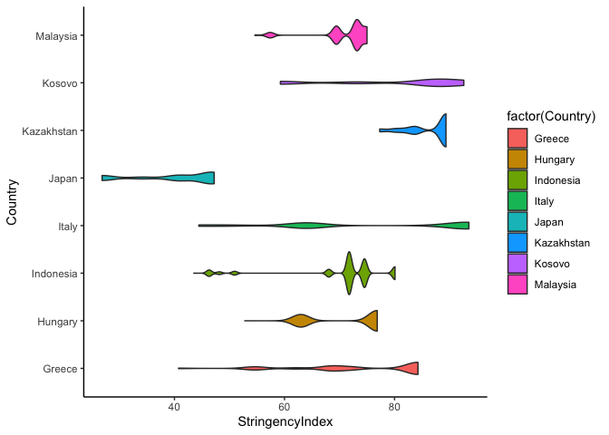
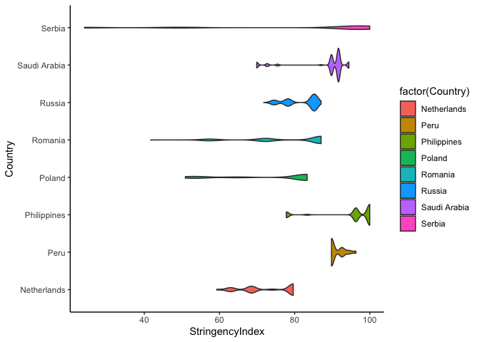
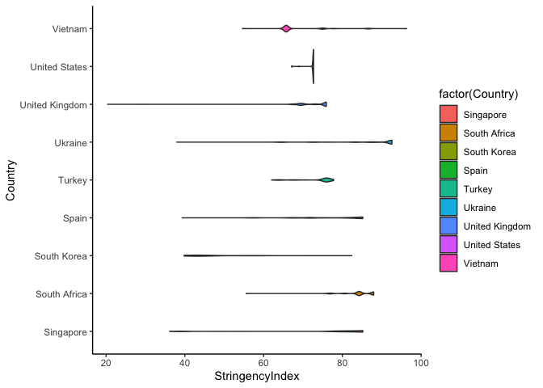
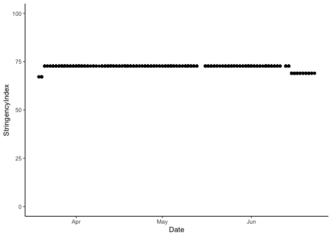
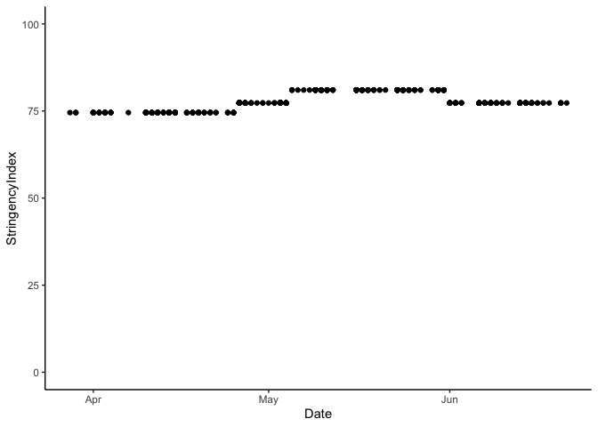
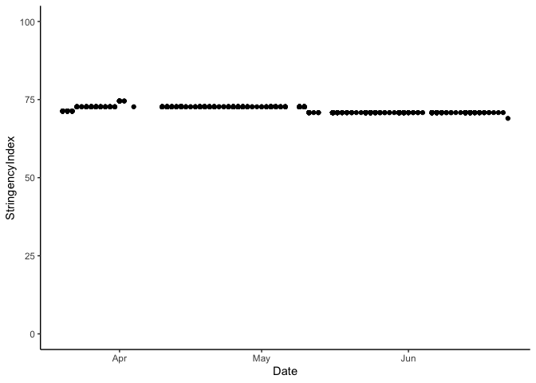

200825 Descriptives emotion means
================
Anne Margit
08/25/2020

``` r
library(dplyr)
library(tidyverse)
library(stringr)
library(papaja)
library(ggpubr)
library(ggplot2)
```

Descriptive statistics This dataset includes measurements from
participants that (1) provided at least 3 measurements, (2) that are
residents of the country they currently live in, (3) from countries with
at least 20 participants, (4) provided data on age, combined with (5)
imputed Stringency Index and (6) imputed emotion scores, (7) pooled age
groups, and (8) emotion factor mean scores

``` r
load("data_imputed_emomeans.Rdata")
```

How much missing data is left?

``` r
#Missing data
missing.values <- data_imputed_emomeans %>%
  gather(key = "key", value = "val") %>%
  dplyr::mutate(is.missing = is.na(val)) %>%
  dplyr::group_by(key, is.missing) %>%
  dplyr::summarise(num.missing = n()) %>%
  dplyr::filter(is.missing==T) %>%
  dplyr::select(-is.missing) %>%
  dplyr::arrange(desc(num.missing))
```

    ## Warning: attributes are not identical across measure variables;
    ## they will be dropped

``` r
apa_table(missing.values, caption="Missing data")
```

<caption>

(\#tab:unnamed-chunk-4)

</caption>

<div data-custom-style="Table Caption">

*Missing data*

</div>

| key             | num.missing |
| :-------------- | :---------- |
| Ang             | 65870       |
| Anxiety         | 65870       |
| Calm            | 65870       |
| Depr            | 65870       |
| Energ           | 65870       |
| Exh             | 65870       |
| Insp            | 65870       |
| NAA             | 65870       |
| NAD             | 65870       |
| Nerv            | 65870       |
| PAA             | 65870       |
| PAD             | 65870       |
| Rel             | 65870       |
| ConfirmedCases  | 65836       |
| ConfirmedDeaths | 65836       |
| Date            | 65836       |
| DaysMax         | 65836       |
| StringencyIndex | 65836       |

Number of participants per country on
baseline

``` r
data_imputed_emomeans$Country <- as.factor(data_imputed_emomeans$Country)

Country_N <- data_imputed_emomeans %>%
  filter(Time == "1") %>%
  group_by(Country) %>%
  summarise(NCountry = n())
```

``` r
apa_table(Country_N, caption = "Number of participants per country on baseline")
```

<caption>

(\#tab:unnamed-chunk-6)

</caption>

<div data-custom-style="Table Caption">

*Number of participants per country on baseline*

</div>

| Country        | NCountry |
| :------------- | :------- |
| Argentina      | 209      |
| Australia      | 203      |
| Brazil         | 217      |
| Canada         | 304      |
| Chile          | 84       |
| Croatia        | 141      |
| France         | 357      |
| Germany        | 397      |
| Greece         | 674      |
| Hungary        | 195      |
| Indonesia      | 185      |
| Italy          | 476      |
| Japan          | 76       |
| Kazakhstan     | 82       |
| Kosovo         | 29       |
| Malaysia       | 103      |
| Netherlands    | 674      |
| Peru           | 35       |
| Philippines    | 125      |
| Poland         | 126      |
| Serbia         | 506      |
| Romania        | 307      |
| Russia         | 201      |
| Saudi Arabia   | 71       |
| Singapore      | 42       |
| South Africa   | 218      |
| South Korea    | 21       |
| Spain          | 1021     |
| Turkey         | 179      |
| Ukraine        | 251      |
| United Kingdom | 466      |
| United States  | 2340     |
| Vietnam        | 28       |

Number of measurements per wave, emotion measurements per wave, and
Stringency Index measurements per wave

``` r
data_imputed_emomeans$Time <- as.factor(data_imputed_emomeans$Time)

Wave_N <- data_imputed_emomeans %>% 
group_by(Time)%>%
summarise(NWave = sum (!is.na(Date)), NAng= sum(!is.na(Ang)), NAnx= sum(!is.na(Anxiety)), NNerv= sum(!is.na(Nerv)), NDepr= sum(!is.na(Depr)), NExh= sum(!is.na(Exh)), NEnerg= sum(!is.na(Energ)),  NInsp= sum(!is.na(Insp)), NCalm= sum(!is.na(Calm)), NRel= sum(!is.na(Rel)), NStr = sum(!is.na(StringencyIndex)))
```

``` r
apa_table(Wave_N, caption="Number of measurements per wave")
```

<caption>

(\#tab:unnamed-chunk-8)

</caption>

<div data-custom-style="Table Caption">

*Number of measurements per
wave*

</div>

| Time | NWave | NAng  | NAnx  | NNerv | NDepr | NExh  | NEnerg | NInsp | NCalm | NRel  | NStr  |
| :--- | :---- | :---- | :---- | :---- | :---- | :---- | :----- | :---- | :---- | :---- | :---- |
| 1    | 10343 | 10341 | 10341 | 10341 | 10341 | 10341 | 10341  | 10341 | 10341 | 10341 | 10343 |
| 2    | 1082  | 1082  | 1082  | 1082  | 1082  | 1082  | 1082   | 1082  | 1082  | 1082  | 1082  |
| 3    | 4109  | 4109  | 4109  | 4109  | 4109  | 4109  | 4109   | 4109  | 4109  | 4109  | 4109  |
| 4    | 4378  | 4372  | 4372  | 4372  | 4372  | 4372  | 4372   | 4372  | 4372  | 4372  | 4378  |
| 5    | 6058  | 6052  | 6052  | 6052  | 6052  | 6052  | 6052   | 6052  | 6052  | 6052  | 6058  |
| 6    | 5758  | 5756  | 5756  | 5756  | 5756  | 5756  | 5756   | 5756  | 5756  | 5756  | 5758  |
| 7    | 5143  | 5139  | 5139  | 5139  | 5139  | 5139  | 5139   | 5139  | 5139  | 5139  | 5143  |
| 8    | 4631  | 4624  | 4624  | 4624  | 4624  | 4624  | 4624   | 4624  | 4624  | 4624  | 4631  |
| 9    | 4705  | 4700  | 4700  | 4700  | 4700  | 4700  | 4700   | 4700  | 4700  | 4700  | 4705  |
| 10   | 4244  | 4243  | 4243  | 4243  | 4243  | 4243  | 4243   | 4243  | 4243  | 4243  | 4244  |
| 11   | 3566  | 3566  | 3566  | 3566  | 3566  | 3566  | 3566   | 3566  | 3566  | 3566  | 3566  |
| 12   | 4263  | 4262  | 4262  | 4262  | 4262  | 4262  | 4262   | 4262  | 4262  | 4262  | 4263  |

Number of participants per age group on baseline

``` r
data_imputed_emomeans$Age <- as.factor(data_imputed_emomeans$Age)

Age_N <- data_imputed_emomeans %>%
  filter(Time=="1") %>%
  group_by(Age) %>%
  summarise(NAge = n())
```

``` r
apa_table(Age_N, caption="Number of participants per age group on baseline")
```

<caption>

(\#tab:unnamed-chunk-10)

</caption>

<div data-custom-style="Table Caption">

*Number of participants per age group on baseline*

</div>

| Age | NAge |
| :-- | :--- |
| 1   | 1331 |
| 2   | 1934 |
| 3   | 1876 |
| 4   | 1840 |
| 5   | 1790 |
| 6   | 1376 |
| 7   | 184  |
| 8   | 12   |

Number of participants per pooled age
group

``` r
data_imputed_emomeans$Age_new <- as.factor(data_imputed_emomeans$Age_new)

Age_New <- data_imputed_emomeans %>%
  filter(Time=="1") %>%
  group_by(Age_new) %>%
  summarise(NAge = n())
```

``` r
apa_table(Age_New, caption="Number of participants per pooled age group on baseline")
```

<caption>

(\#tab:unnamed-chunk-12)

</caption>

<div data-custom-style="Table Caption">

*Number of participants per pooled age group on baseline*

</div>

| Age\_new | NAge |
| :------- | :--- |
| 0        | 1331 |
| 1        | 3810 |
| 2        | 3630 |
| 3        | 1572 |

Number of males and females per age group on baseline

``` r
Age_Gender <- data_imputed_emomeans %>%
  filter(Time == "1") %>%
  select(Age, Gender) %>%
  group_by(Age, Gender) %>%
  count(Gender)
```

``` r
apa_table(Age_Gender, caption="Number of males and females per age group on baseline", note="Age 1= 18-24; 2= 25-34; 3= 35-44; 4= 45-54; 5= 55-64; 6= 65-74; 7= 75-84; 8=85+; Gender 0= male; 1= female")
```

<caption>

(\#tab:unnamed-chunk-14)

</caption>

<div data-custom-style="Table Caption">

*Number of males and females per age group on baseline*

</div>

| Age | Gender | n    |
| :-- | :----- | :--- |
| 1   | 0.00   | 245  |
| 1   | 1.00   | 1086 |
| 2   | 0.00   | 478  |
| 2   | 1.00   | 1456 |
| 3   | 0.00   | 576  |
| 3   | 1.00   | 1300 |
| 4   | 0.00   | 587  |
| 4   | 1.00   | 1253 |
| 5   | 0.00   | 708  |
| 5   | 1.00   | 1082 |
| 6   | 0.00   | 728  |
| 6   | 1.00   | 648  |
| 7   | 0.00   | 98   |
| 7   | 1.00   | 86   |
| 8   | 0.00   | 5    |
| 8   | 1.00   | 7    |

<div data-custom-style="Compact">

*Note.* Age 1= 18-24; 2= 25-34; 3= 35-44; 4= 45-54; 5= 55-64; 6= 65-74;
7= 75-84; 8=85+; Gender 0= male; 1= female

</div>

 

Number of males and females per pooled age group on baseline

``` r
Age_New_Gender <- data_imputed_emomeans %>%
  filter(Time == "1") %>%
  select(Age_new, Gender) %>%
  group_by(Age_new, Gender) %>%
  count(Gender)
```

``` r
apa_table(Age_New_Gender, caption = "Number of males and females per pooled age group on baseline",
          note= "Age 0= 18-24; 1= 25-44; 2= 45-64; 3= 65+, Gender 0= male; 1= female")
```

<caption>

(\#tab:unnamed-chunk-16)

</caption>

<div data-custom-style="Table Caption">

*Number of males and females per pooled age group on baseline*

</div>

| Age\_new | Gender | n    |
| :------- | :----- | :--- |
| 0        | 0.00   | 245  |
| 0        | 1.00   | 1086 |
| 1        | 0.00   | 1054 |
| 1        | 1.00   | 2756 |
| 2        | 0.00   | 1295 |
| 2        | 1.00   | 2335 |
| 3        | 0.00   | 831  |
| 3        | 1.00   | 741  |

<div data-custom-style="Compact">

*Note.* Age 0= 18-24; 1= 25-44; 2= 45-64; 3= 65+, Gender 0= male; 1=
female

</div>

 

Mean and SD, minimum and maximum of Stringency Index per country

``` r
StringencySummary <- data_imputed_emomeans %>%
  group_by(Country)%>%
  summarize(mean = mean(StringencyIndex, na.rm=TRUE), sd = sd(StringencyIndex, na.rm=TRUE), 
            max = max(StringencyIndex, na.rm=TRUE), min = min(StringencyIndex, na.rm=TRUE))
```

``` r
apa_table(StringencySummary, caption="Stringency Index per country")
```

<caption>

(\#tab:unnamed-chunk-18)

</caption>

<div data-custom-style="Table Caption">

*Stringency Index per country*

</div>

| Country        | mean  | sd    | max    | min   |
| :------------- | :---- | :---- | :----- | :---- |
| Argentina      | 93.10 | 4.82  | 100.00 | 88.89 |
| Australia      | 65.47 | 6.46  | 73.15  | 46.76 |
| Brazil         | 78.09 | 2.52  | 81.02  | 74.54 |
| Canada         | 71.91 | 0.93  | 74.54  | 68.98 |
| Chile          | 75.28 | 5.13  | 78.24  | 51.85 |
| Croatia        | 81.51 | 21.15 | 96.30  | 32.41 |
| France         | 83.17 | 9.75  | 90.74  | 48.15 |
| Germany        | 67.75 | 7.80  | 76.85  | 57.87 |
| Greece         | 73.98 | 11.71 | 84.26  | 40.74 |
| Hungary        | 71.54 | 6.77  | 76.85  | 52.78 |
| Indonesia      | 70.30 | 8.96  | 80.09  | 43.52 |
| Italy          | 75.19 | 17.36 | 93.52  | 44.44 |
| Japan          | 40.49 | 7.74  | 47.22  | 26.85 |
| Kazakhstan     | 86.86 | 3.86  | 89.35  | 77.31 |
| Kosovo         | 81.13 | 12.30 | 92.59  | 59.26 |
| Malaysia       | 71.22 | 4.76  | 75.00  | 54.63 |
| Netherlands    | 72.83 | 6.99  | 79.63  | 59.26 |
| Peru           | 91.12 | 1.96  | 96.30  | 89.81 |
| Philippines    | 95.28 | 7.60  | 100.00 | 77.78 |
| Poland         | 74.71 | 12.76 | 83.33  | 50.93 |
| Serbia         | 81.09 | 26.86 | 100.00 | 24.07 |
| Romania        | 78.31 | 11.55 | 87.04  | 41.67 |
| Russia         | 81.74 | 4.33  | 87.04  | 71.76 |
| Saudi Arabia   | 88.44 | 7.05  | 94.44  | 69.91 |
| Singapore      | 77.25 | 14.61 | 85.19  | 36.11 |
| South Africa   | 84.26 | 4.65  | 87.96  | 55.56 |
| South Korea    | 47.80 | 9.73  | 82.41  | 39.81 |
| Spain          | 77.25 | 8.90  | 85.19  | 39.35 |
| Turkey         | 74.34 | 4.14  | 77.78  | 62.04 |
| Ukraine        | 87.61 | 8.89  | 92.59  | 37.96 |
| United Kingdom | 73.04 | 3.74  | 75.93  | 20.37 |
| United States  | 72.45 | 1.08  | 72.69  | 67.13 |
| Vietnam        | 68.97 | 7.17  | 96.30  | 54.63 |

Mean, SD, and median of combined emotion scores

``` r
emomeansN <- data_imputed_emomeans %>%
  group_by(Time) %>%
  summarise(across(NAA:PAD, .fns=list(Mean = mean, SD = sd, Median = median), na.rm=TRUE,
                   .names="{col}_{fn}"))
```

``` r
apa_table(emomeansN, caption="Mean scores of mean emotion scores per wave")
```

<caption>

(\#tab:unnamed-chunk-20)

</caption>

<div data-custom-style="Table Caption">

*Mean scores of mean emotion scores per
wave*

</div>

| Time | NAA\_Mean | NAA\_SD | NAA\_Median | NAD\_Mean | NAD\_SD | NAD\_Median | PAA\_Mean | PAA\_SD | PAA\_Median | PAD\_Mean | PAD\_SD | PAD\_Median |
| :--- | :-------- | :------ | :---------- | :-------- | :------ | :---------- | :-------- | :------ | :---------- | :-------- | :------ | :---------- |
| 1    | 2.43      | 0.95    | 2.33        | 2.24      | 1.01    | 2.00        | 2.41      | 0.96    | 2.50        | 2.81      | 1.01    | 3.00        |
| 2    | 2.36      | 0.95    | 2.33        | 2.16      | 0.95    | 2.00        | 2.26      | 0.92    | 2.00        | 2.78      | 0.97    | 3.00        |
| 3    | 2.30      | 0.94    | 2.00        | 2.26      | 1.00    | 2.00        | 2.47      | 0.94    | 2.50        | 2.94      | 0.95    | 3.00        |
| 4    | 2.28      | 0.96    | 2.00        | 2.29      | 1.00    | 2.00        | 2.50      | 0.94    | 2.50        | 2.97      | 0.96    | 3.00        |
| 5    | 2.19      | 0.96    | 2.00        | 2.17      | 1.01    | 2.00        | 2.54      | 0.96    | 2.50        | 3.00      | 0.99    | 3.00        |
| 6    | 2.18      | 0.98    | 2.00        | 2.16      | 1.01    | 2.00        | 2.59      | 0.98    | 2.50        | 3.01      | 0.99    | 3.00        |
| 7    | 2.15      | 0.97    | 2.00        | 2.14      | 1.01    | 2.00        | 2.61      | 0.99    | 2.50        | 3.02      | 0.99    | 3.00        |
| 8    | 2.13      | 0.98    | 2.00        | 2.12      | 1.01    | 2.00        | 2.65      | 0.99    | 2.50        | 3.04      | 1.01    | 3.00        |
| 9    | 2.09      | 0.98    | 2.00        | 2.12      | 1.01    | 2.00        | 2.65      | 0.99    | 2.50        | 3.05      | 1.01    | 3.00        |
| 10   | 2.10      | 0.97    | 2.00        | 2.11      | 1.01    | 2.00        | 2.68      | 1.00    | 2.50        | 3.04      | 1.00    | 3.00        |
| 11   | 2.06      | 0.98    | 2.00        | 2.08      | 1.01    | 2.00        | 2.68      | 0.99    | 2.50        | 3.03      | 1.02    | 3.00        |
| 12   | 2.05      | 0.97    | 2.00        | 2.09      | 1.00    | 2.00        | 2.73      | 1.00    | 3.00        | 3.06      | 1.00    | 3.00        |

Mean, SD, and median of emotion scores

``` r
emorawmeansN <- data_imputed_emomeans %>%
  group_by(Time) %>%
  summarise(across(Ang:Rel, .fns=list(Mean = mean, SD = sd, Median = median), na.rm=TRUE,
                   .names="{col}_{fn}"))
```

``` r
apa_table(emorawmeansN, caption="Mean scores of raw emotion scores per wave")
```

<caption>

(\#tab:unnamed-chunk-22)

</caption>

<div data-custom-style="Table Caption">

*Mean scores of raw emotion scores per
wave*

</div>

| Time | Ang\_Mean | Ang\_SD | Ang\_Median | Anxiety\_Mean | Anxiety\_SD | Anxiety\_Median | Nerv\_Mean | Nerv\_SD | Nerv\_Median | Depr\_Mean | Depr\_SD | Depr\_Median | Exh\_Mean | Exh\_SD | Exh\_Median | Energ\_Mean | Energ\_SD | Energ\_Median | Insp\_Mean | Insp\_SD | Insp\_Median | Calm\_Mean | Calm\_SD | Calm\_Median | Rel\_Mean | Rel\_SD | Rel\_Median |
| :--- | :-------- | :------ | :---------- | :------------ | :---------- | :-------------- | :--------- | :------- | :----------- | :--------- | :------- | :----------- | :-------- | :------ | :---------- | :---------- | :-------- | :------------ | :--------- | :------- | :----------- | :--------- | :------- | :----------- | :-------- | :------ | :---------- |
| 1    | 2.10      | 0.70    | 2.01        | 2.67          | 1.24        | 3.00            | 2.53       | 1.21     | 2.00         | 2.12       | 1.15     | 2.00         | 2.35      | 1.22    | 2.00        | 2.48        | 1.08      | 3.00          | 2.34       | 1.12     | 2.00         | 2.92       | 1.09     | 3.00         | 2.70      | 1.12    | 3.00        |
| 2    | 1.97      | 1.09    | 2.00        | 2.58          | 1.18        | 2.00            | 2.52       | 1.14     | 2.00         | 1.97       | 1.05     | 2.00         | 2.35      | 1.17    | 2.00        | 2.28        | 1.02      | 2.00          | 2.25       | 1.08     | 2.00         | 2.88       | 1.03     | 3.00         | 2.67      | 1.06    | 3.00        |
| 3    | 1.98      | 1.08    | 2.00        | 2.53          | 1.16        | 2.00            | 2.38       | 1.13     | 2.00         | 2.09       | 1.12     | 2.00         | 2.42      | 1.19    | 2.00        | 2.55        | 1.04      | 3.00          | 2.40       | 1.10     | 2.00         | 3.02       | 1.01     | 3.00         | 2.86      | 1.05    | 3.00        |
| 4    | 2.01      | 1.10    | 2.00        | 2.47          | 1.16        | 2.00            | 2.36       | 1.15     | 2.00         | 2.10       | 1.12     | 2.00         | 2.47      | 1.19    | 2.00        | 2.59        | 1.04      | 3.00          | 2.41       | 1.07     | 2.00         | 3.04       | 1.02     | 3.00         | 2.89      | 1.04    | 3.00        |
| 5    | 1.98      | 1.12    | 2.00        | 2.36          | 1.17        | 2.00            | 2.23       | 1.13     | 2.00         | 2.02       | 1.12     | 2.00         | 2.32      | 1.19    | 2.00        | 2.63        | 1.06      | 3.00          | 2.45       | 1.11     | 2.00         | 3.09       | 1.05     | 3.00         | 2.91      | 1.08    | 3.00        |
| 6    | 1.99      | 1.14    | 2.00        | 2.33          | 1.18        | 2.00            | 2.20       | 1.14     | 2.00         | 2.01       | 1.12     | 2.00         | 2.32      | 1.19    | 2.00        | 2.67        | 1.07      | 3.00          | 2.52       | 1.12     | 3.00         | 3.11       | 1.05     | 3.00         | 2.92      | 1.08    | 3.00        |
| 7    | 1.98      | 1.13    | 2.00        | 2.28          | 1.18        | 2.00            | 2.17       | 1.13     | 2.00         | 1.97       | 1.11     | 2.00         | 2.31      | 1.19    | 2.00        | 2.70        | 1.07      | 3.00          | 2.52       | 1.12     | 3.00         | 3.11       | 1.06     | 3.00         | 2.93      | 1.08    | 3.00        |
| 8    | 1.98      | 1.13    | 2.00        | 2.26          | 1.18        | 2.00            | 2.15       | 1.13     | 2.00         | 1.93       | 1.10     | 2.00         | 2.30      | 1.20    | 2.00        | 2.75        | 1.08      | 3.00          | 2.56       | 1.11     | 3.00         | 3.13       | 1.07     | 3.00         | 2.95      | 1.09    | 3.00        |
| 9    | 1.94      | 1.12    | 2.00        | 2.22          | 1.17        | 2.00            | 2.12       | 1.13     | 2.00         | 1.92       | 1.10     | 2.00         | 2.31      | 1.20    | 2.00        | 2.75        | 1.08      | 3.00          | 2.55       | 1.11     | 3.00         | 3.14       | 1.06     | 3.00         | 2.96      | 1.09    | 3.00        |
| 10   | 2.00      | 1.14    | 2.00        | 2.21          | 1.17        | 2.00            | 2.10       | 1.10     | 2.00         | 1.90       | 1.09     | 2.00         | 2.32      | 1.20    | 2.00        | 2.76        | 1.07      | 3.00          | 2.59       | 1.12     | 3.00         | 3.13       | 1.06     | 3.00         | 2.95      | 1.10    | 3.00        |
| 11   | 1.96      | 1.14    | 2.00        | 2.15          | 1.18        | 2.00            | 2.06       | 1.11     | 2.00         | 1.86       | 1.08     | 1.00         | 2.30      | 1.22    | 2.00        | 2.76        | 1.08      | 3.00          | 2.60       | 1.12     | 3.00         | 3.11       | 1.08     | 3.00         | 2.95      | 1.10    | 3.00        |
| 12   | 1.92      | 1.12    | 2.00        | 2.17          | 1.18        | 2.00            | 2.07       | 1.11     | 2.00         | 1.86       | 1.07     | 2.00         | 2.31      | 1.20    | 2.00        | 2.82        | 1.07      | 3.00          | 2.65       | 1.12     | 3.00         | 3.13       | 1.07     | 3.00         | 2.98      | 1.09    | 3.00        |

Boxplots of mean emotion scores across time

``` r
theme_set(theme_classic())

gb_NAA <- ggplot(data_imputed_emomeans, aes(Age_new, NAA)) + geom_boxplot(varwidth=T, aes(fill= Age_new)) + scale_fill_discrete(name="Age", labels = c("18-24", "25-44", "45-64", "65+"))

gb_NAD <- ggplot(data_imputed_emomeans, aes(Age_new, NAD)) + geom_boxplot(varwidth=T, aes(fill= Age_new)) + scale_fill_discrete(name="Age", labels = c("18-24", "25-44", "45-64", "65+"))

gb_PAA <- ggplot(data_imputed_emomeans, aes(Age_new, PAA)) + geom_boxplot(varwidth=T, aes(fill= Age_new)) + scale_fill_discrete(name="Age", labels = c("18-24", "25-44", "45-64", "65+"))

gb_PAD <- ggplot(data_imputed_emomeans, aes(Age_new, PAD)) + geom_boxplot(varwidth=T, aes(fill= Age_new)) + scale_fill_discrete(name="Age", labels = c("18-24", "25-44", "45-64", "65+"))

gb_NA <- ggarrange(gb_NAA, gb_NAD, ncol = 2, nrow = 1, common.legend= TRUE, legend = "bottom")

gb_PA <- ggarrange(gb_PAA, gb_PAD, ncol = 2, nrow = 1, common.legend= TRUE, legend = "bottom")
```

``` r
gb_NA
```

<!-- -->

``` r
gb_PA
```

<!-- -->

Histograms of mean emotion
scores

``` r
g_NAA <- ggplot(data_imputed_emomeans, aes(x=NAA, fill=Age_new)) + geom_histogram(binwidth=1) + scale_fill_discrete(name="Age", labels = c("18-24", "25-44", "45-64", "65+"))

g_NAD <- ggplot(data_imputed_emomeans, aes(x=NAD, fill=Age_new)) + geom_histogram(binwidth=1) + scale_fill_discrete(name="Age", labels = c("18-24", "25-44", "45-64", "65+"))

g_PAA <- ggplot(data_imputed_emomeans, aes(x=PAA, fill=Age_new)) + geom_histogram(binwidth=1) + scale_fill_discrete(name="Age", labels = c("18-24", "25-44", "45-64", "65+"))

g_PAD <- ggplot(data_imputed_emomeans, aes(x=PAD, fill=Age_new)) + geom_histogram(binwidth=1) + scale_fill_discrete(name="Age", labels = c("18-24", "25-44", "45-64", "65+"))

gh_NA <- ggarrange(g_NAA, g_NAD, ncol = 2, nrow = 1, common.legend= TRUE, legend = "bottom")

gh_PA <- ggarrange(g_PAA, g_PAD, ncol = 2, nrow = 1, common.legend= TRUE, legend = "bottom")
```

``` r
gh_NA
```

<!-- -->

``` r
gh_PA
```

<!-- -->

Stringency
plots

``` r
data_imputed_emomeans$Country <- as.character(data_imputed_emomeans$Country)

data_graphs1 <- data_imputed_emomeans %>%
filter(Country == "Argentina" |  Country == "Australia" | Country == "Brazil" | Country == "Canada" | Country == "Chile" 
       | Country == "Croatia" | Country == "France" | Country == "Germany" )

data_graphs2 <- data_imputed_emomeans %>%
filter(Country == "Greece" | Country == "Hungary" | Country == "Indonesia" | Country == "Italy" | Country == "Japan" | Country == "Kazakhstan" | Country == "Kosovo" | Country == "Malaysia" )

data_graphs3 <- data_imputed_emomeans %>%
filter(Country == "Netherlands" | Country == "Peru" | Country == "Philippines" | Country == "Poland" | Country == "Serbia" | Country == "Romania" |
         Country == "Russia" | Country == "Saudi Arabia")

data_graphs4 <- data_imputed_emomeans %>%
filter(Country == "Singapore" | Country == "South Africa" | Country == "South Korea" | Country == "Spain" 
       | Country == "Turkey" | Country == "Ukraine" | Country == "United Kingdom" | Country == "United States" | Country == "Vietnam")

g_s1 <- ggplot(data_graphs1, aes(StringencyIndex, Country)) + geom_violin(aes(fill=factor(Country)))

g_s2 <- ggplot(data_graphs2, aes(StringencyIndex, Country)) + geom_violin(aes(fill=factor(Country)))

g_s3 <- ggplot(data_graphs3, aes(StringencyIndex, Country)) + geom_violin(aes(fill=factor(Country)))

g_s4 <- ggplot(data_graphs4, aes(StringencyIndex, Country)) + geom_violin(aes(fill=factor(Country)))
```

``` r
g_s1
```

<!-- -->

``` r
g_s2
```

<!-- -->

``` r
g_s3
```

<!-- -->

``` r
g_s4
```

<!-- -->

Stringency Index looks strange for some countries. Check the str. index
for the USA, Brazil, and Canada over
time:

``` r
g_usa <- ggplot(data_imputed_emomeans[which(data_imputed_emomeans$Country =="United States"), ], aes(Date, StringencyIndex)) + geom_point() + ylim(0,100)

g_brazil <- ggplot(data_imputed_emomeans[which(data_imputed_emomeans$Country =="Brazil"), ], aes(Date, StringencyIndex)) + geom_point() + ylim(0,100)

g_can <- ggplot(data_imputed_emomeans[which(data_imputed_emomeans$Country =="Canada"), ], aes(Date, StringencyIndex)) + geom_point() + ylim(0,100)
```

``` r
g_usa
```

<!-- -->

``` r
g_brazil
```

<!-- -->

``` r
g_can
```

<!-- -->
