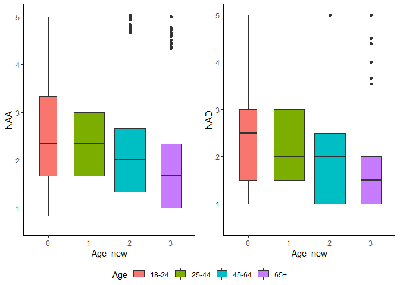
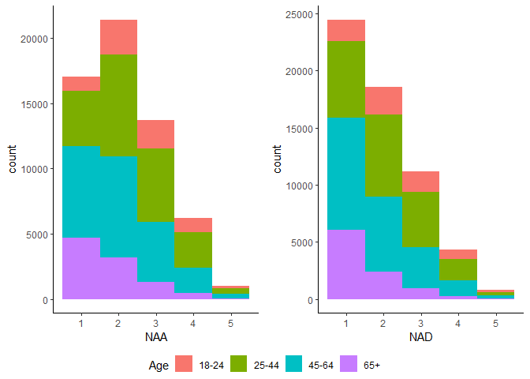
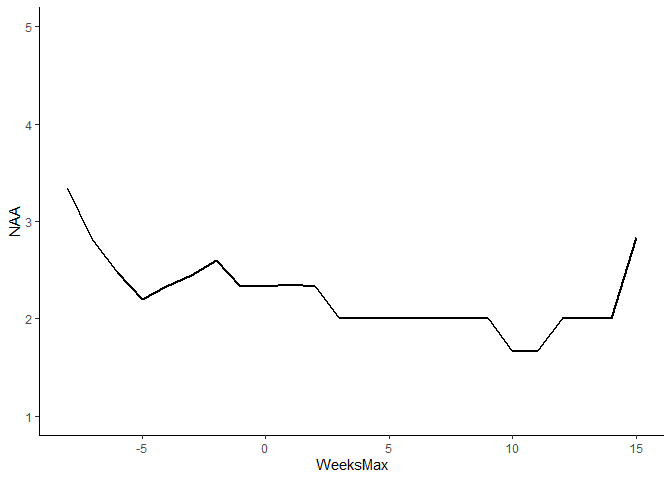
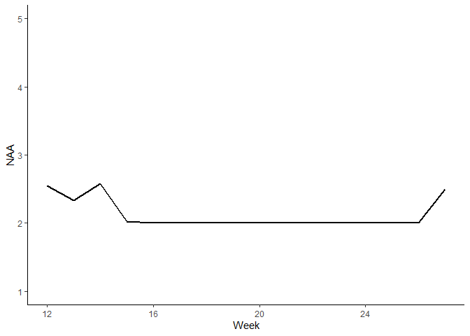
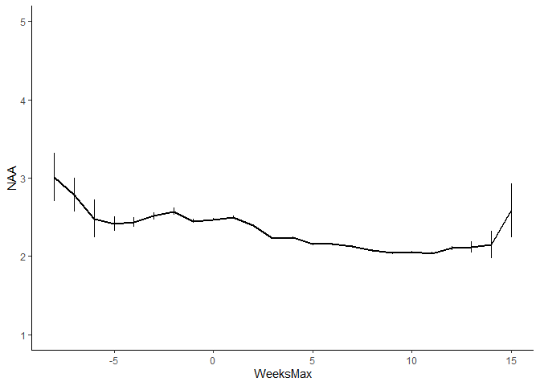
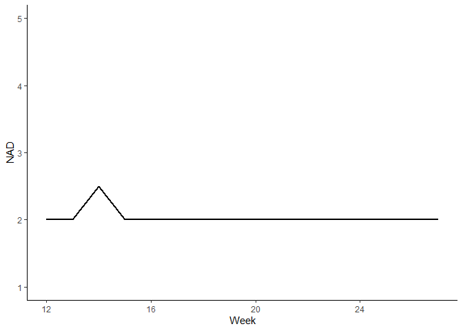
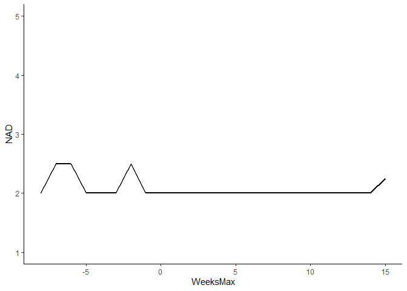
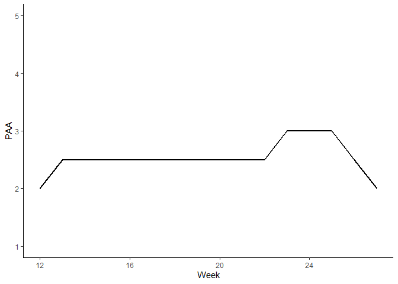

Descriptive statistics and plots
================
Anne Margit
8/27/2020

``` r
load("data_imputed_emomeans_maxweeks.Rdata")
load("data_long_min3_str_age.Rdata")
```

This dataset includes:

1.  Data from all weekly measurement waves (baseline through wave 11,
    Time 1 through 12)
2.  Participants who provided at least 3 measurements
3.  Participants who are residents of the country they currently live in
4.  Participants who provided info on age
5.  Participants who provided info on gender (either male or female)
6.  Data from countries with at least 20 participants
7.  Pooled age groups
8.  Imputed missing emotion scores
9.  Combined emotion scores (NAA, NAD, PAA, PAD)
10. An imputed Stringency index (StringencyIndex\_imp)
11. A variable indicating the number of days before and after the day on
    which maximum stringency was reached for the respective country
    (DaysMax)
12. A variable indicating the number of weeks before and after the day
    on which maximum stringency was reached for the respective country
    (WeeksMax)
13. A variable indicating the date on which maximum Stringency was
    reached for that country (DateMaxStr)

<!-- end list -->

``` r
library(dplyr)
library(tidyverse)
library(stringr)
library(papaja)
library(ggpubr)
library(ggplot2)
```

# Missing data

``` r
#Missing data
missing.values <- data_imputed_emomeans_maxweeks %>%
  gather(key = "key", value = "val") %>%
  dplyr::mutate(is.missing = is.na(val)) %>%
  dplyr::group_by(key, is.missing) %>%
  dplyr::summarise(num.missing = n()) %>%
  dplyr::filter(is.missing==T) %>%
  dplyr::select(-is.missing) %>%
  dplyr::arrange(desc(num.missing))
```

    ## Warning: attributes are not identical across measure variables;
    ## they will be dropped

``` r
apa_table(missing.values, caption="Missing data")
```

<caption>

(\#tab:unnamed-chunk-4)

</caption>

<div data-custom-style="Table Caption">

*Missing data*

</div>

| key             | num.missing |
| :-------------- | :---------- |
| Ang             | 66146       |
| Anxiety         | 66146       |
| Calm            | 66146       |
| Depr            | 66146       |
| Energ           | 66146       |
| Exh             | 66146       |
| Insp            | 66146       |
| NAA             | 66146       |
| NAD             | 66146       |
| Nerv            | 66146       |
| PAA             | 66146       |
| PAD             | 66146       |
| Rel             | 66146       |
| ConfirmedCases  | 66111       |
| ConfirmedDeaths | 66111       |
| Date            | 66111       |
| DaysMax         | 66111       |
| StringencyIndex | 66111       |
| Week            | 66111       |
| WeeksMax        | 66111       |

# Participants

**Number of participants per country with original data**

``` r
data_long_min3_str_age$Country <- as.factor(data_long_min3_str_age$Country)

Country_N <- data_long_min3_str_age %>%
  filter(Time == "1") %>%
  group_by(Country) %>%
  summarise(NCountry = n())
```

``` r
apa_table(Country_N, caption = "Number of participants per country on baseline")
```

<caption>

(\#tab:unnamed-chunk-6)

</caption>

<div data-custom-style="Table Caption">

*Number of participants per country on baseline*

</div>

| Country        | NCountry |
| :------------- | :------- |
| Argentina      | 213      |
| Australia      | 206      |
| Brazil         | 220      |
| Canada         | 308      |
| Chile          | 87       |
| Croatia        | 141      |
| France         | 358      |
| Germany        | 402      |
| Greece         | 679      |
| Hungary        | 196      |
| Indonesia      | 186      |
| Italy          | 480      |
| Japan          | 77       |
| Kazakhstan     | 83       |
| Kosovo         | 29       |
| Malaysia       | 108      |
| Netherlands    | 678      |
| Peru           | 36       |
| Philippines    | 127      |
| Poland         | 131      |
| Romania        | 312      |
| Russia         | 202      |
| Saudi Arabia   | 71       |
| Serbia         | 510      |
| Singapore      | 43       |
| South Africa   | 222      |
| South Korea    | 22       |
| Spain          | 1026     |
| Turkey         | 184      |
| Ukraine        | 262      |
| United Kingdom | 469      |
| United States  | 2359     |
| Vietnam        | 30       |

**Mean number of participants per country, SD, min and max**

``` r
CountryN <- data_long_min3_str_age %>%
  group_by(Time, Country) %>%
  filter(Nmiss <9) %>%
  summarise(Ncountry = n_distinct(ID))

CountryNdistinct <- data_long_min3_str_age %>%
  group_by(Time) %>%
  filter(Nmiss <9) %>%
  summarise(Ncountry = n_distinct(Country))

CountryMean <- CountryN %>%
  group_by(Time) %>%
  summarise(MCountry = mean(Ncountry), SDCountry = sd(Ncountry))
```

``` r
apa_table(CountryMean, caption = "Mean number of participants per country on baseline")
```

<caption>

(\#tab:unnamed-chunk-8)

</caption>

<div data-custom-style="Table Caption">

*Mean number of participants per country on baseline*

</div>

| Time | MCountry | SDCountry |
| :--- | :------- | :-------- |
| 1    | 316.82   | 429.92    |
| 2    | 67.69    | 131.82    |
| 3    | 133.00   | 301.48    |
| 4    | 136.91   | 284.30    |
| 5    | 189.94   | 232.74    |
| 6    | 186.06   | 201.96    |
| 7    | 174.78   | 192.15    |
| 8    | 140.45   | 147.09    |
| 9    | 142.79   | 164.89    |
| 10   | 129.30   | 148.65    |
| 11   | 112.33   | 127.00    |
| 12   | 131.82   | 152.29    |

# Measurements

**Number of participants and measurements per wave with original data**
Create new variable that indicates sum of missings:

``` r
data_long_min3_str_age <- data_long_min3_str_age %>%
  group_by(ID, Time) %>%
mutate(Nmiss = sum(is.na(Ang)) + sum(is.na(Anxiety)) + sum(is.na(Nerv)) + sum(is.na(Depr)) + sum(is.na(Exh)) + 
               sum(is.na(Energ)) + sum(is.na(Insp)) + sum(is.na(Calm)) + sum(is.na(Rel))) %>%
  ungroup()
```

``` r
data_long_min3_str_age$Time <- as.factor(data_long_min3_str_age$Time)

Wave_N_original <- data_long_min3_str_age %>% 
group_by(Time)%>%
summarise(NParticipants = n_distinct(ID[Nmiss<9]), NWave = sum (!is.na(Date)), NAng= sum(!is.na(Ang)), NAnx= sum(!is.na(Anxiety)), NNerv= sum(!is.na(Nerv)), NDepr= sum(!is.na(Depr)), NExh= sum(!is.na(Exh)), NEnerg= sum(!is.na(Energ)),  NInsp= sum(!is.na(Insp)), NCalm= sum(!is.na(Calm)), NRel= sum(!is.na(Rel)), NStr = sum(!is.na(StringencyIndex)))
```

``` r
apa_table(Wave_N_original, caption="Number of measurements per wave original data")
```

<caption>

(\#tab:unnamed-chunk-11)

</caption>

<div data-custom-style="Table Caption">

*Number of measurements per wave original data*

</div>

| Time | NParticipants | NWave | NAng | NAnx  | NNerv | NDepr | NExh  | NEnerg | NInsp | NCalm | NRel  | NStr  |
| :--- | :------------ | :---- | :--- | :---- | :---- | :---- | :---- | :----- | :---- | :---- | :---- | :---- |
| 1    | 10455         | 10457 | 0    | 10403 | 10383 | 10387 | 10371 | 10369  | 10367 | 10388 | 10371 | 10457 |
| 2    | 1083          | 1083  | 1082 | 1082  | 1082  | 1083  | 1082  | 1082   | 1081  | 1082  | 1082  | 1083  |
| 3    | 4123          | 4124  | 4115 | 4116  | 4116  | 4114  | 4112  | 4114   | 4112  | 4117  | 4115  | 4124  |
| 4    | 4381          | 4387  | 4373 | 4373  | 4374  | 4371  | 4372  | 4372   | 4369  | 4372  | 4372  | 4387  |
| 5    | 6078          | 6084  | 6053 | 6059  | 6059  | 6056  | 6054  | 6056   | 6054  | 6063  | 6056  | 6084  |
| 6    | 5954          | 5956  | 5936 | 5940  | 5937  | 5937  | 5942  | 5939   | 5938  | 5944  | 5944  | 5956  |
| 7    | 5593          | 5597  | 5566 | 5577  | 5569  | 5570  | 5572  | 5565   | 5564  | 5579  | 5572  | 5597  |
| 8    | 4635          | 4642  | 4618 | 4621  | 4619  | 4618  | 4616  | 4617   | 4614  | 4626  | 4617  | 4642  |
| 9    | 4712          | 4717  | 4698 | 4695  | 4699  | 4700  | 4696  | 4702   | 4696  | 4701  | 4702  | 4717  |
| 10   | 4267          | 4268  | 4253 | 4253  | 4255  | 4254  | 4253  | 4254   | 4251  | 4259  | 4257  | 4268  |
| 11   | 3707          | 3707  | 3704 | 3702  | 3702  | 3701  | 3701  | 3698   | 3698  | 3699  | 3699  | 3707  |
| 12   | 4350          | 4351  | 4339 | 4335  | 4331  | 4335  | 4332  | 4331   | 4329  | 4336  | 4334  | 4351  |

**Number of participants and measurements per wave with imputed data**

``` r
data_imputed_emomeans_maxweeks$Time <- as.factor(data_imputed_emomeans_maxweeks$Time)

Wave_N_imp <- data_imputed_emomeans_maxweeks %>% 
group_by(Time)%>%
summarise(NParticipants = n_distinct(ID[Nmiss<9]), NWave = sum (!is.na(Date)), NAng= sum(!is.na(Ang)), NAnx= sum(!is.na(Anxiety)), NNerv= sum(!is.na(Nerv)), NDepr= sum(!is.na(Depr)), NExh= sum(!is.na(Exh)), NEnerg= sum(!is.na(Energ)),  NInsp= sum(!is.na(Insp)), NCalm= sum(!is.na(Calm)), NRel= sum(!is.na(Rel)), NStr = sum(!is.na(StringencyIndex)))
```

``` r
apa_table(Wave_N_imp, caption="Number of measurements per wave imputed data")
```

<caption>

(\#tab:unnamed-chunk-13)

</caption>

<div data-custom-style="Table Caption">

*Number of measurements per wave imputed data*

</div>

| Time | NParticipants | NWave | NAng  | NAnx  | NNerv | NDepr | NExh  | NEnerg | NInsp | NCalm | NRel  | NStr  |
| :--- | :------------ | :---- | :---- | :---- | :---- | :---- | :---- | :----- | :---- | :---- | :---- | :---- |
| 1    | 10455         | 10457 | 10455 | 10455 | 10455 | 10455 | 10455 | 10455  | 10455 | 10455 | 10455 | 10457 |
| 2    | 1083          | 1083  | 1083  | 1083  | 1083  | 1083  | 1083  | 1083   | 1083  | 1083  | 1083  | 1083  |
| 3    | 4123          | 4124  | 4123  | 4123  | 4123  | 4123  | 4123  | 4123   | 4123  | 4123  | 4123  | 4124  |
| 4    | 4381          | 4387  | 4381  | 4381  | 4381  | 4381  | 4381  | 4381   | 4381  | 4381  | 4381  | 4387  |
| 5    | 6078          | 6084  | 6078  | 6078  | 6078  | 6078  | 6078  | 6078   | 6078  | 6078  | 6078  | 6084  |
| 6    | 5954          | 5956  | 5954  | 5954  | 5954  | 5954  | 5954  | 5954   | 5954  | 5954  | 5954  | 5956  |
| 7    | 5593          | 5597  | 5593  | 5593  | 5593  | 5593  | 5593  | 5593   | 5593  | 5593  | 5593  | 5597  |
| 8    | 4635          | 4642  | 4635  | 4635  | 4635  | 4635  | 4635  | 4635   | 4635  | 4635  | 4635  | 4642  |
| 9    | 4712          | 4717  | 4712  | 4712  | 4712  | 4712  | 4712  | 4712   | 4712  | 4712  | 4712  | 4717  |
| 10   | 4267          | 4268  | 4267  | 4267  | 4267  | 4267  | 4267  | 4267   | 4267  | 4267  | 4267  | 4268  |
| 11   | 3707          | 3707  | 3707  | 3707  | 3707  | 3707  | 3707  | 3707   | 3707  | 3707  | 3707  | 3707  |
| 12   | 4350          | 4351  | 4350  | 4350  | 4350  | 4350  | 4350  | 4350   | 4350  | 4350  | 4350  | 4351  |

# Age

**Number of participants per age group on baseline**

``` r
data_long_min3_str_age$Age <- as.factor(data_long_min3_str_age$Age)

Age_N <- data_long_min3_str_age %>%
  filter(Time=="1" & Nmiss <9) %>%
  group_by(Age) %>%
  summarise(NAge = n())
```

``` r
apa_table(Age_N, caption="Number of participants per age group on baseline with original data")
```

<caption>

(\#tab:unnamed-chunk-15)

</caption>

<div data-custom-style="Table Caption">

*Number of participants per age group on baseline with original data*

</div>

| Age | NAge |
| :-- | :--- |
| 1   | 1348 |
| 2   | 1954 |
| 3   | 1901 |
| 4   | 1866 |
| 5   | 1805 |
| 6   | 1385 |
| 7   | 184  |
| 8   | 12   |

**Number of participants per pooled age group**

``` r
data_long_min3_str_age$Age_new <- as.factor(data_long_min3_str_age$Age_new)

Age_New <- data_long_min3_str_age %>%
  group_by(Time, Age_new) %>%
  filter(Nmiss <9) %>%
  summarise(NAge = n())
```

``` r
apa_table(Age_New, caption="Number of participants per pooled age group on baseline with original data")
```

<caption>

(\#tab:unnamed-chunk-17)

</caption>

<div data-custom-style="Table Caption">

*Number of participants per pooled age group on baseline with original
data*

</div>

| Time | Age\_new | NAge |
| :--- | :------- | :--- |
| 1    | 0        | 1348 |
| 1    | 1        | 3855 |
| 1    | 2        | 3671 |
| 1    | 3        | 1581 |
| 2    | 0        | 158  |
| 2    | 1        | 539  |
| 2    | 2        | 340  |
| 2    | 3        | 46   |
| 3    | 0        | 703  |
| 3    | 1        | 1937 |
| 3    | 2        | 1215 |
| 3    | 3        | 268  |
| 4    | 0        | 801  |
| 4    | 1        | 1982 |
| 4    | 2        | 1292 |
| 4    | 3        | 306  |
| 5    | 0        | 796  |
| 5    | 1        | 2173 |
| 5    | 2        | 2127 |
| 5    | 3        | 982  |
| 6    | 0        | 705  |
| 6    | 1        | 2052 |
| 6    | 2        | 2172 |
| 6    | 3        | 1025 |
| 7    | 0        | 590  |
| 7    | 1        | 1816 |
| 7    | 2        | 2151 |
| 7    | 3        | 1036 |
| 8    | 0        | 472  |
| 8    | 1        | 1414 |
| 8    | 2        | 1833 |
| 8    | 3        | 916  |
| 9    | 0        | 459  |
| 9    | 1        | 1442 |
| 9    | 2        | 1834 |
| 9    | 3        | 977  |
| 10   | 0        | 396  |
| 10   | 1        | 1316 |
| 10   | 2        | 1675 |
| 10   | 3        | 880  |
| 11   | 0        | 330  |
| 11   | 1        | 1074 |
| 11   | 2        | 1490 |
| 11   | 3        | 813  |
| 12   | 0        | 391  |
| 12   | 1        | 1315 |
| 12   | 2        | 1738 |
| 12   | 3        | 906  |

**Number of males and females on baseline**

``` r
Gender_N <- data_long_min3_str_age %>%
  filter(Time == "1" & Nmiss <9) %>%
  group_by(Gender) %>%
  count(Gender)
```

``` r
apa_table(Gender_N, caption="Number of males and females on baseline with original data", note= "Gender 0= male; 1= female")
```

<caption>

(\#tab:unnamed-chunk-19)

</caption>

<div data-custom-style="Table Caption">

*Number of males and females on baseline with original data*

</div>

| Gender | n    |
| :----- | :--- |
| 0.00   | 3457 |
| 1.00   | 6998 |

<div data-custom-style="Compact">

*Note.* Gender 0= male; 1= female

</div>

 

**Number of males and females per wave with original data**

``` r
Gender_Wave <- data_long_min3_str_age %>%
  group_by(Time, Gender) %>%
    filter(Nmiss <9) %>%
  summarize(nGender = n_distinct(ID))
```

``` r
apa_table(Gender_Wave, caption="Number of males and females per wave", note= "Gender 0= male; 1= female")
```

<caption>

(\#tab:unnamed-chunk-21)

</caption>

<div data-custom-style="Table Caption">

*Number of males and females per wave*

</div>

| Time | Gender | nGender |
| :--- | :----- | :------ |
| 1    | 0.00   | 3457    |
| 1    | 1.00   | 6998    |
| 2    | 0.00   | 318     |
| 2    | 1.00   | 765     |
| 3    | 0.00   | 1109    |
| 3    | 1.00   | 3014    |
| 4    | 0.00   | 1146    |
| 4    | 1.00   | 3235    |
| 5    | 0.00   | 2093    |
| 5    | 1.00   | 3985    |
| 6    | 0.00   | 2026    |
| 6    | 1.00   | 3928    |
| 7    | 0.00   | 1948    |
| 7    | 1.00   | 3645    |
| 8    | 0.00   | 1615    |
| 8    | 1.00   | 3020    |
| 9    | 0.00   | 1617    |
| 9    | 1.00   | 3095    |
| 10   | 0.00   | 1462    |
| 10   | 1.00   | 2805    |
| 11   | 0.00   | 1265    |
| 11   | 1.00   | 2442    |
| 12   | 0.00   | 1422    |
| 12   | 1.00   | 2928    |

<div data-custom-style="Compact">

*Note.* Gender 0= male; 1= female

</div>

 

**Number of males and females per pooled age group on baseline with
original data**

``` r
Age_New_Gender <- data_long_min3_str_age %>%
  filter(Time == "1") %>%
  select(Age_new, Gender) %>%
  group_by(Age_new, Gender) %>%
  count(Gender)
```

``` r
apa_table(Age_New_Gender, caption = "Number of males and females per pooled age group on baseline",
          note= "Age 0= 18-24; 1= 25-44; 2= 45-64; 3= 65+, Gender 0= male; 1= female")
```

<caption>

(\#tab:unnamed-chunk-23)

</caption>

<div data-custom-style="Table Caption">

*Number of males and females per pooled age group on baseline*

</div>

| Age\_new | Gender | n    |
| :------- | :----- | :--- |
| 0        | 0.00   | 247  |
| 0        | 1.00   | 1101 |
| 1        | 0.00   | 1067 |
| 1        | 1.00   | 2788 |
| 2        | 0.00   | 1306 |
| 2        | 1.00   | 2366 |
| 3        | 0.00   | 838  |
| 3        | 1.00   | 744  |

<div data-custom-style="Compact">

*Note.* Age 0= 18-24; 1= 25-44; 2= 45-64; 3= 65+, Gender 0= male; 1=
female

</div>

 

# StringencyIndex

**Mean and SD, minimum and maximum of Stringency Index and imputed
Stringency Index per country**

``` r
StringencySummary <- data_long_min3_str_age %>%
  group_by(Country)%>%
  summarize(Str_mean = mean(StringencyIndex, na.rm=TRUE), Str_SD = sd(StringencyIndex, na.rm=TRUE), 
            Str_max = max(StringencyIndex, na.rm=TRUE), Str_min = min(StringencyIndex, na.rm=TRUE),
            Str_imp_mean = mean(StringencyIndex_imp, na.rm=TRUE), Str_imp_SD = sd(StringencyIndex_imp, na.rm=TRUE), 
            Str_imp_max = max(StringencyIndex_imp, na.rm=TRUE), Str_imp_min = min(StringencyIndex_imp, na.rm=TRUE))
```

``` r
apa_table(StringencySummary, caption="Stringency Index per country with original data")
```

<caption>

(\#tab:unnamed-chunk-25)

</caption>

<div data-custom-style="Table Caption">

*Stringency Index per country with original data*

</div>

| Country        | Str\_mean | Str\_SD | Str\_max | Str\_min | Str\_imp\_mean | Str\_imp\_SD | Str\_imp\_max | Str\_imp\_min |
| :------------- | :-------- | :------ | :------- | :------- | :------------- | :----------- | :------------ | :------------ |
| Argentina      | 93.05     | 4.78    | 100.00   | 88.89    | 90.81          | 3.85         | 100.00        | 88.89         |
| Australia      | 65.40     | 6.54    | 73.15    | 46.76    | 67.31          | 4.81         | 73.15         | 46.76         |
| Brazil         | 78.10     | 2.52    | 81.02    | 74.54    | 77.67          | 1.74         | 81.02         | 74.54         |
| Canada         | 71.90     | 0.94    | 74.54    | 68.98    | 70.37          | 1.60         | 74.54         | 68.98         |
| Chile          | 75.34     | 5.05    | 78.24    | 51.85    | 76.97          | 3.64         | 78.24         | 51.85         |
| Croatia        | 81.17     | 21.10   | 96.30    | 32.41    | 56.96          | 28.61        | 96.30         | 32.41         |
| France         | 83.03     | 9.86    | 90.74    | 48.15    | 65.93          | 18.81        | 90.74         | 48.15         |
| Germany        | 67.68     | 7.78    | 76.85    | 57.87    | 65.66          | 6.02         | 76.85         | 57.87         |
| Greece         | 73.81     | 11.73   | 84.26    | 40.74    | 59.00          | 15.86        | 84.26         | 40.74         |
| Hungary        | 71.46     | 6.79    | 76.85    | 52.78    | 60.78          | 10.26        | 76.85         | 52.78         |
| Indonesia      | 70.30     | 8.93    | 80.09    | 43.52    | 63.99          | 7.69         | 80.09         | 43.52         |
| Italy          | 75.06     | 17.34   | 93.52    | 44.44    | 65.10          | 15.56        | 93.52         | 44.44         |
| Japan          | 40.47     | 7.74    | 47.22    | 24.07    | 32.54          | 9.91         | 47.22         | 24.07         |
| Kazakhstan     | 86.81     | 3.86    | 89.35    | 77.31    | 82.84          | 4.13         | 89.35         | 77.31         |
| Kosovo         | 81.13     | 12.30   | 92.59    | 59.26    | 66.24          | 12.34        | 92.59         | 59.26         |
| Malaysia       | 71.14     | 4.87    | 75.00    | 50.93    | 59.01          | 10.37        | 75.00         | 50.93         |
| Netherlands    | 72.75     | 6.98    | 79.63    | 59.26    | 66.42          | 8.44         | 79.63         | 59.26         |
| Peru           | 91.11     | 1.94    | 96.30    | 89.81    | 90.19          | 1.21         | 96.30         | 89.81         |
| Philippines    | 95.11     | 7.70    | 100.00   | 77.78    | 88.04          | 7.55         | 100.00        | 77.78         |
| Poland         | 74.60     | 12.85   | 83.33    | 50.93    | 61.63          | 14.61        | 83.33         | 50.93         |
| Romania        | 78.23     | 11.53   | 87.04    | 41.67    | 58.01          | 19.75        | 87.04         | 41.67         |
| Russia         | 81.67     | 4.34    | 87.04    | 71.76    | 76.48          | 5.26         | 87.04         | 71.76         |
| Saudi Arabia   | 88.47     | 7.00    | 94.44    | 69.91    | 76.84          | 9.95         | 94.44         | 69.91         |
| Serbia         | 81.03     | 26.87   | 100.00   | 24.07    | 50.45          | 33.78        | 100.00        | 24.07         |
| Singapore      | 77.41     | 14.41   | 85.19    | 36.11    | 65.01          | 15.47        | 85.19         | 36.11         |
| South Africa   | 84.25     | 4.62    | 87.96    | 55.56    | 80.16          | 4.80         | 87.96         | 55.56         |
| South Korea    | 48.33     | 10.36   | 82.41    | 39.81    | 53.94          | 7.35         | 82.41         | 39.81         |
| Spain          | 77.17     | 9.05    | 85.19    | 39.35    | 61.36          | 19.89        | 85.19         | 39.35         |
| Turkey         | 74.28     | 4.20    | 77.78    | 62.04    | 68.19          | 5.79         | 77.78         | 62.04         |
| Ukraine        | 87.61     | 9.20    | 92.59    | 37.96    | 59.09          | 25.28        | 92.59         | 37.96         |
| United Kingdom | 73.00     | 3.73    | 75.93    | 20.37    | 72.27          | 2.95         | 75.93         | 20.37         |
| United States  | 72.45     | 1.08    | 72.69    | 67.13    | 70.47          | 1.86         | 72.69         | 67.13         |
| Vietnam        | 68.68     | 7.20    | 96.30    | 51.85    | 58.72          | 9.47         | 96.30         | 51.85         |

**Mean and SD, minimum and maximum of Stringency Index and imputed
Stringency Index per wave**

``` r
StringencySummary2 <- data_long_min3_str_age %>%
  group_by(Time)%>%
  filter(Nmiss <9)%>%
  summarize(Str_mean = mean(StringencyIndex, na.rm=TRUE), Str_SD = sd(StringencyIndex, na.rm=TRUE), 
            Str_max = max(StringencyIndex, na.rm=TRUE), Str_min = min(StringencyIndex, na.rm=TRUE),
            Str_imp_mean = mean(StringencyIndex_imp, na.rm=TRUE), Str_imp_SD = sd(StringencyIndex_imp, na.rm=TRUE), 
            Str_imp_max = max(StringencyIndex_imp, na.rm=TRUE), Str_imp_min = min(StringencyIndex_imp, na.rm=TRUE))
```

``` r
apa_table(StringencySummary2, caption="Stringency Index per wave with original data")
```

<caption>

(\#tab:unnamed-chunk-27)

</caption>

<div data-custom-style="Table Caption">

*Stringency Index per wave with original data*

</div>

| Time | Str\_mean | Str\_SD | Str\_max | Str\_min | Str\_imp\_mean | Str\_imp\_SD | Str\_imp\_max | Str\_imp\_min |
| :--- | :-------- | :------ | :------- | :------- | :------------- | :----------- | :------------ | :------------ |
| 1    | 79.40     | 10.86   | 100.00   | 20.37    | 79.40          | 10.86        | 100.00        | 20.37         |
| 2    | 76.11     | 7.51    | 100.00   | 38.89    | 76.11          | 7.51         | 100.00        | 38.89         |
| 3    | 80.21     | 8.72    | 100.00   | 45.37    | 80.21          | 8.72         | 100.00        | 45.37         |
| 4    | 80.65     | 8.71    | 100.00   | 47.22    | 80.65          | 8.71         | 100.00        | 47.22         |
| 5    | 81.64     | 9.05    | 100.00   | 43.52    | 81.64          | 9.05         | 100.00        | 43.52         |
| 6    | 80.56     | 9.03    | 96.30    | 40.74    | 80.56          | 9.03         | 96.30         | 40.74         |
| 7    | 76.92     | 9.46    | 96.30    | 40.74    | 76.92          | 9.46         | 96.30         | 40.74         |
| 8    | 73.78     | 9.77    | 96.30    | 39.81    | 73.78          | 9.77         | 96.30         | 39.81         |
| 9    | 71.35     | 9.12    | 96.30    | 31.48    | 71.35          | 9.12         | 96.30         | 31.48         |
| 10   | 68.65     | 9.34    | 91.67    | 24.07    | 68.65          | 9.34         | 91.67         | 24.07         |
| 11   | 63.33     | 12.96   | 89.81    | 24.07    | 63.33          | 12.96        | 89.81         | 24.07         |
| 12   | 62.04     | 13.58   | 89.81    | 24.07    | 62.04          | 13.58        | 89.81         | 24.07         |

**Stringency Index violin plots**

``` r
data_imputed_emomeans_maxweeks$Country <- as.character(data_imputed_emomeans_maxweeks$Country)

data_graphs1 <- data_imputed_emomeans_maxweeks %>%
filter(Country == "Argentina" |  Country == "Australia" | Country == "Brazil" | Country == "Canada" | Country == "Chile" | Country == "Croatia")

data_graphs2 <- data_imputed_emomeans_maxweeks %>%
filter(Country == "France" | Country == "Germany" | Country == "Greece" | Country == "Hungary" | Country == "Indonesia" | Country == "Italy")

data_graphs3 <- data_imputed_emomeans_maxweeks %>%
filter(Country == "Japan" | Country == "Kazakhstan" | Country == "Kosovo" | Country == "Malaysia" | Country == "Netherlands" | Country == "Peru")

data_graphs4 <- data_imputed_emomeans_maxweeks %>%
filter(Country == "Philippines" | Country == "Poland" | Country == "Serbia" | Country == "Romania" | Country == "Russia" | Country == "Saudi Arabia")

data_graphs5 <- data_imputed_emomeans_maxweeks %>%
filter(Country == "Singapore" | Country == "South Africa" | Country == "South Korea" | Country == "Spain" | Country == "Turkey" | Country == "Ukraine")

data_graphs6 <- data_imputed_emomeans_maxweeks %>%
filter(Country == "United Kingdom" | Country == "United States" | Country == "Vietnam")


g_s1 <- ggplot(data_graphs1, aes(StringencyIndex, Country)) + geom_violin(aes(fill=factor(Country)))

g_s2 <- ggplot(data_graphs2, aes(StringencyIndex, Country)) + geom_violin(aes(fill=factor(Country)))

g_s3 <- ggplot(data_graphs3, aes(StringencyIndex, Country)) + geom_violin(aes(fill=factor(Country)))

g_s4 <- ggplot(data_graphs4, aes(StringencyIndex, Country)) + geom_violin(aes(fill=factor(Country)))

g_s5 <- ggplot(data_graphs5, aes(StringencyIndex, Country)) + geom_violin(aes(fill=factor(Country)))

g_s6 <- ggplot(data_graphs6, aes(StringencyIndex, Country)) + geom_violin(aes(fill=factor(Country)))
```

``` r
g_s1
```

<!-- -->

``` r
g_s2
```

<!-- -->

``` r
g_s3
```

<!-- -->

``` r
g_s4
```

<!-- -->

``` r
g_s5
```

<!-- -->

``` r
g_s6
```

<!-- -->

**Stringency Index over time per country**

``` r
g_s7 <- ggplot(data_graphs1, aes(x=Date, y=StringencyIndex)) + geom_line(aes(colour=factor(Country)), size=1) + expand_limits(y=c(20, 100))

g_s8 <- ggplot(data_graphs2, aes(x=Date, y=StringencyIndex)) + geom_line(aes(colour=factor(Country)), size=1) + expand_limits(y=c(20, 100))

g_s9 <- ggplot(data_graphs3, aes(x=Date, y=StringencyIndex)) + geom_line(aes(colour=factor(Country)), size=1) + expand_limits(y=c(20, 100))

g_s10 <- ggplot(data_graphs4, aes(x=Date, y=StringencyIndex)) + geom_line(aes(colour=factor(Country)), size=1) + expand_limits(y=c(20, 100))

g_s11 <- ggplot(data_graphs5, aes(x=Date, y=StringencyIndex)) + geom_line(aes(colour=factor(Country)), size=1) + expand_limits(y=c(20, 100))

g_s12 <- ggplot(data_graphs6, aes(x=Date, y=StringencyIndex)) + geom_line(aes(colour=factor(Country)), size=1) + expand_limits(y=c(20, 100))
```

``` r
g_s7
```

<!-- -->

``` r
g_s8
```

<!-- -->

``` r
g_s9
```

<!-- -->

``` r
g_s10
```

<!-- -->

``` r
g_s11
```

<!-- -->

``` r
g_s12
```

<!-- -->

# Emotions

**Mean, SD, and median of emotion factor scores**

``` r
emomeansN <- data_imputed_emomeans_maxweeks %>%
  group_by(Time) %>%
  summarise(across(NAA:PAD, .fns=list(Mean = mean, SD = sd, Median = median), na.rm=TRUE,
                   .names="{col}_{fn}"))
```

``` r
apa_table(emomeansN, caption="Mean scores of emotion factor scores per wave")
```

<caption>

(\#tab:unnamed-chunk-33)

</caption>

<div data-custom-style="Table Caption">

*Mean scores of emotion factor scores per wave*

</div>

| Time | NAA\_Mean | NAA\_SD | NAA\_Median | NAD\_Mean | NAD\_SD | NAD\_Median | PAA\_Mean | PAA\_SD | PAA\_Median | PAD\_Mean | PAD\_SD | PAD\_Median |
| :--- | :-------- | :------ | :---------- | :-------- | :------ | :---------- | :-------- | :------ | :---------- | :-------- | :------ | :---------- |
| 1    | 2.43      | 0.95    | 2.33        | 2.24      | 1.02    | 2.00        | 2.41      | 0.96    | 2.50        | 2.81      | 1.01    | 3.00        |
| 2    | 2.35      | 0.95    | 2.33        | 2.16      | 0.95    | 2.00        | 2.27      | 0.92    | 2.00        | 2.78      | 0.97    | 3.00        |
| 3    | 2.30      | 0.94    | 2.00        | 2.25      | 1.00    | 2.00        | 2.47      | 0.94    | 2.50        | 2.94      | 0.95    | 3.00        |
| 4    | 2.28      | 0.96    | 2.00        | 2.29      | 1.00    | 2.00        | 2.50      | 0.94    | 2.50        | 2.97      | 0.96    | 3.00        |
| 5    | 2.19      | 0.96    | 2.00        | 2.17      | 1.01    | 2.00        | 2.54      | 0.96    | 2.50        | 3.00      | 0.99    | 3.00        |
| 6    | 2.18      | 0.98    | 2.00        | 2.17      | 1.01    | 2.00        | 2.59      | 0.98    | 2.50        | 3.01      | 0.99    | 3.00        |
| 7    | 2.15      | 0.97    | 2.00        | 2.15      | 1.01    | 2.00        | 2.61      | 1.00    | 2.50        | 3.02      | 0.99    | 3.00        |
| 8    | 2.13      | 0.98    | 2.00        | 2.12      | 1.01    | 2.00        | 2.65      | 0.99    | 2.50        | 3.04      | 1.01    | 3.00        |
| 9    | 2.09      | 0.97    | 2.00        | 2.12      | 1.01    | 2.00        | 2.65      | 0.99    | 2.50        | 3.05      | 1.01    | 3.00        |
| 10   | 2.10      | 0.97    | 2.00        | 2.11      | 1.01    | 2.00        | 2.68      | 1.00    | 2.50        | 3.04      | 1.00    | 3.00        |
| 11   | 2.06      | 0.98    | 2.00        | 2.09      | 1.02    | 2.00        | 2.68      | 1.00    | 2.50        | 3.02      | 1.02    | 3.00        |
| 12   | 2.06      | 0.97    | 2.00        | 2.09      | 1.00    | 2.00        | 2.73      | 1.00    | 3.00        | 3.05      | 1.00    | 3.00        |

**Mean, SD, and median of emotion scores**

``` r
emorawmeansN <- data_imputed_emomeans_maxweeks %>%
  group_by(Time) %>%
  summarise(across(Ang:Rel, .fns=list(Mean = mean, SD = sd, Median = median), na.rm=TRUE,
                   .names="{col}_{fn}"))
```

``` r
apa_table(emorawmeansN, caption="Mean scores of emotion scores per wave")
```

<caption>

(\#tab:unnamed-chunk-35)

</caption>

<div data-custom-style="Table Caption">

*Mean scores of emotion scores per wave*

</div>

| Time | Ang\_Mean | Ang\_SD | Ang\_Median | Anxiety\_Mean | Anxiety\_SD | Anxiety\_Median | Nerv\_Mean | Nerv\_SD | Nerv\_Median | Depr\_Mean | Depr\_SD | Depr\_Median | Exh\_Mean | Exh\_SD | Exh\_Median | Energ\_Mean | Energ\_SD | Energ\_Median | Insp\_Mean | Insp\_SD | Insp\_Median | Calm\_Mean | Calm\_SD | Calm\_Median | Rel\_Mean | Rel\_SD | Rel\_Median |
| :--- | :-------- | :------ | :---------- | :------------ | :---------- | :-------------- | :--------- | :------- | :----------- | :--------- | :------- | :----------- | :-------- | :------ | :---------- | :---------- | :-------- | :------------ | :--------- | :------- | :----------- | :--------- | :------- | :----------- | :-------- | :------ | :---------- |
| 1    | 2.10      | 0.70    | 2.01        | 2.67          | 1.24        | 3.00            | 2.53       | 1.21     | 2.00         | 2.12       | 1.15     | 2.00         | 2.35      | 1.22    | 2.00        | 2.48        | 1.08      | 3.00          | 2.34       | 1.12     | 2.00         | 2.92       | 1.09     | 3.00         | 2.70      | 1.12    | 3.00        |
| 2    | 1.97      | 1.08    | 2.00        | 2.57          | 1.18        | 2.00            | 2.52       | 1.14     | 2.00         | 1.97       | 1.05     | 2.00         | 2.35      | 1.17    | 2.00        | 2.28        | 1.03      | 2.00          | 2.25       | 1.08     | 2.00         | 2.89       | 1.03     | 3.00         | 2.67      | 1.06    | 3.00        |
| 3    | 1.98      | 1.08    | 2.00        | 2.53          | 1.16        | 2.00            | 2.38       | 1.13     | 2.00         | 2.09       | 1.12     | 2.00         | 2.42      | 1.19    | 2.00        | 2.55        | 1.04      | 3.00          | 2.40       | 1.10     | 2.00         | 3.02       | 1.01     | 3.00         | 2.86      | 1.04    | 3.00        |
| 4    | 2.02      | 1.10    | 2.00        | 2.47          | 1.16        | 2.00            | 2.36       | 1.14     | 2.00         | 2.10       | 1.12     | 2.00         | 2.47      | 1.19    | 2.00        | 2.59        | 1.04      | 3.00          | 2.41       | 1.07     | 2.00         | 3.04       | 1.02     | 3.00         | 2.89      | 1.04    | 3.00        |
| 5    | 1.99      | 1.12    | 2.00        | 2.36          | 1.17        | 2.00            | 2.23       | 1.13     | 2.00         | 2.02       | 1.12     | 2.00         | 2.32      | 1.19    | 2.00        | 2.63        | 1.06      | 3.00          | 2.45       | 1.11     | 2.00         | 3.09       | 1.05     | 3.00         | 2.91      | 1.08    | 3.00        |
| 6    | 1.99      | 1.14    | 2.00        | 2.33          | 1.18        | 2.00            | 2.20       | 1.14     | 2.00         | 2.02       | 1.12     | 2.00         | 2.32      | 1.19    | 2.00        | 2.67        | 1.06      | 3.00          | 2.51       | 1.12     | 3.00         | 3.11       | 1.05     | 3.00         | 2.91      | 1.08    | 3.00        |
| 7    | 1.99      | 1.13    | 2.00        | 2.29          | 1.18        | 2.00            | 2.18       | 1.13     | 2.00         | 1.98       | 1.11     | 2.00         | 2.33      | 1.19    | 2.00        | 2.70        | 1.07      | 3.00          | 2.52       | 1.12     | 3.00         | 3.11       | 1.06     | 3.00         | 2.92      | 1.08    | 3.00        |
| 8    | 1.98      | 1.13    | 2.00        | 2.26          | 1.18        | 2.00            | 2.15       | 1.13     | 2.00         | 1.94       | 1.10     | 2.00         | 2.30      | 1.20    | 2.00        | 2.75        | 1.08      | 3.00          | 2.56       | 1.11     | 3.00         | 3.13       | 1.07     | 3.00         | 2.95      | 1.09    | 3.00        |
| 9    | 1.94      | 1.12    | 2.00        | 2.22          | 1.17        | 2.00            | 2.12       | 1.13     | 2.00         | 1.92       | 1.10     | 2.00         | 2.31      | 1.20    | 2.00        | 2.75        | 1.08      | 3.00          | 2.55       | 1.11     | 3.00         | 3.14       | 1.06     | 3.00         | 2.96      | 1.10    | 3.00        |
| 10   | 2.00      | 1.14    | 2.00        | 2.21          | 1.17        | 2.00            | 2.10       | 1.10     | 2.00         | 1.90       | 1.09     | 2.00         | 2.32      | 1.20    | 2.00        | 2.77        | 1.07      | 3.00          | 2.59       | 1.12     | 3.00         | 3.13       | 1.06     | 3.00         | 2.95      | 1.10    | 3.00        |
| 11   | 1.96      | 1.14    | 2.00        | 2.16          | 1.19        | 2.00            | 2.07       | 1.11     | 2.00         | 1.87       | 1.08     | 2.00         | 2.32      | 1.22    | 2.00        | 2.76        | 1.08      | 3.00          | 2.60       | 1.12     | 3.00         | 3.11       | 1.08     | 3.00         | 2.94      | 1.11    | 3.00        |
| 12   | 1.92      | 1.12    | 2.00        | 2.17          | 1.18        | 2.00            | 2.07       | 1.11     | 2.00         | 1.87       | 1.07     | 2.00         | 2.32      | 1.20    | 2.00        | 2.82        | 1.07      | 3.00          | 2.65       | 1.12     | 3.00         | 3.13       | 1.07     | 3.00         | 2.98      | 1.09    | 3.00        |

**Boxplots of emotion factor scores across time**

``` r
theme_set(theme_classic())

gb_NAA <- ggplot(data_imputed_emomeans_maxweeks, aes(Age_new, NAA)) + geom_boxplot(varwidth=T, aes(fill= Age_new)) + scale_fill_discrete(name="Age", labels = c("18-24", "25-44", "45-64", "65+"))

gb_NAD <- ggplot(data_imputed_emomeans_maxweeks, aes(Age_new, NAD)) + geom_boxplot(varwidth=T, aes(fill= Age_new)) + scale_fill_discrete(name="Age", labels = c("18-24", "25-44", "45-64", "65+"))

gb_PAA <- ggplot(data_imputed_emomeans_maxweeks, aes(Age_new, PAA)) + geom_boxplot(varwidth=T, aes(fill= Age_new)) + scale_fill_discrete(name="Age", labels = c("18-24", "25-44", "45-64", "65+"))

gb_PAD <- ggplot(data_imputed_emomeans_maxweeks, aes(Age_new, PAD)) + geom_boxplot(varwidth=T, aes(fill= Age_new)) + scale_fill_discrete(name="Age", labels = c("18-24", "25-44", "45-64", "65+"))

gb_NA <- ggarrange(gb_NAA, gb_NAD, ncol = 2, nrow = 1, common.legend= TRUE, legend = "bottom")

gb_PA <- ggarrange(gb_PAA, gb_PAD, ncol = 2, nrow = 1, common.legend= TRUE, legend = "bottom")
```

``` r
gb_NA
```

<!-- -->

``` r
gb_PA
```

<!-- -->

**Histograms of emotion factor scores**

``` r
g_NAA <- ggplot(data_imputed_emomeans_maxweeks, aes(x=NAA, fill=Age_new)) + geom_histogram(binwidth=1) + scale_fill_discrete(name="Age", labels = c("18-24", "25-44", "45-64", "65+"))

g_NAD <- ggplot(data_imputed_emomeans_maxweeks, aes(x=NAD, fill=Age_new)) + geom_histogram(binwidth=1) + scale_fill_discrete(name="Age", labels = c("18-24", "25-44", "45-64", "65+"))

g_PAA <- ggplot(data_imputed_emomeans_maxweeks, aes(x=PAA, fill=Age_new)) + geom_histogram(binwidth=1) + scale_fill_discrete(name="Age", labels = c("18-24", "25-44", "45-64", "65+"))

g_PAD <- ggplot(data_imputed_emomeans_maxweeks, aes(x=PAD, fill=Age_new)) + geom_histogram(binwidth=1) + scale_fill_discrete(name="Age", labels = c("18-24", "25-44", "45-64", "65+"))

gh_NA <- ggarrange(g_NAA, g_NAD, ncol = 2, nrow = 1, common.legend= TRUE, legend = "bottom")

gh_PA <- ggarrange(g_PAA, g_PAD, ncol = 2, nrow = 1, common.legend= TRUE, legend = "bottom")
```

``` r
gh_NA
```

<!-- -->

``` r
gh_PA
```

<!-- -->

# Negative affect high arousal

**Median NAA against week**

``` r
plot_NAA <- ggplot(data_imputed_emomeans_maxweeks, aes(x=Week, y=NAA))

plot_NAA +  stat_summary(geom = "line", fun = median, size=1) + stat_summary(fun.data = median_hilow, 
                                                                    fun.args = (conf.int=.5)) + expand_limits(y=c(1, 5))
```

<!-- -->

**Median NAA against maximum stringency in weeks**

``` r
plot_NAA <- ggplot(data_imputed_emomeans_maxweeks, aes(x=WeeksMax, y=NAA))

plot_NAA +  stat_summary(geom = "line", fun = median, size=1) + stat_summary(fun.data = median_hilow, 
                                                                    fun.args = (conf.int=.5)) + expand_limits(y=c(1, 5))
```

<!-- -->

**Mean NAA against week in different age groups**

``` r
plot_NAA <- ggplot(data_imputed_emomeans_maxweeks, aes(x=Week, y=NAA, group = Age_new, color = Age_new))

plot_NAA + stat_summary(fun.y=mean, geom="line", size=1) + geom_errorbar(stat="summary", fun.data="mean_se", width=0) + scale_colour_discrete(name = "Age", labels = c("18-24", "25-44", "45-64", "65+")) + expand_limits(y=c(1, 5))
```

<!-- -->

**Mean NAA against maximum stringency in weeks**

``` r
plot_NAA <- ggplot(data_imputed_emomeans_maxweeks, aes(x=WeeksMax, y=NAA))

plot_NAA + stat_summary(fun.y=mean, geom="line", size=1) + geom_errorbar(stat="summary", fun.data="mean_se", width=0) + expand_limits(y=c(1, 5))
```

<!-- -->

**Mean NAA against maximum stringency in weeks in different age groups**

``` r
plot_NAA <- ggplot(data_imputed_emomeans_maxweeks, aes(x=WeeksMax, y=NAA, group = Age_new, color = Age_new))

plot_NAA + stat_summary(fun.y=mean, geom="line", size=1) + geom_errorbar(stat="summary", fun.data="mean_se", width=0) + scale_colour_discrete(name = "Age", labels = c("18-24", "25-44", "45-64", "65+")) + expand_limits(y=c(1, 5))
```

<!-- -->

# Negative affect low arousal

**Median NAD against week**

``` r
plot_NAD <- ggplot(data_imputed_emomeans_maxweeks, aes(x=Week, y=NAD))

plot_NAD +  stat_summary(geom = "line", fun = median, size=1) + stat_summary(fun.data = median_hilow, 
                                                                    fun.args = (conf.int=.5)) + expand_limits(y=c(1, 5))
```

<!-- -->

**Median NAD against maximum stringency in weeks**

``` r
plot_NAD <- ggplot(data_imputed_emomeans_maxweeks, aes(x=WeeksMax, y=NAD))

plot_NAD +  stat_summary(geom = "line", fun = median, size=1) + stat_summary(fun.data = median_hilow, 
                                                                    fun.args = (conf.int=.5)) + expand_limits(y=c(1, 5))
```

<!-- -->

**Mean NAD against week in different age groups**

``` r
plot_NAD <- ggplot(data_imputed_emomeans_maxweeks, aes(x=Week, y=NAD, group = Age_new, color = Age_new))

plot_NAD + stat_summary(fun.y=mean, geom="line", size=1) + geom_errorbar(stat="summary", fun.data="mean_se", width=0) + scale_colour_discrete(name = "Age", labels = c("18-24", "25-44", "45-64", "65+")) + expand_limits(y=c(1, 5))
```

<!-- -->

**Mean NAD against maximum stringency in weeks**

``` r
plot_NAD <- ggplot(data_imputed_emomeans_maxweeks, aes(x=WeeksMax, y=NAD))

plot_NAD + stat_summary(fun.y=mean, geom="line", size=1) + geom_errorbar(stat="summary", fun.data="mean_se", width=0) + expand_limits(y=c(1, 5))
```

<!-- -->

**Mean NAD against maximum stringency in weeks in different age groups**

``` r
plot_NAD <- ggplot(data_imputed_emomeans_maxweeks, aes(x=WeeksMax, y=NAD, group = Age_new, color = Age_new))

plot_NAD + stat_summary(fun.y=mean, geom="line", size=1) + geom_errorbar(stat="summary", fun.data="mean_se", width=0) + scale_colour_discrete(name = "Age", labels = c("18-24", "25-44", "45-64", "65+")) + expand_limits(y=c(1, 5))
```

<!-- -->

# Positive affect high arousal

**Median PAA against week**

``` r
plot_PAA <- ggplot(data_imputed_emomeans_maxweeks, aes(x=Week, y=PAA))

plot_PAA +  stat_summary(geom = "line", fun = median, size=1) + stat_summary(fun.data = median_hilow, 
                                                                    fun.args = (conf.int=.5)) + expand_limits(y=c(1, 5))
```

<!-- -->

**Median PAA against maximum stringency in weeks**

``` r
plot_PAA <- ggplot(data_imputed_emomeans_maxweeks, aes(x=WeeksMax, y=PAA))

plot_PAA +  stat_summary(geom = "line", fun = median, size=1) + stat_summary(fun.data = median_hilow, 
                                                                    fun.args = (conf.int=.5)) + expand_limits(y=c(1, 5))
```

<!-- -->

**Mean PAA against week in different age groups**

``` r
plot_PAA <- ggplot(data_imputed_emomeans_maxweeks, aes(x=Week, y=PAA, group = Age_new, color = Age_new))

plot_PAA + stat_summary(fun.y=mean, geom="line", size=1) + geom_errorbar(stat="summary", fun.data="mean_se", width=0) + scale_colour_discrete(name = "Age", labels = c("18-24", "25-44", "45-64", "65+")) + expand_limits(y=c(1, 5))
```

<!-- -->

**Mean PAA against maximum stringency in different age groups**

``` r
plot_PAA <- ggplot(data_imputed_emomeans_maxweeks, aes(x=WeeksMax, y=PAA, group = Age_new, color = Age_new))

plot_PAA + stat_summary(fun.y=mean, geom="line", size=1) + geom_errorbar(stat="summary", fun.data="mean_se", width=0) + scale_colour_discrete(name = "Age", labels = c("18-24", "25-44", "45-64", "65+")) + expand_limits(y=c(1, 5))
```

<!-- -->

# Positive affect low arousal

**Median PAD against week**

``` r
plot_PAD <- ggplot(data_imputed_emomeans_maxweeks, aes(x=Week, y=PAD))

plot_PAD +  stat_summary(geom = "line", fun = median, size=1) + stat_summary(fun.data = median_hilow, 
                                                                    fun.args = (conf.int=.5)) + expand_limits(y=c(1, 5))
```

<!-- -->

**Median PAD against maximum stringency**

``` r
plot_PAD <- ggplot(data_imputed_emomeans_maxweeks, aes(x=WeeksMax, y=PAD))

plot_PAD +  stat_summary(geom = "line", fun = median, size=1) + stat_summary(fun.data = median_hilow, 
                                                                    fun.args = (conf.int=.5)) + expand_limits(y=c(1, 5))
```

<!-- -->

**Mean PAD against week in different age groups**

``` r
plot_PAD <- ggplot(data_imputed_emomeans_maxweeks, aes(x=Week, y=PAD, group = Age_new, color = Age_new))

plot_PAD + stat_summary(fun.y=mean, geom="line", size=1) + geom_errorbar(stat="summary", fun.data="mean_se", width=0) + scale_colour_discrete(name = "Age", labels = c("18-24", "25-44", "45-64", "65+")) + expand_limits(y=c(1, 5))
```

<!-- -->

**Mean PAD against maximum stringency in different age groups**

``` r
plot_PAD <- ggplot(data_imputed_emomeans_maxweeks, aes(x=WeeksMax, y=PAD, group = Age_new, color = Age_new))

plot_PAD + stat_summary(fun.y=mean, geom="line", size=1) + geom_errorbar(stat="summary", fun.data="mean_se", width=0) + scale_colour_discrete(name = "Age", labels = c("18-24", "25-44", "45-64", "65+")) + expand_limits(y=c(1, 5))
```

<!-- -->
