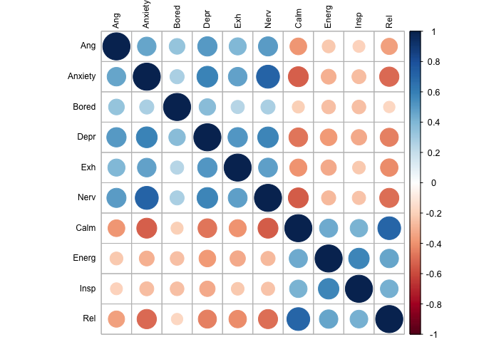

200629 Within person CFA 2
================
Anne Margit
6/29/2020

``` r
load("data_long_min3_20.Rdata")
```

Without Content, Excited, Loved

``` r
data_long_min3_20 <- as_tibble(data_long_min3_20)
data_cfa_red <- data_long_min3_20 %>% select(ID, Wave, Country, Ang, Anxiety, Bored, Calm, Depr, Energ, Exh, Insp, Nerv, Rel)
```

``` r
data_country_means <- data_cfa_red %>%
    dplyr::group_by(Country) %>%
    dplyr::summarise_each(funs(mean(., na.rm=TRUE)), 
                          Ang, Anxiety, Bored, Calm, Depr, Energ, Exh, Insp, Nerv, Rel)
```

    ## Warning: `summarise_each_()` is deprecated as of dplyr 0.7.0.
    ## Please use `across()` instead.
    ## This warning is displayed once every 8 hours.
    ## Call `lifecycle::last_warnings()` to see where this warning was generated.

    ## Warning: `funs()` is deprecated as of dplyr 0.8.0.
    ## Please use a list of either functions or lambdas: 
    ## 
    ##   # Simple named list: 
    ##   list(mean = mean, median = median)
    ## 
    ##   # Auto named with `tibble::lst()`: 
    ##   tibble::lst(mean, median)
    ## 
    ##   # Using lambdas
    ##   list(~ mean(., trim = .2), ~ median(., na.rm = TRUE))
    ## This warning is displayed once every 8 hours.
    ## Call `lifecycle::last_warnings()` to see where this warning was generated.

``` r
apa_table(data_country_means)
```

<caption>

(\#tab:unnamed-chunk-4)

</caption>

<div data-custom-style="Table Caption">

\*\*

</div>

| Country                | Ang  | Anxiety | Bored | Calm | Depr | Energ | Exh  | Insp | Nerv | Rel  |
| :--------------------- | :--- | :------ | :---- | :--- | :--- | :---- | :--- | :--- | :--- | :--- |
| Algeria                | 2.12 | 2.63    | 2.74  | 2.86 | 2.31 | 2.55  | 2.76 | 2.26 | 2.56 | 2.81 |
| Argentina              | 1.97 | 2.61    | 2.29  | 2.99 | 1.89 | 2.32  | 2.27 | 2.42 | 2.30 | 2.67 |
| Australia              | 1.70 | 2.18    | 2.13  | 3.15 | 1.89 | 2.56  | 2.12 | 2.33 | 1.93 | 3.01 |
| Austria                | 2.53 | 1.80    | 1.90  | 3.60 | 1.65 | 3.05  | 2.10 | 2.70 | 1.60 | 3.40 |
| Bangladesh             | 1.38 | 1.73    | 2.00  | 3.09 | 1.91 | 2.64  | 2.09 | 2.27 | 1.55 | 2.45 |
| Belgium                | 2.34 | 2.69    | 2.61  | 2.80 | 2.92 | 2.73  | 2.71 | 2.31 | 2.96 | 2.69 |
| Bosnia and Herzegovina | 2.18 | 2.29    | 1.67  | 3.00 | 2.14 | 3.07  | 3.00 | 3.43 | 2.43 | 3.00 |
| Brazil                 | 2.10 | 2.96    | 2.44  | 2.75 | 2.18 | 2.35  | 2.44 | 2.36 | 2.47 | 2.40 |
| Bulgaria               | 3.25 | 3.36    | 2.57  | 2.64 | 2.82 | 2.27  | 3.36 | 2.27 | 3.18 | 2.18 |
| Canada                 | 1.90 | 2.52    | 2.32  | 2.84 | 2.08 | 2.35  | 2.45 | 2.13 | 2.27 | 2.70 |
| Chile                  | 2.01 | 2.89    | 1.96  | 2.86 | 2.08 | 2.27  | 2.83 | 2.33 | 2.62 | 2.43 |
| China                  | 2.30 | 2.53    | 2.88  | 3.63 | 1.84 | 2.97  | 2.32 | 2.74 | 2.11 | 3.32 |
| Colombia               | 2.72 | 3.26    | 2.26  | 2.42 | 2.68 | 2.42  | 3.45 | 2.39 | 3.03 | 1.97 |
| Croatia                | 2.06 | 2.38    | 1.99  | 3.21 | 1.96 | 2.81  | 2.56 | 2.66 | 2.58 | 3.15 |
| Cyprus                 | 2.32 | 2.57    | 2.70  | 3.48 | 2.42 | 3.09  | 2.41 | 2.94 | 2.24 | 3.15 |
| France                 | 2.01 | 2.25    | 2.06  | 3.18 | 1.92 | 2.69  | 2.13 | 2.52 | 2.08 | 2.89 |
| Germany                | 1.72 | 1.88    | 1.85  | 3.20 | 1.91 | 2.95  | 2.16 | 2.56 | 1.91 | 3.02 |
| Greece                 | 2.17 | 2.72    | 2.58  | 3.32 | 2.33 | 3.15  | 2.21 | 2.82 | 2.46 | 3.14 |
| Hong Kong              | 2.52 | 2.92    | 3.00  | 2.83 | 2.75 | 2.06  | 2.94 | 2.14 | 2.92 | 2.56 |
| Hungary                | 2.04 | 2.53    | 2.07  | 3.08 | 2.53 | 2.80  | 2.57 | 2.66 | 2.58 | 3.05 |
| India                  | 1.27 | 2.65    | 1.71  | 3.60 | 1.55 | 3.30  | 2.50 | 3.20 | 2.20 | 3.30 |
| Indonesia              | 2.25 | 2.71    | 3.07  | 3.28 | 2.10 | 3.04  | 2.72 | 2.98 | 2.23 | 3.16 |
| Iraq                   | 3.57 | 3.00    | 3.33  | 3.00 | 3.00 | 2.40  | 2.60 | 2.90 | 3.00 | 3.10 |
| Ireland                | 1.57 | 2.12    | 2.64  | 3.53 | 2.18 | 2.76  | 3.00 | 2.82 | 2.06 | 3.24 |
| Israel                 | 2.12 | 2.66    | 2.00  | 3.09 | 2.66 | 2.34  | 2.75 | 2.09 | 2.50 | 2.81 |
| Italy                  | 2.08 | 2.35    | 2.28  | 2.82 | 1.93 | 2.49  | 2.24 | 2.25 | 2.35 | 2.55 |
| Japan                  | 2.17 | 3.08    | 2.71  | 3.14 | 2.06 | 2.77  | 2.30 | 2.10 | 2.44 | 2.93 |
| Kazakhstan             | 1.94 | 2.28    | 2.16  | 3.14 | 2.07 | 2.72  | 2.14 | 2.39 | 2.33 | 2.72 |
| Luxembourg             | 1.55 | 1.78    | 2.06  | 3.07 | 1.52 | 2.85  | 2.37 | 2.22 | 1.81 | 3.04 |
| Malaysia               | 2.20 | 2.54    | 2.70  | 3.09 | 2.10 | 2.69  | 2.64 | 2.63 | 2.28 | 3.02 |
| Mexico                 | 2.62 | 2.73    | 1.44  | 2.73 | 1.88 | 2.38  | 2.88 | 2.46 | 2.42 | 2.46 |
| Montenegro             | 2.33 | 3.00    | 2.50  | 3.00 | 1.75 | 3.25  | 3.00 | 3.00 | 2.62 | 3.25 |
| Netherlands            | 1.56 | 1.70    | 1.81  | 3.49 | 1.87 | 3.11  | 1.97 | 2.83 | 1.82 | 3.29 |
| New Zealand            | 1.82 | 2.82    | 2.00  | 2.45 | 2.14 | 2.36  | 3.00 | 2.27 | 2.68 | 2.09 |
| Pakistan               | 2.64 | 2.77    | 2.86  | 2.61 | 2.50 | 2.80  | 2.87 | 2.23 | 2.47 | 2.53 |
| Peru                   | 2.78 | 2.92    | 3.17  | 3.17 | 1.83 | 1.83  | 3.25 | 2.25 | 2.42 | 2.67 |
| Philippines            | 2.34 | 3.00    | 2.71  | 2.93 | 2.23 | 2.65  | 2.70 | 2.67 | 2.69 | 2.81 |
| Poland                 | 2.33 | 2.59    | 2.38  | 2.86 | 2.38 | 2.52  | 2.78 | 2.43 | 2.67 | 2.63 |
| Portugal               | 2.00 | 2.53    | 2.25  | 3.16 | 2.05 | 2.47  | 2.47 | 2.58 | 2.21 | 3.00 |
| Serbia                 | 2.13 | 2.60    | 2.10  | 2.83 | 2.02 | 2.79  | 2.53 | 2.58 | 2.55 | 2.98 |
| Romania                | 2.10 | 2.27    | 2.47  | 3.31 | 1.92 | 2.98  | 2.42 | 2.92 | 2.37 | 3.09 |
| Russia                 | 2.00 | 2.45    | 2.09  | 3.01 | 2.04 | 2.70  | 2.09 | 2.49 | 2.46 | 2.53 |
| Saudi Arabia           | 2.43 | 2.78    | 2.88  | 3.21 | 2.35 | 2.89  | 2.66 | 2.80 | 2.77 | 2.92 |
| Singapore              | 2.20 | 2.77    | 2.67  | 2.78 | 2.28 | 2.44  | 2.89 | 2.40 | 2.51 | 2.70 |
| Slovakia               | 2.18 | 1.50    | 1.43  | 3.07 | 1.57 | 3.43  | 2.00 | 3.43 | 2.29 | 2.71 |
| South Africa           | 2.39 | 2.56    | 2.34  | 3.06 | 2.19 | 2.67  | 2.35 | 2.41 | 2.34 | 2.85 |
| South Korea            | 2.70 | 2.78    | 3.25  | 2.61 | 3.20 | 2.38  | 2.92 | 2.58 | 2.73 | 2.72 |
| Spain                  | 2.13 | 2.34    | 2.03  | 3.02 | 1.90 | 2.13  | 2.38 | 2.35 | 2.33 | 2.80 |
| Sweden                 | 2.18 | 2.73    | 2.87  | 3.14 | 2.30 | 2.59  | 2.45 | 2.52 | 2.41 | 2.93 |
| Switzerland            | 1.97 | 1.98    | 1.74  | 3.28 | 1.89 | 2.96  | 2.04 | 2.98 | 1.94 | 3.02 |
| Taiwan                 | 1.52 | 2.28    | 1.86  | 3.28 | 1.78 | 2.94  | 2.31 | 2.86 | 2.36 | 3.08 |
| Thailand               | 2.23 | 2.36    | 2.62  | 3.43 | 1.69 | 3.19  | 2.43 | 3.24 | 2.14 | 3.33 |
| Turkey                 | 2.40 | 2.82    | 3.14  | 3.00 | 2.45 | 2.51  | 2.57 | 2.35 | 2.64 | 2.73 |
| Ukraine                | 2.05 | 2.26    | 2.13  | 3.17 | 2.01 | 2.73  | 2.19 | 2.49 | 2.26 | 2.61 |
| United Kingdom         | 1.74 | 2.27    | 2.06  | 3.21 | 1.81 | 2.51  | 2.11 | 2.17 | 2.00 | 3.07 |
| United States          | 1.90 | 2.65    | 2.27  | 2.85 | 2.12 | 2.44  | 2.48 | 2.22 | 2.42 | 2.69 |
| Venezuela              | 1.69 | 1.95    | 1.50  | 2.90 | 1.47 | 2.15  | 2.21 | 2.55 | 2.32 | 3.00 |
| Vietnam                | 1.78 | 2.58    | 2.10  | 3.42 | 1.71 | 2.90  | 1.88 | 2.96 | 2.20 | 3.12 |

``` r
data_cfa_comb <- left_join(data_cfa_red, data_country_means, by="Country")
```

This dataframe data\_within contains the raw scores - country means

``` r
data_cfa_new <- data_cfa_comb %>%
group_by(ID) %>%
  transmute(Wave = Wave,
            Country = Country,
    Ang = Ang.x - Ang.y,
         Bored = Bored.x - Bored.y,
         Anxiety = Anxiety.x - Anxiety.y,
         Calm = Calm.x - Calm.y,
         Depr = Depr.x - Depr.y,
         Energ = Energ.x - Energ.y,
         Exh = Exh.x - Exh.y,
         Insp = Insp.x - Insp.y,
         Nerv = Nerv.x - Nerv.y,
         Rel = Rel.x - Rel.y)
```

``` r
save(data_cfa_new,file ="data_cfa_new.Rdata")
```

``` r
round(cor(data_cfa_new[,c("Ang", "Anxiety", "Bored", "Depr","Exh","Nerv","Calm","Energ", "Insp","Rel")],use= "pairwise.complete.obs"),2)
```

    ##           Ang Anxiety Bored  Depr   Exh  Nerv  Calm Energ  Insp   Rel
    ## Ang      1.00    0.47  0.34  0.51  0.40  0.50 -0.38 -0.23 -0.20 -0.36
    ## Anxiety  0.47    1.00  0.28  0.59  0.47  0.72 -0.54 -0.30 -0.27 -0.51
    ## Bored    0.34    0.28  1.00  0.37  0.24  0.27 -0.20 -0.26 -0.26 -0.18
    ## Depr     0.51    0.59  0.37  1.00  0.51  0.58 -0.48 -0.38 -0.32 -0.45
    ## Exh      0.40    0.47  0.24  0.51  1.00  0.48 -0.40 -0.32 -0.22 -0.41
    ## Nerv     0.50    0.72  0.27  0.58  0.48  1.00 -0.54 -0.27 -0.24 -0.50
    ## Calm    -0.38   -0.54 -0.20 -0.48 -0.40 -0.54  1.00  0.45  0.41  0.70
    ## Energ   -0.23   -0.30 -0.26 -0.38 -0.32 -0.27  0.45  1.00  0.57  0.46
    ## Insp    -0.20   -0.27 -0.26 -0.32 -0.22 -0.24  0.41  0.57  1.00  0.43
    ## Rel     -0.36   -0.51 -0.18 -0.45 -0.41 -0.50  0.70  0.46  0.43  1.00

``` r
corrplot(cor(data_cfa_new[,c("Ang", "Anxiety", "Bored", "Depr","Exh","Nerv","Calm","Energ", "Insp","Rel")], use="pairwise.complete.obs"), order = "original", tl.col='black', tl.cex=.75)
```

<!-- -->

Two-factor CFA without loved centered around country means

``` r
model1 <- '
level: 1
f1 =~ Ang + Anxiety + Bored + Depr + Exh + Nerv 
f2 =~ Calm + Energ + Insp + Rel 

level: 2
f1 =~ Ang + Anxiety + Bored + Depr + Exh + Nerv 
f2 =~ Calm + Energ + Insp + Rel 
'
```

``` r
fit1 <- cfa(model1, data = data_cfa_new, std.lv=TRUE, missing="fiml", cluster = "ID")
```

``` r
summary(fit1, standardized=TRUE, fit.measures=TRUE)
```

    ## lavaan 0.6-6 ended normally after 33 iterations
    ## 
    ##   Estimator                                         ML
    ##   Optimization method                           NLMINB
    ##   Number of free parameters                         52
    ##                                                       
    ##                                                   Used       Total
    ##   Number of observations                         15093       73416
    ##   Number of clusters [ID]                         7318            
    ##                                                                   
    ## Model Test User Model:
    ##                                                       
    ##   Test statistic                              4802.489
    ##   Degrees of freedom                                68
    ##   P-value (Chi-square)                           0.000
    ## 
    ## Model Test Baseline Model:
    ## 
    ##   Test statistic                             51415.772
    ##   Degrees of freedom                                90
    ##   P-value                                        0.000
    ## 
    ## User Model versus Baseline Model:
    ## 
    ##   Comparative Fit Index (CFI)                    0.908
    ##   Tucker-Lewis Index (TLI)                       0.878
    ## 
    ## Loglikelihood and Information Criteria:
    ## 
    ##   Loglikelihood user model (H0)            -185172.547
    ##   Loglikelihood unrestricted model (H1)    -182771.303
    ##                                                       
    ##   Akaike (AIC)                              370449.094
    ##   Bayesian (BIC)                            370845.438
    ##   Sample-size adjusted Bayesian (BIC)       370680.186
    ## 
    ## Root Mean Square Error of Approximation:
    ## 
    ##   RMSEA                                          0.068
    ##   90 Percent confidence interval - lower         0.066
    ##   90 Percent confidence interval - upper         0.070
    ##   P-value RMSEA <= 0.05                          0.000
    ## 
    ## Standardized Root Mean Square Residual (corr metric):
    ## 
    ##   SRMR (within covariance matrix)                0.035
    ##   SRMR (between covariance matrix)               0.070
    ## 
    ## Parameter Estimates:
    ## 
    ##   Standard errors                             Standard
    ##   Information                                 Observed
    ##   Observed information based on                Hessian
    ## 
    ## 
    ## Level 1 [within]:
    ## 
    ## Latent Variables:
    ##                    Estimate  Std.Err  z-value  P(>|z|)   Std.lv  Std.all
    ##   f1 =~                                                                 
    ##     Ang               0.331    0.010   34.795    0.000    0.331    0.475
    ##     Anxiety           0.382    0.010   36.790    0.000    0.382    0.560
    ##     Bored             0.201    0.011   18.093    0.000    0.201    0.283
    ##     Depr              0.371    0.010   37.270    0.000    0.371    0.570
    ##     Exh               0.293    0.010   28.435    0.000    0.293    0.396
    ##     Nerv              0.374    0.011   33.913    0.000    0.374    0.547
    ##   f2 =~                                                                 
    ##     Calm              0.374    0.012   32.529    0.000    0.374    0.565
    ##     Energ             0.337    0.015   22.649    0.000    0.337    0.499
    ##     Insp              0.334    0.015   21.957    0.000    0.334    0.475
    ##     Rel               0.402    0.011   36.798    0.000    0.402    0.586
    ## 
    ## Covariances:
    ##                    Estimate  Std.Err  z-value  P(>|z|)   Std.lv  Std.all
    ##   f1 ~~                                                                 
    ##     f2               -0.512    0.016  -32.865    0.000   -0.512   -0.512
    ## 
    ## Intercepts:
    ##                    Estimate  Std.Err  z-value  P(>|z|)   Std.lv  Std.all
    ##    .Ang               0.000                               0.000    0.000
    ##    .Anxiety           0.000                               0.000    0.000
    ##    .Bored             0.000                               0.000    0.000
    ##    .Depr              0.000                               0.000    0.000
    ##    .Exh               0.000                               0.000    0.000
    ##    .Nerv              0.000                               0.000    0.000
    ##    .Calm              0.000                               0.000    0.000
    ##    .Energ             0.000                               0.000    0.000
    ##    .Insp              0.000                               0.000    0.000
    ##    .Rel               0.000                               0.000    0.000
    ##     f1                0.000                               0.000    0.000
    ##     f2                0.000                               0.000    0.000
    ## 
    ## Variances:
    ##                    Estimate  Std.Err  z-value  P(>|z|)   Std.lv  Std.all
    ##    .Ang               0.376    0.007   53.596    0.000    0.376    0.775
    ##    .Anxiety           0.318    0.007   45.608    0.000    0.318    0.686
    ##    .Bored             0.462    0.008   59.546    0.000    0.462    0.920
    ##    .Depr              0.287    0.006   45.532    0.000    0.287    0.675
    ##    .Exh               0.461    0.008   57.215    0.000    0.461    0.843
    ##    .Nerv              0.328    0.007   45.978    0.000    0.328    0.701
    ##    .Calm              0.298    0.008   38.605    0.000    0.298    0.680
    ##    .Energ             0.342    0.008   42.605    0.000    0.342    0.751
    ##    .Insp              0.384    0.009   45.103    0.000    0.384    0.775
    ##    .Rel               0.310    0.008   38.432    0.000    0.310    0.656
    ##     f1                1.000                               1.000    1.000
    ##     f2                1.000                               1.000    1.000
    ## 
    ## 
    ## Level 2 [ID]:
    ## 
    ## Latent Variables:
    ##                    Estimate  Std.Err  z-value  P(>|z|)   Std.lv  Std.all
    ##   f1 =~                                                                 
    ##     Ang               0.628    0.012   53.463    0.000    0.628    0.723
    ##     Anxiety           0.849    0.011   76.226    0.000    0.849    0.925
    ##     Bored             0.434    0.014   31.356    0.000    0.434    0.473
    ##     Depr              0.765    0.011   68.749    0.000    0.765    0.865
    ##     Exh               0.702    0.012   57.434    0.000    0.702    0.771
    ##     Nerv              0.828    0.011   75.799    0.000    0.828    0.940
    ##   f2 =~                                                                 
    ##     Calm              0.784    0.010   79.542    0.000    0.784    0.982
    ##     Energ             0.554    0.013   44.133    0.000    0.554    0.713
    ##     Insp              0.529    0.014   39.031    0.000    0.529    0.642
    ##     Rel               0.783    0.010   78.764    0.000    0.783    0.971
    ## 
    ## Covariances:
    ##                    Estimate  Std.Err  z-value  P(>|z|)   Std.lv  Std.all
    ##   f1 ~~                                                                 
    ##     f2               -0.787    0.007 -106.498    0.000   -0.787   -0.787
    ## 
    ## Intercepts:
    ##                    Estimate  Std.Err  z-value  P(>|z|)   Std.lv  Std.all
    ##    .Ang               0.002    0.012    0.149    0.881    0.002    0.002
    ##    .Anxiety          -0.111    0.012   -9.081    0.000   -0.111   -0.121
    ##    .Bored            -0.062    0.012   -5.018    0.000   -0.062   -0.068
    ##    .Depr             -0.043    0.012   -3.659    0.000   -0.043   -0.049
    ##    .Exh               0.003    0.012    0.251    0.802    0.003    0.003
    ##    .Nerv             -0.108    0.012   -9.102    0.000   -0.108   -0.123
    ##    .Calm              0.046    0.011    4.254    0.000    0.046    0.058
    ##    .Energ             0.072    0.011    6.630    0.000    0.072    0.092
    ##    .Insp              0.075    0.011    6.591    0.000    0.075    0.091
    ##    .Rel               0.053    0.011    4.815    0.000    0.053    0.066
    ##     f1                0.000                               0.000    0.000
    ##     f2                0.000                               0.000    0.000
    ## 
    ## Variances:
    ##                    Estimate  Std.Err  z-value  P(>|z|)   Std.lv  Std.all
    ##    .Ang               0.361    0.011   33.957    0.000    0.361    0.478
    ##    .Anxiety           0.121    0.007   16.277    0.000    0.121    0.144
    ##    .Bored             0.656    0.016   41.234    0.000    0.656    0.777
    ##    .Depr              0.198    0.008   25.365    0.000    0.198    0.252
    ##    .Exh               0.336    0.011   29.629    0.000    0.336    0.406
    ##    .Nerv              0.090    0.007   12.824    0.000    0.090    0.116
    ##    .Calm              0.023    0.006    3.681    0.000    0.023    0.036
    ##    .Energ             0.297    0.009   32.537    0.000    0.297    0.492
    ##    .Insp              0.399    0.011   35.691    0.000    0.399    0.587
    ##    .Rel               0.037    0.006    6.169    0.000    0.037    0.058
    ##     f1                1.000                               1.000    1.000
    ##     f2                1.000                               1.000    1.000

``` r
parameterEstimates(fit1, standardized=TRUE) %>% 
  filter(op == "=~") %>% 
  select('Latent Factor'=lhs, Indicator=rhs, B=est, SE=se, Z=z, 'p-value'=pvalue, Beta=std.all) %>% 
  kable(digits = 3, format="pandoc", caption="Factor Loadings")
```

| Latent Factor | Indicator |     B |    SE |      Z | p-value |  Beta |
| :------------ | :-------- | ----: | ----: | -----: | ------: | ----: |
| f1            | Ang       | 0.331 | 0.010 | 34.795 |       0 | 0.475 |
| f1            | Anxiety   | 0.382 | 0.010 | 36.790 |       0 | 0.560 |
| f1            | Bored     | 0.201 | 0.011 | 18.093 |       0 | 0.283 |
| f1            | Depr      | 0.371 | 0.010 | 37.270 |       0 | 0.570 |
| f1            | Exh       | 0.293 | 0.010 | 28.435 |       0 | 0.396 |
| f1            | Nerv      | 0.374 | 0.011 | 33.913 |       0 | 0.547 |
| f2            | Calm      | 0.374 | 0.012 | 32.529 |       0 | 0.565 |
| f2            | Energ     | 0.337 | 0.015 | 22.649 |       0 | 0.499 |
| f2            | Insp      | 0.334 | 0.015 | 21.957 |       0 | 0.475 |
| f2            | Rel       | 0.402 | 0.011 | 36.798 |       0 | 0.586 |
| f1            | Ang       | 0.628 | 0.012 | 53.463 |       0 | 0.723 |
| f1            | Anxiety   | 0.849 | 0.011 | 76.226 |       0 | 0.925 |
| f1            | Bored     | 0.434 | 0.014 | 31.356 |       0 | 0.473 |
| f1            | Depr      | 0.765 | 0.011 | 68.749 |       0 | 0.865 |
| f1            | Exh       | 0.702 | 0.012 | 57.434 |       0 | 0.771 |
| f1            | Nerv      | 0.828 | 0.011 | 75.799 |       0 | 0.940 |
| f2            | Calm      | 0.784 | 0.010 | 79.542 |       0 | 0.982 |
| f2            | Energ     | 0.554 | 0.013 | 44.133 |       0 | 0.713 |
| f2            | Insp      | 0.529 | 0.014 | 39.031 |       0 | 0.642 |
| f2            | Rel       | 0.783 | 0.010 | 78.764 |       0 | 0.971 |

Factor Loadings

Four-factor CFA without loved centered around country means

``` r
model2 <- '
level: 1
f1 =~ Ang + Anxiety + Nerv 
f2 =~ Bored + Depr + Exh
f3 =~ Energ + Insp
f4 =~ Calm + Rel

level: 2
f1 =~ Ang + Anxiety + Nerv 
f2 =~ Bored + Depr + Exh
f3 =~ Energ + Insp
f4 =~ Calm + Rel
'
```

``` r
fit2 <- cfa(model2, data = data_cfa_new, std.lv=TRUE, missing="fiml", cluster = "ID")
```

``` r
summary(fit2, standardized=TRUE, fit.measures=TRUE)
```

    ## lavaan 0.6-6 ended normally after 38 iterations
    ## 
    ##   Estimator                                         ML
    ##   Optimization method                           NLMINB
    ##   Number of free parameters                         62
    ##                                                       
    ##                                                   Used       Total
    ##   Number of observations                         15093       73416
    ##   Number of clusters [ID]                         7318            
    ##                                                                   
    ## Model Test User Model:
    ##                                                       
    ##   Test statistic                              1339.664
    ##   Degrees of freedom                                58
    ##   P-value (Chi-square)                           0.000
    ## 
    ## Model Test Baseline Model:
    ## 
    ##   Test statistic                             51415.772
    ##   Degrees of freedom                                90
    ##   P-value                                        0.000
    ## 
    ## User Model versus Baseline Model:
    ## 
    ##   Comparative Fit Index (CFI)                    0.975
    ##   Tucker-Lewis Index (TLI)                       0.961
    ## 
    ## Loglikelihood and Information Criteria:
    ## 
    ##   Loglikelihood user model (H0)            -183441.135
    ##   Loglikelihood unrestricted model (H1)    -182771.303
    ##                                                       
    ##   Akaike (AIC)                              367006.269
    ##   Bayesian (BIC)                            367478.832
    ##   Sample-size adjusted Bayesian (BIC)       367281.801
    ## 
    ## Root Mean Square Error of Approximation:
    ## 
    ##   RMSEA                                          0.038
    ##   90 Percent confidence interval - lower         0.037
    ##   90 Percent confidence interval - upper         0.040
    ##   P-value RMSEA <= 0.05                          1.000
    ## 
    ## Standardized Root Mean Square Residual (corr metric):
    ## 
    ##   SRMR (within covariance matrix)                0.022
    ##   SRMR (between covariance matrix)               0.034
    ## 
    ## Parameter Estimates:
    ## 
    ##   Standard errors                             Standard
    ##   Information                                 Observed
    ##   Observed information based on                Hessian
    ## 
    ## 
    ## Level 1 [within]:
    ## 
    ## Latent Variables:
    ##                    Estimate  Std.Err  z-value  P(>|z|)   Std.lv  Std.all
    ##   f1 =~                                                                 
    ##     Ang               0.324    0.010   33.561    0.000    0.324    0.465
    ##     Anxiety           0.401    0.009   42.778    0.000    0.401    0.587
    ##     Nerv              0.399    0.009   42.097    0.000    0.399    0.581
    ##   f2 =~                                                                 
    ##     Bored             0.215    0.010   21.013    0.000    0.215    0.303
    ##     Depr              0.394    0.010   39.106    0.000    0.394    0.605
    ##     Exh               0.297    0.010   28.967    0.000    0.297    0.402
    ##   f3 =~                                                                 
    ##     Energ             0.389    0.011   35.590    0.000    0.389    0.582
    ##     Insp              0.380    0.011   34.410    0.000    0.380    0.545
    ##   f4 =~                                                                 
    ##     Calm              0.422    0.010   43.637    0.000    0.422    0.633
    ##     Rel               0.438    0.010   43.646    0.000    0.438    0.636
    ## 
    ## Covariances:
    ##                    Estimate  Std.Err  z-value  P(>|z|)   Std.lv  Std.all
    ##   f1 ~~                                                                 
    ##     f2                0.874    0.020   43.720    0.000    0.874    0.874
    ##     f3               -0.298    0.021  -14.080    0.000   -0.298   -0.298
    ##     f4               -0.528    0.018  -29.820    0.000   -0.528   -0.528
    ##   f2 ~~                                                                 
    ##     f3               -0.490    0.023  -21.089    0.000   -0.490   -0.490
    ##     f4               -0.404    0.021  -19.026    0.000   -0.404   -0.404
    ##   f3 ~~                                                                 
    ##     f4                0.640    0.019   33.471    0.000    0.640    0.640
    ## 
    ## Intercepts:
    ##                    Estimate  Std.Err  z-value  P(>|z|)   Std.lv  Std.all
    ##    .Ang               0.000                               0.000    0.000
    ##    .Anxiety           0.000                               0.000    0.000
    ##    .Nerv              0.000                               0.000    0.000
    ##    .Bored             0.000                               0.000    0.000
    ##    .Depr              0.000                               0.000    0.000
    ##    .Exh               0.000                               0.000    0.000
    ##    .Energ             0.000                               0.000    0.000
    ##    .Insp              0.000                               0.000    0.000
    ##    .Calm              0.000                               0.000    0.000
    ##    .Rel               0.000                               0.000    0.000
    ##     f1                0.000                               0.000    0.000
    ##     f2                0.000                               0.000    0.000
    ##     f3                0.000                               0.000    0.000
    ##     f4                0.000                               0.000    0.000
    ## 
    ## Variances:
    ##                    Estimate  Std.Err  z-value  P(>|z|)   Std.lv  Std.all
    ##    .Ang               0.379    0.007   53.591    0.000    0.379    0.784
    ##    .Anxiety           0.305    0.007   45.141    0.000    0.305    0.655
    ##    .Nerv              0.312    0.007   45.751    0.000    0.312    0.663
    ##    .Bored             0.456    0.008   59.054    0.000    0.456    0.908
    ##    .Depr              0.269    0.007   37.237    0.000    0.269    0.634
    ##    .Exh               0.456    0.008   55.972    0.000    0.456    0.838
    ##    .Energ             0.295    0.008   36.795    0.000    0.295    0.661
    ##    .Insp              0.342    0.008   41.431    0.000    0.342    0.703
    ##    .Calm              0.267    0.007   37.235    0.000    0.267    0.600
    ##    .Rel               0.282    0.008   36.727    0.000    0.282    0.595
    ##     f1                1.000                               1.000    1.000
    ##     f2                1.000                               1.000    1.000
    ##     f3                1.000                               1.000    1.000
    ##     f4                1.000                               1.000    1.000
    ## 
    ## 
    ## Level 2 [ID]:
    ## 
    ## Latent Variables:
    ##                    Estimate  Std.Err  z-value  P(>|z|)   Std.lv  Std.all
    ##   f1 =~                                                                 
    ##     Ang               0.624    0.012   52.473    0.000    0.624    0.717
    ##     Anxiety           0.855    0.011   78.878    0.000    0.855    0.934
    ##     Nerv              0.841    0.010   80.583    0.000    0.841    0.959
    ##   f2 =~                                                                 
    ##     Bored             0.472    0.014   34.945    0.000    0.472    0.514
    ##     Depr              0.806    0.011   72.927    0.000    0.806    0.910
    ##     Exh               0.727    0.012   59.601    0.000    0.727    0.797
    ##   f3 =~                                                                 
    ##     Energ             0.768    0.011   70.950    0.000    0.768    0.973
    ##     Insp              0.709    0.012   60.570    0.000    0.709    0.848
    ##   f4 =~                                                                 
    ##     Calm              0.780    0.010   80.974    0.000    0.780    0.983
    ##     Rel               0.771    0.010   77.239    0.000    0.771    0.958
    ## 
    ## Covariances:
    ##                    Estimate  Std.Err  z-value  P(>|z|)   Std.lv  Std.all
    ##   f1 ~~                                                                 
    ##     f2                0.913    0.006  141.214    0.000    0.913    0.913
    ##     f3               -0.468    0.013  -35.322    0.000   -0.468   -0.468
    ##     f4               -0.785    0.008  -97.964    0.000   -0.785   -0.785
    ##   f2 ~~                                                                 
    ##     f3               -0.619    0.012  -51.237    0.000   -0.619   -0.619
    ##     f4               -0.773    0.010  -80.613    0.000   -0.773   -0.773
    ##   f3 ~~                                                                 
    ##     f4                0.731    0.010   75.632    0.000    0.731    0.731
    ## 
    ## Intercepts:
    ##                    Estimate  Std.Err  z-value  P(>|z|)   Std.lv  Std.all
    ##    .Ang               0.002    0.012    0.142    0.887    0.002    0.002
    ##    .Anxiety          -0.111    0.012   -9.103    0.000   -0.111   -0.122
    ##    .Nerv             -0.108    0.012   -9.128    0.000   -0.108   -0.123
    ##    .Bored            -0.062    0.012   -5.005    0.000   -0.062   -0.068
    ##    .Depr             -0.043    0.012   -3.631    0.000   -0.043   -0.048
    ##    .Exh               0.003    0.012    0.250    0.803    0.003    0.003
    ##    .Energ             0.073    0.011    6.748    0.000    0.073    0.093
    ##    .Insp              0.075    0.011    6.491    0.000    0.075    0.089
    ##    .Calm              0.046    0.011    4.248    0.000    0.046    0.058
    ##    .Rel               0.053    0.011    4.812    0.000    0.053    0.066
    ##     f1                0.000                               0.000    0.000
    ##     f2                0.000                               0.000    0.000
    ##     f3                0.000                               0.000    0.000
    ##     f4                0.000                               0.000    0.000
    ## 
    ## Variances:
    ##                    Estimate  Std.Err  z-value  P(>|z|)   Std.lv  Std.all
    ##    .Ang               0.368    0.011   34.005    0.000    0.368    0.486
    ##    .Anxiety           0.107    0.007   15.122    0.000    0.107    0.127
    ##    .Nerv              0.062    0.007    9.440    0.000    0.062    0.080
    ##    .Bored             0.621    0.016   40.007    0.000    0.621    0.736
    ##    .Depr              0.134    0.009   15.549    0.000    0.134    0.171
    ##    .Exh               0.304    0.011   26.807    0.000    0.304    0.365
    ##    .Energ             0.033    0.009    3.522    0.000    0.033    0.053
    ##    .Insp              0.196    0.010   19.731    0.000    0.196    0.281
    ##    .Calm              0.021    0.006    3.585    0.000    0.021    0.033
    ##    .Rel               0.054    0.006    8.816    0.000    0.054    0.083
    ##     f1                1.000                               1.000    1.000
    ##     f2                1.000                               1.000    1.000
    ##     f3                1.000                               1.000    1.000
    ##     f4                1.000                               1.000    1.000

``` r
parameterEstimates(fit2, standardized=TRUE) %>% 
  filter(op == "=~") %>% 
  select('Latent Factor'=lhs, Indicator=rhs, B=est, SE=se, Z=z, 'p-value'=pvalue, Beta=std.all) %>% 
  kable(digits = 3, format="pandoc", caption="Factor Loadings")
```

| Latent Factor | Indicator |     B |    SE |      Z | p-value |  Beta |
| :------------ | :-------- | ----: | ----: | -----: | ------: | ----: |
| f1            | Ang       | 0.324 | 0.010 | 33.561 |       0 | 0.465 |
| f1            | Anxiety   | 0.401 | 0.009 | 42.778 |       0 | 0.587 |
| f1            | Nerv      | 0.399 | 0.009 | 42.097 |       0 | 0.581 |
| f2            | Bored     | 0.215 | 0.010 | 21.013 |       0 | 0.303 |
| f2            | Depr      | 0.394 | 0.010 | 39.106 |       0 | 0.605 |
| f2            | Exh       | 0.297 | 0.010 | 28.967 |       0 | 0.402 |
| f3            | Energ     | 0.389 | 0.011 | 35.590 |       0 | 0.582 |
| f3            | Insp      | 0.380 | 0.011 | 34.410 |       0 | 0.545 |
| f4            | Calm      | 0.422 | 0.010 | 43.637 |       0 | 0.633 |
| f4            | Rel       | 0.438 | 0.010 | 43.646 |       0 | 0.636 |
| f1            | Ang       | 0.624 | 0.012 | 52.473 |       0 | 0.717 |
| f1            | Anxiety   | 0.855 | 0.011 | 78.878 |       0 | 0.934 |
| f1            | Nerv      | 0.841 | 0.010 | 80.583 |       0 | 0.959 |
| f2            | Bored     | 0.472 | 0.014 | 34.945 |       0 | 0.514 |
| f2            | Depr      | 0.806 | 0.011 | 72.927 |       0 | 0.910 |
| f2            | Exh       | 0.727 | 0.012 | 59.601 |       0 | 0.797 |
| f3            | Energ     | 0.768 | 0.011 | 70.950 |       0 | 0.973 |
| f3            | Insp      | 0.709 | 0.012 | 60.570 |       0 | 0.848 |
| f4            | Calm      | 0.780 | 0.010 | 80.974 |       0 | 0.983 |
| f4            | Rel       | 0.771 | 0.010 | 77.239 |       0 | 0.958 |

Factor Loadings
