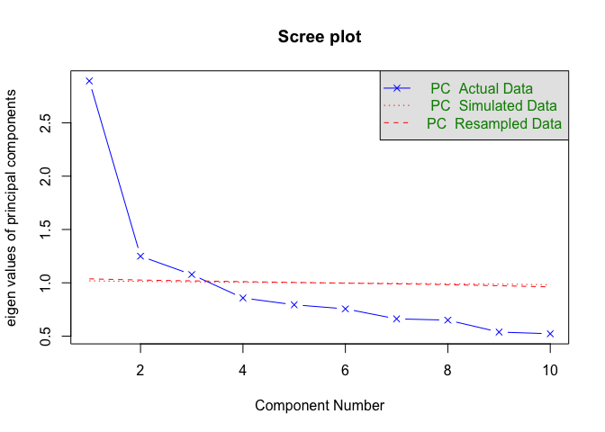

200630 Exploratory FA 2 (PCA)
================
Anne Margit
6/30/2020

This is the principal component analysis of within-person emotion scores
without item ‘loved’, using person-mean centered scores.

``` r
load("data_within2.Rdata")
```

``` r
library(psych)
library(dplyr)
```

    ## 
    ## Attaching package: 'dplyr'

    ## The following objects are masked from 'package:stats':
    ## 
    ##     filter, lag

    ## The following objects are masked from 'package:base':
    ## 
    ##     intersect, setdiff, setequal, union

``` r
library(GPArotation)
```

``` r
data_within3 <- data_within2 %>%
  select(-c("Wave", "Lov"))
```

Parallel analysis. Choose the number of factors by simulating a random
data set, and choosing the point where the eigenvalues of the real data
fall below the simulated
data.

``` r
within_cor <- cor(data_within3[,-1], use="complete.obs")
```

``` r
parallel <- fa.parallel(data_within3[,-1], fm="ml", main="Scree plot", fa= "pc", n.iter=50, SMC=TRUE, quant = .95 )
```

<!-- -->

    ## Parallel analysis suggests that the number of factors =  NA  and the number of components =  3

``` r
parallel
```

    ## Call: fa.parallel(x = data_within3[, -1], fm = "ml", fa = "pc", main = "Scree plot", 
    ##     n.iter = 50, SMC = TRUE, quant = 0.95)
    ## Parallel analysis suggests that the number of factors =  NA  and the number of components =  3 
    ## 
    ##  Eigen Values of 
    ## 
    ##  eigen values of factors
    ##  [1]  2.12  0.46  0.25  0.00 -0.02 -0.12 -0.13 -0.18 -0.19 -0.20
    ## 
    ##  eigen values of simulated factors
    ## [1] NA
    ## 
    ##  eigen values of components 
    ##  [1] 2.89 1.25 1.08 0.86 0.79 0.76 0.66 0.65 0.54 0.52
    ## 
    ##  eigen values of simulated components
    ##  [1] 1.02 1.01 1.01 1.00 1.00 1.00 0.99 0.99 0.99 0.98

This suggests 3 within-person
components

``` r
threepcanew <- principal(data_within3[,-1], nfactors = 3, rotate = "varimax")
threepcanew
```

    ## Principal Components Analysis
    ## Call: principal(r = data_within3[, -1], nfactors = 3, rotate = "varimax")
    ## Standardized loadings (pattern matrix) based upon correlation matrix
    ##           RC1   RC2   RC3   h2   u2 com
    ## Ang      0.37  0.01  0.49 0.38 0.62 1.9
    ## Bored   -0.04 -0.15  0.77 0.61 0.39 1.1
    ## Anxiety  0.73 -0.03  0.15 0.56 0.44 1.1
    ## Calm    -0.54  0.50  0.19 0.58 0.42 2.2
    ## Depr     0.47 -0.15  0.46 0.46 0.54 2.2
    ## Energ   -0.01  0.74 -0.20 0.59 0.41 1.1
    ## Exh      0.40 -0.10  0.33 0.28 0.72 2.1
    ## Insp     0.00  0.74 -0.17 0.58 0.42 1.1
    ## Nerv     0.76  0.00  0.14 0.59 0.41 1.1
    ## Rel     -0.52  0.54  0.18 0.59 0.41 2.2
    ## 
    ##                        RC1  RC2  RC3
    ## SS loadings           2.19 1.70 1.33
    ## Proportion Var        0.22 0.17 0.13
    ## Cumulative Var        0.22 0.39 0.52
    ## Proportion Explained  0.42 0.32 0.25
    ## Cumulative Proportion 0.42 0.75 1.00
    ## 
    ## Mean item complexity =  1.6
    ## Test of the hypothesis that 3 components are sufficient.
    ## 
    ## The root mean square of the residuals (RMSR) is  0.1 
    ##  with the empirical chi square  68941.27  with prob <  0 
    ## 
    ## Fit based upon off diagonal values = 0.78

``` r
threepcanew2 <- principal(data_within3[,-1], nfactors = 3, rotate = "oblimin")
threepcanew2
```

    ## Principal Components Analysis
    ## Call: principal(r = data_within3[, -1], nfactors = 3, rotate = "oblimin")
    ## Standardized loadings (pattern matrix) based upon correlation matrix
    ##           TC1   TC2   TC3   h2   u2 com
    ## Ang      0.48  0.04  0.41 0.38 0.62 2.0
    ## Bored    0.09 -0.18  0.74 0.61 0.39 1.2
    ## Anxiety  0.76  0.06  0.00 0.56 0.44 1.0
    ## Calm    -0.41  0.45  0.34 0.58 0.42 2.9
    ## Depr     0.54 -0.11  0.34 0.46 0.54 1.8
    ## Energ    0.08  0.77 -0.13 0.59 0.41 1.1
    ## Exh      0.45 -0.06  0.23 0.28 0.72 1.6
    ## Insp     0.11  0.78 -0.10 0.58 0.42 1.1
    ## Nerv     0.79  0.09 -0.02 0.59 0.41 1.0
    ## Rel     -0.38  0.49  0.33 0.59 0.41 2.7
    ## 
    ##                        TC1  TC2  TC3
    ## SS loadings           2.33 1.75 1.14
    ## Proportion Var        0.23 0.18 0.11
    ## Cumulative Var        0.23 0.41 0.52
    ## Proportion Explained  0.45 0.34 0.22
    ## Cumulative Proportion 0.45 0.78 1.00
    ## 
    ##  With component correlations of 
    ##       TC1   TC2   TC3
    ## TC1  1.00 -0.28  0.00
    ## TC2 -0.28  1.00 -0.03
    ## TC3  0.00 -0.03  1.00
    ## 
    ## Mean item complexity =  1.6
    ## Test of the hypothesis that 3 components are sufficient.
    ## 
    ## The root mean square of the residuals (RMSR) is  0.1 
    ##  with the empirical chi square  68941.27  with prob <  0 
    ## 
    ## Fit based upon off diagonal values = 0.78
