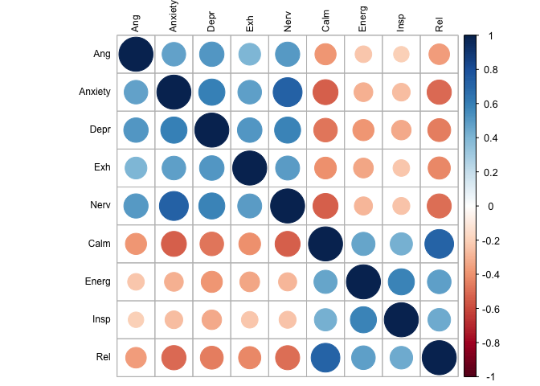

CFA Multi-level cfa without bored and loved
================
Anne Margit
7/8/2020

``` r
load(file = "data_long_min3_str.Rdata")
```

Without Content, Excited, Loved, Bored

``` r
data_long_min3_str <- as_tibble(data_long_min3_str)
data_cfa_red <- data_long_min3_str %>% select(ID, Wave, Country, Ang, Anxiety, Calm, Depr, Energ, Exh, Insp, Nerv, Rel)
```

``` r
data_country_means <- data_cfa_red %>%
    dplyr::group_by(Country) %>%
    dplyr::summarise_each(funs(mean(., na.rm=TRUE)), 
                          Ang, Anxiety, Calm, Depr, Energ, Exh, Insp, Nerv, Rel)
```

    ## Warning: `summarise_each_()` is deprecated as of dplyr 0.7.0.
    ## Please use `across()` instead.
    ## This warning is displayed once every 8 hours.
    ## Call `lifecycle::last_warnings()` to see where this warning was generated.

    ## Warning: `funs()` is deprecated as of dplyr 0.8.0.
    ## Please use a list of either functions or lambdas: 
    ## 
    ##   # Simple named list: 
    ##   list(mean = mean, median = median)
    ## 
    ##   # Auto named with `tibble::lst()`: 
    ##   tibble::lst(mean, median)
    ## 
    ##   # Using lambdas
    ##   list(~ mean(., trim = .2), ~ median(., na.rm = TRUE))
    ## This warning is displayed once every 8 hours.
    ## Call `lifecycle::last_warnings()` to see where this warning was generated.

``` r
apa_table(data_country_means)
```

<caption>

(\#tab:unnamed-chunk-4)

</caption>

<div data-custom-style="Table Caption">

\*\*

</div>

| Country        | Ang  | Anxiety | Calm | Depr | Energ | Exh  | Insp | Nerv | Rel  |
| :------------- | :--- | :------ | :--- | :--- | :---- | :--- | :--- | :--- | :--- |
| Argentina      | 1.95 | 2.53    | 2.97 | 1.89 | 2.39  | 2.33 | 2.42 | 2.22 | 2.68 |
| Australia      | 1.67 | 2.12    | 3.22 | 1.87 | 2.62  | 2.13 | 2.39 | 1.87 | 3.05 |
| Brazil         | 2.09 | 2.89    | 2.78 | 2.11 | 2.40  | 2.40 | 2.42 | 2.43 | 2.46 |
| Canada         | 1.86 | 2.42    | 2.91 | 2.02 | 2.38  | 2.45 | 2.17 | 2.18 | 2.76 |
| Chile          | 2.11 | 2.96    | 2.73 | 2.13 | 2.28  | 2.95 | 2.29 | 2.67 | 2.35 |
| Croatia        | 2.07 | 2.33    | 3.18 | 1.94 | 2.81  | 2.59 | 2.64 | 2.58 | 3.12 |
| France         | 1.96 | 2.20    | 3.19 | 1.88 | 2.72  | 2.14 | 2.55 | 2.06 | 2.92 |
| Germany        | 1.64 | 1.79    | 3.19 | 1.86 | 2.95  | 2.12 | 2.55 | 1.86 | 3.05 |
| Greece         | 2.15 | 2.70    | 3.31 | 2.27 | 3.18  | 2.24 | 2.86 | 2.42 | 3.12 |
| Hungary        | 2.00 | 2.49    | 3.11 | 2.44 | 2.81  | 2.52 | 2.69 | 2.51 | 3.05 |
| Indonesia      | 2.18 | 2.63    | 3.29 | 2.04 | 3.13  | 2.71 | 3.05 | 2.17 | 3.19 |
| Italy          | 2.05 | 2.27    | 2.85 | 1.86 | 2.54  | 2.19 | 2.28 | 2.27 | 2.60 |
| Japan          | 2.11 | 2.92    | 3.20 | 1.99 | 2.82  | 2.23 | 2.10 | 2.33 | 3.02 |
| Kazakhstan     | 1.97 | 2.26    | 3.15 | 2.01 | 2.79  | 2.11 | 2.47 | 2.31 | 2.71 |
| Kosovo         | 1.78 | 1.81    | 3.41 | 1.61 | 2.99  | 2.44 | 2.95 | 2.33 | 3.00 |
| Malaysia       | 2.10 | 2.41    | 3.18 | 1.97 | 2.78  | 2.59 | 2.74 | 2.17 | 3.10 |
| Netherlands    | 1.55 | 1.62    | 3.51 | 1.81 | 3.13  | 1.95 | 2.90 | 1.76 | 3.34 |
| Peru           | 1.91 | 2.72    | 2.98 | 1.89 | 2.61  | 2.70 | 2.66 | 2.30 | 2.67 |
| Philippines    | 2.26 | 2.87    | 3.02 | 2.19 | 2.81  | 2.61 | 2.80 | 2.56 | 2.92 |
| Poland         | 2.23 | 2.59    | 2.82 | 2.37 | 2.51  | 2.70 | 2.34 | 2.67 | 2.60 |
| Serbia         | 2.07 | 2.55    | 2.89 | 1.95 | 2.85  | 2.52 | 2.66 | 2.48 | 3.02 |
| Romania        | 2.01 | 2.14    | 3.34 | 1.85 | 3.03  | 2.39 | 2.99 | 2.28 | 3.13 |
| Russia         | 2.01 | 2.41    | 3.01 | 2.04 | 2.68  | 2.10 | 2.50 | 2.44 | 2.52 |
| Saudi Arabia   | 2.44 | 2.79    | 3.11 | 2.47 | 2.82  | 2.68 | 2.74 | 2.79 | 2.86 |
| Singapore      | 2.26 | 2.74    | 2.74 | 2.30 | 2.43  | 2.91 | 2.35 | 2.52 | 2.69 |
| South Africa   | 2.42 | 2.48    | 3.06 | 2.16 | 2.67  | 2.33 | 2.45 | 2.25 | 2.88 |
| South Korea    | 2.90 | 2.88    | 2.64 | 3.17 | 2.40  | 2.98 | 2.45 | 2.57 | 2.80 |
| Spain          | 2.08 | 2.28    | 3.03 | 1.85 | 2.25  | 2.38 | 2.40 | 2.28 | 2.83 |
| Turkey         | 2.43 | 2.80    | 3.01 | 2.45 | 2.55  | 2.61 | 2.35 | 2.64 | 2.74 |
| Ukraine        | 2.03 | 2.22    | 3.14 | 1.99 | 2.76  | 2.18 | 2.49 | 2.23 | 2.55 |
| United Kingdom | 1.78 | 2.18    | 3.23 | 1.77 | 2.53  | 2.10 | 2.20 | 1.93 | 3.10 |
| United States  | 1.97 | 2.61    | 2.86 | 2.11 | 2.45  | 2.50 | 2.25 | 2.38 | 2.70 |
| Vietnam        | 1.82 | 2.56    | 3.48 | 1.82 | 3.15  | 1.95 | 3.12 | 2.23 | 3.12 |

``` r
data_cfa_comb <- left_join(data_cfa_red, data_country_means, by="Country")
```

This dataframe data\_within contains the raw scores - country means

``` r
data_cfa_new <- data_cfa_comb %>%
group_by(ID) %>%
  transmute(Wave = Wave,
            Country = Country,
    Ang = Ang.x - Ang.y,
         Anxiety = Anxiety.x - Anxiety.y,
         Calm = Calm.x - Calm.y,
         Depr = Depr.x - Depr.y,
         Energ = Energ.x - Energ.y,
         Exh = Exh.x - Exh.y,
         Insp = Insp.x - Insp.y,
         Nerv = Nerv.x - Nerv.y,
         Rel = Rel.x - Rel.y)
```

``` r
save(data_cfa_new,file ="data_cfa_new.Rdata")
```

``` r
round(cor(data_cfa_new[,c("Ang", "Anxiety", "Depr","Exh","Nerv","Calm","Energ", "Insp","Rel")],use= "pairwise.complete.obs"),2)
```

    ##           Ang Anxiety  Depr   Exh  Nerv  Calm Energ  Insp   Rel
    ## Ang      1.00    0.48  0.51  0.41  0.51 -0.39 -0.24 -0.21 -0.37
    ## Anxiety  0.48    1.00  0.59  0.48  0.72 -0.54 -0.30 -0.27 -0.51
    ## Depr     0.51    0.59  1.00  0.52  0.58 -0.48 -0.39 -0.33 -0.45
    ## Exh      0.41    0.48  0.52  1.00  0.49 -0.41 -0.34 -0.24 -0.42
    ## Nerv     0.51    0.72  0.58  0.49  1.00 -0.54 -0.28 -0.25 -0.50
    ## Calm    -0.39   -0.54 -0.48 -0.41 -0.54  1.00  0.46  0.43  0.71
    ## Energ   -0.24   -0.30 -0.39 -0.34 -0.28  0.46  1.00  0.59  0.48
    ## Insp    -0.21   -0.27 -0.33 -0.24 -0.25  0.43  0.59  1.00  0.44
    ## Rel     -0.37   -0.51 -0.45 -0.42 -0.50  0.71  0.48  0.44  1.00

``` r
corrplot(cor(data_cfa_new[,c("Ang", "Anxiety", "Depr","Exh","Nerv","Calm","Energ", "Insp","Rel")], use="pairwise.complete.obs"), order = "original", tl.col='black', tl.cex=.75)
```

<!-- -->

Two-factor CFA without loved and bored

``` r
model2 <- '
level: 1
f1 =~ Ang + Anxiety + Depr + Exh + Nerv 
f2 =~ Calm + Energ + Insp + Rel 

level: 2
f1 =~ Ang + Anxiety + Depr + Exh + Nerv 
f2 =~ Calm + Energ + Insp + Rel 
'
```

``` r
fit2 <- cfa(model2, data = data_cfa_new, std.lv=TRUE, missing="fiml", cluster = "ID", estimator = "MLR")
```

``` r
summary(fit2, standardized=TRUE, fit.measures=TRUE)
```

    ## lavaan 0.6-6 ended normally after 38 iterations
    ## 
    ##   Estimator                                         ML
    ##   Optimization method                           NLMINB
    ##   Number of free parameters                         47
    ##                                                       
    ##                                                   Used       Total
    ##   Number of observations                         47651      124116
    ##   Number of clusters [ID]                        10332            
    ##                                                                   
    ## Model Test User Model:
    ##                                                Standard      Robust
    ##   Test Statistic                               9921.698    8027.680
    ##   Degrees of freedom                                 52          52
    ##   P-value (Chi-square)                            0.000       0.000
    ##   Scaling correction factor                                   1.236
    ##        Yuan-Bentler correction (Mplus variant)                     
    ## 
    ## Model Test Baseline Model:
    ## 
    ##   Test statistic                            120123.362   85580.384
    ##   Degrees of freedom                                72          72
    ##   P-value                                        0.000       0.000
    ##   Scaling correction factor                                  1.404
    ## 
    ## User Model versus Baseline Model:
    ## 
    ##   Comparative Fit Index (CFI)                    0.918       0.907
    ##   Tucker-Lewis Index (TLI)                       0.886       0.871
    ##                                                                   
    ##   Robust Comparative Fit Index (CFI)                         0.918
    ##   Robust Tucker-Lewis Index (TLI)                            0.886
    ## 
    ## Loglikelihood and Information Criteria:
    ## 
    ##   Loglikelihood user model (H0)            -498136.521 -498136.521
    ##   Scaling correction factor                                  1.621
    ##       for the MLR correction                                      
    ##   Loglikelihood unrestricted model (H1)    -493175.672 -493175.672
    ##   Scaling correction factor                                  1.419
    ##       for the MLR correction                                      
    ##                                                                   
    ##   Akaike (AIC)                              996367.041  996367.041
    ##   Bayesian (BIC)                            996779.309  996779.309
    ##   Sample-size adjusted Bayesian (BIC)       996629.943  996629.943
    ## 
    ## Root Mean Square Error of Approximation:
    ## 
    ##   RMSEA                                          0.063       0.057
    ##   90 Percent confidence interval - lower         0.062       0.056
    ##   90 Percent confidence interval - upper         0.064       0.058
    ##   P-value RMSEA <= 0.05                          0.000       0.000
    ##                                                                   
    ##   Robust RMSEA                                               0.063
    ##   90 Percent confidence interval - lower                     0.062
    ##   90 Percent confidence interval - upper                     0.064
    ## 
    ## Standardized Root Mean Square Residual (corr metric):
    ## 
    ##   SRMR (within covariance matrix)                0.038       0.038
    ##   SRMR (between covariance matrix)               0.066       0.066
    ## 
    ## Parameter Estimates:
    ## 
    ##   Standard errors                             Sandwich
    ##   Information bread                           Observed
    ##   Observed information based on                Hessian
    ## 
    ## 
    ## Level 1 [within]:
    ## 
    ## Latent Variables:
    ##                    Estimate  Std.Err  z-value  P(>|z|)   Std.lv  Std.all
    ##   f1 =~                                                                 
    ##     Ang               0.340    0.006   53.278    0.000    0.340    0.454
    ##     Anxiety           0.459    0.006   73.324    0.000    0.459    0.633
    ##     Depr              0.381    0.006   59.963    0.000    0.381    0.556
    ##     Exh               0.318    0.006   49.541    0.000    0.318    0.410
    ##     Nerv              0.460    0.006   76.110    0.000    0.460    0.635
    ##   f2 =~                                                                 
    ##     Calm              0.442    0.006   77.992    0.000    0.442    0.637
    ##     Energ             0.311    0.007   45.002    0.000    0.311    0.445
    ##     Insp              0.312    0.007   44.588    0.000    0.312    0.428
    ##     Rel               0.468    0.005   85.415    0.000    0.468    0.661
    ## 
    ## Covariances:
    ##                    Estimate  Std.Err  z-value  P(>|z|)   Std.lv  Std.all
    ##   f1 ~~                                                                 
    ##     f2               -0.598    0.010  -58.464    0.000   -0.598   -0.598
    ## 
    ## Intercepts:
    ##                    Estimate  Std.Err  z-value  P(>|z|)   Std.lv  Std.all
    ##    .Ang               0.000                               0.000    0.000
    ##    .Anxiety           0.000                               0.000    0.000
    ##    .Depr              0.000                               0.000    0.000
    ##    .Exh               0.000                               0.000    0.000
    ##    .Nerv              0.000                               0.000    0.000
    ##    .Calm              0.000                               0.000    0.000
    ##    .Energ             0.000                               0.000    0.000
    ##    .Insp              0.000                               0.000    0.000
    ##    .Rel               0.000                               0.000    0.000
    ##     f1                0.000                               0.000    0.000
    ##     f2                0.000                               0.000    0.000
    ## 
    ## Variances:
    ##                    Estimate  Std.Err  z-value  P(>|z|)   Std.lv  Std.all
    ##    .Ang               0.444    0.006   72.570    0.000    0.444    0.794
    ##    .Anxiety           0.316    0.005   64.194    0.000    0.316    0.599
    ##    .Depr              0.325    0.005   70.430    0.000    0.325    0.691
    ##    .Exh               0.501    0.006   84.822    0.000    0.501    0.832
    ##    .Nerv              0.312    0.005   66.389    0.000    0.312    0.597
    ##    .Calm              0.286    0.005   63.391    0.000    0.286    0.595
    ##    .Energ             0.391    0.005   78.236    0.000    0.391    0.802
    ##    .Insp              0.434    0.005   83.146    0.000    0.434    0.817
    ##    .Rel               0.283    0.005   62.202    0.000    0.283    0.563
    ##     f1                1.000                               1.000    1.000
    ##     f2                1.000                               1.000    1.000
    ## 
    ## 
    ## Level 2 [ID]:
    ## 
    ## Latent Variables:
    ##                    Estimate  Std.Err  z-value  P(>|z|)   Std.lv  Std.all
    ##   f1 =~                                                                 
    ##     Ang               0.596    0.009   65.641    0.000    0.596    0.725
    ##     Anxiety           0.828    0.008  109.245    0.000    0.828    0.938
    ##     Depr              0.736    0.008   87.113    0.000    0.736    0.850
    ##     Exh               0.686    0.009   78.105    0.000    0.686    0.768
    ##     Nerv              0.808    0.008  106.344    0.000    0.808    0.949
    ##   f2 =~                                                                 
    ##     Calm              0.752    0.006  117.278    0.000    0.752    0.981
    ##     Energ             0.541    0.009   60.372    0.000    0.541    0.714
    ##     Insp              0.519    0.010   53.197    0.000    0.519    0.648
    ##     Rel               0.754    0.007  115.672    0.000    0.754    0.963
    ## 
    ## Covariances:
    ##                    Estimate  Std.Err  z-value  P(>|z|)   Std.lv  Std.all
    ##   f1 ~~                                                                 
    ##     f2               -0.789    0.006 -126.973    0.000   -0.789   -0.789
    ## 
    ## Intercepts:
    ##                    Estimate  Std.Err  z-value  P(>|z|)   Std.lv  Std.all
    ##    .Ang               0.014    0.009    1.508    0.132    0.014    0.016
    ##    .Anxiety          -0.033    0.009   -3.475    0.001   -0.033   -0.037
    ##    .Depr              0.005    0.009    0.517    0.605    0.005    0.006
    ##    .Exh               0.025    0.010    2.603    0.009    0.025    0.028
    ##    .Nerv             -0.027    0.009   -2.916    0.004   -0.027   -0.031
    ##    .Calm              0.012    0.008    1.414    0.157    0.012    0.015
    ##    .Energ             0.018    0.008    2.146    0.032    0.018    0.023
    ##    .Insp              0.019    0.009    2.162    0.031    0.019    0.024
    ##    .Rel               0.020    0.009    2.347    0.019    0.020    0.025
    ##     f1                0.000                               0.000    0.000
    ##     f2                0.000                               0.000    0.000
    ## 
    ## Variances:
    ##                    Estimate  Std.Err  z-value  P(>|z|)   Std.lv  Std.all
    ##    .Ang               0.321    0.009   35.641    0.000    0.321    0.475
    ##    .Anxiety           0.093    0.005   19.769    0.000    0.093    0.120
    ##    .Depr              0.208    0.007   30.563    0.000    0.208    0.278
    ##    .Exh               0.327    0.009   37.719    0.000    0.327    0.410
    ##    .Nerv              0.072    0.004   16.758    0.000    0.072    0.099
    ##    .Calm              0.022    0.003    7.016    0.000    0.022    0.037
    ##    .Energ             0.280    0.007   39.064    0.000    0.280    0.490
    ##    .Insp              0.373    0.008   44.930    0.000    0.373    0.581
    ##    .Rel               0.045    0.004   12.743    0.000    0.045    0.073
    ##     f1                1.000                               1.000    1.000
    ##     f2                1.000                               1.000    1.000

``` r
parameterEstimates(fit2, standardized=TRUE) %>% 
  filter(op == "=~") %>% 
  select('Latent Factor'=lhs, Indicator=rhs, B=est, SE=se, Z=z, 'p-value'=pvalue, Beta=std.all) %>% 
  kable(digits = 3, format="pandoc", caption="Factor Loadings")
```

| Latent Factor | Indicator |     B |    SE |       Z | p-value |  Beta |
| :------------ | :-------- | ----: | ----: | ------: | ------: | ----: |
| f1            | Ang       | 0.340 | 0.006 |  53.278 |       0 | 0.454 |
| f1            | Anxiety   | 0.459 | 0.006 |  73.324 |       0 | 0.633 |
| f1            | Depr      | 0.381 | 0.006 |  59.963 |       0 | 0.556 |
| f1            | Exh       | 0.318 | 0.006 |  49.541 |       0 | 0.410 |
| f1            | Nerv      | 0.460 | 0.006 |  76.110 |       0 | 0.635 |
| f2            | Calm      | 0.442 | 0.006 |  77.992 |       0 | 0.637 |
| f2            | Energ     | 0.311 | 0.007 |  45.002 |       0 | 0.445 |
| f2            | Insp      | 0.312 | 0.007 |  44.588 |       0 | 0.428 |
| f2            | Rel       | 0.468 | 0.005 |  85.415 |       0 | 0.661 |
| f1            | Ang       | 0.596 | 0.009 |  65.641 |       0 | 0.725 |
| f1            | Anxiety   | 0.828 | 0.008 | 109.245 |       0 | 0.938 |
| f1            | Depr      | 0.736 | 0.008 |  87.113 |       0 | 0.850 |
| f1            | Exh       | 0.686 | 0.009 |  78.105 |       0 | 0.768 |
| f1            | Nerv      | 0.808 | 0.008 | 106.344 |       0 | 0.949 |
| f2            | Calm      | 0.752 | 0.006 | 117.278 |       0 | 0.981 |
| f2            | Energ     | 0.541 | 0.009 |  60.372 |       0 | 0.714 |
| f2            | Insp      | 0.519 | 0.010 |  53.197 |       0 | 0.648 |
| f2            | Rel       | 0.754 | 0.007 | 115.672 |       0 | 0.963 |

Factor Loadings

``` r
summary(fit2, standardized=TRUE, fit.measures=TRUE)
```

    ## lavaan 0.6-6 ended normally after 38 iterations
    ## 
    ##   Estimator                                         ML
    ##   Optimization method                           NLMINB
    ##   Number of free parameters                         47
    ##                                                       
    ##                                                   Used       Total
    ##   Number of observations                         47651      124116
    ##   Number of clusters [ID]                        10332            
    ##                                                                   
    ## Model Test User Model:
    ##                                                Standard      Robust
    ##   Test Statistic                               9921.698    8027.680
    ##   Degrees of freedom                                 52          52
    ##   P-value (Chi-square)                            0.000       0.000
    ##   Scaling correction factor                                   1.236
    ##        Yuan-Bentler correction (Mplus variant)                     
    ## 
    ## Model Test Baseline Model:
    ## 
    ##   Test statistic                            120123.362   85580.384
    ##   Degrees of freedom                                72          72
    ##   P-value                                        0.000       0.000
    ##   Scaling correction factor                                  1.404
    ## 
    ## User Model versus Baseline Model:
    ## 
    ##   Comparative Fit Index (CFI)                    0.918       0.907
    ##   Tucker-Lewis Index (TLI)                       0.886       0.871
    ##                                                                   
    ##   Robust Comparative Fit Index (CFI)                         0.918
    ##   Robust Tucker-Lewis Index (TLI)                            0.886
    ## 
    ## Loglikelihood and Information Criteria:
    ## 
    ##   Loglikelihood user model (H0)            -498136.521 -498136.521
    ##   Scaling correction factor                                  1.621
    ##       for the MLR correction                                      
    ##   Loglikelihood unrestricted model (H1)    -493175.672 -493175.672
    ##   Scaling correction factor                                  1.419
    ##       for the MLR correction                                      
    ##                                                                   
    ##   Akaike (AIC)                              996367.041  996367.041
    ##   Bayesian (BIC)                            996779.309  996779.309
    ##   Sample-size adjusted Bayesian (BIC)       996629.943  996629.943
    ## 
    ## Root Mean Square Error of Approximation:
    ## 
    ##   RMSEA                                          0.063       0.057
    ##   90 Percent confidence interval - lower         0.062       0.056
    ##   90 Percent confidence interval - upper         0.064       0.058
    ##   P-value RMSEA <= 0.05                          0.000       0.000
    ##                                                                   
    ##   Robust RMSEA                                               0.063
    ##   90 Percent confidence interval - lower                     0.062
    ##   90 Percent confidence interval - upper                     0.064
    ## 
    ## Standardized Root Mean Square Residual (corr metric):
    ## 
    ##   SRMR (within covariance matrix)                0.038       0.038
    ##   SRMR (between covariance matrix)               0.066       0.066
    ## 
    ## Parameter Estimates:
    ## 
    ##   Standard errors                             Sandwich
    ##   Information bread                           Observed
    ##   Observed information based on                Hessian
    ## 
    ## 
    ## Level 1 [within]:
    ## 
    ## Latent Variables:
    ##                    Estimate  Std.Err  z-value  P(>|z|)   Std.lv  Std.all
    ##   f1 =~                                                                 
    ##     Ang               0.340    0.006   53.278    0.000    0.340    0.454
    ##     Anxiety           0.459    0.006   73.324    0.000    0.459    0.633
    ##     Depr              0.381    0.006   59.963    0.000    0.381    0.556
    ##     Exh               0.318    0.006   49.541    0.000    0.318    0.410
    ##     Nerv              0.460    0.006   76.110    0.000    0.460    0.635
    ##   f2 =~                                                                 
    ##     Calm              0.442    0.006   77.992    0.000    0.442    0.637
    ##     Energ             0.311    0.007   45.002    0.000    0.311    0.445
    ##     Insp              0.312    0.007   44.588    0.000    0.312    0.428
    ##     Rel               0.468    0.005   85.415    0.000    0.468    0.661
    ## 
    ## Covariances:
    ##                    Estimate  Std.Err  z-value  P(>|z|)   Std.lv  Std.all
    ##   f1 ~~                                                                 
    ##     f2               -0.598    0.010  -58.464    0.000   -0.598   -0.598
    ## 
    ## Intercepts:
    ##                    Estimate  Std.Err  z-value  P(>|z|)   Std.lv  Std.all
    ##    .Ang               0.000                               0.000    0.000
    ##    .Anxiety           0.000                               0.000    0.000
    ##    .Depr              0.000                               0.000    0.000
    ##    .Exh               0.000                               0.000    0.000
    ##    .Nerv              0.000                               0.000    0.000
    ##    .Calm              0.000                               0.000    0.000
    ##    .Energ             0.000                               0.000    0.000
    ##    .Insp              0.000                               0.000    0.000
    ##    .Rel               0.000                               0.000    0.000
    ##     f1                0.000                               0.000    0.000
    ##     f2                0.000                               0.000    0.000
    ## 
    ## Variances:
    ##                    Estimate  Std.Err  z-value  P(>|z|)   Std.lv  Std.all
    ##    .Ang               0.444    0.006   72.570    0.000    0.444    0.794
    ##    .Anxiety           0.316    0.005   64.194    0.000    0.316    0.599
    ##    .Depr              0.325    0.005   70.430    0.000    0.325    0.691
    ##    .Exh               0.501    0.006   84.822    0.000    0.501    0.832
    ##    .Nerv              0.312    0.005   66.389    0.000    0.312    0.597
    ##    .Calm              0.286    0.005   63.391    0.000    0.286    0.595
    ##    .Energ             0.391    0.005   78.236    0.000    0.391    0.802
    ##    .Insp              0.434    0.005   83.146    0.000    0.434    0.817
    ##    .Rel               0.283    0.005   62.202    0.000    0.283    0.563
    ##     f1                1.000                               1.000    1.000
    ##     f2                1.000                               1.000    1.000
    ## 
    ## 
    ## Level 2 [ID]:
    ## 
    ## Latent Variables:
    ##                    Estimate  Std.Err  z-value  P(>|z|)   Std.lv  Std.all
    ##   f1 =~                                                                 
    ##     Ang               0.596    0.009   65.641    0.000    0.596    0.725
    ##     Anxiety           0.828    0.008  109.245    0.000    0.828    0.938
    ##     Depr              0.736    0.008   87.113    0.000    0.736    0.850
    ##     Exh               0.686    0.009   78.105    0.000    0.686    0.768
    ##     Nerv              0.808    0.008  106.344    0.000    0.808    0.949
    ##   f2 =~                                                                 
    ##     Calm              0.752    0.006  117.278    0.000    0.752    0.981
    ##     Energ             0.541    0.009   60.372    0.000    0.541    0.714
    ##     Insp              0.519    0.010   53.197    0.000    0.519    0.648
    ##     Rel               0.754    0.007  115.672    0.000    0.754    0.963
    ## 
    ## Covariances:
    ##                    Estimate  Std.Err  z-value  P(>|z|)   Std.lv  Std.all
    ##   f1 ~~                                                                 
    ##     f2               -0.789    0.006 -126.973    0.000   -0.789   -0.789
    ## 
    ## Intercepts:
    ##                    Estimate  Std.Err  z-value  P(>|z|)   Std.lv  Std.all
    ##    .Ang               0.014    0.009    1.508    0.132    0.014    0.016
    ##    .Anxiety          -0.033    0.009   -3.475    0.001   -0.033   -0.037
    ##    .Depr              0.005    0.009    0.517    0.605    0.005    0.006
    ##    .Exh               0.025    0.010    2.603    0.009    0.025    0.028
    ##    .Nerv             -0.027    0.009   -2.916    0.004   -0.027   -0.031
    ##    .Calm              0.012    0.008    1.414    0.157    0.012    0.015
    ##    .Energ             0.018    0.008    2.146    0.032    0.018    0.023
    ##    .Insp              0.019    0.009    2.162    0.031    0.019    0.024
    ##    .Rel               0.020    0.009    2.347    0.019    0.020    0.025
    ##     f1                0.000                               0.000    0.000
    ##     f2                0.000                               0.000    0.000
    ## 
    ## Variances:
    ##                    Estimate  Std.Err  z-value  P(>|z|)   Std.lv  Std.all
    ##    .Ang               0.321    0.009   35.641    0.000    0.321    0.475
    ##    .Anxiety           0.093    0.005   19.769    0.000    0.093    0.120
    ##    .Depr              0.208    0.007   30.563    0.000    0.208    0.278
    ##    .Exh               0.327    0.009   37.719    0.000    0.327    0.410
    ##    .Nerv              0.072    0.004   16.758    0.000    0.072    0.099
    ##    .Calm              0.022    0.003    7.016    0.000    0.022    0.037
    ##    .Energ             0.280    0.007   39.064    0.000    0.280    0.490
    ##    .Insp              0.373    0.008   44.930    0.000    0.373    0.581
    ##    .Rel               0.045    0.004   12.743    0.000    0.045    0.073
    ##     f1                1.000                               1.000    1.000
    ##     f2                1.000                               1.000    1.000

``` r
parameterEstimates(fit2, standardized=TRUE) %>% 
  filter(op == "=~") %>% 
  select('Latent Factor'=lhs, Indicator=rhs, B=est, SE=se, Z=z, 'p-value'=pvalue, Beta=std.all) %>% 
  kable(digits = 3, format="pandoc", caption="Factor Loadings")
```

| Latent Factor | Indicator |     B |    SE |       Z | p-value |  Beta |
| :------------ | :-------- | ----: | ----: | ------: | ------: | ----: |
| f1            | Ang       | 0.340 | 0.006 |  53.278 |       0 | 0.454 |
| f1            | Anxiety   | 0.459 | 0.006 |  73.324 |       0 | 0.633 |
| f1            | Depr      | 0.381 | 0.006 |  59.963 |       0 | 0.556 |
| f1            | Exh       | 0.318 | 0.006 |  49.541 |       0 | 0.410 |
| f1            | Nerv      | 0.460 | 0.006 |  76.110 |       0 | 0.635 |
| f2            | Calm      | 0.442 | 0.006 |  77.992 |       0 | 0.637 |
| f2            | Energ     | 0.311 | 0.007 |  45.002 |       0 | 0.445 |
| f2            | Insp      | 0.312 | 0.007 |  44.588 |       0 | 0.428 |
| f2            | Rel       | 0.468 | 0.005 |  85.415 |       0 | 0.661 |
| f1            | Ang       | 0.596 | 0.009 |  65.641 |       0 | 0.725 |
| f1            | Anxiety   | 0.828 | 0.008 | 109.245 |       0 | 0.938 |
| f1            | Depr      | 0.736 | 0.008 |  87.113 |       0 | 0.850 |
| f1            | Exh       | 0.686 | 0.009 |  78.105 |       0 | 0.768 |
| f1            | Nerv      | 0.808 | 0.008 | 106.344 |       0 | 0.949 |
| f2            | Calm      | 0.752 | 0.006 | 117.278 |       0 | 0.981 |
| f2            | Energ     | 0.541 | 0.009 |  60.372 |       0 | 0.714 |
| f2            | Insp      | 0.519 | 0.010 |  53.197 |       0 | 0.648 |
| f2            | Rel       | 0.754 | 0.007 | 115.672 |       0 | 0.963 |

Factor Loadings

Three-factor CFA without loved and bored centered around country means.

``` r
model3 <- '
level: 1
f1 =~ Ang + Anxiety + Nerv + Depr + Exh
f2 =~ Energ + Insp
f3 =~ Calm + Rel

level: 2
f1 =~ Ang + Anxiety + Nerv + Depr + Exh
f2 =~ Energ + Insp
f3 =~ Calm + Rel
'
```

``` r
fit3 <- cfa(model3, data = data_cfa_new, std.lv=TRUE, missing="fiml", cluster = "ID", estimator = "MLR")
```

``` r
summary(fit3, standardized=TRUE, fit.measures=TRUE)
```

    ## lavaan 0.6-6 ended normally after 39 iterations
    ## 
    ##   Estimator                                         ML
    ##   Optimization method                           NLMINB
    ##   Number of free parameters                         51
    ##                                                       
    ##                                                   Used       Total
    ##   Number of observations                         47651      124116
    ##   Number of clusters [ID]                        10332            
    ##                                                                   
    ## Model Test User Model:
    ##                                                Standard      Robust
    ##   Test Statistic                               4156.267    3351.163
    ##   Degrees of freedom                                 48          48
    ##   P-value (Chi-square)                            0.000       0.000
    ##   Scaling correction factor                                   1.240
    ##        Yuan-Bentler correction (Mplus variant)                     
    ## 
    ## Model Test Baseline Model:
    ## 
    ##   Test statistic                            120123.362   85580.384
    ##   Degrees of freedom                                72          72
    ##   P-value                                        0.000       0.000
    ##   Scaling correction factor                                  1.404
    ## 
    ## User Model versus Baseline Model:
    ## 
    ##   Comparative Fit Index (CFI)                    0.966       0.961
    ##   Tucker-Lewis Index (TLI)                       0.949       0.942
    ##                                                                   
    ##   Robust Comparative Fit Index (CFI)                         0.966
    ##   Robust Tucker-Lewis Index (TLI)                            0.949
    ## 
    ## Loglikelihood and Information Criteria:
    ## 
    ##   Loglikelihood user model (H0)            -495253.805 -495253.805
    ##   Scaling correction factor                                  1.587
    ##       for the MLR correction                                      
    ##   Loglikelihood unrestricted model (H1)    -493175.672 -493175.672
    ##   Scaling correction factor                                  1.419
    ##       for the MLR correction                                      
    ##                                                                   
    ##   Akaike (AIC)                              990609.611  990609.611
    ##   Bayesian (BIC)                            991056.965  991056.965
    ##   Sample-size adjusted Bayesian (BIC)       990894.887  990894.887
    ## 
    ## Root Mean Square Error of Approximation:
    ## 
    ##   RMSEA                                          0.042       0.038
    ##   90 Percent confidence interval - lower         0.041       0.037
    ##   90 Percent confidence interval - upper         0.043       0.039
    ##   P-value RMSEA <= 0.05                          1.000       1.000
    ##                                                                   
    ##   Robust RMSEA                                               0.042
    ##   90 Percent confidence interval - lower                     0.041
    ##   90 Percent confidence interval - upper                     0.044
    ## 
    ## Standardized Root Mean Square Residual (corr metric):
    ## 
    ##   SRMR (within covariance matrix)                0.026       0.026
    ##   SRMR (between covariance matrix)               0.038       0.038
    ## 
    ## Parameter Estimates:
    ## 
    ##   Standard errors                             Sandwich
    ##   Information bread                           Observed
    ##   Observed information based on                Hessian
    ## 
    ## 
    ## Level 1 [within]:
    ## 
    ## Latent Variables:
    ##                    Estimate  Std.Err  z-value  P(>|z|)   Std.lv  Std.all
    ##   f1 =~                                                                 
    ##     Ang               0.339    0.006   53.051    0.000    0.339    0.453
    ##     Anxiety           0.461    0.006   73.997    0.000    0.461    0.635
    ##     Nerv              0.461    0.006   76.823    0.000    0.461    0.638
    ##     Depr              0.378    0.006   58.752    0.000    0.378    0.552
    ##     Exh               0.317    0.006   48.925    0.000    0.317    0.408
    ##   f2 =~                                                                 
    ##     Energ             0.425    0.007   65.002    0.000    0.425    0.609
    ##     Insp              0.425    0.007   63.481    0.000    0.425    0.582
    ##   f3 =~                                                                 
    ##     Calm              0.457    0.006   81.592    0.000    0.457    0.658
    ##     Rel               0.482    0.006   86.476    0.000    0.482    0.681
    ## 
    ## Covariances:
    ##                    Estimate  Std.Err  z-value  P(>|z|)   Std.lv  Std.all
    ##   f1 ~~                                                                 
    ##     f2               -0.391    0.012  -31.499    0.000   -0.391   -0.391
    ##     f3               -0.599    0.010  -60.048    0.000   -0.599   -0.599
    ##   f2 ~~                                                                 
    ##     f3                0.625    0.010   60.234    0.000    0.625    0.625
    ## 
    ## Intercepts:
    ##                    Estimate  Std.Err  z-value  P(>|z|)   Std.lv  Std.all
    ##    .Ang               0.000                               0.000    0.000
    ##    .Anxiety           0.000                               0.000    0.000
    ##    .Nerv              0.000                               0.000    0.000
    ##    .Depr              0.000                               0.000    0.000
    ##    .Exh               0.000                               0.000    0.000
    ##    .Energ             0.000                               0.000    0.000
    ##    .Insp              0.000                               0.000    0.000
    ##    .Calm              0.000                               0.000    0.000
    ##    .Rel               0.000                               0.000    0.000
    ##     f1                0.000                               0.000    0.000
    ##     f2                0.000                               0.000    0.000
    ##     f3                0.000                               0.000    0.000
    ## 
    ## Variances:
    ##                    Estimate  Std.Err  z-value  P(>|z|)   Std.lv  Std.all
    ##    .Ang               0.445    0.006   72.595    0.000    0.445    0.795
    ##    .Anxiety           0.314    0.005   64.119    0.000    0.314    0.597
    ##    .Nerv              0.311    0.005   65.984    0.000    0.311    0.593
    ##    .Depr              0.327    0.005   70.366    0.000    0.327    0.695
    ##    .Exh               0.502    0.006   84.798    0.000    0.502    0.834
    ##    .Energ             0.306    0.005   56.970    0.000    0.306    0.629
    ##    .Insp              0.352    0.006   62.798    0.000    0.352    0.661
    ##    .Calm              0.273    0.005   60.002    0.000    0.273    0.567
    ##    .Rel               0.269    0.005   57.229    0.000    0.269    0.537
    ##     f1                1.000                               1.000    1.000
    ##     f2                1.000                               1.000    1.000
    ##     f3                1.000                               1.000    1.000
    ## 
    ## 
    ## Level 2 [ID]:
    ## 
    ## Latent Variables:
    ##                    Estimate  Std.Err  z-value  P(>|z|)   Std.lv  Std.all
    ##   f1 =~                                                                 
    ##     Ang               0.596    0.009   65.540    0.000    0.596    0.724
    ##     Anxiety           0.829    0.008  110.326    0.000    0.829    0.939
    ##     Nerv              0.810    0.008  107.770    0.000    0.810    0.952
    ##     Depr              0.732    0.009   85.842    0.000    0.732    0.846
    ##     Exh               0.683    0.009   77.000    0.000    0.683    0.765
    ##   f2 =~                                                                 
    ##     Energ             0.716    0.008   93.364    0.000    0.716    0.946
    ##     Insp              0.683    0.008   82.225    0.000    0.683    0.853
    ##   f3 =~                                                                 
    ##     Calm              0.757    0.006  118.494    0.000    0.757    0.988
    ##     Rel               0.748    0.007  112.911    0.000    0.748    0.955
    ## 
    ## Covariances:
    ##                    Estimate  Std.Err  z-value  P(>|z|)   Std.lv  Std.all
    ##   f1 ~~                                                                 
    ##     f2               -0.532    0.010  -50.851    0.000   -0.532   -0.532
    ##     f3               -0.801    0.006 -136.084    0.000   -0.801   -0.801
    ##   f2 ~~                                                                 
    ##     f3                0.739    0.008   91.667    0.000    0.739    0.739
    ## 
    ## Intercepts:
    ##                    Estimate  Std.Err  z-value  P(>|z|)   Std.lv  Std.all
    ##    .Ang               0.014    0.009    1.504    0.133    0.014    0.016
    ##    .Anxiety          -0.033    0.009   -3.481    0.001   -0.033   -0.037
    ##    .Nerv             -0.027    0.009   -2.929    0.003   -0.027   -0.032
    ##    .Depr              0.005    0.009    0.511    0.610    0.005    0.005
    ##    .Exh               0.025    0.010    2.598    0.009    0.025    0.028
    ##    .Energ             0.018    0.008    2.217    0.027    0.018    0.024
    ##    .Insp              0.018    0.009    2.108    0.035    0.018    0.023
    ##    .Calm              0.011    0.008    1.364    0.173    0.011    0.015
    ##    .Rel               0.020    0.009    2.349    0.019    0.020    0.025
    ##     f1                0.000                               0.000    0.000
    ##     f2                0.000                               0.000    0.000
    ##     f3                0.000                               0.000    0.000
    ## 
    ## Variances:
    ##                    Estimate  Std.Err  z-value  P(>|z|)   Std.lv  Std.all
    ##    .Ang               0.322    0.009   35.637    0.000    0.322    0.475
    ##    .Anxiety           0.092    0.005   19.816    0.000    0.092    0.118
    ##    .Nerv              0.068    0.004   16.247    0.000    0.068    0.094
    ##    .Depr              0.213    0.007   30.662    0.000    0.213    0.284
    ##    .Exh               0.331    0.009   37.715    0.000    0.331    0.415
    ##    .Energ             0.060    0.007    8.936    0.000    0.060    0.105
    ##    .Insp              0.175    0.007   24.477    0.000    0.175    0.273
    ##    .Calm              0.013    0.003    4.219    0.000    0.013    0.023
    ##    .Rel               0.054    0.004   14.276    0.000    0.054    0.088
    ##     f1                1.000                               1.000    1.000
    ##     f2                1.000                               1.000    1.000
    ##     f3                1.000                               1.000    1.000

``` r
parameterEstimates(fit3, standardized=TRUE) %>% 
  filter(op == "=~") %>% 
  select('Latent Factor'=lhs, Indicator=rhs, B=est, SE=se, Z=z, 'p-value'=pvalue, Beta=std.all) %>% 
  kable(digits = 3, format="pandoc", caption="Factor Loadings")
```

| Latent Factor | Indicator |     B |    SE |       Z | p-value |  Beta |
| :------------ | :-------- | ----: | ----: | ------: | ------: | ----: |
| f1            | Ang       | 0.339 | 0.006 |  53.051 |       0 | 0.453 |
| f1            | Anxiety   | 0.461 | 0.006 |  73.997 |       0 | 0.635 |
| f1            | Nerv      | 0.461 | 0.006 |  76.823 |       0 | 0.638 |
| f1            | Depr      | 0.378 | 0.006 |  58.752 |       0 | 0.552 |
| f1            | Exh       | 0.317 | 0.006 |  48.925 |       0 | 0.408 |
| f2            | Energ     | 0.425 | 0.007 |  65.002 |       0 | 0.609 |
| f2            | Insp      | 0.425 | 0.007 |  63.481 |       0 | 0.582 |
| f3            | Calm      | 0.457 | 0.006 |  81.592 |       0 | 0.658 |
| f3            | Rel       | 0.482 | 0.006 |  86.476 |       0 | 0.681 |
| f1            | Ang       | 0.596 | 0.009 |  65.540 |       0 | 0.724 |
| f1            | Anxiety   | 0.829 | 0.008 | 110.326 |       0 | 0.939 |
| f1            | Nerv      | 0.810 | 0.008 | 107.770 |       0 | 0.952 |
| f1            | Depr      | 0.732 | 0.009 |  85.842 |       0 | 0.846 |
| f1            | Exh       | 0.683 | 0.009 |  77.000 |       0 | 0.765 |
| f2            | Energ     | 0.716 | 0.008 |  93.364 |       0 | 0.946 |
| f2            | Insp      | 0.683 | 0.008 |  82.225 |       0 | 0.853 |
| f3            | Calm      | 0.757 | 0.006 | 118.494 |       0 | 0.988 |
| f3            | Rel       | 0.748 | 0.007 | 112.911 |       0 | 0.955 |

Factor Loadings

Four-factor CFA without loved centered around country means

``` r
model4 <- '
level: 1
f1 =~ Ang + Anxiety + Nerv 
f2 =~ Depr + Exh
f3 =~ Energ + Insp
f4 =~ Calm + Rel

level: 2
f1 =~ Ang + Anxiety + Nerv 
f2 =~ Depr + Exh
f3 =~ Energ + Insp
f4 =~ Calm + Rel
'
```

``` r
fit4 <- cfa(model4, data = data_cfa_new, std.lv=TRUE, missing="fiml", cluster = "ID", estimator = "MLR")
```

``` r
summary(fit4, standardized=TRUE, fit.measures=TRUE)
```

    ## lavaan 0.6-6 ended normally after 50 iterations
    ## 
    ##   Estimator                                         ML
    ##   Optimization method                           NLMINB
    ##   Number of free parameters                         57
    ##                                                       
    ##                                                   Used       Total
    ##   Number of observations                         47651      124116
    ##   Number of clusters [ID]                        10332            
    ##                                                                   
    ## Model Test User Model:
    ##                                                Standard      Robust
    ##   Test Statistic                               1945.481    1569.677
    ##   Degrees of freedom                                 42          42
    ##   P-value (Chi-square)                            0.000       0.000
    ##   Scaling correction factor                                   1.239
    ##        Yuan-Bentler correction (Mplus variant)                     
    ## 
    ## Model Test Baseline Model:
    ## 
    ##   Test statistic                            120123.362   85580.384
    ##   Degrees of freedom                                72          72
    ##   P-value                                        0.000       0.000
    ##   Scaling correction factor                                  1.404
    ## 
    ## User Model versus Baseline Model:
    ## 
    ##   Comparative Fit Index (CFI)                    0.984       0.982
    ##   Tucker-Lewis Index (TLI)                       0.973       0.969
    ##                                                                   
    ##   Robust Comparative Fit Index (CFI)                         0.984
    ##   Robust Tucker-Lewis Index (TLI)                            0.973
    ## 
    ## Loglikelihood and Information Criteria:
    ## 
    ##   Loglikelihood user model (H0)            -494148.412 -494148.412
    ##   Scaling correction factor                                  1.551
    ##       for the MLR correction                                      
    ##   Loglikelihood unrestricted model (H1)    -493175.672 -493175.672
    ##   Scaling correction factor                                  1.419
    ##       for the MLR correction                                      
    ##                                                                   
    ##   Akaike (AIC)                              988410.824  988410.824
    ##   Bayesian (BIC)                            988910.809  988910.809
    ##   Sample-size adjusted Bayesian (BIC)       988729.662  988729.662
    ## 
    ## Root Mean Square Error of Approximation:
    ## 
    ##   RMSEA                                          0.031       0.028
    ##   90 Percent confidence interval - lower         0.030       0.027
    ##   90 Percent confidence interval - upper         0.032       0.029
    ##   P-value RMSEA <= 0.05                          1.000       1.000
    ##                                                                   
    ##   Robust RMSEA                                               0.031
    ##   90 Percent confidence interval - lower                     0.029
    ##   90 Percent confidence interval - upper                     0.032
    ## 
    ## Standardized Root Mean Square Residual (corr metric):
    ## 
    ##   SRMR (within covariance matrix)                0.017       0.017
    ##   SRMR (between covariance matrix)               0.023       0.023
    ## 
    ## Parameter Estimates:
    ## 
    ##   Standard errors                             Sandwich
    ##   Information bread                           Observed
    ##   Observed information based on                Hessian
    ## 
    ## 
    ## Level 1 [within]:
    ## 
    ## Latent Variables:
    ##                    Estimate  Std.Err  z-value  P(>|z|)   Std.lv  Std.all
    ##   f1 =~                                                                 
    ##     Ang               0.334    0.007   51.113    0.000    0.334    0.446
    ##     Anxiety           0.472    0.006   77.497    0.000    0.472    0.651
    ##     Nerv              0.477    0.006   81.678    0.000    0.477    0.659
    ##   f2 =~                                                                 
    ##     Depr              0.419    0.007   60.466    0.000    0.419    0.610
    ##     Exh               0.342    0.007   52.377    0.000    0.342    0.440
    ##   f3 =~                                                                 
    ##     Energ             0.433    0.006   68.276    0.000    0.433    0.620
    ##     Insp              0.418    0.006   64.428    0.000    0.418    0.573
    ##   f4 =~                                                                 
    ##     Calm              0.457    0.006   81.760    0.000    0.457    0.659
    ##     Rel               0.482    0.006   86.504    0.000    0.482    0.680
    ## 
    ## Covariances:
    ##                    Estimate  Std.Err  z-value  P(>|z|)   Std.lv  Std.all
    ##   f1 ~~                                                                 
    ##     f2                0.848    0.011   75.304    0.000    0.848    0.848
    ##     f3               -0.307    0.012  -25.242    0.000   -0.307   -0.307
    ##     f4               -0.585    0.010  -56.898    0.000   -0.585   -0.585
    ##   f2 ~~                                                                 
    ##     f3               -0.537    0.014  -39.219    0.000   -0.537   -0.537
    ##     f4               -0.545    0.013  -42.717    0.000   -0.545   -0.545
    ##   f3 ~~                                                                 
    ##     f4                0.624    0.010   60.151    0.000    0.624    0.624
    ## 
    ## Intercepts:
    ##                    Estimate  Std.Err  z-value  P(>|z|)   Std.lv  Std.all
    ##    .Ang               0.000                               0.000    0.000
    ##    .Anxiety           0.000                               0.000    0.000
    ##    .Nerv              0.000                               0.000    0.000
    ##    .Depr              0.000                               0.000    0.000
    ##    .Exh               0.000                               0.000    0.000
    ##    .Energ             0.000                               0.000    0.000
    ##    .Insp              0.000                               0.000    0.000
    ##    .Calm              0.000                               0.000    0.000
    ##    .Rel               0.000                               0.000    0.000
    ##     f1                0.000                               0.000    0.000
    ##     f2                0.000                               0.000    0.000
    ##     f3                0.000                               0.000    0.000
    ##     f4                0.000                               0.000    0.000
    ## 
    ## Variances:
    ##                    Estimate  Std.Err  z-value  P(>|z|)   Std.lv  Std.all
    ##    .Ang               0.448    0.006   72.309    0.000    0.448    0.801
    ##    .Anxiety           0.303    0.005   62.412    0.000    0.303    0.576
    ##    .Nerv              0.296    0.005   63.805    0.000    0.296    0.566
    ##    .Depr              0.295    0.005   56.120    0.000    0.295    0.627
    ##    .Exh               0.486    0.006   81.112    0.000    0.486    0.806
    ##    .Energ             0.301    0.005   56.936    0.000    0.301    0.616
    ##    .Insp              0.357    0.005   66.546    0.000    0.357    0.671
    ##    .Calm              0.273    0.005   60.000    0.000    0.273    0.566
    ##    .Rel               0.270    0.005   57.458    0.000    0.270    0.537
    ##     f1                1.000                               1.000    1.000
    ##     f2                1.000                               1.000    1.000
    ##     f3                1.000                               1.000    1.000
    ##     f4                1.000                               1.000    1.000
    ## 
    ## 
    ## Level 2 [ID]:
    ## 
    ## Latent Variables:
    ##                    Estimate  Std.Err  z-value  P(>|z|)   Std.lv  Std.all
    ##   f1 =~                                                                 
    ##     Ang               0.593    0.009   64.316    0.000    0.593    0.720
    ##     Anxiety           0.833    0.007  112.396    0.000    0.833    0.942
    ##     Nerv              0.819    0.007  111.256    0.000    0.819    0.961
    ##   f2 =~                                                                 
    ##     Depr              0.772    0.008   91.059    0.000    0.772    0.894
    ##     Exh               0.715    0.009   82.621    0.000    0.715    0.802
    ##   f3 =~                                                                 
    ##     Energ             0.728    0.007   97.179    0.000    0.728    0.963
    ##     Insp              0.670    0.008   80.610    0.000    0.670    0.837
    ##   f4 =~                                                                 
    ##     Calm              0.758    0.006  118.529    0.000    0.758    0.990
    ##     Rel               0.746    0.007  112.502    0.000    0.746    0.953
    ## 
    ## Covariances:
    ##                    Estimate  Std.Err  z-value  P(>|z|)   Std.lv  Std.all
    ##   f1 ~~                                                                 
    ##     f2                0.926    0.006  162.804    0.000    0.926    0.926
    ##     f3               -0.484    0.011  -45.361    0.000   -0.484   -0.484
    ##     f4               -0.788    0.006 -128.084    0.000   -0.788   -0.788
    ##   f2 ~~                                                                 
    ##     f3               -0.626    0.010  -63.934    0.000   -0.626   -0.626
    ##     f4               -0.781    0.008 -103.714    0.000   -0.781   -0.781
    ##   f3 ~~                                                                 
    ##     f4                0.730    0.008   87.438    0.000    0.730    0.730
    ## 
    ## Intercepts:
    ##                    Estimate  Std.Err  z-value  P(>|z|)   Std.lv  Std.all
    ##    .Ang               0.013    0.009    1.494    0.135    0.013    0.016
    ##    .Anxiety          -0.033    0.009   -3.492    0.000   -0.033   -0.037
    ##    .Nerv             -0.027    0.009   -2.965    0.003   -0.027   -0.032
    ##    .Depr              0.005    0.009    0.529    0.597    0.005    0.006
    ##    .Exh               0.025    0.010    2.617    0.009    0.025    0.028
    ##    .Energ             0.018    0.008    2.220    0.026    0.018    0.024
    ##    .Insp              0.018    0.009    2.114    0.035    0.018    0.023
    ##    .Calm              0.011    0.008    1.361    0.174    0.011    0.015
    ##    .Rel               0.020    0.009    2.357    0.018    0.020    0.026
    ##     f1                0.000                               0.000    0.000
    ##     f2                0.000                               0.000    0.000
    ##     f3                0.000                               0.000    0.000
    ##     f4                0.000                               0.000    0.000
    ## 
    ## Variances:
    ##                    Estimate  Std.Err  z-value  P(>|z|)   Std.lv  Std.all
    ##    .Ang               0.327    0.009   35.422    0.000    0.327    0.481
    ##    .Anxiety           0.087    0.005   19.171    0.000    0.087    0.112
    ##    .Nerv              0.055    0.004   13.833    0.000    0.055    0.076
    ##    .Depr              0.149    0.007   22.469    0.000    0.149    0.200
    ##    .Exh               0.284    0.008   34.203    0.000    0.284    0.357
    ##    .Energ             0.042    0.006    6.493    0.000    0.042    0.073
    ##    .Insp              0.191    0.007   27.415    0.000    0.191    0.299
    ##    .Calm              0.011    0.003    3.578    0.000    0.011    0.020
    ##    .Rel               0.056    0.004   14.684    0.000    0.056    0.092
    ##     f1                1.000                               1.000    1.000
    ##     f2                1.000                               1.000    1.000
    ##     f3                1.000                               1.000    1.000
    ##     f4                1.000                               1.000    1.000

``` r
parameterEstimates(fit4, standardized=TRUE) %>% 
  filter(op == "=~") %>% 
  select('Latent Factor'=lhs, Indicator=rhs, B=est, SE=se, Z=z, 'p-value'=pvalue, Beta=std.all) %>% 
  kable(digits = 3, format="pandoc", caption="Factor Loadings")
```

| Latent Factor | Indicator |     B |    SE |       Z | p-value |  Beta |
| :------------ | :-------- | ----: | ----: | ------: | ------: | ----: |
| f1            | Ang       | 0.334 | 0.007 |  51.113 |       0 | 0.446 |
| f1            | Anxiety   | 0.472 | 0.006 |  77.497 |       0 | 0.651 |
| f1            | Nerv      | 0.477 | 0.006 |  81.678 |       0 | 0.659 |
| f2            | Depr      | 0.419 | 0.007 |  60.466 |       0 | 0.610 |
| f2            | Exh       | 0.342 | 0.007 |  52.377 |       0 | 0.440 |
| f3            | Energ     | 0.433 | 0.006 |  68.276 |       0 | 0.620 |
| f3            | Insp      | 0.418 | 0.006 |  64.428 |       0 | 0.573 |
| f4            | Calm      | 0.457 | 0.006 |  81.760 |       0 | 0.659 |
| f4            | Rel       | 0.482 | 0.006 |  86.504 |       0 | 0.680 |
| f1            | Ang       | 0.593 | 0.009 |  64.316 |       0 | 0.720 |
| f1            | Anxiety   | 0.833 | 0.007 | 112.396 |       0 | 0.942 |
| f1            | Nerv      | 0.819 | 0.007 | 111.256 |       0 | 0.961 |
| f2            | Depr      | 0.772 | 0.008 |  91.059 |       0 | 0.894 |
| f2            | Exh       | 0.715 | 0.009 |  82.621 |       0 | 0.802 |
| f3            | Energ     | 0.728 | 0.007 |  97.179 |       0 | 0.963 |
| f3            | Insp      | 0.670 | 0.008 |  80.610 |       0 | 0.837 |
| f4            | Calm      | 0.758 | 0.006 | 118.529 |       0 | 0.990 |
| f4            | Rel       | 0.746 | 0.007 | 112.502 |       0 | 0.953 |

Factor Loadings
