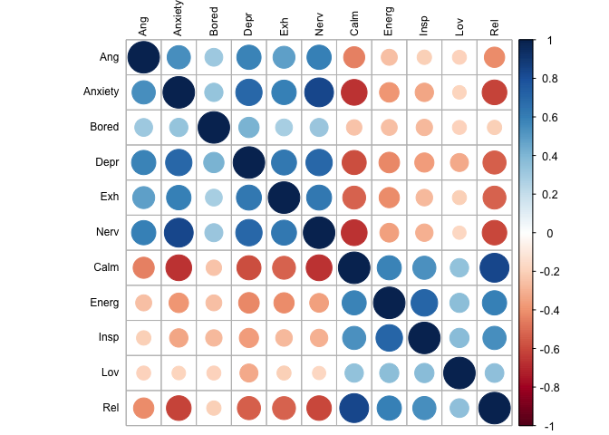

Factor analysis between-person
================
Anne Margit
6/8/2020

This is the confirmatory factor analysis of between-person emotion
scores (i.e., mean scores across waves)

This dataset includes measurements from participants that (1) provided
at least 3 measurements, (2) that are residents of the country they
currently live in, (3) from countries with at least 20 participants, (4)
provided data on age

``` r
load("data_long_min3_20.Rdata")
```

Content and Excited are only measured at baseline, so not using these

``` r
data_long_min3_20 <- as_tibble(data_long_min3_20)
data_factor <- data_long_min3_20 %>% select(ID, Wave, Ang, Anxiety, Bored, Calm, Depr, Energ, Exh, Insp, Lov, Nerv, Rel)
```

``` r
data_means <- data_factor %>%
    dplyr::group_by(ID) %>%
    dplyr::summarise_each(funs(mean(., na.rm=TRUE)), 
                          Ang, Anxiety, Bored, Calm, Depr, Energ, Exh, Insp, Lov, Nerv, Rel)
```

    ## Warning: `summarise_each_()` is deprecated as of dplyr 0.7.0.
    ## Please use `across()` instead.
    ## This warning is displayed once every 8 hours.
    ## Call `lifecycle::last_warnings()` to see where this warning was generated.

    ## Warning: `funs()` is deprecated as of dplyr 0.8.0.
    ## Please use a list of either functions or lambdas: 
    ## 
    ##   # Simple named list: 
    ##   list(mean = mean, median = median)
    ## 
    ##   # Auto named with `tibble::lst()`: 
    ##   tibble::lst(mean, median)
    ## 
    ##   # Using lambdas
    ##   list(~ mean(., trim = .2), ~ median(., na.rm = TRUE))
    ## This warning is displayed once every 8 hours.
    ## Call `lifecycle::last_warnings()` to see where this warning was generated.

``` r
save(data_means, file="data_means.Rdata")
```

``` r
round(cor(data_means[,c("Ang", "Anxiety", "Bored", "Depr","Exh","Nerv","Calm","Energ", "Insp", "Lov","Rel")],use= "complete.obs"),2)
```

    ##           Ang Anxiety Bored  Depr   Exh  Nerv  Calm Energ  Insp   Lov   Rel
    ## Ang      1.00    0.54  0.32  0.59  0.48  0.59 -0.45 -0.26 -0.21 -0.20 -0.42
    ## Anxiety  0.54    1.00  0.34  0.70  0.60  0.83 -0.67 -0.38 -0.34 -0.19 -0.61
    ## Bored    0.32    0.34  1.00  0.41  0.29  0.33 -0.24 -0.25 -0.27 -0.20 -0.21
    ## Depr     0.59    0.70  0.41  1.00  0.63  0.70 -0.58 -0.43 -0.37 -0.33 -0.54
    ## Exh      0.48    0.60  0.29  0.63  1.00  0.63 -0.53 -0.41 -0.28 -0.20 -0.53
    ## Nerv     0.59    0.83  0.33  0.70  0.63  1.00 -0.67 -0.35 -0.30 -0.18 -0.61
    ## Calm    -0.45   -0.67 -0.24 -0.58 -0.53 -0.67  1.00  0.58  0.54  0.34  0.84
    ## Energ   -0.26   -0.38 -0.25 -0.43 -0.41 -0.35  0.58  1.00  0.71  0.37  0.59
    ## Insp    -0.21   -0.34 -0.27 -0.37 -0.28 -0.30  0.54  0.71  1.00  0.37  0.54
    ## Lov     -0.20   -0.19 -0.20 -0.33 -0.20 -0.18  0.34  0.37  0.37  1.00  0.35
    ## Rel     -0.42   -0.61 -0.21 -0.54 -0.53 -0.61  0.84  0.59  0.54  0.35  1.00

``` r
corrplot(cor(data_means[,c("Ang", "Anxiety", "Bored", "Depr","Exh","Nerv","Calm", "Energ", "Insp", "Lov","Rel")], use="complete.obs"), order = "original", tl.col='black', tl.cex=.75)
```

<!-- -->

``` r
model <- '
f1 =~ Ang + Anxiety + Bored + Depr + Exh + Nerv 
f2 =~ Calm  + Energ  + Insp + Lov + Rel 

# latent variable variances
f1 ~~ 1*f1
f2 ~~ 1*f2

# latent variable covariances
f1 ~~ f2

# manifest variable variances (uniquenesses)
  Ang ~~ Ang
  Anxiety ~~ Anxiety
  Bored ~~ Bored
  Depr ~~ Depr
  Exh ~~ Exh
  Nerv ~~ Nerv
  Calm ~~ Calm
  Energ ~~ Energ
  Insp ~~ Insp
  Lov ~~ Lov
  Rel ~~ Rel

#manifest variable means 
  Ang ~ 1
  Anxiety ~ 1
  Bored ~ 1
  Depr ~ 1
  Exh ~ 1
  Nerv ~ 1
  Calm ~ 1
  Energ ~ 1
  Insp ~ 1
  Lov ~ 1
  Rel ~ 1
'
```

``` r
fit <- cfa(model, data = data_means, std.lv=TRUE, missing="fiml")
summary(fit, standardized=TRUE, fit.measures=TRUE)
```

    ## lavaan 0.6-6 ended normally after 44 iterations
    ## 
    ##   Estimator                                         ML
    ##   Optimization method                           NLMINB
    ##   Number of free parameters                         34
    ##                                                       
    ##   Number of observations                          9177
    ##   Number of missing patterns                         7
    ##                                                       
    ## Model Test User Model:
    ##                                                       
    ##   Test statistic                              6730.025
    ##   Degrees of freedom                                43
    ##   P-value (Chi-square)                           0.000
    ## 
    ## Model Test Baseline Model:
    ## 
    ##   Test statistic                             62896.569
    ##   Degrees of freedom                                55
    ##   P-value                                        0.000
    ## 
    ## User Model versus Baseline Model:
    ## 
    ##   Comparative Fit Index (CFI)                    0.894
    ##   Tucker-Lewis Index (TLI)                       0.864
    ## 
    ## Loglikelihood and Information Criteria:
    ## 
    ##   Loglikelihood user model (H0)            -109964.838
    ##   Loglikelihood unrestricted model (H1)    -106599.825
    ##                                                       
    ##   Akaike (AIC)                              219997.675
    ##   Bayesian (BIC)                            220239.907
    ##   Sample-size adjusted Bayesian (BIC)       220131.860
    ## 
    ## Root Mean Square Error of Approximation:
    ## 
    ##   RMSEA                                          0.130
    ##   90 Percent confidence interval - lower         0.128
    ##   90 Percent confidence interval - upper         0.133
    ##   P-value RMSEA <= 0.05                          0.000
    ## 
    ## Standardized Root Mean Square Residual:
    ## 
    ##   SRMR                                           0.057
    ## 
    ## Parameter Estimates:
    ## 
    ##   Standard errors                             Standard
    ##   Information                                 Observed
    ##   Observed information based on                Hessian
    ## 
    ## Latent Variables:
    ##                    Estimate  Std.Err  z-value  P(>|z|)   Std.lv  Std.all
    ##   f1 =~                                                                 
    ##     Ang               0.626    0.009   68.082    0.000    0.626    0.651
    ##     Anxiety           0.896    0.008  107.694    0.000    0.896    0.892
    ##     Bored             0.433    0.011   38.195    0.000    0.433    0.397
    ##     Depr              0.759    0.008   90.624    0.000    0.759    0.802
    ##     Exh               0.692    0.009   75.862    0.000    0.692    0.707
    ##     Nerv              0.868    0.008  110.162    0.000    0.868    0.905
    ##   f2 =~                                                                 
    ##     Calm              0.794    0.007  113.001    0.000    0.794    0.923
    ##     Energ             0.579    0.008   69.780    0.000    0.579    0.667
    ##     Insp              0.555    0.009   63.271    0.000    0.555    0.618
    ##     Lov               0.410    0.011   38.168    0.000    0.410    0.397
    ##     Rel               0.792    0.007  108.934    0.000    0.792    0.901
    ## 
    ## Covariances:
    ##                    Estimate  Std.Err  z-value  P(>|z|)   Std.lv  Std.all
    ##   f1 ~~                                                                 
    ##     f2               -0.758    0.005 -140.148    0.000   -0.758   -0.758
    ## 
    ## Intercepts:
    ##                    Estimate  Std.Err  z-value  P(>|z|)   Std.lv  Std.all
    ##    .Ang               2.001    0.010  199.234    0.000    2.001    2.080
    ##    .Anxiety           2.466    0.010  235.257    0.000    2.466    2.456
    ##    .Bored             2.276    0.011  199.650    0.000    2.276    2.085
    ##    .Depr              2.064    0.010  208.836    0.000    2.064    2.180
    ##    .Exh               2.362    0.010  231.295    0.000    2.362    2.415
    ##    .Nerv              2.334    0.010  233.047    0.000    2.334    2.433
    ##    .Calm              3.031    0.009  337.362    0.000    3.031    3.522
    ##    .Energ             2.600    0.009  286.901    0.000    2.600    2.995
    ##    .Insp              2.438    0.009  259.945    0.000    2.438    2.714
    ##    .Lov               3.401    0.011  315.357    0.000    3.401    3.292
    ##    .Rel               2.845    0.009  310.350    0.000    2.845    3.240
    ##     f1                0.000                               0.000    0.000
    ##     f2                0.000                               0.000    0.000
    ## 
    ## Variances:
    ##                    Estimate  Std.Err  z-value  P(>|z|)   Std.lv  Std.all
    ##     f1                1.000                               1.000    1.000
    ##     f2                1.000                               1.000    1.000
    ##    .Ang               0.533    0.008   63.695    0.000    0.533    0.576
    ##    .Anxiety           0.205    0.004   46.973    0.000    0.205    0.204
    ##    .Bored             1.004    0.015   66.684    0.000    1.004    0.842
    ##    .Depr              0.319    0.006   57.003    0.000    0.319    0.356
    ##    .Exh               0.479    0.008   62.135    0.000    0.479    0.500
    ##    .Nerv              0.167    0.004   43.568    0.000    0.167    0.181
    ##    .Calm              0.110    0.003   34.521    0.000    0.110    0.149
    ##    .Energ             0.418    0.007   62.480    0.000    0.418    0.555
    ##    .Insp              0.499    0.008   63.677    0.000    0.499    0.618
    ##    .Lov               0.899    0.013   66.665    0.000    0.899    0.842
    ##    .Rel               0.145    0.003   42.202    0.000    0.145    0.188

``` r
parameterEstimates(fit, standardized=TRUE) %>% 
  filter(op == "=~") %>% 
  select('Latent Factor'=lhs, Indicator=rhs, B=est, SE=se, Z=z, 'p-value'=pvalue, Beta=std.all) %>% 
  kable(digits = 3, format="pandoc", caption="Factor Loadings")
```

| Latent Factor | Indicator |     B |    SE |       Z | p-value |  Beta |
| :------------ | :-------- | ----: | ----: | ------: | ------: | ----: |
| f1            | Ang       | 0.626 | 0.009 |  68.082 |       0 | 0.651 |
| f1            | Anxiety   | 0.896 | 0.008 | 107.694 |       0 | 0.892 |
| f1            | Bored     | 0.433 | 0.011 |  38.195 |       0 | 0.397 |
| f1            | Depr      | 0.759 | 0.008 |  90.624 |       0 | 0.802 |
| f1            | Exh       | 0.692 | 0.009 |  75.862 |       0 | 0.707 |
| f1            | Nerv      | 0.868 | 0.008 | 110.162 |       0 | 0.905 |
| f2            | Calm      | 0.794 | 0.007 | 113.001 |       0 | 0.923 |
| f2            | Energ     | 0.579 | 0.008 |  69.780 |       0 | 0.667 |
| f2            | Insp      | 0.555 | 0.009 |  63.271 |       0 | 0.618 |
| f2            | Lov       | 0.410 | 0.011 |  38.168 |       0 | 0.397 |
| f2            | Rel       | 0.792 | 0.007 | 108.934 |       0 | 0.901 |

Factor Loadings
