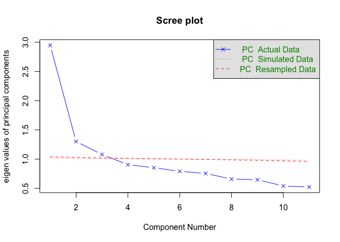

Within person exploratory factor analysis
================
Anne Margit
6/23/2020

This is the principal component analysis of within-person emotion
scores, using person-mean centered scores.

``` r
load("data_within2.Rdata")
```

install.packages(“GPArotation”)

``` r
library(psych)
library(dplyr)
```

    ## 
    ## Attaching package: 'dplyr'

    ## The following objects are masked from 'package:stats':
    ## 
    ##     filter, lag

    ## The following objects are masked from 'package:base':
    ## 
    ##     intersect, setdiff, setequal, union

``` r
library(GPArotation)
```

``` r
data_within3 <- data_within2 %>%
  select(-c("ID", "Wave"))
```

    ## Adding missing grouping variables: `ID`

Parallel analysis. Choose the number of factors by simulating a random
data set, and choosing the point where the eigenvalues of the real data
fall below the simulated
data.

``` r
within_cor <- cor(data_within3[,-1], use="complete.obs")
```

``` r
parallel <- fa.parallel(data_within3[,-1], fm="ml", main="Scree plot", fa= "pc", n.iter=50, SMC=TRUE, quant = .95 )
```

<!-- -->

    ## Parallel analysis suggests that the number of factors =  NA  and the number of components =  3

``` r
parallel
```

    ## Call: fa.parallel(x = data_within3[, -1], fm = "ml", fa = "pc", main = "Scree plot", 
    ##     n.iter = 50, SMC = TRUE, quant = 0.95)
    ## Parallel analysis suggests that the number of factors =  NA  and the number of components =  3 
    ## 
    ##  Eigen Values of 
    ## 
    ##  eigen values of factors
    ##  [1]  2.18  0.50  0.26  0.01 -0.01 -0.03 -0.12 -0.12 -0.17 -0.18 -0.20
    ## 
    ##  eigen values of simulated factors
    ## [1] NA
    ## 
    ##  eigen values of components 
    ##  [1] 2.95 1.30 1.08 0.91 0.85 0.79 0.75 0.66 0.65 0.54 0.52
    ## 
    ##  eigen values of simulated components
    ##  [1] 1.02 1.01 1.01 1.01 1.00 1.00 1.00 0.99 0.99 0.99 0.98

This suggests 3 within-person
components

``` r
threepca <- principal(data_within3[,-1], nfactors = 3, rotate = "varimax")
threepca
```

    ## Principal Components Analysis
    ## Call: principal(r = data_within3[, -1], nfactors = 3, rotate = "varimax")
    ## Standardized loadings (pattern matrix) based upon correlation matrix
    ##           RC3   RC1   RC2   h2   u2 com
    ## Ang      0.61 -0.09 -0.03 0.38 0.62 1.0
    ## Bored    0.64  0.35 -0.26 0.60 0.40 1.9
    ## Anxiety  0.49 -0.57  0.07 0.56 0.44 2.0
    ## Calm    -0.06  0.67  0.36 0.58 0.42 1.6
    ## Depr     0.62 -0.23 -0.15 0.46 0.54 1.4
    ## Energ   -0.14  0.09  0.72 0.54 0.46 1.1
    ## Exh      0.48 -0.21 -0.07 0.28 0.72 1.4
    ## Insp    -0.10  0.09  0.71 0.52 0.48 1.1
    ## Lov     -0.02  0.07  0.49 0.25 0.75 1.1
    ## Nerv     0.48 -0.59  0.10 0.59 0.41 2.0
    ## Rel     -0.06  0.65  0.40 0.58 0.42 1.7
    ## 
    ##                        RC3  RC1  RC2
    ## SS loadings           1.90 1.78 1.65
    ## Proportion Var        0.17 0.16 0.15
    ## Cumulative Var        0.17 0.33 0.48
    ## Proportion Explained  0.36 0.33 0.31
    ## Cumulative Proportion 0.36 0.69 1.00
    ## 
    ## Mean item complexity =  1.5
    ## Test of the hypothesis that 3 components are sufficient.
    ## 
    ## The root mean square of the residuals (RMSR) is  0.1 
    ##  with the empirical chi square  76761.7  with prob <  0 
    ## 
    ## Fit based upon off diagonal values = 0.77

``` r
threepca2 <- principal(data_within3[,-1], nfactors = 3, rotate = "oblimin")
threepca2
```

    ## Principal Components Analysis
    ## Call: principal(r = data_within3[, -1], nfactors = 3, rotate = "oblimin")
    ## Standardized loadings (pattern matrix) based upon correlation matrix
    ##           TC1   TC2   TC3   h2   u2 com
    ## Ang      0.45  0.02  0.42 0.38 0.62 2.0
    ## Bored    0.08 -0.16  0.74 0.60 0.40 1.1
    ## Anxiety  0.77  0.06  0.01 0.56 0.44 1.0
    ## Calm    -0.42  0.44  0.33 0.58 0.42 2.9
    ## Depr     0.53 -0.12  0.35 0.46 0.54 1.8
    ## Energ    0.08  0.74 -0.14 0.54 0.46 1.1
    ## Exh      0.45 -0.05  0.24 0.28 0.72 1.6
    ## Insp     0.10  0.73 -0.11 0.52 0.48 1.1
    ## Lov      0.09  0.51 -0.03 0.25 0.75 1.1
    ## Nerv     0.79  0.08 -0.01 0.59 0.41 1.0
    ## Rel     -0.39  0.48  0.32 0.58 0.42 2.7
    ## 
    ##                        TC1  TC2  TC3
    ## SS loadings           2.31 1.87 1.15
    ## Proportion Var        0.21 0.17 0.10
    ## Cumulative Var        0.21 0.38 0.48
    ## Proportion Explained  0.43 0.35 0.22
    ## Cumulative Proportion 0.43 0.78 1.00
    ## 
    ##  With component correlations of 
    ##       TC1   TC2   TC3
    ## TC1  1.00 -0.30  0.01
    ## TC2 -0.30  1.00 -0.03
    ## TC3  0.01 -0.03  1.00
    ## 
    ## Mean item complexity =  1.6
    ## Test of the hypothesis that 3 components are sufficient.
    ## 
    ## The root mean square of the residuals (RMSR) is  0.1 
    ##  with the empirical chi square  76761.7  with prob <  0 
    ## 
    ## Fit based upon off diagonal values = 0.77
