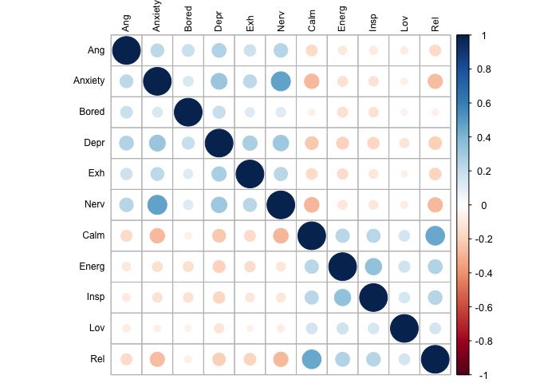

Factor analysis within-person
================
Anne Margit
6/15/2020

This is the confirmatory factor analysis of within-person emotion
scores, using person-mean centered scores

``` r
load("data_long_min3_20.Rdata")
load("data_means.Rdata")
```

``` r
data_long_min3_20 <- as_tibble(data_long_min3_20)
data_factor <- data_long_min3_20 %>% select(ID, Wave, Ang, Anxiety, Bored, Calm, Content, Depr, Energ, Exc, Exh, Insp, Lov, Nerv, Rel)
```

``` r
data_factor_pmeans <- data_factor %>%
  group_by(ID) %>%
  mutate_at(
    c("Ang", "Anxiety", "Bored", "Calm", "Content", "Depr", "Energ", "Exc", "Exh", "Insp", "Lov", "Nerv", "Rel"),
    funs(mean), na.rm=TRUE)
```

    ## Warning: `funs()` is deprecated as of dplyr 0.8.0.
    ## Please use a list of either functions or lambdas: 
    ## 
    ##   # Simple named list: 
    ##   list(mean = mean, median = median)
    ## 
    ##   # Auto named with `tibble::lst()`: 
    ##   tibble::lst(mean, median)
    ## 
    ##   # Using lambdas
    ##   list(~ mean(., trim = .2), ~ median(., na.rm = TRUE))
    ## This warning is displayed once every 8 hours.
    ## Call `lifecycle::last_warnings()` to see where this warning was generated.

``` r
data_factor_new <- left_join(data_factor, data_means, by="ID")
```

This dataframe data\_within contains the raw scores - person means
Excited and Content are only measured on baseline, so better to delete
those

``` r
data_within <- data_factor_new %>%
group_by(ID) %>%
  transmute(Wave = Wave,
    Ang = Ang.x - Ang.y,
         Bored = Bored.x - Bored.y,
         Anxiety = Anxiety.x - Anxiety.y,
         Calm = Calm.x - Calm.y,
         Content = Content.x - Content.y,
         Depr = Depr.x - Depr.y,
         Energ = Energ.x - Energ.y,
         Exc = Exc.x - Exc.y,
         Exh = Exh.x - Exh.y,
         Insp = Insp.x - Insp.y,
         Lov = Lov.x - Lov.y,
         Nerv = Nerv.x - Nerv.y,
         Rel = Rel.x - Rel.y)
```

Without excited and content

``` r
data_within2 <- data_factor_new %>%
group_by(ID) %>%
  transmute(Wave = Wave,
    Ang = Ang.x - Ang.y,
         Bored = Bored.x - Bored.y,
         Anxiety = Anxiety.x - Anxiety.y,
         Calm = Calm.x - Calm.y,
         Depr = Depr.x - Depr.y,
         Energ = Energ.x - Energ.y,
         Exh = Exh.x - Exh.y,
         Insp = Insp.x - Insp.y,
         Lov = Lov.x - Lov.y,
         Nerv = Nerv.x - Nerv.y,
         Rel = Rel.x - Rel.y)
```

``` r
save(data_within2, file = "data_within2.Rdata")
```

``` r
round(cor(data_within2[,c("Ang", "Anxiety", "Bored", "Depr","Exh","Nerv","Calm","Energ", "Insp", "Lov","Rel")],use= "pairwise.complete.obs"),2)
```

    ##           Ang Anxiety Bored  Depr   Exh  Nerv  Calm Energ  Insp   Lov   Rel
    ## Ang      1.00    0.22  0.18  0.25  0.17  0.24 -0.16 -0.10 -0.09 -0.08 -0.16
    ## Anxiety  0.22    1.00  0.13  0.33  0.22  0.47 -0.28 -0.13 -0.12 -0.06 -0.27
    ## Bored    0.18    0.13  1.00  0.19  0.12  0.12 -0.06 -0.13 -0.12 -0.06 -0.06
    ## Depr     0.25    0.33  0.19  1.00  0.27  0.32 -0.22 -0.19 -0.18 -0.12 -0.21
    ## Exh      0.17    0.22  0.12  0.27  1.00  0.23 -0.16 -0.15 -0.11 -0.05 -0.18
    ## Nerv     0.24    0.47  0.12  0.32  0.23  1.00 -0.28 -0.11 -0.11 -0.07 -0.27
    ## Calm    -0.16   -0.28 -0.06 -0.22 -0.16 -0.28  1.00  0.24  0.23  0.15  0.46
    ## Energ   -0.10   -0.13 -0.13 -0.19 -0.15 -0.11  0.24  1.00  0.35  0.17  0.26
    ## Insp    -0.09   -0.12 -0.12 -0.18 -0.11 -0.11  0.23  0.35  1.00  0.15  0.25
    ## Lov     -0.08   -0.06 -0.06 -0.12 -0.05 -0.07  0.15  0.17  0.15  1.00  0.15
    ## Rel     -0.16   -0.27 -0.06 -0.21 -0.18 -0.27  0.46  0.26  0.25  0.15  1.00

``` r
corrplot(cor(data_within2[,c("Ang", "Anxiety", "Bored", "Depr","Exh","Nerv","Calm","Energ", "Insp", "Lov","Rel")], use="pairwise.complete.obs"), order = "original", tl.col='black', tl.cex=.75)
```

<!-- -->

``` r
model <- '
f1 =~ Ang + Anxiety + Bored + Depr + Exh + Nerv 
f2 =~ Calm + Energ + Insp + Lov + Rel 

# latent variable variances
f1 ~~ 1*f1
f2 ~~ 1*f2

# latent variable covariances
f1 ~~ f2

# manifest variable variances (uniquenesses)
  Ang ~~ Ang
  Anxiety ~~ Anxiety
  Bored ~~ Bored
  Depr ~~ Depr
  Exh ~~ Exh
  Nerv ~~ Nerv
  Calm ~~ Calm
  Energ ~~ Energ
  Insp ~~ Insp
  Lov ~~ Lov
  Rel ~~ Rel

#manifest variable means 
  Ang ~ 1
  Anxiety ~ 1
  Bored ~ 1
  Depr ~ 1
  Exh ~ 1
  Nerv ~ 1
  Calm ~ 1
  Energ ~ 1
  Insp ~ 1
  Lov ~ 1
  Rel ~ 1
'
```

``` r
fit <- cfa(model, data = data_within2, std.lv=TRUE, missing="fiml")
```

``` r
summary(fit, standardized=TRUE, fit.measures=TRUE)
```

    ## lavaan 0.6-6 ended normally after 30 iterations
    ## 
    ##   Estimator                                         ML
    ##   Optimization method                           NLMINB
    ##   Number of free parameters                         34
    ##                                                       
    ##                                                   Used       Total
    ##   Number of observations                         40020       73416
    ##   Number of missing patterns                       167            
    ##                                                                   
    ## Model Test User Model:
    ##                                                       
    ##   Test statistic                              4862.283
    ##   Degrees of freedom                                43
    ##   P-value (Chi-square)                           0.000
    ## 
    ## Model Test Baseline Model:
    ## 
    ##   Test statistic                             55732.898
    ##   Degrees of freedom                                55
    ##   P-value                                        0.000
    ## 
    ## User Model versus Baseline Model:
    ## 
    ##   Comparative Fit Index (CFI)                    0.913
    ##   Tucker-Lewis Index (TLI)                       0.889
    ## 
    ## Loglikelihood and Information Criteria:
    ## 
    ##   Loglikelihood user model (H0)            -367042.816
    ##   Loglikelihood unrestricted model (H1)    -364611.674
    ##                                                       
    ##   Akaike (AIC)                              734153.632
    ##   Bayesian (BIC)                            734445.935
    ##   Sample-size adjusted Bayesian (BIC)       734337.883
    ## 
    ## Root Mean Square Error of Approximation:
    ## 
    ##   RMSEA                                          0.053
    ##   90 Percent confidence interval - lower         0.052
    ##   90 Percent confidence interval - upper         0.054
    ##   P-value RMSEA <= 0.05                          0.000
    ## 
    ## Standardized Root Mean Square Residual:
    ## 
    ##   SRMR                                           0.036
    ## 
    ## Parameter Estimates:
    ## 
    ##   Standard errors                             Standard
    ##   Information                                 Observed
    ##   Observed information based on                Hessian
    ## 
    ## Latent Variables:
    ##                    Estimate  Std.Err  z-value  P(>|z|)   Std.lv  Std.all
    ##   f1 =~                                                                 
    ##     Ang               0.262    0.004   61.778    0.000    0.262    0.422
    ##     Anxiety           0.438    0.004  119.179    0.000    0.438    0.651
    ##     Bored             0.148    0.005   32.546    0.000    0.148    0.233
    ##     Depr              0.339    0.004   96.439    0.000    0.339    0.542
    ##     Exh               0.279    0.004   68.862    0.000    0.279    0.395
    ##     Nerv              0.439    0.004  119.001    0.000    0.439    0.651
    ##   f2 =~                                                                 
    ##     Calm              0.408    0.004  115.329    0.000    0.408    0.648
    ##     Energ             0.275    0.004   73.729    0.000    0.275    0.434
    ##     Insp              0.279    0.004   71.192    0.000    0.279    0.420
    ##     Lov               0.138    0.004   39.405    0.000    0.138    0.278
    ##     Rel               0.430    0.004  117.972    0.000    0.430    0.663
    ## 
    ## Covariances:
    ##                    Estimate  Std.Err  z-value  P(>|z|)   Std.lv  Std.all
    ##   f1 ~~                                                                 
    ##     f2               -0.610    0.006 -105.406    0.000   -0.610   -0.610
    ## 
    ## Intercepts:
    ##                    Estimate  Std.Err  z-value  P(>|z|)   Std.lv  Std.all
    ##    .Ang               0.022    0.004    6.323    0.000    0.022    0.036
    ##    .Anxiety           0.000    0.003    0.033    0.974    0.000    0.000
    ##    .Bored            -0.006    0.004   -1.521    0.128   -0.006   -0.010
    ##    .Depr              0.000    0.003    0.065    0.949    0.000    0.000
    ##    .Exh               0.000    0.004    0.070    0.945    0.000    0.000
    ##    .Nerv              0.000    0.003    0.074    0.941    0.000    0.000
    ##    .Calm             -0.000    0.003   -0.070    0.944   -0.000   -0.000
    ##    .Energ            -0.000    0.003   -0.038    0.970   -0.000   -0.000
    ##    .Insp             -0.000    0.003   -0.051    0.960   -0.000   -0.000
    ##    .Lov              -0.011    0.003   -3.888    0.000   -0.011   -0.022
    ##    .Rel              -0.000    0.003   -0.100    0.920   -0.000   -0.001
    ##     f1                0.000                               0.000    0.000
    ##     f2                0.000                               0.000    0.000
    ## 
    ## Variances:
    ##                    Estimate  Std.Err  z-value  P(>|z|)   Std.lv  Std.all
    ##     f1                1.000                               1.000    1.000
    ##     f2                1.000                               1.000    1.000
    ##    .Ang               0.315    0.003  113.116    0.000    0.315    0.822
    ##    .Anxiety           0.261    0.003   99.432    0.000    0.261    0.577
    ##    .Bored             0.380    0.004  107.655    0.000    0.380    0.945
    ##    .Depr              0.277    0.002  116.316    0.000    0.277    0.707
    ##    .Exh               0.421    0.003  130.490    0.000    0.421    0.844
    ##    .Nerv              0.262    0.003   99.237    0.000    0.262    0.577
    ##    .Calm              0.229    0.002   95.745    0.000    0.229    0.580
    ##    .Energ             0.325    0.003  125.115    0.000    0.325    0.811
    ##    .Insp              0.364    0.003  126.505    0.000    0.364    0.824
    ##    .Lov               0.227    0.002  119.408    0.000    0.227    0.923
    ##    .Rel               0.236    0.003   92.353    0.000    0.236    0.560

Factor loadings for within-person factor analysis based on person-mean
centered deviation scores

``` r
parameterEstimates(fit, standardized=TRUE) %>% 
  filter(op == "=~") %>% 
  select('Latent Factor'=lhs, Indicator=rhs, B=est, SE=se, Z=z, 'p-value'=pvalue, Beta=std.all) %>% 
  kable(digits = 3, format="pandoc", caption="Factor Loadings")
```

| Latent Factor | Indicator |     B |    SE |       Z | p-value |  Beta |
| :------------ | :-------- | ----: | ----: | ------: | ------: | ----: |
| f1            | Ang       | 0.262 | 0.004 |  61.778 |       0 | 0.422 |
| f1            | Anxiety   | 0.438 | 0.004 | 119.179 |       0 | 0.651 |
| f1            | Bored     | 0.148 | 0.005 |  32.546 |       0 | 0.233 |
| f1            | Depr      | 0.339 | 0.004 |  96.439 |       0 | 0.542 |
| f1            | Exh       | 0.279 | 0.004 |  68.862 |       0 | 0.395 |
| f1            | Nerv      | 0.439 | 0.004 | 119.001 |       0 | 0.651 |
| f2            | Calm      | 0.408 | 0.004 | 115.329 |       0 | 0.648 |
| f2            | Energ     | 0.275 | 0.004 |  73.729 |       0 | 0.434 |
| f2            | Insp      | 0.279 | 0.004 |  71.192 |       0 | 0.420 |
| f2            | Lov       | 0.138 | 0.004 |  39.405 |       0 | 0.278 |
| f2            | Rel       | 0.430 | 0.004 | 117.972 |       0 | 0.663 |

Factor Loadings

With Lavaan package based on raw scores

``` r
model2 <- '
level: 1
f1 =~ Ang + Anxiety + Bored + Depr + Exh + Nerv 
f2 =~ Calm + Energ + Insp + Lov + Rel 

level: 2
f1 =~ Ang + Anxiety + Bored + Depr + Exh + Nerv 
f2 =~ Calm + Energ + Insp + Lov + Rel 
'
```

``` r
fit2 <- cfa(model2, data = data_long_min3_20, std.lv=TRUE, missing="fiml", cluster="ID")
```

``` r
summary(fit2, standardized=TRUE, fit.measures=TRUE)
```

    ## lavaan 0.6-6 ended normally after 39 iterations
    ## 
    ##   Estimator                                         ML
    ##   Optimization method                           NLMINB
    ##   Number of free parameters                         57
    ##                                                       
    ##                                                   Used       Total
    ##   Number of observations                         15091       73416
    ##   Number of clusters [ID]                         7317            
    ##                                                                   
    ## Model Test User Model:
    ##                                                       
    ##   Test statistic                              5410.391
    ##   Degrees of freedom                                86
    ##   P-value (Chi-square)                           0.000
    ## 
    ## Model Test Baseline Model:
    ## 
    ##   Test statistic                             54148.651
    ##   Degrees of freedom                               110
    ##   P-value                                        0.000
    ## 
    ## User Model versus Baseline Model:
    ## 
    ##   Comparative Fit Index (CFI)                    0.901
    ##   Tucker-Lewis Index (TLI)                       0.874
    ## 
    ## Loglikelihood and Information Criteria:
    ## 
    ##   Loglikelihood user model (H0)            -205755.843
    ##   Loglikelihood unrestricted model (H1)    -203050.647
    ##                                                       
    ##   Akaike (AIC)                              411625.686
    ##   Bayesian (BIC)                            412060.131
    ##   Sample-size adjusted Bayesian (BIC)       411878.990
    ## 
    ## Root Mean Square Error of Approximation:
    ## 
    ##   RMSEA                                          0.064
    ##   90 Percent confidence interval - lower         0.063
    ##   90 Percent confidence interval - upper         0.066
    ##   P-value RMSEA <= 0.05                          0.000
    ## 
    ## Standardized Root Mean Square Residual (corr metric):
    ## 
    ##   SRMR (within covariance matrix)                0.032
    ##   SRMR (between covariance matrix)               0.070
    ## 
    ## Parameter Estimates:
    ## 
    ##   Standard errors                             Standard
    ##   Information                                 Observed
    ##   Observed information based on                Hessian
    ## 
    ## 
    ## Level 1 [within]:
    ## 
    ## Latent Variables:
    ##                    Estimate  Std.Err  z-value  P(>|z|)   Std.lv  Std.all
    ##   f1 =~                                                                 
    ##     Ang               0.328    0.009   34.795    0.000    0.328    0.472
    ##     Anxiety           0.388    0.010   37.775    0.000    0.388    0.568
    ##     Bored             0.194    0.011   17.782    0.000    0.194    0.274
    ##     Depr              0.363    0.010   37.408    0.000    0.363    0.560
    ##     Exh               0.290    0.010   28.671    0.000    0.290    0.393
    ##     Nerv              0.381    0.011   34.437    0.000    0.381    0.555
    ##   f2 =~                                                                 
    ##     Calm              0.379    0.012   32.267    0.000    0.379    0.573
    ##     Energ             0.329    0.014   22.749    0.000    0.329    0.490
    ##     Insp              0.323    0.015   21.673    0.000    0.323    0.461
    ##     Lov               0.165    0.008   19.894    0.000    0.165    0.299
    ##     Rel               0.399    0.011   36.050    0.000    0.399    0.582
    ## 
    ## Covariances:
    ##                    Estimate  Std.Err  z-value  P(>|z|)   Std.lv  Std.all
    ##   f1 ~~                                                                 
    ##     f2               -0.513    0.016  -32.805    0.000   -0.513   -0.513
    ## 
    ## Intercepts:
    ##                    Estimate  Std.Err  z-value  P(>|z|)   Std.lv  Std.all
    ##    .Ang               0.000                               0.000    0.000
    ##    .Anxiety           0.000                               0.000    0.000
    ##    .Bored             0.000                               0.000    0.000
    ##    .Depr              0.000                               0.000    0.000
    ##    .Exh               0.000                               0.000    0.000
    ##    .Nerv              0.000                               0.000    0.000
    ##    .Calm              0.000                               0.000    0.000
    ##    .Energ             0.000                               0.000    0.000
    ##    .Insp              0.000                               0.000    0.000
    ##    .Lov               0.000                               0.000    0.000
    ##    .Rel               0.000                               0.000    0.000
    ##     f1                0.000                               0.000    0.000
    ##     f2                0.000                               0.000    0.000
    ## 
    ## Variances:
    ##                    Estimate  Std.Err  z-value  P(>|z|)   Std.lv  Std.all
    ##    .Ang               0.377    0.007   53.718    0.000    0.377    0.778
    ##    .Anxiety           0.315    0.007   45.732    0.000    0.315    0.677
    ##    .Bored             0.464    0.008   59.630    0.000    0.464    0.925
    ##    .Depr              0.289    0.006   46.131    0.000    0.289    0.687
    ##    .Exh               0.461    0.008   57.331    0.000    0.461    0.846
    ##    .Nerv              0.325    0.007   45.896    0.000    0.325    0.691
    ##    .Calm              0.294    0.008   38.426    0.000    0.294    0.671
    ##    .Energ             0.342    0.008   43.607    0.000    0.342    0.760
    ##    .Insp              0.386    0.008   46.502    0.000    0.386    0.788
    ##    .Lov               0.278    0.005   59.017    0.000    0.278    0.911
    ##    .Rel               0.311    0.008   39.687    0.000    0.311    0.661
    ##     f1                1.000                               1.000    1.000
    ##     f2                1.000                               1.000    1.000
    ## 
    ## 
    ## Level 2 [ID]:
    ## 
    ## Latent Variables:
    ##                    Estimate  Std.Err  z-value  P(>|z|)   Std.lv  Std.all
    ##   f1 =~                                                                 
    ##     Ang               0.658    0.012   55.410    0.000    0.658    0.734
    ##     Anxiety           0.887    0.012   76.987    0.000    0.887    0.921
    ##     Bored             0.481    0.014   34.043    0.000    0.481    0.498
    ##     Depr              0.782    0.011   69.809    0.000    0.782    0.862
    ##     Exh               0.724    0.012   58.696    0.000    0.724    0.772
    ##     Nerv              0.848    0.011   76.043    0.000    0.848    0.937
    ##   f2 =~                                                                 
    ##     Calm              0.796    0.010   79.101    0.000    0.796    0.973
    ##     Energ             0.599    0.013   46.111    0.000    0.599    0.722
    ##     Insp              0.570    0.014   40.796    0.000    0.570    0.660
    ##     Lov               0.448    0.014   31.633    0.000    0.448    0.447
    ##     Rel               0.808    0.010   79.610    0.000    0.808    0.968
    ## 
    ## Covariances:
    ##                    Estimate  Std.Err  z-value  P(>|z|)   Std.lv  Std.all
    ##   f1 ~~                                                                 
    ##     f2               -0.758    0.008  -96.774    0.000   -0.758   -0.758
    ## 
    ## Intercepts:
    ##                    Estimate  Std.Err  z-value  P(>|z|)   Std.lv  Std.all
    ##    .Ang               2.001    0.012  165.340    0.000    2.001    2.232
    ##    .Anxiety           2.318    0.013  182.146    0.000    2.318    2.405
    ##    .Bored             2.170    0.013  168.319    0.000    2.170    2.243
    ##    .Depr              1.999    0.012  166.403    0.000    1.999    2.203
    ##    .Exh               2.345    0.013  184.770    0.000    2.345    2.502
    ##    .Nerv              2.197    0.012  181.241    0.000    2.197    2.427
    ##    .Calm              3.108    0.011  279.520    0.000    3.108    3.801
    ##    .Energ             2.700    0.011  238.692    0.000    2.700    3.256
    ##    .Insp              2.536    0.012  214.890    0.000    2.536    2.932
    ##    .Lov               3.419    0.013  269.484    0.000    3.419    3.414
    ##    .Rel               2.921    0.011  256.349    0.000    2.921    3.499
    ##     f1                0.000                               0.000    0.000
    ##     f2                0.000                               0.000    0.000
    ## 
    ## Variances:
    ##                    Estimate  Std.Err  z-value  P(>|z|)   Std.lv  Std.all
    ##    .Ang               0.371    0.011   34.114    0.000    0.371    0.461
    ##    .Anxiety           0.142    0.008   18.047    0.000    0.142    0.153
    ##    .Bored             0.704    0.017   41.791    0.000    0.704    0.752
    ##    .Depr              0.212    0.008   26.049    0.000    0.212    0.258
    ##    .Exh               0.355    0.012   30.319    0.000    0.355    0.404
    ##    .Nerv              0.100    0.007   13.938    0.000    0.100    0.122
    ##    .Calm              0.035    0.006    5.575    0.000    0.035    0.052
    ##    .Energ             0.329    0.010   33.474    0.000    0.329    0.478
    ##    .Insp              0.422    0.012   36.186    0.000    0.422    0.565
    ##    .Lov               0.802    0.017   48.512    0.000    0.802    0.800
    ##    .Rel               0.044    0.006    7.080    0.000    0.044    0.063
    ##     f1                1.000                               1.000    1.000
    ##     f2                1.000                               1.000    1.000

``` r
parameterEstimates(fit2, standardized=TRUE) %>% 
  filter(op == "=~") %>% 
  select('Latent Factor'=lhs, Indicator=rhs, B=est, SE=se, Z=z, 'p-value'=pvalue, Beta=std.all) %>% 
  kable(digits = 3, format="pandoc", caption="Factor Loadings")
```

| Latent Factor | Indicator |     B |    SE |      Z | p-value |  Beta |
| :------------ | :-------- | ----: | ----: | -----: | ------: | ----: |
| f1            | Ang       | 0.328 | 0.009 | 34.795 |       0 | 0.472 |
| f1            | Anxiety   | 0.388 | 0.010 | 37.775 |       0 | 0.568 |
| f1            | Bored     | 0.194 | 0.011 | 17.782 |       0 | 0.274 |
| f1            | Depr      | 0.363 | 0.010 | 37.408 |       0 | 0.560 |
| f1            | Exh       | 0.290 | 0.010 | 28.671 |       0 | 0.393 |
| f1            | Nerv      | 0.381 | 0.011 | 34.437 |       0 | 0.555 |
| f2            | Calm      | 0.379 | 0.012 | 32.267 |       0 | 0.573 |
| f2            | Energ     | 0.329 | 0.014 | 22.749 |       0 | 0.490 |
| f2            | Insp      | 0.323 | 0.015 | 21.673 |       0 | 0.461 |
| f2            | Lov       | 0.165 | 0.008 | 19.894 |       0 | 0.299 |
| f2            | Rel       | 0.399 | 0.011 | 36.050 |       0 | 0.582 |
| f1            | Ang       | 0.658 | 0.012 | 55.410 |       0 | 0.734 |
| f1            | Anxiety   | 0.887 | 0.012 | 76.987 |       0 | 0.921 |
| f1            | Bored     | 0.481 | 0.014 | 34.043 |       0 | 0.498 |
| f1            | Depr      | 0.782 | 0.011 | 69.809 |       0 | 0.862 |
| f1            | Exh       | 0.724 | 0.012 | 58.696 |       0 | 0.772 |
| f1            | Nerv      | 0.848 | 0.011 | 76.043 |       0 | 0.937 |
| f2            | Calm      | 0.796 | 0.010 | 79.101 |       0 | 0.973 |
| f2            | Energ     | 0.599 | 0.013 | 46.111 |       0 | 0.722 |
| f2            | Insp      | 0.570 | 0.014 | 40.796 |       0 | 0.660 |
| f2            | Lov       | 0.448 | 0.014 | 31.633 |       0 | 0.447 |
| f2            | Rel       | 0.808 | 0.010 | 79.610 |       0 | 0.968 |

Factor Loadings
