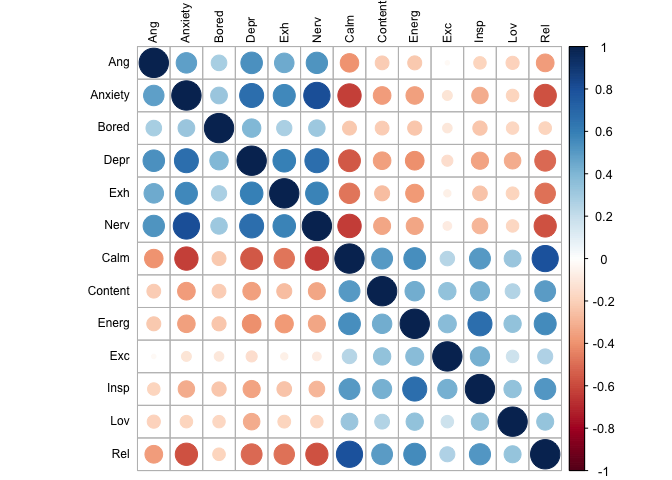

Factor analysis
================
Anne Margit
6/8/2020

``` r
load("data_long.Rdata")
```

``` r
data_long <- as_tibble(data_long)
data_factor <- data_long %>% select(X, Wave, Ang, Anxiety, Bored, Calm, Content, Depr, Energ, Exc, Exh, Insp, Lov, Nerv, Rel)
```

``` r
data_means <- data_factor %>%
    dplyr::group_by(X) %>%
    dplyr::summarise_each(funs(mean(., na.rm=TRUE)), 
                          Ang, Anxiety, Bored, Calm, Content, Depr, Energ, Exc, Exh, Insp, Lov, Nerv, Rel)
```

    ## Warning: funs() is soft deprecated as of dplyr 0.8.0
    ## Please use a list of either functions or lambdas: 
    ## 
    ##   # Simple named list: 
    ##   list(mean = mean, median = median)
    ## 
    ##   # Auto named with `tibble::lst()`: 
    ##   tibble::lst(mean, median)
    ## 
    ##   # Using lambdas
    ##   list(~ mean(., trim = .2), ~ median(., na.rm = TRUE))
    ## This warning is displayed once per session.

``` r
round(cor(data_means[,c("Ang", "Anxiety", "Bored", "Depr","Exh","Nerv","Calm", "Content","Energ","Exc", "Insp", "Lov","Rel")],use= "complete.obs"),2)
```

    ##           Ang Anxiety Bored  Depr   Exh  Nerv  Calm Content Energ   Exc  Insp
    ## Ang      1.00    0.48  0.28  0.54  0.44  0.53 -0.40   -0.22 -0.23 -0.02 -0.18
    ## Anxiety  0.48    1.00  0.32  0.66  0.56  0.80 -0.63   -0.36 -0.36 -0.11 -0.31
    ## Bored    0.28    0.32  1.00  0.39  0.27  0.31 -0.22   -0.22 -0.23 -0.10 -0.24
    ## Depr     0.54    0.66  0.39  1.00  0.59  0.67 -0.55   -0.36 -0.40 -0.14 -0.34
    ## Exh      0.44    0.56  0.27  0.59  1.00  0.59 -0.48   -0.26 -0.38 -0.06 -0.25
    ## Nerv     0.53    0.80  0.31  0.67  0.59  1.00 -0.63   -0.33 -0.34 -0.09 -0.28
    ## Calm    -0.40   -0.63 -0.22 -0.55 -0.48 -0.63  1.00    0.51  0.55  0.24  0.51
    ## Content -0.22   -0.36 -0.22 -0.36 -0.26 -0.33  0.51    1.00  0.44  0.35  0.42
    ## Energ   -0.23   -0.36 -0.23 -0.40 -0.38 -0.34  0.55    0.44  1.00  0.37  0.67
    ## Exc     -0.02   -0.11 -0.10 -0.14 -0.06 -0.09  0.24    0.35  0.37  1.00  0.43
    ## Insp    -0.18   -0.31 -0.24 -0.34 -0.25 -0.28  0.51    0.42  0.67  0.43  1.00
    ## Lov     -0.20   -0.18 -0.18 -0.32 -0.19 -0.18  0.33    0.25  0.35  0.18  0.35
    ## Rel     -0.36   -0.58 -0.18 -0.50 -0.48 -0.57  0.79    0.50  0.56  0.26  0.52
    ##           Lov   Rel
    ## Ang     -0.20 -0.36
    ## Anxiety -0.18 -0.58
    ## Bored   -0.18 -0.18
    ## Depr    -0.32 -0.50
    ## Exh     -0.19 -0.48
    ## Nerv    -0.18 -0.57
    ## Calm     0.33  0.79
    ## Content  0.25  0.50
    ## Energ    0.35  0.56
    ## Exc      0.18  0.26
    ## Insp     0.35  0.52
    ## Lov      1.00  0.33
    ## Rel      0.33  1.00

``` r
corrplot(cor(data_means[,c("Ang", "Anxiety", "Bored", "Depr","Exh","Nerv","Calm", "Content","Energ","Exc", "Insp", "Lov","Rel")], use="complete.obs"), order = "original", tl.col='black', tl.cex=.75) 
```

<!-- -->

``` r
model <- '
f1 =~ Ang + Anxiety + Bored + Depr + Exh + Nerv 
f2 =~ Calm + Content + Energ + Exc + Insp + Lov + Rel 

# latent variable variances
f1 ~~ 1*f1
f2 ~~ 1*f2

# latent variable covariances
f1 ~~ f2

# manifest variable variances (uniquenesses)
  Ang ~~ Ang
  Anxiety ~~ Anxiety
  Bored ~~ Bored
  Depr ~~ Depr
  Exh ~~ Exh
  Nerv ~~ Nerv
  Calm ~~ Calm
  Content ~~ Content
  Energ ~~ Energ
  Exc ~~ Exc
  Insp ~~ Insp
  Lov ~~ Lov
  Rel ~~ Rel

#manifest variable means 
  Ang ~ 1
  Anxiety ~ 1
  Bored ~ 1
  Depr ~ 1
  Exh ~ 1
  Nerv ~ 1
  Calm ~ 1
  Content ~ 1
  Energ ~ 1
  Exc ~ 1
  Insp ~ 1
  Lov ~ 1
  Rel ~ 1
'
```

``` r
fit <- cfa(model, data = data_means, std.lv=TRUE, missing="fiml")
```

    ## Warning in lav_data_full(data = data, group = group, cluster = cluster, : lavaan WARNING: some cases are empty and will be ignored:
    ##   15 76 1002 1204 1234 1242 1432 1469 1844 1931 1993 2189 2209 2288 2355 2476 2497 2964 3874 4169 4300 4941 5713 5982 6658 7620 7688 7725 7914 9421 9963 10117 11590 13597 14939 15255 16542 16795 17229 17783 18237 18835 19645 19713 20045 20202 20239 20413 20426 21313 22323 23691 24471 24473 24554 26087 26344 28338 28758 30689 31397 32441 32691 32830 34369 34510 35118 35262 35310 36038 36820 37238 37418 37621 37703 38339 38979 42451 44315 44522 44634 45188 45972 46370 46444 46466 46813 48229 48370 49114 49208 49330 49787 52340 52547 53204 53291 53749 54719 55063 55515 55824 55926 58806 59054 59342 59422 59885 60421 60461 60685 61001

``` r
summary(fit, standardized=TRUE, fit.measures=TRUE)
```

    ## lavaan 0.6-6 ended normally after 36 iterations
    ## 
    ##   Estimator                                         ML
    ##   Optimization method                           NLMINB
    ##   Number of free parameters                         40
    ##                                                       
    ##                                                   Used       Total
    ##   Number of observations                         62030       62142
    ##   Number of missing patterns                       508            
    ##                                                                   
    ## Model Test User Model:
    ##                                                        
    ##   Test statistic                              25139.091
    ##   Degrees of freedom                                 64
    ##   P-value (Chi-square)                            0.000
    ## 
    ## Model Test Baseline Model:
    ## 
    ##   Test statistic                            249094.988
    ##   Degrees of freedom                                78
    ##   P-value                                        0.000
    ## 
    ## User Model versus Baseline Model:
    ## 
    ##   Comparative Fit Index (CFI)                    0.899
    ##   Tucker-Lewis Index (TLI)                       0.877
    ## 
    ## Loglikelihood and Information Criteria:
    ## 
    ##   Loglikelihood user model (H0)            -974342.078
    ##   Loglikelihood unrestricted model (H1)    -961772.533
    ##                                                       
    ##   Akaike (AIC)                             1948764.156
    ##   Bayesian (BIC)                           1949125.571
    ##   Sample-size adjusted Bayesian (BIC)      1948998.450
    ## 
    ## Root Mean Square Error of Approximation:
    ## 
    ##   RMSEA                                          0.079
    ##   90 Percent confidence interval - lower         0.079
    ##   90 Percent confidence interval - upper         0.080
    ##   P-value RMSEA <= 0.05                          0.000
    ## 
    ## Standardized Root Mean Square Residual:
    ## 
    ##   SRMR                                           0.059
    ## 
    ## Parameter Estimates:
    ## 
    ##   Standard errors                             Standard
    ##   Information                                 Observed
    ##   Observed information based on                Hessian
    ## 
    ## Latent Variables:
    ##                    Estimate  Std.Err  z-value  P(>|z|)   Std.lv  Std.all
    ##   f1 =~                                                                 
    ##     Ang               0.703    0.008   89.308    0.000    0.703    0.657
    ##     Anxiety           0.943    0.004  217.253    0.000    0.943    0.788
    ##     Bored             0.541    0.005  100.193    0.000    0.541    0.419
    ##     Depr              0.846    0.004  196.049    0.000    0.846    0.735
    ##     Exh               0.702    0.005  152.364    0.000    0.702    0.602
    ##     Nerv              0.921    0.004  220.049    0.000    0.921    0.796
    ##   f2 =~                                                                 
    ##     Calm              0.767    0.004  193.548    0.000    0.767    0.736
    ##     Content           0.717    0.004  166.682    0.000    0.717    0.651
    ##     Energ             0.693    0.004  168.235    0.000    0.693    0.663
    ##     Exc               0.532    0.005  114.593    0.000    0.532    0.483
    ##     Insp              0.667    0.004  151.658    0.000    0.667    0.612
    ##     Lov               0.507    0.009   55.416    0.000    0.507    0.460
    ##     Rel               0.799    0.004  200.042    0.000    0.799    0.752
    ## 
    ## Covariances:
    ##                    Estimate  Std.Err  z-value  P(>|z|)   Std.lv  Std.all
    ##   f1 ~~                                                                 
    ##     f2               -0.567    0.004 -156.317    0.000   -0.567   -0.567
    ## 
    ## Intercepts:
    ##                    Estimate  Std.Err  z-value  P(>|z|)   Std.lv  Std.all
    ##    .Ang               2.113    0.007  295.609    0.000    2.113    1.976
    ##    .Anxiety           2.674    0.005  554.925    0.000    2.674    2.235
    ##    .Bored             2.699    0.005  518.156    0.000    2.699    2.090
    ##    .Depr              2.221    0.005  478.867    0.000    2.221    1.930
    ##    .Exh               2.498    0.005  530.763    0.000    2.498    2.141
    ##    .Nerv              2.545    0.005  545.629    0.000    2.545    2.198
    ##    .Calm              2.949    0.004  702.934    0.000    2.949    2.832
    ##    .Content           2.670    0.004  600.171    0.000    2.670    2.422
    ##    .Energ             2.598    0.004  615.997    0.000    2.598    2.484
    ##    .Exc               2.143    0.004  481.629    0.000    2.143    1.947
    ##    .Insp              2.453    0.004  557.911    0.000    2.453    2.251
    ##    .Lov               3.350    0.008  419.599    0.000    3.350    3.040
    ##    .Rel               2.768    0.004  646.485    0.000    2.768    2.606
    ##     f1                0.000                               0.000    0.000
    ##     f2                0.000                               0.000    0.000
    ## 
    ## Variances:
    ##                    Estimate  Std.Err  z-value  P(>|z|)   Std.lv  Std.all
    ##     f1                1.000                               1.000    1.000
    ##     f2                1.000                               1.000    1.000
    ##    .Ang               0.650    0.008   79.950    0.000    0.650    0.568
    ##    .Anxiety           0.543    0.004  123.165    0.000    0.543    0.379
    ##    .Bored             1.375    0.008  168.403    0.000    1.375    0.825
    ##    .Depr              0.609    0.005  135.318    0.000    0.609    0.460
    ##    .Exh               0.868    0.006  156.952    0.000    0.868    0.638
    ##    .Nerv              0.491    0.004  119.901    0.000    0.491    0.367
    ##    .Calm              0.497    0.004  129.862    0.000    0.497    0.458
    ##    .Content           0.701    0.005  149.686    0.000    0.701    0.577
    ##    .Energ             0.613    0.004  144.169    0.000    0.613    0.561
    ##    .Exc               0.929    0.006  162.262    0.000    0.929    0.767
    ##    .Insp              0.743    0.005  150.509    0.000    0.743    0.626
    ##    .Lov               0.957    0.011   86.482    0.000    0.957    0.788
    ##    .Rel               0.490    0.004  126.824    0.000    0.490    0.434

``` r
parameterEstimates(fit, standardized=TRUE) %>% 
  filter(op == "=~") %>% 
  select('Latent Factor'=lhs, Indicator=rhs, B=est, SE=se, Z=z, 'p-value'=pvalue, Beta=std.all) %>% 
  kable(digits = 3, format="pandoc", caption="Factor Loadings")
```

| Latent Factor | Indicator |     B |    SE |       Z | p-value |  Beta |
| :------------ | :-------- | ----: | ----: | ------: | ------: | ----: |
| f1            | Ang       | 0.703 | 0.008 |  89.308 |       0 | 0.657 |
| f1            | Anxiety   | 0.943 | 0.004 | 217.253 |       0 | 0.788 |
| f1            | Bored     | 0.541 | 0.005 | 100.193 |       0 | 0.419 |
| f1            | Depr      | 0.846 | 0.004 | 196.049 |       0 | 0.735 |
| f1            | Exh       | 0.702 | 0.005 | 152.364 |       0 | 0.602 |
| f1            | Nerv      | 0.921 | 0.004 | 220.049 |       0 | 0.796 |
| f2            | Calm      | 0.767 | 0.004 | 193.548 |       0 | 0.736 |
| f2            | Content   | 0.717 | 0.004 | 166.682 |       0 | 0.651 |
| f2            | Energ     | 0.693 | 0.004 | 168.235 |       0 | 0.663 |
| f2            | Exc       | 0.532 | 0.005 | 114.593 |       0 | 0.483 |
| f2            | Insp      | 0.667 | 0.004 | 151.658 |       0 | 0.612 |
| f2            | Lov       | 0.507 | 0.009 |  55.416 |       0 | 0.460 |
| f2            | Rel       | 0.799 | 0.004 | 200.042 |       0 | 0.752 |

Factor Loadings
