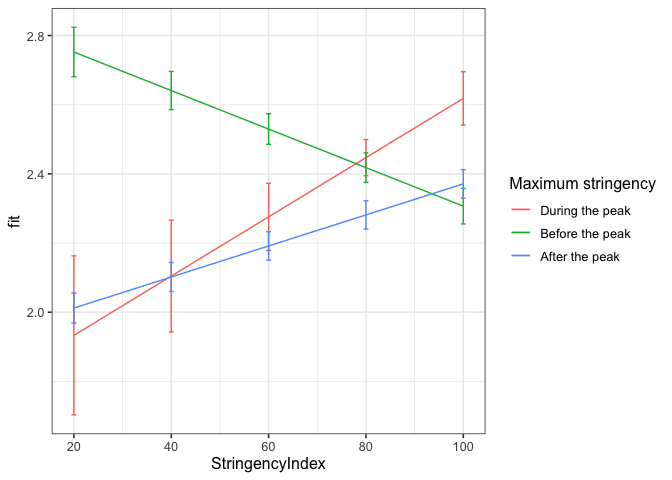
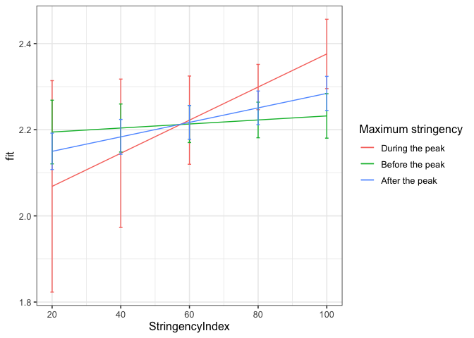
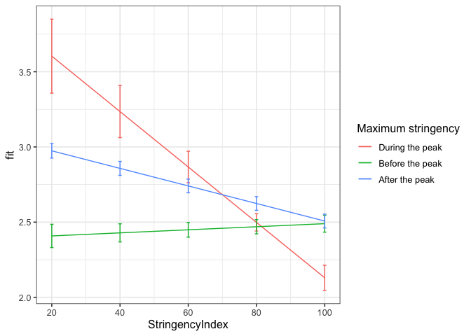
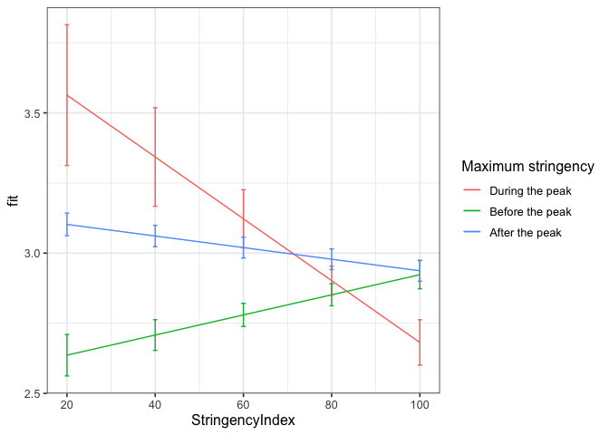

First analyses three level
================
Anne Margit
8/27/2020

``` r
load("data_imputed_emomeans_maxweeks.Rdata")
```

This dataset includes:

1.  Data from all weekly measurement waves (baseline through wave 11,
    Time 1 through 12)
2.  Participants who provided at least 3 measurements
3.  Participants who are residents of the country they currently live in
4.  Participants who provided info on age
5.  Participants who provided info on gender (either male or female)
6.  Data from countries with at least 20 participants
7.  Pooled age groups
8.  Imputed missing emotion scores
9.  Combined emotion scores (NAA, NAD, PAA, PAD)
10. An imputed Stringency index (StringencyIndex\_imp)
11. A variable indicating the number of days before and after the day on
    which maximum stringency was reached for the respective country
    (DaysMax)
12. A variable indicating the number of weeks before and after the day
    on which maximum stringency was reached for the respective country
    (WeeksMax)
13. A variable indicating the date on which maximum Stringency was
    reached for that country (DateMaxStr)

<!-- end list -->

``` r
library(dplyr)
library(tidyverse)
library(papaja)
library(ggpubr)
library(ggplot2)
library(lme4)
library(lmerTest)
library(rockchalk)
library(effects)
```

# Preparation

**Dummy coding Stringency** *During the peak = 0 (all days with maximum
stringency). Before peak = 1, after peak = 2*

``` r
data_analyse1 <- data_imputed_emomeans_maxweeks %>%
  group_by(Country) %>%
  mutate(Str_dummy = ifelse(Date < DateMaxStr, 1, ifelse(Date == DateMaxStr, 0, 2)))

data_analyse1$Str_dummy <- as_factor(data_analyse1$Str_dummy)
```

# Regression models

**Negative affect high arousal**

*Random intercept*

``` r
model_NAA0 <- lmer(NAA ~ 1 + (1 | Country/ID), data = data_analyse1)
summary(model_NAA0)
```

    Linear mixed model fit by REML. t-tests use Satterthwaite's method ['lmerModLmerTest']
    Formula: NAA ~ 1 + (1 | Country/ID)
       Data: data_analyse1
    
    REML criterion at convergence: 124005.1
    
    Scaled residuals: 
        Min      1Q  Median      3Q     Max 
    -5.5671 -0.5524 -0.1183  0.5194  5.4053 
    
    Random effects:
     Groups     Name        Variance Std.Dev.
     ID:Country (Intercept) 0.57526  0.7585  
     Country    (Intercept) 0.05294  0.2301  
     Residual               0.32606  0.5710  
    Number of obs: 58246, groups:  ID:Country, 10343; Country, 33
    
    Fixed effects:
                Estimate Std. Error       df t value Pr(>|t|)    
    (Intercept)  2.29456    0.04212 31.67331   54.48   <2e-16 ***
    ---
    Signif. codes:  0 '***' 0.001 '**' 0.01 '*' 0.05 '.' 0.1 ' ' 1

*Stringency
Index*

``` r
model_NAA1 <- lmer(NAA ~ 1 + StringencyIndex + (1 | Country/ID), data = data_analyse1)
summary(model_NAA1)
```

    Linear mixed model fit by REML. t-tests use Satterthwaite's method ['lmerModLmerTest']
    Formula: NAA ~ 1 + StringencyIndex + (1 | Country/ID)
       Data: data_analyse1
    
    REML criterion at convergence: 123804.8
    
    Scaled residuals: 
        Min      1Q  Median      3Q     Max 
    -5.5319 -0.5537 -0.1142  0.5189  5.4564 
    
    Random effects:
     Groups     Name        Variance Std.Dev.
     ID:Country (Intercept) 0.57404  0.7577  
     Country    (Intercept) 0.05398  0.2323  
     Residual               0.32476  0.5699  
    Number of obs: 58246, groups:  ID:Country, 10343; Country, 33
    
    Fixed effects:
                     Estimate Std. Error        df t value Pr(>|t|)    
    (Intercept)     2.003e+00  4.690e-02 4.575e+01   42.71   <2e-16 ***
    StringencyIndex 3.791e-03  2.582e-04 4.919e+04   14.68   <2e-16 ***
    ---
    Signif. codes:  0 '***' 0.001 '**' 0.01 '*' 0.05 '.' 0.1 ' ' 1
    
    Correlation of Fixed Effects:
                (Intr)
    StrngncyInd -0.424

``` r
anova(model_NAA0, model_NAA1)
```

    Data: data_analyse1
    Models:
    model_NAA0: NAA ~ 1 + (1 | Country/ID)
    model_NAA1: NAA ~ 1 + StringencyIndex + (1 | Country/ID)
               npar    AIC    BIC logLik deviance  Chisq Df Pr(>Chisq)    
    model_NAA0    4 124009 124045 -62000   124001                         
    model_NAA1    5 123796 123840 -61893   123786 215.03  1  < 2.2e-16 ***
    ---
    Signif. codes:  0 '***' 0.001 '**' 0.01 '*' 0.05 '.' 0.1 ' ' 1

*Stringency Index and dummy variable with 0 = days during maximum
stringency, 1 = before, 2 =
after*

``` r
model_NAA2 <- lmer(NAA ~ 1 + StringencyIndex + Str_dummy + (1 | Country/ID), data = data_analyse1)
summary(model_NAA2)
```

    Linear mixed model fit by REML. t-tests use Satterthwaite's method ['lmerModLmerTest']
    Formula: NAA ~ 1 + StringencyIndex + Str_dummy + (1 | Country/ID)
       Data: data_analyse1
    
    REML criterion at convergence: 123436.1
    
    Scaled residuals: 
        Min      1Q  Median      3Q     Max 
    -5.5481 -0.5523 -0.1107  0.5158  5.4799 
    
    Random effects:
     Groups     Name        Variance Std.Dev.
     ID:Country (Intercept) 0.57237  0.7566  
     Country    (Intercept) 0.04942  0.2223  
     Residual               0.32245  0.5679  
    Number of obs: 58246, groups:  ID:Country, 10343; Country, 33
    
    Fixed effects:
                      Estimate Std. Error         df t value Pr(>|t|)    
    (Intercept)      2.141e+00  5.517e-02  1.023e+02  38.799  < 2e-16 ***
    StringencyIndex  4.102e-03  2.583e-04  4.908e+04  15.878  < 2e-16 ***
    Str_dummy1       2.063e-02  3.244e-02  5.019e+04   0.636    0.525    
    Str_dummy2      -1.882e-01  3.097e-02  5.025e+04  -6.076 1.24e-09 ***
    ---
    Signif. codes:  0 '***' 0.001 '**' 0.01 '*' 0.05 '.' 0.1 ' ' 1
    
    Correlation of Fixed Effects:
                (Intr) StrngI Str_d1
    StrngncyInd -0.385              
    Str_dummy1  -0.550  0.066       
    Str_dummy2  -0.567  0.041  0.940

``` r
anova(model_NAA1, model_NAA2)
```

    Data: data_analyse1
    Models:
    model_NAA1: NAA ~ 1 + StringencyIndex + (1 | Country/ID)
    model_NAA2: NAA ~ 1 + StringencyIndex + Str_dummy + (1 | Country/ID)
               npar    AIC    BIC logLik deviance  Chisq Df Pr(>Chisq)    
    model_NAA1    5 123796 123840 -61893   123786                         
    model_NAA2    7 123419 123481 -61702   123405 380.99  2  < 2.2e-16 ***
    ---
    Signif. codes:  0 '***' 0.001 '**' 0.01 '*' 0.05 '.' 0.1 ' ' 1

*Stringency Index x dummy
interaction*

``` r
model_NAA3 <- lmer(NAA ~ 1 + StringencyIndex + Str_dummy +  StringencyIndex*Str_dummy + (1 | Country/ID), data = data_analyse1)
summary(model_NAA3)
```

    Linear mixed model fit by REML. t-tests use Satterthwaite's method ['lmerModLmerTest']
    Formula: NAA ~ 1 + StringencyIndex + Str_dummy + StringencyIndex * Str_dummy +      (1 | Country/ID)
       Data: data_analyse1
    
    REML criterion at convergence: 123372.7
    
    Scaled residuals: 
        Min      1Q  Median      3Q     Max 
    -5.5484 -0.5524 -0.1112  0.5170  5.4890 
    
    Random effects:
     Groups     Name        Variance Std.Dev.
     ID:Country (Intercept) 0.57262  0.7567  
     Country    (Intercept) 0.04925  0.2219  
     Residual               0.32189  0.5673  
    Number of obs: 58246, groups:  ID:Country, 10343; Country, 33
    
    Fixed effects:
                                 Estimate Std. Error         df t value Pr(>|t|)    
    (Intercept)                 1.762e+00  2.991e-01  3.217e+04   5.890 3.89e-09 ***
    StringencyIndex             8.564e-03  3.530e-03  5.057e+04   2.426 0.015258 *  
    Str_dummy1                  1.102e+00  3.040e-01  5.042e+04   3.625 0.000289 ***
    Str_dummy2                  1.604e-01  2.959e-01  5.050e+04   0.542 0.587751    
    StringencyIndex:Str_dummy1 -1.413e-02  3.652e-03  5.045e+04  -3.870 0.000109 ***
    StringencyIndex:Str_dummy2 -4.075e-03  3.525e-03  5.056e+04  -1.156 0.247667    
    ---
    Signif. codes:  0 '***' 0.001 '**' 0.01 '*' 0.05 '.' 0.1 ' ' 1
    
    Correlation of Fixed Effects:
                (Intr) StrngI Str_d1 Str_d2 SI:S_1
    StrngncyInd -0.985                            
    Str_dummy1  -0.956  0.959                     
    Str_dummy2  -0.988  0.992  0.963              
    StrngnI:S_1  0.941 -0.954 -0.994 -0.949       
    StrngnI:S_2  0.983 -0.997 -0.957 -0.995  0.953

``` r
anova(model_NAA2, model_NAA3)
```

    Data: data_analyse1
    Models:
    model_NAA2: NAA ~ 1 + StringencyIndex + Str_dummy + (1 | Country/ID)
    model_NAA3: NAA ~ 1 + StringencyIndex + Str_dummy + StringencyIndex * Str_dummy + 
    model_NAA3:     (1 | Country/ID)
               npar    AIC    BIC logLik deviance  Chisq Df Pr(>Chisq)    
    model_NAA2    7 123419 123481 -61702   123405                         
    model_NAA3    9 123338 123419 -61660   123320 84.651  2  < 2.2e-16 ***
    ---
    Signif. codes:  0 '***' 0.001 '**' 0.01 '*' 0.05 '.' 0.1 ' ' 1

*Plot of predicted values*

``` r
ef_NAA <- effect("StringencyIndex:Str_dummy", model_NAA3)

plot_NAA <- ggplot(as.data.frame(ef_NAA), 
       aes(StringencyIndex, fit, color=Str_dummy)) + geom_line() + 
  geom_errorbar(aes(ymin=fit-se, ymax=fit+se), width=1) + theme_bw(base_size=12) + scale_color_discrete(name="Maximum stringency", labels = c("During the peak", "Before the peak", "After the peak"))
```

``` r
plot_NAA
```

<!-- -->

**Negative affect low arousal**

*Random intercept*

``` r
model_NAD0 <- lmer(NAD ~ 1 + (1 | Country/ID), data = data_analyse1)
summary(model_NAD0)
```

    Linear mixed model fit by REML. t-tests use Satterthwaite's method ['lmerModLmerTest']
    Formula: NAD ~ 1 + (1 | Country/ID)
       Data: data_analyse1
    
    REML criterion at convergence: 131042.3
    
    Scaled residuals: 
        Min      1Q  Median      3Q     Max 
    -5.4414 -0.5513 -0.1174  0.5195  5.4434 
    
    Random effects:
     Groups     Name        Variance Std.Dev.
     ID:Country (Intercept) 0.62981  0.7936  
     Country    (Intercept) 0.04307  0.2075  
     Residual               0.37009  0.6084  
    Number of obs: 58246, groups:  ID:Country, 10343; Country, 33
    
    Fixed effects:
                Estimate Std. Error       df t value Pr(>|t|)    
    (Intercept)  2.24415    0.03854 26.17016   58.23   <2e-16 ***
    ---
    Signif. codes:  0 '***' 0.001 '**' 0.01 '*' 0.05 '.' 0.1 ' ' 1

*Stringency
Index*

``` r
model_NAD1 <- lmer(NAD ~ 1 + StringencyIndex + (1 | Country/ID), data = data_analyse1)
summary(model_NAD1)
```

    Linear mixed model fit by REML. t-tests use Satterthwaite's method ['lmerModLmerTest']
    Formula: NAD ~ 1 + StringencyIndex + (1 | Country/ID)
       Data: data_analyse1
    
    REML criterion at convergence: 131019.1
    
    Scaled residuals: 
        Min      1Q  Median      3Q     Max 
    -5.4232 -0.5503 -0.1176  0.5202  5.4145 
    
    Random effects:
     Groups     Name        Variance Std.Dev.
     ID:Country (Intercept) 0.62901  0.7931  
     Country    (Intercept) 0.04405  0.2099  
     Residual               0.36990  0.6082  
    Number of obs: 58246, groups:  ID:Country, 10343; Country, 33
    
    Fixed effects:
                     Estimate Std. Error        df t value Pr(>|t|)    
    (Intercept)     2.114e+00  4.432e-02 4.341e+01   47.70  < 2e-16 ***
    StringencyIndex 1.693e-03  2.753e-04 4.821e+04    6.15 7.81e-10 ***
    ---
    Signif. codes:  0 '***' 0.001 '**' 0.01 '*' 0.05 '.' 0.1 ' ' 1
    
    Correlation of Fixed Effects:
                (Intr)
    StrngncyInd -0.478

``` r
anova(model_NAD0, model_NAD1)
```

    Data: data_analyse1
    Models:
    model_NAD0: NAD ~ 1 + (1 | Country/ID)
    model_NAD1: NAD ~ 1 + StringencyIndex + (1 | Country/ID)
               npar    AIC    BIC logLik deviance  Chisq Df Pr(>Chisq)    
    model_NAD0    4 131046 131082 -65519   131038                         
    model_NAD1    5 131010 131055 -65500   131000 37.785  1  7.899e-10 ***
    ---
    Signif. codes:  0 '***' 0.001 '**' 0.01 '*' 0.05 '.' 0.1 ' ' 1

*Stringency Index and dummy variable with 0 = before maximum stringency,
1 = at or
after*

``` r
model_NAD2 <- lmer(NAD ~ 1 + StringencyIndex + Str_dummy + (1 | Country/ID), data = data_analyse1)
summary(model_NAD2)
```

    Linear mixed model fit by REML. t-tests use Satterthwaite's method ['lmerModLmerTest']
    Formula: NAD ~ 1 + StringencyIndex + Str_dummy + (1 | Country/ID)
       Data: data_analyse1
    
    REML criterion at convergence: 131025.2
    
    Scaled residuals: 
        Min      1Q  Median      3Q     Max 
    -5.4242 -0.5509 -0.1171  0.5201  5.4158 
    
    Random effects:
     Groups     Name        Variance Std.Dev.
     ID:Country (Intercept) 0.62908  0.7931  
     Country    (Intercept) 0.04432  0.2105  
     Residual               0.36986  0.6082  
    Number of obs: 58246, groups:  ID:Country, 10343; Country, 33
    
    Fixed effects:
                      Estimate Std. Error         df t value Pr(>|t|)    
    (Intercept)      2.177e+00  5.571e-02  1.073e+02  39.069  < 2e-16 ***
    StringencyIndex  1.636e-03  2.764e-04  4.829e+04   5.920 3.24e-09 ***
    Str_dummy1      -7.628e-02  3.472e-02  5.026e+04  -2.197   0.0280 *  
    Str_dummy2      -5.689e-02  3.315e-02  5.032e+04  -1.716   0.0861 .  
    ---
    Signif. codes:  0 '***' 0.001 '**' 0.01 '*' 0.05 '.' 0.1 ' ' 1
    
    Correlation of Fixed Effects:
                (Intr) StrngI Str_d1
    StrngncyInd -0.408              
    Str_dummy1  -0.584  0.066       
    Str_dummy2  -0.601  0.042  0.940

``` r
anova(model_NAD1, model_NAD2)
```

    Data: data_analyse1
    Models:
    model_NAD1: NAD ~ 1 + StringencyIndex + (1 | Country/ID)
    model_NAD2: NAD ~ 1 + StringencyIndex + Str_dummy + (1 | Country/ID)
               npar    AIC    BIC logLik deviance  Chisq Df Pr(>Chisq)  
    model_NAD1    5 131010 131055 -65500   131000                       
    model_NAD2    7 131008 131071 -65497   130994 5.8618  2    0.05335 .
    ---
    Signif. codes:  0 '***' 0.001 '**' 0.01 '*' 0.05 '.' 0.1 ' ' 1

*Stringency Index x dummy
interaction*

``` r
model_NAD3 <- lmer(NAD ~ 1 + StringencyIndex + Str_dummy +  StringencyIndex*Str_dummy + (1 | Country/ID), data = data_analyse1)
summary(model_NAD3)
```

    Linear mixed model fit by REML. t-tests use Satterthwaite's method ['lmerModLmerTest']
    Formula: NAD ~ 1 + StringencyIndex + Str_dummy + StringencyIndex * Str_dummy +      (1 | Country/ID)
       Data: data_analyse1
    
    REML criterion at convergence: 131044.7
    
    Scaled residuals: 
        Min      1Q  Median      3Q     Max 
    -5.4237 -0.5510 -0.1164  0.5201  5.4151 
    
    Random effects:
     Groups     Name        Variance Std.Dev.
     ID:Country (Intercept) 0.62915  0.7932  
     Country    (Intercept) 0.04433  0.2106  
     Residual               0.36986  0.6082  
    Number of obs: 58246, groups:  ID:Country, 10343; Country, 33
    
    Fixed effects:
                                 Estimate Std. Error         df t value Pr(>|t|)    
    (Intercept)                 1.992e+00  3.198e-01  3.497e+04   6.228 4.79e-10 ***
    StringencyIndex             3.843e-03  3.781e-03  5.066e+04   1.016    0.310    
    Str_dummy1                  1.936e-01  3.257e-01  5.051e+04   0.595    0.552    
    Str_dummy2                  1.245e-01  3.169e-01  5.059e+04   0.393    0.694    
    StringencyIndex:Str_dummy1 -3.375e-03  3.913e-03  5.053e+04  -0.863    0.388    
    StringencyIndex:Str_dummy2 -2.161e-03  3.776e-03  5.065e+04  -0.572    0.567    
    ---
    Signif. codes:  0 '***' 0.001 '**' 0.01 '*' 0.05 '.' 0.1 ' ' 1
    
    Correlation of Fixed Effects:
                (Intr) StrngI Str_d1 Str_d2 SI:S_1
    StrngncyInd -0.987                            
    Str_dummy1  -0.957  0.959                     
    Str_dummy2  -0.990  0.992  0.963              
    StrngnI:S_1  0.943 -0.954 -0.994 -0.949       
    StrngnI:S_2  0.985 -0.997 -0.957 -0.995  0.953

``` r
anova(model_NAD2, model_NAD3)
```

    Data: data_analyse1
    Models:
    model_NAD2: NAD ~ 1 + StringencyIndex + Str_dummy + (1 | Country/ID)
    model_NAD3: NAD ~ 1 + StringencyIndex + Str_dummy + StringencyIndex * Str_dummy + 
    model_NAD3:     (1 | Country/ID)
               npar    AIC    BIC logLik deviance  Chisq Df Pr(>Chisq)
    model_NAD2    7 131008 131071 -65497   130994                     
    model_NAD3    9 131011 131091 -65496   130993 1.4233  2     0.4908

*Plot of predicted values*

``` r
ef_NAD <- effect("StringencyIndex:Str_dummy", model_NAD3)

plot_NAD <- ggplot(as.data.frame(ef_NAD), 
       aes(StringencyIndex, fit, color=Str_dummy)) + geom_line() + 
  geom_errorbar(aes(ymin=fit-se, ymax=fit+se), width=1) + theme_bw(base_size=12) + scale_color_discrete(name="Maximum stringency", labels = c("During the peak", "Before the peak", "After the peak"))
```

``` r
plot_NAD
```

<!-- -->

**Positive affect high arousal**

*Random intercept*

``` r
model_PAA0 <- lmer(PAA ~ 1 + (1 | Country/ID), data = data_analyse1)
summary(model_PAA0)
```

    Linear mixed model fit by REML. t-tests use Satterthwaite's method ['lmerModLmerTest']
    Formula: PAA ~ 1 + (1 | Country/ID)
       Data: data_analyse1
    
    REML criterion at convergence: 129956
    
    Scaled residuals: 
        Min      1Q  Median      3Q     Max 
    -5.1631 -0.5763  0.0042  0.5799  5.0505 
    
    Random effects:
     Groups     Name        Variance Std.Dev.
     ID:Country (Intercept) 0.51426  0.7171  
     Country    (Intercept) 0.05563  0.2359  
     Residual               0.37572  0.6130  
    Number of obs: 58246, groups:  ID:Country, 10343; Country, 33
    
    Fixed effects:
                Estimate Std. Error       df t value Pr(>|t|)    
    (Intercept)  2.61592    0.04294 32.10448   60.92   <2e-16 ***
    ---
    Signif. codes:  0 '***' 0.001 '**' 0.01 '*' 0.05 '.' 0.1 ' ' 1

*Stringency
Index*

``` r
model_PAA1 <- lmer(PAA ~ 1 + StringencyIndex + (1 | Country/ID), data = data_analyse1)
summary(model_PAA1)
```

    Linear mixed model fit by REML. t-tests use Satterthwaite's method ['lmerModLmerTest']
    Formula: PAA ~ 1 + StringencyIndex + (1 | Country/ID)
       Data: data_analyse1
    
    REML criterion at convergence: 129606.4
    
    Scaled residuals: 
        Min      1Q  Median      3Q     Max 
    -5.1814 -0.5758 -0.0058  0.5846  5.0975 
    
    Random effects:
     Groups     Name        Variance Std.Dev.
     ID:Country (Intercept) 0.51383  0.7168  
     Country    (Intercept) 0.06205  0.2491  
     Residual               0.37300  0.6107  
    Number of obs: 58246, groups:  ID:Country, 10343; Country, 33
    
    Fixed effects:
                      Estimate Std. Error         df t value Pr(>|t|)    
    (Intercept)      3.022e+00  4.990e-02  4.703e+01   60.55   <2e-16 ***
    StringencyIndex -5.277e-03  2.760e-04  4.964e+04  -19.12   <2e-16 ***
    ---
    Signif. codes:  0 '***' 0.001 '**' 0.01 '*' 0.05 '.' 0.1 ' ' 1
    
    Correlation of Fixed Effects:
                (Intr)
    StrngncyInd -0.425

``` r
anova(model_PAA0, model_PAA1)
```

    Data: data_analyse1
    Models:
    model_PAA0: PAA ~ 1 + (1 | Country/ID)
    model_PAA1: PAA ~ 1 + StringencyIndex + (1 | Country/ID)
               npar    AIC    BIC logLik deviance  Chisq Df Pr(>Chisq)    
    model_PAA0    4 129959 129995 -64976   129951                         
    model_PAA1    5 129597 129642 -64794   129587 364.02  1  < 2.2e-16 ***
    ---
    Signif. codes:  0 '***' 0.001 '**' 0.01 '*' 0.05 '.' 0.1 ' ' 1

*Stringency Index and dummy variable with 0 = before maximum stringency,
1 = at or
after*

``` r
model_PAA2 <- lmer(PAA ~ 1 + StringencyIndex + Str_dummy + (1 | Country/ID), data = data_analyse1)
summary(model_PAA2)
```

    Linear mixed model fit by REML. t-tests use Satterthwaite's method ['lmerModLmerTest']
    Formula: PAA ~ 1 + StringencyIndex + Str_dummy + (1 | Country/ID)
       Data: data_analyse1
    
    REML criterion at convergence: 129303.9
    
    Scaled residuals: 
        Min      1Q  Median      3Q     Max 
    -5.1988 -0.5795 -0.0071  0.5821  5.1137 
    
    Random effects:
     Groups     Name        Variance Std.Dev.
     ID:Country (Intercept) 0.51377  0.7168  
     Country    (Intercept) 0.06244  0.2499  
     Residual               0.37064  0.6088  
    Number of obs: 58246, groups:  ID:Country, 10343; Country, 33
    
    Fixed effects:
                      Estimate Std. Error         df t value Pr(>|t|)    
    (Intercept)      2.895e+00  6.023e-02  9.859e+01  48.071  < 2e-16 ***
    StringencyIndex -5.581e-03  2.762e-04  4.969e+04 -20.205  < 2e-16 ***
    Str_dummy1      -2.827e-02  3.468e-02  5.071e+04  -0.815    0.415    
    Str_dummy2       1.752e-01  3.310e-02  5.078e+04   5.294  1.2e-07 ***
    ---
    Signif. codes:  0 '***' 0.001 '**' 0.01 '*' 0.05 '.' 0.1 ' ' 1
    
    Correlation of Fixed Effects:
                (Intr) StrngI Str_d1
    StrngncyInd -0.377              
    Str_dummy1  -0.539  0.066       
    Str_dummy2  -0.556  0.042  0.940

``` r
anova(model_PAA1, model_PAA2)
```

    Data: data_analyse1
    Models:
    model_PAA1: PAA ~ 1 + StringencyIndex + (1 | Country/ID)
    model_PAA2: PAA ~ 1 + StringencyIndex + Str_dummy + (1 | Country/ID)
               npar    AIC    BIC logLik deviance  Chisq Df Pr(>Chisq)    
    model_PAA1    5 129597 129642 -64794   129587                         
    model_PAA2    7 129287 129350 -64636   129273 314.55  2  < 2.2e-16 ***
    ---
    Signif. codes:  0 '***' 0.001 '**' 0.01 '*' 0.05 '.' 0.1 ' ' 1

*Stringency Index x dummy
interaction*

``` r
model_PAA3 <- lmer(PAA ~ 1 + StringencyIndex + Str_dummy +  StringencyIndex*Str_dummy + (1 | Country/ID), data = data_analyse1)
summary(model_PAA3)
```

    Linear mixed model fit by REML. t-tests use Satterthwaite's method ['lmerModLmerTest']
    Formula: PAA ~ 1 + StringencyIndex + Str_dummy + StringencyIndex * Str_dummy +      (1 | Country/ID)
       Data: data_analyse1
    
    REML criterion at convergence: 129278.6
    
    Scaled residuals: 
        Min      1Q  Median      3Q     Max 
    -5.2009 -0.5801 -0.0074  0.5836  5.1183 
    
    Random effects:
     Groups     Name        Variance Std.Dev.
     ID:Country (Intercept) 0.51358  0.7166  
     Country    (Intercept) 0.06246  0.2499  
     Residual               0.37033  0.6086  
    Number of obs: 58246, groups:  ID:Country, 10343; Country, 33
    
    Fixed effects:
                                 Estimate Std. Error         df t value Pr(>|t|)    
    (Intercept)                 3.972e+00  3.200e-01  3.107e+04  12.414  < 2e-16 ***
    StringencyIndex            -1.843e-02  3.773e-03  5.117e+04  -4.884 1.04e-06 ***
    Str_dummy1                 -1.585e+00  3.250e-01  5.100e+04  -4.876 1.09e-06 ***
    Str_dummy2                 -8.815e-01  3.163e-01  5.109e+04  -2.787 0.005320 ** 
    StringencyIndex:Str_dummy1  1.945e-02  3.905e-03  5.102e+04   4.980 6.37e-07 ***
    StringencyIndex:Str_dummy2  1.259e-02  3.768e-03  5.115e+04   3.341 0.000834 ***
    ---
    Signif. codes:  0 '***' 0.001 '**' 0.01 '*' 0.05 '.' 0.1 ' ' 1
    
    Correlation of Fixed Effects:
                (Intr) StrngI Str_d1 Str_d2 SI:S_1
    StrngncyInd -0.985                            
    Str_dummy1  -0.955  0.959                     
    Str_dummy2  -0.988  0.992  0.963              
    StrngnI:S_1  0.940 -0.954 -0.994 -0.949       
    StrngnI:S_2  0.982 -0.997 -0.957 -0.995  0.953

``` r
anova(model_PAA2, model_PAA3)
```

    Data: data_analyse1
    Models:
    model_PAA2: PAA ~ 1 + StringencyIndex + Str_dummy + (1 | Country/ID)
    model_PAA3: PAA ~ 1 + StringencyIndex + Str_dummy + StringencyIndex * Str_dummy + 
    model_PAA3:     (1 | Country/ID)
               npar    AIC    BIC logLik deviance  Chisq Df Pr(>Chisq)    
    model_PAA2    7 129287 129350 -64636   129273                         
    model_PAA3    9 129245 129325 -64613   129227 46.229  2  9.153e-11 ***
    ---
    Signif. codes:  0 '***' 0.001 '**' 0.01 '*' 0.05 '.' 0.1 ' ' 1

*Plot of predicted values*

``` r
ef_PAA <- effect("StringencyIndex:Str_dummy", model_PAA3)

plot_PAA <- ggplot(as.data.frame(ef_PAA), 
       aes(StringencyIndex, fit, color=Str_dummy)) + geom_line() + 
  geom_errorbar(aes(ymin=fit-se, ymax=fit+se), width=1) + theme_bw(base_size=12) + scale_color_discrete(name="Maximum stringency", labels = c("During the peak", "Before the peak", "After the peak"))
```

``` r
plot_PAA
```

<!-- -->

**Positive affect low arousal**

*Random
    intercept*

``` r
model_PAD0 <- lmer(PAD ~ 1 + (1 | Country/ID), data = data_analyse1)
```

    Warning in checkConv(attr(opt, "derivs"), opt$par, ctrl = control$checkConv, : Model failed to converge with max|grad| = 0.0025537 (tol = 0.002, component 1)

``` r
summary(model_PAD0)
```

    Linear mixed model fit by REML. t-tests use Satterthwaite's method ['lmerModLmerTest']
    Formula: PAD ~ 1 + (1 | Country/ID)
       Data: data_analyse1
    
    REML criterion at convergence: 132654.5
    
    Scaled residuals: 
        Min      1Q  Median      3Q     Max 
    -5.2863 -0.5598  0.0636  0.5782  4.5101 
    
    Random effects:
     Groups     Name        Variance Std.Dev.
     ID:Country (Intercept) 0.55555  0.7454  
     Country    (Intercept) 0.04089  0.2022  
     Residual               0.39141  0.6256  
    Number of obs: 58246, groups:  ID:Country, 10343; Country, 33
    
    Fixed effects:
                Estimate Std. Error       df t value Pr(>|t|)    
    (Intercept)  2.96389    0.03745 31.52185   79.14   <2e-16 ***
    ---
    Signif. codes:  0 '***' 0.001 '**' 0.01 '*' 0.05 '.' 0.1 ' ' 1
    convergence code: 0
    Model failed to converge with max|grad| = 0.0025537 (tol = 0.002, component 1)

*Stringency
Index*

``` r
model_PAD1 <- lmer(PAD ~ 1 + StringencyIndex + (1 | Country/ID), data = data_analyse1)
summary(model_PAD1)
```

    Linear mixed model fit by REML. t-tests use Satterthwaite's method ['lmerModLmerTest']
    Formula: PAD ~ 1 + StringencyIndex + (1 | Country/ID)
       Data: data_analyse1
    
    REML criterion at convergence: 132637.3
    
    Scaled residuals: 
        Min      1Q  Median      3Q     Max 
    -5.2806 -0.5621  0.0611  0.5791  4.5339 
    
    Random effects:
     Groups     Name        Variance Std.Dev.
     ID:Country (Intercept) 0.55529  0.7452  
     Country    (Intercept) 0.03994  0.1998  
     Residual               0.39121  0.6255  
    Number of obs: 58246, groups:  ID:Country, 10343; Country, 33
    
    Fixed effects:
                      Estimate Std. Error         df t value Pr(>|t|)    
    (Intercept)      3.086e+00  4.296e-02  5.664e+01  71.838  < 2e-16 ***
    StringencyIndex -1.592e-03  2.824e-04  4.839e+04  -5.636 1.75e-08 ***
    ---
    Signif. codes:  0 '***' 0.001 '**' 0.01 '*' 0.05 '.' 0.1 ' ' 1
    
    Correlation of Fixed Effects:
                (Intr)
    StrngncyInd -0.506

``` r
anova(model_PAD0, model_PAD1)
```

    Data: data_analyse1
    Models:
    model_PAD0: PAD ~ 1 + (1 | Country/ID)
    model_PAD1: PAD ~ 1 + StringencyIndex + (1 | Country/ID)
               npar    AIC    BIC logLik deviance  Chisq Df Pr(>Chisq)    
    model_PAD0    4 132658 132694 -66325   132650                         
    model_PAD1    5 132628 132673 -66309   132618 31.776  1   1.73e-08 ***
    ---
    Signif. codes:  0 '***' 0.001 '**' 0.01 '*' 0.05 '.' 0.1 ' ' 1

*Stringency Index and dummy variable with 0 = before maximum stringency,
1 = at or
after*

``` r
model_PAD2 <- lmer(PAD ~ 1 + StringencyIndex + Str_dummy + (1 | Country/ID), data = data_analyse1)
summary(model_PAD2)
```

    Linear mixed model fit by REML. t-tests use Satterthwaite's method ['lmerModLmerTest']
    Formula: PAD ~ 1 + StringencyIndex + Str_dummy + (1 | Country/ID)
       Data: data_analyse1
    
    REML criterion at convergence: 132452.7
    
    Scaled residuals: 
        Min      1Q  Median      3Q     Max 
    -5.2908 -0.5626  0.0558  0.5800  4.5465 
    
    Random effects:
     Groups     Name        Variance Std.Dev.
     ID:Country (Intercept) 0.55465  0.7448  
     Country    (Intercept) 0.03861  0.1965  
     Residual               0.38976  0.6243  
    Number of obs: 58246, groups:  ID:Country, 10343; Country, 33
    
    Fixed effects:
                      Estimate Std. Error         df t value Pr(>|t|)    
    (Intercept)      3.015e+00  5.469e-02  1.574e+02  55.127  < 2e-16 ***
    StringencyIndex -1.855e-03  2.830e-04  4.834e+04  -6.554 5.67e-11 ***
    Str_dummy1      -5.498e-02  3.557e-02  5.066e+04  -1.546 0.122159    
    Str_dummy2       1.123e-01  3.395e-02  5.073e+04   3.307 0.000944 ***
    ---
    Signif. codes:  0 '***' 0.001 '**' 0.01 '*' 0.05 '.' 0.1 ' ' 1
    
    Correlation of Fixed Effects:
                (Intr) StrngI Str_d1
    StrngncyInd -0.426              
    Str_dummy1  -0.609  0.066       
    Str_dummy2  -0.628  0.042  0.940

``` r
anova(model_PAD1, model_PAD2)
```

    Data: data_analyse1
    Models:
    model_PAD1: PAD ~ 1 + StringencyIndex + (1 | Country/ID)
    model_PAD2: PAD ~ 1 + StringencyIndex + Str_dummy + (1 | Country/ID)
               npar    AIC    BIC logLik deviance  Chisq Df Pr(>Chisq)    
    model_PAD1    5 132628 132673 -66309   132618                         
    model_PAD2    7 132435 132498 -66211   132421 196.51  2  < 2.2e-16 ***
    ---
    Signif. codes:  0 '***' 0.001 '**' 0.01 '*' 0.05 '.' 0.1 ' ' 1

*Stringency Index x dummy
interaction*

``` r
model_PAD3 <- lmer(PAD ~ 1 + StringencyIndex + Str_dummy +  StringencyIndex*Str_dummy + (1 | Country/ID), data = data_analyse1)
summary(model_PAD3)
```

    Linear mixed model fit by REML. t-tests use Satterthwaite's method ['lmerModLmerTest']
    Formula: PAD ~ 1 + StringencyIndex + Str_dummy + StringencyIndex * Str_dummy +      (1 | Country/ID)
       Data: data_analyse1
    
    REML criterion at convergence: 132445.6
    
    Scaled residuals: 
        Min      1Q  Median      3Q     Max 
    -5.2913 -0.5624  0.0557  0.5784  4.5507 
    
    Random effects:
     Groups     Name        Variance Std.Dev.
     ID:Country (Intercept) 0.55457  0.7447  
     Country    (Intercept) 0.03896  0.1974  
     Residual               0.38956  0.6241  
    Number of obs: 58246, groups:  ID:Country, 10343; Country, 33
    
    Fixed effects:
                                 Estimate Std. Error         df t value Pr(>|t|)    
    (Intercept)                 3.784e+00  3.270e-01  4.031e+04  11.570  < 2e-16 ***
    StringencyIndex            -1.102e-02  3.871e-03  5.110e+04  -2.847 0.004410 ** 
    Str_dummy1                 -1.219e+00  3.334e-01  5.094e+04  -3.657 0.000256 ***
    Str_dummy2                 -6.399e-01  3.245e-01  5.103e+04  -1.972 0.048611 *  
    StringencyIndex:Str_dummy1  1.461e-02  4.006e-03  5.097e+04   3.647 0.000266 ***
    StringencyIndex:Str_dummy2  8.954e-03  3.866e-03  5.109e+04   2.316 0.020547 *  
    ---
    Signif. codes:  0 '***' 0.001 '**' 0.01 '*' 0.05 '.' 0.1 ' ' 1
    
    Correlation of Fixed Effects:
                (Intr) StrngI Str_d1 Str_d2 SI:S_1
    StrngncyInd -0.988                            
    Str_dummy1  -0.958  0.959                     
    Str_dummy2  -0.991  0.992  0.963              
    StrngnI:S_1  0.944 -0.954 -0.994 -0.949       
    StrngnI:S_2  0.986 -0.997 -0.957 -0.995  0.953

``` r
anova(model_PAD2, model_PAD3)
```

    Data: data_analyse1
    Models:
    model_PAD2: PAD ~ 1 + StringencyIndex + Str_dummy + (1 | Country/ID)
    model_PAD3: PAD ~ 1 + StringencyIndex + Str_dummy + StringencyIndex * Str_dummy + 
    model_PAD3:     (1 | Country/ID)
               npar    AIC    BIC logLik deviance  Chisq Df Pr(>Chisq)    
    model_PAD2    7 132435 132498 -66211   132421                         
    model_PAD3    9 132412 132492 -66197   132394 27.905  2   8.72e-07 ***
    ---
    Signif. codes:  0 '***' 0.001 '**' 0.01 '*' 0.05 '.' 0.1 ' ' 1

*Plot of predicted values*

``` r
ef_PAD <- effect("StringencyIndex:Str_dummy", model_PAD3)

plot_PAD <- ggplot(as.data.frame(ef_PAD), 
       aes(StringencyIndex, fit, color=Str_dummy)) + geom_line() + 
  geom_errorbar(aes(ymin=fit-se, ymax=fit+se), width=1) + theme_bw(base_size=12) + scale_color_discrete(name="Maximum stringency", labels = c("During the peak", "Before the peak", "After the peak"))
```

``` r
plot_PAD
```

<!-- -->
