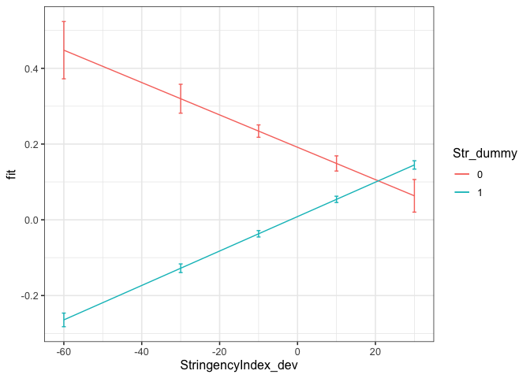
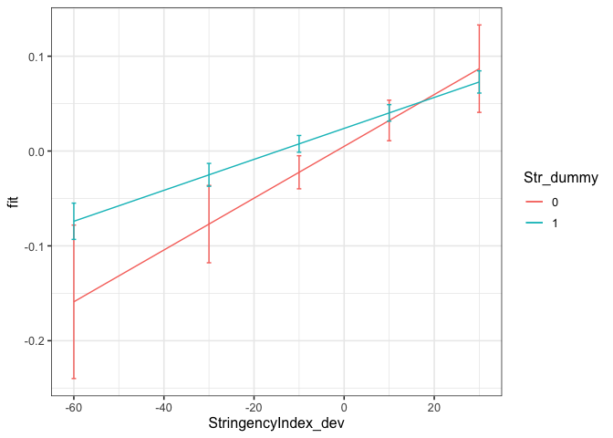
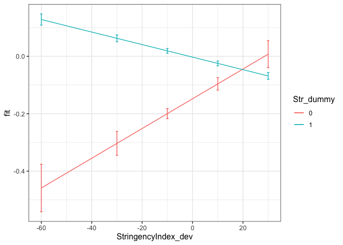

First analyses
================
Anne Margit
8/27/2020

``` r
load("data_imputed_emomeans_maxweeks.Rdata")
```

This dataset includes:

1.  Data from all weekly measurement waves (baseline through wave 11,
    Time 1 through 12)
2.  Participants who provided at least 3 measurements
3.  Participants who are residents of the country they currently live in
4.  Participants who provided info on age
5.  Participants who provided info on gender (either male or female)
6.  Data from countries with at least 20 participants
7.  Pooled age groups
8.  Imputed missing emotion scores
9.  Combined emotion scores (NAA, NAD, PAA, PAD)
10. An imputed Stringency index (StringencyIndex\_imp)
11. A variable indicating the number of days before and after the day on
    which maximum stringency was reached for the respective country
    (DaysMax)
12. A variable indicating the number of weeks before and after the day
    on which maximum stringency was reached for the respective country
    (WeeksMax)
13. A variable indicating the date on which maximum Stringency was
    reached for that country (DateMaxStr)

<!-- end list -->

``` r
library(dplyr)
library(tidyverse)
library(papaja)
library(ggpubr)
library(ggplot2)
library(lme4)
library(lmerTest)
library(rockchalk)
library(effects)
```

# Preparation

**Dummy coding Stringency**

``` r
data_analyse1 <- data_imputed_emomeans_maxweeks %>%
  group_by(Country) %>%
  mutate(Str_dummy = ifelse(Date < DateMaxStr, 0, 1))

data_analyse1$Str_dummy <- as_factor(data_analyse1$Str_dummy)
```

**Country mean centering Stringency
Index**

``` r
data_analyse1_c <- gmc(data_analyse1, "StringencyIndex", "Country", FUN = mean, suffix = c("_mn", "_dev"),
    fulldataframe = TRUE)
```

**Country mean centering emotion factor
scores**

``` r
data_analyse1_c <- gmc(data_analyse1_c, "NAA", "Country", FUN = mean, suffix = c("_mn", "_dev"),
    fulldataframe = TRUE)

data_analyse1_c <- gmc(data_analyse1_c, "NAD", "Country", FUN = mean, suffix = c("_mn", "_dev"),
    fulldataframe = TRUE)

data_analyse1_c <- gmc(data_analyse1_c, "PAA", "Country", FUN = mean, suffix = c("_mn", "_dev"),
    fulldataframe = TRUE)

data_analyse1_c <- gmc(data_analyse1_c, "PAD", "Country", FUN = mean, suffix = c("_mn", "_dev"),
    fulldataframe = TRUE)
```

# Regression models

**Negative affect high arousal**

*Random intercept*

``` r
model_NAA0 <- lmer(NAA_dev ~ 1 + (1 | ID), data = data_analyse1_c)
summary(model_NAA0)
```

    Linear mixed model fit by REML. t-tests use Satterthwaite's method ['lmerModLmerTest']
    Formula: NAA_dev ~ 1 + (1 | ID)
       Data: data_analyse1_c
    
    REML criterion at convergence: 123890.9
    
    Scaled residuals: 
        Min      1Q  Median      3Q     Max 
    -5.5687 -0.5527 -0.1168  0.5194  5.4004 
    
    Random effects:
     Groups   Name        Variance Std.Dev.
     ID       (Intercept) 0.5736   0.7574  
     Residual             0.3261   0.5710  
    Number of obs: 58246, groups:  ID, 10343
    
    Fixed effects:
                 Estimate Std. Error        df t value Pr(>|t|)    
    (Intercept) 2.694e-02  7.882e-03 1.030e+04   3.418 0.000634 ***
    ---
    Signif. codes:  0 '***' 0.001 '**' 0.01 '*' 0.05 '.' 0.1 ' ' 1

*Stringency
Index*

``` r
model_NAA1 <- lmer(NAA_dev ~ 1 + StringencyIndex_dev + (1 | ID), data = data_analyse1_c)
summary(model_NAA1)
```

    Linear mixed model fit by REML. t-tests use Satterthwaite's method ['lmerModLmerTest']
    Formula: NAA_dev ~ 1 + StringencyIndex_dev + (1 | ID)
       Data: data_analyse1_c
    
    REML criterion at convergence: 123689.7
    
    Scaled residuals: 
        Min      1Q  Median      3Q     Max 
    -5.5330 -0.5537 -0.1130  0.5193  5.4519 
    
    Random effects:
     Groups   Name        Variance Std.Dev.
     ID       (Intercept) 0.5724   0.7565  
     Residual             0.3248   0.5699  
    Number of obs: 58246, groups:  ID, 10343
    
    Fixed effects:
                         Estimate Std. Error        df t value Pr(>|t|)    
    (Intercept)         2.469e-02  7.875e-03 1.031e+04   3.136  0.00172 ** 
    StringencyIndex_dev 3.804e-03  2.587e-04 5.003e+04  14.706  < 2e-16 ***
    ---
    Signif. codes:  0 '***' 0.001 '**' 0.01 '*' 0.05 '.' 0.1 ' ' 1
    
    Correlation of Fixed Effects:
                (Intr)
    StrngncyIn_ -0.019

``` r
anova(model_NAA0, model_NAA1)
```

    Data: data_analyse1_c
    Models:
    model_NAA0: NAA_dev ~ 1 + (1 | ID)
    model_NAA1: NAA_dev ~ 1 + StringencyIndex_dev + (1 | ID)
               npar    AIC    BIC logLik deviance  Chisq Df Pr(>Chisq)    
    model_NAA0    3 123889 123916 -61942   123883                         
    model_NAA1    4 123675 123711 -61834   123667 215.87  1  < 2.2e-16 ***
    ---
    Signif. codes:  0 '***' 0.001 '**' 0.01 '*' 0.05 '.' 0.1 ' ' 1

*Stringency Index and dummy variable with 0 = before maximum stringency,
1 = at or
after*

``` r
model_NAA2 <- lmer(NAA_dev ~ 1 + StringencyIndex_dev + Str_dummy + (1 | ID), data = data_analyse1_c)
summary(model_NAA2)
```

    Linear mixed model fit by REML. t-tests use Satterthwaite's method ['lmerModLmerTest']
    Formula: NAA_dev ~ 1 + StringencyIndex_dev + Str_dummy + (1 | ID)
       Data: data_analyse1_c
    
    REML criterion at convergence: 123364.1
    
    Scaled residuals: 
        Min      1Q  Median      3Q     Max 
    -5.5456 -0.5538 -0.1106  0.5159  5.4754 
    
    Random effects:
     Groups   Name        Variance Std.Dev.
     ID       (Intercept) 0.5714   0.7559  
     Residual             0.3227   0.5681  
    Number of obs: 58246, groups:  ID, 10343
    
    Fixed effects:
                          Estimate Std. Error         df t value Pr(>|t|)    
    (Intercept)          2.085e-01  1.277e-02  4.244e+04   16.33   <2e-16 ***
    StringencyIndex_dev  4.174e-03  2.587e-04  5.006e+04   16.14   <2e-16 ***
    Str_dummy1          -1.997e-01  1.093e-02  5.257e+04  -18.27   <2e-16 ***
    ---
    Signif. codes:  0 '***' 0.001 '**' 0.01 '*' 0.05 '.' 0.1 ' ' 1
    
    Correlation of Fixed Effects:
                (Intr) StrnI_
    StrngncyIn_  0.050       
    Str_dummy1  -0.788 -0.078

``` r
anova(model_NAA1, model_NAA2)
```

    Data: data_analyse1_c
    Models:
    model_NAA1: NAA_dev ~ 1 + StringencyIndex_dev + (1 | ID)
    model_NAA2: NAA_dev ~ 1 + StringencyIndex_dev + Str_dummy + (1 | ID)
               npar    AIC    BIC logLik deviance  Chisq Df Pr(>Chisq)    
    model_NAA1    4 123675 123711 -61834   123667                         
    model_NAA2    5 123344 123389 -61667   123334 332.76  1  < 2.2e-16 ***
    ---
    Signif. codes:  0 '***' 0.001 '**' 0.01 '*' 0.05 '.' 0.1 ' ' 1

*Stringency Index x dummy
interaction*

``` r
model_NAA3 <- lmer(NAA_dev ~ 1 + StringencyIndex_dev + Str_dummy +  StringencyIndex_dev*Str_dummy + (1 | ID), data = data_analyse1_c)
summary(model_NAA3)
```

    Linear mixed model fit by REML. t-tests use Satterthwaite's method ['lmerModLmerTest']
    Formula: NAA_dev ~ 1 + StringencyIndex_dev + Str_dummy + StringencyIndex_dev *      Str_dummy + (1 | ID)
       Data: data_analyse1_c
    
    REML criterion at convergence: 123330.6
    
    Scaled residuals: 
        Min      1Q  Median      3Q     Max 
    -5.5437 -0.5535 -0.1107  0.5163  5.4820 
    
    Random effects:
     Groups   Name        Variance Std.Dev.
     ID       (Intercept) 0.5715   0.7560  
     Residual             0.3224   0.5678  
    Number of obs: 58246, groups:  ID, 10343
    
    Fixed effects:
                                     Estimate Std. Error         df t value Pr(>|t|)    
    (Intercept)                     1.915e-01  1.301e-02  4.373e+04  14.718  < 2e-16 ***
    StringencyIndex_dev            -4.273e-03  1.285e-03  5.165e+04  -3.324 0.000886 ***
    Str_dummy1                     -1.830e-01  1.121e-02  5.259e+04 -16.327  < 2e-16 ***
    StringencyIndex_dev:Str_dummy1  8.819e-03  1.315e-03  5.160e+04   6.709 1.98e-11 ***
    ---
    Signif. codes:  0 '***' 0.001 '**' 0.01 '*' 0.05 '.' 0.1 ' ' 1
    
    Correlation of Fixed Effects:
                (Intr) StrnI_ Str_d1
    StrngncyIn_  0.200              
    Str_dummy1  -0.796 -0.233       
    StrngI_:S_1 -0.194 -0.980  0.222

``` r
anova(model_NAA2, model_NAA3)
```

    Data: data_analyse1_c
    Models:
    model_NAA2: NAA_dev ~ 1 + StringencyIndex_dev + Str_dummy + (1 | ID)
    model_NAA3: NAA_dev ~ 1 + StringencyIndex_dev + Str_dummy + StringencyIndex_dev * 
    model_NAA3:     Str_dummy + (1 | ID)
               npar    AIC    BIC logLik deviance  Chisq Df Pr(>Chisq)    
    model_NAA2    5 123344 123389 -61667   123334                         
    model_NAA3    6 123301 123355 -61645   123289 44.993  1  1.977e-11 ***
    ---
    Signif. codes:  0 '***' 0.001 '**' 0.01 '*' 0.05 '.' 0.1 ' ' 1

*Plot of predicted values*

``` r
ef_NAA <- effect("StringencyIndex_dev:Str_dummy", model_NAA3)

plot_NAA <- ggplot(as.data.frame(ef_NAA), 
       aes(StringencyIndex_dev, fit, color=Str_dummy)) + geom_line() + 
  geom_errorbar(aes(ymin=fit-se, ymax=fit+se), width=1) + theme_bw(base_size=12)
```

``` r
plot_NAA
```

<!-- -->

**Negative affect low arousal**

*Random intercept*

``` r
model_NAD0 <- lmer(NAD_dev ~ 1 + (1 | ID), data = data_analyse1_c)
summary(model_NAD0)
```

    Linear mixed model fit by REML. t-tests use Satterthwaite's method ['lmerModLmerTest']
    Formula: NAD_dev ~ 1 + (1 | ID)
       Data: data_analyse1_c
    
    REML criterion at convergence: 130933.6
    
    Scaled residuals: 
        Min      1Q  Median      3Q     Max 
    -5.4416 -0.5497 -0.1162  0.5188  5.4443 
    
    Random effects:
     Groups   Name        Variance Std.Dev.
     ID       (Intercept) 0.6277   0.7923  
     Residual             0.3701   0.6084  
    Number of obs: 58246, groups:  ID, 10343
    
    Fixed effects:
                 Estimate Std. Error        df t value Pr(>|t|)   
    (Intercept) 2.318e-02  8.262e-03 1.030e+04   2.805  0.00503 **
    ---
    Signif. codes:  0 '***' 0.001 '**' 0.01 '*' 0.05 '.' 0.1 ' ' 1

*Stringency
Index*

``` r
model_NAD1 <- lmer(NAD_dev ~ 1 + StringencyIndex_dev + (1 | ID), data = data_analyse1_c)
summary(model_NAD1)
```

    Linear mixed model fit by REML. t-tests use Satterthwaite's method ['lmerModLmerTest']
    Formula: NAD_dev ~ 1 + StringencyIndex_dev + (1 | ID)
       Data: data_analyse1_c
    
    REML criterion at convergence: 130909.4
    
    Scaled residuals: 
        Min      1Q  Median      3Q     Max 
    -5.4229 -0.5497 -0.1170  0.5192  5.4149 
    
    Random effects:
     Groups   Name        Variance Std.Dev.
     ID       (Intercept) 0.6269   0.7918  
     Residual             0.3699   0.6082  
    Number of obs: 58246, groups:  ID, 10343
    
    Fixed effects:
                         Estimate Std. Error        df t value Pr(>|t|)    
    (Intercept)         2.216e-02  8.259e-03 1.030e+04   2.684   0.0073 ** 
    StringencyIndex_dev 1.718e-03  2.760e-04 5.009e+04   6.224 4.87e-10 ***
    ---
    Signif. codes:  0 '***' 0.001 '**' 0.01 '*' 0.05 '.' 0.1 ' ' 1
    
    Correlation of Fixed Effects:
                (Intr)
    StrngncyIn_ -0.020

``` r
anova(model_NAD0, model_NAD1)
```

    Data: data_analyse1_c
    Models:
    model_NAD0: NAD_dev ~ 1 + (1 | ID)
    model_NAD1: NAD_dev ~ 1 + StringencyIndex_dev + (1 | ID)
               npar    AIC    BIC logLik deviance  Chisq Df Pr(>Chisq)    
    model_NAD0    3 130932 130959 -65463   130926                         
    model_NAD1    4 130895 130931 -65444   130887 38.731  1  4.864e-10 ***
    ---
    Signif. codes:  0 '***' 0.001 '**' 0.01 '*' 0.05 '.' 0.1 ' ' 1

*Stringency Index and dummy variable with 0 = before maximum stringency,
1 = at or
after*

``` r
model_NAD2 <- lmer(NAD_dev ~ 1 + StringencyIndex_dev + Str_dummy + (1 | ID), data = data_analyse1_c)
summary(model_NAD2)
```

    Linear mixed model fit by REML. t-tests use Satterthwaite's method ['lmerModLmerTest']
    Formula: NAD_dev ~ 1 + StringencyIndex_dev + Str_dummy + (1 | ID)
       Data: data_analyse1_c
    
    REML criterion at convergence: 130913.3
    
    Scaled residuals: 
        Min      1Q  Median      3Q     Max 
    -5.4238 -0.5491 -0.1170  0.5193  5.4157 
    
    Random effects:
     Groups   Name        Variance Std.Dev.
     ID       (Intercept) 0.6271   0.7919  
     Residual             0.3699   0.6082  
    Number of obs: 58246, groups:  ID, 10343
    
    Fixed effects:
                         Estimate Std. Error        df t value Pr(>|t|)    
    (Intercept)         2.803e-03  1.356e-02 4.313e+04   0.207   0.8363    
    StringencyIndex_dev 1.679e-03  2.768e-04 5.013e+04   6.064 1.33e-09 ***
    Str_dummy1          2.104e-02  1.169e-02 5.272e+04   1.800   0.0719 .  
    ---
    Signif. codes:  0 '***' 0.001 '**' 0.01 '*' 0.05 '.' 0.1 ' ' 1
    
    Correlation of Fixed Effects:
                (Intr) StrnI_
    StrngncyIn_  0.050       
    Str_dummy1  -0.793 -0.078

``` r
anova(model_NAD1, model_NAD2)
```

    Data: data_analyse1_c
    Models:
    model_NAD1: NAD_dev ~ 1 + StringencyIndex_dev + (1 | ID)
    model_NAD2: NAD_dev ~ 1 + StringencyIndex_dev + Str_dummy + (1 | ID)
               npar    AIC    BIC logLik deviance  Chisq Df Pr(>Chisq)  
    model_NAD1    4 130895 130931 -65444   130887                       
    model_NAD2    5 130894 130939 -65442   130884 3.2386  1    0.07192 .
    ---
    Signif. codes:  0 '***' 0.001 '**' 0.01 '*' 0.05 '.' 0.1 ' ' 1

*Stringency Index x dummy
interaction*

``` r
model_NAD3 <- lmer(NAD_dev ~ 1 + StringencyIndex_dev + Str_dummy +  StringencyIndex_dev*Str_dummy + (1 | ID), data = data_analyse1_c)
summary(model_NAD3)
```

    Linear mixed model fit by REML. t-tests use Satterthwaite's method ['lmerModLmerTest']
    Formula: NAD_dev ~ 1 + StringencyIndex_dev + Str_dummy + StringencyIndex_dev *      Str_dummy + (1 | ID)
       Data: data_analyse1_c
    
    REML criterion at convergence: 130923.9
    
    Scaled residuals: 
        Min      1Q  Median      3Q     Max 
    -5.4243 -0.5489 -0.1170  0.5198  5.4165 
    
    Random effects:
     Groups   Name        Variance Std.Dev.
     ID       (Intercept) 0.6271   0.7919  
     Residual             0.3699   0.6082  
    Number of obs: 58246, groups:  ID, 10343
    
    Fixed effects:
                                     Estimate Std. Error         df t value Pr(>|t|)  
    (Intercept)                     4.914e-03  1.383e-02  4.442e+04   0.355   0.7224  
    StringencyIndex_dev             2.732e-03  1.376e-03  5.177e+04   1.986   0.0471 *
    Str_dummy1                      1.896e-02  1.199e-02  5.274e+04   1.581   0.1139  
    StringencyIndex_dev:Str_dummy1 -1.099e-03  1.407e-03  5.172e+04  -0.781   0.4346  
    ---
    Signif. codes:  0 '***' 0.001 '**' 0.01 '*' 0.05 '.' 0.1 ' ' 1
    
    Correlation of Fixed Effects:
                (Intr) StrnI_ Str_d1
    StrngncyIn_  0.201              
    Str_dummy1  -0.802 -0.233       
    StrngI_:S_1 -0.195 -0.980  0.222

``` r
anova(model_NAD2, model_NAD3)
```

    Data: data_analyse1_c
    Models:
    model_NAD2: NAD_dev ~ 1 + StringencyIndex_dev + Str_dummy + (1 | ID)
    model_NAD3: NAD_dev ~ 1 + StringencyIndex_dev + Str_dummy + StringencyIndex_dev * 
    model_NAD3:     Str_dummy + (1 | ID)
               npar    AIC    BIC logLik deviance  Chisq Df Pr(>Chisq)
    model_NAD2    5 130894 130939 -65442   130884                     
    model_NAD3    6 130895 130949 -65442   130883 0.6106  1     0.4346

*Plot of predicted values*

``` r
ef_NAD <- effect("StringencyIndex_dev:Str_dummy", model_NAD3)

plot_NAD <- ggplot(as.data.frame(ef_NAD), 
       aes(StringencyIndex_dev, fit, color=Str_dummy)) + geom_line() + 
  geom_errorbar(aes(ymin=fit-se, ymax=fit+se), width=1) + theme_bw(base_size=12)
```

``` r
plot_NAD
```

<!-- -->

**Positive affect high arousal**

*Random intercept*

``` r
model_PAA0 <- lmer(PAA_dev ~ 1 + (1 | ID), data = data_analyse1_c)
summary(model_PAA0)
```

    Linear mixed model fit by REML. t-tests use Satterthwaite's method ['lmerModLmerTest']
    Formula: PAA_dev ~ 1 + (1 | ID)
       Data: data_analyse1_c
    
    REML criterion at convergence: 129839.4
    
    Scaled residuals: 
        Min      1Q  Median      3Q     Max 
    -5.1658 -0.5756 -0.0006  0.5822  5.0510 
    
    Random effects:
     Groups   Name        Variance Std.Dev.
     ID       (Intercept) 0.5128   0.7161  
     Residual             0.3757   0.6130  
    Number of obs: 58246, groups:  ID, 10343
    
    Fixed effects:
                  Estimate Std. Error         df t value Pr(>|t|)  
    (Intercept) -1.562e-02  7.565e-03  1.034e+04  -2.064    0.039 *
    ---
    Signif. codes:  0 '***' 0.001 '**' 0.01 '*' 0.05 '.' 0.1 ' ' 1

*Stringency
Index*

``` r
model_PAA1 <- lmer(PAA_dev ~ 1 + StringencyIndex_dev + (1 | ID), data = data_analyse1_c)
summary(model_PAA1)
```

    Linear mixed model fit by REML. t-tests use Satterthwaite's method ['lmerModLmerTest']
    Formula: PAA_dev ~ 1 + StringencyIndex_dev + (1 | ID)
       Data: data_analyse1_c
    
    REML criterion at convergence: 129486.3
    
    Scaled residuals: 
        Min      1Q  Median      3Q     Max 
    -5.1835 -0.5762 -0.0059  0.5832  5.0977 
    
    Random effects:
     Groups   Name        Variance Std.Dev.
     ID       (Intercept) 0.5123   0.7158  
     Residual             0.3730   0.6107  
    Number of obs: 58246, groups:  ID, 10343
    
    Fixed effects:
                          Estimate Std. Error         df t value Pr(>|t|)    
    (Intercept)         -1.257e-02  7.561e-03  1.035e+04  -1.663   0.0964 .  
    StringencyIndex_dev -5.310e-03  2.765e-04  5.055e+04 -19.207   <2e-16 ***
    ---
    Signif. codes:  0 '***' 0.001 '**' 0.01 '*' 0.05 '.' 0.1 ' ' 1
    
    Correlation of Fixed Effects:
                (Intr)
    StrngncyIn_ -0.021

``` r
anova(model_PAA0, model_PAA1)
```

    Data: data_analyse1_c
    Models:
    model_PAA0: PAA_dev ~ 1 + (1 | ID)
    model_PAA1: PAA_dev ~ 1 + StringencyIndex_dev + (1 | ID)
               npar    AIC    BIC logLik deviance  Chisq Df Pr(>Chisq)    
    model_PAA0    3 129837 129864 -64916   129831                         
    model_PAA1    4 129472 129508 -64732   129464 367.62  1  < 2.2e-16 ***
    ---
    Signif. codes:  0 '***' 0.001 '**' 0.01 '*' 0.05 '.' 0.1 ' ' 1

*Stringency Index and dummy variable with 0 = before maximum stringency,
1 = at or
after*

``` r
model_PAA2 <- lmer(PAA_dev ~ 1 + StringencyIndex_dev + Str_dummy + (1 | ID), data = data_analyse1_c)
summary(model_PAA2)
```

    Linear mixed model fit by REML. t-tests use Satterthwaite's method ['lmerModLmerTest']
    Formula: PAA_dev ~ 1 + StringencyIndex_dev + Str_dummy + (1 | ID)
       Data: data_analyse1_c
    
    REML criterion at convergence: 129218
    
    Scaled residuals: 
        Min      1Q  Median      3Q     Max 
    -5.2013 -0.5800 -0.0068  0.5816  5.1119 
    
    Random effects:
     Groups   Name        Variance Std.Dev.
     ID       (Intercept) 0.5127   0.7161  
     Residual             0.3709   0.6090  
    Number of obs: 58246, groups:  ID, 10343
    
    Fixed effects:
                          Estimate Std. Error         df t value Pr(>|t|)    
    (Intercept)         -1.907e-01  1.312e-02  4.623e+04  -14.54   <2e-16 ***
    StringencyIndex_dev -5.668e-03  2.765e-04  5.058e+04  -20.50   <2e-16 ***
    Str_dummy1           1.936e-01  1.165e-02  5.348e+04   16.62   <2e-16 ***
    ---
    Signif. codes:  0 '***' 0.001 '**' 0.01 '*' 0.05 '.' 0.1 ' ' 1
    
    Correlation of Fixed Effects:
                (Intr) StrnI_
    StrngncyIn_  0.052       
    Str_dummy1  -0.817 -0.078

``` r
anova(model_PAA1, model_PAA2)
```

    Data: data_analyse1_c
    Models:
    model_PAA1: PAA_dev ~ 1 + StringencyIndex_dev + (1 | ID)
    model_PAA2: PAA_dev ~ 1 + StringencyIndex_dev + Str_dummy + (1 | ID)
               npar    AIC    BIC logLik deviance  Chisq Df Pr(>Chisq)    
    model_PAA1    4 129472 129508 -64732   129464                         
    model_PAA2    5 129198 129243 -64594   129188 275.43  1  < 2.2e-16 ***
    ---
    Signif. codes:  0 '***' 0.001 '**' 0.01 '*' 0.05 '.' 0.1 ' ' 1

*Stringency Index x dummy
interaction*

``` r
model_PAA3 <- lmer(PAA_dev ~ 1 + StringencyIndex_dev + Str_dummy +  StringencyIndex_dev*Str_dummy + (1 | ID), data = data_analyse1_c)
summary(model_PAA3)
```

    Linear mixed model fit by REML. t-tests use Satterthwaite's method ['lmerModLmerTest']
    Formula: PAA_dev ~ 1 + StringencyIndex_dev + Str_dummy + StringencyIndex_dev *      Str_dummy + (1 | ID)
       Data: data_analyse1_c
    
    REML criterion at convergence: 129125.8
    
    Scaled residuals: 
        Min      1Q  Median      3Q     Max 
    -5.2065 -0.5803 -0.0069  0.5811  5.1205 
    
    Random effects:
     Groups   Name        Variance Std.Dev.
     ID       (Intercept) 0.5126   0.7159  
     Residual             0.3701   0.6084  
    Number of obs: 58246, groups:  ID, 10343
    
    Fixed effects:
                                     Estimate Std. Error         df t value Pr(>|t|)    
    (Intercept)                    -1.634e-01  1.338e-02  4.738e+04 -12.213  < 2e-16 ***
    StringencyIndex_dev             7.991e-03  1.371e-03  5.242e+04   5.831 5.55e-09 ***
    Str_dummy1                      1.666e-01  1.193e-02  5.351e+04  13.958  < 2e-16 ***
    StringencyIndex_dev:Str_dummy1 -1.426e-02  1.402e-03  5.236e+04 -10.175  < 2e-16 ***
    ---
    Signif. codes:  0 '***' 0.001 '**' 0.01 '*' 0.05 '.' 0.1 ' ' 1
    
    Correlation of Fixed Effects:
                (Intr) StrnI_ Str_d1
    StrngncyIn_  0.207              
    Str_dummy1  -0.825 -0.233       
    StrngI_:S_1 -0.201 -0.979  0.222

``` r
anova(model_PAA2, model_PAA3)
```

    Data: data_analyse1_c
    Models:
    model_PAA2: PAA_dev ~ 1 + StringencyIndex_dev + Str_dummy + (1 | ID)
    model_PAA3: PAA_dev ~ 1 + StringencyIndex_dev + Str_dummy + StringencyIndex_dev * 
    model_PAA3:     Str_dummy + (1 | ID)
               npar    AIC    BIC logLik deviance  Chisq Df Pr(>Chisq)    
    model_PAA2    5 129198 129243 -64594   129188                         
    model_PAA3    6 129097 129151 -64542   129085 103.43  1  < 2.2e-16 ***
    ---
    Signif. codes:  0 '***' 0.001 '**' 0.01 '*' 0.05 '.' 0.1 ' ' 1

*Plot of predicted values*

``` r
ef_PAA <- effect("StringencyIndex_dev:Str_dummy", model_PAA3)

plot_PAA <- ggplot(as.data.frame(ef_PAA), 
       aes(StringencyIndex_dev, fit, color=Str_dummy)) + geom_line() + 
  geom_errorbar(aes(ymin=fit-se, ymax=fit+se), width=1) + theme_bw(base_size=12)
```

``` r
plot_PAA
```

<!-- -->

**Positive affect low arousal**

*Random intercept*

``` r
model_PAD0 <- lmer(PAD_dev ~ 1 + (1 | ID), data = data_analyse1_c)
summary(model_PAD0)
```

    Linear mixed model fit by REML. t-tests use Satterthwaite's method ['lmerModLmerTest']
    Formula: PAD_dev ~ 1 + (1 | ID)
       Data: data_analyse1_c
    
    REML criterion at convergence: 132547.7
    
    Scaled residuals: 
        Min      1Q  Median      3Q     Max 
    -5.2918 -0.5600  0.0626  0.5793  4.5027 
    
    Random effects:
     Groups   Name        Variance Std.Dev.
     ID       (Intercept) 0.5539   0.7442  
     Residual             0.3914   0.6256  
    Number of obs: 58246, groups:  ID, 10343
    
    Fixed effects:
                  Estimate Std. Error         df t value Pr(>|t|)  
    (Intercept) -1.663e-02  7.845e-03  1.034e+04   -2.12    0.034 *
    ---
    Signif. codes:  0 '***' 0.001 '**' 0.01 '*' 0.05 '.' 0.1 ' ' 1

*Stringency
Index*

``` r
model_PAD1 <- lmer(PAD_dev ~ 1 + StringencyIndex_dev + (1 | ID), data = data_analyse1_c)
summary(model_PAD1)
```

    Linear mixed model fit by REML. t-tests use Satterthwaite's method ['lmerModLmerTest']
    Formula: PAD_dev ~ 1 + StringencyIndex_dev + (1 | ID)
       Data: data_analyse1_c
    
    REML criterion at convergence: 132531.2
    
    Scaled residuals: 
        Min      1Q  Median      3Q     Max 
    -5.2863 -0.5624  0.0605  0.5795  4.5264 
    
    Random effects:
     Groups   Name        Variance Std.Dev.
     ID       (Intercept) 0.5536   0.7441  
     Residual             0.3912   0.6255  
    Number of obs: 58246, groups:  ID, 10343
    
    Fixed effects:
                          Estimate Std. Error         df t value Pr(>|t|)    
    (Intercept)         -1.572e-02  7.844e-03  1.035e+04  -2.004   0.0451 *  
    StringencyIndex_dev -1.579e-03  2.832e-04  5.049e+04  -5.574  2.5e-08 ***
    ---
    Signif. codes:  0 '***' 0.001 '**' 0.01 '*' 0.05 '.' 0.1 ' ' 1
    
    Correlation of Fixed Effects:
                (Intr)
    StrngncyIn_ -0.021

``` r
anova(model_PAD0, model_PAD1)
```

    Data: data_analyse1_c
    Models:
    model_PAD0: PAD_dev ~ 1 + (1 | ID)
    model_PAD1: PAD_dev ~ 1 + StringencyIndex_dev + (1 | ID)
               npar    AIC    BIC logLik deviance  Chisq Df Pr(>Chisq)    
    model_PAD0    3 132546 132573 -66270   132540                         
    model_PAD1    4 132517 132553 -66254   132509 31.062  1  2.499e-08 ***
    ---
    Signif. codes:  0 '***' 0.001 '**' 0.01 '*' 0.05 '.' 0.1 ' ' 1

*Stringency Index and dummy variable with 0 = before maximum stringency,
1 = at or
after*

``` r
model_PAD2 <- lmer(PAD_dev ~ 1 + StringencyIndex_dev + Str_dummy + (1 | ID), data = data_analyse1_c)
summary(model_PAD2)
```

    Linear mixed model fit by REML. t-tests use Satterthwaite's method ['lmerModLmerTest']
    Formula: PAD_dev ~ 1 + StringencyIndex_dev + Str_dummy + (1 | ID)
       Data: data_analyse1_c
    
    REML criterion at convergence: 132361.4
    
    Scaled residuals: 
        Min      1Q  Median      3Q     Max 
    -5.2968 -0.5611  0.0562  0.5800  4.5364 
    
    Random effects:
     Groups   Name        Variance Std.Dev.
     ID       (Intercept) 0.5536   0.7440  
     Residual             0.3898   0.6244  
    Number of obs: 58246, groups:  ID, 10343
    
    Fixed effects:
                          Estimate Std. Error         df t value Pr(>|t|)    
    (Intercept)         -1.620e-01  1.351e-02  4.586e+04 -11.997  < 2e-16 ***
    StringencyIndex_dev -1.873e-03  2.836e-04  5.052e+04  -6.602 4.09e-11 ***
    Str_dummy1           1.590e-01  1.195e-02  5.338e+04  13.305  < 2e-16 ***
    ---
    Signif. codes:  0 '***' 0.001 '**' 0.01 '*' 0.05 '.' 0.1 ' ' 1
    
    Correlation of Fixed Effects:
                (Intr) StrnI_
    StrngncyIn_  0.051       
    Str_dummy1  -0.814 -0.078

``` r
anova(model_PAD1, model_PAD2)
```

    Data: data_analyse1_c
    Models:
    model_PAD1: PAD_dev ~ 1 + StringencyIndex_dev + (1 | ID)
    model_PAD2: PAD_dev ~ 1 + StringencyIndex_dev + Str_dummy + (1 | ID)
               npar    AIC    BIC logLik deviance  Chisq Df Pr(>Chisq)    
    model_PAD1    4 132517 132553 -66254   132509                         
    model_PAD2    5 132342 132387 -66166   132332 176.73  1  < 2.2e-16 ***
    ---
    Signif. codes:  0 '***' 0.001 '**' 0.01 '*' 0.05 '.' 0.1 ' ' 1

*Stringency Index x dummy
interaction*

``` r
model_PAD3 <- lmer(PAD_dev ~ 1 + StringencyIndex_dev + Str_dummy +  StringencyIndex_dev*Str_dummy + (1 | ID), data = data_analyse1_c)
summary(model_PAD3)
```

    Linear mixed model fit by REML. t-tests use Satterthwaite's method ['lmerModLmerTest']
    Formula: PAD_dev ~ 1 + StringencyIndex_dev + Str_dummy + StringencyIndex_dev *      Str_dummy + (1 | ID)
       Data: data_analyse1_c
    
    REML criterion at convergence: 132346.5
    
    Scaled residuals: 
        Min      1Q  Median      3Q     Max 
    -5.2969 -0.5620  0.0563  0.5793  4.5422 
    
    Random effects:
     Groups   Name        Variance Std.Dev.
     ID       (Intercept) 0.5536   0.7440  
     Residual             0.3896   0.6242  
    Number of obs: 58246, groups:  ID, 10343
    
    Fixed effects:
                                     Estimate Std. Error         df t value Pr(>|t|)    
    (Intercept)                    -1.479e-01  1.378e-02  4.704e+04 -10.733  < 2e-16 ***
    StringencyIndex_dev             5.179e-03  1.407e-03  5.234e+04   3.681 0.000232 ***
    Str_dummy1                      1.451e-01  1.225e-02  5.341e+04  11.838  < 2e-16 ***
    StringencyIndex_dev:Str_dummy1 -7.363e-03  1.439e-03  5.228e+04  -5.117 3.11e-07 ***
    ---
    Signif. codes:  0 '***' 0.001 '**' 0.01 '*' 0.05 '.' 0.1 ' ' 1
    
    Correlation of Fixed Effects:
                (Intr) StrnI_ Str_d1
    StrngncyIn_  0.206              
    Str_dummy1  -0.822 -0.233       
    StrngI_:S_1 -0.200 -0.979  0.222

``` r
anova(model_PAD2, model_PAD3)
```

    Data: data_analyse1_c
    Models:
    model_PAD2: PAD_dev ~ 1 + StringencyIndex_dev + Str_dummy + (1 | ID)
    model_PAD3: PAD_dev ~ 1 + StringencyIndex_dev + Str_dummy + StringencyIndex_dev * 
    model_PAD3:     Str_dummy + (1 | ID)
               npar    AIC    BIC logLik deviance  Chisq Df Pr(>Chisq)    
    model_PAD2    5 132342 132387 -66166   132332                         
    model_PAD3    6 132318 132372 -66153   132306 26.179  1  3.112e-07 ***
    ---
    Signif. codes:  0 '***' 0.001 '**' 0.01 '*' 0.05 '.' 0.1 ' ' 1

*Plot of predicted values*

``` r
ef_PAD <- effect("StringencyIndex_dev:Str_dummy", model_PAD3)

plot_PAD <- ggplot(as.data.frame(ef_PAD), 
       aes(StringencyIndex_dev, fit, color=Str_dummy)) + geom_line() + 
  geom_errorbar(aes(ymin=fit-se, ymax=fit+se), width=1) + theme_bw(base_size=12)
```

``` r
plot_PAD
```

<!-- -->
