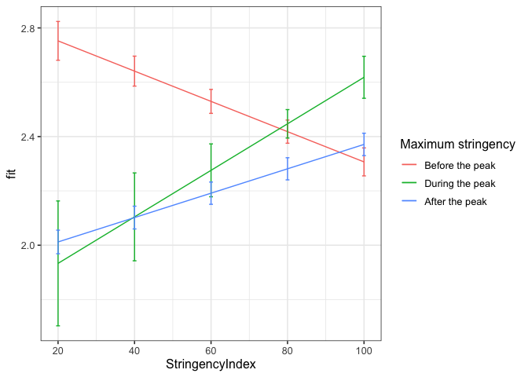
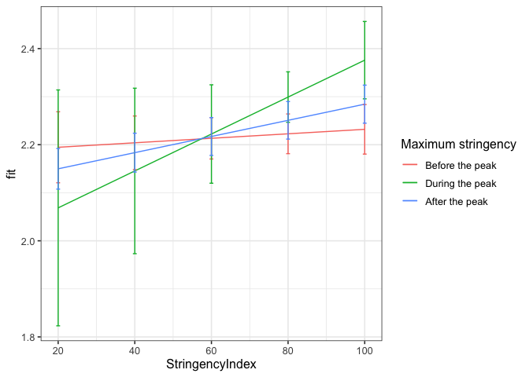
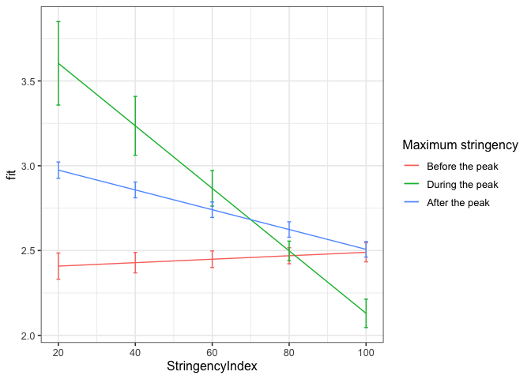

First analyses different dummy coding
================
Anne Margit
9/02/2020

``` r
load("data_imputed_emomeans_maxweeks.Rdata")
```

This dataset includes:

1.  Data from all weekly measurement waves (baseline through wave 11,
    Time 1 through 12)
2.  Participants who provided at least 3 measurements
3.  Participants who are residents of the country they currently live in
4.  Participants who provided info on age
5.  Participants who provided info on gender (either male or female)
6.  Data from countries with at least 20 participants
7.  Pooled age groups
8.  Imputed missing emotion scores
9.  Combined emotion scores (NAA, NAD, PAA, PAD)
10. An imputed Stringency index (StringencyIndex\_imp)
11. A variable indicating the number of days before and after the day on
    which maximum stringency was reached for the respective country
    (DaysMax)
12. A variable indicating the number of weeks before and after the day
    on which maximum stringency was reached for the respective country
    (WeeksMax)
13. A variable indicating the date on which maximum Stringency was
    reached for that country (DateMaxStr)

> My comments are in block quotes such as this.

``` r
library(dplyr)
library(tidyverse)
library(papaja)
library(ggpubr)
library(ggplot2)
library(lme4)
library(lmerTest)
library(rockchalk)
library(effects)
```

# Preparation

**Dummy coding Stringency** *Before the peak = 0. During peak = 1 (all
days with maximum stringency), after peak = 2*

``` r
data_analyse1 <- data_imputed_emomeans_maxweeks %>%
  group_by(Country) %>%
  mutate(Str_dummy = ifelse(Date < DateMaxStr, 0, ifelse(Date == DateMaxStr, 1, 2)))

data_analyse1$Str_dummy <- as_factor(data_analyse1$Str_dummy)

Dummy_N <- data_analyse1 %>%
group_by(Str_dummy) %>%
  summarise(N_dummy = n())
```

``` r
apa_table(Dummy_N)
```

<caption>

(\#tab:unnamed-chunk-4)

</caption>

<div data-custom-style="Table Caption">

\*\*

</div>

| Str\_dummy | N\_dummy |
| :--------- | :------- |
| 0          | 4107     |
| 1          | 415      |
| 2          | 53758    |
| NA         | 65836    |

# Regression models

**Negative affect high arousal**

*Random intercept*

``` r
model_NAA0 <- lmer(NAA ~ 1 + (1 | Country/ID), data = data_analyse1)
summary(model_NAA0)
```

    Linear mixed model fit by REML. t-tests use Satterthwaite's method ['lmerModLmerTest']
    Formula: NAA ~ 1 + (1 | Country/ID)
       Data: data_analyse1
    
    REML criterion at convergence: 124005.1
    
    Scaled residuals: 
        Min      1Q  Median      3Q     Max 
    -5.5671 -0.5524 -0.1183  0.5194  5.4053 
    
    Random effects:
     Groups     Name        Variance Std.Dev.
     ID:Country (Intercept) 0.57526  0.7585  
     Country    (Intercept) 0.05294  0.2301  
     Residual               0.32606  0.5710  
    Number of obs: 58246, groups:  ID:Country, 10343; Country, 33
    
    Fixed effects:
                Estimate Std. Error       df t value Pr(>|t|)    
    (Intercept)  2.29456    0.04212 31.67331   54.48   <2e-16 ***
    ---
    Signif. codes:  0 '***' 0.001 '**' 0.01 '*' 0.05 '.' 0.1 ' ' 1

*Stringency
Index*

``` r
model_NAA1 <- lmer(NAA ~ 1 + StringencyIndex + (1 | Country/ID), data = data_analyse1)
summary(model_NAA1)
```

    Linear mixed model fit by REML. t-tests use Satterthwaite's method ['lmerModLmerTest']
    Formula: NAA ~ 1 + StringencyIndex + (1 | Country/ID)
       Data: data_analyse1
    
    REML criterion at convergence: 123804.8
    
    Scaled residuals: 
        Min      1Q  Median      3Q     Max 
    -5.5319 -0.5537 -0.1142  0.5189  5.4564 
    
    Random effects:
     Groups     Name        Variance Std.Dev.
     ID:Country (Intercept) 0.57404  0.7577  
     Country    (Intercept) 0.05398  0.2323  
     Residual               0.32476  0.5699  
    Number of obs: 58246, groups:  ID:Country, 10343; Country, 33
    
    Fixed effects:
                     Estimate Std. Error        df t value Pr(>|t|)    
    (Intercept)     2.003e+00  4.690e-02 4.575e+01   42.71   <2e-16 ***
    StringencyIndex 3.791e-03  2.582e-04 4.919e+04   14.68   <2e-16 ***
    ---
    Signif. codes:  0 '***' 0.001 '**' 0.01 '*' 0.05 '.' 0.1 ' ' 1
    
    Correlation of Fixed Effects:
                (Intr)
    StrngncyInd -0.424

``` r
anova(model_NAA0, model_NAA1)
```

    Data: data_analyse1
    Models:
    model_NAA0: NAA ~ 1 + (1 | Country/ID)
    model_NAA1: NAA ~ 1 + StringencyIndex + (1 | Country/ID)
               npar    AIC    BIC logLik deviance  Chisq Df Pr(>Chisq)    
    model_NAA0    4 124009 124045 -62000   124001                         
    model_NAA1    5 123796 123840 -61893   123786 215.03  1  < 2.2e-16 ***
    ---
    Signif. codes:  0 '***' 0.001 '**' 0.01 '*' 0.05 '.' 0.1 ' ' 1

> Overall positive relationship between stringency and NAA

*Stringency Index and dummy variable with 0 = days before maximum
stringency, 1 = during, 2 =
after*

``` r
model_NAA2 <- lmer(NAA ~ 1 + StringencyIndex + Str_dummy + (1 | Country/ID), data = data_analyse1)
summary(model_NAA2)
```

    Linear mixed model fit by REML. t-tests use Satterthwaite's method ['lmerModLmerTest']
    Formula: NAA ~ 1 + StringencyIndex + Str_dummy + (1 | Country/ID)
       Data: data_analyse1
    
    REML criterion at convergence: 123436.1
    
    Scaled residuals: 
        Min      1Q  Median      3Q     Max 
    -5.5481 -0.5523 -0.1107  0.5158  5.4799 
    
    Random effects:
     Groups     Name        Variance Std.Dev.
     ID:Country (Intercept) 0.57237  0.7566  
     Country    (Intercept) 0.04942  0.2223  
     Residual               0.32245  0.5679  
    Number of obs: 58246, groups:  ID:Country, 10343; Country, 33
    
    Fixed effects:
                      Estimate Std. Error         df t value Pr(>|t|)    
    (Intercept)      2.161e+00  4.611e-02  4.986e+01  46.875   <2e-16 ***
    StringencyIndex  4.102e-03  2.583e-04  4.908e+04  15.878   <2e-16 ***
    Str_dummy1      -2.063e-02  3.244e-02  5.019e+04  -0.636    0.525    
    Str_dummy2      -2.088e-01  1.109e-02  4.999e+04 -18.830   <2e-16 ***
    ---
    Signif. codes:  0 '***' 0.001 '**' 0.01 '*' 0.05 '.' 0.1 ' ' 1
    
    Correlation of Fixed Effects:
                (Intr) StrngI Str_d1
    StrngncyInd -0.414              
    Str_dummy1  -0.045 -0.066       
    Str_dummy2  -0.180 -0.077  0.300

``` r
anova(model_NAA1, model_NAA2)
```

    Data: data_analyse1
    Models:
    model_NAA1: NAA ~ 1 + StringencyIndex + (1 | Country/ID)
    model_NAA2: NAA ~ 1 + StringencyIndex + Str_dummy + (1 | Country/ID)
               npar    AIC    BIC logLik deviance  Chisq Df Pr(>Chisq)    
    model_NAA1    5 123796 123840 -61893   123786                         
    model_NAA2    7 123419 123481 -61702   123405 380.99  2  < 2.2e-16 ***
    ---
    Signif. codes:  0 '***' 0.001 '**' 0.01 '*' 0.05 '.' 0.1 ' ' 1

> Lower NAA during the peak and after the peak compared to before the
> peak.

*Stringency Index x dummy
interaction*

``` r
model_NAA3 <- lmer(NAA ~ 1 + StringencyIndex + Str_dummy +  StringencyIndex*Str_dummy + (1 | Country/ID), data = data_analyse1)
summary(model_NAA3)
```

    Linear mixed model fit by REML. t-tests use Satterthwaite's method ['lmerModLmerTest']
    Formula: NAA ~ 1 + StringencyIndex + Str_dummy + StringencyIndex * Str_dummy +      (1 | Country/ID)
       Data: data_analyse1
    
    REML criterion at convergence: 123372.7
    
    Scaled residuals: 
        Min      1Q  Median      3Q     Max 
    -5.5484 -0.5524 -0.1112  0.5170  5.4890 
    
    Random effects:
     Groups     Name        Variance Std.Dev.
     ID:Country (Intercept) 0.57262  0.7567  
     Country    (Intercept) 0.04925  0.2219  
     Residual               0.32189  0.5673  
    Number of obs: 58246, groups:  ID:Country, 10343; Country, 33
    
    Fixed effects:
                                 Estimate Std. Error         df t value Pr(>|t|)    
    (Intercept)                 2.864e+00  9.003e-02  7.075e+02  31.811  < 2e-16 ***
    StringencyIndex            -5.570e-03  1.096e-03  5.001e+04  -5.084 3.72e-07 ***
    Str_dummy1                 -1.102e+00  3.040e-01  5.042e+04  -3.625 0.000289 ***
    Str_dummy2                 -9.415e-01  8.147e-02  5.002e+04 -11.557  < 2e-16 ***
    StringencyIndex:Str_dummy1  1.413e-02  3.652e-03  5.045e+04   3.870 0.000109 ***
    StringencyIndex:Str_dummy2  1.006e-02  1.108e-03  5.006e+04   9.078  < 2e-16 ***
    ---
    Signif. codes:  0 '***' 0.001 '**' 0.01 '*' 0.05 '.' 0.1 ' ' 1
    
    Correlation of Fixed Effects:
                (Intr) StrngI Str_d1 Str_d2 SI:S_1
    StrngncyInd -0.885                            
    Str_dummy1  -0.202  0.224                     
    Str_dummy2  -0.864  0.960  0.232              
    StrngnI:S_1  0.229 -0.260 -0.994 -0.263       
    StrngnI:S_2  0.859 -0.972 -0.230 -0.991  0.265

``` r
anova(model_NAA2, model_NAA3)
```

    Data: data_analyse1
    Models:
    model_NAA2: NAA ~ 1 + StringencyIndex + Str_dummy + (1 | Country/ID)
    model_NAA3: NAA ~ 1 + StringencyIndex + Str_dummy + StringencyIndex * Str_dummy + 
    model_NAA3:     (1 | Country/ID)
               npar    AIC    BIC logLik deviance  Chisq Df Pr(>Chisq)    
    model_NAA2    7 123419 123481 -61702   123405                         
    model_NAA3    9 123338 123419 -61660   123320 84.651  2  < 2.2e-16 ***
    ---
    Signif. codes:  0 '***' 0.001 '**' 0.01 '*' 0.05 '.' 0.1 ' ' 1

> Compared to before the peak, association between stringency and NAA is
> more positive during and after the peak. This model has better fit
> than previous one without the interaction.

*Random slope for Stringency Index on level
3*

``` r
model_NAA4 <- lmer(NAA ~ 1 + StringencyIndex + Str_dummy +  StringencyIndex*Str_dummy + (1 | Country/ID)
                   + (StringencyIndex | Country), data = data_analyse1)
```

    Warning in checkConv(attr(opt, "derivs"), opt$par, ctrl = control$checkConv, : Model failed to converge with max|grad| = 5.52263 (tol = 0.002, component 1)

    Warning in checkConv(attr(opt, "derivs"), opt$par, ctrl = control$checkConv, : Model is nearly unidentifiable: very large eigenvalue
     - Rescale variables?

``` r
summary(model_NAA4)
```

    Linear mixed model fit by REML. t-tests use Satterthwaite's method ['lmerModLmerTest']
    Formula: NAA ~ 1 + StringencyIndex + Str_dummy + StringencyIndex * Str_dummy +      (1 | Country/ID) + (StringencyIndex | Country)
       Data: data_analyse1
    
    REML criterion at convergence: 123351.9
    
    Scaled residuals: 
        Min      1Q  Median      3Q     Max 
    -5.5441 -0.5516 -0.1070  0.5156  5.5046 
    
    Random effects:
     Groups     Name            Variance  Std.Dev. Corr 
     ID.Country (Intercept)     5.725e-01 0.756623      
     Country    (Intercept)     1.311e-02 0.114489      
     Country.1  (Intercept)     1.377e-01 0.371026      
                StringencyIndex 4.261e-06 0.002064 -0.98
     Residual                   3.217e-01 0.567146      
    Number of obs: 58246, groups:  ID:Country, 10343; Country, 33
    
    Fixed effects:
                                 Estimate Std. Error         df t value Pr(>|t|)    
    (Intercept)                 2.852e+00  1.091e-01  7.298e+01  26.139  < 2e-16 ***
    StringencyIndex            -5.375e-03  1.202e-03  1.715e+02  -4.472 1.41e-05 ***
    Str_dummy1                 -1.123e+00  3.048e-01  2.649e+04  -3.685 0.000229 ***
    Str_dummy2                 -9.559e-01  8.572e-02  4.097e+02 -11.152  < 2e-16 ***
    StringencyIndex:Str_dummy1  1.434e-02  3.664e-03  2.461e+04   3.914 9.10e-05 ***
    StringencyIndex:Str_dummy2  1.020e-02  1.162e-03  4.604e+02   8.779  < 2e-16 ***
    ---
    Signif. codes:  0 '***' 0.001 '**' 0.01 '*' 0.05 '.' 0.1 ' ' 1
    
    Correlation of Fixed Effects:
                (Intr) StrngI Str_d1 Str_d2 SI:S_1
    StrngncyInd -0.908                            
    Str_dummy1  -0.177  0.216                     
    Str_dummy2  -0.720  0.885  0.244              
    StrngnI:S_1  0.201 -0.251 -0.994 -0.275       
    StrngnI:S_2  0.719 -0.898 -0.241 -0.991  0.276
    convergence code: 0
    Model failed to converge with max|grad| = 5.52263 (tol = 0.002, component 1)
    Model is nearly unidentifiable: very large eigenvalue
     - Rescale variables?

``` r
anova(model_NAA3, model_NAA4)
```

    Data: data_analyse1
    Models:
    model_NAA3: NAA ~ 1 + StringencyIndex + Str_dummy + StringencyIndex * Str_dummy + 
    model_NAA3:     (1 | Country/ID)
    model_NAA4: NAA ~ 1 + StringencyIndex + Str_dummy + StringencyIndex * Str_dummy + 
    model_NAA4:     (1 | Country/ID) + (StringencyIndex | Country)
               npar    AIC    BIC logLik deviance  Chisq Df Pr(>Chisq)    
    model_NAA3    9 123338 123419 -61660   123320                         
    model_NAA4   12 123323 123430 -61649   123299 21.442  3  8.522e-05 ***
    ---
    Signif. codes:  0 '***' 0.001 '**' 0.01 '*' 0.05 '.' 0.1 ' ' 1

> Model including a random slope for stringency index is a better fit
> than previous model.

*Plot of predicted values*

``` r
ef_NAA <- effect("StringencyIndex:Str_dummy", model_NAA3)

plot_NAA <- ggplot(as.data.frame(ef_NAA), 
       aes(StringencyIndex, fit, color=Str_dummy)) + geom_line() + 
  geom_errorbar(aes(ymin=fit-se, ymax=fit+se), width=1) + theme_bw(base_size=12) + scale_color_discrete(name="Maximum stringency", labels = c("Before the peak", "During the peak", "After the peak"))
```

``` r
plot_NAA
```

<!-- -->

**Negative affect low arousal**

*Random intercept*

``` r
model_NAD0 <- lmer(NAD ~ 1 + (1 | Country/ID), data = data_analyse1)
summary(model_NAD0)
```

    Linear mixed model fit by REML. t-tests use Satterthwaite's method ['lmerModLmerTest']
    Formula: NAD ~ 1 + (1 | Country/ID)
       Data: data_analyse1
    
    REML criterion at convergence: 131042.3
    
    Scaled residuals: 
        Min      1Q  Median      3Q     Max 
    -5.4414 -0.5513 -0.1174  0.5195  5.4434 
    
    Random effects:
     Groups     Name        Variance Std.Dev.
     ID:Country (Intercept) 0.62981  0.7936  
     Country    (Intercept) 0.04307  0.2075  
     Residual               0.37009  0.6084  
    Number of obs: 58246, groups:  ID:Country, 10343; Country, 33
    
    Fixed effects:
                Estimate Std. Error       df t value Pr(>|t|)    
    (Intercept)  2.24415    0.03854 26.17016   58.23   <2e-16 ***
    ---
    Signif. codes:  0 '***' 0.001 '**' 0.01 '*' 0.05 '.' 0.1 ' ' 1

*Stringency
Index*

``` r
model_NAD1 <- lmer(NAD ~ 1 + StringencyIndex + (1 | Country/ID), data = data_analyse1)
summary(model_NAD1)
```

    Linear mixed model fit by REML. t-tests use Satterthwaite's method ['lmerModLmerTest']
    Formula: NAD ~ 1 + StringencyIndex + (1 | Country/ID)
       Data: data_analyse1
    
    REML criterion at convergence: 131019.1
    
    Scaled residuals: 
        Min      1Q  Median      3Q     Max 
    -5.4232 -0.5503 -0.1176  0.5202  5.4145 
    
    Random effects:
     Groups     Name        Variance Std.Dev.
     ID:Country (Intercept) 0.62901  0.7931  
     Country    (Intercept) 0.04405  0.2099  
     Residual               0.36990  0.6082  
    Number of obs: 58246, groups:  ID:Country, 10343; Country, 33
    
    Fixed effects:
                     Estimate Std. Error        df t value Pr(>|t|)    
    (Intercept)     2.114e+00  4.432e-02 4.341e+01   47.70  < 2e-16 ***
    StringencyIndex 1.693e-03  2.753e-04 4.821e+04    6.15 7.81e-10 ***
    ---
    Signif. codes:  0 '***' 0.001 '**' 0.01 '*' 0.05 '.' 0.1 ' ' 1
    
    Correlation of Fixed Effects:
                (Intr)
    StrngncyInd -0.478

``` r
anova(model_NAD0, model_NAD1)
```

    Data: data_analyse1
    Models:
    model_NAD0: NAD ~ 1 + (1 | Country/ID)
    model_NAD1: NAD ~ 1 + StringencyIndex + (1 | Country/ID)
               npar    AIC    BIC logLik deviance  Chisq Df Pr(>Chisq)    
    model_NAD0    4 131046 131082 -65519   131038                         
    model_NAD1    5 131010 131055 -65500   131000 37.785  1  7.899e-10 ***
    ---
    Signif. codes:  0 '***' 0.001 '**' 0.01 '*' 0.05 '.' 0.1 ' ' 1

> Overall positive relationship between stringency and NAD

*Stringency Index and dummy variable with 0 = before maximum stringency,
1 = during peak, 2 =
after*

``` r
model_NAD2 <- lmer(NAD ~ 1 + StringencyIndex + Str_dummy + (1 | Country/ID), data = data_analyse1)
summary(model_NAD2)
```

    Linear mixed model fit by REML. t-tests use Satterthwaite's method ['lmerModLmerTest']
    Formula: NAD ~ 1 + StringencyIndex + Str_dummy + (1 | Country/ID)
       Data: data_analyse1
    
    REML criterion at convergence: 131025.2
    
    Scaled residuals: 
        Min      1Q  Median      3Q     Max 
    -5.4242 -0.5509 -0.1171  0.5201  5.4158 
    
    Random effects:
     Groups     Name        Variance Std.Dev.
     ID:Country (Intercept) 0.62908  0.7931  
     Country    (Intercept) 0.04432  0.2105  
     Residual               0.36986  0.6082  
    Number of obs: 58246, groups:  ID:Country, 10343; Country, 33
    
    Fixed effects:
                     Estimate Std. Error        df t value Pr(>|t|)    
    (Intercept)     2.100e+00  4.530e-02 4.687e+01  46.370  < 2e-16 ***
    StringencyIndex 1.636e-03  2.764e-04 4.829e+04   5.920 3.24e-09 ***
    Str_dummy1      7.628e-02  3.472e-02 5.026e+04   2.197    0.028 *  
    Str_dummy2      1.939e-02  1.187e-02 4.979e+04   1.634    0.102    
    ---
    Signif. codes:  0 '***' 0.001 '**' 0.01 '*' 0.05 '.' 0.1 ' ' 1
    
    Correlation of Fixed Effects:
                (Intr) StrngI Str_d1
    StrngncyInd -0.451              
    Str_dummy1  -0.049 -0.066       
    Str_dummy2  -0.196 -0.077  0.300

``` r
anova(model_NAD1, model_NAD2)
```

    Data: data_analyse1
    Models:
    model_NAD1: NAD ~ 1 + StringencyIndex + (1 | Country/ID)
    model_NAD2: NAD ~ 1 + StringencyIndex + Str_dummy + (1 | Country/ID)
               npar    AIC    BIC logLik deviance  Chisq Df Pr(>Chisq)  
    model_NAD1    5 131010 131055 -65500   131000                       
    model_NAD2    7 131008 131071 -65497   130994 5.8618  2    0.05335 .
    ---
    Signif. codes:  0 '***' 0.001 '**' 0.01 '*' 0.05 '.' 0.1 ' ' 1

> NAD is higher during stringency peak compared to before peak, no
> difference in NAD after the peak compared to before the peak. Model
> including dummy variables is not a better fit, previous model is best.

*Stringency Index x dummy
interaction*

``` r
model_NAD3 <- lmer(NAD ~ 1 + StringencyIndex + Str_dummy +  StringencyIndex*Str_dummy + (1 | Country/ID), data = data_analyse1)
summary(model_NAD3)
```

    Linear mixed model fit by REML. t-tests use Satterthwaite's method ['lmerModLmerTest']
    Formula: NAD ~ 1 + StringencyIndex + Str_dummy + StringencyIndex * Str_dummy +      (1 | Country/ID)
       Data: data_analyse1
    
    REML criterion at convergence: 131044.7
    
    Scaled residuals: 
        Min      1Q  Median      3Q     Max 
    -5.4237 -0.5510 -0.1164  0.5201  5.4151 
    
    Random effects:
     Groups     Name        Variance Std.Dev.
     ID:Country (Intercept) 0.62915  0.7932  
     Country    (Intercept) 0.04433  0.2106  
     Residual               0.36986  0.6082  
    Number of obs: 58246, groups:  ID:Country, 10343; Country, 33
    
    Fixed effects:
                                 Estimate Std. Error         df t value Pr(>|t|)    
    (Intercept)                 2.185e+00  9.443e-02  8.509e+02  23.142   <2e-16 ***
    StringencyIndex             4.672e-04  1.174e-03  4.974e+04   0.398    0.691    
    Str_dummy1                 -1.936e-01  3.257e-01  5.051e+04  -0.595    0.552    
    Str_dummy2                 -6.910e-02  8.727e-02  4.989e+04  -0.792    0.429    
    StringencyIndex:Str_dummy1  3.375e-03  3.913e-03  5.053e+04   0.863    0.388    
    StringencyIndex:Str_dummy2  1.214e-03  1.187e-03  4.992e+04   1.023    0.306    
    ---
    Signif. codes:  0 '***' 0.001 '**' 0.01 '*' 0.05 '.' 0.1 ' ' 1
    
    Correlation of Fixed Effects:
                (Intr) StrngI Str_d1 Str_d2 SI:S_1
    StrngncyInd -0.904                            
    Str_dummy1  -0.206  0.225                     
    Str_dummy2  -0.882  0.960  0.232              
    StrngnI:S_1  0.234 -0.260 -0.994 -0.263       
    StrngnI:S_2  0.877 -0.972 -0.230 -0.991  0.265

``` r
anova(model_NAD2, model_NAD3)
```

    Data: data_analyse1
    Models:
    model_NAD2: NAD ~ 1 + StringencyIndex + Str_dummy + (1 | Country/ID)
    model_NAD3: NAD ~ 1 + StringencyIndex + Str_dummy + StringencyIndex * Str_dummy + 
    model_NAD3:     (1 | Country/ID)
               npar    AIC    BIC logLik deviance  Chisq Df Pr(>Chisq)
    model_NAD2    7 131008 131071 -65497   130994                     
    model_NAD3    9 131011 131091 -65496   130993 1.4233  2     0.4908

> No significant interaction effect

*Random slope for stringency index without dummy variable and
interaction*

``` r
model_NAD4 <- lmer(NAD ~ 1 + StringencyIndex + (1  | Country/ID) + (StringencyIndex | Country), data = data_analyse1)
```

    Warning in checkConv(attr(opt, "derivs"), opt$par, ctrl = control$checkConv, : unable to evaluate scaled gradient

    Warning in checkConv(attr(opt, "derivs"), opt$par, ctrl = control$checkConv, : Model failed to converge: degenerate Hessian with 1 negative eigenvalues

    Warning: Model failed to converge with 1 negative eigenvalue: -3.2e+02

``` r
summary(model_NAD4)
```

    Linear mixed model fit by REML. t-tests use Satterthwaite's method ['lmerModLmerTest']
    Formula: NAD ~ 1 + StringencyIndex + (1 | Country/ID) + (StringencyIndex |      Country)
       Data: data_analyse1
    
    REML criterion at convergence: 130979.9
    
    Scaled residuals: 
        Min      1Q  Median      3Q     Max 
    -5.4677 -0.5506 -0.1165  0.5203  5.4778 
    
    Random effects:
     Groups     Name            Variance  Std.Dev. Corr 
     ID.Country (Intercept)     6.310e-01 0.794381      
     Country    (Intercept)     4.142e-02 0.203524      
     Country.1  (Intercept)     1.784e-01 0.422316      
                StringencyIndex 2.879e-05 0.005365 -1.00
     Residual                   3.690e-01 0.607461      
    Number of obs: 58246, groups:  ID:Country, 10343; Country, 33
    
    Fixed effects:
                     Estimate Std. Error        df t value Pr(>|t|)    
    (Intercept)      2.158886   0.097325 15.992219  22.182 1.95e-13 ***
    StringencyIndex  0.001216   0.001145 16.114756   1.062    0.304    
    ---
    Signif. codes:  0 '***' 0.001 '**' 0.01 '*' 0.05 '.' 0.1 ' ' 1
    
    Correlation of Fixed Effects:
                (Intr)
    StrngncyInd -0.917
    convergence code: 0
    unable to evaluate scaled gradient
    Model failed to converge: degenerate  Hessian with 1 negative eigenvalues

``` r
anova(model_NAD1, model_NAD4)
```

    Data: data_analyse1
    Models:
    model_NAD1: NAD ~ 1 + StringencyIndex + (1 | Country/ID)
    model_NAD4: NAD ~ 1 + StringencyIndex + (1 | Country/ID) + (StringencyIndex | 
    model_NAD4:     Country)
               npar    AIC    BIC logLik deviance  Chisq Df Pr(>Chisq)    
    model_NAD1    5 131010 131055 -65500   131000                         
    model_NAD4    8 130979 131051 -65482   130963 36.821  3  5.021e-08 ***
    ---
    Signif. codes:  0 '***' 0.001 '**' 0.01 '*' 0.05 '.' 0.1 ' ' 1

> Model met random slope is beter dan met fixed slope, maar geeft wel
> een warning (failed to converge?)

*Plot of predicted values*

``` r
ef_NAD <- effect("StringencyIndex:Str_dummy", model_NAD3)

plot_NAD <- ggplot(as.data.frame(ef_NAD), 
       aes(StringencyIndex, fit, color=Str_dummy)) + geom_line() + 
  geom_errorbar(aes(ymin=fit-se, ymax=fit+se), width=1) + theme_bw(base_size=12) + scale_color_discrete(name="Maximum stringency", labels = c("Before the peak", "During the peak", "After the peak"))
```

``` r
plot_NAD
```

<!-- -->

**Positive affect high arousal**

*Random intercept*

``` r
model_PAA0 <- lmer(PAA ~ 1 + (1 | Country/ID), data = data_analyse1)
summary(model_PAA0)
```

    Linear mixed model fit by REML. t-tests use Satterthwaite's method ['lmerModLmerTest']
    Formula: PAA ~ 1 + (1 | Country/ID)
       Data: data_analyse1
    
    REML criterion at convergence: 129956
    
    Scaled residuals: 
        Min      1Q  Median      3Q     Max 
    -5.1631 -0.5763  0.0042  0.5799  5.0505 
    
    Random effects:
     Groups     Name        Variance Std.Dev.
     ID:Country (Intercept) 0.51426  0.7171  
     Country    (Intercept) 0.05563  0.2359  
     Residual               0.37572  0.6130  
    Number of obs: 58246, groups:  ID:Country, 10343; Country, 33
    
    Fixed effects:
                Estimate Std. Error       df t value Pr(>|t|)    
    (Intercept)  2.61592    0.04294 32.10448   60.92   <2e-16 ***
    ---
    Signif. codes:  0 '***' 0.001 '**' 0.01 '*' 0.05 '.' 0.1 ' ' 1

*Stringency
Index*

``` r
model_PAA1 <- lmer(PAA ~ 1 + StringencyIndex + (1 | Country/ID), data = data_analyse1)
summary(model_PAA1)
```

    Linear mixed model fit by REML. t-tests use Satterthwaite's method ['lmerModLmerTest']
    Formula: PAA ~ 1 + StringencyIndex + (1 | Country/ID)
       Data: data_analyse1
    
    REML criterion at convergence: 129606.4
    
    Scaled residuals: 
        Min      1Q  Median      3Q     Max 
    -5.1814 -0.5758 -0.0058  0.5846  5.0975 
    
    Random effects:
     Groups     Name        Variance Std.Dev.
     ID:Country (Intercept) 0.51383  0.7168  
     Country    (Intercept) 0.06205  0.2491  
     Residual               0.37300  0.6107  
    Number of obs: 58246, groups:  ID:Country, 10343; Country, 33
    
    Fixed effects:
                      Estimate Std. Error         df t value Pr(>|t|)    
    (Intercept)      3.022e+00  4.990e-02  4.703e+01   60.55   <2e-16 ***
    StringencyIndex -5.277e-03  2.760e-04  4.964e+04  -19.12   <2e-16 ***
    ---
    Signif. codes:  0 '***' 0.001 '**' 0.01 '*' 0.05 '.' 0.1 ' ' 1
    
    Correlation of Fixed Effects:
                (Intr)
    StrngncyInd -0.425

``` r
anova(model_PAA0, model_PAA1)
```

    Data: data_analyse1
    Models:
    model_PAA0: PAA ~ 1 + (1 | Country/ID)
    model_PAA1: PAA ~ 1 + StringencyIndex + (1 | Country/ID)
               npar    AIC    BIC logLik deviance  Chisq Df Pr(>Chisq)    
    model_PAA0    4 129959 129995 -64976   129951                         
    model_PAA1    5 129597 129642 -64794   129587 364.02  1  < 2.2e-16 ***
    ---
    Signif. codes:  0 '***' 0.001 '**' 0.01 '*' 0.05 '.' 0.1 ' ' 1

> Overall negative relationship between stringency and PAA. Model with
> stringency index fits better than without predictors

*Stringency Index and dummy variable with 0 = before maximum stringency,
1 = during peak, 2 =
after*

``` r
model_PAA2 <- lmer(PAA ~ 1 + StringencyIndex + Str_dummy + (1 | Country/ID), data = data_analyse1)
summary(model_PAA2)
```

    Linear mixed model fit by REML. t-tests use Satterthwaite's method ['lmerModLmerTest']
    Formula: PAA ~ 1 + StringencyIndex + Str_dummy + (1 | Country/ID)
       Data: data_analyse1
    
    REML criterion at convergence: 129303.9
    
    Scaled residuals: 
        Min      1Q  Median      3Q     Max 
    -5.1988 -0.5795 -0.0071  0.5821  5.1137 
    
    Random effects:
     Groups     Name        Variance Std.Dev.
     ID:Country (Intercept) 0.51377  0.7168  
     Country    (Intercept) 0.06244  0.2499  
     Residual               0.37064  0.6088  
    Number of obs: 58246, groups:  ID:Country, 10343; Country, 33
    
    Fixed effects:
                      Estimate Std. Error         df t value Pr(>|t|)    
    (Intercept)      2.867e+00  5.078e-02  4.980e+01  56.463   <2e-16 ***
    StringencyIndex -5.581e-03  2.762e-04  4.969e+04 -20.205   <2e-16 ***
    Str_dummy1       2.827e-02  3.468e-02  5.071e+04   0.815    0.415    
    Str_dummy2       2.035e-01  1.185e-02  5.056e+04  17.168   <2e-16 ***
    ---
    Signif. codes:  0 '***' 0.001 '**' 0.01 '*' 0.05 '.' 0.1 ' ' 1
    
    Correlation of Fixed Effects:
                (Intr) StrngI Str_d1
    StrngncyInd -0.402              
    Str_dummy1  -0.043 -0.066       
    Str_dummy2  -0.175 -0.076  0.301

``` r
anova(model_PAA1, model_PAA2)
```

    Data: data_analyse1
    Models:
    model_PAA1: PAA ~ 1 + StringencyIndex + (1 | Country/ID)
    model_PAA2: PAA ~ 1 + StringencyIndex + Str_dummy + (1 | Country/ID)
               npar    AIC    BIC logLik deviance  Chisq Df Pr(>Chisq)    
    model_PAA1    5 129597 129642 -64794   129587                         
    model_PAA2    7 129287 129350 -64636   129273 314.55  2  < 2.2e-16 ***
    ---
    Signif. codes:  0 '***' 0.001 '**' 0.01 '*' 0.05 '.' 0.1 ' ' 1

> PAA is higher after the peak compared to before the peak. No
> difference in PAA before the peak compared to during the peak. This
> model fits better than model with only stringency index as predictor.

*Stringency Index x dummy
interaction*

``` r
model_PAA3 <- lmer(PAA ~ 1 + StringencyIndex + Str_dummy +  StringencyIndex*Str_dummy + (1 | Country/ID), data = data_analyse1)
summary(model_PAA3)
```

    Linear mixed model fit by REML. t-tests use Satterthwaite's method ['lmerModLmerTest']
    Formula: PAA ~ 1 + StringencyIndex + Str_dummy + StringencyIndex * Str_dummy +      (1 | Country/ID)
       Data: data_analyse1
    
    REML criterion at convergence: 129278.6
    
    Scaled residuals: 
        Min      1Q  Median      3Q     Max 
    -5.2009 -0.5801 -0.0074  0.5836  5.1183 
    
    Random effects:
     Groups     Name        Variance Std.Dev.
     ID:Country (Intercept) 0.51358  0.7166  
     Country    (Intercept) 0.06246  0.2499  
     Residual               0.37033  0.6086  
    Number of obs: 58246, groups:  ID:Country, 10343; Country, 33
    
    Fixed effects:
                                 Estimate Std. Error         df t value Pr(>|t|)    
    (Intercept)                 2.388e+00  9.707e-02  6.505e+02  24.598  < 2e-16 ***
    StringencyIndex             1.019e-03  1.172e-03  5.061e+04   0.870    0.384    
    Str_dummy1                  1.585e+00  3.250e-01  5.100e+04   4.876 1.09e-06 ***
    Str_dummy2                  7.031e-01  8.714e-02  5.058e+04   8.068 7.28e-16 ***
    StringencyIndex:Str_dummy1 -1.945e-02  3.905e-03  5.102e+04  -4.980 6.37e-07 ***
    StringencyIndex:Str_dummy2 -6.856e-03  1.185e-03  5.063e+04  -5.785 7.29e-09 ***
    ---
    Signif. codes:  0 '***' 0.001 '**' 0.01 '*' 0.05 '.' 0.1 ' ' 1
    
    Correlation of Fixed Effects:
                (Intr) StrngI Str_d1 Str_d2 SI:S_1
    StrngncyInd -0.878                            
    Str_dummy1  -0.201  0.225                     
    Str_dummy2  -0.857  0.960  0.233              
    StrngnI:S_1  0.228 -0.261 -0.994 -0.263       
    StrngnI:S_2  0.852 -0.972 -0.230 -0.991  0.265

``` r
anova(model_PAA2, model_PAA3)
```

    Data: data_analyse1
    Models:
    model_PAA2: PAA ~ 1 + StringencyIndex + Str_dummy + (1 | Country/ID)
    model_PAA3: PAA ~ 1 + StringencyIndex + Str_dummy + StringencyIndex * Str_dummy + 
    model_PAA3:     (1 | Country/ID)
               npar    AIC    BIC logLik deviance  Chisq Df Pr(>Chisq)    
    model_PAA2    7 129287 129350 -64636   129273                         
    model_PAA3    9 129245 129325 -64613   129227 46.229  2  9.153e-11 ***
    ---
    Signif. codes:  0 '***' 0.001 '**' 0.01 '*' 0.05 '.' 0.1 ' ' 1

> Both interactions are significant: compared to before the peak, the
> relationship between stringency and PAA is more negative during and
> after the peak. Model with interaction effects is a better fit.

*Random slope for Stringency
Index*

``` r
model_PAA4 <- lmer(PAA ~ 1 + StringencyIndex + Str_dummy +  StringencyIndex*Str_dummy + (1  | Country/ID) 
                   + (1 + StringencyIndex | Country), data = data_analyse1)
summary(model_PAA4)
```

    Linear mixed model fit by REML. t-tests use Satterthwaite's method ['lmerModLmerTest']
    Formula: PAA ~ 1 + StringencyIndex + Str_dummy + StringencyIndex * Str_dummy +      (1 | Country/ID) + (1 + StringencyIndex | Country)
       Data: data_analyse1
    
    REML criterion at convergence: 129214.2
    
    Scaled residuals: 
        Min      1Q  Median      3Q     Max 
    -5.2067 -0.5794 -0.0066  0.5828  5.1447 
    
    Random effects:
     Groups     Name            Variance  Std.Dev. Corr 
     ID.Country (Intercept)     5.133e-01 0.71645       
     Country    (Intercept)     6.625e-02 0.25739       
     Country.1  (Intercept)     1.775e-01 0.42128       
                StringencyIndex 3.226e-05 0.00568  -1.00
     Residual                   3.695e-01 0.60785       
    Number of obs: 58246, groups:  ID:Country, 10343; Country, 33
    
    Fixed effects:
                                 Estimate Std. Error         df t value Pr(>|t|)    
    (Intercept)                 2.536e+00  1.355e-01  4.645e+01  18.714  < 2e-16 ***
    StringencyIndex            -1.013e-03  1.718e-03  4.530e+01  -0.589    0.559    
    Str_dummy1                  1.640e+00  3.303e-01  3.195e+04   4.964 6.93e-07 ***
    Str_dummy2                  7.153e-01  1.046e-01  1.002e+03   6.837 1.40e-11 ***
    StringencyIndex:Str_dummy1 -1.982e-02  3.973e-03  3.063e+04  -4.988 6.12e-07 ***
    StringencyIndex:Str_dummy2 -6.782e-03  1.404e-03  1.215e+03  -4.829 1.55e-06 ***
    ---
    Signif. codes:  0 '***' 0.001 '**' 0.01 '*' 0.05 '.' 0.1 ' ' 1
    
    Correlation of Fixed Effects:
                (Intr) StrngI Str_d1 Str_d2 SI:S_1
    StrngncyInd -0.934                            
    Str_dummy1  -0.183  0.192                     
    Str_dummy2  -0.660  0.700  0.279              
    StrngnI:S_1  0.208 -0.222 -0.994 -0.309       
    StrngnI:S_2  0.663 -0.713 -0.275 -0.993  0.310
    convergence code: 0
    boundary (singular) fit: see ?isSingular

``` r
anova(model_PAA3, model_PAA4)
```

    Data: data_analyse1
    Models:
    model_PAA3: PAA ~ 1 + StringencyIndex + Str_dummy + StringencyIndex * Str_dummy + 
    model_PAA3:     (1 | Country/ID)
    model_PAA4: PAA ~ 1 + StringencyIndex + Str_dummy + StringencyIndex * Str_dummy + 
    model_PAA4:     (1 | Country/ID) + (1 + StringencyIndex | Country)
               npar    AIC    BIC logLik deviance  Chisq Df Pr(>Chisq)    
    model_PAA3    9 129245 129325 -64613   129227                         
    model_PAA4   12 129190 129297 -64583   129166 60.874  3  3.824e-13 ***
    ---
    Signif. codes:  0 '***' 0.001 '**' 0.01 '*' 0.05 '.' 0.1 ' ' 1

> Random slope is significant

*Plot of predicted values*

``` r
ef_PAA <- effect("StringencyIndex:Str_dummy", model_PAA3)

plot_PAA <- ggplot(as.data.frame(ef_PAA), 
       aes(StringencyIndex, fit, color=Str_dummy)) + geom_line() + 
  geom_errorbar(aes(ymin=fit-se, ymax=fit+se), width=1) + theme_bw(base_size=12) + scale_color_discrete(name="Maximum stringency", labels = c("Before the peak", "During the peak", "After the peak"))
```

``` r
plot_PAA
```

<!-- -->

**Positive affect low arousal**

*Random
    intercept*

``` r
model_PAD0 <- lmer(PAD ~ 1 + (1 | Country/ID), data = data_analyse1)
```

    Warning in checkConv(attr(opt, "derivs"), opt$par, ctrl = control$checkConv, : Model failed to converge with max|grad| = 0.0025537 (tol = 0.002, component 1)

``` r
summary(model_PAD0)
```

    Linear mixed model fit by REML. t-tests use Satterthwaite's method ['lmerModLmerTest']
    Formula: PAD ~ 1 + (1 | Country/ID)
       Data: data_analyse1
    
    REML criterion at convergence: 132654.5
    
    Scaled residuals: 
        Min      1Q  Median      3Q     Max 
    -5.2863 -0.5598  0.0636  0.5782  4.5101 
    
    Random effects:
     Groups     Name        Variance Std.Dev.
     ID:Country (Intercept) 0.55555  0.7454  
     Country    (Intercept) 0.04089  0.2022  
     Residual               0.39141  0.6256  
    Number of obs: 58246, groups:  ID:Country, 10343; Country, 33
    
    Fixed effects:
                Estimate Std. Error       df t value Pr(>|t|)    
    (Intercept)  2.96389    0.03745 31.52185   79.14   <2e-16 ***
    ---
    Signif. codes:  0 '***' 0.001 '**' 0.01 '*' 0.05 '.' 0.1 ' ' 1
    convergence code: 0
    Model failed to converge with max|grad| = 0.0025537 (tol = 0.002, component 1)

*Stringency
Index*

``` r
model_PAD1 <- lmer(PAD ~ 1 + StringencyIndex + (1 | Country/ID), data = data_analyse1)
summary(model_PAD1)
```

    Linear mixed model fit by REML. t-tests use Satterthwaite's method ['lmerModLmerTest']
    Formula: PAD ~ 1 + StringencyIndex + (1 | Country/ID)
       Data: data_analyse1
    
    REML criterion at convergence: 132637.3
    
    Scaled residuals: 
        Min      1Q  Median      3Q     Max 
    -5.2806 -0.5621  0.0611  0.5791  4.5339 
    
    Random effects:
     Groups     Name        Variance Std.Dev.
     ID:Country (Intercept) 0.55529  0.7452  
     Country    (Intercept) 0.03994  0.1998  
     Residual               0.39121  0.6255  
    Number of obs: 58246, groups:  ID:Country, 10343; Country, 33
    
    Fixed effects:
                      Estimate Std. Error         df t value Pr(>|t|)    
    (Intercept)      3.086e+00  4.296e-02  5.664e+01  71.838  < 2e-16 ***
    StringencyIndex -1.592e-03  2.824e-04  4.839e+04  -5.636 1.75e-08 ***
    ---
    Signif. codes:  0 '***' 0.001 '**' 0.01 '*' 0.05 '.' 0.1 ' ' 1
    
    Correlation of Fixed Effects:
                (Intr)
    StrngncyInd -0.506

``` r
anova(model_PAD0, model_PAD1)
```

    Data: data_analyse1
    Models:
    model_PAD0: PAD ~ 1 + (1 | Country/ID)
    model_PAD1: PAD ~ 1 + StringencyIndex + (1 | Country/ID)
               npar    AIC    BIC logLik deviance  Chisq Df Pr(>Chisq)    
    model_PAD0    4 132658 132694 -66325   132650                         
    model_PAD1    5 132628 132673 -66309   132618 31.776  1   1.73e-08 ***
    ---
    Signif. codes:  0 '***' 0.001 '**' 0.01 '*' 0.05 '.' 0.1 ' ' 1

> Overall negative association between stringency and PAD

*Stringency Index and dummy variable with 0 = before maximum stringency,
1 = during, 2 =
after*

``` r
model_PAD2 <- lmer(PAD ~ 1 + StringencyIndex + Str_dummy + (1 | Country/ID), data = data_analyse1)
summary(model_PAD2)
```

    Linear mixed model fit by REML. t-tests use Satterthwaite's method ['lmerModLmerTest']
    Formula: PAD ~ 1 + StringencyIndex + Str_dummy + (1 | Country/ID)
       Data: data_analyse1
    
    REML criterion at convergence: 132452.7
    
    Scaled residuals: 
        Min      1Q  Median      3Q     Max 
    -5.2908 -0.5626  0.0558  0.5800  4.5465 
    
    Random effects:
     Groups     Name        Variance Std.Dev.
     ID:Country (Intercept) 0.55465  0.7448  
     Country    (Intercept) 0.03861  0.1965  
     Residual               0.38976  0.6243  
    Number of obs: 58246, groups:  ID:Country, 10343; Country, 33
    
    Fixed effects:
                      Estimate Std. Error         df t value Pr(>|t|)    
    (Intercept)      2.960e+00  4.343e-02  6.263e+01  68.149  < 2e-16 ***
    StringencyIndex -1.855e-03  2.830e-04  4.834e+04  -6.554 5.67e-11 ***
    Str_dummy1       5.498e-02  3.557e-02  5.066e+04   1.546    0.122    
    Str_dummy2       1.673e-01  1.215e-02  5.010e+04  13.764  < 2e-16 ***
    ---
    Signif. codes:  0 '***' 0.001 '**' 0.01 '*' 0.05 '.' 0.1 ' ' 1
    
    Correlation of Fixed Effects:
                (Intr) StrngI Str_d1
    StrngncyInd -0.482              
    Str_dummy1  -0.052 -0.066       
    Str_dummy2  -0.210 -0.076  0.301

``` r
anova(model_PAD1, model_PAD2)
```

    Data: data_analyse1
    Models:
    model_PAD1: PAD ~ 1 + StringencyIndex + (1 | Country/ID)
    model_PAD2: PAD ~ 1 + StringencyIndex + Str_dummy + (1 | Country/ID)
               npar    AIC    BIC logLik deviance  Chisq Df Pr(>Chisq)    
    model_PAD1    5 132628 132673 -66309   132618                         
    model_PAD2    7 132435 132498 -66211   132421 196.51  2  < 2.2e-16 ***
    ---
    Signif. codes:  0 '***' 0.001 '**' 0.01 '*' 0.05 '.' 0.1 ' ' 1

> PAD is higher after maximum stringency compared to before.

*Stringency Index x dummy
interaction*

``` r
model_PAD3 <- lmer(PAD ~ 1 + StringencyIndex + Str_dummy +  StringencyIndex*Str_dummy + (1 | Country/ID), data = data_analyse1)
summary(model_PAD3)
```

    Linear mixed model fit by REML. t-tests use Satterthwaite's method ['lmerModLmerTest']
    Formula: PAD ~ 1 + StringencyIndex + Str_dummy + StringencyIndex * Str_dummy +      (1 | Country/ID)
       Data: data_analyse1
    
    REML criterion at convergence: 132445.6
    
    Scaled residuals: 
        Min      1Q  Median      3Q     Max 
    -5.2913 -0.5624  0.0557  0.5784  4.5507 
    
    Random effects:
     Groups     Name        Variance Std.Dev.
     ID:Country (Intercept) 0.55457  0.7447  
     Country    (Intercept) 0.03896  0.1974  
     Residual               0.38956  0.6241  
    Number of obs: 58246, groups:  ID:Country, 10343; Country, 33
    
    Fixed effects:
                                 Estimate Std. Error         df t value Pr(>|t|)    
    (Intercept)                 2.564e+00  9.535e-02  1.356e+03  26.896  < 2e-16 ***
    StringencyIndex             3.588e-03  1.201e-03  5.005e+04   2.986 0.002823 ** 
    Str_dummy1                  1.219e+00  3.334e-01  5.094e+04   3.657 0.000256 ***
    Str_dummy2                  5.793e-01  8.935e-02  5.023e+04   6.483 9.06e-11 ***
    StringencyIndex:Str_dummy1 -1.461e-02  4.006e-03  5.097e+04  -3.647 0.000266 ***
    StringencyIndex:Str_dummy2 -5.655e-03  1.215e-03  5.026e+04  -4.653 3.27e-06 ***
    ---
    Signif. codes:  0 '***' 0.001 '**' 0.01 '*' 0.05 '.' 0.1 ' ' 1
    
    Correlation of Fixed Effects:
                (Intr) StrngI Str_d1 Str_d2 SI:S_1
    StrngncyInd -0.916                            
    Str_dummy1  -0.209  0.225                     
    Str_dummy2  -0.894  0.960  0.233              
    StrngnI:S_1  0.238 -0.261 -0.994 -0.263       
    StrngnI:S_2  0.890 -0.972 -0.230 -0.991  0.265

``` r
anova(model_PAD2, model_PAD3)
```

    Data: data_analyse1
    Models:
    model_PAD2: PAD ~ 1 + StringencyIndex + Str_dummy + (1 | Country/ID)
    model_PAD3: PAD ~ 1 + StringencyIndex + Str_dummy + StringencyIndex * Str_dummy + 
    model_PAD3:     (1 | Country/ID)
               npar    AIC    BIC logLik deviance  Chisq Df Pr(>Chisq)    
    model_PAD2    7 132435 132498 -66211   132421                         
    model_PAD3    9 132412 132492 -66197   132394 27.905  2   8.72e-07 ***
    ---
    Signif. codes:  0 '***' 0.001 '**' 0.01 '*' 0.05 '.' 0.1 ' ' 1

> Both interaction effects are significant: compared to before the peak,
> association between stringency and PAD is more negative during and
> after the peak.

*Random slope voor
stringency*

``` r
model_PAD4 <- lmer(PAD ~ 1 + StringencyIndex + Str_dummy +  StringencyIndex*Str_dummy + (1 | Country/ID)
                   + (1 + StringencyIndex | Country), data = data_analyse1)
```

    Warning in checkConv(attr(opt, "derivs"), opt$par, ctrl = control$checkConv, : Model failed to converge with max|grad| = 8.07518 (tol = 0.002, component 1)

    Warning in checkConv(attr(opt, "derivs"), opt$par, ctrl = control$checkConv, : Model is nearly unidentifiable: very large eigenvalue
     - Rescale variables?

``` r
summary(model_PAD4)
```

    Linear mixed model fit by REML. t-tests use Satterthwaite's method ['lmerModLmerTest']
    Formula: PAD ~ 1 + StringencyIndex + Str_dummy + StringencyIndex * Str_dummy +      (1 | Country/ID) + (1 + StringencyIndex | Country)
       Data: data_analyse1
    
    REML criterion at convergence: 132420.4
    
    Scaled residuals: 
        Min      1Q  Median      3Q     Max 
    -5.2955 -0.5611  0.0553  0.5779  4.5478 
    
    Random effects:
     Groups     Name            Variance  Std.Dev. Corr 
     ID.Country (Intercept)     5.543e-01 0.744517      
     Country    (Intercept)     3.651e-02 0.191082      
     Country.1  (Intercept)     5.707e-02 0.238903      
                StringencyIndex 8.883e-06 0.002981 -0.96
     Residual                   3.892e-01 0.623828      
    Number of obs: 58246, groups:  ID:Country, 10343; Country, 33
    
    Fixed effects:
                                 Estimate Std. Error         df t value Pr(>|t|)    
    (Intercept)                 2.557e+00  1.128e-01  4.386e+01  22.681  < 2e-16 ***
    StringencyIndex             3.715e-03  1.435e-03  5.551e+01   2.590 0.012249 *  
    Str_dummy1                  1.200e+00  3.366e-01  1.730e+04   3.564 0.000367 ***
    Str_dummy2                  5.400e-01  1.004e-01  2.403e+02   5.380 1.77e-07 ***
    StringencyIndex:Str_dummy1 -1.444e-02  4.047e-03  1.558e+04  -3.569 0.000360 ***
    StringencyIndex:Str_dummy2 -5.233e-03  1.355e-03  2.823e+02  -3.863 0.000139 ***
    ---
    Signif. codes:  0 '***' 0.001 '**' 0.01 '*' 0.05 '.' 0.1 ' ' 1
    
    Correlation of Fixed Effects:
                (Intr) StrngI Str_d1 Str_d2 SI:S_1
    StrngncyInd -0.936                            
    Str_dummy1  -0.205  0.215                     
    Str_dummy2  -0.786  0.832  0.261              
    StrngnI:S_1  0.232 -0.249 -0.994 -0.291       
    StrngnI:S_2  0.786 -0.846 -0.258 -0.992  0.293
    convergence code: 0
    Model failed to converge with max|grad| = 8.07518 (tol = 0.002, component 1)
    Model is nearly unidentifiable: very large eigenvalue
     - Rescale variables?

``` r
anova(model_PAD3, model_PAD4)
```

    Data: data_analyse1
    Models:
    model_PAD3: PAD ~ 1 + StringencyIndex + Str_dummy + StringencyIndex * Str_dummy + 
    model_PAD3:     (1 | Country/ID)
    model_PAD4: PAD ~ 1 + StringencyIndex + Str_dummy + StringencyIndex * Str_dummy + 
    model_PAD4:     (1 | Country/ID) + (1 + StringencyIndex | Country)
               npar    AIC    BIC logLik deviance  Chisq Df Pr(>Chisq)    
    model_PAD3    9 132412 132492 -66197   132394                         
    model_PAD4   12 132394 132501 -66185   132370 24.052  3  2.436e-05 ***
    ---
    Signif. codes:  0 '***' 0.001 '**' 0.01 '*' 0.05 '.' 0.1 ' ' 1

> Better fit with random slope

*Plot of predicted values*

``` r
ef_PAD <- effect("StringencyIndex:Str_dummy", model_PAD3)

plot_PAD <- ggplot(as.data.frame(ef_PAD), 
       aes(StringencyIndex, fit, color=Str_dummy)) + geom_line() + 
  geom_errorbar(aes(ymin=fit-se, ymax=fit+se), width=1) + theme_bw(base_size=12) + scale_color_discrete(name="Maximum stringency", labels = c("Before the peak", "During the peak", "After the peak"))
```

``` r
plot_PAD
```

<!-- -->
