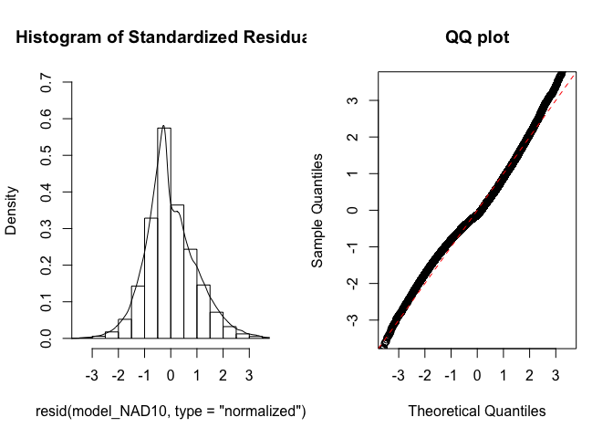
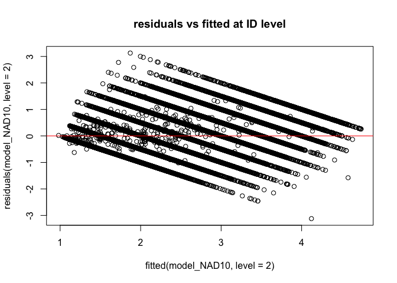
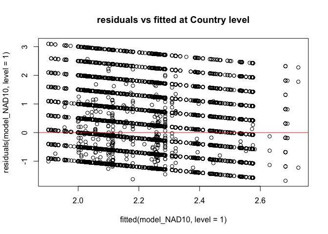
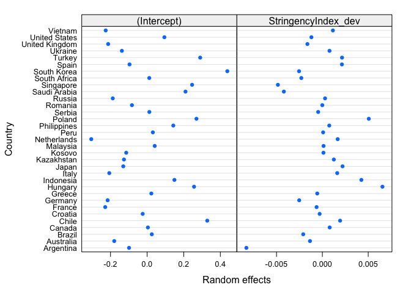
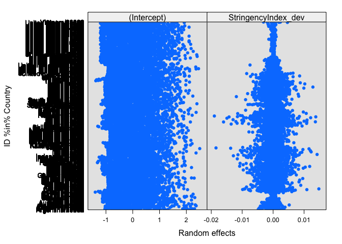
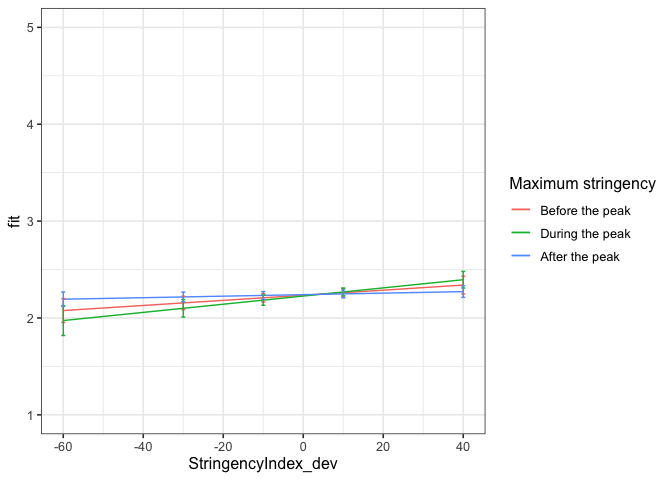

First analyses NAD
================
Anne Margit
9/22/2020

    ## [1] "500Gb"

``` r
load("data_analyse1_fc.Rdata")
```

This dataset includes:

1.  Data from all weekly measurement waves (baseline through wave 11,
    Time 1 through 12)
2.  Participants who provided at least 3 measurements
3.  Participants who are residents of the country they currently live in
4.  Participants who provided info on age
5.  Participants who provided info on gender (either male or female)
6.  Data from countries with at least 20 participants
7.  Pooled age groups
8.  Imputed missing emotion scores
9.  Combined emotion scores (NAA, NAD, PAA, PAD)
10. An imputed Stringency index (StringencyIndex\_imp)
11. A variable indicating the number of days before and after the day on
    which maximum stringency was reached for the respective country
    (DaysMax)
12. A variable indicating the number of weeks before and after the day
    on which maximum stringency was reached for the respective country
    (WeeksMax)
13. A variable indicating the date on which maximum Stringency was
    reached for that country (DateMaxStr)
14. A dummy Str\_dummy with 0 = before the peaj, 1 = during peak, 2 =
    after peak
15. Observations during which there was a second peak are excluded
    (N=583)

> My comments are in block quotes such as this.

``` r
library(dplyr)
library(tidyverse)
library(papaja)
library(ggpubr)
library(ggplot2)
library(rockchalk)
library(effects)
library(nlme)
library(lattice)
library(broom)
library(purrr)
```

# Regression models

**Negative affect low arousal**

*Stringency Index x dummy interaction: random intercept for
Country*

``` r
model_NAD1 <- lme(fixed = NAD ~ StringencyIndex_dev + Str_dummy +  StringencyIndex_dev*Str_dummy,
                   random = ~1 | Country, 
                  data = data_analyse1_fc, 
                  na.action = na.omit)

summary(model_NAD1)
```

    Linear mixed-effects model fit by REML
     Data: data_analyse1_fc 
           AIC      BIC    logLik
      163187.9 163259.6 -81585.95
    
    Random effects:
     Formula: ~1 | Country
            (Intercept)  Residual
    StdDev:   0.2317943 0.9944209
    
    Fixed effects: NAD ~ StringencyIndex_dev + Str_dummy + StringencyIndex_dev *      Str_dummy 
                                        Value  Std.Error    DF  t-value p-value
    (Intercept)                     2.2853828 0.04434078 57625 51.54133  0.0000
    StringencyIndex_dev             0.0059947 0.00220008 57625  2.72476  0.0064
    Str_dummy1                     -0.0267696 0.02462013 57625 -1.08731  0.2769
    Str_dummy2                     -0.0842108 0.01957669 57625 -4.30158  0.0000
    StringencyIndex_dev:Str_dummy1 -0.0029737 0.00290978 57625 -1.02195  0.3068
    StringencyIndex_dev:Str_dummy2 -0.0042786 0.00231659 57625 -1.84693  0.0648
     Correlation: 
                                   (Intr) StrnI_ Str_d1 Str_d2 SI_:S_1
    StringencyIndex_dev             0.102                             
    Str_dummy1                     -0.261 -0.274                      
    Str_dummy2                     -0.361 -0.229  0.574               
    StringencyIndex_dev:Str_dummy1 -0.094 -0.657 -0.272  0.256        
    StringencyIndex_dev:Str_dummy2 -0.099 -0.966  0.275  0.262  0.612 
    
    Standardized Within-Group Residuals:
           Min         Q1        Med         Q3        Max 
    -1.8708095 -0.8105641 -0.1684018  0.6978515  3.1913810 
    
    Number of Observations: 57663
    Number of Groups: 33 

*Stringency Index x dummy interaction: random intercept for
ID*

``` r
model_NAD2 <- lme(fixed = NAD ~ StringencyIndex_dev + Str_dummy +  StringencyIndex_dev*Str_dummy,
                  random = ~1 | ID, 
                 data = data_analyse1_fc, 
                 na.action = na.omit,
                 control = list(maxIter = 100, opt = "optim"))

summary(model_NAD2)
```

    Linear mixed-effects model fit by REML
     Data: data_analyse1_fc 
           AIC      BIC    logLik
      130216.8 130288.5 -65100.38
    
    Random effects:
     Formula: ~1 | ID
            (Intercept) Residual
    StdDev:   0.8087233  0.60836
    
    Fixed effects: NAD ~ StringencyIndex_dev + Str_dummy + StringencyIndex_dev *      Str_dummy 
                                        Value   Std.Error    DF   t-value p-value
    (Intercept)                     2.1887395 0.014049206 47315 155.79098  0.0000
    StringencyIndex_dev             0.0016303 0.001449750 47315   1.12455  0.2608
    Str_dummy1                      0.0333228 0.015100118 47315   2.20679  0.0273
    Str_dummy2                      0.0017826 0.012923980 47315   0.13793  0.8903
    StringencyIndex_dev:Str_dummy1 -0.0016938 0.001824653 47315  -0.92829  0.3533
    StringencyIndex_dev:Str_dummy2 -0.0005363 0.001514967 47315  -0.35397  0.7234
     Correlation: 
                                   (Intr) StrnI_ Str_d1 Str_d2 SI_:S_1
    StringencyIndex_dev             0.232                             
    Str_dummy1                     -0.672 -0.270                      
    Str_dummy2                     -0.741 -0.242  0.646               
    StringencyIndex_dev:Str_dummy1 -0.149 -0.727 -0.173  0.250        
    StringencyIndex_dev:Str_dummy2 -0.223 -0.967  0.265  0.274  0.690 
    
    Standardized Within-Group Residuals:
           Min         Q1        Med         Q3        Max 
    -5.4206903 -0.5492589 -0.1197313  0.5235835  5.3812441 
    
    Number of Observations: 57663
    Number of Groups: 10343 

> Bij NAD2 en NAD3 wilde hij niet convergen dus heb ik een max iteration
> toegevoegd

*Random intercept for Country and
ID*

``` r
model_NAD3 <- lme(fixed = NAD ~ StringencyIndex_dev + Str_dummy +  StringencyIndex_dev*Str_dummy,
                  random = ~1 | Country/ID, 
                  data = data_analyse1_fc, 
                  na.action = na.omit,
                  control = list(maxIter = 100, opt = "optim"))

summary(model_NAD3)
```

    Linear mixed-effects model fit by REML
     Data: data_analyse1_fc 
           AIC      BIC    logLik
      129935.8 130016.4 -64958.89
    
    Random effects:
     Formula: ~1 | Country
            (Intercept)
    StdDev:   0.2074869
    
     Formula: ~1 | ID %in% Country
            (Intercept)  Residual
    StdDev:   0.7934969 0.6082808
    
    Fixed effects: NAD ~ StringencyIndex_dev + Str_dummy + StringencyIndex_dev *      Str_dummy 
                                        Value  Std.Error    DF  t-value p-value
    (Intercept)                     2.2260146 0.04008416 47315 55.53353  0.0000
    StringencyIndex_dev             0.0031827 0.00146637 47315  2.17045  0.0300
    Str_dummy1                      0.0007458 0.01635432 47315  0.04560  0.9636
    Str_dummy2                      0.0133160 0.01312816 47315  1.01431  0.3104
    StringencyIndex_dev:Str_dummy1  0.0015415 0.00193161 47315  0.79803  0.4249
    StringencyIndex_dev:Str_dummy2 -0.0022957 0.00153561 47315 -1.49499  0.1349
     Correlation: 
                                   (Intr) StrnI_ Str_d1 Str_d2 SI_:S_1
    StringencyIndex_dev             0.078                             
    Str_dummy1                     -0.193 -0.286                      
    Str_dummy2                     -0.264 -0.234  0.574               
    StringencyIndex_dev:Str_dummy1 -0.071 -0.657 -0.264  0.263        
    StringencyIndex_dev:Str_dummy2 -0.076 -0.967  0.283  0.265  0.619 
    
    Standardized Within-Group Residuals:
           Min         Q1        Med         Q3        Max 
    -5.4312120 -0.5495242 -0.1178632  0.5196932  5.3999373 
    
    Number of Observations: 57663
    Number of Groups: 
            Country ID %in% Country 
                 33           10343 

*Random slope for
Country*

``` r
model_NAD4 <- lme(fixed = NAD ~ StringencyIndex_dev + Str_dummy +  StringencyIndex_dev*Str_dummy,
                  random = list (Country = ~StringencyIndex_dev, ID = ~1), 
                  data = data_analyse1_fc, 
                  na.action = na.omit)

summary(model_NAD4)
```

    Linear mixed-effects model fit by REML
     Data: data_analyse1_fc 
           AIC      BIC    logLik
      129905.2 130003.8 -64941.62
    
    Random effects:
     Formula: ~StringencyIndex_dev | Country
     Structure: General positive-definite, Log-Cholesky parametrization
                        StdDev      Corr  
    (Intercept)         0.205457780 (Intr)
    StringencyIndex_dev 0.005034893 0.065 
    
     Formula: ~1 | ID %in% Country
            (Intercept)  Residual
    StdDev:   0.7937248 0.6077532
    
    Fixed effects: NAD ~ StringencyIndex_dev + Str_dummy + StringencyIndex_dev *      Str_dummy 
                                        Value  Std.Error    DF  t-value p-value
    (Intercept)                     2.2240947 0.03989352 47315 55.75078  0.0000
    StringencyIndex_dev             0.0025978 0.00200215 47315  1.29749  0.1945
    Str_dummy1                      0.0048107 0.02041425 47315  0.23565  0.8137
    Str_dummy2                      0.0161450 0.01375560 47315  1.17371  0.2405
    StringencyIndex_dev:Str_dummy1  0.0011918 0.00243290 47315  0.48986  0.6242
    StringencyIndex_dev:Str_dummy2 -0.0019125 0.00192689 47315 -0.99252  0.3209
     Correlation: 
                                   (Intr) StrnI_ Str_d1 Str_d2 SI_:S_1
    StringencyIndex_dev             0.090                             
    Str_dummy1                     -0.189 -0.285                      
    Str_dummy2                     -0.271 -0.159  0.452               
    StringencyIndex_dev:Str_dummy1 -0.036 -0.462 -0.427  0.210        
    StringencyIndex_dev:Str_dummy2 -0.059 -0.801  0.152  0.222  0.660 
    
    Standardized Within-Group Residuals:
           Min         Q1        Med         Q3        Max 
    -5.4737293 -0.5490076 -0.1178493  0.5196809  5.4724039 
    
    Number of Observations: 57663
    Number of Groups: 
            Country ID %in% Country 
                 33           10343 

*Random slope for
ID*

``` r
model_NAD5 <- lme(fixed = NAD ~ StringencyIndex_dev + Str_dummy +  StringencyIndex_dev*Str_dummy,
                  random = list (Country = ~1, ID = ~StringencyIndex_dev), 
                  data = data_analyse1_fc, 
                  na.action = na.omit)

summary(model_NAD5)
```

    Linear mixed-effects model fit by REML
     Data: data_analyse1_fc 
           AIC      BIC    logLik
      129549.9 129648.5 -64763.97
    
    Random effects:
     Formula: ~1 | Country
            (Intercept)
    StdDev:   0.2088416
    
     Formula: ~StringencyIndex_dev | ID %in% Country
     Structure: General positive-definite, Log-Cholesky parametrization
                        StdDev     Corr  
    (Intercept)         0.79408750 (Intr)
    StringencyIndex_dev 0.01381034 -0.003
    Residual            0.59512956       
    
    Fixed effects: NAD ~ StringencyIndex_dev + Str_dummy + StringencyIndex_dev *      Str_dummy 
                                        Value  Std.Error    DF  t-value p-value
    (Intercept)                     2.2284738 0.04027413 47315 55.33263  0.0000
    StringencyIndex_dev             0.0043172 0.00160438 47315  2.69085  0.0071
    Str_dummy1                     -0.0061052 0.01671909 47315 -0.36516  0.7150
    Str_dummy2                      0.0137966 0.01311836 47315  1.05170  0.2929
    StringencyIndex_dev:Str_dummy1  0.0008712 0.00203594 47315  0.42789  0.6687
    StringencyIndex_dev:Str_dummy2 -0.0029016 0.00169475 47315 -1.71213  0.0869
     Correlation: 
                                   (Intr) StrnI_ Str_d1 Str_d2 SI_:S_1
    StringencyIndex_dev             0.074                             
    Str_dummy1                     -0.186 -0.298                      
    Str_dummy2                     -0.259 -0.222  0.541               
    StringencyIndex_dev:Str_dummy1 -0.067 -0.655 -0.269  0.266        
    StringencyIndex_dev:Str_dummy2 -0.072 -0.950  0.262  0.266  0.649 
    
    Standardized Within-Group Residuals:
           Min         Q1        Med         Q3        Max 
    -5.4062519 -0.5421458 -0.1151739  0.5105872  5.3940481 
    
    Number of Observations: 57663
    Number of Groups: 
            Country ID %in% Country 
                 33           10343 

*Random slope for Country and
ID*

``` r
model_NAD6 <- lme(fixed = NAD ~ StringencyIndex_dev + Str_dummy +  StringencyIndex_dev*Str_dummy,
                  random = ~StringencyIndex_dev | Country/ID, 
                  data = data_analyse1_fc, 
                  na.action = na.omit)

summary(model_NAD6)
```

    Linear mixed-effects model fit by REML
     Data: data_analyse1_fc 
         AIC      BIC    logLik
      129536 129652.5 -64754.98
    
    Random effects:
     Formula: ~StringencyIndex_dev | Country
     Structure: General positive-definite, Log-Cholesky parametrization
                        StdDev     Corr  
    (Intercept)         0.20620877 (Intr)
    StringencyIndex_dev 0.00460645 0.107 
    
     Formula: ~StringencyIndex_dev | ID %in% Country
     Structure: General positive-definite, Log-Cholesky parametrization
                        StdDev     Corr  
    (Intercept)         0.79423287 (Intr)
    StringencyIndex_dev 0.01358572 -0.002
    Residual            0.59503884       
    
    Fixed effects: NAD ~ StringencyIndex_dev + Str_dummy + StringencyIndex_dev *      Str_dummy 
                                        Value  Std.Error    DF  t-value p-value
    (Intercept)                     2.2276222 0.03996412 47315 55.74055  0.0000
    StringencyIndex_dev             0.0033162 0.00202072 47315  1.64107  0.1008
    Str_dummy1                      0.0001374 0.02014927 47315  0.00682  0.9946
    Str_dummy2                      0.0129102 0.01357410 47315  0.95109  0.3416
    StringencyIndex_dev:Str_dummy1  0.0006869 0.00241253 47315  0.28473  0.7758
    StringencyIndex_dev:Str_dummy2 -0.0024441 0.00195227 47315 -1.25192  0.2106
     Correlation: 
                                   (Intr) StrnI_ Str_d1 Str_d2 SI_:S_1
    StringencyIndex_dev             0.102                             
    Str_dummy1                     -0.184 -0.306                      
    Str_dummy2                     -0.267 -0.156  0.448               
    StringencyIndex_dev:Str_dummy1 -0.038 -0.474 -0.409  0.215        
    StringencyIndex_dev:Str_dummy2 -0.059 -0.818  0.175  0.220  0.659 
    
    Standardized Within-Group Residuals:
           Min         Q1        Med         Q3        Max 
    -5.4484462 -0.5419304 -0.1165809  0.5130181  5.3926735 
    
    Number of Observations: 57663
    Number of Groups: 
            Country ID %in% Country 
                 33           10343 

*No correlation between intercept and slope for
Country*

``` r
model_NAD7 <- lme(fixed = NAD ~ StringencyIndex_dev + Str_dummy +  StringencyIndex_dev*Str_dummy,
                  random = list(Country = pdDiag(~StringencyIndex_dev), ID = ~StringencyIndex_dev), 
                  data = data_analyse1_fc, 
                  na.action = na.omit)

summary(model_NAD7)
```

    Linear mixed-effects model fit by REML
     Data: data_analyse1_fc 
           AIC      BIC    logLik
      129534.1 129641.6 -64755.05
    
    Random effects:
     Formula: ~StringencyIndex_dev | Country
     Structure: Diagonal
            (Intercept) StringencyIndex_dev
    StdDev:   0.2075278         0.004696764
    
     Formula: ~StringencyIndex_dev | ID %in% Country
     Structure: General positive-definite, Log-Cholesky parametrization
                        StdDev     Corr  
    (Intercept)         0.79422107 (Intr)
    StringencyIndex_dev 0.01358298 -0.002
    Residual            0.59503668       
    
    Fixed effects: NAD ~ StringencyIndex_dev + Str_dummy + StringencyIndex_dev *      Str_dummy 
                                        Value  Std.Error    DF  t-value p-value
    (Intercept)                     2.2276811 0.04018282 47315 55.43865  0.0000
    StringencyIndex_dev             0.0033684 0.00203257 47315  1.65721  0.0975
    Str_dummy1                      0.0005504 0.02016788 47315  0.02729  0.9782
    Str_dummy2                      0.0132331 0.01358393 47315  0.97418  0.3300
    StringencyIndex_dev:Str_dummy1  0.0005275 0.00241688 47315  0.21824  0.8272
    StringencyIndex_dev:Str_dummy2 -0.0026037 0.00195920 47315 -1.32898  0.1839
     Correlation: 
                                   (Intr) StrnI_ Str_d1 Str_d2 SI_:S_1
    StringencyIndex_dev             0.062                             
    Str_dummy1                     -0.185 -0.304                      
    Str_dummy2                     -0.266 -0.155  0.449               
    StringencyIndex_dev:Str_dummy1 -0.037 -0.473 -0.409  0.213        
    StringencyIndex_dev:Str_dummy2 -0.059 -0.816  0.173  0.217  0.661 
    
    Standardized Within-Group Residuals:
           Min         Q1        Med         Q3        Max 
    -5.4505726 -0.5420100 -0.1164607  0.5128617  5.3945559 
    
    Number of Observations: 57663
    Number of Groups: 
            Country ID %in% Country 
                 33           10343 

*No correlation between intercept and slope for
ID*

``` r
model_NAD8 <- lme(fixed = NAD ~ StringencyIndex_dev + Str_dummy +  StringencyIndex_dev*Str_dummy,
                  random = list (Country = ~StringencyIndex_dev, ID = pdDiag(~StringencyIndex_dev)), 
                  data = data_analyse1_fc, 
                  na.action = na.omit)

summary(model_NAD8)
```

    Linear mixed-effects model fit by REML
     Data: data_analyse1_fc 
         AIC      BIC    logLik
      129534 129641.5 -64754.98
    
    Random effects:
     Formula: ~StringencyIndex_dev | Country
     Structure: General positive-definite, Log-Cholesky parametrization
                        StdDev     Corr  
    (Intercept)         0.20622303 (Intr)
    StringencyIndex_dev 0.00460749 0.107 
    
     Formula: ~StringencyIndex_dev | ID %in% Country
     Structure: Diagonal
            (Intercept) StringencyIndex_dev  Residual
    StdDev:   0.7942138          0.01358521 0.5950389
    
    Fixed effects: NAD ~ StringencyIndex_dev + Str_dummy + StringencyIndex_dev *      Str_dummy 
                                        Value  Std.Error    DF  t-value p-value
    (Intercept)                     2.2276271 0.03996642 47315 55.73747  0.0000
    StringencyIndex_dev             0.0033151 0.00202079 47315  1.64051  0.1009
    Str_dummy1                      0.0001458 0.02014984 47315  0.00724  0.9942
    Str_dummy2                      0.0129037 0.01357414 47315  0.95061  0.3418
    StringencyIndex_dev:Str_dummy1  0.0006864 0.00241263 47315  0.28449  0.7760
    StringencyIndex_dev:Str_dummy2 -0.0024422 0.00195229 47315 -1.25094  0.2110
     Correlation: 
                                   (Intr) StrnI_ Str_d1 Str_d2 SI_:S_1
    StringencyIndex_dev             0.102                             
    Str_dummy1                     -0.184 -0.306                      
    Str_dummy2                     -0.267 -0.156  0.448               
    StringencyIndex_dev:Str_dummy1 -0.038 -0.473 -0.409  0.215        
    StringencyIndex_dev:Str_dummy2 -0.059 -0.818  0.175  0.220  0.659 
    
    Standardized Within-Group Residuals:
           Min         Q1        Med         Q3        Max 
    -5.4478549 -0.5420042 -0.1165008  0.5130068  5.3926839 
    
    Number of Observations: 57663
    Number of Groups: 
            Country ID %in% Country 
                 33           10343 

*No correlation between intercept and slope for Country and
ID*

``` r
model_NAD9 <- lme(fixed = NAD ~ StringencyIndex_dev + Str_dummy +  StringencyIndex_dev*Str_dummy,
                  random = list (Country = pdDiag(~StringencyIndex_dev), ID = pdDiag(~StringencyIndex_dev)),
                  data = data_analyse1_fc, 
                  na.action = na.omit)

summary(model_NAD9)
```

    Linear mixed-effects model fit by REML
     Data: data_analyse1_fc 
           AIC      BIC    logLik
      129532.1 129630.7 -64755.05
    
    Random effects:
     Formula: ~StringencyIndex_dev | Country
     Structure: Diagonal
            (Intercept) StringencyIndex_dev
    StdDev:   0.2075115         0.004698022
    
     Formula: ~StringencyIndex_dev | ID %in% Country
     Structure: Diagonal
            (Intercept) StringencyIndex_dev  Residual
    StdDev:   0.7942085          0.01358234 0.5950363
    
    Fixed effects: NAD ~ StringencyIndex_dev + Str_dummy + StringencyIndex_dev *      Str_dummy 
                                        Value  Std.Error    DF  t-value p-value
    (Intercept)                     2.2276828 0.04018024 47315 55.44225  0.0000
    StringencyIndex_dev             0.0033673 0.00203266 47315  1.65659  0.0976
    Str_dummy1                      0.0005580 0.02016865 47315  0.02766  0.9779
    Str_dummy2                      0.0132262 0.01358396 47315  0.97367  0.3302
    StringencyIndex_dev:Str_dummy1  0.0005273 0.00241700 47315  0.21815  0.8273
    StringencyIndex_dev:Str_dummy2 -0.0026016 0.00195923 47315 -1.32789  0.1842
     Correlation: 
                                   (Intr) StrnI_ Str_d1 Str_d2 SI_:S_1
    StringencyIndex_dev             0.062                             
    Str_dummy1                     -0.185 -0.304                      
    Str_dummy2                     -0.266 -0.155  0.449               
    StringencyIndex_dev:Str_dummy1 -0.037 -0.473 -0.409  0.213        
    StringencyIndex_dev:Str_dummy2 -0.059 -0.816  0.173  0.217  0.661 
    
    Standardized Within-Group Residuals:
           Min         Q1        Med         Q3        Max 
    -5.4500434 -0.5420104 -0.1164327  0.5127057  5.3945670 
    
    Number of Observations: 57663
    Number of Groups: 
            Country ID %in% Country 
                 33           10343 

*Autoregressive correlation
structure*

``` r
data_analyse1_fc <- data_analyse1_fc[with(data_analyse1_fc, order(Country, ID, Time)),]
data_analyse1_fc$Time <- as.numeric(data_analyse1_fc$Time)

model_NAD10 <- lme(fixed = NAD ~ StringencyIndex_dev + Str_dummy +  StringencyIndex_dev*Str_dummy,
                   random = list (Country = pdDiag(~StringencyIndex_dev), ID = pdDiag(~StringencyIndex_dev)),
                  data = data_analyse1_fc, 
                  na.action = na.omit,
                  correlation = corAR1(form = ~ Time | Country/ID))

summary(model_NAD10)
```

    Linear mixed-effects model fit by REML
     Data: data_analyse1_fc 
           AIC      BIC    logLik
      128184.2 128291.8 -64080.12
    
    Random effects:
     Formula: ~StringencyIndex_dev | Country
     Structure: Diagonal
            (Intercept) StringencyIndex_dev
    StdDev:   0.2046101         0.003966735
    
     Formula: ~StringencyIndex_dev | ID %in% Country
     Structure: Diagonal
            (Intercept) StringencyIndex_dev  Residual
    StdDev:   0.7734885         0.008486959 0.6281438
    
    Correlation Structure: ARMA(1,0)
     Formula: ~Time | Country/ID 
     Parameter estimate(s):
        Phi1 
    0.288995 
    Fixed effects: NAD ~ StringencyIndex_dev + Str_dummy + StringencyIndex_dev *      Str_dummy 
                                        Value  Std.Error    DF  t-value p-value
    (Intercept)                     2.2342342 0.03990613 47315 55.98724  0.0000
    StringencyIndex_dev             0.0026315 0.00198068 47315  1.32857  0.1840
    Str_dummy1                     -0.0080809 0.02051732 47315 -0.39386  0.6937
    Str_dummy2                      0.0063142 0.01467340 47315  0.43032  0.6670
    StringencyIndex_dev:Str_dummy1  0.0015840 0.00246769 47315  0.64192  0.5209
    StringencyIndex_dev:Str_dummy2 -0.0018479 0.00198735 47315 -0.92984  0.3525
     Correlation: 
                                   (Intr) StrnI_ Str_d1 Str_d2 SI_:S_1
    StringencyIndex_dev             0.069                             
    Str_dummy1                     -0.196 -0.303                      
    Str_dummy2                     -0.284 -0.163  0.460               
    StringencyIndex_dev:Str_dummy1 -0.050 -0.501 -0.388  0.229        
    StringencyIndex_dev:Str_dummy2 -0.066 -0.844  0.187  0.225  0.653 
    
    Standardized Within-Group Residuals:
           Min         Q1        Med         Q3        Max 
    -4.9696783 -0.5523596 -0.1427175  0.5048638  4.9807858 
    
    Number of Observations: 57663
    Number of Groups: 
            Country ID %in% Country 
                 33           10343 

*AR without random slope for
country*

``` r
model_NAD11 <- lme(fixed = NAD ~ StringencyIndex_dev + Str_dummy +  StringencyIndex_dev*Str_dummy,
                  random = list (Country = ~1, ID = pdDiag(~StringencyIndex_dev)), 
                  data = data_analyse1_fc, 
                  na.action = na.omit,
                  correlation = corAR1(form = ~ Time | Country/ID))

summary(model_NAD11)
```

    Linear mixed-effects model fit by REML
     Data: data_analyse1_fc 
           AIC      BIC    logLik
      128194.6 128293.1 -64086.28
    
    Random effects:
     Formula: ~1 | Country
            (Intercept)
    StdDev:   0.2060128
    
     Formula: ~StringencyIndex_dev | ID %in% Country
     Structure: Diagonal
            (Intercept) StringencyIndex_dev  Residual
    StdDev:   0.7732692         0.008666917 0.6284473
    
    Correlation Structure: ARMA(1,0)
     Formula: ~Time | Country/ID 
     Parameter estimate(s):
         Phi1 
    0.2897732 
    Fixed effects: NAD ~ StringencyIndex_dev + Str_dummy + StringencyIndex_dev *      Str_dummy 
                                        Value  Std.Error    DF  t-value p-value
    (Intercept)                     2.2332196 0.04000508 47315 55.82339  0.0000
    StringencyIndex_dev             0.0033995 0.00160327 47315  2.12034  0.0340
    Str_dummy1                     -0.0101006 0.01741714 47315 -0.57993  0.5620
    Str_dummy2                      0.0076306 0.01414364 47315  0.53951  0.5895
    StringencyIndex_dev:Str_dummy1  0.0016794 0.00208428 47315  0.80573  0.4204
    StringencyIndex_dev:Str_dummy2 -0.0022756 0.00169469 47315 -1.34279  0.1793
     Correlation: 
                                   (Intr) StrnI_ Str_d1 Str_d2 SI_:S_1
    StringencyIndex_dev             0.082                             
    Str_dummy1                     -0.199 -0.302                      
    Str_dummy2                     -0.277 -0.227  0.546               
    StringencyIndex_dev:Str_dummy1 -0.079 -0.648 -0.262  0.275        
    StringencyIndex_dev:Str_dummy2 -0.080 -0.956  0.283  0.266  0.624 
    
    Standardized Within-Group Residuals:
           Min         Q1        Med         Q3        Max 
    -4.9347004 -0.5513924 -0.1449764  0.5063016  4.9772796 
    
    Number of Observations: 57663
    Number of Groups: 
            Country ID %in% Country 
                 33           10343 

> Model NAD10 has the best fit (lowest BIC). This model has random
> slopes fo Stringency at the Country and ID level, assumes no
> correlation between random slope and intercept, and assumes
> autoregressive correlation structure at the measurement level.

*QQ plot of residuals*

``` r
par(mfrow = c(1,2))
lims <- c(-3.5,3.5)
hist(resid(model_NAD10, type = "normalized"),
freq = FALSE, xlim = lims, ylim =  c(0,.7),main = "Histogram of Standardized Residuals")
lines(density(scale(resid(model_NAD10))))
qqnorm(resid(model_NAD10, type = "normalized"),
xlim = lims, ylim = lims,main = "QQ plot")
abline(0,1, col = "red", lty = 2)
```

<!-- -->

*Residuals vs fitted*

``` r
plot(fitted(model_NAD10, level=2), residuals(model_NAD10, level=2), 
     main="residuals vs fitted at ID level")
abline(a=0, b=0,col="red")
```

<!-- -->

``` r
plot(fitted(model_NAD10, level=1), residuals(model_NAD10, level=1), 
    main="residuals vs fitted at Country level")
abline(a=0, b=0,col="red")
```

<!-- -->

*Plot random intercepts and slopes*

``` r
plot(ranef(model_NAD10, level = 1))
```

<!-- -->

``` r
plot(ranef(model_NAD10, level = 2))
```

<!-- -->

*Confidence intervals*

``` r
intervals(model_NAD10)
```

    Approximate 95% confidence intervals
    
     Fixed effects:
                                          lower         est.       upper
    (Intercept)                     2.156017572  2.234234158 2.312450745
    StringencyIndex_dev            -0.001250684  0.002631480 0.006513644
    Str_dummy1                     -0.048295118 -0.008080879 0.032133359
    Str_dummy2                     -0.022445835  0.006314246 0.035074326
    StringencyIndex_dev:Str_dummy1 -0.003252659  0.001584049 0.006420757
    StringencyIndex_dev:Str_dummy2 -0.005743134 -0.001847906 0.002047322
    attr(,"label")
    [1] "Fixed effects:"
    
     Random Effects:
      Level: Country 
                                  lower        est.       upper
    sd((Intercept))         0.148608600 0.204610058 0.281715027
    sd(StringencyIndex_dev) 0.002257172 0.003966735 0.006971107
      Level: ID 
                                  lower        est.     upper
    sd((Intercept))         0.760716633 0.773488497 0.7864748
    sd(StringencyIndex_dev) 0.007273032 0.008486959 0.0099035
    
     Correlation structure:
             lower     est.     upper
    Phi1 0.2743463 0.288995 0.3035097
    attr(,"label")
    [1] "Correlation structure:"
    
     Within-group standard error:
        lower      est.     upper 
    0.6229062 0.6281438 0.6334253 

*Plot of predicted values*

``` r
ef_NAD <- effect("StringencyIndex_dev:Str_dummy", model_NAD10)

plot_NAD <- ggplot(as.data.frame(ef_NAD), 
       aes(StringencyIndex_dev, fit, color=Str_dummy)) + geom_line() + 
  geom_errorbar(aes(ymin=fit-se, ymax=fit+se), width=1) + theme_bw(base_size=12) + scale_color_discrete(name="Maximum stringency", labels = c("Before the peak", "During the peak", "After the peak")) + expand_limits(y=c(1, 5))
```

``` r
plot_NAD
```

<!-- -->

``` r
coef_NAD = tidy(model_NAD10, 
               effects = "fixed")
```

*Effect sizes* **Within person SD and average within person SD**

``` r
load("ISDs_av.Rdata")
```

> Effect size = (regression coefficient \* average ISD of X) / average
> ISD of Y)

> For the intercept and the dummy variables (+ interaction) I only
> standardized Y, so the effect size = (regression coefficient / average
> ISD of Y)

``` r
coef_NAD <- coef_NAD %>%
 left_join(., ISDs_av, by=c("term"="ind"))

coef_NAD <- coef_NAD %>%
  mutate(sd = ifelse(is.na(sd), 1, sd))

coef_NAD <- coef_NAD %>%
 mutate(e_size = (estimate * sd)/0.5319464)

coef_NAD <- coef_NAD %>%
  rename(isd = sd)
```

``` r
coef_NAD
```

    ## # A tibble: 6 x 7
    ##   term                           estimate std.error statistic p.value   isd   e_size
    ##   <chr>                             <dbl>     <dbl>     <dbl>   <dbl> <dbl>    <dbl>
    ## 1 (Intercept)                     2.23      0.0399     56.0     0      1     4.20   
    ## 2 StringencyIndex_dev             0.00263   0.00198     1.33    0.184  6.12  0.0303 
    ## 3 Str_dummy1                     -0.00808   0.0205     -0.394   0.694  1    -0.0152 
    ## 4 Str_dummy2                      0.00631   0.0147      0.430   0.667  1     0.0119 
    ## 5 StringencyIndex_dev:Str_dummy1  0.00158   0.00247     0.642   0.521  1     0.00298
    ## 6 StringencyIndex_dev:Str_dummy2 -0.00185   0.00199    -0.930   0.352  1    -0.00347
