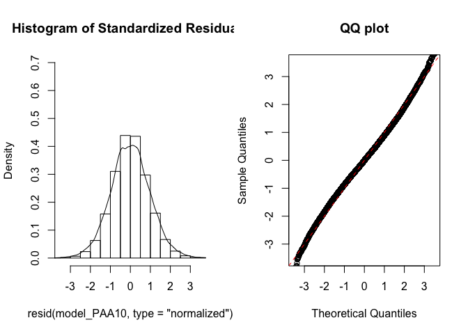
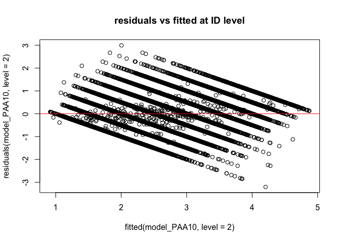
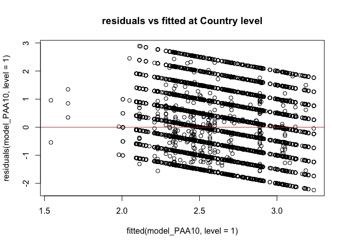
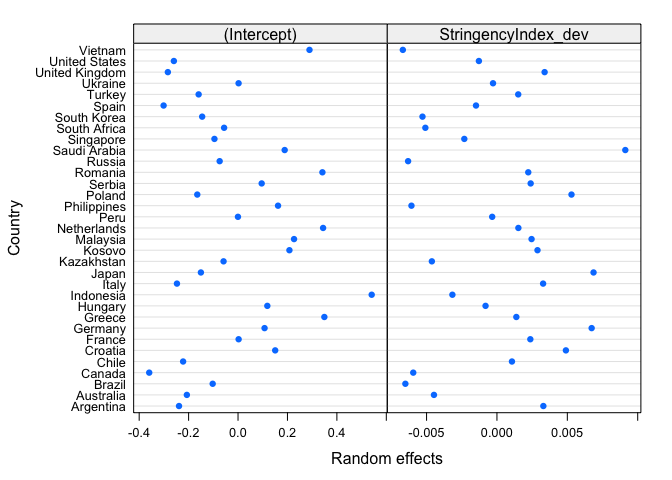
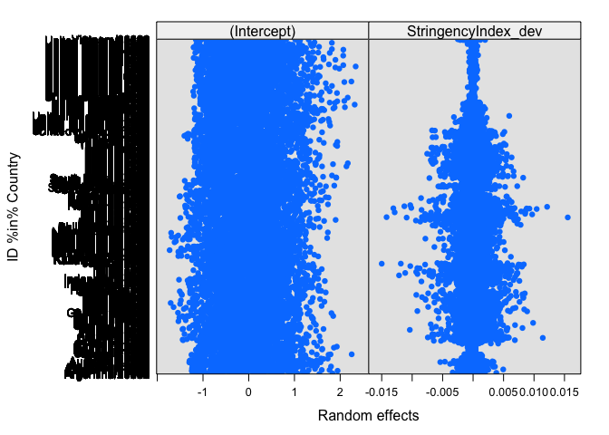
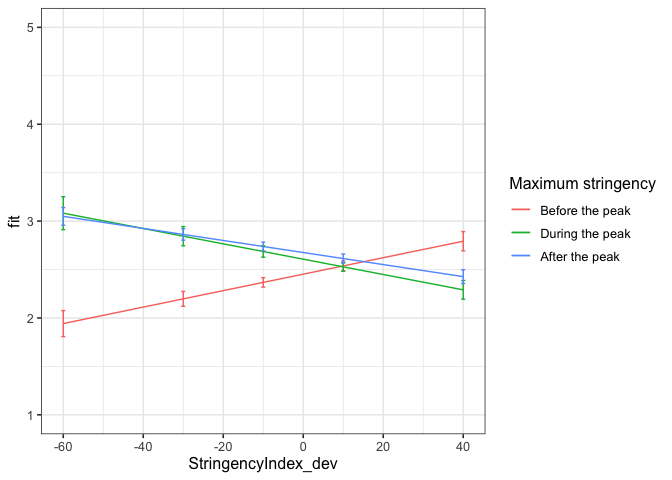

First analyses PAA
================
Anne Margit
9/22/2020

    ## [1] "500Gb"

``` r
load("data_analyse1_fc.Rdata")
```

This dataset includes:

1.  Data from all weekly measurement waves (baseline through wave 11,
    Time 1 through 12)
2.  Participants who provided at least 3 measurements
3.  Participants who are residents of the country they currently live in
4.  Participants who provided info on age
5.  Participants who provided info on gender (either male or female)
6.  Data from countries with at least 20 participants
7.  Pooled age groups
8.  Imputed missing emotion scores
9.  Combined emotion scores (NAA, NAD, PAA, PAD)
10. An imputed Stringency index (StringencyIndex\_imp)
11. A variable indicating the number of days before and after the day on
    which maximum stringency was reached for the respective country
    (DaysMax)
12. A variable indicating the number of weeks before and after the day
    on which maximum stringency was reached for the respective country
    (WeeksMax)
13. A variable indicating the date on which maximum Stringency was
    reached for that country (DateMaxStr)
14. A dummy Str\_dummy with 0 = before the peaj, 1 = during peak, 2 =
    after peak
15. Observations during which there was a second peak are excluded
    (N=583)

> My comments are in block quotes such as this.

``` r
library(dplyr)
library(tidyverse)
library(papaja)
library(ggpubr)
library(ggplot2)
library(rockchalk)
library(effects)
library(nlme)
library(lattice)
library(broom)
library(purrr)
```

# Regression models

**Positive affect high arousal**

*Stringency Index x dummy interaction: random intercept for
Country*

``` r
model_PAA1 <- lme(fixed = PAA ~ StringencyIndex_dev + Str_dummy +  StringencyIndex_dev*Str_dummy,
                   random = ~1 | Country, 
                  data = data_analyse1_fc, 
                  na.action = na.omit)

summary(model_PAA1)
```

    Linear mixed-effects model fit by REML
     Data: data_analyse1_fc 
           AIC      BIC    logLik
      156867.1 156938.8 -78425.55
    
    Random effects:
     Formula: ~1 | Country
            (Intercept) Residual
    StdDev:   0.2416479 0.941331
    
    Fixed effects: PAA ~ StringencyIndex_dev + Str_dummy + StringencyIndex_dev *      Str_dummy 
                                        Value  Std.Error    DF  t-value p-value
    (Intercept)                     2.4693535 0.04553262 57625 54.23263       0
    StringencyIndex_dev             0.0100165 0.00208320 57625  4.80821       0
    Str_dummy1                      0.1168331 0.02332101 57625  5.00978       0
    Str_dummy2                      0.2174216 0.01854131 57625 11.72633       0
    StringencyIndex_dev:Str_dummy1 -0.0132577 0.00275590 57625 -4.81067       0
    StringencyIndex_dev:Str_dummy2 -0.0139788 0.00219361 57625 -6.37252       0
     Correlation: 
                                   (Intr) StrnI_ Str_d1 Str_d2 SI_:S_1
    StringencyIndex_dev             0.094                             
    Str_dummy1                     -0.240 -0.275                      
    Str_dummy2                     -0.333 -0.229  0.574               
    StringencyIndex_dev:Str_dummy1 -0.087 -0.656 -0.273  0.256        
    StringencyIndex_dev:Str_dummy2 -0.091 -0.966  0.275  0.262  0.612 
    
    Standardized Within-Group Residuals:
            Min          Q1         Med          Q3         Max 
    -2.34562507 -0.82944468  0.03690769  0.68333926  3.24256318 
    
    Number of Observations: 57663
    Number of Groups: 33 

*Stringency Index x dummy interaction: random intercept for
ID*

``` r
model_PAA2 <- lme(fixed = PAA ~ StringencyIndex_dev + Str_dummy +  StringencyIndex_dev*Str_dummy,
                  random = ~1 | ID, 
                 data = data_analyse1_fc, 
                 na.action = na.omit)

summary(model_PAA2)
```

    Linear mixed-effects model fit by REML
     Data: data_analyse1_fc 
           AIC      BIC    logLik
      128885.4 128957.1 -64434.69
    
    Random effects:
     Formula: ~1 | ID
            (Intercept)  Residual
    StdDev:   0.7544817 0.6079846
    
    Fixed effects: PAA ~ StringencyIndex_dev + Str_dummy + StringencyIndex_dev *      Str_dummy 
                                        Value   Std.Error    DF   t-value p-value
    (Intercept)                     2.4075949 0.013716150 47315 175.52993   0.000
    StringencyIndex_dev             0.0095801 0.001444438 47315   6.63239   0.000
    Str_dummy1                      0.0668125 0.014946929 47315   4.46998   0.000
    Str_dummy2                      0.2335549 0.012867680 47315  18.15050   0.000
    StringencyIndex_dev:Str_dummy1 -0.0046034 0.001810457 47315  -2.54266   0.011
    StringencyIndex_dev:Str_dummy2 -0.0139349 0.001509209 47315  -9.23323   0.000
     Correlation: 
                                   (Intr) StrnI_ Str_d1 Str_d2 SI_:S_1
    StringencyIndex_dev             0.236                             
    Str_dummy1                     -0.688 -0.269                      
    Str_dummy2                     -0.757 -0.243  0.653               
    StringencyIndex_dev:Str_dummy1 -0.154 -0.733 -0.165  0.248        
    StringencyIndex_dev:Str_dummy2 -0.227 -0.967  0.264  0.275  0.696 
    
    Standardized Within-Group Residuals:
             Min           Q1          Med           Q3          Max 
    -5.206445452 -0.577880523 -0.003684485  0.581332083  5.219882221 
    
    Number of Observations: 57663
    Number of Groups: 10343 

*Random intercept for Country and
ID*

``` r
model_PAA3 <- lme(fixed = PAA ~ StringencyIndex_dev + Str_dummy +  StringencyIndex_dev*Str_dummy,
                  random = ~1 | Country/ID, 
                  data = data_analyse1_fc, 
                  na.action = na.omit)

summary(model_PAA3)
```

    Linear mixed-effects model fit by REML
     Data: data_analyse1_fc 
           AIC      BIC    logLik
      128003.1 128083.7 -63992.54
    
    Random effects:
     Formula: ~1 | Country
            (Intercept)
    StdDev:   0.2360505
    
     Formula: ~1 | ID %in% Country
            (Intercept)  Residual
    StdDev:   0.7163557 0.6077335
    
    Fixed effects: PAA ~ StringencyIndex_dev + Str_dummy + StringencyIndex_dev *      Str_dummy 
                                        Value  Std.Error    DF  t-value p-value
    (Intercept)                     2.4637790 0.04435966 47315 55.54098       0
    StringencyIndex_dev             0.0088039 0.00146155 47315  6.02367       0
    Str_dummy1                      0.1256755 0.01630862 47315  7.70607       0
    Str_dummy2                      0.2169365 0.01308636 47315 16.57729       0
    StringencyIndex_dev:Str_dummy1 -0.0126795 0.00192588 47315 -6.58372       0
    StringencyIndex_dev:Str_dummy2 -0.0127311 0.00153087 47315 -8.31626       0
     Correlation: 
                                   (Intr) StrnI_ Str_d1 Str_d2 SI_:S_1
    StringencyIndex_dev             0.070                             
    Str_dummy1                     -0.173 -0.285                      
    Str_dummy2                     -0.238 -0.234  0.573               
    StringencyIndex_dev:Str_dummy1 -0.064 -0.657 -0.265  0.263        
    StringencyIndex_dev:Str_dummy2 -0.069 -0.967  0.283  0.264  0.618 
    
    Standardized Within-Group Residuals:
             Min           Q1          Med           Q3          Max 
    -5.249301859 -0.578663504 -0.007136345  0.579866886  5.172775248 
    
    Number of Observations: 57663
    Number of Groups: 
            Country ID %in% Country 
                 33           10343 

*Random slope for
Country*

``` r
model_PAA4 <- lme(fixed = PAA ~ StringencyIndex_dev + Str_dummy +  StringencyIndex_dev*Str_dummy,
                  random = list (Country = ~StringencyIndex_dev, ID = ~1), 
                  data = data_analyse1_fc, 
                  na.action = na.omit)

summary(model_PAA4)
```

    Linear mixed-effects model fit by REML
     Data: data_analyse1_fc 
           AIC      BIC    logLik
      127955.7 128054.3 -63966.86
    
    Random effects:
     Formula: ~StringencyIndex_dev | Country
     Structure: General positive-definite, Log-Cholesky parametrization
                        StdDev      Corr  
    (Intercept)         0.237367485 (Intr)
    StringencyIndex_dev 0.007164006 0.116 
    
     Formula: ~1 | ID %in% Country
            (Intercept)  Residual
    StdDev:   0.7161877 0.6070631
    
    Fixed effects: PAA ~ StringencyIndex_dev + Str_dummy + StringencyIndex_dev *      Str_dummy 
                                        Value  Std.Error    DF  t-value p-value
    (Intercept)                     2.4503584 0.04473148 47315 54.77928       0
    StringencyIndex_dev             0.0093627 0.00224650 47315  4.16768       0
    Str_dummy1                      0.1573302 0.02156952 47315  7.29410       0
    Str_dummy2                      0.2300729 0.01381752 47315 16.65082       0
    StringencyIndex_dev:Str_dummy1 -0.0180138 0.00255183 47315 -7.05918       0
    StringencyIndex_dev:Str_dummy2 -0.0161606 0.00198805 47315 -8.12885       0
     Correlation: 
                                   (Intr) StrnI_ Str_d1 Str_d2 SI_:S_1
    StringencyIndex_dev             0.112                             
    Str_dummy1                     -0.170 -0.260                      
    Str_dummy2                     -0.244 -0.140  0.443               
    StringencyIndex_dev:Str_dummy1 -0.021 -0.403 -0.469  0.183        
    StringencyIndex_dev:Str_dummy2 -0.047 -0.727  0.117  0.205  0.665 
    
    Standardized Within-Group Residuals:
             Min           Q1          Med           Q3          Max 
    -5.255739804 -0.579768674 -0.005936729  0.580302253  5.187548720 
    
    Number of Observations: 57663
    Number of Groups: 
            Country ID %in% Country 
                 33           10343 

*Random slope for
ID*

``` r
model_PAA5 <- lme(fixed = PAA ~ StringencyIndex_dev + Str_dummy +  StringencyIndex_dev*Str_dummy,
                  random = list (Country = ~1, ID = ~StringencyIndex_dev), 
                  data = data_analyse1_fc, 
                  na.action = na.omit)

summary(model_PAA5)
```

    Linear mixed-effects model fit by REML
     Data: data_analyse1_fc 
           AIC      BIC    logLik
      127638.9 127737.5 -63808.44
    
    Random effects:
     Formula: ~1 | Country
            (Intercept)
    StdDev:   0.2371992
    
     Formula: ~StringencyIndex_dev | ID %in% Country
     Structure: General positive-definite, Log-Cholesky parametrization
                        StdDev     Corr  
    (Intercept)         0.71719682 (Intr)
    StringencyIndex_dev 0.01351065 -0.058
    Residual            0.59515230       
    
    Fixed effects: PAA ~ StringencyIndex_dev + Str_dummy + StringencyIndex_dev *      Str_dummy 
                                        Value  Std.Error    DF  t-value p-value
    (Intercept)                     2.4615954 0.04452255 47315 55.28874       0
    StringencyIndex_dev             0.0091585 0.00159694 47315  5.73505       0
    Str_dummy1                      0.1363532 0.01667140 47315  8.17887       0
    Str_dummy2                      0.2179552 0.01308318 47315 16.65919       0
    StringencyIndex_dev:Str_dummy1 -0.0142766 0.00202775 47315 -7.04059       0
    StringencyIndex_dev:Str_dummy2 -0.0136901 0.00168729 47315 -8.11363       0
     Correlation: 
                                   (Intr) StrnI_ Str_d1 Str_d2 SI_:S_1
    StringencyIndex_dev             0.065                             
    Str_dummy1                     -0.168 -0.297                      
    Str_dummy2                     -0.234 -0.221  0.541               
    StringencyIndex_dev:Str_dummy1 -0.060 -0.655 -0.270  0.265        
    StringencyIndex_dev:Str_dummy2 -0.064 -0.950  0.261  0.265  0.648 
    
    Standardized Within-Group Residuals:
             Min           Q1          Med           Q3          Max 
    -5.365261199 -0.568135084 -0.007985394  0.570376369  5.255910550 
    
    Number of Observations: 57663
    Number of Groups: 
            Country ID %in% Country 
                 33           10343 

*Random slope for Country and
ID*

``` r
model_PAA6 <- lme(fixed = PAA ~ StringencyIndex_dev + Str_dummy +  StringencyIndex_dev*Str_dummy,
                  random = ~StringencyIndex_dev | Country/ID, 
                  data = data_analyse1_fc, 
                  na.action = na.omit)

summary(model_PAA6)
```

    Linear mixed-effects model fit by REML
     Data: data_analyse1_fc 
           AIC      BIC    logLik
      127614.1 127730.6 -63794.03
    
    Random effects:
     Formula: ~StringencyIndex_dev | Country
     Structure: General positive-definite, Log-Cholesky parametrization
                        StdDev      Corr  
    (Intercept)         0.237935725 (Intr)
    StringencyIndex_dev 0.006757476 0.079 
    
     Formula: ~StringencyIndex_dev | ID %in% Country
     Structure: General positive-definite, Log-Cholesky parametrization
                        StdDev     Corr  
    (Intercept)         0.71698327 (Intr)
    StringencyIndex_dev 0.01325328 -0.053
    Residual            0.59497128       
    
    Fixed effects: PAA ~ StringencyIndex_dev + Str_dummy + StringencyIndex_dev *      Str_dummy 
                                        Value  Std.Error    DF  t-value p-value
    (Intercept)                     2.4498047 0.04478950 47315 54.69596       0
    StringencyIndex_dev             0.0095593 0.00225750 47315  4.23446       0
    Str_dummy1                      0.1549232 0.02141501 47315  7.23433       0
    Str_dummy2                      0.2322708 0.01365808 47315 17.00611       0
    StringencyIndex_dev:Str_dummy1 -0.0177327 0.00253404 47315 -6.99777       0
    StringencyIndex_dev:Str_dummy2 -0.0161039 0.00201545 47315 -7.99021       0
     Correlation: 
                                   (Intr) StrnI_ Str_d1 Str_d2 SI_:S_1
    StringencyIndex_dev             0.089                             
    Str_dummy1                     -0.167 -0.283                      
    Str_dummy2                     -0.241 -0.136  0.437               
    StringencyIndex_dev:Str_dummy1 -0.022 -0.410 -0.454  0.185        
    StringencyIndex_dev:Str_dummy2 -0.047 -0.746  0.140  0.199  0.662 
    
    Standardized Within-Group Residuals:
             Min           Q1          Med           Q3          Max 
    -5.369965174 -0.568622415 -0.008449026  0.569988471  5.268108028 
    
    Number of Observations: 57663
    Number of Groups: 
            Country ID %in% Country 
                 33           10343 

*No correlation between intercept and slope for
Country*

``` r
model_PAA7 <- lme(fixed = PAA ~ StringencyIndex_dev + Str_dummy +  StringencyIndex_dev*Str_dummy,
                  random = list(Country = pdDiag(~StringencyIndex_dev), ID = ~StringencyIndex_dev), 
                  data = data_analyse1_fc, 
                  na.action = na.omit)

summary(model_PAA7)
```

    Linear mixed-effects model fit by REML
     Data: data_analyse1_fc 
           AIC      BIC    logLik
      127612.2 127719.7 -63794.09
    
    Random effects:
     Formula: ~StringencyIndex_dev | Country
     Structure: Diagonal
            (Intercept) StringencyIndex_dev
    StdDev:   0.2379919         0.006649698
    
     Formula: ~StringencyIndex_dev | ID %in% Country
     Structure: General positive-definite, Log-Cholesky parametrization
                        StdDev     Corr  
    (Intercept)         0.71698061 (Intr)
    StringencyIndex_dev 0.01325628 -0.053
    Residual            0.59497245       
    
    Fixed effects: PAA ~ StringencyIndex_dev + Str_dummy + StringencyIndex_dev *      Str_dummy 
                                        Value  Std.Error    DF  t-value p-value
    (Intercept)                     2.4505041 0.04480055 47315 54.69808       0
    StringencyIndex_dev             0.0096469 0.00224616 47315  4.29487       0
    Str_dummy1                      0.1534907 0.02132268 47315  7.19847       0
    Str_dummy2                      0.2320037 0.01365595 47315 16.98921       0
    StringencyIndex_dev:Str_dummy1 -0.0176167 0.00252670 47315 -6.97223       0
    StringencyIndex_dev:Str_dummy2 -0.0160990 0.00201480 47315 -7.99039       0
     Correlation: 
                                   (Intr) StrnI_ Str_d1 Str_d2 SI_:S_1
    StringencyIndex_dev             0.050                             
    Str_dummy1                     -0.168 -0.283                      
    Str_dummy2                     -0.241 -0.137  0.438               
    StringencyIndex_dev:Str_dummy1 -0.023 -0.414 -0.451  0.186        
    StringencyIndex_dev:Str_dummy2 -0.047 -0.749  0.141  0.199  0.663 
    
    Standardized Within-Group Residuals:
             Min           Q1          Med           Q3          Max 
    -5.369958694 -0.568367027 -0.008530668  0.569980873  5.268318614 
    
    Number of Observations: 57663
    Number of Groups: 
            Country ID %in% Country 
                 33           10343 

*No correlation between intercept and slope for
ID*

``` r
model_PAA8 <- lme(fixed = PAA ~ StringencyIndex_dev + Str_dummy +  StringencyIndex_dev*Str_dummy,
                  random = list (Country = ~StringencyIndex_dev, ID = pdDiag(~StringencyIndex_dev)), 
                  data = data_analyse1_fc, 
                  na.action = na.omit)

summary(model_PAA8)
```

    Linear mixed-effects model fit by REML
     Data: data_analyse1_fc 
           AIC      BIC    logLik
      127615.2 127722.7 -63795.59
    
    Random effects:
     Formula: ~StringencyIndex_dev | Country
     Structure: General positive-definite, Log-Cholesky parametrization
                        StdDev      Corr  
    (Intercept)         0.237981488 (Intr)
    StringencyIndex_dev 0.006774593 0.077 
    
     Formula: ~StringencyIndex_dev | ID %in% Country
     Structure: Diagonal
            (Intercept) StringencyIndex_dev Residual
    StdDev:   0.7165745          0.01325327 0.594942
    
    Fixed effects: PAA ~ StringencyIndex_dev + Str_dummy + StringencyIndex_dev *      Str_dummy 
                                        Value  Std.Error    DF  t-value p-value
    (Intercept)                     2.4497010 0.04479683 47315 54.68469       0
    StringencyIndex_dev             0.0095346 0.00225853 47315  4.22161       0
    Str_dummy1                      0.1552654 0.02142134 47315  7.24817       0
    Str_dummy2                      0.2325740 0.01365736 47315 17.02921       0
    StringencyIndex_dev:Str_dummy1 -0.0177319 0.00253603 47315 -6.99198       0
    StringencyIndex_dev:Str_dummy2 -0.0160899 0.00201546 47315 -7.98323       0
     Correlation: 
                                   (Intr) StrnI_ Str_d1 Str_d2 SI_:S_1
    StringencyIndex_dev             0.089                             
    Str_dummy1                     -0.167 -0.282                      
    Str_dummy2                     -0.241 -0.137  0.437               
    StringencyIndex_dev:Str_dummy1 -0.022 -0.409 -0.455  0.186        
    StringencyIndex_dev:Str_dummy2 -0.048 -0.745  0.139  0.200  0.662 
    
    Standardized Within-Group Residuals:
             Min           Q1          Med           Q3          Max 
    -5.371529050 -0.568978508 -0.007847594  0.570580461  5.268436237 
    
    Number of Observations: 57663
    Number of Groups: 
            Country ID %in% Country 
                 33           10343 

*No correlation between intercept and slope for Country and
ID*

``` r
model_PAA9 <- lme(fixed = PAA ~ StringencyIndex_dev + Str_dummy +  StringencyIndex_dev*Str_dummy,
                  random = list (Country = pdDiag(~StringencyIndex_dev), ID = pdDiag(~StringencyIndex_dev)),
                  data = data_analyse1_fc, 
                  na.action = na.omit)

summary(model_PAA9)
```

    Linear mixed-effects model fit by REML
     Data: data_analyse1_fc 
           AIC      BIC    logLik
      127613.3 127711.9 -63795.65
    
    Random effects:
     Formula: ~StringencyIndex_dev | Country
     Structure: Diagonal
            (Intercept) StringencyIndex_dev
    StdDev:   0.2380711         0.006663651
    
     Formula: ~StringencyIndex_dev | ID %in% Country
     Structure: Diagonal
            (Intercept) StringencyIndex_dev  Residual
    StdDev:    0.716565          0.01325373 0.5949474
    
    Fixed effects: PAA ~ StringencyIndex_dev + Str_dummy + StringencyIndex_dev *      Str_dummy 
                                        Value  Std.Error    DF  t-value p-value
    (Intercept)                     2.4503896 0.04481279 47315 54.68058       0
    StringencyIndex_dev             0.0096210 0.00224679 47315  4.28210       0
    Str_dummy1                      0.1538557 0.02132836 47315  7.21367       0
    Str_dummy2                      0.2323077 0.01365510 47315 17.01253       0
    StringencyIndex_dev:Str_dummy1 -0.0176171 0.00252859 47315 -6.96717       0
    StringencyIndex_dev:Str_dummy2 -0.0160842 0.00201471 47315 -7.98338       0
     Correlation: 
                                   (Intr) StrnI_ Str_d1 Str_d2 SI_:S_1
    StringencyIndex_dev             0.052                             
    Str_dummy1                     -0.168 -0.283                      
    Str_dummy2                     -0.241 -0.138  0.438               
    StringencyIndex_dev:Str_dummy1 -0.023 -0.414 -0.451  0.187        
    StringencyIndex_dev:Str_dummy2 -0.048 -0.749  0.141  0.200  0.663 
    
    Standardized Within-Group Residuals:
             Min           Q1          Med           Q3          Max 
    -5.371478900 -0.568589082 -0.007846522  0.570651028  5.268612372 
    
    Number of Observations: 57663
    Number of Groups: 
            Country ID %in% Country 
                 33           10343 

*Autoregressive correlation
structure*

``` r
data_analyse1_fc <- data_analyse1_fc[with(data_analyse1_fc, order(Country, ID, Time)),]
data_analyse1_fc$Time <- as.numeric(data_analyse1_fc$Time)

model_PAA10 <- lme(fixed = PAA ~ StringencyIndex_dev + Str_dummy +  StringencyIndex_dev*Str_dummy,
                   random = list (Country = pdDiag(~StringencyIndex_dev), ID = pdDiag(~StringencyIndex_dev)),
                  data = data_analyse1_fc, 
                  na.action = na.omit,
                  correlation = corAR1(form = ~ Time | Country/ID))

summary(model_PAA10)
```

    Linear mixed-effects model fit by REML
     Data: data_analyse1_fc 
           AIC      BIC    logLik
      126480.9 126588.5 -63228.46
    
    Random effects:
     Formula: ~StringencyIndex_dev | Country
     Structure: Diagonal
            (Intercept) StringencyIndex_dev
    StdDev:   0.2375916         0.005556423
    
     Formula: ~StringencyIndex_dev | ID %in% Country
     Structure: Diagonal
            (Intercept) StringencyIndex_dev  Residual
    StdDev:   0.6945318         0.007836991 0.6261033
    
    Correlation Structure: ARMA(1,0)
     Formula: ~Time | Country/ID 
     Parameter estimate(s):
        Phi1 
    0.269906 
    Fixed effects: PAA ~ StringencyIndex_dev + Str_dummy + StringencyIndex_dev *      Str_dummy 
                                        Value  Std.Error    DF  t-value p-value
    (Intercept)                     2.4520766 0.04488768 47315 54.62694   0e+00
    StringencyIndex_dev             0.0085013 0.00215182 47315  3.95077   1e-04
    Str_dummy1                      0.1547415 0.02155289 47315  7.17962   0e+00
    Str_dummy2                      0.2234220 0.01469128 47315 15.20780   0e+00
    StringencyIndex_dev:Str_dummy1 -0.0164155 0.00258175 47315 -6.35827   0e+00
    StringencyIndex_dev:Str_dummy2 -0.0147213 0.00205453 47315 -7.16529   0e+00
     Correlation: 
                                   (Intr) StrnI_ Str_d1 Str_d2 SI_:S_1
    StringencyIndex_dev             0.057                             
    Str_dummy1                     -0.175 -0.285                      
    Str_dummy2                     -0.254 -0.146  0.448               
    StringencyIndex_dev:Str_dummy1 -0.034 -0.454 -0.428  0.205        
    StringencyIndex_dev:Str_dummy2 -0.053 -0.792  0.152  0.209  0.660 
    
    Standardized Within-Group Residuals:
             Min           Q1          Med           Q3          Max 
    -5.119737344 -0.570864131  0.002582038  0.578067306  4.784259442 
    
    Number of Observations: 57663
    Number of Groups: 
            Country ID %in% Country 
                 33           10343 

*AR without random slope for
country*

``` r
model_PAA11 <- lme(fixed = PAA ~ StringencyIndex_dev + Str_dummy +  StringencyIndex_dev*Str_dummy,
                  random = list (Country = ~1, ID = pdDiag(~StringencyIndex_dev)), 
                  data = data_analyse1_fc, 
                  na.action = na.omit,
                  correlation = corAR1(form = ~ Time | Country/ID))

summary(model_PAA11)
```

    Linear mixed-effects model fit by REML
     Data: data_analyse1_fc 
           AIC      BIC    logLik
      126501.6 126600.2 -63239.79
    
    Random effects:
     Formula: ~1 | Country
            (Intercept)
    StdDev:   0.2363506
    
     Formula: ~StringencyIndex_dev | ID %in% Country
     Structure: Diagonal
            (Intercept) StringencyIndex_dev  Residual
    StdDev:   0.6945683         0.008060972 0.6265286
    
    Correlation Structure: ARMA(1,0)
     Formula: ~Time | Country/ID 
     Parameter estimate(s):
         Phi1 
    0.2709817 
    Fixed effects: PAA ~ StringencyIndex_dev + Str_dummy + StringencyIndex_dev *      Str_dummy 
                                        Value  Std.Error    DF  t-value p-value
    (Intercept)                     2.4636897 0.04453749 47315 55.31721       0
    StringencyIndex_dev             0.0080907 0.00158710 47315  5.09779       0
    Str_dummy1                      0.1277661 0.01731954 47315  7.37699       0
    Str_dummy2                      0.2112383 0.01404678 47315 15.03820       0
    StringencyIndex_dev:Str_dummy1 -0.0124061 0.00206832 47315 -5.99817       0
    StringencyIndex_dev:Str_dummy2 -0.0124377 0.00167743 47315 -7.41470       0
     Correlation: 
                                   (Intr) StrnI_ Str_d1 Str_d2 SI_:S_1
    StringencyIndex_dev             0.074                             
    Str_dummy1                     -0.178 -0.300                      
    Str_dummy2                     -0.248 -0.227  0.547               
    StringencyIndex_dev:Str_dummy1 -0.070 -0.647 -0.264  0.275        
    StringencyIndex_dev:Str_dummy2 -0.072 -0.956  0.282  0.266  0.622 
    
    Standardized Within-Group Residuals:
            Min          Q1         Med          Q3         Max 
    -5.11452018 -0.57137535  0.00248277  0.58004031  4.77341729 
    
    Number of Observations: 57663
    Number of Groups: 
            Country ID %in% Country 
                 33           10343 

*AR without random intercept and slope for
country*

``` r
model_PAA12 <- lme(fixed = PAA ~ StringencyIndex_dev + Str_dummy +  StringencyIndex_dev*Str_dummy,
                  random = list (ID = pdDiag(~StringencyIndex_dev)), 
                  data = data_analyse1_fc, 
                  na.action = na.omit,
                  correlation = corAR1(form = ~ Time | ID))

summary(model_PAA12)
```

    Linear mixed-effects model fit by REML
     Data: data_analyse1_fc 
           AIC      BIC    logLik
      127391.3 127480.9 -63685.63
    
    Random effects:
     Formula: ~StringencyIndex_dev | ID
     Structure: Diagonal
            (Intercept) StringencyIndex_dev  Residual
    StdDev:   0.7335876         0.007935674 0.6270474
    
    Correlation Structure: ARMA(1,0)
     Formula: ~Time | ID 
     Parameter estimate(s):
         Phi1 
    0.2716664 
    Fixed effects: PAA ~ StringencyIndex_dev + Str_dummy + StringencyIndex_dev *      Str_dummy 
                                        Value   Std.Error    DF   t-value p-value
    (Intercept)                     2.4047372 0.014130157 47315 170.18475  0.0000
    StringencyIndex_dev             0.0090089 0.001559071 47315   5.77835  0.0000
    Str_dummy1                      0.0631210 0.015646565 47315   4.03418  0.0001
    Str_dummy2                      0.2317741 0.013744606 47315  16.86291  0.0000
    StringencyIndex_dev:Str_dummy1 -0.0032630 0.001929034 47315  -1.69152  0.0907
    StringencyIndex_dev:Str_dummy2 -0.0136737 0.001644497 47315  -8.31482  0.0000
     Correlation: 
                                   (Intr) StrnI_ Str_d1 Str_d2 SI_:S_1
    StringencyIndex_dev             0.243                             
    Str_dummy1                     -0.697 -0.277                      
    Str_dummy2                     -0.765 -0.240  0.643               
    StringencyIndex_dev:Str_dummy1 -0.166 -0.737 -0.151  0.254        
    StringencyIndex_dev:Str_dummy2 -0.230 -0.955  0.260  0.279  0.708 
    
    Standardized Within-Group Residuals:
             Min           Q1          Med           Q3          Max 
    -5.054936820 -0.571126625  0.002580549  0.577798875  4.820697760 
    
    Number of Observations: 57663
    Number of Groups: 10343 

> Model PAA10 has the best fit (lowest BIC). This model has random
> slopes fo Stringency at the Country and ID level, assumes no
> correlation between random slopes and intercepts, and assumes
> autoregressive correlation structure at the measurement level.

*QQ plot of residuals*

``` r
par(mfrow = c(1,2))
lims <- c(-3.5,3.5)
hist(resid(model_PAA10, type = "normalized"),
freq = FALSE, xlim = lims, ylim =  c(0,.7),main = "Histogram of Standardized Residuals")
lines(density(scale(resid(model_PAA10))))
qqnorm(resid(model_PAA10, type = "normalized"),
xlim = lims, ylim = lims,main = "QQ plot")
abline(0,1, col = "red", lty = 2)
```

<!-- -->

*Residuals vs fitted*

``` r
plot(fitted(model_PAA10, level=2), residuals(model_PAA10, level=2), 
     main="residuals vs fitted at ID level")
abline(a=0, b=0,col="red")
```

<!-- -->

``` r
plot(fitted(model_PAA10, level=1), residuals(model_PAA10, level=1), 
    main="residuals vs fitted at Country level")
abline(a=0, b=0,col="red")
```

<!-- -->

*Plot random intercepts and slopes*

``` r
plot(ranef(model_PAA10, level = 1))
```

<!-- -->

``` r
plot(ranef(model_PAA10, level = 2))
```

<!-- -->

*Confidence intervals*

``` r
intervals(model_PAA10)
```

    Approximate 95% confidence intervals
    
     Fixed effects:
                                          lower         est.       upper
    (Intercept)                     2.364096084  2.452076573  2.54005706
    StringencyIndex_dev             0.004283742  0.008501338  0.01271893
    Str_dummy1                      0.112497499  0.154741471  0.19698544
    Str_dummy2                      0.194626869  0.223421980  0.25221709
    StringencyIndex_dev:Str_dummy1 -0.021475747 -0.016415477 -0.01135521
    StringencyIndex_dev:Str_dummy2 -0.018748246 -0.014721331 -0.01069442
    attr(,"label")
    [1] "Fixed effects:"
    
     Random Effects:
      Level: Country 
                                  lower        est.      upper
    sd((Intercept))         0.172916743 0.237591614 0.32645639
    sd(StringencyIndex_dev) 0.003000469 0.005556423 0.01028967
      Level: ID 
                                  lower        est.      upper
    sd((Intercept))         0.682940566 0.694531803 0.70631977
    sd(StringencyIndex_dev) 0.006594333 0.007836991 0.00931382
    
     Correlation structure:
             lower     est.     upper
    Phi1 0.2556052 0.269906 0.2840888
    attr(,"label")
    [1] "Correlation structure:"
    
     Within-group standard error:
        lower      est.     upper 
    0.6210320 0.6261033 0.6312160 

*Plot of predicted values*

``` r
ef_PAA <- effect("StringencyIndex_dev:Str_dummy", model_PAA10)

plot_PAA <- ggplot(as.data.frame(ef_PAA), 
       aes(StringencyIndex_dev, fit, color=Str_dummy)) + geom_line() + 
  geom_errorbar(aes(ymin=fit-se, ymax=fit+se), width=1) + theme_bw(base_size=12) + scale_color_discrete(name="Maximum stringency", labels = c("Before the peak", "During the peak", "After the peak")) + expand_limits(y=c(1, 5))
```

``` r
plot_PAA
```

<!-- -->

``` r
coef_PAA = tidy(model_PAA10, 
               effects = "fixed")
```

*Effect sizes* **Within person SD and average within person SD**

``` r
load("ISDs_av.Rdata")
```

> Effect size = (regression coefficient \* average ISD of X) / average
> ISD of Y)

> For the intercept and the dummy variables (+ interaction) I only
> standardized Y, so the effect size = (regression coefficient / average
> ISD of Y)

``` r
coef_PAA <- coef_PAA %>%
 left_join(., ISDs_av, by=c("term"="ind"))

coef_PAA <- coef_PAA %>%
  mutate(sd = ifelse(is.na(sd), 1, sd))

coef_PAA <- coef_PAA %>%
 mutate(e_size = (estimate * sd)/0.5469834)

coef_PAA <- coef_PAA %>%
  rename(isd = sd)
```

``` r
coef_PAA
```

    ## # A tibble: 6 x 7
    ##   term                           estimate std.error statistic  p.value   isd  e_size
    ##   <chr>                             <dbl>     <dbl>     <dbl>    <dbl> <dbl>   <dbl>
    ## 1 (Intercept)                     2.45      0.0449      54.6  0.        1     4.48  
    ## 2 StringencyIndex_dev             0.00850   0.00215      3.95 7.80e- 5  6.12  0.0951
    ## 3 Str_dummy1                      0.155     0.0216       7.18 7.09e-13  1     0.283 
    ## 4 Str_dummy2                      0.223     0.0147      15.2  4.17e-52  1     0.408 
    ## 5 StringencyIndex_dev:Str_dummy1 -0.0164    0.00258     -6.36 2.06e-10  1    -0.0300
    ## 6 StringencyIndex_dev:Str_dummy2 -0.0147    0.00205     -7.17 7.88e-13  1    -0.0269
