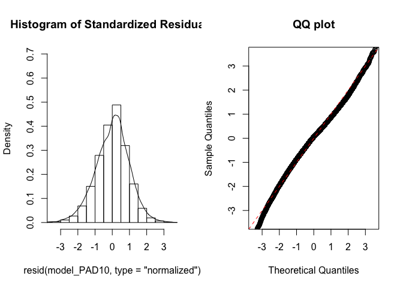
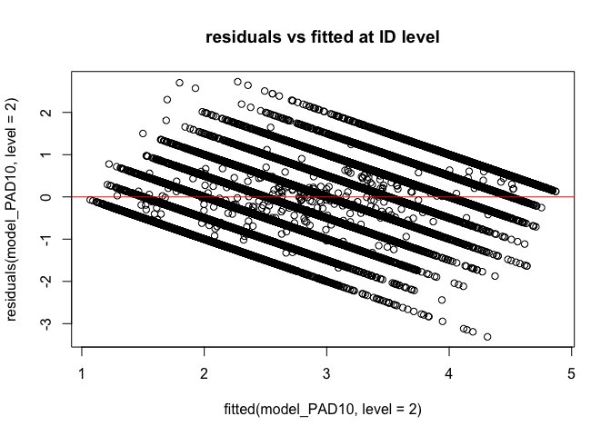
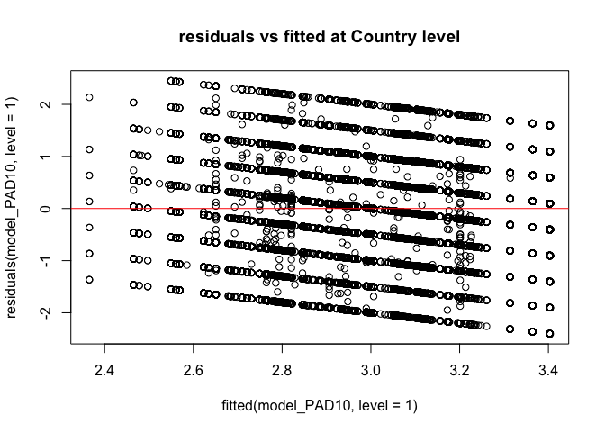
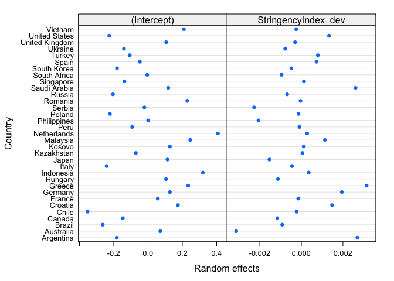
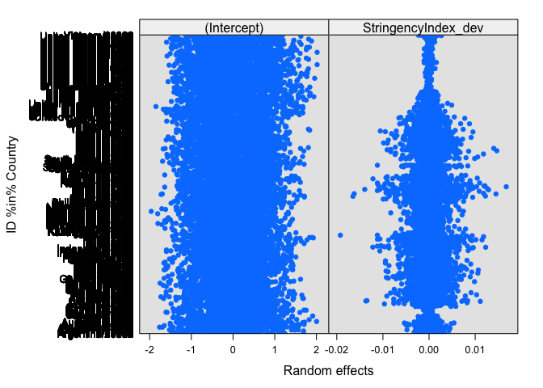
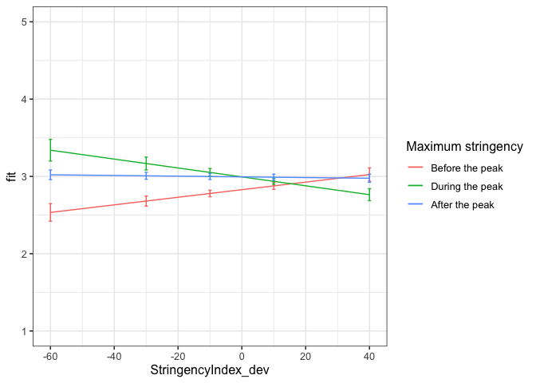

First analyses PAD
================
Anne Margit
9/23/2020

    ## [1] "500Gb"

``` r
load("data_analyse1_fc.Rdata")
```

This dataset includes:

1.  Data from all weekly measurement waves (baseline through wave 11,
    Time 1 through 12)
2.  Participants who provided at least 3 measurements
3.  Participants who are residents of the country they currently live in
4.  Participants who provided info on age
5.  Participants who provided info on gender (either male or female)
6.  Data from countries with at least 20 participants
7.  Pooled age groups
8.  Imputed missing emotion scores
9.  Combined emotion scores (NAA, NAD, PAA, PAD)
10. An imputed Stringency index (StringencyIndex\_imp)
11. A variable indicating the number of days before and after the day on
    which maximum stringency was reached for the respective country
    (DaysMax)
12. A variable indicating the number of weeks before and after the day
    on which maximum stringency was reached for the respective country
    (WeeksMax)
13. A variable indicating the date on which maximum Stringency was
    reached for that country (DateMaxStr)
14. A dummy Str\_dummy with 0 = before the peaj, 1 = during peak, 2 =
    after peak
15. Observations during which there was a second peak are excluded
    (N=583)

> My comments are in block quotes such as this.

``` r
library(dplyr)
library(tidyverse)
library(papaja)
library(ggpubr)
library(ggplot2)
library(rockchalk)
library(effects)
library(nlme)
library(lattice)
library(broom)
library(purrr)
```

# Regression models

**Positive affect low arousal**

*Stringency Index x dummy interaction: random intercept for
Country*

``` r
model_PAD1 <- lme(fixed = PAD ~ StringencyIndex_dev + Str_dummy +  StringencyIndex_dev*Str_dummy,
                   random = ~1 | Country, 
                  data = data_analyse1_fc, 
                  na.action = na.omit)

summary(model_PAD1)
```

    Linear mixed-effects model fit by REML
     Data: data_analyse1_fc 
           AIC    BIC    logLik
      160637.3 160709 -80310.66
    
    Random effects:
     Formula: ~1 | Country
            (Intercept)  Residual
    StdDev:   0.2070565 0.9727142
    
    Fixed effects: PAD ~ StringencyIndex_dev + Str_dummy + StringencyIndex_dev *      Str_dummy 
                                        Value  Std.Error    DF  t-value p-value
    (Intercept)                     2.8120002 0.04026819 57625 69.83180  0.0000
    StringencyIndex_dev             0.0045123 0.00215140 57625  2.09740  0.0360
    Str_dummy1                      0.1780662 0.02406495 57625  7.39940  0.0000
    Str_dummy2                      0.1978075 0.01913809 57625 10.33580  0.0000
    StringencyIndex_dev:Str_dummy1 -0.0095506 0.00284457 57625 -3.35747  0.0008
    StringencyIndex_dev:Str_dummy2 -0.0056541 0.00226523 57625 -2.49606  0.0126
     Correlation: 
                                   (Intr) StrnI_ Str_d1 Str_d2 SI_:S_1
    StringencyIndex_dev             0.110                             
    Str_dummy1                     -0.281 -0.274                      
    Str_dummy2                     -0.389 -0.229  0.575               
    StringencyIndex_dev:Str_dummy1 -0.101 -0.657 -0.272  0.255        
    StringencyIndex_dev:Str_dummy2 -0.106 -0.966  0.275  0.262  0.613 
    
    Standardized Within-Group Residuals:
            Min          Q1         Med          Q3         Max 
    -2.53756898 -0.78663235  0.04342862  0.75085534  2.55896954 
    
    Number of Observations: 57663
    Number of Groups: 33 

*Stringency Index x dummy interaction: random intercept for
ID*

``` r
model_PAD2 <- lme(fixed = PAD ~ StringencyIndex_dev + Str_dummy +  StringencyIndex_dev*Str_dummy,
                  random = ~1 | ID, 
                 data = data_analyse1_fc, 
                 na.action = na.omit)

summary(model_PAD2)
```

    Linear mixed-effects model fit by REML
     Data: data_analyse1_fc 
           AIC      BIC    logLik
      131878.4 131950.1 -65931.21
    
    Random effects:
     Formula: ~1 | ID
            (Intercept)  Residual
    StdDev:   0.7699805 0.6246276
    
    Fixed effects: PAD ~ StringencyIndex_dev + Str_dummy + StringencyIndex_dev *      Str_dummy 
                                        Value   Std.Error    DF   t-value p-value
    (Intercept)                     2.8126033 0.014060905 47315 200.03004  0.0000
    StringencyIndex_dev             0.0055565 0.001483518 47315   3.74552  0.0002
    Str_dummy1                      0.1204359 0.015341375 47315   7.85040  0.0000
    Str_dummy2                      0.1740357 0.013214881 47315  13.16968  0.0000
    StringencyIndex_dev:Str_dummy1 -0.0044546 0.001858680 47315  -2.39663  0.0166
    StringencyIndex_dev:Str_dummy2 -0.0069172 0.001550020 47315  -4.46263  0.0000
     Correlation: 
                                   (Intr) StrnI_ Str_d1 Str_d2 SI_:S_1
    StringencyIndex_dev             0.237                             
    Str_dummy1                     -0.690 -0.269                      
    Str_dummy2                     -0.758 -0.243  0.654               
    StringencyIndex_dev:Str_dummy1 -0.155 -0.734 -0.164  0.248        
    StringencyIndex_dev:Str_dummy2 -0.227 -0.967  0.263  0.275  0.697 
    
    Standardized Within-Group Residuals:
            Min          Q1         Med          Q3         Max 
    -5.24893768 -0.56222198  0.05663693  0.57880679  4.61756922 
    
    Number of Observations: 57663
    Number of Groups: 10343 

*Random intercept for Country and
ID*

``` r
model_PAD3 <- lme(fixed = PAD ~ StringencyIndex_dev + Str_dummy +  StringencyIndex_dev*Str_dummy,
                  random = ~1 | Country/ID, 
                  data = data_analyse1_fc, 
                  na.action = na.omit,
                  control = list(maxIter = 100, opt = "optim"))

summary(model_PAD3)
```

    Linear mixed-effects model fit by REML
     Data: data_analyse1_fc 
           AIC      BIC    logLik
      131318.7 131399.3 -65650.33
    
    Random effects:
     Formula: ~1 | Country
            (Intercept)
    StdDev:   0.2025606
    
     Formula: ~1 | ID %in% Country
            (Intercept)  Residual
    StdDev:   0.7446824 0.6243747
    
    Fixed effects: PAD ~ StringencyIndex_dev + Str_dummy + StringencyIndex_dev *      Str_dummy 
                                        Value  Std.Error    DF  t-value p-value
    (Intercept)                     2.8348271 0.03917666 47315 72.36009   0e+00
    StringencyIndex_dev             0.0049938 0.00150160 47315  3.32568   9e-04
    Str_dummy1                      0.1782447 0.01674836 47315 10.64252   0e+00
    Str_dummy2                      0.1544452 0.01344209 47315 11.48968   0e+00
    StringencyIndex_dev:Str_dummy1 -0.0122922 0.00197813 47315 -6.21406   0e+00
    StringencyIndex_dev:Str_dummy2 -0.0061264 0.00157274 47315 -3.89537   1e-04
     Correlation: 
                                   (Intr) StrnI_ Str_d1 Str_d2 SI_:S_1
    StringencyIndex_dev             0.082                             
    Str_dummy1                     -0.202 -0.285                      
    Str_dummy2                     -0.277 -0.234  0.574               
    StringencyIndex_dev:Str_dummy1 -0.075 -0.657 -0.265  0.263        
    StringencyIndex_dev:Str_dummy2 -0.080 -0.967  0.283  0.264  0.619 
    
    Standardized Within-Group Residuals:
            Min          Q1         Med          Q3         Max 
    -5.29669565 -0.56252521  0.05505162  0.58043763  4.54855266 
    
    Number of Observations: 57663
    Number of Groups: 
            Country ID %in% Country 
                 33           10343 

*Random slope for
Country*

``` r
model_PAD4 <- lme(fixed = PAD ~ StringencyIndex_dev + Str_dummy +  StringencyIndex_dev*Str_dummy,
                  random = list (Country = ~StringencyIndex_dev, ID = ~1), 
                  data = data_analyse1_fc, 
                  na.action = na.omit)

summary(model_PAD4)
```

    Linear mixed-effects model fit by REML
     Data: data_analyse1_fc 
           AIC      BIC    logLik
      131285.8 131384.4 -65631.92
    
    Random effects:
     Formula: ~StringencyIndex_dev | Country
     Structure: General positive-definite, Log-Cholesky parametrization
                        StdDev      Corr  
    (Intercept)         0.202297367 (Intr)
    StringencyIndex_dev 0.003332644 0.216 
    
     Formula: ~1 | ID %in% Country
            (Intercept)  Residual
    StdDev:   0.7446057 0.6239649
    
    Fixed effects: PAD ~ StringencyIndex_dev + Str_dummy + StringencyIndex_dev *      Str_dummy 
                                        Value  Std.Error    DF  t-value p-value
    (Intercept)                     2.8363544 0.03921675 47315 72.32508  0.0000
    StringencyIndex_dev             0.0047138 0.00182747 47315  2.57942  0.0099
    Str_dummy1                      0.1682449 0.01967082 47315  8.55302  0.0000
    Str_dummy2                      0.1600144 0.01394983 47315 11.47070  0.0000
    StringencyIndex_dev:Str_dummy1 -0.0117797 0.00233718 47315 -5.04015  0.0000
    StringencyIndex_dev:Str_dummy2 -0.0051876 0.00185929 47315 -2.79010  0.0053
     Correlation: 
                                   (Intr) StrnI_ Str_d1 Str_d2 SI_:S_1
    StringencyIndex_dev             0.135                             
    Str_dummy1                     -0.194 -0.302                      
    Str_dummy2                     -0.279 -0.182  0.470               
    StringencyIndex_dev:Str_dummy1 -0.051 -0.514 -0.387  0.237        
    StringencyIndex_dev:Str_dummy2 -0.068 -0.862  0.191  0.246  0.646 
    
    Standardized Within-Group Residuals:
            Min          Q1         Med          Q3         Max 
    -5.29092912 -0.56024364  0.05529544  0.57899223  4.54241813 
    
    Number of Observations: 57663
    Number of Groups: 
            Country ID %in% Country 
                 33           10343 

*Random slope for
ID*

``` r
model_PAD5 <- lme(fixed = PAD ~ StringencyIndex_dev + Str_dummy +  StringencyIndex_dev*Str_dummy,
                  random = list (Country = ~1, ID = ~StringencyIndex_dev), 
                  data = data_analyse1_fc, 
                  na.action = na.omit)

summary(model_PAD5)
```

    Linear mixed-effects model fit by REML
     Data: data_analyse1_fc 
           AIC      BIC    logLik
      130921.3 131019.9 -65449.64
    
    Random effects:
     Formula: ~1 | Country
            (Intercept)
    StdDev:   0.2036412
    
     Formula: ~StringencyIndex_dev | ID %in% Country
     Structure: General positive-definite, Log-Cholesky parametrization
                        StdDev     Corr  
    (Intercept)         0.74571810 (Intr)
    StringencyIndex_dev 0.01402109 -0.047
    Residual            0.61101450       
    
    Fixed effects: PAD ~ StringencyIndex_dev + Str_dummy + StringencyIndex_dev *      Str_dummy 
                                        Value  Std.Error    DF  t-value p-value
    (Intercept)                     2.8325022 0.03931963 47315 72.03787  0.0000
    StringencyIndex_dev             0.0047639 0.00164200 47315  2.90130  0.0037
    Str_dummy1                      0.1764956 0.01711738 47315 10.31090  0.0000
    Str_dummy2                      0.1601718 0.01343278 47315 11.92395  0.0000
    StringencyIndex_dev:Str_dummy1 -0.0117492 0.00208346 47315 -5.63930  0.0000
    StringencyIndex_dev:Str_dummy2 -0.0053039 0.00173480 47315 -3.05733  0.0022
     Correlation: 
                                   (Intr) StrnI_ Str_d1 Str_d2 SI_:S_1
    StringencyIndex_dev             0.076                             
    Str_dummy1                     -0.195 -0.297                      
    Str_dummy2                     -0.272 -0.221  0.542               
    StringencyIndex_dev:Str_dummy1 -0.070 -0.656 -0.269  0.265        
    StringencyIndex_dev:Str_dummy2 -0.075 -0.950  0.261  0.265  0.649 
    
    Standardized Within-Group Residuals:
            Min          Q1         Med          Q3         Max 
    -5.38932124 -0.55096057  0.05400076  0.57400698  4.45975747 
    
    Number of Observations: 57663
    Number of Groups: 
            Country ID %in% Country 
                 33           10343 

*Random slope for Country and
ID*

``` r
model_PAD6 <- lme(fixed = PAD ~ StringencyIndex_dev + Str_dummy +  StringencyIndex_dev*Str_dummy,
                  random = ~StringencyIndex_dev | Country/ID, 
                  data = data_analyse1_fc, 
                  na.action = na.omit)

summary(model_PAD6)
```

    Linear mixed-effects model fit by REML
     Data: data_analyse1_fc 
           AIC      BIC    logLik
      130908.9 131025.4 -65441.44
    
    Random effects:
     Formula: ~StringencyIndex_dev | Country
     Structure: General positive-definite, Log-Cholesky parametrization
                        StdDev      Corr  
    (Intercept)         0.203057502 (Intr)
    StringencyIndex_dev 0.003200343 0.216 
    
     Formula: ~StringencyIndex_dev | ID %in% Country
     Structure: General positive-definite, Log-Cholesky parametrization
                        StdDev     Corr  
    (Intercept)         0.74562044 (Intr)
    StringencyIndex_dev 0.01381959 -0.046
    Residual            0.61100943       
    
    Fixed effects: PAD ~ StringencyIndex_dev + Str_dummy + StringencyIndex_dev *      Str_dummy 
                                        Value  Std.Error    DF  t-value p-value
    (Intercept)                     2.8338764 0.03929749 47315 72.11342  0.0000
    StringencyIndex_dev             0.0043000 0.00189889 47315  2.26446  0.0236
    Str_dummy1                      0.1720897 0.01953400 47315  8.80975  0.0000
    Str_dummy2                      0.1622081 0.01378702 47315 11.76528  0.0000
    StringencyIndex_dev:Str_dummy1 -0.0115747 0.00234689 47315 -4.93193  0.0000
    StringencyIndex_dev:Str_dummy2 -0.0048221 0.00191661 47315 -2.51593  0.0119
     Correlation: 
                                   (Intr) StrnI_ Str_d1 Str_d2 SI_:S_1
    StringencyIndex_dev             0.127                             
    Str_dummy1                     -0.190 -0.315                      
    Str_dummy2                     -0.276 -0.175  0.466               
    StringencyIndex_dev:Str_dummy1 -0.050 -0.524 -0.370  0.236        
    StringencyIndex_dev:Str_dummy2 -0.066 -0.868  0.205  0.238  0.653 
    
    Standardized Within-Group Residuals:
            Min          Q1         Med          Q3         Max 
    -5.38347742 -0.55171473  0.05386801  0.57324567  4.46276200 
    
    Number of Observations: 57663
    Number of Groups: 
            Country ID %in% Country 
                 33           10343 

*No correlation between intercept and slope for
Country*

``` r
model_PAD7 <- lme(fixed = PAD ~ StringencyIndex_dev + Str_dummy +  StringencyIndex_dev*Str_dummy,
                  random = list(Country = pdDiag(~StringencyIndex_dev), ID = ~StringencyIndex_dev), 
                  data = data_analyse1_fc, 
                  na.action = na.omit)

summary(model_PAD7)
```

    Linear mixed-effects model fit by REML
     Data: data_analyse1_fc 
           AIC    BIC    logLik
      130907.5 131015 -65441.73
    
    Random effects:
     Formula: ~StringencyIndex_dev | Country
     Structure: Diagonal
            (Intercept) StringencyIndex_dev
    StdDev:   0.2028447         0.003272329
    
     Formula: ~StringencyIndex_dev | ID %in% Country
     Structure: General positive-definite, Log-Cholesky parametrization
                        StdDev     Corr  
    (Intercept)         0.74561823 (Intr)
    StringencyIndex_dev 0.01382091 -0.046
    Residual            0.61100434       
    
    Fixed effects: PAD ~ StringencyIndex_dev + Str_dummy + StringencyIndex_dev *      Str_dummy 
                                        Value  Std.Error    DF  t-value p-value
    (Intercept)                     2.8350360 0.03927853 47315 72.17774  0.0000
    StringencyIndex_dev             0.0043802 0.00191231 47315  2.29053  0.0220
    Str_dummy1                      0.1701801 0.01953902 47315  8.70976  0.0000
    Str_dummy2                      0.1612149 0.01380209 47315 11.68047  0.0000
    StringencyIndex_dev:Str_dummy1 -0.0114092 0.00235286 47315 -4.84909  0.0000
    StringencyIndex_dev:Str_dummy2 -0.0047506 0.00192919 47315 -2.46247  0.0138
     Correlation: 
                                   (Intr) StrnI_ Str_d1 Str_d2 SI_:S_1
    StringencyIndex_dev             0.068                             
    Str_dummy1                     -0.192 -0.313                      
    Str_dummy2                     -0.276 -0.172  0.467               
    StringencyIndex_dev:Str_dummy1 -0.050 -0.526 -0.369  0.233        
    StringencyIndex_dev:Str_dummy2 -0.066 -0.866  0.202  0.234  0.657 
    
    Standardized Within-Group Residuals:
            Min          Q1         Med          Q3         Max 
    -5.38266522 -0.55191912  0.05379349  0.57377618  4.46413921 
    
    Number of Observations: 57663
    Number of Groups: 
            Country ID %in% Country 
                 33           10343 

*No correlation between intercept and slope for
ID*

``` r
model_PAD8 <- lme(fixed = PAD ~ StringencyIndex_dev + Str_dummy +  StringencyIndex_dev*Str_dummy,
                  random = list (Country = ~StringencyIndex_dev, ID = pdDiag(~StringencyIndex_dev)), 
                  data = data_analyse1_fc, 
                  na.action = na.omit)

summary(model_PAD8)
```

    Linear mixed-effects model fit by REML
     Data: data_analyse1_fc 
           AIC      BIC   logLik
      130909.2 131016.7 -65442.6
    
    Random effects:
     Formula: ~StringencyIndex_dev | Country
     Structure: General positive-definite, Log-Cholesky parametrization
                        StdDev      Corr  
    (Intercept)         0.202922124 (Intr)
    StringencyIndex_dev 0.003236245 0.208 
    
     Formula: ~StringencyIndex_dev | ID %in% Country
     Structure: Diagonal
            (Intercept) StringencyIndex_dev  Residual
    StdDev:   0.7452394          0.01381026 0.6109949
    
    Fixed effects: PAD ~ StringencyIndex_dev + Str_dummy + StringencyIndex_dev *      Str_dummy 
                                        Value  Std.Error    DF  t-value p-value
    (Intercept)                     2.8338491 0.03927800 47315 72.14850  0.0000
    StringencyIndex_dev             0.0043213 0.00190163 47315  2.27245  0.0231
    Str_dummy1                      0.1721485 0.01955960 47315  8.80123  0.0000
    Str_dummy2                      0.1623471 0.01378929 47315 11.77342  0.0000
    StringencyIndex_dev:Str_dummy1 -0.0116035 0.00235064 47315 -4.93630  0.0000
    StringencyIndex_dev:Str_dummy2 -0.0048567 0.00191808 47315 -2.53204  0.0113
     Correlation: 
                                   (Intr) StrnI_ Str_d1 Str_d2 SI_:S_1
    StringencyIndex_dev             0.127                             
    Str_dummy1                     -0.190 -0.315                      
    Str_dummy2                     -0.276 -0.175  0.466               
    StringencyIndex_dev:Str_dummy1 -0.050 -0.523 -0.371  0.237        
    StringencyIndex_dev:Str_dummy2 -0.067 -0.867  0.204  0.239  0.653 
    
    Standardized Within-Group Residuals:
            Min          Q1         Med          Q3         Max 
    -5.38578561 -0.55175086  0.05467828  0.57294126  4.46420551 
    
    Number of Observations: 57663
    Number of Groups: 
            Country ID %in% Country 
                 33           10343 

*No correlation between intercept and slope for Country and
ID*

``` r
model_PAD9 <- lme(fixed = PAD ~ StringencyIndex_dev + Str_dummy +  StringencyIndex_dev*Str_dummy,
                  random = list (Country = pdDiag(~StringencyIndex_dev), ID = pdDiag(~StringencyIndex_dev)),
                  data = data_analyse1_fc, 
                  na.action = na.omit)

summary(model_PAD9)
```

    Linear mixed-effects model fit by REML
     Data: data_analyse1_fc 
           AIC      BIC    logLik
      130907.8 131006.3 -65442.88
    
    Random effects:
     Formula: ~StringencyIndex_dev | Country
     Structure: Diagonal
            (Intercept) StringencyIndex_dev
    StdDev:   0.2027004         0.003299398
    
     Formula: ~StringencyIndex_dev | ID %in% Country
     Structure: Diagonal
            (Intercept) StringencyIndex_dev Residual
    StdDev:   0.7452524           0.0138128 0.610987
    
    Fixed effects: PAD ~ StringencyIndex_dev + Str_dummy + StringencyIndex_dev *      Str_dummy 
                                        Value  Std.Error    DF  t-value p-value
    (Intercept)                     2.8349729 0.03925604 47315 72.21750  0.0000
    StringencyIndex_dev             0.0044004 0.00191405 47315  2.29899  0.0215
    Str_dummy1                      0.1702937 0.01955822 47315  8.70701  0.0000
    Str_dummy2                      0.1613859 0.01380320 47315 11.69192  0.0000
    StringencyIndex_dev:Str_dummy1 -0.0114420 0.00235579 47315 -4.85698  0.0000
    StringencyIndex_dev:Str_dummy2 -0.0047876 0.00193000 47315 -2.48061  0.0131
     Correlation: 
                                   (Intr) StrnI_ Str_d1 Str_d2 SI_:S_1
    StringencyIndex_dev             0.069                             
    Str_dummy1                     -0.192 -0.313                      
    Str_dummy2                     -0.276 -0.173  0.467               
    StringencyIndex_dev:Str_dummy1 -0.050 -0.525 -0.370  0.234        
    StringencyIndex_dev:Str_dummy2 -0.067 -0.865  0.201  0.235  0.657 
    
    Standardized Within-Group Residuals:
            Min          Q1         Med          Q3         Max 
    -5.38502372 -0.55196472  0.05434274  0.57286422  4.46552130 
    
    Number of Observations: 57663
    Number of Groups: 
            Country ID %in% Country 
                 33           10343 

*Autoregressive correlation
structure*

``` r
data_analyse1_fc <- data_analyse1_fc[with(data_analyse1_fc, order(Country, ID, Time)),]
data_analyse1_fc$Time <- as.numeric(data_analyse1_fc$Time)

model_PAD10 <- lme(fixed = PAD ~ StringencyIndex_dev + Str_dummy +  StringencyIndex_dev*Str_dummy,
                   random = list (Country = pdDiag(~StringencyIndex_dev), ID = pdDiag(~StringencyIndex_dev)),
                  data = data_analyse1_fc, 
                  na.action = na.omit,
                  correlation = corAR1(form = ~ Time | Country/ID))

summary(model_PAD10)
```

    Linear mixed-effects model fit by REML
     Data: data_analyse1_fc 
           AIC      BIC   logLik
      129870.6 129978.1 -64923.3
    
    Random effects:
     Formula: ~StringencyIndex_dev | Country
     Structure: Diagonal
            (Intercept) StringencyIndex_dev
    StdDev:   0.2018251         0.002405162
    
     Formula: ~StringencyIndex_dev | ID %in% Country
     Structure: Diagonal
            (Intercept) StringencyIndex_dev  Residual
    StdDev:   0.7255728         0.008931243 0.6403123
    
    Correlation Structure: ARMA(1,0)
     Formula: ~Time | Country/ID 
     Parameter estimate(s):
         Phi1 
    0.2562941 
    Fixed effects: PAD ~ StringencyIndex_dev + Str_dummy + StringencyIndex_dev *      Str_dummy 
                                        Value  Std.Error    DF  t-value p-value
    (Intercept)                     2.8281860 0.03928542 47315 71.99072  0.0000
    StringencyIndex_dev             0.0049036 0.00182986 47315  2.67977  0.0074
    Str_dummy1                      0.1657255 0.01964942 47315  8.43412  0.0000
    Str_dummy2                      0.1660073 0.01474785 47315 11.25637  0.0000
    StringencyIndex_dev:Str_dummy1 -0.0106613 0.00235084 47315 -4.53510  0.0000
    StringencyIndex_dev:Str_dummy2 -0.0053528 0.00190468 47315 -2.81033  0.0050
     Correlation: 
                                   (Intr) StrnI_ Str_d1 Str_d2 SI_:S_1
    StringencyIndex_dev             0.078                             
    Str_dummy1                     -0.203 -0.312                      
    Str_dummy2                     -0.291 -0.188  0.485               
    StringencyIndex_dev:Str_dummy1 -0.065 -0.555 -0.343  0.253        
    StringencyIndex_dev:Str_dummy2 -0.076 -0.895  0.224  0.249  0.640 
    
    Standardized Within-Group Residuals:
            Min          Q1         Med          Q3         Max 
    -5.17348505 -0.55320552  0.06254925  0.58385762  4.25833796 
    
    Number of Observations: 57663
    Number of Groups: 
            Country ID %in% Country 
                 33           10343 

*AR without random slope for
country*

``` r
model_PAD11 <- lme(fixed = PAD ~ StringencyIndex_dev + Str_dummy +  StringencyIndex_dev*Str_dummy,
                  random = list (Country = ~1, ID = pdDiag(~StringencyIndex_dev)), 
                  data = data_analyse1_fc, 
                  na.action = na.omit,
                  correlation = corAR1(form = ~ Time | Country/ID))

summary(model_PAD11)
```

    Linear mixed-effects model fit by REML
     Data: data_analyse1_fc 
           AIC      BIC    logLik
      129881.7 129980.3 -64929.86
    
    Random effects:
     Formula: ~1 | Country
            (Intercept)
    StdDev:   0.2024321
    
     Formula: ~StringencyIndex_dev | ID %in% Country
     Structure: Diagonal
            (Intercept) StringencyIndex_dev  Residual
    StdDev:   0.7255971         0.009121247 0.6404301
    
    Correlation Structure: ARMA(1,0)
     Formula: ~Time | Country/ID 
     Parameter estimate(s):
         Phi1 
    0.2568228 
    Fixed effects: PAD ~ StringencyIndex_dev + Str_dummy + StringencyIndex_dev *      Str_dummy 
                                        Value  Std.Error    DF  t-value p-value
    (Intercept)                     2.8267718 0.03930441 47315 71.91996  0.0000
    StringencyIndex_dev             0.0049679 0.00163725 47315  3.03427  0.0024
    Str_dummy1                      0.1736776 0.01776119 47315  9.77849  0.0000
    Str_dummy2                      0.1627985 0.01436950 47315 11.32945  0.0000
    StringencyIndex_dev:Str_dummy1 -0.0111683 0.00212680 47315 -5.25123  0.0000
    StringencyIndex_dev:Str_dummy2 -0.0059014 0.00173109 47315 -3.40908  0.0007
     Correlation: 
                                   (Intr) StrnI_ Str_d1 Str_d2 SI_:S_1
    StringencyIndex_dev             0.085                             
    Str_dummy1                     -0.206 -0.300                      
    Str_dummy2                     -0.288 -0.227  0.546               
    StringencyIndex_dev:Str_dummy1 -0.081 -0.649 -0.264  0.274        
    StringencyIndex_dev:Str_dummy2 -0.083 -0.955  0.280  0.267  0.626 
    
    Standardized Within-Group Residuals:
            Min          Q1         Med          Q3         Max 
    -5.17831793 -0.55293935  0.06283582  0.58317069  4.25764921 
    
    Number of Observations: 57663
    Number of Groups: 
            Country ID %in% Country 
                 33           10343 

> Model PAD10 has the best fit (lowest BIC). This model has random
> slopes for Stringency at the ID and Country level, assumes no
> correlation between random slopes and intercepts, and assumes
> autoregressive correlation structure at the measurement level.

*QQ plot of residuals*

``` r
par(mfrow = c(1,2))
lims <- c(-3.5,3.5)
hist(resid(model_PAD10, type = "normalized"),
freq = FALSE, xlim = lims, ylim =  c(0,.7),main = "Histogram of Standardized Residuals")
lines(density(scale(resid(model_PAD10))))
qqnorm(resid(model_PAD10, type = "normalized"),
xlim = lims, ylim = lims,main = "QQ plot")
abline(0,1, col = "red", lty = 2)
```

<!-- -->

*Residuals vs fitted*

``` r
plot(fitted(model_PAD10, level=2), residuals(model_PAD10, level=2), 
     main="residuals vs fitted at ID level")
abline(a=0, b=0,col="red")
```

<!-- -->

``` r
plot(fitted(model_PAD10, level=1), residuals(model_PAD10, level=1), 
    main="residuals vs fitted at Country level")
abline(a=0, b=0,col="red")
```

<!-- -->

*Plot random intercepts and slopes*

``` r
plot(ranef(model_PAD10, level = 1))
```

<!-- -->

``` r
plot(ranef(model_PAD10, level = 2))
```

<!-- -->

*Confidence intervals*

``` r
intervals(model_PAD10)
```

    Approximate 95% confidence intervals
    
     Fixed effects:
                                          lower         est.        upper
    (Intercept)                     2.751186000  2.828185984  2.905185967
    StringencyIndex_dev             0.001317047  0.004903604  0.008490162
    Str_dummy1                      0.127212389  0.165725521  0.204238652
    Str_dummy2                      0.137101264  0.166007267  0.194913270
    StringencyIndex_dev:Str_dummy1 -0.015268972 -0.010661297 -0.006053621
    StringencyIndex_dev:Str_dummy2 -0.009085978 -0.005352777 -0.001619577
    attr(,"label")
    [1] "Fixed effects:"
    
     Random Effects:
      Level: Country 
                                  lower        est.      upper
    sd((Intercept))         0.151006822 0.201825069 0.26974515
    sd(StringencyIndex_dev) 0.001092604 0.002405162 0.00529451
      Level: ID 
                                  lower        est.      upper
    sd((Intercept))         0.713021516 0.725572797 0.73834502
    sd(StringencyIndex_dev) 0.007683704 0.008931243 0.01038133
    
     Correlation structure:
             lower      est.     upper
    Phi1 0.2398113 0.2562941 0.2726293
    attr(,"label")
    [1] "Correlation structure:"
    
     Within-group standard error:
        lower      est.     upper 
    0.6348412 0.6403123 0.6458306 

*Plot of predicted values*

``` r
ef_PAD <- effect("StringencyIndex_dev:Str_dummy", model_PAD10)

plot_PAD <- ggplot(as.data.frame(ef_PAD), 
       aes(StringencyIndex_dev, fit, color=Str_dummy)) + geom_line() + 
  geom_errorbar(aes(ymin=fit-se, ymax=fit+se), width=1) + theme_bw(base_size=12) + scale_color_discrete(name="Maximum stringency", labels = c("Before the peak", "During the peak", "After the peak")) + expand_limits(y=c(1, 5))
```

``` r
plot_PAD
```

<!-- -->

``` r
coef_PAD = tidy(model_PAD10, 
               effects = "fixed")
```

*Effect sizes* **Within person SD and average within person SD**

``` r
load("ISDs_av.Rdata")
```

> Effect size = (regression coefficient \* average ISD of X) / average
> ISD of Y)

> For the intercept and the dummy variables (+ interaction) I only
> standardized Y, so the effect size = (regression coefficient / average
> ISD of Y)

``` r
coef_PAD <- coef_PAD %>%
 left_join(., ISDs_av, by=c("term"="ind"))

coef_PAD <- coef_PAD %>%
  mutate(sd = ifelse(is.na(sd), 1, sd))

coef_PAD <- coef_PAD %>%
 mutate(e_size = (estimate * sd)/0.5614224)

coef_PAD <- coef_PAD %>%
  rename(isd = sd)
```

``` r
coef_PAD
```

    ## # A tibble: 6 x 7
    ##   term                           estimate std.error statistic  p.value   isd   e_size
    ##   <chr>                             <dbl>     <dbl>     <dbl>    <dbl> <dbl>    <dbl>
    ## 1 (Intercept)                     2.83      0.0393      72.0  0.        1     5.04   
    ## 2 StringencyIndex_dev             0.00490   0.00183      2.68 7.37e- 3  6.12  0.0535 
    ## 3 Str_dummy1                      0.166     0.0196       8.43 3.43e-17  1     0.295  
    ## 4 Str_dummy2                      0.166     0.0147      11.3  2.35e-29  1     0.296  
    ## 5 StringencyIndex_dev:Str_dummy1 -0.0107    0.00235     -4.54 5.77e- 6  1    -0.0190 
    ## 6 StringencyIndex_dev:Str_dummy2 -0.00535   0.00190     -2.81 4.95e- 3  1    -0.00953
