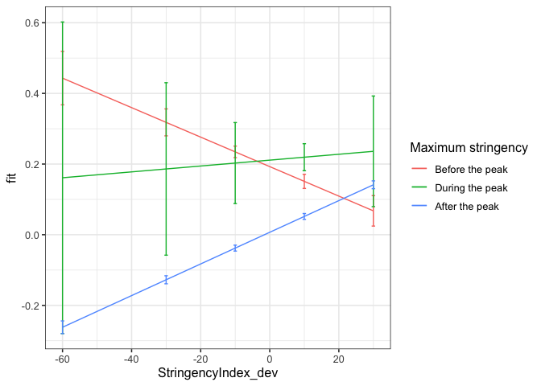
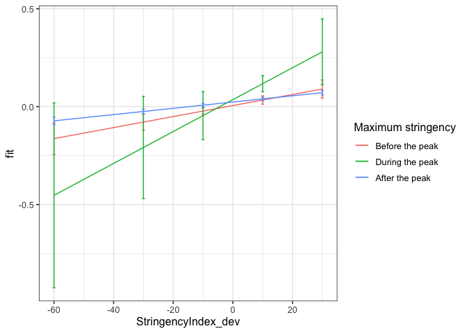
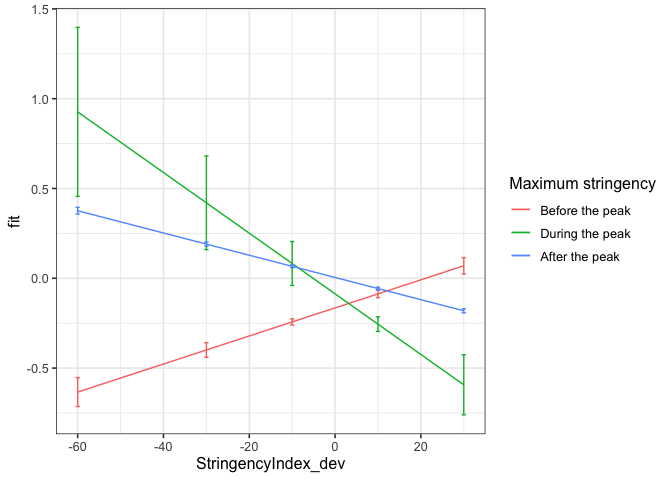

First analyses country mean centered
================
Anne Margit
09/07/2020

``` r
load("data_imputed_emomeans_maxweeks.Rdata")
```

In this analyses I used a two-level model with country-mean centered
dependent variables (affect items) and independent variables
(Stringency)

This dataset includes:

1.  Data from all weekly measurement waves (baseline through wave 11,
    Time 1 through 12)
2.  Participants who provided at least 3 measurements
3.  Participants who are residents of the country they currently live in
4.  Participants who provided info on age
5.  Participants who provided info on gender (either male or female)
6.  Data from countries with at least 20 participants
7.  Pooled age groups
8.  Imputed missing emotion scores
9.  Combined emotion scores (NAA, NAD, PAA, PAD)
10. An imputed Stringency index (StringencyIndex\_imp)
11. A variable indicating the number of days before and after the day on
    which maximum stringency was reached for the respective country
    (DaysMax)
12. A variable indicating the number of weeks before and after the day
    on which maximum stringency was reached for the respective country
    (WeeksMax)
13. A variable indicating the date on which maximum Stringency was
    reached for that country (DateMaxStr)

<!-- end list -->

``` r
library(dplyr)
library(tidyverse)
library(papaja)
library(ggpubr)
library(ggplot2)
library(lme4)
library(lmerTest)
library(rockchalk)
library(effects)
```

# Preparation

**Dummy coding Stringency** *Before the peak = 0. During peak = 1 (all
days with maximum stringency), after peak = 2*

``` r
data_analyse1 <- data_imputed_emomeans_maxweeks %>%
  group_by(Country) %>%
  mutate(Str_dummy = ifelse(Date < DateMaxStr, 0, ifelse(Date == DateMaxStr, 1, 2)))

data_analyse1$Str_dummy <- as_factor(data_analyse1$Str_dummy)

Dummy_N <- data_analyse1 %>%
group_by(Str_dummy) %>%
  summarise(N_dummy = n())
```

**Country mean centering Stringency
Index**

``` r
data_analyse1_c <- gmc(data_analyse1, "StringencyIndex", "Country", FUN = mean, suffix = c("_mn", "_dev"),
    fulldataframe = TRUE)
```

**Country mean centering emotion factor
scores**

``` r
data_analyse1_c <- gmc(data_analyse1_c, "NAA", "Country", FUN = mean, suffix = c("_mn", "_dev"),
    fulldataframe = TRUE)

data_analyse1_c <- gmc(data_analyse1_c, "NAD", "Country", FUN = mean, suffix = c("_mn", "_dev"),
    fulldataframe = TRUE)

data_analyse1_c <- gmc(data_analyse1_c, "PAA", "Country", FUN = mean, suffix = c("_mn", "_dev"),
    fulldataframe = TRUE)

data_analyse1_c <- gmc(data_analyse1_c, "PAD", "Country", FUN = mean, suffix = c("_mn", "_dev"),
    fulldataframe = TRUE)
```

# Regression models

**Negative affect high arousal**

*Random intercept*

``` r
model_NAA0 <- lmer(NAA_dev ~ 1 + (1 | ID), data = data_analyse1_c)
summary(model_NAA0)
```

    Linear mixed model fit by REML. t-tests use Satterthwaite's method [
    lmerModLmerTest]
    Formula: NAA_dev ~ 1 + (1 | ID)
       Data: data_analyse1_c
    
    REML criterion at convergence: 123890.9
    
    Scaled residuals: 
        Min      1Q  Median      3Q     Max 
    -5.5687 -0.5527 -0.1168  0.5194  5.4004 
    
    Random effects:
     Groups   Name        Variance Std.Dev.
     ID       (Intercept) 0.5736   0.7574  
     Residual             0.3261   0.5710  
    Number of obs: 58246, groups:  ID, 10343
    
    Fixed effects:
                 Estimate Std. Error        df t value Pr(>|t|)    
    (Intercept) 2.694e-02  7.882e-03 1.030e+04   3.418 0.000634 ***
    ---
    Signif. codes:  0 '***' 0.001 '**' 0.01 '*' 0.05 '.' 0.1 ' ' 1

*Stringency
Index*

``` r
model_NAA1 <- lmer(NAA_dev ~ 1 + StringencyIndex_dev + (1 | ID), data = data_analyse1_c)
summary(model_NAA1)
```

    Linear mixed model fit by REML. t-tests use Satterthwaite's method [
    lmerModLmerTest]
    Formula: NAA_dev ~ 1 + StringencyIndex_dev + (1 | ID)
       Data: data_analyse1_c
    
    REML criterion at convergence: 123689.7
    
    Scaled residuals: 
        Min      1Q  Median      3Q     Max 
    -5.5330 -0.5537 -0.1130  0.5193  5.4519 
    
    Random effects:
     Groups   Name        Variance Std.Dev.
     ID       (Intercept) 0.5724   0.7565  
     Residual             0.3248   0.5699  
    Number of obs: 58246, groups:  ID, 10343
    
    Fixed effects:
                         Estimate Std. Error        df t value Pr(>|t|)    
    (Intercept)         2.469e-02  7.875e-03 1.031e+04   3.136  0.00172 ** 
    StringencyIndex_dev 3.804e-03  2.587e-04 5.003e+04  14.706  < 2e-16 ***
    ---
    Signif. codes:  0 '***' 0.001 '**' 0.01 '*' 0.05 '.' 0.1 ' ' 1
    
    Correlation of Fixed Effects:
                (Intr)
    StrngncyIn_ -0.019

``` r
anova(model_NAA0, model_NAA1)
```

    Data: data_analyse1_c
    Models:
    model_NAA0: NAA_dev ~ 1 + (1 | ID)
    model_NAA1: NAA_dev ~ 1 + StringencyIndex_dev + (1 | ID)
               npar    AIC    BIC logLik deviance  Chisq Df Pr(>Chisq)    
    model_NAA0    3 123889 123916 -61942   123883                         
    model_NAA1    4 123675 123711 -61834   123667 215.87  1  < 2.2e-16 ***
    ---
    Signif. codes:  0 '***' 0.001 '**' 0.01 '*' 0.05 '.' 0.1 ' ' 1

*Stringency Index and dummy variable with 0 = before maximum stringency,
1 = during, 2 =
after*

``` r
model_NAA2 <- lmer(NAA_dev ~ 1 + StringencyIndex_dev + Str_dummy + (1 | ID), data = data_analyse1_c)
summary(model_NAA2)
```

    Linear mixed model fit by REML. t-tests use Satterthwaite's method [
    lmerModLmerTest]
    Formula: NAA_dev ~ 1 + StringencyIndex_dev + Str_dummy + (1 | ID)
       Data: data_analyse1_c
    
    REML criterion at convergence: 123333.5
    
    Scaled residuals: 
        Min      1Q  Median      3Q     Max 
    -5.5482 -0.5531 -0.1100  0.5159  5.4768 
    
    Random effects:
     Groups   Name        Variance Std.Dev.
     ID       (Intercept) 0.5713   0.7559  
     Residual             0.3225   0.5679  
    Number of obs: 58246, groups:  ID, 10343
    
    Fixed effects:
                          Estimate Std. Error         df t value Pr(>|t|)    
    (Intercept)          2.095e-01  1.277e-02  4.243e+04  16.407   <2e-16 ***
    StringencyIndex_dev  4.110e-03  2.588e-04  5.004e+04  15.880   <2e-16 ***
    Str_dummy1          -1.756e-02  3.236e-02  5.062e+04  -0.543    0.587    
    Str_dummy2          -2.024e-01  1.094e-02  5.259e+04 -18.506   <2e-16 ***
    ---
    Signif. codes:  0 '***' 0.001 '**' 0.01 '*' 0.05 '.' 0.1 ' ' 1
    
    Correlation of Fixed Effects:
                (Intr) StrnI_ Str_d1
    StrngncyIn_  0.049              
    Str_dummy1  -0.254 -0.066       
    Str_dummy2  -0.787 -0.077  0.299

``` r
anova(model_NAA1, model_NAA2)
```

    Data: data_analyse1_c
    Models:
    model_NAA1: NAA_dev ~ 1 + StringencyIndex_dev + (1 | ID)
    model_NAA2: NAA_dev ~ 1 + StringencyIndex_dev + Str_dummy + (1 | ID)
               npar    AIC    BIC logLik deviance  Chisq Df Pr(>Chisq)    
    model_NAA1    4 123675 123711 -61834   123667                         
    model_NAA2    6 123311 123364 -61649   123299 368.53  2  < 2.2e-16 ***
    ---
    Signif. codes:  0 '***' 0.001 '**' 0.01 '*' 0.05 '.' 0.1 ' ' 1

*Stringency Index x dummy
interaction*

``` r
model_NAA3 <- lmer(NAA_dev ~ 1 + StringencyIndex_dev + Str_dummy +  StringencyIndex_dev*Str_dummy + (1 | ID), data = data_analyse1_c)
summary(model_NAA3)
```

    Linear mixed model fit by REML. t-tests use Satterthwaite's method [
    lmerModLmerTest]
    Formula: NAA_dev ~ 1 + StringencyIndex_dev + Str_dummy + StringencyIndex_dev *  
        Str_dummy + (1 | ID)
       Data: data_analyse1_c
    
    REML criterion at convergence: 123309.8
    
    Scaled residuals: 
        Min      1Q  Median      3Q     Max 
    -5.5462 -0.5531 -0.1104  0.5160  5.4832 
    
    Random effects:
     Groups   Name        Variance Std.Dev.
     ID       (Intercept) 0.5714   0.7559  
     Residual             0.3222   0.5676  
    Number of obs: 58246, groups:  ID, 10343
    
    Fixed effects:
                                     Estimate Std. Error         df t value
    (Intercept)                     1.928e-01  1.301e-02  4.372e+04  14.813
    StringencyIndex_dev            -4.174e-03  1.286e-03  5.169e+04  -3.246
    Str_dummy1                      1.833e-02  5.504e-02  5.072e+04   0.333
    Str_dummy2                     -1.859e-01  1.122e-02  5.263e+04 -16.569
    StringencyIndex_dev:Str_dummy1  5.005e-03  6.670e-03  5.059e+04   0.750
    StringencyIndex_dev:Str_dummy2  8.655e-03  1.316e-03  5.164e+04   6.578
                                   Pr(>|t|)    
    (Intercept)                     < 2e-16 ***
    StringencyIndex_dev             0.00117 ** 
    Str_dummy1                      0.73909    
    Str_dummy2                      < 2e-16 ***
    StringencyIndex_dev:Str_dummy1  0.45304    
    StringencyIndex_dev:Str_dummy2 4.81e-11 ***
    ---
    Signif. codes:  0 '***' 0.001 '**' 0.01 '*' 0.05 '.' 0.1 ' ' 1
    
    Correlation of Fixed Effects:
                (Intr) StrnI_ Str_d1 Str_d2 SI_:S_1
    StrngncyIn_  0.200                             
    Str_dummy1  -0.164 -0.067                      
    Str_dummy2  -0.796 -0.234  0.192               
    StrngI_:S_1 -0.024 -0.159 -0.787  0.027        
    StrngI_:S_2 -0.195 -0.980  0.065  0.224  0.156 

``` r
anova(model_NAA2, model_NAA3)
```

    Data: data_analyse1_c
    Models:
    model_NAA2: NAA_dev ~ 1 + StringencyIndex_dev + Str_dummy + (1 | ID)
    model_NAA3: NAA_dev ~ 1 + StringencyIndex_dev + Str_dummy + StringencyIndex_dev * 
    model_NAA3:     Str_dummy + (1 | ID)
               npar    AIC    BIC logLik deviance  Chisq Df Pr(>Chisq)    
    model_NAA2    6 123311 123364 -61649   123299                         
    model_NAA3    8 123271 123343 -61628   123255 43.334  2  3.893e-10 ***
    ---
    Signif. codes:  0 '***' 0.001 '**' 0.01 '*' 0.05 '.' 0.1 ' ' 1

*Plot of predicted values*

``` r
ef_NAA <- effect("StringencyIndex_dev:Str_dummy", model_NAA3)

plot_NAA <- ggplot(as.data.frame(ef_NAA), 
       aes(StringencyIndex_dev, fit, color=Str_dummy)) + geom_line() + 
  geom_errorbar(aes(ymin=fit-se, ymax=fit+se), width=1) + theme_bw(base_size=12) + scale_color_discrete(name="Maximum stringency", labels = c("Before the peak", "During the peak", "After the peak"))
```

``` r
plot_NAA
```

<!-- -->

**Negative affect low arousal**

*Random intercept*

``` r
model_NAD0 <- lmer(NAD_dev ~ 1 + (1 | ID), data = data_analyse1_c)
summary(model_NAD0)
```

    Linear mixed model fit by REML. t-tests use Satterthwaite's method [
    lmerModLmerTest]
    Formula: NAD_dev ~ 1 + (1 | ID)
       Data: data_analyse1_c
    
    REML criterion at convergence: 130933.6
    
    Scaled residuals: 
        Min      1Q  Median      3Q     Max 
    -5.4416 -0.5497 -0.1162  0.5188  5.4443 
    
    Random effects:
     Groups   Name        Variance Std.Dev.
     ID       (Intercept) 0.6277   0.7923  
     Residual             0.3701   0.6084  
    Number of obs: 58246, groups:  ID, 10343
    
    Fixed effects:
                 Estimate Std. Error        df t value Pr(>|t|)   
    (Intercept) 2.318e-02  8.262e-03 1.030e+04   2.805  0.00503 **
    ---
    Signif. codes:  0 '***' 0.001 '**' 0.01 '*' 0.05 '.' 0.1 ' ' 1

*Stringency
Index*

``` r
model_NAD1 <- lmer(NAD_dev ~ 1 + StringencyIndex_dev + (1 | ID), data = data_analyse1_c)
summary(model_NAD1)
```

    Linear mixed model fit by REML. t-tests use Satterthwaite's method [
    lmerModLmerTest]
    Formula: NAD_dev ~ 1 + StringencyIndex_dev + (1 | ID)
       Data: data_analyse1_c
    
    REML criterion at convergence: 130909.4
    
    Scaled residuals: 
        Min      1Q  Median      3Q     Max 
    -5.4229 -0.5497 -0.1170  0.5192  5.4149 
    
    Random effects:
     Groups   Name        Variance Std.Dev.
     ID       (Intercept) 0.6269   0.7918  
     Residual             0.3699   0.6082  
    Number of obs: 58246, groups:  ID, 10343
    
    Fixed effects:
                         Estimate Std. Error        df t value Pr(>|t|)    
    (Intercept)         2.216e-02  8.259e-03 1.030e+04   2.684   0.0073 ** 
    StringencyIndex_dev 1.718e-03  2.760e-04 5.009e+04   6.224 4.87e-10 ***
    ---
    Signif. codes:  0 '***' 0.001 '**' 0.01 '*' 0.05 '.' 0.1 ' ' 1
    
    Correlation of Fixed Effects:
                (Intr)
    StrngncyIn_ -0.020

``` r
anova(model_NAD0, model_NAD1)
```

    Data: data_analyse1_c
    Models:
    model_NAD0: NAD_dev ~ 1 + (1 | ID)
    model_NAD1: NAD_dev ~ 1 + StringencyIndex_dev + (1 | ID)
               npar    AIC    BIC logLik deviance  Chisq Df Pr(>Chisq)    
    model_NAD0    3 130932 130959 -65463   130926                         
    model_NAD1    4 130895 130931 -65444   130887 38.731  1  4.864e-10 ***
    ---
    Signif. codes:  0 '***' 0.001 '**' 0.01 '*' 0.05 '.' 0.1 ' ' 1

*Stringency Index and dummy variable with 0 = before maximum stringency,
1 = during peak, 2 =
after*

``` r
model_NAD2 <- lmer(NAD_dev ~ 1 + StringencyIndex_dev + Str_dummy + (1 | ID), data = data_analyse1_c)
summary(model_NAD2)
```

    Linear mixed model fit by REML. t-tests use Satterthwaite's method [
    lmerModLmerTest]
    Formula: NAD_dev ~ 1 + StringencyIndex_dev + Str_dummy + (1 | ID)
       Data: data_analyse1_c
    
    REML criterion at convergence: 130915.4
    
    Scaled residuals: 
        Min      1Q  Median      3Q     Max 
    -5.4240 -0.5493 -0.1166  0.5196  5.4162 
    
    Random effects:
     Groups   Name        Variance Std.Dev.
     ID       (Intercept) 0.6270   0.7918  
     Residual             0.3699   0.6082  
    Number of obs: 58246, groups:  ID, 10343
    
    Fixed effects:
                         Estimate Std. Error        df t value Pr(>|t|)    
    (Intercept)         3.102e-03  1.356e-02 4.313e+04   0.229   0.8191    
    StringencyIndex_dev 1.659e-03  2.770e-04 5.011e+04   5.989 2.13e-09 ***
    Str_dummy1          7.582e-02  3.463e-02 5.071e+04   2.189   0.0286 *  
    Str_dummy2          2.024e-02  1.170e-02 5.274e+04   1.729   0.0838 .  
    ---
    Signif. codes:  0 '***' 0.001 '**' 0.01 '*' 0.05 '.' 0.1 ' ' 1
    
    Correlation of Fixed Effects:
                (Intr) StrnI_ Str_d1
    StrngncyIn_  0.050              
    Str_dummy1  -0.255 -0.066       
    Str_dummy2  -0.793 -0.077  0.299

``` r
anova(model_NAD1, model_NAD2)
```

    Data: data_analyse1_c
    Models:
    model_NAD1: NAD_dev ~ 1 + StringencyIndex_dev + (1 | ID)
    model_NAD2: NAD_dev ~ 1 + StringencyIndex_dev + Str_dummy + (1 | ID)
               npar    AIC    BIC logLik deviance  Chisq Df Pr(>Chisq)  
    model_NAD1    4 130895 130931 -65444   130887                       
    model_NAD2    6 130893 130947 -65441   130881 6.0621  2    0.04827 *
    ---
    Signif. codes:  0 '***' 0.001 '**' 0.01 '*' 0.05 '.' 0.1 ' ' 1

*Stringency Index x dummy
interaction*

``` r
model_NAD3 <- lmer(NAD_dev ~ 1 + StringencyIndex_dev + Str_dummy +  StringencyIndex_dev*Str_dummy + (1 | ID), data = data_analyse1_c)
summary(model_NAD3)
```

    Linear mixed model fit by REML. t-tests use Satterthwaite's method [
    lmerModLmerTest]
    Formula: NAD_dev ~ 1 + StringencyIndex_dev + Str_dummy + StringencyIndex_dev *  
        Str_dummy + (1 | ID)
       Data: data_analyse1_c
    
    REML criterion at convergence: 130933.2
    
    Scaled residuals: 
        Min      1Q  Median      3Q     Max 
    -5.4247 -0.5490 -0.1170  0.5197  5.4172 
    
    Random effects:
     Groups   Name        Variance Std.Dev.
     ID       (Intercept) 0.6270   0.7918  
     Residual             0.3699   0.6082  
    Number of obs: 58246, groups:  ID, 10343
    
    Fixed effects:
                                     Estimate Std. Error         df t value
    (Intercept)                     5.516e-03  1.383e-02  4.442e+04   0.399
    StringencyIndex_dev             2.815e-03  1.377e-03  5.181e+04   2.045
    Str_dummy1                      3.013e-02  5.894e-02  5.082e+04   0.511
    Str_dummy2                      1.784e-02  1.201e-02  5.278e+04   1.486
    StringencyIndex_dev:Str_dummy1  5.331e-03  7.143e-03  5.068e+04   0.746
    StringencyIndex_dev:Str_dummy2 -1.214e-03  1.409e-03  5.177e+04  -0.862
                                   Pr(>|t|)  
    (Intercept)                      0.6900  
    StringencyIndex_dev              0.0409 *
    Str_dummy1                       0.6093  
    Str_dummy2                       0.1374  
    StringencyIndex_dev:Str_dummy1   0.4555  
    StringencyIndex_dev:Str_dummy2   0.3887  
    ---
    Signif. codes:  0 '***' 0.001 '**' 0.01 '*' 0.05 '.' 0.1 ' ' 1
    
    Correlation of Fixed Effects:
                (Intr) StrnI_ Str_d1 Str_d2 SI_:S_1
    StrngncyIn_  0.202                             
    Str_dummy1  -0.165 -0.067                      
    Str_dummy2  -0.802 -0.234  0.192               
    StrngI_:S_1 -0.025 -0.159 -0.787  0.027        
    StrngI_:S_2 -0.196 -0.980  0.065  0.224  0.156 

``` r
anova(model_NAD2, model_NAD3)
```

    Data: data_analyse1_c
    Models:
    model_NAD2: NAD_dev ~ 1 + StringencyIndex_dev + Str_dummy + (1 | ID)
    model_NAD3: NAD_dev ~ 1 + StringencyIndex_dev + Str_dummy + StringencyIndex_dev * 
    model_NAD3:     Str_dummy + (1 | ID)
               npar    AIC    BIC logLik deviance  Chisq Df Pr(>Chisq)
    model_NAD2    6 130893 130947 -65441   130881                     
    model_NAD3    8 130896 130967 -65440   130880 1.5389  2     0.4633

*Plot of predicted values*

``` r
ef_NAD <- effect("StringencyIndex_dev:Str_dummy", model_NAD3)

plot_NAD <- ggplot(as.data.frame(ef_NAD), 
       aes(StringencyIndex_dev, fit, color=Str_dummy)) + geom_line() + 
  geom_errorbar(aes(ymin=fit-se, ymax=fit+se), width=1) + theme_bw(base_size=12) + scale_color_discrete(name="Maximum stringency", labels = c("Before the peak", "During the peak", "After the peak"))
```

``` r
plot_NAD
```

<!-- -->

**Positive affect high arousal**

*Random intercept*

``` r
model_PAA0 <- lmer(PAA_dev ~ 1 + (1 | ID), data = data_analyse1_c)
summary(model_PAA0)
```

    Linear mixed model fit by REML. t-tests use Satterthwaite's method [
    lmerModLmerTest]
    Formula: PAA_dev ~ 1 + (1 | ID)
       Data: data_analyse1_c
    
    REML criterion at convergence: 129839.4
    
    Scaled residuals: 
        Min      1Q  Median      3Q     Max 
    -5.1658 -0.5756 -0.0006  0.5822  5.0510 
    
    Random effects:
     Groups   Name        Variance Std.Dev.
     ID       (Intercept) 0.5128   0.7161  
     Residual             0.3757   0.6130  
    Number of obs: 58246, groups:  ID, 10343
    
    Fixed effects:
                  Estimate Std. Error         df t value Pr(>|t|)  
    (Intercept) -1.562e-02  7.565e-03  1.034e+04  -2.064    0.039 *
    ---
    Signif. codes:  0 '***' 0.001 '**' 0.01 '*' 0.05 '.' 0.1 ' ' 1

*Stringency
Index*

``` r
model_PAA1 <- lmer(PAA_dev ~ 1 + StringencyIndex_dev + (1 | ID), data = data_analyse1_c)
summary(model_PAA1)
```

    Linear mixed model fit by REML. t-tests use Satterthwaite's method [
    lmerModLmerTest]
    Formula: PAA_dev ~ 1 + StringencyIndex_dev + (1 | ID)
       Data: data_analyse1_c
    
    REML criterion at convergence: 129486.3
    
    Scaled residuals: 
        Min      1Q  Median      3Q     Max 
    -5.1835 -0.5762 -0.0059  0.5832  5.0977 
    
    Random effects:
     Groups   Name        Variance Std.Dev.
     ID       (Intercept) 0.5123   0.7158  
     Residual             0.3730   0.6107  
    Number of obs: 58246, groups:  ID, 10343
    
    Fixed effects:
                          Estimate Std. Error         df t value Pr(>|t|)    
    (Intercept)         -1.257e-02  7.561e-03  1.035e+04  -1.663   0.0964 .  
    StringencyIndex_dev -5.310e-03  2.765e-04  5.055e+04 -19.207   <2e-16 ***
    ---
    Signif. codes:  0 '***' 0.001 '**' 0.01 '*' 0.05 '.' 0.1 ' ' 1
    
    Correlation of Fixed Effects:
                (Intr)
    StrngncyIn_ -0.021

``` r
anova(model_PAA0, model_PAA1)
```

    Data: data_analyse1_c
    Models:
    model_PAA0: PAA_dev ~ 1 + (1 | ID)
    model_PAA1: PAA_dev ~ 1 + StringencyIndex_dev + (1 | ID)
               npar    AIC    BIC logLik deviance  Chisq Df Pr(>Chisq)    
    model_PAA0    3 129837 129864 -64916   129831                         
    model_PAA1    4 129472 129508 -64732   129464 367.62  1  < 2.2e-16 ***
    ---
    Signif. codes:  0 '***' 0.001 '**' 0.01 '*' 0.05 '.' 0.1 ' ' 1

*Stringency Index and dummy variable with 0 = before maximum stringency,
1 = during peak, 2 =
after*

``` r
model_PAA2 <- lmer(PAA_dev ~ 1 + StringencyIndex_dev + Str_dummy + (1 | ID), data = data_analyse1_c)
summary(model_PAA2)
```

    Linear mixed model fit by REML. t-tests use Satterthwaite's method [
    lmerModLmerTest]
    Formula: PAA_dev ~ 1 + StringencyIndex_dev + Str_dummy + (1 | ID)
       Data: data_analyse1_c
    
    REML criterion at convergence: 129196
    
    Scaled residuals: 
        Min      1Q  Median      3Q     Max 
    -5.2032 -0.5801 -0.0072  0.5815  5.1129 
    
    Random effects:
     Groups   Name        Variance Std.Dev.
     ID       (Intercept) 0.5129   0.7162  
     Residual             0.3707   0.6088  
    Number of obs: 58246, groups:  ID, 10343
    
    Fixed effects:
                          Estimate Std. Error         df t value Pr(>|t|)    
    (Intercept)         -1.916e-01  1.312e-02  4.621e+04 -14.609   <2e-16 ***
    StringencyIndex_dev -5.607e-03  2.767e-04  5.055e+04 -20.263   <2e-16 ***
    Str_dummy1           2.459e-02  3.457e-02  5.123e+04   0.711    0.477    
    Str_dummy2           1.960e-01  1.165e-02  5.350e+04  16.820   <2e-16 ***
    ---
    Signif. codes:  0 '***' 0.001 '**' 0.01 '*' 0.05 '.' 0.1 ' ' 1
    
    Correlation of Fixed Effects:
                (Intr) StrnI_ Str_d1
    StrngncyIn_  0.051              
    Str_dummy1  -0.263 -0.066       
    Str_dummy2  -0.817 -0.076  0.299

``` r
anova(model_PAA1, model_PAA2)
```

    Data: data_analyse1_c
    Models:
    model_PAA1: PAA_dev ~ 1 + StringencyIndex_dev + (1 | ID)
    model_PAA2: PAA_dev ~ 1 + StringencyIndex_dev + Str_dummy + (1 | ID)
               npar    AIC    BIC logLik deviance  Chisq Df Pr(>Chisq)    
    model_PAA1    4 129472 129508 -64732   129464                         
    model_PAA2    6 129173 129227 -64581   129161 302.37  2  < 2.2e-16 ***
    ---
    Signif. codes:  0 '***' 0.001 '**' 0.01 '*' 0.05 '.' 0.1 ' ' 1

*Stringency Index x dummy
interaction*

``` r
model_PAA3 <- lmer(PAA_dev ~ 1 + StringencyIndex_dev + Str_dummy +  StringencyIndex_dev*Str_dummy + (1 | ID), data = data_analyse1_c)
summary(model_PAA3)
```

    Linear mixed model fit by REML. t-tests use Satterthwaite's method [
    lmerModLmerTest]
    Formula: PAA_dev ~ 1 + StringencyIndex_dev + Str_dummy + StringencyIndex_dev *  
        Str_dummy + (1 | ID)
       Data: data_analyse1_c
    
    REML criterion at convergence: 129112.1
    
    Scaled residuals: 
        Min      1Q  Median      3Q     Max 
    -5.2084 -0.5798 -0.0067  0.5808  5.1213 
    
    Random effects:
     Groups   Name        Variance Std.Dev.
     ID       (Intercept) 0.5127   0.7161  
     Residual             0.3699   0.6082  
    Number of obs: 58246, groups:  ID, 10343
    
    Fixed effects:
                                     Estimate Std. Error         df t value
    (Intercept)                    -1.649e-01  1.338e-02  4.736e+04 -12.321
    StringencyIndex_dev             7.812e-03  1.371e-03  5.246e+04   5.698
    Str_dummy1                      7.827e-02  5.877e-02  5.134e+04   1.332
    Str_dummy2                      1.695e-01  1.195e-02  5.354e+04  14.193
    StringencyIndex_dev:Str_dummy1 -2.470e-02  7.123e-03  5.119e+04  -3.467
    StringencyIndex_dev:Str_dummy2 -1.400e-02  1.403e-03  5.241e+04  -9.981
                                   Pr(>|t|)    
    (Intercept)                     < 2e-16 ***
    StringencyIndex_dev            1.22e-08 ***
    Str_dummy1                     0.182919    
    Str_dummy2                      < 2e-16 ***
    StringencyIndex_dev:Str_dummy1 0.000526 ***
    StringencyIndex_dev:Str_dummy2  < 2e-16 ***
    ---
    Signif. codes:  0 '***' 0.001 '**' 0.01 '*' 0.05 '.' 0.1 ' ' 1
    
    Correlation of Fixed Effects:
                (Intr) StrnI_ Str_d1 Str_d2 SI_:S_1
    StrngncyIn_  0.207                             
    Str_dummy1  -0.169 -0.066                      
    Str_dummy2  -0.825 -0.234  0.191               
    StrngI_:S_1 -0.026 -0.160 -0.787  0.028        
    StrngI_:S_2 -0.201 -0.979  0.064  0.224  0.157 

``` r
anova(model_PAA2, model_PAA3)
```

    Data: data_analyse1_c
    Models:
    model_PAA2: PAA_dev ~ 1 + StringencyIndex_dev + Str_dummy + (1 | ID)
    model_PAA3: PAA_dev ~ 1 + StringencyIndex_dev + Str_dummy + StringencyIndex_dev * 
    model_PAA3:     Str_dummy + (1 | ID)
               npar    AIC    BIC logLik deviance  Chisq Df Pr(>Chisq)    
    model_PAA2    6 129173 129227 -64581   129161                         
    model_PAA3    8 129074 129146 -64529   129058 103.24  2  < 2.2e-16 ***
    ---
    Signif. codes:  0 '***' 0.001 '**' 0.01 '*' 0.05 '.' 0.1 ' ' 1

*Plot of predicted values*

``` r
ef_PAA <- effect("StringencyIndex_dev:Str_dummy", model_PAA3)

plot_PAA <- ggplot(as.data.frame(ef_PAA), 
       aes(StringencyIndex_dev, fit, color=Str_dummy)) + geom_line() + 
  geom_errorbar(aes(ymin=fit-se, ymax=fit+se), width=1) + theme_bw(base_size=12) + scale_color_discrete(name="Maximum stringency", labels = c("Before the peak", "During the peak", "After the peak"))
```

``` r
plot_PAA
```

<!-- -->

**Positive affect low arousal**

*Random intercept*

``` r
model_PAD0 <- lmer(PAD_dev ~ 1 + (1 | ID), data = data_analyse1_c)
summary(model_PAD0)
```

    Linear mixed model fit by REML. t-tests use Satterthwaite's method [
    lmerModLmerTest]
    Formula: PAD_dev ~ 1 + (1 | ID)
       Data: data_analyse1_c
    
    REML criterion at convergence: 132547.7
    
    Scaled residuals: 
        Min      1Q  Median      3Q     Max 
    -5.2918 -0.5600  0.0626  0.5793  4.5027 
    
    Random effects:
     Groups   Name        Variance Std.Dev.
     ID       (Intercept) 0.5539   0.7442  
     Residual             0.3914   0.6256  
    Number of obs: 58246, groups:  ID, 10343
    
    Fixed effects:
                  Estimate Std. Error         df t value Pr(>|t|)  
    (Intercept) -1.663e-02  7.845e-03  1.034e+04   -2.12    0.034 *
    ---
    Signif. codes:  0 '***' 0.001 '**' 0.01 '*' 0.05 '.' 0.1 ' ' 1

*Stringency
Index*

``` r
model_PAD1 <- lmer(PAD_dev ~ 1 + StringencyIndex_dev + (1 | ID), data = data_analyse1_c)
summary(model_PAD1)
```

    Linear mixed model fit by REML. t-tests use Satterthwaite's method [
    lmerModLmerTest]
    Formula: PAD_dev ~ 1 + StringencyIndex_dev + (1 | ID)
       Data: data_analyse1_c
    
    REML criterion at convergence: 132531.2
    
    Scaled residuals: 
        Min      1Q  Median      3Q     Max 
    -5.2863 -0.5624  0.0605  0.5795  4.5264 
    
    Random effects:
     Groups   Name        Variance Std.Dev.
     ID       (Intercept) 0.5536   0.7441  
     Residual             0.3912   0.6255  
    Number of obs: 58246, groups:  ID, 10343
    
    Fixed effects:
                          Estimate Std. Error         df t value Pr(>|t|)    
    (Intercept)         -1.572e-02  7.844e-03  1.035e+04  -2.004   0.0451 *  
    StringencyIndex_dev -1.579e-03  2.832e-04  5.049e+04  -5.574  2.5e-08 ***
    ---
    Signif. codes:  0 '***' 0.001 '**' 0.01 '*' 0.05 '.' 0.1 ' ' 1
    
    Correlation of Fixed Effects:
                (Intr)
    StrngncyIn_ -0.021

``` r
anova(model_PAD0, model_PAD1)
```

    Data: data_analyse1_c
    Models:
    model_PAD0: PAD_dev ~ 1 + (1 | ID)
    model_PAD1: PAD_dev ~ 1 + StringencyIndex_dev + (1 | ID)
               npar    AIC    BIC logLik deviance  Chisq Df Pr(>Chisq)    
    model_PAD0    3 132546 132573 -66270   132540                         
    model_PAD1    4 132517 132553 -66254   132509 31.062  1  2.499e-08 ***
    ---
    Signif. codes:  0 '***' 0.001 '**' 0.01 '*' 0.05 '.' 0.1 ' ' 1

*Stringency Index and dummy variable with 0 = before maximum stringency,
1 = during, 2 =
after*

``` r
model_PAD2 <- lmer(PAD_dev ~ 1 + StringencyIndex_dev + Str_dummy + (1 | ID), data = data_analyse1_c)
summary(model_PAD2)
```

    Linear mixed model fit by REML. t-tests use Satterthwaite's method [
    lmerModLmerTest]
    Formula: PAD_dev ~ 1 + StringencyIndex_dev + Str_dummy + (1 | ID)
       Data: data_analyse1_c
    
    REML criterion at convergence: 132356
    
    Scaled residuals: 
        Min      1Q  Median      3Q     Max 
    -5.2976 -0.5613  0.0561  0.5803  4.5360 
    
    Random effects:
     Groups   Name        Variance Std.Dev.
     ID       (Intercept) 0.5535   0.7440  
     Residual             0.3898   0.6243  
    Number of obs: 58246, groups:  ID, 10343
    
    Fixed effects:
                          Estimate Std. Error         df t value Pr(>|t|)    
    (Intercept)         -1.626e-01  1.351e-02  4.585e+04 -12.039  < 2e-16 ***
    StringencyIndex_dev -1.834e-03  2.838e-04  5.050e+04  -6.461 1.05e-10 ***
    Str_dummy1           5.149e-02  3.546e-02  5.116e+04   1.452    0.147    
    Str_dummy2           1.606e-01  1.196e-02  5.341e+04  13.426  < 2e-16 ***
    ---
    Signif. codes:  0 '***' 0.001 '**' 0.01 '*' 0.05 '.' 0.1 ' ' 1
    
    Correlation of Fixed Effects:
                (Intr) StrnI_ Str_d1
    StrngncyIn_  0.051              
    Str_dummy1  -0.262 -0.066       
    Str_dummy2  -0.814 -0.076  0.299

``` r
anova(model_PAD1, model_PAD2)
```

    Data: data_analyse1_c
    Models:
    model_PAD1: PAD_dev ~ 1 + StringencyIndex_dev + (1 | ID)
    model_PAD2: PAD_dev ~ 1 + StringencyIndex_dev + Str_dummy + (1 | ID)
               npar    AIC    BIC logLik deviance Chisq Df Pr(>Chisq)    
    model_PAD1    4 132517 132553 -66254   132509                        
    model_PAD2    6 132334 132388 -66161   132322 187.1  2  < 2.2e-16 ***
    ---
    Signif. codes:  0 '***' 0.001 '**' 0.01 '*' 0.05 '.' 0.1 ' ' 1

*Stringency Index x dummy
interaction*

``` r
model_PAD3 <- lmer(PAD_dev ~ 1 + StringencyIndex_dev + Str_dummy +  StringencyIndex_dev*Str_dummy + (1 | ID), data = data_analyse1_c)
summary(model_PAD3)
```

    Linear mixed model fit by REML. t-tests use Satterthwaite's method [
    lmerModLmerTest]
    Formula: PAD_dev ~ 1 + StringencyIndex_dev + Str_dummy + StringencyIndex_dev *  
        Str_dummy + (1 | ID)
       Data: data_analyse1_c
    
    REML criterion at convergence: 132348.5
    
    Scaled residuals: 
        Min      1Q  Median      3Q     Max 
    -5.2978 -0.5608  0.0562  0.5795  4.5416 
    
    Random effects:
     Groups   Name        Variance Std.Dev.
     ID       (Intercept) 0.5535   0.7440  
     Residual             0.3896   0.6242  
    Number of obs: 58246, groups:  ID, 10343
    
    Fixed effects:
                                     Estimate Std. Error         df t value
    (Intercept)                    -1.489e-01  1.379e-02  4.704e+04 -10.803
    StringencyIndex_dev             5.053e-03  1.408e-03  5.238e+04   3.589
    Str_dummy1                      9.988e-02  6.033e-02  5.128e+04   1.655
    Str_dummy2                      1.470e-01  1.227e-02  5.345e+04  11.984
    StringencyIndex_dev:Str_dummy1 -1.576e-02  7.312e-03  5.113e+04  -2.155
    StringencyIndex_dev:Str_dummy2 -7.182e-03  1.440e-03  5.233e+04  -4.986
                                   Pr(>|t|)    
    (Intercept)                     < 2e-16 ***
    StringencyIndex_dev            0.000332 ***
    Str_dummy1                     0.097834 .  
    Str_dummy2                      < 2e-16 ***
    StringencyIndex_dev:Str_dummy1 0.031132 *  
    StringencyIndex_dev:Str_dummy2 6.18e-07 ***
    ---
    Signif. codes:  0 '***' 0.001 '**' 0.01 '*' 0.05 '.' 0.1 ' ' 1
    
    Correlation of Fixed Effects:
                (Intr) StrnI_ Str_d1 Str_d2 SI_:S_1
    StrngncyIn_  0.207                             
    Str_dummy1  -0.169 -0.066                      
    Str_dummy2  -0.822 -0.234  0.191               
    StrngI_:S_1 -0.026 -0.159 -0.787  0.028        
    StrngI_:S_2 -0.201 -0.979  0.064  0.224  0.157 

``` r
anova(model_PAD2, model_PAD3)
```

    Data: data_analyse1_c
    Models:
    model_PAD2: PAD_dev ~ 1 + StringencyIndex_dev + Str_dummy + (1 | ID)
    model_PAD3: PAD_dev ~ 1 + StringencyIndex_dev + Str_dummy + StringencyIndex_dev * 
    model_PAD3:     Str_dummy + (1 | ID)
               npar    AIC    BIC logLik deviance  Chisq Df Pr(>Chisq)    
    model_PAD2    6 132334 132388 -66161   132322                         
    model_PAD3    8 132311 132383 -66147   132295 26.789  2  1.523e-06 ***
    ---
    Signif. codes:  0 '***' 0.001 '**' 0.01 '*' 0.05 '.' 0.1 ' ' 1

*Plot of predicted values*

``` r
ef_PAD <- effect("StringencyIndex_dev:Str_dummy", model_PAD3)

plot_PAD <- ggplot(as.data.frame(ef_PAD), 
       aes(StringencyIndex_dev, fit, color=Str_dummy)) + geom_line() + 
  geom_errorbar(aes(ymin=fit-se, ymax=fit+se), width=1) + theme_bw(base_size=12) + scale_color_discrete(name="Maximum stringency", labels = c("Before the peak", "During the peak", "After the peak"))
```

``` r
plot_PAD
```

<!-- -->
