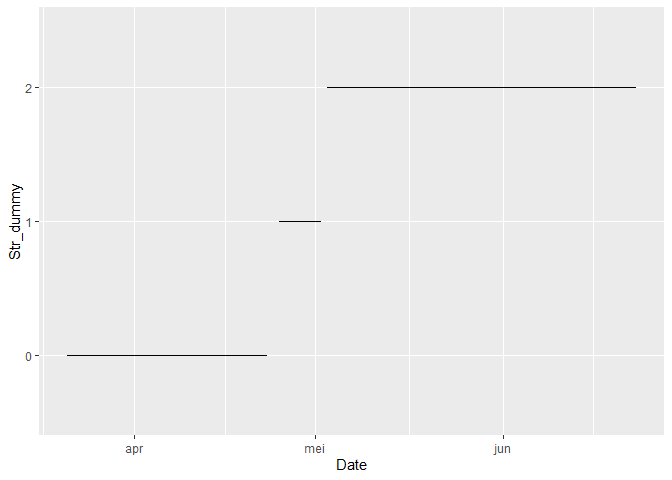

First analyses data prep
================
Anne Margit
9/29/2020

``` r
load("data_imputed_emomeans_maxmin.Rdata")
```

This dataset includes:

1.  Data from all weekly measurement waves (baseline through wave 11,
    Time 1 through 12)
2.  Participants who provided at least 3 measurements
3.  Participants who are residents of the country they currently live in
4.  Participants who provided info on age
5.  Participants who provided info on gender (either male or female)
6.  Data from countries with at least 20 participants
7.  Pooled age groups
8.  Imputed missing emotion scores
9.  Combined emotion scores (NAA, NAD, PAA, PAD)
10. An imputed Stringency index (StringencyIndex\_imp)
11. A variable indicating the number of days before and after the day on
    which maximum stringency was reached for the respective country
    (DaysMax)
12. A variable indicating the number of weeks before and after the day
    on which maximum stringency was reached for the respective country
    (WeeksMax)
13. A variable indicating the date on which maximum Stringency was
    reached for that country (DateMaxStr)

> My comments are in block quotes such as this.

``` r
library(dplyr)
library(tidyverse)
library(papaja)
library(ggpubr)
library(ggplot2)
library(lme4)
library(lmerTest)
```

    ## Warning: package 'lmerTest' was built under R version 4.0.3

``` r
library(rockchalk)
library(effects)
library(nlme)
library(lattice)
```

# Preparation

**Dummy coding Stringency** *Before the peak = 0. During peak = 1 (all
days with maximum stringency), after peak = 2*

``` r
data_analyse1 <- data_imputed_emomeans_maxmin %>%
  group_by(Country) %>%
  mutate(Str_dummy = ifelse(Date < DateMaxStr, 0, ifelse(StringencyIndex == MaxStr & Date >= DateMaxStr, 1, 2)))

data_analyse1$Str_dummy <- as_factor(data_analyse1$Str_dummy)

Dummy_N <- data_analyse1 %>%
group_by(Str_dummy) %>%
  summarise(N_dummy = n())
```

``` r
apa_table(Dummy_N)
```

<caption>

(\#tab:unnamed-chunk-4)

</caption>

<div data-custom-style="Table Caption">

\*\*

</div>

| Str\_dummy | N\_dummy |
| :--------- | :------- |
| 0          | 4155     |
| 1          | 29588    |
| 2          | 25630    |
| NA         | 66111    |

``` r
g_dummy1 <- data_analyse1 %>%
filter(Country == "Netherlands") %>%
  filter(!is.na(Date)) %>%
  ggplot(aes(x=Date, y=Str_dummy))

g_dummy1 + geom_line() 
```

<!-- -->

``` r
g_dummy2 <- data_analyse1 %>%
filter(Country == "Indonesia") %>%
  filter(!is.na(Date)) %>%
  ggplot(aes(x=Date, y=Str_dummy))

g_dummy2 + geom_line() 
```

<!-- -->

# Filter countries with a second peak

A few countries have a second peak in stringency. These are:

1.  Germany, starting at 2020-06-19
2.  Greece, starting at 2020-06-22
3.  Italy: starting at 2020-06-11
4.  Philippines: starting at 2020-06-15
5.  South Korea: starting at 2020-05-30
6.  United Kingdom: starting at 2020-06-08

<!-- end list -->

``` r
data_analyse1 <- data_analyse1[with(data_analyse1, order(Country, Date)),]

data_analyse1_f <- data_analyse1[!(data_analyse1$Country == "Germany" & data_analyse1$Date >= "2020-06-19"),]
tail(data_analyse1_f[which(data_analyse1_f$Country == "Germany"),]$Date, n=10L)
```

``` 
 [1] "2020-06-15" "2020-06-15" "2020-06-15" "2020-06-16" "2020-06-16" "2020-06-16" "2020-06-17" "2020-06-17" "2020-06-17" "2020-06-17"
```

``` r
data_analyse1_f <- data_analyse1_f[!(data_analyse1_f$Country == "Greece" & data_analyse1_f$Date >= "2020-06-22"),]
tail(data_analyse1_f[which(data_analyse1_f$Country == "Greece"),]$Date, n=10L)
```

``` 
 [1] "2020-06-20" "2020-06-20" "2020-06-20" "2020-06-20" "2020-06-20" "2020-06-21" "2020-06-21" "2020-06-21" "2020-06-21" "2020-06-21"
```

``` r
data_analyse1_f <- data_analyse1_f[!(data_analyse1_f$Country == "Italy" & data_analyse1_f$Date >= "2020-06-11"),]
tail(data_analyse1_f[which(data_analyse1_f$Country == "Italy"),]$Date, n=10L)
```

``` 
 [1] "2020-06-08" "2020-06-09" "2020-06-09" "2020-06-09" "2020-06-10" "2020-06-10" "2020-06-10" "2020-06-10" "2020-06-10" "2020-06-10"
```

``` r
data_analyse1_f <- data_analyse1_f[!(data_analyse1_f$Country == "Philippines" & data_analyse1_f$Date >= "2020-06-15"),]
tail(data_analyse1_f[which(data_analyse1_f$Country == "Philippines"),]$Date, n=10L)
```

``` 
 [1] "2020-06-14" "2020-06-14" "2020-06-14" "2020-06-14" "2020-06-14" "2020-06-14" "2020-06-14" "2020-06-14" "2020-06-14" "2020-06-14"
```

``` r
data_analyse1_f <- data_analyse1_f[!(data_analyse1_f$Country == "South Korea" & data_analyse1_f$Date >= "2020-05-30"),]
tail(data_analyse1_f[which(data_analyse1_f$Country == "South Korea"),]$Date, n=10L)
```

``` 
 [1] "2020-05-18" "2020-05-19" "2020-05-19" "2020-05-21" "2020-05-23" "2020-05-23" "2020-05-23" "2020-05-24" "2020-05-26" "2020-05-26"
```

``` r
data_analyse1_f <- data_analyse1_f[!(data_analyse1_f$Country == "United Kingdom" & data_analyse1_f$Date >= "2020-06-08"),]
tail(data_analyse1_f[which(data_analyse1_f$Country == "United Kingdom"),]$Date, n=10L)
```

``` 
 [1] "2020-06-07" "2020-06-07" "2020-06-07" "2020-06-07" "2020-06-07" "2020-06-07" "2020-06-07" "2020-06-07" "2020-06-07" "2020-06-07"
```

> This excludes 583 observations from the analyses

``` r
save(data_analyse1_f, file="data_analyse1_f.Rdata")
```

# Country mean centering Stringency Index

``` r
data_analyse1_fc <- gmc(data_analyse1_f, "StringencyIndex", "Country", FUN = mean, suffix = c("_mn", "_dev"),
    fulldataframe = TRUE)
```

``` r
save(data_analyse1_fc, file = "data_analyse1_fc.Rdata")
```
