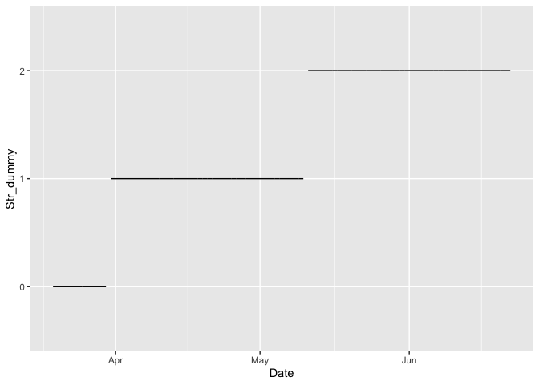
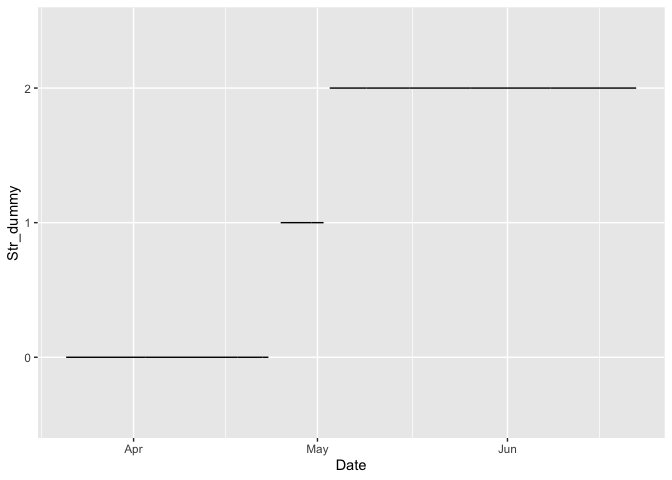
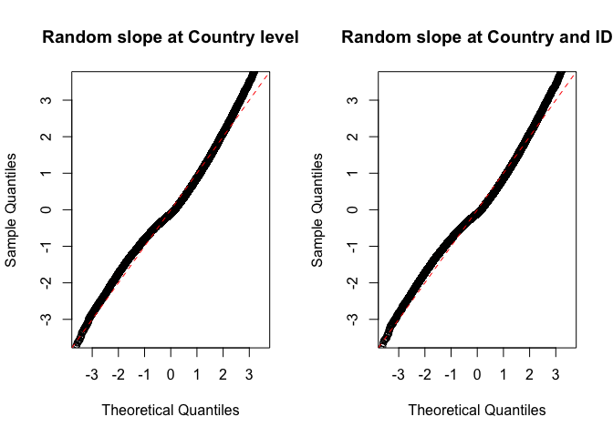
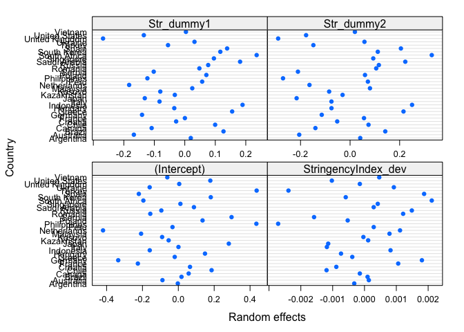
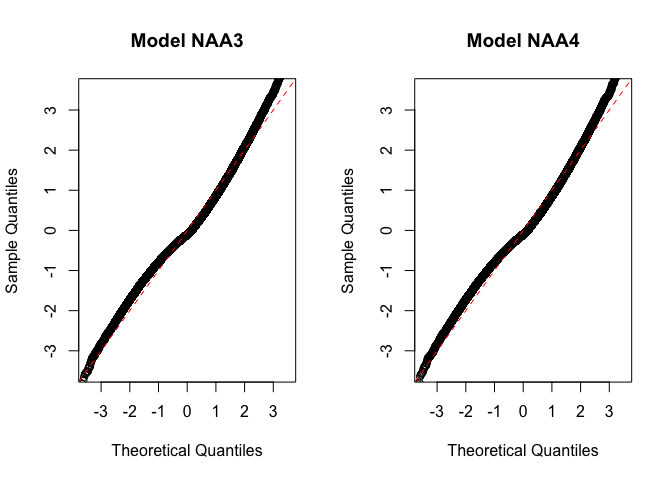
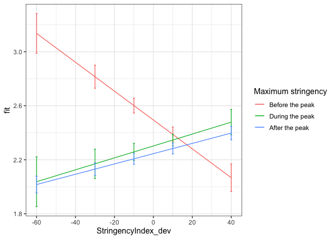

First analyses three-level centered
================
Anne Margit
9/08/2020

``` r
load("data_imputed_emomeans_maxmin.Rdata")
```

This dataset includes:

1.  Data from all weekly measurement waves (baseline through wave 11,
    Time 1 through 12)
2.  Participants who provided at least 3 measurements
3.  Participants who are residents of the country they currently live in
4.  Participants who provided info on age
5.  Participants who provided info on gender (either male or female)
6.  Data from countries with at least 20 participants
7.  Pooled age groups
8.  Imputed missing emotion scores
9.  Combined emotion scores (NAA, NAD, PAA, PAD)
10. An imputed Stringency index (StringencyIndex\_imp)
11. A variable indicating the number of days before and after the day on
    which maximum stringency was reached for the respective country
    (DaysMax)
12. A variable indicating the number of weeks before and after the day
    on which maximum stringency was reached for the respective country
    (WeeksMax)
13. A variable indicating the date on which maximum Stringency was
    reached for that country (DateMaxStr)

> My comments are in block quotes such as this.

``` r
library(dplyr)
library(tidyverse)
library(papaja)
library(ggpubr)
library(ggplot2)
library(lme4)
library(lmerTest)
library(rockchalk)
library(effects)
library(nlme)
library(lattice)
```

# Preparation

**Dummy coding Stringency** *Before the peak = 0. During peak = 1 (all
days with maximum stringency), after peak = 2*

``` r
data_analyse1 <- data_imputed_emomeans_maxmin %>%
  group_by(Country) %>%
  mutate(Str_dummy = ifelse(Date < DateMaxStr, 0, ifelse(StringencyIndex == MaxStr & Date >= DateMaxStr, 1, 2)))

data_analyse1$Str_dummy <- as_factor(data_analyse1$Str_dummy)

Dummy_N <- data_analyse1 %>%
group_by(Str_dummy) %>%
  summarise(N_dummy = n())
```

``` r
apa_table(Dummy_N)
```

<caption>

(\#tab:unnamed-chunk-4)

</caption>

<div data-custom-style="Table Caption">

\*\*

</div>

| Str\_dummy | N\_dummy |
| :--------- | :------- |
| 0          | 4107     |
| 1          | 29289    |
| 2          | 24884    |
| NA         | 65836    |

``` r
g_dummy1 <- data_analyse1 %>%
filter(Country == "Netherlands") %>%
  filter(!is.na(Date)) %>%
  ggplot(aes(x=Date, y=Str_dummy))

g_dummy1 + geom_line() 
```

<!-- -->

``` r
g_dummy2 <- data_analyse1 %>%
filter(Country == "Indonesia") %>%
  filter(!is.na(Date)) %>%
  ggplot(aes(x=Date, y=Str_dummy))

g_dummy2 + geom_line() 
```

<!-- -->

# Filter countries with a second peak

A few countries have a second peak in stringency. These are:

1.  Germany, starting at 2020-06-19
2.  Greece, starting at 2020-06-22
3.  Italy: starting at 2020-06-11
4.  Philippines: starting at 2020-06-15
5.  South Korea: starting at 2020-05-30
6.  United Kingdom: starting at
2020-06-08

<!-- end list -->

``` r
data_analyse1 <- data_analyse1[with(data_analyse1, order(Country, Date)),]

data_analyse1_f <- data_analyse1[!(data_analyse1$Country == "Germany" & data_analyse1$Date >= "2020-06-19"),]
tail(data_analyse1_f[which(data_analyse1_f$Country == "Germany"),]$Date, n=10L)
```

``` 
 [1] "2020-06-15" "2020-06-15" "2020-06-15" "2020-06-16" "2020-06-16" "2020-06-16" "2020-06-17" "2020-06-17" "2020-06-17" "2020-06-17"
```

``` r
data_analyse1_f <- data_analyse1_f[!(data_analyse1_f$Country == "Greece" & data_analyse1_f$Date >= "2020-06-22"),]
tail(data_analyse1_f[which(data_analyse1_f$Country == "Greece"),]$Date, n=10L)
```

``` 
 [1] "2020-06-20" "2020-06-20" "2020-06-20" "2020-06-20" "2020-06-20" "2020-06-21" "2020-06-21" "2020-06-21" "2020-06-21" "2020-06-21"
```

``` r
data_analyse1_f <- data_analyse1_f[!(data_analyse1_f$Country == "Italy" & data_analyse1_f$Date >= "2020-06-11"),]
tail(data_analyse1_f[which(data_analyse1_f$Country == "Italy"),]$Date, n=10L)
```

``` 
 [1] "2020-06-08" "2020-06-09" "2020-06-09" "2020-06-09" "2020-06-10" "2020-06-10" "2020-06-10" "2020-06-10" "2020-06-10" "2020-06-10"
```

``` r
data_analyse1_f <- data_analyse1_f[!(data_analyse1_f$Country == "Philippines" & data_analyse1_f$Date >= "2020-06-15"),]
tail(data_analyse1_f[which(data_analyse1_f$Country == "Philippines"),]$Date, n=10L)
```

``` 
 [1] "2020-06-14" "2020-06-14" "2020-06-14" "2020-06-14" "2020-06-14" "2020-06-14" "2020-06-14" "2020-06-14" "2020-06-14" "2020-06-14"
```

``` r
data_analyse1_f <- data_analyse1_f[!(data_analyse1_f$Country == "South Korea" & data_analyse1_f$Date >= "2020-05-30"),]
tail(data_analyse1_f[which(data_analyse1_f$Country == "South Korea"),]$Date, n=10L)
```

``` 
 [1] "2020-05-18" "2020-05-19" "2020-05-19" "2020-05-21" "2020-05-23" "2020-05-23" "2020-05-23" "2020-05-24" "2020-05-26" "2020-05-26"
```

``` r
data_analyse1_f <- data_analyse1_f[!(data_analyse1_f$Country == "United Kingdom" & data_analyse1_f$Date >= "2020-06-08"),]
tail(data_analyse1_f[which(data_analyse1_f$Country == "United Kingdom"),]$Date, n=10L)
```

``` 
 [1] "2020-06-07" "2020-06-07" "2020-06-07" "2020-06-07" "2020-06-07" "2020-06-07" "2020-06-07" "2020-06-07" "2020-06-07" "2020-06-07"
```

> This excludes 583 observations from the
analyses

``` r
save(data_analyse1_f, file="data_analyse1_f.Rdata")
```

# Country mean centering Stringency Index

``` r
data_analyse1_fc <- gmc(data_analyse1_f, "StringencyIndex", "Country", FUN = mean, suffix = c("_mn", "_dev"),
    fulldataframe = TRUE)
```

# Regression models

> Using nlme instead of lme4 because it allows for more complex variance
> covariance structures. Lme4 has as default unstructured. Default = ML

**Negative affect high arousal**

*Stringency Index x dummy
interaction*

``` r
model_NAA <- lme(fixed = NAA ~ StringencyIndex_dev + Str_dummy +  StringencyIndex_dev*Str_dummy,
                  random = ~1 | Country/ID, 
                 data = data_analyse1_fc, 
                 na.action = na.omit)

summary(model_NAA)
```

    Linear mixed-effects model fit by REML
     Data: data_analyse1_fc 
           AIC      BIC    logLik
      122414.9 122495.6 -61198.45
    
    Random effects:
     Formula: ~1 | Country
            (Intercept)
    StdDev:   0.2184774
    
     Formula: ~1 | ID %in% Country
            (Intercept)  Residual
    StdDev:   0.7564704 0.5679547
    
    Fixed effects: NAA ~ StringencyIndex_dev + Str_dummy + StringencyIndex_dev *      Str_dummy 
                                        Value  Std.Error    DF   t-value p-value
    (Intercept)                     2.4570372 0.04146949 47315  59.24928  0.0000
    StringencyIndex_dev            -0.0041665 0.00137009 47315  -3.04103  0.0024
    Str_dummy1                     -0.1885092 0.01528375 47315 -12.33396  0.0000
    Str_dummy2                     -0.2113501 0.01226793 47315 -17.22785  0.0000
    StringencyIndex_dev:Str_dummy1  0.0112569 0.00180501 47315   6.23649  0.0000
    StringencyIndex_dev:Str_dummy2  0.0069736 0.00143475 47315   4.86048  0.0000
     Correlation: 
                                   (Intr) StrnI_ Str_d1 Str_d2 SI_:S_1
    StringencyIndex_dev             0.071                             
    Str_dummy1                     -0.174 -0.286                      
    Str_dummy2                     -0.238 -0.234  0.573               
    StringencyIndex_dev:Str_dummy1 -0.064 -0.657 -0.265  0.263        
    StringencyIndex_dev:Str_dummy2 -0.069 -0.967  0.283  0.265  0.619 
    
    Standardized Within-Group Residuals:
           Min         Q1        Med         Q3        Max 
    -5.5466997 -0.5507910 -0.1087862  0.5184902  5.4651823 
    
    Number of Observations: 57663
    Number of Groups: 
            Country ID %in% Country 
                 33           10343 

*Random slope for Stringency Index at level 3
(Country)*

``` r
model_NAA2 <- lme(fixed = NAA ~ StringencyIndex_dev + Str_dummy +  StringencyIndex_dev*Str_dummy,
                  random = list (Country = ~StringencyIndex_dev, ID = ~1), 
                  data = data_analyse1_fc, 
                  na.action = na.omit)

summary(model_NAA2)
```

    Linear mixed-effects model fit by REML
     Data: data_analyse1_fc 
           AIC      BIC    logLik
      122400.7 122499.3 -61189.33
    
    Random effects:
     Formula: ~StringencyIndex_dev | Country
     Structure: General positive-definite, Log-Cholesky parametrization
                        StdDev      Corr  
    (Intercept)         0.218639848 (Intr)
    StringencyIndex_dev 0.003028882 -0.164
    
     Formula: ~1 | ID %in% Country
            (Intercept) Residual
    StdDev:   0.7565307 0.567668
    
    Fixed effects: NAA ~ StringencyIndex_dev + Str_dummy + StringencyIndex_dev *      Str_dummy 
                                        Value  Std.Error    DF   t-value p-value
    (Intercept)                     2.4603372 0.04157384 47315  59.17994  0.0000
    StringencyIndex_dev            -0.0030552 0.00167284 47315  -1.82635  0.0678
    Str_dummy1                     -0.2130258 0.01781186 47315 -11.95978  0.0000
    Str_dummy2                     -0.2111929 0.01273884 47315 -16.57866  0.0000
    StringencyIndex_dev:Str_dummy1  0.0131902 0.00212503 47315   6.20705  0.0000
    StringencyIndex_dev:Str_dummy2  0.0066507 0.00170597 47315   3.89849  0.0001
     Correlation: 
                                   (Intr) StrnI_ Str_d1 Str_d2 SI_:S_1
    StringencyIndex_dev             0.014                             
    Str_dummy1                     -0.169 -0.300                      
    Str_dummy2                     -0.241 -0.180  0.475               
    StringencyIndex_dev:Str_dummy1 -0.045 -0.523 -0.378  0.235        
    StringencyIndex_dev:Str_dummy2 -0.060 -0.864  0.192  0.242  0.651 
    
    Standardized Within-Group Residuals:
           Min         Q1        Med         Q3        Max 
    -5.5240223 -0.5517044 -0.1080045  0.5173281  5.5129989 
    
    Number of Observations: 57663
    Number of Groups: 
            Country ID %in% Country 
                 33           10343 

``` r
anova(model_NAA, model_NAA2)
```

``` 
           Model df      AIC      BIC    logLik   Test  L.Ratio p-value
model_NAA      1  9 122414.9 122495.6 -61198.45                        
model_NAA2     2 11 122400.7 122499.2 -61189.33 1 vs 2 18.23778   1e-04
```

*Random slope for Stringency Index at level 2 and
3*

``` r
model_NAA3 <- lme(fixed = NAA ~ StringencyIndex_dev + Str_dummy +  StringencyIndex_dev*Str_dummy,
                  random = ~StringencyIndex_dev | Country/ID, 
                  data = data_analyse1_fc, 
                  na.action = na.omit)

summary(model_NAA3)
```

    Linear mixed-effects model fit by REML
     Data: data_analyse1_fc 
         AIC      BIC   logLik
      121999 122115.5 -60986.5
    
    Random effects:
     Formula: ~StringencyIndex_dev | Country
     Structure: General positive-definite, Log-Cholesky parametrization
                        StdDev      Corr  
    (Intercept)         0.218732513 (Intr)
    StringencyIndex_dev 0.003094228 -0.2  
    
     Formula: ~StringencyIndex_dev | ID %in% Country
     Structure: General positive-definite, Log-Cholesky parametrization
                        StdDev     Corr  
    (Intercept)         0.75686925 (Intr)
    StringencyIndex_dev 0.01257908 -0.004
    Residual            0.55572950       
    
    Fixed effects: NAA ~ StringencyIndex_dev + Str_dummy + StringencyIndex_dev *      Str_dummy 
                                        Value  Std.Error    DF   t-value p-value
    (Intercept)                     2.4614195 0.04155957 47315  59.22630  0.0000
    StringencyIndex_dev            -0.0022596 0.00175430 47315  -1.28803  0.1977
    Str_dummy1                     -0.2178599 0.01779069 47315 -12.24573  0.0000
    Str_dummy2                     -0.2119223 0.01260040 47315 -16.81870  0.0000
    StringencyIndex_dev:Str_dummy1  0.0128699 0.00214745 47315   5.99312  0.0000
    StringencyIndex_dev:Str_dummy2  0.0059770 0.00176581 47315   3.38484  0.0007
     Correlation: 
                                   (Intr) StrnI_ Str_d1 Str_d2 SI_:S_1
    StringencyIndex_dev             0.002                             
    Str_dummy1                     -0.167 -0.311                      
    Str_dummy2                     -0.238 -0.171  0.469               
    StringencyIndex_dev:Str_dummy1 -0.044 -0.527 -0.367  0.233        
    StringencyIndex_dev:Str_dummy2 -0.058 -0.863  0.201  0.232  0.659 
    
    Standardized Within-Group Residuals:
           Min         Q1        Med         Q3        Max 
    -5.5046286 -0.5427173 -0.1042172  0.5061461  5.5365811 
    
    Number of Observations: 57663
    Number of Groups: 
            Country ID %in% Country 
                 33           10343 

``` r
anova(model_NAA2, model_NAA3)
```

``` 
           Model df      AIC      BIC    logLik   Test  L.Ratio p-value
model_NAA2     1 11 122400.7 122499.2 -61189.33                        
model_NAA3     2 13 121999.0 122115.5 -60986.50 1 vs 2 405.6733  <.0001
```

> Model with random slopes at both levels has better fit.

*Confidence intervals*

``` r
intervals(model_NAA3)
```

    Approximate 95% confidence intervals
    
     Fixed effects:
                                          lower         est.        upper
    (Intercept)                     2.379962117  2.461419464  2.542876811
    StringencyIndex_dev            -0.005698035 -0.002259589  0.001178856
    Str_dummy1                     -0.252729930 -0.217859935 -0.182989939
    Str_dummy2                     -0.236619248 -0.211922291 -0.187225334
    StringencyIndex_dev:Str_dummy1  0.008660906  0.012869948  0.017078990
    StringencyIndex_dev:Str_dummy2  0.002515970  0.005976991  0.009438013
    attr(,"label")
    [1] "Fixed effects:"
    
     Random Effects:
      Level: Country 
                                                lower         est.       upper
    sd((Intercept))                       0.165145781  0.218732513 0.289707142
    sd(StringencyIndex_dev)               0.001206123  0.003094228 0.007938035
    cor((Intercept),StringencyIndex_dev) -0.687741641 -0.199797497 0.412495427
      Level: ID 
                                               lower         est.      upper
    sd((Intercept))                       0.74110887  0.756869247 0.77296479
    sd(StringencyIndex_dev)               0.01151607  0.012579084 0.01374022
    cor((Intercept),StringencyIndex_dev) -0.02622224 -0.004126133 0.01797400
    
     Within-group standard error:
        lower      est.     upper 
    0.5519447 0.5557295 0.5595402 

*Plot random intercepts and
slopes*

``` r
plot(ranef(model_NAA3, level = 1))
```

<!-- -->

> Intercepts appear normally distributed except for the Netherlands and
> Germany, slightly negative. Slopes are randomly distributed as well,
> but United States slightly negative?

*QQ plots to compare residual distributions*

``` r
par(mfrow = c(1,2))
lims <- c(-3.5,3.5)
qqnorm(resid(model_NAA2, type = "normalized"),
xlim = lims, ylim = lims,main = "Random slope at Country level")
abline(0,1, col = "red", lty = 2)
qqnorm(resid(model_NAA3, type = "normalized"),
xlim = lims, ylim = lims, main = "Random slope at Country and ID")
abline(0,1, col = "red", lty = 2)
```

<!-- -->

> Residual distributions do not change much between models

*QQ plots to compare residual distributions between model with and
without random slopes*

``` r
par(mfrow = c(1,2))
lims <- c(-3.5,3.5)
qqnorm(resid(model_NAA, type = "normalized"),
xlim = lims, ylim = lims,main = "No random slopes")
abline(0,1, col = "red", lty = 2)
qqnorm(resid(model_NAA3, type = "normalized"),
xlim = lims, ylim = lims, main = "Random slope at Country and ID")
abline(0,1, col = "red", lty = 2)
```

<!-- -->

> Not much improvement

*Random slope for Str\_dummy op country level (and
Stringency)*

``` r
model_NAA4 <- lme(fixed = NAA ~ StringencyIndex_dev + Str_dummy +  StringencyIndex_dev*Str_dummy,
                  random = list (Country = ~ StringencyIndex_dev + Str_dummy, ID = ~ StringencyIndex_dev), 
                  data = data_analyse1_fc, 
                  na.action = na.omit)

summary(model_NAA4)
```

> Failed to converge

*Changing model iteration limit and model
optimizer*

``` r
model_NAA4 <- lme(fixed = NAA ~ StringencyIndex_dev + Str_dummy +  StringencyIndex_dev*Str_dummy,
                  random = list (Country = ~ StringencyIndex_dev + Str_dummy, ID = ~ StringencyIndex_dev), 
                  data = data_analyse1_fc, 
                  na.action = na.omit,
                  control = list(maxIter = 100, opt = "optim"))

summary(model_NAA4)
```

    Linear mixed-effects model fit by REML
     Data: data_analyse1_fc 
           AIC      BIC    logLik
      121824.9 122004.2 -60892.46
    
    Random effects:
     Formula: ~StringencyIndex_dev + Str_dummy | Country
     Structure: General positive-definite, Log-Cholesky parametrization
                        StdDev      Corr                
    (Intercept)         0.232379200 (Intr) StrnI_ Str_d1
    StringencyIndex_dev 0.001869833 -0.643              
    Str_dummy1          0.153885938 -0.324  0.310       
    Str_dummy2          0.200866531 -0.508  0.480  0.956
    
     Formula: ~StringencyIndex_dev | ID %in% Country
     Structure: General positive-definite, Log-Cholesky parametrization
                        StdDev     Corr  
    (Intercept)         0.75722628 (Intr)
    StringencyIndex_dev 0.01265424 -0.006
    Residual            0.55426358       
    
    Fixed effects: NAA ~ StringencyIndex_dev + Str_dummy + StringencyIndex_dev *      Str_dummy 
                                        Value  Std.Error    DF  t-value p-value
    (Intercept)                     2.4946565 0.04978894 47315 50.10463       0
    StringencyIndex_dev            -0.0106865 0.00227228 47315 -4.70297       0
    Str_dummy1                     -0.1924969 0.04034960 47315 -4.77073       0
    Str_dummy2                     -0.2495159 0.04482275 47315 -5.56672       0
    StringencyIndex_dev:Str_dummy1  0.0150979 0.00323897 47315  4.66132       0
    StringencyIndex_dev:Str_dummy2  0.0144946 0.00236371 47315  6.13212       0
     Correlation: 
                                   (Intr) StrnI_ Str_d1 Str_d2 SI_:S_1
    StringencyIndex_dev            -0.032                             
    Str_dummy1                     -0.466 -0.082                      
    Str_dummy2                     -0.643  0.014  0.827               
    StringencyIndex_dev:Str_dummy1 -0.108 -0.593 -0.209  0.127        
    StringencyIndex_dev:Str_dummy2 -0.039 -0.947  0.111  0.053  0.559 
    
    Standardized Within-Group Residuals:
           Min         Q1        Med         Q3        Max 
    -5.5295514 -0.5447629 -0.1004885  0.5074880  5.5314738 
    
    Number of Observations: 57663
    Number of Groups: 
            Country ID %in% Country 
                 33           10343 

``` r
anova(model_NAA3, model_NAA4)
```

``` 
           Model df      AIC      BIC    logLik   Test  L.Ratio p-value
model_NAA3     1 13 121999.0 122115.5 -60986.50                        
model_NAA4     2 20 121824.9 122004.2 -60892.46 1 vs 2 188.0674  <.0001
```

> Including random slope for Str\_dummy on level 3 improves model fit

*Plot random intercepts and
slopes*

``` r
plot(ranef(model_NAA4, level = 1))
```

<!-- -->

*QQ plots to compare residual distributions*

``` r
par(mfrow = c(1,2))
lims <- c(-3.5,3.5)
qqnorm(resid(model_NAA3, type = "normalized"),
xlim = lims, ylim = lims,main = "Model NAA3")
abline(0,1, col = "red", lty = 2)
qqnorm(resid(model_NAA4, type = "normalized"),
xlim = lims, ylim = lims, main = "Model NAA4")
abline(0,1, col = "red", lty = 2)
```

<!-- -->

> NAA3 = random slopes for stringency on level 2 and 3, NAA4 = NAA3 +
> random slope Str\_Dummy level 3

*Random slopes for Str\_dummy on level 2 and
3*

``` r
model_NAA5 <- lme(fixed = NAA ~ StringencyIndex_dev + Str_dummy +  StringencyIndex_dev*Str_dummy,
                  random = ~ StringencyIndex_dev + Str_dummy | Country/ID,
                  data = data_analyse1_fc, 
                  na.action = na.omit,
                  control = list(maxIter = 100, opt = "optim"))

summary(model_NAA5)
anova(model_NAA3, model_NAA4)
```

> Kreeg een hele lang error

*Autoregressive correlation structure*

> Using the corCAR1 error structure assumes that assessments are taken
> in varying
intervals.

``` r
model_NAA6 <- lme(fixed = NAA ~ StringencyIndex_dev + Str_dummy +  StringencyIndex_dev*Str_dummy,
                  random = list (Country = ~ StringencyIndex_dev + Str_dummy, ID = ~ StringencyIndex_dev),
                  data = data_analyse1_fc, 
                  na.action = na.omit,
                  correlation = corCAR1(),
                  control = list(maxIter = 100, opt = "optim"))

summary(model_NAA6)
anova(model_NAA3, model_NAA4)
```

> Ook een error (NA in foreign function call??)

*Plot of predicted values: random slope model for Str\_dummy op level 3
and stringency on level 2 and 3*

``` r
ef_NAA <- effect("StringencyIndex_dev:Str_dummy", model_NAA4)

plot_NAA <- ggplot(as.data.frame(ef_NAA), 
       aes(StringencyIndex_dev, fit, color=Str_dummy)) + geom_line() + 
  geom_errorbar(aes(ymin=fit-se, ymax=fit+se), width=1) + theme_bw(base_size=12) + scale_color_discrete(name="Maximum stringency", labels = c("Before the peak", "During the peak", "After the peak"))
```

``` r
plot_NAA
```

<!-- -->
