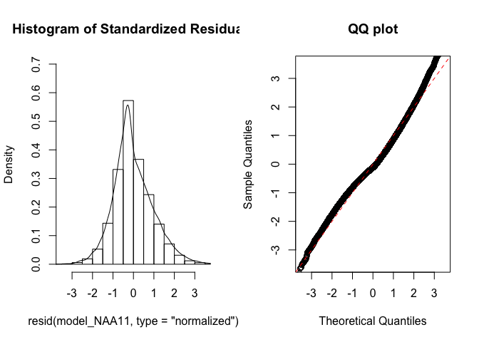
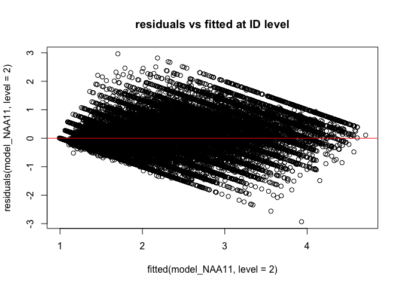
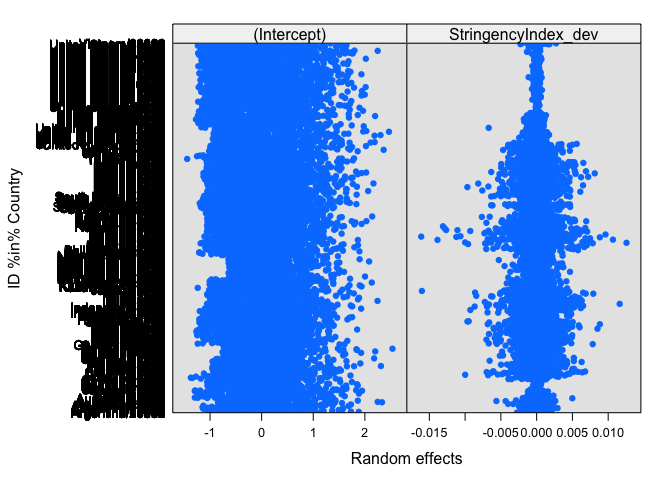
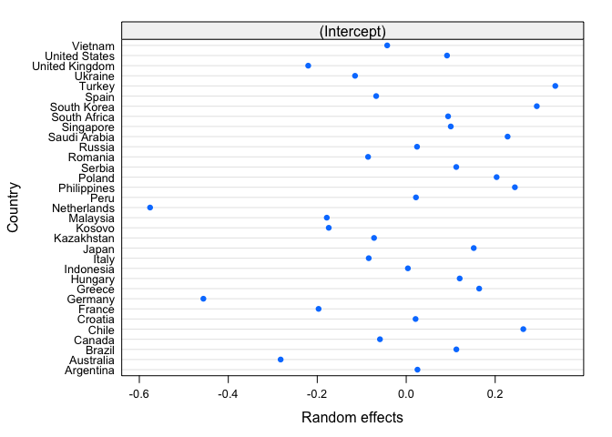
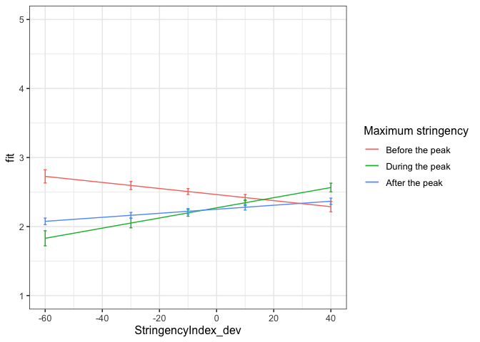

First analyses three-level centered2
================
Anne Margit
9/21/2020

    ## [1] "500Gb"

``` r
load("data_analyse1_f.Rdata")
```

This dataset includes:

1.  Data from all weekly measurement waves (baseline through wave 11,
    Time 1 through 12)
2.  Participants who provided at least 3 measurements
3.  Participants who are residents of the country they currently live in
4.  Participants who provided info on age
5.  Participants who provided info on gender (either male or female)
6.  Data from countries with at least 20 participants
7.  Pooled age groups
8.  Imputed missing emotion scores
9.  Combined emotion scores (NAA, NAD, PAA, PAD)
10. An imputed Stringency index (StringencyIndex\_imp)
11. A variable indicating the number of days before and after the day on
    which maximum stringency was reached for the respective country
    (DaysMax)
12. A variable indicating the number of weeks before and after the day
    on which maximum stringency was reached for the respective country
    (WeeksMax)
13. A variable indicating the date on which maximum Stringency was
    reached for that country (DateMaxStr)
14. A dummy Str\_dummy with 0 = before the peaj, 1 = during peak, 2 =
    after peak
15. Observations during which there was a second peak are excluded
    (N=583)

> My comments are in block quotes such as this.

``` r
library(dplyr)
library(tidyverse)
library(papaja)
library(ggpubr)
library(ggplot2)
library(rockchalk)
library(effects)
library(nlme)
library(lattice)
library(broom)
library(purrr)
```

# Country mean centering Stringency Index

``` r
data_analyse1_fc <- gmc(data_analyse1_f, "StringencyIndex", "Country", FUN = mean, suffix = c("_mn", "_dev"),
    fulldataframe = TRUE)
```

# Regression models

**Negative affect high arousal**

*Stringency Index x dummy interaction: random intercept for
Country*

``` r
model_NAA1 <- lme(fixed = NAA ~ StringencyIndex_dev + Str_dummy +  StringencyIndex_dev*Str_dummy,
                   random = ~1 | Country, 
                  data = data_analyse1_fc, 
                  na.action = na.omit)

summary(model_NAA1)
```

    Linear mixed-effects model fit by REML
     Data: data_analyse1_fc 
           AIC      BIC   logLik
      156929.2 157000.9 -78456.6
    
    Random effects:
     Formula: ~1 | Country
            (Intercept)  Residual
    StdDev:   0.2328747 0.9418571
    
    Fixed effects: NAA ~ StringencyIndex_dev + Str_dummy + StringencyIndex_dev *      Str_dummy 
                                        Value  Std.Error    DF   t-value p-value
    (Intercept)                     2.5084579 0.04412574 57625  56.84795  0.0000
    StringencyIndex_dev            -0.0020311 0.00208415 57625  -0.97455  0.3298
    Str_dummy1                     -0.2248704 0.02332842 57625  -9.63933  0.0000
    Str_dummy2                     -0.2928483 0.01854807 57625 -15.78861  0.0000
    StringencyIndex_dev:Str_dummy1  0.0084189 0.00275690 57625   3.05375  0.0023
    StringencyIndex_dev:Str_dummy2  0.0051878 0.00219458 57625   2.36391  0.0181
     Correlation: 
                                   (Intr) StrnI_ Str_d1 Str_d2 SI_:S_1
    StringencyIndex_dev             0.097                             
    Str_dummy1                     -0.248 -0.275                      
    Str_dummy2                     -0.344 -0.229  0.574               
    StringencyIndex_dev:Str_dummy1 -0.090 -0.657 -0.273  0.256        
    StringencyIndex_dev:Str_dummy2 -0.094 -0.966  0.275  0.262  0.612 
    
    Standardized Within-Group Residuals:
           Min         Q1        Med         Q3        Max 
    -1.9407377 -0.7575447 -0.1701048  0.6896763  3.4894699 
    
    Number of Observations: 57663
    Number of Groups: 33 

*Stringency Index x dummy interaction: random intercept for
ID*

``` r
model_NAA2 <- lme(fixed = NAA ~ StringencyIndex_dev + Str_dummy +  StringencyIndex_dev*Str_dummy,
                  random = ~1 | ID, 
                 data = data_analyse1_fc, 
                 na.action = na.omit)

summary(model_NAA2)
```

    Linear mixed-effects model fit by REML
     Data: data_analyse1_fc 
           AIC    BIC    logLik
      123050.3 123122 -61517.17
    
    Random effects:
     Formula: ~1 | ID
            (Intercept)  Residual
    StdDev:   0.7865806 0.5679512
    
    Fixed effects: NAA ~ StringencyIndex_dev + Str_dummy + StringencyIndex_dev *      Str_dummy 
                                        Value   Std.Error    DF   t-value p-value
    (Intercept)                     2.4171823 0.013310346 47315 181.60176   0e+00
    StringencyIndex_dev            -0.0050814 0.001355755 47315  -3.74800   2e-04
    Str_dummy1                     -0.1660883 0.014173918 47315 -11.71788   0e+00
    Str_dummy2                     -0.2190265 0.012090615 47315 -18.11541   0e+00
    StringencyIndex_dev:Str_dummy1  0.0090430 0.001710427 47315   5.28698   0e+00
    StringencyIndex_dev:Str_dummy2  0.0079959 0.001416851 47315   5.64345   0e+00
     Correlation: 
                                   (Intr) StrnI_ Str_d1 Str_d2 SI_:S_1
    StringencyIndex_dev             0.230                             
    Str_dummy1                     -0.662 -0.271                      
    Str_dummy2                     -0.731 -0.242  0.642               
    StringencyIndex_dev:Str_dummy1 -0.146 -0.723 -0.178  0.250        
    StringencyIndex_dev:Str_dummy2 -0.220 -0.967  0.266  0.274  0.686 
    
    Standardized Within-Group Residuals:
           Min         Q1        Med         Q3        Max 
    -5.5386052 -0.5494426 -0.1105310  0.5170167  5.4784887 
    
    Number of Observations: 57663
    Number of Groups: 10343 

*Random intercept for Country and
ID*

``` r
model_NAA3 <- lme(fixed = NAA ~ StringencyIndex_dev + Str_dummy +  StringencyIndex_dev*Str_dummy,
                  random = ~1 | Country/ID, 
                  data = data_analyse1_fc, 
                  na.action = na.omit)

summary(model_NAA3)
```

    Linear mixed-effects model fit by REML
     Data: data_analyse1_fc 
           AIC      BIC    logLik
      122414.9 122495.6 -61198.45
    
    Random effects:
     Formula: ~1 | Country
            (Intercept)
    StdDev:   0.2184774
    
     Formula: ~1 | ID %in% Country
            (Intercept)  Residual
    StdDev:   0.7564704 0.5679547
    
    Fixed effects: NAA ~ StringencyIndex_dev + Str_dummy + StringencyIndex_dev *      Str_dummy 
                                        Value  Std.Error    DF   t-value p-value
    (Intercept)                     2.4570372 0.04146949 47315  59.24928  0.0000
    StringencyIndex_dev            -0.0041665 0.00137009 47315  -3.04103  0.0024
    Str_dummy1                     -0.1885092 0.01528375 47315 -12.33396  0.0000
    Str_dummy2                     -0.2113501 0.01226793 47315 -17.22785  0.0000
    StringencyIndex_dev:Str_dummy1  0.0112569 0.00180501 47315   6.23649  0.0000
    StringencyIndex_dev:Str_dummy2  0.0069736 0.00143475 47315   4.86048  0.0000
     Correlation: 
                                   (Intr) StrnI_ Str_d1 Str_d2 SI_:S_1
    StringencyIndex_dev             0.071                             
    Str_dummy1                     -0.174 -0.286                      
    Str_dummy2                     -0.238 -0.234  0.573               
    StringencyIndex_dev:Str_dummy1 -0.064 -0.657 -0.265  0.263        
    StringencyIndex_dev:Str_dummy2 -0.069 -0.967  0.283  0.265  0.619 
    
    Standardized Within-Group Residuals:
           Min         Q1        Med         Q3        Max 
    -5.5466997 -0.5507910 -0.1087862  0.5184902  5.4651823 
    
    Number of Observations: 57663
    Number of Groups: 
            Country ID %in% Country 
                 33           10343 

*Random slope for
Country*

``` r
model_NAA4 <- lme(fixed = NAA ~ StringencyIndex_dev + Str_dummy +  StringencyIndex_dev*Str_dummy,
                  random = list (Country = ~StringencyIndex_dev, ID = ~1), 
                  data = data_analyse1_fc, 
                  na.action = na.omit)

summary(model_NAA4)
```

    Linear mixed-effects model fit by REML
     Data: data_analyse1_fc 
           AIC      BIC    logLik
      122400.7 122499.3 -61189.33
    
    Random effects:
     Formula: ~StringencyIndex_dev | Country
     Structure: General positive-definite, Log-Cholesky parametrization
                        StdDev      Corr  
    (Intercept)         0.218639848 (Intr)
    StringencyIndex_dev 0.003028882 -0.164
    
     Formula: ~1 | ID %in% Country
            (Intercept) Residual
    StdDev:   0.7565307 0.567668
    
    Fixed effects: NAA ~ StringencyIndex_dev + Str_dummy + StringencyIndex_dev *      Str_dummy 
                                        Value  Std.Error    DF   t-value p-value
    (Intercept)                     2.4603372 0.04157384 47315  59.17994  0.0000
    StringencyIndex_dev            -0.0030552 0.00167284 47315  -1.82635  0.0678
    Str_dummy1                     -0.2130258 0.01781186 47315 -11.95978  0.0000
    Str_dummy2                     -0.2111929 0.01273884 47315 -16.57866  0.0000
    StringencyIndex_dev:Str_dummy1  0.0131902 0.00212503 47315   6.20705  0.0000
    StringencyIndex_dev:Str_dummy2  0.0066507 0.00170597 47315   3.89849  0.0001
     Correlation: 
                                   (Intr) StrnI_ Str_d1 Str_d2 SI_:S_1
    StringencyIndex_dev             0.014                             
    Str_dummy1                     -0.169 -0.300                      
    Str_dummy2                     -0.241 -0.180  0.475               
    StringencyIndex_dev:Str_dummy1 -0.045 -0.523 -0.378  0.235        
    StringencyIndex_dev:Str_dummy2 -0.060 -0.864  0.192  0.242  0.651 
    
    Standardized Within-Group Residuals:
           Min         Q1        Med         Q3        Max 
    -5.5240223 -0.5517044 -0.1080045  0.5173281  5.5129989 
    
    Number of Observations: 57663
    Number of Groups: 
            Country ID %in% Country 
                 33           10343 

*Random slope for
ID*

``` r
model_NAA5 <- lme(fixed = NAA ~ StringencyIndex_dev + Str_dummy +  StringencyIndex_dev*Str_dummy,
                  random = list (Country = ~1, ID = ~StringencyIndex_dev), 
                  data = data_analyse1_fc, 
                  na.action = na.omit)

summary(model_NAA5)
```

    Linear mixed-effects model fit by REML
     Data: data_analyse1_fc 
           AIC    BIC   logLik
      122008.4 122107 -60993.2
    
    Random effects:
     Formula: ~1 | Country
            (Intercept)
    StdDev:   0.2183925
    
     Formula: ~StringencyIndex_dev | ID %in% Country
     Structure: General positive-definite, Log-Cholesky parametrization
                        StdDev     Corr  
    (Intercept)         0.75681429 (Intr)
    StringencyIndex_dev 0.01266127 -0.005
    Residual            0.55586801       
    
    Fixed effects: NAA ~ StringencyIndex_dev + Str_dummy + StringencyIndex_dev *      Str_dummy 
                                        Value  Std.Error    DF   t-value p-value
    (Intercept)                     2.4593671 0.04143254 47315  59.35834  0.0000
    StringencyIndex_dev            -0.0033115 0.00149528 47315  -2.21467  0.0268
    Str_dummy1                     -0.2010439 0.01561339 47315 -12.87638  0.0000
    Str_dummy2                     -0.2121266 0.01225711 47315 -17.30642  0.0000
    StringencyIndex_dev:Str_dummy1  0.0118091 0.00189972 47315   6.21623  0.0000
    StringencyIndex_dev:Str_dummy2  0.0065519 0.00157952 47315   4.14803  0.0000
     Correlation: 
                                   (Intr) StrnI_ Str_d1 Str_d2 SI_:S_1
    StringencyIndex_dev             0.067                             
    Str_dummy1                     -0.169 -0.298                      
    Str_dummy2                     -0.235 -0.223  0.542               
    StringencyIndex_dev:Str_dummy1 -0.061 -0.655 -0.269  0.266        
    StringencyIndex_dev:Str_dummy2 -0.066 -0.950  0.262  0.266  0.648 
    
    Standardized Within-Group Residuals:
           Min         Q1        Med         Q3        Max 
    -5.5209331 -0.5410660 -0.1047035  0.5061428  5.4947309 
    
    Number of Observations: 57663
    Number of Groups: 
            Country ID %in% Country 
                 33           10343 

*Random slope for Country and
ID*

``` r
model_NAA6 <- lme(fixed = NAA ~ StringencyIndex_dev + Str_dummy +  StringencyIndex_dev*Str_dummy,
                  random = ~StringencyIndex_dev | Country/ID, 
                  data = data_analyse1_fc, 
                  na.action = na.omit)

summary(model_NAA6)
```

    Linear mixed-effects model fit by REML
     Data: data_analyse1_fc 
         AIC      BIC   logLik
      121999 122115.5 -60986.5
    
    Random effects:
     Formula: ~StringencyIndex_dev | Country
     Structure: General positive-definite, Log-Cholesky parametrization
                        StdDev      Corr  
    (Intercept)         0.218732513 (Intr)
    StringencyIndex_dev 0.003094228 -0.2  
    
     Formula: ~StringencyIndex_dev | ID %in% Country
     Structure: General positive-definite, Log-Cholesky parametrization
                        StdDev     Corr  
    (Intercept)         0.75686925 (Intr)
    StringencyIndex_dev 0.01257908 -0.004
    Residual            0.55572950       
    
    Fixed effects: NAA ~ StringencyIndex_dev + Str_dummy + StringencyIndex_dev *      Str_dummy 
                                        Value  Std.Error    DF   t-value p-value
    (Intercept)                     2.4614195 0.04155957 47315  59.22630  0.0000
    StringencyIndex_dev            -0.0022596 0.00175430 47315  -1.28803  0.1977
    Str_dummy1                     -0.2178599 0.01779069 47315 -12.24573  0.0000
    Str_dummy2                     -0.2119223 0.01260040 47315 -16.81870  0.0000
    StringencyIndex_dev:Str_dummy1  0.0128699 0.00214745 47315   5.99312  0.0000
    StringencyIndex_dev:Str_dummy2  0.0059770 0.00176581 47315   3.38484  0.0007
     Correlation: 
                                   (Intr) StrnI_ Str_d1 Str_d2 SI_:S_1
    StringencyIndex_dev             0.002                             
    Str_dummy1                     -0.167 -0.311                      
    Str_dummy2                     -0.238 -0.171  0.469               
    StringencyIndex_dev:Str_dummy1 -0.044 -0.527 -0.367  0.233        
    StringencyIndex_dev:Str_dummy2 -0.058 -0.863  0.201  0.232  0.659 
    
    Standardized Within-Group Residuals:
           Min         Q1        Med         Q3        Max 
    -5.5046286 -0.5427173 -0.1042172  0.5061461  5.5365811 
    
    Number of Observations: 57663
    Number of Groups: 
            Country ID %in% Country 
                 33           10343 

*No correlation between intercept and slope for
Country*

``` r
model_NAA7 <- lme(fixed = NAA ~ StringencyIndex_dev + Str_dummy +  StringencyIndex_dev*Str_dummy,
                  random = list(Country = pdDiag(~StringencyIndex_dev), ID = ~StringencyIndex_dev), 
                  data = data_analyse1_fc, 
                  na.action = na.omit)

summary(model_NAA7)
```

    Linear mixed-effects model fit by REML
     Data: data_analyse1_fc 
           AIC      BIC    logLik
      121997.6 122105.1 -60986.78
    
    Random effects:
     Formula: ~StringencyIndex_dev | Country
     Structure: Diagonal
            (Intercept) StringencyIndex_dev
    StdDev:   0.2188019         0.003231941
    
     Formula: ~StringencyIndex_dev | ID %in% Country
     Structure: General positive-definite, Log-Cholesky parametrization
                        StdDev     Corr  
    (Intercept)         0.75687113 (Intr)
    StringencyIndex_dev 0.01257651 -0.004
    Residual            0.55572513       
    
    Fixed effects: NAA ~ StringencyIndex_dev + Str_dummy + StringencyIndex_dev *      Str_dummy 
                                        Value  Std.Error    DF   t-value p-value
    (Intercept)                     2.4618034 0.04157109 47315  59.21912  0.0000
    StringencyIndex_dev            -0.0022088 0.00177103 47315  -1.24721  0.2123
    Str_dummy1                     -0.2180001 0.01802032 47315 -12.09746  0.0000
    Str_dummy2                     -0.2124865 0.01261388 47315 -16.84545  0.0000
    StringencyIndex_dev:Str_dummy1  0.0129643 0.00216920 47315   5.97652  0.0000
    StringencyIndex_dev:Str_dummy2  0.0060607 0.00177382 47315   3.41675  0.0006
     Correlation: 
                                   (Intr) StrnI_ Str_d1 Str_d2 SI_:S_1
    StringencyIndex_dev             0.059                             
    Str_dummy1                     -0.165 -0.313                      
    Str_dummy2                     -0.238 -0.169  0.463               
    StringencyIndex_dev:Str_dummy1 -0.042 -0.515 -0.377  0.231        
    StringencyIndex_dev:Str_dummy2 -0.057 -0.857  0.197  0.231  0.657 
    
    Standardized Within-Group Residuals:
           Min         Q1        Med         Q3        Max 
    -5.4997850 -0.5426804 -0.1041820  0.5060580  5.5406671 
    
    Number of Observations: 57663
    Number of Groups: 
            Country ID %in% Country 
                 33           10343 

*No correlation between intercept and slope for
ID*

``` r
model_NAA8 <- lme(fixed = NAA ~ StringencyIndex_dev + Str_dummy +  StringencyIndex_dev*Str_dummy,
                  random = list (Country = ~StringencyIndex_dev, ID = pdDiag(~StringencyIndex_dev)), 
                  data = data_analyse1_fc, 
                  na.action = na.omit)

summary(model_NAA8)
```

    Linear mixed-effects model fit by REML
     Data: data_analyse1_fc 
         AIC      BIC    logLik
      121997 122104.6 -60986.51
    
    Random effects:
     Formula: ~StringencyIndex_dev | Country
     Structure: General positive-definite, Log-Cholesky parametrization
                        StdDev    Corr  
    (Intercept)         0.2187301 (Intr)
    StringencyIndex_dev 0.0030902 -0.201
    
     Formula: ~StringencyIndex_dev | ID %in% Country
     Structure: Diagonal
            (Intercept) StringencyIndex_dev  Residual
    StdDev:   0.7568319          0.01258038 0.5557272
    
    Fixed effects: NAA ~ StringencyIndex_dev + Str_dummy + StringencyIndex_dev *      Str_dummy 
                                        Value  Std.Error    DF   t-value p-value
    (Intercept)                     2.4614218 0.04155896 47315  59.22723  0.0000
    StringencyIndex_dev            -0.0022621 0.00175377 47315  -1.28985  0.1971
    Str_dummy1                     -0.2178623 0.01778696 47315 -12.24842  0.0000
    Str_dummy2                     -0.2119360 0.01259995 47315 -16.82039  0.0000
    StringencyIndex_dev:Str_dummy1  0.0128714 0.00214711 47315   5.99478  0.0000
    StringencyIndex_dev:Str_dummy2  0.0059810 0.00176553 47315   3.38764  0.0007
     Correlation: 
                                   (Intr) StrnI_ Str_d1 Str_d2 SI_:S_1
    StringencyIndex_dev             0.002                             
    Str_dummy1                     -0.167 -0.311                      
    Str_dummy2                     -0.238 -0.171  0.469               
    StringencyIndex_dev:Str_dummy1 -0.044 -0.527 -0.366  0.233        
    StringencyIndex_dev:Str_dummy2 -0.058 -0.863  0.201  0.232  0.659 
    
    Standardized Within-Group Residuals:
           Min         Q1        Med         Q3        Max 
    -5.5034476 -0.5426416 -0.1042423  0.5061974  5.5362729 
    
    Number of Observations: 57663
    Number of Groups: 
            Country ID %in% Country 
                 33           10343 

*No correlation between intercept and slope for Country and
ID*

``` r
model_NAA9 <- lme(fixed = NAA ~ StringencyIndex_dev + Str_dummy +  StringencyIndex_dev*Str_dummy,
                  random = list (Country = pdDiag(~StringencyIndex_dev), ID = pdDiag(~StringencyIndex_dev)),
                  data = data_analyse1_fc, 
                  na.action = na.omit)

summary(model_NAA9)
```

    Linear mixed-effects model fit by REML
     Data: data_analyse1_fc 
           AIC      BIC    logLik
      121995.6 122094.2 -60986.79
    
    Random effects:
     Formula: ~StringencyIndex_dev | Country
     Structure: Diagonal
            (Intercept) StringencyIndex_dev
    StdDev:   0.2188368         0.003229584
    
     Formula: ~StringencyIndex_dev | ID %in% Country
     Structure: Diagonal
            (Intercept) StringencyIndex_dev  Residual
    StdDev:     0.75683          0.01257776 0.5557229
    
    Fixed effects: NAA ~ StringencyIndex_dev + Str_dummy + StringencyIndex_dev *      Str_dummy 
                                        Value  Std.Error    DF   t-value p-value
    (Intercept)                     2.4618108 0.04157661 47315  59.21144  0.0000
    StringencyIndex_dev            -0.0022109 0.00177068 47315  -1.24859  0.2118
    Str_dummy1                     -0.2180040 0.01801842 47315 -12.09895  0.0000
    Str_dummy2                     -0.2125018 0.01261359 47315 -16.84705  0.0000
    StringencyIndex_dev:Str_dummy1  0.0129662 0.00216905 47315   5.97783  0.0000
    StringencyIndex_dev:Str_dummy2  0.0060650 0.00177363 47315   3.41951  0.0006
     Correlation: 
                                   (Intr) StrnI_ Str_d1 Str_d2 SI_:S_1
    StringencyIndex_dev             0.059                             
    Str_dummy1                     -0.165 -0.313                      
    Str_dummy2                     -0.238 -0.169  0.463               
    StringencyIndex_dev:Str_dummy1 -0.042 -0.515 -0.377  0.231        
    StringencyIndex_dev:Str_dummy2 -0.057 -0.857  0.197  0.232  0.657 
    
    Standardized Within-Group Residuals:
           Min         Q1        Med         Q3        Max 
    -5.4984942 -0.5428296 -0.1043207  0.5061008  5.5403790 
    
    Number of Observations: 57663
    Number of Groups: 
            Country ID %in% Country 
                 33           10343 

*Autoregressive correlation
structure*

``` r
data_analyse1_fc <- data_analyse1_fc[with(data_analyse1_fc, order(Country, ID, Time)),]
data_analyse1_fc$Time <- as.numeric(data_analyse1_fc$Time)

model_NAA10 <- lme(fixed = NAA ~ StringencyIndex_dev + Str_dummy +  StringencyIndex_dev*Str_dummy,
                   random = list (Country = pdDiag(~StringencyIndex_dev), ID = pdDiag(~StringencyIndex_dev)),
                  data = data_analyse1_fc, 
                  na.action = na.omit,
                  correlation = corAR1(form = ~ Time | Country/ID))

summary(model_NAA10)
```

    Linear mixed-effects model fit by REML
     Data: data_analyse1_fc 
           AIC      BIC    logLik
      120097.6 120205.1 -60036.79
    
    Random effects:
     Formula: ~StringencyIndex_dev | Country
     Structure: Diagonal
            (Intercept) StringencyIndex_dev
    StdDev:   0.2173281          0.00193539
    
     Formula: ~StringencyIndex_dev | ID %in% Country
     Structure: Diagonal
            (Intercept) StringencyIndex_dev  Residual
    StdDev:    0.732129          0.00682732 0.5942301
    
    Correlation Structure: ARMA(1,0)
     Formula: ~Time | Country/ID 
     Parameter estimate(s):
         Phi1 
    0.3379141 
    Fixed effects: NAA ~ StringencyIndex_dev + Str_dummy + StringencyIndex_dev *      Str_dummy 
                                        Value  Std.Error    DF   t-value p-value
    (Intercept)                     2.4684585 0.04148851 47315  59.49740  0.0000
    StringencyIndex_dev            -0.0040375 0.00164051 47315  -2.46114  0.0139
    Str_dummy1                     -0.2095552 0.01786840 47315 -11.72770  0.0000
    Str_dummy2                     -0.2169358 0.01369294 47315 -15.84289  0.0000
    StringencyIndex_dev:Str_dummy1  0.0131928 0.00213088 47315   6.19122  0.0000
    StringencyIndex_dev:Str_dummy2  0.0074276 0.00171838 47315   4.32244  0.0000
     Correlation: 
                                   (Intr) StrnI_ Str_d1 Str_d2 SI_:S_1
    StringencyIndex_dev             0.070                             
    Str_dummy1                     -0.177 -0.314                      
    Str_dummy2                     -0.255 -0.193  0.492               
    StringencyIndex_dev:Str_dummy1 -0.060 -0.562 -0.334  0.260        
    StringencyIndex_dev:Str_dummy2 -0.068 -0.903  0.234  0.253  0.633 
    
    Standardized Within-Group Residuals:
           Min         Q1        Med         Q3        Max 
    -4.9197489 -0.5649914 -0.1340106  0.4994438  5.0087667 
    
    Number of Observations: 57663
    Number of Groups: 
            Country ID %in% Country 
                 33           10343 

*AR without random slope for country, because model without random slope
for country was
better*

``` r
model_NAA11 <- lme(fixed = NAA ~ StringencyIndex_dev + Str_dummy +  StringencyIndex_dev*Str_dummy,
                  random = list (Country = ~1, ID = pdDiag(~StringencyIndex_dev)), 
                  data = data_analyse1_fc, 
                  na.action = na.omit,
                  correlation = corAR1(form = ~ Time | Country/ID))

summary(model_NAA11)
```

    Linear mixed-effects model fit by REML
     Data: data_analyse1_fc 
           AIC      BIC    logLik
      120105.6 120204.2 -60041.81
    
    Random effects:
     Formula: ~1 | Country
            (Intercept)
    StdDev:   0.2171807
    
     Formula: ~StringencyIndex_dev | ID %in% Country
     Structure: Diagonal
            (Intercept) StringencyIndex_dev  Residual
    StdDev:   0.7320867         0.006880119 0.5943817
    
    Correlation Structure: ARMA(1,0)
     Formula: ~Time | Country/ID 
     Parameter estimate(s):
         Phi1 
    0.3380812 
    Fixed effects: NAA ~ StringencyIndex_dev + Str_dummy + StringencyIndex_dev *      Str_dummy 
                                        Value  Std.Error    DF   t-value p-value
    (Intercept)                     2.4633916 0.04140610 47315  59.49344  0.0000
    StringencyIndex_dev            -0.0043934 0.00149078 47315  -2.94707  0.0032
    Str_dummy1                     -0.1922733 0.01633144 47315 -11.77320  0.0000
    Str_dummy2                     -0.2130145 0.01335324 47315 -15.95227  0.0000
    StringencyIndex_dev:Str_dummy1  0.0117440 0.00194675 47315   6.03258  0.0000
    StringencyIndex_dev:Str_dummy2  0.0073111 0.00157454 47315   4.64334  0.0000
     Correlation: 
                                   (Intr) StrnI_ Str_d1 Str_d2 SI_:S_1
    StringencyIndex_dev             0.076                             
    Str_dummy1                     -0.181 -0.304                      
    Str_dummy2                     -0.252 -0.228  0.546               
    StringencyIndex_dev:Str_dummy1 -0.073 -0.645 -0.261  0.278        
    StringencyIndex_dev:Str_dummy2 -0.074 -0.957  0.288  0.265  0.618 
    
    Standardized Within-Group Residuals:
           Min         Q1        Med         Q3        Max 
    -4.9324682 -0.5644975 -0.1352606  0.4994153  4.9877233 
    
    Number of Observations: 57663
    Number of Groups: 
            Country ID %in% Country 
                 33           10343 

> Model NAA11 has the best fit (lowest BIC), slightly better than NAA10.
> This model has only a random slope fo Stringency at the ID level,
> assumes no correlation between random slope and intercept, and assumes
> autoregressive correlation structure at the measurement level.

*QQ plot of residuals*

``` r
par(mfrow = c(1,2))
lims <- c(-3.5,3.5)
hist(resid(model_NAA11, type = "normalized"),
freq = FALSE, xlim = lims, ylim =  c(0,.7),main = "Histogram of Standardized Residuals")
lines(density(scale(resid(model_NAA11))))
qqnorm(resid(model_NAA11, type = "normalized"),
xlim = lims, ylim = lims,main = "QQ plot")
abline(0,1, col = "red", lty = 2)
```

<!-- -->

*Residuals vs fitted*

``` r
plot(fitted(model_NAA11, level=2), residuals(model_NAA11, level=2), 
     main="residuals vs fitted at ID level")
abline(a=0, b=0,col="red")
```

<!-- -->

``` r
plot(fitted(model_NAA11, level=1), residuals(model_NAA11, level=1), 
    main="residuals vs fitted at Country level")
abline(a=0, b=0,col="red")
```

<!-- -->

*Plot random intercepts and
slopes*

``` r
plot(ranef(model_NAA11, level = 1))
```

<!-- -->

``` r
plot(ranef(model_NAA11, level = 2))
```

<!-- -->

*Confidence intervals*

``` r
intervals(model_NAA11)
```

    Approximate 95% confidence intervals
    
     Fixed effects:
                                          lower         est.        upper
    (Intercept)                     2.382235058  2.463391606  2.544548154
    StringencyIndex_dev            -0.007315380 -0.004393431 -0.001471483
    Str_dummy1                     -0.224283183 -0.192273321 -0.160263459
    Str_dummy2                     -0.239187020 -0.213014479 -0.186841938
    StringencyIndex_dev:Str_dummy1  0.007928289  0.011743953  0.015559618
    StringencyIndex_dev:Str_dummy2  0.004224995  0.007311108  0.010397222
    attr(,"label")
    [1] "Fixed effects:"
    
     Random Effects:
      Level: Country 
                        lower      est.     upper
    sd((Intercept)) 0.1644187 0.2171807 0.2868741
      Level: ID 
                                  lower        est.       upper
    sd((Intercept))         0.720202607 0.732086678 0.744166848
    sd(StringencyIndex_dev) 0.005742046 0.006880119 0.008243757
    
     Correlation structure:
             lower      est.     upper
    Phi1 0.3241624 0.3380812 0.3518536
    attr(,"label")
    [1] "Correlation structure:"
    
     Within-group standard error:
        lower      est.     upper 
    0.5892770 0.5943817 0.5995306 

*Plot of predicted values*

``` r
ef_NAA <- effect("StringencyIndex_dev:Str_dummy", model_NAA11)

plot_NAA <- ggplot(as.data.frame(ef_NAA), 
       aes(StringencyIndex_dev, fit, color=Str_dummy)) + geom_line() + 
  geom_errorbar(aes(ymin=fit-se, ymax=fit+se), width=1) + theme_bw(base_size=12) + scale_color_discrete(name="Maximum stringency", labels = c("Before the peak", "During the peak", "After the peak")) + expand_limits(y=c(1, 5))
```

``` r
plot_NAA
```

<!-- -->

``` r
coef_NAA = tidy(model_NAA11, 
               effects = "fixed")
```

*Effect sizes* **Within person SD and average within person SD**

``` r
ISDs <- data_analyse1_fc %>% 
  group_by(ID) %>%
  summarize_at(c("StringencyIndex_dev", "NAA", "NAD", "PAA", "PAD"), sd, na.rm=TRUE) %>%
  ungroup()

ISDs_av <- ISDs %>%
  summarize_at(c("StringencyIndex_dev", "NAA", "NAD", "PAA", "PAD"), mean, na.rm=TRUE) %>%
  stack() %>%
  rename(sd=values) 
```

> Effect size = (regression coefficient \* average ISD of X) / average
> ISD of Y)

> For the intercept and the dummy variables (+ interaction) I only
> standardized Y, so the effect size = (regression coefficient / average
> ISD of Y)

``` r
coef_NAA <- coef_NAA %>%
 left_join(., ISDs_av, by=c("term"="ind"))

coef_NAA <- coef_NAA %>%
  mutate(sd = ifelse(is.na(sd), 1, sd))

coef_NAA <- coef_NAA %>%
 mutate(e_size = (estimate * sd)/0.5046733)

coef_NAA <- coef_NAA %>%
  rename(isd = sd)
```

``` r
coef_NAA
```

    ## # A tibble: 6 x 7
    ##   term                           estimate std.error statistic  p.value   isd  e_size
    ##   <chr>                             <dbl>     <dbl>     <dbl>    <dbl> <dbl>   <dbl>
    ## 1 (Intercept)                     2.46      0.0414      59.5  0.        1     4.88  
    ## 2 StringencyIndex_dev            -0.00439   0.00149     -2.95 3.21e- 3  6.12 -0.0533
    ## 3 Str_dummy1                     -0.192     0.0163     -11.8  5.95e-32  1    -0.381 
    ## 4 Str_dummy2                     -0.213     0.0134     -16.0  3.87e-57  1    -0.422 
    ## 5 StringencyIndex_dev:Str_dummy1  0.0117    0.00195      6.03 1.63e- 9  1     0.0233
    ## 6 StringencyIndex_dev:Str_dummy2  0.00731   0.00157      4.64 3.44e- 6  1     0.0145

> Effect size interpretation: small = 0.1, medium = 0.3, large = 0.5

``` r
save(ISDs_av, file="ISDs_av.Rdata")
save(data_analyse1_fc, file = "data_analyse1_fc.Rdata")
```
