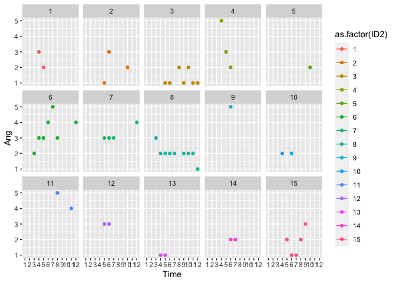

200819 Merging imputed data
================
Anne Margit
8/19/2020

``` r
library(dplyr)
library(knitr)
library(tidyverse)
library(ggplot2)
library(psych)
```

``` r
load("data_long_min3_str_age.Rdata")
load("selectieImputed2.Rdata")
```

Rename imputed variables:

``` r
selectieNew <- selectieImputed2 %>%
  rename("Ang_imp" = "Ang",
         "Anxiety_imp" = "Anxiety",
         "Calm_imp" = "Calm",
         "Content_imp" = "Content",
         "Depr_imp" = "Depr",
         "Energ_imp" = "Energ",
         "Exh_imp" = "Exh",
         "Insp_imp" = "Insp",
         "Nerv_imp" = "Nerv",
         "Rel_imp" = "Rel") %>%
  select(-ID2)
```

Merge imputed dataset with original dataset:

``` r
data_long_min3_str_age$ID <- as.factor(data_long_min3_str_age$ID)
selectieNew$ID <- as.factor(selectieNew$ID)

data_merge1 <- left_join(data_long_min3_str_age, selectieNew, by=c("ID", "Time"))
```

Create new variables in which rows that have no observations at all are
coded
missing:

``` r
data_merge1$Ang_imp2 <- ifelse(is.na(data_merge1$Ang) & is.na(data_merge1$Anxiety) & is.na(data_merge1$Calm) & is.na(data_merge1$Content) & is.na(data_merge1$Depr) & is.na(data_merge1$Energ) & is.na(data_merge1$Exh) & is.na(data_merge1$Insp) & is.na(data_merge1$Nerv) & is.na(data_merge1$Rel), NA, data_merge1$Ang_imp)

data_merge1$Anxiety_imp2 <- ifelse(is.na(data_merge1$Ang) & is.na(data_merge1$Anxiety) & is.na(data_merge1$Calm) & is.na(data_merge1$Content) & is.na(data_merge1$Depr) & is.na(data_merge1$Energ) & is.na(data_merge1$Exh) & is.na(data_merge1$Insp) & is.na(data_merge1$Nerv) & is.na(data_merge1$Rel), NA, data_merge1$Anxiety_imp)

data_merge1$Calm_imp2 <- ifelse(is.na(data_merge1$Ang) & is.na(data_merge1$Anxiety) & is.na(data_merge1$Calm) & is.na(data_merge1$Content) & is.na(data_merge1$Depr) & is.na(data_merge1$Energ) & is.na(data_merge1$Exh) & is.na(data_merge1$Insp) & is.na(data_merge1$Nerv) & is.na(data_merge1$Rel), NA, data_merge1$Calm_imp)

data_merge1$Content_imp2 <- ifelse(is.na(data_merge1$Ang) & is.na(data_merge1$Anxiety) & is.na(data_merge1$Calm) & is.na(data_merge1$Content) & is.na(data_merge1$Depr) & is.na(data_merge1$Energ) & is.na(data_merge1$Exh) & is.na(data_merge1$Insp) & is.na(data_merge1$Nerv) & is.na(data_merge1$Rel), NA, data_merge1$Content_imp)

data_merge1$Depr_imp2 <- ifelse(is.na(data_merge1$Ang) & is.na(data_merge1$Anxiety) & is.na(data_merge1$Calm) & is.na(data_merge1$Content) & is.na(data_merge1$Depr) & is.na(data_merge1$Energ) & is.na(data_merge1$Exh) & is.na(data_merge1$Insp) & is.na(data_merge1$Nerv) & is.na(data_merge1$Rel), NA, data_merge1$Depr_imp)

data_merge1$Energ_imp2 <- ifelse(is.na(data_merge1$Ang) & is.na(data_merge1$Anxiety) & is.na(data_merge1$Calm) & is.na(data_merge1$Content) & is.na(data_merge1$Depr) & is.na(data_merge1$Energ) & is.na(data_merge1$Exh) & is.na(data_merge1$Insp) & is.na(data_merge1$Nerv) & is.na(data_merge1$Rel), NA, data_merge1$Energ_imp)

data_merge1$Exh_imp2 <- ifelse(is.na(data_merge1$Ang) & is.na(data_merge1$Anxiety) & is.na(data_merge1$Calm) & is.na(data_merge1$Content) & is.na(data_merge1$Depr) & is.na(data_merge1$Energ) & is.na(data_merge1$Exh) & is.na(data_merge1$Insp) & is.na(data_merge1$Nerv) & is.na(data_merge1$Rel), NA, data_merge1$Exh_imp)

data_merge1$Insp_imp2 <- ifelse(is.na(data_merge1$Ang) & is.na(data_merge1$Anxiety) & is.na(data_merge1$Calm) & is.na(data_merge1$Content) & is.na(data_merge1$Depr) & is.na(data_merge1$Energ) & is.na(data_merge1$Exh) & is.na(data_merge1$Insp) & is.na(data_merge1$Nerv) & is.na(data_merge1$Rel), NA, data_merge1$Insp_imp)

data_merge1$Nerv_imp2 <- ifelse(is.na(data_merge1$Ang) & is.na(data_merge1$Anxiety) & is.na(data_merge1$Calm) & is.na(data_merge1$Content) & is.na(data_merge1$Depr) & is.na(data_merge1$Energ) & is.na(data_merge1$Exh) & is.na(data_merge1$Insp) & is.na(data_merge1$Nerv) & is.na(data_merge1$Rel), NA, data_merge1$Nerv_imp)

data_merge1$Rel_imp2 <- ifelse(is.na(data_merge1$Ang) & is.na(data_merge1$Anxiety) & is.na(data_merge1$Calm) & is.na(data_merge1$Content) & is.na(data_merge1$Depr) & is.na(data_merge1$Energ) & is.na(data_merge1$Exh) & is.na(data_merge1$Insp) & is.na(data_merge1$Nerv) & is.na(data_merge1$Rel), NA, data_merge1$Rel_imp)
```

Drop other emotion variables (original items and imputed items)

``` r
data_merge2 <- data_merge1 %>%
  select(-c("Ang", "Anxiety", "Calm", "Content", "Depr", "Energ", "Exh", "Insp", "Nerv", "Rel",
            "Ang_imp", "Anxiety_imp", "Calm_imp", "Content_imp", "Depr_imp", "Energ_imp", "Exh_imp", "Insp_imp", "Nerv_imp", "Rel_imp"))
```

Rename variables:

``` r
data_imputed <- data_merge2 %>%
  rename("Ang" = "Ang_imp2",
         "Anxiety" = "Anxiety_imp2",
         "Calm" = "Calm_imp2",
         "Content" = "Content_imp2",
         "Depr" = "Depr_imp2",
         "Energ" = "Energ_imp2",
         "Exh" = "Exh_imp2",
         "Insp" = "Insp_imp2",
         "Nerv" = "Nerv_imp2",
         "Rel" = "Rel_imp2") %>%
  select(-c("Bored", "Exc", "Lov"))
```

Check original data

``` r
summary(data_long_min3_str_age[,8:20])
```

    ##       Ang           Anxiety          Bored            Calm      
    ##  Min.   :1.00    Min.   :1.00    Min.   :1.00    Min.   :1.00   
    ##  1st Qu.:1.00    1st Qu.:1.00    1st Qu.:1.00    1st Qu.:2.00   
    ##  Median :2.00    Median :2.00    Median :2.00    Median :3.00   
    ##  Mean   :1.98    Mean   :2.37    Mean   :2.13    Mean   :3.07   
    ##  3rd Qu.:3.00    3rd Qu.:3.00    3rd Qu.:3.00    3rd Qu.:4.00   
    ##  Max.   :5.00    Max.   :5.00    Max.   :5.00    Max.   :5.00   
    ##  NA's   :76349   NA's   :66045   NA's   :81635   NA's   :66033  
    ##     Content            Depr           Energ            Exc        
    ##  Min.   :1.00     Min.   :1       Min.   :1.00    Min.   :1       
    ##  1st Qu.:2.00     1st Qu.:1       1st Qu.:2.00    1st Qu.:1       
    ##  Median :3.00     Median :2       Median :3.00    Median :2       
    ##  Mean   :2.65     Mean   :2       Mean   :2.65    Mean   :2       
    ##  3rd Qu.:3.00     3rd Qu.:3       3rd Qu.:3.00    3rd Qu.:3       
    ##  Max.   :5.00     Max.   :5       Max.   :5.00    Max.   :5       
    ##  NA's   :113845   NA's   :66072   NA's   :66098   NA's   :113857  
    ##       Exh             Insp            Lov             Nerv      
    ##  Min.   :1.00    Min.   :1.00    Min.   :1.00    Min.   :1.00   
    ##  1st Qu.:1.00    1st Qu.:2.00    1st Qu.:3.00    1st Qu.:1.00   
    ##  Median :2.00    Median :2.00    Median :4.00    Median :2.00   
    ##  Mean   :2.34    Mean   :2.48    Mean   :3.44    Mean   :2.25   
    ##  3rd Qu.:3.00    3rd Qu.:3.00    3rd Qu.:4.00    3rd Qu.:3.00   
    ##  Max.   :5.00    Max.   :5.00    Max.   :5.00    Max.   :5.00   
    ##  NA's   :66097   NA's   :66123   NA's   :76336   NA's   :66073  
    ##       Rel       
    ##  Min.   :1.00   
    ##  1st Qu.:2.00   
    ##  Median :3.00   
    ##  Mean   :2.88   
    ##  3rd Qu.:4.00   
    ##  Max.   :5.00   
    ##  NA's   :66078

Compare original data and imputed data

``` r
summary(data_imputed[,21:30])
```

    ##       Ang           Anxiety           Calm          Content     
    ##  Min.   :-1.85   Min.   :0.64    Min.   :0.96    Min.   :1.00   
    ##  1st Qu.: 1.00   1st Qu.:1.00    1st Qu.:2.00    1st Qu.:2.40   
    ##  Median : 2.00   Median :2.00    Median :3.00    Median :2.72   
    ##  Mean   : 2.00   Mean   :2.37    Mean   :3.07    Mean   :2.68   
    ##  3rd Qu.: 3.00   3rd Qu.:3.00    3rd Qu.:4.00    3rd Qu.:3.00   
    ##  Max.   : 7.20   Max.   :5.00    Max.   :5.26    Max.   :5.00   
    ##  NA's   :65870   NA's   :65870   NA's   :65870   NA's   :65870  
    ##       Depr           Energ            Exh             Insp      
    ##  Min.   :0.31    Min.   :0.66    Min.   :0.60    Min.   :0.53   
    ##  1st Qu.:1.00    1st Qu.:2.00    1st Qu.:1.00    1st Qu.:2.00   
    ##  Median :2.00    Median :3.00    Median :2.00    Median :2.00   
    ##  Mean   :2.00    Mean   :2.65    Mean   :2.34    Mean   :2.48   
    ##  3rd Qu.:3.00    3rd Qu.:3.00    3rd Qu.:3.00    3rd Qu.:3.00   
    ##  Max.   :5.00    Max.   :5.12    Max.   :5.00    Max.   :5.00   
    ##  NA's   :65870   NA's   :65870   NA's   :65870   NA's   :65870  
    ##       Nerv            Rel       
    ##  Min.   :0.59    Min.   :0.81   
    ##  1st Qu.:1.00    1st Qu.:2.00   
    ##  Median :2.00    Median :3.00   
    ##  Mean   :2.25    Mean   :2.88   
    ##  3rd Qu.:3.00    3rd Qu.:4.00   
    ##  Max.   :5.00    Max.   :5.20   
    ##  NA's   :65870   NA's   :65870

Maak wat plotjes met lijnen per id, op een selectie van de eerste 15
personen:

``` r
class(data_long_min3_str_age$ID)
```

    ## [1] "factor"

``` r
data_long_min3_str_age$ID2 <- as.numeric(data_long_min3_str_age$ID)
describe(data_long_min3_str_age$ID2)
```

    ##    vars      n mean      sd median trimmed  mad min   max range skew kurtosis
    ## X1    1 124116 5172 2985.78   5172    5172 3834   1 10343 10342    0     -1.2
    ##      se
    ## X1 8.48

``` r
class(data_imputed$ID)
```

    ## [1] "factor"

``` r
data_imputed$ID2 <- as.numeric(data_imputed$ID)
describe(data_imputed$ID2)
```

    ##    vars      n mean      sd median trimmed  mad min   max range skew kurtosis
    ## X1    1 124116 5172 2985.78   5172    5172 3834   1 10343 10342    0     -1.2
    ##      se
    ## X1 8.48

Originele
data:

``` r
plot1<- ggplot(data = data_long_min3_str_age[which(data_long_min3_str_age$ID2 <16), ], aes(x = Time, y = Ang, color=as.factor(ID2))) + geom_line() + geom_point() + facet_wrap(. ~ ID2, nrow=3)

plot1
```

    ## Warning: Removed 128 row(s) containing missing values (geom_path).

    ## Warning: Removed 128 rows containing missing values (geom_point).

<!-- -->

Originele data gemerged met geimputeerde
data:

``` r
plot2<- ggplot(data = data_imputed[which(data_imputed$ID2 <16), ], aes(x = Time, y = Ang, color=as.factor(ID2))) + geom_line() + geom_point() + facet_wrap(. ~ ID2, nrow=3)

plot2
```

    ## Warning: Removed 111 row(s) containing missing values (geom_path).

    ## Warning: Removed 111 rows containing missing values (geom_point).

<!-- -->

``` r
save(data_imputed, file="data_imputed.Rdata")
```
