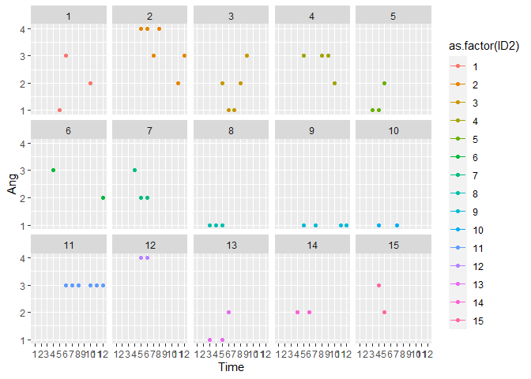
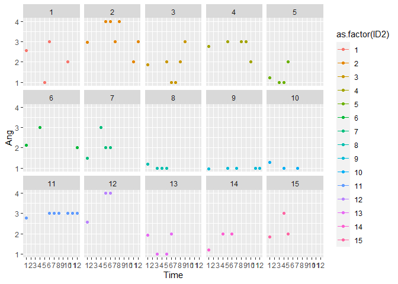

Merging imputed data
================
Anne Margit
10/26/2020

``` r
library(dplyr)
library(knitr)
library(tidyverse)
library(ggplot2)
library(psych)
```

    ## Warning: package 'psych' was built under R version 4.0.3

``` r
library(papaja)
```

``` r
load("data_long_min3_str_age.Rdata")
load("selectieImputed2.Rdata")
```

Rename imputed variables:

``` r
selectieNew <- selectieImputed2 %>%
  rename("Ang_imp" = "Ang",
         "Anxiety_imp" = "Anxiety",
         "Calm_imp" = "Calm",
         "Depr_imp" = "Depr",
         "Energ_imp" = "Energ",
         "Exh_imp" = "Exh",
         "Insp_imp" = "Insp",
         "Nerv_imp" = "Nerv",
         "Rel_imp" = "Rel") 
```

Merge imputed dataset with original dataset:

``` r
data_long_min3_str_age$ID <- as.factor(data_long_min3_str_age$ID)
selectieNew$ID <- as.factor(selectieNew$ID)

data_merge1 <- left_join(data_long_min3_str_age, selectieNew, by=c("ID", "Time"))
```

``` r
describe(data_merge1$Nmiss)
```

    ##    vars      n mean   sd median trimmed mad min max range  skew kurtosis   se
    ## X1    1 125484 4.84 4.41      9    4.93   0   0   9     9 -0.13    -1.97 0.01

``` r
data_merge1 <- as_tibble(data_merge1)

data_merge1 %>%
  dplyr::summarize(n= sum(Nmiss == 8))
```

    ## # A tibble: 1 x 1
    ##       n
    ##   <int>
    ## 1    24

``` r
data_merge1 %>%
  dplyr::summarize(n= sum(Nmiss == 7))
```

    ## # A tibble: 1 x 1
    ##       n
    ##   <int>
    ## 1   137

``` r
data_merge1 %>%
  dplyr::summarize(n= sum(Nmiss == 6))
```

    ## # A tibble: 1 x 1
    ##       n
    ##   <int>
    ## 1    82

``` r
data_merge1 %>%
  dplyr::summarize(n= sum(Nmiss == 5))
```

    ## # A tibble: 1 x 1
    ##       n
    ##   <int>
    ## 1    23

Create new variable coded as missing if sum of missings = 9 (if all
scores are missing)

``` r
data_merge1$Ang_imp2 <- ifelse(data_merge1$Nmiss == 9, NA, data_merge1$Ang_imp)

data_merge1$Anxiety_imp2 <- ifelse(data_merge1$Nmiss == 9, NA, data_merge1$Anxiety_imp)

data_merge1$Nerv_imp2 <- ifelse(data_merge1$Nmiss == 9, NA, data_merge1$Nerv_imp)

data_merge1$Depr_imp2 <- ifelse(data_merge1$Nmiss == 9, NA, data_merge1$Depr_imp)

data_merge1$Exh_imp2 <- ifelse(data_merge1$Nmiss == 9, NA, data_merge1$Exh_imp)

data_merge1$Energ_imp2 <- ifelse(data_merge1$Nmiss == 9, NA, data_merge1$Energ_imp)

data_merge1$Insp_imp2 <- ifelse(data_merge1$Nmiss == 9, NA, data_merge1$Insp_imp)

data_merge1$Calm_imp2 <- ifelse(data_merge1$Nmiss == 9, NA, data_merge1$Calm_imp)

data_merge1$Rel_imp2 <- ifelse(data_merge1$Nmiss == 9, NA, data_merge1$Rel_imp)
```

Drop other emotion variables (original items and imputed items)

``` r
data_merge2 <- data_merge1 %>%
  select(-c("Ang", "Anxiety", "Calm", "Depr", "Energ", "Exh", "Insp", "Nerv", "Rel",
            "Ang_imp", "Anxiety_imp", "Calm_imp", "Depr_imp", "Energ_imp", "Exh_imp", "Insp_imp", "Nerv_imp", "Rel_imp"))
```

Rename variables:

``` r
data_imputed <- data_merge2 %>%
  rename("Ang" = "Ang_imp2",
         "Anxiety" = "Anxiety_imp2",
         "Calm" = "Calm_imp2",
         "Depr" = "Depr_imp2",
         "Energ" = "Energ_imp2",
         "Exh" = "Exh_imp2",
         "Insp" = "Insp_imp2",
         "Nerv" = "Nerv_imp2",
         "Rel" = "Rel_imp2") 
```

Check original data

``` r
summary(data_long_min3_str_age[,8:16])
```

    ##       Ang           Anxiety           Calm            Depr      
    ##  Min.   :1.00    Min.   :1.00    Min.   :1.00    Min.   :1      
    ##  1st Qu.:1.00    1st Qu.:1.00    1st Qu.:2.00    1st Qu.:1      
    ##  Median :2.00    Median :2.00    Median :3.00    Median :2      
    ##  Mean   :1.98    Mean   :2.37    Mean   :3.07    Mean   :2      
    ##  3rd Qu.:3.00    3rd Qu.:3.00    3rd Qu.:4.00    3rd Qu.:3      
    ##  Max.   :5.00    Max.   :5.00    Max.   :5.00    Max.   :5      
    ##  NA's   :76747   NA's   :66328   NA's   :66318   NA's   :66358  
    ##      Energ            Exh             Insp            Nerv      
    ##  Min.   :1.00    Min.   :1.00    Min.   :1.00    Min.   :1.00   
    ##  1st Qu.:2.00    1st Qu.:1.00    1st Qu.:2.00    1st Qu.:1.00   
    ##  Median :3.00    Median :2.00    Median :2.00    Median :2.00   
    ##  Mean   :2.65    Mean   :2.34    Mean   :2.48    Mean   :2.25   
    ##  3rd Qu.:3.00    3rd Qu.:3.00    3rd Qu.:3.00    3rd Qu.:3.00   
    ##  Max.   :5.00    Max.   :5.00    Max.   :5.00    Max.   :5.00   
    ##  NA's   :66385   NA's   :66381   NA's   :66411   NA's   :66358  
    ##       Rel       
    ##  Min.   :1.00   
    ##  1st Qu.:2.00   
    ##  Median :3.00   
    ##  Mean   :2.88   
    ##  3rd Qu.:4.00   
    ##  Max.   :5.00   
    ##  NA's   :66363

Compare original data and imputed data

``` r
summary(data_imputed[,23:31])
```

    ##       Ang           Anxiety           Nerv            Depr      
    ##  Min.   :0.47    Min.   :0.62    Min.   :0.56    Min.   :0.4    
    ##  1st Qu.:1.00    1st Qu.:1.00    1st Qu.:1.00    1st Qu.:1.0    
    ##  Median :2.00    Median :2.00    Median :2.00    Median :2.0    
    ##  Mean   :2.00    Mean   :2.37    Mean   :2.25    Mean   :2.0    
    ##  3rd Qu.:2.97    3rd Qu.:3.00    3rd Qu.:3.00    3rd Qu.:3.0    
    ##  Max.   :5.12    Max.   :5.00    Max.   :5.00    Max.   :5.0    
    ##  NA's   :66146   NA's   :66146   NA's   :66146   NA's   :66146  
    ##       Exh            Energ            Insp            Calm      
    ##  Min.   :0.70    Min.   :0.75    Min.   :0.60    Min.   :1.00   
    ##  1st Qu.:1.00    1st Qu.:2.00    1st Qu.:2.00    1st Qu.:2.00   
    ##  Median :2.00    Median :3.00    Median :2.00    Median :3.00   
    ##  Mean   :2.34    Mean   :2.65    Mean   :2.48    Mean   :3.06   
    ##  3rd Qu.:3.00    3rd Qu.:3.00    3rd Qu.:3.00    3rd Qu.:4.00   
    ##  Max.   :5.00    Max.   :5.00    Max.   :5.00    Max.   :5.00   
    ##  NA's   :66146   NA's   :66146   NA's   :66146   NA's   :66146  
    ##       Rel       
    ##  Min.   :0.98   
    ##  1st Qu.:2.00   
    ##  Median :3.00   
    ##  Mean   :2.88   
    ##  3rd Qu.:4.00   
    ##  Max.   :5.00   
    ##  NA's   :66146

Maak wat plotjes met lijnen per id, op een selectie van de eerste 15
personen:

``` r
class(data_long_min3_str_age$ID)
```

    ## [1] "factor"

``` r
data_long_min3_str_age$ID2 <- as.numeric(data_long_min3_str_age$ID)
describe(data_long_min3_str_age$ID2)
```

    ##    vars      n mean      sd median trimmed     mad min   max range skew
    ## X1    1 125484 5229 3018.69   5229    5229 3875.52   1 10457 10456    0
    ##    kurtosis   se
    ## X1     -1.2 8.52

``` r
class(data_imputed$ID)
```

    ## [1] "factor"

``` r
data_imputed$ID2 <- as.numeric(data_imputed$ID)
describe(data_imputed$ID2)
```

    ##    vars      n mean      sd median trimmed     mad min   max range skew
    ## X1    1 125484 5229 3018.69   5229    5229 3875.52   1 10457 10456    0
    ##    kurtosis   se
    ## X1     -1.2 8.52

Originele data:

``` r
plot1<- ggplot(data = data_long_min3_str_age[which(data_long_min3_str_age$ID2 <16), ], aes(x = Time, y = Ang, color=as.factor(ID2))) + geom_line() + geom_point() + facet_wrap(. ~ ID2, nrow=3)

plot1
```

<!-- -->

Create variable negative affect high arousal (Negative Affect Activated
= NAA)

``` r
data_emomeans <- data_imputed %>%
  mutate(NAA = (Ang + Anxiety + Nerv) / 3)
```

Create variable negative affect low arousal (Negative Affect Deactivated
= NAD)

``` r
data_emomeans2 <- data_emomeans %>%
  mutate(NAD = (Depr + Exh) / 2)
```

Create variable positive affect high arousal (PAA)

``` r
data_emomeans3 <- data_emomeans2 %>%
  mutate(PAA = (Energ + Insp) / 2)
```

Create variable positive affect low arousal (PAD)

``` r
data_emomeans4 <- data_emomeans3 %>%
  mutate(PAD = (Calm + Rel) / 2) 
```

``` r
data_imputed_emomeans <- data_emomeans4
```

``` r
emomeansN <- data_imputed_emomeans %>%
  group_by(Time) %>%
  summarise(across(NAA:PAD, .fns=list(Mean = mean, SD = sd, Median = median), na.rm=TRUE,
                   .names="{col}_{fn}"))
```

``` r
apa_table(emomeansN, caption="Mean scores of averaged emotion scores per wave")
```

<caption>

(\#tab:unnamed-chunk-20)

</caption>

<div data-custom-style="Table Caption">

*Mean scores of averaged emotion scores per wave*

</div>

| Time | NAA\_Mean | NAA\_SD | NAA\_Median | NAD\_Mean | NAD\_SD | NAD\_Median | PAA\_Mean | PAA\_SD | PAA\_Median | PAD\_Mean | PAD\_SD | PAD\_Median |
| :--- | :-------- | :------ | :---------- | :-------- | :------ | :---------- | :-------- | :------ | :---------- | :-------- | :------ | :---------- |
| 1    | 2.43      | 0.95    | 2.33        | 2.24      | 1.02    | 2.00        | 2.41      | 0.96    | 2.50        | 2.81      | 1.01    | 3.00        |
| 2    | 2.35      | 0.95    | 2.33        | 2.16      | 0.95    | 2.00        | 2.27      | 0.92    | 2.00        | 2.78      | 0.97    | 3.00        |
| 3    | 2.30      | 0.94    | 2.00        | 2.25      | 1.00    | 2.00        | 2.47      | 0.94    | 2.50        | 2.94      | 0.95    | 3.00        |
| 4    | 2.28      | 0.96    | 2.00        | 2.29      | 1.00    | 2.00        | 2.50      | 0.94    | 2.50        | 2.97      | 0.96    | 3.00        |
| 5    | 2.19      | 0.96    | 2.00        | 2.17      | 1.01    | 2.00        | 2.54      | 0.96    | 2.50        | 3.00      | 0.99    | 3.00        |
| 6    | 2.18      | 0.98    | 2.00        | 2.17      | 1.01    | 2.00        | 2.59      | 0.98    | 2.50        | 3.01      | 0.99    | 3.00        |
| 7    | 2.15      | 0.97    | 2.00        | 2.15      | 1.01    | 2.00        | 2.61      | 1.00    | 2.50        | 3.02      | 0.99    | 3.00        |
| 8    | 2.13      | 0.98    | 2.00        | 2.12      | 1.01    | 2.00        | 2.65      | 0.99    | 2.50        | 3.04      | 1.01    | 3.00        |
| 9    | 2.09      | 0.97    | 2.00        | 2.12      | 1.01    | 2.00        | 2.65      | 0.99    | 2.50        | 3.05      | 1.01    | 3.00        |
| 10   | 2.10      | 0.97    | 2.00        | 2.11      | 1.01    | 2.00        | 2.68      | 1.00    | 2.50        | 3.04      | 1.00    | 3.00        |
| 11   | 2.06      | 0.98    | 2.00        | 2.09      | 1.02    | 2.00        | 2.68      | 1.00    | 2.50        | 3.02      | 1.02    | 3.00        |
| 12   | 2.06      | 0.97    | 2.00        | 2.09      | 1.00    | 2.00        | 2.73      | 1.00    | 3.00        | 3.05      | 1.00    | 3.00        |

``` r
save(data_imputed_emomeans, file="data_imputed_emomeans.Rdata")
```

Originele data gemerged met geimputeerde data:

``` r
plot2<- ggplot(data = data_imputed[which(data_imputed$ID2 <16), ], aes(x = Time, y = Ang, color=as.factor(ID2))) + geom_line() + geom_point() + facet_wrap(. ~ ID2, nrow=3)

plot2
```

<!-- -->

``` r
save(data_imputed, file="data_imputed.Rdata")
```

Next = creating max and min stringency
