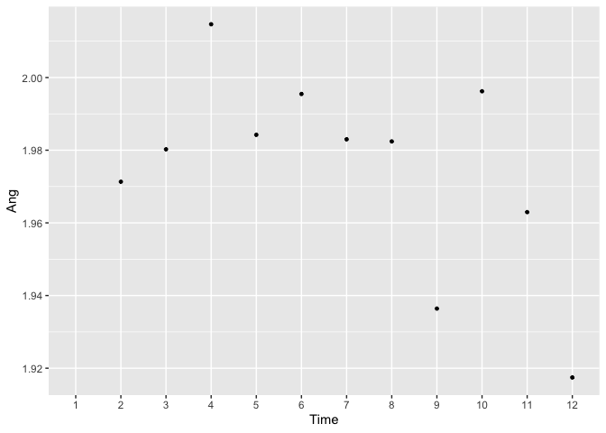
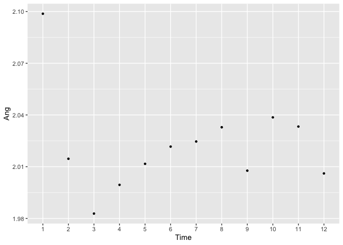
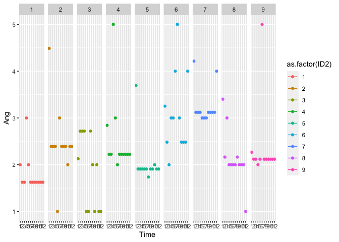

200819 Missing data imputation
================
Anne Margit
8/19/2020

``` r
library(ggplot2)
library(dplyr)
```

    ## 
    ## Attaching package: 'dplyr'

    ## The following objects are masked from 'package:stats':
    ## 
    ##     filter, lag

    ## The following objects are masked from 'package:base':
    ## 
    ##     intersect, setdiff, setequal, union

``` r
library(knitr)
library(tidyverse)
```

    ## ── Attaching packages ────────────────────────────────────────────────────────────────────────────────────────────────────────────────────── tidyverse 1.3.0 ──

    ## ✓ tibble  3.0.1     ✓ purrr   0.3.4
    ## ✓ tidyr   1.1.0     ✓ stringr 1.4.0
    ## ✓ readr   1.3.1     ✓ forcats 0.5.0

    ## ── Conflicts ───────────────────────────────────────────────────────────────────────────────────────────────────────────────────────── tidyverse_conflicts() ──
    ## x dplyr::filter() masks stats::filter()
    ## x dplyr::lag()    masks stats::lag()

``` r
library(anytime)
library(missMDA)
library(psych)
```

    ## 
    ## Attaching package: 'psych'

    ## The following objects are masked from 'package:ggplot2':
    ## 
    ##     %+%, alpha

``` r
load("data_long_min3_str_age.Rdata")
```

order

``` r
data_long_min3_str_age<-data_long_min3_str_age[with(data_long_min3_str_age, order(ID, Time)),]
```

Selecteer de bewuste variabelen: de items voor PA en NA, en de
groepsvariabele id:

``` r
selectie <- data_long_min3_str_age %>%
  group_by(ID) %>%
  select(Ang, Anxiety, Calm, Content, Depr, Energ, Exh, Insp, Nerv, Rel)
```

    ## Adding missing grouping variables: `ID`

``` r
selectie2 <- data_long_min3_str_age %>%
  group_by(ID) %>%
  select(Ang, Anxiety, Calm, Content, Depr, Energ, Exh, Insp, Nerv, Rel, Time)
```

    ## Adding missing grouping variables: `ID`

Ik heb in de dataset voor de imputatie dus wel de ID variabele nog
zitten. Is dat een probleem?

Maak van de groepsfactor eerst een factorvariabele

``` r
class(selectie$ID)
```

    ## [1] "integer"

``` r
selectie$ID <- factor(selectie$ID)
is.factor(selectie$ID)
```

    ## [1] TRUE

Imputeer ze met imputeMultilevel, waarbij je vraagt om 4 between- en 4
within factoren

``` r
selectieImputed <- imputeMultilevel(selectie, ifac=1, ncpB=4, ncpW=4)
View(selectieImputed$completeObs)
dim(selectieImputed$completeObs)
```

    ## [1] 124116     11

Maak een time
variable

``` r
selectieImputed$completeObs<-selectieImputed$completeObs %>% group_by(ID) %>%
  mutate(Time = 1:n()) %>% 
  ungroup()
View(selectieImputed$completeObs)
View(selectie2)
```

``` r
selectieImputed2<-selectieImputed$completeObs
selectieImputed2$Time <- as.factor(selectieImputed2$Time)
```

Check de imputaties met wat plotjes:

``` r
p <- ggplot(selectie2, aes(x=Time, y=Ang)) 
p + stat_summary(geom = "point", fun = mean, size = 1) 
```

    ## Warning: Removed 76349 rows containing non-finite values (stat_summary).

<!-- -->

``` r
p2 <- ggplot(selectieImputed2, aes(x=Time, y=Ang)) 
p2 + stat_summary(geom = "point", fun = mean, size = 1) 
```

<!-- -->

Vergelijk de imputaties met de oorspronkelijke data:

``` r
summary(selectie2[which(selectie2$Time==1), ]$Ang)
```

    ##    Min. 1st Qu.  Median    Mean 3rd Qu.    Max.    NA's 
    ##      NA      NA      NA     NaN      NA      NA   10343

``` r
summary(selectieImputed2[which(selectieImputed2$Time==1), ]$Ang)
```

    ##    Min. 1st Qu.  Median    Mean 3rd Qu.    Max. 
    ##  -1.854   1.236   2.124   2.099   2.994   7.197

Door de imputatie zijn er nu niet-mogelijke scores, bv. negatieve scores
en scores \> 5. Is dit een probleem?

Maak wat plotjes met lijnen per id, op een selectie van de eerste 10
personen:

``` r
class(selectieImputed2$ID)
```

    ## [1] "factor"

``` r
selectieImputed2$ID2 <- as.numeric(selectieImputed2$ID)
describe(selectieImputed2$ID2)
```

    ##    vars      n mean      sd median trimmed  mad min   max range skew kurtosis
    ## X1    1 124116 5172 2985.78   5172    5172 3834   1 10343 10342    0     -1.2
    ##      se
    ## X1 8.48

Bekijk nu hoe het eerste datapunt is
geimputeerd:

``` r
ggplot(data = selectieImputed2[which(selectieImputed2$ID2 <10), ], aes(x = Time, y = Ang, color=as.factor(ID2))) + geom_line() + geom_point() + facet_grid(. ~ ID2)
```

    ## geom_path: Each group consists of only one observation. Do you need to adjust
    ## the group aesthetic?
    ## geom_path: Each group consists of only one observation. Do you need to adjust
    ## the group aesthetic?
    ## geom_path: Each group consists of only one observation. Do you need to adjust
    ## the group aesthetic?
    ## geom_path: Each group consists of only one observation. Do you need to adjust
    ## the group aesthetic?
    ## geom_path: Each group consists of only one observation. Do you need to adjust
    ## the group aesthetic?
    ## geom_path: Each group consists of only one observation. Do you need to adjust
    ## the group aesthetic?
    ## geom_path: Each group consists of only one observation. Do you need to adjust
    ## the group aesthetic?
    ## geom_path: Each group consists of only one observation. Do you need to adjust
    ## the group aesthetic?
    ## geom_path: Each group consists of only one observation. Do you need to adjust
    ## the group aesthetic?

<!-- -->

``` r
head(selectie2[which(selectie2$Time==1), ]$Ang, n=20L)
```

    ##  [1] NA NA NA NA NA NA NA NA NA NA NA NA NA NA NA NA NA NA NA NA

``` r
head(selectieImputed2[which(selectieImputed2$Time==1), ]$Ang, n=20L)
```

    ##  [1] 1.999462 4.487750 2.127165 2.841766 3.692881 3.251778 4.213915 3.401759
    ##  [9] 2.267360 1.426431 7.067404 3.995902 3.420671 2.643870 1.123589 4.804569
    ## [17] 2.182152 4.900568 4.563282 4.921433

``` r
save(selectieImputed2, file="selectieImputed2.Rdata")
```

\!\! Imputeert ook hele meetmomenten als ALLE items missen op die meting
\!\! Alleen losse items terugplaatsen op meetmomenten waarop
participanten andere items wel beantwoord hebben
