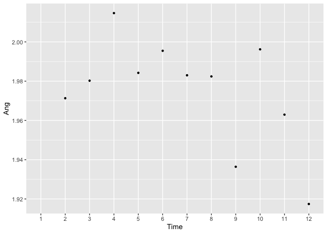
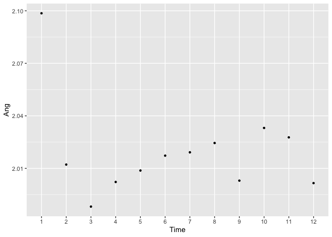
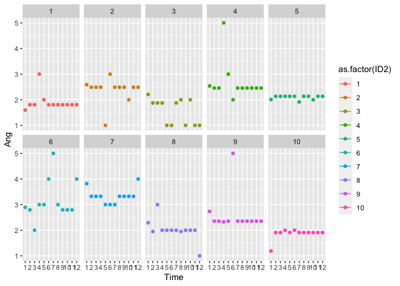

200821 Imputatie check
================
Anne Margit
8/21/2020

``` r
library(ggplot2)
library(dplyr)
library(knitr)
library(tidyverse)
library(psych)
library(papaja)
```

Ik heb de imputatie opnieuw uitgevoerd zonder Content en opgeslagen als
selectieImputed2

``` r
load("selectieImputed2.Rdata")
load("selectie2.Rdata")
```

Summary geimputeerde data

``` r
summary(selectieImputed2[,2:10])
```

``` 
      Ang            Anxiety            Calm            Depr       
 Min.   :0.4611   Min.   :0.5042   Min.   :1.000   Min.   :0.4073  
 1st Qu.:1.4806   1st Qu.:1.9151   1st Qu.:2.635   1st Qu.:1.3636  
 Median :2.0000   Median :2.2709   Median :3.000   Median :2.0000  
 Mean   :2.0197   Mean   :2.3979   Mean   :3.049   Mean   :2.0201  
 3rd Qu.:2.4081   3rd Qu.:3.0000   3rd Qu.:3.574   3rd Qu.:2.4643  
 Max.   :5.1151   Max.   :5.0000   Max.   :5.000   Max.   :5.0000  
     Energ             Exh              Insp             Nerv       
 Min.   :0.7464   Min.   :0.5571   Min.   :0.6023   Min.   :0.4445  
 1st Qu.:2.0000   1st Qu.:1.7837   1st Qu.:2.0000   1st Qu.:1.7865  
 Median :2.7296   Median :2.1898   Median :2.4626   Median :2.1025  
 Mean   :2.6471   Mean   :2.3607   Mean   :2.4833   Mean   :2.2769  
 3rd Qu.:3.0000   3rd Qu.:3.0000   3rd Qu.:3.0000   3rd Qu.:2.8877  
 Max.   :5.0000   Max.   :5.0000   Max.   :5.0000   Max.   :5.0000  
      Rel        
 Min.   :0.7955  
 1st Qu.:2.3304  
 Median :3.0000  
 Mean   :2.8690  
 3rd Qu.:3.2853  
 Max.   :5.0000  
```

De minimum en maximum waarden van anger lijken nu wel een stuk logischer
(niet meer negatief zoals bij de vorige imputatie)

Op eerste wave:

``` r
summary(selectieImputed2[which(selectieImputed2$Time==1), ]$Ang)
```

``` 
   Min. 1st Qu.  Median    Mean 3rd Qu.    Max. 
 0.4611  1.5465  2.0115  2.0986  2.5795  5.1151 
```

Summary originele data

``` r
summary(selectie2[,2:10])
```

``` 
      Ang           Anxiety           Calm            Depr      
 Min.   :1.00    Min.   :1.00    Min.   :1.00    Min.   :1      
 1st Qu.:1.00    1st Qu.:1.00    1st Qu.:2.00    1st Qu.:1      
 Median :2.00    Median :2.00    Median :3.00    Median :2      
 Mean   :1.98    Mean   :2.37    Mean   :3.07    Mean   :2      
 3rd Qu.:3.00    3rd Qu.:3.00    3rd Qu.:4.00    3rd Qu.:3      
 Max.   :5.00    Max.   :5.00    Max.   :5.00    Max.   :5      
 NA's   :76349   NA's   :66045   NA's   :66033   NA's   :66072  
     Energ            Exh             Insp            Nerv      
 Min.   :1.00    Min.   :1.00    Min.   :1.00    Min.   :1.00   
 1st Qu.:2.00    1st Qu.:1.00    1st Qu.:2.00    1st Qu.:1.00   
 Median :3.00    Median :2.00    Median :2.00    Median :2.00   
 Mean   :2.65    Mean   :2.34    Mean   :2.48    Mean   :2.25   
 3rd Qu.:3.00    3rd Qu.:3.00    3rd Qu.:3.00    3rd Qu.:3.00   
 Max.   :5.00    Max.   :5.00    Max.   :5.00    Max.   :5.00   
 NA's   :66098   NA's   :66097   NA's   :66123   NA's   :66073  
      Rel       
 Min.   :1.00   
 1st Qu.:2.00   
 Median :3.00   
 Mean   :2.88   
 3rd Qu.:4.00   
 Max.   :5.00   
 NA's   :66078  
```

Mean scores per wave voor geimputeerde en originele data

``` r
Means_imp <- selectieImputed2 %>%
    group_by(Time) %>%
    summarise_each(funs(mean(., na.rm=TRUE)), 
                          Ang, Anxiety, Calm, Depr, Energ, Exh, Insp, Nerv, Rel)

Means_original <- selectie2 %>%
  group_by(Time) %>%
    summarise_each(funs(mean(., na.rm=TRUE)), 
                          Ang, Anxiety, Calm, Depr, Energ, Exh, Insp, Nerv, Rel)
```

``` r
apa_table(Means_imp, caption = "Mean scores per wave voor geimputeerde data")
```

<caption>

(\#tab:unnamed-chunk-7)

</caption>

<div data-custom-style="Table Caption">

*Mean scores per wave voor geimputeerde
data*

</div>

| Time | Ang  | Anxiety | Calm | Depr | Energ | Exh  | Insp | Nerv | Rel  |
| :--- | :--- | :------ | :--- | :--- | :---- | :--- | :--- | :--- | :--- |
| 1    | 2.10 | 2.67    | 2.92 | 2.12 | 2.48  | 2.35 | 2.34 | 2.53 | 2.70 |
| 2    | 2.01 | 2.41    | 3.05 | 2.01 | 2.63  | 2.35 | 2.48 | 2.29 | 2.87 |
| 3    | 1.99 | 2.43    | 3.06 | 2.03 | 2.63  | 2.36 | 2.47 | 2.30 | 2.89 |
| 4    | 2.00 | 2.41    | 3.07 | 2.04 | 2.64  | 2.38 | 2.46 | 2.29 | 2.90 |
| 5    | 2.01 | 2.39    | 3.06 | 2.03 | 2.64  | 2.35 | 2.46 | 2.26 | 2.89 |
| 6    | 2.02 | 2.38    | 3.07 | 2.03 | 2.65  | 2.35 | 2.50 | 2.25 | 2.88 |
| 7    | 2.02 | 2.36    | 3.06 | 2.02 | 2.66  | 2.36 | 2.49 | 2.25 | 2.88 |
| 8    | 2.02 | 2.36    | 3.06 | 2.01 | 2.68  | 2.36 | 2.51 | 2.25 | 2.88 |
| 9    | 2.00 | 2.35    | 3.07 | 2.00 | 2.69  | 2.36 | 2.51 | 2.23 | 2.89 |
| 10   | 2.03 | 2.35    | 3.06 | 1.99 | 2.69  | 2.36 | 2.52 | 2.23 | 2.88 |
| 11   | 2.03 | 2.34    | 3.05 | 2.00 | 2.68  | 2.37 | 2.52 | 2.23 | 2.88 |
| 12   | 2.00 | 2.33    | 3.06 | 1.98 | 2.71  | 2.37 | 2.54 | 2.22 | 2.90 |

``` r
apa_table(Means_original, caption = "Mean scores per wave voor originele data")
```

<caption>

(\#tab:unnamed-chunk-7)

</caption>

<div data-custom-style="Table Caption">

*Mean scores per wave voor originele
data*

</div>

| Time | Ang  | Anxiety | Calm | Depr | Energ | Exh  | Insp | Nerv | Rel  |
| :--- | :--- | :------ | :--- | :--- | :---- | :--- | :--- | :--- | :--- |
| 1    | NA   | 2.67    | 2.92 | 2.12 | 2.48  | 2.35 | 2.34 | 2.53 | 2.70 |
| 2    | 1.97 | 2.58    | 2.89 | 1.97 | 2.28  | 2.35 | 2.25 | 2.52 | 2.67 |
| 3    | 1.98 | 2.53    | 3.02 | 2.09 | 2.55  | 2.42 | 2.40 | 2.38 | 2.86 |
| 4    | 2.01 | 2.47    | 3.04 | 2.10 | 2.59  | 2.47 | 2.41 | 2.36 | 2.89 |
| 5    | 1.98 | 2.36    | 3.09 | 2.02 | 2.64  | 2.32 | 2.45 | 2.23 | 2.91 |
| 6    | 2.00 | 2.33    | 3.11 | 2.01 | 2.67  | 2.32 | 2.52 | 2.20 | 2.92 |
| 7    | 1.98 | 2.28    | 3.11 | 1.97 | 2.70  | 2.31 | 2.52 | 2.17 | 2.93 |
| 8    | 1.98 | 2.26    | 3.13 | 1.93 | 2.75  | 2.30 | 2.57 | 2.15 | 2.95 |
| 9    | 1.94 | 2.22    | 3.14 | 1.92 | 2.75  | 2.31 | 2.55 | 2.12 | 2.96 |
| 10   | 2.00 | 2.21    | 3.13 | 1.90 | 2.77  | 2.31 | 2.59 | 2.10 | 2.95 |
| 11   | 1.96 | 2.15    | 3.11 | 1.86 | 2.77  | 2.30 | 2.61 | 2.06 | 2.95 |
| 12   | 1.92 | 2.17    | 3.13 | 1.86 | 2.82  | 2.31 | 2.65 | 2.07 | 2.98 |

Check de imputaties met wat plotjes:

``` r
p <- ggplot(selectie2, aes(x=Time, y=Ang)) 
p + stat_summary(geom = "point", fun = mean, size = 1) 
```

<!-- -->

``` r
p2 <- ggplot(selectieImputed2, aes(x=Time, y=Ang)) 
p2 + stat_summary(geom = "point", fun = mean, size = 1) 
```

<!-- -->

Maak wat plotjes met lijnen per id, op een selectie van de eerste 10
personen:

``` r
class(selectieImputed2$ID)
```

    ## [1] "factor"

``` r
selectieImputed2$ID2 <- as.numeric(selectieImputed2$ID)
describe(selectieImputed2$ID2)
```

    ##    vars      n mean      sd median trimmed  mad min   max range skew kurtosis
    ## X1    1 124116 5172 2985.78   5172    5172 3834   1 10343 10342    0     -1.2
    ##      se
    ## X1 8.48

Bekijk nu hoe het eerste datapunt is
geimputeerd:

``` r
ggplot(data = selectieImputed2[which(selectieImputed2$ID2 <11), ], aes(x = Time, y = Ang, color=as.factor(ID2))) + geom_line() + geom_point() + facet_wrap(. ~ ID2, nrow=2)
```

<!-- -->

``` r
head(selectie2[which(selectie2$Time==1), ]$Ang, n=20L)
```

    ##  [1] NA NA NA NA NA NA NA NA NA NA NA NA NA NA NA NA NA NA NA NA

``` r
head(selectieImputed2[which(selectieImputed2$Time==1), ]$Ang, n=20L)
```

    ##  [1] 1.596419 2.588378 2.209813 2.539409 2.008012 2.895775 3.818965 2.293310
    ##  [9] 2.738359 1.188503 3.702663 2.246053 1.752858 2.009402 1.866594 3.076511
    ## [17] 1.795913 2.201347 2.663494 3.437645
