PAD all phases winning models and quadratic term and new colors
================
Anne Margit
03/05/2021

    ## [1] ""

``` r
load("data_analyse2_p1.Rdata")
load("data_analyse2_p2.Rdata")
load("data_analyse2_p3.Rdata")
```

This dataset includes:

1.  Data from all weekly measurement waves (baseline through wave 11,
    Time 1 through 12)
2.  Participants who provided at least 3 measurements
3.  Participants who are residents of the country they currently live in
4.  Participants who provided info on age
5.  Participants who provided info on gender (either male or female)
6.  Data from countries with at least 20 participants
7.  Pooled age groups
8.  Imputed missing emotion scores
9.  Combined emotion scores (NAA, NAD, PAA, PAD)
10. An imputed Stringency index (StringencyIndex\_imp)
11. A dummy Str\_dummy with 0 = before the peak, 1 = during peak, 2 =
    after peak
12. A variable indicating the number of days before maximum stringency
    was reached (DaysMax\_p1), during (DaysMax\_p2), and after
    (DaysPhase3)
13. A variable indicating the number of weeks before maximum stringency
    was reached (WeeksMax\_p1), during (WeeksMax\_p2), and after
    (WeeksPhase3)
14. A variable indicating the date on which maximum Stringency was
    reached for that country (DateMaxStr) and the max level reached
    (MaxStr) across the entire measurement period
15. A variable indicating the date on which minimum Stringency was
    reached for that country (DateMinStr) and the min level reached
    (MinStr) across the entire measurement period
16. Observations during which there was a second peak are excluded
    (N=583)

> My comments are in block quotes such as this.

``` r
library(dplyr)
library(tidyverse)
library(ggpubr)
library(ggplot2)
library(rockchalk)
library(effects)
library(nlme)
library(lattice)
library(broom.mixed)
library(purrr)
library(stargazer)
```

    ## Warning: package 'stargazer' was built under R version 4.0.3

``` r
library(viridis)
```

    ## Warning: package 'viridis' was built under R version 4.0.3

# Descriptives

**Number of participants per age group**

> 0 = 18-24, 1 = 25-44, 3= 45-64, 4= 65+

Phase 1

``` r
data_analyse2_p1 %>%
  group_by(Age_new) %>%
  summarise(NAge = n())
```

    # A tibble: 4 x 2
      Age_new  NAge
      <fct>   <int>
    1 0         695
    2 1        1893
    3 2        1274
    4 3         293

Phase 2

``` r
data_analyse2_p2 %>%
  group_by(Age_new) %>%
  summarise(NAge = n())
```

    # A tibble: 4 x 2
      Age_new  NAge
      <fct>   <int>
    1 0        3677
    2 1       11292
    3 2       10253
    4 3        4366

Phase 3

``` r
data_analyse2_p2 %>%
  group_by(Age_new) %>%
  summarise(NAge = n())
```

    # A tibble: 4 x 2
      Age_new  NAge
      <fct>   <int>
    1 0        3677
    2 1       11292
    3 2       10253
    4 3        4366

**Plots** **Mean PAD against max stringency in WEEKS** Phase 1 (only age
differences)

``` r
plot_PAD1 <- ggplot(data_analyse2_p1, aes(x=Age_new, y=PAD, group = Age_new, color = Age_new))

plot_PAD1 + stat_summary(fun.y=mean, geom="line", size=1)  + geom_errorbar(stat="summary", fun.data="mean_se", width=0.5) + scale_colour_discrete(name = "Age", labels = c("18-24", "25-44", "45-64", "65+")) + expand_limits(y=c(1, 5))
```

<!-- -->

Phase 2

``` r
plot_PAD2 <- ggplot(data_analyse2_p2, aes(x=WeeksMax_p2, y=PAD, group = Age_new, color = Age_new))

plot_PAD2 + stat_summary(fun.y=mean, geom="line", size=1)  + geom_errorbar(stat="summary", fun.data="mean_se", width=0) + scale_colour_discrete(name = "Age", labels = c("18-24", "25-44", "45-64", "65+")) + expand_limits(y=c(1, 5))
```

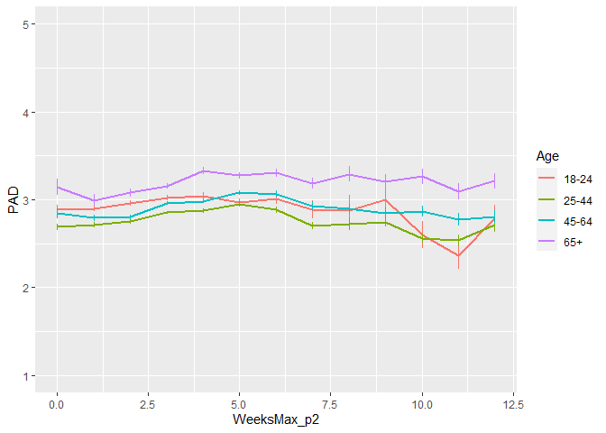<!-- -->

Phase 3

``` r
plot_PAD3 <- ggplot(data_analyse2_p3, aes(x=WeeksPhase3, y=PAD, group = Age_new, color = Age_new))

plot_PAD3 + stat_summary(fun.y=mean, geom="line", size=1)  + geom_errorbar(stat="summary", fun.data="mean_se", width=0) + scale_colour_discrete(name = "Age", labels = c("18-24", "25-44", "45-64", "65+")) + expand_limits(y=c(1, 5))
```

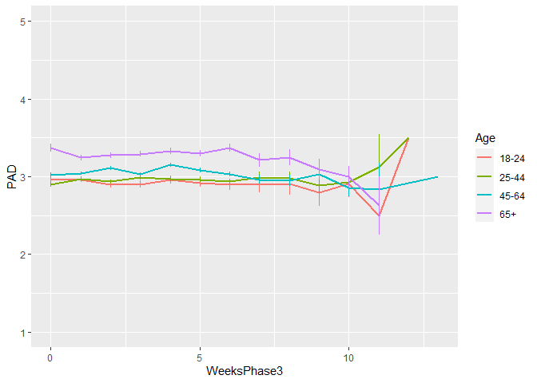<!-- -->

**Mean NAD against max stringency in DAYS** Phase 2

``` r
plot_PAD2 <- ggplot(data_analyse2_p2, aes(x=DaysMax_p2, y=PAD, group = Age_new, color = Age_new))

plot_PAD2 + stat_summary(fun.y=mean, geom="line", size=1)  + geom_errorbar(stat="summary", fun.data="mean_se", width=0) + scale_colour_discrete(name = "Age", labels = c("18-24", "25-44", "45-64", "65+")) + expand_limits(y=c(1, 5))
```

<!-- -->

Phase 3

``` r
plot_PAD3 <- ggplot(data_analyse2_p3, aes(x=DaysPhase3, y=PAD, group = Age_new, color = Age_new))

plot_PAD3 + stat_summary(fun.y=mean, geom="line", size=1)  + geom_errorbar(stat="summary", fun.data="mean_se", width=0) + scale_colour_discrete(name = "Age", labels = c("18-24", "25-44", "45-64", "65+")) + expand_limits(y=c(1, 5))
```

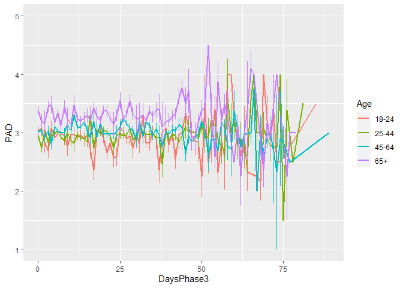<!-- -->

# Phase 1

*Random: IC for ID and Country + Covariates Gender and Education*

> Gender: Male = 0, Female = 1

> Edu: 0= Primary education, 1= General secondary education, 2=
> Vocational education, 3= Higher education, 4= Bachelors degree, 5=
> Masters degree, 6= PhD degree

``` r
data_analyse2_p1$Edu <- as.numeric(data_analyse2_p1$Edu)
model_PADp1 <- lme(fixed = PAD ~ Gender + Edu + Age_new,
                  random = ~1 | Country/ID, 
                  data = data_analyse2_p1, 
                  na.action = na.omit)

summary(model_PADp1)
```

    Linear mixed-effects model fit by REML
     Data: data_analyse2_p1 
           AIC      BIC    logLik
      10909.06 10966.04 -5445.532
    
    Random effects:
     Formula: ~1 | Country
            (Intercept)
    StdDev:   0.2803382
    
     Formula: ~1 | ID %in% Country
            (Intercept)  Residual
    StdDev:   0.6853953 0.6536574
    
    Fixed effects: PAD ~ Gender + Edu + Age_new 
                     Value  Std.Error   DF   t-value p-value
    (Intercept)  2.9431354 0.10216130 2716 28.808713  0.0000
    Gender1     -0.2744636 0.03746011 2716 -7.326824  0.0000
    Edu          0.0170281 0.01362032 2716  1.250198  0.2113
    Age_new1    -0.1601825 0.05221561 2716 -3.067713  0.0022
    Age_new2    -0.0066312 0.05539861 2716 -0.119701  0.9047
    Age_new3     0.2226256 0.07851059 2716  2.835612  0.0046
     Correlation: 
             (Intr) Gendr1 Edu    Ag_nw1 Ag_nw2
    Gender1  -0.277                            
    Edu      -0.549 -0.044                     
    Age_new1 -0.238  0.079 -0.246              
    Age_new2 -0.281  0.129 -0.163  0.714       
    Age_new3 -0.240  0.184 -0.099  0.494  0.499
    
    Standardized Within-Group Residuals:
            Min          Q1         Med          Q3         Max 
    -2.91120312 -0.52354775  0.01059665  0.55286348  3.06582733 
    
    Number of Observations: 4155
    Number of Groups: 
            Country ID %in% Country 
                 26            2747 

``` r
VarCorr(model_PADp1)
```

``` 
            Variance     StdDev   
Country =   pdLogChol(1)          
(Intercept) 0.07858951   0.2803382
ID =        pdLogChol(1)          
(Intercept) 0.46976675   0.6853953
Residual    0.42726798   0.6536574
```

*Confidence intervals*

``` r
intervals(model_PADp1)
```

    Approximate 95% confidence intervals
    
     Fixed effects:
                       lower         est.       upper
    (Intercept)  2.742813667  2.943135398  3.14345713
    Gender1     -0.347916847 -0.274463646 -0.20101044
    Edu         -0.009679132  0.017028097  0.04373533
    Age_new1    -0.262568848 -0.160182501 -0.05779615
    Age_new2    -0.115258938 -0.006631248  0.10199644
    Age_new3     0.068679031  0.222625560  0.37657209
    attr(,"label")
    [1] "Fixed effects:"
    
     Random Effects:
      Level: Country 
                        lower      est.     upper
    sd((Intercept)) 0.1921947 0.2803382 0.4089056
      Level: ID 
                        lower      est.     upper
    sd((Intercept)) 0.6517502 0.6853953 0.7207773
    
     Within-group standard error:
        lower      est.     upper 
    0.6304010 0.6536574 0.6777717 

*Plot of predicted values*

``` r
ef_PADp1 <- effect("Age_new", model_PADp1)

plot_PADp1 <- ggplot(as.data.frame(ef_PADp1), 
  aes(Age_new, fit, color=Age_new)) + geom_line() + 
  geom_errorbar(aes(ymin=fit-se, ymax=fit+se), width=1) + theme_minimal(base_size=12) + 
  labs(title="PAD before peak stringency", y = "PAD") +
  theme(plot.title = element_text(hjust = 0.5)) +
  scale_x_discrete(name ="Age", labels=c("18-24", "25-44", "45-64", "65+")) +
  theme(legend.position = "none") +                 
  scale_color_discrete() + 
  expand_limits(y=c(1, 5))
```

``` r
plot_PADp1
```

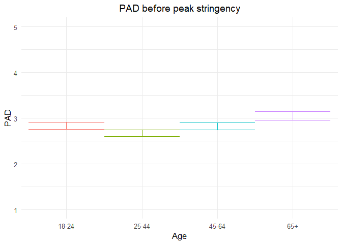<!-- -->

*Effect sizes*

``` r
ISDs <- data_analyse2_p1 %>% 
  group_by(ID) %>%
  summarize_at(c("PAD"), sd, na.rm=TRUE) %>%
  ungroup()

ISDs_av <- ISDs %>%
  summarize_at(c("PAD"), mean, na.rm=TRUE) %>%
  stack() %>%
  rename(sd=values) 
```

> Effect size = regression coefficient / average ISD of PAD

``` r
coef_PADp1 = tidy(model_PADp1, 
               effects = "fixed")

coef_PADp1 <- coef_PADp1 %>%
  mutate (e_size = estimate/0.467823) %>% 
  mutate(across(2:7, round, 2)) 
```

``` r
coef_PADp1
```

    ## # A tibble: 6 x 7
    ##   term        estimate std.error    df statistic p.value e_size
    ##   <chr>          <dbl>     <dbl> <dbl>     <dbl>   <dbl>  <dbl>
    ## 1 (Intercept)     2.94      0.1   2716     28.8     0      6.29
    ## 2 Gender1        -0.27      0.04  2716     -7.33    0     -0.59
    ## 3 Edu             0.02      0.01  2716      1.25    0.21   0.04
    ## 4 Age_new1       -0.16      0.05  2716     -3.07    0     -0.34
    ## 5 Age_new2       -0.01      0.06  2716     -0.12    0.9   -0.01
    ## 6 Age_new3        0.22      0.08  2716      2.84    0      0.48

``` r
coef_PADp1 <- as.matrix(coef_PADp1)
```

# Phase 2

*Best model*

> Random intercept for ID and Country, random slope for ID and country,
> no correlation between IC and S for ID and country + AR correlation
> structure at Measurement level

``` r
data_analyse2_p2$Edu <- as.numeric(data_analyse2_p2$Edu)
data_analyse2_p2 <- data_analyse2_p2[with(data_analyse2_p2, order(Country, ID, Time)),]
data_analyse2_p2$Time <- as.numeric(data_analyse2_p2$Time)

model_PADp2 <- lme(fixed = PAD ~ Gender + Edu + DaysMax_p2 + Age_new + DaysMax_p2*Age_new,
                  random = list(Country= pdDiag(~DaysMax_p2), ID = pdDiag(~DaysMax_p2)), 
                  data = data_analyse2_p2, 
                  na.action = na.omit,
                  correlation = corAR1(form = ~ Time | Country/ID))

summary(model_PADp2)
```

    Linear mixed-effects model fit by REML
     Data: data_analyse2_p2 
           AIC      BIC    logLik
      68430.06 68562.77 -34199.03
    
    Random effects:
     Formula: ~DaysMax_p2 | Country
     Structure: Diagonal
            (Intercept)  DaysMax_p2
    StdDev:   0.2207165 0.004714786
    
     Formula: ~DaysMax_p2 | ID %in% Country
     Structure: Diagonal
            (Intercept) DaysMax_p2  Residual
    StdDev:    0.710953 0.00571456 0.6081935
    
    Correlation Structure: ARMA(1,0)
     Formula: ~Time | Country/ID 
     Parameter estimate(s):
         Phi1 
    0.2159332 
    Fixed effects: PAD ~ Gender + Edu + DaysMax_p2 + Age_new + DaysMax_p2 * Age_new 
                             Value  Std.Error    DF   t-value p-value
    (Intercept)          2.9879460 0.05901940 20356  50.62651  0.0000
    Gender1             -0.2704284 0.01912200  9176 -14.14226  0.0000
    Edu                  0.0310452 0.00627501  9176   4.94744  0.0000
    DaysMax_p2           0.0033749 0.00144221 20356   2.34011  0.0193
    Age_new1            -0.1947643 0.03664448  9176  -5.31497  0.0000
    Age_new2            -0.1298652 0.03768150  9176  -3.44639  0.0006
    Age_new3             0.0576208 0.04555131  9176   1.26497  0.2059
    DaysMax_p2:Age_new1  0.0021640 0.00105725 20356   2.04680  0.0407
    DaysMax_p2:Age_new2  0.0028261 0.00107810 20356   2.62137  0.0088
    DaysMax_p2:Age_new3  0.0028166 0.00122813 20356   2.29343  0.0218
     Correlation: 
                        (Intr) Gendr1 Edu    DysM_2 Ag_nw1 Ag_nw2 Ag_nw3 DM_2:A_1 DM_2:A_2
    Gender1             -0.244                                                            
    Edu                 -0.400 -0.030                                                     
    DaysMax_p2          -0.222  0.004 -0.005                                              
    Age_new1            -0.335  0.044 -0.219  0.298                                       
    Age_new2            -0.366  0.075 -0.137  0.286  0.754                                
    Age_new3            -0.332  0.142 -0.095  0.238  0.627  0.633                         
    DaysMax_p2:Age_new1  0.240  0.001  0.025 -0.538 -0.573 -0.454 -0.378                  
    DaysMax_p2:Age_new2  0.233  0.001  0.029 -0.525 -0.458 -0.592 -0.381  0.813           
    DaysMax_p2:Age_new3  0.209 -0.007  0.020 -0.463 -0.402 -0.404 -0.608  0.716    0.715  
    
    Standardized Within-Group Residuals:
            Min          Q1         Med          Q3         Max 
    -4.75330597 -0.52895411  0.04246447  0.55437249  4.51836797 
    
    Number of Observations: 29574
    Number of Groups: 
            Country ID %in% Country 
                 33            9214 

``` r
VarCorr(model_PADp2)
```

``` 
            Variance           StdDev     
Country =   pdDiag(DaysMax_p2)            
(Intercept) 4.871575e-02       0.220716452
DaysMax_p2  2.222921e-05       0.004714786
ID =        pdDiag(DaysMax_p2)            
(Intercept) 5.054542e-01       0.710953025
DaysMax_p2  3.265620e-05       0.005714560
Residual    3.698994e-01       0.608193529
```

*Confidence intervals*

``` r
intervals(model_PADp2, which = 'fixed')
```

    Approximate 95% confidence intervals
    
     Fixed effects:
                                lower         est.        upper
    (Intercept)          2.872263e+00  2.987946047  3.103628817
    Gender1             -3.079117e-01 -0.270428354 -0.232944982
    Edu                  1.874483e-02  0.031045240  0.043345646
    DaysMax_p2           5.480877e-04  0.003374938  0.006201787
    Age_new1            -2.665957e-01 -0.194764328 -0.122932995
    Age_new2            -2.037293e-01 -0.129865194 -0.056001068
    Age_new3            -3.166987e-02  0.057620842  0.146911550
    DaysMax_p2:Age_new1  9.167964e-05  0.002163979  0.004236279
    DaysMax_p2:Age_new2  7.129373e-04  0.002826099  0.004939260
    DaysMax_p2:Age_new3  4.093977e-04  0.002816624  0.005223851
    attr(,"label")
    [1] "Fixed effects:"

*Plot of predicted values*

``` r
ef_PADp2 <- effect("DaysMax_p2:Age_new", model_PADp2)

plot_PADp2 <- ggplot(as.data.frame(ef_PADp2), aes(DaysMax_p2, fit, color=Age_new)) + 
  geom_line(size=1) + 
  geom_errorbar(aes(ymin=fit-se, ymax=fit+se), width=1) + 
  theme_minimal(base_size=12) + 
  labs(title="PAD trajectories during peak stringency",
       x="Days since start peak stringency", y = "PAD") +
  theme(plot.title = element_text(hjust = 0.5)) +
  scale_color_discrete(name="Age", labels = c("18-24", "25-44", "45-64", "65+")) + 
  expand_limits(y=c(1, 5))
```

``` r
plot_PADp2
```

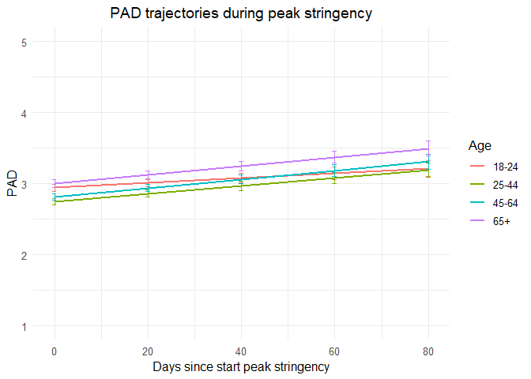<!-- -->

*Effect sizes* **Within person SD and average within person SD**

``` r
ISDs <- data_analyse2_p2 %>% 
  group_by(ID) %>%
  summarize_at(c("DaysMax_p2", "PAD"), sd, na.rm=TRUE) %>%
  ungroup()

ISDs_av <- ISDs %>%
  summarize_at(c("DaysMax_p2", "PAD"), mean, na.rm=TRUE) %>%
  stack() %>%
  rename(sd=values) 
```

> Effect sizes for intercept and main effect of age and covariates =
> regression coefficient / average ISD of PAD Effect size for main
> effect of DaysMax = (regression coefficient \* 28)/ average ISD of PAD
> Effect sizes for interaction effects = (regression coefficient \* 28)/
> average ISD of PAD

> The effect sizes for main effect of DaysMax and the interaction
> effects reflect the increase in SD of PAD over 4 weeks (28 days)

``` r
coef_PADp2 = tidy(model_PADp2, 
               effects = "fixed")

coef_PADp2 <- coef_PADp2 %>%
  mutate(e_size = ifelse(row_number()== 1 | row_number()== 2 |  row_number()== 3 |  row_number()== 5 |  row_number()== 6 |  row_number()== 7,  estimate/0.5049948, (estimate*28)/0.5049948)) %>%
  mutate(across(2:7, round, 2)) 
```

``` r
coef_PADp2
```

    ## # A tibble: 10 x 7
    ##    term                estimate std.error    df statistic p.value e_size
    ##    <chr>                  <dbl>     <dbl> <dbl>     <dbl>   <dbl>  <dbl>
    ##  1 (Intercept)             2.99      0.06 20356     50.6     0      5.92
    ##  2 Gender1                -0.27      0.02  9176    -14.1     0     -0.54
    ##  3 Edu                     0.03      0.01  9176      4.95    0      0.06
    ##  4 DaysMax_p2              0         0    20356      2.34    0.02   0.19
    ##  5 Age_new1               -0.19      0.04  9176     -5.31    0     -0.39
    ##  6 Age_new2               -0.13      0.04  9176     -3.45    0     -0.26
    ##  7 Age_new3                0.06      0.05  9176      1.26    0.21   0.11
    ##  8 DaysMax_p2:Age_new1     0         0    20356      2.05    0.04   0.12
    ##  9 DaysMax_p2:Age_new2     0         0    20356      2.62    0.01   0.16
    ## 10 DaysMax_p2:Age_new3     0         0    20356      2.29    0.02   0.16

``` r
coef_PADp2 <- as.matrix(coef_PADp2)
```

> PAD increases over time in the youngest age group (main effect), and
> also increases in the older groups but faster (interaction effect).
> Compared to the youngest age group, older groups report lower PAD on
> the first day of max stringency, except for the oldest age group (main
> effect). Women report lower PAD compared to men, and higher educated
> people report higher PAD compared to lower educated people.

``` r
model_coefs <- coef(model_PADp2, level = 2)
  
model_coefs <- as.data.frame(model_coefs) %>%
rownames_to_column("ID")
  
model_coefs <- model_coefs %>%
separate(col = 1, into = c("Country", "ID"), sep = "\\/") %>%
dplyr::rename("Intercept" = "(Intercept)")
  
data2 <- left_join(data_analyse2_p2, model_coefs, by= "ID")
  
data3 <- data2 %>%
filter(Nmiss == 0) %>%
  filter(n > 5)
```

``` r
labels <- c("0" = "Age 18-24", "1" = "Age 25-44", "2" = "Age 45-64", "3" = "Age 65+")

model_coef_plot <- ggplot(data = data3[which(data3$ID2 <200),], 
       mapping = aes(x = DaysMax_p2.x, y = PAD, colour = ID)) +
       geom_point() +
       geom_abline(aes(intercept = Intercept, 
                  slope = DaysMax_p2.y,
                  colour = ID),size = 0.5) + 
                  scale_x_continuous(limits = c(0, 100)) + 
                  theme(legend.position = "none") +
                  facet_wrap(~Age_new, 
                  labeller = labeller(Age_new = labels)) +
      xlab("Days since start peak stringency") +
      ggtitle("Predicted PAD trajectories for subsample of participants") +
      theme_minimal(base_size=12) + 
      scale_color_discrete() + 
      theme(plot.title = element_text(hjust = 0.5)) +
      theme(legend.position = "none") 

model_coef_plot
```

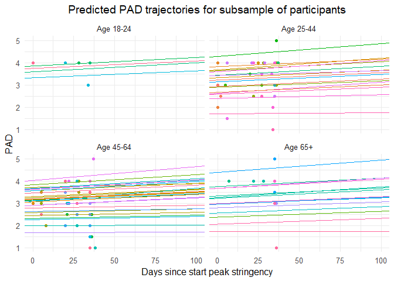<!-- -->

# Random slope variation plot

``` r
Age_labels <- c("18-24", "25-44", "45-64", "65+")
names(Age_labels) <- c("0","1","2","3")

plot_PADp2_slope <- ggplot(data2, aes(x= DaysMax_p2.y, fill = ..x..)) +
  geom_histogram() +
 scale_fill_viridis(option = "C")+
  theme_minimal()+
  theme(legend.position="none") + 
  geom_vline(xintercept = 0, linetype="dashed", 
                color = "black", size=.5) + 
  labs(title="Variability in PAD trajectories during peak stringency",
       x="Regression coefficient (PAD ~ days)", y = "Count") +
  theme(plot.title = element_text(hjust = 0.5)) +
   facet_wrap(~ Age_new, labeller = labeller(Age_new = Age_labels)) 
```

``` r
plot_PADp2_slope 
```

    ## `stat_bin()` using `bins = 30`. Pick better value with `binwidth`.

    ## Warning: Removed 2 rows containing non-finite values (stat_bin).

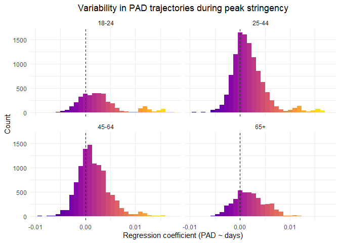<!-- -->

Distribution

``` r
data2<- as_tibble(data2)
data2 %>%
  filter(DaysMax_p2.y > 0) %>%
  summarise(N = n())
```

    ## # A tibble: 1 x 1
    ##       N
    ##   <int>
    ## 1 20906

``` r
#20906

data2 %>%
  filter(DaysMax_p2.y < 0) %>%
  summarise(N = n())
```

    ## # A tibble: 1 x 1
    ##       N
    ##   <int>
    ## 1  8680

``` r
#8680

#Decrease in PAD:

8680 / (8680 + 20906) * 100
```

    ## [1] 29.3382

``` r
#29.34%
```

# Quadratic term

The interaction between age and daysmax was significant so these are
kept in the current model. The time variable needs to be centered at the
midpoint (mean) to reduce collinearity between the linear and the
quadratic components.

``` r
data_analyse2_p2q <- gmc(data_analyse2_p2, "DaysMax_p2", "ID", FUN = mean, suffix = c("_mn", "_dev"),
    fulldataframe = TRUE)
```

``` r
data_analyse2_p2q$Edu <- as.numeric(data_analyse2_p2q$Edu)

data_analyse2_p2q <- data_analyse2_p2q[with(data_analyse2_p2q, order(Country, ID, Time)),]
data_analyse2_p2q$Time <- as.numeric(data_analyse2_p2q$Time)

model_PADp2q <- lme(fixed = PAD ~ Gender + Edu + DaysMax_p2_dev + Age_new + DaysMax_p2_dev*Age_new +  
                    + I(DaysMax_p2_dev^2) + I(DaysMax_p2_dev^2)*Age_new,
                  random = list(Country = pdDiag(~ DaysMax_p2_dev), 
                  ID = ~DaysMax_p2_dev),
                  data = data_analyse2_p2q, 
                  na.action = na.omit,
                  correlation = corAR1(form = ~ Time | Country/ID))

summary(model_PADp2q)
```

    Linear mixed-effects model fit by REML
     Data: data_analyse2_p2q 
           AIC      BIC    logLik
      68423.54 68597.72 -34190.77
    
    Random effects:
     Formula: ~DaysMax_p2_dev | Country
     Structure: Diagonal
            (Intercept) DaysMax_p2_dev
    StdDev:    0.206668    0.005676884
    
     Formula: ~DaysMax_p2_dev | ID %in% Country
     Structure: General positive-definite, Log-Cholesky parametrization
                   StdDev      Corr  
    (Intercept)    0.732835725 (Intr)
    DaysMax_p2_dev 0.007709447 0.1   
    Residual       0.597958680       
    
    Correlation Structure: ARMA(1,0)
     Formula: ~Time | Country/ID 
     Parameter estimate(s):
         Phi1 
    0.1906982 
    Fixed effects: PAD ~ Gender + Edu + DaysMax_p2_dev + Age_new + DaysMax_p2_dev *      Age_new + +I(DaysMax_p2_dev^2) + I(DaysMax_p2_dev^2) * Age_new 
                                      Value  Std.Error    DF   t-value p-value
    (Intercept)                   3.0352148 0.05475465 20352  55.43301  0.0000
    Gender1                      -0.2643046 0.01911841  9176 -13.82461  0.0000
    Edu                           0.0307488 0.00626100  9176   4.91117  0.0000
    DaysMax_p2_dev                0.0033491 0.00164622 20352   2.03444  0.0419
    Age_new1                     -0.1461905 0.03085885  9176  -4.73739  0.0000
    Age_new2                     -0.0541073 0.03106397  9176  -1.74180  0.0816
    Age_new3                      0.1405838 0.03670372  9176   3.83023  0.0001
    I(DaysMax_p2_dev^2)          -0.0001230 0.00005478 20352  -2.24566  0.0247
    DaysMax_p2_dev:Age_new1       0.0026532 0.00115002 20352   2.30712  0.0211
    DaysMax_p2_dev:Age_new2       0.0033548 0.00117455 20352   2.85621  0.0043
    DaysMax_p2_dev:Age_new3       0.0030651 0.00134488 20352   2.27913  0.0227
    Age_new1:I(DaysMax_p2_dev^2) -0.0000204 0.00005901 20352  -0.34607  0.7293
    Age_new2:I(DaysMax_p2_dev^2)  0.0000040 0.00005927 20352   0.06678  0.9468
    Age_new3:I(DaysMax_p2_dev^2)  0.0000381 0.00006609 20352   0.57725  0.5638
     Correlation: 
                                 (Intr) Gendr1 Edu    DyM_2_ Ag_nw1 Ag_nw2 Ag_nw3 I(DM_2 DM_2_:A_1 DM_2_:A_2 DM_2_:A_3 A_1:I( A_2:I(
    Gender1                      -0.262                                                                                             
    Edu                          -0.432 -0.031                                                                                      
    DaysMax_p2_dev                0.007  0.000  0.001                                                                               
    Age_new1                     -0.283  0.055 -0.243 -0.011                                                                        
    Age_new2                     -0.336  0.094 -0.143 -0.011  0.759                                                                 
    Age_new3                     -0.321  0.172 -0.103 -0.010  0.646  0.663                                                          
    I(DaysMax_p2_dev^2)          -0.095  0.003 -0.011  0.021  0.197  0.195  0.165                                                   
    DaysMax_p2_dev:Age_new1      -0.010  0.000  0.000 -0.511  0.024  0.019  0.016 -0.022                                            
    DaysMax_p2_dev:Age_new2      -0.009  0.000  0.000 -0.497  0.019  0.024  0.017 -0.021  0.813                                     
    DaysMax_p2_dev:Age_new3      -0.008  0.001 -0.001 -0.437  0.017  0.017  0.020 -0.019  0.712     0.711                           
    Age_new1:I(DaysMax_p2_dev^2)  0.092 -0.005  0.007 -0.019 -0.216 -0.175 -0.149 -0.925  0.026     0.021     0.018                 
    Age_new2:I(DaysMax_p2_dev^2)  0.092 -0.005  0.005 -0.019 -0.175 -0.216 -0.150 -0.921  0.021     0.028     0.017     0.855       
    Age_new3:I(DaysMax_p2_dev^2)  0.086 -0.012  0.003 -0.018 -0.157 -0.159 -0.213 -0.826  0.018     0.017     0.052     0.767  0.764
    
    Standardized Within-Group Residuals:
            Min          Q1         Med          Q3         Max 
    -4.73015460 -0.52729608  0.04095615  0.54880312  4.54529321 
    
    Number of Observations: 29574
    Number of Groups: 
            Country ID %in% Country 
                 33            9214 

``` r
VarCorr(model_PADp2q)
```

``` 
               Variance                  StdDev      Corr  
Country =      pdDiag(DaysMax_p2_dev)                      
(Intercept)    4.271167e-02              0.206668030       
DaysMax_p2_dev 3.222701e-05              0.005676884       
ID =           pdLogChol(DaysMax_p2_dev)                   
(Intercept)    5.370482e-01              0.732835725 (Intr)
DaysMax_p2_dev 5.943558e-05              0.007709447 0.1   
Residual       3.575546e-01              0.597958680       
```

Results suggest that there is a linear increase of PAA over time in the
youngest age group and a faster increase in the older age groups. The
quadratic effect was significant, showing a decellarating rate of
increase in the youngest age group, and no differences between age
groups.

*Confidence intervals*

``` r
intervals(model_PADp2q, which = 'fixed')
```

    Approximate 95% confidence intervals
    
     Fixed effects:
                                         lower          est.         upper
    (Intercept)                   2.927891e+00  3.035215e+00  3.142538e+00
    Gender1                      -3.017809e-01 -2.643046e-01 -2.268282e-01
    Edu                           1.847587e-02  3.074882e-02  4.302177e-02
    DaysMax_p2_dev                1.224095e-04  3.349134e-03  6.575859e-03
    Age_new1                     -2.066807e-01 -1.461905e-01 -8.570026e-02
    Age_new2                     -1.149996e-01 -5.410730e-02  6.784994e-03
    Age_new3                      6.863632e-02  1.405838e-01  2.125312e-01
    I(DaysMax_p2_dev^2)          -2.303776e-04 -1.230104e-04 -1.564309e-05
    DaysMax_p2_dev:Age_new1       3.991065e-04  2.653240e-03  4.907373e-03
    DaysMax_p2_dev:Age_new2       1.052548e-03  3.354759e-03  5.656970e-03
    DaysMax_p2_dev:Age_new3       4.290790e-04  3.065150e-03  5.701220e-03
    Age_new1:I(DaysMax_p2_dev^2) -1.360816e-04 -2.042107e-05  9.523951e-05
    Age_new2:I(DaysMax_p2_dev^2) -1.122088e-04  3.957721e-06  1.201242e-04
    Age_new3:I(DaysMax_p2_dev^2) -9.138618e-05  3.814796e-05  1.676821e-04
    attr(,"label")
    [1] "Fixed effects:"

*Plot of predicted values*

``` r
ef_PADp2q <- effect("Age_new:I(DaysMax_p2_dev^2)", model_PADp2q)

plot_PADp2q <- ggplot(as.data.frame(ef_PADp2q), aes(DaysMax_p2_dev, fit, color=Age_new)) + 
  geom_line(size=1) + 
  geom_errorbar(aes(ymin=fit-se, ymax=fit+se), width=1) + 
  theme_minimal(base_size=12) + 
  labs(title="Quadratic PAD trajectories during peak stringency",
       x="Days since start peak stringency (centered)", y = "PAD") +
  theme(plot.title = element_text(hjust = 0.5)) +
  scale_color_discrete(name="Age", labels = c("18-24", "25-44", "45-64", "65+")) + 
  expand_limits(y=c(1, 5))
```

``` r
plot_PADp2q
```

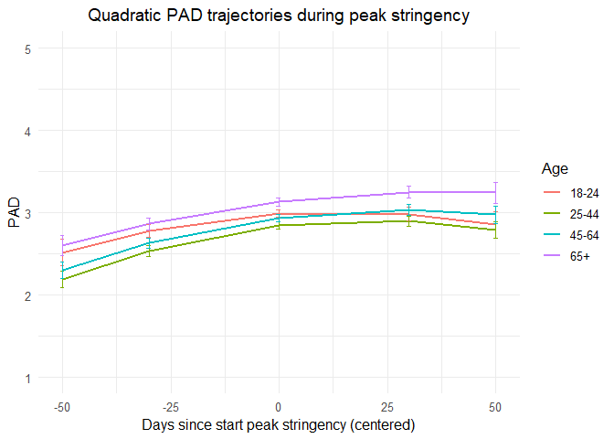<!-- -->

# Phase 3

> Random: IC for ID and Country, S for ID and country, no correlation
> between IC and S for ID and country + AR

``` r
data_analyse2_p3$Edu <- as.numeric(data_analyse2_p3$Edu)
data_analyse2_p3 <- data_analyse2_p3[with(data_analyse2_p3, order(Country, ID, Time)),]
data_analyse2_p3$Time <- as.numeric(data_analyse2_p3$Time)

model_PADp3 <- lme(fixed = PAD ~ Gender + Edu + DaysPhase3 + Age_new + DaysPhase3*Age_new,
                  random = list(Country = pdDiag(~DaysPhase3), ID = pdDiag(~DaysPhase3)),
                  data = data_analyse2_p3, 
                  na.action = na.omit,
                  correlation = corAR1(form = ~ Time | Country/ID))

summary(model_PADp3)
```

    Linear mixed-effects model fit by REML
     Data: data_analyse2_p3 
           AIC      BIC    logLik
      57030.35 57160.36 -28499.18
    
    Random effects:
     Formula: ~DaysPhase3 | Country
     Structure: Diagonal
            (Intercept)  DaysPhase3
    StdDev:    0.212183 0.002271719
    
     Formula: ~DaysPhase3 | ID %in% Country
     Structure: Diagonal
            (Intercept)  DaysPhase3  Residual
    StdDev:     0.72798 0.006383654 0.6010886
    
    Correlation Structure: ARMA(1,0)
     Formula: ~Time | Country/ID 
     Parameter estimate(s):
         Phi1 
    0.1605413 
    Fixed effects: PAD ~ Gender + Edu + DaysPhase3 + Age_new + DaysPhase3 * Age_new 
                             Value  Std.Error    DF   t-value p-value
    (Intercept)          3.0179845 0.06067378 17940  49.74117  0.0000
    Gender1             -0.2527938 0.02188318  7009 -11.55196  0.0000
    Edu                  0.0288603 0.00727885  7009   3.96496  0.0001
    DaysPhase3          -0.0020964 0.00114206 17940  -1.83566  0.0664
    Age_new1            -0.0608164 0.04086883  7009  -1.48809  0.1368
    Age_new2             0.0167838 0.04030732  7009   0.41640  0.6771
    Age_new3             0.1985196 0.04631572  7009   4.28623  0.0000
    DaysPhase3:Age_new1  0.0028295 0.00119850 17940   2.36090  0.0182
    DaysPhase3:Age_new2  0.0036248 0.00117356 17940   3.08873  0.0020
    DaysPhase3:Age_new3  0.0046342 0.00130904 17940   3.54017  0.0004
     Correlation: 
                        (Intr) Gendr1 Edu    DysPh3 Ag_nw1 Ag_nw2 Ag_nw3 DP3:A_1 DP3:A_2
    Gender1             -0.280                                                          
    Edu                 -0.452 -0.027                                                   
    DaysPhase3          -0.265 -0.004 -0.005                                            
    Age_new1            -0.369  0.051 -0.221  0.379                                     
    Age_new2            -0.442  0.106 -0.114  0.386  0.753                              
    Age_new3            -0.429  0.183 -0.074  0.339  0.659  0.703                       
    DaysPhase3:Age_new1  0.244  0.000  0.003 -0.775 -0.490 -0.376 -0.329                
    DaysPhase3:Age_new2  0.248  0.002  0.004 -0.795 -0.378 -0.491 -0.344  0.775         
    DaysPhase3:Age_new3  0.228 -0.001  0.000 -0.722 -0.341 -0.354 -0.484  0.699   0.733 
    
    Standardized Within-Group Residuals:
            Min          Q1         Med          Q3         Max 
    -4.98939971 -0.51430069  0.06344532  0.54032916  3.75382033 
    
    Number of Observations: 24990
    Number of Groups: 
            Country ID %in% Country 
                 32            7046 

``` r
VarCorr(model_PADp3)
```

``` 
            Variance           StdDev     
Country =   pdDiag(DaysPhase3)            
(Intercept) 4.502163e-02       0.212183008
DaysPhase3  5.160709e-06       0.002271719
ID =        pdDiag(DaysPhase3)            
(Intercept) 5.299549e-01       0.727980015
DaysPhase3  4.075104e-05       0.006383654
Residual    3.613075e-01       0.601088599
```

*Confidence intervals*

``` r
intervals(model_PADp3, which = 'fixed')
```

    Approximate 95% confidence intervals
    
     Fixed effects:
                                lower         est.        upper
    (Intercept)          2.8990580111  3.017984456  3.136910901
    Gender1             -0.2956914260 -0.252793766 -0.209896106
    Edu                  0.0145915710  0.028860320  0.043129068
    DaysPhase3          -0.0043349646 -0.002096423  0.000142118
    Age_new1            -0.1409317131 -0.060816434  0.019298845
    Age_new2            -0.0622307462  0.016783795  0.095798336
    Age_new3             0.1077267980  0.198519617  0.289312436
    DaysPhase3:Age_new1  0.0004803663  0.002829537  0.005178708
    DaysPhase3:Age_new2  0.0013245179  0.003624809  0.005925099
    DaysPhase3:Age_new3  0.0020683890  0.004634238  0.007200086
    attr(,"label")
    [1] "Fixed effects:"

*Plot of predicted values*

``` r
ef_PADp3 <- effect("DaysPhase3:Age_new", model_PADp3)

plot_PADp3 <- ggplot(as.data.frame(ef_PADp3), aes(DaysPhase3, fit, color=Age_new)) + 
  geom_line(size=1) + 
  geom_errorbar(aes(ymin=fit-se, ymax=fit+se), width=1) + 
  theme_minimal(base_size=12) + 
  labs(title="PAD trajectories since decline in stringency",
       x="Days since decline in stringency", y = "PAD") +
  theme(plot.title = element_text(hjust = 0.5)) +
  scale_color_discrete(name="Age", labels = c("18-24", "25-44", "45-64", "65+")) + 
  expand_limits(y=c(1, 5))
```

``` r
plot_PADp3
```

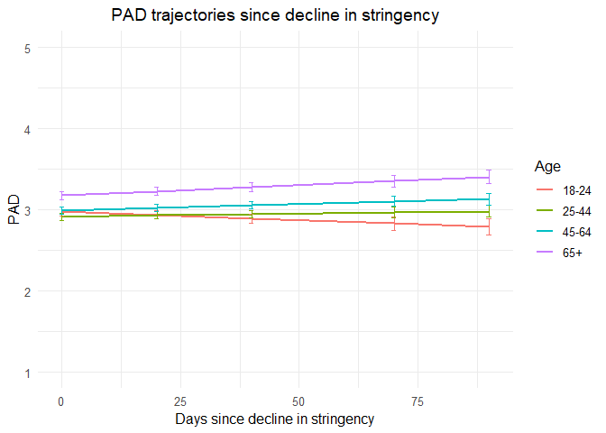<!-- -->

*Effect sizes* **Within person SD and average within person SD for PAD**

``` r
ISDs <- data_analyse2_p3 %>% 
  group_by(ID) %>%
  summarize_at(c("PAD"), sd, na.rm=TRUE) %>%
  ungroup()

ISDs_av <- ISDs %>%
  summarize_at(c("PAD"), mean, na.rm=TRUE) %>%
  stack() %>%
  rename(sd=values) 
```

> Effect sizes for intercept and main effect of age = regression
> coefficient / average ISD of PAD Effect size for main effect of
> DaysMax = (regression coefficient \* 28)/ average ISD of PAD Effect
> sizes for interaction effects = (regression coefficient \* 28)/
> average ISD of PAD

> The effect sizes for main effect of DaysMax and the interaction
> effects reflect the increase in SD of PAD over 4 weeks (28 days)

``` r
coef_PADp3 = tidy(model_PADp3, 
               effects = "fixed")

coef_PADp3 <- coef_PADp3 %>%
 mutate(e_size = ifelse(row_number()== 1 | row_number()== 2 |  row_number()== 3 |  row_number()== 5 |  row_number()== 6 |  row_number()== 7, estimate/0.493802, (estimate*28)/0.493802)) %>%
  mutate(across(2:7, round, 2)) 
```

``` r
coef_PADp3
```

    ## # A tibble: 10 x 7
    ##    term                estimate std.error    df statistic p.value e_size
    ##    <chr>                  <dbl>     <dbl> <dbl>     <dbl>   <dbl>  <dbl>
    ##  1 (Intercept)             3.02      0.06 17940     49.7     0      6.11
    ##  2 Gender1                -0.25      0.02  7009    -11.6     0     -0.51
    ##  3 Edu                     0.03      0.01  7009      3.96    0      0.06
    ##  4 DaysPhase3              0         0    17940     -1.84    0.07  -0.12
    ##  5 Age_new1               -0.06      0.04  7009     -1.49    0.14  -0.12
    ##  6 Age_new2                0.02      0.04  7009      0.42    0.68   0.03
    ##  7 Age_new3                0.2       0.05  7009      4.29    0      0.4 
    ##  8 DaysPhase3:Age_new1     0         0    17940      2.36    0.02   0.16
    ##  9 DaysPhase3:Age_new2     0         0    17940      3.09    0      0.21
    ## 10 DaysPhase3:Age_new3     0         0    17940      3.54    0      0.26

``` r
coef_PADp3 <- as.matrix(coef_PADp3)
```

> PAD seems to decrease over time in the youngest group but not
> significant (main effect), whereas it increases over time in the older
> age groups (interaction effect) very slightly. There are no age
> differences in PAD on the first day stringency reduces again after the
> peak, except for the oldest age group which reports higher PAD (main
> effect). Women report lower PAD, higher educated groups report higher
> PAD.

``` r
model_coefs <- coef(model_PADp3, level = 2)
  
model_coefs <- as.data.frame(model_coefs) %>%
rownames_to_column("ID")
  
model_coefs <- model_coefs %>%
separate(col = 1, into = c("Country", "ID"), sep = "\\/") %>%
dplyr::rename("Intercept" = "(Intercept)")
  
data2 <- left_join(data_analyse2_p3, model_coefs, by= "ID")
  
data3 <- data2 %>%
filter(Nmiss == 0) %>%
  filter(n > 5)
```

``` r
labels <- c("0" = "Age 18-24", "1" = "Age 25-44", "2" = "Age 45-64", "3" = "Age 65+")

model_coef_plot <- ggplot(data = data3[which(data3$ID2 <200),], 
       mapping = aes(x = DaysPhase3.x, y = PAD, colour = ID)) +
  geom_point() +
  geom_abline(aes(intercept = Intercept, 
                  slope = DaysPhase3.y,
                  colour = ID),size = 0.5) + 
                  scale_x_continuous(limits = c(0, 100)) + 
                  theme(legend.position = "none") +
                  facet_wrap(~Age_new, 
                  labeller = labeller(Age_new = labels)) +
  xlab("Days since decline in peak stringency") +
  ggtitle("Predicted PAD trajectories for subsample of participants")  +
      theme_minimal(base_size=12) + 
      scale_color_discrete() + 
      theme(plot.title = element_text(hjust = 0.5)) +
      theme(legend.position = "none") 

model_coef_plot
```

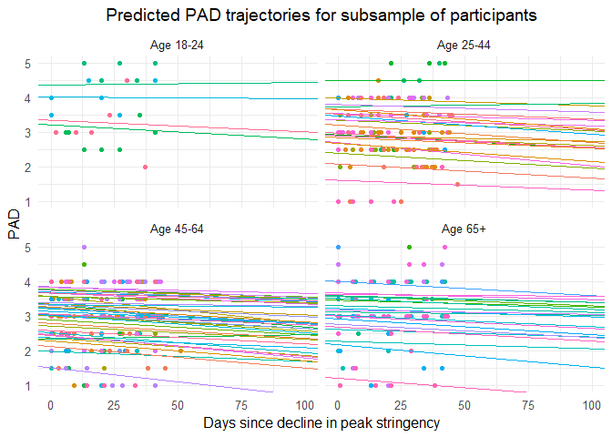<!-- -->

# Random slope variation plot

``` r
plot_PADp3_slope <- ggplot(data2, aes(x= DaysPhase3.y, fill = ..x..)) +
  geom_histogram() +
 scale_fill_viridis(option = "C") +
  theme_minimal()+
  theme(legend.position="none") + 
  geom_vline(xintercept = 0, linetype="dashed", 
                color = "black", size=.5) + 
  labs(title="Variability in PAD trajectories after peak stringency",
       x="Regression coefficient (PAD ~ days)", y = "Count") +
  theme(plot.title = element_text(hjust = 0.5)) +
   facet_wrap(~ Age_new, labeller = labeller(Age_new = Age_labels)) 
```

``` r
plot_PADp3_slope 
```

    ## `stat_bin()` using `bins = 30`. Pick better value with `binwidth`.

    ## Warning: Removed 1 rows containing non-finite values (stat_bin).

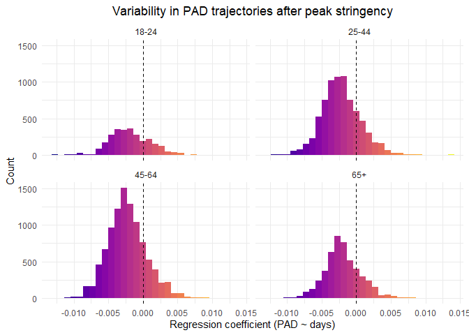<!-- -->

Distribution

``` r
data2<- as_tibble(data2)
data2 %>%
  filter(DaysPhase3.y > 0) %>%
  summarise(N = n())
```

    ## # A tibble: 1 x 1
    ##       N
    ##   <int>
    ## 1  5219

``` r
#5219

data2 %>%
  filter(DaysPhase3.y < 0) %>%
  summarise(N = n())
```

    ## # A tibble: 1 x 1
    ##       N
    ##   <int>
    ## 1 19791

``` r
#19791

#Decrease in PAD:

19791 / (19791 + 5219) * 100
```

    ## [1] 79.13235

``` r
#79.13%
```

``` r
stargazer(coef_PADp1, coef_PADp2, coef_PADp3,
type="html", df = TRUE, out="star_coefallphase_PAD.doc",  single.row=TRUE, digits = 2, align = TRUE)
```

    ## 
    ## <table style="text-align:center"><tr><td colspan="7" style="border-bottom: 1px solid black"></td></tr><tr><td>term</td><td>estimate</td><td>std.error</td><td>df</td><td>statistic</td><td>p.value</td><td>e_size</td></tr>
    ## <tr><td colspan="7" style="border-bottom: 1px solid black"></td></tr><tr><td>(Intercept)</td><td>2.94</td><td>0.10</td><td>2716</td><td>28.81</td><td>0.00</td><td>6.29</td></tr>
    ## <tr><td>Gender1</td><td>-0.27</td><td>0.04</td><td>2716</td><td>-7.33</td><td>0.00</td><td>-0.59</td></tr>
    ## <tr><td>Edu</td><td>0.02</td><td>0.01</td><td>2716</td><td>1.25</td><td>0.21</td><td>0.04</td></tr>
    ## <tr><td>Age_new1</td><td>-0.16</td><td>0.05</td><td>2716</td><td>-3.07</td><td>0.00</td><td>-0.34</td></tr>
    ## <tr><td>Age_new2</td><td>-0.01</td><td>0.06</td><td>2716</td><td>-0.12</td><td>0.90</td><td>-0.01</td></tr>
    ## <tr><td>Age_new3</td><td>0.22</td><td>0.08</td><td>2716</td><td>2.84</td><td>0.00</td><td>0.48</td></tr>
    ## <tr><td colspan="7" style="border-bottom: 1px solid black"></td></tr></table>
    ## 
    ## <table style="text-align:center"><tr><td colspan="7" style="border-bottom: 1px solid black"></td></tr><tr><td>term</td><td>estimate</td><td>std.error</td><td>df</td><td>statistic</td><td>p.value</td><td>e_size</td></tr>
    ## <tr><td colspan="7" style="border-bottom: 1px solid black"></td></tr><tr><td>(Intercept)</td><td>2.99</td><td>0.06</td><td>20356</td><td>50.63</td><td>0.00</td><td>5.92</td></tr>
    ## <tr><td>Gender1</td><td>-0.27</td><td>0.02</td><td>9176</td><td>-14.14</td><td>0.00</td><td>-0.54</td></tr>
    ## <tr><td>Edu</td><td>0.03</td><td>0.01</td><td>9176</td><td>4.95</td><td>0.00</td><td>0.06</td></tr>
    ## <tr><td>DaysMax_p2</td><td>0.00</td><td>0.00</td><td>20356</td><td>2.34</td><td>0.02</td><td>0.19</td></tr>
    ## <tr><td>Age_new1</td><td>-0.19</td><td>0.04</td><td>9176</td><td>-5.31</td><td>0.00</td><td>-0.39</td></tr>
    ## <tr><td>Age_new2</td><td>-0.13</td><td>0.04</td><td>9176</td><td>-3.45</td><td>0.00</td><td>-0.26</td></tr>
    ## <tr><td>Age_new3</td><td>0.06</td><td>0.05</td><td>9176</td><td>1.26</td><td>0.21</td><td>0.11</td></tr>
    ## <tr><td>DaysMax_p2:Age_new1</td><td>0.00</td><td>0.00</td><td>20356</td><td>2.05</td><td>0.04</td><td>0.12</td></tr>
    ## <tr><td>DaysMax_p2:Age_new2</td><td>0.00</td><td>0.00</td><td>20356</td><td>2.62</td><td>0.01</td><td>0.16</td></tr>
    ## <tr><td>DaysMax_p2:Age_new3</td><td>0.00</td><td>0.00</td><td>20356</td><td>2.29</td><td>0.02</td><td>0.16</td></tr>
    ## <tr><td colspan="7" style="border-bottom: 1px solid black"></td></tr></table>
    ## 
    ## <table style="text-align:center"><tr><td colspan="7" style="border-bottom: 1px solid black"></td></tr><tr><td>term</td><td>estimate</td><td>std.error</td><td>df</td><td>statistic</td><td>p.value</td><td>e_size</td></tr>
    ## <tr><td colspan="7" style="border-bottom: 1px solid black"></td></tr><tr><td>(Intercept)</td><td>3.02</td><td>0.06</td><td>17940</td><td>49.74</td><td>0.00</td><td>6.11</td></tr>
    ## <tr><td>Gender1</td><td>-0.25</td><td>0.02</td><td>7009</td><td>-11.55</td><td>0.00</td><td>-0.51</td></tr>
    ## <tr><td>Edu</td><td>0.03</td><td>0.01</td><td>7009</td><td>3.96</td><td>0.00</td><td>0.06</td></tr>
    ## <tr><td>DaysPhase3</td><td>0.00</td><td>0.00</td><td>17940</td><td>-1.84</td><td>0.07</td><td>-0.12</td></tr>
    ## <tr><td>Age_new1</td><td>-0.06</td><td>0.04</td><td>7009</td><td>-1.49</td><td>0.14</td><td>-0.12</td></tr>
    ## <tr><td>Age_new2</td><td>0.02</td><td>0.04</td><td>7009</td><td>0.42</td><td>0.68</td><td>0.03</td></tr>
    ## <tr><td>Age_new3</td><td>0.20</td><td>0.05</td><td>7009</td><td>4.29</td><td>0.00</td><td>0.40</td></tr>
    ## <tr><td>DaysPhase3:Age_new1</td><td>0.00</td><td>0.00</td><td>17940</td><td>2.36</td><td>0.02</td><td>0.16</td></tr>
    ## <tr><td>DaysPhase3:Age_new2</td><td>0.00</td><td>0.00</td><td>17940</td><td>3.09</td><td>0.00</td><td>0.21</td></tr>
    ## <tr><td>DaysPhase3:Age_new3</td><td>0.00</td><td>0.00</td><td>17940</td><td>3.54</td><td>0.00</td><td>0.26</td></tr>
    ## <tr><td colspan="7" style="border-bottom: 1px solid black"></td></tr></table>

``` r
stargazer(model_PADp1, model_PADp2, model_PADp2q, model_PADp3,
type="html", df = TRUE, out="starallphasesPAD.doc",  single.row=TRUE, digits = 2, align = TRUE,
intercept.top = TRUE, intercept.bottom = FALSE)
```

    ## 
    ## <table style="text-align:center"><tr><td colspan="5" style="border-bottom: 1px solid black"></td></tr><tr><td style="text-align:left"></td><td colspan="4"><em>Dependent variable:</em></td></tr>
    ## <tr><td></td><td colspan="4" style="border-bottom: 1px solid black"></td></tr>
    ## <tr><td style="text-align:left"></td><td colspan="4">PAD</td></tr>
    ## <tr><td style="text-align:left"></td><td>(1)</td><td>(2)</td><td>(3)</td><td>(4)</td></tr>
    ## <tr><td colspan="5" style="border-bottom: 1px solid black"></td></tr><tr><td style="text-align:left">Constant</td><td>2.94<sup>***</sup> (0.10)</td><td>2.99<sup>***</sup> (0.06)</td><td>3.04<sup>***</sup> (0.05)</td><td>3.02<sup>***</sup> (0.06)</td></tr>
    ## <tr><td style="text-align:left">Gender1</td><td>-0.27<sup>***</sup> (0.04)</td><td>-0.27<sup>***</sup> (0.02)</td><td>-0.26<sup>***</sup> (0.02)</td><td>-0.25<sup>***</sup> (0.02)</td></tr>
    ## <tr><td style="text-align:left">Edu</td><td>0.02 (0.01)</td><td>0.03<sup>***</sup> (0.01)</td><td>0.03<sup>***</sup> (0.01)</td><td>0.03<sup>***</sup> (0.01)</td></tr>
    ## <tr><td style="text-align:left">DaysMax_p2</td><td></td><td>0.003<sup>**</sup> (0.001)</td><td></td><td></td></tr>
    ## <tr><td style="text-align:left">DaysMax_p2_dev</td><td></td><td></td><td>0.003<sup>**</sup> (0.002)</td><td></td></tr>
    ## <tr><td style="text-align:left">DaysPhase3</td><td></td><td></td><td></td><td>-0.002<sup>*</sup> (0.001)</td></tr>
    ## <tr><td style="text-align:left">Age_new1</td><td>-0.16<sup>***</sup> (0.05)</td><td>-0.19<sup>***</sup> (0.04)</td><td>-0.15<sup>***</sup> (0.03)</td><td>-0.06 (0.04)</td></tr>
    ## <tr><td style="text-align:left">Age_new2</td><td>-0.01 (0.06)</td><td>-0.13<sup>***</sup> (0.04)</td><td>-0.05<sup>*</sup> (0.03)</td><td>0.02 (0.04)</td></tr>
    ## <tr><td style="text-align:left">Age_new3</td><td>0.22<sup>***</sup> (0.08)</td><td>0.06 (0.05)</td><td>0.14<sup>***</sup> (0.04)</td><td>0.20<sup>***</sup> (0.05)</td></tr>
    ## <tr><td style="text-align:left">DaysMax_p2:Age_new1</td><td></td><td>0.002<sup>**</sup> (0.001)</td><td></td><td></td></tr>
    ## <tr><td style="text-align:left">DaysMax_p2:Age_new2</td><td></td><td>0.003<sup>***</sup> (0.001)</td><td></td><td></td></tr>
    ## <tr><td style="text-align:left">DaysMax_p2:Age_new3</td><td></td><td>0.003<sup>**</sup> (0.001)</td><td></td><td></td></tr>
    ## <tr><td style="text-align:left">I(DaysMax_p2_dev2)</td><td></td><td></td><td>-0.0001<sup>**</sup> (0.0001)</td><td></td></tr>
    ## <tr><td style="text-align:left">DaysMax_p2_dev:Age_new1</td><td></td><td></td><td>0.003<sup>**</sup> (0.001)</td><td></td></tr>
    ## <tr><td style="text-align:left">DaysMax_p2_dev:Age_new2</td><td></td><td></td><td>0.003<sup>***</sup> (0.001)</td><td></td></tr>
    ## <tr><td style="text-align:left">DaysMax_p2_dev:Age_new3</td><td></td><td></td><td>0.003<sup>**</sup> (0.001)</td><td></td></tr>
    ## <tr><td style="text-align:left">Age_new1:I(DaysMax_p2_dev2)</td><td></td><td></td><td>-0.0000 (0.0001)</td><td></td></tr>
    ## <tr><td style="text-align:left">Age_new2:I(DaysMax_p2_dev2)</td><td></td><td></td><td>0.0000 (0.0001)</td><td></td></tr>
    ## <tr><td style="text-align:left">Age_new3:I(DaysMax_p2_dev2)</td><td></td><td></td><td>0.0000 (0.0001)</td><td></td></tr>
    ## <tr><td style="text-align:left">DaysPhase3:Age_new1</td><td></td><td></td><td></td><td>0.003<sup>**</sup> (0.001)</td></tr>
    ## <tr><td style="text-align:left">DaysPhase3:Age_new2</td><td></td><td></td><td></td><td>0.004<sup>***</sup> (0.001)</td></tr>
    ## <tr><td style="text-align:left">DaysPhase3:Age_new3</td><td></td><td></td><td></td><td>0.005<sup>***</sup> (0.001)</td></tr>
    ## <tr><td colspan="5" style="border-bottom: 1px solid black"></td></tr><tr><td style="text-align:left">Observations</td><td>4,155</td><td>29,574</td><td>29,574</td><td>24,990</td></tr>
    ## <tr><td style="text-align:left">Log Likelihood</td><td>-5,445.53</td><td>-34,199.03</td><td>-34,190.77</td><td>-28,499.18</td></tr>
    ## <tr><td style="text-align:left">Akaike Inf. Crit.</td><td>10,909.06</td><td>68,430.06</td><td>68,423.54</td><td>57,030.35</td></tr>
    ## <tr><td style="text-align:left">Bayesian Inf. Crit.</td><td>10,966.04</td><td>68,562.77</td><td>68,597.72</td><td>57,160.36</td></tr>
    ## <tr><td colspan="5" style="border-bottom: 1px solid black"></td></tr><tr><td style="text-align:left"><em>Note:</em></td><td colspan="4" style="text-align:right"><sup>*</sup>p<0.1; <sup>**</sup>p<0.05; <sup>***</sup>p<0.01</td></tr>
    ## </table>
