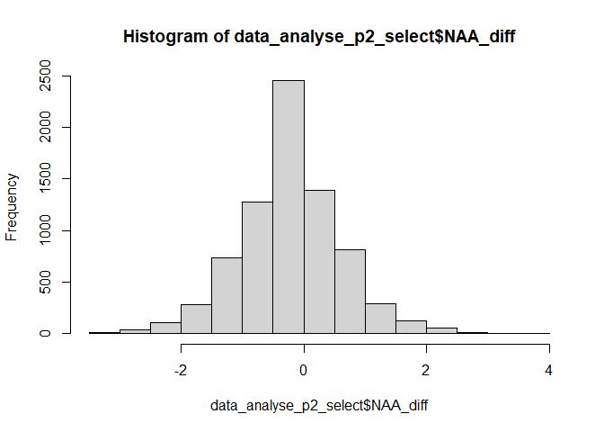

Difference scores phase 2 heatmaps
================
Anne Margit
02/04/2021

    ## [1] ""

``` r
load("data_analyse2_p1.Rdata")
load("data_analyse2_p2.Rdata")
load("data_analyse2_p3.Rdata")
```

``` r
library(dplyr)
library(tidyverse)
library(ggpubr)
library(ggplot2)
library(rockchalk)
library(effects)
library(nlme)
library(lattice)
library(broom.mixed)
library(purrr)
library(stargazer)
```

    ## Warning: package 'stargazer' was built under R version 4.0.3

``` r
#Create variable that indicates first day of max stringency (0) and last day (1) in period
data_analyse2_p2$Time <- as.numeric(data_analyse2_p2$Time)

data_analyse2_p2 <- data_analyse2_p2 %>% 
  group_by(ID) %>%
  mutate(Day = ifelse(DaysMax == min(DaysMax) & Time==min(Time), 0, 
                      ifelse(DaysMax == max(DaysMax) & Time ==max(Time), 1, NA)))

# Filter observations that are either on the first or last day
data_analyse_p2_select <- data_analyse2_p2 %>%
  ungroup()%>%
  filter(Day==0 | Day == 1)

# Add number of measurements per ID (nn)
data_analyse_p2_select <- data_analyse_p2_select %>% group_by(ID) %>% add_tally()

#Select pps with at least 2 measurements in this period (otherwise no diff score is possible)
data_analyse_p2_select <- data_analyse_p2_select %>%
  subset(nn > 1)

# Order data
data_analyse_p2_select <- data_analyse_p2_select[with(data_analyse_p2_select, order(Country, ID, Time)),]

# Create lag 
data_analyse_p2_select <- data_analyse_p2_select %>%
  group_by(ID)%>%
  mutate(NAA_L = lead(NAA, n=1L))

data_analyse_p2_select <- data_analyse_p2_select %>%
  group_by(ID)%>%
  mutate(NAD_L = lead(NAD, n=1L))

data_analyse_p2_select <- data_analyse_p2_select %>%
  group_by(ID)%>%
  mutate(PAA_L = lead(PAA, n=1L))

data_analyse_p2_select <- data_analyse_p2_select %>%
  group_by(ID)%>%
  mutate(PAD_L = lead(PAD, n=1L))

# Create difference score
data_analyse_p2_select <- data_analyse_p2_select %>%
  ungroup()%>%
  mutate(NAA_diff = NAA_L - NAA)

data_analyse_p2_select <- data_analyse_p2_select %>%
  ungroup()%>%
  mutate(NAD_diff = NAD_L - NAD)

data_analyse_p2_select <- data_analyse_p2_select %>%
  ungroup()%>%
  mutate(PAA_diff = PAA_L - PAA)

data_analyse_p2_select <- data_analyse_p2_select %>%
  ungroup()%>%
  mutate(PAD_diff = PAD_L - PAD)


hist(data_analyse_p2_select$NAA_diff)
```

<!-- -->

``` r
data_analyse_p2_diff <- data_analyse_p2_select
save(data_analyse_p2_diff, file = 'data_analyse_p2_diff.Rdata')
```
