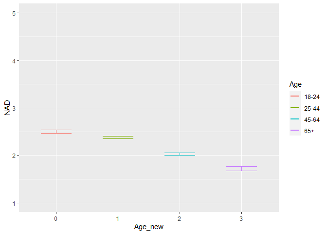
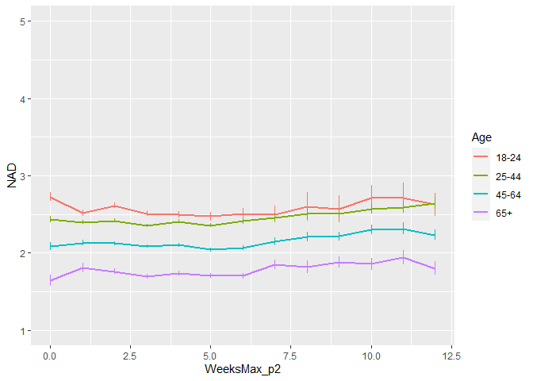
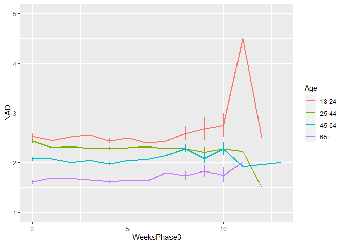
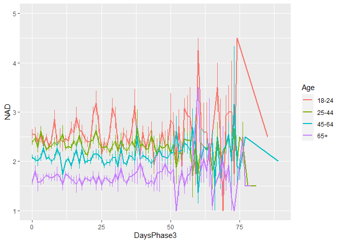
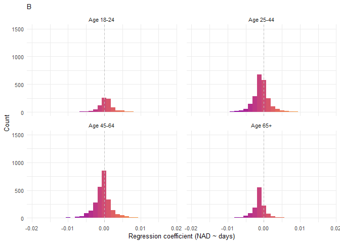
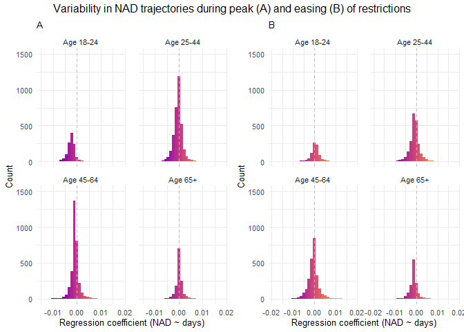

NAD final june 2021
================
Anne Margit
06/16/2021

    ## [1] ""

``` r
load("data_analyse2_p1.Rdata")
load("data_analyse2_p2.Rdata")
load("data_analyse2_p3.Rdata")
```

This dataset includes:

1.  Data from all weekly measurement waves (baseline through wave 11,
    Time 1 through 12)
2.  Participants who provided at least 3 measurements
3.  Participants who are residents of the country they currently live in
4.  Participants who provided info on age
5.  Participants who provided info on gender (either male or female)
6.  Data from countries with at least 20 participants
7.  Pooled age groups
8.  Imputed missing emotion scores
9.  Combined emotion scores (NAA, NAD, PAA, PAD)
10. An imputed Stringency index (StringencyIndex\_imp)
11. A dummy Str\_dummy with 0 = before the peak, 1 = during peak, 2 =
    after peak
12. A variable indicating the number of days before maximum stringency
    was reached (DaysMax\_p1), during (DaysMax\_p2), and after
    (DaysPhase3)
13. A variable indicating the number of weeks before maximum stringency
    was reached (WeeksMax\_p1), during (WeeksMax\_p2), and after
    (WeeksPhase3)
14. A variable indicating the date on which maximum Stringency was
    reached for that country (DateMaxStr) and the max level reached
    (MaxStr) across the entire measurement period
15. A variable indicating the date on which minimum Stringency was
    reached for that country (DateMinStr) and the min level reached
    (MinStr) across the entire measurement period
16. Observations during which there was a second peak are excluded
    (N=583)

> My comments are in block quotes such as this.

``` r
library(dplyr)
library(tidyverse)
library(ggpubr)
library(ggplot2)
library(rockchalk)
library(effects)
library(nlme)
library(lattice)
library(broom.mixed)
library(purrr)
library(stargazer)
```

    ## Warning: package 'stargazer' was built under R version 4.0.3

``` r
library(viridis)
```

    ## Warning: package 'viridis' was built under R version 4.0.3

# Descriptives

**Number of participants per age group**

> 0 = 18-24, 1 = 25-44, 3= 45-64, 4= 65+

Phase 1

``` r
data_analyse2_p1 %>%
  group_by(Age_new) %>%
  summarise(NAge = n())
```

    # A tibble: 4 x 2
      Age_new  NAge
      <fct>   <int>
    1 0         695
    2 1        1893
    3 2        1274
    4 3         293

Phase 2

``` r
data_analyse2_p2 %>%
  group_by(Age_new) %>%
  summarise(NAge = n())
```

    # A tibble: 4 x 2
      Age_new  NAge
      <fct>   <int>
    1 0        3677
    2 1       11292
    3 2       10253
    4 3        4366

Phase 3

``` r
data_analyse2_p2 %>%
  group_by(Age_new) %>%
  summarise(NAge = n())
```

    # A tibble: 4 x 2
      Age_new  NAge
      <fct>   <int>
    1 0        3677
    2 1       11292
    3 2       10253
    4 3        4366

**Plots** **Mean NAD against max stringency in WEEKS** Phase 1 (only age
differences)

``` r
plot_NAD1 <- ggplot(data_analyse2_p1, aes(x=Age_new, y=NAD, group = Age_new, color = Age_new))

plot_NAD1 + stat_summary(fun.y=mean, geom="line", size=1)  + geom_errorbar(stat="summary", fun.data="mean_se", width=0.5) + scale_colour_discrete(name = "Age", labels = c("18-24", "25-44", "45-64", "65+")) + expand_limits(y=c(1, 5))
```

<!-- -->

Phase 2

``` r
plot_NAD2 <- ggplot(data_analyse2_p2, aes(x=WeeksMax_p2, y=NAD, group = Age_new, color = Age_new))

plot_NAD2 + stat_summary(fun.y=mean, geom="line", size=1)  + geom_errorbar(stat="summary", fun.data="mean_se", width=0) + scale_colour_discrete(name = "Age", labels = c("18-24", "25-44", "45-64", "65+")) + expand_limits(y=c(1, 5))
```

<!-- -->

Phase 3

``` r
plot_NAD3 <- ggplot(data_analyse2_p3, aes(x=WeeksPhase3, y=NAD, group = Age_new, color = Age_new))

plot_NAD3 + stat_summary(fun.y=mean, geom="line", size=1)  + geom_errorbar(stat="summary", fun.data="mean_se", width=0) + scale_colour_discrete(name = "Age", labels = c("18-24", "25-44", "45-64", "65+")) + expand_limits(y=c(1, 5))
```

<!-- -->

**Mean NAD against max stringency in DAYS** Phase 2

``` r
plot_NAD2 <- ggplot(data_analyse2_p2, aes(x=DaysMax_p2, y=NAD, group = Age_new, color = Age_new))

plot_NAD2 + stat_summary(fun.y=mean, geom="line", size=1)  + geom_errorbar(stat="summary", fun.data="mean_se", width=0) + scale_colour_discrete(name = "Age", labels = c("18-24", "25-44", "45-64", "65+")) + expand_limits(y=c(1, 5))
```

<!-- -->

Phase 3

``` r
plot_NAD3 <- ggplot(data_analyse2_p3, aes(x=DaysPhase3, y=NAD, group = Age_new, color = Age_new))

plot_NAD3 + stat_summary(fun.y=mean, geom="line", size=1)  + geom_errorbar(stat="summary", fun.data="mean_se", width=0) + scale_colour_discrete(name = "Age", labels = c("18-24", "25-44", "45-64", "65+")) + expand_limits(y=c(1, 5))
```

<!-- -->

# Phase 1

*Random: IC for ID and Country + Covariates Gender and Education*

> Gender: Male = 0, Female = 1

> Edu: 0= Primary education, 1= General secondary education, 2=
> Vocational education, 3= Higher education, 4= Bachelors degree, 5=
> Masters degree, 6= PhD degree

``` r
data_analyse2_p1$Edu <- as.numeric(data_analyse2_p1$Edu)
model_NADp1 <- lme(fixed = NAD ~ Gender + Edu + Age_new,
                  random = ~1 | Country/ID, 
                  data = data_analyse2_p1, 
                  na.action = na.omit)

summary(model_NADp1)
```

    Linear mixed-effects model fit by REML
     Data: data_analyse2_p1 
        AIC      BIC  logLik
      10867 10923.98 -5424.5
    
    Random effects:
     Formula: ~1 | Country
            (Intercept)
    StdDev:   0.1144438
    
     Formula: ~1 | ID %in% Country
            (Intercept)  Residual
    StdDev:   0.6915274 0.6474299
    
    Fixed effects: NAD ~ Gender + Edu + Age_new 
                     Value  Std.Error   DF   t-value p-value
    (Intercept)  2.4935283 0.08193849 2716 30.431708   0.000
    Gender1      0.2309911 0.03742912 2716  6.171427   0.000
    Edu         -0.0286939 0.01352388 2716 -2.121720   0.034
    Age_new1    -0.0898865 0.05200072 2716 -1.728562   0.084
    Age_new2    -0.4222208 0.05493846 2716 -7.685341   0.000
    Age_new3    -0.7195809 0.07744554 2716 -9.291444   0.000
     Correlation: 
             (Intr) Gendr1 Edu    Ag_nw1 Ag_nw2
    Gender1  -0.338                            
    Edu      -0.671 -0.046                     
    Age_new1 -0.297  0.076 -0.244              
    Age_new2 -0.352  0.128 -0.155  0.712       
    Age_new3 -0.303  0.183 -0.093  0.495  0.494
    
    Standardized Within-Group Residuals:
           Min         Q1        Med         Q3        Max 
    -3.5158644 -0.5608959 -0.1017612  0.5057543  3.6327150 
    
    Number of Observations: 4155
    Number of Groups: 
            Country ID %in% Country 
                 26            2747 

``` r
VarCorr(model_NADp1)
```

``` 
            Variance     StdDev   
Country =   pdLogChol(1)          
(Intercept) 0.01309739   0.1144438
ID =        pdLogChol(1)          
(Intercept) 0.47821009   0.6915274
Residual    0.41916551   0.6474299
```

*Confidence intervals*

``` r
intervals(model_NADp1)
```

    Approximate 95% confidence intervals
    
     Fixed effects:
                      lower        est.        upper
    (Intercept)  2.33286021  2.49352831  2.654196404
    Gender1      0.15759865  0.23099108  0.304383504
    Edu         -0.05521203 -0.02869389 -0.002175748
    Age_new1    -0.19185146 -0.08988649  0.012078486
    Age_new2    -0.52994619 -0.42222079 -0.314495387
    Age_new3    -0.87143902 -0.71958088 -0.567722736
    attr(,"label")
    [1] "Fixed effects:"
    
     Random Effects:
      Level: Country 
                         lower      est.     upper
    sd((Intercept)) 0.06753744 0.1144438 0.1939278
      Level: ID 
                        lower      est.     upper
    sd((Intercept)) 0.6593397 0.6915274 0.7252863
    
     Within-group standard error:
        lower      est.     upper 
    0.6248738 0.6474299 0.6708002 

*Plot of predicted values*

``` r
ef_NADp1 <- effect("Age_new", model_NADp1)

plot_NADp1 <- ggplot(as.data.frame(ef_NADp1), 
  aes(Age_new, fit, color=Age_new)) + geom_line() + 
  geom_errorbar(aes(ymin=fit-se, ymax=fit+se), width=1) + theme_minimal(base_size=10) + 
  labs(title="NAD during tightening of restrictions", y = "NAD") +
  theme(plot.title = element_text(hjust = 0.5)) +
  scale_x_discrete(name ="Age", labels=c("18-24", "25-44", "45-64", "65+")) +
  theme(legend.position = "none") +                 
  scale_color_discrete() + 
  expand_limits(y=c(1, 5))
```

``` r
plot_NADp1
```

<!-- -->

*Effect sizes*

``` r
ISDs <- data_analyse2_p1 %>% 
  group_by(ID) %>%
  summarize_at(c("NAD"), sd, na.rm=TRUE) %>%
  ungroup()

ISDs_av <- ISDs %>%
  summarize_at(c("NAD"), mean, na.rm=TRUE) %>%
  stack() %>%
  rename(sd=values) 
```

> Effect size = regression coefficient / average ISD of NAD

``` r
coef_NADp1 = tidy(model_NADp1, 
               effects = "fixed")

coef_NADp1 <- coef_NADp1 %>%
  mutate (e_size = estimate/0.4838285) %>% 
  mutate(across(2:7, round, 2)) 
```

``` r
coef_NADp1
```

    ## # A tibble: 6 x 7
    ##   term        estimate std.error    df statistic p.value e_size
    ##   <chr>          <dbl>     <dbl> <dbl>     <dbl>   <dbl>  <dbl>
    ## 1 (Intercept)     2.49      0.08  2716     30.4     0      5.15
    ## 2 Gender1         0.23      0.04  2716      6.17    0      0.48
    ## 3 Edu            -0.03      0.01  2716     -2.12    0.03  -0.06
    ## 4 Age_new1       -0.09      0.05  2716     -1.73    0.08  -0.19
    ## 5 Age_new2       -0.42      0.05  2716     -7.69    0     -0.87
    ## 6 Age_new3       -0.72      0.08  2716     -9.29    0     -1.49

``` r
coef_NADp1 <- as.matrix(coef_NADp1)
```

# Phase 2

*Best model*

> Random intercept for ID and Country, random slope for Country, AR
> correlation structure at Measuement level

``` r
data_analyse2_p2$Edu <- as.numeric(data_analyse2_p2$Edu)
data_analyse2_p2 <- data_analyse2_p2[with(data_analyse2_p2, order(Country, ID, Time)),]
data_analyse2_p2$Time <- as.numeric(data_analyse2_p2$Time)

model_NADp2 <- lme(fixed = NAD ~ Gender + Edu + DaysMax_p2 + Age_new + DaysMax_p2*Age_new,
                  random = list (Country = ~1, ID = ~DaysMax_p2), 
                  data = data_analyse2_p2, 
                  na.action = na.omit,
                  correlation = corAR1(form = ~ Time | Country/ID))

summary(model_NADp2)
```

    Linear mixed-effects model fit by REML
     Data: data_analyse2_p2 
           AIC      BIC   logLik
      68132.81 68265.51 -34050.4
    
    Random effects:
     Formula: ~1 | Country
            (Intercept)
    StdDev:   0.1167168
    
     Formula: ~DaysMax_p2 | ID %in% Country
     Structure: General positive-definite, Log-Cholesky parametrization
                StdDev      Corr  
    (Intercept) 0.777398843 (Intr)
    DaysMax_p2  0.007129247 -0.238
    Residual    0.594110081       
    
    Correlation Structure: ARMA(1,0)
     Formula: ~Time | Country/ID 
     Parameter estimate(s):
         Phi1 
    0.2184375 
    Fixed effects: NAD ~ Gender + Edu + DaysMax_p2 + Age_new + DaysMax_p2 * Age_new 
                             Value  Std.Error    DF   t-value p-value
    (Intercept)          2.5080124 0.04824658 20356  51.98321  0.0000
    Gender1              0.2151654 0.01963726  9176  10.95699  0.0000
    Edu                 -0.0212137 0.00642575  9176  -3.30136  0.0010
    DaysMax_p2          -0.0023915 0.00093089 20356  -2.56909  0.0102
    Age_new1            -0.1532267 0.03747808  9176  -4.08843  0.0000
    Age_new2            -0.4185702 0.03821901  9176 -10.95189  0.0000
    Age_new3            -0.7608005 0.04623255  9176 -16.45595  0.0000
    DaysMax_p2:Age_new1  0.0020460 0.00103265 20356   1.98131  0.0476
    DaysMax_p2:Age_new2  0.0016055 0.00104495 20356   1.53646  0.1244
    DaysMax_p2:Age_new3  0.0025501 0.00119248 20356   2.13845  0.0325
     Correlation: 
                        (Intr) Gendr1 Edu    DysM_2 Ag_nw1 Ag_nw2 Ag_nw3 DM_2:A_1 DM_2:A_2
    Gender1             -0.308                                                            
    Edu                 -0.493 -0.030                                                     
    DaysMax_p2          -0.361  0.001 -0.020                                              
    Age_new1            -0.446  0.048 -0.214  0.501                                       
    Age_new2            -0.490  0.080 -0.129  0.493  0.745                                
    Age_new3            -0.444  0.148 -0.088  0.407  0.617  0.619                         
    DaysMax_p2:Age_new1  0.327 -0.001  0.020 -0.896 -0.568 -0.437 -0.361                  
    DaysMax_p2:Age_new2  0.321 -0.002  0.024 -0.887 -0.443 -0.585 -0.360  0.798           
    DaysMax_p2:Age_new3  0.286 -0.011  0.016 -0.777 -0.387 -0.383 -0.604  0.699    0.692  
    
    Standardized Within-Group Residuals:
           Min         Q1        Med         Q3        Max 
    -4.0525592 -0.5228044 -0.1183124  0.4952634  4.0687093 
    
    Number of Observations: 29574
    Number of Groups: 
            Country ID %in% Country 
                 33            9214 

``` r
VarCorr(model_NADp2)
```

``` 
            Variance              StdDev      Corr  
Country =   pdLogChol(1)                            
(Intercept) 1.362282e-02          0.116716818       
ID =        pdLogChol(DaysMax_p2)                   
(Intercept) 6.043490e-01          0.777398843 (Intr)
DaysMax_p2  5.082617e-05          0.007129247 -0.238
Residual    3.529668e-01          0.594110081       
```

*Confidence intervals*

``` r
intervals(model_NADp2, which = 'fixed')
```

    Approximate 95% confidence intervals
    
     Fixed effects:
                                lower         est.         upper
    (Intercept)          2.413445e+00  2.508012360  2.6025795431
    Gender1              1.766720e-01  0.215165353  0.2536587530
    Edu                 -3.380958e-02 -0.021213680 -0.0086177820
    DaysMax_p2          -4.216158e-03 -0.002391540 -0.0005669216
    Age_new1            -2.266921e-01 -0.153226681 -0.0797612993
    Age_new2            -4.934880e-01 -0.418570231 -0.3436524750
    Age_new3            -8.514266e-01 -0.760800493 -0.6701743993
    DaysMax_p2:Age_new1  2.192278e-05  0.002046007  0.0040700906
    DaysMax_p2:Age_new2 -4.426628e-04  0.001605523  0.0036537084
    DaysMax_p2:Age_new3  2.127068e-04  0.002550069  0.0048874306
    attr(,"label")
    [1] "Fixed effects:"

*Plot of predicted values*

``` r
ef_NADp2 <- effect("DaysMax_p2:Age_new", model_NADp2)

plot_NADp2 <- ggplot(as.data.frame(ef_NADp2), aes(DaysMax_p2, fit, color=Age_new)) + 
  geom_line(size=1) + 
  geom_errorbar(aes(ymin=fit-se, ymax=fit+se), width=1) + 
  theme_minimal(base_size=10) + 
  labs(title="A",
       x="Days", y = "NAD") +
  theme(plot.title = element_text(size=10)) +
  scale_color_discrete(name="Age", labels = c("18-24", "25-44", "45-64", "65+")) + 
  expand_limits(y=c(1, 5))
```

``` r
plot_NADp2
```

<!-- -->

*Effect sizes* **Within person SD and average within person SD**

``` r
ISDs <- data_analyse2_p2 %>% 
  group_by(ID) %>%
  summarize_at(c("DaysMax_p2", "NAD"), sd, na.rm=TRUE) %>%
  ungroup()

ISDs_av <- ISDs %>%
  summarize_at(c("DaysMax_p2", "NAD"), mean, na.rm=TRUE) %>%
  stack() %>%
  rename(sd=values) 
```

> Effect sizes for intercept and main effect of age and covariates =
> regression coefficient / average ISD of NAD Effect size for main
> effect of DaysMax = (regression coefficient \* 28)/ average ISD of NAD
> Effect sizes for interaction effects = (regression coefficient \* 28)/
> average ISD of NAD

> The effect sizes for main effect of DaysMax and the interaction
> effects reflect the increase in SD of NAD over 4 weeks (28 days)

``` r
coef_NADp2 = tidy(model_NADp2, 
               effects = "fixed")

coef_NADp2 <- coef_NADp2 %>%
  mutate(e_size = ifelse(row_number()== 1 | row_number()== 2 |  row_number()== 3 |  row_number()== 5 |  row_number()== 6 |  row_number()== 7, estimate/0.4753929, (estimate*28)/0.4753929)) %>%
  mutate(across(2:7, round, 2)) 
```

``` r
coef_NADp2
```

    ## # A tibble: 10 x 7
    ##    term                estimate std.error    df statistic p.value e_size
    ##    <chr>                  <dbl>     <dbl> <dbl>     <dbl>   <dbl>  <dbl>
    ##  1 (Intercept)             2.51      0.05 20356     52.0     0      5.28
    ##  2 Gender1                 0.22      0.02  9176     11.0     0      0.45
    ##  3 Edu                    -0.02      0.01  9176     -3.3     0     -0.04
    ##  4 DaysMax_p2              0         0    20356     -2.57    0.01  -0.14
    ##  5 Age_new1               -0.15      0.04  9176     -4.09    0     -0.32
    ##  6 Age_new2               -0.42      0.04  9176    -11.0     0     -0.88
    ##  7 Age_new3               -0.76      0.05  9176    -16.5     0     -1.6 
    ##  8 DaysMax_p2:Age_new1     0         0    20356      1.98    0.05   0.12
    ##  9 DaysMax_p2:Age_new2     0         0    20356      1.54    0.12   0.09
    ## 10 DaysMax_p2:Age_new3     0         0    20356      2.14    0.03   0.15

``` r
coef_NADp2 <- as.matrix(coef_NADp2)
```

> NAD decreases over time in the youngest age group (main effect), but
> not or minimally in the older age groups (interaction effect). Older
> people report lower NAD than the youngest age group at t=0 (first day
> of max stringency, main effect).

``` r
model_coefs_NADp2 <- coef(model_NADp2, level = 2)
  
model_coefs_NADp2 <- as.data.frame(model_coefs_NADp2) %>%
rownames_to_column("ID")
  
model_coefs_NADp2 <- model_coefs_NADp2 %>%
separate(col = 1, into = c("Country", "ID"), sep = "\\/") %>%
dplyr::rename("Intercept" = "(Intercept)")

data_agep2 <- data_analyse2_p2 %>%
  select(ID, Age_new) %>%
  group_by(ID) %>%
  slice(1) %>%
  ungroup()

data_NADp2 <- left_join(model_coefs_NADp2, data_agep2, by= "ID")

data_NADp2 <- data_NADp2 %>%
  mutate(reg_coef_Age1 = .[[6]] + .[[10]],
         reg_coef_Age2 = .[[6]] + .[[11]],
         reg_coef_Age3 = .[[6]] + .[[12]])

data_NADp2 <- data_NADp2 %>%
  mutate(reg_coef = case_when(Age_new == 0 ~ DaysMax_p2,
                              Age_new == 1 ~ reg_coef_Age1,
                              Age_new == 2 ~ reg_coef_Age2,
                              Age_new == 3 ~ reg_coef_Age3))
```

# Random slope variation plot

``` r
Age_labels <- c("Age 18-24", "Age 25-44", "Age 45-64", "Age 65+")
names(Age_labels) <- c("0","1","2","3")

plot_NADp2_slope <- ggplot(data_NADp2, aes(x= reg_coef, fill = ..x..)) +
  geom_histogram() +
  scale_x_continuous(breaks = seq(-0.02, 0.02, 0.01)) +
  scale_y_continuous(breaks = seq(0, 1500, 250)) +
  ylim(0,1500) +
 scale_fill_viridis(option = "C")+
  theme_minimal(base_size=10)+
  theme(legend.position="none") + 
   geom_vline(xintercept = 0, linetype="dashed", 
                color = "grey", size=.5) + 
  labs(title="A",
       x="Regression coefficient (NAD ~ days)", y = "Count") +
  theme(plot.title = element_text(size=10)) +
   facet_wrap(~ Age_new, labeller = labeller(Age_new = Age_labels)) +
  theme(panel.spacing.x = unit(1, "lines"))
```

``` r
plot_NADp2_slope 
```

    ## `stat_bin()` using `bins = 30`. Pick better value with `binwidth`.

<!-- -->

Distribution

``` r
data_NADp2<- as_tibble(data_NADp2)
data_NADp2 %>%
  filter(reg_coef > 0) %>%
  summarise(N = n())
```

    ## # A tibble: 1 x 1
    ##       N
    ##   <int>
    ## 1  2927

``` r
#2927

data_NADp2 %>%
  filter(reg_coef < 0) %>%
  summarise(N = n())
```

    ## # A tibble: 1 x 1
    ##       N
    ##   <int>
    ## 1  6287

``` r
#6287

2927 / (2927 + 6287) * 100
```

    ## [1] 31.76688

``` r
#31.77%
```

Mean regression coefficients per country

``` r
reg_country_NAD <- data_NADp2 %>%
  group_by(Country) %>%
  summarise(reg_mean = mean(reg_coef, na.rm=TRUE), reg_sd = sd (reg_coef, na.rm=TRUE), reg_min = min(reg_coef, na.rm=TRUE), reg_max=max(reg_coef, na.rm=TRUE)) %>%
   mutate(across(2:5, round, 3))

IC_country_NAD <- data_NADp2 %>%
  group_by(Country) %>%
  summarise(IC_mean = mean(Intercept, na.rm=TRUE), IC_sd = sd (Intercept, na.rm=TRUE)) %>%
  mutate(across(2:3, round, 3)) 
```

``` r
reg_country_NAD_overall <- reg_country_NAD %>% summarise(max_across = max(reg_mean), min_across = min(reg_mean))

IC_country_NAD_overall <- IC_country_NAD %>% summarise(max_across = max(IC_mean), min_across = min(IC_mean))
```

``` r
reg_country_NAD_overall
```

    ## # A tibble: 1 x 2
    ##   max_across min_across
    ##        <dbl>      <dbl>
    ## 1          0     -0.004

``` r
IC_country_NAD_overall
```

    ## # A tibble: 1 x 2
    ##   max_across min_across
    ##        <dbl>      <dbl>
    ## 1       3.18       2.29

# Quadratic term

The interaction between age and daysmax was significant so these are
kept in the current model. The time variable needs to be centered at the
midpoint (mean) to reduce collinearity between the linear and the
quadratic components.

``` r
data_analyse2_p2q <- gmc(data_analyse2_p2, "DaysMax_p2", "ID", FUN = mean, suffix = c("_mn", "_dev"),
    fulldataframe = TRUE)
```

``` r
data_analyse2_p2q$Edu <- as.numeric(data_analyse2_p2q$Edu)

data_analyse2_p2q <- data_analyse2_p2q[with(data_analyse2_p2q, order(Country, ID, Time)),]
data_analyse2_p2q$Time <- as.numeric(data_analyse2_p2q$Time)

model_NADp2q <- lme(fixed = NAD ~ Gender + Edu + DaysMax_p2_dev + Age_new + DaysMax_p2_dev*Age_new +  
                    + I(DaysMax_p2_dev^2) + I(DaysMax_p2_dev^2)*Age_new,
                  random = list(Country = pdDiag(~ DaysMax_p2_dev), 
                  ID = ~DaysMax_p2_dev),
                  data = data_analyse2_p2q, 
                  na.action = na.omit,
                  correlation = corAR1(form = ~ Time | Country/ID))

summary(model_NADp2q)
```

    Linear mixed-effects model fit by REML
     Data: data_analyse2_p2q 
           AIC      BIC    logLik
      68181.34 68355.52 -34069.67
    
    Random effects:
     Formula: ~DaysMax_p2_dev | Country
     Structure: Diagonal
            (Intercept) DaysMax_p2_dev
    StdDev:   0.1185681    0.004071853
    
     Formula: ~DaysMax_p2_dev | ID %in% Country
     Structure: General positive-definite, Log-Cholesky parametrization
                   StdDev      Corr  
    (Intercept)    0.760372491 (Intr)
    DaysMax_p2_dev 0.007652032 0.071 
    Residual       0.590715257       
    
    Correlation Structure: ARMA(1,0)
     Formula: ~Time | Country/ID 
     Parameter estimate(s):
         Phi1 
    0.2103921 
    Fixed effects: NAD ~ Gender + Edu + DaysMax_p2_dev + Age_new + DaysMax_p2_dev *      Age_new + +I(DaysMax_p2_dev^2) + I(DaysMax_p2_dev^2) * Age_new 
                                      Value  Std.Error    DF   t-value p-value
    (Intercept)                   2.4703319 0.04545254 20352  54.34969  0.0000
    Gender1                       0.2153332 0.01963324  9176  10.96779  0.0000
    Edu                          -0.0213727 0.00642273  9176  -3.32767  0.0009
    DaysMax_p2_dev               -0.0028087 0.00139285 20352  -2.01652  0.0438
    Age_new1                     -0.1255579 0.03152232  9176  -3.98314  0.0001
    Age_new2                     -0.3933735 0.03162767  9176 -12.43764  0.0000
    Age_new3                     -0.7174284 0.03737524  9176 -19.19529  0.0000
    I(DaysMax_p2_dev^2)          -0.0000543 0.00005439 20352  -0.99911  0.3178
    DaysMax_p2_dev:Age_new1       0.0012464 0.00113558 20352   1.09760  0.2724
    DaysMax_p2_dev:Age_new2       0.0006487 0.00115852 20352   0.55994  0.5755
    DaysMax_p2_dev:Age_new3       0.0020785 0.00132691 20352   1.56640  0.1173
    Age_new1:I(DaysMax_p2_dev^2)  0.0001234 0.00005861 20352   2.10575  0.0352
    Age_new2:I(DaysMax_p2_dev^2)  0.0000489 0.00005886 20352   0.83000  0.4065
    Age_new3:I(DaysMax_p2_dev^2)  0.0001003 0.00006564 20352   1.52807  0.1265
     Correlation: 
                                 (Intr) Gendr1 Edu    DyM_2_ Ag_nw1 Ag_nw2 Ag_nw3 I(DM_2 DM_2_:A_1 DM_2_:A_2 DM_2_:A_3 A_1:I( A_2:I(
    Gender1                      -0.326                                                                                             
    Edu                          -0.530 -0.031                                                                                      
    DaysMax_p2_dev                0.008  0.000  0.000                                                                               
    Age_new1                     -0.354  0.057 -0.243 -0.011                                                                        
    Age_new2                     -0.422  0.096 -0.141 -0.010  0.756                                                                 
    Age_new3                     -0.405  0.175 -0.100 -0.009  0.643  0.658                                                          
    I(DaysMax_p2_dev^2)          -0.116  0.002 -0.010  0.024  0.190  0.188  0.160                                                   
    DaysMax_p2_dev:Age_new1      -0.010  0.000  0.000 -0.599  0.019  0.015  0.013 -0.020                                            
    DaysMax_p2_dev:Age_new2      -0.010  0.000  0.000 -0.584  0.015  0.019  0.013 -0.019  0.812                                     
    DaysMax_p2_dev:Age_new3      -0.008  0.000 -0.001 -0.514  0.013  0.014  0.015 -0.018  0.710     0.709                           
    Age_new1:I(DaysMax_p2_dev^2)  0.111 -0.004  0.007 -0.021 -0.209 -0.169 -0.144 -0.925  0.023     0.019     0.017                 
    Age_new2:I(DaysMax_p2_dev^2)  0.112 -0.005  0.005 -0.021 -0.169 -0.209 -0.145 -0.921  0.019     0.026     0.015     0.854       
    Age_new3:I(DaysMax_p2_dev^2)  0.104 -0.012  0.002 -0.020 -0.152 -0.154 -0.206 -0.826  0.017     0.015     0.050     0.766  0.763
    
    Standardized Within-Group Residuals:
           Min         Q1        Med         Q3        Max 
    -4.0862172 -0.5189286 -0.1149447  0.4944835  4.0236778 
    
    Number of Observations: 29574
    Number of Groups: 
            Country ID %in% Country 
                 33            9214 

``` r
VarCorr(model_NADp2q)
```

``` 
               Variance                  StdDev      Corr  
Country =      pdDiag(DaysMax_p2_dev)                      
(Intercept)    1.405839e-02              0.118568078       
DaysMax_p2_dev 1.657999e-05              0.004071853       
ID =           pdLogChol(DaysMax_p2_dev)                   
(Intercept)    5.781663e-01              0.760372491 (Intr)
DaysMax_p2_dev 5.855360e-05              0.007652032 0.071 
Residual       3.489445e-01              0.590715257       
```

Results suggest that there is a linear decline of NAD over time in the
youngest age group. There was a significant decelerated decline in NAD
over time in the age group 25-44 compared with the youngest age group.

*Confidence intervals*

``` r
intervals(model_NADp2q, which = 'fixed')
```

    Approximate 95% confidence intervals
    
     Fixed effects:
                                         lower          est.         upper
    (Intercept)                   2.381241e+00  2.470332e+00  2.559423e+00
    Gender1                       1.768477e-01  2.153332e-01  2.538187e-01
    Edu                          -3.396266e-02 -2.137268e-02 -8.782711e-03
    DaysMax_p2_dev               -5.538826e-03 -2.808722e-03 -7.861755e-05
    Age_new1                     -1.873487e-01 -1.255579e-01 -6.376717e-02
    Age_new2                     -4.553708e-01 -3.933735e-01 -3.313762e-01
    Age_new3                     -7.906922e-01 -7.174284e-01 -6.441646e-01
    I(DaysMax_p2_dev^2)          -1.609458e-04 -5.434022e-05  5.226536e-05
    DaysMax_p2_dev:Age_new1      -9.794160e-04  1.246420e-03  3.472257e-03
    DaysMax_p2_dev:Age_new2      -1.622091e-03  6.487089e-04  2.919509e-03
    DaysMax_p2_dev:Age_new3      -5.223736e-04  2.078469e-03  4.679312e-03
    Age_new1:I(DaysMax_p2_dev^2)  8.536966e-06  1.234094e-04  2.382819e-04
    Age_new2:I(DaysMax_p2_dev^2) -6.651678e-05  4.885382e-05  1.642244e-04
    Age_new3:I(DaysMax_p2_dev^2) -2.835760e-05  1.003048e-04  2.289673e-04
    attr(,"label")
    [1] "Fixed effects:"

*Plot of predicted values*

``` r
ef_NADp2q <- effect("Age_new:I(DaysMax_p2_dev^2)", model_NADp2q)

plot_NADp2q <- ggplot(as.data.frame(ef_NADp2q), aes(DaysMax_p2_dev, fit, color=Age_new)) + 
  geom_line(size=1) + 
  geom_errorbar(aes(ymin=fit-se, ymax=fit+se), width=1) + 
  theme_minimal(base_size=10) + 
  labs(title="Quadratic NAD trajectories during peak restrictions",
       x="Days (centered)", y = "NAD") +
  theme(plot.title = element_text(hjust = 0.5, size=10)) +
  scale_color_discrete(name="Age", labels = c("18-24", "25-44", "45-64", "65+")) + 
  expand_limits(y=c(1, 5))
```

``` r
plot_NADp2q
```

<!-- -->

# Phase 3

> Random IC for Country and ID, random S for ID, AR structure

``` r
data_analyse2_p3$Edu <- as.numeric(data_analyse2_p3$Edu)
data_analyse2_p3 <- data_analyse2_p3[with(data_analyse2_p3, order(Country, ID, Time)),]
data_analyse2_p3$Time <- as.numeric(data_analyse2_p3$Time)

model_NADp3 <- lme(fixed = NAD ~ Gender + Edu + DaysPhase3 + Age_new + DaysPhase3*Age_new,
                  random = list (Country = ~1, ID = ~DaysPhase3), 
                  data = data_analyse2_p3, 
                  na.action = na.omit,
                  correlation = corAR1(form = ~ Time | Country/ID))

summary(model_NADp3)
```

    Linear mixed-effects model fit by REML
     Data: data_analyse2_p3 
           AIC      BIC    logLik
      55671.23 55801.25 -27819.62
    
    Random effects:
     Formula: ~1 | Country
            (Intercept)
    StdDev:   0.1762444
    
     Formula: ~DaysPhase3 | ID %in% Country
     Structure: General positive-definite, Log-Cholesky parametrization
                StdDev      Corr  
    (Intercept) 0.776409173 (Intr)
    DaysPhase3  0.008345669 -0.204
    Residual    0.575497640       
    
    Correlation Structure: ARMA(1,0)
     Formula: ~Time | Country/ID 
     Parameter estimate(s):
         Phi1 
    0.1888834 
    Fixed effects: NAD ~ Gender + Edu + DaysPhase3 + Age_new + DaysPhase3 * Age_new 
                             Value  Std.Error    DF   t-value p-value
    (Intercept)          2.4474456 0.05767107 17940  42.43801  0.0000
    Gender1              0.1729518 0.02228920  7009   7.75945  0.0000
    Edu                 -0.0187460 0.00740929  7009  -2.53007  0.0114
    DaysPhase3           0.0003981 0.00102866 17940   0.38702  0.6987
    Age_new1            -0.1130692 0.04177861  7009  -2.70639  0.0068
    Age_new2            -0.3717552 0.04106042  7009  -9.05386  0.0000
    Age_new3            -0.7145070 0.04709442  7009 -15.17180  0.0000
    DaysPhase3:Age_new1 -0.0011188 0.00118949 17940  -0.94058  0.3469
    DaysPhase3:Age_new2 -0.0008380 0.00115086 17940  -0.72812  0.4665
    DaysPhase3:Age_new3 -0.0015513 0.00127171 17940  -1.21987  0.2225
     Correlation: 
                        (Intr) Gendr1 Edu    DysPh3 Ag_nw1 Ag_nw2 Ag_nw3 DP3:A_1 DP3:A_2
    Gender1             -0.301                                                          
    Edu                 -0.483 -0.027                                                   
    DaysPhase3          -0.306 -0.003 -0.007                                            
    Age_new1            -0.400  0.051 -0.220  0.428                                     
    Age_new2            -0.479  0.106 -0.114  0.435  0.750                              
    Age_new3            -0.464  0.184 -0.073  0.379  0.657  0.698                       
    DaysPhase3:Age_new1  0.268  0.000  0.004 -0.863 -0.500 -0.378 -0.329                
    DaysPhase3:Age_new2  0.275  0.002  0.006 -0.892 -0.384 -0.497 -0.341  0.772         
    DaysPhase3:Age_new3  0.251 -0.001  0.003 -0.808 -0.347 -0.353 -0.488  0.698   0.722 
    
    Standardized Within-Group Residuals:
           Min         Q1        Med         Q3        Max 
    -4.9143551 -0.5068281 -0.1303146  0.4687069  4.9683085 
    
    Number of Observations: 24990
    Number of Groups: 
            Country ID %in% Country 
                 32            7046 

``` r
VarCorr(model_NADp3)
```

``` 
            Variance              StdDev      Corr  
Country =   pdLogChol(1)                            
(Intercept) 3.106208e-02          0.176244381       
ID =        pdLogChol(DaysPhase3)                   
(Intercept) 6.028112e-01          0.776409173 (Intr)
DaysPhase3  6.965019e-05          0.008345669 -0.204
Residual    3.311975e-01          0.575497640       
```

*Confidence intervals*

``` r
intervals(model_NADp3, which = 'fixed')
```

    Approximate 95% confidence intervals
    
     Fixed effects:
                               lower          est.         upper
    (Intercept)          2.334404710  2.4474455586  2.5604864073
    Gender1              0.129258244  0.1729518164  0.2166453890
    Edu                 -0.033270461 -0.0187460086 -0.0042215565
    DaysPhase3          -0.001618159  0.0003981094  0.0024143775
    Age_new1            -0.194967958 -0.1130692477 -0.0311705374
    Age_new2            -0.452246075 -0.3717552215 -0.2912643683
    Age_new3            -0.806826357 -0.7145070418 -0.6221877266
    DaysPhase3:Age_new1 -0.003450308 -0.0011188011  0.0012127060
    DaysPhase3:Age_new2 -0.003093760 -0.0008379673  0.0014178257
    DaysPhase3:Age_new3 -0.004044001 -0.0015513239  0.0009413531
    attr(,"label")
    [1] "Fixed effects:"

*Plot of predicted values*

``` r
ef_NADp3 <- effect("DaysPhase3:Age_new", model_NADp3)

plot_NADp3 <- ggplot(as.data.frame(ef_NADp3), aes(DaysPhase3, fit, color=Age_new)) + 
  geom_line(size=1) + 
  geom_errorbar(aes(ymin=fit-se, ymax=fit+se), width=1) + 
  theme_minimal(base_size=10) + 
  xlim(0,80)+
  labs(title="B",
       x="Days", y = "NAD") +
  theme(plot.title = element_text(size=10)) +
  scale_color_discrete(name="Age", labels = c("18-24", "25-44", "45-64", "65+")) + 
  expand_limits(y=c(1, 5))
```

``` r
plot_NADp3
```

    ## Warning: Removed 4 row(s) containing missing values (geom_path).

<!-- -->

``` r
plot_NADp2and3 <- ggarrange(plot_NADp2, plot_NADp3 , 
          ncol = 2, nrow = 1, common.legend=TRUE, legend= "bottom")
```

    ## Warning: Removed 4 row(s) containing missing values (geom_path).

``` r
plot_NADp2and3 <- annotate_figure(plot_NADp2and3,top = text_grob("NAD trajectories during peak (A) and easing (B) of restrictions", size = 12))
```

``` r
plot_NADp2and3
```

<!-- -->
*Effect sizes* **Within person SD and average within person SD for NAD**

``` r
ISDs <- data_analyse2_p3 %>% 
  group_by(ID) %>%
  summarize_at(c("NAD"), sd, na.rm=TRUE) %>%
  ungroup()

ISDs_av <- ISDs %>%
  summarize_at(c("NAD"), mean, na.rm=TRUE) %>%
  stack() %>%
  rename(sd=values) 
```

> Effect sizes for intercept and main effect of age = regression
> coefficient / average ISD of NAD Effect size for main effect of
> DaysMax = (regression coefficient \* 28)/ average ISD of NAD Effect
> sizes for interaction effects = (regression coefficient \* 28)/
> average ISD of NAD

> The effect sizes for main effect of DaysMax and the interaction
> effects reflect the increase in SD of NAD over 4 weeks (28 days)

``` r
coef_NADp3 = tidy(model_NADp3, 
               effects = "fixed")

coef_NADp3 <- coef_NADp3 %>%
 mutate(e_size = ifelse(row_number()== 1 | row_number()== 2 |  row_number()== 3 |  row_number()== 5 |  row_number()== 6 |  row_number()== 7,  estimate/0.4574414, (estimate*28)/0.4574414)) %>%
  mutate(across(2:7, round, 2)) 
```

``` r
coef_NADp3
```

    ## # A tibble: 10 x 7
    ##    term                estimate std.error    df statistic p.value e_size
    ##    <chr>                  <dbl>     <dbl> <dbl>     <dbl>   <dbl>  <dbl>
    ##  1 (Intercept)             2.45      0.06 17940     42.4     0      5.35
    ##  2 Gender1                 0.17      0.02  7009      7.76    0      0.38
    ##  3 Edu                    -0.02      0.01  7009     -2.53    0.01  -0.04
    ##  4 DaysPhase3              0         0    17940      0.39    0.7    0.02
    ##  5 Age_new1               -0.11      0.04  7009     -2.71    0.01  -0.25
    ##  6 Age_new2               -0.37      0.04  7009     -9.05    0     -0.81
    ##  7 Age_new3               -0.71      0.05  7009    -15.2     0     -1.56
    ##  8 DaysPhase3:Age_new1     0         0    17940     -0.94    0.35  -0.07
    ##  9 DaysPhase3:Age_new2     0         0    17940     -0.73    0.47  -0.05
    ## 10 DaysPhase3:Age_new3     0         0    17940     -1.22    0.22  -0.09

``` r
coef_NADp3 <- as.matrix(coef_NADp3)
```

> NAD does not change over time in the youngest group (main effect) or
> older groups (interaction effect). All older age groups report lower
> NAD compared with the youngest on the first day when stringency
> reduces (main effect).

``` r
model_coefs_NADp3 <- coef(model_NADp3, level = 2)
  
model_coefs_NADp3 <- as.data.frame(model_coefs_NADp3) %>%
rownames_to_column("ID")
  
model_coefs_NADp3 <- model_coefs_NADp3 %>%
separate(col = 1, into = c("Country", "ID"), sep = "\\/") %>%
dplyr::rename("Intercept" = "(Intercept)")
  
data_agep3 <- data_analyse2_p3 %>%
  select(ID, Age_new) %>%
  group_by(ID) %>%
  slice(1) %>%
  ungroup()
```

    ## Adding missing grouping variables: `Country`

``` r
data_NADp3 <- left_join(model_coefs_NADp3, data_agep3, by= "ID")
  
data_NADp3 <- data_NADp3 %>%
  mutate(reg_coef_Age1 = .[[6]] + .[[10]],
         reg_coef_Age2 = .[[6]] + .[[11]],
         reg_coef_Age3 = .[[6]] + .[[12]])

data_NADp3 <- data_NADp3 %>%
  mutate(reg_coef = case_when(Age_new == 0 ~ DaysPhase3,
                              Age_new == 1 ~ reg_coef_Age1,
                              Age_new == 2 ~ reg_coef_Age2,
                              Age_new == 3 ~ reg_coef_Age3))
```

# Random slope variation plot

``` r
plot_NADp3_slope <- ggplot(data_NADp3, aes(x= reg_coef, fill = ..x..)) +
  geom_histogram() +
  scale_x_continuous(breaks = seq(-0.02, 0.02, 0.01)) +
  scale_y_continuous(breaks = seq(0, 1500, 250)) +
  ylim(0, 1500) +
 scale_fill_viridis(option = "C") +
  theme_minimal(base_size=10)+
  theme(legend.position="none") + 
   geom_vline(xintercept = 0, linetype="dashed", 
                color = "grey", size=.5) + 
  labs(title="B",
       x="Regression coefficient (NAD ~ days)", y = "Count") +
  theme(plot.title = element_text(size=10)) +
   facet_wrap(~ Age_new, labeller = labeller(Age_new = Age_labels))  +
  theme(panel.spacing.x = unit(1, "lines"))
```

``` r
plot_NADp3_slope 
```

    ## `stat_bin()` using `bins = 30`. Pick better value with `binwidth`.

<!-- -->

``` r
plot_NADp2and3_slope <- ggarrange(plot_NADp2_slope, plot_NADp3_slope , 
          ncol = 2, nrow = 1)

plot_NADp2and3_slope <- annotate_figure(plot_NADp2and3_slope,top = text_grob("Variability in NAD trajectories during peak (A) and easing (B) of restrictions", size = 12))
```

``` r
plot_NADp2and3_slope
```

<!-- -->

``` r
data_NADp3<- as_tibble(data_NADp3)
data_NADp3 %>%
  filter(reg_coef > 0) %>%
  summarise(N = n())
```

    ## # A tibble: 1 x 1
    ##       N
    ##   <int>
    ## 1  2490

``` r
#2490

data_NADp3 %>%
  filter(reg_coef < 0) %>%
  summarise(N = n())
```

    ## # A tibble: 1 x 1
    ##       N
    ##   <int>
    ## 1  4556

``` r
#4556

2490 / (2490 + 4556) * 100
```

    ## [1] 35.3392

``` r
#35.34%
```

``` r
stargazer(coef_NADp1, coef_NADp2, coef_NADp3,
type="html", df = TRUE, out="star_coefallphase_NAD.doc",  single.row=TRUE, digits = 3, align = TRUE)
```

    ## 
    ## <table style="text-align:center"><tr><td colspan="7" style="border-bottom: 1px solid black"></td></tr><tr><td>term</td><td>estimate</td><td>std.error</td><td>df</td><td>statistic</td><td>p.value</td><td>e_size</td></tr>
    ## <tr><td colspan="7" style="border-bottom: 1px solid black"></td></tr><tr><td>(Intercept)</td><td>2.49</td><td>0.08</td><td>2716</td><td>30.43</td><td>0.00</td><td>5.15</td></tr>
    ## <tr><td>Gender1</td><td>0.23</td><td>0.04</td><td>2716</td><td>6.17</td><td>0.00</td><td>0.48</td></tr>
    ## <tr><td>Edu</td><td>-0.03</td><td>0.01</td><td>2716</td><td>-2.12</td><td>0.03</td><td>-0.06</td></tr>
    ## <tr><td>Age_new1</td><td>-0.09</td><td>0.05</td><td>2716</td><td>-1.73</td><td>0.08</td><td>-0.19</td></tr>
    ## <tr><td>Age_new2</td><td>-0.42</td><td>0.05</td><td>2716</td><td>-7.69</td><td>0.00</td><td>-0.87</td></tr>
    ## <tr><td>Age_new3</td><td>-0.72</td><td>0.08</td><td>2716</td><td>-9.29</td><td>0.00</td><td>-1.49</td></tr>
    ## <tr><td colspan="7" style="border-bottom: 1px solid black"></td></tr></table>
    ## 
    ## <table style="text-align:center"><tr><td colspan="7" style="border-bottom: 1px solid black"></td></tr><tr><td>term</td><td>estimate</td><td>std.error</td><td>df</td><td>statistic</td><td>p.value</td><td>e_size</td></tr>
    ## <tr><td colspan="7" style="border-bottom: 1px solid black"></td></tr><tr><td>(Intercept)</td><td>2.51</td><td>0.05</td><td>20356</td><td>51.98</td><td>0.00</td><td>5.28</td></tr>
    ## <tr><td>Gender1</td><td>0.22</td><td>0.02</td><td>9176</td><td>10.96</td><td>0.00</td><td>0.45</td></tr>
    ## <tr><td>Edu</td><td>-0.02</td><td>0.01</td><td>9176</td><td>-3.30</td><td>0.00</td><td>-0.04</td></tr>
    ## <tr><td>DaysMax_p2</td><td>0.00</td><td>0.00</td><td>20356</td><td>-2.57</td><td>0.01</td><td>-0.14</td></tr>
    ## <tr><td>Age_new1</td><td>-0.15</td><td>0.04</td><td>9176</td><td>-4.09</td><td>0.00</td><td>-0.32</td></tr>
    ## <tr><td>Age_new2</td><td>-0.42</td><td>0.04</td><td>9176</td><td>-10.95</td><td>0.00</td><td>-0.88</td></tr>
    ## <tr><td>Age_new3</td><td>-0.76</td><td>0.05</td><td>9176</td><td>-16.46</td><td>0.00</td><td>-1.60</td></tr>
    ## <tr><td>DaysMax_p2:Age_new1</td><td>0.00</td><td>0.00</td><td>20356</td><td>1.98</td><td>0.05</td><td>0.12</td></tr>
    ## <tr><td>DaysMax_p2:Age_new2</td><td>0.00</td><td>0.00</td><td>20356</td><td>1.54</td><td>0.12</td><td>0.09</td></tr>
    ## <tr><td>DaysMax_p2:Age_new3</td><td>0.00</td><td>0.00</td><td>20356</td><td>2.14</td><td>0.03</td><td>0.15</td></tr>
    ## <tr><td colspan="7" style="border-bottom: 1px solid black"></td></tr></table>
    ## 
    ## <table style="text-align:center"><tr><td colspan="7" style="border-bottom: 1px solid black"></td></tr><tr><td>term</td><td>estimate</td><td>std.error</td><td>df</td><td>statistic</td><td>p.value</td><td>e_size</td></tr>
    ## <tr><td colspan="7" style="border-bottom: 1px solid black"></td></tr><tr><td>(Intercept)</td><td>2.45</td><td>0.06</td><td>17940</td><td>42.44</td><td>0.00</td><td>5.35</td></tr>
    ## <tr><td>Gender1</td><td>0.17</td><td>0.02</td><td>7009</td><td>7.76</td><td>0.00</td><td>0.38</td></tr>
    ## <tr><td>Edu</td><td>-0.02</td><td>0.01</td><td>7009</td><td>-2.53</td><td>0.01</td><td>-0.04</td></tr>
    ## <tr><td>DaysPhase3</td><td>0.00</td><td>0.00</td><td>17940</td><td>0.39</td><td>0.70</td><td>0.02</td></tr>
    ## <tr><td>Age_new1</td><td>-0.11</td><td>0.04</td><td>7009</td><td>-2.71</td><td>0.01</td><td>-0.25</td></tr>
    ## <tr><td>Age_new2</td><td>-0.37</td><td>0.04</td><td>7009</td><td>-9.05</td><td>0.00</td><td>-0.81</td></tr>
    ## <tr><td>Age_new3</td><td>-0.71</td><td>0.05</td><td>7009</td><td>-15.17</td><td>0.00</td><td>-1.56</td></tr>
    ## <tr><td>DaysPhase3:Age_new1</td><td>0.00</td><td>0.00</td><td>17940</td><td>-0.94</td><td>0.35</td><td>-0.07</td></tr>
    ## <tr><td>DaysPhase3:Age_new2</td><td>0.00</td><td>0.00</td><td>17940</td><td>-0.73</td><td>0.47</td><td>-0.05</td></tr>
    ## <tr><td>DaysPhase3:Age_new3</td><td>0.00</td><td>0.00</td><td>17940</td><td>-1.22</td><td>0.22</td><td>-0.09</td></tr>
    ## <tr><td colspan="7" style="border-bottom: 1px solid black"></td></tr></table>

``` r
stargazer(model_NADp1, model_NADp2, model_NADp2q, model_NADp3,
type="html", df = TRUE, out="starallphasesNAD.doc",  single.row=TRUE, digits = 3, align = TRUE,
intercept.top = TRUE, intercept.bottom = FALSE)
```

    ## 
    ## <table style="text-align:center"><tr><td colspan="5" style="border-bottom: 1px solid black"></td></tr><tr><td style="text-align:left"></td><td colspan="4"><em>Dependent variable:</em></td></tr>
    ## <tr><td></td><td colspan="4" style="border-bottom: 1px solid black"></td></tr>
    ## <tr><td style="text-align:left"></td><td colspan="4">NAD</td></tr>
    ## <tr><td style="text-align:left"></td><td>(1)</td><td>(2)</td><td>(3)</td><td>(4)</td></tr>
    ## <tr><td colspan="5" style="border-bottom: 1px solid black"></td></tr><tr><td style="text-align:left">Constant</td><td>2.494<sup>***</sup> (0.082)</td><td>2.508<sup>***</sup> (0.048)</td><td>2.470<sup>***</sup> (0.045)</td><td>2.447<sup>***</sup> (0.058)</td></tr>
    ## <tr><td style="text-align:left">Gender1</td><td>0.231<sup>***</sup> (0.037)</td><td>0.215<sup>***</sup> (0.020)</td><td>0.215<sup>***</sup> (0.020)</td><td>0.173<sup>***</sup> (0.022)</td></tr>
    ## <tr><td style="text-align:left">Edu</td><td>-0.029<sup>**</sup> (0.014)</td><td>-0.021<sup>***</sup> (0.006)</td><td>-0.021<sup>***</sup> (0.006)</td><td>-0.019<sup>**</sup> (0.007)</td></tr>
    ## <tr><td style="text-align:left">DaysMax_p2</td><td></td><td>-0.002<sup>**</sup> (0.001)</td><td></td><td></td></tr>
    ## <tr><td style="text-align:left">DaysMax_p2_dev</td><td></td><td></td><td>-0.003<sup>**</sup> (0.001)</td><td></td></tr>
    ## <tr><td style="text-align:left">DaysPhase3</td><td></td><td></td><td></td><td>0.0004 (0.001)</td></tr>
    ## <tr><td style="text-align:left">Age_new1</td><td>-0.090<sup>*</sup> (0.052)</td><td>-0.153<sup>***</sup> (0.037)</td><td>-0.126<sup>***</sup> (0.032)</td><td>-0.113<sup>***</sup> (0.042)</td></tr>
    ## <tr><td style="text-align:left">Age_new2</td><td>-0.422<sup>***</sup> (0.055)</td><td>-0.419<sup>***</sup> (0.038)</td><td>-0.393<sup>***</sup> (0.032)</td><td>-0.372<sup>***</sup> (0.041)</td></tr>
    ## <tr><td style="text-align:left">Age_new3</td><td>-0.720<sup>***</sup> (0.077)</td><td>-0.761<sup>***</sup> (0.046)</td><td>-0.717<sup>***</sup> (0.037)</td><td>-0.715<sup>***</sup> (0.047)</td></tr>
    ## <tr><td style="text-align:left">DaysMax_p2:Age_new1</td><td></td><td>0.002<sup>**</sup> (0.001)</td><td></td><td></td></tr>
    ## <tr><td style="text-align:left">DaysMax_p2:Age_new2</td><td></td><td>0.002 (0.001)</td><td></td><td></td></tr>
    ## <tr><td style="text-align:left">DaysMax_p2:Age_new3</td><td></td><td>0.003<sup>**</sup> (0.001)</td><td></td><td></td></tr>
    ## <tr><td style="text-align:left">I(DaysMax_p2_dev2)</td><td></td><td></td><td>-0.0001 (0.0001)</td><td></td></tr>
    ## <tr><td style="text-align:left">DaysMax_p2_dev:Age_new1</td><td></td><td></td><td>0.001 (0.001)</td><td></td></tr>
    ## <tr><td style="text-align:left">DaysMax_p2_dev:Age_new2</td><td></td><td></td><td>0.001 (0.001)</td><td></td></tr>
    ## <tr><td style="text-align:left">DaysMax_p2_dev:Age_new3</td><td></td><td></td><td>0.002 (0.001)</td><td></td></tr>
    ## <tr><td style="text-align:left">Age_new1:I(DaysMax_p2_dev2)</td><td></td><td></td><td>0.0001<sup>**</sup> (0.0001)</td><td></td></tr>
    ## <tr><td style="text-align:left">Age_new2:I(DaysMax_p2_dev2)</td><td></td><td></td><td>0.00005 (0.0001)</td><td></td></tr>
    ## <tr><td style="text-align:left">Age_new3:I(DaysMax_p2_dev2)</td><td></td><td></td><td>0.0001 (0.0001)</td><td></td></tr>
    ## <tr><td style="text-align:left">DaysPhase3:Age_new1</td><td></td><td></td><td></td><td>-0.001 (0.001)</td></tr>
    ## <tr><td style="text-align:left">DaysPhase3:Age_new2</td><td></td><td></td><td></td><td>-0.001 (0.001)</td></tr>
    ## <tr><td style="text-align:left">DaysPhase3:Age_new3</td><td></td><td></td><td></td><td>-0.002 (0.001)</td></tr>
    ## <tr><td colspan="5" style="border-bottom: 1px solid black"></td></tr><tr><td style="text-align:left">Observations</td><td>4,155</td><td>29,574</td><td>29,574</td><td>24,990</td></tr>
    ## <tr><td style="text-align:left">Log Likelihood</td><td>-5,424.500</td><td>-34,050.400</td><td>-34,069.670</td><td>-27,819.620</td></tr>
    ## <tr><td style="text-align:left">Akaike Inf. Crit.</td><td>10,867.000</td><td>68,132.810</td><td>68,181.340</td><td>55,671.230</td></tr>
    ## <tr><td style="text-align:left">Bayesian Inf. Crit.</td><td>10,923.980</td><td>68,265.510</td><td>68,355.520</td><td>55,801.250</td></tr>
    ## <tr><td colspan="5" style="border-bottom: 1px solid black"></td></tr><tr><td style="text-align:left"><em>Note:</em></td><td colspan="4" style="text-align:right"><sup>*</sup>p<0.1; <sup>**</sup>p<0.05; <sup>***</sup>p<0.01</td></tr>
    ## </table>

``` r
reg_country_NAD <- as.matrix(reg_country_NAD)
stargazer(reg_country_NAD, df= TRUE, type="html", out="reg_country_NAD.doc")
```

    ## 
    ## <table style="text-align:center"><tr><td colspan="5" style="border-bottom: 1px solid black"></td></tr><tr><td style="text-align:left">Country</td><td>reg_mean</td><td>reg_sd</td><td>reg_min</td><td>reg_max</td></tr>
    ## <tr><td colspan="5" style="border-bottom: 1px solid black"></td></tr><tr><td style="text-align:left">Argentina</td><td>-0.001</td><td>0.001</td><td>-0.006</td><td>0.003</td></tr>
    ## <tr><td style="text-align:left">Australia</td><td>-0.001</td><td>0.001</td><td>-0.002</td><td>0.000</td></tr>
    ## <tr><td style="text-align:left">Brazil</td><td>-0.001</td><td>0.001</td><td>-0.005</td><td>0.002</td></tr>
    ## <tr><td style="text-align:left">Canada</td><td>-0.001</td><td>0.002</td><td>-0.004</td><td>0.001</td></tr>
    ## <tr><td style="text-align:left">Chile</td><td>-0.001</td><td>0.002</td><td>-0.006</td><td>0.006</td></tr>
    ## <tr><td style="text-align:left">Croatia</td><td>-0.002</td><td>0.002</td><td>-0.007</td><td>0.002</td></tr>
    ## <tr><td style="text-align:left">France</td><td>0.000</td><td>0.002</td><td>-0.007</td><td>0.006</td></tr>
    ## <tr><td style="text-align:left">Germany</td><td>-0.001</td><td>0.001</td><td>-0.007</td><td>0.003</td></tr>
    ## <tr><td style="text-align:left">Greece</td><td>-0.001</td><td>0.001</td><td>-0.006</td><td>0.006</td></tr>
    ## <tr><td style="text-align:left">Hungary</td><td>-0.002</td><td>0.002</td><td>-0.007</td><td>0.004</td></tr>
    ## <tr><td style="text-align:left">Indonesia</td><td>-0.001</td><td>0.002</td><td>-0.005</td><td>0.002</td></tr>
    ## <tr><td style="text-align:left">Italy</td><td>-0.001</td><td>0.001</td><td>-0.006</td><td>0.003</td></tr>
    ## <tr><td style="text-align:left">Japan</td><td>-0.001</td><td>0.001</td><td>-0.005</td><td>0.001</td></tr>
    ## <tr><td style="text-align:left">Kazakhstan</td><td>0.000</td><td>0.002</td><td>-0.006</td><td>0.004</td></tr>
    ## <tr><td style="text-align:left">Kosovo</td><td>-0.001</td><td>0.002</td><td>-0.004</td><td>0.001</td></tr>
    ## <tr><td style="text-align:left">Malaysia</td><td>-0.001</td><td>0.001</td><td>-0.003</td><td>0.001</td></tr>
    ## <tr><td style="text-align:left">Netherlands</td><td>-0.001</td><td>0.001</td><td>-0.006</td><td>0.006</td></tr>
    ## <tr><td style="text-align:left">Peru</td><td>-0.002</td><td>0.001</td><td>-0.003</td><td>-0.001</td></tr>
    ## <tr><td style="text-align:left">Philippines</td><td>-0.001</td><td>0.002</td><td>-0.006</td><td>0.004</td></tr>
    ## <tr><td style="text-align:left">Poland</td><td>-0.001</td><td>0.002</td><td>-0.007</td><td>0.006</td></tr>
    ## <tr><td style="text-align:left">Romania</td><td>-0.001</td><td>0.002</td><td>-0.010</td><td>0.005</td></tr>
    ## <tr><td style="text-align:left">Russia</td><td>-0.001</td><td>0.002</td><td>-0.004</td><td>0.001</td></tr>
    ## <tr><td style="text-align:left">Saudi Arabia</td><td>-0.001</td><td>0.001</td><td>-0.003</td><td>0.001</td></tr>
    ## <tr><td style="text-align:left">Serbia</td><td>-0.001</td><td>0.001</td><td>-0.005</td><td>0.003</td></tr>
    ## <tr><td style="text-align:left">Singapore</td><td>-0.002</td><td>0.002</td><td>-0.006</td><td>0.001</td></tr>
    ## <tr><td style="text-align:left">South Africa</td><td>0.000</td><td>0.001</td><td>-0.005</td><td>0.003</td></tr>
    ## <tr><td style="text-align:left">South Korea</td><td>-0.004</td><td>0.002</td><td>-0.005</td><td>-0.001</td></tr>
    ## <tr><td style="text-align:left">Spain</td><td>-0.001</td><td>0.001</td><td>-0.005</td><td>0.004</td></tr>
    ## <tr><td style="text-align:left">Turkey</td><td>-0.001</td><td>0.001</td><td>-0.005</td><td>0.001</td></tr>
    ## <tr><td style="text-align:left">Ukraine</td><td>-0.001</td><td>0.002</td><td>-0.010</td><td>0.005</td></tr>
    ## <tr><td style="text-align:left">United Kingdom</td><td>0.000</td><td>0.002</td><td>-0.008</td><td>0.008</td></tr>
    ## <tr><td style="text-align:left">United States</td><td>-0.001</td><td>0.003</td><td>-0.014</td><td>0.018</td></tr>
    ## <tr><td style="text-align:left">Vietnam</td><td>-0.002</td><td></td><td>-0.002</td><td>-0.002</td></tr>
    ## <tr><td colspan="5" style="border-bottom: 1px solid black"></td></tr></table>

``` r
IC_country_NAD <- as.matrix(IC_country_NAD)
stargazer(IC_country_NAD, df= TRUE, type="html", out="IC_country_NAD.doc")
```

    ## 
    ## <table style="text-align:center"><tr><td colspan="3" style="border-bottom: 1px solid black"></td></tr><tr><td style="text-align:left">Country</td><td>IC_mean</td><td>IC_sd</td></tr>
    ## <tr><td colspan="3" style="border-bottom: 1px solid black"></td></tr><tr><td style="text-align:left">Argentina</td><td>2.355</td><td>0.614</td></tr>
    ## <tr><td style="text-align:left">Australia</td><td>2.668</td><td>0.612</td></tr>
    ## <tr><td style="text-align:left">Brazil</td><td>2.549</td><td>0.683</td></tr>
    ## <tr><td style="text-align:left">Canada</td><td>2.928</td><td>0.785</td></tr>
    ## <tr><td style="text-align:left">Chile</td><td>2.803</td><td>0.691</td></tr>
    ## <tr><td style="text-align:left">Croatia</td><td>2.327</td><td>0.635</td></tr>
    ## <tr><td style="text-align:left">France</td><td>2.410</td><td>0.625</td></tr>
    ## <tr><td style="text-align:left">Germany</td><td>2.439</td><td>0.580</td></tr>
    ## <tr><td style="text-align:left">Greece</td><td>2.526</td><td>0.647</td></tr>
    ## <tr><td style="text-align:left">Hungary</td><td>2.599</td><td>0.698</td></tr>
    ## <tr><td style="text-align:left">Indonesia</td><td>2.626</td><td>0.693</td></tr>
    ## <tr><td style="text-align:left">Italy</td><td>2.450</td><td>0.647</td></tr>
    ## <tr><td style="text-align:left">Japan</td><td>2.550</td><td>0.605</td></tr>
    ## <tr><td style="text-align:left">Kazakhstan</td><td>2.309</td><td>0.756</td></tr>
    ## <tr><td style="text-align:left">Kosovo</td><td>2.396</td><td>0.526</td></tr>
    ## <tr><td style="text-align:left">Malaysia</td><td>2.415</td><td>0.670</td></tr>
    ## <tr><td style="text-align:left">Netherlands</td><td>2.289</td><td>0.608</td></tr>
    ## <tr><td style="text-align:left">Peru</td><td>2.786</td><td>0.372</td></tr>
    ## <tr><td style="text-align:left">Philippines</td><td>2.578</td><td>0.586</td></tr>
    ## <tr><td style="text-align:left">Poland</td><td>2.758</td><td>0.760</td></tr>
    ## <tr><td style="text-align:left">Romania</td><td>2.439</td><td>0.685</td></tr>
    ## <tr><td style="text-align:left">Russia</td><td>2.794</td><td>0.641</td></tr>
    ## <tr><td style="text-align:left">Saudi Arabia</td><td>2.460</td><td>0.624</td></tr>
    ## <tr><td style="text-align:left">Serbia</td><td>2.472</td><td>0.636</td></tr>
    ## <tr><td style="text-align:left">Singapore</td><td>2.653</td><td>0.636</td></tr>
    ## <tr><td style="text-align:left">South Africa</td><td>2.607</td><td>0.689</td></tr>
    ## <tr><td style="text-align:left">South Korea</td><td>3.184</td><td>1.192</td></tr>
    ## <tr><td style="text-align:left">Spain</td><td>2.448</td><td>0.661</td></tr>
    ## <tr><td style="text-align:left">Turkey</td><td>2.596</td><td>0.646</td></tr>
    ## <tr><td style="text-align:left">Ukraine</td><td>2.381</td><td>0.642</td></tr>
    ## <tr><td style="text-align:left">United Kingdom</td><td>2.451</td><td>0.658</td></tr>
    ## <tr><td style="text-align:left">United States</td><td>2.601</td><td>0.725</td></tr>
    ## <tr><td style="text-align:left">Vietnam</td><td>2.972</td><td></td></tr>
    ## <tr><td colspan="3" style="border-bottom: 1px solid black"></td></tr></table>
