PAA all phases winning models and quadratic term and new colors
================
Anne Margit
03/05/2021

    ## [1] ""

``` r
load("data_analyse2_p1.Rdata")
load("data_analyse2_p2.Rdata")
load("data_analyse2_p3.Rdata")
```

This dataset includes:

1.  Data from all weekly measurement waves (baseline through wave 11,
    Time 1 through 12)
2.  Participants who provided at least 3 measurements
3.  Participants who are residents of the country they currently live in
4.  Participants who provided info on age
5.  Participants who provided info on gender (either male or female)
6.  Data from countries with at least 20 participants
7.  Pooled age groups
8.  Imputed missing emotion scores
9.  Combined emotion scores (NAA, NAD, PAA, PAD)
10. An imputed Stringency index (StringencyIndex\_imp)
11. A dummy Str\_dummy with 0 = before the peak, 1 = during peak, 2 =
    after peak
12. A variable indicating the number of days before maximum stringency
    was reached (DaysMax\_p1), during (DaysMax\_p2), and after
    (DaysPhase3)
13. A variable indicating the number of weeks before maximum stringency
    was reached (WeeksMax\_p1), during (WeeksMax\_p2), and after
    (WeeksPhase3)
14. A variable indicating the date on which maximum Stringency was
    reached for that country (DateMaxStr) and the max level reached
    (MaxStr) across the entire measurement period
15. A variable indicating the date on which minimum Stringency was
    reached for that country (DateMinStr) and the min level reached
    (MinStr) across the entire measurement period
16. Observations during which there was a second peak are excluded
    (N=583)

> My comments are in block quotes such as this.

``` r
library(dplyr)
library(tidyverse)
library(ggpubr)
library(ggplot2)
library(rockchalk)
library(effects)
library(nlme)
library(lattice)
library(broom.mixed)
library(purrr)
library(stargazer)
```

    ## Warning: package 'stargazer' was built under R version 4.0.3

``` r
library(viridis)
```

    ## Warning: package 'viridis' was built under R version 4.0.3

# Descriptives

**Number of participants per age group**

> 0 = 18-24, 1 = 25-44, 3= 45-64, 4= 65+

Phase 1

``` r
data_analyse2_p1 %>%
  group_by(Age_new) %>%
  summarise(NAge = n())
```

    # A tibble: 4 x 2
      Age_new  NAge
      <fct>   <int>
    1 0         695
    2 1        1893
    3 2        1274
    4 3         293

Phase 2

``` r
data_analyse2_p2 %>%
  group_by(Age_new) %>%
  summarise(NAge = n())
```

    # A tibble: 4 x 2
      Age_new  NAge
      <fct>   <int>
    1 0        3677
    2 1       11292
    3 2       10253
    4 3        4366

Phase 3

``` r
data_analyse2_p2 %>%
  group_by(Age_new) %>%
  summarise(NAge = n())
```

    # A tibble: 4 x 2
      Age_new  NAge
      <fct>   <int>
    1 0        3677
    2 1       11292
    3 2       10253
    4 3        4366

**Plots** **Mean PAA against max stringency in WEEKS** Phase 1 (only age
differences)

``` r
plot_PAA1 <- ggplot(data_analyse2_p1, aes(x=Age_new, y=PAA, group = Age_new, color = Age_new))

plot_PAA1 + stat_summary(fun.y=mean, geom="line", size=1)  + geom_errorbar(stat="summary", fun.data="mean_se", width=0.5) + scale_colour_discrete(name = "Age", labels = c("18-24", "25-44", "45-64", "65+")) + expand_limits(y=c(1, 5))
```

<!-- -->

Phase 2

``` r
plot_PAA2 <- ggplot(data_analyse2_p2, aes(x=WeeksMax_p2, y=PAA, group = Age_new, color = Age_new))

plot_PAA2 + stat_summary(fun.y=mean, geom="line", size=1)  + geom_errorbar(stat="summary", fun.data="mean_se", width=0) + scale_colour_discrete(name = "Age", labels = c("18-24", "25-44", "45-64", "65+")) + expand_limits(y=c(1, 5))
```

<!-- -->

Phase 3

``` r
plot_PAA3 <- ggplot(data_analyse2_p3, aes(x=WeeksPhase3, y=PAA, group = Age_new, color = Age_new))

plot_PAA3 + stat_summary(fun.y=mean, geom="line", size=1)  + geom_errorbar(stat="summary", fun.data="mean_se", width=0) + scale_colour_discrete(name = "Age", labels = c("18-24", "25-44", "45-64", "65+")) + expand_limits(y=c(1, 5))
```

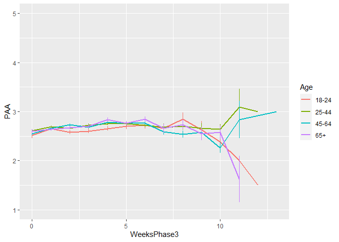<!-- -->

**Mean NAD against max stringency in DAYS** Phase 2

``` r
plot_PAA2 <- ggplot(data_analyse2_p2, aes(x=DaysMax_p2, y=PAA, group = Age_new, color = Age_new))

plot_PAA2 + stat_summary(fun.y=mean, geom="line", size=1)  + geom_errorbar(stat="summary", fun.data="mean_se", width=0) + scale_colour_discrete(name = "Age", labels = c("18-24", "25-44", "45-64", "65+")) + expand_limits(y=c(1, 5))
```

<!-- -->

Phase 3

``` r
plot_PAA3 <- ggplot(data_analyse2_p3, aes(x=DaysPhase3, y=PAA, group = Age_new, color = Age_new))

plot_PAA3 + stat_summary(fun.y=mean, geom="line", size=1)  + geom_errorbar(stat="summary", fun.data="mean_se", width=0) + scale_colour_discrete(name = "Age", labels = c("18-24", "25-44", "45-64", "65+")) + expand_limits(y=c(1, 5))
```

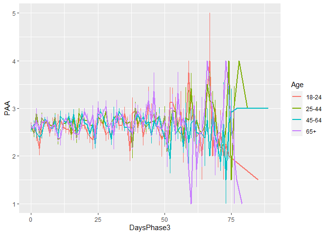<!-- -->

# Phase 1

*Random: IC for ID and Country + Covariates Gender and Education*

> Gender: Male = 0, Female = 1

> Edu: 0= Primary education, 1= General secondary education, 2=
> Vocational education, 3= Higher education, 4= Bachelors degree, 5=
> Masters degree, 6= PhD degree

``` r
data_analyse2_p1$Edu <- as.numeric(data_analyse2_p1$Edu)
model_PAAp1 <- lme(fixed = PAA ~ Gender + Edu + Age_new,
                  random = ~1 | Country/ID, 
                  data = data_analyse2_p1, 
                  na.action = na.omit)

summary(model_PAAp1)
```

    Linear mixed-effects model fit by REML
     Data: data_analyse2_p1 
           AIC      BIC   logLik
      10429.86 10486.84 -5205.93
    
    Random effects:
     Formula: ~1 | Country
            (Intercept)
    StdDev:    0.295595
    
     Formula: ~1 | ID %in% Country
            (Intercept) Residual
    StdDev:   0.6746427 0.599408
    
    Fixed effects: PAA ~ Gender + Edu + Age_new 
                     Value  Std.Error   DF   t-value p-value
    (Intercept)  2.3459532 0.10182074 2716 23.040032  0.0000
    Gender1     -0.1514770 0.03590306 2716 -4.219056  0.0000
    Edu          0.0361888 0.01305566 2716  2.771885  0.0056
    Age_new1     0.0047264 0.05010324 2716  0.094333  0.9249
    Age_new2     0.0858494 0.05314909 2716  1.615256  0.1064
    Age_new3     0.1350255 0.07520992 2716  1.795314  0.0727
     Correlation: 
             (Intr) Gendr1 Edu    Ag_nw1 Ag_nw2
    Gender1  -0.267                            
    Edu      -0.529 -0.044                     
    Age_new1 -0.231  0.078 -0.246              
    Age_new2 -0.272  0.129 -0.162  0.714       
    Age_new3 -0.231  0.184 -0.098  0.495  0.500
    
    Standardized Within-Group Residuals:
            Min          Q1         Med          Q3         Max 
    -2.76027026 -0.54379117 -0.05024933  0.49826695  2.93638093 
    
    Number of Observations: 4155
    Number of Groups: 
            Country ID %in% Country 
                 26            2747 

``` r
VarCorr(model_PAAp1)
```

``` 
            Variance     StdDev   
Country =   pdLogChol(1)          
(Intercept) 0.08737641   0.2955950
ID =        pdLogChol(1)          
(Intercept) 0.45514279   0.6746427
Residual    0.35928995   0.5994080
```

*Confidence intervals*

``` r
intervals(model_PAAp1)
```

    Approximate 95% confidence intervals
    
     Fixed effects:
                      lower         est.       upper
    (Intercept)  2.14629927  2.345953237  2.54560720
    Gender1     -0.22187709 -0.151477010 -0.08107693
    Edu          0.01058875  0.036188780  0.06178881
    Age_new1    -0.09351797  0.004726367  0.10297070
    Age_new2    -0.01836733  0.085849418  0.19006617
    Age_new3    -0.01244901  0.135025455  0.28249992
    attr(,"label")
    [1] "Fixed effects:"
    
     Random Effects:
      Level: Country 
                        lower     est.     upper
    sd((Intercept)) 0.2006776 0.295595 0.4354068
      Level: ID 
                        lower      est.     upper
    sd((Intercept)) 0.6444722 0.6746427 0.7062256
    
     Within-group standard error:
        lower      est.     upper 
    0.5783606 0.5994080 0.6212213 

*Plot of predicted values*

``` r
ef_PAAp1 <- effect("Age_new", model_PAAp1)

plot_PAAp1 <- ggplot(as.data.frame(ef_PAAp1), 
  aes(Age_new, fit, color=Age_new)) + geom_line() + 
  geom_errorbar(aes(ymin=fit-se, ymax=fit+se), width=1) + theme_minimal(base_size=10) + 
  labs(title="PAA during tightening of restrictions", y = "PAA") +
  theme(plot.title = element_text(hjust = 0.5)) +
  scale_x_discrete(name ="Age", labels=c("18-24", "25-44", "45-64", "65+")) +
  theme(legend.position = "none") +                 
  scale_color_discrete() + 
  expand_limits(y=c(1, 5))
```

``` r
plot_PAAp1
```

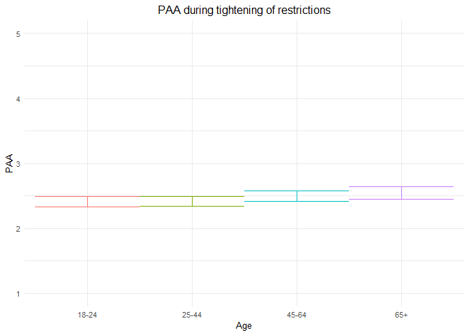<!-- -->

*Effect sizes*

``` r
ISDs <- data_analyse2_p1 %>% 
  group_by(ID) %>%
  summarize_at(c("PAA"), sd, na.rm=TRUE) %>%
  ungroup()

ISDs_av <- ISDs %>%
  summarize_at(c("PAA"), mean, na.rm=TRUE) %>%
  stack() %>%
  rename(sd=values) 
```

> Effect size = regression coefficient / average ISD of PAA

``` r
coef_PAAp1 = tidy(model_PAAp1, 
               effects = "fixed")

coef_PAAp1 <- coef_PAAp1 %>%
  mutate (e_size = estimate/0.467823) %>% 
  mutate(across(2:7, round, 2)) 
```

``` r
coef_PAAp1
```

    ## # A tibble: 6 x 7
    ##   term        estimate std.error    df statistic p.value e_size
    ##   <chr>          <dbl>     <dbl> <dbl>     <dbl>   <dbl>  <dbl>
    ## 1 (Intercept)     2.35      0.1   2716     23.0     0     5.01 
    ## 2 Gender1        -0.15      0.04  2716     -4.22    0    -0.32 
    ## 3 Edu             0.04      0.01  2716      2.77    0.01  0.08 
    ## 4 Age_new1        0         0.05  2716      0.09    0.92  0.01 
    ## 5 Age_new2        0.09      0.05  2716      1.62    0.11  0.18 
    ## 6 Age_new3        0.14      0.08  2716      1.8     0.07  0.290

``` r
coef_PAAp1 <- as.matrix(coef_PAAp1)
```

# Phase 2

*Best model*

> Random intercept for ID and Country, random slope for ID, no
> correlation between IC and S for ID + AR correlation structure at
> Measurement level

``` r
data_analyse2_p2$Edu <- as.numeric(data_analyse2_p2$Edu)
data_analyse2_p2 <- data_analyse2_p2[with(data_analyse2_p2, order(Country, ID, Time)),]
data_analyse2_p2$Time <- as.numeric(data_analyse2_p2$Time)

model_PAAp2 <- lme(fixed = PAA ~ Gender + Edu + DaysMax_p2 + Age_new + DaysMax_p2*Age_new,
                  random = list(Country = ~1, ID = pdDiag(~DaysMax_p2)),
                  data = data_analyse2_p2, 
                  na.action = na.omit,
                  correlation = corAR1(form = ~Time | Country/ID))

summary(model_PAAp2)
```

    Linear mixed-effects model fit by REML
     Data: data_analyse2_p2 
           AIC     BIC    logLik
      66730.89 66855.3 -33350.44
    
    Random effects:
     Formula: ~1 | Country
            (Intercept)
    StdDev:    0.232888
    
     Formula: ~DaysMax_p2 | ID %in% Country
     Structure: Diagonal
            (Intercept)  DaysMax_p2  Residual
    StdDev:   0.6794933 0.006248452 0.5914318
    
    Correlation Structure: ARMA(1,0)
     Formula: ~Time | Country/ID 
     Parameter estimate(s):
         Phi1 
    0.2117005 
    Fixed effects: PAA ~ Gender + Edu + DaysMax_p2 + Age_new + DaysMax_p2 * Age_new 
                             Value  Std.Error    DF  t-value p-value
    (Intercept)          2.3250713 0.05906443 20356 39.36500  0.0000
    Gender1             -0.1661814 0.01842780  9176 -9.01797  0.0000
    Edu                  0.0523418 0.00604241  9176  8.66242  0.0000
    DaysMax_p2           0.0063733 0.00091540 20356  6.96233  0.0000
    Age_new1            -0.0074683 0.03499656  9176 -0.21340  0.8310
    Age_new2             0.0714957 0.03583960  9176  1.99488  0.0461
    Age_new3             0.0844832 0.04341688  9176  1.94586  0.0517
    DaysMax_p2:Age_new1 -0.0023581 0.00101406 20356 -2.32544  0.0201
    DaysMax_p2:Age_new2 -0.0034175 0.00102591 20356 -3.33119  0.0009
    DaysMax_p2:Age_new3 -0.0025627 0.00116934 20356 -2.19158  0.0284
     Correlation: 
                        (Intr) Gendr1 Edu    DysM_2 Ag_nw1 Ag_nw2 Ag_nw3 DM_2:A_1 DM_2:A_2
    Gender1             -0.233                                                            
    Edu                 -0.382 -0.031                                                     
    DaysMax_p2          -0.268  0.001 -0.020                                              
    Age_new1            -0.331  0.046 -0.219  0.499                                       
    Age_new2            -0.363  0.078 -0.136  0.490  0.748                                
    Age_new3            -0.328  0.144 -0.094  0.405  0.619  0.622                         
    DaysMax_p2:Age_new1  0.245 -0.001  0.021 -0.897 -0.564 -0.434 -0.358                  
    DaysMax_p2:Age_new2  0.239 -0.001  0.026 -0.889 -0.442 -0.579 -0.358  0.800           
    DaysMax_p2:Age_new3  0.212 -0.008  0.019 -0.780 -0.388 -0.382 -0.597  0.702    0.696  
    
    Standardized Within-Group Residuals:
            Min          Q1         Med          Q3         Max 
    -3.86069496 -0.55515490 -0.01975441  0.54884316  4.47731572 
    
    Number of Observations: 29574
    Number of Groups: 
            Country ID %in% Country 
                 33            9214 

``` r
VarCorr(model_PAAp2)
```

``` 
            Variance           StdDev     
Country =   pdLogChol(1)                  
(Intercept) 5.423682e-02       0.232887999
ID =        pdDiag(DaysMax_p2)            
(Intercept) 4.617112e-01       0.679493346
DaysMax_p2  3.904315e-05       0.006248452
Residual    3.497916e-01       0.591431781
```

*Confidence intervals*

``` r
intervals(model_PAAp2, which = 'fixed')
```

    Approximate 95% confidence intervals
    
     Fixed effects:
                                lower         est.         upper
    (Intercept)          2.2093002217  2.325071264  2.4408423056
    Gender1             -0.2023040203 -0.166181431 -0.1300588408
    Edu                  0.0404973642  0.052341823  0.0641862817
    DaysMax_p2           0.0045790697  0.006373330  0.0081675911
    Age_new1            -0.0760693122 -0.007468264  0.0611327850
    Age_new2             0.0012420830  0.071495684  0.1417492857
    Age_new3            -0.0006235802  0.084483173  0.1695899264
    DaysMax_p2:Age_new1 -0.0043457905 -0.002358145 -0.0003704997
    DaysMax_p2:Age_new2 -0.0054283952 -0.003417519 -0.0014066435
    DaysMax_p2:Age_new3 -0.0048547121 -0.002562705 -0.0002706987
    attr(,"label")
    [1] "Fixed effects:"

*Plot of predicted values*

``` r
ef_PAAp2 <- effect("DaysMax_p2:Age_new", model_PAAp2)

plot_PAAp2 <- ggplot(as.data.frame(ef_PAAp2), aes(DaysMax_p2, fit, color=Age_new)) + 
  geom_line(size=1) + 
  geom_errorbar(aes(ymin=fit-se, ymax=fit+se), width=1) + 
  theme_minimal(base_size=10) + 
  labs(title="A",
       x="Days", y = "PAA") +
  theme(plot.title = element_text(size=10)) +
  scale_color_discrete(name="Age", labels = c("18-24", "25-44", "45-64", "65+")) + 
  expand_limits(y=c(1, 5))
```

``` r
plot_PAAp2
```

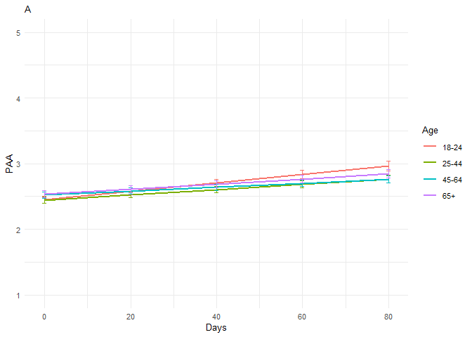<!-- -->

*Effect sizes* **Within person SD and average within person SD**

``` r
ISDs <- data_analyse2_p2 %>% 
  group_by(ID) %>%
  summarize_at(c("DaysMax_p2", "PAA"), sd, na.rm=TRUE) %>%
  ungroup()

ISDs_av <- ISDs %>%
  summarize_at(c("DaysMax_p2", "PAA"), mean, na.rm=TRUE) %>%
  stack() %>%
  rename(sd=values) 
```

> Effect sizes for intercept and main effect of age and covariates =
> regression coefficient / average ISD of PAA Effect size for main
> effect of DaysMax = (regression coefficient \* 28)/ average ISD of PAA
> Effect sizes for interaction effects = (regression coefficient \* 28)/
> average ISD of PAA

> The effect sizes for main effect of DaysMax and the interaction
> effects reflect the increase in SD of PAA over 4 weeks (28 days)

``` r
coef_PAAp2 = tidy(model_PAAp2, 
               effects = "fixed")

coef_PAAp2 <- coef_PAAp2 %>%
  mutate(e_size = ifelse(row_number()== 1 | row_number()== 2 |  row_number()== 3 |  row_number()== 5 |  row_number()== 6 |  row_number()== 7,  estimate/0.4890815, (estimate*28)/0.4890815)) %>%
  mutate(across(2:7, round, 2)) 
```

``` r
coef_PAAp2
```

    ## # A tibble: 10 x 7
    ##    term                estimate std.error    df statistic p.value e_size
    ##    <chr>                  <dbl>     <dbl> <dbl>     <dbl>   <dbl>  <dbl>
    ##  1 (Intercept)             2.33      0.06 20356     39.4     0      4.75
    ##  2 Gender1                -0.17      0.02  9176     -9.02    0     -0.34
    ##  3 Edu                     0.05      0.01  9176      8.66    0      0.11
    ##  4 DaysMax_p2              0.01      0    20356      6.96    0      0.36
    ##  5 Age_new1               -0.01      0.03  9176     -0.21    0.83  -0.02
    ##  6 Age_new2                0.07      0.04  9176      1.99    0.05   0.15
    ##  7 Age_new3                0.08      0.04  9176      1.95    0.05   0.17
    ##  8 DaysMax_p2:Age_new1     0         0    20356     -2.33    0.02  -0.14
    ##  9 DaysMax_p2:Age_new2     0         0    20356     -3.33    0     -0.2 
    ## 10 DaysMax_p2:Age_new3     0         0    20356     -2.19    0.03  -0.15

``` r
coef_PAAp2 <- as.matrix(coef_PAAp2)
```

> PAA increases over time in the youngest age group (main effect), and
> also increases in the older groups but more slowly (interaction
> effect). There are no significant differences in PAA between age
> groups on the first day of max stringency (main effect). Women report
> lower PAA compared to men, and higher educated people report higher
> PAA compared to lower educated people.

``` r
model_coefs <- coef(model_PAAp2, level = 2)
  
model_coefs <- as.data.frame(model_coefs) %>%
rownames_to_column("ID")
  
model_coefs <- model_coefs %>%
separate(col = 1, into = c("Country", "ID"), sep = "\\/") %>%
dplyr::rename("Intercept" = "(Intercept)")
  
data2 <- left_join(data_analyse2_p2, model_coefs, by= "ID")
  
data3 <- data2 %>%
filter(Nmiss == 0) %>%
  filter(n > 5)
```

``` r
labels <- c("0" = "Age 18-24", "1" = "Age 25-44", "2" = "Age 45-64", "3" = "Age 65+")

model_coef_plot <- ggplot(data = data3[which(data3$ID2 <200),], 
       mapping = aes(x = DaysMax_p2.x, y = PAA, colour = ID)) +
       geom_point() +
       geom_abline(aes(intercept = Intercept, 
                  slope = DaysMax_p2.y,
                  colour = ID),size = 0.5) + 
                  scale_x_continuous(limits = c(0, 100)) + 
                  theme(legend.position = "none") +
                  facet_wrap(~Age_new, 
                  labeller = labeller(Age_new = labels)) +
      xlab("Days") +
      ggtitle("Predicted PAA trajectories for subsample of participants") +
      theme_minimal(base_size=10) + 
      scale_color_discrete() + 
      theme(plot.title = element_text(hjust = 0.5)) +
      theme(legend.position = "none") 

model_coef_plot
```

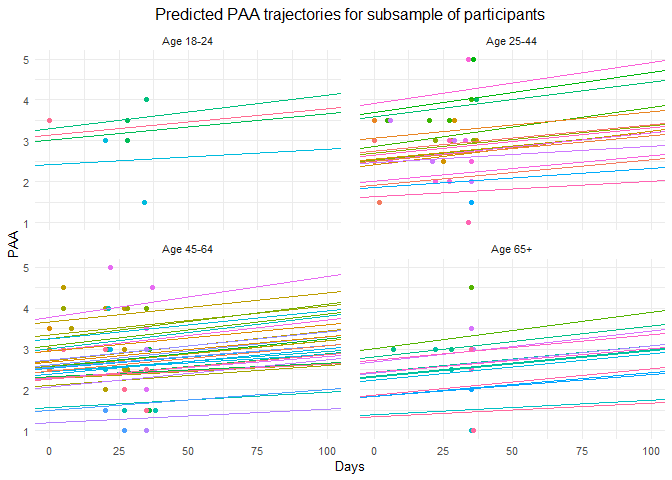<!-- -->

# Random slope variation plot

``` r
Age_labels <- c("Age 18-24", "Age 25-44", "Age 45-64", "Age 65+")
names(Age_labels) <- c("0","1","2","3")

plot_PAAp2_slope <- ggplot(data2, aes(x= DaysMax_p2.y, fill = ..x..)) +
  geom_histogram() +
 scale_fill_viridis(option = "C")+
  theme_minimal(base_size=10)+
  theme(legend.position="none") + 
  geom_vline(xintercept = 0, linetype="dashed", 
                color = "grey", size=.5) + 
  labs(title="A",
       x="Regression coefficient (PAA ~ days)", y = "Count") +
  theme(plot.title = element_text(size=10)) +
   facet_wrap(~ Age_new, labeller = labeller(Age_new = Age_labels)) 
```

``` r
plot_PAAp2_slope 
```

    ## `stat_bin()` using `bins = 30`. Pick better value with `binwidth`.

    ## Warning: Removed 2 rows containing non-finite values (stat_bin).

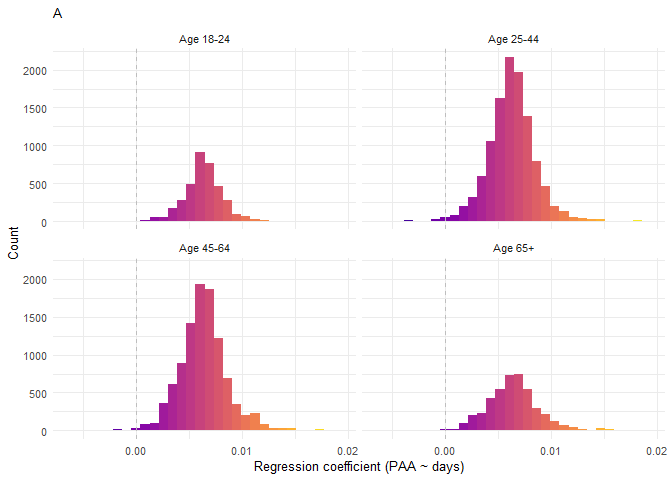<!-- -->

Distribution

``` r
data2<- as_tibble(data2)
data2 %>%
  filter(DaysMax_p2.y > 0) %>%
  summarise(N = n())
```

    ## # A tibble: 1 x 1
    ##       N
    ##   <int>
    ## 1 29416

``` r
#29416

data2 %>%
  filter(DaysMax_p2.y < 0) %>%
  summarise(N = n())
```

    ## # A tibble: 1 x 1
    ##       N
    ##   <int>
    ## 1   170

``` r
#170

#Decrease in PAA:

170 / (170 + 29416) * 100
```

    ## [1] 0.5745961

``` r
#0.57%
```

# Quadratic term

The interaction between age and daysmax was significant so these are
kept in the current model. The time variable needs to be centered at the
midpoint (mean) to reduce collinearity between the linear and the
quadratic components.

``` r
data_analyse2_p2q <- gmc(data_analyse2_p2, "DaysMax_p2", "ID", FUN = mean, suffix = c("_mn", "_dev"),
    fulldataframe = TRUE)
```

``` r
data_analyse2_p2q$Edu <- as.numeric(data_analyse2_p2q$Edu)

data_analyse2_p2q <- data_analyse2_p2q[with(data_analyse2_p2q, order(Country, ID, Time)),]
data_analyse2_p2q$Time <- as.numeric(data_analyse2_p2q$Time)

model_PAAp2q <- lme(fixed = PAA ~ Gender + Edu + DaysMax_p2_dev + Age_new + DaysMax_p2_dev*Age_new +  
                    + I(DaysMax_p2_dev^2) + I(DaysMax_p2_dev^2)*Age_new,
                  random = list(Country = pdDiag(~ DaysMax_p2_dev), 
                  ID = ~DaysMax_p2_dev),
                  data = data_analyse2_p2q, 
                  na.action = na.omit,
                  correlation = corAR1(form = ~ Time | Country/ID))

summary(model_PAAp2q)
```

    Linear mixed-effects model fit by REML
     Data: data_analyse2_p2q 
           AIC      BIC    logLik
      66808.28 66982.46 -33383.14
    
    Random effects:
     Formula: ~DaysMax_p2_dev | Country
     Structure: Diagonal
            (Intercept) DaysMax_p2_dev
    StdDev:   0.2249828    0.001349374
    
     Formula: ~DaysMax_p2_dev | ID %in% Country
     Structure: General positive-definite, Log-Cholesky parametrization
                   StdDev      Corr  
    (Intercept)    0.704334011 (Intr)
    DaysMax_p2_dev 0.007496865 0.203 
    Residual       0.585548493       
    
    Correlation Structure: ARMA(1,0)
     Formula: ~Time | Country/ID 
     Parameter estimate(s):
         Phi1 
    0.1965449 
    Fixed effects: PAA ~ Gender + Edu + DaysMax_p2_dev + Age_new + DaysMax_p2_dev *      Age_new + +I(DaysMax_p2_dev^2) + I(DaysMax_p2_dev^2) * Age_new 
                                      Value  Std.Error    DF  t-value p-value
    (Intercept)                   2.4275605 0.05620751 20352 43.18926  0.0000
    Gender1                      -0.1622458 0.01843852  9176 -8.79929  0.0000
    Edu                           0.0527272 0.00603820  9176  8.73227  0.0000
    DaysMax_p2_dev                0.0071853 0.00105861 20352  6.78745  0.0000
    Age_new1                     -0.0487228 0.02983341  9176 -1.63316  0.1025
    Age_new2                      0.0174215 0.03004480  9176  0.57985  0.5620
    Age_new3                      0.0638707 0.03549448  9176  1.79945  0.0720
    I(DaysMax_p2_dev^2)           0.0000386 0.00005359 20352  0.72089  0.4710
    DaysMax_p2_dev:Age_new1      -0.0025455 0.00110373 20352 -2.30631  0.0211
    DaysMax_p2_dev:Age_new2      -0.0033831 0.00111966 20352 -3.02149  0.0025
    DaysMax_p2_dev:Age_new3      -0.0030040 0.00128086 20352 -2.34528  0.0190
    Age_new1:I(DaysMax_p2_dev^2) -0.0000637 0.00005773 20352 -1.10344  0.2698
    Age_new2:I(DaysMax_p2_dev^2) -0.0000859 0.00005798 20352 -1.48112  0.1386
    Age_new3:I(DaysMax_p2_dev^2) -0.0000800 0.00006464 20352 -1.23732  0.2160
     Correlation: 
                                 (Intr) Gendr1 Edu    DyM_2_ Ag_nw1 Ag_nw2 Ag_nw3 I(DM_2 DM_2_:A_1 DM_2_:A_2 DM_2_:A_3 A_1:I( A_2:I(
    Gender1                      -0.246                                                                                             
    Edu                          -0.406 -0.031                                                                                      
    DaysMax_p2_dev                0.016 -0.001  0.002                                                                               
    Age_new1                     -0.266  0.054 -0.243 -0.032                                                                        
    Age_new2                     -0.315  0.093 -0.143 -0.032  0.759                                                                 
    Age_new3                     -0.301  0.171 -0.103 -0.028  0.646  0.664                                                          
    I(DaysMax_p2_dev^2)          -0.091  0.003 -0.012  0.041  0.200  0.198  0.168                                                   
    DaysMax_p2_dev:Age_new1      -0.016  0.000 -0.001 -0.790  0.043  0.033  0.028 -0.033                                            
    DaysMax_p2_dev:Age_new2      -0.016  0.001 -0.001 -0.777  0.032  0.043  0.028 -0.033  0.807                                     
    DaysMax_p2_dev:Age_new3      -0.014  0.002  0.000 -0.686  0.029  0.029  0.039 -0.029  0.704     0.698                           
    Age_new1:I(DaysMax_p2_dev^2)  0.088 -0.005  0.007 -0.037 -0.219 -0.178 -0.151 -0.925  0.038     0.031     0.028                 
    Age_new2:I(DaysMax_p2_dev^2)  0.088 -0.006  0.006 -0.037 -0.178 -0.219 -0.153 -0.921  0.031     0.041     0.027     0.855       
    Age_new3:I(DaysMax_p2_dev^2)  0.082 -0.013  0.003 -0.034 -0.160 -0.162 -0.216 -0.827  0.028     0.027     0.066     0.767  0.764
    
    Standardized Within-Group Residuals:
            Min          Q1         Med          Q3         Max 
    -3.90003899 -0.55220053 -0.02122416  0.54256945  4.51296276 
    
    Number of Observations: 29574
    Number of Groups: 
            Country ID %in% Country 
                 33            9214 

``` r
VarCorr(model_PAAp2q)
```

``` 
               Variance                  StdDev      Corr  
Country =      pdDiag(DaysMax_p2_dev)                      
(Intercept)    5.061725e-02              0.224982777       
DaysMax_p2_dev 1.820811e-06              0.001349374       
ID =           pdLogChol(DaysMax_p2_dev)                   
(Intercept)    4.960864e-01              0.704334011 (Intr)
DaysMax_p2_dev 5.620299e-05              0.007496865 0.203 
Residual       3.428670e-01              0.585548493       
```

Results suggest that there is a linear increase of PAA over time in the
youngest age group and a slower increase in the older age groups. There
was no significant quadratic effect.

*Confidence intervals*

``` r
intervals(model_PAAp2q, which = 'fixed')
```

    Approximate 95% confidence intervals
    
     Fixed effects:
                                         lower          est.         upper
    (Intercept)                   2.317389e+00  2.427560e+00  2.537732e+00
    Gender1                      -1.983894e-01 -1.622458e-01 -1.261022e-01
    Edu                           4.089101e-02  5.272723e-02  6.456344e-02
    DaysMax_p2_dev                5.110297e-03  7.185257e-03  9.260216e-03
    Age_new1                     -1.072029e-01 -4.872282e-02  9.757297e-03
    Age_new2                     -4.147300e-02  1.742149e-02  7.631599e-02
    Age_new3                     -5.706378e-03  6.387070e-02  1.334478e-01
    I(DaysMax_p2_dev^2)          -6.640255e-05  3.862888e-05  1.436603e-04
    DaysMax_p2_dev:Age_new1      -4.708926e-03 -2.545533e-03 -3.821403e-04
    DaysMax_p2_dev:Age_new2      -5.577687e-03 -3.383054e-03 -1.188420e-03
    DaysMax_p2_dev:Age_new3      -5.514556e-03 -3.003973e-03 -4.933899e-04
    Age_new1:I(DaysMax_p2_dev^2) -1.768481e-04 -6.369854e-05  4.945101e-05
    Age_new2:I(DaysMax_p2_dev^2) -1.995115e-04 -8.587130e-05  2.776886e-05
    Age_new3:I(DaysMax_p2_dev^2) -2.066941e-04 -7.998591e-05  4.672223e-05
    attr(,"label")
    [1] "Fixed effects:"

*Plot of predicted values*

``` r
ef_PAAp2q <- effect("Age_new:I(DaysMax_p2_dev^2)", model_PAAp2q)

plot_PAAp2q <- ggplot(as.data.frame(ef_PAAp2q), aes(DaysMax_p2_dev, fit, color=Age_new)) + 
  geom_line(size=1) + 
  geom_errorbar(aes(ymin=fit-se, ymax=fit+se), width=1) + 
  theme_minimal(base_size=10) + 
  labs(title="Quadratic PAA trajectories during peak restrictions",
       x="Days  (centered)", y = "PAA") +
  theme(plot.title = element_text(hjust = 0.5)) +
  scale_color_discrete(name="Age", labels = c("18-24", "25-44", "45-64", "65+")) + 
  expand_limits(y=c(1, 5))
```

``` r
plot_PAAp2q
```

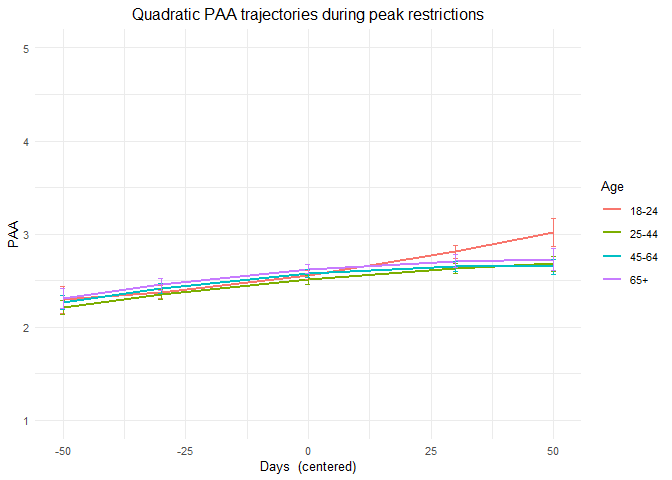<!-- -->

# Phase 3

> Random: IC for ID and Country, S for ID, no correlation between IC and
> S for ID + AR

``` r
data_analyse2_p3$Edu <- as.numeric(data_analyse2_p3$Edu)
data_analyse2_p3 <- data_analyse2_p3[with(data_analyse2_p3, order(Country, ID, Time)),]
data_analyse2_p3$Time <- as.numeric(data_analyse2_p3$Time)

model_PAAp3 <- lme(fixed = PAA ~ Gender + Edu + DaysPhase3 + Age_new + DaysPhase3*Age_new,
                  random = list (Country = ~1, ID = pdDiag(~DaysPhase3)), 
                  data = data_analyse2_p3, 
                  na.action = na.omit,
                  correlation = corAR1(form = ~ Time | Country/ID))

summary(model_PAAp3)
```

    Linear mixed-effects model fit by REML
     Data: data_analyse2_p3 
           AIC      BIC    logLik
      56019.93 56141.81 -27994.96
    
    Random effects:
     Formula: ~1 | Country
            (Intercept)
    StdDev:   0.2454655
    
     Formula: ~DaysPhase3 | ID %in% Country
     Structure: Diagonal
            (Intercept)  DaysPhase3  Residual
    StdDev:   0.7196011 0.007097285 0.5893701
    
    Correlation Structure: ARMA(1,0)
     Formula: ~Time | Country/ID 
     Parameter estimate(s):
         Phi1 
    0.1843587 
    Fixed effects: PAA ~ Gender + Edu + DaysPhase3 + Age_new + DaysPhase3 * Age_new 
                             Value  Std.Error    DF  t-value p-value
    (Intercept)          2.4715202 0.06403765 17940 38.59480  0.0000
    Gender1             -0.1944837 0.02169653  7009 -8.96382  0.0000
    Edu                  0.0497711 0.00721860  7009  6.89485  0.0000
    DaysPhase3           0.0031243 0.00102713 17940  3.04177  0.0024
    Age_new1             0.0592759 0.04036482  7009  1.46850  0.1420
    Age_new2             0.0626986 0.03973920  7009  1.57775  0.1147
    Age_new3             0.0933563 0.04557566  7009  2.04838  0.0406
    DaysPhase3:Age_new1  0.0007450 0.00118728 17940  0.62752  0.5303
    DaysPhase3:Age_new2  0.0011311 0.00114864 17940  0.98470  0.3248
    DaysPhase3:Age_new3  0.0016793 0.00126830 17940  1.32407  0.1855
     Correlation: 
                        (Intr) Gendr1 Edu    DysPh3 Ag_nw1 Ag_nw2 Ag_nw3 DP3:A_1 DP3:A_2
    Gender1             -0.263                                                          
    Edu                 -0.424 -0.027                                                   
    DaysPhase3          -0.258 -0.003 -0.006                                            
    Age_new1            -0.343  0.051 -0.223  0.415                                     
    Age_new2            -0.411  0.106 -0.117  0.421  0.752                              
    Age_new3            -0.399  0.185 -0.077  0.367  0.659  0.702                       
    DaysPhase3:Age_new1  0.226  0.000  0.004 -0.863 -0.484 -0.366 -0.319                
    DaysPhase3:Age_new2  0.232  0.002  0.006 -0.893 -0.372 -0.480 -0.330  0.772         
    DaysPhase3:Age_new3  0.212  0.000  0.003 -0.809 -0.336 -0.342 -0.469  0.700   0.724 
    
    Standardized Within-Group Residuals:
             Min           Q1          Med           Q3          Max 
    -5.103111443 -0.530065403  0.009292636  0.535338594  4.443242739 
    
    Number of Observations: 24990
    Number of Groups: 
            Country ID %in% Country 
                 32            7046 

``` r
VarCorr(model_PAAp3)
```

``` 
            Variance           StdDev     
Country =   pdLogChol(1)                  
(Intercept) 6.025331e-02       0.245465491
ID =        pdDiag(DaysPhase3)            
(Intercept) 5.178257e-01       0.719601065
DaysPhase3  5.037145e-05       0.007097285
Residual    3.473572e-01       0.589370138
```

*Confidence intervals*

``` r
intervals(model_PAAp3, which = 'fixed')
```

    Approximate 95% confidence intervals
    
     Fixed effects:
                               lower          est.        upper
    (Intercept)          2.346000239  2.4715201906  2.597040142
    Gender1             -0.237015421 -0.1944836634 -0.151951905
    Edu                  0.035620495  0.0497711258  0.063921757
    DaysPhase3           0.001111021  0.0031242976  0.005137574
    Age_new1            -0.019851326  0.0592759295  0.138403185
    Age_new2            -0.015202251  0.0626986068  0.140599464
    Age_new3             0.004014183  0.0933562651  0.182698348
    DaysPhase3:Age_new1 -0.001582142  0.0007450438  0.003072230
    DaysPhase3:Age_new2 -0.001120385  0.0011310654  0.003382516
    DaysPhase3:Age_new3 -0.000806678  0.0016793196  0.004165317
    attr(,"label")
    [1] "Fixed effects:"

*Plot of predicted values*

``` r
ef_PAAp3 <- effect("DaysPhase3:Age_new", model_PAAp3)

plot_PAAp3 <- ggplot(as.data.frame(ef_PAAp3), aes(DaysPhase3, fit, color=Age_new)) + 
  geom_line(size=1) + 
  geom_errorbar(aes(ymin=fit-se, ymax=fit+se), width=1) + 
  theme_minimal(base_size=10) + 
  labs(title="B",
       x="Days", y = "PAA") +
  theme(plot.title = element_text(size=10)) +
  scale_color_discrete(name="Age", labels = c("18-24", "25-44", "45-64", "65+")) + 
  expand_limits(y=c(1, 5))
```

``` r
plot_PAAp3
```

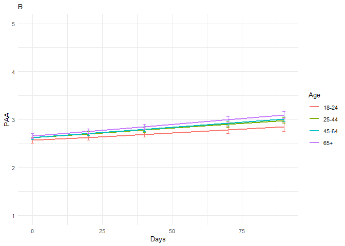<!-- -->

``` r
plot_PAAp2and3 <- ggarrange(plot_PAAp2, plot_PAAp3 , 
          ncol = 2, nrow = 1, common.legend=TRUE, legend= "bottom")

plot_PAAp2and3 <- annotate_figure(plot_PAAp2and3,top = text_grob("PAA trajectories during peak (A) and easing (B) of restrictions", size = 12))
```

``` r
plot_PAAp2and3
```

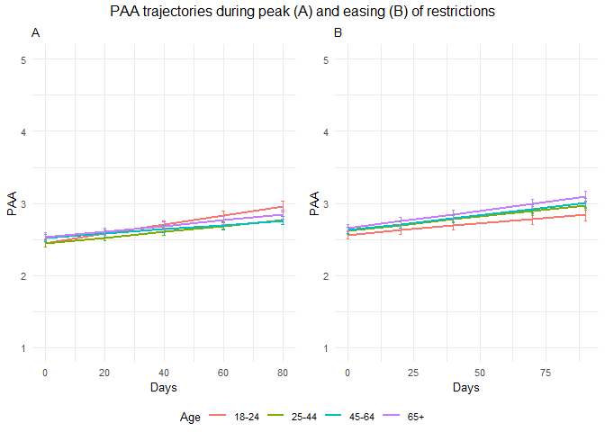<!-- -->

*Effect sizes* **Within person SD and average within person SD for PAA**

``` r
ISDs <- data_analyse2_p3 %>% 
  group_by(ID) %>%
  summarize_at(c("PAA"), sd, na.rm=TRUE) %>%
  ungroup()

ISDs_av <- ISDs %>%
  summarize_at(c("PAA"), mean, na.rm=TRUE) %>%
  stack() %>%
  rename(sd=values) 
```

> Effect sizes for intercept and main effect of age = regression
> coefficient / average ISD of PAA Effect size for main effect of
> DaysMax = (regression coefficient \* 28)/ average ISD of PAA Effect
> sizes for interaction effects = (regression coefficient \* 28)/
> average ISD of PAA

> The effect sizes for main effect of DaysMax and the interaction
> effects reflect the increase in SD of PAA over 4 weeks (28 days)

``` r
coef_PAAp3 = tidy(model_PAAp3, 
               effects = "fixed")

coef_PAAp3 <- coef_PAAp3 %>%
 mutate(e_size = ifelse(row_number()== 1 | row_number()== 2 |  row_number()== 3 |  row_number()== 5 |  row_number()== 6 |  row_number()== 7,  estimate/0.4894064, (estimate*28)/0.4894064)) %>%
  mutate(across(2:7, round, 2)) 
```

``` r
coef_PAAp3
```

    ## # A tibble: 10 x 7
    ##    term                estimate std.error    df statistic p.value e_size
    ##    <chr>                  <dbl>     <dbl> <dbl>     <dbl>   <dbl>  <dbl>
    ##  1 (Intercept)             2.47      0.06 17940     38.6     0      5.05
    ##  2 Gender1                -0.19      0.02  7009     -8.96    0     -0.4 
    ##  3 Edu                     0.05      0.01  7009      6.89    0      0.1 
    ##  4 DaysPhase3              0         0    17940      3.04    0      0.18
    ##  5 Age_new1                0.06      0.04  7009      1.47    0.14   0.12
    ##  6 Age_new2                0.06      0.04  7009      1.58    0.11   0.13
    ##  7 Age_new3                0.09      0.05  7009      2.05    0.04   0.19
    ##  8 DaysPhase3:Age_new1     0         0    17940      0.63    0.53   0.04
    ##  9 DaysPhase3:Age_new2     0         0    17940      0.98    0.32   0.06
    ## 10 DaysPhase3:Age_new3     0         0    17940      1.32    0.19   0.1

``` r
coef_PAAp3 <- as.matrix(coef_PAAp3)
```

> PAA increases over time in the youngest group (main effect) and older
> groups with the same degree (interaction effect). There are no age
> differences in PAA on the first day stringency reduces again after the
> peak (main effect). Women report lower PAA, two higher educated groups
> report higher PAA.

``` r
model_coefs <- coef(model_PAAp3, level = 2)
  
model_coefs <- as.data.frame(model_coefs) %>%
rownames_to_column("ID")
  
model_coefs <- model_coefs %>%
separate(col = 1, into = c("Country", "ID"), sep = "\\/") %>%
dplyr::rename("Intercept" = "(Intercept)")
  
data2 <- left_join(data_analyse2_p3, model_coefs, by= "ID")
  
data3 <- data2 %>%
filter(Nmiss == 0) %>%
  filter(n > 5)
```

``` r
labels <- c("0" = "Age 18-24", "1" = "Age 25-44", "2" = "Age 45-64", "3" = "Age 65+")

model_coef_plot <- ggplot(data = data3[which(data3$ID2 <200),], 
       mapping = aes(x = DaysPhase3.x, y = PAA, colour = ID)) +
  geom_point() +
  geom_abline(aes(intercept = Intercept, 
                  slope = DaysPhase3.y,
                  colour = ID),size = 0.5) + 
                  scale_x_continuous(limits = c(0, 100)) + 
                  theme(legend.position = "none") +
                  facet_wrap(~Age_new, 
                  labeller = labeller(Age_new = labels)) +
  xlab("Days") +
  ggtitle("Predicted PAA trajectories for subsample of participants")  +
      theme_minimal(base_size=10) + 
      scale_color_discrete() + 
      theme(plot.title = element_text(hjust = 0.5)) +
      theme(legend.position = "none") 

model_coef_plot
```

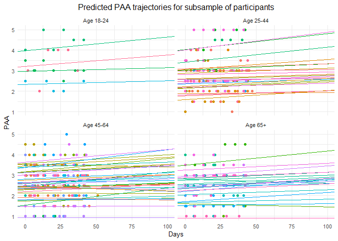<!-- -->

# Random slope variation plot

``` r
plot_PAAp3_slope <- ggplot(data2, aes(x= DaysPhase3.y, fill = ..x..)) +
  geom_histogram() +
 scale_fill_viridis(option = "C") +
  theme_minimal(base_size=10)+
  theme(legend.position="none") + 
  geom_vline(xintercept = 0, linetype="dashed", 
                color = "grey", size=.5) + 
  labs(title="B",
       x="Regression coefficient (PAA ~ days)", y = "Count") +
  theme(plot.title = element_text(size=10)) +
   facet_wrap(~ Age_new, labeller = labeller(Age_new = Age_labels)) 
```

``` r
plot_PAAp3_slope 
```

    ## `stat_bin()` using `bins = 30`. Pick better value with `binwidth`.

    ## Warning: Removed 1 rows containing non-finite values (stat_bin).

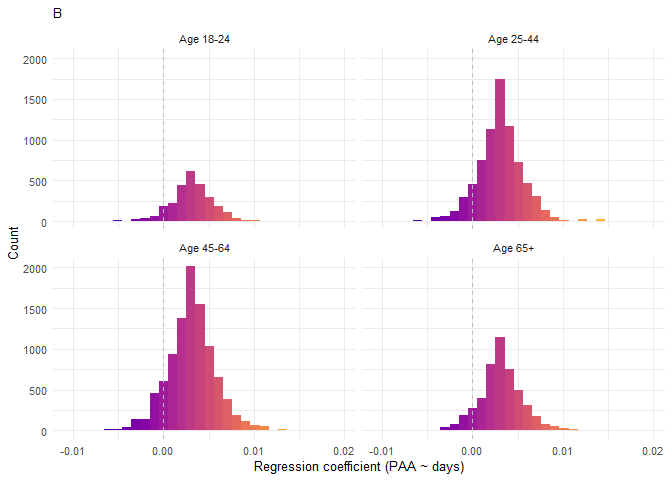<!-- -->

``` r
plot_PAAp2and3_slope <- ggarrange(plot_PAAp2_slope, plot_PAAp3_slope , 
          ncol = 2, nrow = 1)
```

    ## Warning: Removed 2 rows containing non-finite values (stat_bin).

    ## Warning: Removed 1 rows containing non-finite values (stat_bin).

``` r
plot_PAAp2and3_slope <- annotate_figure(plot_PAAp2and3_slope,top = text_grob("Variability in PAA trajectories during peak (A) and easing (B) of restrictions", size = 12))
```

``` r
plot_PAAp2and3_slope
```

<!-- -->

Distribution

``` r
data2<- as_tibble(data2)
data2 %>%
  filter(DaysPhase3.y > 0) %>%
  summarise(N = n())
```

    ## # A tibble: 1 x 1
    ##       N
    ##   <int>
    ## 1 22510

``` r
#22510

data2 %>%
  filter(DaysPhase3.y < 0) %>%
  summarise(N = n())
```

    ## # A tibble: 1 x 1
    ##       N
    ##   <int>
    ## 1  2500

``` r
#2500

#Decrease in PAA

2500 / (2500 + 22510) * 100
```

    ## [1] 9.996002

``` r
#10.00%
```

``` r
stargazer(coef_PAAp1, coef_PAAp2, coef_PAAp3,
type="html", df = TRUE, out="star_coefallphase_PAA.doc",  single.row=TRUE, digits = 2, align = TRUE)
```

    ## 
    ## <table style="text-align:center"><tr><td colspan="7" style="border-bottom: 1px solid black"></td></tr><tr><td>term</td><td>estimate</td><td>std.error</td><td>df</td><td>statistic</td><td>p.value</td><td>e_size</td></tr>
    ## <tr><td colspan="7" style="border-bottom: 1px solid black"></td></tr><tr><td>(Intercept)</td><td>2.35</td><td>0.10</td><td>2716</td><td>23.04</td><td>0.00</td><td>5.01</td></tr>
    ## <tr><td>Gender1</td><td>-0.15</td><td>0.04</td><td>2716</td><td>-4.22</td><td>0.00</td><td>-0.32</td></tr>
    ## <tr><td>Edu</td><td>0.04</td><td>0.01</td><td>2716</td><td>2.77</td><td>0.01</td><td>0.08</td></tr>
    ## <tr><td>Age_new1</td><td>0.00</td><td>0.05</td><td>2716</td><td>0.09</td><td>0.92</td><td>0.01</td></tr>
    ## <tr><td>Age_new2</td><td>0.09</td><td>0.05</td><td>2716</td><td>1.62</td><td>0.11</td><td>0.18</td></tr>
    ## <tr><td>Age_new3</td><td>0.14</td><td>0.08</td><td>2716</td><td>1.80</td><td>0.07</td><td>0.29</td></tr>
    ## <tr><td colspan="7" style="border-bottom: 1px solid black"></td></tr></table>
    ## 
    ## <table style="text-align:center"><tr><td colspan="7" style="border-bottom: 1px solid black"></td></tr><tr><td>term</td><td>estimate</td><td>std.error</td><td>df</td><td>statistic</td><td>p.value</td><td>e_size</td></tr>
    ## <tr><td colspan="7" style="border-bottom: 1px solid black"></td></tr><tr><td>(Intercept)</td><td>2.33</td><td>0.06</td><td>20356</td><td>39.36</td><td>0.00</td><td>4.75</td></tr>
    ## <tr><td>Gender1</td><td>-0.17</td><td>0.02</td><td>9176</td><td>-9.02</td><td>0.00</td><td>-0.34</td></tr>
    ## <tr><td>Edu</td><td>0.05</td><td>0.01</td><td>9176</td><td>8.66</td><td>0.00</td><td>0.11</td></tr>
    ## <tr><td>DaysMax_p2</td><td>0.01</td><td>0.00</td><td>20356</td><td>6.96</td><td>0.00</td><td>0.36</td></tr>
    ## <tr><td>Age_new1</td><td>-0.01</td><td>0.03</td><td>9176</td><td>-0.21</td><td>0.83</td><td>-0.02</td></tr>
    ## <tr><td>Age_new2</td><td>0.07</td><td>0.04</td><td>9176</td><td>1.99</td><td>0.05</td><td>0.15</td></tr>
    ## <tr><td>Age_new3</td><td>0.08</td><td>0.04</td><td>9176</td><td>1.95</td><td>0.05</td><td>0.17</td></tr>
    ## <tr><td>DaysMax_p2:Age_new1</td><td>0.00</td><td>0.00</td><td>20356</td><td>-2.33</td><td>0.02</td><td>-0.14</td></tr>
    ## <tr><td>DaysMax_p2:Age_new2</td><td>0.00</td><td>0.00</td><td>20356</td><td>-3.33</td><td>0.00</td><td>-0.20</td></tr>
    ## <tr><td>DaysMax_p2:Age_new3</td><td>0.00</td><td>0.00</td><td>20356</td><td>-2.19</td><td>0.03</td><td>-0.15</td></tr>
    ## <tr><td colspan="7" style="border-bottom: 1px solid black"></td></tr></table>
    ## 
    ## <table style="text-align:center"><tr><td colspan="7" style="border-bottom: 1px solid black"></td></tr><tr><td>term</td><td>estimate</td><td>std.error</td><td>df</td><td>statistic</td><td>p.value</td><td>e_size</td></tr>
    ## <tr><td colspan="7" style="border-bottom: 1px solid black"></td></tr><tr><td>(Intercept)</td><td>2.47</td><td>0.06</td><td>17940</td><td>38.59</td><td>0.00</td><td>5.05</td></tr>
    ## <tr><td>Gender1</td><td>-0.19</td><td>0.02</td><td>7009</td><td>-8.96</td><td>0.00</td><td>-0.40</td></tr>
    ## <tr><td>Edu</td><td>0.05</td><td>0.01</td><td>7009</td><td>6.89</td><td>0.00</td><td>0.10</td></tr>
    ## <tr><td>DaysPhase3</td><td>0.00</td><td>0.00</td><td>17940</td><td>3.04</td><td>0.00</td><td>0.18</td></tr>
    ## <tr><td>Age_new1</td><td>0.06</td><td>0.04</td><td>7009</td><td>1.47</td><td>0.14</td><td>0.12</td></tr>
    ## <tr><td>Age_new2</td><td>0.06</td><td>0.04</td><td>7009</td><td>1.58</td><td>0.11</td><td>0.13</td></tr>
    ## <tr><td>Age_new3</td><td>0.09</td><td>0.05</td><td>7009</td><td>2.05</td><td>0.04</td><td>0.19</td></tr>
    ## <tr><td>DaysPhase3:Age_new1</td><td>0.00</td><td>0.00</td><td>17940</td><td>0.63</td><td>0.53</td><td>0.04</td></tr>
    ## <tr><td>DaysPhase3:Age_new2</td><td>0.00</td><td>0.00</td><td>17940</td><td>0.98</td><td>0.32</td><td>0.06</td></tr>
    ## <tr><td>DaysPhase3:Age_new3</td><td>0.00</td><td>0.00</td><td>17940</td><td>1.32</td><td>0.19</td><td>0.10</td></tr>
    ## <tr><td colspan="7" style="border-bottom: 1px solid black"></td></tr></table>

``` r
stargazer(model_PAAp1, model_PAAp2, model_PAAp2q, model_PAAp3,
type="html", df = TRUE, out="starallphasesPAA.doc",  single.row=TRUE, digits = 2, align = TRUE,
intercept.top = TRUE, intercept.bottom = FALSE)
```

    ## 
    ## <table style="text-align:center"><tr><td colspan="5" style="border-bottom: 1px solid black"></td></tr><tr><td style="text-align:left"></td><td colspan="4"><em>Dependent variable:</em></td></tr>
    ## <tr><td></td><td colspan="4" style="border-bottom: 1px solid black"></td></tr>
    ## <tr><td style="text-align:left"></td><td colspan="4">PAA</td></tr>
    ## <tr><td style="text-align:left"></td><td>(1)</td><td>(2)</td><td>(3)</td><td>(4)</td></tr>
    ## <tr><td colspan="5" style="border-bottom: 1px solid black"></td></tr><tr><td style="text-align:left">Constant</td><td>2.35<sup>***</sup> (0.10)</td><td>2.33<sup>***</sup> (0.06)</td><td>2.43<sup>***</sup> (0.06)</td><td>2.47<sup>***</sup> (0.06)</td></tr>
    ## <tr><td style="text-align:left">Gender1</td><td>-0.15<sup>***</sup> (0.04)</td><td>-0.17<sup>***</sup> (0.02)</td><td>-0.16<sup>***</sup> (0.02)</td><td>-0.19<sup>***</sup> (0.02)</td></tr>
    ## <tr><td style="text-align:left">Edu</td><td>0.04<sup>***</sup> (0.01)</td><td>0.05<sup>***</sup> (0.01)</td><td>0.05<sup>***</sup> (0.01)</td><td>0.05<sup>***</sup> (0.01)</td></tr>
    ## <tr><td style="text-align:left">DaysMax_p2</td><td></td><td>0.01<sup>***</sup> (0.001)</td><td></td><td></td></tr>
    ## <tr><td style="text-align:left">DaysMax_p2_dev</td><td></td><td></td><td>0.01<sup>***</sup> (0.001)</td><td></td></tr>
    ## <tr><td style="text-align:left">DaysPhase3</td><td></td><td></td><td></td><td>0.003<sup>***</sup> (0.001)</td></tr>
    ## <tr><td style="text-align:left">Age_new1</td><td>0.005 (0.05)</td><td>-0.01 (0.03)</td><td>-0.05 (0.03)</td><td>0.06 (0.04)</td></tr>
    ## <tr><td style="text-align:left">Age_new2</td><td>0.09 (0.05)</td><td>0.07<sup>**</sup> (0.04)</td><td>0.02 (0.03)</td><td>0.06 (0.04)</td></tr>
    ## <tr><td style="text-align:left">Age_new3</td><td>0.14<sup>*</sup> (0.08)</td><td>0.08<sup>*</sup> (0.04)</td><td>0.06<sup>*</sup> (0.04)</td><td>0.09<sup>**</sup> (0.05)</td></tr>
    ## <tr><td style="text-align:left">DaysMax_p2:Age_new1</td><td></td><td>-0.002<sup>**</sup> (0.001)</td><td></td><td></td></tr>
    ## <tr><td style="text-align:left">DaysMax_p2:Age_new2</td><td></td><td>-0.003<sup>***</sup> (0.001)</td><td></td><td></td></tr>
    ## <tr><td style="text-align:left">DaysMax_p2:Age_new3</td><td></td><td>-0.003<sup>**</sup> (0.001)</td><td></td><td></td></tr>
    ## <tr><td style="text-align:left">I(DaysMax_p2_dev2)</td><td></td><td></td><td>0.0000 (0.0001)</td><td></td></tr>
    ## <tr><td style="text-align:left">DaysMax_p2_dev:Age_new1</td><td></td><td></td><td>-0.003<sup>**</sup> (0.001)</td><td></td></tr>
    ## <tr><td style="text-align:left">DaysMax_p2_dev:Age_new2</td><td></td><td></td><td>-0.003<sup>***</sup> (0.001)</td><td></td></tr>
    ## <tr><td style="text-align:left">DaysMax_p2_dev:Age_new3</td><td></td><td></td><td>-0.003<sup>**</sup> (0.001)</td><td></td></tr>
    ## <tr><td style="text-align:left">Age_new1:I(DaysMax_p2_dev2)</td><td></td><td></td><td>-0.0001 (0.0001)</td><td></td></tr>
    ## <tr><td style="text-align:left">Age_new2:I(DaysMax_p2_dev2)</td><td></td><td></td><td>-0.0001 (0.0001)</td><td></td></tr>
    ## <tr><td style="text-align:left">Age_new3:I(DaysMax_p2_dev2)</td><td></td><td></td><td>-0.0001 (0.0001)</td><td></td></tr>
    ## <tr><td style="text-align:left">DaysPhase3:Age_new1</td><td></td><td></td><td></td><td>0.001 (0.001)</td></tr>
    ## <tr><td style="text-align:left">DaysPhase3:Age_new2</td><td></td><td></td><td></td><td>0.001 (0.001)</td></tr>
    ## <tr><td style="text-align:left">DaysPhase3:Age_new3</td><td></td><td></td><td></td><td>0.002 (0.001)</td></tr>
    ## <tr><td colspan="5" style="border-bottom: 1px solid black"></td></tr><tr><td style="text-align:left">Observations</td><td>4,155</td><td>29,574</td><td>29,574</td><td>24,990</td></tr>
    ## <tr><td style="text-align:left">Log Likelihood</td><td>-5,205.93</td><td>-33,350.44</td><td>-33,383.14</td><td>-27,994.96</td></tr>
    ## <tr><td style="text-align:left">Akaike Inf. Crit.</td><td>10,429.86</td><td>66,730.89</td><td>66,808.28</td><td>56,019.93</td></tr>
    ## <tr><td style="text-align:left">Bayesian Inf. Crit.</td><td>10,486.84</td><td>66,855.30</td><td>66,982.46</td><td>56,141.81</td></tr>
    ## <tr><td colspan="5" style="border-bottom: 1px solid black"></td></tr><tr><td style="text-align:left"><em>Note:</em></td><td colspan="4" style="text-align:right"><sup>*</sup>p<0.1; <sup>**</sup>p<0.05; <sup>***</sup>p<0.01</td></tr>
    ## </table>
