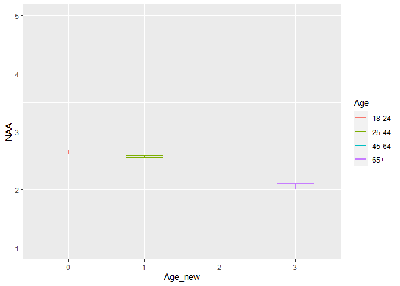
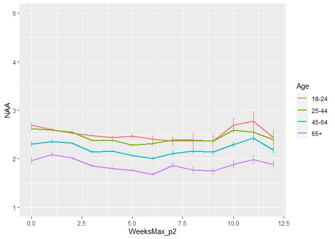
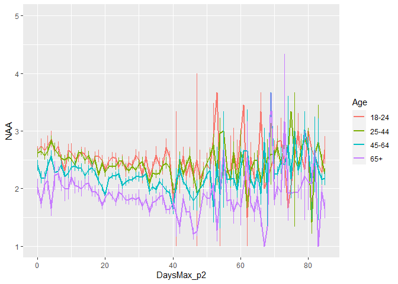
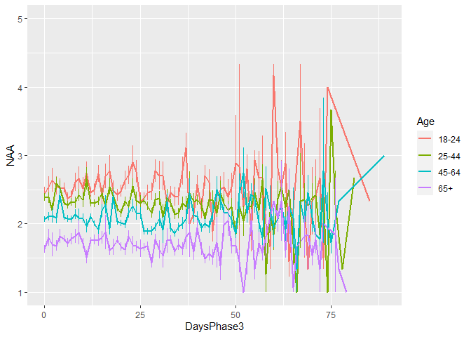
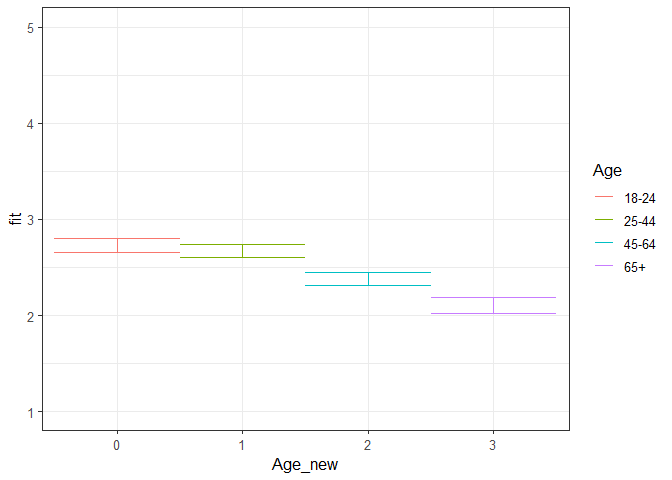
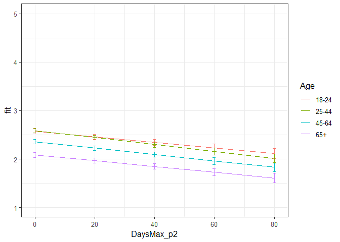
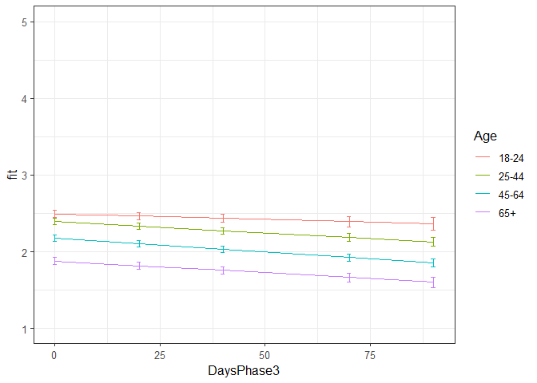

NAA all phases winning models
================
Anne Margit
10/04/2020

    ## [1] ""

``` r
load("data_analyse2_p1.Rdata")
load("data_analyse2_p2.Rdata")
load("data_analyse2_p3.Rdata")
```

This dataset includes:

1.  Data from all weekly measurement waves (baseline through wave 11,
    Time 1 through 12)
2.  Participants who provided at least 3 measurements
3.  Participants who are residents of the country they currently live in
4.  Participants who provided info on age
5.  Participants who provided info on gender (either male or female)
6.  Data from countries with at least 20 participants
7.  Pooled age groups
8.  Imputed missing emotion scores
9.  Combined emotion scores (NAA, NAD, PAA, PAD)
10. An imputed Stringency index (StringencyIndex\_imp)
11. A dummy Str\_dummy with 0 = before the peak, 1 = during peak, 2 =
    after peak
12. A variable indicating the number of days before maximum stringency
    was reached (DaysMax\_p1), during (DaysMax\_p2), and after
    (DaysPhase3)
13. A variable indicating the number of weeks before maximum stringency
    was reached (WeeksMax\_p1), during (WeeksMax\_p2), and after
    (WeeksPhase3)
14. A variable indicating the date on which maximum Stringency was
    reached for that country (DateMaxStr) and the max level reached
    (MaxStr) across the entire measurement period
15. A variable indicating the date on which minimum Stringency was
    reached for that country (DateMinStr) and the min level reached
    (MinStr) across the entire measurement period
16. Observations during which there was a second peak are excluded
    (N=583)

> My comments are in block quotes such as this.

``` r
library(dplyr)
library(tidyverse)
library(ggpubr)
library(ggplot2)
library(rockchalk)
library(effects)
library(nlme)
library(lattice)
library(broom.mixed)
library(purrr)
```

# Descriptives

**Number of participants per age group**

> 0 = 18-24, 1 = 25-44, 3= 45-64, 4= 65+

Phase 1

``` r
data_analyse2_p1 %>%
  group_by(Age_new) %>%
  summarise(NAge = n())
```

    # A tibble: 4 x 2
      Age_new  NAge
      <fct>   <int>
    1 0         695
    2 1        1893
    3 2        1274
    4 3         293

Phase 2

``` r
data_analyse2_p2 %>%
  group_by(Age_new) %>%
  summarise(NAge = n())
```

    # A tibble: 4 x 2
      Age_new  NAge
      <fct>   <int>
    1 0        3677
    2 1       11292
    3 2       10253
    4 3        4366

Phase 3

``` r
data_analyse2_p2 %>%
  group_by(Age_new) %>%
  summarise(NAge = n())
```

    # A tibble: 4 x 2
      Age_new  NAge
      <fct>   <int>
    1 0        3677
    2 1       11292
    3 2       10253
    4 3        4366

**Plots** **Mean NAA against max stringency in WEEKS** Phase 1 (only age
differences)

``` r
plot_NAA1 <- ggplot(data_analyse2_p1, aes(x=Age_new, y=NAA, group = Age_new, color = Age_new))

plot_NAA1 + stat_summary(fun.y=mean, geom="line", size=1)  + geom_errorbar(stat="summary", fun.data="mean_se", width=0.5) + scale_colour_discrete(name = "Age", labels = c("18-24", "25-44", "45-64", "65+")) + expand_limits(y=c(1, 5))
```

<!-- -->

Phase 2

``` r
plot_NAA2 <- ggplot(data_analyse2_p2, aes(x=WeeksMax_p2, y=NAA, group = Age_new, color = Age_new))

plot_NAA2 + stat_summary(fun.y=mean, geom="line", size=1)  + geom_errorbar(stat="summary", fun.data="mean_se", width=0) + scale_colour_discrete(name = "Age", labels = c("18-24", "25-44", "45-64", "65+")) + expand_limits(y=c(1, 5))
```

<!-- -->

Phase 3

``` r
plot_NAA3 <- ggplot(data_analyse2_p3, aes(x=WeeksPhase3, y=NAA, group = Age_new, color = Age_new))

plot_NAA3 + stat_summary(fun.y=mean, geom="line", size=1)  + geom_errorbar(stat="summary", fun.data="mean_se", width=0) + scale_colour_discrete(name = "Age", labels = c("18-24", "25-44", "45-64", "65+")) + expand_limits(y=c(1, 5))
```

<!-- -->

**Mean NAA against max stringency in DAYS** Phase 2

``` r
plot_NAA2 <- ggplot(data_analyse2_p2, aes(x=DaysMax_p2, y=NAA, group = Age_new, color = Age_new))

plot_NAA2 + stat_summary(fun.y=mean, geom="line", size=1)  + geom_errorbar(stat="summary", fun.data="mean_se", width=0) + scale_colour_discrete(name = "Age", labels = c("18-24", "25-44", "45-64", "65+")) + expand_limits(y=c(1, 5))
```

<!-- -->

Phase 3

``` r
plot_NAA3 <- ggplot(data_analyse2_p3, aes(x=DaysPhase3, y=NAA, group = Age_new, color = Age_new))

plot_NAA3 + stat_summary(fun.y=mean, geom="line", size=1)  + geom_errorbar(stat="summary", fun.data="mean_se", width=0) + scale_colour_discrete(name = "Age", labels = c("18-24", "25-44", "45-64", "65+")) + expand_limits(y=c(1, 5))
```

<!-- -->

# Phase 1

*Random: IC for ID and Country + Covariates Gender and Education*

> Gender: Male = 0, Female = 1

> Edu: 0= Primary education, 1= General secondary education, 2=
> Vocational education, 3= Higher education, 4= Bachelors degree, 5=
> Masters degree, 6= PhD degree

``` r
model_NAAp1 <- lme(fixed = NAA ~ Gender + Edu + Age_new,
                  random = ~1 | Country/ID, 
                  data = data_analyse2_p1, 
                  na.action = na.omit)

summary(model_NAAp1)
```

    Linear mixed-effects model fit by REML
     Data: data_analyse2_p1 
           AIC      BIC   logLik
      10412.38 10500.99 -5192.19
    
    Random effects:
     Formula: ~1 | Country
            (Intercept)
    StdDev:    0.256406
    
     Formula: ~1 | ID %in% Country
            (Intercept)  Residual
    StdDev:   0.6877817 0.5872538
    
    Fixed effects: NAA ~ Gender + Edu + Age_new 
                     Value  Std.Error   DF   t-value p-value
    (Intercept)  2.4288189 0.27262223 2711  8.909101  0.0000
    Gender1      0.2326369 0.03613849 2711  6.437372  0.0000
    Edu2         0.1035452 0.26668307 2711  0.388271  0.6978
    Edu3         0.1128411 0.26745550 2711  0.421906  0.6731
    Edu4         0.2054015 0.26379496 2711  0.778641  0.4363
    Edu5         0.1393574 0.26283734 2711  0.530204  0.5960
    Edu6         0.1427007 0.26387828 2711  0.540782  0.5887
    Edu7         0.0537832 0.26992330 2711  0.199254  0.8421
    Age_new1    -0.0623717 0.05088793 2711 -1.225667  0.2204
    Age_new2    -0.3515739 0.05379219 2711 -6.535779  0.0000
    Age_new3    -0.6255555 0.07563872 2711 -8.270308  0.0000
     Correlation: 
             (Intr) Gendr1 Edu2   Edu3   Edu4   Edu5   Edu6   Edu7   Ag_nw1 Ag_nw2
    Gender1  -0.060                                                               
    Edu2     -0.940 -0.044                                                        
    Edu3     -0.934 -0.052  0.956                                                 
    Edu4     -0.950 -0.050  0.970  0.967                                          
    Edu5     -0.952 -0.052  0.973  0.970  0.983                                   
    Edu6     -0.944 -0.056  0.968  0.966  0.980  0.984                            
    Edu7     -0.924 -0.049  0.946  0.944  0.958  0.962  0.960                     
    Age_new1 -0.161  0.076  0.046  0.027  0.040  0.018 -0.006 -0.012              
    Age_new2 -0.146  0.127  0.023  0.006  0.023  0.006 -0.009 -0.020  0.718       
    Age_new3 -0.117  0.182  0.017  0.011  0.019  0.005 -0.002 -0.003  0.499  0.503
    
    Standardized Within-Group Residuals:
            Min          Q1         Med          Q3         Max 
    -2.89341409 -0.54573220 -0.03961225  0.51938972  3.02074124 
    
    Number of Observations: 4155
    Number of Groups: 
            Country ID %in% Country 
                 26            2747 

*Confidence intervals*

``` r
intervals(model_NAAp1)
```

    Approximate 95% confidence intervals
    
     Fixed effects:
                     lower        est.      upper
    (Intercept)  1.8942505  2.42881890  2.9633873
    Gender1      0.1617751  0.23263693  0.3034987
    Edu2        -0.4193775  0.10354519  0.6264679
    Edu3        -0.4115962  0.11284110  0.6372784
    Edu4        -0.3118580  0.20540154  0.7226611
    Edu5        -0.3760244  0.13935745  0.6547393
    Edu6        -0.3747222  0.14270070  0.6601236
    Edu7        -0.4754931  0.05378319  0.5830594
    Age_new1    -0.1621547 -0.06237166  0.0374114
    Age_new2    -0.4570517 -0.35157386 -0.2460960
    Age_new3    -0.7738709 -0.62555553 -0.4772401
    attr(,"label")
    [1] "Fixed effects:"
    
     Random Effects:
      Level: Country 
                        lower     est.     upper
    sd((Intercept)) 0.1734138 0.256406 0.3791166
      Level: ID 
                        lower      est.     upper
    sd((Intercept)) 0.6583611 0.6877817 0.7185171
    
     Within-group standard error:
        lower      est.     upper 
    0.5668354 0.5872538 0.6084076 

*Plot of predicted values*

``` r
ef_NAAp1 <- effect("Age_new", model_NAAp1)

plot_NAAp1 <- ggplot(as.data.frame(ef_NAAp1), 
       aes(Age_new, fit, color=Age_new)) + geom_line() + 
  geom_errorbar(aes(ymin=fit-se, ymax=fit+se), width=1) + theme_bw(base_size=12) + scale_color_discrete(name="Age", labels = c("18-24", "25-44", "45-64", "65+")) + expand_limits(y=c(1, 5))
```

``` r
plot_NAAp1
```

<!-- -->

*Effect sizes*

``` r
ISDs <- data_analyse2_p1 %>% 
  group_by(ID) %>%
  summarize_at(c("NAA"), sd, na.rm=TRUE) %>%
  ungroup()

ISDs_av <- ISDs %>%
  summarize_at(c("NAA"), mean, na.rm=TRUE) %>%
  stack() %>%
  rename(sd=values) 
```

> Effect size = regression coefficient / average ISD of NAA

``` r
coef_NAAp1 = tidy(model_NAAp1, 
               effects = "fixed")

coef_NAAp1 <- coef_NAAp1 %>%
  mutate (e_size = estimate/0.4673061) %>% 
  mutate(across(2:7, round, 4)) 
```

``` r
coef_NAAp1
```

    ## # A tibble: 11 x 7
    ##    term        estimate std.error    df statistic p.value e_size
    ##    <chr>          <dbl>     <dbl> <dbl>     <dbl>   <dbl>  <dbl>
    ##  1 (Intercept)   2.43      0.273   2711     8.91    0      5.20 
    ##  2 Gender1       0.233     0.0361  2711     6.44    0      0.498
    ##  3 Edu2          0.104     0.267   2711     0.388   0.698  0.222
    ##  4 Edu3          0.113     0.268   2711     0.422   0.673  0.242
    ##  5 Edu4          0.205     0.264   2711     0.779   0.436  0.440
    ##  6 Edu5          0.139     0.263   2711     0.530   0.596  0.298
    ##  7 Edu6          0.143     0.264   2711     0.541   0.589  0.305
    ##  8 Edu7          0.0538    0.270   2711     0.199   0.842  0.115
    ##  9 Age_new1     -0.0624    0.0509  2711    -1.23    0.220 -0.134
    ## 10 Age_new2     -0.352     0.0538  2711    -6.54    0     -0.752
    ## 11 Age_new3     -0.626     0.0756  2711    -8.27    0     -1.34

> The two oldest groups report lower NAA than the youngest group. Women
> report higher NAA compared to men. No difference between education
> levels.

# Phase 2

*Best model*

> Random intercept for ID and Country, random slope for Country and ID,
> no correlation between random intercept and slope for Country, AR
> correlation structure at Measuement level

``` r
data_analyse2_p2 <- data_analyse2_p2[with(data_analyse2_p2, order(Country, ID, Time)),]
data_analyse2_p2$Time <- as.numeric(data_analyse2_p2$Time)

model_NAAp2 <- lme(fixed = NAA ~ Gender + Edu + DaysMax_p2 + Age_new + DaysMax_p2*Age_new,
                  random = list(Country = pdDiag(~DaysMax_p2), ID = ~DaysMax_p2),  
                  data = data_analyse2_p2, 
                  na.action = na.omit,
                  correlation = corAR1(form = ~ Time | Country/ID))

summary(model_NAAp2)
```

    Linear mixed-effects model fit by REML
     Data: data_analyse2_p2 
           AIC      BIC    logLik
      64371.34 64553.81 -32163.67
    
    Random effects:
     Formula: ~DaysMax_p2 | Country
     Structure: Diagonal
            (Intercept)  DaysMax_p2
    StdDev:   0.2095822 0.003737472
    
     Formula: ~DaysMax_p2 | ID %in% Country
     Structure: General positive-definite, Log-Cholesky parametrization
                StdDev      Corr  
    (Intercept) 0.730284593 (Intr)
    DaysMax_p2  0.008083453 -0.189
    Residual    0.556508579       
    
    Correlation Structure: ARMA(1,0)
     Formula: ~Time | Country/ID 
     Parameter estimate(s):
         Phi1 
    0.2607609 
    Fixed effects: NAA ~ Gender + Edu + DaysMax_p2 + Age_new + DaysMax_p2 * Age_new 
                             Value  Std.Error    DF    t-value p-value
    (Intercept)          2.5014098 0.10202245 20356  24.518228  0.0000
    Gender1              0.1853628 0.01876484  9171   9.878200  0.0000
    Edu2                -0.0197824 0.09109809  9171  -0.217155  0.8281
    Edu3                -0.0822081 0.09162766  9171  -0.897197  0.3696
    Edu4                -0.0109540 0.08969635  9171  -0.122124  0.9028
    Edu5                -0.0679061 0.08901722  9171  -0.762842  0.4456
    Edu6                -0.0695480 0.08971371  9171  -0.775222  0.4382
    Edu7                -0.1016590 0.09311680  9171  -1.091736  0.2750
    DaysMax_p2          -0.0057443 0.00127278 20356  -4.513201  0.0000
    Age_new1             0.0108255 0.03634931  9171   0.297818  0.7658
    Age_new2            -0.2171703 0.03732778  9171  -5.817926  0.0000
    Age_new3            -0.4866084 0.04505458  9171 -10.800421  0.0000
    DaysMax_p2:Age_new1 -0.0013769 0.00103980 20356  -1.324159  0.1855
    DaysMax_p2:Age_new2 -0.0008446 0.00106186 20356  -0.795366  0.4264
    DaysMax_p2:Age_new3 -0.0002289 0.00121514 20356  -0.188400  0.8506
     Correlation: 
                        (Intr) Gendr1 Edu2   Edu3   Edu4   Edu5   Edu6   Edu7   DysM_2 Ag_nw1 Ag_nw2 Ag_nw3 DM_2:A_1 DM_2:A_2
    Gender1             -0.132                                                                                               
    Edu2                -0.838 -0.014                                                                                        
    Edu3                -0.820 -0.011  0.918                                                                                 
    Edu4                -0.845 -0.019  0.938  0.932                                                                          
    Edu5                -0.848 -0.012  0.943  0.937  0.958                                                                   
    Edu6                -0.833 -0.027  0.936  0.932  0.952  0.960                                                            
    Edu7                -0.802 -0.016  0.900  0.897  0.915  0.922  0.919                                                     
    DaysMax_p2          -0.139  0.003  0.006  0.004  0.002  0.001  0.002  0.004                                              
    Age_new1            -0.253  0.045  0.039  0.002  0.019 -0.003 -0.037 -0.033  0.332                                       
    Age_new2            -0.252  0.074  0.034 -0.008  0.019  0.005 -0.017 -0.023  0.321  0.754                                
    Age_new3            -0.238  0.141  0.045  0.012  0.034  0.023  0.005  0.006  0.268  0.629  0.635                         
    DaysMax_p2:Age_new1  0.146  0.001 -0.008 -0.007 -0.002 -0.001  0.000 -0.001 -0.600 -0.571 -0.449 -0.374                  
    DaysMax_p2:Age_new2  0.142  0.001 -0.007 -0.006  0.000  0.000  0.002  0.002 -0.585 -0.452 -0.591 -0.377  0.805           
    DaysMax_p2:Age_new3  0.129 -0.007 -0.009 -0.008 -0.004 -0.003 -0.003 -0.003 -0.514 -0.395 -0.398 -0.609  0.706    0.705  
    
    Standardized Within-Group Residuals:
            Min          Q1         Med          Q3         Max 
    -3.93885615 -0.53605645 -0.09983673  0.48228675  4.37464304 
    
    Number of Observations: 29574
    Number of Groups: 
            Country ID %in% Country 
                 33            9214 

*Confidence intervals*

``` r
intervals(model_NAAp2, which = 'fixed')
```

    Approximate 95% confidence intervals
    
     Fixed effects:
                               lower          est.         upper
    (Intercept)          2.301437553  2.5014097749  2.7013819969
    Gender1              0.148579547  0.1853628061  0.2221460647
    Edu2                -0.198354974 -0.0197824244  0.1587901249
    Edu3                -0.261818699 -0.0822080751  0.0974025492
    Edu4                -0.186778863 -0.0109540336  0.1648707963
    Edu5                -0.242399675 -0.0679060910  0.1065874931
    Edu6                -0.245406868 -0.0695480258  0.1063108163
    Edu7                -0.284188674 -0.1016590062  0.0808706615
    DaysMax_p2          -0.008239045 -0.0057442990 -0.0032495531
    Age_new1            -0.060427279  0.0108254663  0.0820782118
    Age_new2            -0.290341056 -0.2171702883 -0.1439995208
    Age_new3            -0.574925381 -0.4866083804 -0.3982913800
    DaysMax_p2:Age_new1 -0.003414949 -0.0013768590  0.0006612308
    DaysMax_p2:Age_new2 -0.002925911 -0.0008445707  0.0012367700
    DaysMax_p2:Age_new3 -0.002610701 -0.0002289324  0.0021528365
    attr(,"label")
    [1] "Fixed effects:"

*Plot of predicted values*

``` r
ef_NAAp2 <- effect("DaysMax_p2:Age_new", model_NAAp2)

plot_NAAp2 <- ggplot(as.data.frame(ef_NAAp2), 
       aes(DaysMax_p2, fit, color=Age_new)) + geom_line() + 
  geom_errorbar(aes(ymin=fit-se, ymax=fit+se), width=1) + theme_bw(base_size=12) + scale_color_discrete(name="Age", labels = c("18-24", "25-44", "45-64", "65+")) + expand_limits(y=c(1, 5))
```

``` r
plot_NAAp2
```

<!-- -->

*Effect sizes* **Within person SD and average within person SD**

``` r
ISDs <- data_analyse2_p2 %>% 
  group_by(ID) %>%
  summarize_at(c("DaysMax_p2", "NAA"), sd, na.rm=TRUE) %>%
  ungroup()

ISDs_av <- ISDs %>%
  summarize_at(c("DaysMax_p2", "NAA"), mean, na.rm=TRUE) %>%
  stack() %>%
  rename(sd=values) 
```

> Effect sizes for intercept and main effect of age and covariates =
> regression coefficient / average ISD of NAA Effect size for main
> effect of DaysMax = (regression coefficient \* 28)/ average ISD of NAA
> Effect sizes for interaction effects = (regression coefficient \* 28)/
> average ISD of NAA

> The effect sizes for main effect of DaysMax and the interaction
> effects reflect the increase in SD of NAA over 4 weeks (28 days)

``` r
coef_NAAp2 = tidy(model_NAAp2, 
               effects = "fixed")

coef_NAAp2 <- coef_NAAp2 %>%
  mutate(e_size = ifelse(row_number()== 1 | row_number()== 2 |  row_number()== 3 |  row_number()== 4 |  row_number()== 5
                          |  row_number()== 6 |  row_number()== 7 |  row_number()== 8  |  row_number()== 10  
                          |  row_number()== 11  |  row_number()== 12, 
                          estimate/0.4557901, (estimate*28)/0.4557901)) %>%
  mutate(across(2:7, round, 4)) 
```

``` r
coef_NAAp2
```

    ## # A tibble: 15 x 7
    ##    term                estimate std.error    df statistic p.value  e_size
    ##    <chr>                  <dbl>     <dbl> <dbl>     <dbl>   <dbl>   <dbl>
    ##  1 (Intercept)           2.50     0.102   20356    24.5     0      5.49  
    ##  2 Gender1               0.185    0.0188   9171     9.88    0      0.407 
    ##  3 Edu2                 -0.0198   0.0911   9171    -0.217   0.828 -0.0434
    ##  4 Edu3                 -0.0822   0.0916   9171    -0.897   0.370 -0.180 
    ##  5 Edu4                 -0.011    0.0897   9171    -0.122   0.903 -0.024 
    ##  6 Edu5                 -0.0679   0.089    9171    -0.763   0.446 -0.149 
    ##  7 Edu6                 -0.0695   0.0897   9171    -0.775   0.438 -0.153 
    ##  8 Edu7                 -0.102    0.0931   9171    -1.09    0.275 -0.223 
    ##  9 DaysMax_p2           -0.0057   0.0013  20356    -4.51    0     -0.353 
    ## 10 Age_new1              0.0108   0.0363   9171     0.298   0.766  0.0238
    ## 11 Age_new2             -0.217    0.0373   9171    -5.82    0     -0.476 
    ## 12 Age_new3             -0.487    0.0451   9171   -10.8     0     -1.07  
    ## 13 DaysMax_p2:Age_new1  -0.0014   0.001   20356    -1.32    0.186 -0.0846
    ## 14 DaysMax_p2:Age_new2  -0.0008   0.0011  20356    -0.795   0.426 -0.0519
    ## 15 DaysMax_p2:Age_new3  -0.0002   0.00120 20356    -0.188   0.851 -0.0141

> NAA decreases over time for the youngest age group (main effect) and
> other groups in a similar way (interaction effect). The two oldest
> groups report lower NAA compared to the youngest group at the
> beginning of the peak (main effect).

# Phase 3

``` r
data_analyse2_p3 <- data_analyse2_p3[with(data_analyse2_p3, order(Country, ID, Time)),]
data_analyse2_p3$Time <- as.numeric(data_analyse2_p3$Time)

model_NAAp3 <- lme(fixed = NAA ~ Gender + Edu + DaysPhase3 + Age_new + DaysPhase3*Age_new,
                  random = list (Country = ~1, ID = ~DaysPhase3), 
                  data = data_analyse2_p3, 
                  na.action = na.omit,
                  correlation = corAR1(form = ~ Time | Country/ID))

summary(model_NAAp3)
```

    Linear mixed-effects model fit by REML
     Data: data_analyse2_p3 
          AIC      BIC   logLik
      52033.4 52204.04 -25995.7
    
    Random effects:
     Formula: ~1 | Country
            (Intercept)
    StdDev:   0.1951031
    
     Formula: ~DaysPhase3 | ID %in% Country
     Structure: General positive-definite, Log-Cholesky parametrization
                StdDev      Corr  
    (Intercept) 0.773475234 (Intr)
    DaysPhase3  0.009541128 -0.31 
    Residual    0.524036419       
    
    Correlation Structure: ARMA(1,0)
     Formula: ~Time | Country/ID 
     Parameter estimate(s):
         Phi1 
    0.1949337 
    Fixed effects: NAA ~ Gender + Edu + DaysPhase3 + Age_new + DaysPhase3 * Age_new 
                             Value  Std.Error    DF    t-value p-value
    (Intercept)          2.6989455 0.12858005 17940  20.990392  0.0000
    Gender1              0.1177207 0.02144142  7004   5.490343  0.0000
    Edu2                -0.2577383 0.12036924  7004  -2.141230  0.0323
    Edu3                -0.3116026 0.12026318  7004  -2.591006  0.0096
    Edu4                -0.2328405 0.11914869  7004  -1.954201  0.0507
    Edu5                -0.2937562 0.11891811  7004  -2.470240  0.0135
    Edu6                -0.2901119 0.11967624  7004  -2.424140  0.0154
    Edu7                -0.3946954 0.12307844  7004  -3.206860  0.0013
    DaysPhase3          -0.0014019 0.00098102 17940  -1.429032  0.1530
    Age_new1            -0.1006340 0.04076353  7004  -2.468726  0.0136
    Age_new2            -0.3155756 0.04006267  7004  -7.877048  0.0000
    Age_new3            -0.6130012 0.04589396  7004 -13.356903  0.0000
    DaysPhase3:Age_new1 -0.0015296 0.00113494 17940  -1.347716  0.1778
    DaysPhase3:Age_new2 -0.0022008 0.00109814 17940  -2.004151  0.0451
    DaysPhase3:Age_new3 -0.0016922 0.00121468 17940  -1.393159  0.1636
     Correlation: 
                        (Intr) Gendr1 Edu2   Edu3   Edu4   Edu5   Edu6   Edu7   DysPh3 Ag_nw1 Ag_nw2 Ag_nw3 DP3:A_1 DP3:A_2
    Gender1             -0.140                                                                                             
    Edu2                -0.899  0.007                                                                                      
    Edu3                -0.891  0.010  0.946                                                                               
    Edu4                -0.905  0.001  0.955  0.956                                                                        
    Edu5                -0.906  0.006  0.958  0.958  0.968                                                                 
    Edu6                -0.894 -0.002  0.951  0.953  0.963  0.967                                                          
    Edu7                -0.867  0.002  0.923  0.925  0.934  0.937  0.935                                                   
    DaysPhase3          -0.137 -0.003  0.001  0.000  0.002  0.000 -0.001  0.000                                            
    Age_new1            -0.236  0.049  0.042  0.010  0.024  0.005 -0.025 -0.023  0.433                                     
    Age_new2            -0.251  0.103  0.038  0.003  0.026  0.016 -0.001 -0.009  0.439  0.752                              
    Age_new3            -0.262  0.181  0.063  0.036  0.054  0.044  0.033  0.031  0.383  0.660  0.701                       
    DaysPhase3:Age_new1  0.121  0.000 -0.003 -0.001 -0.003 -0.001 -0.001 -0.002 -0.862 -0.506 -0.381 -0.333                
    DaysPhase3:Age_new2  0.124  0.002 -0.001 -0.001 -0.002  0.000  0.000  0.000 -0.892 -0.388 -0.503 -0.345  0.771         
    DaysPhase3:Age_new3  0.111 -0.001  0.000  0.001 -0.001  0.001  0.002  0.000 -0.806 -0.350 -0.356 -0.495  0.697   0.721 
    
    Standardized Within-Group Residuals:
           Min         Q1        Med         Q3        Max 
    -4.9045215 -0.4748695 -0.1157010  0.4422709  5.0720862 
    
    Number of Observations: 24990
    Number of Groups: 
            Country ID %in% Country 
                 32            7046 

> Random intercept for ID and Country, random slope for ID and AR
> correlation structure at Measuement level

*Confidence intervals*

``` r
intervals(model_NAAp3, which = 'fixed')
```

    Approximate 95% confidence intervals
    
     Fixed effects:
                               lower         est.         upper
    (Intercept)          2.446916278  2.698945544  2.950975e+00
    Gender1              0.075689055  0.117720723  1.597524e-01
    Edu2                -0.493698425 -0.257738274 -2.177812e-02
    Edu3                -0.547354871 -0.311602629 -7.585039e-02
    Edu4                -0.466408012 -0.232840517  7.269775e-04
    Edu5                -0.526871730 -0.293756241 -6.064075e-02
    Edu6                -0.524713591 -0.290111920 -5.551025e-02
    Edu7                -0.635966393 -0.394695385 -1.534244e-01
    DaysPhase3          -0.003324800 -0.001401908  5.209842e-04
    Age_new1            -0.180542843 -0.100633978 -2.072511e-02
    Age_new2            -0.394110529 -0.315575567 -2.370406e-01
    Age_new3            -0.702967233 -0.613001179 -5.230351e-01
    DaysPhase3:Age_new1 -0.003754181 -0.001529582  6.950168e-04
    DaysPhase3:Age_new2 -0.004353300 -0.002200840 -4.837866e-05
    DaysPhase3:Age_new3 -0.004073132 -0.001692242  6.886478e-04
    attr(,"label")
    [1] "Fixed effects:"

*Plot of predicted values*

``` r
ef_NAAp3 <- effect("DaysPhase3:Age_new", model_NAAp3)

plot_NAAp3 <- ggplot(as.data.frame(ef_NAAp3), 
       aes(DaysPhase3, fit, color=Age_new)) + geom_line() + 
  geom_errorbar(aes(ymin=fit-se, ymax=fit+se), width=1) + theme_bw(base_size=12) + scale_color_discrete(name="Age", labels = c("18-24", "25-44", "45-64", "65+")) + expand_limits(y=c(1, 5))
```

``` r
plot_NAAp3
```

<!-- -->
*Effect sizes* **Within person SD and average within person SD for NAA**

``` r
ISDs <- data_analyse2_p3 %>% 
  group_by(ID) %>%
  summarize_at(c("NAA"), sd, na.rm=TRUE) %>%
  ungroup()

ISDs_av <- ISDs %>%
  summarize_at(c("NAA"), mean, na.rm=TRUE) %>%
  stack() %>%
  rename(sd=values) 
```

> Effect sizes for intercept and main effect of age = regression
> coefficient / average ISD of NAA Effect size for main effect of
> DaysMax = (regression coefficient \* 28)/ average ISD of NAA Effect
> sizes for interaction effects = (regression coefficient \* 28)/
> average ISD of NAA

> The effect sizes for main effect of DaysMax and the interaction
> effects reflect the increase in SD of NAA over 4 weeks (28 days)

``` r
coef_NAAp3 = tidy(model_NAAp3, 
               effects = "fixed")

coef_NAAp3 <- coef_NAAp3 %>%
 mutate(e_size = ifelse(row_number()== 1 | row_number()== 2 |  row_number()== 3 |  row_number()== 4 |  row_number()== 5
                          |  row_number()== 6 |  row_number()== 7 |  row_number()== 8  |  row_number()== 10  
                          |  row_number()== 11  |  row_number()== 12, 
                          estimate/0.4208346, (estimate*28)/0.4208346)) %>%
  mutate(across(2:7, round, 4)) 
```

``` r
coef_NAAp3
```

    ## # A tibble: 15 x 7
    ##    term                estimate std.error    df statistic p.value  e_size
    ##    <chr>                  <dbl>     <dbl> <dbl>     <dbl>   <dbl>   <dbl>
    ##  1 (Intercept)           2.70     0.129   17940     21.0  0        6.41  
    ##  2 Gender1               0.118    0.0214   7004      5.49 0        0.280 
    ##  3 Edu2                 -0.258    0.120    7004     -2.14 0.0323  -0.612 
    ##  4 Edu3                 -0.312    0.120    7004     -2.59 0.00960 -0.740 
    ##  5 Edu4                 -0.233    0.119    7004     -1.95 0.0507  -0.553 
    ##  6 Edu5                 -0.294    0.119    7004     -2.47 0.0135  -0.698 
    ##  7 Edu6                 -0.290    0.120    7004     -2.42 0.0154  -0.689 
    ##  8 Edu7                 -0.395    0.123    7004     -3.21 0.0013  -0.938 
    ##  9 DaysPhase3           -0.0014   0.001   17940     -1.43 0.153   -0.0933
    ## 10 Age_new1             -0.101    0.0408   7004     -2.47 0.0136  -0.239 
    ## 11 Age_new2             -0.316    0.0401   7004     -7.88 0       -0.750 
    ## 12 Age_new3             -0.613    0.0459   7004    -13.4  0       -1.46  
    ## 13 DaysPhase3:Age_new1  -0.0015   0.0011  17940     -1.35 0.178   -0.102 
    ## 14 DaysPhase3:Age_new2  -0.0022   0.0011  17940     -2.00 0.0451  -0.146 
    ## 15 DaysPhase3:Age_new3  -0.0017   0.00120 17940     -1.39 0.164   -0.113

> Older people report lower NAA compared to younger people on the first
> day stringency reduces after the peak (main effect), there is no
> change over time in NAA for the youngest group, but the middle aged
> group (45-64) reports decreasing NAA over time (interaction effect).
> This trend is visible for the other age groups as well in the plot but
> not significant.
