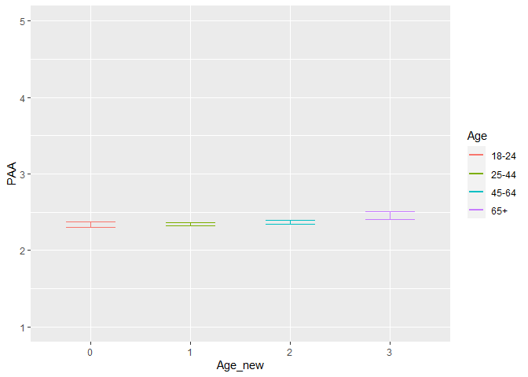
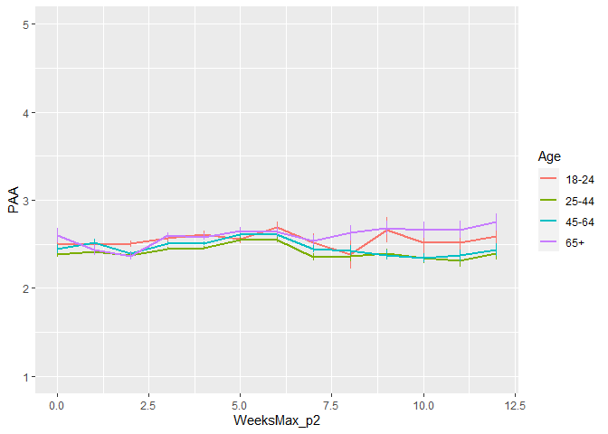
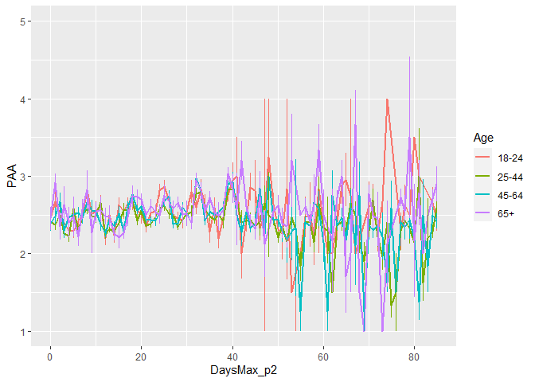
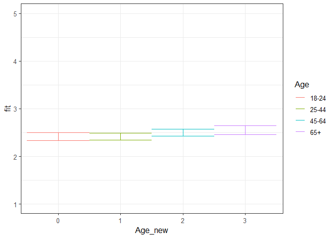
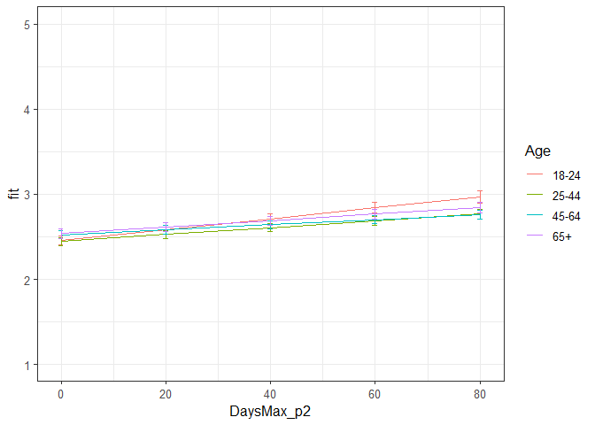
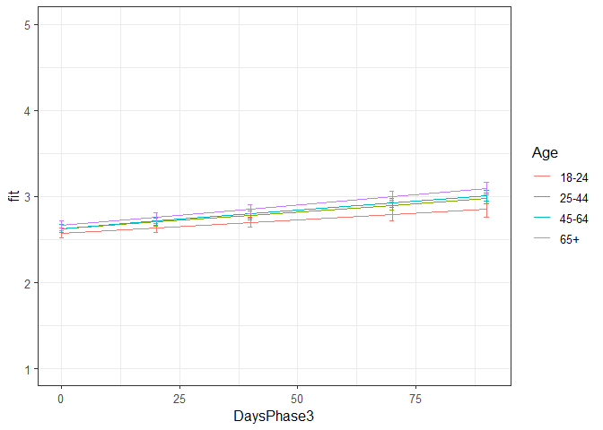

PAA all phases winning models
================
Anne Margit
10/28/2020

    ## [1] ""

``` r
load("data_analyse2_p1.Rdata")
load("data_analyse2_p2.Rdata")
load("data_analyse2_p3.Rdata")
```

This dataset includes:

1.  Data from all weekly measurement waves (baseline through wave 11,
    Time 1 through 12)
2.  Participants who provided at least 3 measurements
3.  Participants who are residents of the country they currently live in
4.  Participants who provided info on age
5.  Participants who provided info on gender (either male or female)
6.  Data from countries with at least 20 participants
7.  Pooled age groups
8.  Imputed missing emotion scores
9.  Combined emotion scores (NAA, NAD, PAA, PAD)
10. An imputed Stringency index (StringencyIndex\_imp)
11. A dummy Str\_dummy with 0 = before the peak, 1 = during peak, 2 =
    after peak
12. A variable indicating the number of days before maximum stringency
    was reached (DaysMax\_p1), during (DaysMax\_p2), and after
    (DaysPhase3)
13. A variable indicating the number of weeks before maximum stringency
    was reached (WeeksMax\_p1), during (WeeksMax\_p2), and after
    (WeeksPhase3)
14. A variable indicating the date on which maximum Stringency was
    reached for that country (DateMaxStr) and the max level reached
    (MaxStr) across the entire measurement period
15. A variable indicating the date on which minimum Stringency was
    reached for that country (DateMinStr) and the min level reached
    (MinStr) across the entire measurement period
16. Observations during which there was a second peak are excluded
    (N=583)

> My comments are in block quotes such as this.

``` r
library(dplyr)
library(tidyverse)
library(ggpubr)
library(ggplot2)
library(rockchalk)
library(effects)
library(nlme)
library(lattice)
library(broom.mixed)
library(purrr)
```

# Descriptives

**Number of participants per age group**

> 0 = 18-24, 1 = 25-44, 3= 45-64, 4= 65+

Phase 1

``` r
data_analyse2_p1 %>%
  group_by(Age_new) %>%
  summarise(NAge = n())
```

    # A tibble: 4 x 2
      Age_new  NAge
      <fct>   <int>
    1 0         695
    2 1        1893
    3 2        1274
    4 3         293

Phase 2

``` r
data_analyse2_p2 %>%
  group_by(Age_new) %>%
  summarise(NAge = n())
```

    # A tibble: 4 x 2
      Age_new  NAge
      <fct>   <int>
    1 0        3677
    2 1       11292
    3 2       10253
    4 3        4366

Phase 3

``` r
data_analyse2_p2 %>%
  group_by(Age_new) %>%
  summarise(NAge = n())
```

    # A tibble: 4 x 2
      Age_new  NAge
      <fct>   <int>
    1 0        3677
    2 1       11292
    3 2       10253
    4 3        4366

**Plots** **Mean PAA against max stringency in WEEKS** Phase 1 (only age
differences)

``` r
plot_PAA1 <- ggplot(data_analyse2_p1, aes(x=Age_new, y=PAA, group = Age_new, color = Age_new))

plot_PAA1 + stat_summary(fun.y=mean, geom="line", size=1)  + geom_errorbar(stat="summary", fun.data="mean_se", width=0.5) + scale_colour_discrete(name = "Age", labels = c("18-24", "25-44", "45-64", "65+")) + expand_limits(y=c(1, 5))
```

<!-- -->

Phase 2

``` r
plot_PAA2 <- ggplot(data_analyse2_p2, aes(x=WeeksMax_p2, y=PAA, group = Age_new, color = Age_new))

plot_PAA2 + stat_summary(fun.y=mean, geom="line", size=1)  + geom_errorbar(stat="summary", fun.data="mean_se", width=0) + scale_colour_discrete(name = "Age", labels = c("18-24", "25-44", "45-64", "65+")) + expand_limits(y=c(1, 5))
```

<!-- -->

Phase 3

``` r
plot_PAA3 <- ggplot(data_analyse2_p3, aes(x=WeeksPhase3, y=PAA, group = Age_new, color = Age_new))

plot_PAA3 + stat_summary(fun.y=mean, geom="line", size=1)  + geom_errorbar(stat="summary", fun.data="mean_se", width=0) + scale_colour_discrete(name = "Age", labels = c("18-24", "25-44", "45-64", "65+")) + expand_limits(y=c(1, 5))
```

<!-- -->

**Mean NAD against max stringency in DAYS** Phase 2

``` r
plot_PAA2 <- ggplot(data_analyse2_p2, aes(x=DaysMax_p2, y=PAA, group = Age_new, color = Age_new))

plot_PAA2 + stat_summary(fun.y=mean, geom="line", size=1)  + geom_errorbar(stat="summary", fun.data="mean_se", width=0) + scale_colour_discrete(name = "Age", labels = c("18-24", "25-44", "45-64", "65+")) + expand_limits(y=c(1, 5))
```

<!-- -->

Phase 3

``` r
plot_PAA3 <- ggplot(data_analyse2_p3, aes(x=DaysPhase3, y=PAA, group = Age_new, color = Age_new))

plot_PAA3 + stat_summary(fun.y=mean, geom="line", size=1)  + geom_errorbar(stat="summary", fun.data="mean_se", width=0) + scale_colour_discrete(name = "Age", labels = c("18-24", "25-44", "45-64", "65+")) + expand_limits(y=c(1, 5))
```

<!-- -->

# Phase 1

*Random: IC for ID and Country + Covariates Gender and Education*

> Gender: Male = 0, Female = 1

> Edu: 0= Primary education, 1= General secondary education, 2=
> Vocational education, 3= Higher education, 4= Bachelors degree, 5=
> Masters degree, 6= PhD degree

``` r
model_PAAp1 <- lme(fixed = PAA ~ Gender + Edu + Age_new,
                  random = ~1 | Country/ID, 
                  data = data_analyse2_p1, 
                  na.action = na.omit)

summary(model_PAAp1)
```

    Linear mixed-effects model fit by REML
     Data: data_analyse2_p1 
           AIC      BIC    logLik
      10449.94 10538.55 -5210.971
    
    Random effects:
     Formula: ~1 | Country
            (Intercept)
    StdDev:   0.2951963
    
     Formula: ~1 | ID %in% Country
            (Intercept)  Residual
    StdDev:   0.6746443 0.5995693
    
    Fixed effects: PAA ~ Gender + Edu + Age_new 
                     Value  Std.Error   DF   t-value p-value
    (Intercept)  2.3072551 0.27342269 2711  8.438419  0.0000
    Gender1     -0.1525043 0.03596476 2711 -4.240383  0.0000
    Edu2         0.1425021 0.26543997 2711  0.536852  0.5914
    Edu3         0.1489302 0.26622237 2711  0.559420  0.5759
    Edu4         0.2021863 0.26257282 2711  0.770020  0.4414
    Edu5         0.1820357 0.26162404 2711  0.695791  0.4866
    Edu6         0.3005564 0.26266113 2711  1.144275  0.2526
    Edu7         0.3061195 0.26869390 2711  1.139287  0.2547
    Age_new1     0.0013293 0.05063612 2711  0.026253  0.9791
    Age_new2     0.0835942 0.05355891 2711  1.560791  0.1187
    Age_new3     0.1355653 0.07541288 2711  1.797642  0.0723
     Correlation: 
             (Intr) Gendr1 Edu2   Edu3   Edu4   Edu5   Edu6   Edu7   Ag_nw1 Ag_nw2
    Gender1  -0.060                                                               
    Edu2     -0.933 -0.044                                                        
    Edu3     -0.927 -0.052  0.956                                                 
    Edu4     -0.943 -0.050  0.970  0.967                                          
    Edu5     -0.945 -0.051  0.973  0.970  0.983                                   
    Edu6     -0.937 -0.056  0.968  0.966  0.980  0.984                            
    Edu7     -0.917 -0.049  0.946  0.944  0.958  0.962  0.960                     
    Age_new1 -0.160  0.076  0.046  0.027  0.040  0.018 -0.006 -0.012              
    Age_new2 -0.145  0.127  0.023  0.006  0.023  0.006 -0.009 -0.020  0.718       
    Age_new3 -0.116  0.183  0.018  0.011  0.019  0.005 -0.002 -0.003  0.498  0.503
    
    Standardized Within-Group Residuals:
            Min          Q1         Med          Q3         Max 
    -2.75214235 -0.54306065 -0.03426188  0.49578485  2.94450707 
    
    Number of Observations: 4155
    Number of Groups: 
            Country ID %in% Country 
                 26            2747 

*Confidence intervals*

``` r
intervals(model_PAAp1)
```

    Approximate 95% confidence intervals
    
     Fixed effects:
                      lower         est.       upper
    (Intercept)  1.77111715  2.307255144  2.84339314
    Gender1     -0.22302544 -0.152504329 -0.08198322
    Edu2        -0.37798308  0.142502074  0.66298723
    Edu3        -0.37308911  0.148930212  0.67094954
    Edu4        -0.31267682  0.202186331  0.71704948
    Edu5        -0.33096705  0.182035687  0.69503842
    Edu6        -0.21447986  0.300556436  0.81559274
    Edu7        -0.22074611  0.306119475  0.83298506
    Age_new1    -0.09795997  0.001329341  0.10061865
    Age_new2    -0.02142618  0.083594242  0.18861466
    Age_new3    -0.01230720  0.135565347  0.28343789
    attr(,"label")
    [1] "Fixed effects:"
    
     Random Effects:
      Level: Country 
                        lower      est.     upper
    sd((Intercept)) 0.2003191 0.2951963 0.4350101
      Level: ID 
                        lower      est.     upper
    sd((Intercept)) 0.6443062 0.6746443 0.7064109
    
     Within-group standard error:
        lower      est.     upper 
    0.5784872 0.5995693 0.6214197 

*Plot of predicted values*

``` r
ef_PAAp1 <- effect("Age_new", model_PAAp1)

plot_PAAp1 <- ggplot(as.data.frame(ef_PAAp1), 
       aes(Age_new, fit, color=Age_new)) + geom_line() + 
  geom_errorbar(aes(ymin=fit-se, ymax=fit+se), width=1) + theme_bw(base_size=12) + scale_color_discrete(name="Age", labels = c("18-24", "25-44", "45-64", "65+")) + expand_limits(y=c(1, 5))
```

``` r
plot_PAAp1
```

<!-- -->

*Effect sizes*

``` r
ISDs <- data_analyse2_p1 %>% 
  group_by(ID) %>%
  summarize_at(c("PAA"), sd, na.rm=TRUE) %>%
  ungroup()

ISDs_av <- ISDs %>%
  summarize_at(c("PAA"), mean, na.rm=TRUE) %>%
  stack() %>%
  rename(sd=values) 
```

> Effect size = regression coefficient / average ISD of PAA

``` r
coef_PAAp1 = tidy(model_PAAp1, 
               effects = "fixed")

coef_PAAp1 <- coef_PAAp1 %>%
  mutate (e_size = estimate/0.467823) %>% 
  mutate(across(2:7, round, 4)) 
```

``` r
coef_PAAp1
```

    ## # A tibble: 11 x 7
    ##    term        estimate std.error    df statistic p.value  e_size
    ##    <chr>          <dbl>     <dbl> <dbl>     <dbl>   <dbl>   <dbl>
    ##  1 (Intercept)   2.31      0.273   2711    8.44    0       4.93  
    ##  2 Gender1      -0.152     0.036   2711   -4.24    0      -0.326 
    ##  3 Edu2          0.142     0.265   2711    0.537   0.591   0.305 
    ##  4 Edu3          0.149     0.266   2711    0.559   0.576   0.318 
    ##  5 Edu4          0.202     0.263   2711    0.77    0.441   0.432 
    ##  6 Edu5          0.182     0.262   2711    0.696   0.487   0.389 
    ##  7 Edu6          0.301     0.263   2711    1.14    0.253   0.642 
    ##  8 Edu7          0.306     0.269   2711    1.14    0.255   0.654 
    ##  9 Age_new1      0.0013    0.0506  2711    0.0263  0.979   0.0028
    ## 10 Age_new2      0.0836    0.0536  2711    1.56    0.119   0.179 
    ## 11 Age_new3      0.136     0.0754  2711    1.80    0.0723  0.290

# Phase 2

*Best model*

> Random intercept for ID and Country, random slope for ID, no
> correlation between IC and S for ID + AR correlation structure at
> Measurement level

``` r
data_analyse2_p2 <- data_analyse2_p2[with(data_analyse2_p2, order(Country, ID, Time)),]
data_analyse2_p2$Time <- as.numeric(data_analyse2_p2$Time)

model_PAAp2 <- lme(fixed = PAA ~ Gender + Edu + DaysMax_p2 + Age_new + DaysMax_p2*Age_new,
                  random = list(Country = ~1, ID = pdDiag(~DaysMax_p2)),
                  data = data_analyse2_p2, 
                  na.action = na.omit,
                  correlation = corAR1(form = ~Time | Country/ID))

summary(model_PAAp2)
```

    Linear mixed-effects model fit by REML
     Data: data_analyse2_p2 
           AIC      BIC    logLik
      66752.74 66918.62 -33356.37
    
    Random effects:
     Formula: ~1 | Country
            (Intercept)
    StdDev:    0.234608
    
     Formula: ~DaysMax_p2 | ID %in% Country
     Structure: Diagonal
            (Intercept)  DaysMax_p2  Residual
    StdDev:   0.6793159 0.006245585 0.5914089
    
    Correlation Structure: ARMA(1,0)
     Formula: ~Time | Country/ID 
     Parameter estimate(s):
         Phi1 
    0.2116251 
    Fixed effects: PAA ~ Gender + Edu + DaysMax_p2 + Age_new + DaysMax_p2 * Age_new 
                             Value  Std.Error    DF   t-value p-value
    (Intercept)          2.4413120 0.10235091 20356 23.852373  0.0000
    Gender1             -0.1676050 0.01844947  9171 -9.084543  0.0000
    Edu2                -0.0204422 0.08977345  9171 -0.227709  0.8199
    Edu3                 0.0674449 0.09030656  9171  0.746844  0.4552
    Edu4                 0.1262268 0.08838896  9171  1.428083  0.1533
    Edu5                 0.1141586 0.08771973  9171  1.301402  0.1932
    Edu6                 0.2114183 0.08839635  9171  2.391709  0.0168
    Edu7                 0.2885645 0.09170662  9171  3.146605  0.0017
    DaysMax_p2           0.0063772 0.00091542 20356  6.966415  0.0000
    Age_new1            -0.0103340 0.03527185  9171 -0.292980  0.7695
    Age_new2             0.0670758 0.03608699  9171  1.858725  0.0631
    Age_new3             0.0806291 0.04364332  9171  1.847457  0.0647
    DaysMax_p2:Age_new1 -0.0023662 0.00101409 20356 -2.333330  0.0196
    DaysMax_p2:Age_new2 -0.0034202 0.00102592 20356 -3.333770  0.0009
    DaysMax_p2:Age_new3 -0.0025740 0.00116938 20356 -2.201207  0.0277
     Correlation: 
                        (Intr) Gendr1 Edu2   Edu3   Edu4   Edu5   Edu6   Edu7   DysM_2 Ag_nw1 Ag_nw2 Ag_nw3 DM_2:A_1 DM_2:A_2
    Gender1             -0.128                                                                                               
    Edu2                -0.824 -0.014                                                                                        
    Edu3                -0.805 -0.011  0.918                                                                                 
    Edu4                -0.830 -0.020  0.938  0.932                                                                          
    Edu5                -0.833 -0.012  0.944  0.937  0.958                                                                   
    Edu6                -0.818 -0.027  0.937  0.932  0.952  0.960                                                            
    Edu7                -0.788 -0.017  0.901  0.897  0.916  0.923  0.920                                                     
    DaysMax_p2          -0.162  0.001  0.008  0.005  0.002  0.001  0.000  0.002                                              
    Age_new1            -0.251  0.046  0.040  0.001  0.020 -0.003 -0.037 -0.033  0.494                                       
    Age_new2            -0.252  0.077  0.034 -0.008  0.019  0.005 -0.017 -0.023  0.486  0.750                                
    Age_new3            -0.236  0.143  0.045  0.012  0.035  0.023  0.005  0.007  0.402  0.623  0.627                         
    DaysMax_p2:Age_new1  0.149 -0.001 -0.008 -0.006 -0.002 -0.001 -0.001 -0.002 -0.897 -0.559 -0.430 -0.356                  
    DaysMax_p2:Age_new2  0.146 -0.001 -0.007 -0.005 -0.001  0.001  0.002  0.001 -0.889 -0.438 -0.575 -0.356  0.800           
    DaysMax_p2:Age_new3  0.131 -0.008 -0.010 -0.008 -0.004 -0.003 -0.003 -0.003 -0.780 -0.384 -0.379 -0.593  0.702    0.696  
    
    Standardized Within-Group Residuals:
            Min          Q1         Med          Q3         Max 
    -3.85424778 -0.55573252 -0.02091798  0.54778095  4.47286604 
    
    Number of Observations: 29574
    Number of Groups: 
            Country ID %in% Country 
                 33            9214 

*Confidence intervals*

``` r
intervals(model_PAAp2, which = 'fixed')
```

    Approximate 95% confidence intervals
    
     Fixed effects:
                               lower         est.         upper
    (Intercept)          2.240695981  2.441312005  2.6419280280
    Gender1             -0.203770099 -0.167605024 -0.1314399485
    Edu2                -0.196418179 -0.020442235  0.1555337091
    Edu3                -0.109576051  0.067444911  0.2444658733
    Edu4                -0.047035280  0.126226767  0.2994888131
    Edu5                -0.057791596  0.114158611  0.2861088168
    Edu6                 0.038141799  0.211418334  0.3846948679
    Edu7                 0.108799147  0.288564544  0.4683299408
    DaysMax_p2           0.004582895  0.006377191  0.0081714863
    Age_new1            -0.079474641 -0.010333956  0.0588067288
    Age_new2            -0.003662751  0.067075795  0.1378143407
    Age_new3            -0.004921482  0.080629142  0.1661797657
    DaysMax_p2:Age_new1 -0.004353912 -0.002366211 -0.0003785095
    DaysMax_p2:Age_new2 -0.005431050 -0.003420171 -0.0014092910
    DaysMax_p2:Age_new3 -0.004866125 -0.002574047 -0.0002819687
    attr(,"label")
    [1] "Fixed effects:"

*Plot of predicted values*

``` r
ef_PAAp2 <- effect("DaysMax_p2:Age_new", model_PAAp2)

plot_PAAp2 <- ggplot(as.data.frame(ef_PAAp2), 
       aes(DaysMax_p2, fit, color=Age_new)) + geom_line() + 
  geom_errorbar(aes(ymin=fit-se, ymax=fit+se), width=1) + theme_bw(base_size=12) + scale_color_discrete(name="Age", labels = c("18-24", "25-44", "45-64", "65+")) + expand_limits(y=c(1, 5))
```

``` r
plot_PAAp2
```

<!-- -->

*Effect sizes* **Within person SD and average within person SD**

``` r
ISDs <- data_analyse2_p2 %>% 
  group_by(ID) %>%
  summarize_at(c("DaysMax_p2", "PAA"), sd, na.rm=TRUE) %>%
  ungroup()

ISDs_av <- ISDs %>%
  summarize_at(c("DaysMax_p2", "PAA"), mean, na.rm=TRUE) %>%
  stack() %>%
  rename(sd=values) 
```

> Effect sizes for intercept and main effect of age and covariates =
> regression coefficient / average ISD of PAA Effect size for main
> effect of DaysMax = (regression coefficient \* 28)/ average ISD of PAA
> Effect sizes for interaction effects = (regression coefficient \* 28)/
> average ISD of PAA

> The effect sizes for main effect of DaysMax and the interaction
> effects reflect the increase in SD of PAA over 4 weeks (28 days)

``` r
coef_PAAp2 = tidy(model_PAAp2, 
               effects = "fixed")

coef_PAAp2 <- coef_PAAp2 %>%
  mutate(e_size = ifelse(row_number()== 1 | row_number()== 2 |  row_number()== 3 |  row_number()== 4 |  row_number()== 5
                          |  row_number()== 6 |  row_number()== 7 |  row_number()== 8  |  row_number()== 10  
                          |  row_number()== 11  |  row_number()== 12, 
                          estimate/0.4890815, (estimate*28)/0.4890815)) %>%
  mutate(across(2:7, round, 4)) 
```

``` r
coef_PAAp2
```

    ## # A tibble: 15 x 7
    ##    term                estimate std.error    df statistic p.value  e_size
    ##    <chr>                  <dbl>     <dbl> <dbl>     <dbl>   <dbl>   <dbl>
    ##  1 (Intercept)          2.44      0.102   20356    23.9    0       4.99  
    ##  2 Gender1             -0.168     0.0184   9171    -9.08   0      -0.343 
    ##  3 Edu2                -0.0204    0.0898   9171    -0.228  0.820  -0.0418
    ##  4 Edu3                 0.0674    0.0903   9171     0.747  0.455   0.138 
    ##  5 Edu4                 0.126     0.0884   9171     1.43   0.153   0.258 
    ##  6 Edu5                 0.114     0.0877   9171     1.30   0.193   0.233 
    ##  7 Edu6                 0.211     0.0884   9171     2.39   0.0168  0.432 
    ##  8 Edu7                 0.289     0.0917   9171     3.15   0.0017  0.59  
    ##  9 DaysMax_p2           0.0064    0.0009  20356     6.97   0       0.365 
    ## 10 Age_new1            -0.0103    0.0353   9171    -0.293  0.770  -0.0211
    ## 11 Age_new2             0.0671    0.0361   9171     1.86   0.0631  0.137 
    ## 12 Age_new3             0.0806    0.0436   9171     1.85   0.0647  0.165 
    ## 13 DaysMax_p2:Age_new1 -0.00240   0.001   20356    -2.33   0.0196 -0.136 
    ## 14 DaysMax_p2:Age_new2 -0.0034    0.001   20356    -3.33   0.0009 -0.196 
    ## 15 DaysMax_p2:Age_new3 -0.0026    0.00120 20356    -2.20   0.0277 -0.147

> PAA increases over time in the youngest age group (main effect), and
> also increases in the older groups but more slowly (interaction
> effect). There are no significant differences in PAA between age
> groups on the first day of max stringency (main effect). Women report
> lower PAA compared to men, and higher educated people report higher
> PAA compared to lower educated people.

# Phase 3

> Random: IC for ID and Country, S for ID, no correlation between IC and
> S for ID + AR

``` r
data_analyse2_p3 <- data_analyse2_p3[with(data_analyse2_p3, order(Country, ID, Time)),]
data_analyse2_p3$Time <- as.numeric(data_analyse2_p3$Time)

model_PAAp3 <- lme(fixed = PAA ~ Gender + Edu + DaysPhase3 + Age_new + DaysPhase3*Age_new,
                  random = list (Country = ~1, ID = pdDiag(~DaysPhase3)), 
                  data = data_analyse2_p3, 
                  na.action = na.omit,
                  correlation = corAR1(form = ~ Time | Country/ID))

summary(model_PAAp3)
```

    Linear mixed-effects model fit by REML
     Data: data_analyse2_p3 
           AIC      BIC    logLik
      56040.25 56202.76 -28000.12
    
    Random effects:
     Formula: ~1 | Country
            (Intercept)
    StdDev:   0.2472238
    
     Formula: ~DaysPhase3 | ID %in% Country
     Structure: Diagonal
            (Intercept)  DaysPhase3  Residual
    StdDev:   0.7192361 0.007111011 0.5893181
    
    Correlation Structure: ARMA(1,0)
     Formula: ~Time | Country/ID 
     Parameter estimate(s):
         Phi1 
    0.1842072 
    Fixed effects: PAA ~ Gender + Edu + DaysPhase3 + Age_new + DaysPhase3 * Age_new 
                             Value  Std.Error    DF   t-value p-value
    (Intercept)          2.5170730 0.13262781 17940 18.978471  0.0000
    Gender1             -0.1945767 0.02170471  7004 -8.964723  0.0000
    Edu2                 0.0346456 0.12179876  7004  0.284450  0.7761
    Edu3                 0.1670132 0.12169350  7004  1.372409  0.1700
    Edu4                 0.1783714 0.12057265  7004  1.479368  0.1391
    Edu5                 0.1757432 0.12033951  7004  1.460395  0.1442
    Edu6                 0.2638336 0.12110717  7004  2.178513  0.0294
    Edu7                 0.3510637 0.12453909  7004  2.818904  0.0048
    DaysPhase3           0.0031318 0.00102733 17940  3.048436  0.0023
    Age_new1             0.0534203 0.04069286  7004  1.312767  0.1893
    Age_new2             0.0532941 0.04002533  7004  1.331510  0.1831
    Age_new3             0.0868932 0.04583676  7004  1.895711  0.0580
    DaysPhase3:Age_new1  0.0007391 0.00118753 17940  0.622389  0.5337
    DaysPhase3:Age_new2  0.0011273 0.00114885 17940  0.981218  0.3265
    DaysPhase3:Age_new3  0.0016741 0.00126860 17940  1.319631  0.1870
     Correlation: 
                        (Intr) Gendr1 Edu2   Edu3   Edu4   Edu5   Edu6   Edu7   DysPh3 Ag_nw1 Ag_nw2 Ag_nw3 DP3:A_1 DP3:A_2
    Gender1             -0.137                                                                                             
    Edu2                -0.882  0.008                                                                                      
    Edu3                -0.874  0.010  0.946                                                                               
    Edu4                -0.888  0.001  0.955  0.956                                                                        
    Edu5                -0.889  0.006  0.958  0.958  0.968                                                                 
    Edu6                -0.877 -0.001  0.951  0.953  0.963  0.967                                                          
    Edu7                -0.850  0.002  0.923  0.925  0.934  0.937  0.935                                                   
    DaysPhase3          -0.127 -0.003  0.001  0.000  0.002  0.000 -0.001  0.000                                            
    Age_new1            -0.228  0.050  0.042  0.010  0.024  0.005 -0.026 -0.024  0.413                                     
    Age_new2            -0.242  0.104  0.038  0.003  0.026  0.015 -0.001 -0.010  0.418  0.754                              
    Age_new3            -0.254  0.182  0.064  0.036  0.055  0.045  0.033  0.032  0.365  0.663  0.705                       
    DaysPhase3:Age_new1  0.112  0.001 -0.003 -0.001 -0.003 -0.001 -0.001 -0.002 -0.863 -0.480 -0.364 -0.318                
    DaysPhase3:Age_new2  0.114  0.002 -0.001  0.000 -0.002  0.000  0.000  0.000 -0.893 -0.370 -0.477 -0.329  0.772         
    DaysPhase3:Age_new3  0.103  0.000  0.000  0.001 -0.001  0.001  0.001  0.000 -0.809 -0.335 -0.340 -0.467  0.700   0.724 
    
    Standardized Within-Group Residuals:
            Min          Q1         Med          Q3         Max 
    -5.11619570 -0.52938577  0.01004723  0.53539406  4.42910265 
    
    Number of Observations: 24990
    Number of Groups: 
            Country ID %in% Country 
                 32            7046 

*Confidence intervals*

``` r
intervals(model_PAAp3, which = 'fixed')
```

    Approximate 95% confidence intervals
    
     Fixed effects:
                                lower          est.        upper
    (Intercept)          2.2571096993  2.5170729661  2.777036233
    Gender1             -0.2371245223 -0.1945767197 -0.152028917
    Edu2                -0.2041168382  0.0346456003  0.273408039
    Edu3                -0.0715429050  0.1670131991  0.405569303
    Edu4                -0.0579875190  0.1783713857  0.414730290
    Edu5                -0.0601586693  0.1757432015  0.411645072
    Edu6                 0.0264268851  0.2638336036  0.501240322
    Edu7                 0.1069294323  0.3510637465  0.595198061
    DaysPhase3           0.0011180871  0.0031317589  0.005145431
    Age_new1            -0.0263500621  0.0534202539  0.133190570
    Age_new2            -0.0251676380  0.0532941268  0.131755892
    Age_new3            -0.0029606878  0.0868932365  0.176747161
    DaysPhase3:Age_new1 -0.0015885691  0.0007391058  0.003066781
    DaysPhase3:Age_new2 -0.0011245818  0.0011272697  0.003379121
    DaysPhase3:Age_new3 -0.0008124935  0.0016740822  0.004160658
    attr(,"label")
    [1] "Fixed effects:"

*Plot of predicted values*

``` r
ef_PAAp3 <- effect("DaysPhase3:Age_new", model_PAAp3)

plot_PAAp3 <- ggplot(as.data.frame(ef_PAAp3), 
       aes(DaysPhase3, fit, color=Age_new)) + geom_line() + 
  geom_errorbar(aes(ymin=fit-se, ymax=fit+se), width=1) + theme_bw(base_size=12) + scale_color_discrete(name="Age", labels = c("18-24", "25-44", "45-64", "65+")) + expand_limits(y=c(1, 5))
```

``` r
plot_PAAp3
```

<!-- -->
*Effect sizes* **Within person SD and average within person SD for PAA**

``` r
ISDs <- data_analyse2_p3 %>% 
  group_by(ID) %>%
  summarize_at(c("PAA"), sd, na.rm=TRUE) %>%
  ungroup()

ISDs_av <- ISDs %>%
  summarize_at(c("PAA"), mean, na.rm=TRUE) %>%
  stack() %>%
  rename(sd=values) 
```

> Effect sizes for intercept and main effect of age = regression
> coefficient / average ISD of PAA Effect size for main effect of
> DaysMax = (regression coefficient \* 28)/ average ISD of PAA Effect
> sizes for interaction effects = (regression coefficient \* 28)/
> average ISD of PAA

> The effect sizes for main effect of DaysMax and the interaction
> effects reflect the increase in SD of PAA over 4 weeks (28 days)

``` r
coef_PAAp3 = tidy(model_PAAp3, 
               effects = "fixed")

coef_PAAp3 <- coef_PAAp3 %>%
 mutate(e_size = ifelse(row_number()== 1 | row_number()== 2 |  row_number()== 3 |  row_number()== 4 |  row_number()== 5
                          |  row_number()== 6 |  row_number()== 7 |  row_number()== 8  |  row_number()== 10  
                          |  row_number()== 11  |  row_number()== 12, 
                          estimate/0.4894064, (estimate*28)/0.4894064)) %>%
  mutate(across(2:7, round, 4)) 
```

``` r
coef_PAAp3
```

    ## # A tibble: 15 x 7
    ##    term                estimate std.error    df statistic p.value  e_size
    ##    <chr>                  <dbl>     <dbl> <dbl>     <dbl>   <dbl>   <dbl>
    ##  1 (Intercept)           2.52     0.133   17940    19.0   0        5.14  
    ##  2 Gender1              -0.195    0.0217   7004    -8.96  0       -0.398 
    ##  3 Edu2                  0.0346   0.122    7004     0.284 0.776    0.0708
    ##  4 Edu3                  0.167    0.122    7004     1.37  0.17     0.341 
    ##  5 Edu4                  0.178    0.121    7004     1.48  0.139    0.364 
    ##  6 Edu5                  0.176    0.120    7004     1.46  0.144    0.359 
    ##  7 Edu6                  0.264    0.121    7004     2.18  0.0294   0.539 
    ##  8 Edu7                  0.351    0.124    7004     2.82  0.00480  0.717 
    ##  9 DaysPhase3            0.0031   0.001   17940     3.05  0.0023   0.179 
    ## 10 Age_new1              0.0534   0.0407   7004     1.31  0.189    0.109 
    ## 11 Age_new2              0.0533   0.04     7004     1.33  0.183    0.109 
    ## 12 Age_new3              0.0869   0.0458   7004     1.90  0.058    0.178 
    ## 13 DaysPhase3:Age_new1   0.0007   0.00120 17940     0.622 0.534    0.0423
    ## 14 DaysPhase3:Age_new2   0.0011   0.0011  17940     0.981 0.326    0.0645
    ## 15 DaysPhase3:Age_new3   0.0017   0.0013  17940     1.32  0.187    0.0958

> PAA increases over time in the youngest group (main effect) and older
> groups with the same degree (interaction effect). There are no age
> differences in PAA on the first day stringency reduces again after the
> peak (main effect). Women report lower PAA, two higher educated groups
> report higher PAA.
