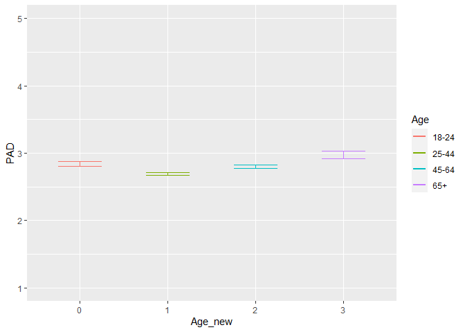
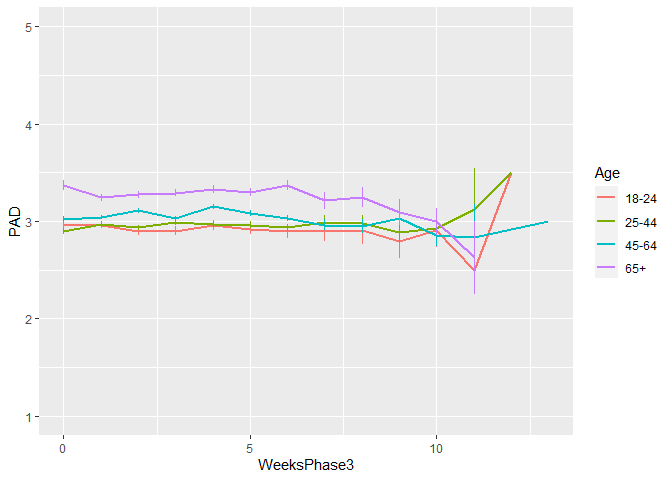
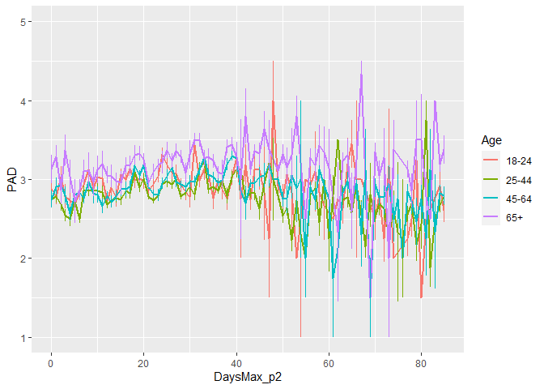
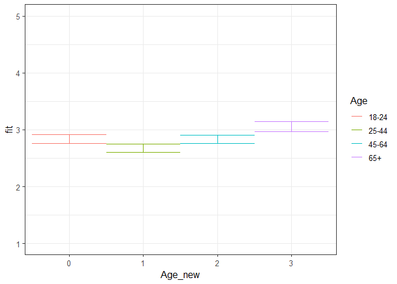
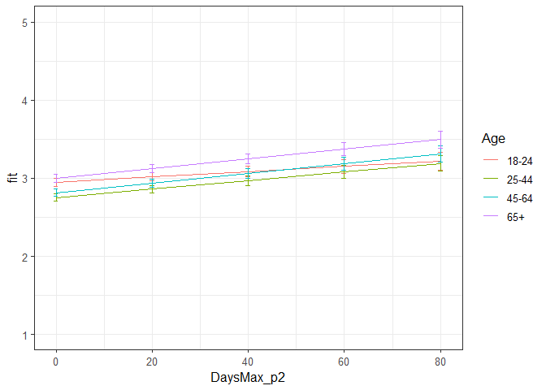
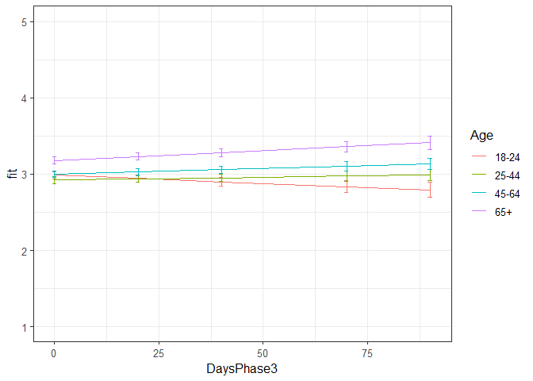

PAD all phases winning models
================
Anne Margit
10/28/2020

    ## [1] ""

``` r
load("data_analyse2_p1.Rdata")
load("data_analyse2_p2.Rdata")
load("data_analyse2_p3.Rdata")
```

This dataset includes:

1.  Data from all weekly measurement waves (baseline through wave 11,
    Time 1 through 12)
2.  Participants who provided at least 3 measurements
3.  Participants who are residents of the country they currently live in
4.  Participants who provided info on age
5.  Participants who provided info on gender (either male or female)
6.  Data from countries with at least 20 participants
7.  Pooled age groups
8.  Imputed missing emotion scores
9.  Combined emotion scores (NAA, NAD, PAA, PAD)
10. An imputed Stringency index (StringencyIndex\_imp)
11. A dummy Str\_dummy with 0 = before the peak, 1 = during peak, 2 =
    after peak
12. A variable indicating the number of days before maximum stringency
    was reached (DaysMax\_p1), during (DaysMax\_p2), and after
    (DaysPhase3)
13. A variable indicating the number of weeks before maximum stringency
    was reached (WeeksMax\_p1), during (WeeksMax\_p2), and after
    (WeeksPhase3)
14. A variable indicating the date on which maximum Stringency was
    reached for that country (DateMaxStr) and the max level reached
    (MaxStr) across the entire measurement period
15. A variable indicating the date on which minimum Stringency was
    reached for that country (DateMinStr) and the min level reached
    (MinStr) across the entire measurement period
16. Observations during which there was a second peak are excluded
    (N=583)

> My comments are in block quotes such as this.

``` r
library(dplyr)
library(tidyverse)
library(ggpubr)
library(ggplot2)
library(rockchalk)
library(effects)
library(nlme)
library(lattice)
library(broom.mixed)
library(purrr)
```

# Descriptives

**Number of participants per age group**

> 0 = 18-24, 1 = 25-44, 3= 45-64, 4= 65+

Phase 1

``` r
data_analyse2_p1 %>%
  group_by(Age_new) %>%
  summarise(NAge = n())
```

    # A tibble: 4 x 2
      Age_new  NAge
      <fct>   <int>
    1 0         695
    2 1        1893
    3 2        1274
    4 3         293

Phase 2

``` r
data_analyse2_p2 %>%
  group_by(Age_new) %>%
  summarise(NAge = n())
```

    # A tibble: 4 x 2
      Age_new  NAge
      <fct>   <int>
    1 0        3677
    2 1       11292
    3 2       10253
    4 3        4366

Phase 3

``` r
data_analyse2_p2 %>%
  group_by(Age_new) %>%
  summarise(NAge = n())
```

    # A tibble: 4 x 2
      Age_new  NAge
      <fct>   <int>
    1 0        3677
    2 1       11292
    3 2       10253
    4 3        4366

**Plots** **Mean PAD against max stringency in WEEKS** Phase 1 (only age
differences)

``` r
plot_PAD1 <- ggplot(data_analyse2_p1, aes(x=Age_new, y=PAD, group = Age_new, color = Age_new))

plot_PAD1 + stat_summary(fun.y=mean, geom="line", size=1)  + geom_errorbar(stat="summary", fun.data="mean_se", width=0.5) + scale_colour_discrete(name = "Age", labels = c("18-24", "25-44", "45-64", "65+")) + expand_limits(y=c(1, 5))
```

<!-- -->

Phase 2

``` r
plot_PAD2 <- ggplot(data_analyse2_p2, aes(x=WeeksMax_p2, y=PAD, group = Age_new, color = Age_new))

plot_PAD2 + stat_summary(fun.y=mean, geom="line", size=1)  + geom_errorbar(stat="summary", fun.data="mean_se", width=0) + scale_colour_discrete(name = "Age", labels = c("18-24", "25-44", "45-64", "65+")) + expand_limits(y=c(1, 5))
```

<!-- -->

Phase 3

``` r
plot_PAD3 <- ggplot(data_analyse2_p3, aes(x=WeeksPhase3, y=PAD, group = Age_new, color = Age_new))

plot_PAD3 + stat_summary(fun.y=mean, geom="line", size=1)  + geom_errorbar(stat="summary", fun.data="mean_se", width=0) + scale_colour_discrete(name = "Age", labels = c("18-24", "25-44", "45-64", "65+")) + expand_limits(y=c(1, 5))
```

<!-- -->

**Mean NAD against max stringency in DAYS** Phase 2

``` r
plot_PAD2 <- ggplot(data_analyse2_p2, aes(x=DaysMax_p2, y=PAD, group = Age_new, color = Age_new))

plot_PAD2 + stat_summary(fun.y=mean, geom="line", size=1)  + geom_errorbar(stat="summary", fun.data="mean_se", width=0) + scale_colour_discrete(name = "Age", labels = c("18-24", "25-44", "45-64", "65+")) + expand_limits(y=c(1, 5))
```

<!-- -->

Phase 3

``` r
plot_PAD3 <- ggplot(data_analyse2_p3, aes(x=DaysPhase3, y=PAD, group = Age_new, color = Age_new))

plot_PAD3 + stat_summary(fun.y=mean, geom="line", size=1)  + geom_errorbar(stat="summary", fun.data="mean_se", width=0) + scale_colour_discrete(name = "Age", labels = c("18-24", "25-44", "45-64", "65+")) + expand_limits(y=c(1, 5))
```

<!-- -->

# Phase 1

*Random: IC for ID and Country + Covariates Gender and Education*

> Gender: Male = 0, Female = 1

> Edu: 0= Primary education, 1= General secondary education, 2=
> Vocational education, 3= Higher education, 4= Bachelors degree, 5=
> Masters degree, 6= PhD degree

``` r
model_PADp1 <- lme(fixed = PAD ~ Gender + Edu + Age_new,
                  random = ~1 | Country/ID, 
                  data = data_analyse2_p1, 
                  na.action = na.omit)

summary(model_PADp1)
```

    Linear mixed-effects model fit by REML
     Data: data_analyse2_p1 
          AIC      BIC    logLik
      10930.9 11019.51 -5451.449
    
    Random effects:
     Formula: ~1 | Country
            (Intercept)
    StdDev:   0.2790563
    
     Formula: ~1 | ID %in% Country
            (Intercept)  Residual
    StdDev:   0.6859329 0.6537949
    
    Fixed effects: PAD ~ Gender + Edu + Age_new 
                     Value  Std.Error   DF   t-value p-value
    (Intercept)  2.9514095 0.28413218 2711 10.387452  0.0000
    Gender1     -0.2755191 0.03754135 2711 -7.339084  0.0000
    Edu2         0.0481896 0.27732523 2711  0.173766  0.8621
    Edu3         0.0434564 0.27816191 2711  0.156227  0.8759
    Edu4         0.0423974 0.27433381 2711  0.154547  0.8772
    Edu5         0.0811591 0.27335345 2711  0.296902  0.7666
    Edu6         0.1287394 0.27443030 2711  0.469115  0.6390
    Edu7         0.0687973 0.28071581 2711  0.245078  0.8064
    Age_new1    -0.1653915 0.05279381 2711 -3.132781  0.0018
    Age_new2    -0.0097262 0.05585188 2711 -0.174143  0.8618
    Age_new3     0.2182651 0.07875315 2711  2.771509  0.0056
     Correlation: 
             (Intr) Gendr1 Edu2   Edu3   Edu4   Edu5   Edu6   Edu7   Ag_nw1 Ag_nw2
    Gender1  -0.060                                                               
    Edu2     -0.939 -0.043                                                        
    Edu3     -0.932 -0.051  0.956                                                 
    Edu4     -0.948 -0.050  0.970  0.967                                          
    Edu5     -0.950 -0.051  0.973  0.970  0.983                                   
    Edu6     -0.943 -0.056  0.968  0.966  0.980  0.984                            
    Edu7     -0.922 -0.049  0.947  0.944  0.958  0.962  0.960                     
    Age_new1 -0.160  0.077  0.046  0.027  0.039  0.018 -0.006 -0.012              
    Age_new2 -0.145  0.127  0.024  0.006  0.023  0.006 -0.009 -0.020  0.718       
    Age_new3 -0.117  0.183  0.018  0.011  0.019  0.005 -0.002 -0.003  0.497  0.502
    
    Standardized Within-Group Residuals:
           Min         Q1        Med         Q3        Max 
    -2.9073071 -0.5215795  0.0126522  0.5542151  3.0728295 
    
    Number of Observations: 4155
    Number of Groups: 
            Country ID %in% Country 
                 26            2747 

*Confidence intervals*

``` r
intervals(model_PADp1)
```

    Approximate 95% confidence intervals
    
     Fixed effects:
                     lower         est.       upper
    (Intercept)  2.3942719  2.951409457  3.50854704
    Gender1     -0.3491316 -0.275519091 -0.20190654
    Edu2        -0.4956007  0.048189570  0.59197981
    Edu3        -0.5019744  0.043456443  0.58888729
    Edu4        -0.4955272  0.042397378  0.58032192
    Edu5        -0.4548431  0.081159104  0.61716133
    Edu6        -0.4093744  0.128739382  0.66685314
    Edu7        -0.4816413  0.068797301  0.61923593
    Age_new1    -0.2689117 -0.165391477 -0.06187128
    Age_new2    -0.1192428 -0.009726234  0.09979033
    Age_new3     0.0638428  0.218265078  0.37268735
    attr(,"label")
    [1] "Fixed effects:"
    
     Random Effects:
      Level: Country 
                        lower      est.     upper
    sd((Intercept)) 0.1910141 0.2790563 0.4076787
      Level: ID 
                       lower      est.     upper
    sd((Intercept)) 0.652296 0.6859329 0.7213043
    
     Within-group standard error:
        lower      est.     upper 
    0.6305002 0.6537949 0.6779503 

*Plot of predicted values*

``` r
ef_PADp1 <- effect("Age_new", model_PADp1)

plot_PADp1 <- ggplot(as.data.frame(ef_PADp1), 
       aes(Age_new, fit, color=Age_new)) + geom_line() + 
  geom_errorbar(aes(ymin=fit-se, ymax=fit+se), width=1) + theme_bw(base_size=12) + scale_color_discrete(name="Age", labels = c("18-24", "25-44", "45-64", "65+")) + expand_limits(y=c(1, 5))
```

``` r
plot_PADp1
```

<!-- -->

*Effect sizes*

``` r
ISDs <- data_analyse2_p1 %>% 
  group_by(ID) %>%
  summarize_at(c("PAD"), sd, na.rm=TRUE) %>%
  ungroup()

ISDs_av <- ISDs %>%
  summarize_at(c("PAD"), mean, na.rm=TRUE) %>%
  stack() %>%
  rename(sd=values) 
```

> Effect size = regression coefficient / average ISD of PAD

``` r
coef_PADp1 = tidy(model_PADp1, 
               effects = "fixed")

coef_PADp1 <- coef_PADp1 %>%
  mutate (e_size = estimate/0.467823) %>% 
  mutate(across(2:7, round, 4)) 
```

``` r
coef_PADp1
```

    ## # A tibble: 11 x 7
    ##    term        estimate std.error    df statistic p.value  e_size
    ##    <chr>          <dbl>     <dbl> <dbl>     <dbl>   <dbl>   <dbl>
    ##  1 (Intercept)   2.95      0.284   2711    10.4    0       6.31  
    ##  2 Gender1      -0.276     0.0375  2711    -7.34   0      -0.589 
    ##  3 Edu2          0.0482    0.277   2711     0.174  0.862   0.103 
    ##  4 Edu3          0.0435    0.278   2711     0.156  0.876   0.0929
    ##  5 Edu4          0.0424    0.274   2711     0.154  0.877   0.0906
    ##  6 Edu5          0.0812    0.273   2711     0.297  0.767   0.174 
    ##  7 Edu6          0.129     0.274   2711     0.469  0.639   0.275 
    ##  8 Edu7          0.0688    0.281   2711     0.245  0.806   0.147 
    ##  9 Age_new1     -0.165     0.0528  2711    -3.13   0.0018 -0.354 
    ## 10 Age_new2     -0.0097    0.0559  2711    -0.174  0.862  -0.0208
    ## 11 Age_new3      0.218     0.0788  2711     2.77   0.0056  0.467

# Phase 2

*Best model*

> Random intercept for ID and Country, random slope for ID and country,
> no correlation between IC and S for ID and country + AR correlation
> structure at Measurement level

``` r
data_analyse2_p2 <- data_analyse2_p2[with(data_analyse2_p2, order(Country, ID, Time)),]
data_analyse2_p2$Time <- as.numeric(data_analyse2_p2$Time)

model_PADp2 <- lme(fixed = PAD ~ Gender + Edu + DaysMax_p2 + Age_new + DaysMax_p2*Age_new,
                  random = list(Country= pdDiag(~DaysMax_p2), ID = pdDiag(~DaysMax_p2)), 
                  data = data_analyse2_p2, 
                  na.action = na.omit,
                  correlation = corAR1(form = ~ Time | Country/ID))

summary(model_PADp2)
```

    Linear mixed-effects model fit by REML
     Data: data_analyse2_p2 
           AIC      BIC    logLik
      68455.87 68630.04 -34206.93
    
    Random effects:
     Formula: ~DaysMax_p2 | Country
     Structure: Diagonal
            (Intercept) DaysMax_p2
    StdDev:   0.2197006 0.00469759
    
     Formula: ~DaysMax_p2 | ID %in% Country
     Structure: Diagonal
            (Intercept)  DaysMax_p2 Residual
    StdDev:   0.7109467 0.005719457 0.608193
    
    Correlation Structure: ARMA(1,0)
     Formula: ~Time | Country/ID 
     Parameter estimate(s):
         Phi1 
    0.2160288 
    Fixed effects: PAD ~ Gender + Edu + DaysMax_p2 + Age_new + DaysMax_p2 * Age_new 
                             Value  Std.Error    DF    t-value p-value
    (Intercept)          2.9913631 0.10461711 20356  28.593441  0.0000
    Gender1             -0.2699346 0.01914879  9171 -14.096695  0.0000
    Edu2                 0.0462716 0.09308141  9171   0.497109  0.6191
    Edu3                 0.1481195 0.09363763  9171   1.581837  0.1137
    Edu4                 0.1082970 0.09164781  9171   1.181665  0.2374
    Edu5                 0.1621950 0.09095273  9171   1.783289  0.0746
    Edu6                 0.1939195 0.09165820  9171   2.115681  0.0344
    Edu7                 0.2069861 0.09510617  9171   2.176369  0.0296
    DaysMax_p2           0.0033683 0.00143972 20356   2.339565  0.0193
    Age_new1            -0.2013353 0.03693227  9171  -5.451473  0.0000
    Age_new2            -0.1375313 0.03793671  9171  -3.625283  0.0003
    Age_new3             0.0501142 0.04578682  9171   1.094512  0.2738
    DaysMax_p2:Age_new1  0.0021482 0.00105748 20356   2.031478  0.0422
    DaysMax_p2:Age_new2  0.0028091 0.00107829 20356   2.605126  0.0092
    DaysMax_p2:Age_new3  0.0028000 0.00122838 20356   2.279427  0.0227
     Correlation: 
                        (Intr) Gendr1 Edu2   Edu3   Edu4   Edu5   Edu6   Edu7   DysM_2 Ag_nw1 Ag_nw2 Ag_nw3 DM_2:A_1 DM_2:A_2
    Gender1             -0.131                                                                                               
    Edu2                -0.836 -0.014                                                                                        
    Edu3                -0.817 -0.012  0.918                                                                                 
    Edu4                -0.842 -0.020  0.938  0.932                                                                          
    Edu5                -0.845 -0.012  0.944  0.936  0.958                                                                   
    Edu6                -0.830 -0.027  0.936  0.932  0.952  0.960                                                            
    Edu7                -0.800 -0.017  0.901  0.897  0.916  0.923  0.920                                                     
    DaysMax_p2          -0.129  0.004  0.005  0.003  0.002  0.001  0.002  0.004                                              
    Age_new1            -0.250  0.045  0.040  0.002  0.020 -0.003 -0.037 -0.033  0.296                                       
    Age_new2            -0.249  0.074  0.034 -0.008  0.019  0.005 -0.017 -0.024  0.285  0.756                                
    Age_new3            -0.236  0.141  0.045  0.012  0.035  0.023  0.005  0.006  0.237  0.631  0.637                         
    DaysMax_p2:Age_new1  0.144  0.001 -0.008 -0.007 -0.002 -0.001  0.000 -0.001 -0.539 -0.568 -0.450 -0.375                  
    DaysMax_p2:Age_new2  0.140  0.001 -0.007 -0.006  0.000  0.000  0.002  0.002 -0.526 -0.454 -0.588 -0.379  0.813           
    DaysMax_p2:Age_new3  0.128 -0.007 -0.010 -0.009 -0.004 -0.003 -0.004 -0.003 -0.464 -0.399 -0.401 -0.605  0.716    0.715  
    
    Standardized Within-Group Residuals:
            Min          Q1         Med          Q3         Max 
    -4.75336791 -0.52884149  0.04241411  0.55556520  4.51692552 
    
    Number of Observations: 29574
    Number of Groups: 
            Country ID %in% Country 
                 33            9214 

*Confidence intervals*

``` r
intervals(model_PADp2, which = 'fixed')
```

    Approximate 95% confidence intervals
    
     Fixed effects:
                                lower         est.        upper
    (Intercept)          2.786305e+00  2.991363088  3.196421043
    Gender1             -3.074705e-01 -0.269934625 -0.232398736
    Edu2                -1.361887e-01  0.046271589  0.228731890
    Edu3                -3.543113e-02  0.148119473  0.331670072
    Edu4                -7.135310e-02  0.108297014  0.287947125
    Edu5                -1.609261e-02  0.162195001  0.340482610
    Edu6                 1.424906e-02  0.193919532  0.373590008
    Edu7                 2.055686e-02  0.206986137  0.393415413
    DaysMax_p2           5.463505e-04  0.003368312  0.006190273
    Age_new1            -2.737308e-01 -0.201335307 -0.128939826
    Age_new2            -2.118957e-01 -0.137531325 -0.063166920
    Age_new3            -3.963812e-02  0.050114239  0.139866599
    DaysMax_p2:Age_new1  7.550105e-05  0.002148243  0.004220985
    DaysMax_p2:Age_new2  6.955455e-04  0.002809080  0.004922615
    DaysMax_p2:Age_new3  3.922769e-04  0.002799992  0.005207706
    attr(,"label")
    [1] "Fixed effects:"

*Plot of predicted values*

``` r
ef_PADp2 <- effect("DaysMax_p2:Age_new", model_PADp2)

plot_PADp2 <- ggplot(as.data.frame(ef_PADp2), 
       aes(DaysMax_p2, fit, color=Age_new)) + geom_line() + 
  geom_errorbar(aes(ymin=fit-se, ymax=fit+se), width=1) + theme_bw(base_size=12) + scale_color_discrete(name="Age", labels = c("18-24", "25-44", "45-64", "65+")) + expand_limits(y=c(1, 5))
```

``` r
plot_PADp2
```

<!-- -->

*Effect sizes* **Within person SD and average within person SD**

``` r
ISDs <- data_analyse2_p2 %>% 
  group_by(ID) %>%
  summarize_at(c("DaysMax_p2", "PAD"), sd, na.rm=TRUE) %>%
  ungroup()

ISDs_av <- ISDs %>%
  summarize_at(c("DaysMax_p2", "PAD"), mean, na.rm=TRUE) %>%
  stack() %>%
  rename(sd=values) 
```

> Effect sizes for intercept and main effect of age and covariates =
> regression coefficient / average ISD of PAD Effect size for main
> effect of DaysMax = (regression coefficient \* 28)/ average ISD of PAD
> Effect sizes for interaction effects = (regression coefficient \* 28)/
> average ISD of PAD

> The effect sizes for main effect of DaysMax and the interaction
> effects reflect the increase in SD of PAD over 4 weeks (28 days)

``` r
coef_PADp2 = tidy(model_PADp2, 
               effects = "fixed")

coef_PADp2 <- coef_PADp2 %>%
  mutate(e_size = ifelse(row_number()== 1 | row_number()== 2 |  row_number()== 3 |  row_number()== 4 |  row_number()== 5
                          |  row_number()== 6 |  row_number()== 7 |  row_number()== 8  |  row_number()== 10  
                          |  row_number()== 11  |  row_number()== 12, 
                          estimate/0.5049948, (estimate*28)/0.5049948)) %>%
  mutate(across(2:7, round, 4)) 
```

``` r
coef_PADp2
```

    ## # A tibble: 15 x 7
    ##    term                estimate std.error    df statistic  p.value  e_size
    ##    <chr>                  <dbl>     <dbl> <dbl>     <dbl>    <dbl>   <dbl>
    ##  1 (Intercept)           2.99     0.105   20356    28.6   0         5.92  
    ##  2 Gender1              -0.270    0.0191   9171   -14.1   0        -0.534 
    ##  3 Edu2                  0.0463   0.0931   9171     0.497 0.619     0.0916
    ##  4 Edu3                  0.148    0.0936   9171     1.58  0.114     0.293 
    ##  5 Edu4                  0.108    0.0916   9171     1.18  0.237     0.214 
    ##  6 Edu5                  0.162    0.091    9171     1.78  0.0746    0.321 
    ##  7 Edu6                  0.194    0.0917   9171     2.12  0.0344    0.384 
    ##  8 Edu7                  0.207    0.0951   9171     2.18  0.0296    0.410 
    ##  9 DaysMax_p2            0.0034   0.0014  20356     2.34  0.0193    0.187 
    ## 10 Age_new1             -0.201    0.0369   9171    -5.45  0        -0.399 
    ## 11 Age_new2             -0.138    0.0379   9171    -3.63  0.000300 -0.272 
    ## 12 Age_new3              0.0501   0.0458   9171     1.09  0.274     0.0992
    ## 13 DaysMax_p2:Age_new1   0.0021   0.0011  20356     2.03  0.0422    0.119 
    ## 14 DaysMax_p2:Age_new2   0.0028   0.0011  20356     2.61  0.0092    0.156 
    ## 15 DaysMax_p2:Age_new3   0.0028   0.00120 20356     2.28  0.0227    0.155

> PAD increases over time in the youngest age group (main effect), and
> also increases in the older groups but faster (interaction effect).
> Compared to the youngest age group, older groups report lower PAD on
> the first day of max stringency, except for the oldest age group (main
> effect). Women report lower PAD compared to men, and higher educated
> people report higher PAD compared to lower educated people.

# Phase 3

> Random: IC for ID and Country, S for ID and country, no correlation
> between IC and S for ID and country + AR

``` r
data_analyse2_p3 <- data_analyse2_p3[with(data_analyse2_p3, order(Country, ID, Time)),]
data_analyse2_p3$Time <- as.numeric(data_analyse2_p3$Time)

model_PADp3 <- lme(fixed = PAD ~ Gender + Edu + DaysPhase3 + Age_new + DaysPhase3*Age_new,
                  random = list(Country = pdDiag(~DaysPhase3), ID = pdDiag(~DaysPhase3)),
                  data = data_analyse2_p3, 
                  na.action = na.omit,
                  correlation = corAR1(form = ~ Time | Country/ID))

summary(model_PADp3)
```

    Linear mixed-effects model fit by REML
     Data: data_analyse2_p3 
           AIC      BIC    logLik
      57051.38 57222.02 -28504.69
    
    Random effects:
     Formula: ~DaysPhase3 | Country
     Structure: Diagonal
            (Intercept)  DaysPhase3
    StdDev:   0.2092735 0.002267202
    
     Formula: ~DaysPhase3 | ID %in% Country
     Structure: Diagonal
            (Intercept)  DaysPhase3  Residual
    StdDev:   0.7278163 0.006380194 0.6010976
    
    Correlation Structure: ARMA(1,0)
     Formula: ~Time | Country/ID 
     Parameter estimate(s):
         Phi1 
    0.1605841 
    Fixed effects: PAD ~ Gender + Edu + DaysPhase3 + Age_new + DaysPhase3 * Age_new 
                             Value  Std.Error    DF    t-value p-value
    (Intercept)          2.8458023 0.13170119 17940  21.608022  0.0000
    Gender1             -0.2506069 0.02189499  7004 -11.445857  0.0000
    Edu2                 0.2372391 0.12288184  7004   1.930627  0.0536
    Edu3                 0.3031999 0.12277212  7004   2.469615  0.0135
    Edu4                 0.2550518 0.12164011  7004   2.096774  0.0360
    Edu5                 0.3303025 0.12140655  7004   2.720632  0.0065
    Edu6                 0.3325172 0.12218130  7004   2.721506  0.0065
    Edu7                 0.3976600 0.12565104  7004   3.164797  0.0016
    DaysPhase3          -0.0021068 0.00114165 17940  -1.845352  0.0650
    Age_new1            -0.0625211 0.04120078  7004  -1.517473  0.1292
    Age_new2             0.0118315 0.04059249  7004   0.291471  0.7707
    Age_new3             0.1967399 0.04657342  7004   4.224296  0.0000
    DaysPhase3:Age_new1  0.0028482 0.00119847 17940   2.376565  0.0175
    DaysPhase3:Age_new2  0.0036383 0.00117346 17940   3.100539  0.0019
    DaysPhase3:Age_new3  0.0046667 0.00130897 17940   3.565152  0.0004
     Correlation: 
                        (Intr) Gendr1 Edu2   Edu3   Edu4   Edu5   Edu6   Edu7   DysPh3 Ag_nw1 Ag_nw2 Ag_nw3 DP3:A_1 DP3:A_2
    Gender1             -0.140                                                                                             
    Edu2                -0.896  0.008                                                                                      
    Edu3                -0.888  0.011  0.946                                                                               
    Edu4                -0.902  0.001  0.955  0.956                                                                        
    Edu5                -0.903  0.006  0.958  0.958  0.968                                                                 
    Edu6                -0.891 -0.001  0.951  0.953  0.963  0.967                                                          
    Edu7                -0.864  0.002  0.923  0.925  0.934  0.937  0.935                                                   
    DaysPhase3          -0.123 -0.004  0.001  0.000  0.001 -0.001 -0.001  0.000                                            
    Age_new1            -0.233  0.050  0.042  0.010  0.024  0.005 -0.026 -0.023  0.377                                     
    Age_new2            -0.247  0.104  0.038  0.003  0.026  0.015 -0.001 -0.010  0.383  0.755                              
    Age_new3            -0.259  0.181  0.063  0.036  0.055  0.044  0.034  0.032  0.338  0.662  0.706                       
    DaysPhase3:Age_new1  0.115  0.000 -0.003 -0.001 -0.004 -0.001 -0.002 -0.002 -0.775 -0.487 -0.374 -0.328                
    DaysPhase3:Age_new2  0.116  0.002 -0.001  0.000 -0.002  0.000  0.000  0.000 -0.795 -0.376 -0.488 -0.343  0.775         
    DaysPhase3:Age_new3  0.104  0.000  0.001  0.002 -0.001  0.001  0.001  0.000 -0.723 -0.339 -0.353 -0.482  0.699   0.733 
    
    Standardized Within-Group Residuals:
            Min          Q1         Med          Q3         Max 
    -4.99058295 -0.51510000  0.06391476  0.53876854  3.74933708 
    
    Number of Observations: 24990
    Number of Groups: 
            Country ID %in% Country 
                 32            7046 

*Confidence intervals*

``` r
intervals(model_PADp3, which = 'fixed')
```

    Approximate 95% confidence intervals
    
     Fixed effects:
                                lower         est.         upper
    (Intercept)          2.5876552797  2.845802295  3.1039493100
    Gender1             -0.2935277464 -0.250606935 -0.2076861230
    Edu2                -0.0036465587  0.237239059  0.4781246765
    Edu3                 0.0625293386  0.303199871  0.5438704029
    Edu4                 0.0166003385  0.255051784  0.4935032302
    Edu5                 0.0923089259  0.330302513  0.5682961000
    Edu6                 0.0930048452  0.332517181  0.5720295164
    Edu7                 0.1513459355  0.397660011  0.6439740872
    DaysPhase3          -0.0043445069 -0.002106754  0.0001309982
    Age_new1            -0.1432870630 -0.062521070  0.0182449235
    Age_new2            -0.0677420246  0.011831548  0.0914051205
    Age_new3             0.1054419041  0.196739915  0.2880379259
    DaysPhase3:Age_new1  0.0004991235  0.002848231  0.0051973390
    DaysPhase3:Age_new2  0.0013382597  0.003638348  0.0059384359
    DaysPhase3:Age_new3  0.0021009725  0.004666684  0.0072323946
    attr(,"label")
    [1] "Fixed effects:"

*Plot of predicted values*

``` r
ef_PADp3 <- effect("DaysPhase3:Age_new", model_PADp3)

plot_PADp3 <- ggplot(as.data.frame(ef_PADp3), 
       aes(DaysPhase3, fit, color=Age_new)) + geom_line() + 
  geom_errorbar(aes(ymin=fit-se, ymax=fit+se), width=1) + theme_bw(base_size=12) + scale_color_discrete(name="Age", labels = c("18-24", "25-44", "45-64", "65+")) + expand_limits(y=c(1, 5))
```

``` r
plot_PADp3
```

<!-- -->

*Effect sizes* **Within person SD and average within person SD for PAD**

``` r
ISDs <- data_analyse2_p3 %>% 
  group_by(ID) %>%
  summarize_at(c("PAD"), sd, na.rm=TRUE) %>%
  ungroup()

ISDs_av <- ISDs %>%
  summarize_at(c("PAD"), mean, na.rm=TRUE) %>%
  stack() %>%
  rename(sd=values) 
```

> Effect sizes for intercept and main effect of age = regression
> coefficient / average ISD of PAD Effect size for main effect of
> DaysMax = (regression coefficient \* 28)/ average ISD of PAD Effect
> sizes for interaction effects = (regression coefficient \* 28)/
> average ISD of PAD

> The effect sizes for main effect of DaysMax and the interaction
> effects reflect the increase in SD of PAD over 4 weeks (28 days)

``` r
coef_PADp3 = tidy(model_PADp3, 
               effects = "fixed")

coef_PADp3 <- coef_PADp3 %>%
 mutate(e_size = ifelse(row_number()== 1 | row_number()== 2 |  row_number()== 3 |  row_number()== 4 |  row_number()== 5
                          |  row_number()== 6 |  row_number()== 7 |  row_number()== 8  |  row_number()== 10  
                          |  row_number()== 11  |  row_number()== 12, 
                          estimate/0.493802, (estimate*28)/0.493802)) %>%
  mutate(across(2:7, round, 4)) 
```

``` r
coef_PADp3
```

    ## # A tibble: 15 x 7
    ##    term                estimate std.error    df statistic p.value e_size
    ##    <chr>                  <dbl>     <dbl> <dbl>     <dbl>   <dbl>  <dbl>
    ##  1 (Intercept)           2.85     0.132   17940    21.6    0       5.76 
    ##  2 Gender1              -0.251    0.0219   7004   -11.4    0      -0.507
    ##  3 Edu2                  0.237    0.123    7004     1.93   0.0536  0.480
    ##  4 Edu3                  0.303    0.123    7004     2.47   0.0135  0.614
    ##  5 Edu4                  0.255    0.122    7004     2.10   0.036   0.516
    ##  6 Edu5                  0.330    0.121    7004     2.72   0.0065  0.669
    ##  7 Edu6                  0.332    0.122    7004     2.72   0.0065  0.673
    ##  8 Edu7                  0.398    0.126    7004     3.16   0.0016  0.805
    ##  9 DaysPhase3           -0.0021   0.0011  17940    -1.85   0.065  -0.120
    ## 10 Age_new1             -0.0625   0.0412   7004    -1.52   0.129  -0.127
    ## 11 Age_new2              0.0118   0.0406   7004     0.292  0.771   0.024
    ## 12 Age_new3              0.197    0.0466   7004     4.22   0       0.398
    ## 13 DaysPhase3:Age_new1   0.0028   0.00120 17940     2.38   0.0175  0.162
    ## 14 DaysPhase3:Age_new2   0.0036   0.00120 17940     3.10   0.0019  0.206
    ## 15 DaysPhase3:Age_new3   0.0047   0.0013  17940     3.57   0.0004  0.265

> PAD seems to decrease over time in the youngest group but not
> significant (main effect), whereas it increases over time in the older
> age groups (interaction effect) very slightly. There are no age
> differences in PAD on the first day stringency reduces again after the
> peak, except for the oldest age group which reports higher PAD (main
> effect). Women report lower PAD, higher educated groups report higher
> PAD.
