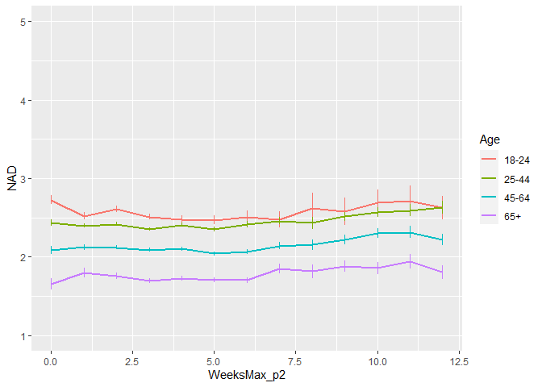
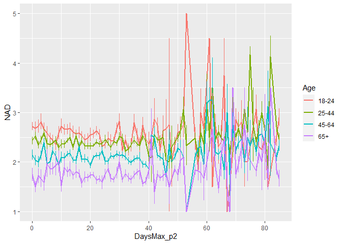
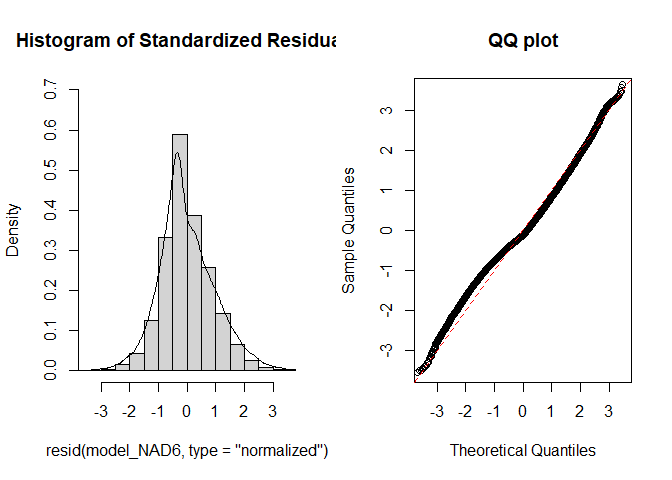
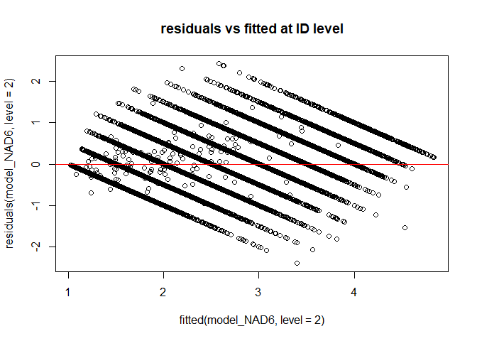
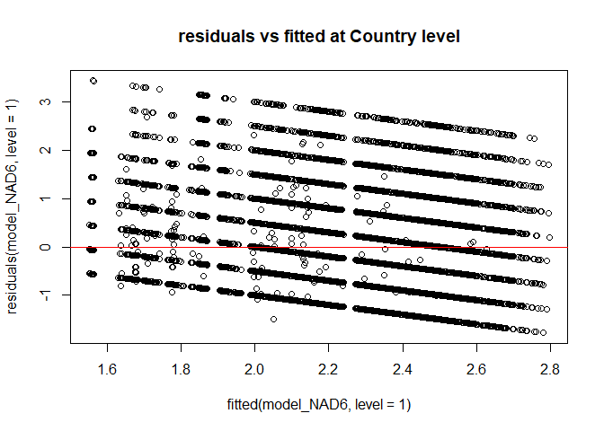
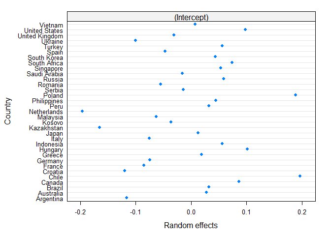
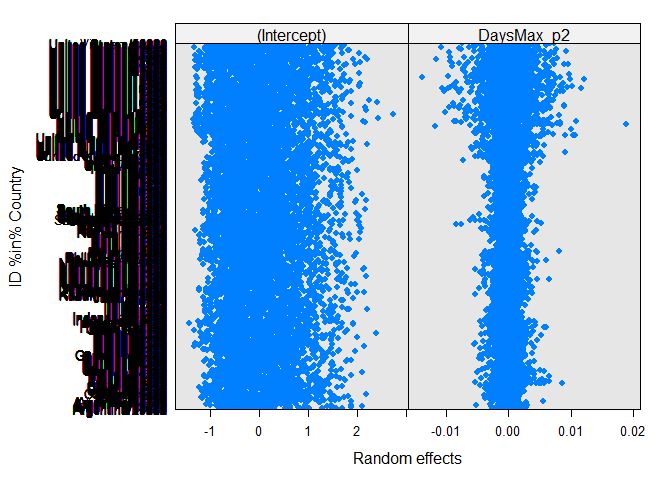
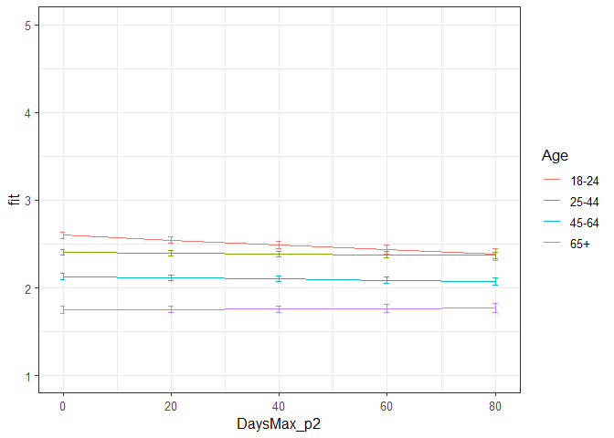

Second analyses NAD Phase 2
================
Anne Margit
10/14/2020

    ## [1] ""

``` r
load("data_analyse2_p2.Rdata")
```

This dataset includes:

1.  Data from all weekly measurement waves (baseline through wave 11,
    Time 1 through 12)
2.  Participants who provided at least 3 measurements
3.  Participants who are residents of the country they currently live in
4.  Participants who provided info on age
5.  Participants who provided info on gender (either male or female)
6.  Data from countries with at least 20 participants
7.  Pooled age groups
8.  Imputed missing emotion scores
9.  Combined emotion scores (NAA, NAD, PAA, PAD)
10. An imputed Stringency index (StringencyIndex\_imp)
11. A variable indicating the number of days before and after the day on
    which maximum stringency was reached for the respective country
    (DaysMax)
12. A variable indicating the number of weeks before and after the day
    on which maximum stringency was reached for the respective country
    (WeeksMax)
13. A variable indicating the date on which maximum Stringency was
    reached for that country (DateMaxStr)
14. A dummy Str\_dummy with 0 = before the peaj, 1 = during peak, 2 =
    after peak
15. Observations during which there was a second peak are excluded
    (N=583)

> My comments are in block quotes such as this.

``` r
library(dplyr)
library(tidyverse)
library(ggpubr)
library(ggplot2)
library(rockchalk)
library(effects)
library(nlme)
library(lattice)
library(broom.mixed)
library(purrr)
```

# Descriptives

**Number of participants per age group**

``` r
data_analyse2_p2 %>%
  group_by(Age_new) %>%
  summarise(NAge = n())
```

    # A tibble: 4 x 2
      Age_new  NAge
      <fct>   <int>
    1 0        3645
    2 1       11159
    3 2       10144
    4 3        4341

**Plots** **Mean NAD against max stringency in WEEKS**

``` r
plot_NAD <- ggplot(data_analyse2_p2, aes(x=WeeksMax_p2, y=NAD, group = Age_new, color = Age_new))

plot_NAD + stat_summary(fun.y=mean, geom="line", size=1)  + geom_errorbar(stat="summary", fun.data="mean_se", width=0) + scale_colour_discrete(name = "Age", labels = c("18-24", "25-44", "45-64", "65+")) + expand_limits(y=c(1, 5))
```

<!-- -->

**Mean NAD against max stringency in DAYS**

``` r
plot_NAD <- ggplot(data_analyse2_p2, aes(x=DaysMax_p2, y=NAD, group = Age_new, color = Age_new))

plot_NAD + stat_summary(fun.y=mean, geom="line", size=1)  + geom_errorbar(stat="summary", fun.data="mean_se", width=0) + scale_colour_discrete(name = "Age", labels = c("18-24", "25-44", "45-64", "65+")) + expand_limits(y=c(1, 5))
```

<!-- -->

# Regression models phase 2

**Negative affect high arousal**

*Predictors: DaysMax\_p2, Age, Random: IC for Country*

``` r
model_NAD1 <- lme(fixed = NAD ~ DaysMax_p2 + Age_new + DaysMax_p2*Age_new,
                   random = ~1 | Country, 
                  data = data_analyse2_p2, 
                  na.action = na.omit)

summary(model_NAD1)
```

    Linear mixed-effects model fit by REML
     Data: data_analyse2_p2 
          AIC      BIC    logLik
      81857.5 81940.34 -40918.75
    
    Random effects:
     Formula: ~1 | Country
            (Intercept)  Residual
    StdDev:   0.1321048 0.9768451
    
    Fixed effects: NAD ~ DaysMax_p2 + Age_new + DaysMax_p2 * Age_new 
                             Value  Std.Error    DF   t-value p-value
    (Intercept)          2.5847899 0.03868006 29235  66.82487  0.0000
    DaysMax_p2          -0.0019370 0.00106027 29235  -1.82691  0.0677
    Age_new1            -0.2092488 0.03365501 29235  -6.21747  0.0000
    Age_new2            -0.4835197 0.03521704 29235 -13.72971  0.0000
    Age_new3            -0.8303583 0.04301547 29235 -19.30371  0.0000
    DaysMax_p2:Age_new1  0.0026724 0.00115218 29235   2.31947  0.0204
    DaysMax_p2:Age_new2  0.0023421 0.00116649 29235   2.00784  0.0447
    DaysMax_p2:Age_new3  0.0022381 0.00131445 29235   1.70266  0.0886
     Correlation: 
                        (Intr) DysM_2 Ag_nw1 Ag_nw2 Ag_nw3 DM_2:A_1 DM_2:A_2
    DaysMax_p2          -0.593                                              
    Age_new1            -0.640  0.711                                       
    Age_new2            -0.616  0.688  0.734                                
    Age_new3            -0.506  0.563  0.603  0.597                         
    DaysMax_p2:Age_new1  0.542 -0.889 -0.814 -0.614 -0.504                  
    DaysMax_p2:Age_new2  0.537 -0.884 -0.635 -0.818 -0.508  0.805           
    DaysMax_p2:Age_new3  0.476 -0.785 -0.565 -0.551 -0.827  0.715    0.712  
    
    Standardized Within-Group Residuals:
           Min         Q1        Med         Q3        Max 
    -1.8391172 -0.7754085 -0.1917947  0.6623084  3.5467797 
    
    Number of Observations: 29275
    Number of Groups: 33 

*Predictors: DaysMax\_p1, Age, Random: IC for ID*

``` r
model_NAD2 <- lme(fixed = NAD ~ DaysMax_p2 + Age_new + DaysMax_p2*Age_new,
                  random = ~1 | ID, 
                 data = data_analyse2_p2, 
                 na.action = na.omit)

summary(model_NAD2)
```

    Linear mixed-effects model fit by REML
     Data: data_analyse2_p2 
           AIC      BIC    logLik
      68103.53 68186.37 -34041.76
    
    Random effects:
     Formula: ~1 | ID
            (Intercept)  Residual
    StdDev:    0.786534 0.5830565
    
    Fixed effects: NAD ~ DaysMax_p2 + Age_new + DaysMax_p2 * Age_new 
                             Value  Std.Error    DF   t-value p-value
    (Intercept)          2.5908181 0.02993910 20144  86.53628  0.0000
    DaysMax_p2          -0.0022772 0.00080535 20144  -2.82757  0.0047
    Age_new1            -0.1893398 0.03465763  9123  -5.46315  0.0000
    Age_new2            -0.4787330 0.03535610  9123 -13.54032  0.0000
    Age_new3            -0.8756203 0.04237249  9123 -20.66483  0.0000
    DaysMax_p2:Age_new1  0.0022851 0.00089034 20144   2.56650  0.0103
    DaysMax_p2:Age_new2  0.0019041 0.00089808 20144   2.12019  0.0340
    DaysMax_p2:Age_new3  0.0028768 0.00101692 20144   2.82891  0.0047
     Correlation: 
                        (Intr) DysM_2 Ag_nw1 Ag_nw2 Ag_nw3 DM_2:A_1 DM_2:A_2
    DaysMax_p2          -0.534                                              
    Age_new1            -0.864  0.462                                       
    Age_new2            -0.847  0.453  0.731                                
    Age_new3            -0.707  0.378  0.610  0.598                         
    DaysMax_p2:Age_new1  0.483 -0.905 -0.530 -0.409 -0.342                  
    DaysMax_p2:Age_new2  0.479 -0.897 -0.414 -0.541 -0.339  0.811           
    DaysMax_p2:Age_new3  0.423 -0.792 -0.366 -0.358 -0.564  0.716    0.710  
    
    Standardized Within-Group Residuals:
           Min         Q1        Med         Q3        Max 
    -4.2637661 -0.5254780 -0.1109981  0.5079524  5.3538319 
    
    Number of Observations: 29275
    Number of Groups: 9127 

*Random: IC for ID and Country*

``` r
model_NAD3 <- lme(fixed = NAD ~ DaysMax_p2 + Age_new + DaysMax_p2*Age_new,
                  random = ~1 | Country/ID, 
                  data = data_analyse2_p2, 
                  na.action = na.omit)

summary(model_NAD3)
```

    Linear mixed-effects model fit by REML
     Data: data_analyse2_p2 
           AIC      BIC    logLik
      68022.15 68113.28 -34000.08
    
    Random effects:
     Formula: ~1 | Country
            (Intercept)
    StdDev:   0.1159792
    
     Formula: ~1 | ID %in% Country
            (Intercept)  Residual
    StdDev:   0.7798951 0.5830946
    
    Fixed effects: NAD ~ DaysMax_p2 + Age_new + DaysMax_p2 * Age_new 
                             Value  Std.Error    DF   t-value p-value
    (Intercept)          2.5923824 0.03817770 20144  67.90306  0.0000
    DaysMax_p2          -0.0023783 0.00080882 20144  -2.94042  0.0033
    Age_new1            -0.1929820 0.03546638  9091  -5.44127  0.0000
    Age_new2            -0.4653845 0.03653961  9091 -12.73644  0.0000
    Age_new3            -0.8450525 0.04387318  9091 -19.26126  0.0000
    DaysMax_p2:Age_new1  0.0021930 0.00089121 20144   2.46075  0.0139
    DaysMax_p2:Age_new2  0.0018125 0.00089951 20144   2.01500  0.0439
    DaysMax_p2:Age_new3  0.0027058 0.00101856 20144   2.65651  0.0079
     Correlation: 
                        (Intr) DysM_2 Ag_nw1 Ag_nw2 Ag_nw3 DM_2:A_1 DM_2:A_2
    DaysMax_p2          -0.415                                              
    Age_new1            -0.675  0.466                                       
    Age_new2            -0.657  0.455  0.744                                
    Age_new3            -0.552  0.379  0.622  0.621                         
    DaysMax_p2:Age_new1  0.380 -0.903 -0.525 -0.406 -0.338                  
    DaysMax_p2:Age_new2  0.376 -0.896 -0.414 -0.535 -0.337  0.812           
    DaysMax_p2:Age_new3  0.331 -0.791 -0.365 -0.358 -0.555  0.717    0.711  
    
    Standardized Within-Group Residuals:
           Min         Q1        Med         Q3        Max 
    -4.2835739 -0.5237770 -0.1144092  0.5057604  5.3310647 
    
    Number of Observations: 29275
    Number of Groups: 
            Country ID %in% Country 
                 33            9127 

*Random: IC for ID and Country, S for Country*

``` r
model_NAD4 <- lme(fixed = NAD ~ DaysMax_p2 + Age_new + DaysMax_p2*Age_new,
                  random = list (Country = ~DaysMax_p2, ID = ~1), 
                  data = data_analyse2_p2, 
                  na.action = na.omit)

summary(model_NAD4)
```

    Linear mixed-effects model fit by REML
     Data: data_analyse2_p2 
           AIC      BIC    logLik
      68008.76 68116.45 -33991.38
    
    Random effects:
     Formula: ~DaysMax_p2 | Country
     Structure: General positive-definite, Log-Cholesky parametrization
                StdDev      Corr  
    (Intercept) 0.144028136 (Intr)
    DaysMax_p2  0.003255077 -0.617
    
     Formula: ~1 | ID %in% Country
            (Intercept)  Residual
    StdDev:   0.7799776 0.5825291
    
    Fixed effects: NAD ~ DaysMax_p2 + Age_new + DaysMax_p2 * Age_new 
                             Value  Std.Error    DF   t-value p-value
    (Intercept)          2.6034891 0.04204154 20144  61.92658  0.0000
    DaysMax_p2          -0.0034540 0.00112652 20144  -3.06607  0.0022
    Age_new1            -0.1784760 0.03584736  9091  -4.97878  0.0000
    Age_new2            -0.4488749 0.03710739  9091 -12.09664  0.0000
    Age_new3            -0.8298233 0.04450384  9091 -18.64610  0.0000
    DaysMax_p2:Age_new1  0.0016269 0.00091217 20144   1.78357  0.0745
    DaysMax_p2:Age_new2  0.0012114 0.00092691 20144   1.30687  0.1913
    DaysMax_p2:Age_new3  0.0021417 0.00104947 20144   2.04077  0.0413
     Correlation: 
                        (Intr) DysM_2 Ag_nw1 Ag_nw2 Ag_nw3 DM_2:A_1 DM_2:A_2
    DaysMax_p2          -0.559                                              
    Age_new1            -0.601  0.307                                       
    Age_new2            -0.580  0.288  0.750                                
    Age_new3            -0.488  0.237  0.629  0.630                         
    DaysMax_p2:Age_new1  0.329 -0.598 -0.539 -0.427 -0.359                  
    DaysMax_p2:Age_new2  0.322 -0.583 -0.432 -0.553 -0.362  0.821           
    DaysMax_p2:Age_new3  0.286 -0.516 -0.382 -0.382 -0.572  0.727    0.725  
    
    Standardized Within-Group Residuals:
           Min         Q1        Med         Q3        Max 
    -4.2748886 -0.5237644 -0.1124473  0.5058273  5.3520348 
    
    Number of Observations: 29275
    Number of Groups: 
            Country ID %in% Country 
                 33            9127 

*Random: IC for ID and Country, S for ID*

``` r
model_NAD5 <- lme(fixed = NAD ~ DaysMax_p2 + Age_new + DaysMax_p2*Age_new,
                  random = list (Country = ~1, ID = ~DaysMax_p2), 
                  data = data_analyse2_p2, 
                  na.action = na.omit)

summary(model_NAD5)
```

    Linear mixed-effects model fit by REML
     Data: data_analyse2_p2 
           AIC      BIC    logLik
      67780.39 67888.08 -33877.19
    
    Random effects:
     Formula: ~1 | Country
            (Intercept)
    StdDev:   0.1148125
    
     Formula: ~DaysMax_p2 | ID %in% Country
     Structure: General positive-definite, Log-Cholesky parametrization
                StdDev      Corr  
    (Intercept) 0.817578767 (Intr)
    DaysMax_p2  0.009459337 -0.299
    Residual    0.562814903       
    
    Fixed effects: NAD ~ DaysMax_p2 + Age_new + DaysMax_p2 * Age_new 
                             Value  Std.Error    DF   t-value p-value
    (Intercept)          2.5995524 0.03904764 20144  66.57387  0.0000
    DaysMax_p2          -0.0028997 0.00093103 20144  -3.11454  0.0018
    Age_new1            -0.1948057 0.03695765  9091  -5.27105  0.0000
    Age_new2            -0.4693901 0.03814830  9091 -12.30435  0.0000
    Age_new3            -0.8538966 0.04596943  9091 -18.57531  0.0000
    DaysMax_p2:Age_new1  0.0023395 0.00103793 20144   2.25396  0.0242
    DaysMax_p2:Age_new2  0.0021110 0.00105053 20144   2.00943  0.0445
    DaysMax_p2:Age_new3  0.0032294 0.00120014 20144   2.69085  0.0071
     Correlation: 
                        (Intr) DysM_2 Ag_nw1 Ag_nw2 Ag_nw3 DM_2:A_1 DM_2:A_2
    DaysMax_p2          -0.462                                              
    Age_new1            -0.687  0.506                                       
    Age_new2            -0.668  0.493  0.739                                
    Age_new3            -0.558  0.409  0.615  0.611                         
    DaysMax_p2:Age_new1  0.417 -0.893 -0.576 -0.435 -0.361                  
    DaysMax_p2:Age_new2  0.412 -0.883 -0.444 -0.587 -0.359  0.791           
    DaysMax_p2:Age_new3  0.359 -0.773 -0.389 -0.380 -0.607  0.692    0.685  
    
    Standardized Within-Group Residuals:
           Min         Q1        Med         Q3        Max 
    -4.3042333 -0.5119969 -0.1071869  0.4950097  4.1020178 
    
    Number of Observations: 29275
    Number of Groups: 
            Country ID %in% Country 
                 33            9127 

*Random slope for Country and ID*

``` r
model_NAD6 <- lme(fixed = NAD ~ DaysMax_p2 + Age_new + DaysMax_p2*Age_new,
                  random = ~DaysMax_p2 | Country/ID, 
                  data = data_analyse2_p2, 
                  na.action = na.omit)

summary(model_NAD6)
```

    Linear mixed-effects model fit by REML
     Data: data_analyse2_p2 
           AIC      BIC    logLik
      67769.76 67894.03 -33869.88
    
    Random effects:
     Formula: ~DaysMax_p2 | Country
     Structure: General positive-definite, Log-Cholesky parametrization
                StdDev      Corr  
    (Intercept) 0.143020568 (Intr)
    DaysMax_p2  0.003206386 -0.611
    
     Formula: ~DaysMax_p2 | ID %in% Country
     Structure: General positive-definite, Log-Cholesky parametrization
                StdDev      Corr  
    (Intercept) 0.817050156 (Intr)
    DaysMax_p2  0.009396176 -0.297
    Residual    0.562483588       
    
    Fixed effects: NAD ~ DaysMax_p2 + Age_new + DaysMax_p2 * Age_new 
                             Value  Std.Error    DF   t-value p-value
    (Intercept)          2.6064093 0.04279886 20144  60.89904  0.0000
    DaysMax_p2          -0.0036664 0.00120008 20144  -3.05511  0.0023
    Age_new1            -0.1789861 0.03745258  9091  -4.77901  0.0000
    Age_new2            -0.4516903 0.03888308  9091 -11.61663  0.0000
    Age_new3            -0.8379215 0.04681688  9091 -17.89785  0.0000
    DaysMax_p2:Age_new1  0.0016776 0.00106577 20144   1.57404  0.1155
    DaysMax_p2:Age_new2  0.0014049 0.00108804 20144   1.29121  0.1966
    DaysMax_p2:Age_new3  0.0025746 0.00124394 20144   2.06972  0.0385
     Correlation: 
                        (Intr) DysM_2 Ag_nw1 Ag_nw2 Ag_nw3 DM_2:A_1 DM_2:A_2
    DaysMax_p2          -0.580                                              
    Age_new1            -0.617  0.371                                       
    Age_new2            -0.594  0.352  0.746                                
    Age_new3            -0.499  0.292  0.623  0.624                         
    DaysMax_p2:Age_new1  0.368 -0.651 -0.591 -0.459 -0.384                  
    DaysMax_p2:Age_new2  0.360 -0.635 -0.464 -0.606 -0.387  0.802           
    DaysMax_p2:Age_new3  0.317 -0.558 -0.408 -0.407 -0.625  0.704    0.703  
    
    Standardized Within-Group Residuals:
           Min         Q1        Med         Q3        Max 
    -4.3070687 -0.5103663 -0.1058659  0.4959526  4.1198500 
    
    Number of Observations: 29275
    Number of Groups: 
            Country ID %in% Country 
                 33            9127 

> Model with random slope for only ID is better (NAD5)

*Random: IC for ID and Country, S for ID + Autocorrelation structure*

``` r
data_analyse2_p2 <- data_analyse2_p2[with(data_analyse2_p2, order(Country, ID, Time)),]
data_analyse2_p2$Time <- as.numeric(data_analyse2_p2$Time)

model_NAD6 <- lme(fixed = NAD ~ DaysMax_p2 + Age_new + DaysMax_p2*Age_new,
                  random = list (Country = ~1, ID = ~DaysMax_p2), 
                  data = data_analyse2_p2, 
                  na.action = na.omit,
                  correlation = corAR1(form = ~ Time | Country/ID))

summary(model_NAD6)
```

    Linear mixed-effects model fit by REML
     Data: data_analyse2_p2 
           AIC      BIC    logLik
      67552.05 67668.03 -33762.03
    
    Random effects:
     Formula: ~1 | Country
            (Intercept)
    StdDev:   0.1167428
    
     Formula: ~DaysMax_p2 | ID %in% Country
     Structure: General positive-definite, Log-Cholesky parametrization
                StdDev      Corr  
    (Intercept) 0.783441857 (Intr)
    DaysMax_p2  0.007112246 -0.229
    Residual    0.593360170       
    
    Correlation Structure: ARMA(1,0)
     Formula: ~Time | Country/ID 
     Parameter estimate(s):
         Phi1 
    0.2160469 
    Fixed effects: NAD ~ DaysMax_p2 + Age_new + DaysMax_p2 * Age_new 
                             Value  Std.Error    DF   t-value p-value
    (Intercept)          2.5990640 0.03919342 20144  66.31379  0.0000
    DaysMax_p2          -0.0027271 0.00093650 20144  -2.91203  0.0036
    Age_new1            -0.1944036 0.03687296  9091  -5.27225  0.0000
    Age_new2            -0.4686802 0.03807506  9091 -12.30938  0.0000
    Age_new3            -0.8512007 0.04588713  9091 -18.54988  0.0000
    DaysMax_p2:Age_new1  0.0023043 0.00103937 20144   2.21704  0.0266
    DaysMax_p2:Age_new2  0.0019866 0.00105099 20144   1.89025  0.0587
    DaysMax_p2:Age_new3  0.0030300 0.00119791 20144   2.52941  0.0114
     Correlation: 
                        (Intr) DysM_2 Ag_nw1 Ag_nw2 Ag_nw3 DM_2:A_1 DM_2:A_2
    DaysMax_p2          -0.457                                              
    Age_new1            -0.683  0.505                                       
    Age_new2            -0.664  0.492  0.740                                
    Age_new3            -0.555  0.409  0.616  0.612                         
    DaysMax_p2:Age_new1  0.415 -0.896 -0.574 -0.436 -0.362                  
    DaysMax_p2:Age_new2  0.410 -0.887 -0.445 -0.585 -0.361  0.798           
    DaysMax_p2:Age_new3  0.359 -0.779 -0.391 -0.382 -0.606  0.700    0.694  
    
    Standardized Within-Group Residuals:
           Min         Q1        Med         Q3        Max 
    -4.0429590 -0.5203822 -0.1163753  0.4909094  4.0786373 
    
    Number of Observations: 29275
    Number of Groups: 
            Country ID %in% Country 
                 33            9127 

*Random: IC for ID and Country, S for ID, no cor between IC and S for ID
+ Autocorrelation structure*

``` r
model_NAD7 <- lme(fixed = NAD ~ DaysMax_p2 + Age_new + DaysMax_p2*Age_new,
                  random = list (Country = ~1, ID = pdDiag(~DaysMax_p2)), 
                  data = data_analyse2_p2, 
                  na.action = na.omit,
                  correlation = corAR1(form = ~ Time | Country/ID))

summary(model_NAD7)
```

    Linear mixed-effects model fit by REML
     Data: data_analyse2_p2 
           AIC      BIC    logLik
      67566.72 67674.42 -33770.36
    
    Random effects:
     Formula: ~1 | Country
            (Intercept)
    StdDev:   0.1181705
    
     Formula: ~DaysMax_p2 | ID %in% Country
     Structure: Diagonal
            (Intercept)  DaysMax_p2  Residual
    StdDev:   0.7495385 0.005475394 0.5999271
    
    Correlation Structure: ARMA(1,0)
     Formula: ~Time | Country/ID 
     Parameter estimate(s):
         Phi1 
    0.2318337 
    Fixed effects: NAD ~ DaysMax_p2 + Age_new + DaysMax_p2 * Age_new 
                             Value  Std.Error    DF   t-value p-value
    (Intercept)          2.5991939 0.03878771 20144  67.01075  0.0000
    DaysMax_p2          -0.0026797 0.00092310 20144  -2.90295  0.0037
    Age_new1            -0.1935382 0.03607704  9091  -5.36458  0.0000
    Age_new2            -0.4675335 0.03726416  9091 -12.54647  0.0000
    Age_new3            -0.8503213 0.04491436  9091 -18.93206  0.0000
    DaysMax_p2:Age_new1  0.0022820 0.00102273 20144   2.23133  0.0257
    DaysMax_p2:Age_new2  0.0019398 0.00103340 20144   1.87707  0.0605
    DaysMax_p2:Age_new3  0.0029893 0.00117583 20144   2.54233  0.0110
     Correlation: 
                        (Intr) DysM_2 Ag_nw1 Ag_nw2 Ag_nw3 DM_2:A_1 DM_2:A_2
    DaysMax_p2          -0.435                                              
    Age_new1            -0.675  0.487                                       
    Age_new2            -0.656  0.475  0.741                                
    Age_new3            -0.549  0.394  0.617  0.614                         
    DaysMax_p2:Age_new1  0.396 -0.898 -0.552 -0.421 -0.350                  
    DaysMax_p2:Age_new2  0.391 -0.890 -0.431 -0.562 -0.349  0.802           
    DaysMax_p2:Age_new3  0.343 -0.782 -0.379 -0.370 -0.583  0.705    0.699  
    
    Standardized Within-Group Residuals:
           Min         Q1        Med         Q3        Max 
    -3.9980919 -0.5254613 -0.1168301  0.4966619  4.3378685 
    
    Number of Observations: 29275
    Number of Groups: 
            Country ID %in% Country 
                 33            9127 

> Best model is NAD6: random IC for ID and Country + S for ID +
> Autocorrelation structure\*

*QQ plot of residuals*

``` r
par(mfrow = c(1,2))
lims <- c(-3.5,3.5)
hist(resid(model_NAD6, type = "normalized"),
freq = FALSE, xlim = lims, ylim =  c(0,.7),main = "Histogram of Standardized Residuals")
lines(density(scale(resid(model_NAD6))))
qqnorm(resid(model_NAD6, type = "normalized"),
xlim = lims, ylim = lims,main = "QQ plot")
abline(0,1, col = "red", lty = 2)
```

<!-- -->

*Residuals vs fitted*

``` r
plot(fitted(model_NAD6, level=2), residuals(model_NAD6, level=2), 
     main="residuals vs fitted at ID level")
abline(a=0, b=0,col="red")
```

<!-- -->

``` r
plot(fitted(model_NAD6, level=1), residuals(model_NAD6, level=1), 
    main="residuals vs fitted at Country level")
abline(a=0, b=0,col="red")
```

<!-- -->

> Residuen zien er allemaal goed uit

*Plot random intercepts and slopes*

``` r
plot(ranef(model_NAD6, level = 1))
```

<!-- -->

``` r
plot(ranef(model_NAD6, level = 2))
```

<!-- -->

*Confidence intervals*

``` r
intervals(model_NAD6)
```

    Approximate 95% confidence intervals
    
     Fixed effects:
                                lower         est.         upper
    (Intercept)          2.522242e+00  2.599064045  2.6758863453
    DaysMax_p2          -4.562739e-03 -0.002727119 -0.0008914993
    Age_new1            -2.666829e-01 -0.194403563 -0.1221242650
    Age_new2            -5.433159e-01 -0.468680213 -0.3940445384
    Age_new3            -9.411498e-01 -0.851200673 -0.7612515719
    DaysMax_p2:Age_new1  2.670763e-04  0.002304320  0.0043415640
    DaysMax_p2:Age_new2 -7.339455e-05  0.001986632  0.0040466586
    DaysMax_p2:Age_new3  6.820087e-04  0.003030012  0.0053780146
    attr(,"label")
    [1] "Fixed effects:"
    
     Random Effects:
      Level: Country 
                         lower      est.    upper
    sd((Intercept)) 0.07539388 0.1167428 0.180769
      Level: ID 
                                       lower         est.      upper
    sd((Intercept))              0.754893275  0.783441857  0.8130701
    sd(DaysMax_p2)               0.006031317  0.007112246  0.0083869
    cor((Intercept),DaysMax_p2) -0.343554510 -0.229002003 -0.1077350
    
     Correlation structure:
             lower      est.     upper
    Phi1 0.1873171 0.2160469 0.2444075
    attr(,"label")
    [1] "Correlation structure:"
    
     Within-group standard error:
        lower      est.     upper 
    0.5845005 0.5933602 0.6023542 

*Plot of predicted values*

``` r
ef_NAD <- effect("DaysMax_p2:Age_new", model_NAD6)

plot_NAD <- ggplot(as.data.frame(ef_NAD), 
       aes(DaysMax_p2, fit, color=Age_new)) + geom_line() + 
  geom_errorbar(aes(ymin=fit-se, ymax=fit+se), width=1) + theme_bw(base_size=12) + scale_color_discrete(name="Age", labels = c("18-24", "25-44", "45-64", "65+")) + expand_limits(y=c(1, 5))
```

``` r
plot_NAD
```

<!-- -->

``` r
coef_NAD = tidy(model_NAD6, 
               effects = "fixed")
```

*Effect sizes* **Within person SD and average within person SD for NAA**

``` r
ISDs <- data_analyse2_p2 %>% 
  group_by(ID) %>%
  summarize_at(c("NAD"), sd, na.rm=TRUE) %>%
  ungroup()

ISDs_av <- ISDs %>%
  summarize_at(c("NAD"), mean, na.rm=TRUE) %>%
  stack() %>%
  rename(sd=values) 
```

> Effect sizes for intercept and main effect of age = regression
> coefficient / average ISD of NAD Effect size for main effect of
> DaysMax = (regression coefficient \* 28)/ average ISD of NAD Effect
> sizes for interaction effects = (regression coefficient \* 28)/
> average ISD of NAD

> The effect sizes for main effect of DaysMax and the interaction
> effects reflect the increase in SD of NAD over 4 weeks (28 days)

``` r
coef_NAD <- coef_NAD %>%
  mutate (e_size = ifelse(row_number()== 1 | row_number()== 3 |  row_number()== 4 |  row_number()== 5,
          estimate/0.4745811, 
          (estimate*28)/0.4745811))
```

``` r
coef_NAD
```

    ## # A tibble: 8 x 7
    ##   term                estimate std.error    df statistic  p.value e_size
    ##   <chr>                  <dbl>     <dbl> <dbl>     <dbl>    <dbl>  <dbl>
    ## 1 (Intercept)          2.60     0.0392   20144     66.3  0.        5.48 
    ## 2 DaysMax_p2          -0.00273  0.000937 20144     -2.91 3.59e- 3 -0.161
    ## 3 Age_new1            -0.194    0.0369    9091     -5.27 1.38e- 7 -0.410
    ## 4 Age_new2            -0.469    0.0381    9091    -12.3  1.52e-34 -0.988
    ## 5 Age_new3            -0.851    0.0459    9091    -18.5  1.99e-75 -1.79 
    ## 6 DaysMax_p2:Age_new1  0.00230  0.00104  20144      2.22 2.66e- 2  0.136
    ## 7 DaysMax_p2:Age_new2  0.00199  0.00105  20144      1.89 5.87e- 2  0.117
    ## 8 DaysMax_p2:Age_new3  0.00303  0.00120  20144      2.53 1.14e- 2  0.179

> There are differences between age groups in intensity but no change
> over time
