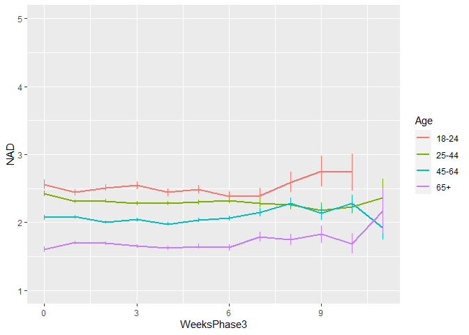
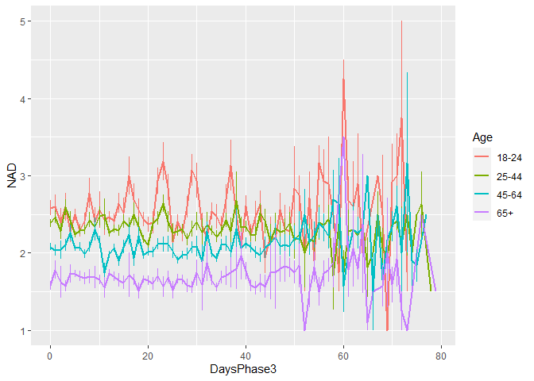
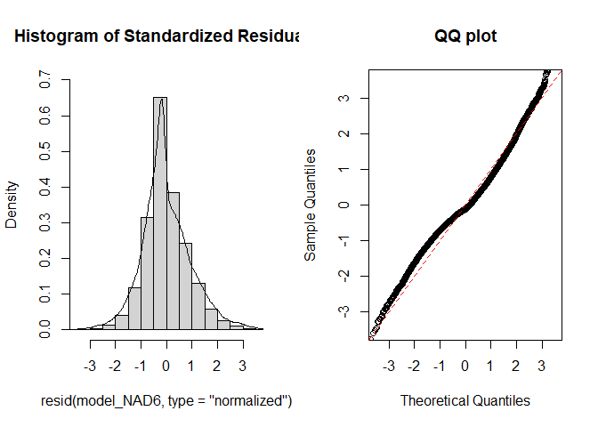
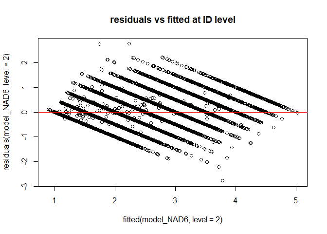
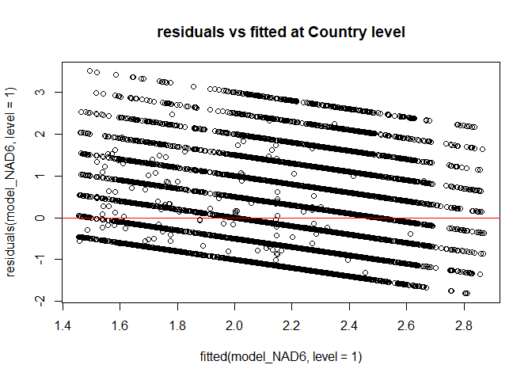
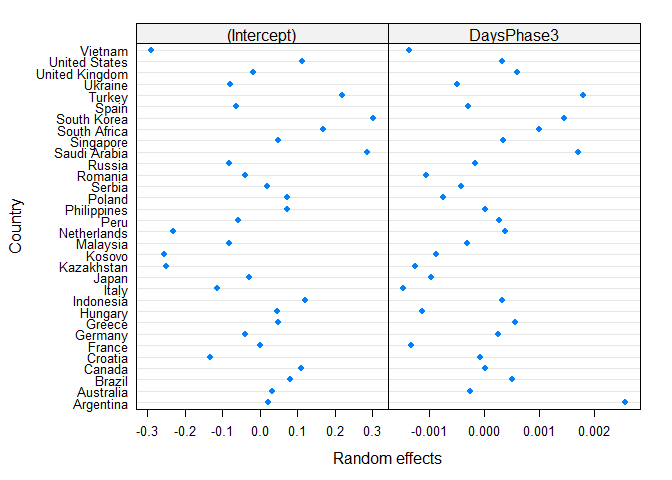
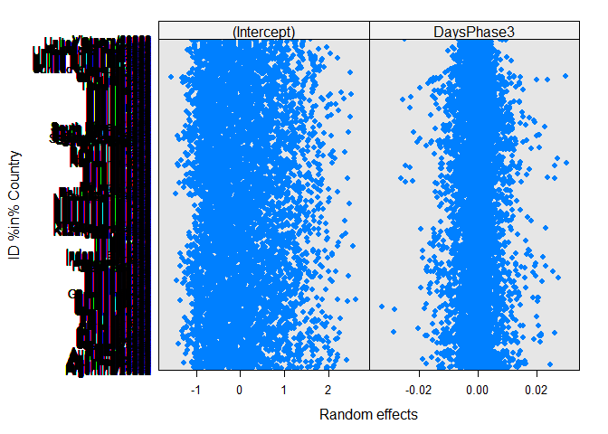
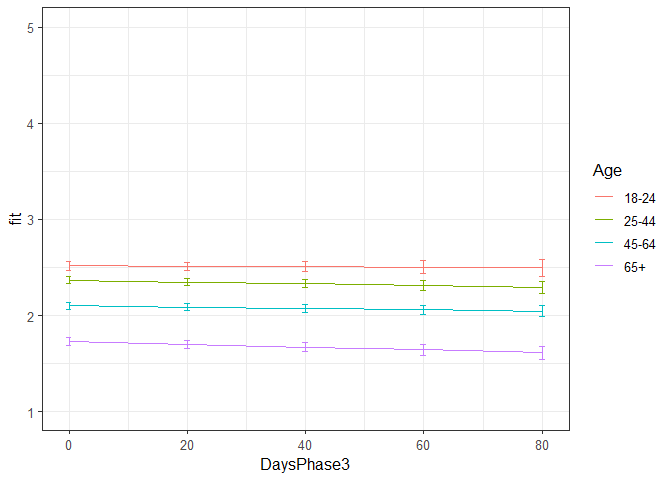

Second analyses NAD Phase 3
================
Anne Margit
10/14/2020

    ## [1] ""

``` r
load("data_analyse2_p3.Rdata")
```

This dataset includes:

1.  Data from all weekly measurement waves (baseline through wave 11,
    Time 1 through 12)
2.  Participants who provided at least 3 measurements
3.  Participants who are residents of the country they currently live in
4.  Participants who provided info on age
5.  Participants who provided info on gender (either male or female)
6.  Data from countries with at least 20 participants
7.  Pooled age groups
8.  Imputed missing emotion scores
9.  Combined emotion scores (NAA, NAD, PAA, PAD)
10. An imputed Stringency index (StringencyIndex\_imp)
11. A variable indicating the number of days before and after the day on
    which maximum stringency was reached for the respective country
    (DaysMax)
12. A variable indicating the number of weeks before and after the day
    on which maximum stringency was reached for the respective country
    (WeeksMax)
13. A variable indicating the date on which maximum Stringency was
    reached for that country (DateMaxStr)
14. A dummy Str\_dummy with 0 = before the peaj, 1 = during peak, 2 =
    after peak
15. Observations during which there was a second peak are excluded
    (N=583)

> My comments are in block quotes such as this.

``` r
library(dplyr)
library(tidyverse)
library(ggpubr)
library(ggplot2)
library(rockchalk)
library(effects)
library(nlme)
library(lattice)
library(broom.mixed)
library(purrr)
```

# Descriptives

**Number of participants per age group**

``` r
data_analyse2_p3 %>%
  group_by(Age_new) %>%
  summarise(NAge = n())
```

    # A tibble: 4 x 2
      Age_new  NAge
      <fct>   <int>
    1 0        2648
    2 1        7348
    3 2        9552
    4 3        4753

**Plots** **Mean NAD against max stringency in WEEKS**

``` r
plot_NAD <- ggplot(data_analyse2_p3, aes(x=WeeksPhase3, y=NAD, group = Age_new, color = Age_new))

plot_NAD + stat_summary(fun.y=mean, geom="line", size=1)  + geom_errorbar(stat="summary", fun.data="mean_se", width=0) + scale_colour_discrete(name = "Age", labels = c("18-24", "25-44", "45-64", "65+")) + expand_limits(y=c(1, 5))
```

<!-- -->

**Mean NAA against max stringency in DAYS**

``` r
plot_NAD <- ggplot(data_analyse2_p3, aes(x=DaysPhase3, y=NAD, group = Age_new, color = Age_new))

plot_NAD + stat_summary(fun.y=mean, geom="line", size=1)  + geom_errorbar(stat="summary", fun.data="mean_se", width=0) + scale_colour_discrete(name = "Age", labels = c("18-24", "25-44", "45-64", "65+")) + expand_limits(y=c(1, 5))
```

<!-- -->

# Regression models phase 3

**Negative affect low arousal**

*Predictors: DaysPhase3, Age, Random: IC for Country*

``` r
model_NAD1 <- lme(fixed = NAD ~ DaysPhase3 + Age_new + DaysPhase3*Age_new,
                   random = ~1 | Country, 
                  data = data_analyse2_p3, 
                  na.action = na.omit)

summary(model_NAD1)
```

    Linear mixed-effects model fit by REML
     Data: data_analyse2_p3 
           AIC      BIC    logLik
      66909.28 66990.25 -33444.64
    
    Random effects:
     Formula: ~1 | Country
            (Intercept)  Residual
    StdDev:   0.2088516 0.9560714
    
    Fixed effects: NAD ~ DaysPhase3 + Age_new + DaysPhase3 * Age_new 
                             Value  Std.Error    DF   t-value p-value
    (Intercept)          2.4928685 0.04917175 24242  50.69716  0.0000
    DaysPhase3           0.0005000 0.00126194 24242   0.39625  0.6919
    Age_new1            -0.1249491 0.03726303 24242  -3.35316  0.0008
    Age_new2            -0.4256429 0.03677890 24242 -11.57302  0.0000
    Age_new3            -0.7751644 0.04118439 24242 -18.82180  0.0000
    DaysPhase3:Age_new1 -0.0026392 0.00144594 24242  -1.82526  0.0680
    DaysPhase3:Age_new2 -0.0003685 0.00140797 24242  -0.26174  0.7935
    DaysPhase3:Age_new3 -0.0014374 0.00155422 24242  -0.92484  0.3551
     Correlation: 
                        (Intr) DysPh3 Ag_nw1 Ag_nw2 Ag_nw3 DP3:A_1 DP3:A_2
    DaysPhase3          -0.521                                            
    Age_new1            -0.553  0.683                                     
    Age_new2            -0.560  0.694  0.760                              
    Age_new3            -0.501  0.618  0.681  0.711                       
    DaysPhase3:Age_new1  0.454 -0.858 -0.802 -0.608 -0.543                
    DaysPhase3:Age_new2  0.466 -0.884 -0.616 -0.798 -0.563  0.772         
    DaysPhase3:Age_new3  0.421 -0.800 -0.558 -0.570 -0.796  0.700   0.724 
    
    Standardized Within-Group Residuals:
           Min         Q1        Med         Q3        Max 
    -1.9574993 -0.7616537 -0.1966392  0.6069424  3.7099129 
    
    Number of Observations: 24281
    Number of Groups: 32 

*Predictors: DaysMax\_p1, Age, Random: IC for ID*

``` r
model_NAD2 <- lme(fixed = NAD ~ DaysPhase3 + Age_new + DaysPhase3*Age_new,
                  random = ~1 | ID, 
                 data = data_analyse2_p3, 
                 na.action = na.omit)

summary(model_NAD2)
```

    Linear mixed-effects model fit by REML
     Data: data_analyse2_p3 
          AIC      BIC    logLik
      54642.1 54723.07 -27311.05
    
    Random effects:
     Formula: ~1 | ID
            (Intercept)  Residual
    StdDev:   0.7908129 0.5662631
    
    Fixed effects: NAD ~ DaysPhase3 + Age_new + DaysPhase3 * Age_new 
                             Value  Std.Error    DF   t-value p-value
    (Intercept)          2.5176011 0.03395092 17361  74.15413  0.0000
    DaysPhase3          -0.0007489 0.00089503 17361  -0.83669  0.4028
    Age_new1            -0.1641575 0.03981619  6912  -4.12288  0.0000
    Age_new2            -0.4375430 0.03892531  6912 -11.24058  0.0000
    Age_new3            -0.8189572 0.04368517  6912 -18.74680  0.0000
    DaysPhase3:Age_new1  0.0000119 0.00103214 17361   0.01153  0.9908
    DaysPhase3:Age_new2  0.0004228 0.00099849 17361   0.42343  0.6720
    DaysPhase3:Age_new3 -0.0002887 0.00109654 17361  -0.26328  0.7923
     Correlation: 
                        (Intr) DysPh3 Ag_nw1 Ag_nw2 Ag_nw3 DP3:A_1 DP3:A_2
    DaysPhase3          -0.470                                            
    Age_new1            -0.853  0.400                                     
    Age_new2            -0.872  0.410  0.744                              
    Age_new3            -0.777  0.365  0.663  0.678                       
    DaysPhase3:Age_new1  0.407 -0.867 -0.465 -0.355 -0.317                
    DaysPhase3:Age_new2  0.421 -0.896 -0.359 -0.465 -0.327  0.777         
    DaysPhase3:Age_new3  0.383 -0.816 -0.327 -0.334 -0.464  0.708   0.732 
    
    Standardized Within-Group Residuals:
           Min         Q1        Med         Q3        Max 
    -5.6414217 -0.5086335 -0.1189431  0.4771538  5.7718920 
    
    Number of Observations: 24281
    Number of Groups: 6916 

*Random: IC for ID and Country*

``` r
model_NAD3 <- lme(fixed = NAD ~ DaysPhase3 + Age_new + DaysPhase3*Age_new,
                  random = ~1 | Country/ID, 
                  data = data_analyse2_p3, 
                  na.action = na.omit)

summary(model_NAD3)
```

    Linear mixed-effects model fit by REML
     Data: data_analyse2_p3 
           AIC     BIC    logLik
      54548.53 54637.6 -27263.27
    
    Random effects:
     Formula: ~1 | Country
            (Intercept)
    StdDev:   0.1747337
    
     Formula: ~1 | ID %in% Country
            (Intercept)  Residual
    StdDev:   0.7798641 0.5663089
    
    Fixed effects: NAD ~ DaysPhase3 + Age_new + DaysPhase3 * Age_new 
                             Value  Std.Error    DF   t-value p-value
    (Intercept)          2.5267305 0.04656387 17361  54.26375  0.0000
    DaysPhase3          -0.0007288 0.00089572 17361  -0.81365  0.4159
    Age_new1            -0.1642749 0.04006885  6881  -4.09982  0.0000
    Age_new2            -0.4310684 0.03995300  6881 -10.78939  0.0000
    Age_new3            -0.8005707 0.04544244  6881 -17.61725  0.0000
    DaysPhase3:Age_new1 -0.0000242 0.00103185 17361  -0.02342  0.9813
    DaysPhase3:Age_new2  0.0003377 0.00099864 17361   0.33819  0.7352
    DaysPhase3:Age_new3 -0.0003985 0.00109698 17361  -0.36331  0.7164
     Correlation: 
                        (Intr) DysPh3 Ag_nw1 Ag_nw2 Ag_nw3 DP3:A_1 DP3:A_2
    DaysPhase3          -0.342                                            
    Age_new1            -0.615  0.396                                     
    Age_new2            -0.618  0.397  0.749                              
    Age_new3            -0.549  0.349  0.663  0.694                       
    DaysPhase3:Age_new1  0.299 -0.866 -0.462 -0.346 -0.304                
    DaysPhase3:Age_new2  0.308 -0.896 -0.356 -0.454 -0.316  0.777         
    DaysPhase3:Age_new3  0.280 -0.815 -0.324 -0.325 -0.448  0.708   0.732 
    
    Standardized Within-Group Residuals:
           Min         Q1        Med         Q3        Max 
    -5.6560077 -0.5117031 -0.1209621  0.4793157  5.7814567 
    
    Number of Observations: 24281
    Number of Groups: 
            Country ID %in% Country 
                 32            6916 

*Random: IC for ID and Country, S for Country*

``` r
model_NAD4 <- lme(fixed = NAD ~ DaysPhase3 + Age_new + DaysPhase3*Age_new,
                  random = list (Country = ~DaysPhase3, ID = ~1), 
                  data = data_analyse2_p3, 
                  na.action = na.omit)

summary(model_NAD4)
```

    Linear mixed-effects model fit by REML
     Data: data_analyse2_p3 
           AIC      BIC    logLik
      54544.96 54650.22 -27259.48
    
    Random effects:
     Formula: ~DaysPhase3 | Country
     Structure: General positive-definite, Log-Cholesky parametrization
                StdDev      Corr  
    (Intercept) 0.159881276 (Intr)
    DaysPhase3  0.001805837 0.312 
    
     Formula: ~1 | ID %in% Country
            (Intercept)  Residual
    StdDev:   0.7800531 0.5659114
    
    Fixed effects: NAD ~ DaysPhase3 + Age_new + DaysPhase3 * Age_new 
                             Value  Std.Error    DF   t-value p-value
    (Intercept)          2.5247716 0.04490517 17361  56.22453  0.0000
    DaysPhase3          -0.0006280 0.00098381 17361  -0.63832  0.5233
    Age_new1            -0.1608818 0.04007777  6881  -4.01424  0.0001
    Age_new2            -0.4259091 0.03995896  6881 -10.65866  0.0000
    Age_new3            -0.7981660 0.04549934  6881 -17.54236  0.0000
    DaysPhase3:Age_new1 -0.0002028 0.00104236 17361  -0.19455  0.8457
    DaysPhase3:Age_new2  0.0000016 0.00101881 17361   0.00161  0.9987
    DaysPhase3:Age_new3 -0.0005228 0.00112956 17361  -0.46283  0.6435
     Correlation: 
                        (Intr) DysPh3 Ag_nw1 Ag_nw2 Ag_nw3 DP3:A_1 DP3:A_2
    DaysPhase3          -0.272                                            
    Age_new1            -0.639  0.365                                     
    Age_new2            -0.643  0.368  0.749                              
    Age_new3            -0.572  0.327  0.663  0.694                       
    DaysPhase3:Age_new1  0.310 -0.789 -0.463 -0.349 -0.308                
    DaysPhase3:Age_new2  0.318 -0.811 -0.356 -0.455 -0.321  0.780         
    DaysPhase3:Age_new3  0.289 -0.740 -0.323 -0.329 -0.452  0.708   0.739 
    
    Standardized Within-Group Residuals:
           Min         Q1        Med         Q3        Max 
    -5.6958480 -0.5110837 -0.1187484  0.4784569  5.8112440 
    
    Number of Observations: 24281
    Number of Groups: 
            Country ID %in% Country 
                 32            6916 

*Random: IC for ID and Country, S for ID*

``` r
model_NAD5 <- lme(fixed = NAD ~ DaysPhase3 + Age_new + DaysPhase3*Age_new,
                  random = list (Country = ~1, ID = ~DaysPhase3), 
                  data = data_analyse2_p3, 
                  na.action = na.omit)

summary(model_NAD5)
```

    Linear mixed-effects model fit by REML
     Data: data_analyse2_p3 
           AIC      BIC    logLik
      54272.89 54378.15 -27123.44
    
    Random effects:
     Formula: ~1 | Country
            (Intercept)
    StdDev:   0.1735195
    
     Formula: ~DaysPhase3 | ID %in% Country
     Structure: General positive-definite, Log-Cholesky parametrization
                StdDev     Corr  
    (Intercept) 0.82160624 (Intr)
    DaysPhase3  0.01192969 -0.311
    Residual    0.53882655       
    
    Fixed effects: NAD ~ DaysPhase3 + Age_new + DaysPhase3 * Age_new 
                             Value  Std.Error    DF   t-value p-value
    (Intercept)          2.5202595 0.04733072 17361  53.24786  0.0000
    DaysPhase3          -0.0003771 0.00105785 17361  -0.35650  0.7215
    Age_new1            -0.1547677 0.04151541  6881  -3.72796  0.0002
    Age_new2            -0.4229289 0.04132519  6881 -10.23417  0.0000
    Age_new3            -0.7882502 0.04699354  6881 -16.77359  0.0000
    DaysPhase3:Age_new1 -0.0005049 0.00122340 17361  -0.41272  0.6798
    DaysPhase3:Age_new2 -0.0001393 0.00118317 17361  -0.11775  0.9063
    DaysPhase3:Age_new3 -0.0011465 0.00130709 17361  -0.87714  0.3804
     Correlation: 
                        (Intr) DysPh3 Ag_nw1 Ag_nw2 Ag_nw3 DP3:A_1 DP3:A_2
    DaysPhase3          -0.388                                            
    Age_new1            -0.627  0.441                                     
    Age_new2            -0.632  0.443  0.748                              
    Age_new3            -0.561  0.390  0.663  0.693                       
    DaysPhase3:Age_new1  0.337 -0.863 -0.516 -0.384 -0.338                
    DaysPhase3:Age_new2  0.349 -0.893 -0.395 -0.506 -0.351  0.772         
    DaysPhase3:Age_new3  0.315 -0.808 -0.357 -0.359 -0.501  0.699   0.723 
    
    Standardized Within-Group Residuals:
           Min         Q1        Med         Q3        Max 
    -5.1329263 -0.4899873 -0.1140094  0.4628468  5.1192025 
    
    Number of Observations: 24281
    Number of Groups: 
            Country ID %in% Country 
                 32            6916 

*Random slope for Country and ID*

``` r
model_NAD6 <- lme(fixed = NAD ~ DaysPhase3 + Age_new + DaysPhase3*Age_new,
                  random = ~DaysPhase3 | Country/ID, 
                  data = data_analyse2_p3, 
                  na.action = na.omit)

summary(model_NAD6)
```

    Linear mixed-effects model fit by REML
     Data: data_analyse2_p3 
           AIC     BIC    logLik
      54273.64 54395.1 -27121.82
    
    Random effects:
     Formula: ~DaysPhase3 | Country
     Structure: General positive-definite, Log-Cholesky parametrization
                StdDev      Corr  
    (Intercept) 0.161391635 (Intr)
    DaysPhase3  0.001582889 0.325 
    
     Formula: ~DaysPhase3 | ID %in% Country
     Structure: General positive-definite, Log-Cholesky parametrization
                StdDev     Corr  
    (Intercept) 0.82146770 (Intr)
    DaysPhase3  0.01187267 -0.31 
    Residual    0.53877628       
    
    Fixed effects: NAD ~ DaysPhase3 + Age_new + DaysPhase3 * Age_new 
                             Value  Std.Error    DF   t-value p-value
    (Intercept)          2.5186469 0.04599566 17361  54.75836  0.0000
    DaysPhase3          -0.0002831 0.00111649 17361  -0.25359  0.7998
    Age_new1            -0.1524914 0.04151206  6881  -3.67342  0.0002
    Age_new2            -0.4191179 0.04131618  6881 -10.14416  0.0000
    Age_new3            -0.7869193 0.04702237  6881 -16.73500  0.0000
    DaysPhase3:Age_new1 -0.0006303 0.00123017 17361  -0.51234  0.6084
    DaysPhase3:Age_new2 -0.0004019 0.00119813 17361  -0.33546  0.7373
    DaysPhase3:Age_new3 -0.0012221 0.00133249 17361  -0.91715  0.3591
     Correlation: 
                        (Intr) DysPh3 Ag_nw1 Ag_nw2 Ag_nw3 DP3:A_1 DP3:A_2
    DaysPhase3          -0.336                                            
    Age_new1            -0.647  0.420                                     
    Age_new2            -0.652  0.424  0.748                              
    Age_new3            -0.580  0.376  0.662  0.693                       
    DaysPhase3:Age_new1  0.347 -0.818 -0.516 -0.386 -0.341                
    DaysPhase3:Age_new2  0.357 -0.842 -0.394 -0.507 -0.354  0.774         
    DaysPhase3:Age_new3  0.323 -0.766 -0.355 -0.361 -0.503  0.699   0.728 
    
    Standardized Within-Group Residuals:
           Min         Q1        Med         Q3        Max 
    -5.1579527 -0.4915695 -0.1128889  0.4633824  5.1300251 
    
    Number of Observations: 24281
    Number of Groups: 
            Country ID %in% Country 
                 32            6916 

> Model with random slope for only ID is better, NAD5

*Random: IC for ID and Country, S for ID + AR*

``` r
data_analyse2_p3 <- data_analyse2_p3[with(data_analyse2_p3, order(Country, ID, Time)),]
data_analyse2_p3$Time <- as.numeric(data_analyse2_p3$Time)

model_NAD7 <- lme(fixed = NAD ~ DaysPhase3 + Age_new + DaysPhase3*Age_new,
                  random = list (Country = ~1, ID = ~DaysPhase3), 
                  data = data_analyse2_p3, 
                  na.action = na.omit,
                  correlation = corAR1(form = ~ Time | Country/ID))

summary(model_NAD7)
```

    Linear mixed-effects model fit by REML
     Data: data_analyse2_p3 
           AIC      BIC    logLik
      54102.32 54215.68 -27037.16
    
    Random effects:
     Formula: ~1 | Country
            (Intercept)
    StdDev:   0.1722465
    
     Formula: ~DaysPhase3 | ID %in% Country
     Structure: General positive-definite, Log-Cholesky parametrization
                StdDev      Corr  
    (Intercept) 0.781670949 (Intr)
    DaysPhase3  0.008231745 -0.209
    Residual    0.573947072       
    
    Correlation Structure: ARMA(1,0)
     Formula: ~Time | Country/ID 
     Parameter estimate(s):
         Phi1 
    0.1890222 
    Fixed effects: NAD ~ DaysPhase3 + Age_new + DaysPhase3 * Age_new 
                             Value  Std.Error    DF   t-value p-value
    (Intercept)          2.5160619 0.04713542 17361  53.37943  0.0000
    DaysPhase3          -0.0001530 0.00104803 17361  -0.14603  0.8839
    Age_new1            -0.1513167 0.04142615  6881  -3.65269  0.0003
    Age_new2            -0.4193616 0.04124356  6881 -10.16793  0.0000
    Age_new3            -0.7877132 0.04688637  6881 -16.80047  0.0000
    DaysPhase3:Age_new1 -0.0006878 0.00121000 17361  -0.56846  0.5697
    DaysPhase3:Age_new2 -0.0003098 0.00117088 17361  -0.26462  0.7913
    DaysPhase3:Age_new3 -0.0011901 0.00129092 17361  -0.92192  0.3566
     Correlation: 
                        (Intr) DysPh3 Ag_nw1 Ag_nw2 Ag_nw3 DP3:A_1 DP3:A_2
    DaysPhase3          -0.388                                            
    Age_new1            -0.629  0.440                                     
    Age_new2            -0.633  0.442  0.749                              
    Age_new3            -0.563  0.389  0.664  0.694                       
    DaysPhase3:Age_new1  0.338 -0.864 -0.514 -0.384 -0.338                
    DaysPhase3:Age_new2  0.349 -0.894 -0.395 -0.505 -0.351  0.774         
    DaysPhase3:Age_new3  0.316 -0.811 -0.358 -0.360 -0.499  0.702   0.726 
    
    Standardized Within-Group Residuals:
           Min         Q1        Med         Q3        Max 
    -4.9252641 -0.5049494 -0.1308628  0.4670635  4.9845639 
    
    Number of Observations: 24281
    Number of Groups: 
            Country ID %in% Country 
                 32            6916 

*Random: IC for ID and Country, S for ID, No correlation between IC and
S for ID + AR*

``` r
model_NAD8 <- lme(fixed = NAD ~ DaysPhase3 + Age_new + DaysPhase3*Age_new,
                  random = list(Country = ~1, ID = pdDiag(~DaysPhase3)), 
                  data = data_analyse2_p3, 
                  na.action = na.omit,
                  correlation = corAR1(form = ~ Time | Country/ID))

summary(model_NAD8)
```

    Linear mixed-effects model fit by REML
     Data: data_analyse2_p3 
           AIC      BIC    logLik
      54113.22 54218.48 -27043.61
    
    Random effects:
     Formula: ~1 | Country
            (Intercept)
    StdDev:   0.1714867
    
     Formula: ~DaysPhase3 | ID %in% Country
     Structure: Diagonal
            (Intercept)  DaysPhase3  Residual
    StdDev:   0.7533914 0.006249562 0.5824621
    
    Correlation Structure: ARMA(1,0)
     Formula: ~Time | Country/ID 
     Parameter estimate(s):
         Phi1 
    0.2098132 
    Fixed effects: NAD ~ DaysPhase3 + Age_new + DaysPhase3 * Age_new 
                             Value  Std.Error    DF   t-value p-value
    (Intercept)          2.5155878 0.04659961 17361  53.98303  0.0000
    DaysPhase3          -0.0001518 0.00103256 17361  -0.14705  0.8831
    Age_new1            -0.1519608 0.04071497  6881  -3.73231  0.0002
    Age_new2            -0.4191935 0.04055934  6881 -10.33532  0.0000
    Age_new3            -0.7893290 0.04611157  6881 -17.11781  0.0000
    DaysPhase3:Age_new1 -0.0006251 0.00119128 17361  -0.52471  0.5998
    DaysPhase3:Age_new2 -0.0002823 0.00115264 17361  -0.24491  0.8065
    DaysPhase3:Age_new3 -0.0010891 0.00126891 17361  -0.85832  0.3907
     Correlation: 
                        (Intr) DysPh3 Ag_nw1 Ag_nw2 Ag_nw3 DP3:A_1 DP3:A_2
    DaysPhase3          -0.368                                            
    Age_new1            -0.626  0.420                                     
    Age_new2            -0.629  0.421  0.750                              
    Age_new3            -0.560  0.371  0.664  0.695                       
    DaysPhase3:Age_new1  0.321 -0.865 -0.489 -0.366 -0.323                
    DaysPhase3:Age_new2  0.331 -0.895 -0.377 -0.480 -0.335  0.776         
    DaysPhase3:Age_new3  0.300 -0.813 -0.342 -0.344 -0.473  0.704   0.729 
    
    Standardized Within-Group Residuals:
           Min         Q1        Med         Q3        Max 
    -5.0219181 -0.5111784 -0.1337663  0.4707701  5.0985422 
    
    Number of Observations: 24281
    Number of Groups: 
            Country ID %in% Country 
                 32            6916 

> Model NAD6 is the best: random IC for ID and Country, random S for ID
> + AR

*QQ plot of residuals*

``` r
par(mfrow = c(1,2))
lims <- c(-3.5,3.5)
hist(resid(model_NAD6, type = "normalized"),
freq = FALSE, xlim = lims, ylim =  c(0,.7),main = "Histogram of Standardized Residuals")
lines(density(scale(resid(model_NAD6))))
qqnorm(resid(model_NAD6, type = "normalized"),
xlim = lims, ylim = lims,main = "QQ plot")
abline(0,1, col = "red", lty = 2)
```

<!-- -->

*Residuals vs fitted*

``` r
plot(fitted(model_NAD6, level=2), residuals(model_NAD6, level=2), 
     main="residuals vs fitted at ID level")
abline(a=0, b=0,col="red")
```

<!-- -->

``` r
plot(fitted(model_NAD6, level=1), residuals(model_NAD6, level=1), 
    main="residuals vs fitted at Country level")
abline(a=0, b=0,col="red")
```

<!-- -->

> Residuen zien er allemaal goed uit

*Plot random intercepts and slopes*

``` r
plot(ranef(model_NAD6, level = 1))
```

<!-- -->

``` r
plot(ranef(model_NAD6, level = 2))
```

<!-- -->

*Confidence intervals*

``` r
intervals(model_NAD6)
```

    Approximate 95% confidence intervals
    
     Fixed effects:
                               lower          est.        upper
    (Intercept)          2.428490747  2.5186468755  2.608803004
    DaysPhase3          -0.002471570 -0.0002831333  0.001905303
    Age_new1            -0.233867844 -0.1524913780 -0.071114912
    Age_new2            -0.500110399 -0.4191179329 -0.338125466
    Age_new3            -0.879097675 -0.7869193068 -0.694740939
    DaysPhase3:Age_new1 -0.003041526 -0.0006302685  0.001780989
    DaysPhase3:Age_new2 -0.002750367 -0.0004019182  0.001946531
    DaysPhase3:Age_new3 -0.003833900 -0.0012220898  0.001389721
    attr(,"label")
    [1] "Fixed effects:"
    
     Random Effects:
      Level: Country 
                                        lower        est.       upper
    sd((Intercept))              0.1087689299 0.161391635 0.239473348
    sd(DaysPhase3)               0.0006574441 0.001582889 0.003811028
    cor((Intercept),DaysPhase3) -0.3953074861 0.325169812 0.797937720
      Level: ID 
                                     lower        est.       upper
    sd((Intercept))              0.8005225  0.82146770  0.84296096
    sd(DaysPhase3)               0.0109590  0.01187267  0.01286252
    cor((Intercept),DaysPhase3) -0.3689854 -0.31048147 -0.24952688
    
     Within-group standard error:
        lower      est.     upper 
    0.5323690 0.5387763 0.5452607 

*Plot of predicted values*

``` r
ef_NAD <- effect("DaysPhase3:Age_new", model_NAD6)

plot_NAD <- ggplot(as.data.frame(ef_NAD), 
       aes(DaysPhase3, fit, color=Age_new)) + geom_line() + 
  geom_errorbar(aes(ymin=fit-se, ymax=fit+se), width=1) + theme_bw(base_size=12) + scale_color_discrete(name="Age", labels = c("18-24", "25-44", "45-64", "65+")) + expand_limits(y=c(1, 5))
```

``` r
plot_NAD
```

<!-- -->

``` r
coef_NAD = tidy(model_NAD6, 
               effects = "fixed")
```

*Effect sizes* **Within person SD and average within person SD for NAA**

``` r
ISDs <- data_analyse2_p3 %>% 
  group_by(ID) %>%
  summarize_at(c("NAD"), sd, na.rm=TRUE) %>%
  ungroup()

ISDs_av <- ISDs %>%
  summarize_at(c("NAD"), mean, na.rm=TRUE) %>%
  stack() %>%
  rename(sd=values) 
```

> Effect sizes for intercept and main effect of age = regression
> coefficient / average ISD of NAD Effect size for main effect of
> DaysMax = (regression coefficient \* 28)/ average ISD of NAD Effect
> sizes for interaction effects = (regression coefficient \* 28)/
> average ISD of NAD

> The effect sizes for main effect of DaysMax and the interaction
> effects reflect the increase in SD of NAD over 4 weeks (28 days)

``` r
coef_NAD <- coef_NAD %>%
  mutate (e_size = ifelse(row_number()== 1 | row_number()== 3 |  row_number()== 4 |  row_number()== 5,
          estimate/0.4555433, 
          (estimate*28)/0.4555433))
```

``` r
coef_NAD
```

    ## # A tibble: 8 x 7
    ##   term                 estimate std.error    df statistic  p.value  e_size
    ##   <chr>                   <dbl>     <dbl> <dbl>     <dbl>    <dbl>   <dbl>
    ## 1 (Intercept)          2.52       0.0460  17361    54.8   0.        5.53  
    ## 2 DaysPhase3          -0.000283   0.00112 17361    -0.254 8.00e- 1 -0.0174
    ## 3 Age_new1            -0.152      0.0415   6881    -3.67  2.41e- 4 -0.335 
    ## 4 Age_new2            -0.419      0.0413   6881   -10.1   5.19e-24 -0.920 
    ## 5 Age_new3            -0.787      0.0470   6881   -16.7   1.19e-61 -1.73  
    ## 6 DaysPhase3:Age_new1 -0.000630   0.00123 17361    -0.512 6.08e- 1 -0.0387
    ## 7 DaysPhase3:Age_new2 -0.000402   0.00120 17361    -0.335 7.37e- 1 -0.0247
    ## 8 DaysPhase3:Age_new3 -0.00122    0.00133 17361    -0.917 3.59e- 1 -0.0751

> There are differences between age groups in intensity but not in rate
> of change dependent on DaysMax and no interaction
