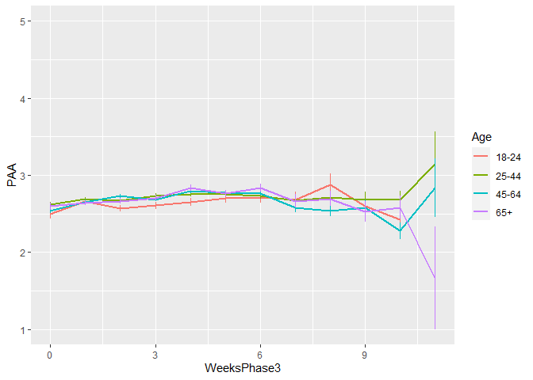
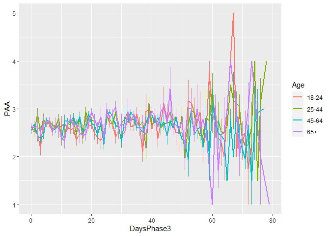
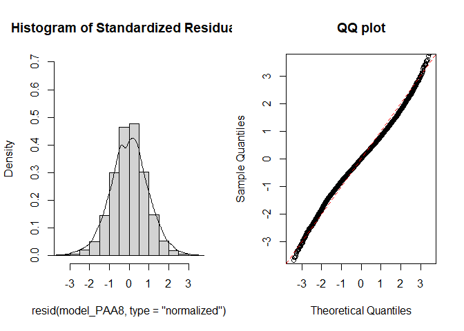
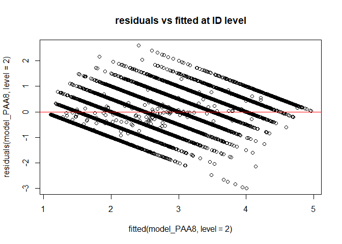
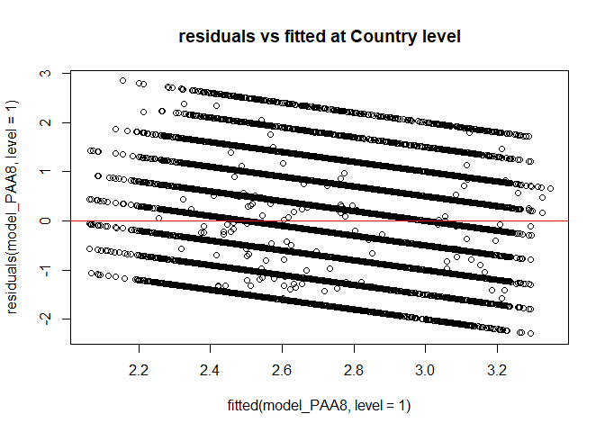
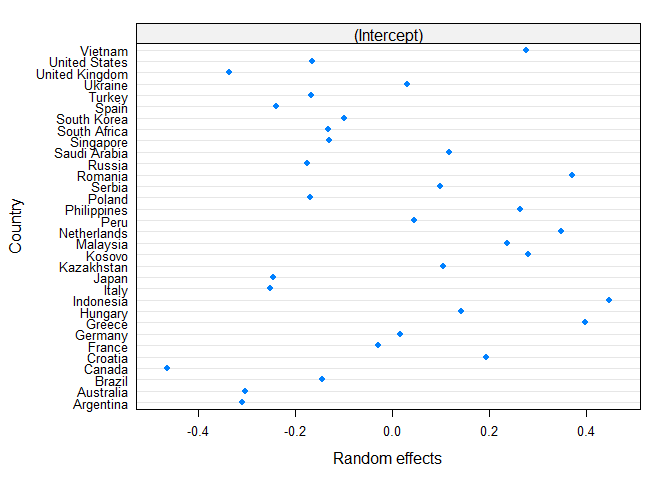
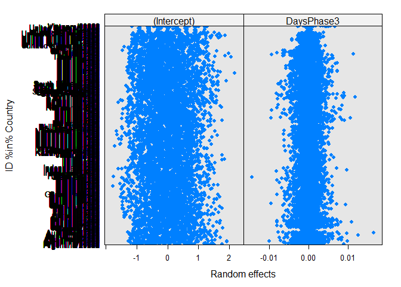
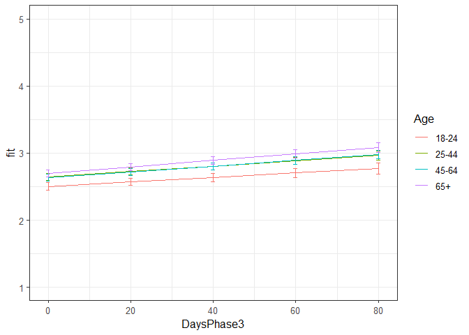

Second analyses PAA Phase 3
================
Anne Margit
10/15/2020

    ## [1] ""

``` r
load("data_analyse2_p3.Rdata")
```

This dataset includes:

1.  Data from all weekly measurement waves (baseline through wave 11,
    Time 1 through 12)
2.  Participants who provided at least 3 measurements
3.  Participants who are residents of the country they currently live in
4.  Participants who provided info on age
5.  Participants who provided info on gender (either male or female)
6.  Data from countries with at least 20 participants
7.  Pooled age groups
8.  Imputed missing emotion scores
9.  Combined emotion scores (NAA, NAD, PAA, PAD)
10. An imputed Stringency index (StringencyIndex\_imp)
11. A variable indicating the number of days before and after the day on
    which maximum stringency was reached for the respective country
    (DaysMax)
12. A variable indicating the number of weeks before and after the day
    on which maximum stringency was reached for the respective country
    (WeeksMax)
13. A variable indicating the date on which maximum Stringency was
    reached for that country (DateMaxStr)
14. A dummy Str\_dummy with 0 = before the peaj, 1 = during peak, 2 =
    after peak
15. Observations during which there was a second peak are excluded
    (N=583)

> My comments are in block quotes such as this.

``` r
library(dplyr)
library(tidyverse)
library(ggpubr)
library(ggplot2)
library(rockchalk)
library(effects)
library(nlme)
library(lattice)
library(broom.mixed)
library(purrr)
```

# Descriptives

**Number of participants per age group**

``` r
data_analyse2_p3 %>%
  group_by(Age_new) %>%
  summarise(NAge = n())
```

    # A tibble: 4 x 2
      Age_new  NAge
      <fct>   <int>
    1 0        2648
    2 1        7348
    3 2        9552
    4 3        4753

**Plots** **Mean PAA against max stringency in WEEKS**

``` r
plot_PAA <- ggplot(data_analyse2_p3, aes(x=WeeksPhase3, y=PAA, group = Age_new, color = Age_new))

plot_PAA + stat_summary(fun.y=mean, geom="line", size=1)  + geom_errorbar(stat="summary", fun.data="mean_se", width=0) + scale_colour_discrete(name = "Age", labels = c("18-24", "25-44", "45-64", "65+")) + expand_limits(y=c(1, 5))
```

<!-- -->

**Mean PAA against max stringency in DAYS**

``` r
plot_PAA <- ggplot(data_analyse2_p3, aes(x=DaysPhase3, y=PAA, group = Age_new, color = Age_new))

plot_PAA + stat_summary(fun.y=mean, geom="line", size=1)  + geom_errorbar(stat="summary", fun.data="mean_se", width=0) + scale_colour_discrete(name = "Age", labels = c("18-24", "25-44", "45-64", "65+")) + expand_limits(y=c(1, 5))
```

<!-- -->

# Regression models phase 3

**Positive affect high arousal**

*Predictors: DaysPhase3, Age, Random: IC for Country*

``` r
model_PAA1 <- lme(fixed = PAA ~ DaysPhase3 + Age_new + DaysPhase3*Age_new,
                   random = ~1 | Country, 
                  data = data_analyse2_p3, 
                  na.action = na.omit)

summary(model_PAA1)
```

    Linear mixed-effects model fit by REML
     Data: data_analyse2_p3 
          AIC      BIC    logLik
      66840.1 66921.08 -33410.05
    
    Random effects:
     Formula: ~1 | Country
            (Intercept)  Residual
    StdDev:   0.2727087 0.9544025
    
    Fixed effects: PAA ~ DaysPhase3 + Age_new + DaysPhase3 * Age_new 
                             Value  Std.Error    DF  t-value p-value
    (Intercept)          2.5047971 0.05811552 24242 43.10031  0.0000
    DaysPhase3           0.0035989 0.00126050 24242  2.85511  0.0043
    Age_new1             0.1394288 0.03721561 24242  3.74652  0.0002
    Age_new2             0.1508469 0.03674692 24242  4.10502  0.0000
    Age_new3             0.2050687 0.04114957 24242  4.98349  0.0000
    DaysPhase3:Age_new1  0.0004753 0.00144379 24242  0.32919  0.7420
    DaysPhase3:Age_new2 -0.0003829 0.00140607 24242 -0.27232  0.7854
    DaysPhase3:Age_new3  0.0007756 0.00155209 24242  0.49971  0.6173
     Correlation: 
                        (Intr) DysPh3 Ag_nw1 Ag_nw2 Ag_nw3 DP3:A_1 DP3:A_2
    DaysPhase3          -0.440                                            
    Age_new1            -0.467  0.683                                     
    Age_new2            -0.472  0.693  0.760                              
    Age_new3            -0.423  0.618  0.681  0.711                       
    DaysPhase3:Age_new1  0.384 -0.857 -0.802 -0.607 -0.543                
    DaysPhase3:Age_new2  0.394 -0.884 -0.615 -0.797 -0.563  0.772         
    DaysPhase3:Age_new3  0.356 -0.800 -0.557 -0.570 -0.796  0.700   0.724 
    
    Standardized Within-Group Residuals:
            Min          Q1         Med          Q3         Max 
    -2.39985350 -0.72097087  0.01092083  0.69701755  3.00515776 
    
    Number of Observations: 24281
    Number of Groups: 32 

*Predictors: DaysMax\_p1, Age, Random: IC for ID*

``` r
model_PAA2 <- lme(fixed = PAA ~ DaysPhase3 + Age_new + DaysPhase3*Age_new,
                  random = ~1 | ID, 
                 data = data_analyse2_p3, 
                 na.action = na.omit)

summary(model_PAA2)
```

    Linear mixed-effects model fit by REML
     Data: data_analyse2_p3 
           AIC      BIC    logLik
      55604.56 55685.53 -27792.28
    
    Random effects:
     Formula: ~1 | ID
            (Intercept)  Residual
    StdDev:   0.8039331 0.5782033
    
    Fixed effects: PAA ~ DaysPhase3 + Age_new + DaysPhase3 * Age_new 
                            Value  Std.Error    DF  t-value p-value
    (Intercept)         2.5667219 0.03456902 17361 74.24919  0.0000
    DaysPhase3          0.0030982 0.00091361 17361  3.39121  0.0007
    Age_new1            0.0849814 0.04054013  6912  2.09623  0.0361
    Age_new2            0.0513608 0.03963249  6912  1.29593  0.1950
    Age_new3            0.0359093 0.04447742  6912  0.80736  0.4195
    DaysPhase3:Age_new1 0.0003730 0.00105357 17361  0.35400  0.7233
    DaysPhase3:Age_new2 0.0007805 0.00101923 17361  0.76573  0.4438
    DaysPhase3:Age_new3 0.0016506 0.00111934 17361  1.47461  0.1403
     Correlation: 
                        (Intr) DysPh3 Ag_nw1 Ag_nw2 Ag_nw3 DP3:A_1 DP3:A_2
    DaysPhase3          -0.471                                            
    Age_new1            -0.853  0.402                                     
    Age_new2            -0.872  0.411  0.744                              
    Age_new3            -0.777  0.366  0.663  0.678                       
    DaysPhase3:Age_new1  0.408 -0.867 -0.467 -0.356 -0.317                
    DaysPhase3:Age_new2  0.422 -0.896 -0.360 -0.467 -0.328  0.777         
    DaysPhase3:Age_new3  0.384 -0.816 -0.328 -0.335 -0.466  0.708   0.732 
    
    Standardized Within-Group Residuals:
            Min          Q1         Med          Q3         Max 
    -5.35363458 -0.53571457  0.01052455  0.53269023  4.69888382 
    
    Number of Observations: 24281
    Number of Groups: 6916 

*Random: IC for ID and Country*

``` r
model_PAA3 <- lme(fixed = PAA ~ DaysPhase3 + Age_new + DaysPhase3*Age_new,
                  random = ~1 | Country/ID, 
                  data = data_analyse2_p3, 
                  na.action = na.omit)

summary(model_PAA3)
```

    Linear mixed-effects model fit by REML
     Data: data_analyse2_p3 
           AIC      BIC    logLik
      55001.18 55090.25 -27489.59
    
    Random effects:
     Formula: ~1 | Country
            (Intercept)
    StdDev:   0.2610997
    
     Formula: ~1 | ID %in% Country
            (Intercept)  Residual
    StdDev:   0.7561229 0.5782937
    
    Fixed effects: PAA ~ DaysPhase3 + Age_new + DaysPhase3 * Age_new 
                            Value  Std.Error    DF  t-value p-value
    (Intercept)         2.5056232 0.05766686 17361 43.44997  0.0000
    DaysPhase3          0.0032888 0.00091154 17361  3.60801  0.0003
    Age_new1            0.1486127 0.03969429  6881  3.74393  0.0002
    Age_new2            0.1359189 0.03964934  6881  3.42802  0.0006
    Age_new3            0.1903181 0.04508785  6881  4.22105  0.0000
    DaysPhase3:Age_new1 0.0004501 0.00104992 17361  0.42868  0.6682
    DaysPhase3:Age_new2 0.0008019 0.00101635 17361  0.78896  0.4301
    DaysPhase3:Age_new3 0.0016210 0.00111671 17361  1.45162  0.1466
     Correlation: 
                        (Intr) DysPh3 Ag_nw1 Ag_nw2 Ag_nw3 DP3:A_1 DP3:A_2
    DaysPhase3          -0.282                                            
    Age_new1            -0.489  0.407                                     
    Age_new2            -0.490  0.408  0.750                              
    Age_new3            -0.436  0.359  0.665  0.698                       
    DaysPhase3:Age_new1  0.246 -0.866 -0.475 -0.355 -0.313                
    DaysPhase3:Age_new2  0.254 -0.895 -0.366 -0.466 -0.324  0.777         
    DaysPhase3:Age_new3  0.230 -0.815 -0.333 -0.334 -0.460  0.707   0.731 
    
    Standardized Within-Group Residuals:
            Min          Q1         Med          Q3         Max 
    -5.33360229 -0.53678353  0.01093272  0.54030082  4.73670987 
    
    Number of Observations: 24281
    Number of Groups: 
            Country ID %in% Country 
                 32            6916 

*Random: IC for ID and Country, S for Country*

``` r
model_PAA4 <- lme(fixed = PAA ~ DaysPhase3 + Age_new + DaysPhase3*Age_new,
                  random = list (Country = ~DaysPhase3, ID = ~1), 
                  data = data_analyse2_p3, 
                  na.action = na.omit)

summary(model_PAA4)
```

    Linear mixed-effects model fit by REML
     Data: data_analyse2_p3 
           AIC      BIC    logLik
      54984.57 55089.84 -27479.29
    
    Random effects:
     Formula: ~DaysPhase3 | Country
     Structure: General positive-definite, Log-Cholesky parametrization
                StdDev      Corr  
    (Intercept) 0.258058905 (Intr)
    DaysPhase3  0.002612362 -0.04 
    
     Formula: ~1 | ID %in% Country
            (Intercept)  Residual
    StdDev:   0.7560989 0.5775431
    
    Fixed effects: PAA ~ DaysPhase3 + Age_new + DaysPhase3 * Age_new 
                            Value  Std.Error    DF  t-value p-value
    (Intercept)         2.5137213 0.05740225 17361 43.79134  0.0000
    DaysPhase3          0.0028441 0.00107309 17361  2.65036  0.0080
    Age_new1            0.1400716 0.03980832  6881  3.51865  0.0004
    Age_new2            0.1254849 0.03988763  6881  3.14596  0.0017
    Age_new3            0.1794062 0.04545980  6881  3.94648  0.0001
    DaysPhase3:Age_new1 0.0008820 0.00106503 17361  0.82817  0.4076
    DaysPhase3:Age_new2 0.0013074 0.00104651 17361  1.24934  0.2116
    DaysPhase3:Age_new3 0.0021542 0.00116301 17361  1.85224  0.0640
     Correlation: 
                        (Intr) DysPh3 Ag_nw1 Ag_nw2 Ag_nw3 DP3:A_1 DP3:A_2
    DaysPhase3          -0.275                                            
    Age_new1            -0.492  0.350                                     
    Age_new2            -0.492  0.351  0.751                              
    Age_new3            -0.438  0.312  0.666  0.701                       
    DaysPhase3:Age_new1  0.247 -0.734 -0.480 -0.365 -0.323                
    DaysPhase3:Age_new2  0.252 -0.750 -0.372 -0.476 -0.340  0.781         
    DaysPhase3:Age_new3  0.230 -0.685 -0.337 -0.348 -0.474  0.708   0.743 
    
    Standardized Within-Group Residuals:
             Min           Q1          Med           Q3          Max 
    -5.373333999 -0.536725223  0.009841595  0.539974594  4.698987294 
    
    Number of Observations: 24281
    Number of Groups: 
            Country ID %in% Country 
                 32            6916 

*Random: IC for ID and Country, S for ID*

``` r
model_PAA5 <- lme(fixed = PAA ~ DaysPhase3 + Age_new + DaysPhase3*Age_new,
                  random = list (Country = ~1, ID = ~DaysPhase3), 
                  data = data_analyse2_p3, 
                  na.action = na.omit)

summary(model_PAA5)
```

    Linear mixed-effects model fit by REML
     Data: data_analyse2_p3 
           AIC      BIC    logLik
      54737.36 54842.62 -27355.68
    
    Random effects:
     Formula: ~1 | Country
            (Intercept)
    StdDev:   0.2588484
    
     Formula: ~DaysPhase3 | ID %in% Country
     Structure: General positive-definite, Log-Cholesky parametrization
                StdDev     Corr  
    (Intercept) 0.78659129 (Intr)
    DaysPhase3  0.01184297 -0.273
    Residual    0.55184654       
    
    Fixed effects: PAA ~ DaysPhase3 + Age_new + DaysPhase3 * Age_new 
                            Value  Std.Error    DF  t-value p-value
    (Intercept)         2.5040294 0.05788153 17361 43.26128  0.0000
    DaysPhase3          0.0033478 0.00107253 17361  3.12143  0.0018
    Age_new1            0.1448881 0.04075197  6881  3.55536  0.0004
    Age_new2            0.1358261 0.04064355  6881  3.34189  0.0008
    Age_new3            0.1938426 0.04621504  6881  4.19436  0.0000
    DaysPhase3:Age_new1 0.0006425 0.00124018 17361  0.51810  0.6044
    DaysPhase3:Age_new2 0.0007977 0.00119953 17361  0.66498  0.5061
    DaysPhase3:Age_new3 0.0014520 0.00132514 17361  1.09570  0.2732
     Correlation: 
                        (Intr) DysPh3 Ag_nw1 Ag_nw2 Ag_nw3 DP3:A_1 DP3:A_2
    DaysPhase3          -0.312                                            
    Age_new1            -0.501  0.441                                     
    Age_new2            -0.503  0.443  0.750                              
    Age_new3            -0.447  0.390  0.665  0.697                       
    DaysPhase3:Age_new1  0.272 -0.863 -0.516 -0.384 -0.338                
    DaysPhase3:Age_new2  0.281 -0.893 -0.396 -0.506 -0.351  0.772         
    DaysPhase3:Age_new3  0.253 -0.808 -0.358 -0.359 -0.501  0.699   0.723 
    
    Standardized Within-Group Residuals:
             Min           Q1          Med           Q3          Max 
    -5.392924343 -0.515202836  0.006862983  0.519651180  4.481911190 
    
    Number of Observations: 24281
    Number of Groups: 
            Country ID %in% Country 
                 32            6916 

*Random slope for Country and ID*

``` r
model_PAA6 <- lme(fixed = PAA ~ DaysPhase3 + Age_new + DaysPhase3*Age_new,
                  random = ~DaysPhase3 | Country/ID, 
                  data = data_analyse2_p3, 
                  na.action = na.omit)

summary(model_PAA6)
```

    Linear mixed-effects model fit by REML
     Data: data_analyse2_p3 
           AIC      BIC    logLik
      54730.16 54851.62 -27350.08
    
    Random effects:
     Formula: ~DaysPhase3 | Country
     Structure: General positive-definite, Log-Cholesky parametrization
                StdDev      Corr  
    (Intercept) 0.258493898 (Intr)
    DaysPhase3  0.002240967 -0.066
    
     Formula: ~DaysPhase3 | ID %in% Country
     Structure: General positive-definite, Log-Cholesky parametrization
                StdDev     Corr  
    (Intercept) 0.78599623 (Intr)
    DaysPhase3  0.01171419 -0.271
    Residual    0.55176959       
    
    Fixed effects: PAA ~ DaysPhase3 + Age_new + DaysPhase3 * Age_new 
                            Value  Std.Error    DF  t-value p-value
    (Intercept)         2.5107898 0.05797339 17361 43.30935  0.0000
    DaysPhase3          0.0029890 0.00117860 17361  2.53604  0.0112
    Age_new1            0.1393138 0.04084157  6881  3.41108  0.0007
    Age_new2            0.1276539 0.04085712  6881  3.12440  0.0018
    Age_new3            0.1844790 0.04656229  6881  3.96198  0.0001
    DaysPhase3:Age_new1 0.0009141 0.00124958 17361  0.73154  0.4645
    DaysPhase3:Age_new2 0.0011972 0.00122301 17361  0.97889  0.3276
    DaysPhase3:Age_new3 0.0019227 0.00136406 17361  1.40953  0.1587
     Correlation: 
                        (Intr) DysPh3 Ag_nw1 Ag_nw2 Ag_nw3 DP3:A_1 DP3:A_2
    DaysPhase3          -0.317                                            
    Age_new1            -0.500  0.404                                     
    Age_new2            -0.501  0.406  0.751                              
    Age_new3            -0.446  0.361  0.665  0.699                       
    DaysPhase3:Age_new1  0.271 -0.783 -0.520 -0.392 -0.346                
    DaysPhase3:Age_new2  0.278 -0.804 -0.400 -0.513 -0.363  0.775         
    DaysPhase3:Age_new3  0.252 -0.731 -0.361 -0.370 -0.512  0.699   0.732 
    
    Standardized Within-Group Residuals:
             Min           Q1          Med           Q3          Max 
    -5.400718738 -0.515032559  0.006491058  0.520777872  4.471826381 
    
    Number of Observations: 24281
    Number of Groups: 
            Country ID %in% Country 
                 32            6916 

> Model with random slope for only ID is better, PAA5

*Random: IC for ID and Country, S for ID + AR*

``` r
data_analyse2_p3 <- data_analyse2_p3[with(data_analyse2_p3, order(Country, ID, Time)),]
data_analyse2_p3$Time <- as.numeric(data_analyse2_p3$Time)

model_PAA7 <- lme(fixed = PAA ~ DaysPhase3 + Age_new + DaysPhase3*Age_new,
                  random = list (Country = ~1, ID = ~DaysPhase3), 
                  data = data_analyse2_p3, 
                  na.action = na.omit,
                  correlation = corAR1(form = ~ Time | Country/ID))

summary(model_PAA7)
```

    Linear mixed-effects model fit by REML
     Data: data_analyse2_p3 
           AIC      BIC    logLik
      54611.89 54725.25 -27291.95
    
    Random effects:
     Formula: ~1 | Country
            (Intercept)
    StdDev:   0.2593411
    
     Formula: ~DaysPhase3 | ID %in% Country
     Structure: General positive-definite, Log-Cholesky parametrization
                StdDev      Corr  
    (Intercept) 0.751082091 (Intr)
    DaysPhase3  0.008784324 -0.166
    Residual    0.581384420       
    
    Correlation Structure: ARMA(1,0)
     Formula: ~Time | Country/ID 
     Parameter estimate(s):
         Phi1 
    0.1619636 
    Fixed effects: PAA ~ DaysPhase3 + Age_new + DaysPhase3 * Age_new 
                            Value  Std.Error    DF  t-value p-value
    (Intercept)         2.5035296 0.05792972 17361 43.21667  0.0000
    DaysPhase3          0.0033435 0.00106666 17361  3.13451  0.0017
    Age_new1            0.1458507 0.04070291  6881  3.58330  0.0003
    Age_new2            0.1336389 0.04060281  6881  3.29137  0.0010
    Age_new3            0.1929624 0.04615710  6881  4.18056  0.0000
    DaysPhase3:Age_new1 0.0005923 0.00123170 17361  0.48085  0.6306
    DaysPhase3:Age_new2 0.0008800 0.00119191 17361  0.73834  0.4603
    DaysPhase3:Age_new3 0.0015029 0.00131463 17361  1.14322  0.2530
     Correlation: 
                        (Intr) DysPh3 Ag_nw1 Ag_nw2 Ag_nw3 DP3:A_1 DP3:A_2
    DaysPhase3          -0.311                                            
    Age_new1            -0.500  0.441                                     
    Age_new2            -0.502  0.443  0.751                              
    Age_new3            -0.446  0.390  0.665  0.698                       
    DaysPhase3:Age_new1  0.271 -0.864 -0.515 -0.385 -0.339                
    DaysPhase3:Age_new2  0.280 -0.894 -0.396 -0.505 -0.351  0.774         
    DaysPhase3:Age_new3  0.253 -0.810 -0.359 -0.360 -0.499  0.702   0.726 
    
    Standardized Within-Group Residuals:
            Min          Q1         Med          Q3         Max 
    -5.16551064 -0.52456920  0.01155271  0.52825439  4.42095500 
    
    Number of Observations: 24281
    Number of Groups: 
            Country ID %in% Country 
                 32            6916 

*Random: IC for ID and Country, S for ID, no correlation between IC and
S for ID + AR*

``` r
model_PAA8 <- lme(fixed = PAA ~ DaysPhase3 + Age_new + DaysPhase3*Age_new,
                  random = list (Country = ~1,ID = pdDiag(~DaysPhase3)), 
                  data = data_analyse2_p3, 
                  na.action = na.omit,
                  correlation = corAR1(form = ~ Time | Country/ID))

summary(model_PAA8)
```

    Linear mixed-effects model fit by REML
     Data: data_analyse2_p3 
          AIC      BIC    logLik
      54618.5 54723.76 -27296.25
    
    Random effects:
     Formula: ~1 | Country
            (Intercept)
    StdDev:   0.2589923
    
     Formula: ~DaysPhase3 | ID %in% Country
     Structure: Diagonal
            (Intercept)  DaysPhase3  Residual
    StdDev:   0.7279839 0.007268069 0.5880542
    
    Correlation Structure: ARMA(1,0)
     Formula: ~Time | Country/ID 
     Parameter estimate(s):
         Phi1 
    0.1785519 
    Fixed effects: PAA ~ DaysPhase3 + Age_new + DaysPhase3 * Age_new 
                            Value  Std.Error    DF  t-value p-value
    (Intercept)         2.5040288 0.05759099 17361 43.47953  0.0000
    DaysPhase3          0.0033281 0.00105315 17361  3.16018  0.0016
    Age_new1            0.1453455 0.04012777  6881  3.62207  0.0003
    Age_new2            0.1320821 0.04005161  6881  3.29780  0.0010
    Age_new3            0.1916267 0.04553357  6881  4.20847  0.0000
    DaysPhase3:Age_new1 0.0005932 0.00121542 17361  0.48810  0.6255
    DaysPhase3:Age_new2 0.0009227 0.00117604 17361  0.78459  0.4327
    DaysPhase3:Age_new3 0.0015320 0.00129562 17361  1.18248  0.2370
     Correlation: 
                        (Intr) DysPh3 Ag_nw1 Ag_nw2 Ag_nw3 DP3:A_1 DP3:A_2
    DaysPhase3          -0.297                                            
    Age_new1            -0.496  0.425                                     
    Age_new2            -0.498  0.426  0.751                              
    Age_new3            -0.442  0.375  0.666  0.699                       
    DaysPhase3:Age_new1  0.259 -0.865 -0.495 -0.370 -0.326                
    DaysPhase3:Age_new2  0.268 -0.894 -0.382 -0.485 -0.338  0.775         
    DaysPhase3:Age_new3  0.242 -0.812 -0.346 -0.347 -0.478  0.703   0.727 
    
    Standardized Within-Group Residuals:
            Min          Q1         Med          Q3         Max 
    -5.10750612 -0.52889320  0.01158339  0.53329809  4.40642654 
    
    Number of Observations: 24281
    Number of Groups: 
            Country ID %in% Country 
                 32            6916 

> Best model is PAA8. Random IC for ID and Country, S for ID, no
> correlation between IC and S for ID+ AR structure

*QQ plot of residuals*

``` r
par(mfrow = c(1,2))
lims <- c(-3.5,3.5)
hist(resid(model_PAA8, type = "normalized"),
freq = FALSE, xlim = lims, ylim =  c(0,.7),main = "Histogram of Standardized Residuals")
lines(density(scale(resid(model_PAA8))))
qqnorm(resid(model_PAA8, type = "normalized"),
xlim = lims, ylim = lims,main = "QQ plot")
abline(0,1, col = "red", lty = 2)
```

<!-- -->

*Residuals vs fitted*

``` r
plot(fitted(model_PAA8, level=2), residuals(model_PAA8, level=2), 
     main="residuals vs fitted at ID level")
abline(a=0, b=0,col="red")
```

<!-- -->

``` r
plot(fitted(model_PAA8, level=1), residuals(model_PAA8, level=1), 
    main="residuals vs fitted at Country level")
abline(a=0, b=0,col="red")
```

<!-- -->

> Residuen zien er allemaal goed uit

*Plot random intercepts and slopes*

``` r
plot(ranef(model_PAA8, level = 1))
```

<!-- -->

``` r
plot(ranef(model_PAA8, level = 2))
```

<!-- -->

*Confidence intervals*

``` r
intervals(model_PAA8)
```

    Approximate 95% confidence intervals
    
     Fixed effects:
                               lower         est.       upper
    (Intercept)          2.391144655 2.5040287820 2.616912908
    DaysPhase3           0.001263864 0.0033281394 0.005392415
    Age_new1             0.066682634 0.1453454647 0.224008295
    Age_new2             0.053568530 0.1320820610 0.210595592
    Age_new3             0.102366794 0.1916266612 0.280886529
    DaysPhase3:Age_new1 -0.001789094 0.0005932477 0.002975590
    DaysPhase3:Age_new2 -0.001382456 0.0009227083 0.003227873
    DaysPhase3:Age_new3 -0.001007497 0.0015320465 0.004071590
    attr(,"label")
    [1] "Fixed effects:"
    
     Random Effects:
      Level: Country 
                        lower      est.     upper
    sd((Intercept)) 0.1993408 0.2589923 0.3364942
      Level: ID 
                          lower        est.       upper
    sd((Intercept)) 0.711508940 0.727983890 0.744840317
    sd(DaysPhase3)  0.006232879 0.007268069 0.008475188
    
     Correlation structure:
             lower      est.     upper
    Phi1 0.1529224 0.1785519 0.2039413
    attr(,"label")
    [1] "Correlation structure:"
    
     Within-group standard error:
        lower      est.     upper 
    0.5794200 0.5880542 0.5968170 

*Plot of predicted values*

``` r
ef_PAA <- effect("DaysPhase3:Age_new", model_PAA8)

plot_PAA <- ggplot(as.data.frame(ef_PAA), 
       aes(DaysPhase3, fit, color=Age_new)) + geom_line() + 
  geom_errorbar(aes(ymin=fit-se, ymax=fit+se), width=1) + theme_bw(base_size=12) + scale_color_discrete(name="Age", labels = c("18-24", "25-44", "45-64", "65+")) + expand_limits(y=c(1, 5))
```

``` r
plot_PAA
```

<!-- -->

``` r
coef_PAA = tidy(model_PAA8, 
               effects = "fixed")
```

*Effect sizes* **Within person SD and average within person SD for NAA**

``` r
ISDs <- data_analyse2_p3 %>% 
  group_by(ID) %>%
  summarize_at(c("PAA"), sd, na.rm=TRUE) %>%
  ungroup()

ISDs_av <- ISDs %>%
  summarize_at(c("PAA"), mean, na.rm=TRUE) %>%
  stack() %>%
  rename(sd=values) 
```

> Effect sizes for intercept and main effect of age = regression
> coefficient / average ISD of PAA Effect size for main effect of
> DaysMax = (regression coefficient \* 28)/ average ISD of PAA Effect
> sizes for interaction effects = (regression coefficient \* 28)/
> average ISD of PAA

> The effect sizes for main effect of DaysMax and the interaction
> effects reflect the increase in SD of PAA over 4 weeks (28 days)

``` r
coef_PAA <- coef_PAA %>%
  mutate (e_size = ifelse(row_number()== 1 | row_number()== 3 |  row_number()== 4 |  row_number()== 5,
          estimate/0.4875688, 
          (estimate*28)/0.4875688))
```

``` r
coef_PAA
```

    ## # A tibble: 8 x 7
    ##   term                estimate std.error    df statistic   p.value e_size
    ##   <chr>                  <dbl>     <dbl> <dbl>     <dbl>     <dbl>  <dbl>
    ## 1 (Intercept)         2.50       0.0576  17361    43.5   0         5.14  
    ## 2 DaysPhase3          0.00333    0.00105 17361     3.16  0.00158   0.191 
    ## 3 Age_new1            0.145      0.0401   6881     3.62  0.000294  0.298 
    ## 4 Age_new2            0.132      0.0401   6881     3.30  0.000979  0.271 
    ## 5 Age_new3            0.192      0.0455   6881     4.21  0.0000260 0.393 
    ## 6 DaysPhase3:Age_new1 0.000593   0.00122 17361     0.488 0.625     0.0341
    ## 7 DaysPhase3:Age_new2 0.000923   0.00118 17361     0.785 0.433     0.0530
    ## 8 DaysPhase3:Age_new3 0.00153    0.00130 17361     1.18  0.237     0.0880

> There are differences between age groups in intensity. Also an
> increase in PAA over time, but no interaction effects.
