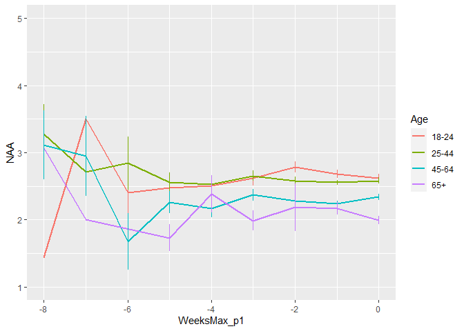
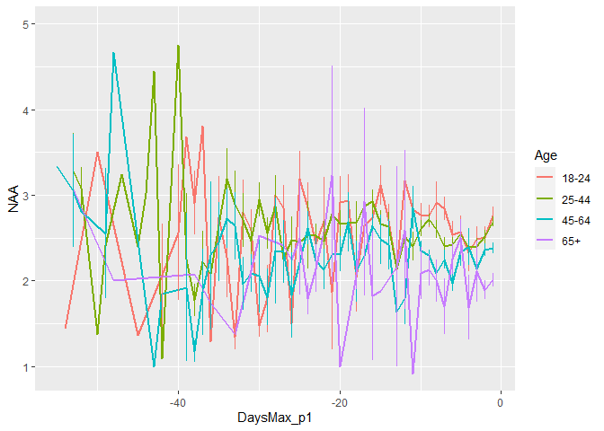
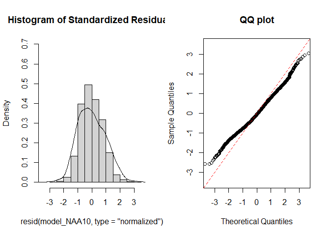
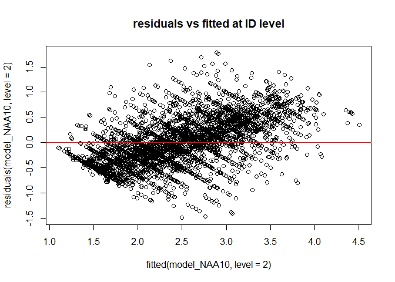
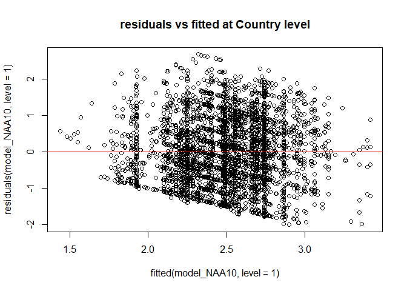
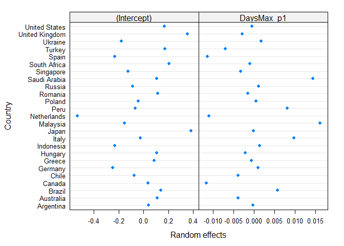
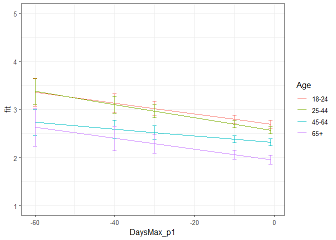

Second analysis NAA Phase 1
================
Anne Margit
10/04/2020

    ## [1] ""

``` r
load("data_analyse2_p1.Rdata")
```

This dataset includes:

1.  Data from all weekly measurement waves (baseline through wave 11,
    Time 1 through 12)
2.  Participants who provided at least 3 measurements
3.  Participants who are residents of the country they currently live in
4.  Participants who provided info on age
5.  Participants who provided info on gender (either male or female)
6.  Data from countries with at least 20 participants
7.  Pooled age groups
8.  Imputed missing emotion scores
9.  Combined emotion scores (NAA, NAD, PAA, PAD)
10. An imputed Stringency index (StringencyIndex\_imp)
11. A variable indicating the number of days before and after the day on
    which maximum stringency was reached for the respective country
    (DaysMax)
12. A variable indicating the number of weeks before and after the day
    on which maximum stringency was reached for the respective country
    (WeeksMax)
13. A variable indicating the date on which maximum Stringency was
    reached for that country (DateMaxStr)
14. A dummy Str\_dummy with 0 = before the peaj, 1 = during peak, 2 =
    after peak
15. Observations during which there was a second peak are excluded
    (N=583)

> My comments are in block quotes such as this.

``` r
library(dplyr)
library(tidyverse)
library(ggpubr)
library(ggplot2)
library(rockchalk)
library(effects)
library(nlme)
library(lattice)
library(broom.mixed)
library(purrr)
```

# Descriptives

**Number of participants per age group**

``` r
data_analyse2_p1 %>%
  group_by(Age_new) %>%
  summarise(NAge = n())
```

    # A tibble: 4 x 2
      Age_new  NAge
      <fct>   <int>
    1 0         681
    2 1        1870
    3 2        1265
    4 3         291

**Plots** **Mean NAA against max stringency in WEEKS**

``` r
plot_NAA <- ggplot(data_analyse2_p1, aes(x=WeeksMax_p1, y=NAA, group = Age_new, color = Age_new))

plot_NAA + stat_summary(fun.y=mean, geom="line", size=1)  + geom_errorbar(stat="summary", fun.data="mean_se", width=0) + scale_colour_discrete(name = "Age", labels = c("18-24", "25-44", "45-64", "65+")) + expand_limits(y=c(1, 5))
```

<!-- -->

**Mean NAA against max stringency in DAYS**

``` r
plot_NAA <- ggplot(data_analyse2_p1, aes(x=DaysMax_p1, y=NAA, group = Age_new, color = Age_new))

plot_NAA + stat_summary(fun.y=mean, geom="line", size=1)  + geom_errorbar(stat="summary", fun.data="mean_se", width=0) + scale_colour_discrete(name = "Age", labels = c("18-24", "25-44", "45-64", "65+")) + expand_limits(y=c(1, 5))
```

<!-- -->

# Regression models phase 1

**Negative affect high arousal**

*Predictors: DaysMax\_p1, Age, Random: IC for Country*

``` r
model_NAA1 <- lme(fixed = NAA ~ DaysMax_p1 + Age_new + DaysMax_p1*Age_new,
                   random = ~1 | Country, 
                  data = data_analyse2_p1, 
                  na.action = na.omit)

summary(model_NAA1)
```

    Linear mixed-effects model fit by REML
     Data: data_analyse2_p1 
           AIC      BIC    logLik
      11082.18 11145.37 -5531.092
    
    Random effects:
     Formula: ~1 | Country
            (Intercept)  Residual
    StdDev:   0.2662169 0.9198764
    
    Fixed effects: NAA ~ DaysMax_p1 + Age_new + DaysMax_p1 * Age_new 
                             Value  Std.Error   DF  t-value p-value
    (Intercept)          2.7459454 0.08435016 4075 32.55412  0.0000
    DaysMax_p1          -0.0011487 0.00373774 4075 -0.30733  0.7586
    Age_new1            -0.1474730 0.06312142 4075 -2.33634  0.0195
    Age_new2            -0.4202392 0.06625755 4075 -6.34251  0.0000
    Age_new3            -0.7608792 0.09123498 4075 -8.33977  0.0000
    DaysMax_p1:Age_new1 -0.0058437 0.00415006 4075 -1.40811  0.1592
    DaysMax_p1:Age_new2 -0.0012419 0.00446640 4075 -0.27805  0.7810
    DaysMax_p1:Age_new3 -0.0033290 0.00719194 4075 -0.46288  0.6435
     Correlation: 
                        (Intr) DysM_1 Ag_nw1 Ag_nw2 Ag_nw3 DM_1:A_1 DM_1:A_2
    DaysMax_p1           0.501                                              
    Age_new1            -0.556 -0.610                                       
    Age_new2            -0.535 -0.589  0.726                                
    Age_new3            -0.404 -0.451  0.519  0.511                         
    DaysMax_p1:Age_new1 -0.411 -0.800  0.748  0.540  0.394                  
    DaysMax_p1:Age_new2 -0.394 -0.766  0.521  0.725  0.374  0.683           
    DaysMax_p1:Age_new3 -0.255 -0.499  0.318  0.307  0.660  0.426    0.418  
    
    Standardized Within-Group Residuals:
           Min         Q1        Med         Q3        Max 
    -2.1451385 -0.7846353 -0.1011767  0.7148298  2.9068004 
    
    Number of Observations: 4107
    Number of Groups: 25 

*Predictors: DaysMax\_p1, Age, Random: IC for ID*

``` r
model_NAA2 <- lme(fixed = NAA ~ DaysMax_p1 + Age_new + DaysMax_p1*Age_new,
                  random = ~1 | ID, 
                 data = data_analyse2_p1, 
                 na.action = na.omit)

summary(model_NAA2)
```

    Linear mixed-effects model fit by REML
     Data: data_analyse2_p1 
           AIC      BIC    logLik
      10474.87 10538.06 -5227.435
    
    Random effects:
     Formula: ~1 | ID
            (Intercept)  Residual
    StdDev:   0.7284419 0.5873333
    
    Fixed effects: NAA ~ DaysMax_p1 + Age_new + DaysMax_p1 * Age_new 
                             Value  Std.Error   DF  t-value p-value
    (Intercept)          2.6548783 0.05334302 2720 49.76993  0.0000
    DaysMax_p1          -0.0027742 0.00306216 1379 -0.90597  0.3651
    Age_new1            -0.1151390 0.06150704 2720 -1.87196  0.0613
    Age_new2            -0.3622224 0.06440807 2720 -5.62387  0.0000
    Age_new3            -0.6291067 0.08622465 2720 -7.29614  0.0000
    DaysMax_p1:Age_new1 -0.0036263 0.00361607 1379 -1.00282  0.3161
    DaysMax_p1:Age_new2  0.0010153 0.00385679 1379  0.26326  0.7924
    DaysMax_p1:Age_new3 -0.0049085 0.00604557 1379 -0.81192  0.4170
     Correlation: 
                        (Intr) DysM_1 Ag_nw1 Ag_nw2 Ag_nw3 DM_1:A_1 DM_1:A_2
    DaysMax_p1           0.586                                              
    Age_new1            -0.867 -0.508                                       
    Age_new2            -0.828 -0.485  0.718                                
    Age_new3            -0.619 -0.363  0.537  0.512                         
    DaysMax_p1:Age_new1 -0.496 -0.847  0.579  0.411  0.307                  
    DaysMax_p1:Age_new2 -0.465 -0.794  0.404  0.564  0.288  0.672           
    DaysMax_p1:Age_new3 -0.297 -0.507  0.257  0.246  0.503  0.429    0.402  
    
    Standardized Within-Group Residuals:
            Min          Q1         Med          Q3         Max 
    -3.00851407 -0.52950134 -0.04399534  0.51590581  2.88073970 
    
    Number of Observations: 4107
    Number of Groups: 2724 

*Random: IC for ID and Country*

``` r
model_NAA3 <- lme(fixed = NAA ~ DaysMax_p1 + Age_new + DaysMax_p1*Age_new,
                  random = ~1 | Country/ID, 
                  data = data_analyse2_p1, 
                  na.action = na.omit)

summary(model_NAA3)
```

    Linear mixed-effects model fit by REML
     Data: data_analyse2_p1 
           AIC      BIC    logLik
      10351.04 10420.55 -5164.521
    
    Random effects:
     Formula: ~1 | Country
            (Intercept)
    StdDev:   0.2671464
    
     Formula: ~1 | ID %in% Country
            (Intercept)  Residual
    StdDev:   0.6984982 0.5854827
    
    Fixed effects: NAA ~ DaysMax_p1 + Age_new + DaysMax_p1 * Age_new 
                             Value  Std.Error   DF  t-value p-value
    (Intercept)          2.7253799 0.08302902 2696 32.82443  0.0000
    DaysMax_p1          -0.0040965 0.00308840 1379 -1.32641  0.1849
    Age_new1            -0.1352740 0.06092395 2696 -2.22038  0.0265
    Age_new2            -0.3920175 0.06412198 2696 -6.11362  0.0000
    Age_new3            -0.7479516 0.08771462 2696 -8.52710  0.0000
    DaysMax_p1:Age_new1 -0.0042972 0.00359084 1379 -1.19670  0.2316
    DaysMax_p1:Age_new2  0.0011934 0.00383699 1379  0.31102  0.7558
    DaysMax_p1:Age_new3 -0.0039359 0.00608029 1379 -0.64731  0.5175
     Correlation: 
                        (Intr) DysM_1 Ag_nw1 Ag_nw2 Ag_nw3 DM_1:A_1 DM_1:A_2
    DaysMax_p1           0.379                                              
    Age_new1            -0.546 -0.491                                       
    Age_new2            -0.521 -0.469  0.721                                
    Age_new3            -0.389 -0.355  0.516  0.510                         
    DaysMax_p1:Age_new1 -0.313 -0.826  0.584  0.414  0.306                  
    DaysMax_p1:Age_new2 -0.298 -0.782  0.402  0.558  0.288  0.672           
    DaysMax_p1:Age_new3 -0.189 -0.503  0.246  0.235  0.506  0.426    0.411  
    
    Standardized Within-Group Residuals:
           Min         Q1        Med         Q3        Max 
    -2.9821601 -0.5444597 -0.0517458  0.5083882  2.9499167 
    
    Number of Observations: 4107
    Number of Groups: 
            Country ID %in% Country 
                 25            2724 

*Random: IC for ID and Country, S for Country*

``` r
model_NAA4 <- lme(fixed = NAA ~ DaysMax_p1 + Age_new + DaysMax_p1*Age_new,
                  random = list (Country = ~DaysMax_p1, ID = ~1), 
                  data = data_analyse2_p1, 
                  na.action = na.omit)

summary(model_NAA4)
```

    Linear mixed-effects model fit by REML
     Data: data_analyse2_p1 
           AIC      BIC    logLik
      10326.61 10408.75 -5150.306
    
    Random effects:
     Formula: ~DaysMax_p1 | Country
     Structure: General positive-definite, Log-Cholesky parametrization
                StdDev     Corr  
    (Intercept) 0.29760691 (Intr)
    DaysMax_p1  0.01582256 0.706 
    
     Formula: ~1 | ID %in% Country
            (Intercept)  Residual
    StdDev:   0.7031184 0.5769956
    
    Fixed effects: NAA ~ DaysMax_p1 + Age_new + DaysMax_p1 * Age_new 
                             Value  Std.Error   DF   t-value p-value
    (Intercept)          2.7042893 0.09032229 2696 29.940442  0.0000
    DaysMax_p1          -0.0083868 0.00560245 1379 -1.496987  0.1346
    Age_new1            -0.1284627 0.06088142 2696 -2.110048  0.0349
    Age_new2            -0.3739807 0.06466285 2696 -5.783548  0.0000
    Age_new3            -0.7438025 0.08943679 2696 -8.316517  0.0000
    DaysMax_p1:Age_new1 -0.0024936 0.00360292 1379 -0.692093  0.4890
    DaysMax_p1:Age_new2  0.0041056 0.00398554 1379  1.030132  0.3031
    DaysMax_p1:Age_new3 -0.0009437 0.00624822 1379 -0.151031  0.8800
     Correlation: 
                        (Intr) DysM_1 Ag_nw1 Ag_nw2 Ag_nw3 DM_1:A_1 DM_1:A_2
    DaysMax_p1           0.636                                              
    Age_new1            -0.499 -0.270                                       
    Age_new2            -0.475 -0.264  0.719                                
    Age_new3            -0.356 -0.204  0.512  0.518                         
    DaysMax_p1:Age_new1 -0.288 -0.456  0.582  0.416  0.302                  
    DaysMax_p1:Age_new2 -0.261 -0.417  0.396  0.565  0.296  0.666           
    DaysMax_p1:Age_new3 -0.173 -0.279  0.251  0.264  0.511  0.433    0.455  
    
    Standardized Within-Group Residuals:
            Min          Q1         Med          Q3         Max 
    -2.76083475 -0.53789753 -0.05515427  0.50825409  2.89581165 
    
    Number of Observations: 4107
    Number of Groups: 
            Country ID %in% Country 
                 25            2724 

*Random: IC for ID and Country, S for ID*

``` r
model_NAA5 <- lme(fixed = NAA ~ DaysMax_p1 + Age_new + DaysMax_p1*Age_new,
                  random = list (Country = ~1, ID = ~DaysMax_p1), 
                  data = data_analyse2_p1, 
                  na.action = na.omit)

summary(model_NAA5)
```

    Linear mixed-effects model fit by REML
     Data: data_analyse2_p1 
           AIC      BIC    logLik
      10341.17 10423.31 -5157.585
    
    Random effects:
     Formula: ~1 | Country
            (Intercept)
    StdDev:   0.2650641
    
     Formula: ~DaysMax_p1 | ID %in% Country
     Structure: General positive-definite, Log-Cholesky parametrization
                StdDev     Corr  
    (Intercept) 0.75059021 (Intr)
    DaysMax_p1  0.01713607 0.392 
    Residual    0.55814208       
    
    Fixed effects: NAA ~ DaysMax_p1 + Age_new + DaysMax_p1 * Age_new 
                             Value  Std.Error   DF  t-value p-value
    (Intercept)          2.7142849 0.08387449 2696 32.36127  0.0000
    DaysMax_p1          -0.0052732 0.00336021 1379 -1.56929  0.1168
    Age_new1            -0.1276586 0.06294660 2696 -2.02805  0.0427
    Age_new2            -0.3794551 0.06621757 2696 -5.73043  0.0000
    Age_new3            -0.7236592 0.09035077 2696 -8.00944  0.0000
    DaysMax_p1:Age_new1 -0.0034783 0.00390090 1379 -0.89168  0.3727
    DaysMax_p1:Age_new2  0.0027188 0.00417924 1379  0.65054  0.5155
    DaysMax_p1:Age_new3 -0.0007748 0.00654573 1379 -0.11836  0.9058
     Correlation: 
                        (Intr) DysM_1 Ag_nw1 Ag_nw2 Ag_nw3 DM_1:A_1 DM_1:A_2
    DaysMax_p1           0.412                                              
    Age_new1            -0.559 -0.521                                       
    Age_new2            -0.534 -0.499  0.722                                
    Age_new3            -0.400 -0.379  0.518  0.512                         
    DaysMax_p1:Age_new1 -0.342 -0.824  0.620  0.440  0.326                  
    DaysMax_p1:Age_new2 -0.323 -0.779  0.426  0.595  0.307  0.670           
    DaysMax_p1:Age_new3 -0.209 -0.508  0.265  0.254  0.542  0.430    0.417  
    
    Standardized Within-Group Residuals:
            Min          Q1         Med          Q3         Max 
    -2.46491030 -0.52107994 -0.05290658  0.48662069  3.00098306 
    
    Number of Observations: 4107
    Number of Groups: 
            Country ID %in% Country 
                 25            2724 

*Random slope for Country and ID*

``` r
model_NAA6 <- lme(fixed = NAA ~ DaysMax_p1 + Age_new + DaysMax_p1*Age_new,
                  random = ~DaysMax_p1 | Country/ID, 
                  data = data_analyse2_p1, 
                  na.action = na.omit)

summary(model_NAA6)
```

    Linear mixed-effects model fit by REML
     Data: data_analyse2_p1 
           AIC      BIC    logLik
      10321.38 10416.16 -5145.689
    
    Random effects:
     Formula: ~DaysMax_p1 | Country
     Structure: General positive-definite, Log-Cholesky parametrization
                StdDev     Corr  
    (Intercept) 0.29867813 (Intr)
    DaysMax_p1  0.01594816 0.705 
    
     Formula: ~DaysMax_p1 | ID %in% Country
     Structure: General positive-definite, Log-Cholesky parametrization
                StdDev     Corr  
    (Intercept) 0.74597118 (Intr)
    DaysMax_p1  0.01535698 0.364 
    Residual    0.55517469       
    
    Fixed effects: NAA ~ DaysMax_p1 + Age_new + DaysMax_p1 * Age_new 
                             Value  Std.Error   DF   t-value p-value
    (Intercept)          2.6967943 0.09148560 2696 29.477801  0.0000
    DaysMax_p1          -0.0090750 0.00574332 1379 -1.580090  0.1143
    Age_new1            -0.1254798 0.06261478 2696 -2.003996  0.0452
    Age_new2            -0.3700686 0.06646013 2696 -5.568280  0.0000
    Age_new3            -0.7316722 0.09181363 2696 -7.969101  0.0000
    DaysMax_p1:Age_new1 -0.0021768 0.00386113 1379 -0.563776  0.5730
    DaysMax_p1:Age_new2  0.0045915 0.00426526 1379  1.076496  0.2819
    DaysMax_p1:Age_new3  0.0007049 0.00665551 1379  0.105915  0.9157
     Correlation: 
                        (Intr) DysM_1 Ag_nw1 Ag_nw2 Ag_nw3 DM_1:A_1 DM_1:A_2
    DaysMax_p1           0.646                                              
    Age_new1            -0.507 -0.298                                       
    Age_new2            -0.482 -0.289  0.719                                
    Age_new3            -0.362 -0.223  0.512  0.519                         
    DaysMax_p1:Age_new1 -0.309 -0.476  0.614  0.438  0.317                  
    DaysMax_p1:Age_new2 -0.280 -0.435  0.417  0.597  0.312  0.663           
    DaysMax_p1:Age_new3 -0.186 -0.292  0.266  0.278  0.543  0.433    0.455  
    
    Standardized Within-Group Residuals:
            Min          Q1         Med          Q3         Max 
    -2.42028620 -0.51608288 -0.05203809  0.48807258  2.96527004 
    
    Number of Observations: 4107
    Number of Groups: 
            Country ID %in% Country 
                 25            2724 

> Model with only random slope for Country is better than with random
> slope for ID or for both

*Random: IC for ID and Country, S for Country, No correlation between IC
and S for Country*

``` r
model_NAA7 <- lme(fixed = NAA ~ DaysMax_p1 + Age_new + DaysMax_p1*Age_new,
                  random = list(Country = pdDiag(~DaysMax_p1), ID = ~1), 
                  data = data_analyse2_p1, 
                  na.action = na.omit)

summary(model_NAA7)
```

    Linear mixed-effects model fit by REML
     Data: data_analyse2_p1 
           AIC      BIC    logLik
      10327.64 10403.47 -5151.822
    
    Random effects:
     Formula: ~DaysMax_p1 | Country
     Structure: Diagonal
            (Intercept) DaysMax_p1
    StdDev:   0.2588696 0.01187253
    
     Formula: ~1 | ID %in% Country
            (Intercept)  Residual
    StdDev:   0.7026465 0.5776955
    
    Fixed effects: NAA ~ DaysMax_p1 + Age_new + DaysMax_p1 * Age_new 
                             Value  Std.Error   DF  t-value p-value
    (Intercept)          2.6903005 0.08286284 2696 32.46691  0.0000
    DaysMax_p1          -0.0106444 0.00495836 1379 -2.14676  0.0320
    Age_new1            -0.1275129 0.06085156 2696 -2.09548  0.0362
    Age_new2            -0.3725834 0.06457623 2696 -5.76967  0.0000
    Age_new3            -0.7374569 0.08908034 2696 -8.27856  0.0000
    DaysMax_p1:Age_new1 -0.0025670 0.00360235 1379 -0.71258  0.4762
    DaysMax_p1:Age_new2  0.0040624 0.00397876 1379  1.02103  0.3074
    DaysMax_p1:Age_new3 -0.0005193 0.00624231 1379 -0.08318  0.9337
     Correlation: 
                        (Intr) DysM_1 Ag_nw1 Ag_nw2 Ag_nw3 DM_1:A_1 DM_1:A_2
    DaysMax_p1           0.323                                              
    Age_new1            -0.544 -0.299                                       
    Age_new2            -0.519 -0.291  0.719                                
    Age_new3            -0.389 -0.223  0.512  0.517                         
    DaysMax_p1:Age_new1 -0.309 -0.509  0.581  0.415  0.301                  
    DaysMax_p1:Age_new2 -0.285 -0.469  0.395  0.563  0.294  0.665           
    DaysMax_p1:Age_new3 -0.188 -0.313  0.249  0.260  0.508  0.432    0.454  
    
    Standardized Within-Group Residuals:
            Min          Q1         Med          Q3         Max 
    -2.77122695 -0.53944236 -0.05615358  0.50822247  2.90468901 
    
    Number of Observations: 4107
    Number of Groups: 
            Country ID %in% Country 
                 25            2724 

*Random: IC for ID and Country, S for ID and Country, No correlation
between IC and S for Country*

``` r
model_NAA8 <- lme(fixed = NAA ~ DaysMax_p1 + Age_new + DaysMax_p1*Age_new,
                  random = list(Country = pdDiag(~DaysMax_p1), ID = ~DaysMax_p1), 
                  data = data_analyse2_p1, 
                  na.action = na.omit)

summary(model_NAA8)
```

    Linear mixed-effects model fit by REML
     Data: data_analyse2_p1 
           AIC      BIC    logLik
      10322.46 10410.92 -5147.228
    
    Random effects:
     Formula: ~DaysMax_p1 | Country
     Structure: Diagonal
            (Intercept) DaysMax_p1
    StdDev:   0.2596183 0.01199259
    
     Formula: ~DaysMax_p1 | ID %in% Country
     Structure: General positive-definite, Log-Cholesky parametrization
                StdDev     Corr  
    (Intercept) 0.74542539 (Intr)
    DaysMax_p1  0.01536099 0.363 
    Residual    0.55587969       
    
    Fixed effects: NAA ~ DaysMax_p1 + Age_new + DaysMax_p1 * Age_new 
                             Value  Std.Error   DF  t-value p-value
    (Intercept)          2.6831495 0.08397832 2696 31.95050  0.0000
    DaysMax_p1          -0.0114701 0.00511573 1379 -2.24212  0.0251
    Age_new1            -0.1246033 0.06257051 2696 -1.99141  0.0465
    Age_new2            -0.3684078 0.06635312 2696 -5.55223  0.0000
    Age_new3            -0.7244543 0.09141510 2696 -7.92489  0.0000
    DaysMax_p1:Age_new1 -0.0022527 0.00386036 1379 -0.58355  0.5596
    DaysMax_p1:Age_new2  0.0045832 0.00425845 1379  1.07626  0.2820
    DaysMax_p1:Age_new3  0.0012461 0.00664843 1379  0.18742  0.8514
     Correlation: 
                        (Intr) DysM_1 Ag_nw1 Ag_nw2 Ag_nw3 DM_1:A_1 DM_1:A_2
    DaysMax_p1           0.345                                              
    Age_new1            -0.553 -0.329                                       
    Age_new2            -0.527 -0.317  0.719                                
    Age_new3            -0.396 -0.242  0.513  0.518                         
    DaysMax_p1:Age_new1 -0.332 -0.530  0.613  0.436  0.317                  
    DaysMax_p1:Age_new2 -0.305 -0.487  0.416  0.594  0.310  0.663           
    DaysMax_p1:Age_new3 -0.202 -0.326  0.264  0.274  0.540  0.432    0.454  
    
    Standardized Within-Group Residuals:
            Min          Q1         Med          Q3         Max 
    -2.42650413 -0.51794862 -0.05140842  0.48905142  2.97294955 
    
    Number of Observations: 4107
    Number of Groups: 
            Country ID %in% Country 
                 25            2724 

*Random: IC for ID and Country, S for ID and Country, No correlation
between IC and S for Country and ID*

``` r
model_NAA9 <- lme(fixed = NAA ~ DaysMax_p1 + Age_new + DaysMax_p1*Age_new,
                  random = list (Country = pdDiag(~DaysMax_p1), ID = pdDiag(~DaysMax_p1)),
                  data = data_analyse2_p1, 
                  na.action = na.omit)

summary(model_NAA9)
```

    Linear mixed-effects model fit by REML
     Data: data_analyse2_p1 
          AIC      BIC    logLik
      10327.8 10409.94 -5150.901
    
    Random effects:
     Formula: ~DaysMax_p1 | Country
     Structure: Diagonal
            (Intercept) DaysMax_p1
    StdDev:   0.2596912 0.01193573
    
     Formula: ~DaysMax_p1 | ID %in% Country
     Structure: Diagonal
            (Intercept)  DaysMax_p1 Residual
    StdDev:   0.7000659 0.007689488 0.572771
    
    Fixed effects: NAA ~ DaysMax_p1 + Age_new + DaysMax_p1 * Age_new 
                             Value  Std.Error   DF  t-value p-value
    (Intercept)          2.6864673 0.08297421 2696 32.37714  0.0000
    DaysMax_p1          -0.0111475 0.00503329 1379 -2.21475  0.0269
    Age_new1            -0.1253107 0.06087455 2696 -2.05851  0.0396
    Age_new2            -0.3702024 0.06458413 2696 -5.73210  0.0000
    Age_new3            -0.7328271 0.08903859 2696 -8.23044  0.0000
    DaysMax_p1:Age_new1 -0.0023345 0.00372864 1379 -0.62610  0.5314
    DaysMax_p1:Age_new2  0.0043421 0.00412177 1379  1.05345  0.2923
    DaysMax_p1:Age_new3  0.0001008 0.00647080 1379  0.01557  0.9876
     Correlation: 
                        (Intr) DysM_1 Ag_nw1 Ag_nw2 Ag_nw3 DM_1:A_1 DM_1:A_2
    DaysMax_p1           0.324                                              
    Age_new1            -0.544 -0.304                                       
    Age_new2            -0.518 -0.295  0.719                                
    Age_new3            -0.389 -0.226  0.513  0.518                         
    DaysMax_p1:Age_new1 -0.308 -0.519  0.580  0.413  0.301                  
    DaysMax_p1:Age_new2 -0.283 -0.477  0.392  0.562  0.294  0.662           
    DaysMax_p1:Age_new3 -0.187 -0.318  0.248  0.259  0.509  0.430    0.452  
    
    Standardized Within-Group Residuals:
            Min          Q1         Med          Q3         Max 
    -2.57495267 -0.53446916 -0.05635199  0.50292993  2.93046583 
    
    Number of Observations: 4107
    Number of Groups: 
            Country ID %in% Country 
                 25            2724 

> Best model is NAA7: random IC for ID and Country + S for Country + no
> correlation between IC and S for Country\*

*Autoregressive correlation structure for measurements, only random
intercept for ID*

``` r
data_analyse2_p1 <- data_analyse2_p1[with(data_analyse2_p1, order(Country, ID, Time)),]
data_analyse2_p1$Time <- as.numeric(data_analyse2_p1$Time)

model_NAA10 <- lme(fixed = NAA ~ DaysMax_p1 + Age_new + DaysMax_p1*Age_new,
                  random = list(Country = pdDiag(~DaysMax_p1), ID = ~1), 
                  data = data_analyse2_p1, 
                  na.action = na.omit,
                  correlation = corAR1(form = ~ Time | Country/ID))

summary(model_NAA10)
```

    Linear mixed-effects model fit by REML
     Data: data_analyse2_p1 
           AIC      BIC    logLik
      10312.89 10395.03 -5143.444
    
    Random effects:
     Formula: ~DaysMax_p1 | Country
     Structure: Diagonal
            (Intercept) DaysMax_p1
    StdDev:   0.2610018   0.012215
    
     Formula: ~1 | ID %in% Country
            (Intercept) Residual
    StdDev:   0.6714912 0.613494
    
    Correlation Structure: ARMA(1,0)
     Formula: ~Time | Country/ID 
     Parameter estimate(s):
        Phi1 
    0.219393 
    Fixed effects: NAA ~ DaysMax_p1 + Age_new + DaysMax_p1 * Age_new 
                             Value  Std.Error   DF  t-value p-value
    (Intercept)          2.6845102 0.08387234 2696 32.00710  0.0000
    DaysMax_p1          -0.0113319 0.00509403 1379 -2.22455  0.0263
    Age_new1            -0.1239919 0.06197244 2696 -2.00076  0.0455
    Age_new2            -0.3690002 0.06571533 2696 -5.61513  0.0000
    Age_new3            -0.7350148 0.09036360 2696 -8.13397  0.0000
    DaysMax_p1:Age_new1 -0.0023191 0.00373009 1379 -0.62174  0.5342
    DaysMax_p1:Age_new2  0.0043406 0.00411933 1379  1.05371  0.2922
    DaysMax_p1:Age_new3 -0.0000272 0.00648534 1379 -0.00420  0.9967
     Correlation: 
                        (Intr) DysM_1 Ag_nw1 Ag_nw2 Ag_nw3 DM_1:A_1 DM_1:A_2
    DaysMax_p1           0.333                                              
    Age_new1            -0.548 -0.312                                       
    Age_new2            -0.523 -0.302  0.720                                
    Age_new3            -0.393 -0.231  0.515  0.519                         
    DaysMax_p1:Age_new1 -0.322 -0.514  0.600  0.428  0.312                  
    DaysMax_p1:Age_new2 -0.296 -0.473  0.408  0.582  0.304  0.665           
    DaysMax_p1:Age_new3 -0.195 -0.314  0.256  0.266  0.528  0.430    0.450  
    
    Standardized Within-Group Residuals:
            Min          Q1         Med          Q3         Max 
    -2.43645475 -0.56142080 -0.06014771  0.53393423  2.90206839 
    
    Number of Observations: 4107
    Number of Groups: 
            Country ID %in% Country 
                 25            2724 

> Model NAA10 has the best fit (lowest BIC). Random intercept for ID and
> Country, random slope for Country, no correlation between random
> intercept and slope for Country, AR correlation structure at
> Measuement level

*QQ plot of residuals*

``` r
par(mfrow = c(1,2))
lims <- c(-3.5,3.5)
hist(resid(model_NAA10, type = "normalized"),
freq = FALSE, xlim = lims, ylim =  c(0,.7),main = "Histogram of Standardized Residuals")
lines(density(scale(resid(model_NAA10))))
qqnorm(resid(model_NAA10, type = "normalized"),
xlim = lims, ylim = lims,main = "QQ plot")
abline(0,1, col = "red", lty = 2)
```

<!-- -->

*Residuals vs fitted*

``` r
plot(fitted(model_NAA10, level=2), residuals(model_NAA10, level=2), 
     main="residuals vs fitted at ID level")
abline(a=0, b=0,col="red")
```

<!-- -->

``` r
plot(fitted(model_NAA10, level=1), residuals(model_NAA10, level=1), 
    main="residuals vs fitted at Country level")
abline(a=0, b=0,col="red")
```

<!-- -->

> Residuen zien er allemaal goed uit

*Plot random intercepts and slopes*

``` r
plot(ranef(model_NAA10, level = 1))
```

<!-- -->

``` r
plot(ranef(model_NAA10, level = 2))
```

<!-- -->

*Confidence intervals*

``` r
intervals(model_NAA10)
```

    Approximate 95% confidence intervals
    
     Fixed effects:
                               lower          est.        upper
    (Intercept)          2.520049556  2.684510e+00  2.848970770
    DaysMax_p1          -0.021324839 -1.133195e-02 -0.001339059
    Age_new1            -0.245510186 -1.239919e-01 -0.002473591
    Age_new2            -0.497857693 -3.690002e-01 -0.240142622
    Age_new3            -0.912203745 -7.350148e-01 -0.557825843
    DaysMax_p1:Age_new1 -0.009636413 -2.319141e-03  0.004998131
    DaysMax_p1:Age_new2 -0.003740253  4.340577e-03  0.012421408
    DaysMax_p1:Age_new3 -0.012749408 -2.721598e-05  0.012694976
    attr(,"label")
    [1] "Fixed effects:"
    
     Random Effects:
      Level: Country 
                          lower      est.      upper
    sd((Intercept)) 0.173203332 0.2610018 0.39330613
    sd(DaysMax_p1)  0.006238264 0.0122150 0.02391791
      Level: ID 
                        lower      est.     upper
    sd((Intercept)) 0.6346032 0.6714912 0.7105234
    
     Correlation structure:
             lower     est.    upper
    Phi1 0.1158895 0.219393 0.318183
    attr(,"label")
    [1] "Correlation structure:"
    
     Within-group standard error:
        lower      est.     upper 
    0.5828127 0.6134940 0.6457904 

*Plot of predicted values*

``` r
ef_NAA <- effect("DaysMax_p1:Age_new", model_NAA10)

plot_NAA <- ggplot(as.data.frame(ef_NAA), 
       aes(DaysMax_p1, fit, color=Age_new)) + geom_line() + 
  geom_errorbar(aes(ymin=fit-se, ymax=fit+se), width=1) + theme_bw(base_size=12) + scale_color_discrete(name="Age", labels = c("18-24", "25-44", "45-64", "65+")) + expand_limits(y=c(1, 5))
```

``` r
plot_NAA
```

<!-- -->

``` r
coef_NAA = tidy(model_NAA10, 
               effects = "fixed")
```

*Effect sizes* **Within person SD and average within person SD of NAA**

``` r
ISDs <- data_analyse2_p1 %>% 
  group_by(ID) %>%
  summarize_at(c("NAA"), sd, na.rm=TRUE) %>%
  ungroup()

ISDs_av <- ISDs %>%
  summarize_at(c("NAA"), mean, na.rm=TRUE) %>%
  stack() %>%
  rename(sd=values) 
```

> Effect sizes for intercept and main effect of age = regression
> coefficient / average ISD of NAA Effect size for main effect of
> DaysMax = (regression coefficient \* 28)/ average ISD of NAA Effect
> sizes for interaction effects = (regression coefficient \* 28)/
> average ISD of NAA

> The effect sizes for main effect of DaysMax and the interaction
> effects reflect the increase in SD of NAA over 4 weeks (28 days)

``` r
coef_NAA <- coef_NAA %>%
  mutate(e_size = ifelse(row_number()== 1 | row_number()== 3 |  row_number()== 4 |  row_number()== 5,
          estimate/0.4676267, 
          (estimate*28)/0.4676267))
```

``` r
coef_NAA
```

    ## # A tibble: 8 x 7
    ##   term                  estimate std.error    df statistic   p.value   e_size
    ##   <chr>                    <dbl>     <dbl> <dbl>     <dbl>     <dbl>    <dbl>
    ## 1 (Intercept)          2.68        0.0839   2696  32.0     8.19e-191  5.74   
    ## 2 DaysMax_p1          -0.0113      0.00509  1379  -2.22    2.63e-  2 -0.679  
    ## 3 Age_new1            -0.124       0.0620   2696  -2.00    4.55e-  2 -0.265  
    ## 4 Age_new2            -0.369       0.0657   2696  -5.62    2.16e-  8 -0.789  
    ## 5 Age_new3            -0.735       0.0904   2696  -8.13    6.27e- 16 -1.57   
    ## 6 DaysMax_p1:Age_new1 -0.00232     0.00373  1379  -0.622   5.34e-  1 -0.139  
    ## 7 DaysMax_p1:Age_new2  0.00434     0.00412  1379   1.05    2.92e-  1  0.260  
    ## 8 DaysMax_p1:Age_new3 -0.0000272   0.00649  1379  -0.00420 9.97e-  1 -0.00163

> There are differences between age groups in intensity but not in rate
> of change dependent on DaysMax
