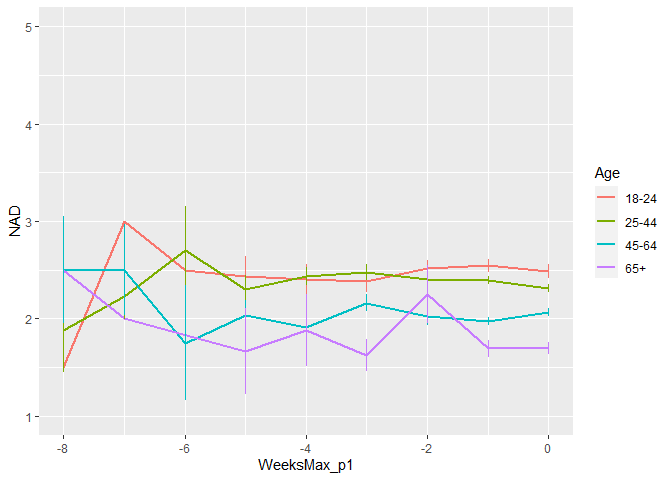
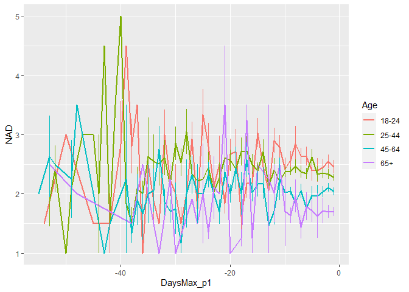
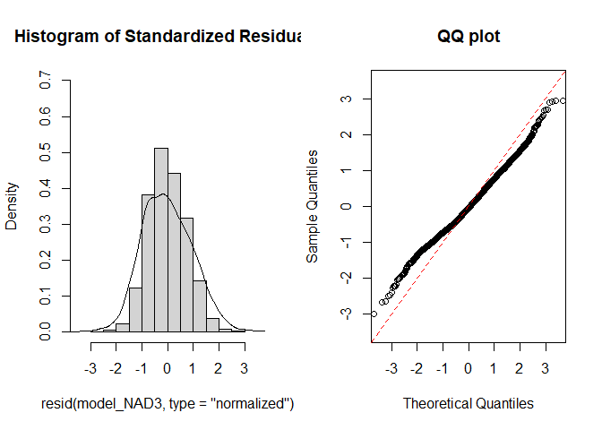
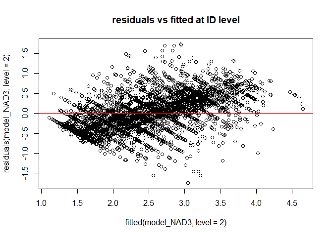
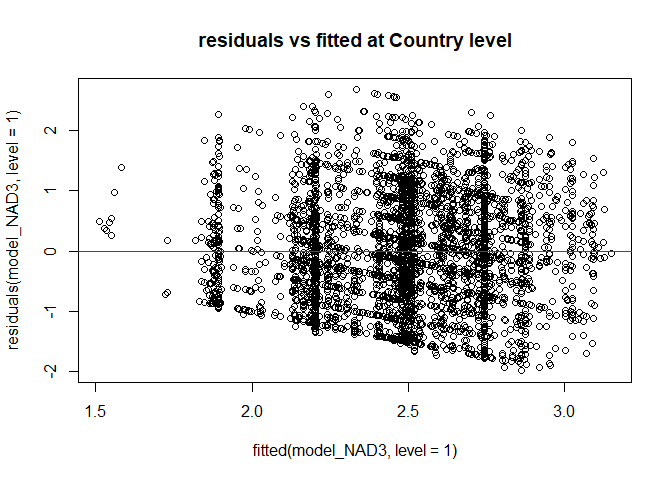
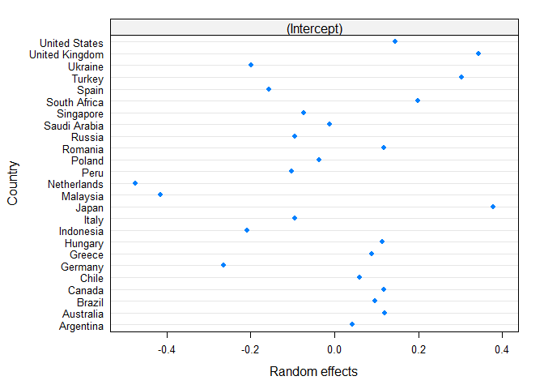
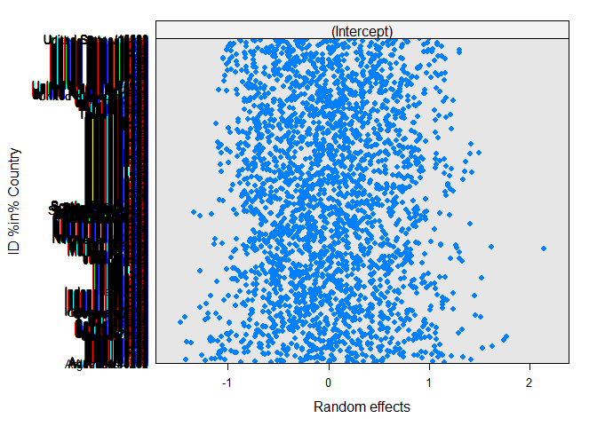
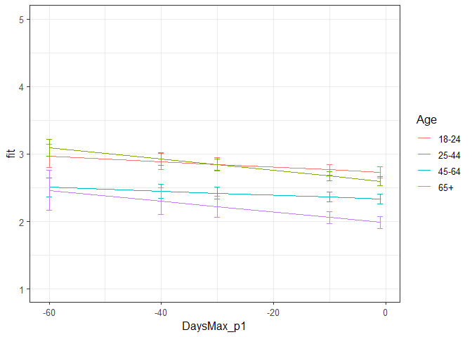

Second analysis NAD Phase 1
================
Anne Margit
10/14/2020

    ## [1] ""

``` r
load("data_analyse2_p1.Rdata")
```

This dataset includes:

1.  Data from all weekly measurement waves (baseline through wave 11,
    Time 1 through 12)
2.  Participants who provided at least 3 measurements
3.  Participants who are residents of the country they currently live in
4.  Participants who provided info on age
5.  Participants who provided info on gender (either male or female)
6.  Data from countries with at least 20 participants
7.  Pooled age groups
8.  Imputed missing emotion scores
9.  Combined emotion scores (NAA, NAD, PAA, PAD)
10. An imputed Stringency index (StringencyIndex\_imp)
11. A variable indicating the number of days before and after the day on
    which maximum stringency was reached for the respective country
    (DaysMax)
12. A variable indicating the number of weeks before and after the day
    on which maximum stringency was reached for the respective country
    (WeeksMax)
13. A variable indicating the date on which maximum Stringency was
    reached for that country (DateMaxStr)
14. A dummy Str\_dummy with 0 = before the peaj, 1 = during peak, 2 =
    after peak
15. Observations during which there was a second peak are excluded
    (N=583)

> My comments are in block quotes such as this.

``` r
library(dplyr)
library(tidyverse)
library(ggpubr)
library(ggplot2)
library(rockchalk)
library(effects)
library(nlme)
library(lattice)
library(broom.mixed)
library(purrr)
```

# Descriptives

**Number of participants per age group**

``` r
data_analyse2_p1 %>%
  group_by(Age_new) %>%
  summarise(NAge = n())
```

    # A tibble: 4 x 2
      Age_new  NAge
      <fct>   <int>
    1 0         681
    2 1        1870
    3 2        1265
    4 3         291

**Plots** **Mean NAD against max stringency in WEEKS**

``` r
plot_NAD <- ggplot(data_analyse2_p1, aes(x=WeeksMax_p1, y=NAD, group = Age_new, color = Age_new))

plot_NAD + stat_summary(fun.y=mean, geom="line", size=1)  + geom_errorbar(stat="summary", fun.data="mean_se", width=0) + scale_colour_discrete(name = "Age", labels = c("18-24", "25-44", "45-64", "65+")) + expand_limits(y=c(1, 5))
```

<!-- -->

**Mean NAA against max stringency in DAYS**

``` r
plot_NAD <- ggplot(data_analyse2_p1, aes(x=DaysMax_p1, y=NAD, group = Age_new, color = Age_new))

plot_NAD + stat_summary(fun.y=mean, geom="line", size=1)  + geom_errorbar(stat="summary", fun.data="mean_se", width=0) + scale_colour_discrete(name = "Age", labels = c("18-24", "25-44", "45-64", "65+")) + expand_limits(y=c(1, 5))
```

<!-- -->

# Regression models phase 1

**Negative affect low arousal**

*Predictors: DaysMax\_p1, Age, Random: IC for Country*

``` r
model_NAD1 <- lme(fixed = NAD ~ DaysMax_p1 + Age_new + DaysMax_p1*Age_new,
                   random = ~1 | Country, 
                  data = data_analyse2_p1, 
                  na.action = na.omit)

summary(model_NAD1)
```

    Linear mixed-effects model fit by REML
     Data: data_analyse2_p1 
           AIC     BIC    logLik
      11402.41 11465.6 -5691.206
    
    Random effects:
     Formula: ~1 | Country
            (Intercept)  Residual
    StdDev:   0.1327418 0.9588779
    
    Fixed effects: NAD ~ DaysMax_p1 + Age_new + DaysMax_p1 * Age_new 
                             Value  Std.Error   DF  t-value p-value
    (Intercept)          2.6301237 0.06708716 4075 39.20458  0.0000
    DaysMax_p1           0.0078024 0.00385571 4075  2.02360  0.0431
    Age_new1            -0.1772544 0.06558394 4075 -2.70271  0.0069
    Age_new2            -0.5116661 0.06874994 4075 -7.44242  0.0000
    Age_new3            -0.8857569 0.09426186 4075 -9.39677  0.0000
    DaysMax_p1:Age_new1 -0.0057779 0.00431728 4075 -1.33833  0.1809
    DaysMax_p1:Age_new2 -0.0037198 0.00464570 4075 -0.80069  0.4234
    DaysMax_p1:Age_new3 -0.0052769 0.00746673 4075 -0.70672  0.4798
     Correlation: 
                        (Intr) DysM_1 Ag_nw1 Ag_nw2 Ag_nw3 DM_1:A_1 DM_1:A_2
    DaysMax_p1           0.656                                              
    Age_new1            -0.724 -0.618                                       
    Age_new2            -0.694 -0.596  0.725                                
    Age_new3            -0.528 -0.456  0.521  0.509                         
    DaysMax_p1:Age_new1 -0.541 -0.811  0.748  0.540  0.395                  
    DaysMax_p1:Age_new2 -0.512 -0.772  0.521  0.726  0.374  0.683           
    DaysMax_p1:Age_new3 -0.332 -0.501  0.318  0.307  0.660  0.427    0.416  
    
    Standardized Within-Group Residuals:
           Min         Q1        Med         Q3        Max 
    -1.8330516 -0.7960415 -0.1376421  0.6524416  3.1022288 
    
    Number of Observations: 4107
    Number of Groups: 25 

*Predictors: DaysMax\_p1, Age, Random: IC for ID*

``` r
model_NAD2 <- lme(fixed = NAD ~ DaysMax_p1 + Age_new + DaysMax_p1*Age_new,
                  random = ~1 | ID, 
                 data = data_analyse2_p1, 
                 na.action = na.omit)

summary(model_NAD2)
```

    Linear mixed-effects model fit by REML
     Data: data_analyse2_p1 
          AIC      BIC   logLik
      10848.9 10912.09 -5414.45
    
    Random effects:
     Formula: ~1 | ID
            (Intercept)  Residual
    StdDev:   0.7112998 0.6472077
    
    Fixed effects: NAD ~ DaysMax_p1 + Age_new + DaysMax_p1 * Age_new 
                             Value  Std.Error   DF  t-value p-value
    (Intercept)          2.5277120 0.05544873 2720 45.58648  0.0000
    DaysMax_p1           0.0025491 0.00329023 1379  0.77473  0.4386
    Age_new1            -0.1594783 0.06391526 2720 -2.49515  0.0126
    Age_new2            -0.4963181 0.06689262 2720 -7.41962  0.0000
    Age_new3            -0.8431205 0.08942275 2720 -9.42848  0.0000
    DaysMax_p1:Age_new1 -0.0019184 0.00388112 1379 -0.49429  0.6212
    DaysMax_p1:Age_new2 -0.0019431 0.00414192 1379 -0.46912  0.6391
    DaysMax_p1:Age_new3 -0.0074450 0.00647283 1379 -1.15020  0.2503
     Correlation: 
                        (Intr) DysM_1 Ag_nw1 Ag_nw2 Ag_nw3 DM_1:A_1 DM_1:A_2
    DaysMax_p1           0.611                                              
    Age_new1            -0.868 -0.530                                       
    Age_new2            -0.829 -0.506  0.719                                
    Age_new3            -0.620 -0.379  0.538  0.514                         
    DaysMax_p1:Age_new1 -0.518 -0.848  0.603  0.429  0.321                  
    DaysMax_p1:Age_new2 -0.485 -0.794  0.421  0.588  0.301  0.673           
    DaysMax_p1:Age_new3 -0.310 -0.508  0.269  0.257  0.524  0.431    0.404  
    
    Standardized Within-Group Residuals:
            Min          Q1         Med          Q3         Max 
    -3.44324367 -0.57940345 -0.07198337  0.46431113  3.71273581 
    
    Number of Observations: 4107
    Number of Groups: 2724 

*Random: IC for ID and Country*

``` r
model_NAD3 <- lme(fixed = NAA ~ DaysMax_p1 + Age_new + DaysMax_p1*Age_new,
                  random = ~1 | Country/ID, 
                  data = data_analyse2_p1, 
                  na.action = na.omit)

summary(model_NAD3)
```

    Linear mixed-effects model fit by REML
     Data: data_analyse2_p1 
           AIC      BIC    logLik
      10351.04 10420.55 -5164.521
    
    Random effects:
     Formula: ~1 | Country
            (Intercept)
    StdDev:   0.2671464
    
     Formula: ~1 | ID %in% Country
            (Intercept)  Residual
    StdDev:   0.6984982 0.5854827
    
    Fixed effects: NAA ~ DaysMax_p1 + Age_new + DaysMax_p1 * Age_new 
                             Value  Std.Error   DF  t-value p-value
    (Intercept)          2.7253799 0.08302902 2696 32.82443  0.0000
    DaysMax_p1          -0.0040965 0.00308840 1379 -1.32641  0.1849
    Age_new1            -0.1352740 0.06092395 2696 -2.22038  0.0265
    Age_new2            -0.3920175 0.06412198 2696 -6.11362  0.0000
    Age_new3            -0.7479516 0.08771462 2696 -8.52710  0.0000
    DaysMax_p1:Age_new1 -0.0042972 0.00359084 1379 -1.19670  0.2316
    DaysMax_p1:Age_new2  0.0011934 0.00383699 1379  0.31102  0.7558
    DaysMax_p1:Age_new3 -0.0039359 0.00608029 1379 -0.64731  0.5175
     Correlation: 
                        (Intr) DysM_1 Ag_nw1 Ag_nw2 Ag_nw3 DM_1:A_1 DM_1:A_2
    DaysMax_p1           0.379                                              
    Age_new1            -0.546 -0.491                                       
    Age_new2            -0.521 -0.469  0.721                                
    Age_new3            -0.389 -0.355  0.516  0.510                         
    DaysMax_p1:Age_new1 -0.313 -0.826  0.584  0.414  0.306                  
    DaysMax_p1:Age_new2 -0.298 -0.782  0.402  0.558  0.288  0.672           
    DaysMax_p1:Age_new3 -0.189 -0.503  0.246  0.235  0.506  0.426    0.411  
    
    Standardized Within-Group Residuals:
           Min         Q1        Med         Q3        Max 
    -2.9821601 -0.5444597 -0.0517458  0.5083882  2.9499167 
    
    Number of Observations: 4107
    Number of Groups: 
            Country ID %in% Country 
                 25            2724 

*Random: IC for ID and Country, S for Country*

``` r
model_NAD4 <- lme(fixed = NAD ~ DaysMax_p1 + Age_new + DaysMax_p1*Age_new,
                  random = list (Country = ~DaysMax_p1, ID = ~1), 
                  data = data_analyse2_p1, 
                  na.action = na.omit)

summary(model_NAD4)
```

    Linear mixed-effects model fit by REML
     Data: data_analyse2_p1 
           AIC      BIC    logLik
      10821.79 10903.93 -5397.896
    
    Random effects:
     Formula: ~DaysMax_p1 | Country
     Structure: General positive-definite, Log-Cholesky parametrization
                StdDev     Corr  
    (Intercept) 0.14206617 (Intr)
    DaysMax_p1  0.00798847 0.677 
    
     Formula: ~1 | ID %in% Country
            (Intercept)  Residual
    StdDev:   0.7007328 0.6459596
    
    Fixed effects: NAD ~ DaysMax_p1 + Age_new + DaysMax_p1 * Age_new 
                             Value  Std.Error   DF  t-value p-value
    (Intercept)          2.5877968 0.06760208 2696 38.27984  0.0000
    DaysMax_p1           0.0017186 0.00424065 1379  0.40526  0.6853
    Age_new1            -0.1427389 0.06414154 2696 -2.22537  0.0261
    Age_new2            -0.4686489 0.06783333 2696 -6.90883  0.0000
    Age_new3            -0.8718073 0.09298953 2696 -9.37533  0.0000
    DaysMax_p1:Age_new1 -0.0004473 0.00391384 1379 -0.11430  0.9090
    DaysMax_p1:Age_new2  0.0016180 0.00430499 1379  0.37584  0.7071
    DaysMax_p1:Age_new3 -0.0031560 0.00674114 1379 -0.46818  0.6397
     Correlation: 
                        (Intr) DysM_1 Ag_nw1 Ag_nw2 Ag_nw3 DM_1:A_1 DM_1:A_2
    DaysMax_p1           0.623                                              
    Age_new1            -0.702 -0.408                                       
    Age_new2            -0.668 -0.396  0.719                                
    Age_new3            -0.508 -0.307  0.516  0.515                         
    DaysMax_p1:Age_new1 -0.421 -0.656  0.605  0.433  0.315                  
    DaysMax_p1:Age_new2 -0.387 -0.609  0.414  0.589  0.307  0.667           
    DaysMax_p1:Age_new3 -0.256 -0.403  0.262  0.271  0.531  0.432    0.447  
    
    Standardized Within-Group Residuals:
            Min          Q1         Med          Q3         Max 
    -3.39294746 -0.55208957 -0.09245013  0.49573077  3.84492913 
    
    Number of Observations: 4107
    Number of Groups: 
            Country ID %in% Country 
                 25            2724 

*Random: IC for ID and Country, S for ID*

``` r
model_NAD5 <- lme(fixed = NAD ~ DaysMax_p1 + Age_new + DaysMax_p1*Age_new,
                  random = list (Country = ~1, ID = ~DaysMax_p1), 
                  data = data_analyse2_p1, 
                  na.action = na.omit)

summary(model_NAD5)
```

    Linear mixed-effects model fit by REML
     Data: data_analyse2_p1 
           AIC      BIC    logLik
      10815.34 10897.49 -5394.672
    
    Random effects:
     Formula: ~1 | Country
            (Intercept)
    StdDev:      0.1207
    
     Formula: ~DaysMax_p1 | ID %in% Country
     Structure: General positive-definite, Log-Cholesky parametrization
                StdDev     Corr  
    (Intercept) 0.72727771 (Intr)
    DaysMax_p1  0.01850079 0.243 
    Residual    0.62163478       
    
    Fixed effects: NAD ~ DaysMax_p1 + Age_new + DaysMax_p1 * Age_new 
                             Value  Std.Error   DF  t-value p-value
    (Intercept)          2.5897957 0.06496691 2696 39.86331  0.0000
    DaysMax_p1           0.0034172 0.00369504 1379  0.92481  0.3552
    Age_new1            -0.1423548 0.06521694 2696 -2.18279  0.0291
    Age_new2            -0.4756675 0.06841208 2696 -6.95298  0.0000
    Age_new3            -0.8638618 0.09269710 2696 -9.31919  0.0000
    DaysMax_p1:Age_new1 -0.0010297 0.00431527 1379 -0.23861  0.8114
    DaysMax_p1:Age_new2 -0.0003538 0.00462422 1379 -0.07650  0.9390
    DaysMax_p1:Age_new3 -0.0055222 0.00722120 1379 -0.76472  0.4446
     Correlation: 
                        (Intr) DysM_1 Ag_nw1 Ag_nw2 Ag_nw3 DM_1:A_1 DM_1:A_2
    DaysMax_p1           0.553                                              
    Age_new1            -0.744 -0.525                                       
    Age_new2            -0.709 -0.504  0.721                                
    Age_new3            -0.539 -0.386  0.522  0.512                         
    DaysMax_p1:Age_new1 -0.458 -0.830  0.620  0.440  0.328                  
    DaysMax_p1:Age_new2 -0.430 -0.782  0.426  0.598  0.309  0.669           
    DaysMax_p1:Age_new3 -0.279 -0.510  0.266  0.255  0.544  0.430    0.414  
    
    Standardized Within-Group Residuals:
            Min          Q1         Med          Q3         Max 
    -2.66454044 -0.53857875 -0.09126235  0.47928971  3.55761049 
    
    Number of Observations: 4107
    Number of Groups: 
            Country ID %in% Country 
                 25            2724 

*Random slope for Country and ID*

``` r
model_NAD6 <- lme(fixed = NAD ~ DaysMax_p1 + Age_new + DaysMax_p1*Age_new,
                  random = ~DaysMax_p1 | Country/ID, 
                  data = data_analyse2_p1, 
                  na.action = na.omit)

summary(model_NAD6)
```

    Linear mixed-effects model fit by REML
     Data: data_analyse2_p1 
           AIC      BIC    logLik
      10813.79 10908.56 -5391.893
    
    Random effects:
     Formula: ~DaysMax_p1 | Country
     Structure: General positive-definite, Log-Cholesky parametrization
                StdDev      Corr  
    (Intercept) 0.143277806 (Intr)
    DaysMax_p1  0.008584494 0.699 
    
     Formula: ~DaysMax_p1 | ID %in% Country
     Structure: General positive-definite, Log-Cholesky parametrization
                StdDev     Corr  
    (Intercept) 0.72811319 (Intr)
    DaysMax_p1  0.01850654 0.248 
    Residual    0.61977890       
    
    Fixed effects: NAD ~ DaysMax_p1 + Age_new + DaysMax_p1 * Age_new 
                             Value  Std.Error   DF  t-value p-value
    (Intercept)          2.5757618 0.06863582 2696 37.52795  0.0000
    DaysMax_p1           0.0006199 0.00460513 1379  0.13460  0.8929
    Age_new1            -0.1367576 0.06528332 2696 -2.09483  0.0363
    Age_new2            -0.4590298 0.06898979 2696 -6.65359  0.0000
    Age_new3            -0.8632379 0.09434293 2696 -9.15000  0.0000
    DaysMax_p1:Age_new1 -0.0000008 0.00434034 1379 -0.00019  0.9998
    DaysMax_p1:Age_new2  0.0026028 0.00477521 1379  0.54507  0.5858
    DaysMax_p1:Age_new3 -0.0023769 0.00742620 1379 -0.32006  0.7490
     Correlation: 
                        (Intr) DysM_1 Ag_nw1 Ag_nw2 Ag_nw3 DM_1:A_1 DM_1:A_2
    DaysMax_p1           0.641                                              
    Age_new1            -0.704 -0.427                                       
    Age_new2            -0.670 -0.413  0.719                                
    Age_new3            -0.510 -0.319  0.517  0.517                         
    DaysMax_p1:Age_new1 -0.434 -0.668  0.622  0.443  0.323                  
    DaysMax_p1:Age_new2 -0.398 -0.618  0.423  0.606  0.316  0.662           
    DaysMax_p1:Age_new3 -0.264 -0.411  0.270  0.280  0.550  0.431    0.448  
    
    Standardized Within-Group Residuals:
            Min          Q1         Med          Q3         Max 
    -2.66964187 -0.53662816 -0.08454615  0.48657413  3.56117807 
    
    Number of Observations: 4107
    Number of Groups: 
            Country ID %in% Country 
                 25            2724 

> Model without random slopes is better than with random slopes

*Autoregressive correlation structure for measurements, only random
intercepts for ID and Country*

``` r
data_analyse2_p1 <- data_analyse2_p1[with(data_analyse2_p1, order(Country, ID, Time)),]
data_analyse2_p1$Time <- as.numeric(data_analyse2_p1$Time)

model_NAD7 <- lme(fixed = NAD ~ DaysMax_p1 + Age_new + DaysMax_p1*Age_new,
                  random = ~DaysMax_p1 | Country/ID, 
                  data = data_analyse2_p1, 
                  na.action = na.omit,
                  correlation = corAR1(form = ~ Time | Country/ID),
                  control = list(maxIter= 100, opt = "optim"))

summary(model_NAD7)
```

> Krijg een error “Error in `coef<-.corARMA`(`*tmp*`, value =
> value\[parMap\[, i\]\]) : Coefficient matrix not invertible”

``` r
data_analyse2_p1 <- data_analyse2_p1[with(data_analyse2_p1, order(Country, ID, Time)),]
data_analyse2_p1$Time <- as.numeric(data_analyse2_p1$Time)

model_NAD8 <- lme(fixed = NAD ~ DaysMax_p1 + Age_new + DaysMax_p1*Age_new,
                  random = ~DaysMax_p1 | Country/ID, 
                  data = data_analyse2_p1, 
                  na.action = na.omit,
                  correlation = corAR1(),
                  control = list(maxIter= 100, opt = "optim"))

summary(model_NAD8)
```

    Linear mixed-effects model fit by REML
     Data: data_analyse2_p1 
           AIC      BIC    logLik
      10805.55 10906.65 -5386.777
    
    Random effects:
     Formula: ~DaysMax_p1 | Country
     Structure: General positive-definite, Log-Cholesky parametrization
                StdDev      Corr  
    (Intercept) 0.133448661 (Intr)
    DaysMax_p1  0.007634988 0.538 
    
     Formula: ~DaysMax_p1 | ID %in% Country
     Structure: General positive-definite, Log-Cholesky parametrization
                StdDev     Corr  
    (Intercept) 0.61991588 (Intr)
    DaysMax_p1  0.01177878 0.047 
    Residual    0.71185217       
    
    Correlation Structure: AR(1)
     Formula: ~1 | Country/ID 
     Parameter estimate(s):
          Phi 
    0.2406408 
    Fixed effects: NAD ~ DaysMax_p1 + Age_new + DaysMax_p1 * Age_new 
                             Value  Std.Error   DF  t-value p-value
    (Intercept)          2.5780986 0.06733222 2696 38.28923  0.0000
    DaysMax_p1           0.0010391 0.00446214 1379  0.23287  0.8159
    Age_new1            -0.1406271 0.06528217 2696 -2.15414  0.0313
    Age_new2            -0.4627362 0.06887663 2696 -6.71833  0.0000
    Age_new3            -0.8634655 0.09367689 2696 -9.21749  0.0000
    DaysMax_p1:Age_new1 -0.0004316 0.00429493 1379 -0.10050  0.9200
    DaysMax_p1:Age_new2  0.0021984 0.00471266 1379  0.46649  0.6409
    DaysMax_p1:Age_new3 -0.0027252 0.00730822 1379 -0.37289  0.7093
     Correlation: 
                        (Intr) DysM_1 Ag_nw1 Ag_nw2 Ag_nw3 DM_1:A_1 DM_1:A_2
    DaysMax_p1           0.602                                              
    Age_new1            -0.719 -0.436                                       
    Age_new2            -0.684 -0.422  0.720                                
    Age_new3            -0.523 -0.326  0.522  0.520                         
    DaysMax_p1:Age_new1 -0.443 -0.684  0.621  0.444  0.327                  
    DaysMax_p1:Age_new2 -0.407 -0.634  0.424  0.604  0.317  0.665           
    DaysMax_p1:Age_new3 -0.271 -0.423  0.271  0.279  0.544  0.435    0.449  
    
    Standardized Within-Group Residuals:
           Min         Q1        Med         Q3        Max 
    -2.5937976 -0.6091859 -0.1116524  0.5306891  3.2017811 
    
    Number of Observations: 4107
    Number of Groups: 
            Country ID %in% Country 
                 25            2724 

> Maar zo doet ie het wel (?) Alsnog is het model met alleen random
> intercepts het beste (NAD3).

*QQ plot of residuals*

``` r
par(mfrow = c(1,2))
lims <- c(-3.5,3.5)
hist(resid(model_NAD3, type = "normalized"),
freq = FALSE, xlim = lims, ylim =  c(0,.7),main = "Histogram of Standardized Residuals")
lines(density(scale(resid(model_NAD3))))
qqnorm(resid(model_NAD3, type = "normalized"),
xlim = lims, ylim = lims,main = "QQ plot")
abline(0,1, col = "red", lty = 2)
```

<!-- -->

*Residuals vs fitted*

``` r
plot(fitted(model_NAD3, level=2), residuals(model_NAD3, level=2), 
     main="residuals vs fitted at ID level")
abline(a=0, b=0,col="red")
```

<!-- -->

``` r
plot(fitted(model_NAD3, level=1), residuals(model_NAD3, level=1), 
    main="residuals vs fitted at Country level")
abline(a=0, b=0,col="red")
```

<!-- -->

> Residuen zien er allemaal goed uit

*Plot random intercepts and slopes*

``` r
plot(ranef(model_NAD3, level = 1))
```

<!-- -->

``` r
plot(ranef(model_NAD3, level = 2))
```

<!-- -->

*Confidence intervals*

``` r
intervals(model_NAD3)
```

    Approximate 95% confidence intervals
    
     Fixed effects:
                               lower         est.        upper
    (Intercept)          2.562572928  2.725379910  2.888186891
    DaysMax_p1          -0.010154949 -0.004096486  0.001961978
    Age_new1            -0.254736429 -0.135274045 -0.015811661
    Age_new2            -0.517750689 -0.392017470 -0.266284251
    Age_new3            -0.919946346 -0.747951628 -0.575956910
    DaysMax_p1:Age_new1 -0.011341269 -0.004297171  0.002746926
    DaysMax_p1:Age_new2 -0.006333584  0.001193390  0.008720364
    DaysMax_p1:Age_new3 -0.015863476 -0.003935860  0.007991755
    attr(,"label")
    [1] "Fixed effects:"
    
     Random Effects:
      Level: Country 
                        lower      est.     upper
    sd((Intercept)) 0.1810238 0.2671464 0.3942422
      Level: ID 
                        lower      est.     upper
    sd((Intercept)) 0.6686249 0.6984982 0.7297061
    
     Within-group standard error:
        lower      est.     upper 
    0.5647966 0.5854827 0.6069265 

*Plot of predicted values*

``` r
ef_NAD <- effect("DaysMax_p1:Age_new", model_NAD3)

plot_NAD <- ggplot(as.data.frame(ef_NAD), 
       aes(DaysMax_p1, fit, color=Age_new)) + geom_line() + 
  geom_errorbar(aes(ymin=fit-se, ymax=fit+se), width=1) + theme_bw(base_size=12) + scale_color_discrete(name="Age", labels = c("18-24", "25-44", "45-64", "65+")) + expand_limits(y=c(1, 5))
```

``` r
plot_NAD
```

<!-- -->

``` r
coef_NAD = tidy(model_NAD3, 
               effects = "fixed")
```

*Effect sizes* **Within person SD and average within person SD of NAA**

``` r
ISDs <- data_analyse2_p1 %>% 
  group_by(ID) %>%
  summarize_at(c("NAD"), sd, na.rm=TRUE) %>%
  ungroup()

ISDs_av <- ISDs %>%
  summarize_at(c("NAD"), mean, na.rm=TRUE) %>%
  stack() %>%
  rename(sd=values) 
```

> Effect sizes for intercept and main effect of age = regression
> coefficient / average ISD of NAD Effect size for main effect of
> DaysMax = (regression coefficient \* 28)/ average ISD of NAD Effect
> sizes for interaction effects = (regression coefficient \* 28)/
> average ISD of NAD

> The effect sizes for main effect of DaysMax and the interaction
> effects reflect the increase in SD of NAD over 4 weeks (28 days)

``` r
coef_NAD <- coef_NAD %>%
  mutate(e_size = ifelse(row_number()== 1 | row_number()== 3 |  row_number()== 4 |  row_number()== 5,
          estimate/0.4821975, 
          (estimate*28)/0.4821975))
```

``` r
coef_NAD
```

    ## # A tibble: 8 x 7
    ##   term                estimate std.error    df statistic   p.value  e_size
    ##   <chr>                  <dbl>     <dbl> <dbl>     <dbl>     <dbl>   <dbl>
    ## 1 (Intercept)          2.73      0.0830   2696    32.8   4.23e-199  5.65  
    ## 2 DaysMax_p1          -0.00410   0.00309  1379    -1.33  1.85e-  1 -0.238 
    ## 3 Age_new1            -0.135     0.0609   2696    -2.22  2.65e-  2 -0.281 
    ## 4 Age_new2            -0.392     0.0641   2696    -6.11  1.11e-  9 -0.813 
    ## 5 Age_new3            -0.748     0.0877   2696    -8.53  2.46e- 17 -1.55  
    ## 6 DaysMax_p1:Age_new1 -0.00430   0.00359  1379    -1.20  2.32e-  1 -0.250 
    ## 7 DaysMax_p1:Age_new2  0.00119   0.00384  1379     0.311 7.56e-  1  0.0693
    ## 8 DaysMax_p1:Age_new3 -0.00394   0.00608  1379    -0.647 5.18e-  1 -0.229

> There are differences between age groups in intensity but not in rate
> of change dependent on DaysMax
