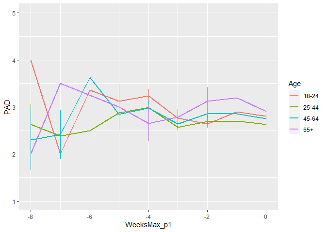
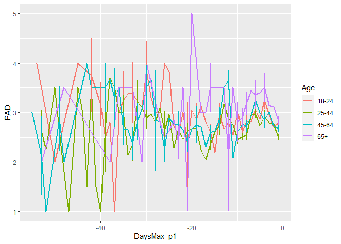
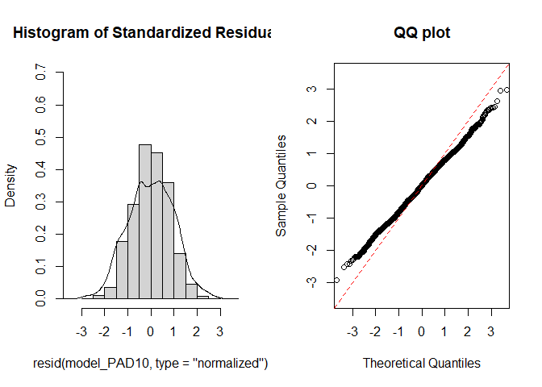
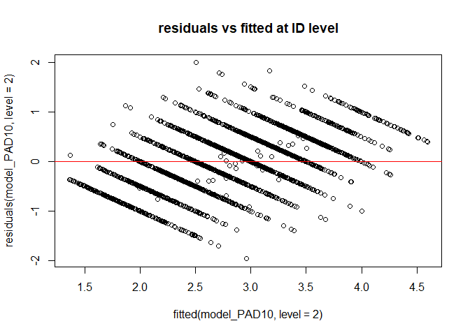
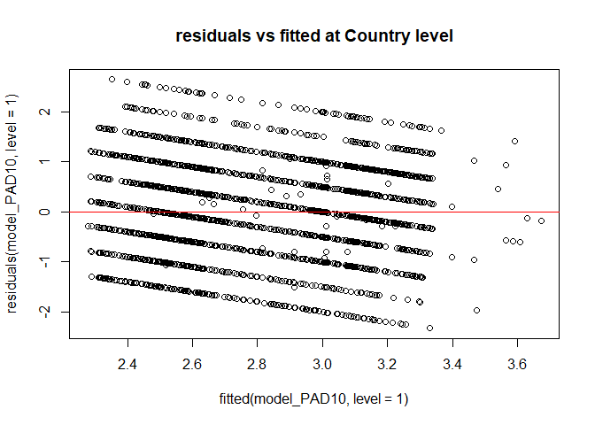
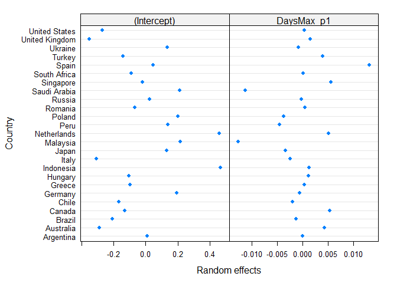
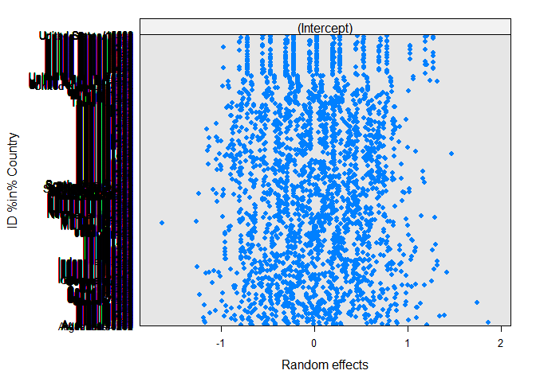
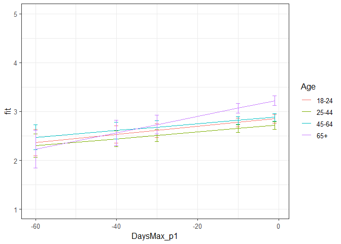

Second analysis PAD Phase 1
================
Anne Margit
10/15/2020

    ## [1] ""

``` r
load("data_analyse2_p1.Rdata")
```

This dataset includes:

1.  Data from all weekly measurement waves (baseline through wave 11,
    Time 1 through 12)
2.  Participants who provided at least 3 measurements
3.  Participants who are residents of the country they currently live in
4.  Participants who provided info on age
5.  Participants who provided info on gender (either male or female)
6.  Data from countries with at least 20 participants
7.  Pooled age groups
8.  Imputed missing emotion scores
9.  Combined emotion scores (NAA, NAD, PAA, PAD)
10. An imputed Stringency index (StringencyIndex\_imp)
11. A variable indicating the number of days before and after the day on
    which maximum stringency was reached for the respective country
    (DaysMax)
12. A variable indicating the number of weeks before and after the day
    on which maximum stringency was reached for the respective country
    (WeeksMax)
13. A variable indicating the date on which maximum Stringency was
    reached for that country (DateMaxStr)
14. A dummy Str\_dummy with 0 = before the peaj, 1 = during peak, 2 =
    after peak
15. Observations during which there was a second peak are excluded
    (N=583)

> My comments are in block quotes such as this.

``` r
library(dplyr)
library(tidyverse)
library(ggpubr)
library(ggplot2)
library(rockchalk)
library(effects)
library(nlme)
library(lattice)
library(broom.mixed)
library(purrr)
```

# Descriptives

**Number of participants per age group**

``` r
data_analyse2_p1 %>%
  group_by(Age_new) %>%
  summarise(NAge = n())
```

    # A tibble: 4 x 2
      Age_new  NAge
      <fct>   <int>
    1 0         681
    2 1        1870
    3 2        1265
    4 3         291

**Plots** **Mean PAD against max stringency in WEEKS**

``` r
plot_PAD <- ggplot(data_analyse2_p1, aes(x=WeeksMax_p1, y=PAD, group = Age_new, color = Age_new))

plot_PAD + stat_summary(fun.y=mean, geom="line", size=1)  + geom_errorbar(stat="summary", fun.data="mean_se", width=0) + scale_colour_discrete(name = "Age", labels = c("18-24", "25-44", "45-64", "65+")) + expand_limits(y=c(1, 5))
```

<!-- -->

**Mean PAD against max stringency in DAYS**

``` r
plot_PAD <- ggplot(data_analyse2_p1, aes(x=DaysMax_p1, y=PAD, group = Age_new, color = Age_new))

plot_PAD + stat_summary(fun.y=mean, geom="line", size=1)  + geom_errorbar(stat="summary", fun.data="mean_se", width=0) + scale_colour_discrete(name = "Age", labels = c("18-24", "25-44", "45-64", "65+")) + expand_limits(y=c(1, 5))
```

<!-- -->

# Regression models phase 1

**Positive affect low arousal**

*Predictors: DaysMax\_p1, Age, Random: IC for Country*

``` r
model_PAD1 <- lme(fixed = PAD ~ DaysMax_p1 + Age_new + DaysMax_p1*Age_new,
                   random = ~1 | Country, 
                  data = data_analyse2_p1, 
                  na.action = na.omit)

summary(model_PAD1)
```

    Linear mixed-effects model fit by REML
     Data: data_analyse2_p1 
           AIC      BIC    logLik
      11375.16 11438.34 -5677.578
    
    Random effects:
     Formula: ~1 | Country
            (Intercept)  Residual
    StdDev:    0.295802 0.9530855
    
    Fixed effects: PAD ~ DaysMax_p1 + Age_new + DaysMax_p1 * Age_new 
                             Value  Std.Error   DF   t-value p-value
    (Intercept)          2.8252736 0.09065879 4075 31.163814  0.0000
    DaysMax_p1           0.0014482 0.00387479 4075  0.373748  0.7086
    Age_new1            -0.1077355 0.06541407 4075 -1.646978  0.0996
    Age_new2             0.0598533 0.06866958 4075  0.871614  0.3835
    Age_new3             0.3857183 0.09457610 4075  4.078390  0.0000
    DaysMax_p1:Age_new1  0.0032308 0.00430051 4075  0.751258  0.4525
    DaysMax_p1:Age_new2  0.0023059 0.00462819 4075  0.498226  0.6184
    DaysMax_p1:Age_new3  0.0091275 0.00745307 4075  1.224668  0.2208
     Correlation: 
                        (Intr) DysM_1 Ag_nw1 Ag_nw2 Ag_nw3 DM_1:A_1 DM_1:A_2
    DaysMax_p1           0.483                                              
    Age_new1            -0.536 -0.609                                       
    Age_new2            -0.517 -0.589  0.726                                
    Age_new3            -0.390 -0.451  0.519  0.511                         
    DaysMax_p1:Age_new1 -0.396 -0.800  0.748  0.540  0.394                  
    DaysMax_p1:Age_new2 -0.380 -0.766  0.521  0.725  0.374  0.683           
    DaysMax_p1:Age_new3 -0.246 -0.499  0.318  0.307  0.660  0.426    0.418  
    
    Standardized Within-Group Residuals:
            Min          Q1         Med          Q3         Max 
    -2.42379157 -0.67323743 -0.01100877  0.74927562  2.77616331 
    
    Number of Observations: 4107
    Number of Groups: 25 

*Predictors: DaysMax\_p1, Age, Random: IC for ID*

``` r
model_PAD2 <- lme(fixed = PAD ~ DaysMax_p1 + Age_new + DaysMax_p1*Age_new,
                  random = ~1 | ID, 
                 data = data_analyse2_p1, 
                 na.action = na.omit)

summary(model_PAD2)
```

    Linear mixed-effects model fit by REML
     Data: data_analyse2_p1 
          AIC      BIC    logLik
      11034.6 11097.79 -5507.301
    
    Random effects:
     Formula: ~1 | ID
            (Intercept)  Residual
    StdDev:   0.7433766 0.6521106
    
    Fixed effects: PAD ~ DaysMax_p1 + Age_new + DaysMax_p1 * Age_new 
                             Value  Std.Error   DF  t-value p-value
    (Intercept)          2.8119160 0.05683066 2720 49.47885  0.0000
    DaysMax_p1           0.0013461 0.00334096 1379  0.40290  0.6871
    Age_new1            -0.1512575 0.06551418 2720 -2.30877  0.0210
    Age_new2            -0.0036038 0.06857687 2720 -0.05255  0.9581
    Age_new3             0.2413949 0.09171061 2720  2.63214  0.0085
    DaysMax_p1:Age_new1 -0.0011342 0.00394229 1379 -0.28769  0.7736
    DaysMax_p1:Age_new2  0.0012546 0.00420645 1379  0.29826  0.7655
    DaysMax_p1:Age_new3  0.0112642 0.00657928 1379  1.71208  0.0871
     Correlation: 
                        (Intr) DysM_1 Ag_nw1 Ag_nw2 Ag_nw3 DM_1:A_1 DM_1:A_2
    DaysMax_p1           0.603                                              
    Age_new1            -0.867 -0.523                                       
    Age_new2            -0.829 -0.500  0.719                                
    Age_new3            -0.620 -0.374  0.538  0.514                         
    DaysMax_p1:Age_new1 -0.511 -0.847  0.596  0.424  0.317                  
    DaysMax_p1:Age_new2 -0.479 -0.794  0.416  0.581  0.297  0.673           
    DaysMax_p1:Age_new3 -0.306 -0.508  0.266  0.254  0.518  0.430    0.403  
    
    Standardized Within-Group Residuals:
           Min         Q1        Med         Q3        Max 
    -2.6483335 -0.5286389  0.0280244  0.5603031  3.0144617 
    
    Number of Observations: 4107
    Number of Groups: 2724 

*Random: IC for ID and Country*

``` r
model_PAD3 <- lme(fixed = PAD ~ DaysMax_p1 + Age_new + DaysMax_p1*Age_new,
                  random = ~1 | Country/ID, 
                  data = data_analyse2_p1, 
                  na.action = na.omit)

summary(model_PAD3)
```

    Linear mixed-effects model fit by REML
     Data: data_analyse2_p1 
           AIC      BIC    logLik
      10862.01 10931.51 -5420.003
    
    Random effects:
     Formula: ~1 | Country
            (Intercept)
    StdDev:   0.2998029
    
     Formula: ~1 | ID %in% Country
            (Intercept)  Residual
    StdDev:   0.6979442 0.6514817
    
    Fixed effects: PAD ~ DaysMax_p1 + Age_new + DaysMax_p1 * Age_new 
                             Value  Std.Error   DF   t-value p-value
    (Intercept)          2.8376404 0.09066029 2696 31.299705  0.0000
    DaysMax_p1           0.0040781 0.00336904 1379  1.210474  0.2263
    Age_new1            -0.1357912 0.06443366 2696 -2.107457  0.0352
    Age_new2             0.0474263 0.06777060 2696  0.699806  0.4841
    Age_new3             0.3971179 0.09264528 2696  4.286435  0.0000
    DaysMax_p1:Age_new1 -0.0005129 0.00390400 1379 -0.131384  0.8955
    DaysMax_p1:Age_new2  0.0007954 0.00417455 1379  0.190543  0.8489
    DaysMax_p1:Age_new3  0.0115797 0.00660454 1379  1.753296  0.0798
     Correlation: 
                        (Intr) DysM_1 Ag_nw1 Ag_nw2 Ag_nw3 DM_1:A_1 DM_1:A_2
    DaysMax_p1           0.381                                              
    Age_new1            -0.529 -0.507                                       
    Age_new2            -0.506 -0.486  0.722                                
    Age_new3            -0.378 -0.368  0.517  0.512                         
    DaysMax_p1:Age_new1 -0.314 -0.824  0.604  0.430  0.317                  
    DaysMax_p1:Age_new2 -0.299 -0.781  0.416  0.579  0.299  0.672           
    DaysMax_p1:Age_new3 -0.191 -0.504  0.256  0.245  0.525  0.427    0.413  
    
    Standardized Within-Group Residuals:
            Min          Q1         Med          Q3         Max 
    -2.90585991 -0.52687798  0.02128085  0.55120921  3.02313410 
    
    Number of Observations: 4107
    Number of Groups: 
            Country ID %in% Country 
                 25            2724 

*Random: IC for ID and Country, S for Country*

``` r
model_PAD4 <- lme(fixed = PAD ~ DaysMax_p1 + Age_new + DaysMax_p1*Age_new,
                  random = list (Country = ~DaysMax_p1, ID = ~1), 
                  data = data_analyse2_p1, 
                  na.action = na.omit)

summary(model_PAD4)
```

    Linear mixed-effects model fit by REML
     Data: data_analyse2_p1 
           AIC      BIC    logLik
      10854.33 10936.47 -5414.165
    
    Random effects:
     Formula: ~DaysMax_p1 | Country
     Structure: General positive-definite, Log-Cholesky parametrization
                StdDev     Corr  
    (Intercept) 0.28097353 (Intr)
    DaysMax_p1  0.01008544 0.015 
    
     Formula: ~1 | ID %in% Country
            (Intercept)  Residual
    StdDev:   0.6995296 0.6475287
    
    Fixed effects: PAD ~ DaysMax_p1 + Age_new + DaysMax_p1 * Age_new 
                             Value  Std.Error   DF  t-value p-value
    (Intercept)          2.8582182 0.08856813 2696 32.27141  0.0000
    DaysMax_p1           0.0082587 0.00480435 1379  1.71900  0.0858
    Age_new1            -0.1375319 0.06444226 2696 -2.13419  0.0329
    Age_new2             0.0297360 0.06831884 2696  0.43525  0.6634
    Age_new3             0.3770590 0.09416043 2696  4.00443  0.0001
    DaysMax_p1:Age_new1 -0.0013228 0.00393041 1379 -0.33655  0.7365
    DaysMax_p1:Age_new2 -0.0013628 0.00433012 1379 -0.31473  0.7530
    DaysMax_p1:Age_new3  0.0088221 0.00679143 1379  1.29901  0.1942
     Correlation: 
                        (Intr) DysM_1 Ag_nw1 Ag_nw2 Ag_nw3 DM_1:A_1 DM_1:A_2
    DaysMax_p1           0.352                                              
    Age_new1            -0.540 -0.352                                       
    Age_new2            -0.515 -0.342  0.720                                
    Age_new3            -0.387 -0.262  0.514  0.518                         
    DaysMax_p1:Age_new1 -0.319 -0.575  0.604  0.431  0.314                  
    DaysMax_p1:Age_new2 -0.296 -0.534  0.412  0.585  0.307  0.667           
    DaysMax_p1:Age_new3 -0.195 -0.354  0.260  0.269  0.529  0.433    0.452  
    
    Standardized Within-Group Residuals:
            Min          Q1         Med          Q3         Max 
    -3.01676322 -0.51649365  0.01583337  0.53883777  3.03974693 
    
    Number of Observations: 4107
    Number of Groups: 
            Country ID %in% Country 
                 25            2724 

*Random: IC for ID and Country, S for ID*

``` r
model_PAD5 <- lme(fixed = PAD ~ DaysMax_p1 + Age_new + DaysMax_p1*Age_new,
                  random = list (Country = ~1, ID = ~DaysMax_p1), 
                  data = data_analyse2_p1, 
                  na.action = na.omit)

summary(model_PAD5)
```

    Linear mixed-effects model fit by REML
     Data: data_analyse2_p1 
           AIC      BIC    logLik
      10860.47 10942.61 -5417.237
    
    Random effects:
     Formula: ~1 | Country
            (Intercept)
    StdDev:   0.2993437
    
     Formula: ~DaysMax_p1 | ID %in% Country
     Structure: General positive-definite, Log-Cholesky parametrization
                StdDev     Corr  
    (Intercept) 0.72858041 (Intr)
    DaysMax_p1  0.01439811 0.294 
    Residual    0.63465033       
    
    Fixed effects: PAD ~ DaysMax_p1 + Age_new + DaysMax_p1 * Age_new 
                             Value  Std.Error   DF   t-value p-value
    (Intercept)          2.8427754 0.09125195 2696 31.153038  0.0000
    DaysMax_p1           0.0047448 0.00357001 1379  1.329065  0.1840
    Age_new1            -0.1390724 0.06562981 2696 -2.119043  0.0342
    Age_new2             0.0442218 0.06900645 2696  0.640836  0.5217
    Age_new3             0.3900014 0.09418602 2696  4.140756  0.0000
    DaysMax_p1:Age_new1 -0.0008937 0.00413853 1379 -0.215942  0.8291
    DaysMax_p1:Age_new2  0.0004159 0.00443455 1379  0.093788  0.9253
    DaysMax_p1:Age_new3  0.0104955 0.00697444 1379  1.504855  0.1326
     Correlation: 
                        (Intr) DysM_1 Ag_nw1 Ag_nw2 Ag_nw3 DM_1:A_1 DM_1:A_2
    DaysMax_p1           0.397                                              
    Age_new1            -0.536 -0.522                                       
    Age_new2            -0.513 -0.501  0.722                                
    Age_new3            -0.384 -0.381  0.519  0.512                         
    DaysMax_p1:Age_new1 -0.329 -0.823  0.624  0.443  0.328                  
    DaysMax_p1:Age_new2 -0.312 -0.778  0.428  0.599  0.309  0.670           
    DaysMax_p1:Age_new3 -0.201 -0.506  0.265  0.254  0.545  0.429    0.415  
    
    Standardized Within-Group Residuals:
            Min          Q1         Med          Q3         Max 
    -2.56648816 -0.51912015  0.02136281  0.53014119  3.10164453 
    
    Number of Observations: 4107
    Number of Groups: 
            Country ID %in% Country 
                 25            2724 

*Random slope for Country and ID*

``` r
model_PAD6 <- lme(fixed = PAD ~ DaysMax_p1 + Age_new + DaysMax_p1*Age_new,
                  random = ~DaysMax_p1 | Country/ID, 
                  data = data_analyse2_p1, 
                  na.action = na.omit)

summary(model_PAD6)
```

    Linear mixed-effects model fit by REML
     Data: data_analyse2_p1 
           AIC      BIC    logLik
      10853.74 10948.52 -5411.872
    
    Random effects:
     Formula: ~DaysMax_p1 | Country
     Structure: General positive-definite, Log-Cholesky parametrization
                StdDev     Corr  
    (Intercept) 0.28145069 (Intr)
    DaysMax_p1  0.01020663 0.017 
    
     Formula: ~DaysMax_p1 | ID %in% Country
     Structure: General positive-definite, Log-Cholesky parametrization
                StdDev    Corr  
    (Intercept) 0.7267574 (Intr)
    DaysMax_p1  0.0136589 0.278 
    Residual    0.6324649       
    
    Fixed effects: PAD ~ DaysMax_p1 + Age_new + DaysMax_p1 * Age_new 
                             Value  Std.Error   DF  t-value p-value
    (Intercept)          2.8608459 0.08925543 2696 32.05235  0.0000
    DaysMax_p1           0.0086173 0.00495142 1379  1.74036  0.0820
    Age_new1            -0.1393465 0.06551581 2696 -2.12691  0.0335
    Age_new2             0.0301448 0.06942338 2696  0.43422  0.6642
    Age_new3             0.3748288 0.09559391 2696  3.92105  0.0001
    DaysMax_p1:Age_new1 -0.0015812 0.00414401 1379 -0.38157  0.7028
    DaysMax_p1:Age_new2 -0.0013757 0.00456514 1379 -0.30136  0.7632
    DaysMax_p1:Age_new3  0.0082393 0.00714428 1379  1.15328  0.2490
     Correlation: 
                        (Intr) DysM_1 Ag_nw1 Ag_nw2 Ag_nw3 DM_1:A_1 DM_1:A_2
    DaysMax_p1           0.367                                              
    Age_new1            -0.545 -0.371                                       
    Age_new2            -0.520 -0.359  0.720                                
    Age_new3            -0.391 -0.274  0.514  0.519                         
    DaysMax_p1:Age_new1 -0.332 -0.588  0.622  0.442  0.322                  
    DaysMax_p1:Age_new2 -0.307 -0.544  0.422  0.603  0.315  0.664           
    DaysMax_p1:Age_new3 -0.203 -0.362  0.267  0.277  0.547  0.431    0.451  
    
    Standardized Within-Group Residuals:
            Min          Q1         Med          Q3         Max 
    -2.68454071 -0.51399081  0.01445065  0.52677212  3.11188565 
    
    Number of Observations: 4107
    Number of Groups: 
            Country ID %in% Country 
                 25            2724 

> The models only differ slightly in BIC scores.

*Random: IC for ID and Country, S for Country, No correlation between IC
and S for Country*

``` r
model_PAD7 <- lme(fixed = PAD ~ DaysMax_p1 + Age_new + DaysMax_p1*Age_new,
                  random = list(Country = pdDiag(~DaysMax_p1), ID = ~1), 
                  data = data_analyse2_p1, 
                  na.action = na.omit)

summary(model_PAD7)
```

    Linear mixed-effects model fit by REML
     Data: data_analyse2_p1 
           AIC      BIC    logLik
      10852.33 10928.15 -5414.165
    
    Random effects:
     Formula: ~DaysMax_p1 | Country
     Structure: Diagonal
            (Intercept) DaysMax_p1
    StdDev:   0.2806269 0.01005416
    
     Formula: ~1 | ID %in% Country
            (Intercept)  Residual
    StdDev:    0.699533 0.6475285
    
    Fixed effects: PAD ~ DaysMax_p1 + Age_new + DaysMax_p1 * Age_new 
                             Value  Std.Error   DF  t-value p-value
    (Intercept)          2.8583673 0.08848920 2696 32.30188  0.0000
    DaysMax_p1           0.0082697 0.00479665 1379  1.72405  0.0849
    Age_new1            -0.1375870 0.06444123 2696 -2.13508  0.0328
    Age_new2             0.0296357 0.06831553 2696  0.43381  0.6645
    Age_new3             0.3767532 0.09414897 2696  4.00167  0.0001
    DaysMax_p1:Age_new1 -0.0013235 0.00393033 1379 -0.33674  0.7364
    DaysMax_p1:Age_new2 -0.0013681 0.00432977 1379 -0.31597  0.7521
    DaysMax_p1:Age_new3  0.0088073 0.00679102 1379  1.29691  0.1949
     Correlation: 
                        (Intr) DysM_1 Ag_nw1 Ag_nw2 Ag_nw3 DM_1:A_1 DM_1:A_2
    DaysMax_p1           0.347                                              
    Age_new1            -0.540 -0.353                                       
    Age_new2            -0.516 -0.343  0.720                                
    Age_new3            -0.387 -0.262  0.514  0.518                         
    DaysMax_p1:Age_new1 -0.319 -0.576  0.604  0.431  0.314                  
    DaysMax_p1:Age_new2 -0.296 -0.534  0.412  0.585  0.307  0.667           
    DaysMax_p1:Age_new3 -0.195 -0.355  0.260  0.269  0.529  0.433    0.452  
    
    Standardized Within-Group Residuals:
            Min          Q1         Med          Q3         Max 
    -3.01606859 -0.51660437  0.01577901  0.53885355  3.03969843 
    
    Number of Observations: 4107
    Number of Groups: 
            Country ID %in% Country 
                 25            2724 

*Random: IC for ID and Country, S for ID, No correlation between IC and
S for ID*

``` r
model_PAD8 <- lme(fixed = PAD ~ DaysMax_p1 + Age_new + DaysMax_p1*Age_new,
                  random = list(Country = ~1, ID = pdDiag(~DaysMax_p1)), 
                  data = data_analyse2_p1, 
                  na.action = na.omit)

summary(model_PAD8)
```

    Linear mixed-effects model fit by REML
     Data: data_analyse2_p1 
          AIC      BIC    logLik
      10861.5 10937.32 -5418.749
    
    Random effects:
     Formula: ~1 | Country
            (Intercept)
    StdDev:   0.2984106
    
     Formula: ~DaysMax_p1 | ID %in% Country
     Structure: Diagonal
            (Intercept)  DaysMax_p1  Residual
    StdDev:   0.6954127 0.008969665 0.6448418
    
    Fixed effects: PAD ~ DaysMax_p1 + Age_new + DaysMax_p1 * Age_new 
                             Value  Std.Error   DF   t-value p-value
    (Intercept)          2.8407995 0.09042286 2696 31.416830  0.0000
    DaysMax_p1           0.0045780 0.00349188 1379  1.311049  0.1901
    Age_new1            -0.1385751 0.06446032 2696 -2.149774  0.0317
    Age_new2             0.0451194 0.06777913 2696  0.665682  0.5057
    Age_new3             0.3927261 0.09260318 2696  4.240957  0.0000
    DaysMax_p1:Age_new1 -0.0008554 0.00405931 1379 -0.210723  0.8331
    DaysMax_p1:Age_new2  0.0005747 0.00434564 1379  0.132255  0.8948
    DaysMax_p1:Age_new3  0.0110725 0.00686828 1379  1.612118  0.1072
     Correlation: 
                        (Intr) DysM_1 Ag_nw1 Ag_nw2 Ag_nw3 DM_1:A_1 DM_1:A_2
    DaysMax_p1           0.380                                              
    Age_new1            -0.531 -0.505                                       
    Age_new2            -0.508 -0.484  0.722                                
    Age_new3            -0.380 -0.368  0.518  0.512                         
    DaysMax_p1:Age_new1 -0.314 -0.824  0.603  0.427  0.316                  
    DaysMax_p1:Age_new2 -0.298 -0.780  0.413  0.577  0.298  0.670           
    DaysMax_p1:Age_new3 -0.191 -0.504  0.255  0.244  0.525  0.426    0.412  
    
    Standardized Within-Group Residuals:
            Min          Q1         Med          Q3         Max 
    -2.83796059 -0.52119010  0.02209958  0.54599870  3.05509726 
    
    Number of Observations: 4107
    Number of Groups: 
            Country ID %in% Country 
                 25            2724 

*Random: IC for ID and Country, S for ID and Country, No correlation
between IC and S for Country and ID*

``` r
model_PAD9 <- lme(fixed = PAD ~ DaysMax_p1 + Age_new + DaysMax_p1*Age_new,
                  random = list (Country = pdDiag(~DaysMax_p1), ID = pdDiag(~DaysMax_p1)),
                  data = data_analyse2_p1, 
                  na.action = na.omit)

summary(model_PAD9)
```

    Linear mixed-effects model fit by REML
     Data: data_analyse2_p1 
           AIC      BIC    logLik
      10852.22 10934.37 -5413.112
    
    Random effects:
     Formula: ~DaysMax_p1 | Country
     Structure: Diagonal
            (Intercept) DaysMax_p1
    StdDev:   0.2806046 0.01010953
    
     Formula: ~DaysMax_p1 | ID %in% Country
     Structure: Diagonal
            (Intercept)  DaysMax_p1  Residual
    StdDev:   0.6971005 0.008557188 0.6415558
    
    Fixed effects: PAD ~ DaysMax_p1 + Age_new + DaysMax_p1 * Age_new 
                             Value  Std.Error   DF  t-value p-value
    (Intercept)          2.8608451 0.08845697 2696 32.34166  0.0000
    DaysMax_p1           0.0086560 0.00488510 1379  1.77191  0.0766
    Age_new1            -0.1397684 0.06445841 2696 -2.16835  0.0302
    Age_new2             0.0292507 0.06831469 2696  0.42818  0.6686
    Age_new3             0.3747728 0.09408858 2696  3.98319  0.0001
    DaysMax_p1:Age_new1 -0.0016240 0.00407265 1379 -0.39876  0.6901
    DaysMax_p1:Age_new2 -0.0014329 0.00449096 1379 -0.31905  0.7497
    DaysMax_p1:Age_new3  0.0084999 0.00704754 1379  1.20608  0.2280
     Correlation: 
                        (Intr) DysM_1 Ag_nw1 Ag_nw2 Ag_nw3 DM_1:A_1 DM_1:A_2
    DaysMax_p1           0.348                                              
    Age_new1            -0.540 -0.357                                       
    Age_new2            -0.516 -0.346  0.719                                
    Age_new3            -0.387 -0.265  0.514  0.519                         
    DaysMax_p1:Age_new1 -0.318 -0.585  0.602  0.429  0.312                  
    DaysMax_p1:Age_new2 -0.295 -0.542  0.408  0.584  0.306  0.663           
    DaysMax_p1:Age_new3 -0.194 -0.359  0.258  0.268  0.529  0.430    0.450  
    
    Standardized Within-Group Residuals:
            Min          Q1         Med          Q3         Max 
    -2.94418743 -0.51667221  0.01493512  0.53409845  3.06974098 
    
    Number of Observations: 4107
    Number of Groups: 
            Country ID %in% Country 
                 25            2724 

> Best model is PAD7: random IC for ID and Country + S for Country + no
> correlation between IC and S for Country\*

*Random: IC for ID and Country, S for Country, No correlation between IC
and S for Country + AR*

``` r
data_analyse2_p1 <- data_analyse2_p1[with(data_analyse2_p1, order(Country, ID, Time)),]
data_analyse2_p1$Time <- as.numeric(data_analyse2_p1$Time)

model_PAD10 <- lme(fixed = PAD ~ DaysMax_p1 + Age_new + DaysMax_p1*Age_new,
                  random = list(Country = pdDiag(~DaysMax_p1), ID = ~1), 
                  data = data_analyse2_p1, 
                  na.action = na.omit,
                  correlation = corAR1(form = ~ Time | Country/ID))

summary(model_PAD10)
```

    Linear mixed-effects model fit by REML
     Data: data_analyse2_p1 
          AIC      BIC   logLik
      10848.3 10930.44 -5411.15
    
    Random effects:
     Formula: ~DaysMax_p1 | Country
     Structure: Diagonal
            (Intercept)  DaysMax_p1
    StdDev:      0.2809 0.009897502
    
     Formula: ~1 | ID %in% Country
            (Intercept)  Residual
    StdDev:   0.6733495 0.6746366
    
    Correlation Structure: ARMA(1,0)
     Formula: ~Time | Country/ID 
     Parameter estimate(s):
         Phi1 
    0.1521503 
    Fixed effects: PAD ~ DaysMax_p1 + Age_new + DaysMax_p1 * Age_new 
                             Value  Std.Error   DF  t-value p-value
    (Intercept)          2.8573036 0.08901209 2696 32.10017  0.0000
    DaysMax_p1           0.0081384 0.00481834 1379  1.68905  0.0914
    Age_new1            -0.1365619 0.06532474 2696 -2.09051  0.0367
    Age_new2             0.0304838 0.06920697 2696  0.44047  0.6596
    Age_new3             0.3777004 0.09512875 2696  3.97041  0.0001
    DaysMax_p1:Age_new1 -0.0011751 0.00402249 1379 -0.29213  0.7702
    DaysMax_p1:Age_new2 -0.0012311 0.00442922 1379 -0.27794  0.7811
    DaysMax_p1:Age_new3  0.0086788 0.00696277 1379  1.24646  0.2128
     Correlation: 
                        (Intr) DysM_1 Ag_nw1 Ag_nw2 Ag_nw3 DM_1:A_1 DM_1:A_2
    DaysMax_p1           0.358                                              
    Age_new1            -0.545 -0.368                                       
    Age_new2            -0.520 -0.357  0.720                                
    Age_new3            -0.391 -0.273  0.515  0.520                         
    DaysMax_p1:Age_new1 -0.329 -0.587  0.617  0.441  0.321                  
    DaysMax_p1:Age_new2 -0.305 -0.545  0.421  0.599  0.313  0.667           
    DaysMax_p1:Age_new3 -0.201 -0.361  0.265  0.274  0.543  0.431    0.449  
    
    Standardized Within-Group Residuals:
           Min         Q1        Med         Q3        Max 
    -2.9036622 -0.5330990  0.0168051  0.5557883  2.9594591 
    
    Number of Observations: 4107
    Number of Groups: 
            Country ID %in% Country 
                 25            2724 

*Random: IC for ID and Country, S for Country + AR*

``` r
model_PAD11 <- lme(fixed = PAD ~ DaysMax_p1 + Age_new + DaysMax_p1*Age_new,
                  random = list(Country = ~DaysMax_p1, ID = ~1), 
                  data = data_analyse2_p1, 
                  na.action = na.omit,
                  correlation = corAR1(form = ~ Time | Country/ID))

summary(model_PAD11)
```

    Linear mixed-effects model fit by REML
     Data: data_analyse2_p1 
          AIC      BIC   logLik
      10850.3 10938.76 -5411.15
    
    Random effects:
     Formula: ~DaysMax_p1 | Country
     Structure: General positive-definite, Log-Cholesky parametrization
                StdDev      Corr  
    (Intercept) 0.281231804 (Intr)
    DaysMax_p1  0.009927256 0.014 
    
     Formula: ~1 | ID %in% Country
            (Intercept)  Residual
    StdDev:    0.673344 0.6746376
    
    Correlation Structure: ARMA(1,0)
     Formula: ~Time | Country/ID 
     Parameter estimate(s):
         Phi1 
    0.1521473 
    Fixed effects: PAD ~ DaysMax_p1 + Age_new + DaysMax_p1 * Age_new 
                             Value  Std.Error   DF  t-value p-value
    (Intercept)          2.8571604 0.08908687 2696 32.07162  0.0000
    DaysMax_p1           0.0081277 0.00482543 1379  1.68435  0.0923
    Age_new1            -0.1365128 0.06532571 2696 -2.08973  0.0367
    Age_new2             0.0305779 0.06921021 2696  0.44181  0.6587
    Age_new3             0.3779975 0.09513987 2696  3.97307  0.0001
    DaysMax_p1:Age_new1 -0.0011745 0.00402257 1379 -0.29199  0.7703
    DaysMax_p1:Age_new2 -0.0012260 0.00442957 1379 -0.27679  0.7820
    DaysMax_p1:Age_new3  0.0086936 0.00696319 1379  1.24851  0.2121
     Correlation: 
                        (Intr) DysM_1 Ag_nw1 Ag_nw2 Ag_nw3 DM_1:A_1 DM_1:A_2
    DaysMax_p1           0.363                                              
    Age_new1            -0.544 -0.368                                       
    Age_new2            -0.520 -0.356  0.720                                
    Age_new3            -0.391 -0.272  0.515  0.520                         
    DaysMax_p1:Age_new1 -0.329 -0.586  0.617  0.441  0.321                  
    DaysMax_p1:Age_new2 -0.305 -0.544  0.421  0.599  0.313  0.667           
    DaysMax_p1:Age_new3 -0.200 -0.360  0.265  0.274  0.543  0.431    0.449  
    
    Standardized Within-Group Residuals:
            Min          Q1         Med          Q3         Max 
    -2.90430867 -0.53260924  0.01685663  0.55578248  2.95951523 
    
    Number of Observations: 4107
    Number of Groups: 
            Country ID %in% Country 
                 25            2724 

*Random: IC for ID and Country, S for Country and ID + AR*

``` r
model_PAD12 <- lme(fixed = PAD ~ DaysMax_p1 + Age_new + DaysMax_p1*Age_new,
                  random = list(Country = ~DaysMax_p1, ID = ~DaysMax_p1), 
                  data = data_analyse2_p1, 
                  na.action = na.omit,
                  correlation = corAR1(form = ~ Time | Country/ID))

summary(model_PAD12)
```

    Linear mixed-effects model fit by REML
     Data: data_analyse2_p1 
           AIC      BIC    logLik
      10853.02 10954.12 -5410.512
    
    Random effects:
     Formula: ~DaysMax_p1 | Country
     Structure: General positive-definite, Log-Cholesky parametrization
                StdDev     Corr  
    (Intercept) 0.28144807 (Intr)
    DaysMax_p1  0.01001908 0.016 
    
     Formula: ~DaysMax_p1 | ID %in% Country
     Structure: General positive-definite, Log-Cholesky parametrization
                StdDev     Corr  
    (Intercept) 0.69000068 (Intr)
    DaysMax_p1  0.01014267 0.169 
    Residual    0.66089642       
    
    Correlation Structure: ARMA(1,0)
     Formula: ~Time | Country/ID 
     Parameter estimate(s):
         Phi1 
    0.1226751 
    Fixed effects: PAD ~ DaysMax_p1 + Age_new + DaysMax_p1 * Age_new 
                             Value  Std.Error   DF  t-value p-value
    (Intercept)          2.8589307 0.08926000 2696 32.02925  0.0000
    DaysMax_p1           0.0083925 0.00490974 1379  1.70936  0.0876
    Age_new1            -0.1377971 0.06558052 2696 -2.10119  0.0357
    Age_new2             0.0305470 0.06946707 2696  0.43973  0.6602
    Age_new3             0.3764099 0.09550523 2696  3.94125  0.0001
    DaysMax_p1:Age_new1 -0.0013663 0.00413822 1379 -0.33018  0.7413
    DaysMax_p1:Age_new2 -0.0012848 0.00455785 1379 -0.28188  0.7781
    DaysMax_p1:Age_new3  0.0083808 0.00715732 1379  1.17093  0.2418
     Correlation: 
                        (Intr) DysM_1 Ag_nw1 Ag_nw2 Ag_nw3 DM_1:A_1 DM_1:A_2
    DaysMax_p1           0.368                                              
    Age_new1            -0.545 -0.374                                       
    Age_new2            -0.521 -0.362  0.720                                
    Age_new3            -0.391 -0.276  0.515  0.520                         
    DaysMax_p1:Age_new1 -0.332 -0.592  0.621  0.443  0.323                  
    DaysMax_p1:Age_new2 -0.307 -0.549  0.422  0.603  0.315  0.664           
    DaysMax_p1:Age_new3 -0.202 -0.364  0.266  0.275  0.548  0.430    0.449  
    
    Standardized Within-Group Residuals:
            Min          Q1         Med          Q3         Max 
    -2.77378762 -0.52183309  0.02064276  0.54818208  3.01545906 
    
    Number of Observations: 4107
    Number of Groups: 
            Country ID %in% Country 
                 25            2724 

> Model PAD10 has the best fit (lowest BIC). Random IC for ID and
> Country, S for Country, No correlation between IC and S for Country +
> AR

*QQ plot of residuals*

``` r
par(mfrow = c(1,2))
lims <- c(-3.5,3.5)
hist(resid(model_PAD10, type = "normalized"),
freq = FALSE, xlim = lims, ylim =  c(0,.7),main = "Histogram of Standardized Residuals")
lines(density(scale(resid(model_PAD10))))
qqnorm(resid(model_PAD10, type = "normalized"),
xlim = lims, ylim = lims,main = "QQ plot")
abline(0,1, col = "red", lty = 2)
```

<!-- -->

*Residuals vs fitted*

``` r
plot(fitted(model_PAD10, level=2), residuals(model_PAD10, level=2), 
     main="residuals vs fitted at ID level")
abline(a=0, b=0,col="red")
```

<!-- -->

``` r
plot(fitted(model_PAD10, level=1), residuals(model_PAD10, level=1), 
    main="residuals vs fitted at Country level")
abline(a=0, b=0,col="red")
```

<!-- -->

> Residuen zien er allemaal goed uit

*Plot random intercepts and slopes*

``` r
plot(ranef(model_PAD10, level = 1))
```

<!-- -->

``` r
plot(ranef(model_PAD10, level = 2))
```

<!-- -->

*Confidence intervals*

``` r
intervals(model_PAD10)
```

    Approximate 95% confidence intervals
    
     Fixed effects:
                               lower         est.        upper
    (Intercept)          2.682764740  2.857303590  3.031842440
    DaysMax_p1          -0.001313650  0.008138424  0.017590497
    Age_new1            -0.264653576 -0.136561934 -0.008470293
    Age_new2            -0.105220266  0.030483825  0.166187916
    Age_new3             0.191167733  0.377700392  0.564233050
    DaysMax_p1:Age_new1 -0.009065942 -0.001175081  0.006715780
    DaysMax_p1:Age_new2 -0.009919815 -0.001231073  0.007457668
    DaysMax_p1:Age_new3 -0.004979990  0.008678786  0.022337563
    attr(,"label")
    [1] "Fixed effects:"
    
     Random Effects:
      Level: Country 
                          lower        est.      upper
    sd((Intercept)) 0.189616298 0.280900003 0.41612885
    sd(DaysMax_p1)  0.004617638 0.009897502 0.02121443
      Level: ID 
                        lower      est.     upper
    sd((Intercept)) 0.6290068 0.6733495 0.7208182
    
     Correlation structure:
              lower      est.     upper
    Phi1 0.02864921 0.1521503 0.2710761
    attr(,"label")
    [1] "Correlation structure:"
    
     Within-group standard error:
        lower      est.     upper 
    0.6386759 0.6746366 0.7126220 

*Plot of predicted values*

``` r
ef_PAD <- effect("DaysMax_p1:Age_new", model_PAD10)

plot_PAD <- ggplot(as.data.frame(ef_PAD), 
       aes(DaysMax_p1, fit, color=Age_new)) + geom_line() + 
  geom_errorbar(aes(ymin=fit-se, ymax=fit+se), width=1) + theme_bw(base_size=12) + scale_color_discrete(name="Age", labels = c("18-24", "25-44", "45-64", "65+")) + expand_limits(y=c(1, 5))
```

``` r
plot_PAD
```

<!-- -->

``` r
coef_PAD = tidy(model_PAD10, 
               effects = "fixed")
```

*Effect sizes* **Within person SD and average within person SD of NAA**

``` r
ISDs <- data_analyse2_p1 %>% 
  group_by(ID) %>%
  summarize_at(c("PAD"), sd, na.rm=TRUE) %>%
  ungroup()

ISDs_av <- ISDs %>%
  summarize_at(c("PAD"), mean, na.rm=TRUE) %>%
  stack() %>%
  rename(sd=values) 
```

> Effect sizes for intercept and main effect of age = regression
> coefficient / average ISD of PAD Effect size for main effect of
> DaysMax = (regression coefficient \* 28)/ average ISD of PAD Effect
> sizes for interaction effects = (regression coefficient \* 28)/
> average ISD of PAD

> The effect sizes for main effect of DaysMax and the interaction
> effects reflect the increase in SD of PAD over 4 weeks (28 days)

``` r
coef_PAD <- coef_PAD %>%
  mutate(e_size = ifelse(row_number()== 1 | row_number()== 3 |  row_number()== 4 |  row_number()== 5,
          estimate/0.5048412, 
          (estimate*28)/0.5048412))
```

``` r
coef_PAD
```

    ## # A tibble: 8 x 7
    ##   term                estimate std.error    df statistic   p.value  e_size
    ##   <chr>                  <dbl>     <dbl> <dbl>     <dbl>     <dbl>   <dbl>
    ## 1 (Intercept)          2.86      0.0890   2696    32.1   9.42e-192  5.66  
    ## 2 DaysMax_p1           0.00814   0.00482  1379     1.69  9.14e-  2  0.451 
    ## 3 Age_new1            -0.137     0.0653   2696    -2.09  3.67e-  2 -0.271 
    ## 4 Age_new2             0.0305    0.0692   2696     0.440 6.60e-  1  0.0604
    ## 5 Age_new3             0.378     0.0951   2696     3.97  7.36e-  5  0.748 
    ## 6 DaysMax_p1:Age_new1 -0.00118   0.00402  1379    -0.292 7.70e-  1 -0.0652
    ## 7 DaysMax_p1:Age_new2 -0.00123   0.00443  1379    -0.278 7.81e-  1 -0.0683
    ## 8 DaysMax_p1:Age_new3  0.00868   0.00696  1379     1.25  2.13e-  1  0.481

> There are differences between the youngest age group (control) and the
> 25-44 year olds, and between the youngest and the oldest age groups.
> In the plot there seems to be an effect over time and an interaction
> effect but this is not significant.
