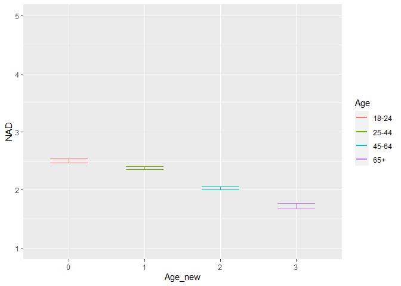
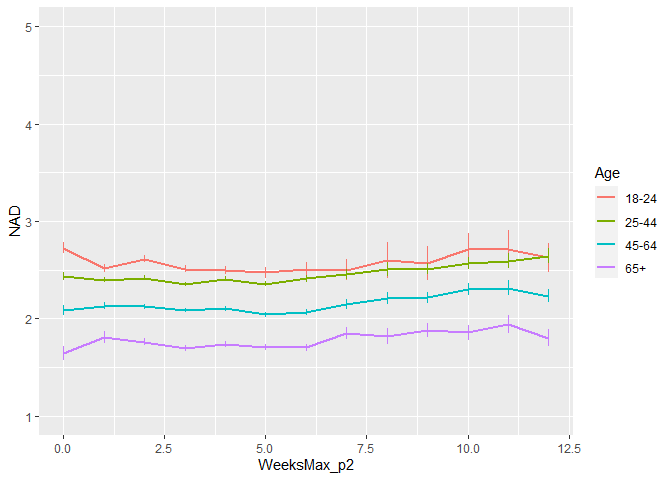
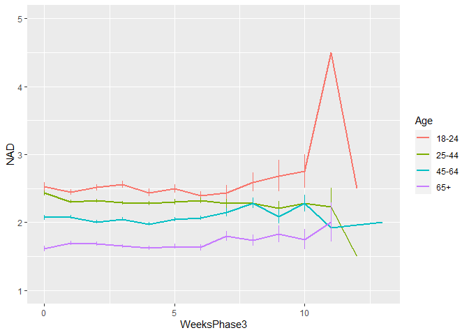
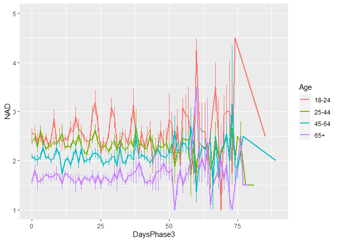
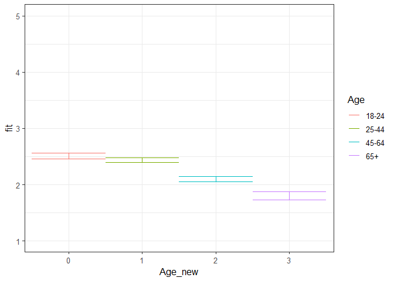
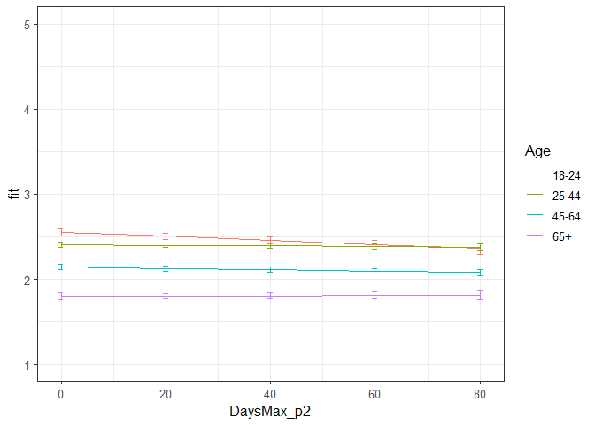
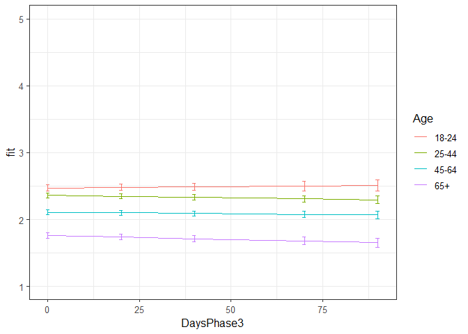

NAD all phases winning models
================
Anne Margit
10/28/2020

    ## [1] ""

``` r
load("data_analyse2_p1.Rdata")
load("data_analyse2_p2.Rdata")
load("data_analyse2_p3.Rdata")
```

This dataset includes:

1.  Data from all weekly measurement waves (baseline through wave 11,
    Time 1 through 12)
2.  Participants who provided at least 3 measurements
3.  Participants who are residents of the country they currently live in
4.  Participants who provided info on age
5.  Participants who provided info on gender (either male or female)
6.  Data from countries with at least 20 participants
7.  Pooled age groups
8.  Imputed missing emotion scores
9.  Combined emotion scores (NAA, NAD, PAA, PAD)
10. An imputed Stringency index (StringencyIndex\_imp)
11. A dummy Str\_dummy with 0 = before the peak, 1 = during peak, 2 =
    after peak
12. A variable indicating the number of days before maximum stringency
    was reached (DaysMax\_p1), during (DaysMax\_p2), and after
    (DaysPhase3)
13. A variable indicating the number of weeks before maximum stringency
    was reached (WeeksMax\_p1), during (WeeksMax\_p2), and after
    (WeeksPhase3)
14. A variable indicating the date on which maximum Stringency was
    reached for that country (DateMaxStr) and the max level reached
    (MaxStr) across the entire measurement period
15. A variable indicating the date on which minimum Stringency was
    reached for that country (DateMinStr) and the min level reached
    (MinStr) across the entire measurement period
16. Observations during which there was a second peak are excluded
    (N=583)

> My comments are in block quotes such as this.

``` r
library(dplyr)
library(tidyverse)
library(ggpubr)
library(ggplot2)
library(rockchalk)
library(effects)
library(nlme)
library(lattice)
library(broom.mixed)
library(purrr)
```

# Descriptives

**Number of participants per age group**

> 0 = 18-24, 1 = 25-44, 3= 45-64, 4= 65+

Phase 1

``` r
data_analyse2_p1 %>%
  group_by(Age_new) %>%
  summarise(NAge = n())
```

    # A tibble: 4 x 2
      Age_new  NAge
      <fct>   <int>
    1 0         695
    2 1        1893
    3 2        1274
    4 3         293

Phase 2

``` r
data_analyse2_p2 %>%
  group_by(Age_new) %>%
  summarise(NAge = n())
```

    # A tibble: 4 x 2
      Age_new  NAge
      <fct>   <int>
    1 0        3677
    2 1       11292
    3 2       10253
    4 3        4366

Phase 3

``` r
data_analyse2_p2 %>%
  group_by(Age_new) %>%
  summarise(NAge = n())
```

    # A tibble: 4 x 2
      Age_new  NAge
      <fct>   <int>
    1 0        3677
    2 1       11292
    3 2       10253
    4 3        4366

**Plots** **Mean NAD against max stringency in WEEKS** Phase 1 (only age
differences)

``` r
plot_NAD1 <- ggplot(data_analyse2_p1, aes(x=Age_new, y=NAD, group = Age_new, color = Age_new))

plot_NAD1 + stat_summary(fun.y=mean, geom="line", size=1)  + geom_errorbar(stat="summary", fun.data="mean_se", width=0.5) + scale_colour_discrete(name = "Age", labels = c("18-24", "25-44", "45-64", "65+")) + expand_limits(y=c(1, 5))
```

<!-- -->

Phase 2

``` r
plot_NAD2 <- ggplot(data_analyse2_p2, aes(x=WeeksMax_p2, y=NAD, group = Age_new, color = Age_new))

plot_NAD2 + stat_summary(fun.y=mean, geom="line", size=1)  + geom_errorbar(stat="summary", fun.data="mean_se", width=0) + scale_colour_discrete(name = "Age", labels = c("18-24", "25-44", "45-64", "65+")) + expand_limits(y=c(1, 5))
```

<!-- -->

Phase 3

``` r
plot_NAD3 <- ggplot(data_analyse2_p3, aes(x=WeeksPhase3, y=NAD, group = Age_new, color = Age_new))

plot_NAD3 + stat_summary(fun.y=mean, geom="line", size=1)  + geom_errorbar(stat="summary", fun.data="mean_se", width=0) + scale_colour_discrete(name = "Age", labels = c("18-24", "25-44", "45-64", "65+")) + expand_limits(y=c(1, 5))
```

<!-- -->

**Mean NAD against max stringency in DAYS** Phase 2

``` r
plot_NAD2 <- ggplot(data_analyse2_p2, aes(x=DaysMax_p2, y=NAD, group = Age_new, color = Age_new))

plot_NAD2 + stat_summary(fun.y=mean, geom="line", size=1)  + geom_errorbar(stat="summary", fun.data="mean_se", width=0) + scale_colour_discrete(name = "Age", labels = c("18-24", "25-44", "45-64", "65+")) + expand_limits(y=c(1, 5))
```

<!-- -->

Phase 3

``` r
plot_NAD3 <- ggplot(data_analyse2_p3, aes(x=DaysPhase3, y=NAD, group = Age_new, color = Age_new))

plot_NAD3 + stat_summary(fun.y=mean, geom="line", size=1)  + geom_errorbar(stat="summary", fun.data="mean_se", width=0) + scale_colour_discrete(name = "Age", labels = c("18-24", "25-44", "45-64", "65+")) + expand_limits(y=c(1, 5))
```

<!-- -->

# Phase 1

*Random: IC for ID and Country + Covariates Gender and Education*

> Gender: Male = 0, Female = 1

> Edu: 0= Primary education, 1= General secondary education, 2=
> Vocational education, 3= Higher education, 4= Bachelors degree, 5=
> Masters degree, 6= PhD degree

``` r
model_NADp1 <- lme(fixed = NAD ~ Gender + Edu + Age_new,
                  random = ~1 | Country/ID, 
                  data = data_analyse2_p1, 
                  na.action = na.omit)

summary(model_NADp1)
```

    Linear mixed-effects model fit by REML
     Data: data_analyse2_p1 
           AIC      BIC    logLik
      10881.97 10970.59 -5426.987
    
    Random effects:
     Formula: ~1 | Country
            (Intercept)
    StdDev:    0.117418
    
     Formula: ~1 | ID %in% Country
            (Intercept)  Residual
    StdDev:   0.6898327 0.6479594
    
    Fixed effects: NAD ~ Gender + Edu + Age_new 
                     Value  Std.Error   DF   t-value p-value
    (Intercept)  2.2912267 0.27763224 2711  8.252740  0.0000
    Gender1      0.2298256 0.03745019 2711  6.136835  0.0000
    Edu2         0.0493269 0.27719937 2711  0.177947  0.8588
    Edu3         0.1362667 0.27801423 2711  0.490143  0.6241
    Edu4         0.1522960 0.27417157 2711  0.555477  0.5786
    Edu5         0.0561562 0.27319054 2711  0.205557  0.8372
    Edu6        -0.0271246 0.27423185 2711 -0.098911  0.9212
    Edu7        -0.0108026 0.28038430 2711 -0.038528  0.9693
    Age_new1    -0.0730770 0.05250362 2711 -1.391847  0.1641
    Age_new2    -0.4095446 0.05531030 2711 -7.404490  0.0000
    Age_new3    -0.7074823 0.07758768 2711 -9.118487  0.0000
     Correlation: 
             (Intr) Gendr1 Edu2   Edu3   Edu4   Edu5   Edu6   Edu7   Ag_nw1 Ag_nw2
    Gender1  -0.060                                                               
    Edu2     -0.960 -0.044                                                        
    Edu3     -0.953 -0.052  0.956                                                 
    Edu4     -0.970 -0.050  0.970  0.967                                          
    Edu5     -0.971 -0.052  0.973  0.970  0.984                                   
    Edu6     -0.964 -0.057  0.969  0.966  0.980  0.984                            
    Edu7     -0.943 -0.050  0.947  0.945  0.959  0.962  0.960                     
    Age_new1 -0.164  0.075  0.046  0.027  0.041  0.019 -0.005 -0.011              
    Age_new2 -0.148  0.126  0.024  0.006  0.024  0.008 -0.007 -0.019  0.716       
    Age_new3 -0.119  0.182  0.017  0.011  0.018  0.006 -0.002 -0.002  0.498  0.496
    
    Standardized Within-Group Residuals:
           Min         Q1        Med         Q3        Max 
    -3.5265574 -0.5574341 -0.1063854  0.5030420  3.6279495 
    
    Number of Observations: 4155
    Number of Groups: 
            Country ID %in% Country 
                 26            2747 

*Confidence intervals*

``` r
intervals(model_NADp1)
```

    Approximate 95% confidence intervals
    
     Fixed effects:
                     lower        est.       upper
    (Intercept)  1.7468345  2.29122673  2.83561898
    Gender1      0.1563918  0.22982563  0.30325944
    Edu2        -0.4942165  0.04932692  0.59287036
    Edu3        -0.4088746  0.13626666  0.68140792
    Edu4        -0.3853104  0.15229602  0.68990245
    Edu5        -0.4795266  0.05615620  0.59183899
    Edu6        -0.5648493 -0.02712463  0.51060000
    Edu7        -0.5605911 -0.01080255  0.53898603
    Age_new1    -0.1760282 -0.07307700  0.02987416
    Age_new2    -0.5179992 -0.40954458 -0.30108996
    Age_new3    -0.8596193 -0.70748230 -0.55534531
    attr(,"label")
    [1] "Fixed effects:"
    
     Random Effects:
      Level: Country 
                        lower     est.     upper
    sd((Intercept)) 0.0701641 0.117418 0.1964962
      Level: ID 
                        lower      est.     upper
    sd((Intercept)) 0.6570486 0.6898327 0.7242527
    
     Within-group standard error:
        lower      est.     upper 
    0.6252098 0.6479594 0.6715368 

*Plot of predicted values*

``` r
ef_NADp1 <- effect("Age_new", model_NADp1)

plot_NADp1 <- ggplot(as.data.frame(ef_NADp1), 
       aes(Age_new, fit, color=Age_new)) + geom_line() + 
  geom_errorbar(aes(ymin=fit-se, ymax=fit+se), width=1) + theme_bw(base_size=12) + scale_color_discrete(name="Age", labels = c("18-24", "25-44", "45-64", "65+")) + expand_limits(y=c(1, 5))
```

``` r
plot_NADp1
```

<!-- -->

*Effect sizes*

``` r
ISDs <- data_analyse2_p1 %>% 
  group_by(ID) %>%
  summarize_at(c("NAD"), sd, na.rm=TRUE) %>%
  ungroup()

ISDs_av <- ISDs %>%
  summarize_at(c("NAD"), mean, na.rm=TRUE) %>%
  stack() %>%
  rename(sd=values) 
```

> Effect size = regression coefficient / average ISD of NAD

``` r
coef_NADp1 = tidy(model_NADp1, 
               effects = "fixed")

coef_NADp1 <- coef_NADp1 %>%
  mutate (e_size = estimate/0.4838285) %>% 
  mutate(across(2:7, round, 4)) 
```

``` r
coef_NADp1
```

    ## # A tibble: 11 x 7
    ##    term        estimate std.error    df statistic p.value  e_size
    ##    <chr>          <dbl>     <dbl> <dbl>     <dbl>   <dbl>   <dbl>
    ##  1 (Intercept)   2.29      0.278   2711    8.25     0      4.74  
    ##  2 Gender1       0.230     0.0375  2711    6.14     0      0.475 
    ##  3 Edu2          0.0493    0.277   2711    0.178    0.859  0.102 
    ##  4 Edu3          0.136     0.278   2711    0.490    0.624  0.282 
    ##  5 Edu4          0.152     0.274   2711    0.556    0.579  0.315 
    ##  6 Edu5          0.0562    0.273   2711    0.206    0.837  0.116 
    ##  7 Edu6         -0.0271    0.274   2711   -0.0989   0.921 -0.0561
    ##  8 Edu7         -0.0108    0.280   2711   -0.0385   0.969 -0.0223
    ##  9 Age_new1     -0.0731    0.0525  2711   -1.39     0.164 -0.151 
    ## 10 Age_new2     -0.410     0.0553  2711   -7.40     0     -0.846 
    ## 11 Age_new3     -0.708     0.0776  2711   -9.12     0     -1.46

# Phase 2

*Best model*

> Random intercept for ID and Country, random slope for Country, AR
> correlation structure at Measuement level

``` r
data_analyse2_p2 <- data_analyse2_p2[with(data_analyse2_p2, order(Country, ID, Time)),]
data_analyse2_p2$Time <- as.numeric(data_analyse2_p2$Time)

model_NADp2 <- lme(fixed = NAD ~ Gender + Edu + DaysMax_p2 + Age_new + DaysMax_p2*Age_new,
                  random = list (Country = ~1, ID = ~DaysMax_p2), 
                  data = data_analyse2_p2, 
                  na.action = na.omit,
                  correlation = corAR1(form = ~ Time | Country/ID))

summary(model_NADp2)
```

    Linear mixed-effects model fit by REML
     Data: data_analyse2_p2 
           AIC      BIC    logLik
      68156.57 68330.75 -34057.29
    
    Random effects:
     Formula: ~1 | Country
            (Intercept)
    StdDev:    0.118078
    
     Formula: ~DaysMax_p2 | ID %in% Country
     Structure: General positive-definite, Log-Cholesky parametrization
                StdDev      Corr  
    (Intercept) 0.777387074 (Intr)
    DaysMax_p2  0.007129331 -0.238
    Residual    0.594083520       
    
    Correlation Structure: ARMA(1,0)
     Formula: ~Time | Country/ID 
     Parameter estimate(s):
         Phi1 
    0.2183515 
    Fixed effects: NAD ~ Gender + Edu + DaysMax_p2 + Age_new + DaysMax_p2 * Age_new 
                             Value  Std.Error    DF    t-value p-value
    (Intercept)          2.5568452 0.10096165 20356  25.324915  0.0000
    Gender1              0.2139843 0.01966391  9171  10.882081  0.0000
    Edu2                -0.0956569 0.09534112  9171  -1.003312  0.3157
    Edu3                -0.1626197 0.09589124  9171  -1.695876  0.0899
    Edu4                -0.0999128 0.09386594  9171  -1.064421  0.2872
    Edu5                -0.1707131 0.09314247  9171  -1.832817  0.0669
    Edu6                -0.1778662 0.09386718  9171  -1.894872  0.0581
    Edu7                -0.2024509 0.09743220  9171  -2.077864  0.0377
    DaysMax_p2          -0.0024129 0.00093099 20356  -2.591792  0.0096
    Age_new1            -0.1478152 0.03777082  9171  -3.913476  0.0001
    Age_new2            -0.4119358 0.03848766  9171 -10.703060  0.0000
    Age_new3            -0.7549922 0.04648299  9171 -16.242332  0.0000
    DaysMax_p2:Age_new1  0.0020734 0.00103279 20356   2.007593  0.0447
    DaysMax_p2:Age_new2  0.0016327 0.00104505 20356   1.562305  0.1182
    DaysMax_p2:Age_new3  0.0025770 0.00119265 20356   2.160705  0.0307
     Correlation: 
                        (Intr) Gendr1 Edu2   Edu3   Edu4   Edu5   Edu6   Edu7   DysM_2 Ag_nw1 Ag_nw2 Ag_nw3 DM_2:A_1 DM_2:A_2
    Gender1             -0.140                                                                                               
    Edu2                -0.887 -0.015                                                                                        
    Edu3                -0.867 -0.011  0.918                                                                                 
    Edu4                -0.893 -0.019  0.938  0.932                                                                          
    Edu5                -0.896 -0.012  0.944  0.937  0.958                                                                   
    Edu6                -0.880 -0.027  0.936  0.932  0.952  0.960                                                            
    Edu7                -0.847 -0.017  0.900  0.897  0.915  0.922  0.919                                                     
    DaysMax_p2          -0.181  0.000  0.009  0.007  0.002  0.002  0.001  0.003                                              
    Age_new1            -0.277  0.048  0.041  0.002  0.020 -0.001 -0.034 -0.031  0.497                                       
    Age_new2            -0.279  0.079  0.035 -0.008  0.019  0.006 -0.014 -0.021  0.489  0.747                                
    Age_new3            -0.263  0.146  0.047  0.013  0.036  0.025  0.008  0.009  0.405  0.621  0.623                         
    DaysMax_p2:Age_new1  0.166 -0.001 -0.010 -0.008 -0.003 -0.002 -0.002 -0.004 -0.896 -0.564 -0.433 -0.359                  
    DaysMax_p2:Age_new2  0.162 -0.002 -0.008 -0.006 -0.001  0.000  0.000 -0.001 -0.887 -0.439 -0.580 -0.358  0.798           
    DaysMax_p2:Age_new3  0.148 -0.010 -0.012 -0.010 -0.006 -0.005 -0.006 -0.006 -0.777 -0.384 -0.379 -0.600  0.700    0.692  
    
    Standardized Within-Group Residuals:
           Min         Q1        Med         Q3        Max 
    -4.0614612 -0.5219210 -0.1173753  0.4952984  4.0694330 
    
    Number of Observations: 29574
    Number of Groups: 
            Country ID %in% Country 
                 33            9214 

*Confidence intervals*

``` r
intervals(model_NADp2, which = 'fixed')
```

    Approximate 95% confidence intervals
    
     Fixed effects:
                                lower         est.         upper
    (Intercept)          2.358952e+00  2.556845181  2.7547381455
    Gender1              1.754386e-01  0.213984255  0.2525298979
    Edu2                -2.825468e-01 -0.095656940  0.0912328937
    Edu3                -3.505878e-01 -0.162619667  0.0253485088
    Edu4                -2.839110e-01 -0.099912846  0.0840852906
    Edu5                -3.532931e-01 -0.170713126  0.0118668555
    Edu6                -3.618668e-01 -0.177866248  0.0061343217
    Edu7                -3.934397e-01 -0.202450884 -0.0114620751
    DaysMax_p2          -4.237759e-03 -0.002412939 -0.0005881183
    Age_new1            -2.218544e-01 -0.147815168 -0.0737759554
    Age_new2            -4.873802e-01 -0.411935761 -0.3364913715
    Age_new3            -8.461092e-01 -0.754992207 -0.6638751879
    DaysMax_p2:Age_new1  4.906968e-05  0.002073412  0.0040977548
    DaysMax_p2:Age_new2 -4.156941e-04  0.001632680  0.0036810550
    DaysMax_p2:Age_new3  2.392743e-04  0.002576962  0.0049146505
    attr(,"label")
    [1] "Fixed effects:"

*Plot of predicted values*

``` r
ef_NADp2 <- effect("DaysMax_p2:Age_new", model_NADp2)

plot_NADp2 <- ggplot(as.data.frame(ef_NADp2), 
       aes(DaysMax_p2, fit, color=Age_new)) + geom_line() + 
  geom_errorbar(aes(ymin=fit-se, ymax=fit+se), width=1) + theme_bw(base_size=12) + scale_color_discrete(name="Age", labels = c("18-24", "25-44", "45-64", "65+")) + expand_limits(y=c(1, 5))
```

``` r
plot_NADp2
```

<!-- -->

*Effect sizes* **Within person SD and average within person SD**

``` r
ISDs <- data_analyse2_p2 %>% 
  group_by(ID) %>%
  summarize_at(c("DaysMax_p2", "NAD"), sd, na.rm=TRUE) %>%
  ungroup()

ISDs_av <- ISDs %>%
  summarize_at(c("DaysMax_p2", "NAD"), mean, na.rm=TRUE) %>%
  stack() %>%
  rename(sd=values) 
```

> Effect sizes for intercept and main effect of age and covariates =
> regression coefficient / average ISD of NAD Effect size for main
> effect of DaysMax = (regression coefficient \* 28)/ average ISD of NAD
> Effect sizes for interaction effects = (regression coefficient \* 28)/
> average ISD of NAD

> The effect sizes for main effect of DaysMax and the interaction
> effects reflect the increase in SD of NAD over 4 weeks (28 days)

``` r
coef_NADp2 = tidy(model_NADp2, 
               effects = "fixed")

coef_NADp2 <- coef_NADp2 %>%
  mutate(e_size = ifelse(row_number()== 1 | row_number()== 2 |  row_number()== 3 |  row_number()== 4 |  row_number()== 5
                          |  row_number()== 6 |  row_number()== 7 |  row_number()== 8  |  row_number()== 10  
                          |  row_number()== 11  |  row_number()== 12, 
                          estimate/0.4753929, (estimate*28)/0.4753929)) %>%
  mutate(across(2:7, round, 4)) 
```

``` r
coef_NADp2
```

    ## # A tibble: 15 x 7
    ##    term                estimate std.error    df statistic p.value  e_size
    ##    <chr>                  <dbl>     <dbl> <dbl>     <dbl>   <dbl>   <dbl>
    ##  1 (Intercept)          2.56      0.101   20356     25.3  0        5.38  
    ##  2 Gender1              0.214     0.0197   9171     10.9  0        0.450 
    ##  3 Edu2                -0.0957    0.0953   9171     -1.00 0.316   -0.201 
    ##  4 Edu3                -0.163     0.0959   9171     -1.70 0.0899  -0.342 
    ##  5 Edu4                -0.0999    0.0939   9171     -1.06 0.287   -0.210 
    ##  6 Edu5                -0.171     0.0931   9171     -1.83 0.0669  -0.359 
    ##  7 Edu6                -0.178     0.0939   9171     -1.89 0.0581  -0.374 
    ##  8 Edu7                -0.202     0.0974   9171     -2.08 0.0377  -0.426 
    ##  9 DaysMax_p2          -0.00240   0.0009  20356     -2.59 0.00960 -0.142 
    ## 10 Age_new1            -0.148     0.0378   9171     -3.91 0.0001  -0.311 
    ## 11 Age_new2            -0.412     0.0385   9171    -10.7  0       -0.866 
    ## 12 Age_new3            -0.755     0.0465   9171    -16.2  0       -1.59  
    ## 13 DaysMax_p2:Age_new1  0.0021    0.001   20356      2.01 0.0447   0.122 
    ## 14 DaysMax_p2:Age_new2  0.0016    0.001   20356      1.56 0.118    0.0962
    ## 15 DaysMax_p2:Age_new3  0.0026    0.00120 20356      2.16 0.0307   0.152

> NAD decreases over time in the youngest age group (main effect), but
> not or minimally in the older age groups (interaction effect). Older
> people report lower NAD than the youngest age group at t=0 (first day
> of max stringency, main effect).

# Phase 3

> Random IC for Country and ID, random S for ID, AR structure

``` r
data_analyse2_p3 <- data_analyse2_p3[with(data_analyse2_p3, order(Country, ID, Time)),]
data_analyse2_p3$Time <- as.numeric(data_analyse2_p3$Time)

model_NADp3 <- lme(fixed = NAD ~ Gender + Edu + DaysPhase3 + Age_new + DaysPhase3*Age_new,
                  random = list (Country = ~1, ID = ~DaysPhase3), 
                  data = data_analyse2_p3, 
                  na.action = na.omit,
                  correlation = corAR1(form = ~ Time | Country/ID))

summary(model_NADp3)
```

    Linear mixed-effects model fit by REML
     Data: data_analyse2_p3 
           AIC      BIC   logLik
      55681.79 55852.43 -27819.9
    
    Random effects:
     Formula: ~1 | Country
            (Intercept)
    StdDev:   0.1790544
    
     Formula: ~DaysPhase3 | ID %in% Country
     Structure: General positive-definite, Log-Cholesky parametrization
                StdDev      Corr  
    (Intercept) 0.774956081 (Intr)
    DaysPhase3  0.008341721 -0.201
    Residual    0.575536285       
    
    Correlation Structure: ARMA(1,0)
     Formula: ~Time | Country/ID 
     Parameter estimate(s):
       Phi1 
    0.18904 
    Fixed effects: NAD ~ Gender + Edu + DaysPhase3 + Age_new + DaysPhase3 * Age_new 
                             Value  Std.Error    DF    t-value p-value
    (Intercept)          2.7467360 0.13252022 17940  20.726919  0.0000
    Gender1              0.1697200 0.02228348  7004   7.616405  0.0000
    Edu2                -0.3353746 0.12511405  7004  -2.680551  0.0074
    Edu3                -0.4277412 0.12500181  7004  -3.421880  0.0006
    Edu4                -0.3370906 0.12384368  7004  -2.721904  0.0065
    Edu5                -0.4119213 0.12360402  7004  -3.332588  0.0009
    Edu6                -0.3836556 0.12439118  7004  -3.084267  0.0020
    Edu7                -0.4678384 0.12793011  7004  -3.656984  0.0003
    DaysPhase3           0.0004102 0.00102877 17940   0.398733  0.6901
    Age_new1            -0.1126204 0.04208288  7004  -2.676156  0.0075
    Age_new2            -0.3649716 0.04132719  7004  -8.831271  0.0000
    Age_new3            -0.7128386 0.04732994  7004 -15.061050  0.0000
    DaysPhase3:Age_new1 -0.0011395 0.00118962 17940  -0.957906  0.3381
    DaysPhase3:Age_new2 -0.0008498 0.00115095 17940  -0.738334  0.4603
    DaysPhase3:Age_new3 -0.0015840 0.00127187 17940  -1.245389  0.2130
     Correlation: 
                        (Intr) Gendr1 Edu2   Edu3   Edu4   Edu5   Edu6   Edu7   DysPh3 Ag_nw1 Ag_nw2 Ag_nw3 DP3:A_1 DP3:A_2
    Gender1             -0.141                                                                                             
    Edu2                -0.907  0.007                                                                                      
    Edu3                -0.898  0.010  0.946                                                                               
    Edu4                -0.913  0.001  0.955  0.956                                                                        
    Edu5                -0.914  0.006  0.958  0.958  0.968                                                                 
    Edu6                -0.902 -0.002  0.951  0.953  0.963  0.967                                                          
    Edu7                -0.874  0.002  0.923  0.925  0.934  0.937  0.935                                                   
    DaysPhase3          -0.135 -0.003  0.001  0.000  0.002 -0.001 -0.001  0.000                                            
    Age_new1            -0.237  0.050  0.042  0.010  0.024  0.005 -0.025 -0.023  0.426                                     
    Age_new2            -0.252  0.104  0.038  0.003  0.026  0.016 -0.001 -0.009  0.432  0.752                              
    Age_new3            -0.264  0.182  0.064  0.036  0.055  0.045  0.034  0.032  0.377  0.661  0.702                       
    DaysPhase3:Age_new1  0.119  0.000 -0.003 -0.001 -0.003 -0.001 -0.001 -0.002 -0.863 -0.496 -0.375 -0.328                
    DaysPhase3:Age_new2  0.122  0.002 -0.001 -0.001 -0.002  0.000  0.000  0.000 -0.892 -0.381 -0.494 -0.340  0.772         
    DaysPhase3:Age_new3  0.109 -0.001  0.000  0.001 -0.001  0.001  0.001  0.000 -0.808 -0.345 -0.351 -0.485  0.698   0.722 
    
    Standardized Within-Group Residuals:
           Min         Q1        Med         Q3        Max 
    -4.9110591 -0.5075443 -0.1297115  0.4705287  4.9663400 
    
    Number of Observations: 24990
    Number of Groups: 
            Country ID %in% Country 
                 32            7046 

*Confidence intervals*

``` r
intervals(model_NADp3, which = 'fixed')
```

    Approximate 95% confidence intervals
    
     Fixed effects:
                               lower          est.         upper
    (Intercept)          2.486983592  2.7467359846  3.0064883776
    Gender1              0.126037644  0.1697200151  0.2134023863
    Edu2                -0.580635964 -0.3353745507 -0.0901131378
    Edu3                -0.672782540 -0.4277411518 -0.1826997636
    Edu4                -0.579861715 -0.3370906085 -0.0943195022
    Edu5                -0.654222549 -0.4119212540 -0.1696199593
    Edu6                -0.627499953 -0.3836555749 -0.1398111972
    Edu7                -0.718620108 -0.4678383665 -0.2170566253
    DaysPhase3          -0.001606280  0.0004102033  0.0024266862
    Age_new1            -0.195115536 -0.1126203542 -0.0301251719
    Age_new2            -0.445985394 -0.3649715977 -0.2839578011
    Age_new3            -0.805619651 -0.7128386359 -0.6200576212
    DaysPhase3:Age_new1 -0.003471308 -0.0011395425  0.0011922235
    DaysPhase3:Age_new2 -0.003105760 -0.0008497856  0.0014061888
    DaysPhase3:Age_new3 -0.004076974 -0.0015839785  0.0009090171
    attr(,"label")
    [1] "Fixed effects:"

*Plot of predicted values*

``` r
ef_NADp3 <- effect("DaysPhase3:Age_new", model_NADp3)

plot_NADp3 <- ggplot(as.data.frame(ef_NADp3), 
       aes(DaysPhase3, fit, color=Age_new)) + geom_line() + 
  geom_errorbar(aes(ymin=fit-se, ymax=fit+se), width=1) + theme_bw(base_size=12) + scale_color_discrete(name="Age", labels = c("18-24", "25-44", "45-64", "65+")) + expand_limits(y=c(1, 5))
```

``` r
plot_NADp3
```

<!-- -->
*Effect sizes* **Within person SD and average within person SD for NAD**

``` r
ISDs <- data_analyse2_p3 %>% 
  group_by(ID) %>%
  summarize_at(c("NAD"), sd, na.rm=TRUE) %>%
  ungroup()

ISDs_av <- ISDs %>%
  summarize_at(c("NAD"), mean, na.rm=TRUE) %>%
  stack() %>%
  rename(sd=values) 
```

> Effect sizes for intercept and main effect of age = regression
> coefficient / average ISD of NAD Effect size for main effect of
> DaysMax = (regression coefficient \* 28)/ average ISD of NAD Effect
> sizes for interaction effects = (regression coefficient \* 28)/
> average ISD of NAD

> The effect sizes for main effect of DaysMax and the interaction
> effects reflect the increase in SD of NAD over 4 weeks (28 days)

``` r
coef_NADp3 = tidy(model_NADp3, 
               effects = "fixed")

coef_NADp3 <- coef_NADp3 %>%
 mutate(e_size = ifelse(row_number()== 1 | row_number()== 2 |  row_number()== 3 |  row_number()== 4 |  row_number()== 5
                          |  row_number()== 6 |  row_number()== 7 |  row_number()== 8  |  row_number()== 10  
                          |  row_number()== 11  |  row_number()== 12, 
                          estimate/0.4574414, (estimate*28)/0.4574414)) %>%
  mutate(across(2:7, round, 4)) 
```

``` r
coef_NADp3
```

    ## # A tibble: 15 x 7
    ##    term                estimate std.error    df statistic  p.value  e_size
    ##    <chr>                  <dbl>     <dbl> <dbl>     <dbl>    <dbl>   <dbl>
    ##  1 (Intercept)           2.75     0.132   17940    20.7   0         6.00  
    ##  2 Gender1               0.170    0.0223   7004     7.62  0         0.371 
    ##  3 Edu2                 -0.335    0.125    7004    -2.68  0.0074   -0.733 
    ##  4 Edu3                 -0.428    0.125    7004    -3.42  0.000600 -0.935 
    ##  5 Edu4                 -0.337    0.124    7004    -2.72  0.0065   -0.737 
    ##  6 Edu5                 -0.412    0.124    7004    -3.33  0.0009   -0.900 
    ##  7 Edu6                 -0.384    0.124    7004    -3.08  0.002    -0.839 
    ##  8 Edu7                 -0.468    0.128    7004    -3.66  0.000300 -1.02  
    ##  9 DaysPhase3            0.0004   0.001   17940     0.399 0.690     0.0251
    ## 10 Age_new1             -0.113    0.0421   7004    -2.68  0.0075   -0.246 
    ## 11 Age_new2             -0.365    0.0413   7004    -8.83  0        -0.798 
    ## 12 Age_new3             -0.713    0.0473   7004   -15.1   0        -1.56  
    ## 13 DaysPhase3:Age_new1  -0.0011   0.00120 17940    -0.958 0.338    -0.0698
    ## 14 DaysPhase3:Age_new2  -0.0008   0.00120 17940    -0.738 0.460    -0.052 
    ## 15 DaysPhase3:Age_new3  -0.0016   0.0013  17940    -1.25  0.213    -0.097

> NAD does not change over time in the youngest group (main effect) or
> older groups (interaction effect). All older age groups report lower
> NAD compared with the youngest on the first day when stringency
> reduces (main effect).
