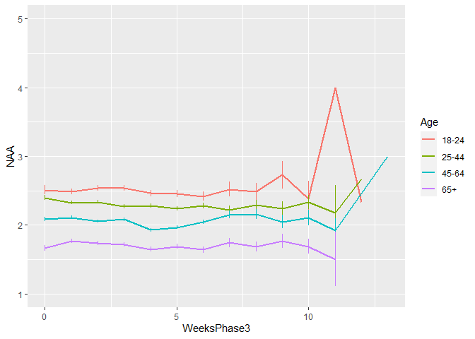
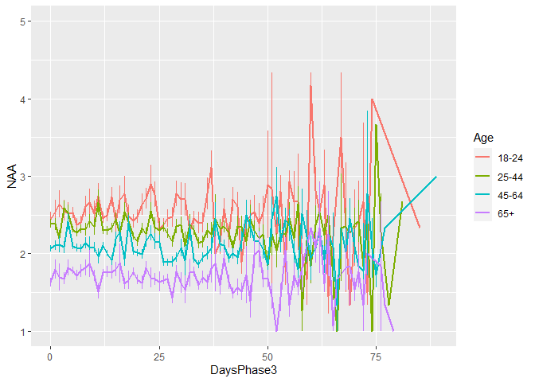
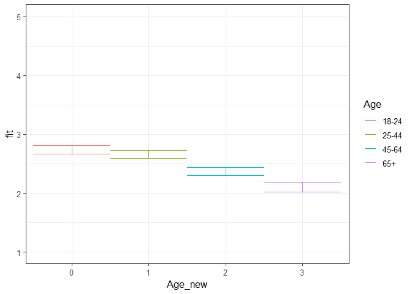
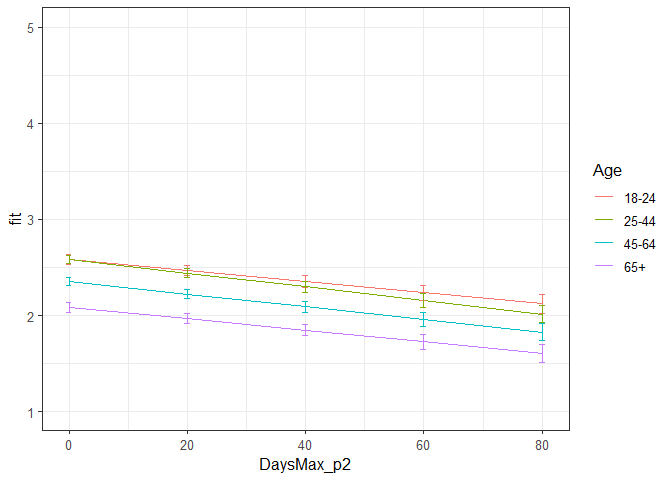
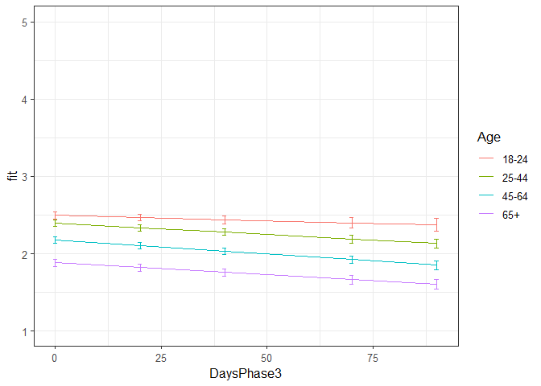

NAA all phases winning models
================
Anne Margit
10/28/2020

    ## [1] ""

``` r
load("data_analyse2_p1.Rdata")
load("data_analyse2_p2.Rdata")
load("data_analyse2_p3.Rdata")
```

This dataset includes:

1.  Data from all weekly measurement waves (baseline through wave 11,
    Time 1 through 12)
2.  Participants who provided at least 3 measurements
3.  Participants who are residents of the country they currently live in
4.  Participants who provided info on age
5.  Participants who provided info on gender (either male or female)
6.  Data from countries with at least 20 participants
7.  Pooled age groups
8.  Imputed missing emotion scores
9.  Combined emotion scores (NAA, NAD, PAA, PAD)
10. An imputed Stringency index (StringencyIndex\_imp)
11. A dummy Str\_dummy with 0 = before the peak, 1 = during peak, 2 =
    after peak
12. A variable indicating the number of days before maximum stringency
    was reached (DaysMax\_p1), during (DaysMax\_p2), and after
    (DaysPhase3)
13. A variable indicating the number of weeks before maximum stringency
    was reached (WeeksMax\_p1), during (WeeksMax\_p2), and after
    (WeeksPhase3)
14. A variable indicating the date on which maximum Stringency was
    reached for that country (DateMaxStr) and the max level reached
    (MaxStr) across the entire measurement period
15. A variable indicating the date on which minimum Stringency was
    reached for that country (DateMinStr) and the min level reached
    (MinStr) across the entire measurement period
16. Observations during which there was a second peak are excluded
    (N=583)

> My comments are in block quotes such as this.

``` r
library(dplyr)
library(tidyverse)
library(ggpubr)
library(ggplot2)
library(rockchalk)
library(effects)
library(nlme)
library(lattice)
library(broom.mixed)
library(purrr)
library(stargazer)
```

    ## Warning: package 'stargazer' was built under R version 4.0.3

# Descriptives

**Number of participants per age group**

> 0 = 18-24, 1 = 25-44, 3= 45-64, 4= 65+

Phase 1

``` r
data_analyse2_p1 %>%
  group_by(Age_new) %>%
  summarise(NAge = n())
```

    # A tibble: 4 x 2
      Age_new  NAge
      <fct>   <int>
    1 0         695
    2 1        1893
    3 2        1274
    4 3         293

Phase 2

``` r
data_analyse2_p2 %>%
  group_by(Age_new) %>%
  summarise(NAge = n())
```

    # A tibble: 4 x 2
      Age_new  NAge
      <fct>   <int>
    1 0        3677
    2 1       11292
    3 2       10253
    4 3        4366

Phase 3

``` r
data_analyse2_p2 %>%
  group_by(Age_new) %>%
  summarise(NAge = n())
```

    # A tibble: 4 x 2
      Age_new  NAge
      <fct>   <int>
    1 0        3677
    2 1       11292
    3 2       10253
    4 3        4366

**Plots** **Mean NAA against max stringency in WEEKS** Phase 1 (only age
differences)

``` r
plot_NAA1 <- ggplot(data_analyse2_p1, aes(x=Age_new, y=NAA, group = Age_new, color = Age_new))

plot_NAA1 + stat_summary(fun.y=mean, geom="line", size=1)  + geom_errorbar(stat="summary", fun.data="mean_se", width=0.5) + scale_colour_discrete(name = "Age", labels = c("18-24", "25-44", "45-64", "65+")) + expand_limits(y=c(1, 5))
```

<!-- -->

Phase 2

``` r
plot_NAA2 <- ggplot(data_analyse2_p2, aes(x=WeeksMax_p2, y=NAA, group = Age_new, color = Age_new))

plot_NAA2 + stat_summary(fun.y=mean, geom="line", size=1)  + geom_errorbar(stat="summary", fun.data="mean_se", width=0) + scale_colour_discrete(name = "Age", labels = c("18-24", "25-44", "45-64", "65+")) + expand_limits(y=c(1, 5))
```

<!-- -->

Phase 3

``` r
plot_NAA3 <- ggplot(data_analyse2_p3, aes(x=WeeksPhase3, y=NAA, group = Age_new, color = Age_new))

plot_NAA3 + stat_summary(fun.y=mean, geom="line", size=1)  + geom_errorbar(stat="summary", fun.data="mean_se", width=0) + scale_colour_discrete(name = "Age", labels = c("18-24", "25-44", "45-64", "65+")) + expand_limits(y=c(1, 5))
```

<!-- -->

**Mean NAA against max stringency in DAYS** Phase 2

``` r
plot_NAA2 <- ggplot(data_analyse2_p2, aes(x=DaysMax_p2, y=NAA, group = Age_new, color = Age_new))

plot_NAA2 + stat_summary(fun.y=mean, geom="line", size=1)  + geom_errorbar(stat="summary", fun.data="mean_se", width=0) + scale_colour_discrete(name = "Age", labels = c("18-24", "25-44", "45-64", "65+")) + expand_limits(y=c(1, 5))
```

<!-- -->

Phase 3

``` r
plot_NAA3 <- ggplot(data_analyse2_p3, aes(x=DaysPhase3, y=NAA, group = Age_new, color = Age_new))

plot_NAA3 + stat_summary(fun.y=mean, geom="line", size=1)  + geom_errorbar(stat="summary", fun.data="mean_se", width=0) + scale_colour_discrete(name = "Age", labels = c("18-24", "25-44", "45-64", "65+")) + expand_limits(y=c(1, 5))
```

<!-- -->

# Phase 1

*Random: IC for ID and Country + Covariates Gender and Education*

> Gender: Male = 0, Female = 1

> Edu: 0= Primary education, 1= General secondary education, 2=
> Vocational education, 3= Higher education, 4= Bachelors degree, 5=
> Masters degree, 6= PhD degree

``` r
data_analyse2_p1$Edu <- as.numeric(data_analyse2_p1$Edu)

model_NAAp1 <- lme(fixed = NAA ~ Gender + Edu + Age_new,
                  random = ~1 | Country/ID, 
                  data = data_analyse2_p1, 
                  na.action = na.omit)

summary(model_NAAp1)
```

    Linear mixed-effects model fit by REML
     Data: data_analyse2_p1 
           AIC      BIC    logLik
      10394.38 10451.35 -5188.189
    
    Random effects:
     Formula: ~1 | Country
            (Intercept)
    StdDev:   0.2551332
    
     Formula: ~1 | ID %in% Country
            (Intercept)  Residual
    StdDev:   0.6882339 0.5870825
    
    Fixed effects: NAA ~ Gender + Edu + Age_new 
                     Value  Std.Error   DF   t-value p-value
    (Intercept)  2.5879642 0.09635448 2716 26.858783  0.0000
    Gender1      0.2344342 0.03609143 2716  6.495564  0.0000
    Edu         -0.0021019 0.01311551 2716 -0.160261  0.8727
    Age_new1    -0.0749854 0.05037120 2716 -1.488656  0.1367
    Age_new2    -0.3647540 0.05340216 2716 -6.830323  0.0000
    Age_new3    -0.6352500 0.07546251 2716 -8.418088  0.0000
     Correlation: 
             (Intr) Gendr1 Edu    Ag_nw1 Ag_nw2
    Gender1  -0.282                            
    Edu      -0.561 -0.043                     
    Age_new1 -0.245  0.078 -0.245              
    Age_new2 -0.289  0.128 -0.161  0.714       
    Age_new3 -0.247  0.183 -0.098  0.496  0.500
    
    Standardized Within-Group Residuals:
            Min          Q1         Med          Q3         Max 
    -2.88238739 -0.54294165 -0.03972518  0.51410452  2.98881959 
    
    Number of Observations: 4155
    Number of Groups: 
            Country ID %in% Country 
                 26            2747 

``` r
VarCorr(model_NAAp1)
```

``` 
            Variance     StdDev   
Country =   pdLogChol(1)          
(Intercept) 0.06509293   0.2551332
ID =        pdLogChol(1)          
(Intercept) 0.47366595   0.6882339
Residual    0.34466587   0.5870825
```

*Confidence intervals*

``` r
intervals(model_NAAp1)
```

    Approximate 95% confidence intervals
    
     Fixed effects:
                      lower        est.       upper
    (Intercept)  2.39902873  2.58796424  2.77689976
    Gender1      0.16366476  0.23443421  0.30520366
    Edu         -0.02781929 -0.00210190  0.02361549
    Age_new1    -0.17375512 -0.07498537  0.02378439
    Age_new2    -0.46946700 -0.36475402 -0.26004105
    Age_new3    -0.78321977 -0.63525003 -0.48728029
    attr(,"label")
    [1] "Fixed effects:"
    
     Random Effects:
      Level: Country 
                        lower      est.   upper
    sd((Intercept)) 0.1724133 0.2551332 0.37754
      Level: ID 
                        lower      est.     upper
    sd((Intercept)) 0.6590422 0.6882339 0.7187187
    
     Within-group standard error:
        lower      est.     upper 
    0.5667999 0.5870825 0.6080910 

*Plot of predicted values*

``` r
ef_NAAp1 <- effect("Age_new", model_NAAp1)

plot_NAAp1 <- ggplot(as.data.frame(ef_NAAp1), 
       aes(Age_new, fit, color=Age_new)) + geom_line() + 
  geom_errorbar(aes(ymin=fit-se, ymax=fit+se), width=1) + theme_bw(base_size=12) + scale_color_discrete(name="Age", labels = c("18-24", "25-44", "45-64", "65+")) + expand_limits(y=c(1, 5))
```

``` r
plot_NAAp1
```

<!-- -->

*Effect sizes*

``` r
ISDs <- data_analyse2_p1 %>% 
  group_by(ID) %>%
  summarize_at(c("NAA"), sd, na.rm=TRUE) %>%
  ungroup()

ISDs_av <- ISDs %>%
  summarize_at(c("NAA"), mean, na.rm=TRUE) %>%
  stack() %>%
  rename(sd=values) 
```

> Effect size = regression coefficient / average ISD of NAA

``` r
coef_NAAp1 = tidy(model_NAAp1, 
               effects = "fixed")

coef_NAAp1 <- coef_NAAp1 %>%
  mutate (e_size = estimate/0.4673061) %>% 
  mutate(across(2:7, round, 2)) 
```

``` r
coef_NAAp1
```

    ## # A tibble: 6 x 7
    ##   term        estimate std.error    df statistic p.value e_size
    ##   <chr>          <dbl>     <dbl> <dbl>     <dbl>   <dbl>  <dbl>
    ## 1 (Intercept)     2.59      0.1   2716     26.9     0      5.54
    ## 2 Gender1         0.23      0.04  2716      6.5     0      0.5 
    ## 3 Edu             0         0.01  2716     -0.16    0.87   0   
    ## 4 Age_new1       -0.07      0.05  2716     -1.49    0.14  -0.16
    ## 5 Age_new2       -0.36      0.05  2716     -6.83    0     -0.78
    ## 6 Age_new3       -0.64      0.08  2716     -8.42    0     -1.36

``` r
coef_NAAp1 <- as.matrix(coef_NAAp1)
```

> The two oldest groups report lower NAA than the youngest group. Women
> report higher NAA compared to men. No difference between education
> levels.

# Phase 2

*Best model*

> Random intercept for ID and Country, random slope for Country and ID,
> no correlation between random intercept and slope for Country, AR
> correlation structure at Measuement level

``` r
data_analyse2_p2$Edu <- as.numeric(data_analyse2_p2$Edu)

data_analyse2_p2 <- data_analyse2_p2[with(data_analyse2_p2, order(Country, ID, Time)),]
data_analyse2_p2$Time <- as.numeric(data_analyse2_p2$Time)

model_NAAp2 <- lme(fixed = NAA ~ Gender + Edu + DaysMax_p2 + Age_new + DaysMax_p2*Age_new,
                  random = list(Country = pdDiag(~DaysMax_p2), ID = ~DaysMax_p2),  
                  data = data_analyse2_p2, 
                  na.action = na.omit,
                  correlation = corAR1(form = ~ Time | Country/ID))

summary(model_NAAp2)
```

    Linear mixed-effects model fit by REML
     Data: data_analyse2_p2 
           AIC      BIC    logLik
      64346.97 64487.97 -32156.48
    
    Random effects:
     Formula: ~DaysMax_p2 | Country
     Structure: Diagonal
            (Intercept) DaysMax_p2
    StdDev:    0.209253 0.00374492
    
     Formula: ~DaysMax_p2 | ID %in% Country
     Structure: General positive-definite, Log-Cholesky parametrization
                StdDev      Corr  
    (Intercept) 0.730344037 (Intr)
    DaysMax_p2  0.008080978 -0.189
    Residual    0.556527501       
    
    Correlation Structure: ARMA(1,0)
     Formula: ~Time | Country/ID 
     Parameter estimate(s):
         Phi1 
    0.2608033 
    Fixed effects: NAA ~ Gender + Edu + DaysMax_p2 + Age_new + DaysMax_p2 * Age_new 
                             Value  Std.Error    DF   t-value p-value
    (Intercept)          2.5103944 0.05696027 20356  44.07273  0.0000
    Gender1              0.1867165 0.01874079  9176   9.96311  0.0000
    Edu                 -0.0127196 0.00615039  9176  -2.06810  0.0387
    DaysMax_p2          -0.0057315 0.00127371 20356  -4.49980  0.0000
    Age_new1             0.0040718 0.03606985  9176   0.11289  0.9101
    Age_new2            -0.2253605 0.03707848  9176  -6.07793  0.0000
    Age_new3            -0.4941486 0.04482558  9176 -11.02381  0.0000
    DaysMax_p2:Age_new1 -0.0014050 0.00103966 20356  -1.35138  0.1766
    DaysMax_p2:Age_new2 -0.0008730 0.00106176 20356  -0.82224  0.4109
    DaysMax_p2:Age_new3 -0.0002534 0.00121499 20356  -0.20859  0.8348
     Correlation: 
                        (Intr) Gendr1 Edu    DysM_2 Ag_nw1 Ag_nw2 Ag_nw3 DM_2:A_1 DM_2:A_2
    Gender1             -0.248                                                            
    Edu                 -0.406 -0.030                                                     
    DaysMax_p2          -0.241  0.003 -0.007                                              
    Age_new1            -0.344  0.044 -0.218  0.334                                       
    Age_new2            -0.375  0.075 -0.135  0.323  0.752                                
    Age_new3            -0.341  0.142 -0.094  0.269  0.625  0.631                         
    DaysMax_p2:Age_new1  0.247  0.001  0.024 -0.599 -0.576 -0.452 -0.376                  
    DaysMax_p2:Age_new2  0.239  0.001  0.028 -0.584 -0.456 -0.596 -0.379  0.805           
    DaysMax_p2:Age_new3  0.214 -0.007  0.020 -0.514 -0.399 -0.401 -0.613  0.706    0.705  
    
    Standardized Within-Group Residuals:
            Min          Q1         Med          Q3         Max 
    -3.93003082 -0.53482977 -0.09970736  0.48202000  4.37542190 
    
    Number of Observations: 29574
    Number of Groups: 
            Country ID %in% Country 
                 33            9214 

``` r
VarCorr(model_NAAp2)
```

``` 
            Variance              StdDev      Corr  
Country =   pdDiag(DaysMax_p2)                      
(Intercept) 4.378680e-02          0.209252959       
DaysMax_p2  1.402443e-05          0.003744920       
ID =        pdLogChol(DaysMax_p2)                   
(Intercept) 5.334024e-01          0.730344037 (Intr)
DaysMax_p2  6.530221e-05          0.008080978 -0.189
Residual    3.097229e-01          0.556527501       
```

*Confidence intervals*

``` r
intervals(model_NAAp2, which = 'fixed')
```

    Approximate 95% confidence intervals
    
     Fixed effects:
                               lower          est.         upper
    (Intercept)          2.398747685  2.5103943961  2.6220411074
    Gender1              0.149980397  0.1867165120  0.2234526269
    Edu                 -0.024775743 -0.0127196071 -0.0006634715
    DaysMax_p2          -0.008228031 -0.0057314501 -0.0032348694
    Age_new1            -0.066633120  0.0040718060  0.0747767324
    Age_new2            -0.298042537 -0.2253604712 -0.1526784058
    Age_new3            -0.582016742 -0.4941486272 -0.4062805125
    DaysMax_p2:Age_new1 -0.003442795 -0.0014049745  0.0006328460
    DaysMax_p2:Age_new2 -0.002954155 -0.0008730245  0.0012081056
    DaysMax_p2:Age_new3 -0.002634920 -0.0002534340  0.0021280520
    attr(,"label")
    [1] "Fixed effects:"

*Plot of predicted values*

``` r
ef_NAAp2 <- effect("DaysMax_p2:Age_new", model_NAAp2)

plot_NAAp2 <- ggplot(as.data.frame(ef_NAAp2), 
       aes(DaysMax_p2, fit, color=Age_new)) + geom_line() + 
  geom_errorbar(aes(ymin=fit-se, ymax=fit+se), width=1) + theme_bw(base_size=12) + scale_color_discrete(name="Age", labels = c("18-24", "25-44", "45-64", "65+")) + expand_limits(y=c(1, 5))
```

``` r
plot_NAAp2
```

<!-- -->

*Effect sizes* **Within person SD and average within person SD**

``` r
ISDs <- data_analyse2_p2 %>% 
  group_by(ID) %>%
  summarize_at(c("DaysMax_p2", "NAA"), sd, na.rm=TRUE) %>%
  ungroup()

ISDs_av <- ISDs %>%
  summarize_at(c("DaysMax_p2", "NAA"), mean, na.rm=TRUE) %>%
  stack() %>%
  rename(sd=values) 
```

> Effect sizes for intercept and main effect of age and covariates =
> regression coefficient / average ISD of NAA Effect size for main
> effect of DaysMax = (regression coefficient \* 28)/ average ISD of NAA
> Effect sizes for interaction effects = (regression coefficient \* 28)/
> average ISD of NAA

> The effect sizes for main effect of DaysMax and the interaction
> effects reflect the increase in SD of NAA over 4 weeks (28 days)

``` r
coef_NAAp2 = tidy(model_NAAp2, 
               effects = "fixed")

coef_NAAp2 <- coef_NAAp2 %>%
  mutate(e_size = ifelse(row_number()== 1 | row_number()== 2 |  row_number()== 3 |  row_number()== 5 |  row_number()== 6 |  row_number()== 7, estimate/0.4557901, (estimate*28)/0.4557901)) %>%
  mutate(across(2:7, round, 2)) 
```

``` r
coef_NAAp2 <- as.matrix(coef_NAAp2)
coef_NAAp2
```

    ##       term                  estimate std.error df      statistic p.value e_size 
    ##  [1,] "(Intercept)"         " 2.51"  "0.06"    "20356" " 44.07"  "0.00"  " 5.51"
    ##  [2,] "Gender1"             " 0.19"  "0.02"    " 9176" "  9.96"  "0.00"  " 0.41"
    ##  [3,] "Edu"                 "-0.01"  "0.01"    " 9176" " -2.07"  "0.04"  "-0.03"
    ##  [4,] "DaysMax_p2"          "-0.01"  "0.00"    "20356" " -4.50"  "0.00"  "-0.35"
    ##  [5,] "Age_new1"            " 0.00"  "0.04"    " 9176" "  0.11"  "0.91"  " 0.01"
    ##  [6,] "Age_new2"            "-0.23"  "0.04"    " 9176" " -6.08"  "0.00"  "-0.49"
    ##  [7,] "Age_new3"            "-0.49"  "0.04"    " 9176" "-11.02"  "0.00"  "-1.08"
    ##  [8,] "DaysMax_p2:Age_new1" " 0.00"  "0.00"    "20356" " -1.35"  "0.18"  "-0.09"
    ##  [9,] "DaysMax_p2:Age_new2" " 0.00"  "0.00"    "20356" " -0.82"  "0.41"  "-0.05"
    ## [10,] "DaysMax_p2:Age_new3" " 0.00"  "0.00"    "20356" " -0.21"  "0.83"  "-0.02"

> NAA decreases over time for the youngest age group (main effect) and
> other groups in a similar way (interaction effect). The two oldest
> groups report lower NAA compared to the youngest group at the
> beginning of the peak (main effect).

# Phase 3

``` r
data_analyse2_p3$Edu <- as.numeric(data_analyse2_p3$Edu)

data_analyse2_p3 <- data_analyse2_p3[with(data_analyse2_p3, order(Country, ID, Time)),]
data_analyse2_p3$Time <- as.numeric(data_analyse2_p3$Time)

model_NAAp3 <- lme(fixed = NAA ~ Gender + Edu + DaysPhase3 + Age_new + DaysPhase3*Age_new,
                  random = list (Country = ~1, ID = ~DaysPhase3), 
                  data = data_analyse2_p3, 
                  na.action = na.omit,
                  correlation = corAR1(form = ~ Time | Country/ID))

summary(model_NAAp3)
```

    Linear mixed-effects model fit by REML
     Data: data_analyse2_p3 
        AIC      BIC   logLik
      52019 52149.01 -25993.5
    
    Random effects:
     Formula: ~1 | Country
            (Intercept)
    StdDev:   0.1966314
    
     Formula: ~DaysPhase3 | ID %in% Country
     Structure: General positive-definite, Log-Cholesky parametrization
                StdDev      Corr  
    (Intercept) 0.774422468 (Intr)
    DaysPhase3  0.009537478 -0.311
    Residual    0.524041485       
    
    Correlation Structure: ARMA(1,0)
     Formula: ~Time | Country/ID 
     Parameter estimate(s):
         Phi1 
    0.1949002 
    Fixed effects: NAA ~ Gender + Edu + DaysPhase3 + Age_new + DaysPhase3 * Age_new 
                             Value  Std.Error    DF   t-value p-value
    (Intercept)          2.4977179 0.05835113 17940  42.80496  0.0000
    Gender1              0.1202758 0.02144074  7009   5.60968  0.0000
    Edu                 -0.0177518 0.00713010  7009  -2.48970  0.0128
    DaysPhase3          -0.0014082 0.00098084 17940  -1.43570  0.1511
    Age_new1            -0.1030764 0.04046826  7009  -2.54709  0.0109
    Age_new2            -0.3228962 0.03980916  7009  -8.11110  0.0000
    Age_new3            -0.6152566 0.04567125  7009 -13.47142  0.0000
    DaysPhase3:Age_new1 -0.0015173 0.00113472 17940  -1.33717  0.1812
    DaysPhase3:Age_new2 -0.0021909 0.00109796 17940  -1.99541  0.0460
    DaysPhase3:Age_new3 -0.0016670 0.00121442 17940  -1.37267  0.1699
     Correlation: 
                        (Intr) Gendr1 Edu    DysPh3 Ag_nw1 Ag_nw2 Ag_nw3 DP3:A_1 DP3:A_2
    Gender1             -0.286                                                          
    Edu                 -0.460 -0.027                                                   
    DaysPhase3          -0.298 -0.003 -0.007                                            
    Age_new1            -0.382  0.050 -0.219  0.436                                     
    Age_new2            -0.457  0.106 -0.114  0.442  0.750                              
    Age_new3            -0.441  0.183 -0.074  0.385  0.657  0.698                       
    DaysPhase3:Age_new1  0.261  0.000  0.004 -0.862 -0.509 -0.383 -0.334                
    DaysPhase3:Age_new2  0.268  0.001  0.006 -0.892 -0.390 -0.506 -0.346  0.771         
    DaysPhase3:Age_new3  0.244 -0.001  0.002 -0.806 -0.352 -0.358 -0.497  0.697   0.721 
    
    Standardized Within-Group Residuals:
           Min         Q1        Med         Q3        Max 
    -4.9056696 -0.4727817 -0.1164964  0.4417712  5.0744450 
    
    Number of Observations: 24990
    Number of Groups: 
            Country ID %in% Country 
                 32            7046 

``` r
VarCorr(model_NAAp3)
```

``` 
            Variance              StdDev      Corr  
Country =   pdLogChol(1)                            
(Intercept) 3.866389e-02          0.196631361       
ID =        pdLogChol(DaysPhase3)                   
(Intercept) 5.997302e-01          0.774422468 (Intr)
DaysPhase3  9.096348e-05          0.009537478 -0.311
Residual    2.746195e-01          0.524041485       
```

> Random intercept for ID and Country, random slope for ID and AR
> correlation structure at Measuement level

*Confidence intervals*

``` r
intervals(model_NAAp3, which = 'fixed')
```

    Approximate 95% confidence intervals
    
     Fixed effects:
                               lower         est.         upper
    (Intercept)          2.383344094  2.497717933  2.612092e+00
    Gender1              0.078245462  0.120275800  1.623061e-01
    Edu                 -0.031728935 -0.017751791 -3.774646e-03
    DaysPhase3          -0.003330732 -0.001408189  5.143538e-04
    Age_new1            -0.182406442 -0.103076401 -2.374636e-02
    Age_new2            -0.400934162 -0.322896167 -2.448582e-01
    Age_new3            -0.704786089 -0.615256618 -5.257271e-01
    DaysPhase3:Age_new1 -0.003741472 -0.001517313  7.068450e-04
    DaysPhase3:Age_new2 -0.004342987 -0.002190880 -3.877224e-05
    DaysPhase3:Age_new3 -0.004047383 -0.001666998  7.133869e-04
    attr(,"label")
    [1] "Fixed effects:"

*Plot of predicted values*

``` r
ef_NAAp3 <- effect("DaysPhase3:Age_new", model_NAAp3)

plot_NAAp3 <- ggplot(as.data.frame(ef_NAAp3), 
       aes(DaysPhase3, fit, color=Age_new)) + geom_line() + 
  geom_errorbar(aes(ymin=fit-se, ymax=fit+se), width=1) + theme_bw(base_size=12) + scale_color_discrete(name="Age", labels = c("18-24", "25-44", "45-64", "65+")) + expand_limits(y=c(1, 5))
```

``` r
plot_NAAp3
```

<!-- -->
*Effect sizes* **Within person SD and average within person SD for NAA**

``` r
ISDs <- data_analyse2_p3 %>% 
  group_by(ID) %>%
  summarize_at(c("NAA"), sd, na.rm=TRUE) %>%
  ungroup()

ISDs_av <- ISDs %>%
  summarize_at(c("NAA"), mean, na.rm=TRUE) %>%
  stack() %>%
  rename(sd=values) 
```

> Effect sizes for intercept and main effect of age = regression
> coefficient / average ISD of NAA Effect size for main effect of
> DaysMax = (regression coefficient \* 28)/ average ISD of NAA Effect
> sizes for interaction effects = (regression coefficient \* 28)/
> average ISD of NAA

> The effect sizes for main effect of DaysMax and the interaction
> effects reflect the increase in SD of NAA over 4 weeks (28 days)

``` r
coef_NAAp3 = tidy(model_NAAp3, 
               effects = "fixed")

coef_NAAp3 <- coef_NAAp3 %>%
 mutate(e_size = ifelse(row_number()== 1 | row_number()== 2 |  row_number()== 3 |  row_number()== 5 |  row_number()== 6 |  row_number()== 7, estimate/0.4208346, (estimate*28)/0.4208346)) %>%
  mutate(across(2:7, round, 2)) 
```

``` r
coef_NAAp3 <- as.matrix(coef_NAAp3)
coef_NAAp3
```

    ##       term                  estimate std.error df      statistic p.value e_size 
    ##  [1,] "(Intercept)"         " 2.50"  "0.06"    "17940" " 42.80"  "0.00"  " 5.94"
    ##  [2,] "Gender1"             " 0.12"  "0.02"    " 7009" "  5.61"  "0.00"  " 0.29"
    ##  [3,] "Edu"                 "-0.02"  "0.01"    " 7009" " -2.49"  "0.01"  "-0.04"
    ##  [4,] "DaysPhase3"          " 0.00"  "0.00"    "17940" " -1.44"  "0.15"  "-0.09"
    ##  [5,] "Age_new1"            "-0.10"  "0.04"    " 7009" " -2.55"  "0.01"  "-0.24"
    ##  [6,] "Age_new2"            "-0.32"  "0.04"    " 7009" " -8.11"  "0.00"  "-0.77"
    ##  [7,] "Age_new3"            "-0.62"  "0.05"    " 7009" "-13.47"  "0.00"  "-1.46"
    ##  [8,] "DaysPhase3:Age_new1" " 0.00"  "0.00"    "17940" " -1.34"  "0.18"  "-0.10"
    ##  [9,] "DaysPhase3:Age_new2" " 0.00"  "0.00"    "17940" " -2.00"  "0.05"  "-0.15"
    ## [10,] "DaysPhase3:Age_new3" " 0.00"  "0.00"    "17940" " -1.37"  "0.17"  "-0.11"

> Older people report lower NAA compared to younger people on the first
> day stringency reduces after the peak (main effect), there is no
> change over time in NAA for the youngest group, but the middle aged
> group (45-64) reports decreasing NAA over time (interaction effect).
> This trend is visible for the other age groups as well in the plot but
> not significant.

``` r
stargazer(coef_NAAp1, coef_NAAp2, coef_NAAp3,
type="html", df = TRUE, out="star_coefallphase_NAA.doc",  single.row=TRUE, digits = 2, align = TRUE)
```

    ## 
    ## <table style="text-align:center"><tr><td colspan="7" style="border-bottom: 1px solid black"></td></tr><tr><td>term</td><td>estimate</td><td>std.error</td><td>df</td><td>statistic</td><td>p.value</td><td>e_size</td></tr>
    ## <tr><td colspan="7" style="border-bottom: 1px solid black"></td></tr><tr><td>(Intercept)</td><td>2.59</td><td>0.10</td><td>2716</td><td>26.86</td><td>0.00</td><td>5.54</td></tr>
    ## <tr><td>Gender1</td><td>0.23</td><td>0.04</td><td>2716</td><td>6.50</td><td>0.00</td><td>0.50</td></tr>
    ## <tr><td>Edu</td><td>0.00</td><td>0.01</td><td>2716</td><td>-0.16</td><td>0.87</td><td>0.00</td></tr>
    ## <tr><td>Age_new1</td><td>-0.07</td><td>0.05</td><td>2716</td><td>-1.49</td><td>0.14</td><td>-0.16</td></tr>
    ## <tr><td>Age_new2</td><td>-0.36</td><td>0.05</td><td>2716</td><td>-6.83</td><td>0.00</td><td>-0.78</td></tr>
    ## <tr><td>Age_new3</td><td>-0.64</td><td>0.08</td><td>2716</td><td>-8.42</td><td>0.00</td><td>-1.36</td></tr>
    ## <tr><td colspan="7" style="border-bottom: 1px solid black"></td></tr></table>
    ## 
    ## <table style="text-align:center"><tr><td colspan="7" style="border-bottom: 1px solid black"></td></tr><tr><td>term</td><td>estimate</td><td>std.error</td><td>df</td><td>statistic</td><td>p.value</td><td>e_size</td></tr>
    ## <tr><td colspan="7" style="border-bottom: 1px solid black"></td></tr><tr><td>(Intercept)</td><td>2.51</td><td>0.06</td><td>20356</td><td>44.07</td><td>0.00</td><td>5.51</td></tr>
    ## <tr><td>Gender1</td><td>0.19</td><td>0.02</td><td>9176</td><td>9.96</td><td>0.00</td><td>0.41</td></tr>
    ## <tr><td>Edu</td><td>-0.01</td><td>0.01</td><td>9176</td><td>-2.07</td><td>0.04</td><td>-0.03</td></tr>
    ## <tr><td>DaysMax_p2</td><td>-0.01</td><td>0.00</td><td>20356</td><td>-4.50</td><td>0.00</td><td>-0.35</td></tr>
    ## <tr><td>Age_new1</td><td>0.00</td><td>0.04</td><td>9176</td><td>0.11</td><td>0.91</td><td>0.01</td></tr>
    ## <tr><td>Age_new2</td><td>-0.23</td><td>0.04</td><td>9176</td><td>-6.08</td><td>0.00</td><td>-0.49</td></tr>
    ## <tr><td>Age_new3</td><td>-0.49</td><td>0.04</td><td>9176</td><td>-11.02</td><td>0.00</td><td>-1.08</td></tr>
    ## <tr><td>DaysMax_p2:Age_new1</td><td>0.00</td><td>0.00</td><td>20356</td><td>-1.35</td><td>0.18</td><td>-0.09</td></tr>
    ## <tr><td>DaysMax_p2:Age_new2</td><td>0.00</td><td>0.00</td><td>20356</td><td>-0.82</td><td>0.41</td><td>-0.05</td></tr>
    ## <tr><td>DaysMax_p2:Age_new3</td><td>0.00</td><td>0.00</td><td>20356</td><td>-0.21</td><td>0.83</td><td>-0.02</td></tr>
    ## <tr><td colspan="7" style="border-bottom: 1px solid black"></td></tr></table>
    ## 
    ## <table style="text-align:center"><tr><td colspan="7" style="border-bottom: 1px solid black"></td></tr><tr><td>term</td><td>estimate</td><td>std.error</td><td>df</td><td>statistic</td><td>p.value</td><td>e_size</td></tr>
    ## <tr><td colspan="7" style="border-bottom: 1px solid black"></td></tr><tr><td>(Intercept)</td><td>2.50</td><td>0.06</td><td>17940</td><td>42.80</td><td>0.00</td><td>5.94</td></tr>
    ## <tr><td>Gender1</td><td>0.12</td><td>0.02</td><td>7009</td><td>5.61</td><td>0.00</td><td>0.29</td></tr>
    ## <tr><td>Edu</td><td>-0.02</td><td>0.01</td><td>7009</td><td>-2.49</td><td>0.01</td><td>-0.04</td></tr>
    ## <tr><td>DaysPhase3</td><td>0.00</td><td>0.00</td><td>17940</td><td>-1.44</td><td>0.15</td><td>-0.09</td></tr>
    ## <tr><td>Age_new1</td><td>-0.10</td><td>0.04</td><td>7009</td><td>-2.55</td><td>0.01</td><td>-0.24</td></tr>
    ## <tr><td>Age_new2</td><td>-0.32</td><td>0.04</td><td>7009</td><td>-8.11</td><td>0.00</td><td>-0.77</td></tr>
    ## <tr><td>Age_new3</td><td>-0.62</td><td>0.05</td><td>7009</td><td>-13.47</td><td>0.00</td><td>-1.46</td></tr>
    ## <tr><td>DaysPhase3:Age_new1</td><td>0.00</td><td>0.00</td><td>17940</td><td>-1.34</td><td>0.18</td><td>-0.10</td></tr>
    ## <tr><td>DaysPhase3:Age_new2</td><td>0.00</td><td>0.00</td><td>17940</td><td>-2.00</td><td>0.05</td><td>-0.15</td></tr>
    ## <tr><td>DaysPhase3:Age_new3</td><td>0.00</td><td>0.00</td><td>17940</td><td>-1.37</td><td>0.17</td><td>-0.11</td></tr>
    ## <tr><td colspan="7" style="border-bottom: 1px solid black"></td></tr></table>

``` r
stargazer(model_NAAp1, model_NAAp2, model_NAAp3,
type="html", df = TRUE, out="starallphasesNAA.doc",  single.row=TRUE, digits = 2, align = TRUE,
intercept.top = TRUE, intercept.bottom = FALSE)
```

    ## 
    ## <table style="text-align:center"><tr><td colspan="4" style="border-bottom: 1px solid black"></td></tr><tr><td style="text-align:left"></td><td colspan="3"><em>Dependent variable:</em></td></tr>
    ## <tr><td></td><td colspan="3" style="border-bottom: 1px solid black"></td></tr>
    ## <tr><td style="text-align:left"></td><td colspan="3">NAA</td></tr>
    ## <tr><td style="text-align:left"></td><td>(1)</td><td>(2)</td><td>(3)</td></tr>
    ## <tr><td colspan="4" style="border-bottom: 1px solid black"></td></tr><tr><td style="text-align:left">Constant</td><td>2.59<sup>***</sup> (0.10)</td><td>2.51<sup>***</sup> (0.06)</td><td>2.50<sup>***</sup> (0.06)</td></tr>
    ## <tr><td style="text-align:left">Gender1</td><td>0.23<sup>***</sup> (0.04)</td><td>0.19<sup>***</sup> (0.02)</td><td>0.12<sup>***</sup> (0.02)</td></tr>
    ## <tr><td style="text-align:left">Edu</td><td>-0.002 (0.01)</td><td>-0.01<sup>**</sup> (0.01)</td><td>-0.02<sup>**</sup> (0.01)</td></tr>
    ## <tr><td style="text-align:left">DaysMax_p2</td><td></td><td>-0.01<sup>***</sup> (0.001)</td><td></td></tr>
    ## <tr><td style="text-align:left">DaysPhase3</td><td></td><td></td><td>-0.001 (0.001)</td></tr>
    ## <tr><td style="text-align:left">Age_new1</td><td>-0.07 (0.05)</td><td>0.004 (0.04)</td><td>-0.10<sup>**</sup> (0.04)</td></tr>
    ## <tr><td style="text-align:left">Age_new2</td><td>-0.36<sup>***</sup> (0.05)</td><td>-0.23<sup>***</sup> (0.04)</td><td>-0.32<sup>***</sup> (0.04)</td></tr>
    ## <tr><td style="text-align:left">Age_new3</td><td>-0.64<sup>***</sup> (0.08)</td><td>-0.49<sup>***</sup> (0.04)</td><td>-0.62<sup>***</sup> (0.05)</td></tr>
    ## <tr><td style="text-align:left">DaysMax_p2:Age_new1</td><td></td><td>-0.001 (0.001)</td><td></td></tr>
    ## <tr><td style="text-align:left">DaysMax_p2:Age_new2</td><td></td><td>-0.001 (0.001)</td><td></td></tr>
    ## <tr><td style="text-align:left">DaysMax_p2:Age_new3</td><td></td><td>-0.0003 (0.001)</td><td></td></tr>
    ## <tr><td style="text-align:left">DaysPhase3:Age_new1</td><td></td><td></td><td>-0.002 (0.001)</td></tr>
    ## <tr><td style="text-align:left">DaysPhase3:Age_new2</td><td></td><td></td><td>-0.002<sup>**</sup> (0.001)</td></tr>
    ## <tr><td style="text-align:left">DaysPhase3:Age_new3</td><td></td><td></td><td>-0.002 (0.001)</td></tr>
    ## <tr><td colspan="4" style="border-bottom: 1px solid black"></td></tr><tr><td style="text-align:left">Observations</td><td>4,155</td><td>29,574</td><td>24,990</td></tr>
    ## <tr><td style="text-align:left">Log Likelihood</td><td>-5,188.19</td><td>-32,156.48</td><td>-25,993.50</td></tr>
    ## <tr><td style="text-align:left">Akaike Inf. Crit.</td><td>10,394.38</td><td>64,346.97</td><td>52,019.00</td></tr>
    ## <tr><td style="text-align:left">Bayesian Inf. Crit.</td><td>10,451.35</td><td>64,487.97</td><td>52,149.01</td></tr>
    ## <tr><td colspan="4" style="border-bottom: 1px solid black"></td></tr><tr><td style="text-align:left"><em>Note:</em></td><td colspan="3" style="text-align:right"><sup>*</sup>p<0.1; <sup>**</sup>p<0.05; <sup>***</sup>p<0.01</td></tr>
    ## </table>
