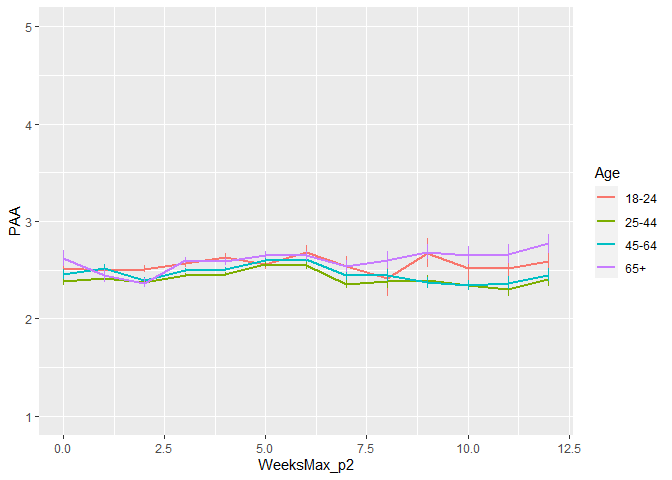
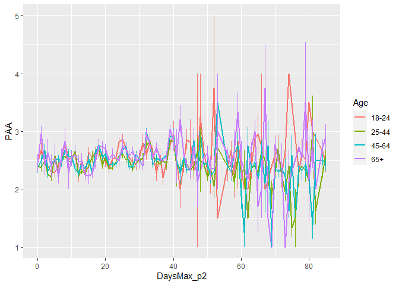
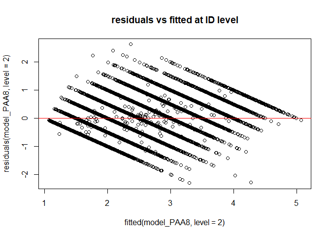
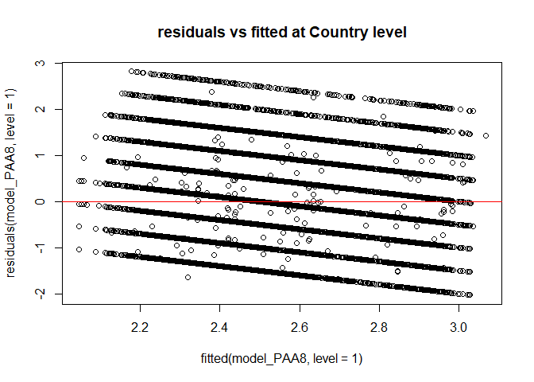
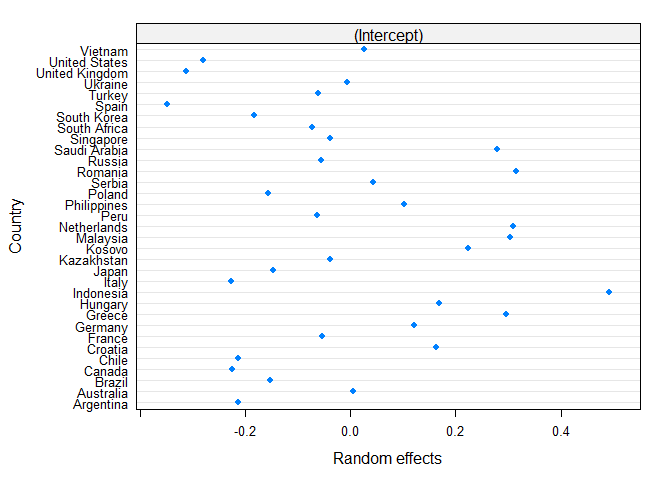
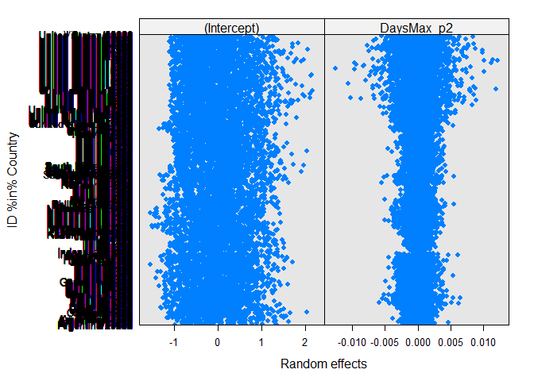
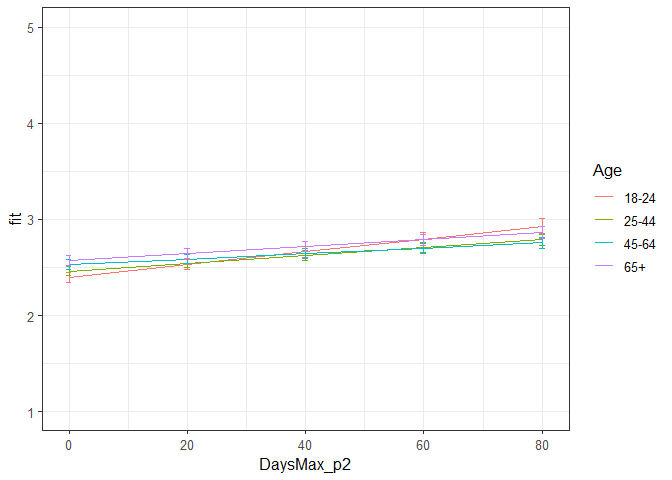

Second analyses PAA Phase 2
================
Anne Margit
10/14/2020

    ## [1] ""

``` r
load("data_analyse2_p2.Rdata")
```

This dataset includes:

1.  Data from all weekly measurement waves (baseline through wave 11,
    Time 1 through 12)
2.  Participants who provided at least 3 measurements
3.  Participants who are residents of the country they currently live in
4.  Participants who provided info on age
5.  Participants who provided info on gender (either male or female)
6.  Data from countries with at least 20 participants
7.  Pooled age groups
8.  Imputed missing emotion scores
9.  Combined emotion scores (NAA, NAD, PAA, PAD)
10. An imputed Stringency index (StringencyIndex\_imp)
11. A variable indicating the number of days before and after the day on
    which maximum stringency was reached for the respective country
    (DaysMax)
12. A variable indicating the number of weeks before and after the day
    on which maximum stringency was reached for the respective country
    (WeeksMax)
13. A variable indicating the date on which maximum Stringency was
    reached for that country (DateMaxStr)
14. A dummy Str\_dummy with 0 = before the peaj, 1 = during peak, 2 =
    after peak
15. Observations during which there was a second peak are excluded
    (N=583)

> My comments are in block quotes such as this.

``` r
library(dplyr)
library(tidyverse)
library(ggpubr)
library(ggplot2)
library(rockchalk)
library(effects)
library(nlme)
library(lattice)
library(broom.mixed)
library(purrr)
```

# Descriptives

**Number of participants per age group**

``` r
data_analyse2_p2 %>%
  group_by(Age_new) %>%
  summarise(NAge = n())
```

    # A tibble: 4 x 2
      Age_new  NAge
      <fct>   <int>
    1 0        3645
    2 1       11159
    3 2       10144
    4 3        4341

**Plots** **Mean PAA against max stringency in WEEKS**

``` r
plot_PAA <- ggplot(data_analyse2_p2, aes(x=WeeksMax_p2, y=PAA, group = Age_new, color = Age_new))

plot_PAA + stat_summary(fun.y=mean, geom="line", size=1)  + geom_errorbar(stat="summary", fun.data="mean_se", width=0) + scale_colour_discrete(name = "Age", labels = c("18-24", "25-44", "45-64", "65+")) + expand_limits(y=c(1, 5))
```

<!-- -->

**Mean PAA against max stringency in DAYS**

``` r
plot_PAA <- ggplot(data_analyse2_p2, aes(x=DaysMax_p2, y=PAA, group = Age_new, color = Age_new))

plot_PAA + stat_summary(fun.y=mean, geom="line", size=1)  + geom_errorbar(stat="summary", fun.data="mean_se", width=0) + scale_colour_discrete(name = "Age", labels = c("18-24", "25-44", "45-64", "65+")) + expand_limits(y=c(1, 5))
```

<!-- -->

# Regression models phase 2

**Positive affect high arousal**

*Predictors: DaysMax\_p2, Age, Random: IC for Country*

``` r
model_PAA1 <- lme(fixed = PAA ~ DaysMax_p2 + Age_new + DaysMax_p2*Age_new,
                   random = ~1 | Country, 
                  data = data_analyse2_p2, 
                  na.action = na.omit)

summary(model_PAA1)
```

    Linear mixed-effects model fit by REML
     Data: data_analyse2_p2 
           AIC      BIC    logLik
      78931.63 79014.47 -39455.81
    
    Random effects:
     Formula: ~1 | Country
            (Intercept)  Residual
    StdDev:   0.2367674 0.9287273
    
    Fixed effects: PAA ~ DaysMax_p2 + Age_new + DaysMax_p2 * Age_new 
                             Value  Std.Error    DF  t-value p-value
    (Intercept)          2.4126451 0.05220162 29235 46.21782  0.0000
    DaysMax_p2           0.0057664 0.00101114 29235  5.70284  0.0000
    Age_new1             0.0747891 0.03209668 29235  2.33012  0.0198
    Age_new2             0.1537992 0.03363564 29235  4.57251  0.0000
    Age_new3             0.1496247 0.04107145 29235  3.64304  0.0003
    DaysMax_p2:Age_new1 -0.0028765 0.00109685 29235 -2.62253  0.0087
    DaysMax_p2:Age_new2 -0.0041035 0.00111119 29235 -3.69285  0.0002
    DaysMax_p2:Age_new3 -0.0010417 0.00125222 29235 -0.83192  0.4055
     Correlation: 
                        (Intr) DysM_2 Ag_nw1 Ag_nw2 Ag_nw3 DM_2:A_1 DM_2:A_2
    DaysMax_p2          -0.412                                              
    Age_new1            -0.448  0.712                                       
    Age_new2            -0.431  0.689  0.735                                
    Age_new3            -0.352  0.565  0.605  0.600                         
    DaysMax_p2:Age_new1  0.379 -0.888 -0.814 -0.615 -0.505                  
    DaysMax_p2:Age_new2  0.375 -0.884 -0.636 -0.818 -0.510  0.806           
    DaysMax_p2:Age_new3  0.332 -0.786 -0.566 -0.553 -0.827  0.716    0.713  
    
    Standardized Within-Group Residuals:
            Min          Q1         Med          Q3         Max 
    -2.24235870 -0.81405008  0.04141174  0.69876947  3.02606216 
    
    Number of Observations: 29275
    Number of Groups: 33 

*Predictors: DaysMax\_p1, Age, Random: IC for ID*

``` r
model_PAA2 <- lme(fixed = PAA ~ DaysMax_p2 + Age_new + DaysMax_p2*Age_new,
                  random = ~1 | ID, 
                 data = data_analyse2_p2, 
                 na.action = na.omit)

summary(model_PAA2)
```

    Linear mixed-effects model fit by REML
     Data: data_analyse2_p2 
           AIC     BIC    logLik
      67350.56 67433.4 -33665.28
    
    Random effects:
     Formula: ~1 | ID
            (Intercept)  Residual
    StdDev:   0.7629868 0.5790458
    
    Fixed effects: PAA ~ DaysMax_p2 + Age_new + DaysMax_p2 * Age_new 
                             Value  Std.Error    DF  t-value p-value
    (Intercept)          2.4329848 0.02931545 20144 82.99326  0.0000
    DaysMax_p2           0.0057186 0.00079817 20144  7.16461  0.0000
    Age_new1            -0.0502477 0.03393457  9123 -1.48072  0.1387
    Age_new2             0.0169827 0.03462908  9123  0.49042  0.6238
    Age_new3             0.0410355 0.04152549  9123  0.98820  0.3231
    DaysMax_p2:Age_new1 -0.0026489 0.00088247 20144 -3.00168  0.0027
    DaysMax_p2:Age_new2 -0.0033163 0.00089013 20144 -3.72569  0.0002
    DaysMax_p2:Age_new3 -0.0023249 0.00100785 20144 -2.30674  0.0211
     Correlation: 
                        (Intr) DysM_2 Ag_nw1 Ag_nw2 Ag_nw3 DM_2:A_1 DM_2:A_2
    DaysMax_p2          -0.541                                              
    Age_new1            -0.864  0.468                                       
    Age_new2            -0.847  0.458  0.731                                
    Age_new3            -0.706  0.382  0.610  0.598                         
    DaysMax_p2:Age_new1  0.490 -0.904 -0.537 -0.414 -0.346                  
    DaysMax_p2:Age_new2  0.485 -0.897 -0.419 -0.548 -0.343  0.811           
    DaysMax_p2:Age_new3  0.429 -0.792 -0.370 -0.363 -0.571  0.716    0.710  
    
    Standardized Within-Group Residuals:
            Min          Q1         Med          Q3         Max 
    -4.84769837 -0.55705608 -0.01087537  0.54876681  4.55212141 
    
    Number of Observations: 29275
    Number of Groups: 9127 

*Random: IC for ID and Country*

``` r
model_PAA3 <- lme(fixed = PAA ~ DaysMax_p2 + Age_new + DaysMax_p2*Age_new,
                  random = ~1 | Country/ID, 
                  data = data_analyse2_p2, 
                  na.action = na.omit)

summary(model_PAA3)
```

    Linear mixed-effects model fit by REML
     Data: data_analyse2_p2 
           AIC      BIC    logLik
      66642.75 66733.88 -33310.38
    
    Random effects:
     Formula: ~1 | Country
            (Intercept)
    StdDev:   0.2374093
    
     Formula: ~1 | ID %in% Country
            (Intercept)  Residual
    StdDev:   0.7237897 0.5788872
    
    Fixed effects: PAA ~ DaysMax_p2 + Age_new + DaysMax_p2 * Age_new 
                             Value  Std.Error    DF  t-value p-value
    (Intercept)          2.3990480 0.05334770 20144 44.97003  0.0000
    DaysMax_p2           0.0064055 0.00079967 20144  8.01015  0.0000
    Age_new1             0.0716225 0.03402235  9091  2.10516  0.0353
    Age_new2             0.1321102 0.03519049  9091  3.75415  0.0002
    Age_new3             0.1700012 0.04231099  9091  4.01790  0.0001
    DaysMax_p2:Age_new1 -0.0028133 0.00088027 20144 -3.19592  0.0014
    DaysMax_p2:Age_new2 -0.0036765 0.00088872 20144 -4.13682  0.0000
    DaysMax_p2:Age_new3 -0.0026851 0.00100621 20144 -2.66852  0.0076
     Correlation: 
                        (Intr) DysM_2 Ag_nw1 Ag_nw2 Ag_nw3 DM_2:A_1 DM_2:A_2
    DaysMax_p2          -0.289                                              
    Age_new1            -0.458  0.484                                       
    Age_new2            -0.444  0.472  0.746                                
    Age_new3            -0.371  0.393  0.624  0.624                         
    DaysMax_p2:Age_new1  0.267 -0.903 -0.544 -0.420 -0.350                  
    DaysMax_p2:Age_new2  0.264 -0.896 -0.429 -0.553 -0.350  0.812           
    DaysMax_p2:Age_new3  0.232 -0.791 -0.380 -0.372 -0.573  0.717    0.712  
    
    Standardized Within-Group Residuals:
            Min          Q1         Med          Q3         Max 
    -4.78446134 -0.55646012 -0.01595987  0.54599755  4.52170623 
    
    Number of Observations: 29275
    Number of Groups: 
            Country ID %in% Country 
                 33            9127 

*Random: IC for ID and Country, S for Country*

``` r
model_PAA4 <- lme(fixed = PAA ~ DaysMax_p2 + Age_new + DaysMax_p2*Age_new,
                  random = list (Country = ~DaysMax_p2, ID = ~1), 
                  data = data_analyse2_p2, 
                  na.action = na.omit)

summary(model_PAA4)
```

    Linear mixed-effects model fit by REML
     Data: data_analyse2_p2 
           AIC      BIC    logLik
      66642.12 66749.81 -33308.06
    
    Random effects:
     Formula: ~DaysMax_p2 | Country
     Structure: General positive-definite, Log-Cholesky parametrization
                StdDev      Corr  
    (Intercept) 0.232099099 (Intr)
    DaysMax_p2  0.001655013 0.14  
    
     Formula: ~1 | ID %in% Country
            (Intercept)  Residual
    StdDev:   0.7238221 0.5786908
    
    Fixed effects: PAA ~ DaysMax_p2 + Age_new + DaysMax_p2 * Age_new 
                             Value  Std.Error    DF  t-value p-value
    (Intercept)          2.3970190 0.05273491 20144 45.45413  0.0000
    DaysMax_p2           0.0067696 0.00093468 20144  7.24266  0.0000
    Age_new1             0.0641129 0.03421863  9091  1.87363  0.0610
    Age_new2             0.1232406 0.03548154  9091  3.47337  0.0005
    Age_new3             0.1586108 0.04261982  9091  3.72153  0.0002
    DaysMax_p2:Age_new1 -0.0024855 0.00089404 20144 -2.78004  0.0054
    DaysMax_p2:Age_new2 -0.0033177 0.00090599 20144 -3.66199  0.0003
    DaysMax_p2:Age_new3 -0.0022258 0.00102499 20144 -2.17149  0.0299
     Correlation: 
                        (Intr) DysM_2 Ag_nw1 Ag_nw2 Ag_nw3 DM_2:A_1 DM_2:A_2
    DaysMax_p2          -0.241                                              
    Age_new1            -0.456  0.387                                       
    Age_new2            -0.440  0.370  0.749                                
    Age_new3            -0.369  0.311  0.627  0.629                         
    DaysMax_p2:Age_new1  0.258 -0.722 -0.552 -0.432 -0.361                  
    DaysMax_p2:Age_new2  0.254 -0.710 -0.439 -0.563 -0.363  0.818           
    DaysMax_p2:Age_new3  0.225 -0.632 -0.388 -0.384 -0.581  0.723    0.720  
    
    Standardized Within-Group Residuals:
            Min          Q1         Med          Q3         Max 
    -4.79580103 -0.55577147 -0.01601987  0.54357421  4.52304480 
    
    Number of Observations: 29275
    Number of Groups: 
            Country ID %in% Country 
                 33            9127 

*Random: IC for ID and Country, S for ID*

``` r
model_PAA5 <- lme(fixed = PAA ~ DaysMax_p2 + Age_new + DaysMax_p2*Age_new,
                  random = list (Country = ~1, ID = ~DaysMax_p2), 
                  data = data_analyse2_p2, 
                  na.action = na.omit)

summary(model_PAA5)
```

    Linear mixed-effects model fit by REML
     Data: data_analyse2_p2 
           AIC      BIC    logLik
      66389.34 66497.03 -33181.67
    
    Random effects:
     Formula: ~1 | Country
            (Intercept)
    StdDev:   0.2383526
    
     Formula: ~DaysMax_p2 | ID %in% Country
     Structure: General positive-definite, Log-Cholesky parametrization
                StdDev      Corr  
    (Intercept) 0.742737288 (Intr)
    DaysMax_p2  0.009281242 -0.24 
    Residual    0.559470532       
    
    Fixed effects: PAA ~ DaysMax_p2 + Age_new + DaysMax_p2 * Age_new 
                             Value  Std.Error    DF  t-value p-value
    (Intercept)          2.3924797 0.05391806 20144 44.37251  0.0000
    DaysMax_p2           0.0068424 0.00092353 20144  7.40894  0.0000
    Age_new1             0.0681809 0.03503947  9091  1.94583  0.0517
    Age_new2             0.1385638 0.03632303  9091  3.81476  0.0001
    Age_new3             0.1799628 0.04385579  9091  4.10351  0.0000
    DaysMax_p2:Age_new1 -0.0026395 0.00102864 20144 -2.56601  0.0103
    DaysMax_p2:Age_new2 -0.0040023 0.00104127 20144 -3.84364  0.0001
    DaysMax_p2:Age_new3 -0.0031913 0.00118932 20144 -2.68331  0.0073
     Correlation: 
                        (Intr) DysM_2 Ag_nw1 Ag_nw2 Ag_nw3 DM_2:A_1 DM_2:A_2
    DaysMax_p2          -0.316                                              
    Age_new1            -0.466  0.514                                       
    Age_new2            -0.451  0.500  0.741                                
    Age_new3            -0.375  0.415  0.616  0.614                         
    DaysMax_p2:Age_new1  0.288 -0.892 -0.585 -0.441 -0.366                  
    DaysMax_p2:Age_new2  0.283 -0.883 -0.452 -0.594 -0.364  0.791           
    DaysMax_p2:Age_new3  0.247 -0.774 -0.396 -0.386 -0.614  0.693    0.686  
    
    Standardized Within-Group Residuals:
            Min          Q1         Med          Q3         Max 
    -4.08868749 -0.54263755 -0.01744403  0.53483911  4.68507414 
    
    Number of Observations: 29275
    Number of Groups: 
            Country ID %in% Country 
                 33            9127 

*Random slope for Country and ID*

``` r
model_PAA6 <- lme(fixed = PAA ~ DaysMax_p2 + Age_new + DaysMax_p2*Age_new,
                  random = ~DaysMax_p2 | Country/ID, 
                  data = data_analyse2_p2, 
                  na.action = na.omit)

summary(model_PAA6)
```

    Linear mixed-effects model fit by REML
     Data: data_analyse2_p2 
           AIC      BIC    logLik
      66390.62 66514.89 -33180.31
    
    Random effects:
     Formula: ~DaysMax_p2 | Country
     Structure: General positive-definite, Log-Cholesky parametrization
                StdDev     Corr  
    (Intercept) 0.23406399 (Intr)
    DaysMax_p2  0.00153635 0.119 
    
     Formula: ~DaysMax_p2 | ID %in% Country
     Structure: General positive-definite, Log-Cholesky parametrization
                StdDev      Corr  
    (Intercept) 0.742573504 (Intr)
    DaysMax_p2  0.009253018 -0.24 
    Residual    0.559404704       
    
    Fixed effects: PAA ~ DaysMax_p2 + Age_new + DaysMax_p2 * Age_new 
                             Value  Std.Error    DF  t-value p-value
    (Intercept)          2.3934483 0.05341614 20144 44.80758  0.0000
    DaysMax_p2           0.0069602 0.00102000 20144  6.82372  0.0000
    Age_new1             0.0616137 0.03528229  9091  1.74631  0.0808
    Age_new2             0.1309789 0.03667187  9091  3.57164  0.0004
    Age_new3             0.1692867 0.04423906  9091  3.82663  0.0001
    DaysMax_p2:Age_new1 -0.0023288 0.00104584 20144 -2.22669  0.0260
    DaysMax_p2:Age_new2 -0.0036606 0.00106301 20144 -3.44359  0.0006
    DaysMax_p2:Age_new3 -0.0027143 0.00121372 20144 -2.23634  0.0253
     Correlation: 
                        (Intr) DysM_2 Ag_nw1 Ag_nw2 Ag_nw3 DM_2:A_1 DM_2:A_2
    DaysMax_p2          -0.281                                              
    Age_new1            -0.464  0.445                                       
    Age_new2            -0.447  0.428  0.745                                
    Age_new3            -0.373  0.358  0.620  0.620                         
    DaysMax_p2:Age_new1  0.281 -0.769 -0.592 -0.454 -0.377                  
    DaysMax_p2:Age_new2  0.276 -0.756 -0.463 -0.604 -0.378  0.798           
    DaysMax_p2:Age_new3  0.242 -0.667 -0.405 -0.400 -0.622  0.699    0.695  
    
    Standardized Within-Group Residuals:
           Min         Q1        Med         Q3        Max 
    -4.0976343 -0.5442766 -0.0191585  0.5334797  4.6855656 
    
    Number of Observations: 29275
    Number of Groups: 
            Country ID %in% Country 
                 33            9127 

> Model with random slope for only ID is better

*Random: IC for ID and Country, S for ID + AR*

``` r
data_analyse2_p2 <- data_analyse2_p2[with(data_analyse2_p2, order(Country, ID, Time)),]
data_analyse2_p2$Time <- as.numeric(data_analyse2_p2$Time)

model_PAA7 <- lme(fixed = PAA ~ DaysMax_p2 + Age_new + DaysMax_p2*Age_new,
                  random = list (Country = ~1, ID = ~DaysMax_p2), 
                  data = data_analyse2_p2, 
                  na.action = na.omit,
                  correlation = corAR1(form = ~ Time | Country/ID))

summary(model_PAA7)
```

    Linear mixed-effects model fit by REML
     Data: data_analyse2_p2 
           AIC      BIC    logLik
      66210.77 66326.75 -33091.38
    
    Random effects:
     Formula: ~1 | Country
            (Intercept)
    StdDev:   0.2382684
    
     Formula: ~DaysMax_p2 | ID %in% Country
     Structure: General positive-definite, Log-Cholesky parametrization
                StdDev      Corr  
    (Intercept) 0.710296354 (Intr)
    DaysMax_p2  0.007250311 -0.152
    Residual    0.586755151       
    
    Correlation Structure: ARMA(1,0)
     Formula: ~Time | Country/ID 
     Parameter estimate(s):
         Phi1 
    0.1980237 
    Fixed effects: PAA ~ DaysMax_p2 + Age_new + DaysMax_p2 * Age_new 
                             Value  Std.Error    DF  t-value p-value
    (Intercept)          2.3937570 0.05386492 20144 44.44000  0.0000
    DaysMax_p2           0.0067357 0.00093032 20144  7.24013  0.0000
    Age_new1             0.0673559 0.03498916  9091  1.92505  0.0543
    Age_new2             0.1359573 0.03628497  9091  3.74693  0.0002
    Age_new3             0.1758252 0.04381528  9091  4.01287  0.0001
    DaysMax_p2:Age_new1 -0.0026220 0.00103215 20144 -2.54036  0.0111
    DaysMax_p2:Age_new2 -0.0038787 0.00104397 20144 -3.71529  0.0002
    DaysMax_p2:Age_new3 -0.0030225 0.00118995 20144 -2.54003  0.0111
     Correlation: 
                        (Intr) DysM_2 Ag_nw1 Ag_nw2 Ag_nw3 DM_2:A_1 DM_2:A_2
    DaysMax_p2          -0.315                                              
    Age_new1            -0.467  0.515                                       
    Age_new2            -0.451  0.501  0.741                                
    Age_new3            -0.375  0.416  0.617  0.615                         
    DaysMax_p2:Age_new1  0.288 -0.895 -0.584 -0.443 -0.367                  
    DaysMax_p2:Age_new2  0.284 -0.887 -0.454 -0.594 -0.367  0.797           
    DaysMax_p2:Age_new3  0.248 -0.779 -0.399 -0.389 -0.614  0.700    0.693  
    
    Standardized Within-Group Residuals:
            Min          Q1         Med          Q3         Max 
    -3.87798606 -0.55342778 -0.01483138  0.54400500  4.48075432 
    
    Number of Observations: 29275
    Number of Groups: 
            Country ID %in% Country 
                 33            9127 

*Random: IC for ID and Country, S for ID, No correlation between IC and
S for ID*

``` r
model_PAA8 <- lme(fixed = PAA ~ DaysMax_p2 + Age_new + DaysMax_p2*Age_new,
                  random = list (Country = ~1, ID = pdDiag(~DaysMax_p2)),
                  data = data_analyse2_p2, 
                  na.action = na.omit,
                  correlation = corAR1(form = ~ Time | Country/ID))

summary(model_PAA8)
```

    Linear mixed-effects model fit by REML
     Data: data_analyse2_p2 
           AIC      BIC    logLik
      66215.42 66323.12 -33094.71
    
    Random effects:
     Formula: ~1 | Country
            (Intercept)
    StdDev:   0.2384038
    
     Formula: ~DaysMax_p2 | ID %in% Country
     Structure: Diagonal
            (Intercept)  DaysMax_p2  Residual
    StdDev:   0.6881574 0.006260532 0.5908005
    
    Correlation Structure: ARMA(1,0)
     Formula: ~Time | Country/ID 
     Parameter estimate(s):
         Phi1 
    0.2080248 
    Fixed effects: PAA ~ DaysMax_p2 + Age_new + DaysMax_p2 * Age_new 
                             Value  Std.Error    DF  t-value p-value
    (Intercept)          2.3947792 0.05361421 20144 44.66687  0.0000
    DaysMax_p2           0.0066790 0.00092125 20144  7.24985  0.0000
    Age_new1             0.0667060 0.03447741  9091  1.93478  0.0530
    Age_new2             0.1345881 0.03576021  9091  3.76363  0.0002
    Age_new3             0.1759371 0.04318485  9091  4.07405  0.0000
    DaysMax_p2:Age_new1 -0.0026146 0.00102100 20144 -2.56080  0.0105
    DaysMax_p2:Age_new2 -0.0038288 0.00103216 20144 -3.70951  0.0002
    DaysMax_p2:Age_new3 -0.0030349 0.00117511 20144 -2.58263  0.0098
     Correlation: 
                        (Intr) DysM_2 Ag_nw1 Ag_nw2 Ag_nw3 DM_2:A_1 DM_2:A_2
    DaysMax_p2          -0.305                                              
    Age_new1            -0.462  0.504                                       
    Age_new2            -0.446  0.490  0.742                                
    Age_new3            -0.371  0.407  0.618  0.616                         
    DaysMax_p2:Age_new1  0.279 -0.897 -0.570 -0.434 -0.360                  
    DaysMax_p2:Age_new2  0.275 -0.889 -0.445 -0.579 -0.359  0.800           
    DaysMax_p2:Age_new3  0.241 -0.781 -0.391 -0.382 -0.599  0.703    0.697  
    
    Standardized Within-Group Residuals:
            Min          Q1         Med          Q3         Max 
    -3.89299780 -0.55365547 -0.01604853  0.54547199  4.45258517 
    
    Number of Observations: 29275
    Number of Groups: 
            Country ID %in% Country 
                 33            9127 

> Best model is PAA8: random IC for ID and Country + S for ID + no
> correlation between IC and S for ID + AR\*

*QQ plot of residuals*

``` r
par(mfrow = c(1,2))
lims <- c(-3.5,3.5)
hist(resid(model_PAA8, type = "normalized"),
freq = FALSE, xlim = lims, ylim =  c(0,.7),main = "Histogram of Standardized Residuals")
lines(density(scale(resid(model_PAA8))))
qqnorm(resid(model_PAA8, type = "normalized"),
xlim = lims, ylim = lims,main = "QQ plot")
abline(0,1, col = "red", lty = 2)
```

<!-- -->

*Residuals vs fitted*

``` r
plot(fitted(model_PAA8, level=2), residuals(model_PAA8, level=2), 
     main="residuals vs fitted at ID level")
abline(a=0, b=0,col="red")
```

<!-- -->

``` r
plot(fitted(model_PAA8, level=1), residuals(model_PAA8, level=1), 
    main="residuals vs fitted at Country level")
abline(a=0, b=0,col="red")
```

<!-- -->

> Residuen zien er allemaal goed uit

*Plot random intercepts and slopes*

``` r
plot(ranef(model_PAA8, level = 1))
```

<!-- -->

``` r
plot(ranef(model_PAA8, level = 2))
```

<!-- -->

*Confidence intervals*

``` r
intervals(model_PAA8)
```

    Approximate 95% confidence intervals
    
     Fixed effects:
                                lower         est.         upper
    (Intercept)          2.2896909381  2.394779177  2.4998674152
    DaysMax_p2           0.0048732227  0.006678956  0.0084846888
    Age_new1            -0.0008774331  0.066706037  0.1342895080
    Age_new2             0.0644900510  0.134588107  0.2046861622
    Age_new3             0.0912850472  0.175937074  0.2605891008
    DaysMax_p2:Age_new1 -0.0046158171 -0.002614573 -0.0006133298
    DaysMax_p2:Age_new2 -0.0058519301 -0.003828811 -0.0018056929
    DaysMax_p2:Age_new3 -0.0053381703 -0.003034866 -0.0007315617
    attr(,"label")
    [1] "Fixed effects:"
    
     Random Effects:
      Level: Country 
                        lower      est.     upper
    sd((Intercept)) 0.1787229 0.2384038 0.3180139
      Level: ID 
                          lower        est.       upper
    sd((Intercept)) 0.674048784 0.688157353 0.702561230
    sd(DaysMax_p2)  0.005499036 0.006260532 0.007127478
    
     Correlation structure:
             lower      est.     upper
    Phi1 0.1818939 0.2080248 0.2338622
    attr(,"label")
    [1] "Correlation structure:"
    
     Within-group standard error:
        lower      est.     upper 
    0.5831034 0.5908005 0.5985993 

*Plot of predicted values*

``` r
ef_PAA <- effect("DaysMax_p2:Age_new", model_PAA8)

plot_PAA <- ggplot(as.data.frame(ef_PAA), 
       aes(DaysMax_p2, fit, color=Age_new)) + geom_line() + 
  geom_errorbar(aes(ymin=fit-se, ymax=fit+se), width=1) + theme_bw(base_size=12) + scale_color_discrete(name="Age", labels = c("18-24", "25-44", "45-64", "65+")) + expand_limits(y=c(1, 5))
```

``` r
plot_PAA
```

<!-- -->

``` r
coef_PAA = tidy(model_PAA8, 
               effects = "fixed")
```

*Effect sizes* **Within person SD and average within person SD for NAA**

``` r
ISDs <- data_analyse2_p2 %>% 
  group_by(ID) %>%
  summarize_at(c("PAA"), sd, na.rm=TRUE) %>%
  ungroup()

ISDs_av <- ISDs %>%
  summarize_at(c("PAA"), mean, na.rm=TRUE) %>%
  stack() %>%
  rename(sd=values) 
```

> Effect sizes for intercept and main effect of age = regression
> coefficient / average ISD of PAA Effect size for main effect of
> DaysMax = (regression coefficient \* 28)/ average ISD of PAA Effect
> sizes for interaction effects = (regression coefficient \* 28)/
> average ISD of PAA

> The effect sizes for main effect of DaysMax and the interaction
> effects reflect the increase in SD of PAA over 4 weeks (28 days)

``` r
coef_PAA <- coef_PAA %>%
  mutate (e_size = ifelse(row_number()== 1 | row_number()== 3 |  row_number()== 4 |  row_number()== 5,
          estimate/0.4889585, 
          (estimate*28)/0.4889585))
```

``` r
coef_PAA
```

    ## # A tibble: 8 x 7
    ##   term                estimate std.error    df statistic  p.value e_size
    ##   <chr>                  <dbl>     <dbl> <dbl>     <dbl>    <dbl>  <dbl>
    ## 1 (Intercept)          2.39     0.0536   20144     44.7  0.        4.90 
    ## 2 DaysMax_p2           0.00668  0.000921 20144      7.25 4.32e-13  0.382
    ## 3 Age_new1             0.0667   0.0345    9091      1.93 5.30e- 2  0.136
    ## 4 Age_new2             0.135    0.0358    9091      3.76 1.69e- 4  0.275
    ## 5 Age_new3             0.176    0.0432    9091      4.07 4.66e- 5  0.360
    ## 6 DaysMax_p2:Age_new1 -0.00261  0.00102  20144     -2.56 1.05e- 2 -0.150
    ## 7 DaysMax_p2:Age_new2 -0.00383  0.00103  20144     -3.71 2.08e- 4 -0.219
    ## 8 DaysMax_p2:Age_new3 -0.00303  0.00118  20144     -2.58 9.81e- 3 -0.174

> There are differences between age groups in intensity, PAA also
> increases with increasing days after max stringency. Small effect
> sizes There are also interaction effects between age and DaysMax but
> these effect sizes are small.
