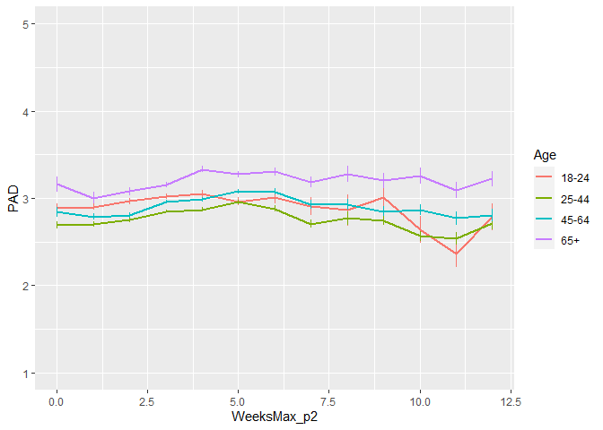
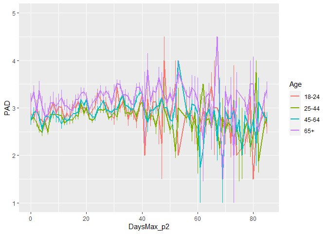
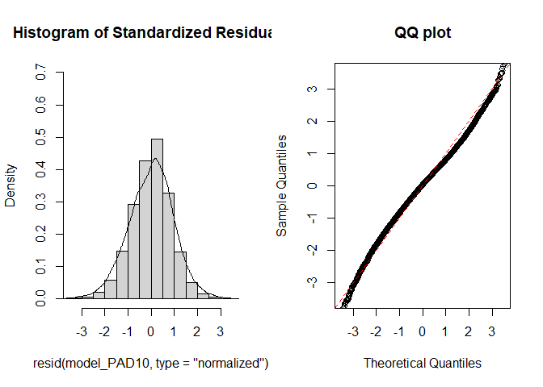
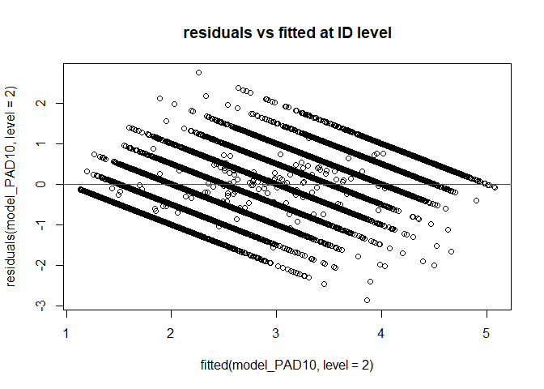
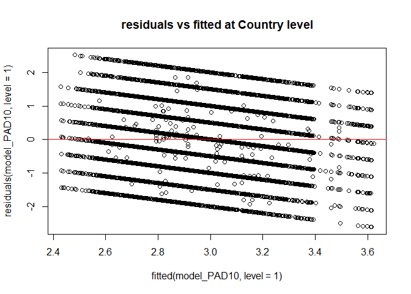
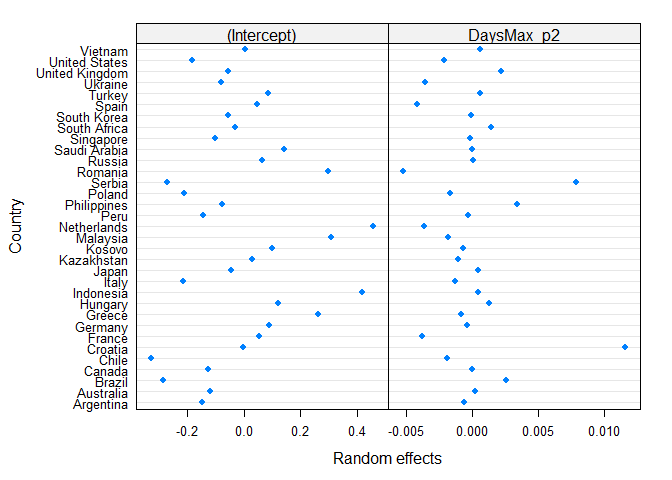
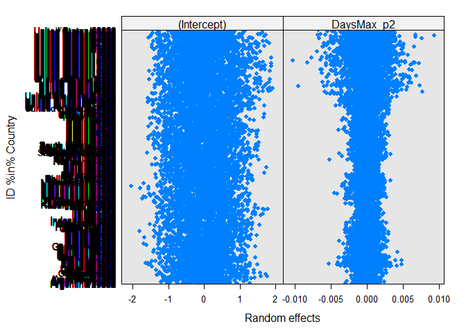
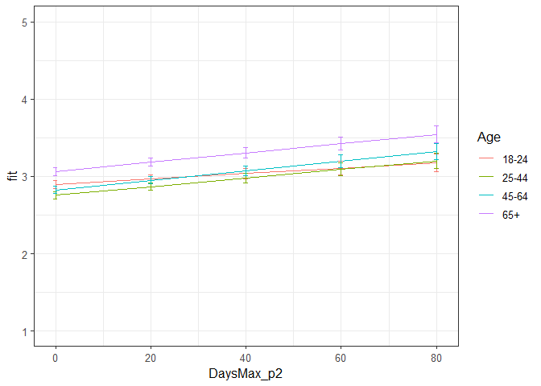

Second analyses PAD Phase 2
================
Anne Margit
10/15/2020

    ## [1] ""

``` r
load("data_analyse2_p2.Rdata")
```

This dataset includes:

1.  Data from all weekly measurement waves (baseline through wave 11,
    Time 1 through 12)
2.  Participants who provided at least 3 measurements
3.  Participants who are residents of the country they currently live in
4.  Participants who provided info on age
5.  Participants who provided info on gender (either male or female)
6.  Data from countries with at least 20 participants
7.  Pooled age groups
8.  Imputed missing emotion scores
9.  Combined emotion scores (NAA, NAD, PAA, PAD)
10. An imputed Stringency index (StringencyIndex\_imp)
11. A variable indicating the number of days before and after the day on
    which maximum stringency was reached for the respective country
    (DaysMax)
12. A variable indicating the number of weeks before and after the day
    on which maximum stringency was reached for the respective country
    (WeeksMax)
13. A variable indicating the date on which maximum Stringency was
    reached for that country (DateMaxStr)
14. A dummy Str\_dummy with 0 = before the peaj, 1 = during peak, 2 =
    after peak
15. Observations during which there was a second peak are excluded
    (N=583)

> My comments are in block quotes such as this.

``` r
library(dplyr)
library(tidyverse)
library(ggpubr)
library(ggplot2)
library(rockchalk)
library(effects)
library(nlme)
library(lattice)
library(broom.mixed)
library(purrr)
```

# Descriptives

**Number of participants per age group**

``` r
data_analyse2_p2 %>%
  group_by(Age_new) %>%
  summarise(NAge = n())
```

    # A tibble: 4 x 2
      Age_new  NAge
      <fct>   <int>
    1 0        3645
    2 1       11159
    3 2       10144
    4 3        4341

**Plots** **Mean PAD against max stringency in WEEKS**

``` r
plot_PAD <- ggplot(data_analyse2_p2, aes(x=WeeksMax_p2, y=PAD, group = Age_new, color = Age_new))

plot_PAD + stat_summary(fun.y=mean, geom="line", size=1)  + geom_errorbar(stat="summary", fun.data="mean_se", width=0) + scale_colour_discrete(name = "Age", labels = c("18-24", "25-44", "45-64", "65+")) + expand_limits(y=c(1, 5))
```

<!-- -->

**Mean PAD against max stringency in DAYS**

``` r
plot_PAD <- ggplot(data_analyse2_p2, aes(x=DaysMax_p2, y=PAD, group = Age_new, color = Age_new))

plot_PAD + stat_summary(fun.y=mean, geom="line", size=1)  + geom_errorbar(stat="summary", fun.data="mean_se", width=0) + scale_colour_discrete(name = "Age", labels = c("18-24", "25-44", "45-64", "65+")) + expand_limits(y=c(1, 5))
```

<!-- -->

# Regression models phase 2

**Positive affect low arousal**

*Predictors: DaysMax\_p2, Age, Random: IC for Country*

``` r
model_PAD1 <- lme(fixed = PAD ~ DaysMax_p2 + Age_new + DaysMax_p2*Age_new,
                   random = ~1 | Country, 
                  data = data_analyse2_p2, 
                  na.action = na.omit)

summary(model_PAD1)
```

    Linear mixed-effects model fit by REML
     Data: data_analyse2_p2 
           AIC      BIC    logLik
      81086.38 81169.22 -40533.19
    
    Random effects:
     Formula: ~1 | Country
            (Intercept)  Residual
    StdDev:   0.2109763 0.9636818
    
    Fixed effects: PAD ~ DaysMax_p2 + Age_new + DaysMax_p2 * Age_new 
                             Value  Std.Error    DF  t-value p-value
    (Intercept)          2.9010983 0.04905040 29235 59.14525  0.0000
    DaysMax_p2           0.0020744 0.00104862 29235  1.97821  0.0479
    Age_new1            -0.0810868 0.03328651 29235 -2.43603  0.0149
    Age_new2            -0.0078966 0.03487390 29235 -0.22643  0.8209
    Age_new3             0.2046268 0.04258623 29235  4.80500  0.0000
    DaysMax_p2:Age_new1 -0.0000399 0.00113785 29235 -0.03510  0.9720
    DaysMax_p2:Age_new2  0.0009826 0.00115260 29235  0.85250  0.3939
    DaysMax_p2:Age_new3  0.0021223 0.00129887 29235  1.63393  0.1023
     Correlation: 
                        (Intr) DysM_2 Ag_nw1 Ag_nw2 Ag_nw3 DM_2:A_1 DM_2:A_2
    DaysMax_p2          -0.457                                              
    Age_new1            -0.496  0.712                                       
    Age_new2            -0.477  0.689  0.735                                
    Age_new3            -0.390  0.564  0.605  0.600                         
    DaysMax_p2:Age_new1  0.419 -0.889 -0.814 -0.615 -0.505                  
    DaysMax_p2:Age_new2  0.415 -0.884 -0.636 -0.818 -0.509  0.806           
    DaysMax_p2:Age_new3  0.367 -0.786 -0.566 -0.553 -0.827  0.716    0.713  
    
    Standardized Within-Group Residuals:
            Min          Q1         Med          Q3         Max 
    -2.77566084 -0.73776956  0.06443122  0.75426384  2.61461507 
    
    Number of Observations: 29275
    Number of Groups: 33 

*Predictors: DaysMax\_p2, Age, Random: IC for ID*

``` r
model_PAD2 <- lme(fixed = PAD ~ DaysMax_p2 + Age_new + DaysMax_p2*Age_new,
                  random = ~1 | ID, 
                 data = data_analyse2_p2, 
                 na.action = na.omit)

summary(model_PAD2)
```

    Linear mixed-effects model fit by REML
     Data: data_analyse2_p2 
           AIC      BIC    logLik
      68845.21 68928.06 -34412.61
    
    Random effects:
     Formula: ~1 | ID
            (Intercept)  Residual
    StdDev:   0.7813056 0.5943853
    
    Fixed effects: PAD ~ DaysMax_p2 + Age_new + DaysMax_p2 * Age_new 
                             Value  Std.Error    DF  t-value p-value
    (Intercept)          2.9447563 0.03004861 20144 97.99977  0.0000
    DaysMax_p2           0.0014461 0.00081914 20144  1.76544  0.0775
    Age_new1            -0.1925912 0.03478313  9123 -5.53691  0.0000
    Age_new2            -0.0995574 0.03549613  9123 -2.80474  0.0050
    Age_new3             0.1316328 0.04256777  9123  3.09231  0.0020
    DaysMax_p2:Age_new1  0.0014215 0.00090566 20144  1.56962  0.1165
    DaysMax_p2:Age_new2  0.0022184 0.00091352 20144  2.42843  0.0152
    DaysMax_p2:Age_new3  0.0024693 0.00103433 20144  2.38738  0.0170
     Correlation: 
                        (Intr) DysM_2 Ag_nw1 Ag_nw2 Ag_nw3 DM_2:A_1 DM_2:A_2
    DaysMax_p2          -0.542                                              
    Age_new1            -0.864  0.468                                       
    Age_new2            -0.847  0.459  0.731                                
    Age_new3            -0.706  0.383  0.610  0.598                         
    DaysMax_p2:Age_new1  0.490 -0.904 -0.537 -0.415 -0.346                  
    DaysMax_p2:Age_new2  0.486 -0.897 -0.420 -0.548 -0.343  0.811           
    DaysMax_p2:Age_new3  0.429 -0.792 -0.371 -0.363 -0.572  0.716    0.710  
    
    Standardized Within-Group Residuals:
            Min          Q1         Med          Q3         Max 
    -4.86199799 -0.53753698  0.04284714  0.55234248  4.49372501 
    
    Number of Observations: 29275
    Number of Groups: 9127 

*Random: IC for ID and Country*

``` r
model_PAD3 <- lme(fixed = PAD ~ DaysMax_p2 + Age_new + DaysMax_p2*Age_new,
                  random = ~1 | Country/ID, 
                  data = data_analyse2_p2, 
                  na.action = na.omit)

summary(model_PAD3)
```

    Linear mixed-effects model fit by REML
     Data: data_analyse2_p2 
           AIC      BIC logLik
      68402.01 68493.13 -34190
    
    Random effects:
     Formula: ~1 | Country
            (Intercept)
    StdDev:   0.2066722
    
     Formula: ~1 | ID %in% Country
            (Intercept)  Residual
    StdDev:   0.7547307 0.5943436
    
    Fixed effects: PAD ~ DaysMax_p2 + Age_new + DaysMax_p2 * Age_new 
                             Value  Std.Error    DF  t-value p-value
    (Intercept)          2.9165639 0.04959283 20144 58.81020  0.0000
    DaysMax_p2           0.0018338 0.00082188 20144  2.23122  0.0257
    Age_new1            -0.1238552 0.03521548  9091 -3.51707  0.0004
    Age_new2            -0.0533215 0.03640111  9091 -1.46483  0.1430
    Age_new3             0.1718047 0.04375435  9091  3.92658  0.0001
    DaysMax_p2:Age_new1  0.0014165 0.00090489 20144  1.56541  0.1175
    DaysMax_p2:Age_new2  0.0021064 0.00091352 20144  2.30580  0.0211
    DaysMax_p2:Age_new3  0.0023424 0.00103433 20144  2.26466  0.0235
     Correlation: 
                        (Intr) DysM_2 Ag_nw1 Ag_nw2 Ag_nw3 DM_2:A_1 DM_2:A_2
    DaysMax_p2          -0.321                                              
    Age_new1            -0.512  0.480                                       
    Age_new2            -0.496  0.468  0.746                                
    Age_new3            -0.415  0.390  0.623  0.624                         
    DaysMax_p2:Age_new1  0.295 -0.903 -0.540 -0.416 -0.347                  
    DaysMax_p2:Age_new2  0.292 -0.896 -0.426 -0.549 -0.347  0.812           
    DaysMax_p2:Age_new3  0.257 -0.791 -0.376 -0.369 -0.569  0.717    0.712  
    
    Standardized Within-Group Residuals:
            Min          Q1         Med          Q3         Max 
    -4.87603723 -0.53869805  0.04445715  0.55173545  4.52192168 
    
    Number of Observations: 29275
    Number of Groups: 
            Country ID %in% Country 
                 33            9127 

*Random: IC for ID and Country, S for Country*

``` r
model_PAD4 <- lme(fixed = PAD ~ DaysMax_p2 + Age_new + DaysMax_p2*Age_new,
                  random = list (Country = ~DaysMax_p2, ID = ~1), 
                  data = data_analyse2_p2, 
                  na.action = na.omit)

summary(model_PAD4)
```

    Linear mixed-effects model fit by REML
     Data: data_analyse2_p2 
           AIC      BIC    logLik
      68352.42 68460.11 -34163.21
    
    Random effects:
     Formula: ~DaysMax_p2 | Country
     Structure: General positive-definite, Log-Cholesky parametrization
                StdDev     Corr  
    (Intercept) 0.23591913 (Intr)
    DaysMax_p2  0.00540823 -0.541
    
     Formula: ~1 | ID %in% Country
            (Intercept)  Residual
    StdDev:   0.7553019 0.5929823
    
    Fixed effects: PAD ~ DaysMax_p2 + Age_new + DaysMax_p2 * Age_new 
                             Value  Std.Error    DF  t-value p-value
    (Intercept)          2.8977865 0.05437277 20144 53.29481  0.0000
    DaysMax_p2           0.0033291 0.00146610 20144  2.27069  0.0232
    Age_new1            -0.1443670 0.03561630  9091 -4.05340  0.0001
    Age_new2            -0.0766729 0.03699294  9091 -2.07264  0.0382
    Age_new3             0.1542767 0.04440950  9091  3.47396  0.0005
    DaysMax_p2:Age_new1  0.0022091 0.00092849 20144  2.37927  0.0174
    DaysMax_p2:Age_new2  0.0029739 0.00094491 20144  3.14731  0.0017
    DaysMax_p2:Age_new3  0.0029864 0.00106963 20144  2.79199  0.0052
     Correlation: 
                        (Intr) DysM_2 Ag_nw1 Ag_nw2 Ag_nw3 DM_2:A_1 DM_2:A_2
    DaysMax_p2          -0.522                                              
    Age_new1            -0.458  0.244                                       
    Age_new2            -0.440  0.229  0.752                                
    Age_new3            -0.369  0.188  0.631  0.634                         
    DaysMax_p2:Age_new1  0.257 -0.463 -0.553 -0.439 -0.369                  
    DaysMax_p2:Age_new2  0.252 -0.450 -0.444 -0.567 -0.372  0.822           
    DaysMax_p2:Age_new3  0.223 -0.398 -0.394 -0.394 -0.585  0.729    0.728  
    
    Standardized Within-Group Residuals:
            Min          Q1         Med          Q3         Max 
    -4.99394051 -0.53767516  0.04533625  0.55287332  4.53307677 
    
    Number of Observations: 29275
    Number of Groups: 
            Country ID %in% Country 
                 33            9127 

*Random: IC for ID and Country, S for ID*

``` r
model_PAD5 <- lme(fixed = PAD ~ DaysMax_p2 + Age_new + DaysMax_p2*Age_new,
                  random = list (Country = ~1, ID = ~DaysMax_p2), 
                  data = data_analyse2_p2, 
                  na.action = na.omit)

summary(model_PAD5)
```

    Linear mixed-effects model fit by REML
     Data: data_analyse2_p2 
           AIC      BIC    logLik
      68205.33 68313.03 -34089.67
    
    Random effects:
     Formula: ~1 | Country
            (Intercept)
    StdDev:   0.2068978
    
     Formula: ~DaysMax_p2 | ID %in% Country
     Structure: General positive-definite, Log-Cholesky parametrization
                StdDev      Corr  
    (Intercept) 0.781742484 (Intr)
    DaysMax_p2  0.009172279 -0.264
    Residual    0.575946405       
    
    Fixed effects: PAD ~ DaysMax_p2 + Age_new + DaysMax_p2 * Age_new 
                             Value  Std.Error    DF  t-value p-value
    (Intercept)          2.9033812 0.05023352 20144 57.79768  0.0000
    DaysMax_p2           0.0026904 0.00094096 20144  2.85923  0.0043
    Age_new1            -0.1205273 0.03643266  9091 -3.30822  0.0009
    Age_new2            -0.0469775 0.03773079  9091 -1.24507  0.2131
    Age_new3             0.1833005 0.04552063  9091  4.02676  0.0001
    DaysMax_p2:Age_new1  0.0012063 0.00104738 20144  1.15177  0.2494
    DaysMax_p2:Age_new2  0.0016813 0.00106006 20144  1.58601  0.1128
    DaysMax_p2:Age_new3  0.0016947 0.00121024 20144  1.40030  0.1614
     Correlation: 
                        (Intr) DysM_2 Ag_nw1 Ag_nw2 Ag_nw3 DM_2:A_1 DM_2:A_2
    DaysMax_p2          -0.353                                              
    Age_new1            -0.522  0.513                                       
    Age_new2            -0.506  0.499  0.741                                
    Age_new3            -0.421  0.415  0.617  0.615                         
    DaysMax_p2:Age_new1  0.321 -0.893 -0.583 -0.440 -0.365                  
    DaysMax_p2:Age_new2  0.317 -0.884 -0.450 -0.593 -0.364  0.792           
    DaysMax_p2:Age_new3  0.276 -0.774 -0.395 -0.386 -0.612  0.694    0.687  
    
    Standardized Within-Group Residuals:
            Min          Q1         Med          Q3         Max 
    -4.80770747 -0.52507212  0.03662763  0.54051005  4.67562050 
    
    Number of Observations: 29275
    Number of Groups: 
            Country ID %in% Country 
                 33            9127 

*Random slope for Country and ID*

``` r
model_PAD6 <- lme(fixed = PAD ~ DaysMax_p2 + Age_new + DaysMax_p2*Age_new,
                  random = ~DaysMax_p2 | Country/ID, 
                  data = data_analyse2_p2, 
                  na.action = na.omit)

summary(model_PAD6)
```

    Linear mixed-effects model fit by REML
     Data: data_analyse2_p2 
           AIC      BIC    logLik
      68161.94 68286.21 -34065.97
    
    Random effects:
     Formula: ~DaysMax_p2 | Country
     Structure: General positive-definite, Log-Cholesky parametrization
                StdDev      Corr  
    (Intercept) 0.236945105 (Intr)
    DaysMax_p2  0.005408454 -0.545
    
     Formula: ~DaysMax_p2 | ID %in% Country
     Structure: General positive-definite, Log-Cholesky parametrization
                StdDev      Corr  
    (Intercept) 0.781507677 (Intr)
    DaysMax_p2  0.009039793 -0.26 
    Residual    0.575050089       
    
    Fixed effects: PAD ~ DaysMax_p2 + Age_new + DaysMax_p2 * Age_new 
                             Value  Std.Error    DF  t-value p-value
    (Intercept)          2.8922352 0.05506100 20144 52.52784  0.0000
    DaysMax_p2           0.0036298 0.00152522 20144  2.37983  0.0173
    Age_new1            -0.1407326 0.03695070  9091 -3.80866  0.0001
    Age_new2            -0.0701618 0.03850101  9091 -1.82234  0.0684
    Age_new3             0.1666232 0.04640397  9091  3.59071  0.0003
    DaysMax_p2:Age_new1  0.0020511 0.00107799 20144  1.90272  0.0571
    DaysMax_p2:Age_new2  0.0026370 0.00110251 20144  2.39178  0.0168
    DaysMax_p2:Age_new3  0.0023971 0.00125939 20144  1.90335  0.0570
     Correlation: 
                        (Intr) DysM_2 Ag_nw1 Ag_nw2 Ag_nw3 DM_2:A_1 DM_2:A_2
    DaysMax_p2          -0.538                                              
    Age_new1            -0.469  0.296                                       
    Age_new2            -0.450  0.280  0.749                                
    Age_new3            -0.376  0.231  0.626  0.628                         
    DaysMax_p2:Age_new1  0.284 -0.514 -0.598 -0.467 -0.391                  
    DaysMax_p2:Age_new2  0.277 -0.499 -0.472 -0.613 -0.395  0.806           
    DaysMax_p2:Age_new3  0.243 -0.438 -0.416 -0.416 -0.631  0.708    0.709  
    
    Standardized Within-Group Residuals:
            Min          Q1         Med          Q3         Max 
    -4.91160122 -0.52394972  0.03923224  0.54129904  4.68378953 
    
    Number of Observations: 29275
    Number of Groups: 
            Country ID %in% Country 
                 33            9127 

> Model PAD6 with random slopes for Country and ID is better

*Random IC and S for ID and Country + AR*

``` r
data_analyse2_p2 <- data_analyse2_p2[with(data_analyse2_p2, order(Country, ID, Time)),]
data_analyse2_p2$Time <- as.numeric(data_analyse2_p2$Time)

model_PAD7 <- lme(fixed = PAD ~ DaysMax_p2 + Age_new + DaysMax_p2*Age_new,
                  random = ~DaysMax_p2 | Country/ID, 
                  data = data_analyse2_p2, 
                  na.action = na.omit,
                  correlation = corAR1(form = ~ Time | Country/ID))

summary(model_PAD7)
```

    Linear mixed-effects model fit by REML
     Data: data_analyse2_p2 
          AIC      BIC    logLik
      67976.7 68109.25 -33972.35
    
    Random effects:
     Formula: ~DaysMax_p2 | Country
     Structure: General positive-definite, Log-Cholesky parametrization
                StdDev      Corr  
    (Intercept) 0.235780333 (Intr)
    DaysMax_p2  0.005198666 -0.542
    
     Formula: ~DaysMax_p2 | ID %in% Country
     Structure: General positive-definite, Log-Cholesky parametrization
                StdDev      Corr  
    (Intercept) 0.749640186 (Intr)
    DaysMax_p2  0.006874873 -0.184
    Residual    0.603537191       
    
    Correlation Structure: ARMA(1,0)
     Formula: ~Time | Country/ID 
     Parameter estimate(s):
         Phi1 
    0.2024686 
    Fixed effects: PAD ~ DaysMax_p2 + Age_new + DaysMax_p2 * Age_new 
                             Value  Std.Error    DF  t-value p-value
    (Intercept)          2.8927412 0.05487081 20144 52.71913  0.0000
    DaysMax_p2           0.0035328 0.00150231 20144  2.35157  0.0187
    Age_new1            -0.1400206 0.03691478  9091 -3.79308  0.0001
    Age_new2            -0.0696626 0.03847242  9091 -1.81072  0.0702
    Age_new3             0.1664404 0.04635823  9091  3.59031  0.0003
    DaysMax_p2:Age_new1  0.0019861 0.00107974 20144  1.83943  0.0659
    DaysMax_p2:Age_new2  0.0026283 0.00110231 20144  2.38439  0.0171
    DaysMax_p2:Age_new3  0.0024420 0.00125599 20144  1.94425  0.0519
     Correlation: 
                        (Intr) DysM_2 Ag_nw1 Ag_nw2 Ag_nw3 DM_2:A_1 DM_2:A_2
    DaysMax_p2          -0.535                                              
    Age_new1            -0.470  0.301                                       
    Age_new2            -0.451  0.284  0.749                                
    Age_new3            -0.377  0.235  0.626  0.629                         
    DaysMax_p2:Age_new1  0.285 -0.525 -0.597 -0.468 -0.392                  
    DaysMax_p2:Age_new2  0.278 -0.510 -0.474 -0.612 -0.396  0.811           
    DaysMax_p2:Age_new3  0.244 -0.449 -0.418 -0.418 -0.630  0.715    0.714  
    
    Standardized Within-Group Residuals:
            Min          Q1         Med          Q3         Max 
    -4.70362162 -0.52633406  0.04560753  0.54966855  4.53903411 
    
    Number of Observations: 29275
    Number of Groups: 
            Country ID %in% Country 
                 33            9127 

*Random IC and S for ID and Country, no correlation between IC and S for
country + AR*

``` r
model_PAD8 <- lme(fixed = PAD ~ DaysMax_p2 + Age_new + DaysMax_p2*Age_new,
                  random = list(Country= pdDiag(~DaysMax_p2), ID = ~DaysMax_p2), 
                  data = data_analyse2_p2, 
                  na.action = na.omit,
                  correlation = corAR1(form = ~ Time | Country/ID))

summary(model_PAD8)
```

    Linear mixed-effects model fit by REML
     Data: data_analyse2_p2 
           AIC      BIC    logLik
      67979.49 68103.76 -33974.75
    
    Random effects:
     Formula: ~DaysMax_p2 | Country
     Structure: Diagonal
            (Intercept)  DaysMax_p2
    StdDev:   0.2232024 0.004680142
    
     Formula: ~DaysMax_p2 | ID %in% Country
     Structure: General positive-definite, Log-Cholesky parametrization
                StdDev      Corr  
    (Intercept) 0.749576154 (Intr)
    DaysMax_p2  0.006870532 -0.184
    Residual    0.603619081       
    
    Correlation Structure: ARMA(1,0)
     Formula: ~Time | Country/ID 
     Parameter estimate(s):
         Phi1 
    0.2025996 
    Fixed effects: PAD ~ DaysMax_p2 + Age_new + DaysMax_p2 * Age_new 
                             Value  Std.Error    DF  t-value p-value
    (Intercept)          2.8940277 0.05289818 20144 54.70940  0.0000
    DaysMax_p2           0.0035900 0.00144745 20144  2.48021  0.0131
    Age_new1            -0.1382027 0.03683883  9091 -3.75155  0.0002
    Age_new2            -0.0672549 0.03836582  9091 -1.75299  0.0796
    Age_new3             0.1689647 0.04623773  9091  3.65426  0.0003
    DaysMax_p2:Age_new1  0.0019923 0.00107769 20144  1.84869  0.0645
    DaysMax_p2:Age_new2  0.0026166 0.00109939 20144  2.38006  0.0173
    DaysMax_p2:Age_new3  0.0024335 0.00125260 20144  1.94277  0.0521
     Correlation: 
                        (Intr) DysM_2 Ag_nw1 Ag_nw2 Ag_nw3 DM_2:A_1 DM_2:A_2
    DaysMax_p2          -0.262                                              
    Age_new1            -0.487  0.315                                       
    Age_new2            -0.468  0.300  0.748                                
    Age_new3            -0.391  0.250  0.625  0.627                         
    DaysMax_p2:Age_new1  0.294 -0.546 -0.594 -0.464 -0.388                  
    DaysMax_p2:Age_new2  0.287 -0.532 -0.471 -0.608 -0.391  0.810           
    DaysMax_p2:Age_new3  0.253 -0.469 -0.415 -0.413 -0.627  0.714    0.713  
    
    Standardized Within-Group Residuals:
            Min          Q1         Med          Q3         Max 
    -4.70199459 -0.52674044  0.04604268  0.54909819  4.53855308 
    
    Number of Observations: 29275
    Number of Groups: 
            Country ID %in% Country 
                 33            9127 

*Random IC and S for ID and Country, no correlation between IC and S for
ID + AR*

``` r
model_PAD9 <- lme(fixed = PAD ~ DaysMax_p2 + Age_new + DaysMax_p2*Age_new,
                  random = list(Country= ~DaysMax_p2, ID = pdDiag(~DaysMax_p2)), 
                  data = data_analyse2_p2, 
                  na.action = na.omit,
                  correlation = corAR1(form = ~ Time | Country/ID))

summary(model_PAD9)
```

    Linear mixed-effects model fit by REML
     Data: data_analyse2_p2 
           AIC      BIC    logLik
      67983.61 68107.87 -33976.81
    
    Random effects:
     Formula: ~DaysMax_p2 | Country
     Structure: General positive-definite, Log-Cholesky parametrization
                StdDev      Corr  
    (Intercept) 0.234374134 (Intr)
    DaysMax_p2  0.005194096 -0.516
    
     Formula: ~DaysMax_p2 | ID %in% Country
     Structure: Diagonal
            (Intercept)  DaysMax_p2  Residual
    StdDev:    0.723649 0.005582784 0.6084049
    
    Correlation Structure: ARMA(1,0)
     Formula: ~Time | Country/ID 
     Parameter estimate(s):
         Phi1 
    0.2136925 
    Fixed effects: PAD ~ DaysMax_p2 + Age_new + DaysMax_p2 * Age_new 
                             Value  Std.Error    DF  t-value p-value
    (Intercept)          2.8932066 0.05431938 20144 53.26288  0.0000
    DaysMax_p2           0.0034941 0.00149834 20144  2.33197  0.0197
    Age_new1            -0.1406147 0.03626631  9091 -3.87728  0.0001
    Age_new2            -0.0697850 0.03779717  9091 -1.84630  0.0649
    Age_new3             0.1672653 0.04554417  9091  3.67259  0.0002
    DaysMax_p2:Age_new1  0.0020259 0.00106478 20144  1.90265  0.0571
    DaysMax_p2:Age_new2  0.0026605 0.00108601 20144  2.44977  0.0143
    DaysMax_p2:Age_new3  0.0024468 0.00123558 20144  1.98024  0.0477
     Correlation: 
                        (Intr) DysM_2 Ag_nw1 Ag_nw2 Ag_nw3 DM_2:A_1 DM_2:A_2
    DaysMax_p2          -0.514                                              
    Age_new1            -0.466  0.289                                       
    Age_new2            -0.448  0.273  0.750                                
    Age_new3            -0.374  0.225  0.627  0.629                         
    DaysMax_p2:Age_new1  0.275 -0.520 -0.580 -0.456 -0.382                  
    DaysMax_p2:Age_new2  0.269 -0.505 -0.463 -0.595 -0.386  0.814           
    DaysMax_p2:Age_new3  0.237 -0.445 -0.409 -0.408 -0.613  0.718    0.718  
    
    Standardized Within-Group Residuals:
            Min          Q1         Med          Q3         Max 
    -4.71143089 -0.52880310  0.04609763  0.55311563  4.50807629 
    
    Number of Observations: 29275
    Number of Groups: 
            Country ID %in% Country 
                 33            9127 

*Random IC and S for ID and Country, no correlation between IC and S for
ID and Country + AR*

``` r
model_PAD10 <- lme(fixed = PAD ~ DaysMax_p2 + Age_new + DaysMax_p2*Age_new,
                  random = list(Country= pdDiag(~DaysMax_p2), ID = pdDiag(~DaysMax_p2)), 
                  data = data_analyse2_p2, 
                  na.action = na.omit,
                  correlation = corAR1(form = ~ Time | Country/ID))

summary(model_PAD10)
```

    Linear mixed-effects model fit by REML
     Data: data_analyse2_p2 
           AIC      BIC    logLik
      67986.36 68102.34 -33979.18
    
    Random effects:
     Formula: ~DaysMax_p2 | Country
     Structure: Diagonal
            (Intercept) DaysMax_p2
    StdDev:   0.2235969 0.00467608
    
     Formula: ~DaysMax_p2 | ID %in% Country
     Structure: Diagonal
            (Intercept)  DaysMax_p2  Residual
    StdDev:   0.7236007 0.005578828 0.6084915
    
    Correlation Structure: ARMA(1,0)
     Formula: ~Time | Country/ID 
     Parameter estimate(s):
         Phi1 
    0.2138266 
    Fixed effects: PAD ~ DaysMax_p2 + Age_new + DaysMax_p2 * Age_new 
                             Value  Std.Error    DF  t-value p-value
    (Intercept)          2.8943775 0.05260725 20144 55.01860  0.0000
    DaysMax_p2           0.0035482 0.00144072 20144  2.46280  0.0138
    Age_new1            -0.1388398 0.03619871  9091 -3.83549  0.0001
    Age_new2            -0.0674694 0.03770270  9091 -1.78951  0.0736
    Age_new3             0.1697002 0.04543833  9091  3.73474  0.0002
    DaysMax_p2:Age_new1  0.0020276 0.00106289 20144  1.90761  0.0565
    DaysMax_p2:Age_new2  0.0026456 0.00108332 20144  2.44208  0.0146
    DaysMax_p2:Age_new3  0.0024346 0.00123249 20144  1.97540  0.0482
     Correlation: 
                        (Intr) DysM_2 Ag_nw1 Ag_nw2 Ag_nw3 DM_2:A_1 DM_2:A_2
    DaysMax_p2          -0.253                                              
    Age_new1            -0.481  0.304                                       
    Age_new2            -0.462  0.288  0.749                                
    Age_new3            -0.386  0.240  0.626  0.628                         
    DaysMax_p2:Age_new1  0.283 -0.542 -0.578 -0.453 -0.379                  
    DaysMax_p2:Age_new2  0.276 -0.528 -0.460 -0.591 -0.382  0.813           
    DaysMax_p2:Age_new3  0.243 -0.466 -0.406 -0.404 -0.610  0.717    0.716  
    
    Standardized Within-Group Residuals:
           Min         Q1        Med         Q3        Max 
    -4.7096831 -0.5294162  0.0461823  0.5522778  4.5075572 
    
    Number of Observations: 29275
    Number of Groups: 
            Country ID %in% Country 
                 33            9127 

> Best model is PAD10: random IC for ID and Country + S for Country and
> ID + no correlation between IC and S for Country and ID + AR\*

*QQ plot of residuals*

``` r
par(mfrow = c(1,2))
lims <- c(-3.5,3.5)
hist(resid(model_PAD10, type = "normalized"),
freq = FALSE, xlim = lims, ylim =  c(0,.7),main = "Histogram of Standardized Residuals")
lines(density(scale(resid(model_PAD10))))
qqnorm(resid(model_PAD10, type = "normalized"),
xlim = lims, ylim = lims,main = "QQ plot")
abline(0,1, col = "red", lty = 2)
```

<!-- -->

*Residuals vs fitted*

``` r
plot(fitted(model_PAD10, level=2), residuals(model_PAD10, level=2), 
     main="residuals vs fitted at ID level")
abline(a=0, b=0,col="red")
```

<!-- -->

``` r
plot(fitted(model_PAD10, level=1), residuals(model_PAD10, level=1), 
    main="residuals vs fitted at Country level")
abline(a=0, b=0,col="red")
```

<!-- -->

> Residuen zien er allemaal goed uit

*Plot random intercepts and slopes*

``` r
plot(ranef(model_PAD10, level = 1))
```

<!-- -->

``` r
plot(ranef(model_PAD10, level = 2))
```

<!-- -->

*Confidence intervals*

``` r
intervals(model_PAD10)
```

    Approximate 95% confidence intervals
    
     Fixed effects:
                                lower         est.        upper
    (Intercept)          2.791263e+00  2.894377484  2.997492002
    DaysMax_p2           7.242784e-04  0.003548205  0.006372132
    Age_new1            -2.097974e-01 -0.138839787 -0.067882173
    Age_new2            -1.413752e-01 -0.067469392  0.006436373
    Age_new3             8.063087e-02  0.169700232  0.258769590
    DaysMax_p2:Age_new1 -5.577299e-05  0.002027574  0.004110920
    DaysMax_p2:Age_new2  5.221558e-04  0.002645552  0.004768949
    DaysMax_p2:Age_new3  1.887454e-05  0.002434649  0.004850424
    attr(,"label")
    [1] "Fixed effects:"
    
     Random Effects:
      Level: Country 
                          lower       est.       upper
    sd((Intercept)) 0.168542825 0.22359694 0.296634344
    sd(DaysMax_p2)  0.003044574 0.00467608 0.007181867
      Level: ID 
                          lower        est.       upper
    sd((Intercept)) 0.708693384 0.723600738 0.738821669
    sd(DaysMax_p2)  0.004735183 0.005578828 0.006572782
    
     Correlation structure:
             lower      est.     upper
    Phi1 0.1879458 0.2138266 0.2394107
    attr(,"label")
    [1] "Correlation structure:"
    
     Within-group standard error:
        lower      est.     upper 
    0.6005547 0.6084915 0.6165331 

*Plot of predicted values*

``` r
ef_PAD <- effect("DaysMax_p2:Age_new", model_PAD10)

plot_PAD <- ggplot(as.data.frame(ef_PAD), 
       aes(DaysMax_p2, fit, color=Age_new)) + geom_line() + 
  geom_errorbar(aes(ymin=fit-se, ymax=fit+se), width=1) + theme_bw(base_size=12) + scale_color_discrete(name="Age", labels = c("18-24", "25-44", "45-64", "65+")) + expand_limits(y=c(1, 5))
```

``` r
plot_PAD
```

<!-- -->

``` r
coef_PAD = tidy(model_PAD10, 
               effects = "fixed")
```

*Effect sizes* **Within person SD and average within person SD for NAA**

``` r
ISDs <- data_analyse2_p2 %>% 
  group_by(ID) %>%
  summarize_at(c("PAD"), sd, na.rm=TRUE) %>%
  ungroup()

ISDs_av <- ISDs %>%
  summarize_at(c("PAD"), mean, na.rm=TRUE) %>%
  stack() %>%
  rename(sd=values) 
```

> Effect sizes for intercept and main effect of age = regression
> coefficient / average ISD of PAD Effect size for main effect of
> DaysMax = (regression coefficient \* 28)/ average ISD of PAD Effect
> sizes for interaction effects = (regression coefficient \* 28)/
> average ISD of PAD

> The effect sizes for main effect of DaysMax and the interaction
> effects reflect the increase in SD of PAD over 4 weeks (28 days)

``` r
coef_PAD <- coef_PAD %>%
  mutate (e_size = ifelse(row_number()== 1 | row_number()== 3 |  row_number()== 4 |  row_number()== 5,
          estimate/0.5050556, 
          (estimate*28)/0.5050556))
```

``` r
coef_PAD
```

    ## # A tibble: 8 x 7
    ##   term                estimate std.error    df statistic  p.value e_size
    ##   <chr>                  <dbl>     <dbl> <dbl>     <dbl>    <dbl>  <dbl>
    ## 1 (Intercept)          2.89      0.0526  20144     55.0  0         5.73 
    ## 2 DaysMax_p2           0.00355   0.00144 20144      2.46 0.0138    0.197
    ## 3 Age_new1            -0.139     0.0362   9091     -3.84 0.000126 -0.275
    ## 4 Age_new2            -0.0675    0.0377   9091     -1.79 0.0736   -0.134
    ## 5 Age_new3             0.170     0.0454   9091      3.73 0.000189  0.336
    ## 6 DaysMax_p2:Age_new1  0.00203   0.00106 20144      1.91 0.0565    0.112
    ## 7 DaysMax_p2:Age_new2  0.00265   0.00108 20144      2.44 0.0146    0.147
    ## 8 DaysMax_p2:Age_new3  0.00243   0.00123 20144      1.98 0.0482    0.135

> There are differences between youngest age group and the other age
> groups in intensity (except middle age, group 2). PAD also increases
> over time. There’s an interaction between DaysMax and age for the
> oldest two age groups compared with the youngest but small effect
> sizes.
