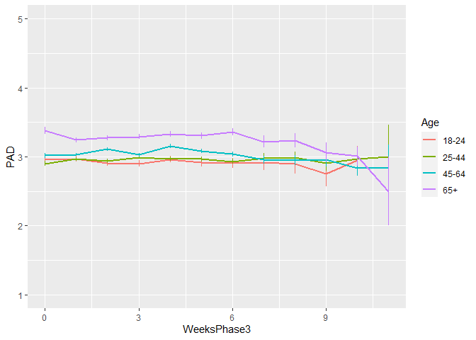
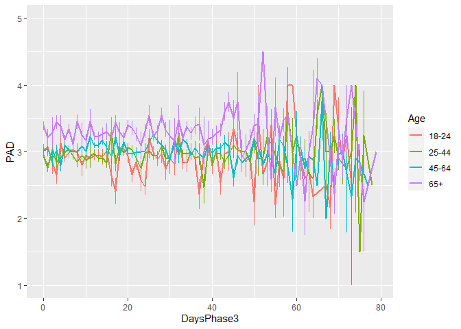
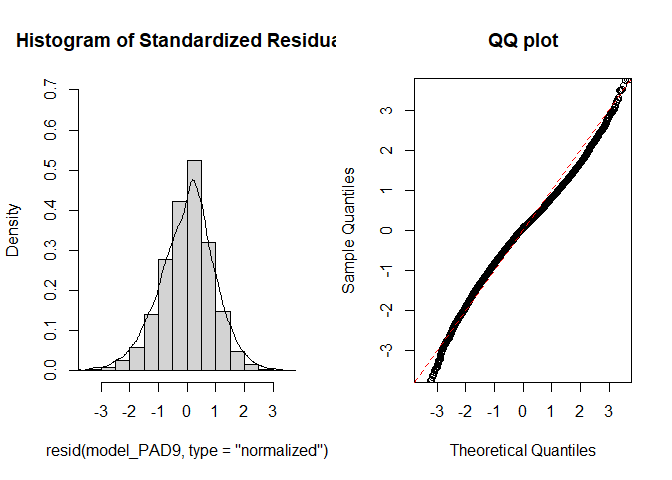
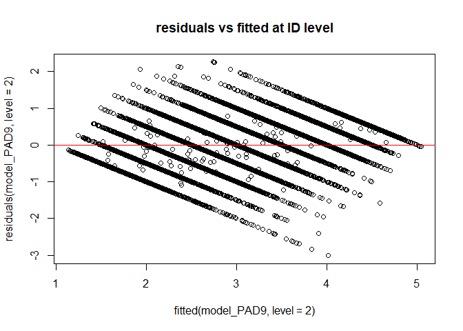
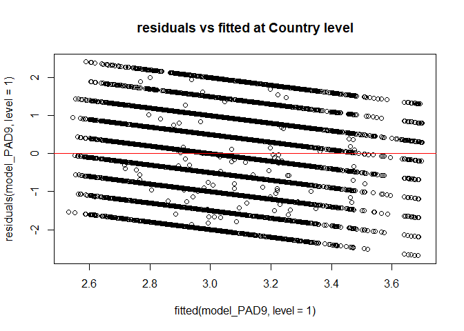
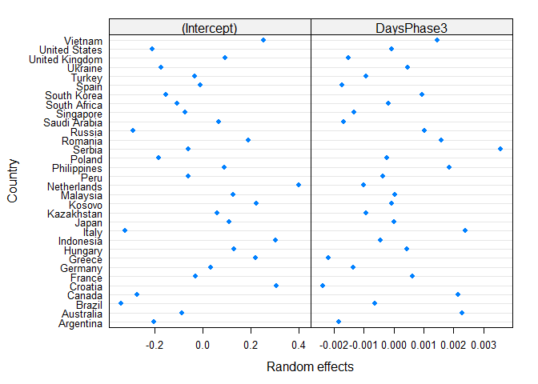
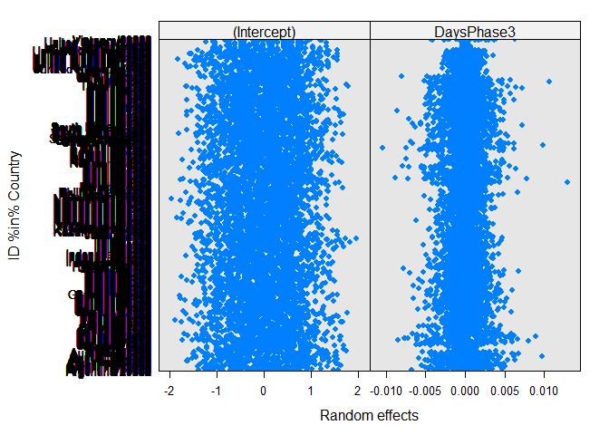
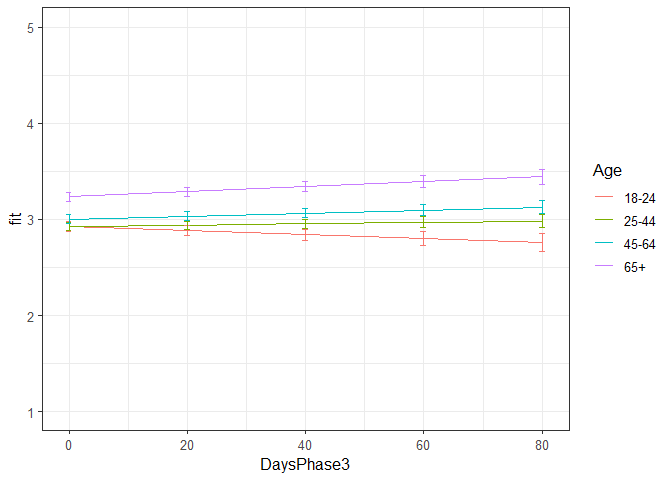

Second analyses PAD Phase 3
================
Anne Margit
10/15/2020

    ## [1] ""

``` r
load("data_analyse2_p3.Rdata")
```

This dataset includes:

1.  Data from all weekly measurement waves (baseline through wave 11,
    Time 1 through 12)
2.  Participants who provided at least 3 measurements
3.  Participants who are residents of the country they currently live in
4.  Participants who provided info on age
5.  Participants who provided info on gender (either male or female)
6.  Data from countries with at least 20 participants
7.  Pooled age groups
8.  Imputed missing emotion scores
9.  Combined emotion scores (NAA, NAD, PAA, PAD)
10. An imputed Stringency index (StringencyIndex\_imp)
11. A variable indicating the number of days before and after the day on
    which maximum stringency was reached for the respective country
    (DaysMax)
12. A variable indicating the number of weeks before and after the day
    on which maximum stringency was reached for the respective country
    (WeeksMax)
13. A variable indicating the date on which maximum Stringency was
    reached for that country (DateMaxStr)
14. A dummy Str\_dummy with 0 = before the peaj, 1 = during peak, 2 =
    after peak
15. Observations during which there was a second peak are excluded
    (N=583)

> My comments are in block quotes such as this.

``` r
library(dplyr)
library(tidyverse)
library(ggpubr)
library(ggplot2)
library(rockchalk)
library(effects)
library(nlme)
library(lattice)
library(broom.mixed)
library(purrr)
```

# Descriptives

**Number of participants per age group**

``` r
data_analyse2_p3 %>%
  group_by(Age_new) %>%
  summarise(NAge = n())
```

    # A tibble: 4 x 2
      Age_new  NAge
      <fct>   <int>
    1 0        2648
    2 1        7348
    3 2        9552
    4 3        4753

**Plots** **Mean PAD against max stringency in WEEKS**

``` r
plot_PAD <- ggplot(data_analyse2_p3, aes(x=WeeksPhase3, y=PAD, group = Age_new, color = Age_new))

plot_PAD + stat_summary(fun.y=mean, geom="line", size=1)  + geom_errorbar(stat="summary", fun.data="mean_se", width=0) + scale_colour_discrete(name = "Age", labels = c("18-24", "25-44", "45-64", "65+")) + expand_limits(y=c(1, 5))
```

<!-- -->

**Mean PAD against max stringency in DAYS**

``` r
plot_PAD <- ggplot(data_analyse2_p3, aes(x=DaysPhase3, y=PAD, group = Age_new, color = Age_new))

plot_PAD + stat_summary(fun.y=mean, geom="line", size=1)  + geom_errorbar(stat="summary", fun.data="mean_se", width=0) + scale_colour_discrete(name = "Age", labels = c("18-24", "25-44", "45-64", "65+")) + expand_limits(y=c(1, 5))
```

<!-- -->

# Regression models phase 3

**Positive affect high arousal**

*Predictors: DaysPhase3, Age, Random: IC for Country*

``` r
model_PAD1 <- lme(fixed = PAD ~ DaysPhase3 + Age_new + DaysPhase3*Age_new,
                   random = ~1 | Country, 
                  data = data_analyse2_p3, 
                  na.action = na.omit)

summary(model_PAD1)
```

    Linear mixed-effects model fit by REML
     Data: data_analyse2_p3 
           AIC      BIC    logLik
      67444.76 67525.73 -33712.38
    
    Random effects:
     Formula: ~1 | Country
            (Intercept)  Residual
    StdDev:    0.207032 0.9666983
    
    Fixed effects: PAD ~ DaysPhase3 + Age_new + DaysPhase3 * Age_new 
                             Value  Std.Error    DF  t-value p-value
    (Intercept)          2.9055911 0.04916895 24242 59.09403  0.0000
    DaysPhase3          -0.0010255 0.00127589 24242 -0.80372  0.4216
    Age_new1             0.0105297 0.03767561 24242  0.27948  0.7799
    Age_new2             0.1115575 0.03718473 24242  3.00009  0.0027
    Age_new3             0.3502725 0.04163873 24242  8.41218  0.0000
    DaysPhase3:Age_new1  0.0027819 0.00146198 24242  1.90284  0.0571
    DaysPhase3:Age_new2  0.0021929 0.00142356 24242  1.54045  0.1235
    DaysPhase3:Age_new3  0.0024855 0.00157144 24242  1.58165  0.1137
     Correlation: 
                        (Intr) DysPh3 Ag_nw1 Ag_nw2 Ag_nw3 DP3:A_1 DP3:A_2
    DaysPhase3          -0.527                                            
    Age_new1            -0.560  0.683                                     
    Age_new2            -0.566  0.694  0.760                              
    Age_new3            -0.507  0.618  0.681  0.711                       
    DaysPhase3:Age_new1  0.459 -0.858 -0.802 -0.608 -0.543                
    DaysPhase3:Age_new2  0.472 -0.884 -0.616 -0.798 -0.563  0.772         
    DaysPhase3:Age_new3  0.426 -0.800 -0.558 -0.570 -0.796  0.700   0.724 
    
    Standardized Within-Group Residuals:
            Min          Q1         Med          Q3         Max 
    -2.80885958 -0.70975546  0.04264152  0.74190246  2.51084399 
    
    Number of Observations: 24281
    Number of Groups: 32 

*Predictors: DaysMax\_p1, Age, Random: IC for ID*

``` r
model_PAD2 <- lme(fixed = PAD ~ DaysPhase3 + Age_new + DaysPhase3*Age_new,
                  random = ~1 | ID, 
                 data = data_analyse2_p3, 
                 na.action = na.omit)

summary(model_PAD2)
```

    Linear mixed-effects model fit by REML
     Data: data_analyse2_p3 
           AIC      BIC    logLik
      56187.44 56268.41 -28083.72
    
    Random effects:
     Formula: ~1 | ID
            (Intercept) Residual
    StdDev:   0.7888491 0.590752
    
    Fixed effects: PAD ~ DaysPhase3 + Age_new + DaysPhase3 * Age_new 
                             Value  Std.Error    DF  t-value p-value
    (Intercept)          2.9550179 0.03443026 17361 85.82619  0.0000
    DaysPhase3          -0.0014839 0.00093062 17361 -1.59448  0.1108
    Age_new1            -0.0219868 0.04036876  6912 -0.54465  0.5860
    Age_new2             0.0580236 0.03945980  6912  1.47045  0.1415
    Age_new3             0.2688272 0.04427070  6912  6.07235  0.0000
    DaysPhase3:Age_new1  0.0021839 0.00107332 17361  2.03469  0.0419
    DaysPhase3:Age_new2  0.0029812 0.00103842 17361  2.87088  0.0041
    DaysPhase3:Age_new3  0.0044028 0.00114062 17361  3.86000  0.0001
     Correlation: 
                        (Intr) DysPh3 Ag_nw1 Ag_nw2 Ag_nw3 DP3:A_1 DP3:A_2
    DaysPhase3          -0.483                                            
    Age_new1            -0.853  0.412                                     
    Age_new2            -0.873  0.421  0.744                              
    Age_new3            -0.778  0.375  0.663  0.679                       
    DaysPhase3:Age_new1  0.419 -0.867 -0.479 -0.365 -0.325                
    DaysPhase3:Age_new2  0.433 -0.896 -0.369 -0.479 -0.336  0.777         
    DaysPhase3:Age_new3  0.394 -0.816 -0.336 -0.344 -0.478  0.707   0.731 
    
    Standardized Within-Group Residuals:
            Min          Q1         Med          Q3         Max 
    -5.14584177 -0.53078630  0.04227182  0.54182362  4.47936500 
    
    Number of Observations: 24281
    Number of Groups: 6916 

*Random: IC for ID and Country*

``` r
model_PAD3 <- lme(fixed = PAD ~ DaysPhase3 + Age_new + DaysPhase3*Age_new,
                  random = ~1 | Country/ID, 
                  data = data_analyse2_p3, 
                  na.action = na.omit)

summary(model_PAD3)
```

    Linear mixed-effects model fit by REML
     Data: data_analyse2_p3 
           AIC      BIC    logLik
      55897.78 55986.85 -27937.89
    
    Random effects:
     Formula: ~1 | Country
            (Intercept)
    StdDev:   0.2012551
    
     Formula: ~1 | ID %in% Country
            (Intercept) Residual
    StdDev:   0.7642051 0.590692
    
    Fixed effects: PAD ~ DaysPhase3 + Age_new + DaysPhase3 * Age_new 
                             Value  Std.Error    DF  t-value p-value
    (Intercept)          2.9169725 0.04990134 17361 58.45480  0.0000
    DaysPhase3          -0.0014822 0.00093014 17361 -1.59356  0.1111
    Age_new1             0.0102361 0.04021672  6881  0.25452  0.7991
    Age_new2             0.0882865 0.04011468  6881  2.20085  0.0278
    Age_new3             0.3127117 0.04560373  6881  6.85715  0.0000
    DaysPhase3:Age_new1  0.0022584 0.00107149 17361  2.10769  0.0351
    DaysPhase3:Age_new2  0.0030810 0.00103721 17361  2.97044  0.0030
    DaysPhase3:Age_new3  0.0045619 0.00113969 17361  4.00278  0.0001
     Correlation: 
                        (Intr) DysPh3 Ag_nw1 Ag_nw2 Ag_nw3 DP3:A_1 DP3:A_2
    DaysPhase3          -0.332                                            
    Age_new1            -0.575  0.411                                     
    Age_new2            -0.577  0.412  0.750                              
    Age_new3            -0.513  0.363  0.664  0.696                       
    DaysPhase3:Age_new1  0.290 -0.866 -0.479 -0.359 -0.316                
    DaysPhase3:Age_new2  0.300 -0.895 -0.369 -0.471 -0.327  0.777         
    DaysPhase3:Age_new3  0.272 -0.815 -0.336 -0.337 -0.465  0.707   0.731 
    
    Standardized Within-Group Residuals:
           Min         Q1        Med         Q3        Max 
    -5.1731428 -0.5267989  0.0598782  0.5403506  4.4764793 
    
    Number of Observations: 24281
    Number of Groups: 
            Country ID %in% Country 
                 32            6916 

*Random: IC for ID and Country, S for Country*

``` r
model_PAD4 <- lme(fixed = PAD ~ DaysPhase3 + Age_new + DaysPhase3*Age_new,
                  random = list (Country = ~DaysPhase3, ID = ~1), 
                  data = data_analyse2_p3, 
                  na.action = na.omit)

summary(model_PAD4)
```

    Linear mixed-effects model fit by REML
     Data: data_analyse2_p3 
           AIC      BIC    logLik
      55859.11 55964.37 -27916.55
    
    Random effects:
     Formula: ~DaysPhase3 | Country
     Structure: General positive-definite, Log-Cholesky parametrization
                StdDev      Corr  
    (Intercept) 0.223792498 (Intr)
    DaysPhase3  0.002499108 -0.603
    
     Formula: ~1 | ID %in% Country
            (Intercept) Residual
    StdDev:   0.7642753 0.589624
    
    Fixed effects: PAD ~ DaysPhase3 + Age_new + DaysPhase3 * Age_new 
                             Value  Std.Error    DF  t-value p-value
    (Intercept)          2.9223901 0.05307027 17361 55.06642  0.0000
    DaysPhase3          -0.0017403 0.00107014 17361 -1.62621  0.1039
    Age_new1             0.0080683 0.04039330  6881  0.19974  0.8417
    Age_new2             0.0859216 0.04048007  6881  2.12257  0.0338
    Age_new3             0.3200232 0.04613562  6881  6.93657  0.0000
    DaysPhase3:Age_new1  0.0023127 0.00108422 17361  2.13302  0.0329
    DaysPhase3:Age_new2  0.0031238 0.00106337 17361  2.93760  0.0033
    DaysPhase3:Age_new3  0.0041096 0.00118124 17361  3.47905  0.0005
     Correlation: 
                        (Intr) DysPh3 Ag_nw1 Ag_nw2 Ag_nw3 DP3:A_1 DP3:A_2
    DaysPhase3          -0.483                                            
    Age_new1            -0.540  0.360                                     
    Age_new2            -0.540  0.360  0.751                              
    Age_new3            -0.481  0.320  0.666  0.701                       
    DaysPhase3:Age_new1  0.272 -0.751 -0.487 -0.372 -0.329                
    DaysPhase3:Age_new2  0.279 -0.769 -0.379 -0.486 -0.349  0.780         
    DaysPhase3:Age_new3  0.254 -0.701 -0.344 -0.357 -0.485  0.707   0.741 
    
    Standardized Within-Group Residuals:
            Min          Q1         Med          Q3         Max 
    -5.23199815 -0.52558536  0.06100263  0.54411442  4.38784509 
    
    Number of Observations: 24281
    Number of Groups: 
            Country ID %in% Country 
                 32            6916 

*Random: IC for ID and Country, S for ID*

``` r
model_PAD5 <- lme(fixed = PAD ~ DaysPhase3 + Age_new + DaysPhase3*Age_new,
                  random = list (Country = ~1, ID = ~DaysPhase3), 
                  data = data_analyse2_p3, 
                  na.action = na.omit)

summary(model_PAD5)
```

    Linear mixed-effects model fit by REML
     Data: data_analyse2_p3 
           AIC      BIC    logLik
      55697.76 55803.03 -27835.88
    
    Random effects:
     Formula: ~1 | Country
            (Intercept)
    StdDev:   0.2014419
    
     Formula: ~DaysPhase3 | ID %in% Country
     Structure: General positive-definite, Log-Cholesky parametrization
                StdDev     Corr  
    (Intercept) 0.79609582 (Intr)
    DaysPhase3  0.01112893 -0.274
    Residual    0.56751330       
    
    Fixed effects: PAD ~ DaysPhase3 + Age_new + DaysPhase3 * Age_new 
                             Value  Std.Error    DF  t-value p-value
    (Intercept)          2.9200217 0.05057468 17361 57.73683  0.0000
    DaysPhase3          -0.0017239 0.00107250 17361 -1.60737  0.1080
    Age_new1             0.0055525 0.04132477  6881  0.13436  0.8931
    Age_new2             0.0853254 0.04116399  6881  2.07282  0.0382
    Age_new3             0.3094073 0.04679452  6881  6.61204  0.0000
    DaysPhase3:Age_new1  0.0025050 0.00123980 17361  2.02046  0.0434
    DaysPhase3:Age_new2  0.0032738 0.00119924 17361  2.72989  0.0063
    DaysPhase3:Age_new3  0.0047849 0.00132437 17361  3.61294  0.0003
     Correlation: 
                        (Intr) DysPh3 Ag_nw1 Ag_nw2 Ag_nw3 DP3:A_1 DP3:A_2
    DaysPhase3          -0.364                                            
    Age_new1            -0.583  0.444                                     
    Age_new2            -0.587  0.446  0.749                              
    Age_new3            -0.521  0.392  0.664  0.695                       
    DaysPhase3:Age_new1  0.317 -0.863 -0.519 -0.387 -0.341                
    DaysPhase3:Age_new2  0.327 -0.893 -0.398 -0.509 -0.353  0.773         
    DaysPhase3:Age_new3  0.296 -0.809 -0.360 -0.362 -0.504  0.700   0.724 
    
    Standardized Within-Group Residuals:
            Min          Q1         Med          Q3         Max 
    -5.30387727 -0.50747295  0.05834958  0.51891311  3.83703460 
    
    Number of Observations: 24281
    Number of Groups: 
            Country ID %in% Country 
                 32            6916 

*Random slope for Country and ID*

``` r
model_PAD6 <- lme(fixed = PAD ~ DaysPhase3 + Age_new + DaysPhase3*Age_new,
                  random = ~DaysPhase3 | Country/ID, 
                  data = data_analyse2_p3, 
                  na.action = na.omit)

summary(model_PAD6)
```

    Linear mixed-effects model fit by REML
     Data: data_analyse2_p3 
           AIC      BIC    logLik
      55671.09 55792.55 -27820.55
    
    Random effects:
     Formula: ~DaysPhase3 | Country
     Structure: General positive-definite, Log-Cholesky parametrization
                StdDev      Corr  
    (Intercept) 0.224174377 (Intr)
    DaysPhase3  0.002479709 -0.621
    
     Formula: ~DaysPhase3 | ID %in% Country
     Structure: General positive-definite, Log-Cholesky parametrization
                StdDev     Corr  
    (Intercept) 0.79418851 (Intr)
    DaysPhase3  0.01090149 -0.266
    Residual    0.56739899       
    
    Fixed effects: PAD ~ DaysPhase3 + Age_new + DaysPhase3 * Age_new 
                             Value  Std.Error    DF  t-value p-value
    (Intercept)          2.9230265 0.05370792 17361 54.42450  0.0000
    DaysPhase3          -0.0018196 0.00118915 17361 -1.53014  0.1260
    Age_new1             0.0037806 0.04144889  6881  0.09121  0.9273
    Age_new2             0.0825144 0.04149982  6881  1.98831  0.0468
    Age_new3             0.3147487 0.04730863  6881  6.65309  0.0000
    DaysPhase3:Age_new1  0.0025415 0.00124650 17361  2.03891  0.0415
    DaysPhase3:Age_new2  0.0033482 0.00121984 17361  2.74476  0.0061
    DaysPhase3:Age_new3  0.0044208 0.00136004 17361  3.25050  0.0012
     Correlation: 
                        (Intr) DysPh3 Ag_nw1 Ag_nw2 Ag_nw3 DP3:A_1 DP3:A_2
    DaysPhase3          -0.499                                            
    Age_new1            -0.548  0.401                                     
    Age_new2            -0.549  0.401  0.751                              
    Age_new3            -0.489  0.357  0.665  0.700                       
    DaysPhase3:Age_new1  0.297 -0.775 -0.524 -0.397 -0.351                
    DaysPhase3:Age_new2  0.305 -0.795 -0.406 -0.522 -0.371  0.775         
    DaysPhase3:Age_new3  0.277 -0.723 -0.367 -0.379 -0.522  0.700   0.732 
    
    Standardized Within-Group Residuals:
            Min          Q1         Med          Q3         Max 
    -5.33548348 -0.50705607  0.05921858  0.51982537  3.83026823 
    
    Number of Observations: 24281
    Number of Groups: 
            Country ID %in% Country 
                 32            6916 

> Model with random slopes for both Country and ID is better, PAD6

*Random slope for Country and ID + AR*

``` r
data_analyse2_p3 <- data_analyse2_p3[with(data_analyse2_p3, order(Country, ID, Time)),]
data_analyse2_p3$Time <- as.numeric(data_analyse2_p3$Time)

model_PAD7 <- lme(fixed = PAD ~ DaysPhase3 + Age_new + DaysPhase3*Age_new,
                  random = ~DaysPhase3 | Country/ID, 
                  data = data_analyse2_p3, 
                  na.action = na.omit,
                  correlation = corAR1(form = ~ Time | Country/ID))

summary(model_PAD7)
```

    Linear mixed-effects model fit by REML
     Data: data_analyse2_p3 
           AIC      BIC    logLik
      55565.06 55694.62 -27766.53
    
    Random effects:
     Formula: ~DaysPhase3 | Country
     Structure: General positive-definite, Log-Cholesky parametrization
                StdDev      Corr  
    (Intercept) 0.222566799 (Intr)
    DaysPhase3  0.002404858 -0.592
    
     Formula: ~DaysPhase3 | ID %in% Country
     Structure: General positive-definite, Log-Cholesky parametrization
                StdDev      Corr  
    (Intercept) 0.763003546 (Intr)
    DaysPhase3  0.008098947 -0.177
    Residual    0.593605349       
    
    Correlation Structure: ARMA(1,0)
     Formula: ~Time | Country/ID 
     Parameter estimate(s):
        Phi1 
    0.146062 
    Fixed effects: PAD ~ DaysPhase3 + Age_new + DaysPhase3 * Age_new 
                             Value  Std.Error    DF  t-value p-value
    (Intercept)          2.9227007 0.05349377 17361 54.63628  0.0000
    DaysPhase3          -0.0018365 0.00118336 17361 -1.55196  0.1207
    Age_new1             0.0023100 0.04144976  6881  0.05573  0.9556
    Age_new2             0.0821637 0.04149606  6881  1.98004  0.0477
    Age_new3             0.3147478 0.04729427  6881  6.65509  0.0000
    DaysPhase3:Age_new1  0.0026191 0.00124349 17361  2.10623  0.0352
    DaysPhase3:Age_new2  0.0033614 0.00121704 17361  2.76193  0.0058
    DaysPhase3:Age_new3  0.0044041 0.00135534 17361  3.24941  0.0012
     Correlation: 
                        (Intr) DysPh3 Ag_nw1 Ag_nw2 Ag_nw3 DP3:A_1 DP3:A_2
    DaysPhase3          -0.490                                            
    Age_new1            -0.551  0.404                                     
    Age_new2            -0.552  0.405  0.752                              
    Age_new3            -0.491  0.360  0.666  0.701                       
    DaysPhase3:Age_new1  0.300 -0.778 -0.526 -0.399 -0.353                
    DaysPhase3:Age_new2  0.308 -0.798 -0.408 -0.524 -0.373  0.777         
    DaysPhase3:Age_new3  0.280 -0.726 -0.369 -0.381 -0.523  0.702   0.734 
    
    Standardized Within-Group Residuals:
            Min          Q1         Med          Q3         Max 
    -5.11785052 -0.51306974  0.06507213  0.52645121  3.77025227 
    
    Number of Observations: 24281
    Number of Groups: 
            Country ID %in% Country 
                 32            6916 

*Random slope for Country and ID, no correlation between IC and S for ID
+ AR*

``` r
model_PAD8 <- lme(fixed = PAD ~ DaysPhase3 + Age_new + DaysPhase3*Age_new,
                  random = list(Country = ~DaysPhase3, ID = pdDiag(~DaysPhase3)),
                  data = data_analyse2_p3, 
                  na.action = na.omit,
                  correlation = corAR1(form = ~ Time | Country/ID))

summary(model_PAD8)
```

    Linear mixed-effects model fit by REML
     Data: data_analyse2_p3 
           AIC      BIC    logLik
      55571.91 55693.37 -27770.96
    
    Random effects:
     Formula: ~DaysPhase3 | Country
     Structure: General positive-definite, Log-Cholesky parametrization
                StdDev      Corr  
    (Intercept) 0.223234172 (Intr)
    DaysPhase3  0.002387695 -0.609
    
     Formula: ~DaysPhase3 | ID %in% Country
     Structure: Diagonal
            (Intercept)  DaysPhase3  Residual
    StdDev:   0.7396339 0.006531981 0.5998006
    
    Correlation Structure: ARMA(1,0)
     Formula: ~Time | Country/ID 
     Parameter estimate(s):
         Phi1 
    0.1611003 
    Fixed effects: PAD ~ DaysPhase3 + Age_new + DaysPhase3 * Age_new 
                             Value  Std.Error    DF  t-value p-value
    (Intercept)          2.9227326 0.05323430 17361 54.90319  0.0000
    DaysPhase3          -0.0018263 0.00117021 17361 -1.56066  0.1186
    Age_new1             0.0028113 0.04084282  6881  0.06883  0.9451
    Age_new2             0.0822860 0.04090012  6881  2.01188  0.0443
    Age_new3             0.3156947 0.04660973  6881  6.77315  0.0000
    DaysPhase3:Age_new1  0.0025800 0.00122814 17361  2.10073  0.0357
    DaysPhase3:Age_new2  0.0033420 0.00120172 17361  2.78100  0.0054
    DaysPhase3:Age_new3  0.0043615 0.00133691 17361  3.26234  0.0011
     Correlation: 
                        (Intr) DysPh3 Ag_nw1 Ag_nw2 Ag_nw3 DP3:A_1 DP3:A_2
    DaysPhase3          -0.481                                            
    Age_new1            -0.545  0.388                                     
    Age_new2            -0.546  0.389  0.752                              
    Age_new3            -0.486  0.346  0.667  0.702                       
    DaysPhase3:Age_new1  0.286 -0.778 -0.506 -0.385 -0.341                
    DaysPhase3:Age_new2  0.293 -0.798 -0.394 -0.503 -0.360  0.778         
    DaysPhase3:Age_new3  0.267 -0.727 -0.356 -0.368 -0.502  0.704   0.736 
    
    Standardized Within-Group Residuals:
            Min          Q1         Med          Q3         Max 
    -5.05173491 -0.51749026  0.06388575  0.53296524  3.77597339 
    
    Number of Observations: 24281
    Number of Groups: 
            Country ID %in% Country 
                 32            6916 

*Random slope for Country and ID, no correlation between IC and S for ID
and Country + AR*

``` r
model_PAD9 <- lme(fixed = PAD ~ DaysPhase3 + Age_new + DaysPhase3*Age_new,
                  random = list(Country = pdDiag(~DaysPhase3), ID = pdDiag(~DaysPhase3)),
                  data = data_analyse2_p3, 
                  na.action = na.omit,
                  correlation = corAR1(form = ~ Time | Country/ID))

summary(model_PAD9)
```

    Linear mixed-effects model fit by REML
     Data: data_analyse2_p3 
           AIC     BIC    logLik
      55575.54 55688.9 -27773.77
    
    Random effects:
     Formula: ~DaysPhase3 | Country
     Structure: Diagonal
            (Intercept)  DaysPhase3
    StdDev:   0.2127566 0.002274767
    
     Formula: ~DaysPhase3 | ID %in% Country
     Structure: Diagonal
            (Intercept)  DaysPhase3  Residual
    StdDev:    0.739494 0.006519435 0.5999346
    
    Correlation Structure: ARMA(1,0)
     Formula: ~Time | Country/ID 
     Parameter estimate(s):
         Phi1 
    0.1614632 
    Fixed effects: PAD ~ DaysPhase3 + Age_new + DaysPhase3 * Age_new 
                             Value  Std.Error    DF  t-value p-value
    (Intercept)          2.9246139 0.05178875 17361 56.47200  0.0000
    DaysPhase3          -0.0020642 0.00116851 17361 -1.76653  0.0773
    Age_new1             0.0003127 0.04076735  6881  0.00767  0.9939
    Age_new2             0.0791941 0.04074964  6881  1.94343  0.0520
    Age_new3             0.3111523 0.04641689  6881  6.70343  0.0000
    DaysPhase3:Age_new1  0.0027972 0.00122909 17361  2.27585  0.0229
    DaysPhase3:Age_new2  0.0036041 0.00120349 17361  2.99473  0.0028
    DaysPhase3:Age_new3  0.0046699 0.00133913 17361  3.48729  0.0005
     Correlation: 
                        (Intr) DysPh3 Ag_nw1 Ag_nw2 Ag_nw3 DP3:A_1 DP3:A_2
    DaysPhase3          -0.322                                            
    Age_new1            -0.561  0.389                                     
    Age_new2            -0.563  0.392  0.752                              
    Age_new3            -0.502  0.348  0.666  0.700                       
    DaysPhase3:Age_new1  0.294 -0.779 -0.502 -0.380 -0.336                
    DaysPhase3:Age_new2  0.301 -0.800 -0.388 -0.496 -0.352  0.778         
    DaysPhase3:Age_new3  0.274 -0.728 -0.351 -0.360 -0.493  0.704   0.737 
    
    Standardized Within-Group Residuals:
            Min          Q1         Med          Q3         Max 
    -5.02525036 -0.51726779  0.06358649  0.53249507  3.76763497 
    
    Number of Observations: 24281
    Number of Groups: 
            Country ID %in% Country 
                 32            6916 

*Random slope for Country and ID, no correlation between IC and S for
Country + AR*

``` r
model_PAD10 <- lme(fixed = PAD ~ DaysPhase3 + Age_new + DaysPhase3*Age_new,
                  random = list(Country = pdDiag(~DaysPhase3), ID = ~DaysPhase3),
                  data = data_analyse2_p3, 
                  na.action = na.omit,
                  correlation = corAR1(form = ~ Time | Country/ID))

summary(model_PAD10)
```

    Linear mixed-effects model fit by REML
     Data: data_analyse2_p3 
           AIC      BIC    logLik
      55568.58 55690.04 -27769.29
    
    Random effects:
     Formula: ~DaysPhase3 | Country
     Structure: Diagonal
            (Intercept)  DaysPhase3
    StdDev:   0.2121808 0.002274778
    
     Formula: ~DaysPhase3 | ID %in% Country
     Structure: General positive-definite, Log-Cholesky parametrization
                StdDev      Corr  
    (Intercept) 0.763007248 (Intr)
    DaysPhase3  0.008097943 -0.178
    Residual    0.593702812       
    
    Correlation Structure: ARMA(1,0)
     Formula: ~Time | Country/ID 
     Parameter estimate(s):
         Phi1 
    0.1463412 
    Fixed effects: PAD ~ DaysPhase3 + Age_new + DaysPhase3 * Age_new 
                             Value  Std.Error    DF  t-value p-value
    (Intercept)          2.9246147 0.05206897 17361 56.16810  0.0000
    DaysPhase3          -0.0020671 0.00117982 17361 -1.75203  0.0798
    Age_new1            -0.0002342 0.04137563  6881 -0.00566  0.9955
    Age_new2             0.0790031 0.04134298  6881  1.91092  0.0561
    Age_new3             0.3100889 0.04709577  6881  6.58422  0.0000
    DaysPhase3:Age_new1  0.0028280 0.00124428 17361  2.27280  0.0231
    DaysPhase3:Age_new2  0.0036133 0.00121834 17361  2.96575  0.0030
    DaysPhase3:Age_new3  0.0047049 0.00135686 17361  3.46750  0.0005
     Correlation: 
                        (Intr) DysPh3 Ag_nw1 Ag_nw2 Ag_nw3 DP3:A_1 DP3:A_2
    DaysPhase3          -0.338                                            
    Age_new1            -0.567  0.406                                     
    Age_new2            -0.569  0.408  0.751                              
    Age_new3            -0.507  0.363  0.665  0.699                       
    DaysPhase3:Age_new1  0.308 -0.781 -0.522 -0.395 -0.349                
    DaysPhase3:Age_new2  0.316 -0.801 -0.403 -0.516 -0.366  0.777         
    DaysPhase3:Age_new3  0.287 -0.729 -0.364 -0.374 -0.514  0.702   0.735 
    
    Standardized Within-Group Residuals:
            Min          Q1         Med          Q3         Max 
    -5.09380872 -0.51182927  0.06414808  0.52694005  3.76209201 
    
    Number of Observations: 24281
    Number of Groups: 
            Country ID %in% Country 
                 32            6916 

> Best model is PAD9

*QQ plot of residuals*

``` r
par(mfrow = c(1,2))
lims <- c(-3.5,3.5)
hist(resid(model_PAD9, type = "normalized"),
freq = FALSE, xlim = lims, ylim =  c(0,.7),main = "Histogram of Standardized Residuals")
lines(density(scale(resid(model_PAD9))))
qqnorm(resid(model_PAD9, type = "normalized"),
xlim = lims, ylim = lims,main = "QQ plot")
abline(0,1, col = "red", lty = 2)
```

<!-- -->

*Residuals vs fitted*

``` r
plot(fitted(model_PAD9, level=2), residuals(model_PAD9, level=2), 
     main="residuals vs fitted at ID level")
abline(a=0, b=0,col="red")
```

<!-- -->

``` r
plot(fitted(model_PAD9, level=1), residuals(model_PAD9, level=1), 
    main="residuals vs fitted at Country level")
abline(a=0, b=0,col="red")
```

<!-- -->

> Residuen zien er allemaal goed uit

*Plot random intercepts and slopes*

``` r
plot(ranef(model_PAD9, level = 1))
```

<!-- -->

``` r
plot(ranef(model_PAD9, level = 2))
```

<!-- -->

*Confidence intervals*

``` r
intervals(model_PAD9)
```

    Approximate 95% confidence intervals
    
     Fixed effects:
                                lower          est.        upper
    (Intercept)          2.8231027734  2.9246139273 3.0261250812
    DaysPhase3          -0.0043545951 -0.0020642029 0.0002261892
    Age_new1            -0.0796039041  0.0003126863 0.0802292767
    Age_new2            -0.0006878057  0.0791940643 0.1590759343
    Age_new3             0.2201608861  0.3111523304 0.4021437747
    DaysPhase3:Age_new1  0.0003880836  0.0027972299 0.0052063762
    DaysPhase3:Age_new2  0.0012451702  0.0036041358 0.0059631013
    DaysPhase3:Age_new3  0.0020451084  0.0046699457 0.0072947830
    attr(,"label")
    [1] "Fixed effects:"
    
     Random Effects:
      Level: Country 
                         lower        est.       upper
    sd((Intercept)) 0.16072926 0.212756607 0.281624969
    sd(DaysPhase3)  0.00140378 0.002274767 0.003686166
      Level: ID 
                          lower        est.       upper
    sd((Intercept)) 0.723395946 0.739494035 0.755950364
    sd(DaysPhase3)  0.005414475 0.006519435 0.007849888
    
     Correlation structure:
             lower      est.     upper
    Phi1 0.1359405 0.1614632 0.1867718
    attr(,"label")
    [1] "Correlation structure:"
    
     Within-group standard error:
        lower      est.     upper 
    0.5913542 0.5999346 0.6086395 

*Plot of predicted values*

``` r
ef_PAD <- effect("DaysPhase3:Age_new", model_PAD9)

plot_PAD <- ggplot(as.data.frame(ef_PAD), 
       aes(DaysPhase3, fit, color=Age_new)) + geom_line() + 
  geom_errorbar(aes(ymin=fit-se, ymax=fit+se), width=1) + theme_bw(base_size=12) + scale_color_discrete(name="Age", labels = c("18-24", "25-44", "45-64", "65+")) + expand_limits(y=c(1, 5))
```

``` r
plot_PAD
```

<!-- -->

``` r
coef_PAD = tidy(model_PAD9, 
               effects = "fixed")
```

*Effect sizes* **Within person SD and average within person SD for PAD**

``` r
ISDs <- data_analyse2_p3 %>% 
  group_by(ID) %>%
  summarize_at(c("PAD"), sd, na.rm=TRUE) %>%
  ungroup()

ISDs_av <- ISDs %>%
  summarize_at(c("PAD"), mean, na.rm=TRUE) %>%
  stack() %>%
  rename(sd=values) 
```

> Effect sizes for intercept and main effect of age = regression
> coefficient / average ISD of PAD Effect size for main effect of
> DaysMax = (regression coefficient \* 28)/ average ISD of PAD Effect
> sizes for interaction effects = (regression coefficient \* 28)/
> average ISD of PAD

> The effect sizes for main effect of DaysMax and the interaction
> effects reflect the increase in SD of PAD over 4 weeks (28 days)

``` r
coef_PAD <- coef_PAD %>%
  mutate (e_size = ifelse(row_number()== 1 | row_number()== 3 |  row_number()== 4 |  row_number()== 5,
          estimate/0.491209, 
          (estimate*28)/0.491209))
```

``` r
coef_PAD
```

    ## # A tibble: 8 x 7
    ##   term                 estimate std.error    df statistic  p.value    e_size
    ##   <chr>                   <dbl>     <dbl> <dbl>     <dbl>    <dbl>     <dbl>
    ## 1 (Intercept)          2.92       0.0518  17361  56.5     0.        5.95    
    ## 2 DaysPhase3          -0.00206    0.00117 17361  -1.77    7.73e- 2 -0.118   
    ## 3 Age_new1             0.000313   0.0408   6881   0.00767 9.94e- 1  0.000637
    ## 4 Age_new2             0.0792     0.0407   6881   1.94    5.20e- 2  0.161   
    ## 5 Age_new3             0.311      0.0464   6881   6.70    2.20e-11  0.633   
    ## 6 DaysPhase3:Age_new1  0.00280    0.00123 17361   2.28    2.29e- 2  0.159   
    ## 7 DaysPhase3:Age_new2  0.00360    0.00120 17361   2.99    2.75e- 3  0.205   
    ## 8 DaysPhase3:Age_new3  0.00467    0.00134 17361   3.49    4.89e- 4  0.266

> There are only differences between youngest (control) age group and
> the oldest. Interaction effects for all age groups x DaysMax
