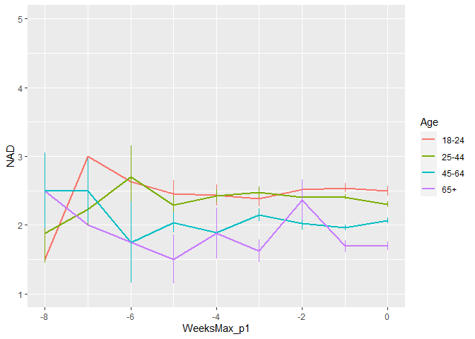
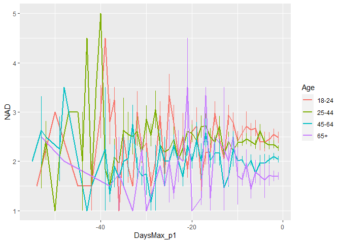
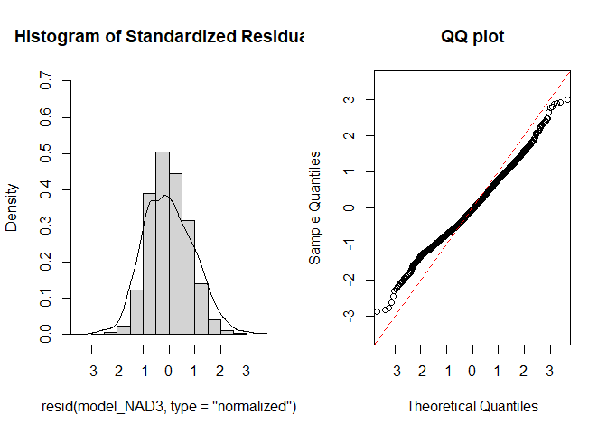
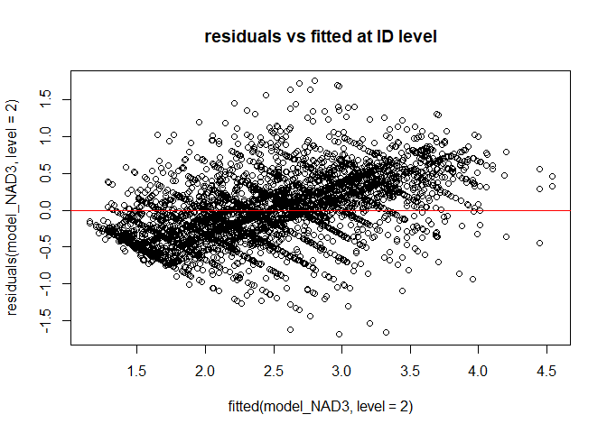
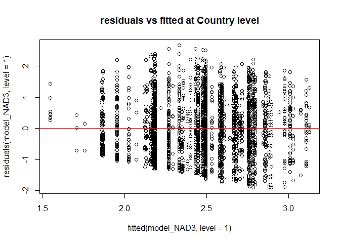
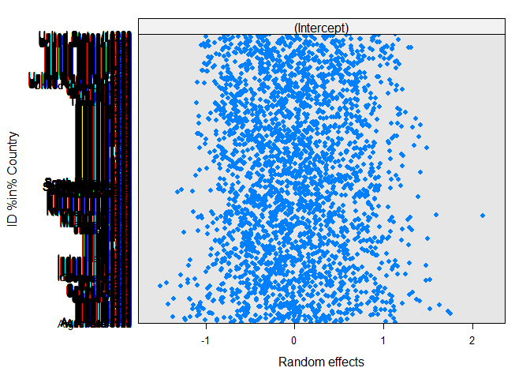

Second analysis NAD Phase 1 (Age only)
================
Anne Margit
10/28/2020

    ## [1] ""

``` r
load("data_analyse2_p1.Rdata")
```

This dataset includes:

1.  Data from all weekly measurement waves (baseline through wave 11,
    Time 1 through 12)
2.  Participants who provided at least 3 measurements
3.  Participants who are residents of the country they currently live in
4.  Participants who provided info on age
5.  Participants who provided info on gender (either male or female)
6.  Data from countries with at least 20 participants
7.  Pooled age groups
8.  Imputed missing emotion scores
9.  Combined emotion scores (NAA, NAD, PAA, PAD)
10. An imputed Stringency index (StringencyIndex\_imp)
11. A variable indicating the number of days before and after the day on
    which maximum stringency was reached for the respective country
    (DaysMax)
12. A variable indicating the number of weeks before and after the day
    on which maximum stringency was reached for the respective country
    (WeeksMax)
13. A variable indicating the date on which maximum Stringency was
    reached for that country (DateMaxStr)
14. A dummy Str\_dummy with 0 = before the peaj, 1 = during peak, 2 =
    after peak
15. Observations during which there was a second peak are excluded
    (N=583)

> My comments are in block quotes such as this.

``` r
library(dplyr)
library(tidyverse)
library(ggpubr)
library(ggplot2)
library(rockchalk)
library(effects)
library(nlme)
library(lattice)
library(broom.mixed)
library(purrr)
```

# Descriptives

**Number of participants per age group**

``` r
data_analyse2_p1 %>%
  group_by(Age_new) %>%
  summarise(NAge = n())
```

    # A tibble: 4 x 2
      Age_new  NAge
      <fct>   <int>
    1 0         695
    2 1        1893
    3 2        1274
    4 3         293

**Plots** **Mean NAD against max stringency in WEEKS**

``` r
plot_NAD <- ggplot(data_analyse2_p1, aes(x=WeeksMax_p1, y=NAD, group = Age_new, color = Age_new))

plot_NAD + stat_summary(fun.y=mean, geom="line", size=1)  + geom_errorbar(stat="summary", fun.data="mean_se", width=0) + scale_colour_discrete(name = "Age", labels = c("18-24", "25-44", "45-64", "65+")) + expand_limits(y=c(1, 5))
```

<!-- -->

**Mean NAA against max stringency in DAYS**

``` r
plot_NAD <- ggplot(data_analyse2_p1, aes(x=DaysMax_p1, y=NAD, group = Age_new, color = Age_new))

plot_NAD + stat_summary(fun.y=mean, geom="line", size=1)  + geom_errorbar(stat="summary", fun.data="mean_se", width=0) + scale_colour_discrete(name = "Age", labels = c("18-24", "25-44", "45-64", "65+")) + expand_limits(y=c(1, 5))
```

<!-- -->

# Regression models phase 1

**Negative affect low arousal**

*Predictor: Age, Random: IC for Country*

``` r
model_NAD1 <- lme(fixed = NAD ~  Age_new,
                   random = ~1 | Country, 
                  data = data_analyse2_p1, 
                  na.action = na.omit)

summary(model_NAD1)
```

    Linear mixed-effects model fit by REML
     Data: data_analyse2_p1 
           AIC      BIC    logLik
      11490.63 11528.62 -5739.314
    
    Random effects:
     Formula: ~1 | Country
            (Intercept)  Residual
    StdDev:   0.1249212 0.9587275
    
    Fixed effects: NAD ~ Age_new 
                     Value  Std.Error   DF   t-value p-value
    (Intercept)  2.5494035 0.04908880 4126  51.93453  0.0000
    Age_new1    -0.1170146 0.04308348 4126  -2.71600  0.0066
    Age_new2    -0.4762626 0.04666848 4126 -10.20523  0.0000
    Age_new3    -0.8189085 0.06898983 4126 -11.86999  0.0000
     Correlation: 
             (Intr) Ag_nw1 Ag_nw2
    Age_new1 -0.636              
    Age_new2 -0.589  0.689       
    Age_new3 -0.413  0.456  0.450
    
    Standardized Within-Group Residuals:
           Min         Q1        Med         Q3        Max 
    -1.7600906 -0.8041266 -0.1232323  0.6496813  3.1449793 
    
    Number of Observations: 4155
    Number of Groups: 26 

*Predictors: Age, Random: IC for ID*

``` r
model_NAD2 <- lme(fixed = NAD ~ Age_new,
                  random = ~1 | ID, 
                 data = data_analyse2_p1, 
                 na.action = na.omit)

summary(model_NAD2)
```

    Linear mixed-effects model fit by REML
     Data: data_analyse2_p1 
           AIC     BIC    logLik
      10917.51 10955.5 -5452.755
    
    Random effects:
     Formula: ~1 | ID
            (Intercept)  Residual
    StdDev:   0.7092665 0.6472702
    
    Fixed effects: NAD ~ Age_new 
                     Value  Std.Error   DF   t-value p-value
    (Intercept)  2.5069612 0.04354715 2743  57.56889  0.0000
    Age_new1    -0.1434943 0.05053045 2743  -2.83976  0.0045
    Age_new2    -0.4867624 0.05354447 2743  -9.09081  0.0000
    Age_new3    -0.7883380 0.07475943 2743 -10.54500  0.0000
     Correlation: 
             (Intr) Ag_nw1 Ag_nw2
    Age_new1 -0.862              
    Age_new2 -0.813  0.701       
    Age_new3 -0.582  0.502  0.474
    
    Standardized Within-Group Residuals:
            Min          Q1         Med          Q3         Max 
    -3.51088328 -0.59518898 -0.07339126  0.45103847  3.65849573 
    
    Number of Observations: 4155
    Number of Groups: 2747 

*Random: IC for ID and Country*

``` r
model_NAD3 <- lme(fixed = NAA ~ Age_new,
                  random = ~1 | Country/ID, 
                  data = data_analyse2_p1, 
                  na.action = na.omit)

summary(model_NAD3)
```

    Linear mixed-effects model fit by REML
     Data: data_analyse2_p1 
           AIC      BIC    logLik
      10420.69 10465.01 -5203.346
    
    Random effects:
     Formula: ~1 | Country
            (Intercept)
    StdDev:   0.2612806
    
     Formula: ~1 | ID %in% Country
            (Intercept)  Residual
    StdDev:   0.6945817 0.5879342
    
    Fixed effects: NAA ~ Age_new 
                     Value  Std.Error   DF  t-value p-value
    (Intercept)  2.7721220 0.07534534 2718 36.79222  0.0000
    Age_new1    -0.0989310 0.04904546 2718 -2.01713  0.0438
    Age_new2    -0.4082593 0.05266002 2718 -7.75274  0.0000
    Age_new3    -0.7247089 0.07436072 2718 -9.74586  0.0000
     Correlation: 
             (Intr) Ag_nw1 Ag_nw2
    Age_new1 -0.482              
    Age_new2 -0.450  0.704       
    Age_new3 -0.324  0.485  0.483
    
    Standardized Within-Group Residuals:
            Min          Q1         Med          Q3         Max 
    -2.86808221 -0.54363266 -0.04838165  0.51193755  2.98240561 
    
    Number of Observations: 4155
    Number of Groups: 
            Country ID %in% Country 
                 26            2747 

> Model NAD3 is best, with random IC for ID and Country.

*QQ plot of residuals*

``` r
par(mfrow = c(1,2))
lims <- c(-3.5,3.5)
hist(resid(model_NAD3, type = "normalized"),
freq = FALSE, xlim = lims, ylim =  c(0,.7),main = "Histogram of Standardized Residuals")
lines(density(scale(resid(model_NAD3))))
qqnorm(resid(model_NAD3, type = "normalized"),
xlim = lims, ylim = lims,main = "QQ plot")
abline(0,1, col = "red", lty = 2)
```

<!-- -->

*Residuals vs fitted*

``` r
plot(fitted(model_NAD3, level=2), residuals(model_NAD3, level=2), 
     main="residuals vs fitted at ID level")
abline(a=0, b=0,col="red")
```

<!-- -->

``` r
plot(fitted(model_NAD3, level=1), residuals(model_NAD3, level=1), 
    main="residuals vs fitted at Country level")
abline(a=0, b=0,col="red")
```

<!-- -->

> Residuen zien er allemaal goed uit

*Plot random intercepts and slopes*

``` r
plot(ranef(model_NAD3, level = 1))
```

<!-- -->

``` r
plot(ranef(model_NAD3, level = 2))
```

<!-- -->

*Confidence intervals*

``` r
intervals(model_NAD3)
```

    Approximate 95% confidence intervals
    
     Fixed effects:
                     lower        est.        upper
    (Intercept)  2.6243820  2.77212198  2.919861921
    Age_new1    -0.1951012 -0.09893103 -0.002760864
    Age_new2    -0.5115170 -0.40825928 -0.305001555
    Age_new3    -0.8705181 -0.72470888 -0.578899618
    attr(,"label")
    [1] "Fixed effects:"
    
     Random Effects:
      Level: Country 
                       lower      est.     upper
    sd((Intercept)) 0.176626 0.2612806 0.3865092
      Level: ID 
                        lower      est.     upper
    sd((Intercept)) 0.6646964 0.6945817 0.7258106
    
     Within-group standard error:
        lower      est.     upper 
    0.5673554 0.5879342 0.6092593 

*Plot of predicted values*

``` r
ef_NAD <- effect("Age_new", model_NAD3)

plot_NAD <- ggplot(as.data.frame(ef_NAD), 
       aes(Age_new, fit, color=Age_new)) + geom_line() + 
  geom_errorbar(aes(ymin=fit-se, ymax=fit+se), width=1) + theme_bw(base_size=12) + scale_color_discrete(name="Age", labels = c("18-24", "25-44", "45-64", "65+")) + expand_limits(y=c(1, 5))
```

``` r
plot_NAD
```

<!-- -->

*Effect sizes* **Within person SD and average within person SD of NAA**

``` r
ISDs <- data_analyse2_p1 %>% 
  group_by(ID) %>%
  summarize_at(c("NAD"), sd, na.rm=TRUE) %>%
  ungroup()

ISDs_av <- ISDs %>%
  summarize_at(c("NAD"), mean, na.rm=TRUE) %>%
  stack() %>%
  rename(sd=values) 
```

> Effect sizes for intercept and main effect of age = regression
> coefficient / average ISD of NAD Effect size for main effect of
> DaysMax = (regression coefficient \* 28)/ average ISD of NAD Effect
> sizes for interaction effects = (regression coefficient \* 28)/
> average ISD of NAD

> The effect sizes for main effect of DaysMax and the interaction
> effects reflect the increase in SD of NAD over 4 weeks (28 days)

``` r
coef_NAD = tidy(model_NAD3, 
               effects = "fixed")

coef_NAD <- coef_NAD %>%
  mutate(e_size = estimate/0.4838285) %>%
  mutate(across(2:7, round, 4))
```

``` r
coef_NAD
```

    ## # A tibble: 4 x 7
    ##   term        estimate std.error    df statistic p.value e_size
    ##   <chr>          <dbl>     <dbl> <dbl>     <dbl>   <dbl>  <dbl>
    ## 1 (Intercept)   2.77      0.0753  2718     36.8   0       5.73 
    ## 2 Age_new1     -0.0989    0.049   2718     -2.02  0.0438 -0.204
    ## 3 Age_new2     -0.408     0.0527  2718     -7.75  0      -0.844
    ## 4 Age_new3     -0.725     0.0744  2718     -9.75  0      -1.50

> Older age groups report lower NAD compared with the youngest age
> group.
