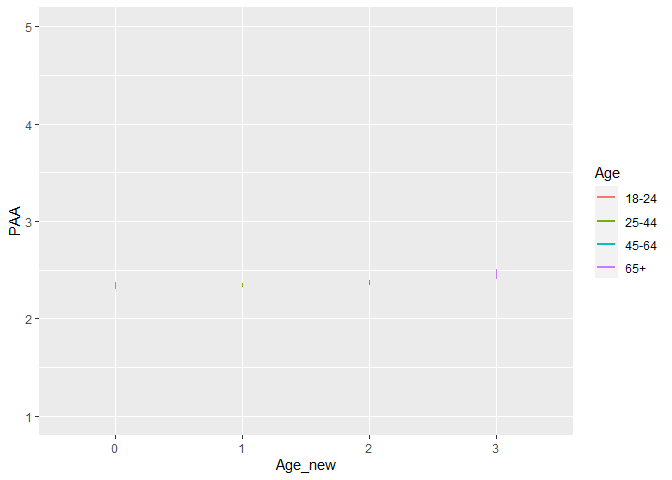
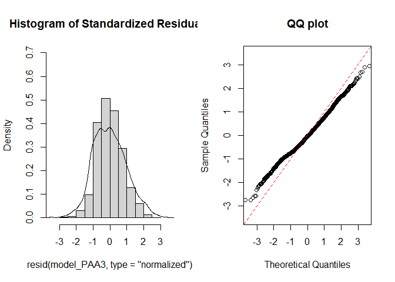
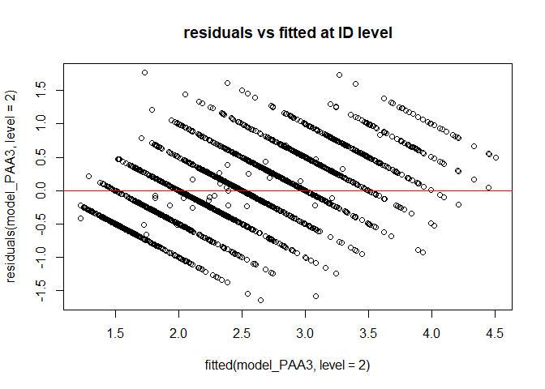
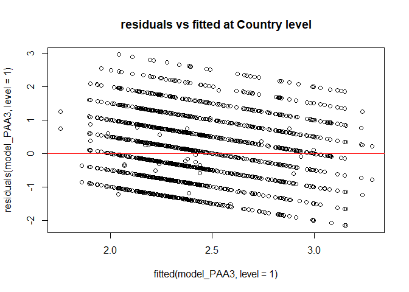
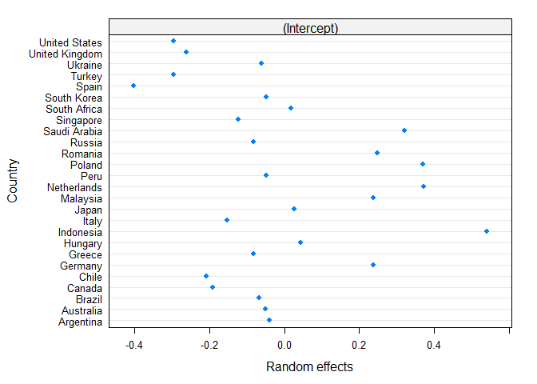
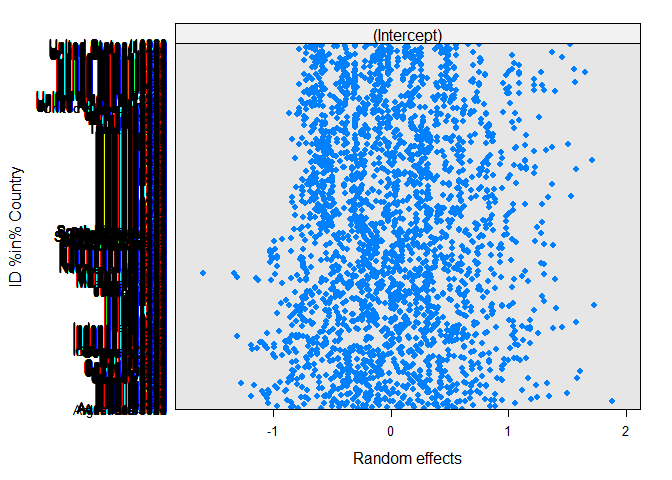
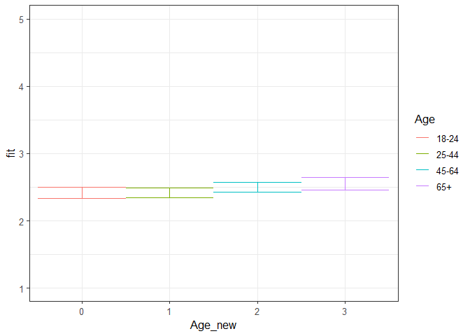

Second analysis PAA Phase 1 (Age only)
================
Anne Margit
10/28/2020

    ## [1] ""

``` r
load("data_analyse2_p1.Rdata")
```

This dataset includes:

1.  Data from all weekly measurement waves (baseline through wave 11,
    Time 1 through 12)
2.  Participants who provided at least 3 measurements
3.  Participants who are residents of the country they currently live in
4.  Participants who provided info on age
5.  Participants who provided info on gender (either male or female)
6.  Data from countries with at least 20 participants
7.  Pooled age groups
8.  Imputed missing emotion scores
9.  Combined emotion scores (NAA, NAD, PAA, PAD)
10. An imputed Stringency index (StringencyIndex\_imp)
11. A variable indicating the number of days before and after the day on
    which maximum stringency was reached for the respective country
    (DaysMax)
12. A variable indicating the number of weeks before and after the day
    on which maximum stringency was reached for the respective country
    (WeeksMax)
13. A variable indicating the date on which maximum Stringency was
    reached for that country (DateMaxStr)
14. A dummy Str\_dummy with 0 = before the peaj, 1 = during peak, 2 =
    after peak
15. Observations during which there was a second peak are excluded
    (N=583)

> My comments are in block quotes such as this.

``` r
library(dplyr)
library(tidyverse)
library(ggpubr)
library(ggplot2)
library(rockchalk)
library(effects)
library(nlme)
library(lattice)
library(broom.mixed)
library(purrr)
```

# Descriptives

**Number of participants per age group**

``` r
data_analyse2_p1 %>%
  group_by(Age_new) %>%
  summarise(NAge = n())
```

    # A tibble: 4 x 2
      Age_new  NAge
      <fct>   <int>
    1 0         695
    2 1        1893
    3 2        1274
    4 3         293

**Plots** **Mean PAA against max stringency in WEEKS**

``` r
plot_PAA <- ggplot(data_analyse2_p1, aes(x=Age_new, y=PAA, group = Age_new, color = Age_new))

plot_PAA + stat_summary(fun.y=mean, geom="line", size=1)  + geom_errorbar(stat="summary", fun.data="mean_se", width=0) + scale_colour_discrete(name = "Age", labels = c("18-24", "25-44", "45-64", "65+")) + expand_limits(y=c(1, 5))
```

<!-- -->

**Mean PAA against max stringency in DAYS**

``` r
plot_PAA <- ggplot(data_analyse2_p1, aes(x=Age_new, y=PAA, group = Age_new, color = Age_new))

plot_PAA + stat_summary(fun.y=mean, geom="line", size=1)  + geom_errorbar(stat="summary", fun.data="mean_se", width=0) + scale_colour_discrete(name = "Age", labels = c("18-24", "25-44", "45-64", "65+")) + expand_limits(y=c(1, 5))
```

<!-- -->

# Regression models phase 1

**Positive affect high arousal**

*Predictor: Age, Random: IC for Country*

``` r
model_PAA1 <- lme(fixed = PAA ~ Gender + Edu + Age_new,
                   random = ~1 | Country, 
                  data = data_analyse2_p1, 
                  na.action = na.omit)

summary(model_PAA1)
```

    Linear mixed-effects model fit by REML
     Data: data_analyse2_p1 
           AIC     BIC    logLik
      11065.02 11147.3 -5519.511
    
    Random effects:
     Formula: ~1 | Country
            (Intercept)  Residual
    StdDev:   0.2884553 0.9043376
    
    Fixed effects: PAA ~ Gender + Edu + Age_new 
                     Value  Std.Error   DF   t-value p-value
    (Intercept)  2.3395138 0.24730453 4119  9.460052  0.0000
    Gender1     -0.1519554 0.03110504 4119 -4.885233  0.0000
    Edu2         0.1353655 0.23859520 4119  0.567344  0.5705
    Edu3         0.0915768 0.23979857 4119  0.381890  0.7026
    Edu4         0.1585884 0.23631733 4119  0.671082  0.5022
    Edu5         0.1434939 0.23562851 4119  0.608984  0.5426
    Edu6         0.2752859 0.23645131 4119  1.164239  0.2444
    Edu7         0.2942383 0.24149765 4119  1.218390  0.2231
    Age_new1     0.0004902 0.04292890 4119  0.011418  0.9909
    Age_new2     0.0755364 0.04595859 4119  1.643576  0.1003
    Age_new3     0.1359005 0.06760375 4119  2.010251  0.0445
     Correlation: 
             (Intr) Gendr1 Edu2   Edu3   Edu4   Edu5   Edu6   Edu7   Ag_nw1 Ag_nw2
    Gender1  -0.059                                                               
    Edu2     -0.932 -0.040                                                        
    Edu3     -0.923 -0.049  0.958                                                 
    Edu4     -0.940 -0.048  0.973  0.968                                          
    Edu5     -0.941 -0.049  0.976  0.970  0.984                                   
    Edu6     -0.935 -0.055  0.971  0.966  0.981  0.985                            
    Edu7     -0.916 -0.050  0.951  0.946  0.961  0.965  0.963                     
    Age_new1 -0.147  0.086  0.046  0.023  0.036  0.013 -0.010 -0.016              
    Age_new2 -0.137  0.136  0.029  0.008  0.025  0.007 -0.009 -0.021  0.711       
    Age_new3 -0.112  0.189  0.026  0.016  0.024  0.010  0.003  0.000  0.475  0.480
    
    Standardized Within-Group Residuals:
            Min          Q1         Med          Q3         Max 
    -2.36346214 -0.78082928 -0.06240382  0.69937348  3.27522443 
    
    Number of Observations: 4155
    Number of Groups: 26 

*Predictor: Age, Random: IC for ID*

``` r
model_PAA2 <- lme(fixed = PAA ~ Gender + Edu + Age_new,
                  random = ~1 | ID, 
                 data = data_analyse2_p1, 
                 na.action = na.omit)

summary(model_PAA2)
```

    Linear mixed-effects model fit by REML
     Data: data_analyse2_p1 
           AIC      BIC    logLik
      10708.04 10790.33 -5341.022
    
    Random effects:
     Formula: ~1 | ID
            (Intercept)  Residual
    StdDev:   0.7326213 0.6012033
    
    Fixed effects: PAA ~ Gender + Edu + Age_new 
                     Value  Std.Error   DF   t-value p-value
    (Intercept)  2.1532525 0.27825942 2736  7.738292  0.0000
    Gender1     -0.1920625 0.03766199 2736 -5.099639  0.0000
    Edu2         0.2892090 0.27978519 2736  1.033682  0.3014
    Edu3         0.1699316 0.28061553 2736  0.605567  0.5449
    Edu4         0.2476876 0.27666316 2736  0.895268  0.3707
    Edu5         0.3340419 0.27563295 2736  1.211908  0.2257
    Edu6         0.4829830 0.27654454 2736  1.746493  0.0808
    Edu7         0.5388111 0.28249583 2736  1.907324  0.0566
    Age_new1    -0.0723576 0.05235519 2736 -1.382052  0.1671
    Age_new2    -0.0157624 0.05449752 2736 -0.289231  0.7724
    Age_new3     0.0331811 0.07588154 2736  0.437275  0.6619
     Correlation: 
             (Intr) Gendr1 Edu2   Edu3   Edu4   Edu5   Edu6   Edu7   Ag_nw1 Ag_nw2
    Gender1  -0.057                                                               
    Edu2     -0.967 -0.044                                                        
    Edu3     -0.960 -0.054  0.957                                                 
    Edu4     -0.977 -0.052  0.971  0.968                                          
    Edu5     -0.977 -0.053  0.974  0.971  0.985                                   
    Edu6     -0.970 -0.058  0.970  0.967  0.981  0.985                            
    Edu7     -0.949 -0.051  0.949  0.947  0.960  0.963  0.961                     
    Age_new1 -0.171  0.069  0.049  0.030  0.045  0.024  0.003 -0.002              
    Age_new2 -0.156  0.124  0.025  0.007  0.026  0.014  0.002 -0.009  0.710       
    Age_new3 -0.121  0.183  0.016  0.011  0.017  0.009  0.000  0.001  0.511  0.492
    
    Standardized Within-Group Residuals:
            Min          Q1         Med          Q3         Max 
    -2.71372827 -0.53418484 -0.05418811  0.48229265  2.97544803 
    
    Number of Observations: 4155
    Number of Groups: 2747 

*Random: IC for ID and Country*

``` r
model_PAA3 <- lme(fixed = PAA ~ Gender + Edu + Age_new,
                  random = ~1 | Country/ID, 
                  data = data_analyse2_p1, 
                  na.action = na.omit)

summary(model_PAA3)
```

    Linear mixed-effects model fit by REML
     Data: data_analyse2_p1 
           AIC      BIC    logLik
      10449.94 10538.55 -5210.971
    
    Random effects:
     Formula: ~1 | Country
            (Intercept)
    StdDev:   0.2951963
    
     Formula: ~1 | ID %in% Country
            (Intercept)  Residual
    StdDev:   0.6746443 0.5995693
    
    Fixed effects: PAA ~ Gender + Edu + Age_new 
                     Value  Std.Error   DF   t-value p-value
    (Intercept)  2.3072551 0.27342269 2711  8.438419  0.0000
    Gender1     -0.1525043 0.03596476 2711 -4.240383  0.0000
    Edu2         0.1425021 0.26543997 2711  0.536852  0.5914
    Edu3         0.1489302 0.26622237 2711  0.559420  0.5759
    Edu4         0.2021863 0.26257282 2711  0.770020  0.4414
    Edu5         0.1820357 0.26162404 2711  0.695791  0.4866
    Edu6         0.3005564 0.26266113 2711  1.144275  0.2526
    Edu7         0.3061195 0.26869390 2711  1.139287  0.2547
    Age_new1     0.0013293 0.05063612 2711  0.026253  0.9791
    Age_new2     0.0835942 0.05355891 2711  1.560791  0.1187
    Age_new3     0.1355653 0.07541288 2711  1.797642  0.0723
     Correlation: 
             (Intr) Gendr1 Edu2   Edu3   Edu4   Edu5   Edu6   Edu7   Ag_nw1 Ag_nw2
    Gender1  -0.060                                                               
    Edu2     -0.933 -0.044                                                        
    Edu3     -0.927 -0.052  0.956                                                 
    Edu4     -0.943 -0.050  0.970  0.967                                          
    Edu5     -0.945 -0.051  0.973  0.970  0.983                                   
    Edu6     -0.937 -0.056  0.968  0.966  0.980  0.984                            
    Edu7     -0.917 -0.049  0.946  0.944  0.958  0.962  0.960                     
    Age_new1 -0.160  0.076  0.046  0.027  0.040  0.018 -0.006 -0.012              
    Age_new2 -0.145  0.127  0.023  0.006  0.023  0.006 -0.009 -0.020  0.718       
    Age_new3 -0.116  0.183  0.018  0.011  0.019  0.005 -0.002 -0.003  0.498  0.503
    
    Standardized Within-Group Residuals:
            Min          Q1         Med          Q3         Max 
    -2.75214235 -0.54306065 -0.03426188  0.49578485  2.94450707 
    
    Number of Observations: 4155
    Number of Groups: 
            Country ID %in% Country 
                 26            2747 

> Model with random IC for ID and Country is the best

*QQ plot of residuals*

``` r
par(mfrow = c(1,2))
lims <- c(-3.5,3.5)
hist(resid(model_PAA3, type = "normalized"),
freq = FALSE, xlim = lims, ylim =  c(0,.7),main = "Histogram of Standardized Residuals")
lines(density(scale(resid(model_PAA3))))
qqnorm(resid(model_PAA3, type = "normalized"),
xlim = lims, ylim = lims,main = "QQ plot")
abline(0,1, col = "red", lty = 2)
```

<!-- -->

*Residuals vs fitted*

``` r
plot(fitted(model_PAA3, level=2), residuals(model_PAA3, level=2), 
     main="residuals vs fitted at ID level")
abline(a=0, b=0,col="red")
```

<!-- -->

``` r
plot(fitted(model_PAA3, level=1), residuals(model_PAA3, level=1), 
    main="residuals vs fitted at Country level")
abline(a=0, b=0,col="red")
```

<!-- -->

> Residuen zien er allemaal goed uit

*Plot random intercepts and slopes*

``` r
plot(ranef(model_PAA3, level = 1))
```

<!-- -->

``` r
plot(ranef(model_PAA3, level = 2))
```

<!-- -->

*Confidence intervals*

``` r
intervals(model_PAA3)
```

    Approximate 95% confidence intervals
    
     Fixed effects:
                      lower         est.       upper
    (Intercept)  1.77111715  2.307255144  2.84339314
    Gender1     -0.22302544 -0.152504329 -0.08198322
    Edu2        -0.37798308  0.142502074  0.66298723
    Edu3        -0.37308911  0.148930212  0.67094954
    Edu4        -0.31267682  0.202186331  0.71704948
    Edu5        -0.33096705  0.182035687  0.69503842
    Edu6        -0.21447986  0.300556436  0.81559274
    Edu7        -0.22074611  0.306119475  0.83298506
    Age_new1    -0.09795997  0.001329341  0.10061865
    Age_new2    -0.02142618  0.083594242  0.18861466
    Age_new3    -0.01230720  0.135565347  0.28343789
    attr(,"label")
    [1] "Fixed effects:"
    
     Random Effects:
      Level: Country 
                        lower      est.     upper
    sd((Intercept)) 0.2003191 0.2951963 0.4350101
      Level: ID 
                        lower      est.     upper
    sd((Intercept)) 0.6443062 0.6746443 0.7064109
    
     Within-group standard error:
        lower      est.     upper 
    0.5784872 0.5995693 0.6214197 

*Plot of predicted values*

``` r
ef_PAA <- effect("Age_new", model_PAA3)

plot_PAA <- ggplot(as.data.frame(ef_PAA), 
       aes(Age_new, fit, color=Age_new)) + geom_line() + 
  geom_errorbar(aes(ymin=fit-se, ymax=fit+se), width=1) + theme_bw(base_size=12) + scale_color_discrete(name="Age", labels = c("18-24", "25-44", "45-64", "65+")) + expand_limits(y=c(1, 5))
```

``` r
plot_PAA
```

<!-- -->

*Effect sizes* **Within person SD and average within person SD of NAA**

``` r
ISDs <- data_analyse2_p1 %>% 
  group_by(ID) %>%
  summarize_at(c("PAA"), sd, na.rm=TRUE) %>%
  ungroup()

ISDs_av <- ISDs %>%
  summarize_at(c("PAA"), mean, na.rm=TRUE) %>%
  stack() %>%
  rename(sd=values) 
```

> Effect sizes for intercept and main effect of age = regression
> coefficient / average ISD of PAA Effect size for main effect of
> DaysMax = (regression coefficient \* 28)/ average ISD of PAA Effect
> sizes for interaction effects = (regression coefficient \* 28)/
> average ISD of PAA

> The effect sizes for main effect of DaysMax and the interaction
> effects reflect the increase in SD of PAA over 4 weeks (28 days)

``` r
coef_PAA = tidy(model_PAA3, 
               effects = "fixed")

coef_PAA <- coef_PAA %>%
  mutate(e_size = estimate/0.467823) %>%
  mutate(across(2:7, round, 4)) 
```

``` r
coef_PAA
```

    ## # A tibble: 11 x 7
    ##    term        estimate std.error    df statistic p.value  e_size
    ##    <chr>          <dbl>     <dbl> <dbl>     <dbl>   <dbl>   <dbl>
    ##  1 (Intercept)   2.31      0.273   2711    8.44    0       4.93  
    ##  2 Gender1      -0.152     0.036   2711   -4.24    0      -0.326 
    ##  3 Edu2          0.142     0.265   2711    0.537   0.591   0.305 
    ##  4 Edu3          0.149     0.266   2711    0.559   0.576   0.318 
    ##  5 Edu4          0.202     0.263   2711    0.77    0.441   0.432 
    ##  6 Edu5          0.182     0.262   2711    0.696   0.487   0.389 
    ##  7 Edu6          0.301     0.263   2711    1.14    0.253   0.642 
    ##  8 Edu7          0.306     0.269   2711    1.14    0.255   0.654 
    ##  9 Age_new1      0.0013    0.0506  2711    0.0263  0.979   0.0028
    ## 10 Age_new2      0.0836    0.0536  2711    1.56    0.119   0.179 
    ## 11 Age_new3      0.136     0.0754  2711    1.80    0.0723  0.290

> There are differences between the youngest age category with the
> oldest two age categories in intensity, but no change over time
