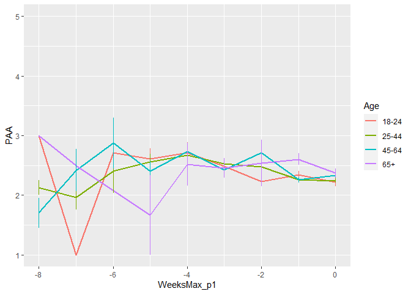
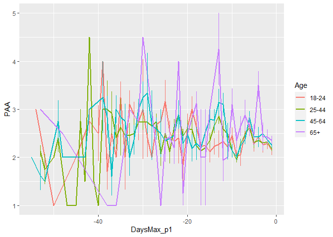
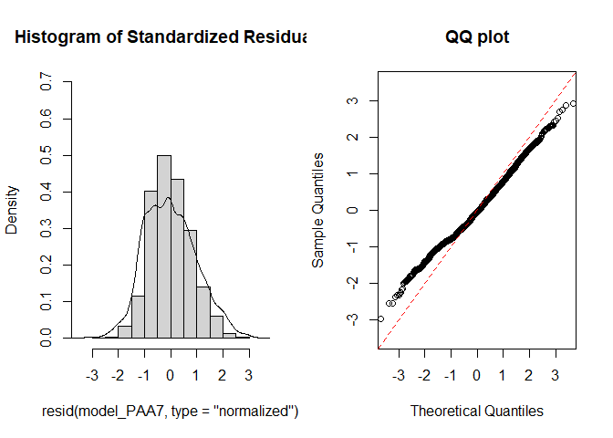
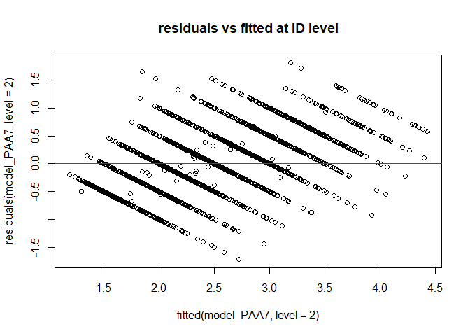
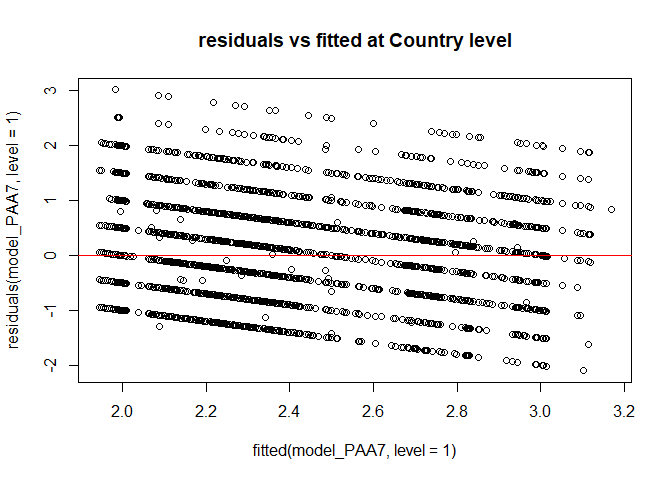
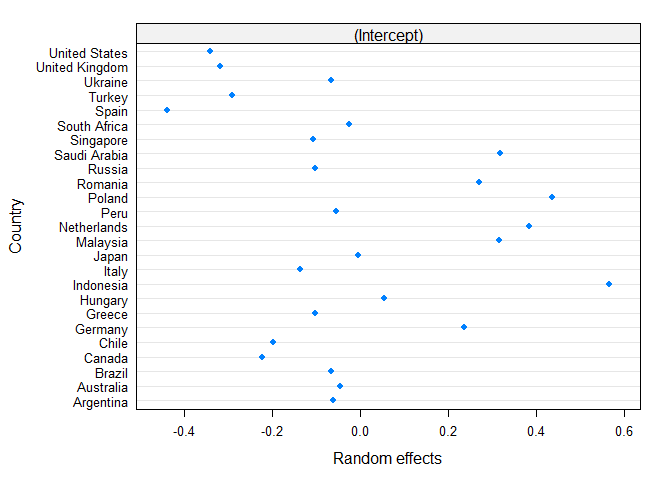
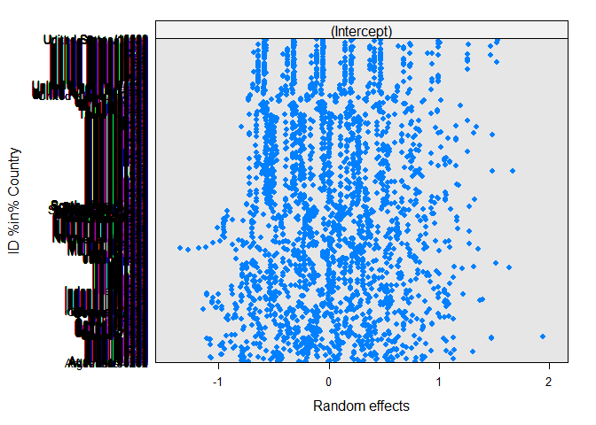
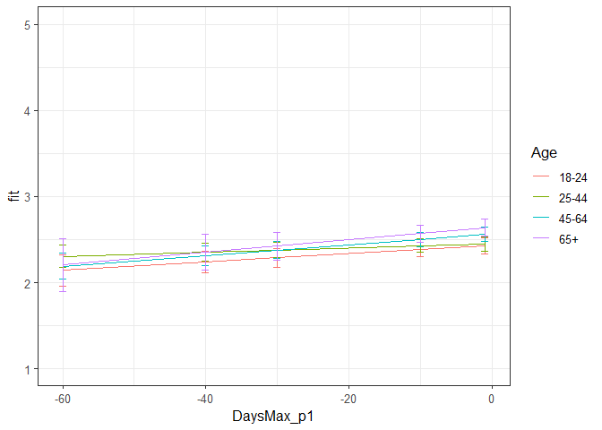

Second analysis PAA Phase 1
================
Anne Margit
10/14/2020

    ## [1] ""

``` r
load("data_analyse2_p1.Rdata")
```

This dataset includes:

1.  Data from all weekly measurement waves (baseline through wave 11,
    Time 1 through 12)
2.  Participants who provided at least 3 measurements
3.  Participants who are residents of the country they currently live in
4.  Participants who provided info on age
5.  Participants who provided info on gender (either male or female)
6.  Data from countries with at least 20 participants
7.  Pooled age groups
8.  Imputed missing emotion scores
9.  Combined emotion scores (NAA, NAD, PAA, PAD)
10. An imputed Stringency index (StringencyIndex\_imp)
11. A variable indicating the number of days before and after the day on
    which maximum stringency was reached for the respective country
    (DaysMax)
12. A variable indicating the number of weeks before and after the day
    on which maximum stringency was reached for the respective country
    (WeeksMax)
13. A variable indicating the date on which maximum Stringency was
    reached for that country (DateMaxStr)
14. A dummy Str\_dummy with 0 = before the peaj, 1 = during peak, 2 =
    after peak
15. Observations during which there was a second peak are excluded
    (N=583)

> My comments are in block quotes such as this.

``` r
library(dplyr)
library(tidyverse)
library(ggpubr)
library(ggplot2)
library(rockchalk)
library(effects)
library(nlme)
library(lattice)
library(broom.mixed)
library(purrr)
```

# Descriptives

**Number of participants per age group**

``` r
data_analyse2_p1 %>%
  group_by(Age_new) %>%
  summarise(NAge = n())
```

    # A tibble: 4 x 2
      Age_new  NAge
      <fct>   <int>
    1 0         681
    2 1        1870
    3 2        1265
    4 3         291

**Plots** **Mean PAA against max stringency in WEEKS**

``` r
plot_PAA <- ggplot(data_analyse2_p1, aes(x=WeeksMax_p1, y=PAA, group = Age_new, color = Age_new))

plot_PAA + stat_summary(fun.y=mean, geom="line", size=1)  + geom_errorbar(stat="summary", fun.data="mean_se", width=0) + scale_colour_discrete(name = "Age", labels = c("18-24", "25-44", "45-64", "65+")) + expand_limits(y=c(1, 5))
```

<!-- -->

**Mean PAA against max stringency in DAYS**

``` r
plot_PAA <- ggplot(data_analyse2_p1, aes(x=DaysMax_p1, y=PAA, group = Age_new, color = Age_new))

plot_PAA + stat_summary(fun.y=mean, geom="line", size=1)  + geom_errorbar(stat="summary", fun.data="mean_se", width=0) + scale_colour_discrete(name = "Age", labels = c("18-24", "25-44", "45-64", "65+")) + expand_limits(y=c(1, 5))
```

<!-- -->

# Regression models phase 1

**Positive affect high arousal**

*Predictors: DaysMax\_p1, Age, Random: IC for Country*

``` r
model_PAA1 <- lme(fixed = PAA ~ DaysMax_p1 + Age_new + DaysMax_p1*Age_new,
                   random = ~1 | Country, 
                  data = data_analyse2_p1, 
                  na.action = na.omit)

summary(model_PAA1)
```

    Linear mixed-effects model fit by REML
     Data: data_analyse2_p1 
          AIC      BIC    logLik
      10977.4 11040.59 -5478.702
    
    Random effects:
     Formula: ~1 | Country
            (Intercept)  Residual
    StdDev:   0.3122046 0.9075746
    
    Fixed effects: PAA ~ DaysMax_p1 + Age_new + DaysMax_p1 * Age_new 
                             Value  Std.Error   DF   t-value p-value
    (Intercept)          2.4141372 0.09143562 4075 26.402592  0.0000
    DaysMax_p1           0.0035674 0.00369234 4075  0.966175  0.3340
    Age_new1             0.0426336 0.06230808 4075  0.684239  0.4939
    Age_new2             0.1255006 0.06541579 4075  1.918506  0.0551
    Age_new3             0.2104498 0.09011832 4075  2.335261  0.0196
    DaysMax_p1:Age_new1 -0.0006562 0.00409598 4075 -0.160216  0.8727
    DaysMax_p1:Age_new2  0.0002993 0.00440787 4075  0.067896  0.9459
    DaysMax_p1:Age_new3  0.0002018 0.00709898 4075  0.028425  0.9773
     Correlation: 
                        (Intr) DysM_1 Ag_nw1 Ag_nw2 Ag_nw3 DM_1:A_1 DM_1:A_2
    DaysMax_p1           0.456                                              
    Age_new1            -0.507 -0.609                                       
    Age_new2            -0.489 -0.589  0.726                                
    Age_new3            -0.368 -0.450  0.519  0.511                         
    DaysMax_p1:Age_new1 -0.374 -0.799  0.748  0.540  0.394                  
    DaysMax_p1:Age_new2 -0.359 -0.766  0.521  0.725  0.374  0.683           
    DaysMax_p1:Age_new3 -0.232 -0.498  0.318  0.307  0.660  0.426    0.418  
    
    Standardized Within-Group Residuals:
            Min          Q1         Med          Q3         Max 
    -2.26559711 -0.77358385 -0.07470298  0.69636316  3.32181916 
    
    Number of Observations: 4107
    Number of Groups: 25 

*Predictors: DaysMax\_p1, Age, Random: IC for ID*

``` r
model_PAA2 <- lme(fixed = PAA ~ DaysMax_p1 + Age_new + DaysMax_p1*Age_new,
                  random = ~1 | ID, 
                 data = data_analyse2_p1, 
                 na.action = na.omit)

summary(model_PAA2)
```

    Linear mixed-effects model fit by REML
     Data: data_analyse2_p1 
           AIC     BIC    logLik
      10675.01 10738.2 -5327.505
    
    Random effects:
     Formula: ~1 | ID
            (Intercept)  Residual
    StdDev:   0.7411581 0.6052377
    
    Fixed effects: PAA ~ DaysMax_p1 + Age_new + DaysMax_p1 * Age_new 
                             Value  Std.Error   DF  t-value p-value
    (Intercept)          2.2799000 0.05461839 2720 41.74235  0.0000
    DaysMax_p1          -0.0015714 0.00314732 1379 -0.49929  0.6177
    Age_new1            -0.0029449 0.06297549 2720 -0.04676  0.9627
    Age_new2             0.0817681 0.06594162 2720  1.24001  0.2151
    Age_new3             0.1805027 0.08826299 2720  2.04506  0.0409
    DaysMax_p1:Age_new1 -0.0014202 0.00371621 1379 -0.38217  0.7024
    DaysMax_p1:Age_new2  0.0035087 0.00396385 1379  0.88518  0.3762
    DaysMax_p1:Age_new3  0.0058990 0.00621122 1379  0.94973  0.3424
     Correlation: 
                        (Intr) DysM_1 Ag_nw1 Ag_nw2 Ag_nw3 DM_1:A_1 DM_1:A_2
    DaysMax_p1           0.589                                              
    Age_new1            -0.867 -0.511                                       
    Age_new2            -0.828 -0.488  0.718                                
    Age_new3            -0.619 -0.364  0.537  0.513                         
    DaysMax_p1:Age_new1 -0.499 -0.847  0.582  0.413  0.309                  
    DaysMax_p1:Age_new2 -0.468 -0.794  0.405  0.567  0.289  0.672           
    DaysMax_p1:Age_new3 -0.298 -0.507  0.259  0.247  0.505  0.429    0.402  
    
    Standardized Within-Group Residuals:
            Min          Q1         Med          Q3         Max 
    -2.74396749 -0.53382176 -0.03494421  0.47002865  2.99310603 
    
    Number of Observations: 4107
    Number of Groups: 2724 

*Random: IC for ID and Country*

``` r
model_PAA3 <- lme(fixed = PAA ~ DaysMax_p1 + Age_new + DaysMax_p1*Age_new,
                  random = ~1 | Country/ID, 
                  data = data_analyse2_p1, 
                  na.action = na.omit)

summary(model_PAA3)
```

    Linear mixed-effects model fit by REML
     Data: data_analyse2_p1 
           AIC      BIC    logLik
      10375.13 10444.63 -5176.565
    
    Random effects:
     Formula: ~1 | Country
            (Intercept)
    StdDev:   0.3178945
    
     Formula: ~1 | ID %in% Country
            (Intercept)  Residual
    StdDev:   0.6777742 0.6009132
    
    Fixed effects: PAA ~ DaysMax_p1 + Age_new + DaysMax_p1 * Age_new 
                             Value  Std.Error   DF   t-value p-value
    (Intercept)          2.4286231 0.09158028 2696 26.519061  0.0000
    DaysMax_p1           0.0044625 0.00313874 1379  1.421747  0.1553
    Age_new1             0.0258816 0.06088659 2696  0.425079  0.6708
    Age_new2             0.1365701 0.06407237 2696  2.131497  0.0331
    Age_new3             0.2172231 0.08765221 2696  2.478238  0.0133
    DaysMax_p1:Age_new1 -0.0018680 0.00364210 1379 -0.512882  0.6081
    DaysMax_p1:Age_new2  0.0018307 0.00389308 1379  0.470245  0.6383
    DaysMax_p1:Age_new3  0.0031831 0.00616450 1379  0.516365  0.6057
     Correlation: 
                        (Intr) DysM_1 Ag_nw1 Ag_nw2 Ag_nw3 DM_1:A_1 DM_1:A_2
    DaysMax_p1           0.350                                              
    Age_new1            -0.496 -0.499                                       
    Age_new2            -0.474 -0.478  0.722                                
    Age_new3            -0.353 -0.361  0.517  0.511                         
    DaysMax_p1:Age_new1 -0.289 -0.824  0.595  0.422  0.312                  
    DaysMax_p1:Age_new2 -0.275 -0.781  0.409  0.569  0.294  0.672           
    DaysMax_p1:Age_new3 -0.175 -0.503  0.251  0.240  0.516  0.427    0.412  
    
    Standardized Within-Group Residuals:
            Min          Q1         Med          Q3         Max 
    -2.81607969 -0.53934341 -0.05484682  0.49392243  2.88196110 
    
    Number of Observations: 4107
    Number of Groups: 
            Country ID %in% Country 
                 25            2724 

*Random: IC for ID and Country, S for Country*

``` r
model_PAA4 <- lme(fixed = PAA ~ DaysMax_p1 + Age_new + DaysMax_p1*Age_new,
                  random = list (Country = ~DaysMax_p1, ID = ~1), 
                  data = data_analyse2_p1, 
                  na.action = na.omit)

summary(model_PAA4)
```

    Linear mixed-effects model fit by REML
     Data: data_analyse2_p1 
          AIC      BIC    logLik
      10370.5 10452.64 -5172.249
    
    Random effects:
     Formula: ~DaysMax_p1 | Country
     Structure: General positive-definite, Log-Cholesky parametrization
                StdDev      Corr  
    (Intercept) 0.295463985 (Intr)
    DaysMax_p1  0.009086787 -0.178
    
     Formula: ~1 | ID %in% Country
            (Intercept)  Residual
    StdDev:   0.6764639 0.5993486
    
    Fixed effects: PAA ~ DaysMax_p1 + Age_new + DaysMax_p1 * Age_new 
                             Value  Std.Error   DF   t-value p-value
    (Intercept)          2.4388388 0.08840609 2696 27.586774  0.0000
    DaysMax_p1           0.0074202 0.00439573 1379  1.688056  0.0916
    Age_new1             0.0189502 0.06088192 2696  0.311261  0.7556
    Age_new2             0.1253406 0.06455246 2696  1.941686  0.0523
    Age_new3             0.2236852 0.08894385 2696  2.514903  0.0120
    DaysMax_p1:Age_new1 -0.0036523 0.00367228 1379 -0.994554  0.3201
    DaysMax_p1:Age_new2 -0.0006766 0.00404451 1379 -0.167283  0.8672
    DaysMax_p1:Age_new3  0.0005326 0.00634759 1379  0.083909  0.9331
     Correlation: 
                        (Intr) DysM_1 Ag_nw1 Ag_nw2 Ag_nw3 DM_1:A_1 DM_1:A_2
    DaysMax_p1           0.260                                              
    Age_new1            -0.511 -0.353                                       
    Age_new2            -0.489 -0.343  0.720                                
    Age_new3            -0.366 -0.262  0.513  0.518                         
    DaysMax_p1:Age_new1 -0.297 -0.586  0.595  0.425  0.309                  
    DaysMax_p1:Age_new2 -0.276 -0.545  0.405  0.576  0.302  0.666           
    DaysMax_p1:Age_new3 -0.181 -0.361  0.256  0.264  0.521  0.432    0.451  
    
    Standardized Within-Group Residuals:
            Min          Q1         Med          Q3         Max 
    -2.78342445 -0.54171374 -0.05337939  0.49152869  2.88664036 
    
    Number of Observations: 4107
    Number of Groups: 
            Country ID %in% Country 
                 25            2724 

*Random: IC for ID and Country, S for ID*

``` r
model_PAA5 <- lme(fixed = PAA ~ DaysMax_p1 + Age_new + DaysMax_p1*Age_new,
                  random = list (Country = ~1, ID = ~DaysMax_p1), 
                  data = data_analyse2_p1, 
                  na.action = na.omit)

summary(model_PAA5)
```

    Linear mixed-effects model fit by REML
     Data: data_analyse2_p1 
           AIC      BIC    logLik
      10378.37 10460.51 -5176.186
    
    Random effects:
     Formula: ~1 | Country
            (Intercept)
    StdDev:   0.3171054
    
     Formula: ~DaysMax_p1 | ID %in% Country
     Structure: General positive-definite, Log-Cholesky parametrization
                StdDev      Corr  
    (Intercept) 0.676286479 (Intr)
    DaysMax_p1  0.006738321 0.014 
    Residual    0.597435736       
    
    Fixed effects: PAA ~ DaysMax_p1 + Age_new + DaysMax_p1 * Age_new 
                             Value  Std.Error   DF   t-value p-value
    (Intercept)          2.4307259 0.09146098 2696 26.576645  0.0000
    DaysMax_p1           0.0045538 0.00321502 1379  1.416413  0.1569
    Age_new1             0.0235943 0.06093845 2696  0.387183  0.6987
    Age_new2             0.1353969 0.06411530 2696  2.111771  0.0348
    Age_new3             0.2161454 0.08767765 2696  2.465228  0.0138
    DaysMax_p1:Age_new1 -0.0020901 0.00373744 1379 -0.559226  0.5761
    DaysMax_p1:Age_new2  0.0017687 0.00399858 1379  0.442326  0.6583
    DaysMax_p1:Age_new3  0.0029702 0.00632876 1379  0.469324  0.6389
     Correlation: 
                        (Intr) DysM_1 Ag_nw1 Ag_nw2 Ag_nw3 DM_1:A_1 DM_1:A_2
    DaysMax_p1           0.350                                              
    Age_new1            -0.497 -0.499                                       
    Age_new2            -0.475 -0.478  0.721                                
    Age_new3            -0.354 -0.362  0.517  0.512                         
    DaysMax_p1:Age_new1 -0.290 -0.825  0.595  0.422  0.312                  
    DaysMax_p1:Age_new2 -0.275 -0.781  0.408  0.569  0.294  0.670           
    DaysMax_p1:Age_new3 -0.175 -0.503  0.251  0.240  0.517  0.426    0.411  
    
    Standardized Within-Group Residuals:
            Min          Q1         Med          Q3         Max 
    -2.82427221 -0.53801989 -0.05477826  0.49440308  2.89681599 
    
    Number of Observations: 4107
    Number of Groups: 
            Country ID %in% Country 
                 25            2724 

*Random slope for Country and ID*

``` r
model_PAA6 <- lme(fixed = PAA ~ DaysMax_p1 + Age_new + DaysMax_p1*Age_new,
                  random = ~DaysMax_p1 | Country/ID, 
                  data = data_analyse2_p1, 
                  na.action = na.omit)

summary(model_PAA6)
```

    Linear mixed-effects model fit by REML
     Data: data_analyse2_p1 
          AIC      BIC    logLik
      10374.1 10468.88 -5172.049
    
    Random effects:
     Formula: ~DaysMax_p1 | Country
     Structure: General positive-definite, Log-Cholesky parametrization
                StdDev      Corr  
    (Intercept) 0.295736455 (Intr)
    DaysMax_p1  0.009000547 -0.17 
    
     Formula: ~DaysMax_p1 | ID %in% Country
     Structure: General positive-definite, Log-Cholesky parametrization
                StdDev      Corr  
    (Intercept) 0.673553418 (Intr)
    DaysMax_p1  0.005125981 -0.03 
    Residual    0.597499023       
    
    Fixed effects: PAA ~ DaysMax_p1 + Age_new + DaysMax_p1 * Age_new 
                             Value  Std.Error   DF   t-value p-value
    (Intercept)          2.4398417 0.08841637 2696 27.594909  0.0000
    DaysMax_p1           0.0074292 0.00441481 1379  1.682793  0.0926
    Age_new1             0.0178062 0.06085076 2696  0.292621  0.7698
    Age_new2             0.1251500 0.06451018 2696  1.940004  0.0525
    Age_new3             0.2233234 0.08886169 2696  2.513157  0.0120
    DaysMax_p1:Age_new1 -0.0037669 0.00373580 1379 -1.008332  0.3135
    DaysMax_p1:Age_new2 -0.0006565 0.00411648 1379 -0.159471  0.8733
    DaysMax_p1:Age_new3  0.0004711 0.00646491 1379  0.072865  0.9419
     Correlation: 
                        (Intr) DysM_1 Ag_nw1 Ag_nw2 Ag_nw3 DM_1:A_1 DM_1:A_2
    DaysMax_p1           0.264                                              
    Age_new1            -0.511 -0.357                                       
    Age_new2            -0.488 -0.346  0.719                                
    Age_new3            -0.366 -0.264  0.513  0.518                         
    DaysMax_p1:Age_new1 -0.296 -0.593  0.594  0.423  0.309                  
    DaysMax_p1:Age_new2 -0.275 -0.551  0.404  0.575  0.301  0.665           
    DaysMax_p1:Age_new3 -0.181 -0.364  0.254  0.263  0.521  0.431    0.450  
    
    Standardized Within-Group Residuals:
            Min          Q1         Med          Q3         Max 
    -2.79105643 -0.54352415 -0.05195957  0.49224032  2.89655623 
    
    Number of Observations: 4107
    Number of Groups: 
            Country ID %in% Country 
                 25            2724 

> Model without random slopes for Country and ID is best (?) PAA3

*Random: IC for ID and Country + AR*

``` r
data_analyse2_p1 <- data_analyse2_p1[with(data_analyse2_p1, order(Country, ID, Time)),]
data_analyse2_p1$Time <- as.numeric(data_analyse2_p1$Time)

model_PAA7 <- lme(fixed = PAA ~ DaysMax_p1 + Age_new + DaysMax_p1*Age_new,
                  random = ~1 | Country/ID, 
                  data = data_analyse2_p1, 
                  na.action = na.omit,
                  correlation = corAR1(form = ~ Time | Country/ID))

summary(model_PAA7)
```

    Linear mixed-effects model fit by REML
     Data: data_analyse2_p1 
           AIC      BIC    logLik
      10371.17 10446.99 -5173.584
    
    Random effects:
     Formula: ~1 | Country
            (Intercept)
    StdDev:   0.3176633
    
     Formula: ~1 | ID %in% Country
            (Intercept)  Residual
    StdDev:   0.6569599 0.6238912
    
    Correlation Structure: ARMA(1,0)
     Formula: ~Time | Country/ID 
     Parameter estimate(s):
         Phi1 
    0.1444759 
    Fixed effects: PAA ~ DaysMax_p1 + Age_new + DaysMax_p1 * Age_new 
                             Value  Std.Error   DF   t-value p-value
    (Intercept)          2.4321918 0.09197059 2696 26.445320  0.0000
    DaysMax_p1           0.0048176 0.00321921 1379  1.496519  0.1347
    Age_new1             0.0205503 0.06167889 2696  0.333181  0.7390
    Age_new2             0.1321487 0.06488951 2696  2.036518  0.0418
    Age_new3             0.2124246 0.08854922 2696  2.398943  0.0165
    DaysMax_p1:Age_new1 -0.0023728 0.00372655 1379 -0.636734  0.5244
    DaysMax_p1:Age_new2  0.0013908 0.00399038 1379  0.348535  0.7275
    DaysMax_p1:Age_new3  0.0025279 0.00632469 1379  0.399689  0.6894
     Correlation: 
                        (Intr) DysM_1 Ag_nw1 Ag_nw2 Ag_nw3 DM_1:A_1 DM_1:A_2
    DaysMax_p1           0.361                                              
    Age_new1            -0.501 -0.509                                       
    Age_new2            -0.479 -0.488  0.722                                
    Age_new3            -0.358 -0.370  0.519  0.513                         
    DaysMax_p1:Age_new1 -0.298 -0.823  0.607  0.432  0.319                  
    DaysMax_p1:Age_new2 -0.283 -0.779  0.418  0.582  0.301  0.672           
    DaysMax_p1:Age_new3 -0.181 -0.502  0.257  0.246  0.529  0.426    0.412  
    
    Standardized Within-Group Residuals:
            Min          Q1         Med          Q3         Max 
    -2.76113175 -0.55834530 -0.05270275  0.51790138  2.90303679 
    
    Number of Observations: 4107
    Number of Groups: 
            Country ID %in% Country 
                 25            2724 

> Model met AR lijkt iets minder goed maar verschilt maar 2 BIC punten.
> Omdat de andere modellen wel allemaal een AR structuur hebben lijkt
> PAA7 me wel de beste keuze

*QQ plot of residuals*

``` r
par(mfrow = c(1,2))
lims <- c(-3.5,3.5)
hist(resid(model_PAA7, type = "normalized"),
freq = FALSE, xlim = lims, ylim =  c(0,.7),main = "Histogram of Standardized Residuals")
lines(density(scale(resid(model_PAA7))))
qqnorm(resid(model_PAA7, type = "normalized"),
xlim = lims, ylim = lims,main = "QQ plot")
abline(0,1, col = "red", lty = 2)
```

<!-- -->

*Residuals vs fitted*

``` r
plot(fitted(model_PAA7, level=2), residuals(model_PAA7, level=2), 
     main="residuals vs fitted at ID level")
abline(a=0, b=0,col="red")
```

<!-- -->

``` r
plot(fitted(model_PAA7, level=1), residuals(model_PAA7, level=1), 
    main="residuals vs fitted at Country level")
abline(a=0, b=0,col="red")
```

<!-- -->

> Residuen zien er allemaal goed uit

*Plot random intercepts and slopes*

``` r
plot(ranef(model_PAA7, level = 1))
```

<!-- -->

``` r
plot(ranef(model_PAA7, level = 2))
```

<!-- -->

*Confidence intervals*

``` r
intervals(model_PAA7)
```

    Approximate 95% confidence intervals
    
     Fixed effects:
                               lower         est.       upper
    (Intercept)          2.251851744  2.432191758 2.612531772
    DaysMax_p1          -0.001497473  0.004817615 0.011132703
    Age_new1            -0.100392445  0.020550251 0.141492948
    Age_new2             0.004910457  0.132148683 0.259386909
    Age_new3             0.038793335  0.212424573 0.386055811
    DaysMax_p1:Age_new1 -0.009683136 -0.002372819 0.004937498
    DaysMax_p1:Age_new2 -0.006437083  0.001390786 0.009218655
    DaysMax_p1:Age_new3 -0.009879143  0.002527908 0.014934958
    attr(,"label")
    [1] "Fixed effects:"
    
     Random Effects:
      Level: Country 
                        lower      est.     upper
    sd((Intercept)) 0.2149514 0.3176633 0.4694548
      Level: ID 
                        lower      est.     upper
    sd((Intercept)) 0.6198323 0.6569599 0.6963114
    
     Correlation structure:
              lower      est.    upper
    Phi1 0.03358923 0.1444759 0.251849
    attr(,"label")
    [1] "Correlation structure:"
    
     Within-group standard error:
        lower      est.     upper 
    0.5936500 0.6238912 0.6556729 

*Plot of predicted values*

``` r
ef_PAA <- effect("DaysMax_p1:Age_new", model_PAA7)

plot_PAA <- ggplot(as.data.frame(ef_PAA), 
       aes(DaysMax_p1, fit, color=Age_new)) + geom_line() + 
  geom_errorbar(aes(ymin=fit-se, ymax=fit+se), width=1) + theme_bw(base_size=12) + scale_color_discrete(name="Age", labels = c("18-24", "25-44", "45-64", "65+")) + expand_limits(y=c(1, 5))
```

``` r
plot_PAA
```

<!-- -->

``` r
coef_PAA = tidy(model_PAA7, 
               effects = "fixed")
```

*Effect sizes* **Within person SD and average within person SD of NAA**

``` r
ISDs <- data_analyse2_p1 %>% 
  group_by(ID) %>%
  summarize_at(c("PAA"), sd, na.rm=TRUE) %>%
  ungroup()

ISDs_av <- ISDs %>%
  summarize_at(c("PAA"), mean, na.rm=TRUE) %>%
  stack() %>%
  rename(sd=values) 
```

> Effect sizes for intercept and main effect of age = regression
> coefficient / average ISD of PAA Effect size for main effect of
> DaysMax = (regression coefficient \* 28)/ average ISD of PAA Effect
> sizes for interaction effects = (regression coefficient \* 28)/
> average ISD of PAA

> The effect sizes for main effect of DaysMax and the interaction
> effects reflect the increase in SD of PAA over 4 weeks (28 days)

``` r
coef_PAA <- coef_PAA %>%
  mutate(e_size = ifelse(row_number()== 1 | row_number()== 3 |  row_number()== 4 |  row_number()== 5,
          estimate/0.4706784, 
          (estimate*28)/0.4706784))
```

``` r
coef_PAA
```

    ## # A tibble: 8 x 7
    ##   term                estimate std.error    df statistic   p.value  e_size
    ##   <chr>                  <dbl>     <dbl> <dbl>     <dbl>     <dbl>   <dbl>
    ## 1 (Intercept)          2.43      0.0920   2696    26.4   3.21e-137  5.17  
    ## 2 DaysMax_p1           0.00482   0.00322  1379     1.50  1.35e-  1  0.287 
    ## 3 Age_new1             0.0206    0.0617   2696     0.333 7.39e-  1  0.0437
    ## 4 Age_new2             0.132     0.0649   2696     2.04  4.18e-  2  0.281 
    ## 5 Age_new3             0.212     0.0885   2696     2.40  1.65e-  2  0.451 
    ## 6 DaysMax_p1:Age_new1 -0.00237   0.00373  1379    -0.637 5.24e-  1 -0.141 
    ## 7 DaysMax_p1:Age_new2  0.00139   0.00399  1379     0.349 7.27e-  1  0.0827
    ## 8 DaysMax_p1:Age_new3  0.00253   0.00632  1379     0.400 6.89e-  1  0.150

> There are differences between the youngest age category with the
> oldest two age categories in intensity, but no change over time
