200617 Multilevel models emotions
================
Anne Margit
6/17/2020

    ## 
    ## Attaching package: 'dplyr'

    ## The following objects are masked from 'package:stats':
    ## 
    ##     filter, lag

    ## The following objects are masked from 'package:base':
    ## 
    ##     intersect, setdiff, setequal, union

    ## Loading required package: Matrix

    ## 
    ## Attaching package: 'lmerTest'

    ## The following object is masked from 'package:lme4':
    ## 
    ##     lmer

    ## The following object is masked from 'package:stats':
    ## 
    ##     step

    ## ── Attaching packages ──────────────────────────────────────────────────────────────────────────────────────────────────────────────────────────────────── tidyverse 1.3.0 ──

    ## ✓ tibble  3.0.1     ✓ purrr   0.3.4
    ## ✓ tidyr   1.1.0     ✓ stringr 1.4.0
    ## ✓ readr   1.3.1     ✓ forcats 0.5.0

    ## ── Conflicts ─────────────────────────────────────────────────────────────────────────────────────────────────────────────────────────────────────── tidyverse_conflicts() ──
    ## x tidyr::expand() masks Matrix::expand()
    ## x dplyr::filter() masks stats::filter()
    ## x dplyr::lag()    masks stats::lag()
    ## x tidyr::pack()   masks Matrix::pack()
    ## x tidyr::unpack() masks Matrix::unpack()

    ## 
    ## Attaching package: 'rockchalk'

    ## The following object is masked from 'package:dplyr':
    ## 
    ##     summarize

This dataset includes measurements from participants that (1) provided
at least 3 measurements, (2) that are residents of the country they
currently live in, (3) from countries with at least 20 participants, (4)
provided data on age, and (5) with imputed Stringency index values that
are (6) centered around country means

``` r
load("data_long_min3_strc.Rdata")
```

# Anxiety

Multilevel anxiety random
intercept

``` r
model.anx0 <- lmer(Anxiety ~ 1 + (1 | Country/ID), data=data_long_min3_strc, na.action=na.exclude)
summary(model.anx0)
```

    ## Linear mixed model fit by REML. t-tests use Satterthwaite's method [
    ## lmerModLmerTest]
    ## Formula: Anxiety ~ 1 + (1 | Country/ID)
    ##    Data: data_long_min3_strc
    ## 
    ## REML criterion at convergence: 109309.9
    ## 
    ## Scaled residuals: 
    ##     Min      1Q  Median      3Q     Max 
    ## -3.8673 -0.5591 -0.1257  0.5542  4.1501 
    ## 
    ## Random effects:
    ##  Groups     Name        Variance Std.Dev.
    ##  ID:Country (Intercept) 0.76896  0.8769  
    ##  Country    (Intercept) 0.08117  0.2849  
    ##  Residual               0.58879  0.7673  
    ## Number of obs: 39904, groups:  ID:Country, 9174; Country, 58
    ## 
    ## Fixed effects:
    ##             Estimate Std. Error       df t value Pr(>|t|)    
    ## (Intercept)  2.52339    0.04651 53.79197   54.26   <2e-16 ***
    ## ---
    ## Signif. codes:  0 '***' 0.001 '**' 0.01 '*' 0.05 '.' 0.1 ' ' 1

Variance in anxiety explained by country is pretty low, equal variance
explained between and within persons

Two level models using uncentered
Stringency:

``` r
model.anx1 <- lmer(Anxiety ~ StringencyIndex + (1 | ID), data=data_long_min3_strc, na.action=na.exclude)
summary(model.anx1)
```

    ## Linear mixed model fit by REML. t-tests use Satterthwaite's method [
    ## lmerModLmerTest]
    ## Formula: Anxiety ~ StringencyIndex + (1 | ID)
    ##    Data: data_long_min3_strc
    ## 
    ## REML criterion at convergence: 110015.7
    ## 
    ## Scaled residuals: 
    ##     Min      1Q  Median      3Q     Max 
    ## -3.9001 -0.5580 -0.1128  0.5713  4.0637 
    ## 
    ## Random effects:
    ##  Groups   Name        Variance Std.Dev.
    ##  ID       (Intercept) 0.8571   0.9258  
    ##  Residual             0.5890   0.7675  
    ## Number of obs: 39881, groups:  ID, 9168
    ## 
    ## Fixed effects:
    ##                   Estimate Std. Error         df t value Pr(>|t|)    
    ## (Intercept)      2.482e+00  5.075e-02  3.841e+04  48.900   <2e-16 ***
    ## StringencyIndex -2.335e-04  6.292e-04  3.929e+04  -0.371    0.711    
    ## ---
    ## Signif. codes:  0 '***' 0.001 '**' 0.01 '*' 0.05 '.' 0.1 ' ' 1
    ## 
    ## Correlation of Fixed Effects:
    ##             (Intr)
    ## StrngncyInd -0.979

``` r
model.anx2 <- lmer(Anxiety ~ StringencyIndex + age + (1 | ID), data=data_long_min3_strc, na.action=na.exclude)
summary(model.anx2)
```

    ## Linear mixed model fit by REML. t-tests use Satterthwaite's method [
    ## lmerModLmerTest]
    ## Formula: Anxiety ~ StringencyIndex + age + (1 | ID)
    ##    Data: data_long_min3_strc
    ## 
    ## REML criterion at convergence: 109430.5
    ## 
    ## Scaled residuals: 
    ##     Min      1Q  Median      3Q     Max 
    ## -3.8991 -0.5689 -0.1365  0.5584  4.0431 
    ## 
    ## Random effects:
    ##  Groups   Name        Variance Std.Dev.
    ##  ID       (Intercept) 0.7927   0.8904  
    ##  Residual             0.5890   0.7675  
    ## Number of obs: 39881, groups:  ID, 9168
    ## 
    ## Fixed effects:
    ##                   Estimate Std. Error         df t value Pr(>|t|)    
    ## (Intercept)      2.813e+00  5.793e-02  3.107e+04  48.564  < 2e-16 ***
    ## StringencyIndex -9.711e-04  6.247e-04  3.903e+04  -1.555  0.12006    
    ## age2            -3.827e-02  3.590e-02  9.141e+03  -1.066  0.28650    
    ## age3            -1.559e-01  3.645e-02  9.158e+03  -4.277 1.92e-05 ***
    ## age4            -2.799e-01  3.671e-02  9.155e+03  -7.623 2.72e-14 ***
    ## age5            -4.689e-01  3.723e-02  9.134e+03 -12.592  < 2e-16 ***
    ## age6            -7.504e-01  4.002e-02  9.170e+03 -18.753  < 2e-16 ***
    ## age7            -8.951e-01  8.018e-02  9.026e+03 -11.164  < 2e-16 ***
    ## age8            -8.638e-01  3.073e-01  9.079e+03  -2.811  0.00495 ** 
    ## ---
    ## Signif. codes:  0 '***' 0.001 '**' 0.01 '*' 0.05 '.' 0.1 ' ' 1
    ## 
    ## Correlation of Fixed Effects:
    ##             (Intr) StrngI age2   age3   age4   age5   age6   age7  
    ## StrngncyInd -0.878                                                 
    ## age2        -0.404  0.040                                          
    ## age3        -0.408  0.052  0.588                                   
    ## age4        -0.405  0.051  0.583  0.575                            
    ## age5        -0.396  0.046  0.575  0.567  0.563                     
    ## age6        -0.379  0.056  0.536  0.528  0.525  0.517              
    ## age7        -0.198  0.038  0.268  0.264  0.262  0.258  0.241       
    ## age8        -0.058  0.017  0.070  0.069  0.069  0.068  0.063  0.032

``` r
model.anx3 <- lmer(Anxiety ~ StringencyIndex + age + StringencyIndex*age + (1 | ID), data=data_long_min3_strc, na.action=na.exclude)
summary(model.anx3)
```

    ## Linear mixed model fit by REML. t-tests use Satterthwaite's method [
    ## lmerModLmerTest]
    ## Formula: Anxiety ~ StringencyIndex + age + StringencyIndex * age + (1 |  
    ##     ID)
    ##    Data: data_long_min3_strc
    ## 
    ## REML criterion at convergence: 109472.6
    ## 
    ## Scaled residuals: 
    ##     Min      1Q  Median      3Q     Max 
    ## -3.8947 -0.5670 -0.1315  0.5592  4.0478 
    ## 
    ## Random effects:
    ##  Groups   Name        Variance Std.Dev.
    ##  ID       (Intercept) 0.7929   0.8904  
    ##  Residual             0.5886   0.7672  
    ## Number of obs: 39881, groups:  ID, 9168
    ## 
    ## Fixed effects:
    ##                        Estimate Std. Error         df t value Pr(>|t|)    
    ## (Intercept)           2.976e+00  1.277e-01  3.794e+04  23.307  < 2e-16 ***
    ## StringencyIndex      -2.967e-03  1.530e-03  3.903e+04  -1.939  0.05254 .  
    ## age2                  3.999e-02  1.689e-01  3.739e+04   0.237  0.81280    
    ## age3                 -8.402e-02  1.782e-01  3.779e+04  -0.472  0.63722    
    ## age4                 -5.067e-01  1.753e-01  3.872e+04  -2.890  0.00386 ** 
    ## age5                 -9.841e-01  1.806e-01  3.820e+04  -5.450 5.06e-08 ***
    ## age6                 -1.269e+00  1.908e-01  3.827e+04  -6.653 2.91e-11 ***
    ## age7                 -1.456e+00  4.558e-01  3.716e+04  -3.195  0.00140 ** 
    ## age8                 -4.593e-01  1.463e+00  3.013e+04  -0.314  0.75363    
    ## StringencyIndex:age2 -1.047e-03  2.052e-03  3.855e+04  -0.510  0.60988    
    ## StringencyIndex:age3 -9.932e-04  2.182e-03  3.881e+04  -0.455  0.64898    
    ## StringencyIndex:age4  2.815e-03  2.144e-03  3.951e+04   1.313  0.18907    
    ## StringencyIndex:age5  6.476e-03  2.207e-03  3.915e+04   2.934  0.00335 ** 
    ## StringencyIndex:age6  6.573e-03  2.349e-03  3.923e+04   2.798  0.00515 ** 
    ## StringencyIndex:age7  7.194e-03  5.830e-03  3.803e+04   1.234  0.21720    
    ## StringencyIndex:age8 -5.748e-03  1.952e-02  3.185e+04  -0.294  0.76844    
    ## ---
    ## Signif. codes:  0 '***' 0.001 '**' 0.01 '*' 0.05 '.' 0.1 ' ' 1

    ## 
    ## Correlation matrix not shown by default, as p = 16 > 12.
    ## Use print(x, correlation=TRUE)  or
    ##     vcov(x)        if you need it

plot anxiety and stringency for different age groups / LOESS plot
(doesn’t work well for large datasets? check
this)

``` r
plot_anx <- ggplot(data = data_long_min3_strc, aes(x = StringencyIndex, y = Anxiety, group = ID, color = age))

plot_anx + stat_smooth(aes(group=age), se = FALSE, method = "loess", formula = y ~ x, size = 1, na.rm=TRUE) + scale_colour_discrete(name = "Age", 
labels = c("18-24", "25-34", "35-44", "45-54", "55-64", "65-74", "75-85", "85+")) + labs(title="LOESS plot of Anxiety by Stringency for different age groups")
```

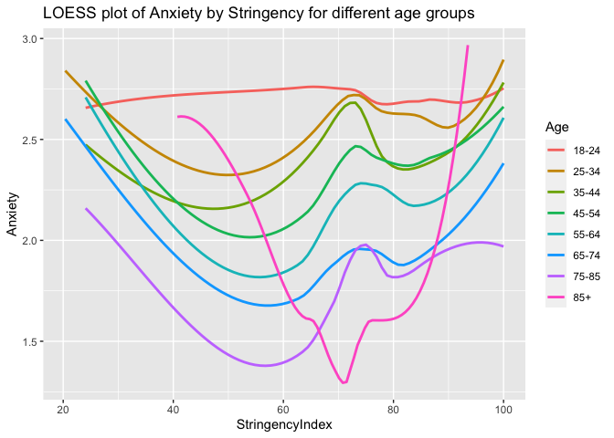<!-- -->
GAM
plot

``` r
plot_anx + stat_smooth(aes(group=age), se = FALSE, method = "gam", formula = y ~ x, size = 1, na.rm=TRUE) + scale_colour_discrete(name = "Age", 
labels = c("18-24", "25-34", "35-44", "45-54", "55-64", "65-74", "75-85", "85+")) + labs(title="GAM plot of Anxiety by Stringency for different age groups")
```

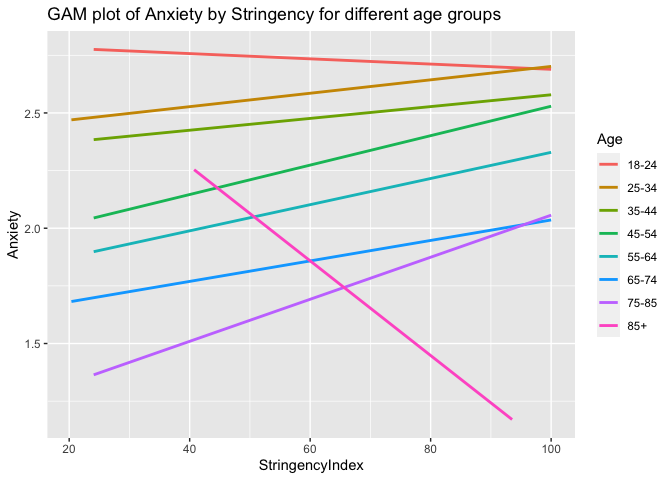<!-- -->

Plot Anxiety by
Date

``` r
plot_anx2 <- ggplot(data = data_long_min3_strc, aes(x = Date, y = Anxiety, group = ID, color = age))

plot_anx2 + stat_smooth(aes(group=age), se = FALSE, method = "loess", formula = y ~ x, size = 1, na.rm=TRUE) + scale_colour_discrete(name = "Age", 
labels = c("18-24", "25-34", "35-44", "45-54", "55-64", "65-74", "75-85", "85+")) + labs(title="LOESS plot of Anxiety by Date for different age groups")
```

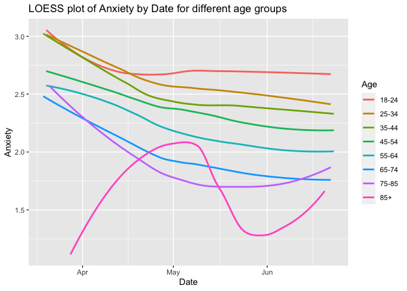<!-- -->
GAM
plot

``` r
plot_anx2 + stat_smooth(aes(group=age), se = FALSE, method = "gam", formula = y ~ x, size = 1, na.rm=TRUE) + scale_colour_discrete(name = "Age", 
labels = c("18-24", "25-34", "35-44", "45-54", "55-64", "65-74", "75-85", "85+")) + labs(title="GAM plot of Anxiety by Date for different age groups")
```

<!-- -->
\#\#\#\#\#\#\#\#\#\#\#\#\#\#\#\#\#\#\#\#\#\#\# Anger
\#\#\#\#\#\#\#\#\#\#\#\#\#\#\#\#\#\#\#\#\#\#\# Multilevel anger random
intercept

``` r
model.ang0 <- lmer(Ang ~ 1 + (1 | Country/ID), data=data_long_min3_strc, na.action=na.exclude)
summary(model.ang0)
```

    ## Linear mixed model fit by REML. t-tests use Satterthwaite's method [
    ## lmerModLmerTest]
    ## Formula: Ang ~ 1 + (1 | Country/ID)
    ##    Data: data_long_min3_strc
    ## 
    ## REML criterion at convergence: 83173.1
    ## 
    ## Scaled residuals: 
    ##     Min      1Q  Median      3Q     Max 
    ## -3.9738 -0.4571 -0.1675  0.4937  4.2726 
    ## 
    ## Random effects:
    ##  Groups     Name        Variance Std.Dev.
    ##  ID:Country (Intercept) 0.68928  0.8302  
    ##  Country    (Intercept) 0.04372  0.2091  
    ##  Residual               0.54006  0.7349  
    ## Number of obs: 30750, groups:  ID:Country, 9172; Country, 58
    ## 
    ## Fixed effects:
    ##             Estimate Std. Error       df t value Pr(>|t|)    
    ## (Intercept)  2.09234    0.03647 42.80693   57.37   <2e-16 ***
    ## ---
    ## Signif. codes:  0 '***' 0.001 '**' 0.01 '*' 0.05 '.' 0.1 ' ' 1

Variance in anger explained by country is pretty low, equal variance
explained between and within persons

Using two level models Predicted by
stringency

``` r
model.ang1 <- lmer(Ang ~ StringencyIndex + (1 | ID), data=data_long_min3_strc, na.action=na.exclude)
summary(model.ang1)
```

    ## Linear mixed model fit by REML. t-tests use Satterthwaite's method [
    ## lmerModLmerTest]
    ## Formula: Ang ~ StringencyIndex + (1 | ID)
    ##    Data: data_long_min3_strc
    ## 
    ## REML criterion at convergence: 83420.4
    ## 
    ## Scaled residuals: 
    ##     Min      1Q  Median      3Q     Max 
    ## -3.9787 -0.4631 -0.1841  0.4982  4.3775 
    ## 
    ## Random effects:
    ##  Groups   Name        Variance Std.Dev.
    ##  ID       (Intercept) 0.7230   0.8503  
    ##  Residual             0.5403   0.7350  
    ## Number of obs: 30733, groups:  ID, 9166
    ## 
    ## Fixed effects:
    ##                  Estimate Std. Error        df t value Pr(>|t|)    
    ## (Intercept)     1.655e+00  5.612e-02 2.937e+04  29.496  < 2e-16 ***
    ## StringencyIndex 4.363e-03  7.007e-04 2.985e+04   6.227 4.83e-10 ***
    ## ---
    ## Signif. codes:  0 '***' 0.001 '**' 0.01 '*' 0.05 '.' 0.1 ' ' 1
    ## 
    ## Correlation of Fixed Effects:
    ##             (Intr)
    ## StrngncyInd -0.984

``` r
model.ang2 <- lmer(Ang ~ StringencyIndex + age + (1 | ID), data=data_long_min3_strc, na.action=na.exclude)
summary(model.ang2)
```

    ## Linear mixed model fit by REML. t-tests use Satterthwaite's method [
    ## lmerModLmerTest]
    ## Formula: Ang ~ StringencyIndex + age + (1 | ID)
    ##    Data: data_long_min3_strc
    ## 
    ## REML criterion at convergence: 83160.7
    ## 
    ## Scaled residuals: 
    ##     Min      1Q  Median      3Q     Max 
    ## -3.9609 -0.4580 -0.1694  0.4807  4.3434 
    ## 
    ## Random effects:
    ##  Groups   Name        Variance Std.Dev.
    ##  ID       (Intercept) 0.6962   0.8344  
    ##  Residual             0.5401   0.7349  
    ## Number of obs: 30733, groups:  ID, 9166
    ## 
    ## Fixed effects:
    ##                   Estimate Std. Error         df t value Pr(>|t|)    
    ## (Intercept)      1.901e+00  6.303e-02  2.604e+04  30.157  < 2e-16 ***
    ## StringencyIndex  3.562e-03  6.995e-04  2.981e+04   5.092 3.56e-07 ***
    ## age2            -4.549e-02  3.476e-02  9.038e+03  -1.309   0.1906    
    ## age3            -7.656e-02  3.530e-02  9.062e+03  -2.169   0.0301 *  
    ## age4            -1.984e-01  3.556e-02  9.060e+03  -5.580 2.47e-08 ***
    ## age5            -3.089e-01  3.605e-02  9.033e+03  -8.568  < 2e-16 ***
    ## age6            -5.064e-01  3.878e-02  9.082e+03 -13.059  < 2e-16 ***
    ## age7            -5.367e-01  7.750e-02  8.861e+03  -6.925 4.68e-12 ***
    ## age8            -6.220e-01  2.969e-01  8.930e+03  -2.095   0.0362 *  
    ## ---
    ## Signif. codes:  0 '***' 0.001 '**' 0.01 '*' 0.05 '.' 0.1 ' ' 1
    ## 
    ## Correlation of Fixed Effects:
    ##             (Intr) StrngI age2   age3   age4   age5   age6   age7  
    ## StrngncyInd -0.905                                                 
    ## age2        -0.367  0.044                                          
    ## age3        -0.378  0.061  0.588                                   
    ## age4        -0.377  0.063  0.584  0.576                            
    ## age5        -0.373  0.063  0.576  0.568  0.564                     
    ## age6        -0.364  0.078  0.536  0.529  0.526  0.518              
    ## age7        -0.192  0.049  0.269  0.265  0.264  0.260  0.243       
    ## age8        -0.057  0.020  0.070  0.070  0.069  0.068  0.064  0.032

``` r
model.ang3 <- lmer(Ang ~ StringencyIndex + age + StringencyIndex*age + (1 | ID), data=data_long_min3_strc, na.action=na.exclude)
summary(model.ang3)
```

    ## Linear mixed model fit by REML. t-tests use Satterthwaite's method [
    ## lmerModLmerTest]
    ## Formula: Ang ~ StringencyIndex + age + StringencyIndex * age + (1 | ID)
    ##    Data: data_long_min3_strc
    ## 
    ## REML criterion at convergence: 83204.3
    ## 
    ## Scaled residuals: 
    ##     Min      1Q  Median      3Q     Max 
    ## -3.9748 -0.4583 -0.1710  0.4808  4.2386 
    ## 
    ## Random effects:
    ##  Groups   Name        Variance Std.Dev.
    ##  ID       (Intercept) 0.6957   0.8341  
    ##  Residual             0.5399   0.7348  
    ## Number of obs: 30733, groups:  ID, 9166
    ## 
    ## Fixed effects:
    ##                        Estimate Std. Error         df t value Pr(>|t|)    
    ## (Intercept)           2.056e+00  1.451e-01  2.886e+04  14.176  < 2e-16 ***
    ## StringencyIndex       1.655e-03  1.748e-03  2.945e+04   0.947 0.343828    
    ## age2                 -4.175e-01  1.921e-01  2.829e+04  -2.173 0.029752 *  
    ## age3                  1.533e-01  2.012e-01  2.881e+04   0.762 0.446139    
    ## age4                 -6.524e-01  1.992e-01  2.958e+04  -3.275 0.001059 ** 
    ## age5                 -3.305e-01  1.996e-01  2.949e+04  -1.656 0.097809 .  
    ## age6                 -7.558e-01  2.089e-01  2.964e+04  -3.618 0.000298 ***
    ## age7                 -5.390e-01  4.739e-01  2.971e+04  -1.137 0.255439    
    ## age8                 -3.857e+00  1.420e+00  2.660e+04  -2.717 0.006598 ** 
    ## StringencyIndex:age2  4.633e-03  2.344e-03  2.888e+04   1.977 0.048060 *  
    ## StringencyIndex:age3 -3.003e-03  2.475e-03  2.934e+04  -1.213 0.224988    
    ## StringencyIndex:age4  5.715e-03  2.450e-03  3.004e+04   2.332 0.019681 *  
    ## StringencyIndex:age5  1.965e-04  2.455e-03  2.999e+04   0.080 0.936218    
    ## StringencyIndex:age6  3.122e-03  2.591e-03  3.015e+04   1.205 0.228315    
    ## StringencyIndex:age7 -1.069e-04  6.107e-03  3.009e+04  -0.017 0.986039    
    ## StringencyIndex:age8  4.416e-02  1.903e-02  2.776e+04   2.321 0.020316 *  
    ## ---
    ## Signif. codes:  0 '***' 0.001 '**' 0.01 '*' 0.05 '.' 0.1 ' ' 1

    ## 
    ## Correlation matrix not shown by default, as p = 16 > 12.
    ## Use print(x, correlation=TRUE)  or
    ##     vcov(x)        if you need it

LOESS plot anger and stringency for different age
groups

``` r
plot_ang <- ggplot(data = data_long_min3_strc, aes(x = StringencyIndex, y = Ang, group = ID, color = age))

plot_ang + stat_smooth(aes(group=age), se = FALSE, method = "loess", formula = y ~ x, size = 1, na.rm=TRUE) + scale_colour_discrete(name = "Age", 
labels = c("18-24", "25-34", "35-44", "45-54", "55-64", "65-74", "75-85", "85+")) + labs(title="LOESS plot of Anger by Stringency for different age groups", y ="Anger")
```

<!-- -->
GAM
plot

``` r
plot_ang + stat_smooth(aes(group=age), se = FALSE, method = "gam", formula = y ~ x, size = 1, na.rm=TRUE) + scale_colour_discrete(name = "Age", 
labels = c("18-24", "25-34", "35-44", "45-54", "55-64", "65-74", "75-85", "85+")) + labs(title="GAM plot of Anger by Stringency for different age groups", y ="Anger")
```

<!-- -->

Plot Anger by Date for different age
groups

``` r
plot_ang2 <- ggplot(data = data_long_min3_strc, aes(x = Date, y = Ang, group = ID, color = age))

plot_ang2 + stat_smooth(aes(group=age), se = FALSE, method = "loess", formula = y ~ x, size = 1, na.rm=TRUE) + scale_colour_discrete(name = "Age", 
labels = c("18-24", "25-34", "35-44", "45-54", "55-64", "65-74", "75-85", "85+")) + labs(title="LOESS plot of Anger by Date for different age groups", y ="Anger")
```

<!-- -->
GAM
plot

``` r
plot_ang2 + stat_smooth(aes(group=age), se = FALSE, method = "gam", formula = y ~ x, size = 1, na.rm=TRUE) + scale_colour_discrete(name = "Age", 
labels = c("18-24", "25-34", "35-44", "45-54", "55-64", "65-74", "75-85", "85+")) + labs(title="GAM plot of Anger by Date for different age groups", y ="Anger")
```

<!-- -->

# Bored

Multilevel random
intercept

``` r
model.bor0 <- lmer(Bored ~ 1 + (1 | Country/ID), data=data_long_min3_strc, na.action=na.exclude)
summary(model.bor0)
```

    ## Linear mixed model fit by REML. t-tests use Satterthwaite's method [
    ## lmerModLmerTest]
    ## Formula: Bored ~ 1 + (1 | Country/ID)
    ##    Data: data_long_min3_strc
    ## 
    ## REML criterion at convergence: 71137
    ## 
    ## Scaled residuals: 
    ##     Min      1Q  Median      3Q     Max 
    ## -3.4254 -0.5300 -0.1865  0.5398  3.7547 
    ## 
    ## Random effects:
    ##  Groups     Name        Variance Std.Dev.
    ##  ID:Country (Intercept) 0.7853   0.8862  
    ##  Country    (Intercept) 0.1140   0.3376  
    ##  Residual               0.6503   0.8064  
    ## Number of obs: 24262, groups:  ID:Country, 9168; Country, 58
    ## 
    ## Fixed effects:
    ##             Estimate Std. Error       df t value Pr(>|t|)    
    ## (Intercept)  2.36007    0.05415 48.58024   43.58   <2e-16 ***
    ## ---
    ## Signif. codes:  0 '***' 0.001 '**' 0.01 '*' 0.05 '.' 0.1 ' ' 1

Variance in bored explained by country is pretty low, equal variance
explained between and within persons

Using two level models Predicted by
stringency

``` r
model.bor1 <- lmer(Bored ~ StringencyIndex + (1 | ID), data=data_long_min3_strc, na.action=na.exclude)
summary(model.bor1)
```

    ## Linear mixed model fit by REML. t-tests use Satterthwaite's method [
    ## lmerModLmerTest]
    ## Formula: Bored ~ StringencyIndex + (1 | ID)
    ##    Data: data_long_min3_strc
    ## 
    ## REML criterion at convergence: 71550.3
    ## 
    ## Scaled residuals: 
    ##     Min      1Q  Median      3Q     Max 
    ## -3.4398 -0.5237 -0.1754  0.5359  3.7206 
    ## 
    ## Random effects:
    ##  Groups   Name        Variance Std.Dev.
    ##  ID       (Intercept) 0.8693   0.9324  
    ##  Residual             0.6446   0.8029  
    ## Number of obs: 24251, groups:  ID, 9162
    ## 
    ## Fixed effects:
    ##                  Estimate Std. Error        df t value Pr(>|t|)    
    ## (Intercept)     1.690e+00  5.890e-02 2.424e+04  28.688   <2e-16 ***
    ## StringencyIndex 7.353e-03  7.432e-04 2.424e+04   9.895   <2e-16 ***
    ## ---
    ## Signif. codes:  0 '***' 0.001 '**' 0.01 '*' 0.05 '.' 0.1 ' ' 1
    ## 
    ## Correlation of Fixed Effects:
    ##             (Intr)
    ## StrngncyInd -0.982

``` r
model.bor2 <- lmer(Bored ~ StringencyIndex + age + (1 | ID), data=data_long_min3_strc, na.action=na.exclude)
summary(model.bor2)
```

    ## Linear mixed model fit by REML. t-tests use Satterthwaite's method [
    ## lmerModLmerTest]
    ## Formula: Bored ~ StringencyIndex + age + (1 | ID)
    ##    Data: data_long_min3_strc
    ## 
    ## REML criterion at convergence: 71109.6
    ## 
    ## Scaled residuals: 
    ##     Min      1Q  Median      3Q     Max 
    ## -3.4293 -0.5184 -0.1882  0.5337  3.7558 
    ## 
    ## Random effects:
    ##  Groups   Name        Variance Std.Dev.
    ##  ID       (Intercept) 0.8152   0.9029  
    ##  Residual             0.6438   0.8023  
    ## Number of obs: 24251, groups:  ID, 9162
    ## 
    ## Fixed effects:
    ##                   Estimate Std. Error         df t value Pr(>|t|)    
    ## (Intercept)      2.242e+00  6.632e-02  2.263e+04  33.802  < 2e-16 ***
    ## StringencyIndex  6.509e-03  7.374e-04  2.424e+04   8.827  < 2e-16 ***
    ## age2            -3.136e-01  3.962e-02  9.526e+03  -7.916 2.73e-15 ***
    ## age3            -4.711e-01  4.007e-02  9.411e+03 -11.757  < 2e-16 ***
    ## age4            -6.150e-01  4.013e-02  9.212e+03 -15.327  < 2e-16 ***
    ## age5            -6.786e-01  4.051e-02  9.070e+03 -16.753  < 2e-16 ***
    ## age6            -7.729e-01  4.314e-02  8.836e+03 -17.917  < 2e-16 ***
    ## age7            -7.854e-01  8.507e-02  8.243e+03  -9.232  < 2e-16 ***
    ## age8            -3.037e-01  3.228e-01  8.062e+03  -0.941    0.347    
    ## ---
    ## Signif. codes:  0 '***' 0.001 '**' 0.01 '*' 0.05 '.' 0.1 ' ' 1
    ## 
    ## Correlation of Fixed Effects:
    ##             (Intr) StrngI age2   age3   age4   age5   age6   age7  
    ## StrngncyInd -0.887                                                 
    ## age2        -0.389  0.038                                          
    ## age3        -0.392  0.045  0.590                                   
    ## age4        -0.391  0.045  0.590  0.583                            
    ## age5        -0.378  0.034  0.584  0.577  0.577                     
    ## age6        -0.366  0.045  0.549  0.543  0.542  0.536              
    ## age7        -0.195  0.033  0.279  0.276  0.275  0.272  0.256       
    ## age8        -0.058  0.016  0.074  0.073  0.073  0.072  0.068  0.035

``` r
model.bor3 <- lmer(Bored ~ StringencyIndex + age + StringencyIndex*age + (1 | ID), data=data_long_min3_strc, na.action=na.exclude)
print(summary(model.bor3), digits=2)
```

    ## Linear mixed model fit by REML. t-tests use Satterthwaite's method [
    ## lmerModLmerTest]
    ## Formula: Bored ~ StringencyIndex + age + StringencyIndex * age + (1 |      ID)
    ##    Data: data_long_min3_strc
    ## 
    ## REML criterion at convergence: 71154.2
    ## 
    ## Scaled residuals: 
    ##    Min     1Q Median     3Q    Max 
    ##  -3.42  -0.52  -0.18   0.54   3.75 
    ## 
    ## Random effects:
    ##  Groups   Name        Variance Std.Dev.
    ##  ID       (Intercept) 0.81     0.9     
    ##  Residual             0.64     0.8     
    ## Number of obs: 24251, groups:  ID, 9162
    ## 
    ## Fixed effects:
    ##                      Estimate Std. Error       df t value Pr(>|t|)    
    ## (Intercept)           2.3e+00    1.5e-01  2.4e+04    15.6   <2e-16 ***
    ## StringencyIndex       5.2e-03    1.8e-03  2.4e+04     2.8    0.005 ** 
    ## age2                 -1.6e-01    2.0e-01  2.4e+04    -0.8    0.431    
    ## age3                 -4.1e-01    2.1e-01  2.4e+04    -1.9    0.051 .  
    ## age4                 -9.3e-01    2.1e-01  2.4e+04    -4.5    6e-06 ***
    ## age5                 -7.0e-01    2.1e-01  2.4e+04    -3.4    8e-04 ***
    ## age6                 -1.4e+00    2.2e-01  2.4e+04    -6.3    3e-10 ***
    ## age7                 -9.7e-01    5.1e-01  2.4e+04    -1.9    0.056 .  
    ## age8                 -2.8e+00    1.6e+00  2.2e+04    -1.8    0.078 .  
    ## StringencyIndex:age2 -2.1e-03    2.5e-03  2.4e+04    -0.8    0.405    
    ## StringencyIndex:age3 -8.7e-04    2.6e-03  2.4e+04    -0.3    0.738    
    ## StringencyIndex:age4  4.0e-03    2.6e-03  2.4e+04     1.6    0.117    
    ## StringencyIndex:age5  2.5e-04    2.6e-03  2.4e+04     0.1    0.923    
    ## StringencyIndex:age6  7.8e-03    2.7e-03  2.4e+04     2.9    0.004 ** 
    ## StringencyIndex:age7  2.4e-03    6.6e-03  2.4e+04     0.4    0.716    
    ## StringencyIndex:age8  3.4e-02    2.1e-02  2.2e+04     1.6    0.109    
    ## ---
    ## Signif. codes:  0 '***' 0.001 '**' 0.01 '*' 0.05 '.' 0.1 ' ' 1

    ## 
    ## Correlation matrix not shown by default, as p = 16 > 12.
    ## Use print(summary(model.bor3), correlation=TRUE)  or
    ##     vcov(summary(model.bor3))        if you need it

LOESS plot boredom and stringency for different age groups / lot of
missing data in
Boredom

``` r
plot_bor <- ggplot(data = data_long_min3_strc, aes(x = StringencyIndex, y = Bored, group = ID, color = age))

plot_bor + stat_smooth(aes(group=age), se = FALSE, method = "loess", formula = y ~ x, size = 1, na.rm=TRUE) + scale_colour_discrete(name = "Age", 
labels = c("18-24", "25-34", "35-44", "45-54", "55-64", "65-74", "75-85", "85+")) + labs(title="LOESS plot of Boredom by Stringency for different age groups", y ="Boredom")
```

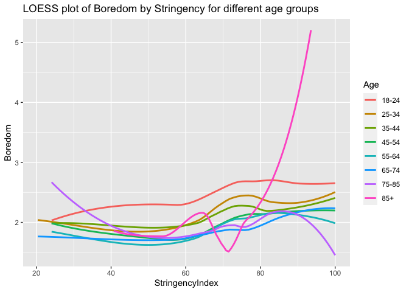<!-- -->
GAM
plot

``` r
plot_bor + stat_smooth(aes(group=age), se = FALSE, method = "gam", formula = y ~ x, size = 1, na.rm=TRUE) + scale_colour_discrete(name = "Age", 
labels = c("18-24", "25-34", "35-44", "45-54", "55-64", "65-74", "75-85", "85+")) + labs(title="GAM plot of Boredom by Stringency for different age groups", y ="Boredom")
```

<!-- -->

Plot Boredom by Date for different age groups / lot of missing data in
Boredom

``` r
plot_bor2 <- ggplot(data = data_long_min3_strc, aes(x = Date, y = Bored, group = ID, color = age))

plot_bor2 + stat_smooth(aes(group=age), se = FALSE, method = "loess", formula = y ~ x, size = 1, na.rm=TRUE) + scale_colour_discrete(name = "Age", 
labels = c("18-24", "25-34", "35-44", "45-54", "55-64", "65-74", "75-85", "85+")) + labs(title="LOESS plot of Boredom by Date for different age groups", y ="Boredom")
```

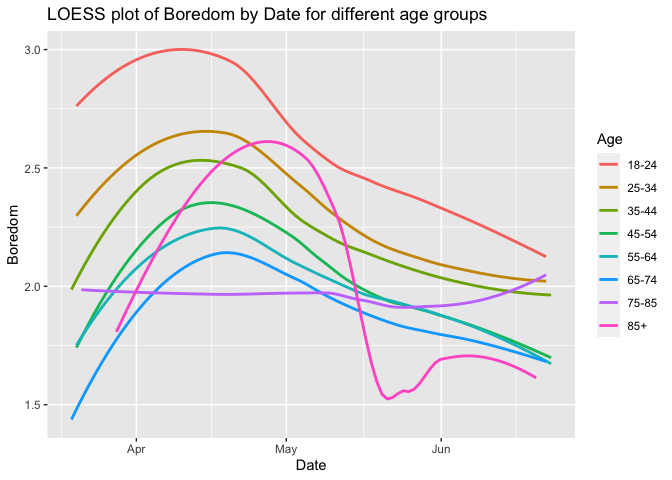<!-- -->
GAM
plot

``` r
plot_bor2 + stat_smooth(aes(group=age), se = FALSE, method = "gam", formula = y ~ x, size = 1, na.rm=TRUE) + scale_colour_discrete(name = "Age", 
labels = c("18-24", "25-34", "35-44", "45-54", "55-64", "65-74", "75-85", "85+")) + labs(title="GAM plot of Boredom by Date for different age groups", y ="Boredom")
```

<!-- -->

# Calm

Multilevel random
intercept

``` r
model.calm0 <- lmer(Calm ~ 1 + (1 | Country/ID), data=data_long_min3_strc, na.action=na.exclude)
summary(model.calm0)
```

    ## Linear mixed model fit by REML. t-tests use Satterthwaite's method [
    ## lmerModLmerTest]
    ## Formula: Calm ~ 1 + (1 | Country/ID)
    ##    Data: data_long_min3_strc
    ## 
    ## REML criterion at convergence: 102586.8
    ## 
    ## Scaled residuals: 
    ##     Min      1Q  Median      3Q     Max 
    ## -4.2465 -0.5750  0.0548  0.5865  3.6866 
    ## 
    ## Random effects:
    ##  Groups     Name        Variance Std.Dev.
    ##  ID:Country (Intercept) 0.56728  0.7532  
    ##  Country    (Intercept) 0.03549  0.1884  
    ##  Residual               0.51390  0.7169  
    ## Number of obs: 39904, groups:  ID:Country, 9177; Country, 58
    ## 
    ## Fixed effects:
    ##             Estimate Std. Error       df t value Pr(>|t|)    
    ## (Intercept)  3.06198    0.03277 42.41198   93.44   <2e-16 ***
    ## ---
    ## Signif. codes:  0 '***' 0.001 '**' 0.01 '*' 0.05 '.' 0.1 ' ' 1

Using two level models Predicted by
stringency

``` r
model.calm1 <- lmer(Calm ~ StringencyIndex + (1 | ID), data=data_long_min3_strc, na.action=na.exclude)
summary(model.calm1)
```

    ## Linear mixed model fit by REML. t-tests use Satterthwaite's method [
    ## lmerModLmerTest]
    ## Formula: Calm ~ StringencyIndex + (1 | ID)
    ##    Data: data_long_min3_strc
    ## 
    ## REML criterion at convergence: 103003.8
    ## 
    ## Scaled residuals: 
    ##     Min      1Q  Median      3Q     Max 
    ## -4.2319 -0.5828  0.0270  0.5936  3.6487 
    ## 
    ## Random effects:
    ##  Groups   Name        Variance Std.Dev.
    ##  ID       (Intercept) 0.6097   0.7808  
    ##  Residual             0.5138   0.7168  
    ## Number of obs: 39882, groups:  ID, 9171
    ## 
    ## Fixed effects:
    ##                  Estimate Std. Error        df t value Pr(>|t|)    
    ## (Intercept)     2.908e+00  4.609e-02 3.719e+04  63.105  < 2e-16 ***
    ## StringencyIndex 1.578e-03  5.728e-04 3.825e+04   2.754  0.00589 ** 
    ## ---
    ## Signif. codes:  0 '***' 0.001 '**' 0.01 '*' 0.05 '.' 0.1 ' ' 1
    ## 
    ## Correlation of Fixed Effects:
    ##             (Intr)
    ## StrngncyInd -0.981

``` r
model.calm2 <- lmer(Calm ~ StringencyIndex + age + (1 | ID), data=data_long_min3_strc, na.action=na.exclude)
summary(model.calm2)
```

    ## Linear mixed model fit by REML. t-tests use Satterthwaite's method [
    ## lmerModLmerTest]
    ## Formula: Calm ~ StringencyIndex + age + (1 | ID)
    ##    Data: data_long_min3_strc
    ## 
    ## REML criterion at convergence: 102819.9
    ## 
    ## Scaled residuals: 
    ##     Min      1Q  Median      3Q     Max 
    ## -4.2192 -0.5754  0.0304  0.5888  3.6738 
    ## 
    ## Random effects:
    ##  Groups   Name        Variance Std.Dev.
    ##  ID       (Intercept) 0.5930   0.7701  
    ##  Residual             0.5138   0.7168  
    ## Number of obs: 39882, groups:  ID, 9171
    ## 
    ## Fixed effects:
    ##                   Estimate Std. Error         df t value Pr(>|t|)    
    ## (Intercept)      2.833e+00  5.254e-02  3.044e+04  53.922  < 2e-16 ***
    ## StringencyIndex  1.840e-03  5.722e-04  3.818e+04   3.216 0.001302 ** 
    ## age2            -4.067e-02  3.145e-02  9.137e+03  -1.293 0.195988    
    ## age3            -6.238e-02  3.193e-02  9.156e+03  -1.953 0.050815 .  
    ## age4             4.070e-02  3.217e-02  9.155e+03   1.265 0.205855    
    ## age5             1.117e-01  3.261e-02  9.131e+03   3.427 0.000614 ***
    ## age6             3.237e-01  3.504e-02  9.160e+03   9.240  < 2e-16 ***
    ## age7             4.435e-01  7.024e-02  9.015e+03   6.314 2.85e-10 ***
    ## age8             4.422e-01  2.692e-01  9.072e+03   1.643 0.100465    
    ## ---
    ## Signif. codes:  0 '***' 0.001 '**' 0.01 '*' 0.05 '.' 0.1 ' ' 1
    ## 
    ## Correlation of Fixed Effects:
    ##             (Intr) StrngI age2   age3   age4   age5   age6   age7  
    ## StrngncyInd -0.887                                                 
    ## age2        -0.393  0.042                                          
    ## age3        -0.399  0.054  0.588                                   
    ## age4        -0.396  0.054  0.583  0.575                            
    ## age5        -0.386  0.048  0.575  0.567  0.563                     
    ## age6        -0.371  0.058  0.536  0.529  0.525  0.517              
    ## age7        -0.195  0.040  0.268  0.264  0.262  0.259  0.241       
    ## age8        -0.057  0.018  0.070  0.069  0.069  0.068  0.063  0.032

``` r
model.calm3 <- lmer(Calm ~ StringencyIndex + age + StringencyIndex*age + (1 | ID), data=data_long_min3_strc, na.action=na.exclude)
print(summary(model.calm3), digits=2)
```

    ## Linear mixed model fit by REML. t-tests use Satterthwaite's method [
    ## lmerModLmerTest]
    ## Formula: Calm ~ StringencyIndex + age + StringencyIndex * age + (1 | ID)
    ##    Data: data_long_min3_strc
    ## 
    ## REML criterion at convergence: 102868.2
    ## 
    ## Scaled residuals: 
    ##    Min     1Q Median     3Q    Max 
    ##  -4.22  -0.58   0.04   0.59   3.68 
    ## 
    ## Random effects:
    ##  Groups   Name        Variance Std.Dev.
    ##  ID       (Intercept) 0.59     0.77    
    ##  Residual             0.51     0.72    
    ## Number of obs: 39882, groups:  ID, 9171
    ## 
    ## Fixed effects:
    ##                      Estimate Std. Error       df t value Pr(>|t|)    
    ## (Intercept)           2.9e+00    1.2e-01  3.7e+04    25.3   <2e-16 ***
    ## StringencyIndex       4.1e-04    1.4e-03  3.8e+04     0.3    0.770    
    ## age2                 -2.6e-01    1.5e-01  3.6e+04    -1.7    0.094 .  
    ## age3                 -5.4e-01    1.6e-01  3.7e+04    -3.3    9e-04 ***
    ## age4                  8.0e-03    1.6e-01  3.8e+04     0.1    0.960    
    ## age5                  1.3e-02    1.7e-01  3.7e+04     0.1    0.936    
    ## age6                  4.8e-01    1.7e-01  3.7e+04     2.8    0.005 ** 
    ## age7                  1.0e+00    4.1e-01  3.6e+04     2.5    0.012 *  
    ## age8                  3.0e-01    1.3e+00  2.8e+04     0.2    0.818    
    ## StringencyIndex:age2  2.7e-03    1.9e-03  3.7e+04     1.4    0.149    
    ## StringencyIndex:age3  6.0e-03    2.0e-03  3.8e+04     3.0    0.003 ** 
    ## StringencyIndex:age4  3.6e-04    2.0e-03  3.9e+04     0.2    0.854    
    ## StringencyIndex:age5  1.2e-03    2.0e-03  3.8e+04     0.6    0.552    
    ## StringencyIndex:age6 -2.1e-03    2.2e-03  3.8e+04    -1.0    0.324    
    ## StringencyIndex:age7 -8.0e-03    5.3e-03  3.7e+04    -1.5    0.135    
    ## StringencyIndex:age8  1.7e-03    1.8e-02  3.0e+04     0.1    0.923    
    ## ---
    ## Signif. codes:  0 '***' 0.001 '**' 0.01 '*' 0.05 '.' 0.1 ' ' 1

    ## 
    ## Correlation matrix not shown by default, as p = 16 > 12.
    ## Use print(summary(model.calm3), correlation=TRUE)  or
    ##     vcov(summary(model.calm3))        if you need it

LOESS plot calm and stringency for different age
groups

``` r
plot_calm <- ggplot(data = data_long_min3_strc, aes(x = StringencyIndex, y = Calm, group = ID, color = age))

plot_calm + stat_smooth(aes(group=age), se = FALSE, method = "loess", formula = y ~ x, size = 1, na.rm=TRUE) + scale_colour_discrete(name = "Age", 
labels = c("18-24", "25-34", "35-44", "45-54", "55-64", "65-74", "75-85", "85+")) + labs(title="LOESS plot of Calm by Stringency for different age groups", y ="Calm")
```

<!-- -->

GAM
plot

``` r
plot_calm + stat_smooth(aes(group=age), se = FALSE, method = "gam", formula = y ~ x, size = 1) + scale_colour_discrete(name = "Age", 
labels = c("18-24", "25-34", "35-44", "45-54", "55-64", "65-74", "75-85", "85+")) + labs(title="GAM plot of Calm by Stringency for different age groups", y ="Calm")
```

    ## Warning: Removed 33534 rows containing non-finite values (stat_smooth).

<!-- -->

LOESS plot calm and date for different age
groups

``` r
plot_calm2 <- ggplot(data = data_long_min3_strc, aes(x = Date, y = Calm, group = ID, color = age))

plot_calm2 + stat_smooth(aes(group=age), se = FALSE, method = "loess", formula = y ~ x, size = 1, na.rm=TRUE) + scale_colour_discrete(name = "Age", 
labels = c("18-24", "25-34", "35-44", "45-54", "55-64", "65-74", "75-85", "85+")) + labs(title="LOESS plot of Calm by Date for different age groups", y ="Calm")
```

<!-- -->

GAM
plot

``` r
plot_calm2 + stat_smooth(aes(group=age), se = FALSE, method = "gam", formula = y ~ x, size = 1) + scale_colour_discrete(name = "Age", 
labels = c("18-24", "25-34", "35-44", "45-54", "55-64", "65-74", "75-85", "85+")) + labs(title="GAM plot of Calm by Date for different age groups", y ="Calm")
```

    ## Warning: Removed 33512 rows containing non-finite values (stat_smooth).

<!-- -->
\#\#\#\#\#\#\#\#\#\#\#\#\#\#\#\#\#\#\#\#\#\#\# Depressed
\#\#\#\#\#\#\#\#\#\#\#\#\#\#\#\#\#\#\#\#\#\#\# Multilevel depressed
random
intercept

``` r
model.depr0 <- lmer(Depr ~ 1 + (1 | Country/ID), data=data_long_min3_strc, na.action=na.exclude)
summary(model.depr0)
```

    ## Linear mixed model fit by REML. t-tests use Satterthwaite's method [
    ## lmerModLmerTest]
    ## Formula: Depr ~ 1 + (1 | Country/ID)
    ##    Data: data_long_min3_strc
    ## 
    ## REML criterion at convergence: 104270.4
    ## 
    ## Scaled residuals: 
    ##     Min      1Q  Median      3Q     Max 
    ## -3.8759 -0.5129 -0.1594  0.5188  4.7427 
    ## 
    ## Random effects:
    ##  Groups     Name        Variance Std.Dev.
    ##  ID:Country (Intercept) 0.7369   0.8584  
    ##  Country    (Intercept) 0.0445   0.2109  
    ##  Residual               0.5099   0.7141  
    ## Number of obs: 39877, groups:  ID:Country, 9174; Country, 58
    ## 
    ## Fixed effects:
    ##             Estimate Std. Error       df t value Pr(>|t|)    
    ## (Intercept)  2.11235    0.03665 33.92375   57.64   <2e-16 ***
    ## ---
    ## Signif. codes:  0 '***' 0.001 '**' 0.01 '*' 0.05 '.' 0.1 ' ' 1

Using two level models Predicted by
stringency

``` r
model.depr1 <- lmer(Depr ~ StringencyIndex + (1 | ID), data=data_long_min3_strc, na.action=na.exclude)
summary(model.depr1)
```

    ## Linear mixed model fit by REML. t-tests use Satterthwaite's method [
    ## lmerModLmerTest]
    ## Formula: Depr ~ StringencyIndex + (1 | ID)
    ##    Data: data_long_min3_strc
    ## 
    ## REML criterion at convergence: 104432.2
    ## 
    ## Scaled residuals: 
    ##     Min      1Q  Median      3Q     Max 
    ## -3.8839 -0.5127 -0.1726  0.4964  4.7306 
    ## 
    ## Random effects:
    ##  Groups   Name        Variance Std.Dev.
    ##  ID       (Intercept) 0.7656   0.8750  
    ##  Residual             0.5097   0.7139  
    ## Number of obs: 39855, groups:  ID, 9168
    ## 
    ## Fixed effects:
    ##                  Estimate Std. Error        df t value Pr(>|t|)    
    ## (Intercept)     1.895e+00  4.743e-02 3.854e+04  39.954  < 2e-16 ***
    ## StringencyIndex 2.113e-03  5.878e-04 3.938e+04   3.594 0.000326 ***
    ## ---
    ## Signif. codes:  0 '***' 0.001 '**' 0.01 '*' 0.05 '.' 0.1 ' ' 1
    ## 
    ## Correlation of Fixed Effects:
    ##             (Intr)
    ## StrngncyInd -0.978

``` r
model.depr2 <- lmer(Depr ~ StringencyIndex + age + (1 | ID), data=data_long_min3_strc, na.action=na.exclude)
summary(model.depr2)
```

    ## Linear mixed model fit by REML. t-tests use Satterthwaite's method [
    ## lmerModLmerTest]
    ## Formula: Depr ~ StringencyIndex + age + (1 | ID)
    ##    Data: data_long_min3_strc
    ## 
    ## REML criterion at convergence: 103940.4
    ## 
    ## Scaled residuals: 
    ##     Min      1Q  Median      3Q     Max 
    ## -3.8879 -0.5181 -0.1488  0.5162  4.7096 
    ## 
    ## Random effects:
    ##  Groups   Name        Variance Std.Dev.
    ##  ID       (Intercept) 0.7164   0.8464  
    ##  Residual             0.5097   0.7140  
    ## Number of obs: 39855, groups:  ID, 9168
    ## 
    ## Fixed effects:
    ##                   Estimate Std. Error         df t value Pr(>|t|)    
    ## (Intercept)      2.296e+00  5.436e-02  3.118e+04  42.240  < 2e-16 ***
    ## StringencyIndex  1.314e-03  5.845e-04  3.919e+04   2.249   0.0245 *  
    ## age2            -1.720e-01  3.402e-02  9.119e+03  -5.057 4.35e-07 ***
    ## age3            -2.863e-01  3.454e-02  9.137e+03  -8.290  < 2e-16 ***
    ## age4            -3.552e-01  3.479e-02  9.134e+03 -10.210  < 2e-16 ***
    ## age5            -4.913e-01  3.528e-02  9.115e+03 -13.926  < 2e-16 ***
    ## age6            -7.445e-01  3.792e-02  9.150e+03 -19.636  < 2e-16 ***
    ## age7            -7.909e-01  7.603e-02  9.028e+03 -10.402  < 2e-16 ***
    ## age8            -8.739e-01  2.912e-01  9.059e+03  -3.001   0.0027 ** 
    ## ---
    ## Signif. codes:  0 '***' 0.001 '**' 0.01 '*' 0.05 '.' 0.1 ' ' 1
    ## 
    ## Correlation of Fixed Effects:
    ##             (Intr) StrngI age2   age3   age4   age5   age6   age7  
    ## StrngncyInd -0.876                                                 
    ## age2        -0.407  0.039                                          
    ## age3        -0.411  0.051  0.588                                   
    ## age4        -0.408  0.051  0.583  0.575                            
    ## age5        -0.398  0.045  0.575  0.567  0.563                     
    ## age6        -0.382  0.055  0.536  0.528  0.524  0.517              
    ## age7        -0.199  0.037  0.267  0.264  0.262  0.258  0.241       
    ## age8        -0.058  0.016  0.070  0.069  0.069  0.068  0.063  0.032

``` r
model.depr3 <- lmer(Depr ~ StringencyIndex + age + StringencyIndex*age + (1 | ID), data=data_long_min3_strc, na.action=na.exclude)
print(summary(model.depr3), digits=2)
```

    ## Linear mixed model fit by REML. t-tests use Satterthwaite's method [
    ## lmerModLmerTest]
    ## Formula: Depr ~ StringencyIndex + age + StringencyIndex * age + (1 | ID)
    ##    Data: data_long_min3_strc
    ## 
    ## REML criterion at convergence: 104000
    ## 
    ## Scaled residuals: 
    ##    Min     1Q Median     3Q    Max 
    ##  -3.89  -0.52  -0.15   0.52   4.72 
    ## 
    ## Random effects:
    ##  Groups   Name        Variance Std.Dev.
    ##  ID       (Intercept) 0.72     0.85    
    ##  Residual             0.51     0.71    
    ## Number of obs: 39855, groups:  ID, 9168
    ## 
    ## Fixed effects:
    ##                      Estimate Std. Error       df t value Pr(>|t|)    
    ## (Intercept)           2.2e+00    1.2e-01  3.8e+04    18.3   <2e-16 ***
    ## StringencyIndex       2.7e-03    1.4e-03  3.9e+04     1.9     0.06 .  
    ## age2                  7.8e-02    1.6e-01  3.8e+04     0.5     0.62    
    ## age3                 -2.2e-02    1.7e-01  3.8e+04    -0.1     0.90    
    ## age4                 -2.7e-01    1.6e-01  3.9e+04    -1.6     0.10 .  
    ## age5                 -4.0e-01    1.7e-01  3.8e+04    -2.4     0.02 *  
    ## age6                 -8.6e-01    1.8e-01  3.8e+04    -4.8    2e-06 ***
    ## age7                 -6.6e-01    4.3e-01  3.7e+04    -1.5     0.12    
    ## age8                 -2.6e+00    1.4e+00  3.1e+04    -1.9     0.06 .  
    ## StringencyIndex:age2 -3.1e-03    1.9e-03  3.9e+04    -1.6     0.10    
    ## StringencyIndex:age3 -3.3e-03    2.0e-03  3.9e+04    -1.6     0.10    
    ## StringencyIndex:age4 -1.0e-03    2.0e-03  4.0e+04    -0.5     0.61    
    ## StringencyIndex:age5 -1.1e-03    2.1e-03  3.9e+04    -0.5     0.60    
    ## StringencyIndex:age6  1.5e-03    2.2e-03  3.9e+04     0.7     0.49    
    ## StringencyIndex:age7 -1.6e-03    5.5e-03  3.8e+04    -0.3     0.77    
    ## StringencyIndex:age8  2.3e-02    1.8e-02  3.2e+04     1.3     0.21    
    ## ---
    ## Signif. codes:  0 '***' 0.001 '**' 0.01 '*' 0.05 '.' 0.1 ' ' 1

    ## 
    ## Correlation matrix not shown by default, as p = 16 > 12.
    ## Use print(summary(model.depr3), correlation=TRUE)  or
    ##     vcov(summary(model.depr3))        if you need it

LOESS plot depressed and stringency for different age
groups

``` r
plot_depr <- ggplot(data = data_long_min3_strc, aes(x = StringencyIndex, y = Depr, group = ID, color = age))

plot_depr + stat_smooth(aes(group=age), se = FALSE, method = "loess", formula = y ~ x, size = 1, na.rm=TRUE) + scale_colour_discrete(name = "Age", 
labels = c("18-24", "25-34", "35-44", "45-54", "55-64", "65-74", "75-85", "85+")) + labs(title="LOESS plot of Depressed by Stringency for different age groups", y ="Depr")
```

<!-- -->
GAM
plot

``` r
plot_depr + stat_smooth(aes(group=age), se = FALSE, method = "gam", formula = y ~ x, size = 1, na.rm=TRUE) + scale_colour_discrete(name = "Age", 
labels = c("18-24", "25-34", "35-44", "45-54", "55-64", "65-74", "75-85", "85+")) + labs(title="GAM plot of Depressed by Stringency for different age groups", y ="Depr")
```

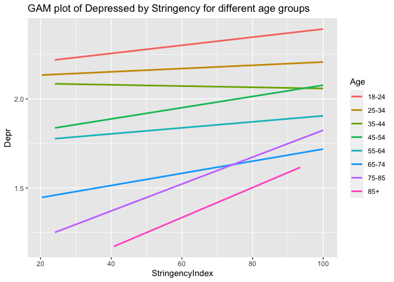<!-- -->

LOESS plot depressed and stringency for different age
groups

``` r
plot_depr2 <- ggplot(data = data_long_min3_strc, aes(x = Date, y = Depr, group = ID, color = age))

plot_depr2 + stat_smooth(aes(group=age), se = FALSE, method = "loess", formula = y ~ x, size = 1, na.rm=TRUE) + scale_colour_discrete(name = "Age", 
labels = c("18-24", "25-34", "35-44", "45-54", "55-64", "65-74", "75-85", "85+")) + labs(title="LOESS plot of Depressed by Date for different age groups", y ="Depr")
```

<!-- -->
GAM
plot

``` r
plot_depr2 + stat_smooth(aes(group=age), se = FALSE, method = "gam", formula = y ~ x, size = 1, na.rm=TRUE) + scale_colour_discrete(name = "Age", 
labels = c("18-24", "25-34", "35-44", "45-54", "55-64", "65-74", "75-85", "85+")) + labs(title="GAM plot of Depressed by Date for different age groups", y ="Depr")
```

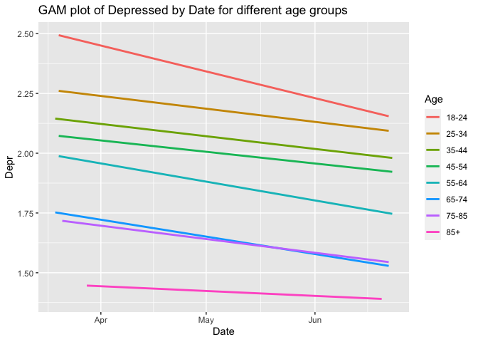<!-- -->
\#\#\#\#\#\#\#\#\#\#\#\#\#\#\#\#\#\#\#\#\#\#\# Energetic
\#\#\#\#\#\#\#\#\#\#\#\#\#\#\#\#\#\#\#\#\#\#\# Multilevel random
intercept

``` r
model.energ0 <- lmer(Energ ~ 1 + (1 | Country/ID), data=data_long_min3_strc, na.action=na.exclude)
summary(model.energ0)
```

    ## Linear mixed model fit by REML. t-tests use Satterthwaite's method [
    ## lmerModLmerTest]
    ## Formula: Energ ~ 1 + (1 | Country/ID)
    ##    Data: data_long_min3_strc
    ## 
    ## REML criterion at convergence: 102434.8
    ## 
    ## Scaled residuals: 
    ##     Min      1Q  Median      3Q     Max 
    ## -4.1928 -0.5800  0.0154  0.5802  4.1271 
    ## 
    ## Random effects:
    ##  Groups     Name        Variance Std.Dev.
    ##  ID:Country (Intercept) 0.53379  0.7306  
    ##  Country    (Intercept) 0.05895  0.2428  
    ##  Residual               0.52024  0.7213  
    ## Number of obs: 39856, groups:  ID:Country, 9177; Country, 58
    ## 
    ## Fixed effects:
    ##             Estimate Std. Error       df t value Pr(>|t|)    
    ## (Intercept)  2.66645    0.03964 51.88677   67.27   <2e-16 ***
    ## ---
    ## Signif. codes:  0 '***' 0.001 '**' 0.01 '*' 0.05 '.' 0.1 ' ' 1

Using two level models Predicted by
stringency

``` r
model.energ1 <- lmer(Energ ~ StringencyIndex + (1 | ID), data=data_long_min3_strc, na.action=na.exclude)
summary(model.energ1)
```

    ## Linear mixed model fit by REML. t-tests use Satterthwaite's method [
    ## lmerModLmerTest]
    ## Formula: Energ ~ StringencyIndex + (1 | ID)
    ##    Data: data_long_min3_strc
    ## 
    ## REML criterion at convergence: 103443.3
    ## 
    ## Scaled residuals: 
    ##     Min      1Q  Median      3Q     Max 
    ## -4.1198 -0.5566  0.0680  0.5756  4.0158 
    ## 
    ## Random effects:
    ##  Groups   Name        Variance Std.Dev.
    ##  ID       (Intercept) 0.6220   0.7887  
    ##  Residual             0.5203   0.7213  
    ## Number of obs: 39834, groups:  ID, 9171
    ## 
    ## Fixed effects:
    ##                  Estimate Std. Error        df t value Pr(>|t|)    
    ## (Intercept)     2.582e+00  4.647e-02 3.720e+04  55.561   <2e-16 ***
    ## StringencyIndex 2.390e-04  5.775e-04 3.824e+04   0.414    0.679    
    ## ---
    ## Signif. codes:  0 '***' 0.001 '**' 0.01 '*' 0.05 '.' 0.1 ' ' 1
    ## 
    ## Correlation of Fixed Effects:
    ##             (Intr)
    ## StrngncyInd -0.981

``` r
model.energ2 <- lmer(Energ ~ StringencyIndex + age + (1 | ID), data=data_long_min3_strc, na.action=na.exclude)
summary(model.energ2)
```

    ## Linear mixed model fit by REML. t-tests use Satterthwaite's method [
    ## lmerModLmerTest]
    ## Formula: Energ ~ StringencyIndex + age + (1 | ID)
    ##    Data: data_long_min3_strc
    ## 
    ## REML criterion at convergence: 103439.6
    ## 
    ## Scaled residuals: 
    ##     Min      1Q  Median      3Q     Max 
    ## -4.1385 -0.5748  0.0644  0.5735  4.0235 
    ## 
    ## Random effects:
    ##  Groups   Name        Variance Std.Dev.
    ##  ID       (Intercept) 0.6197   0.7872  
    ##  Residual             0.5203   0.7213  
    ## Number of obs: 39834, groups:  ID, 9171
    ## 
    ## Fixed effects:
    ##                   Estimate Std. Error         df t value Pr(>|t|)    
    ## (Intercept)      2.594e+00  5.322e-02  3.057e+04  48.743   <2e-16 ***
    ## StringencyIndex  2.786e-04  5.787e-04  3.833e+04   0.481   0.6302    
    ## age2            -4.925e-02  3.206e-02  9.152e+03  -1.536   0.1246    
    ## age3            -7.662e-02  3.255e-02  9.172e+03  -2.353   0.0186 *  
    ## age4            -4.139e-02  3.279e-02  9.171e+03  -1.262   0.2069    
    ## age5             1.546e-02  3.325e-02  9.150e+03   0.465   0.6420    
    ## age6             8.783e-02  3.573e-02  9.186e+03   2.458   0.0140 *  
    ## age7             1.053e-01  7.166e-02  9.057e+03   1.469   0.1419    
    ## age8             2.020e-01  2.744e-01  9.087e+03   0.736   0.4616    
    ## ---
    ## Signif. codes:  0 '***' 0.001 '**' 0.01 '*' 0.05 '.' 0.1 ' ' 1
    ## 
    ## Correlation of Fixed Effects:
    ##             (Intr) StrngI age2   age3   age4   age5   age6   age7  
    ## StrngncyInd -0.886                                                 
    ## age2        -0.395  0.041                                          
    ## age3        -0.400  0.054  0.588                                   
    ## age4        -0.397  0.053  0.583  0.575                            
    ## age5        -0.387  0.047  0.575  0.567  0.563                     
    ## age6        -0.372  0.057  0.536  0.528  0.525  0.517              
    ## age7        -0.195  0.040  0.268  0.264  0.262  0.258  0.241       
    ## age8        -0.057  0.017  0.070  0.069  0.069  0.068  0.063  0.032

``` r
model.energ3 <- lmer(Energ ~ StringencyIndex + age + StringencyIndex*age + (1 | ID), data=data_long_min3_strc, na.action=na.exclude)
print(summary(model.energ3), digits=2)
```

    ## Linear mixed model fit by REML. t-tests use Satterthwaite's method [
    ## lmerModLmerTest]
    ## Formula: Energ ~ StringencyIndex + age + StringencyIndex * age + (1 |      ID)
    ##    Data: data_long_min3_strc
    ## 
    ## REML criterion at convergence: 103479.3
    ## 
    ## Scaled residuals: 
    ##    Min     1Q Median     3Q    Max 
    ##  -4.14  -0.57   0.06   0.58   4.03 
    ## 
    ## Random effects:
    ##  Groups   Name        Variance Std.Dev.
    ##  ID       (Intercept) 0.62     0.79    
    ##  Residual             0.52     0.72    
    ## Number of obs: 39834, groups:  ID, 9171
    ## 
    ## Fixed effects:
    ##                      Estimate Std. Error       df t value Pr(>|t|)    
    ## (Intercept)           2.5e+00    1.2e-01  3.7e+04    21.5   <2e-16 ***
    ## StringencyIndex       1.0e-03    1.4e-03  3.8e+04     0.7    0.474    
    ## age2                 -2.1e-01    1.6e-01  3.6e+04    -1.4    0.170    
    ## age3                 -2.5e-01    1.6e-01  3.7e+04    -1.5    0.127    
    ## age4                  6.8e-02    1.6e-01  3.8e+04     0.4    0.674    
    ## age5                  2.4e-01    1.7e-01  3.7e+04     1.4    0.155    
    ## age6                  5.1e-01    1.8e-01  3.8e+04     2.9    0.004 ** 
    ## age7                  1.4e+00    4.2e-01  3.6e+04     3.4    7e-04 ***
    ## age8                  8.2e-01    1.3e+00  2.9e+04     0.6    0.543    
    ## StringencyIndex:age2  2.1e-03    1.9e-03  3.8e+04     1.1    0.268    
    ## StringencyIndex:age3  2.3e-03    2.0e-03  3.8e+04     1.1    0.264    
    ## StringencyIndex:age4 -1.4e-03    2.0e-03  3.9e+04    -0.7    0.491    
    ## StringencyIndex:age5 -2.8e-03    2.0e-03  3.8e+04    -1.4    0.172    
    ## StringencyIndex:age6 -5.3e-03    2.2e-03  3.9e+04    -2.5    0.014 *  
    ## StringencyIndex:age7 -1.7e-02    5.4e-03  3.7e+04    -3.2    0.001 ** 
    ## StringencyIndex:age8 -8.3e-03    1.8e-02  3.0e+04    -0.5    0.643    
    ## ---
    ## Signif. codes:  0 '***' 0.001 '**' 0.01 '*' 0.05 '.' 0.1 ' ' 1

    ## 
    ## Correlation matrix not shown by default, as p = 16 > 12.
    ## Use print(summary(model.energ3), correlation=TRUE)  or
    ##     vcov(summary(model.energ3))        if you need it

LOESS plot energetic and stringency for different age
groups

``` r
plot_energ <- ggplot(data = data_long_min3_strc, aes(x = StringencyIndex, y = Energ, group = ID, color = age))

plot_energ + stat_smooth(aes(group=age), se = FALSE, method = "loess", formula = y ~ x, size = 1, na.rm=TRUE) + scale_colour_discrete(name = "Age", 
labels = c("18-24", "25-34", "35-44", "45-54", "55-64", "65-74", "75-85", "85+")) + labs(title="LOESS plot of Energetic by Stringency for different age groups", y ="Energ")
```

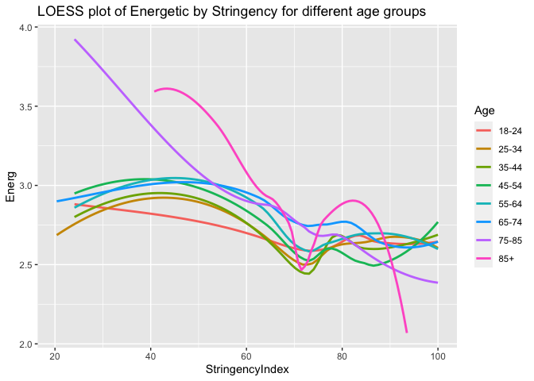<!-- -->
GAM
plot

``` r
plot_energ + stat_smooth(aes(group=age), se = FALSE, method = "gam", formula = y ~ x, size = 1, na.rm=TRUE) + scale_colour_discrete(name = "Age", 
labels = c("18-24", "25-34", "35-44", "45-54", "55-64", "65-74", "75-85", "85+")) + labs(title="GAM plot of Energetic by Stringency for different age groups", y ="Energ")
```

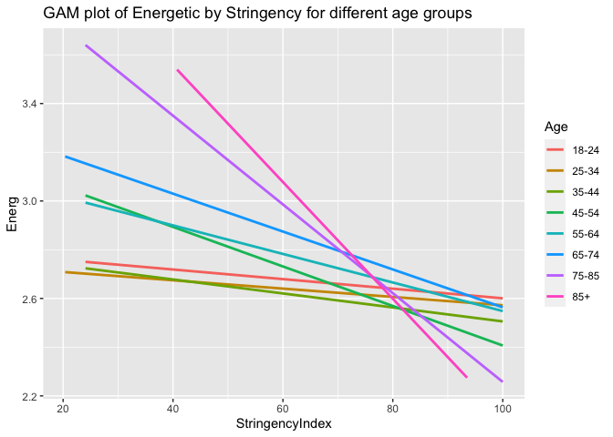<!-- -->

LOESS plot energetic and date for different age
groups

``` r
plot_energ2 <- ggplot(data = data_long_min3_strc, aes(x = Date, y = Energ, group = ID, color = age))

plot_energ2 + stat_smooth(aes(group=age), se = FALSE, method = "loess", formula = y ~ x, size = 1, na.rm=TRUE) + scale_colour_discrete(name = "Age", 
labels = c("18-24", "25-34", "35-44", "45-54", "55-64", "65-74", "75-85", "85+")) + labs(title="LOESS plot of Energetic by Date for different age groups", y ="Energ")
```

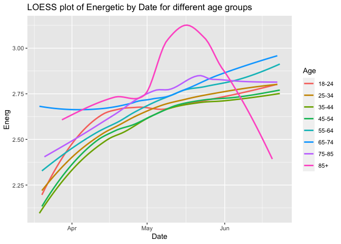<!-- -->
GAM
plot

``` r
plot_energ2 + stat_smooth(aes(group=age), se = FALSE, method = "gam", formula = y ~ x, size = 1, na.rm=TRUE) + scale_colour_discrete(name = "Age", 
labels = c("18-24", "25-34", "35-44", "45-54", "55-64", "65-74", "75-85", "85+")) + labs(title="GAM plot of Energetic by Date for different age groups", y ="Energ")
```

<!-- -->

# Exhausted

Multilevel random
intercept

``` r
model.exh0 <- lmer(Exh ~ 1 + (1 | Country/ID), data=data_long_min3_strc, na.action=na.exclude)
summary(model.exh0)
```

    ## Linear mixed model fit by REML. t-tests use Satterthwaite's method [
    ## lmerModLmerTest]
    ## Formula: Exh ~ 1 + (1 | Country/ID)
    ##    Data: data_long_min3_strc
    ## 
    ## REML criterion at convergence: 112136.3
    ## 
    ## Scaled residuals: 
    ##     Min      1Q  Median      3Q     Max 
    ## -3.9955 -0.5706 -0.1526  0.5810  3.8396 
    ## 
    ## Random effects:
    ##  Groups     Name        Variance Std.Dev.
    ##  ID:Country (Intercept) 0.7550   0.8689  
    ##  Country    (Intercept) 0.0565   0.2377  
    ##  Residual               0.6480   0.8050  
    ## Number of obs: 39861, groups:  ID:Country, 9174; Country, 58
    ## 
    ## Fixed effects:
    ##             Estimate Std. Error       df t value Pr(>|t|)    
    ## (Intercept)  2.44728    0.04043 42.19746   60.53   <2e-16 ***
    ## ---
    ## Signif. codes:  0 '***' 0.001 '**' 0.01 '*' 0.05 '.' 0.1 ' ' 1

Using two level models Predicted by
stringency

``` r
model.exh1 <- lmer(Exh ~ StringencyIndex + (1 | ID), data=data_long_min3_strc, na.action=na.exclude)
summary(model.exh1)
```

    ## Linear mixed model fit by REML. t-tests use Satterthwaite's method [
    ## lmerModLmerTest]
    ## Formula: Exh ~ StringencyIndex + (1 | ID)
    ##    Data: data_long_min3_strc
    ## 
    ## REML criterion at convergence: 112369.8
    ## 
    ## Scaled residuals: 
    ##     Min      1Q  Median      3Q     Max 
    ## -3.9898 -0.5671 -0.1549  0.5759  3.8755 
    ## 
    ## Random effects:
    ##  Groups   Name        Variance Std.Dev.
    ##  ID       (Intercept) 0.7919   0.8899  
    ##  Residual             0.6481   0.8051  
    ## Number of obs: 39839, groups:  ID, 9168
    ## 
    ## Fixed effects:
    ##                  Estimate Std. Error        df t value Pr(>|t|)    
    ## (Intercept)     2.348e+00  5.201e-02 3.735e+04  45.135   <2e-16 ***
    ## StringencyIndex 1.701e-04  6.463e-04 3.838e+04   0.263    0.792    
    ## ---
    ## Signif. codes:  0 '***' 0.001 '**' 0.01 '*' 0.05 '.' 0.1 ' ' 1
    ## 
    ## Correlation of Fixed Effects:
    ##             (Intr)
    ## StrngncyInd -0.981

``` r
model.exh2 <- lmer(Exh ~ StringencyIndex + age + (1 | ID), data=data_long_min3_strc, na.action=na.exclude)
summary(model.exh2)
```

    ## Linear mixed model fit by REML. t-tests use Satterthwaite's method [
    ## lmerModLmerTest]
    ## Formula: Exh ~ StringencyIndex + age + (1 | ID)
    ##    Data: data_long_min3_strc
    ## 
    ## REML criterion at convergence: 111417.1
    ## 
    ## Scaled residuals: 
    ##     Min      1Q  Median      3Q     Max 
    ## -3.9526 -0.5642 -0.1500  0.5851  3.8782 
    ## 
    ## Random effects:
    ##  Groups   Name        Variance Std.Dev.
    ##  ID       (Intercept) 0.6954   0.8339  
    ##  Residual             0.6482   0.8051  
    ## Number of obs: 39839, groups:  ID, 9168
    ## 
    ## Fixed effects:
    ##                   Estimate Std. Error         df t value Pr(>|t|)    
    ## (Intercept)      2.743e+00  5.822e-02  3.006e+04  47.114  < 2e-16 ***
    ## StringencyIndex -7.648e-04  6.369e-04  3.764e+04  -1.201 0.229860    
    ## age2            -5.038e-02  3.428e-02  9.134e+03  -1.469 0.141767    
    ## age3            -1.187e-01  3.481e-02  9.154e+03  -3.409 0.000654 ***
    ## age4            -3.556e-01  3.507e-02  9.153e+03 -10.140  < 2e-16 ***
    ## age5            -5.873e-01  3.556e-02  9.128e+03 -16.519  < 2e-16 ***
    ## age6            -9.020e-01  3.822e-02  9.173e+03 -23.599  < 2e-16 ***
    ## age7            -9.549e-01  7.660e-02  9.032e+03 -12.466  < 2e-16 ***
    ## age8            -9.840e-01  2.934e-01  9.069e+03  -3.354 0.000800 ***
    ## ---
    ## Signif. codes:  0 '***' 0.001 '**' 0.01 '*' 0.05 '.' 0.1 ' ' 1
    ## 
    ## Correlation of Fixed Effects:
    ##             (Intr) StrngI age2   age3   age4   age5   age6   age7  
    ## StrngncyInd -0.891                                                 
    ## age2        -0.388  0.043                                          
    ## age3        -0.394  0.055  0.588                                   
    ## age4        -0.391  0.055  0.583  0.575                            
    ## age5        -0.381  0.049  0.575  0.567  0.563                     
    ## age6        -0.367  0.059  0.536  0.528  0.525  0.517              
    ## age7        -0.193  0.041  0.268  0.264  0.262  0.259  0.241       
    ## age8        -0.057  0.018  0.070  0.069  0.069  0.068  0.063  0.032

``` r
model.exh3 <- lmer(Exh ~ StringencyIndex + age + StringencyIndex*age + (1 | ID), data=data_long_min3_strc, na.action=na.exclude)
print(summary(model.exh3), digits=2)
```

    ## Linear mixed model fit by REML. t-tests use Satterthwaite's method [
    ## lmerModLmerTest]
    ## Formula: Exh ~ StringencyIndex + age + StringencyIndex * age + (1 | ID)
    ##    Data: data_long_min3_strc
    ## 
    ## REML criterion at convergence: 111474.5
    ## 
    ## Scaled residuals: 
    ##    Min     1Q Median     3Q    Max 
    ##  -3.95  -0.57  -0.15   0.58   3.86 
    ## 
    ## Random effects:
    ##  Groups   Name        Variance Std.Dev.
    ##  ID       (Intercept) 0.69     0.83    
    ##  Residual             0.65     0.81    
    ## Number of obs: 39839, groups:  ID, 9168
    ## 
    ## Fixed effects:
    ##                      Estimate Std. Error       df t value Pr(>|t|)    
    ## (Intercept)           2.7e+00    1.3e-01  3.6e+04    21.0   <2e-16 ***
    ## StringencyIndex      -5.3e-04    1.6e-03  3.8e+04    -0.3    0.733    
    ## age2                 -2.3e-02    1.7e-01  3.6e+04    -0.1    0.894    
    ## age3                  1.3e-01    1.8e-01  3.6e+04     0.7    0.482    
    ## age4                 -5.0e-01    1.8e-01  3.7e+04    -2.8    0.005 ** 
    ## age5                 -5.0e-01    1.8e-01  3.7e+04    -2.7    0.006 ** 
    ## age6                 -9.9e-01    1.9e-01  3.7e+04    -5.1    3e-07 ***
    ## age7                 -1.1e+00    4.6e-01  3.5e+04    -2.4    0.019 *  
    ## age8                 -4.0e+00    1.5e+00  2.7e+04    -2.7    0.006 ** 
    ## StringencyIndex:age2 -3.4e-04    2.1e-03  3.7e+04    -0.2    0.871    
    ## StringencyIndex:age3 -3.1e-03    2.2e-03  3.7e+04    -1.4    0.159    
    ## StringencyIndex:age4  1.8e-03    2.2e-03  3.8e+04     0.8    0.410    
    ## StringencyIndex:age5 -1.1e-03    2.2e-03  3.8e+04    -0.5    0.626    
    ## StringencyIndex:age6  1.1e-03    2.4e-03  3.8e+04     0.5    0.635    
    ## StringencyIndex:age7  1.8e-03    6.0e-03  3.6e+04     0.3    0.764    
    ## StringencyIndex:age8  4.1e-02    2.0e-02  2.9e+04     2.1    0.035 *  
    ## ---
    ## Signif. codes:  0 '***' 0.001 '**' 0.01 '*' 0.05 '.' 0.1 ' ' 1

    ## 
    ## Correlation matrix not shown by default, as p = 16 > 12.
    ## Use print(summary(model.exh3), correlation=TRUE)  or
    ##     vcov(summary(model.exh3))        if you need it

LOESS plot exhausted and stringency for different age
groups

``` r
plot_exh <- ggplot(data = data_long_min3_strc, aes(x = StringencyIndex, y = Exh, group = ID, color = age))

plot_exh + stat_smooth(aes(group=age), se = FALSE, method = "loess", formula = y ~ x, size = 1, na.rm=TRUE) + scale_colour_discrete(name = "Age", 
labels = c("18-24", "25-34", "35-44", "45-54", "55-64", "65-74", "75-85", "85+")) + labs(title="LOESS plot of Exhausted by Stringency for different age groups", y ="Exh")
```

<!-- -->
GAM
plot

``` r
plot_exh + stat_smooth(aes(group=age), se = FALSE, method = "gam", formula = y ~ x, size = 1, na.rm=TRUE) + scale_colour_discrete(name = "Age", 
labels = c("18-24", "25-34", "35-44", "45-54", "55-64", "65-74", "75-85", "85+")) + labs(title="GAM plot of Exhausted by Stringency for different age groups", y ="Exh")
```

<!-- -->

LOESS plot exhausted and date for different age
groups

``` r
plot_exh2 <- ggplot(data = data_long_min3_strc, aes(x = Date, y = Exh, group = ID, color = age))

plot_exh2 + stat_smooth(aes(group=age), se = FALSE, method = "loess", formula = y ~ x, size = 1, na.rm=TRUE) + scale_colour_discrete(name = "Age", 
labels = c("18-24", "25-34", "35-44", "45-54", "55-64", "65-74", "75-85", "85+")) + labs(title="LOESS plot of Exhausted by Date for different age groups", y ="Exh")
```

<!-- -->
GAM
plot

``` r
plot_exh2 + stat_smooth(aes(group=age), se = FALSE, method = "gam", formula = y ~ x, size = 1, na.rm=TRUE) + scale_colour_discrete(name = "Age", 
labels = c("18-24", "25-34", "35-44", "45-54", "55-64", "65-74", "75-85", "85+")) + labs(title="GAM plot of Exhausted by Date for different age groups", y ="Exh")
```

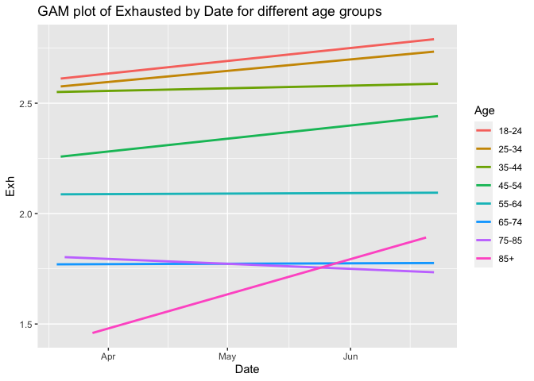<!-- -->

# Inspired

Multilevel random
intercept

``` r
model.insp0 <- lmer(Insp ~ 1 + (1 | Country/ID), data=data_long_min3_strc, na.action=na.exclude)
summary(model.insp0)
```

    ## Linear mixed model fit by REML. t-tests use Satterthwaite's method [
    ## lmerModLmerTest]
    ## Formula: Insp ~ 1 + (1 | Country/ID)
    ##    Data: data_long_min3_strc
    ## 
    ## REML criterion at convergence: 106503.7
    ## 
    ## Scaled residuals: 
    ##     Min      1Q  Median      3Q     Max 
    ## -3.7171 -0.5819 -0.0524  0.5908  3.8593 
    ## 
    ## Random effects:
    ##  Groups     Name        Variance Std.Dev.
    ##  ID:Country (Intercept) 0.60579  0.7783  
    ##  Country    (Intercept) 0.04979  0.2231  
    ##  Residual               0.57366  0.7574  
    ## Number of obs: 39844, groups:  ID:Country, 9177; Country, 58
    ## 
    ## Fixed effects:
    ##             Estimate Std. Error       df t value Pr(>|t|)    
    ## (Intercept)  2.52895    0.03763 48.52247   67.22   <2e-16 ***
    ## ---
    ## Signif. codes:  0 '***' 0.001 '**' 0.01 '*' 0.05 '.' 0.1 ' ' 1

Using two level models Predicted by
stringency

``` r
model.insp1 <- lmer(Insp ~ StringencyIndex + (1 | ID), data=data_long_min3_strc, na.action=na.exclude)
summary(model.insp1)
```

    ## Linear mixed model fit by REML. t-tests use Satterthwaite's method [
    ## lmerModLmerTest]
    ## Formula: Insp ~ StringencyIndex + (1 | ID)
    ##    Data: data_long_min3_strc
    ## 
    ## REML criterion at convergence: 107047.3
    ## 
    ## Scaled residuals: 
    ##     Min      1Q  Median      3Q     Max 
    ## -3.7003 -0.5683 -0.0859  0.5688  3.9053 
    ## 
    ## Random effects:
    ##  Groups   Name        Variance Std.Dev.
    ##  ID       (Intercept) 0.6610   0.8130  
    ##  Residual             0.5741   0.7577  
    ## Number of obs: 39822, groups:  ID, 9171
    ## 
    ## Fixed effects:
    ##                  Estimate Std. Error        df t value Pr(>|t|)    
    ## (Intercept)     2.383e+00  4.857e-02 3.690e+04  49.072   <2e-16 ***
    ## StringencyIndex 6.902e-04  6.039e-04 3.797e+04   1.143    0.253    
    ## ---
    ## Signif. codes:  0 '***' 0.001 '**' 0.01 '*' 0.05 '.' 0.1 ' ' 1
    ## 
    ## Correlation of Fixed Effects:
    ##             (Intr)
    ## StrngncyInd -0.981

``` r
model.insp2 <- lmer(Insp ~ StringencyIndex + age + (1 | ID), data=data_long_min3_strc, na.action=na.exclude)
summary(model.insp2)
```

    ## Linear mixed model fit by REML. t-tests use Satterthwaite's method [
    ## lmerModLmerTest]
    ## Formula: Insp ~ StringencyIndex + age + (1 | ID)
    ##    Data: data_long_min3_strc
    ## 
    ## REML criterion at convergence: 107070.1
    ## 
    ## Scaled residuals: 
    ##     Min      1Q  Median      3Q     Max 
    ## -3.7043 -0.5703 -0.0862  0.5693  3.9019 
    ## 
    ## Random effects:
    ##  Groups   Name        Variance Std.Dev.
    ##  ID       (Intercept) 0.6610   0.8130  
    ##  Residual             0.5741   0.7577  
    ## Number of obs: 39822, groups:  ID, 9171
    ## 
    ## Fixed effects:
    ##                   Estimate Std. Error         df t value Pr(>|t|)    
    ## (Intercept)      2.406e+00  5.557e-02  3.038e+04  43.295   <2e-16 ***
    ## StringencyIndex  6.467e-04  6.055e-04  3.809e+04   1.068    0.285    
    ## age2            -1.252e-02  3.321e-02  9.125e+03  -0.377    0.706    
    ## age3            -5.393e-02  3.372e-02  9.143e+03  -1.599    0.110    
    ## age4            -4.120e-02  3.397e-02  9.143e+03  -1.213    0.225    
    ## age5             5.681e-03  3.444e-02  9.122e+03   0.165    0.869    
    ## age6             8.158e-03  3.702e-02  9.165e+03   0.220    0.826    
    ## age7            -4.038e-02  7.427e-02  9.045e+03  -0.544    0.587    
    ## age8            -3.576e-01  2.842e-01  9.059e+03  -1.258    0.208    
    ## ---
    ## Signif. codes:  0 '***' 0.001 '**' 0.01 '*' 0.05 '.' 0.1 ' ' 1
    ## 
    ## Correlation of Fixed Effects:
    ##             (Intr) StrngI age2   age3   age4   age5   age6   age7  
    ## StrngncyInd -0.887                                                 
    ## age2        -0.392  0.042                                          
    ## age3        -0.398  0.054  0.588                                   
    ## age4        -0.395  0.054  0.583  0.575                            
    ## age5        -0.385  0.048  0.575  0.567  0.563                     
    ## age6        -0.371  0.058  0.536  0.528  0.525  0.517              
    ## age7        -0.194  0.040  0.268  0.264  0.262  0.258  0.241       
    ## age8        -0.057  0.018  0.070  0.069  0.069  0.068  0.063  0.032

``` r
model.insp3 <- lmer(Insp ~ StringencyIndex + age + StringencyIndex*age + (1 | ID), data=data_long_min3_strc, na.action=na.exclude)
print(summary(model.insp3), digits=2)
```

    ## Linear mixed model fit by REML. t-tests use Satterthwaite's method [
    ## lmerModLmerTest]
    ## Formula: Insp ~ StringencyIndex + age + StringencyIndex * age + (1 | ID)
    ##    Data: data_long_min3_strc
    ## 
    ## REML criterion at convergence: 107131.4
    ## 
    ## Scaled residuals: 
    ##    Min     1Q Median     3Q    Max 
    ##  -3.70  -0.57  -0.09   0.58   3.92 
    ## 
    ## Random effects:
    ##  Groups   Name        Variance Std.Dev.
    ##  ID       (Intercept) 0.66     0.81    
    ##  Residual             0.57     0.76    
    ## Number of obs: 39822, groups:  ID, 9171
    ## 
    ## Fixed effects:
    ##                      Estimate Std. Error       df t value Pr(>|t|)    
    ## (Intercept)           2.3e+00    1.2e-01  3.7e+04    18.8   <2e-16 ***
    ## StringencyIndex       1.8e-03    1.5e-03  3.8e+04     1.2     0.23    
    ## age2                 -4.4e-02    1.6e-01  3.6e+04    -0.3     0.79    
    ## age3                 -5.9e-02    1.7e-01  3.7e+04    -0.3     0.73    
    ## age4                  1.8e-01    1.7e-01  3.8e+04     1.0     0.30    
    ## age5                  1.1e-01    1.7e-01  3.7e+04     0.6     0.52    
    ## age6                  3.2e-01    1.8e-01  3.7e+04     1.7     0.08 .  
    ## age7                  4.0e-01    4.4e-01  3.6e+04     0.9     0.37    
    ## age8                  3.3e-01    1.4e+00  2.8e+04     0.2     0.81    
    ## StringencyIndex:age2  4.2e-04    2.0e-03  3.7e+04     0.2     0.83    
    ## StringencyIndex:age3  1.1e-04    2.1e-03  3.8e+04     0.1     0.96    
    ## StringencyIndex:age4 -2.7e-03    2.1e-03  3.9e+04    -1.3     0.19    
    ## StringencyIndex:age5 -1.3e-03    2.1e-03  3.8e+04    -0.6     0.54    
    ## StringencyIndex:age6 -4.0e-03    2.3e-03  3.8e+04    -1.7     0.08 .  
    ## StringencyIndex:age7 -5.7e-03    5.7e-03  3.7e+04    -1.0     0.32    
    ## StringencyIndex:age8 -9.2e-03    1.9e-02  3.0e+04    -0.5     0.62    
    ## ---
    ## Signif. codes:  0 '***' 0.001 '**' 0.01 '*' 0.05 '.' 0.1 ' ' 1

    ## 
    ## Correlation matrix not shown by default, as p = 16 > 12.
    ## Use print(summary(model.insp3), correlation=TRUE)  or
    ##     vcov(summary(model.insp3))        if you need it

LOESS plot inspired and stringency for different age
groups

``` r
plot_insp <- ggplot(data = data_long_min3_strc, aes(x = StringencyIndex, y = Insp, group = ID, color = age))

plot_insp + stat_smooth(aes(group=age), se = FALSE, method = "loess", formula = y ~ x, size = 1, na.rm=TRUE) + scale_colour_discrete(name = "Age", 
labels = c("18-24", "25-34", "35-44", "45-54", "55-64", "65-74", "75-85", "85+")) + labs(title="LOESS plot of Inspired by Stringency for different age groups", y ="Insp")
```

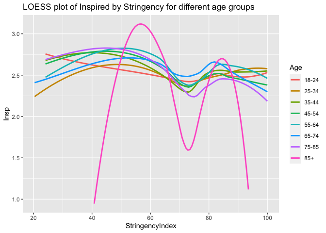<!-- -->
GAM
plot

``` r
plot_insp + stat_smooth(aes(group=age), se = FALSE, method = "gam", formula = y ~ x, size = 1, na.rm=TRUE) + scale_colour_discrete(name = "Age", 
labels = c("18-24", "25-34", "35-44", "45-54", "55-64", "65-74", "75-85", "85+")) + labs(title="GAM plot of Inspired by Stringency for different age groups", y ="Insp")
```

<!-- -->

LOESS plot inspired and date for different age
groups

``` r
plot_insp2 <- ggplot(data = data_long_min3_strc, aes(x = Date, y = Insp, group = ID, color = age))

plot_insp2 + stat_smooth(aes(group=age), se = FALSE, method = "loess", formula = y ~ x, size = 1, na.rm=TRUE) + scale_colour_discrete(name = "Age", 
labels = c("18-24", "25-34", "35-44", "45-54", "55-64", "65-74", "75-85", "85+")) + labs(title="LOESS plot of Inspired by Date for different age groups", y ="Insp")
```

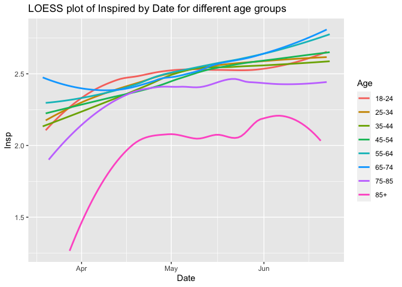<!-- -->
GAM
plot

``` r
plot_insp2 + stat_smooth(aes(group=age), se = FALSE, method = "gam", formula = y ~ x, size = 1, na.rm=TRUE) + scale_colour_discrete(name = "Age", 
labels = c("18-24", "25-34", "35-44", "45-54", "55-64", "65-74", "75-85", "85+")) + labs(title="GAM plot of Inspired by Date for different age groups", y ="Insp")
```

<!-- -->

# Loved

Multilevel random
intercept

``` r
model.lov0 <- lmer(Lov ~ 1 + (1 | Country/ID), data=data_long_min3_strc, na.action=na.exclude)
summary(model.lov0)
```

    ## Linear mixed model fit by REML. t-tests use Satterthwaite's method [
    ## lmerModLmerTest]
    ## Formula: Lov ~ 1 + (1 | Country/ID)
    ##    Data: data_long_min3_strc
    ## 
    ## REML criterion at convergence: 75204.5
    ## 
    ## Scaled residuals: 
    ##     Min      1Q  Median      3Q     Max 
    ## -5.5509 -0.4659  0.0695  0.4629  4.5269 
    ## 
    ## Random effects:
    ##  Groups     Name        Variance Std.Dev.
    ##  ID:Country (Intercept) 0.89749  0.9474  
    ##  Country    (Intercept) 0.05943  0.2438  
    ##  Residual               0.34943  0.5911  
    ## Number of obs: 30762, groups:  ID:Country, 9175; Country, 58
    ## 
    ## Fixed effects:
    ##             Estimate Std. Error       df t value Pr(>|t|)    
    ## (Intercept)  3.33835    0.04172 42.81655   80.02   <2e-16 ***
    ## ---
    ## Signif. codes:  0 '***' 0.001 '**' 0.01 '*' 0.05 '.' 0.1 ' ' 1

Using two level models Predicted by
stringency

``` r
model.lov1 <- lmer(Lov ~ StringencyIndex + (1 | ID), data=data_long_min3_strc, na.action=na.exclude)
summary(model.lov1)
```

    ## Linear mixed model fit by REML. t-tests use Satterthwaite's method [
    ## lmerModLmerTest]
    ## Formula: Lov ~ StringencyIndex + (1 | ID)
    ##    Data: data_long_min3_strc
    ## 
    ## REML criterion at convergence: 75491.5
    ## 
    ## Scaled residuals: 
    ##     Min      1Q  Median      3Q     Max 
    ## -5.5502 -0.4526  0.0845  0.4350  4.4977 
    ## 
    ## Random effects:
    ##  Groups   Name        Variance Std.Dev.
    ##  ID       (Intercept) 0.9445   0.9718  
    ##  Residual             0.3492   0.5909  
    ## Number of obs: 30745, groups:  ID, 9169
    ## 
    ## Fixed effects:
    ##                   Estimate Std. Error         df t value Pr(>|t|)    
    ## (Intercept)      3.476e+00  4.987e-02  3.072e+04  69.705   <2e-16 ***
    ## StringencyIndex -9.123e-04  6.177e-04  3.041e+04  -1.477     0.14    
    ## ---
    ## Signif. codes:  0 '***' 0.001 '**' 0.01 '*' 0.05 '.' 0.1 ' ' 1
    ## 
    ## Correlation of Fixed Effects:
    ##             (Intr)
    ## StrngncyInd -0.976

``` r
model.lov2 <- lmer(Lov ~ StringencyIndex + age + (1 | ID), data=data_long_min3_strc, na.action=na.exclude)
summary(model.lov2)
```

    ## Linear mixed model fit by REML. t-tests use Satterthwaite's method [
    ## lmerModLmerTest]
    ## Formula: Lov ~ StringencyIndex + age + (1 | ID)
    ##    Data: data_long_min3_strc
    ## 
    ## REML criterion at convergence: 75505.1
    ## 
    ## Scaled residuals: 
    ##     Min      1Q  Median      3Q     Max 
    ## -5.5530 -0.4521  0.0813  0.4399  4.4938 
    ## 
    ## Random effects:
    ##  Groups   Name        Variance Std.Dev.
    ##  ID       (Intercept) 0.9435   0.9713  
    ##  Residual             0.3492   0.5909  
    ## Number of obs: 30745, groups:  ID, 9169
    ## 
    ## Fixed effects:
    ##                   Estimate Std. Error         df t value Pr(>|t|)    
    ## (Intercept)      3.456e+00  5.847e-02  2.810e+04  59.114   <2e-16 ***
    ## StringencyIndex -8.782e-04  6.192e-04  3.034e+04  -1.418   0.1562    
    ## age2             2.514e-02  3.820e-02  9.134e+03   0.658   0.5105    
    ## age3             4.927e-02  3.879e-02  9.152e+03   1.270   0.2041    
    ## age4             4.002e-02  3.907e-02  9.152e+03   1.024   0.3058    
    ## age5            -4.047e-02  3.962e-02  9.133e+03  -1.021   0.3071    
    ## age6            -1.299e-02  4.258e-02  9.157e+03  -0.305   0.7602    
    ## age7             2.159e-01  8.530e-02  9.010e+03   2.531   0.0114 *  
    ## age8             2.270e-01  3.269e-01  9.050e+03   0.695   0.4873    
    ## ---
    ## Signif. codes:  0 '***' 0.001 '**' 0.01 '*' 0.05 '.' 0.1 ' ' 1
    ## 
    ## Correlation of Fixed Effects:
    ##             (Intr) StrngI age2   age3   age4   age5   age6   age7  
    ## StrngncyInd -0.864                                                 
    ## age2        -0.419  0.035                                          
    ## age3        -0.425  0.049  0.588                                   
    ## age4        -0.424  0.051  0.583  0.575                            
    ## age5        -0.418  0.051  0.575  0.567  0.563                     
    ## age6        -0.402  0.062  0.536  0.529  0.525  0.518              
    ## age7        -0.208  0.040  0.268  0.264  0.262  0.259  0.242       
    ## age8        -0.059  0.016  0.070  0.069  0.069  0.068  0.063  0.032

``` r
model.lov3 <- lmer(Lov ~ StringencyIndex + age + StringencyIndex*age + (1 | ID), data=data_long_min3_strc, na.action=na.exclude)
print(summary(model.lov3), digits=2)
```

    ## Linear mixed model fit by REML. t-tests use Satterthwaite's method [
    ## lmerModLmerTest]
    ## Formula: Lov ~ StringencyIndex + age + StringencyIndex * age + (1 | ID)
    ##    Data: data_long_min3_strc
    ## 
    ## REML criterion at convergence: 75563.8
    ## 
    ## Scaled residuals: 
    ##    Min     1Q Median     3Q    Max 
    ##  -5.55  -0.45   0.08   0.44   4.48 
    ## 
    ## Random effects:
    ##  Groups   Name        Variance Std.Dev.
    ##  ID       (Intercept) 0.94     0.97    
    ##  Residual             0.35     0.59    
    ## Number of obs: 30745, groups:  ID, 9169
    ## 
    ## Fixed effects:
    ##                      Estimate Std. Error       df t value Pr(>|t|)    
    ## (Intercept)           3.7e+00    1.3e-01  3.1e+04    28.7   <2e-16 ***
    ## StringencyIndex      -4.3e-03    1.6e-03  3.0e+04    -2.8    0.006 ** 
    ## age2                 -3.2e-01    1.7e-01  3.1e+04    -1.8    0.068 .  
    ## age3                 -3.5e-01    1.8e-01  3.1e+04    -2.0    0.050 *  
    ## age4                 -3.4e-01    1.8e-01  3.1e+04    -1.9    0.055 .  
    ## age5                 -4.5e-01    1.8e-01  3.1e+04    -2.5    0.012 *  
    ## age6                 -1.1e-01    1.9e-01  3.1e+04    -0.6    0.544    
    ## age7                  3.8e-02    4.2e-01  3.1e+04     0.1    0.928    
    ## age8                  1.8e-01    1.3e+00  3.0e+04     0.1    0.890    
    ## StringencyIndex:age2  4.2e-03    2.1e-03  3.1e+04     2.0    0.045 *  
    ## StringencyIndex:age3  5.0e-03    2.2e-03  3.1e+04     2.3    0.023 *  
    ## StringencyIndex:age4  4.7e-03    2.2e-03  3.0e+04     2.2    0.029 *  
    ## StringencyIndex:age5  5.0e-03    2.2e-03  3.0e+04     2.3    0.020 *  
    ## StringencyIndex:age6  1.1e-03    2.3e-03  3.0e+04     0.5    0.629    
    ## StringencyIndex:age7  2.1e-03    5.4e-03  3.0e+04     0.4    0.697    
    ## StringencyIndex:age8  2.4e-04    1.7e-02  3.1e+04     0.0    0.989    
    ## ---
    ## Signif. codes:  0 '***' 0.001 '**' 0.01 '*' 0.05 '.' 0.1 ' ' 1

    ## 
    ## Correlation matrix not shown by default, as p = 16 > 12.
    ## Use print(summary(model.lov3), correlation=TRUE)  or
    ##     vcov(summary(model.lov3))        if you need it

LOESS plot loved and stringency for different age
groups

``` r
plot_lov <- ggplot(data = data_long_min3_strc, aes(x = StringencyIndex, y = Lov, group = ID, color = age))

plot_lov + stat_smooth(aes(group=age), se = FALSE, method = "loess", formula = y ~ x, size = 1, na.rm=TRUE) + scale_colour_discrete(name = "Age", 
labels = c("18-24", "25-34", "35-44", "45-54", "55-64", "65-74", "75-85", "85+")) + labs(title="LOESS plot of Loved by Stringency for different age groups", y ="Lov")
```

<!-- -->
GAM
plot

``` r
plot_lov + stat_smooth(aes(group=age), se = FALSE, method = "gam", formula = y ~ x, size = 1, na.rm=TRUE) + scale_colour_discrete(name = "Age", 
labels = c("18-24", "25-34", "35-44", "45-54", "55-64", "65-74", "75-85", "85+")) + labs(title="GAM plot of Inspired by Stringency for different age groups", y ="Lov")
```

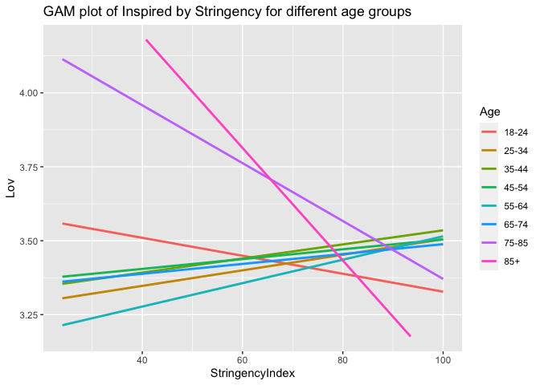<!-- -->

LOESS plot loved and date for different age
groups

``` r
plot_lov2 <- ggplot(data = data_long_min3_strc, aes(x = Date, y = Lov, group = ID, color = age))

plot_lov2 + stat_smooth(aes(group=age), se = FALSE, method = "loess", formula = y ~ x, size = 1, na.rm=TRUE) + scale_colour_discrete(name = "Age", 
labels = c("18-24", "25-34", "35-44", "45-54", "55-64", "65-74", "75-85", "85+")) + labs(title="LOESS plot of Loved by Date for different age groups", y ="Lov")
```

<!-- -->
GAM
plot

``` r
plot_lov2 + stat_smooth(aes(group=age), se = FALSE, method = "gam", formula = y ~ x, size = 1, na.rm=TRUE) + scale_colour_discrete(name = "Age", 
labels = c("18-24", "25-34", "35-44", "45-54", "55-64", "65-74", "75-85", "85+")) + labs(title="GAM plot of Inspired by Date for different age groups", y ="Lov")
```

<!-- -->

# Nervous

Multilevel random
intercept

``` r
model.nerv0 <- lmer(Nerv ~ 1 + (1 | Country/ID), data=data_long_min3_strc, na.action=na.exclude)
summary(model.nerv0)
```

    ## Linear mixed model fit by REML. t-tests use Satterthwaite's method [
    ## lmerModLmerTest]
    ## Formula: Nerv ~ 1 + (1 | Country/ID)
    ##    Data: data_long_min3_strc
    ## 
    ## REML criterion at convergence: 108867.8
    ## 
    ## Scaled residuals: 
    ##     Min      1Q  Median      3Q     Max 
    ## -3.5963 -0.5597 -0.1472  0.5669  4.2562 
    ## 
    ## Random effects:
    ##  Groups     Name        Variance Std.Dev.
    ##  ID:Country (Intercept) 0.7211   0.8492  
    ##  Country    (Intercept) 0.0474   0.2177  
    ##  Residual               0.5913   0.7690  
    ## Number of obs: 39876, groups:  ID:Country, 9175; Country, 58
    ## 
    ## Fixed effects:
    ##             Estimate Std. Error       df t value Pr(>|t|)    
    ## (Intercept)  2.37177    0.03757 48.12830   63.14   <2e-16 ***
    ## ---
    ## Signif. codes:  0 '***' 0.001 '**' 0.01 '*' 0.05 '.' 0.1 ' ' 1

Using two level models Predicted by
stringency

``` r
model.nerv1 <- lmer(Nerv ~ StringencyIndex + (1 | ID), data=data_long_min3_strc, na.action=na.exclude)
summary(model.nerv1)
```

    ## Linear mixed model fit by REML. t-tests use Satterthwaite's method [
    ## lmerModLmerTest]
    ## Formula: Nerv ~ StringencyIndex + (1 | ID)
    ##    Data: data_long_min3_strc
    ## 
    ## REML criterion at convergence: 109218.9
    ## 
    ## Scaled residuals: 
    ##     Min      1Q  Median      3Q     Max 
    ## -3.6111 -0.5528 -0.1536  0.5660  4.1922 
    ## 
    ## Random effects:
    ##  Groups   Name        Variance Std.Dev.
    ##  ID       (Intercept) 0.7675   0.8761  
    ##  Residual             0.5914   0.7690  
    ## Number of obs: 39854, groups:  ID, 9169
    ## 
    ## Fixed effects:
    ##                  Estimate Std. Error        df t value Pr(>|t|)    
    ## (Intercept)     2.291e+00  5.011e-02 3.773e+04  45.709   <2e-16 ***
    ## StringencyIndex 5.151e-04  6.222e-04 3.873e+04   0.828    0.408    
    ## ---
    ## Signif. codes:  0 '***' 0.001 '**' 0.01 '*' 0.05 '.' 0.1 ' ' 1
    ## 
    ## Correlation of Fixed Effects:
    ##             (Intr)
    ## StrngncyInd -0.980

``` r
model.nerv2 <- lmer(Nerv ~ StringencyIndex + age + (1 | ID), data=data_long_min3_strc, na.action=na.exclude)
summary(model.nerv2)
```

    ## Linear mixed model fit by REML. t-tests use Satterthwaite's method [
    ## lmerModLmerTest]
    ## Formula: Nerv ~ StringencyIndex + age + (1 | ID)
    ##    Data: data_long_min3_strc
    ## 
    ## REML criterion at convergence: 108351.2
    ## 
    ## Scaled residuals: 
    ##     Min      1Q  Median      3Q     Max 
    ## -3.5506 -0.5626 -0.1471  0.5738  4.2179 
    ## 
    ## Random effects:
    ##  Groups   Name        Variance Std.Dev.
    ##  ID       (Intercept) 0.6835   0.8268  
    ##  Residual             0.5912   0.7689  
    ## Number of obs: 39854, groups:  ID, 9169
    ## 
    ## Fixed effects:
    ##                   Estimate Std. Error         df t value Pr(>|t|)    
    ## (Intercept)      2.698e+00  5.641e-02  3.041e+04  47.824  < 2e-16 ***
    ## StringencyIndex -2.794e-04  6.145e-04  3.815e+04  -0.455 0.649305    
    ## age2            -9.142e-02  3.376e-02  9.125e+03  -2.708 0.006788 ** 
    ## age3            -2.006e-01  3.428e-02  9.144e+03  -5.852 5.02e-09 ***
    ## age4            -3.759e-01  3.453e-02  9.142e+03 -10.886  < 2e-16 ***
    ## age5            -5.702e-01  3.501e-02  9.119e+03 -16.286  < 2e-16 ***
    ## age6            -8.845e-01  3.764e-02  9.160e+03 -23.503  < 2e-16 ***
    ## age7            -1.010e+00  7.544e-02  9.022e+03 -13.390  < 2e-16 ***
    ## age8            -1.111e+00  2.889e-01  9.060e+03  -3.844 0.000122 ***
    ## ---
    ## Signif. codes:  0 '***' 0.001 '**' 0.01 '*' 0.05 '.' 0.1 ' ' 1
    ## 
    ## Correlation of Fixed Effects:
    ##             (Intr) StrngI age2   age3   age4   age5   age6   age7  
    ## StrngncyInd -0.887                                                 
    ## age2        -0.393  0.042                                          
    ## age3        -0.398  0.054  0.588                                   
    ## age4        -0.395  0.054  0.583  0.575                            
    ## age5        -0.386  0.048  0.575  0.567  0.563                     
    ## age6        -0.371  0.058  0.536  0.528  0.525  0.517              
    ## age7        -0.194  0.040  0.268  0.264  0.262  0.258  0.241       
    ## age8        -0.057  0.018  0.070  0.069  0.069  0.068  0.063  0.032

``` r
model.nerv3 <- lmer(Nerv ~ StringencyIndex + age + StringencyIndex*age + (1 | ID), data=data_long_min3_strc, na.action=na.exclude)
print(summary(model.nerv3), digits=2)
```

    ## Linear mixed model fit by REML. t-tests use Satterthwaite's method [
    ## lmerModLmerTest]
    ## Formula: Nerv ~ StringencyIndex + age + StringencyIndex * age + (1 | ID)
    ##    Data: data_long_min3_strc
    ## 
    ## REML criterion at convergence: 108402.8
    ## 
    ## Scaled residuals: 
    ##    Min     1Q Median     3Q    Max 
    ##  -3.57  -0.56  -0.14   0.57   4.21 
    ## 
    ## Random effects:
    ##  Groups   Name        Variance Std.Dev.
    ##  ID       (Intercept) 0.68     0.83    
    ##  Residual             0.59     0.77    
    ## Number of obs: 39854, groups:  ID, 9169
    ## 
    ## Fixed effects:
    ##                      Estimate Std. Error       df t value Pr(>|t|)    
    ## (Intercept)           2.6e+00    1.3e-01  3.7e+04    20.8   <2e-16 ***
    ## StringencyIndex       7.9e-04    1.5e-03  3.8e+04     0.5     0.60    
    ## age2                  1.3e-01    1.7e-01  3.6e+04     0.8     0.43    
    ## age3                  2.0e-01    1.7e-01  3.7e+04     1.1     0.26    
    ## age4                 -3.0e-01    1.7e-01  3.8e+04    -1.8     0.08 .  
    ## age5                 -6.8e-01    1.8e-01  3.7e+04    -3.8    1e-04 ***
    ## age6                 -1.1e+00    1.9e-01  3.7e+04    -5.8    6e-09 ***
    ## age7                 -5.5e-01    4.5e-01  3.6e+04    -1.2     0.22    
    ## age8                 -9.9e-01    1.4e+00  2.8e+04    -0.7     0.49    
    ## StringencyIndex:age2 -2.8e-03    2.0e-03  3.7e+04    -1.4     0.17    
    ## StringencyIndex:age3 -5.0e-03    2.1e-03  3.8e+04    -2.3     0.02 *  
    ## StringencyIndex:age4 -8.8e-04    2.1e-03  3.9e+04    -0.4     0.68    
    ## StringencyIndex:age5  1.4e-03    2.2e-03  3.8e+04     0.6     0.52    
    ## StringencyIndex:age6  2.7e-03    2.3e-03  3.8e+04     1.2     0.24    
    ## StringencyIndex:age7 -6.0e-03    5.7e-03  3.7e+04    -1.0     0.29    
    ## StringencyIndex:age8 -1.5e-03    1.9e-02  3.0e+04    -0.1     0.94    
    ## ---
    ## Signif. codes:  0 '***' 0.001 '**' 0.01 '*' 0.05 '.' 0.1 ' ' 1

    ## 
    ## Correlation matrix not shown by default, as p = 16 > 12.
    ## Use print(summary(model.nerv3), correlation=TRUE)  or
    ##     vcov(summary(model.nerv3))        if you need it

LOESS plot nervous and stringency for different age
groups

``` r
plot_nerv <- ggplot(data = data_long_min3_strc, aes(x = StringencyIndex, y = Nerv, group = ID, color = age))

plot_nerv + stat_smooth(aes(group=age), se = FALSE, method = "loess", formula = y ~ x, size = 1, na.rm=TRUE) + scale_colour_discrete(name = "Age", 
labels = c("18-24", "25-34", "35-44", "45-54", "55-64", "65-74", "75-85", "85+")) + labs(title="LOESS plot of Nervousness by Stringency for different age groups", y ="Nerv")
```

<!-- -->
GAM
plot

``` r
plot_nerv + stat_smooth(aes(group=age), se = FALSE, method = "gam", formula = y ~ x, size = 1, na.rm=TRUE) + scale_colour_discrete(name = "Age", 
labels = c("18-24", "25-34", "35-44", "45-54", "55-64", "65-74", "75-85", "85+")) + labs(title="GAM plot of Nervousness by Stringency for different age groups", y ="Nerv")
```

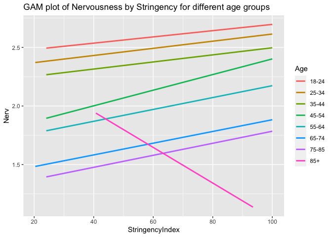<!-- -->

LOESS plot nervous and date for different age
groups

``` r
plot_nerv2 <- ggplot(data = data_long_min3_strc, aes(x = Date, y = Nerv, group = ID, color = age))

plot_nerv2 + stat_smooth(aes(group=age), se = FALSE, method = "loess", formula = y ~ x, size = 1, na.rm=TRUE) + scale_colour_discrete(name = "Age", 
labels = c("18-24", "25-34", "35-44", "45-54", "55-64", "65-74", "75-85", "85+")) + labs(title="LOESS plot of Nervousness by Date for different age groups", y ="Nerv")
```

<!-- -->
GAM
plot

``` r
plot_nerv2 + stat_smooth(aes(group=age), se = FALSE, method = "gam", formula = y ~ x, size = 1, na.rm=TRUE) + scale_colour_discrete(name = "Age", 
labels = c("18-24", "25-34", "35-44", "45-54", "55-64", "65-74", "75-85", "85+")) + labs(title="GAM plot of Nervousness by Date for different age groups", y ="Nerv")
```

<!-- -->

# Relaxed

Multilevel random
intercept

``` r
model.rel0 <- lmer(Rel ~ 1 + (1 | Country/ID), data=data_long_min3_strc, na.action=na.exclude)
summary(model.rel0)
```

    ## Linear mixed model fit by REML. t-tests use Satterthwaite's method [
    ## lmerModLmerTest]
    ## Formula: Rel ~ 1 + (1 | Country/ID)
    ##    Data: data_long_min3_strc
    ## 
    ## REML criterion at convergence: 104811.1
    ## 
    ## Scaled residuals: 
    ##     Min      1Q  Median      3Q     Max 
    ## -4.4249 -0.5749  0.0587  0.6028  4.0443 
    ## 
    ## Random effects:
    ##  Groups     Name        Variance Std.Dev.
    ##  ID:Country (Intercept) 0.58535  0.7651  
    ##  Country    (Intercept) 0.04951  0.2225  
    ##  Residual               0.54746  0.7399  
    ## Number of obs: 39875, groups:  ID:Country, 9177; Country, 58
    ## 
    ## Fixed effects:
    ##             Estimate Std. Error       df t value Pr(>|t|)    
    ## (Intercept)  2.85320    0.03738 47.37938   76.33   <2e-16 ***
    ## ---
    ## Signif. codes:  0 '***' 0.001 '**' 0.01 '*' 0.05 '.' 0.1 ' ' 1

Using two level models Predicted by
stringency

``` r
model.rel1 <- lmer(Rel ~ StringencyIndex + (1 | ID), data=data_long_min3_strc, na.action=na.exclude)
summary(model.rel1)
```

    ## Linear mixed model fit by REML. t-tests use Satterthwaite's method [
    ## lmerModLmerTest]
    ## Formula: Rel ~ StringencyIndex + (1 | ID)
    ##    Data: data_long_min3_strc
    ## 
    ## REML criterion at convergence: 105245.2
    ## 
    ## Scaled residuals: 
    ##     Min      1Q  Median      3Q     Max 
    ## -4.4046 -0.5974  0.0436  0.5924  4.1151 
    ## 
    ## Random effects:
    ##  Groups   Name        Variance Std.Dev.
    ##  ID       (Intercept) 0.6327   0.7954  
    ##  Residual             0.5472   0.7397  
    ## Number of obs: 39853, groups:  ID, 9171
    ## 
    ## Fixed effects:
    ##                  Estimate Std. Error        df t value Pr(>|t|)    
    ## (Intercept)     2.760e+00  4.742e-02 3.697e+04  58.193   <2e-16 ***
    ## StringencyIndex 1.115e-03  5.896e-04 3.804e+04   1.891   0.0587 .  
    ## ---
    ## Signif. codes:  0 '***' 0.001 '**' 0.01 '*' 0.05 '.' 0.1 ' ' 1
    ## 
    ## Correlation of Fixed Effects:
    ##             (Intr)
    ## StrngncyInd -0.981

``` r
model.rel2 <- lmer(Rel ~ StringencyIndex + age + (1 | ID), data=data_long_min3_strc, na.action=na.exclude)
summary(model.rel2)
```

    ## Linear mixed model fit by REML. t-tests use Satterthwaite's method [
    ## lmerModLmerTest]
    ## Formula: Rel ~ StringencyIndex + age + (1 | ID)
    ##    Data: data_long_min3_strc
    ## 
    ## REML criterion at convergence: 105095
    ## 
    ## Scaled residuals: 
    ##     Min      1Q  Median      3Q     Max 
    ## -4.4103 -0.5825  0.0506  0.5973  4.1293 
    ## 
    ## Random effects:
    ##  Groups   Name        Variance Std.Dev.
    ##  ID       (Intercept) 0.6182   0.7863  
    ##  Residual             0.5472   0.7397  
    ## Number of obs: 39853, groups:  ID, 9171
    ## 
    ## Fixed effects:
    ##                   Estimate Std. Error         df t value Pr(>|t|)    
    ## (Intercept)      2.832e+00  5.403e-02  3.032e+04  52.413  < 2e-16 ***
    ## StringencyIndex  1.152e-03  5.893e-04  3.801e+04   1.955 0.050533 .  
    ## age2            -1.658e-01  3.217e-02  9.143e+03  -5.153 2.62e-07 ***
    ## age3            -1.997e-01  3.267e-02  9.162e+03  -6.112 1.02e-09 ***
    ## age4            -1.275e-01  3.291e-02  9.162e+03  -3.874 0.000108 ***
    ## age5            -5.232e-02  3.336e-02  9.138e+03  -1.569 0.116792    
    ## age6             1.681e-01  3.585e-02  9.176e+03   4.689 2.79e-06 ***
    ## age7             2.415e-01  7.187e-02  9.033e+03   3.360 0.000783 ***
    ## age8             2.830e-01  2.753e-01  9.078e+03   1.028 0.304114    
    ## ---
    ## Signif. codes:  0 '***' 0.001 '**' 0.01 '*' 0.05 '.' 0.1 ' ' 1
    ## 
    ## Correlation of Fixed Effects:
    ##             (Intr) StrngI age2   age3   age4   age5   age6   age7  
    ## StrngncyInd -0.888                                                 
    ## age2        -0.391  0.042                                          
    ## age3        -0.397  0.055  0.588                                   
    ## age4        -0.394  0.054  0.583  0.575                            
    ## age5        -0.384  0.048  0.575  0.567  0.563                     
    ## age6        -0.370  0.058  0.536  0.529  0.525  0.517              
    ## age7        -0.194  0.040  0.268  0.264  0.262  0.259  0.241       
    ## age8        -0.057  0.018  0.070  0.069  0.069  0.068  0.063  0.032

``` r
model.rel3 <- lmer(Rel ~ StringencyIndex + age + StringencyIndex*age + (1 | ID), data=data_long_min3_strc, na.action=na.exclude)
print(summary(model.rel3), digits=2)
```

    ## Linear mixed model fit by REML. t-tests use Satterthwaite's method [
    ## lmerModLmerTest]
    ## Formula: Rel ~ StringencyIndex + age + StringencyIndex * age + (1 | ID)
    ##    Data: data_long_min3_strc
    ## 
    ## REML criterion at convergence: 105142.2
    ## 
    ## Scaled residuals: 
    ##    Min     1Q Median     3Q    Max 
    ##  -4.42  -0.58   0.05   0.60   4.13 
    ## 
    ## Random effects:
    ##  Groups   Name        Variance Std.Dev.
    ##  ID       (Intercept) 0.62     0.79    
    ##  Residual             0.55     0.74    
    ## Number of obs: 39853, groups:  ID, 9171
    ## 
    ## Fixed effects:
    ##                      Estimate Std. Error       df t value Pr(>|t|)    
    ## (Intercept)           2.6e+00    1.2e-01  3.7e+04    21.9   <2e-16 ***
    ## StringencyIndex       3.6e-03    1.4e-03  3.8e+04     2.5    0.011 *  
    ## age2                 -2.1e-02    1.6e-01  3.6e+04    -0.1    0.897    
    ## age3                 -2.9e-01    1.7e-01  3.7e+04    -1.7    0.081 .  
    ## age4                  2.2e-01    1.7e-01  3.8e+04     1.3    0.188    
    ## age5                  2.6e-01    1.7e-01  3.7e+04     1.6    0.119    
    ## age6                  7.3e-01    1.8e-01  3.7e+04     4.1    5e-05 ***
    ## age7                  1.0e+00    4.3e-01  3.6e+04     2.3    0.020 *  
    ## age8                  2.2e-01    1.4e+00  2.8e+04     0.2    0.874    
    ## StringencyIndex:age2 -1.8e-03    1.9e-03  3.7e+04    -0.9    0.361    
    ## StringencyIndex:age3  1.3e-03    2.1e-03  3.8e+04     0.6    0.534    
    ## StringencyIndex:age4 -4.3e-03    2.0e-03  3.9e+04    -2.1    0.034 *  
    ## StringencyIndex:age5 -3.9e-03    2.1e-03  3.8e+04    -1.9    0.058 .  
    ## StringencyIndex:age6 -7.1e-03    2.2e-03  3.8e+04    -3.2    0.001 ** 
    ## StringencyIndex:age7 -9.8e-03    5.5e-03  3.7e+04    -1.8    0.075 .  
    ## StringencyIndex:age8  1.2e-03    1.8e-02  2.9e+04     0.1    0.948    
    ## ---
    ## Signif. codes:  0 '***' 0.001 '**' 0.01 '*' 0.05 '.' 0.1 ' ' 1

    ## 
    ## Correlation matrix not shown by default, as p = 16 > 12.
    ## Use print(summary(model.rel3), correlation=TRUE)  or
    ##     vcov(summary(model.rel3))        if you need it

LOESS plot relaxed and stringency for different age
groups

``` r
plot_rel <- ggplot(data = data_long_min3_strc, aes(x = StringencyIndex, y = Rel, group = ID, color = age))

plot_rel + stat_smooth(aes(group=age), se = FALSE, method = "loess", formula = y ~ x, size = 1, na.rm=TRUE) + scale_colour_discrete(name = "Age", 
labels = c("18-24", "25-34", "35-44", "45-54", "55-64", "65-74", "75-85", "85+")) + labs(title="LOESS plot of Relaxed by Stringency for different age groups", y ="Rel")
```

<!-- -->
GAM
plot

``` r
plot_rel + stat_smooth(aes(group=age), se = FALSE, method = "gam", formula = y ~ x, size = 1, na.rm=TRUE) + scale_colour_discrete(name = "Age", 
labels = c("18-24", "25-34", "35-44", "45-54", "55-64", "65-74", "75-85", "85+")) + labs(title="GAM plot of Relaxed by Stringency for different age groups", y ="Rel")
```

<!-- -->

LOESS plot relaxed and date for different age
groups

``` r
plot_rel2 <- ggplot(data = data_long_min3_strc, aes(x = Date, y = Rel, group = ID, color = age))

plot_rel2 + stat_smooth(aes(group=age), se = FALSE, method = "loess", formula = y ~ x, size = 1, na.rm=TRUE) + scale_colour_discrete(name = "Age", 
labels = c("18-24", "25-34", "35-44", "45-54", "55-64", "65-74", "75-85", "85+")) + labs(title="LOESS plot of Relaxed by Date for different age groups", y ="Rel")
```

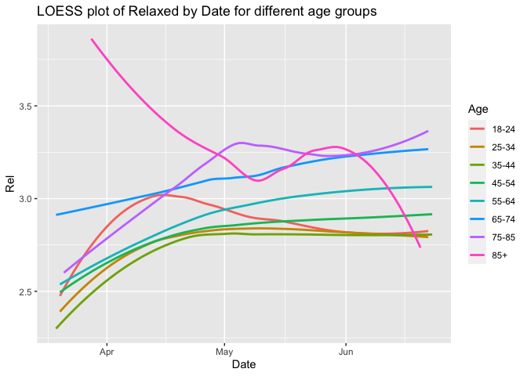<!-- -->
GAM
plot

``` r
plot_rel2 + stat_smooth(aes(group=age), se = FALSE, method = "gam", formula = y ~ x, size = 1, na.rm=TRUE) + scale_colour_discrete(name = "Age", 
labels = c("18-24", "25-34", "35-44", "45-54", "55-64", "65-74", "75-85", "85+")) + labs(title="GAM plot of Relaxed by Date for different age groups", y ="Rel")
```

<!-- -->
